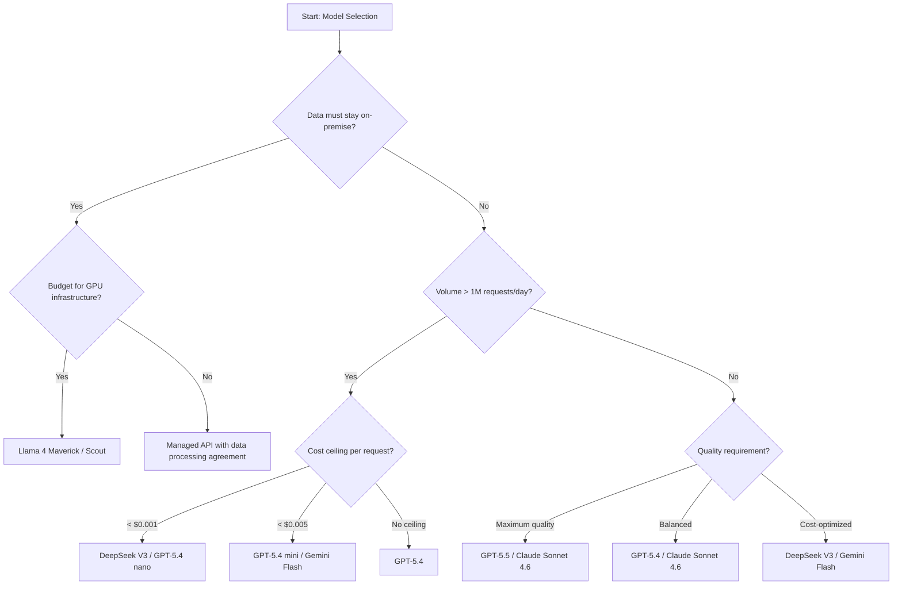
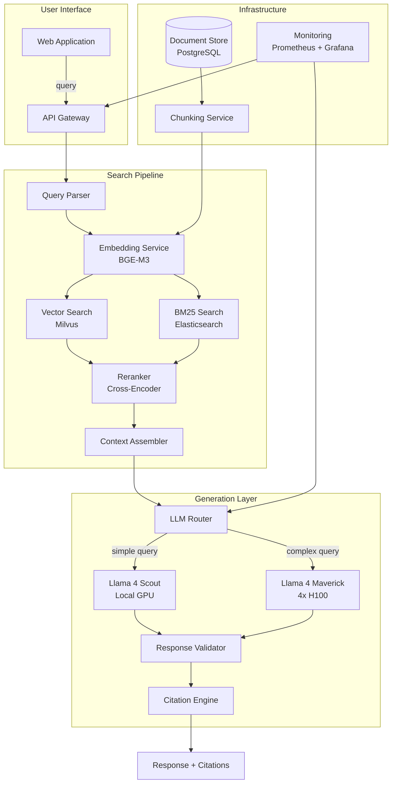

# Chapter 1: Generative AI Foundations

> "The goal is not to master every model, but to understand the landscape well enough that every architectural decision is grounded in constraints, not defaults."

---

Last verified: June 2026. Model names, pricing, and context windows change frequently. Verify current details at provider websites before making architectural decisions.

Before you can architect GenAI systems, you need a shared vocabulary and a map of the landscape. Every term in this chapter has architectural implications. Parameters affect cost. Context windows affect architecture. Training approaches affect latency and accuracy. This chapter gives you the conceptual framework to reason about those trade-offs.

The central thesis of this chapter is that **model selection is an architectural decision, not a benchmark chase**. The model with the highest MMLU score is not necessarily the model that meets your latency, cost, sovereignty, and compliance constraints. An architect who defaults to the most powerful model wastes money. An architect who defaults to the cheapest model risks quality. The discipline is in matching model capabilities to system constraints.

---

## 1.1 The Evolution of AI

Understanding where AI came from reveals why modern GenAI works the way it does — and where its limitations come from. Each era of AI introduced capabilities that GenAI builds upon, and each era introduced constraints that persist today.

### 1.1.1 Symbolic AI and Expert Systems

**Symbolic AI** operated on explicit rules and logical representations. Systems like MYCIN for medical diagnosis used hand-coded knowledge bases with approximately 600 rules. These systems were interpretable and verifiable — you could trace every decision through the rule chain. But they were brittle. They could not handle ambiguity, required constant maintenance, and scaled linearly with domain complexity. When someone proposes a "rules engine" for AI today, this is what they mean, and why it usually fails for complex domains.

**Expert systems** formalized symbolic AI into commercial products. The pattern was encoding expert knowledge as IF-THEN rules. The fundamental limit: when the knowledge base exceeds what humans can maintain, the system becomes unmanageable. A rules engine with 10,000 rules has approximately 50 million potential interaction paths. No human team can verify all of them. This is the limit that machine learning later overcame.

### 1.1.2 Machine Learning and Deep Learning

**Machine learning** replaced hand-coded rules with statistical learning from data. Decision trees, support vector machines, random forests, and gradient boosting all learned patterns from examples. The engineering surface area shifted from rule maintenance to data management — you now needed data pipelines, feature engineering, and model training infrastructure. The key insight: the quality of the model was bounded by the quality of the features humans designed.

**Deep learning** eliminated manual feature engineering. Convolutional networks for images learned spatial hierarchies automatically. Recurrent networks for sequences learned temporal patterns. The key breakthrough came in 2017 with the transformer architecture, which replaced recurrence with self-attention and enabled massive parallelization. This is the foundation of everything in this book.

### 1.1.3 Generative AI and Foundation Models

**Generative AI** refers to models that generate text, images, code, audio, and video. The fundamental shift was from classification to creation — models stopped just categorizing inputs and started producing novel outputs. This changes everything about how you build around them: you need output validation, content safety, and reliability patterns that discriminative systems never required.

**Foundation models** are large pre-trained models that serve as the base for downstream tasks. GPT-5.4, Claude Sonnet 4.6, Gemini 2.5 Pro, Llama 4 Maverick — these are foundation models. Their key characteristic is emergent capabilities: abilities that appear at certain model scales but were not explicitly trained for. An architect's concern is that foundation models are a platform, not a product. The engineering work is in the layers around the model.

**Agentic AI** refers to systems where models plan, reason, use tools, and take actions autonomously. Instead of a single prompt-response cycle, agents execute multi-step workflows. This is where the hardest engineering problems live — state management, workflow orchestration reliability, and observability.

### 1.1.4 The Capability Timeline

| Year | Milestone | Architectural Implication |
|------|-----------|--------------------------|
| 2017 | Transformer architecture | Parallelization enables large-scale training |
| 2018-2020 | GPT-2, GPT-3 | In-context learning eliminates fine-tuning for many tasks |
| 2022 | ChatGPT, Instruction-tuned models | Natural language interface becomes viable for products |
| 2023 | GPT-4, Claude 2, Gemini | Multimodal, long-context, tool calling |
| 2024 | GPT-4o, Claude 3.5, reasoning models | Real-time, structured output, chain-of-thought |
| 2025 | GPT-5, Claude 4, Gemini 2.5 | 1M+ context, native tool use, MoE cost optimization |
| 2026 | GPT-5.4, Claude Sonnet 4.6, Llama 4 | Frontier quality at commodity pricing, open-source parity |

---

## 1.2 Core Terminology

### 1.2.1 Parameters, Tokens, and Context Windows

Every language model is defined by three numbers that an architect must understand: parameter count, token vocabulary, and context window.

**Parameters** are the weights learned during training, measured in billions. A 70B parameter model has 70 billion floating-point numbers encoding its knowledge. Parameter count determines deployment requirements — a 7B model runs on a single consumer GPU, while a 70B model requires a multi-GPU server. But parameter count alone is misleading. MoE (Mixture of Experts) models like Llama 4 Maverick have 400B total parameters but only 17B active per token, meaning they deliver frontier quality at a fraction of the compute cost of a dense 400B model.

**Tokens** are the atomic units of text processing. An English word averages about 1.3 tokens. A code identifier averages one to two tokens. The critical architectural implication is that token costs vary by language and domain — a Japanese sentence that looks short may have three to five times more tokens than the English equivalent, dramatically increasing cost. Every token you include in a prompt costs money and consumes context window space.

**Context windows** are the maximum number of tokens a model can process in a single forward pass. This is one of the most important architectural constraints. As of mid-2026, one million tokens is standard for frontier models:

| Model | Context Window | Approximate Pages | Max Input Cost/1M Tokens |
|-------|---------------|-------------------|--------------------------|
| GPT-5.4 | 1M | 1,500 | $2.50 |
| Claude Sonnet 4.6 | 1M (beta) | 1,500 | $3.00 |
| Gemini 2.5 Pro | 1M | 1,500 | $1.25-$2.50 |
| Llama 4 Scout | 10M | 15,000 | Self-hosted |
| Llama 4 Maverick | 1M | 1,500 | Self-hosted |
| DeepSeek V3 | 128K | 200 | $0.27 |
| DeepSeek V4 | 1M | 1,500 | $0.14-$0.44 |

But larger windows are not free. Models suffer from the "lost in the middle" effect — they attend more to the beginning and end of context than to the middle. A model with a 1M token window may only effectively use 30 to 50 percent of that capacity. Design for the smallest window that meets your requirements.

### 1.2.2 Tokenization and Cost Implications

Tokenization splits text into subword units using algorithms like Byte Pair Encoding (BPE). The token count determines both cost and context consumption. The following table illustrates tokenization variation across languages and domains:

| Text Type | Character Count | Token Count | Tokens per Character |
|-----------|----------------|-------------|---------------------|
| English prose | 100 | ~75 | 0.75 |
| Japanese text | 100 | ~120 | 1.20 |
| Python code | 100 | ~55 | 0.55 |
| JSON data | 100 | ~60 | 0.60 |
| Mathematical notation | 100 | ~90 | 0.90 |

The architectural implication: a system processing Japanese text costs roughly 60 percent more per character than English. A system processing code costs about 25 percent less than prose. Budget accordingly when estimating costs.

```python
import tiktoken

def estimate_tokens(text: str, model: str = "gpt-4") -> int:
    """Estimate token count for text across different tokenizers."""
    enc = tiktoken.encoding_for_model(model)
    tokens = enc.encode(text)
    return len(tokens)

# English vs Japanese cost comparison
english_text = "The patient presents with chest pain and shortness of breath"
japanese_text = "患者は胸痛と息切れを訴えている"

en_tokens = estimate_tokens(english_text)  # ~14 tokens
jp_tokens = estimate_tokens(japanese_text)  # ~22 tokens

# At $2.50/1M input tokens (GPT-5.4):
# English: 14 × $2.50/1M = $0.000035
# Japanese: 22 × $2.50/1M = $0.000055 (57% more expensive)

def calculate_monthly_cost(
    requests_per_day: int,
    avg_tokens_per_request: int,
    price_per_1m_tokens: float,
) -> float:
    """Calculate monthly inference cost."""
    daily_tokens = requests_per_day * avg_tokens_per_request
    monthly_tokens = daily_tokens * 30
    cost = monthly_tokens * price_per_1m_tokens / 1_000_000
    return cost

# Example: Medical triage system
# 100K requests/day, 800 tokens/request, GPT-5.4 pricing
monthly = calculate_monthly_cost(100_000, 800, 2.50)
print(f"Monthly cost: ${monthly:,.2f}")  # $60,000
```

### 1.2.3 Training, Fine-Tuning, and RAG

**Training** happens at three levels: pre-training (learning language patterns from massive corpora), fine-tuning (adapting to specific tasks with labeled data), and alignment (RLHF or DPO to match human preferences). Fine-tuning is expensive and slow. Most GenAI applications use pre-trained models with prompt engineering and RAG instead.

**RAG** (Retrieval Augmented Generation) is the technique of retrieving relevant documents and including them in the prompt to ground model responses in factual data. RAG reduces hallucinations and keeps knowledge current without retraining. The trade-off is that retrieval quality is fragile — chunking, embedding model, search strategy, and reranking all affect accuracy.

**Fine-tuning versus RAG** is not an either-or decision. The choice depends on specific constraints:

| Criterion | RAG | Fine-Tuning |
|-----------|-----|-------------|
| Knowledge changes frequently | Yes | No (requires retraining) |
| Source citations required | Yes (retrieved documents) | No (knowledge baked in) |
| Training data limited | Yes (no training needed) | No (needs sufficient examples) |
| Consistent output format | No (depends on prompt) | Yes (trained on format) |
| Domain-specific reasoning | Limited | Yes (can learn patterns) |
| Cost at high volume | Higher (retrieval + inference) | Lower (shorter prompts) |
| Latency overhead | +50-200ms (retrieval) | None |
| Maintenance burden | Index updates | Retraining pipeline |

---

## 1.3 The GenAI Landscape

The current landscape as of June 2026. Prices and specifications change quarterly — always verify before making architectural decisions. The landscape is organized by provider, with pricing, capabilities, and architectural implications for each.

### 1.3.1 OpenAI

OpenAI offers the broadest ecosystem and the most mature API surface. Model selection within the OpenAI family is a cost-quality trade-off:

| Model | Input Cost/1M | Output Cost/1M | Context | Best For |
|-------|---------------|----------------|---------|----------|
| GPT-5.4 | $2.50 | $15.00 | 1M | General purpose, complex reasoning |
| GPT-5.4 mini | $0.75 | $4.50 | 1M | Cost-effective mid-tier |
| GPT-5.4 nano | $0.20 | $1.25 | 1M | High-volume, simple tasks |
| GPT-5.5 | $5.00 | $30.00 | 1M | Maximum quality, premium tier |

GPT-5.4 is the default choice for most applications. GPT-5.4 mini provides a 3x cost reduction with modest quality loss. GPT-5.4 nano is 12x cheaper than GPT-5.4 for tasks that do not require deep reasoning. GPT-5.5 is the premium tier for tasks where quality is paramount and cost is secondary.

All models support one million token context windows and structured outputs. The API surface is identical across the family — switching models is a single parameter change.

### 1.3.2 Anthropic

Anthropic's Claude models excel at coding, analysis, and structured output generation. Claude Sonnet 4.6 at $3.00 and $15.00 has the best JSON schema adherence in the industry. Prompt caching reduces cost by 90 percent for cached tokens, making it cost-effective for applications with long system prompts.

| Model | Input Cost/1M | Output Cost/1M | Context | Best For |
|-------|---------------|----------------|---------|----------|
| Claude Sonnet 4.6 | $3.00 | $15.00 | 1M | Coding, structured output, analysis |
| Claude Haiku 3.5 | $0.80 | $4.00 | 200K | Fast, cheap, simple tasks |

The key Anthropic differentiator is prompt caching. If your system prompt is 5,000 tokens and you make 10,000 requests per day, caching reduces the system prompt cost from $1.25/day to $0.125/day. This makes Anthropic cost-competitive with cheaper models for applications with long system prompts.

```python
# Prompt caching cost comparison
system_prompt_tokens = 5000
requests_per_day = 10000
price_per_1m = 3.00

# Without caching (every request includes full prompt)
daily_cost_no_cache = (system_prompt_tokens * requests_per_day * price_per_1m) / 1_000_000
print(f"Without caching: ${daily_cost_no_cache:.2f}/day")  # $150/day

# With caching (cached tokens at 10% price)
daily_cost_with_cache = (
    (system_prompt_tokens * 0.1 * price_per_1m / 1_000_000) +  # Cached portion
    (system_prompt_tokens * 0.9 * requests_per_day * price_per_1m / 1_000_000 * 0.1)  # Refresh
)
print(f"With caching: ${daily_cost_with_cache:.2f}/day")  # $15/day
# Savings: $135/day = $4,050/month
```

### 1.3.3 Google

Google's Gemini models offer competitive pricing with strong multi-modal capabilities. Pricing is tiered by context length, creating a cost incentive to keep prompts short.

| Model | Input Cost/1M (<128K) | Input Cost/1M (>128K) | Output Cost/1M | Context |
|-------|----------------------|----------------------|----------------|---------|
| Gemini 2.5 Pro | $1.25 | $2.50 | $10.00 | 1M |
| Gemini 2.5 Flash | $0.075 | $0.15 | $0.30 | 1M |

Gemini 2.5 Flash at $0.075 and $0.30 offers exceptional cost-to-performance ratio for high-volume applications. It is the cheapest frontier-class model available. The trade-off is that Flash has lower quality on complex reasoning tasks compared to Pro or GPT-5.4.

### 1.3.4 DeepSeek

DeepSeek delivers frontier quality at a fraction of the cost of Western providers. The cost advantage is dramatic — DeepSeek V3 costs roughly one-ninth of GPT-5.4 for equivalent quality on many benchmarks.

| Model | Input Cost/1M | Output Cost/1M | Context | Best For |
|-------|---------------|----------------|---------|----------|
| DeepSeek V3 | $0.27 | $1.10 | 128K | General purpose, cost optimization |
| DeepSeek R1 | $0.55 | $2.19 | 128K | Reasoning, math, code review |
| DeepSeek V4 | $0.14-$0.44 | $0.28-$0.87 | 1M | Long context, cost optimization |

DeepSeek R1 adds reasoning capabilities for complex tasks. The reasoning overhead increases cost and latency but improves accuracy on math, logic, and multi-step problems by 20 to 40 percent.

### 1.3.5 Open Source

Open source models solve data sovereignty and cost problems but add deployment complexity. The MoE architecture of Llama 4 makes self-hosting economically viable.

| Model | Total Params | Active Params | Context | Deployment |
|-------|-------------|---------------|---------|------------|
| Llama 4 Scout | 109B | 17B | 10M | 4x H100 GPUs |
| Llama 4 Maverick | 400B | 17B | 1M | 4x H100 GPUs |
| Qwen 3.5 | 72B | 72B | 1M | 2x A100 GPUs |
| Qwen 3.6 | 235B | 22B | 1M | 4x H100 GPUs |

The MoE architecture is the key enabler. Llama 4 Maverick has 400B total parameters but only 17B active per token. You get the quality of a 400B dense model at the compute cost of a 17B model. This makes self-hosting competitive with API pricing for high-volume workloads.

### 1.3.6 Provider Selection Flowchart



---

## 1.4 Enterprise Constraint Decision Table

Enterprise adoption of GenAI is governed by constraints that transcend technical preferences. The following table maps common enterprise constraints to recommended model choices:

| Constraint | Regulatory Requirement | Technical Implication | Recommended Model | Alternative |
|------------|----------------------|----------------------|-------------------|-------------|
| **Data must stay on-premise** | Data sovereignty laws, internal policy | Self-hosted deployment required | Llama 4 Maverick (4x H100) | Qwen 3.6 |
| **Budget under $0.001/request** | Cost ceiling per transaction | Cannot afford premium API pricing | DeepSeek V3 ($0.27/$1.10) | GPT-5.4 nano ($0.20/$1.25) |
| **Complex reasoning required** | Accuracy above 95% on multi-step tasks | Need reasoning model capabilities | DeepSeek R1 ($0.55/$2.19) | GPT-5.5 ($5.00/$30.00) |
| **1M+ token context** | Long document processing | Need large context window | GPT-5.4 or Gemini 2.5 Pro | Llama 4 Scout (10M) |
| **High volume, >1M req/day** | Cost scales linearly with volume | Must minimize per-request cost | DeepSeek V3 or GPT-5.4 nano | Gemini 2.5 Flash |
| **Structured output required** | JSON schema enforcement | Best schema adherence needed | Claude Sonnet 4.6 | GPT-5.4 |
| **EU data residency** | GDPR, data localization | Processing must occur in EU | Llama 4 self-hosted (EU region) | Qwen self-hosted |
| **HIPAA compliance** | PHI protection, audit trails | Encrypted processing, no data retention | On-premise Llama 4 | API with BAA |
| **Real-time latency <200ms** | User experience requirement | Fast time-to-first-token | GPT-5.4 nano or Gemini Flash | DeepSeek V3 |
| **Maximum quality, cost no object** | Accuracy is paramount | Use best available model | GPT-5.5 or Claude Sonnet 4.6 | DeepSeek R1 |

### Decision Framework

When selecting a model, follow this systematic process:

1. **Hard constraints first.** Data sovereignty, compliance, and latency requirements eliminate options before quality comparisons begin. If data must stay on-premise, API-only providers are eliminated regardless of quality.

2. **Cost modeling second.** Calculate monthly cost at projected volume: `requests/day × 30 × tokens_per_request × price_per_token`. A model that costs $0.003 more per request costs $90,000 more per month at one million requests per day.

3. **Quality evaluation third.** Build a domain-specific evaluation dataset of 500+ examples. Test candidate models on this dataset. Generic benchmarks (MMLU, HumanEval) are necessary but not sufficient — they do not measure your specific use case.

4. **Latency measurement fourth.** Measure time-to-first-token (TTFT) and tokens-per-second at your actual payload size. Theoretical latency differs from measured latency by 20 to 50 percent.

5. **Fallback strategy last.** Design for model provider failure from day one. Every model selection decision should include a fallback: primary model fails → secondary model → deterministic fallback → human escalation.

---

## 1.5 Cost Comparison Matrix

The following matrix provides a comprehensive comparison across all major providers and models:

| Model | Input/1M | Output/1M | 1K In + 500 Out | 100K Req/Day | Monthly (100K/day) |
|-------|----------|-----------|-----------------|--------------|-------------------|
| GPT-5.4 nano | $0.20 | $1.25 | $0.0008 | $0.08 | $240 |
| DeepSeek V3 | $0.27 | $1.10 | $0.0008 | $0.08 | $241 |
| Gemini 2.5 Flash | $0.075 | $0.30 | $0.0002 | $0.02 | $68 |
| GPT-5.4 mini | $0.75 | $4.50 | $0.0030 | $0.30 | $900 |
| Claude Haiku 3.5 | $0.80 | $4.00 | $0.0028 | $0.28 | $840 |
| GPT-5.4 | $2.50 | $15.00 | $0.0100 | $1.00 | $3,000 |
| Claude Sonnet 4.6 | $3.00 | $15.00 | $0.0105 | $1.05 | $3,150 |
| Gemini 2.5 Pro | $1.25 | $10.00 | $0.0063 | $0.63 | $1,875 |
| DeepSeek R1 | $0.55 | $2.19 | $0.0016 | $0.16 | $488 |
| GPT-5.5 | $5.00 | $30.00 | $0.0200 | $2.00 | $6,000 |

*Based on 1,000 input tokens and 500 output tokens per request. Prices as of June 2026.*

---

## 1.6 Case Study: Model Selection for Enterprise Search

### 1.6.1 Problem Statement

A financial services company needed to build an enterprise search system across 50,000 internal documents. The requirements were strict:

- Queries must complete in under three seconds
- Cost must be under $0.005 per query
- Responses must cite sources
- Data cannot leave the corporate network
- 99.9% uptime required
- Support for 500 concurrent users

### 1.6.2 Architecture



The architecture follows the deterministic-probabilistic boundary pattern. Query parsing and routing are deterministic. Embedding and search are statistical but deterministic for the same input. LLM generation is probabilistic but constrained by structured output schemas.

### 1.6.3 Model Selection Analysis

The data sovereignty requirement immediately eliminated all API-based providers. Among self-hosted options, the evaluation compared three candidates:

| Criterion | Llama 4 Scout | Llama 4 Maverick | Qwen 3.6 |
|-----------|--------------|------------------|----------|
| Total parameters | 109B | 400B | 235B |
| Active parameters | 17B | 17B | 22B |
| Context window | 10M | 1M | 1M |
| GPU requirement | 4x H100 | 4x H100 | 4x H100 |
| Monthly GPU cost (cloud) | ~$12,000 | ~$12,000 | ~$12,000 |
| Answer accuracy (eval set) | 91% | 94% | 89% |
| Latency (p50) | 1.1s | 1.4s | 1.2s |
| Throughput (queries/sec) | 45 | 38 | 42 |

Llama 4 Maverick was selected — its MoE architecture (17B active parameters from 400B total) provided frontier quality at manageable compute cost. The 94 percent answer accuracy on their domain-specific evaluation set was 3 percentage points higher than Scout, justifying the marginal latency increase.

### 1.6.4 Cost Calculations

**Monthly volume**: 500 users × 20 queries/day × 30 days = 300,000 queries/month

| Component | Per-Query Cost | Monthly Cost | Notes |
|-----------|---------------|-------------|-------|
| GPU inference (Maverick) | $0.0012 | $360 | 4x H100 at $12K/month, 38 QPS capacity |
| Embedding (BGE-M3) | $0.00005 | $15 | Shared GPU, negligible marginal cost |
| Vector search (Milvus) | $0.0001 | $30 | Managed instance |
| BM25 search (Elasticsearch) | $0.00005 | $15 | Shared cluster |
| Reranking | $0.0001 | $30 | Cross-encoder on shared GPU |
| API Gateway + Networking | $0.0002 | $60 | AWS API Gateway + data transfer |
| Monitoring + Logging | $0.0001 | $30 | Prometheus + Grafana |
| **Total per query** | **$0.0018** | | |
| **Total monthly** | | **$540** | |

**Comparison with API-based alternative (rejected due to data sovereignty):**

| Metric | Self-Hosted (Maverick) | API (GPT-5.4) | Difference |
|--------|----------------------|---------------|------------|
| Cost per query | $0.0018 | $0.0042 | 57% cheaper |
| Monthly cost | $540 | $1,260 | $720 savings |
| Data stays on-premise | Yes | No | Sovereignty satisfied |
| Latency (p50) | 1.4s | 0.8s | 0.6s slower |
| Accuracy | 94% | 95% | 1% lower |

The self-hosted solution was the only option that met all constraints. The 1 percent accuracy difference and 0.6 second latency increase were acceptable trade-offs for data sovereignty.

### 1.6.5 Reliability Engineering

| Component | Availability | Failure Mode | Recovery |
|-----------|-------------|--------------|----------|
| API Gateway | 99.99% | AWS managed | Automatic failover |
| Embedding Service | 99.95% | GPU server | Health checks + restart |
| LLM Inference | 99.9% | GPU server | Retry + fallback to Scout |
| Vector Search | 99.99% | Milvus cluster | Multi-replica |
| BM25 Search | 99.99% | Elasticsearch cluster | Multi-node |
| **System total** | **99.9%** | | **Composite availability** |

The critical design choice: the LLM inference layer includes automatic fallback from Maverick to Scout. If Maverick is unavailable (GPU failure, OOM), queries route to Scout with a 3 percent quality degradation. This fallback is transparent to users — the response includes a metadata flag indicating which model was used, enabling quality monitoring.

### 1.6.6 Migration and Rollout

The company migrated from a keyword-based search system. The rollout followed four phases:

**Phase 1 (Weeks 1-4): Shadow Mode.** Run the GenAI search alongside the existing keyword system. Compare results without acting on AI rankings. Target: measure accuracy, identify failure modes, build confidence.

**Phase 2 (Weeks 5-8): Low-Stakes Routing.** Route internal FAQ and policy document queries through GenAI search. Keep financial document queries on keyword search. Target: 20 percent of traffic on AI.

**Phase 3 (Weeks 9-12): Expansion.** Add financial document search. Maintain keyword search as fallback. Target: 60 percent of traffic on AI.

**Phase 4 (Week 13+): Full Deployment.** All queries through GenAI search. Keyword search becomes fallback only. Target: 95 percent of traffic on AI.

Each phase included a rollback trigger: if answer accuracy dropped below 88 percent or user complaints exceeded 5 per day, automatically revert to keyword search for the affected category.

### 1.6.7 Testing Strategy

```python
import pytest
from dataclasses import dataclass

@dataclass
class SearchTestCase:
    query: str
    expected_documents: list[str]
    min_relevance_score: float

TEST_CASES = [
    SearchTestCase(
        query="What is the counterparty risk policy for derivatives?",
        expected_documents=["POL-2024-089", "POL-2023-045"],
        min_relevance_score=0.85,
    ),
    SearchTestCase(
        query="Quarterly revenue by business segment",
        expected_documents=["RPT-2026-Q1-001"],
        min_relevance_score=0.80,
    ),
    SearchTestCase(
        query="KYC requirements for institutional clients",
        expected_documents=["POL-2025-012", "REG-2024-003"],
        min_relevance_score=0.82,
    ),
]

def test_search_accuracy():
    """Evaluate search accuracy against golden dataset."""
    correct = 0
    for case in TEST_CASES:
        results = search_system.search(case.query, top_k=5)
        retrieved_ids = [r.document_id for r in results]
        if any(doc_id in retrieved_ids for doc_id in case.expected_documents):
            correct += 1
    accuracy = correct / len(TEST_CASES)
    assert accuracy >= 0.90, f"Search accuracy {accuracy:.1%} below 90% threshold"

def test_latency_budget():
    """Ensure p95 latency stays under 3 seconds."""
    latencies = []
    for case in TEST_CASES:
        start = time.time()
        search_system.search(case.query, top_k=5)
        latencies.append(time.time() - start)
    p95 = sorted(latencies)[int(len(latencies) * 0.95)]
    assert p95 < 3.0, f"P95 latency {p95:.2f}s exceeds 3s budget"

def test_citation_accuracy():
    """Verify that responses include valid citations."""
    results = search_system.search("What is the derivatives policy?", top_k=3)
    for result in results:
        assert result.citation is not None
        assert result.citation.document_id.startswith("POL-") or result.citation.document_id.startswith("RPT-")
```

| Metric | Target | Measurement |
|--------|--------|-------------|
| Answer accuracy | >90% | Golden dataset evaluation |
| Citation accuracy | >95% | Citations match retrieved documents |
| P50 latency | <1.5s | Production monitoring |
| P95 latency | <3.0s | Production monitoring |
| False citation rate | <2% | Manual review of sample |

---

## 1.7 Key Takeaways

1. **Model selection is an architectural decision, not a benchmark chase.** The model with the highest MMLU score is not necessarily the model that meets your latency, cost, sovereignty, and compliance constraints. Start with hard constraints, then optimize for quality.

2. **Parameters, tokens, and context windows are the three numbers that determine cost, capability, and architecture.** Understand them deeply. Every architectural decision flows from these three values.

3. **MoE models (Llama 4, DeepSeek) deliver frontier quality at a fraction of dense model cost.** The 17B active parameters from 400B total means you get 400B quality at 17B compute cost. This is the most important cost optimization in the current landscape.

4. **1M token context windows are standard — but "lost in the middle" effects mean larger is not always better.** Design for the smallest window that meets your requirements. Test at your actual context length, not the advertised maximum.

5. **Token costs vary dramatically by language and domain.** Japanese text costs 60 percent more per character than English. Code costs 25 percent less than prose. Budget accordingly when estimating costs.

6. **Data sovereignty eliminates most API providers.** If data must stay on-premise, open source models are not a compromise — they are the only option. The MoE architecture makes self-hosting economically viable.

7. **RAG versus fine-tuning is a constraint-driven decision.** RAG when knowledge changes frequently and source citations are required. Fine-tuning when consistent output format and domain-specific reasoning are needed. Most applications use both.

8. **Foundation models are a platform — the engineering work is in the layers around them.** The model is one component in a system that includes retrieval, validation, routing, monitoring, and fallback. Architecture matters more than model selection.

9. **Cost modeling must account for volume.** A model that costs $0.003 more per request costs $90,000 more per month at one million requests per day. Always calculate monthly cost at projected volume before selecting a model.

10. **Fallback strategy is not optional.** Every model selection decision should include a fallback: primary model fails → secondary model → deterministic fallback → human escalation. Design for failure from day one.

---

## 1.8 Further Reading

- **Vaswani et al., "Attention Is All You Need" (2017)** — The transformer paper that started it all. Essential reading for understanding the architectural foundation of all modern LLMs.

- **Bommasani et al., "On the Opportunities and Risks of Foundation Models" (2021)** — Comprehensive analysis of foundation model capabilities, limitations, and societal implications. Provides the intellectual framework for understanding why foundation models behave as they do.

- **Fedus et al., "Switch Transformers: Scaling to Trillion Parameter Models with Simple and Efficient Sparsity" (2021)** — The paper that established Mixture of Experts as a practical architecture for large-scale models. Essential for understanding why Llama 4 and DeepSeek achieve frontier quality at low cost.

- **Meta Llama 4 Blog (2026)** — Official specifications for Llama 4 Scout and Maverick. Includes benchmark results, architecture details, and deployment recommendations.

- **DeepSeek V3 Technical Report (2025)** — Architecture details, training methodology, and benchmark results for DeepSeek V3. Essential for evaluating DeepSeek as an architectural choice.

- **DeepSeek R1 Technical Report (2025)** — How reasoning models work, when to use them, and their cost-quality trade-offs. Directly applicable to the model router pattern.

- **Hugging Face Open LLM Leaderboard** — Continuously updated benchmark results for open source models. Essential for comparing self-hosted options.

- **OpenAI Pricing Page** (openai.com/api/pricing) — Current pricing for GPT-5.4 family. Verify before cost calculations.

- **Anthropic Pricing Page** (anthropic.com/pricing) — Current pricing for Claude models and prompt caching details.

- **Google AI Pricing** (ai.google.dev/pricing) — Current pricing for Gemini models, including context-length tiers.

- **"Designing Machine Learning Systems" by Chip Huyen** — Chapters on model selection, deployment, and monitoring provide the engineering context for the model landscape decisions in this chapter.

- **Stanford HAI, "Artificial Intelligence Index Report 2026"** — Industry data on model capabilities, pricing trends, and adoption patterns. Essential for understanding the landscape evolution.
