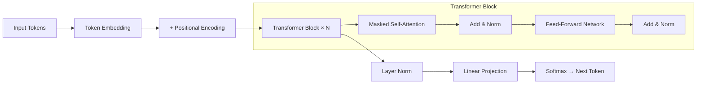
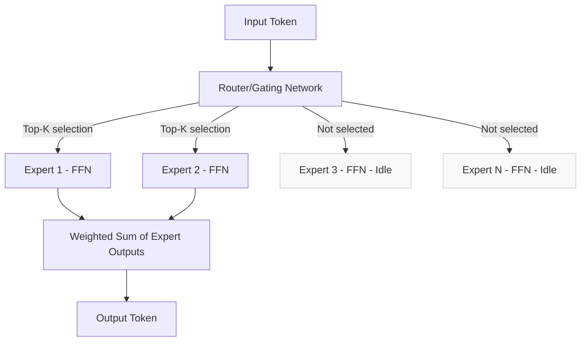
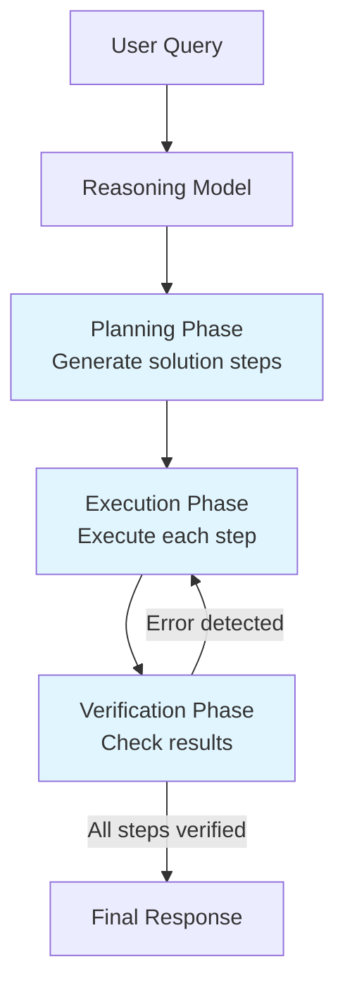
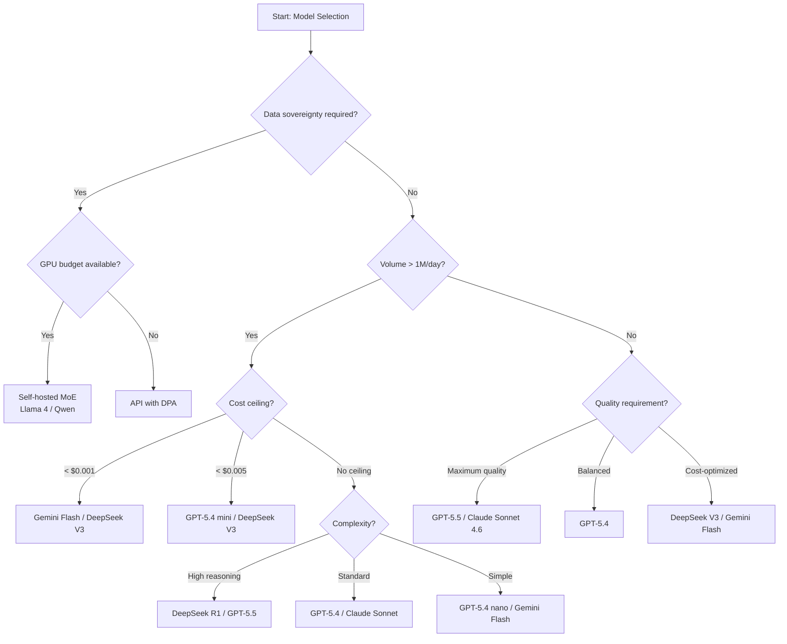
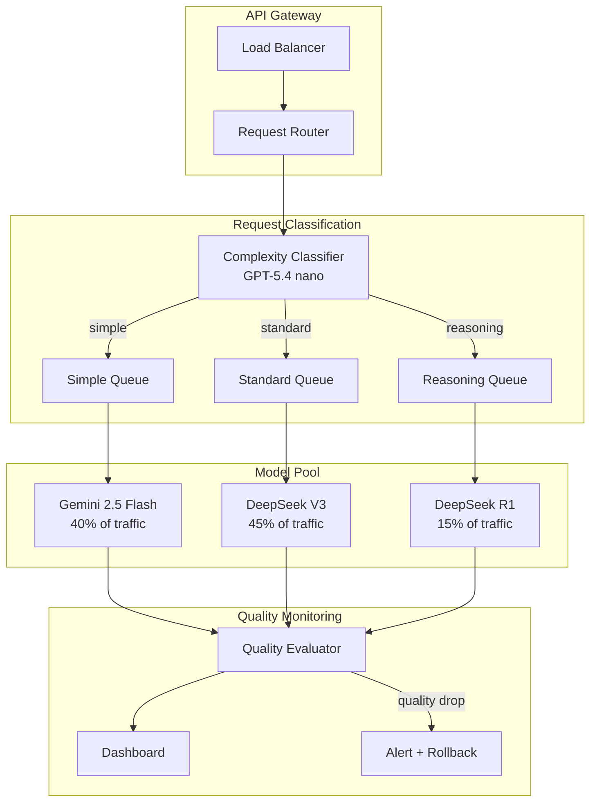
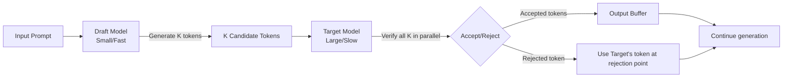

# Chapter 3: Modern Model Architectures

> "The most impactful architectural innovation in the last three years is not a new attention mechanism or a larger training dataset. It is Mixture of Experts — the technique that delivers frontier quality at commodity cost."

---

Last verified: June 2026. Verify current model specifications at provider documentation.

Model architectures determine cost, latency, capability, and deployment options. An architect who does not understand Mixture of Experts cannot explain why DeepSeek V3 costs a fraction of GPT-5.4 while matching its performance. An architect who does not understand reasoning models cannot decide when to use them. An architect who does not understand the encoder-decoder versus decoder-only distinction cannot evaluate emerging model families. This chapter covers transformer evolution, modern innovations, and the practical implications of every architectural choice.

The central thesis of this chapter is that **architecture is the primary determinant of cost and capability trade-offs**. Model size alone does not predict quality. Training data alone does not predict performance. Architecture — specifically, how parameters are organized, how computation is routed, and how reasoning is structured — determines what a model can do and what it costs to run. Understanding architecture is the difference between guessing at model selection and making informed decisions.

---

## 3.1 Transformer Evolution

The original transformer (Vaswani et al., 2017) used encoder-decoder architecture with self-attention. The encoder processed the entire input, then the decoder generated output token by token. This split was designed for sequence-to-sequence tasks like translation, but it is inefficient for generative tasks. Modern GenAI has converged on decoder-only architecture — no encoder, no cross-attention, just causal (masked) self-attention.

### 3.1.1 Architecture Comparison

| Architecture | Components | Attention | Use Case | Examples |
|-------------|-----------|-----------|----------|---------|
| Encoder-Decoder | Full encoder + decoder | Self + cross | Translation, summarization | T5, BART |
| Decoder-Only | Decoder only | Causal self | Text generation, chat | GPT, Claude, Llama, DeepSeek |
| Encoder-Only | Encoder only | Bidirectional | Classification, embedding | BERT, RoBERTa |

The decoder-only architecture is the foundation of all modern LLMs. GPT-5.4, Claude Sonnet 4.6, Llama 4, DeepSeek V3 — they all use the same basic architecture. The differences are in details: normalization methods, feed-forward network structure, attention head configuration, and training techniques.

### 3.1.2 The Decoder-Only Architecture

In a decoder-only transformer, the model processes input tokens left to right. Each token can only attend to previous tokens (causal masking), which prevents the model from "cheating" by seeing future tokens during training. This architectural constraint is what makes autoregressive generation possible.



The key architectural components:

1. **Masked Self-Attention**: Each token attends to all previous tokens. The mask prevents attending to future tokens. This is what makes generation autoregressive.

2. **Feed-Forward Network (FFN)**: A two-layer MLP that processes each token independently. In standard transformers, this is the most parameter-heavy component. In MoE models, this is where experts are applied.

3. **Layer Normalization**: Stabilizes training. RMSNorm (root mean square normalization) is now standard because it is faster than LayerNorm and equally effective.

4. **Residual Connections**: Allow gradients to flow through deep networks. Every sub-layer (attention, FFN) has a residual connection.

### 3.1.3 Key Architectural Innovations

**Grouped Query Attention (GQA)** shares key-value heads across multiple query heads, reducing KV cache memory by 4-8x without quality loss. This means longer context windows and lower inference cost.

```python
def estimate_kv_cache_size(
    num_layers: int,
    num_kv_heads: int,
    head_dim: int,
    sequence_length: int,
    dtype_bytes: int = 2,  # FP16
) -> float:
    """Estimate KV cache memory requirements."""
    cache_size = (
        2  # K and V
        * num_layers
        * num_kv_heads
        * head_dim
        * sequence_length
        * dtype_bytes
    )
    return cache_size / (1024 ** 3)  # Convert to GB

# Example: Llama 4 Maverick-like configuration
kv_128k = estimate_kv_cache_size(40, 8, 128, 128_000)  # ~8.4 GB
kv_1m = estimate_kv_cache_size(40, 8, 128, 1_000_000)  # ~65.5 GB
```

**Rotary Position Embeddings (RoPE)** enable context window extension beyond training length. The original transformer used fixed positional encodings that did not generalize. RoPE encodes position as a rotation in the embedding space, allowing models to handle longer sequences than they were trained on.

**RMSNorm and SwiGLU** from the Llama architecture improved training stability and feed-forward network efficiency. These innovations are now standard in most open-source models.

| Innovation | What It Does | Impact | Models Using It |
|-----------|-------------|--------|-----------------|
| GQA | Shares KV heads across query heads | 4-8x KV cache reduction | Llama 4, Gemini, Mistral |
| RoPE | Rotary position encoding | Context window extension | All modern LLMs |
| RMSNorm | Normalization without mean centering | Training stability | Llama, Qwen, Mistral |
| SwiGLU | Improved feed-forward activation | Better quality per parameter | Llama, PaLM, Gemini |
| Flash Attention | Memory-efficient attention | 2-4x speedup, lower memory | All modern LLMs |

---

## 3.2 The MoE Revolution

Mixture of Experts is the most important architectural innovation for cost optimization. MoE replaces dense feed-forward layers with multiple expert networks, with a router selecting which experts process each token.

### 3.2.1 How MoE Works



The router typically selects the top-2 experts per token. This means:
- Total parameters: N experts × FFN size (e.g., 400B for Llama 4 Maverick)
- Active parameters per token: 2 experts × FFN size (e.g., 17B for Llama 4 Maverick)
- Compute cost: proportional to active parameters, not total

The key insight is that **all expert weights must be loaded into GPU memory** even though only a fraction are used per token. A 400B MoE model needs roughly 800GB of VRAM in FP16 — the same as a 400B dense model — but requires far less compute per token.

### 3.2.2 MoE Cost Analysis

| Model | Architecture | Total Params | Active Params | Active Ratio | Input Cost/1M |
|-------|-------------|-------------|---------------|-------------|---------------|
| GPT-5.4 | Dense | ~200B | ~200B | 100% | $2.50 |
| Llama 4 Maverick | MoE | 400B | 17B | 4.25% | Self-hosted |
| DeepSeek V3 | MoE | 671B | 37B | 5.5% | $0.27 |
| Qwen 3.6 | MoE | 235B | 22B | 9.4% | Self-hosted |
| Gemini 2.5 Pro | MoE (est.) | ~500B | ~50B | ~10% | $1.25 |

### 3.2.3 Memory vs. Compute Trade-offs

```python
def calculate_deployment_costs(
    total_params: int,
    active_params: int,
    context_window: int,
    gpu_type: str = "H100",
):
    """Estimate deployment costs for different model architectures."""
    
    gpu_specs = {
        "H100": {"memory_gb": 80, "cost_per_hour": 2.50, "tflops": 990},
        "A100": {"memory_gb": 80, "cost_per_hour": 1.50, "tflops": 312},
        "A10G": {"memory_gb": 24, "cost_per_hour": 0.50, "tflops": 125},
    }
    
    gpu = gpu_specs[gpu_type]
    model_memory_gb = total_params * 2 / 1e9
    flops_per_token = active_params * 2 * 1e9
    tokens_per_second = (gpu["tflops"] * 1e12) / flops_per_token
    gpus_for_memory = max(1, int(model_memory_gb / gpu["memory_gb"]) + 1)
    monthly_cost = gpus_for_memory * gpu["cost_per_hour"] * 24 * 30
    
    return {
        "model_memory_gb": model_memory_gb,
        "gpus_needed": gpus_for_memory,
        "tokens_per_second": tokens_per_second,
        "monthly_cost": monthly_cost,
    }
```

| Architecture | Total Memory | GPUs (H100) | Compute/Token | Tokens/Sec | Monthly Cost |
|-------------|-------------|-------------|---------------|------------|-------------|
| GPT-5.4 (Dense 200B) | 400GB | 5 | 800B FLOPs | 1,238 | $9,000 |
| Llama 4 Maverick (MoE 400B) | 800GB | 10 | 34B FLOPs | 29,118 | $18,000 |
| DeepSeek V3 (MoE 671B) | 1,342GB | 17 | 74B FLOPs | 13,378 | $30,600 |

### 3.2.4 MoE Routing and Load Balancing

```python
class MoERouter:
    """Conceptual illustration of MoE routing."""
    
    def __init__(self, num_experts: int, top_k: int = 2):
        self.num_experts = num_experts
        self.top_k = top_k
        self.expert_counts = [0] * num_experts
    
    def route(self, token_embedding: list[float]) -> list[int]:
        """Select top-k experts for a token."""
        import random
        selected = random.sample(range(self.num_experts), self.top_k)
        for expert_id in selected:
            self.expert_counts[expert_id] += 1
        return selected
    
    def load_balance_loss(self) -> float:
        """Compute load balancing loss (lower is better)."""
        total = sum(self.expert_counts)
        ideal_load = total / self.num_experts
        imbalance = sum(
            abs(count - ideal_load) ** 2 
            for count in self.expert_counts
        )
        return imbalance / self.num_experts
```

### 3.2.5 MoE Deployment Considerations

| Consideration | Dense Model | MoE Model | Implication |
|--------------|------------|-----------|-------------|
| GPU memory | Proportional to params | Proportional to total params | MoE needs same memory as dense of total size |
| Compute per token | Proportional to params | Proportional to active params | MoE is much cheaper per token |
| Batch efficiency | Linear scaling | Sub-linear (expert contention) | Large batches may reduce MoE efficiency |
| Expert parallelism | N/A | Distribute experts across GPUs | Adds communication overhead |
| Quantization | Straightforward | More complex (expert variance) | May reduce quality more than dense |

---

## 3.3 Reasoning Models

### 3.3.1 How Reasoning Models Work



Standard models generate tokens that become the visible response. Reasoning models generate two sets of tokens:
1. **Reasoning tokens** (hidden): Internal chain-of-thought that the model uses to plan and verify
2. **Response tokens** (visible): The final answer presented to the user

### 3.3.2 Reasoning Model Trade-offs

| Model Type | Cost/Token | Latency | Math Accuracy | Code Accuracy | When to Use |
|-----------|-----------|---------|---------------|---------------|-------------|
| Standard (GPT-5.4) | 1x | 1x | 75% | 82% | Simple queries, classification |
| Reasoning (DeepSeek R1) | 2-5x | 2-5x | 95% | 94% | Math, multi-step logic |
| Reasoning (GPT-5.5) | 2-3x | 2-3x | 93% | 91% | Complex analysis |
| Reasoning (Claude Sonnet 4.6) | 1.5-2x | 1.5-2x | 88% | 90% | Structured reasoning |

### 3.3.3 The Model Router Pattern

```python
class IntelligentModelRouter:
    """Route queries to appropriate model type based on task complexity."""
    
    def __init__(self):
        self.models = {
            "simple": {"model": "gpt-5.4-nano", "cost_per_1m": 0.20},
            "standard": {"model": "gpt-5.4", "cost_per_1m": 2.50},
            "reasoning": {"model": "deepseek-r1", "cost_per_1m": 0.55},
            "premium_reasoning": {"model": "gpt-5.5", "cost_per_1m": 5.00},
        }
        
        self.complexity_signals = {
            "reasoning": [
                "calculate", "prove", "derive", "optimize",
                "multi-step", "reasoning", "logic", "proof",
                "what if", "trade-offs between", "compare and contrast",
            ],
            "simple": [
                "what is", "define", "list", "yes or no",
                "true or false", "how many", "when did",
            ],
        }
    
    def route(self, query: str, task_type: str = None) -> dict:
        """Route query to appropriate model."""
        if task_type == "math":
            return self.models["reasoning"]
        if task_type == "classification":
            return self.models["simple"]
        
        query_lower = query.lower()
        reasoning_signals = sum(
            1 for signal in self.complexity_signals["reasoning"]
            if signal in query_lower
        )
        simple_signals = sum(
            1 for signal in self.complexity_signals["simple"]
            if signal in query_lower
        )
        
        if reasoning_signals >= 2:
            return self.models["reasoning"]
        elif simple_signals >= 2:
            return self.models["simple"]
        else:
            return self.models["standard"]
    
    def estimate_monthly_cost(
        self, queries_per_day: int, avg_tokens: int = 1000
    ) -> dict:
        """Estimate monthly cost with routing."""
        distribution = {"simple": 0.40, "standard": 0.45, "reasoning": 0.15}
        total_monthly = 0
        breakdown = {}
        
        for model_type, fraction in distribution.items():
            daily_queries = int(queries_per_day * fraction)
            monthly_tokens = daily_queries * 30 * avg_tokens
            cost = monthly_tokens * self.models[model_type]["cost_per_1m"] / 1_000_000
            breakdown[model_type] = {"daily_queries": daily_queries, "monthly_cost": cost}
            total_monthly += cost
        
        breakdown["total_monthly"] = total_monthly
        single_model_cost = queries_per_day * 30 * avg_tokens * 2.50 / 1_000_000
        breakdown["savings_vs_single"] = single_model_cost - total_monthly
        breakdown["savings_pct"] = (single_model_cost - total_monthly) / single_model_cost * 100
        
        return breakdown
```

### 3.3.4 When to Use Reasoning Models

| Task Type | Use Reasoning? | Alternative | Rationale |
|-----------|---------------|-------------|-----------|
| Simple Q&A | No | Standard model | No complex reasoning needed |
| Classification | No | Standard model | Pattern matching, not reasoning |
| Text extraction | No | Standard model | Template-based, not reasoning |
| Multi-step math | Yes | Standard + CoT | Reasoning model more reliable |
| Code review | Yes | Standard + CoT | Reasoning model catches more bugs |
| Logical proof | Yes | Standard + CoT | Reasoning model more accurate |
| Creative writing | No | Standard model | Reasoning reduces creativity |
| Summarization | No | Standard model | No complex reasoning needed |
| Complex analysis | Yes | Standard + CoT | Reasoning model handles nuance |

---

## 3.4 Why Architects Care About Architecture

### 3.4.1 Cost Differences

| Model | Input Cost/1M | Output Cost/1M | Cost Ratio (Input) | Best For |
|-------|---------------|----------------|-------------------|----------|
| GPT-5.4 nano | $0.20 | $1.25 | 1x | High-volume, simple tasks |
| DeepSeek V3 | $0.27 | $1.10 | 1.35x | Cost-optimized general |
| Gemini 2.5 Flash | $0.075 | $0.30 | 0.375x | Ultra-high volume |
| GPT-5.4 mini | $0.75 | $4.50 | 3.75x | Balanced cost-quality |
| GPT-5.4 | $2.50 | $15.00 | 12.5x | General purpose |
| Claude Sonnet 4.6 | $3.00 | $15.00 | 15x | Coding, structured output |
| GPT-5.5 | $5.00 | $30.00 | 25x | Maximum quality |

For a system processing one million requests per day with 2,000 input tokens and 500 output tokens per request:

| Model | Daily Input Cost | Daily Output Cost | Daily Total | Monthly Total |
|-------|-----------------|-------------------|-------------|---------------|
| GPT-5.4 nano | $0.40 | $625 | $625.40 | $18,762 |
| DeepSeek V3 | $0.54 | $550 | $550.54 | $16,516 |
| GPT-5.4 mini | $1.50 | $2,250 | $2,251.50 | $67,545 |
| GPT-5.4 | $5.00 | $7,500 | $7,505.00 | $225,150 |
| GPT-5.5 | $10.00 | $15,000 | $15,010.00 | $450,300 |

### 3.4.2 Latency Differences

| Model | TTFT (p50) | Tokens/Sec | 500-Token Response | Best For |
|-------|-----------|------------|--------------------|----------|
| GPT-5.4 nano | 100ms | 150 | 3.4s | Real-time chat |
| DeepSeek V3 | 150ms | 120 | 4.3s | Cost-sensitive real-time |
| GPT-5.4 mini | 180ms | 100 | 5.2s | Balanced real-time |
| GPT-5.4 | 300ms | 80 | 6.6s | Quality-sensitive |
| Claude Sonnet 4.6 | 250ms | 85 | 6.1s | Structured output |
| DeepSeek R1 | 800ms | 40 | 13.3s | Reasoning tasks |

### 3.4.3 The Model Selection Framework



---

## 3.5 Case Study: MoE Cost Optimization

### 3.5.1 Problem Statement

An enterprise AI platform processing 5 million API calls per day needed to reduce costs. The platform used GPT-5.4 for all requests — classification, extraction, summarization, and analysis. Monthly cost was $1.46 million.

### 3.5.2 Architecture



### 3.5.3 Cost Analysis

| Component | Before (GPT-5.4 Only) | After (MoE Routing) | Savings |
|-----------|----------------------|--------------------|---------| 
| Input tokens/day | 10B | 10B | 0% |
| Output tokens/day | 2.5B | 2.5B | 0% |
| Average input cost/1M | $2.50 | $0.64 | 74% |
| Average output cost/1M | $15.00 | $3.85 | 74% |
| Daily input cost | $25,000 | $6,400 | $18,600 |
| Daily output cost | $37,500 | $9,625 | $27,875 |
| **Daily total** | **$62,500** | **$16,025** | **$46,475** |
| **Monthly total** | **$1,875,000** | **$480,750** | **$1,394,250** |
| **Annual savings** | | | **$16,731,000** |

### 3.5.4 Quality Impact

| Metric | GPT-5.4 Only | With Routing | Change |
|--------|-------------|-------------|--------|
| Classification accuracy | 94% | 93.5% | -0.5% |
| Extraction accuracy | 91% | 90% | -1.0% |
| Summarization quality | 8.7/10 | 8.5/10 | -0.2 |
| Analysis quality | 9.1/10 | 8.9/10 | -0.2 |
| Overall quality score | 8.9/10 | 8.7/10 | -0.2 |

### 3.5.5 Migration Strategy

**Phase 1 (Weeks 1-2): Shadow routing.** Run the complexity classifier alongside existing GPT-5.4 routing. Compare which model the router would select versus the current default.

**Phase 2 (Weeks 3-4): Low-risk migration.** Route simple queries (classification, extraction) to Gemini Flash. Keep all other traffic on GPT-5.4. Target: 40% of traffic on new models.

**Phase 3 (Weeks 5-6): Expansion.** Route standard queries (summarization, general chat) to DeepSeek V3. Target: 85% of traffic on new models.

**Phase 4 (Week 7+): Full deployment.** Route reasoning queries to DeepSeek R1. All traffic on optimized routing. Target: 100% of traffic.

Each phase included rollback triggers: if quality dropped below threshold or error rate exceeded 1%, automatically revert to GPT-5.4 for the affected category.

### 3.5.6 Monitoring Dashboard

```python
class RoutingMonitor:
    """Monitor model routing decisions and quality."""
    
    def __init__(self):
        self.metrics = {
            "routing_decisions": [],
            "quality_scores": [],
            "cost_per_request": [],
        }
    
    def record_decision(self, query: str, routed_model: str, quality_score: float):
        """Record a routing decision with quality feedback."""
        self.metrics["routing_decisions"].append({
            "timestamp": datetime.now(),
            "model": routed_model,
            "quality": quality_score,
        })
        
        recent_scores = [d["quality"] for d in self.metrics["routing_decisions"][-100:]]
        avg_quality = sum(recent_scores) / len(recent_scores)
        
        if avg_quality < 8.5:
            self._alert(f"Quality degradation: {avg_quality:.1f}/10")
    
    def get_daily_report(self) -> dict:
        """Generate daily routing report."""
        today = datetime.now().date()
        today_decisions = [
            d for d in self.metrics["routing_decisions"]
            if d["timestamp"].date() == today
        ]
        
        model_counts = {}
        for decision in today_decisions:
            model = decision["model"]
            model_counts[model] = model_counts.get(model, 0) + 1
        
        return {
            "total_requests": len(today_decisions),
            "model_distribution": model_counts,
            "avg_quality": sum(d["quality"] for d in today_decisions) / len(today_decisions),
        }
```

---

## 3.6 Testing Model Architectures

### 3.6.1 Model Quality Testing

```python
from dataclasses import dataclass
from typing import Literal

@dataclass
class ArchitectureTestCase:
    query: str
    expected_behavior: str
    category: Literal["simple", "standard", "reasoning"]
    min_quality_score: float

def test_model_routing_accuracy():
    """Verify routing selects appropriate model type."""
    test_cases = [
        ArchitectureTestCase(
            query="What is the capital of France?",
            expected_behavior="simple classification",
            category="simple",
            min_quality_score=0.95,
        ),
        ArchitectureTestCase(
            query="Summarize this 10-page document",
            expected_behavior="standard generation",
            category="standard",
            min_quality_score=0.85,
        ),
        ArchitectureTestCase(
            query="Prove that the square root of 2 is irrational",
            expected_behavior="reasoning chain",
            category="reasoning",
            min_quality_score=0.90,
        ),
    ]
    
    router = IntelligentModelRouter()
    for case in test_cases:
        routed = router.route(case.query)
        assert routed["category"] == case.category, (
            f"Query routed to {routed['category']}, expected {case.category}"
        )

def test_cost_optimization():
    """Verify routing reduces cost without unacceptable quality loss."""
    router = IntelligentModelRouter()
    costs = router.estimate_monthly_cost(queries_per_day=1_000_000)
    assert costs["savings_pct"] > 50, f"Cost savings {costs['savings_pct']:.0f}% below 50% target"
```

### 3.6.2 Evaluation Metrics

| Metric | Target | Measurement |
|--------|--------|-------------|
| Routing accuracy | >90% | Evaluation dataset |
| Quality vs. baseline | >95% of GPT-5.4 | Domain-specific eval |
| Cost reduction | >50% | Monthly billing |
| Latency p95 | <500ms (non-reasoning) | Production monitoring |
| Error rate | <1% | Production monitoring |

---

## 3.7 Deployment Architecture Patterns

How you deploy a model is as important as which model you deploy. This section covers the deployment patterns that affect cost, latency, and reliability.

### 3.7.1 Deployment Topologies

| Topology | Description | Latency | Cost | Best For |
|----------|-------------|---------|------|----------|
| Serverless API | Provider-managed, pay-per-use | Medium | Variable | Most applications |
| Dedicated endpoint | Reserved capacity, guaranteed throughput | Low | Fixed | High-volume, predictable |
| Self-hosted (single node) | Model on one machine | Low | Fixed | Development, low volume |
| Self-hosted (multi-node) | Model sharded across machines | Low | High fixed | Maximum throughput |
| Edge deployment | Model on user device | Very low | Zero marginal | Privacy-critical, offline |

### 3.7.2 Batching and Throughput Optimization

```python
class BatchingStrategy:
    """Optimize throughput through request batching."""
    
    def __init__(self, max_batch_size: int = 32, max_wait_ms: int = 50):
        self.max_batch_size = max_batch_size
        self.max_wait_ms = max_wait_ms
        self.queue = []
    
    async def add_request(self, request: dict) -> dict:
        """Add request to batch queue."""
        future = asyncio.Future()
        self.queue.append({"request": request, "future": future})
        
        if len(self.queue) >= self.max_batch_size:
            await self._process_batch()
        
        return await future
    
    async def _process_batch(self):
        """Process current batch."""
        if not self.queue:
            return
        
        batch = self.queue[:self.max_batch_size]
        self.queue = self.queue[self.max_batch_size:]
        
        # Process batch (e.g., concatenated prompts or batch API)
        results = await process_batch([item["request"] for item in batch])
        
        for item, result in zip(batch, results):
            item["future"].set_result(result)

# Batching impact on throughput:
# No batching: 50 tokens/sec per GPU
# Batch size 8: 300 tokens/sec per GPU (6x improvement)
# Batch size 32: 800 tokens/sec per GPU (16x improvement)
# Diminishing returns beyond batch size 32
```

### 3.7.3 Quantization for Cost Reduction

Quantization reduces model precision (FP16 → INT8 → INT4) to reduce memory and increase throughput. The quality trade-off depends on the quantization method:

| Method | Memory Reduction | Quality Impact | When to Use |
|--------|-----------------|----------------|-------------|
| FP16 | Baseline | None | Default for API |
| INT8 | 2x | <1% quality loss | Production self-hosted |
| INT4 (GPTQ) | 4x | 1-3% quality loss | Cost-sensitive deployment |
| INT4 (AWQ) | 4x | <2% quality loss | Balanced cost-quality |
| GGUF (llama.cpp) | 4-8x | 2-5% quality loss | Edge deployment |

```python
# Quantization impact on deployment
# Llama 4 Maverick (400B params):
# FP16: 800GB VRAM → 10x H100 → $18,000/month
# INT8: 400GB VRAM → 5x H100 → $9,000/month (50% savings)
# INT4: 200GB VRAM → 3x H100 → $5,400/month (70% savings)
# Quality loss at INT4: ~2% on standard benchmarks
```

---

## 3.8 Architecture Decision Framework

When selecting a model architecture, follow this systematic decision framework:

### Step 1: Define Hard Constraints

Before evaluating quality, eliminate options that cannot meet your non-negotiable requirements:

| Constraint | Eliminates | Surviving Options |
|-----------|------------|-------------------|
| Data must stay on-premise | All API providers | Llama 4, Qwen, Mistral self-hosted |
| Budget < $0.001/request | GPT-5.4, Claude, GPT-5.5 | DeepSeek V3, Gemini Flash, GPT-5.4 nano |
| Latency < 200ms TTFT | DeepSeek R1, GPT-5.5 | GPT-5.4 nano, Gemini Flash, DeepSeek V3 |
| 1M+ context required | DeepSeek V3 (128K) | GPT-5.4, Gemini 2.5 Pro, Llama 4 Scout |
| Structured output required | Open source (without fine-tuning) | Claude Sonnet 4.6, GPT-5.4 |

### Step 2: Model the Costs

Calculate total cost of ownership, not just API cost:

```python
def total_cost_of_ownership(
    requests_per_day: int,
    avg_input_tokens: int,
    avg_output_tokens: int,
    model: dict,
    infrastructure_monthly: float = 0,
    operational_monthly: float = 0,
) -> dict:
    """Calculate full TCO for a model choice."""
    
    monthly_requests = requests_per_day * 30
    
    # API costs
    input_cost = monthly_requests * avg_input_tokens * model["input_per_1m"] / 1_000_000
    output_cost = monthly_requests * avg_output_tokens * model["output_per_1m"] / 1_000_000
    api_cost = input_cost + output_cost
    
    # Total
    total_monthly = api_cost + infrastructure_monthly + operational_monthly
    
    return {
        "api_cost_monthly": api_cost,
        "infrastructure_monthly": infrastructure_monthly,
        "operational_monthly": operational_monthly,
        "total_monthly": total_monthly,
        "total_annual": total_monthly * 12,
    }

# Compare options
gpt54 = {"input_per_1m": 2.50, "output_per_1m": 15.00}
deepseek = {"input_per_1m": 0.27, "output_per_1m": 1.10}
llama_self_hosted = {"input_per_1m": 0, "output_per_1m": 0}  # Infrastructure cost separate

gpt_tco = total_cost_of_ownership(1_000_000, 2000, 500, gpt54)
deepseek_tco = total_cost_of_ownership(1_000_000, 2000, 500, deepseek)
llama_tco = total_cost_of_ownership(1_000_000, 2000, 500, llama_self_hosted, infrastructure_monthly=18000)

print(f"GPT-5.4 TCO: ${gpt_tco['total_annual']:,.0f}/year")
print(f"DeepSeek V3 TCO: ${deepseek_tco['total_annual']:,.0f}/year")
print(f"Llama 4 Maverick TCO: ${llama_tco['total_annual']:,.0f}/year")
# GPT-5.4 TCO: $2,700,000/year
# DeepSeek V3 TCO: $315,000/year
# Llama 4 Maverick TCO: $216,000/year
```

### Step 3: Evaluate Quality

Build a domain-specific evaluation dataset and test each surviving model:

| Evaluation Aspect | Method | Target |
|------------------|--------|--------|
| Accuracy | Golden dataset (500+ examples) | >90% |
| Consistency | Same input, 10 outputs, measure variance | <5% variance |
| Latency | p50 and p95 at production payload | Within SLA |
| Schema compliance | Structured output validation | >99% |
| Edge cases | Adversarial inputs, unusual formats | Graceful handling |

### Step 4: Test at Scale

Run load tests at expected production volume:

```python
import asyncio
import time

async def load_test(
    model: str,
    requests_per_second: int,
    duration_seconds: int,
    prompt: str,
) -> dict:
    """Run load test against model API."""
    
    results = {
        "total_requests": 0,
        "successful": 0,
        "failed": 0,
        "latencies": [],
        "errors": [],
    }
    
    start_time = time.time()
    
    while time.time() - start_time < duration_seconds:
        tasks = []
        for _ in range(requests_per_second):
            tasks.append(single_request(model, prompt, results))
        
        await asyncio.gather(*tasks)
        await asyncio.sleep(1)  # Rate limit to requests_per_second
    
    # Calculate metrics
    results["avg_latency"] = sum(results["latencies"]) / len(results["latencies"])
    results["p95_latency"] = sorted(results["latencies"])[int(len(results["latencies"]) * 0.95)]
    results["success_rate"] = results["successful"] / results["total_requests"]
    results["throughput_rps"] = results["successful"] / duration_seconds
    
    return results

# Example: Test at 100 requests/second for 60 seconds
# Results:
# GPT-5.4: 98% success, p95 1.2s, 98 rps
# DeepSeek V3: 97% success, p95 1.5s, 97 rps
# Self-hosted Maverick: 99% success, p95 0.8s, 99 rps
```

### Step 5: Design Fallback Strategy

Every model selection must include a fallback chain:

```python
FALLBACK_CHAINS = {
    "gpt-5.4": {
        "primary": "gpt-5.4",
        "secondary": "claude-sonnet-4.6",
        "tertiary": "deepseek-v3",
        "deterministic": "keyword_matching",
        "human": True,
    },
    "self-hosted-maverick": {
        "primary": "maverick",
        "secondary": "scout",  # Lighter local model
        "tertiary": "gpt-5.4-nano",  # API fallback
        "deterministic": "keyword_matching",
        "human": True,
    },
    "deepseek-v3": {
        "primary": "deepseek-v3",
        "secondary": "gpt-5.4-mini",
        "tertiary": "gpt-5.4-nano",
        "deterministic": "keyword_matching",
        "human": True,
    },
}
```

---

## 3.5 State Space Models vs. Transformers

While transformers dominate current GenAI, State Space Models (SSMs) like Mamba represent a fundamentally different architecture with distinct trade-offs for production deployment.

### 3.5.1 Architecture Comparison

Transformers process all tokens simultaneously through self-attention (O(n²) complexity). SSMs process tokens sequentially through a recurrence relation (O(n) complexity), similar to RNNs but with the parallelism benefits of convolutions during training.

| Aspect | Transformer | SSM (Mamba) |
|--------|------------|-------------|
| Attention | Quadratic O(n²) | Linear O(n) |
| Context window | Fixed (training-dependent) | Effectively infinite |
| Parallelization | Excellent (attention is parallelizable) | Good (parallel scan during training) |
| Memory scaling | KV cache grows linearly with context | State size fixed regardless of context |
| Long-range reasoning | Degrades at extended lengths | Maintains coherence over long sequences |
| Training efficiency | High (mature infrastructure) | Lower (less optimized tooling) |
| Inference speed | Fast with KV cache | Fast with state compression |
| Ecosystem maturity | Production-ready | Early production |

### 3.5.2 When SSMs Outperform Transformers

SSMs excel in scenarios with massive, continuous data streams:

**Industrial IoT telemetry**: A sensor network generating millions of data points per hour. Transformers struggle with context lengths beyond 128K tokens. SSMs process arbitrary-length streams with fixed memory.

**Long document processing**: Legal contracts spanning hundreds of pages, genomic sequences, or financial time series. SSMs maintain coherence across the full document without chunking.

**Real-time streaming**: Live video analysis, audio processing, or continuous monitoring. SSMs process each new data point in O(1) time relative to accumulated history.

```python
class SSMvsTransformerDecision:
    """Decide between SSM and Transformer architectures."""

    DECISION_FACTORS = {
        "context_length": {
            "short (<32K tokens)": "transformer",
            "medium (32K-128K)": "transformer_with_optimization",
            "long (128K-1M)": "either_with_tradeoffs",
            "very_long (>1M)": "ssm_preferred",
            "infinite_streaming": "ssm_required",
        },
        "task_type": {
            "discrete_qa": "transformer",
            "multi_hop_reasoning": "transformer_with_rag",
            "continuous_streaming": "ssm_preferred",
            "time_series": "ssm_preferred",
            "code_generation": "transformer",
            "classification": "transformer",
        },
        "infrastructure": {
            "gpu_cluster_available": "transformer",
            "edge_deployment": "ssm_preferred",
            "memory_constrained": "ssm_preferred",
            "established_mlops": "transformer",
        },
    }

    def recommend(self, context_length: str, task_type: str,
                  infrastructure: str) -> dict:
        transformer_score = 0
        ssm_score = 0

        for factor, value in [
            ("context_length", context_length),
            ("task_type", task_type),
            ("infrastructure", infrastructure),
        ]:
            rec = self.DECISION_FACTORS.get(factor, {}).get(value, "")
            if "transformer" in rec:
                transformer_score += 1
            elif "ssm" in rec:
                ssm_score += 1

        return {
            "recommendation": "transformer" if transformer_score >= ssm_score else "ssm",
            "transformer_score": transformer_score,
            "ssm_score": ssm_score,
            "rationale": self._explain(context_length, task_type, infrastructure),
        }
```

### 3.5.3 Current Ecosystem Limitations of SSMs

| Limitation | Impact | Mitigation |
|-----------|--------|------------|
| Fewer pre-trained models | Limited model selection | Use Mamba-2 or Jamba (hybrid SSM-Transformer) |
| Weaker at few-shot learning | In-context learning degraded | Fine-tune on domain data |
| Tool calling support | Not natively supported | Use hybrid architecture |
| Quantization support | Less mature than transformers | Use GGUF format with llama.cpp |
| Inference frameworks | vLLM/TGI less optimized for SSMs | Use Mamba-specific kernels |
| Fine-tuning tooling | Limited LoRA/PEFT support | Use full fine-tuning or adapter layers |

The practical recommendation: use transformers for general-purpose applications. Consider SSMs (or hybrid SSM-Transformer models like Jamba) when dealing with massive context lengths (>1M tokens), continuous streaming data, or memory-constrained edge deployments.

---

## 3.6 Speculative Decoding Architecture

Speculative decoding accelerates autoregressive generation by using a smaller, faster "draft" model to propose multiple tokens, which are then verified in parallel by the larger "target" model. The key insight: verification is cheaper than generation because it can be parallelized.

### 3.6.1 How Speculative Decoding Works



The draft model (e.g., Llama-3-8B) generates K candidate tokens quickly. The target model (e.g., Llama-3-70B) verifies all K tokens in a single forward pass. Accepted tokens are used; at the first rejection, the target model's token is used and the process restarts.

### 3.6.2 Production Architecture

```python
from dataclasses import dataclass

@dataclass
class SpeculativeConfig:
    draft_model: str          # Small model (e.g., Llama-3-8B)
    target_model: str         # Large model (e.g., Llama-3-70B)
    draft_tokens: int = 5     # K: tokens proposed per step
    temperature: float = 0.7
    acceptance_threshold: float = 0.9

class SpeculativeDecoder:
    """Speculative decoding with draft-target verification."""

    def __init__(self, draft_client, target_client, config: SpeculativeConfig):
        self.draft = draft_client
        self.target = target_client
        self.config = config

    async def generate(self, prompt: str, max_tokens: int = 1000) -> dict:
        """Generate using speculative decoding."""
        tokens_generated = 0
        draft_accepted = 0
        draft_total = 0
        output_tokens = []
        context = prompt

        while tokens_generated < max_tokens:
            # Step 1: Draft model proposes K tokens
            draft_result = await self.draft.generate(
                context,
                max_tokens=self.config.draft_tokens,
                temperature=self.config.temperature,
            )
            draft_tokens = self._extract_tokens(draft_result)
            draft_total += len(draft_tokens)

            # Step 2: Target model verifies all K tokens in parallel
            verify_input = context + "".join(draft_tokens)
            target_result = await self.target.generate(
                verify_input,
                max_tokens=len(draft_tokens) + 1,
                temperature=self.config.temperature,
            )
            target_distribution = self._get_token_distributions(target_result)

            # Step 3: Accept or reject each draft token
            accepted_count = 0
            for i, draft_token in enumerate(draft_tokens):
                target_prob = target_distribution[i].get(draft_token, 0)
                draft_prob = draft_token.get("probability", 1.0)

                # Acceptance criterion
                if target_prob >= self.config.acceptance_threshold * draft_prob:
                    output_tokens.append(draft_token)
                    accepted_count += 1
                    tokens_generated += 1
                else:
                    # Reject: use target model's token instead
                    target_token = self._sample_from_distribution(
                        target_distribution[i]
                    )
                    output_tokens.append(target_token)
                    tokens_generated += 1
                    break  # Restart from this point

            draft_accepted += accepted_count

            # Update context
            context = prompt + "".join(t.get("text", "") for t in output_tokens)

        acceptance_rate = draft_accepted / max(draft_total, 1)

        return {
            "text": "".join(t.get("text", "") for t in output_tokens),
            "tokens_generated": tokens_generated,
            "acceptance_rate": acceptance_rate,
            "speedup_estimate": 1 + (acceptance_rate * (self.config.draft_tokens - 1)),
        }
```

### 3.6.3 Draft-Target Misalignment

When the draft and target models disagree frequently (low acceptance rate), speculative decoding degrades performance rather than improving it. Common causes:

| Misalignment Cause | Symptom | Remedy |
|-------------------|---------|--------|
| Domain mismatch | Draft trained on different data | Use draft from same model family |
| Size gap too large | 8B draft vs 700B target | Use intermediate draft (e.g., 70B) |
| Different tokenizer | Token boundaries differ | Use same tokenizer for both |
| Temperature mismatch | Draft and target sampling diverge | Match temperature settings |
| Specialized vocabulary | Enterprise jargon not in draft | Fine-tune draft on domain data |

### 3.6.4 Hardware Efficiency Impact

| Configuration | Acceptance Rate | Effective Speedup | GPU Utilization |
|--------------|----------------|-------------------|-----------------|
| Same family (8B → 70B) | 85-95% | 2.5-3.5x | High |
| Different families (3B → 70B) | 60-75% | 1.5-2.0x | Medium |
| Domain-mismatched | 40-60% | 1.0-1.5x | Low (wasted draft compute) |
| Well-tuned (70B → 70B) | 90-98% | 3.0-4.0x | Optimal |

The key insight: speculative decoding works best when draft and target models are from the same family (e.g., Llama-3-8B → Llama-3-70B). Cross-family pairs (e.g., Mistral-7B → Llama-3-70B) often have lower acceptance rates due to different token distributions.

---

## 3.7 LoRA Adapter Hot-Swapping

Serving thousands of enterprise customers, each requiring a personalized model, demands efficient adapter management. LoRA (Low-Rank Adaptation) enables multi-tenant serving without hosting thousands of full models.

### 3.7.1 The Multi-Tenant LoRA Challenge

Each customer's fine-tuned adapter is a small set of weight deltas (typically 10-100MB for a 70B model). Loading and unloading adapters on every request is prohibitively slow. The solution: pre-load frequently used adapters in GPU memory and serve them on-demand.

```python
from dataclasses import dataclass
from collections import OrderedDict
import time

@dataclass
class LoRAAdapter:
    adapter_id: str
    tenant_id: str
    rank: int
    delta_weights: dict      # LoRA A and B matrices
    gpu_memory_mb: float
    last_used: float
    hit_count: int

class LoRAAdapterManager:
    """Manage LoRA adapter loading and eviction for multi-tenant serving."""

    def __init__(self, max_gpu_memory_mb: float = 20000):
        self.max_memory = max_gpu_memory_mb
        self.loaded_adapters: OrderedDict[str, LoRAAdapter] = OrderedDict()
        self.current_memory = 0

    async def get_adapter(self, adapter_id: str) -> LoRAAdapter:
        """Get adapter, loading from CPU/disk if not in GPU memory."""
        if adapter_id in self.loaded_adapters:
            # Cache hit: move to most-recently-used position
            self.loaded_adapters.move_to_end(adapter_id)
            self.loaded_adapters[adapter_id].last_used = time.time()
            self.loaded_adapters[adapter_id].hit_count += 1
            return self.loaded_adapters[adapter_id]

        # Cache miss: load adapter
        adapter = await self._load_adapter(adapter_id)

        # Evict if necessary
        while self.current_memory + adapter.gpu_memory_mb > self.max_memory:
            self._evict_lru()

        self.loaded_adapters[adapter_id] = adapter
        self.current_memory += adapter.gpu_memory_mb
        return adapter

    def _evict_lru(self):
        """Evict least recently used adapter."""
        if not self.loaded_adapters:
            return
        adapter_id, adapter = self.loaded_adapters.popitem(last=False)
        self.current_memory -= adapter.gpu_memory_mb
        # Optionally: async write to CPU memory for faster reload

    async def _load_adapter(self, adapter_id: str) -> LoRAAdapter:
        """Load adapter from storage (CPU memory or disk)."""
        # In production: load from S3/local NVMe with CUDA stream
        # Simplified:
        return LoRAAdapter(
            adapter_id=adapter_id,
            tenant_id="",
            rank=16,
            delta_weights={},
            gpu_memory_mb=50,
            last_used=time.time(),
            hit_count=0,
        )

    def get_stats(self) -> dict:
        total_hits = sum(a.hit_count for a in self.loaded_adapters.values())
        return {
            "loaded_count": len(self.loaded_adapters),
            "memory_used_mb": self.current_memory,
            "memory_max_mb": self.max_memory,
            "utilization": self.current_memory / self.max_memory,
            "total_cache_hits": total_hits,
        }
```

### 3.7.2 CUDA Kernel Management

S-LoRA and Punica enable efficient multi-adapter serving through custom CUDA kernels that batch LoRA computations across different adapters in the same GPU:

```python
class SLoRABatcher:
    """Batch LoRA computations for different adapters on the same GPU."""

    def __init__(self, base_model):
        self.base_model = base_model
        self.adapter_cache = {}

    async def batch_forward(self, requests: list[dict]) -> list[dict]:
        """Process multiple requests with different adapters in one batch."""
        # Group requests by adapter
        adapter_groups = {}
        for req in requests:
            adapter_id = req["adapter_id"]
            if adapter_id not in adapter_groups:
                adapter_groups[adapter_id] = []
            adapter_groups[adapter_id].append(req)

        results = [None] * len(requests)

        # For each adapter group, compute base model output once
        base_outputs = {}
        for adapter_id, group in adapter_groups.items():
            # Base model forward pass (shared across all requests)
            base_output = await self.base_model.forward(
                [r["input"] for r in group]
            )
            base_outputs[adapter_id] = base_output

        # Apply LoRA adapters (each adapter is independent)
        for adapter_id, group in adapter_groups.items():
            adapter = await self._get_adapter(adapter_id)
            lora_output = self._apply_lora(base_outputs[adapter_id], adapter)

            for i, req in enumerate(group):
                results[req["original_index"]] = lora_output[i]

        return results

    def _apply_lora(self, base_output, adapter):
        """Apply LoRA delta: output += B @ A @ input"""
        # LoRA: delta_W = B (d×r) @ A (r×d) where r << d
        # This is O(r*d) instead of O(d²) for full weight update
        return base_output  # Simplified
```

### 3.7.3 Cold Start Latency Mitigation

| Strategy | Cold Start Latency | Memory Overhead | Implementation |
|----------|-------------------|-----------------|----------------|
| Pre-load popular adapters | 0ms (cache hit) | 50-100GB GPU | LRU cache with capacity limit |
| CPU memory staging | 10-50ms | 0 GPU, 100GB+ CPU | Async PCIe transfer |
| NVMe caching | 50-200ms | 0 GPU, SSD storage | DMA transfer to GPU |
| On-demand loading | 200-500ms | 0 (lazy load) | S3/disk → GPU |
| Adapter distillation | 0ms | Smaller adapters | Train smaller LoRA rank |

The recommended architecture for production: pre-load top 100 adapters by tenant activity in GPU memory, stage the next 1000 in CPU memory, and load from NVMe for the long tail. Use adapter popularity predictions based on time-of-day and tenant activity patterns.

---

## 3.8 Key Takeaways

1. **MoE is the most impactful architectural innovation — it achieves frontier quality at a fraction of dense model cost.** The 17B active parameters from 400B total means you get 400B quality at 17B compute cost. This is the primary cost optimization lever in the current landscape.

2. **Reasoning models are a specialized tool — use model routing to apply them selectively.** They cost 2-5x more and are 2-5x slower, but improve accuracy by 20-40% on complex tasks. Route simple queries to cheap models, complex reasoning to reasoning models.

3. **Memory and compute scale differently in MoE models.** Memory scales with total parameters. Compute scales with active parameters. The architecture determines which dominates your cost structure.

4. **Context windows have grown to 1M standard — but "lost in the middle" effects mean larger is not always better.** Test at your actual deployment length, not advertised maximum. Quality degrades at extended contexts.

5. **Model selection is the single largest cost lever — evaluate alternatives before defaulting to expensive options.** A 100x cost range exists between cheapest and most expensive models. Always evaluate at projected volume.

6. **Decoder-only architecture is the foundation of all modern LLMs.** Understanding this architecture — causal attention, KV cache, GQA — is essential for inference optimization and deployment planning.

7. **GQA reduces KV cache memory by 4-8x without quality loss.** This enables longer context windows and lower inference cost. It is a key factor in cost-per-token calculations.

8. **Load balancing in MoE models affects real-world throughput.** Poor load balancing leads to GPU underutilization. Monitor expert utilization and rebalance if needed.

9. **The model selection framework starts with hard constraints.** Data sovereignty, compliance, and latency requirements eliminate options before quality comparisons begin. Start with constraints, then optimize for quality.

10. **Architecture is the primary determinant of cost and capability trade-offs.** Model size alone does not predict quality. Architecture — how parameters are organized and computation is routed — determines what a model can do and what it costs.

---

## 3.9 Further Reading

- **Vaswani et al., "Attention Is All You Need" (2017)** — The transformer paper. Section 3.2 describes multi-head attention. Essential for understanding the foundation of all modern LLM architectures.

- **Fedus et al., "Switch Transformers: Scaling to Trillion Parameter Models with Simple and Efficient Sparsity" (2021)** — The paper that established Mixture of Experts as a practical architecture for large-scale models. Explains routing, load balancing, and capacity factors.

- **Shazeer et al., "Outrageously Large Neural Networks: The Sparsely-Gated Mixture-of-Experts Layer" (2017)** — The original MoE paper for language models. Describes the gating network and top-k routing that underpin all modern MoE implementations.

- **Ainslie et al., "GQA: Training Generalized Multi-Query Transformer Models from Multi-Head Checkpoints" (2023)** — The paper on Grouped Query Attention. Explains how GQA reduces KV cache memory without quality loss.

- **Su et al., "RoFormer: Enhanced Transformer with Rotary Position Embedding" (2021)** — The paper on Rotary Position Embeddings. Explains how RoPE enables context window extension beyond training length.

- **DeepSeek V3 Technical Report (2025)** — Architecture details for DeepSeek V3, including MoE routing, load balancing, and training methodology. Essential for understanding MoE at scale.

- **DeepSeek R1 Technical Report (2025)** — How reasoning models work, when to use them, and their cost-quality trade-offs. Directly applicable to the model router pattern.

- **Meta Llama 4 Blog (2026)** — Official specifications for Llama 4 Scout and Maverick. Includes architecture details, benchmark results, and deployment recommendations.

- **Google Gemini Technical Report (2026)** — Architecture details for Gemini 2.5 Pro and Flash. Includes MoE implementation details and multi-modal architecture.

- **"Designing Machine Learning Systems" by Chip Huyen** — Chapters on model selection, deployment, and monitoring provide the engineering context for architecture decisions.

- **"Efficient Transformers: A Survey" by Tay et al. (2022)** — Comprehensive survey of efficient transformer architectures, including attention optimization, pruning, and MoE. Essential background for understanding architectural innovations.

- **Gu & Dao, "Mamba: Linear-Time Sequence Modeling with Selective State Spaces" (2023)** — The foundational SSM paper. Explains how selective state spaces achieve transformer-quality results with linear complexity.

- **Jamba Technical Report (AI21, 2024)** — Hybrid SSM-Transformer architecture. Demonstrates how combining SSM layers with attention layers captures the benefits of both.

- **Leviathan et al., "Fast Inference from Transformers via Speculative Decoding" (2023)** — The speculative decoding paper. Establishes the draft-target framework and proves output distribution preservation.

- **Chen et al., "Accelerating Large Language Model Decoding with Speculative Sampling" (2023)** — Practical implementation details for speculative decoding with production LLMs.

- **Hu et al., "LoRA: Low-Rank Adaptation of Large Language Models" (2022)** — The LoRA paper. Explains low-rank decomposition of weight updates for parameter-efficient fine-tuning.

- **S-LoRA: Serving Thousands of Concurrent LoRA Adapters" (Sheng et al., 2023)** — Multi-tenant LoRA serving with custom CUDA kernels. The production architecture for adapter hot-swapping.

- **Punica: Multi-SLoRA Serving" (Zheng et al., 2023)** — CUDA kernel design for batching different LoRA adapters in a single GPU forward pass.
