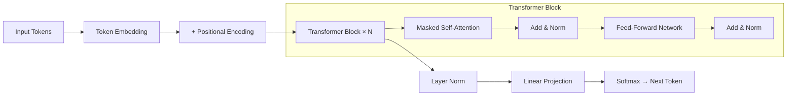
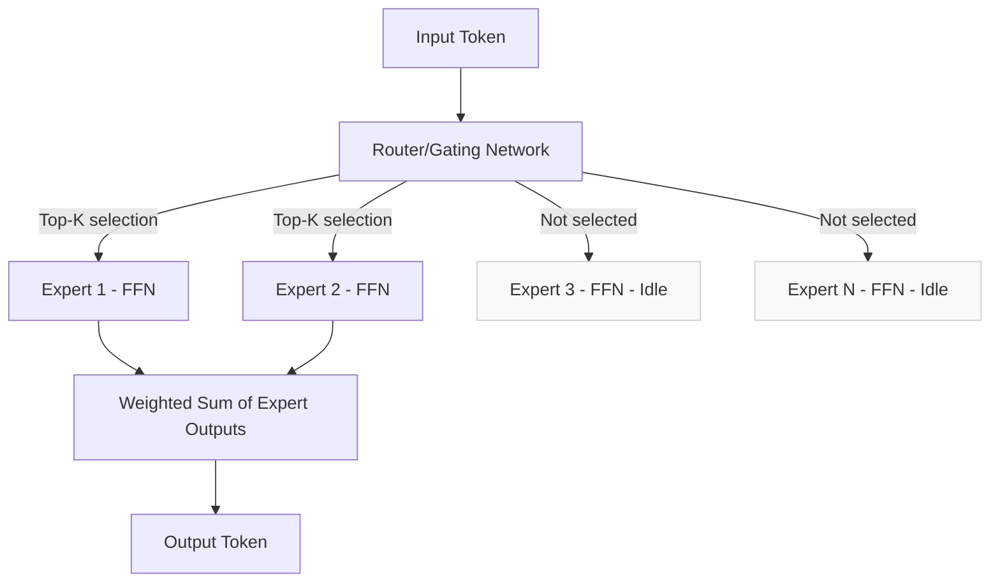
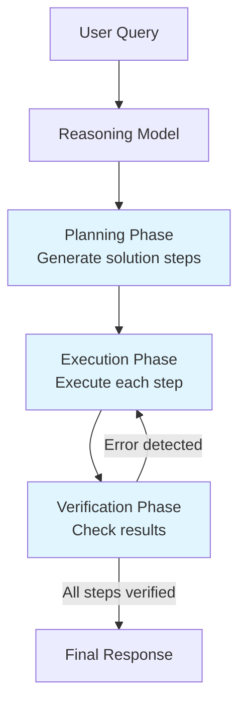
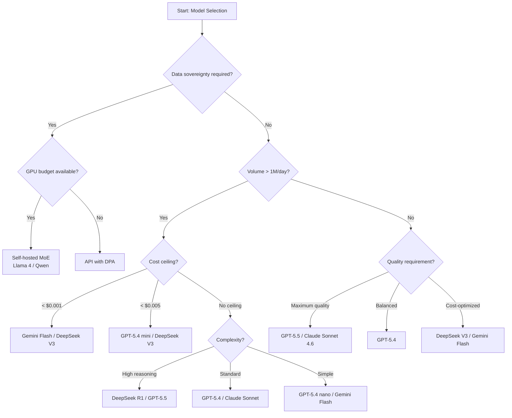
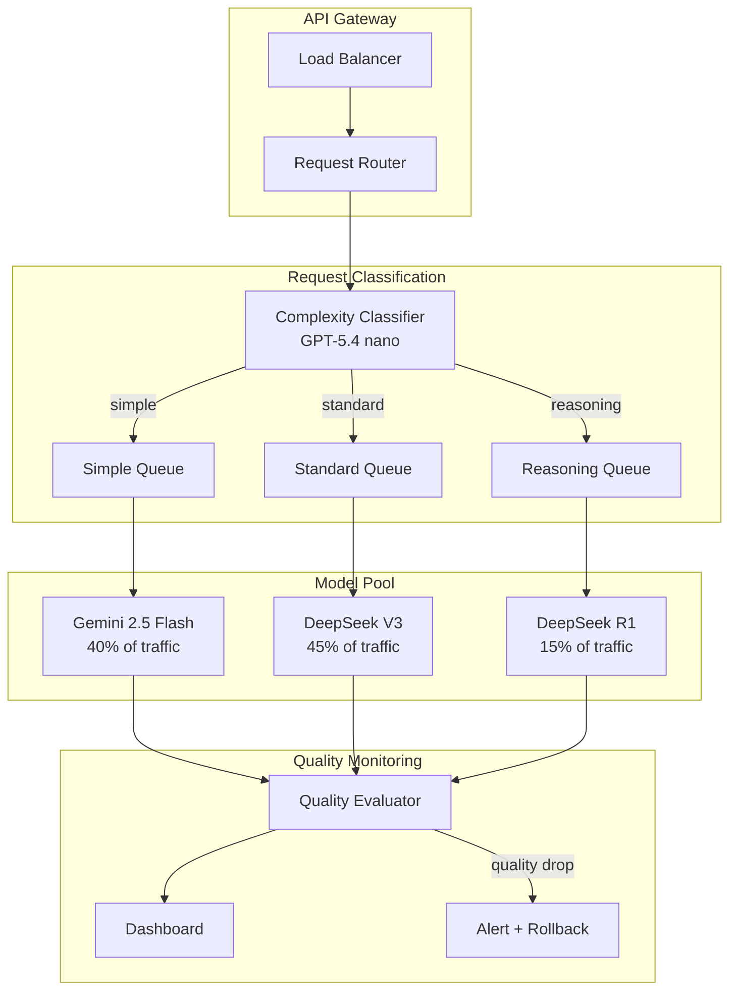

# Chapter 3: Modern Model Architectures

> "The most impactful architectural innovation in the last three years is not a new attention mechanism or a larger training dataset. It is Mixture of Experts — the technique that delivers frontier quality at commodity cost."

---

Last verified: June 2026. Verify current model specifications at provider documentation.

Model architectures determine cost, latency, capability, and deployment options. An architect who does not understand Mixture of Experts cannot explain why DeepSeek V3 costs a fraction of GPT-5.4 while matching its performance. An architect who does not understand reasoning models cannot decide when to use them. An architect who does not understand the encoder-decoder versus decoder-only distinction cannot evaluate emerging model families. This chapter covers transformer evolution, modern innovations, and the practical implications of every architectural choice.

The central thesis of this chapter is that **architecture is the primary determinant of cost and capability trade-offs**. Model size alone does not predict quality. Training data alone does not predict performance. Architecture — specifically, how parameters are organized, how computation is routed, and how reasoning is structured — determines what a model can do and what it costs to run. Understanding architecture is the difference between guessing at model selection and making informed decisions.

---

## 3.1 Transformer Evolution

The original transformer (Vaswani et al., 2017) used encoder-decoder architecture with self-attention. The encoder processed the entire input, then the decoder generated output token by token. This split was designed for sequence-to-sequence tasks like translation, but it is inefficient for generative tasks. Modern GenAI has converged on decoder-only architecture — no encoder, no cross-attention, just causal (masked) self-attention.

### 3.1.1 Architecture Comparison

| Architecture | Components | Attention | Use Case | Examples |
|-------------|-----------|-----------|----------|---------|
| Encoder-Decoder | Full encoder + decoder | Self + cross | Translation, summarization | T5, BART |
| Decoder-Only | Decoder only | Causal self | Text generation, chat | GPT, Claude, Llama, DeepSeek |
| Encoder-Only | Encoder only | Bidirectional | Classification, embedding | BERT, RoBERTa |

The decoder-only architecture is the foundation of all modern LLMs. GPT-5.4, Claude Sonnet 4.6, Llama 4, DeepSeek V3 — they all use the same basic architecture. The differences are in details: normalization methods, feed-forward network structure, attention head configuration, and training techniques.

### 3.1.2 The Decoder-Only Architecture

In a decoder-only transformer, the model processes input tokens left to right. Each token can only attend to previous tokens (causal masking), which prevents the model from "cheating" by seeing future tokens during training. This architectural constraint is what makes autoregressive generation possible.



The key architectural components:

1. **Masked Self-Attention**: Each token attends to all previous tokens. The mask prevents attending to future tokens. This is what makes generation autoregressive.

2. **Feed-Forward Network (FFN)**: A two-layer MLP that processes each token independently. In standard transformers, this is the most parameter-heavy component. In MoE models, this is where experts are applied.

3. **Layer Normalization**: Stabilizes training. RMSNorm (root mean square normalization) is now standard because it is faster than LayerNorm and equally effective.

4. **Residual Connections**: Allow gradients to flow through deep networks. Every sub-layer (attention, FFN) has a residual connection.

### 3.1.3 Key Architectural Innovations

**Grouped Query Attention (GQA)** shares key-value heads across multiple query heads, reducing KV cache memory by 4-8x without quality loss. This means longer context windows and lower inference cost.

```python
# Conceptual illustration of GQA vs MHA
# Multi-Head Attention (MHA): Each query head has its own K, V
#   Query heads: 32, KV heads: 32 → KV cache: 32 × head_dim × seq_len

# Grouped Query Attention (GQA): Query heads share K, V groups
#   Query heads: 32, KV heads: 8 → KV cache: 8 × head_dim × seq_len
#   Memory reduction: 4x
#   Quality impact: < 1% on standard benchmarks

# Practical impact on context window:
# MHA at 128K context: ~32 GB KV cache
# GQA at 128K context: ~8 GB KV cache
# GQA at 1M context: ~64 GB KV cache (feasible on multi-GPU)

def estimate_kv_cache_size(
    num_layers: int,
    num_kv_heads: int,
    head_dim: int,
    sequence_length: int,
    dtype_bytes: int = 2,  # FP16
) -> float:
    """Estimate KV cache memory requirements."""
    # KV cache stores both keys and values for each layer
    cache_size = (
        2  # K and V
        * num_layers
        * num_kv_heads
        * head_dim
        * sequence_length
        * dtype_bytes
    )
    return cache_size / (1024 ** 3)  # Convert to GB

# Example: Llama 4 Maverick-like configuration
# 40 layers, 32 query heads, 8 KV heads, 128 head_dim
kv_128k = estimate_kv_cache_size(40, 8, 128, 128_000)  # ~8.4 GB
kv_1m = estimate_kv_cache_size(40, 8, 128, 1_000_000)  # ~65.5 GB
# At 1M context, KV cache alone requires significant GPU memory
```

**Rotary Position Embeddings (RoPE)** enable context window extension beyond training length. The original transformer used fixed positional encodings that did not generalize. RoPE encodes position as a rotation in the embedding space, allowing models to handle longer sequences than they were trained on.

**RMSNorm and SwiGLU** from the Llama architecture improved training stability and feed-forward network efficiency. These innovations are now standard in most open-source models.

| Innovation | What It Does | Impact | Models Using It |
|-----------|-------------|--------|-----------------|
| GQA | Shares KV heads across query heads | 4-8x KV cache reduction | Llama 4, Gemini, Mistral |
| RoPE | Rotary position encoding | Context window extension | All modern LLMs |
| RMSNorm | Normalization without mean centering | Training stability | Llama, Qwen, Mistral |
| SwiGLU | Improved feed-forward activation | Better quality per parameter | Llama, PaLM, Gemini |
| Flash Attention | Memory-efficient attention | 2-4x speedup, lower memory | All modern LLMs |

### 3.1.4 Flash Attention

Flash Attention is an implementation-level optimization that does not change the model architecture but dramatically improves inference efficiency. It reorders the attention computation to minimize memory transfers between GPU SRAM and HBM, achieving 2-4x speedup with lower memory usage.

```python
# Flash Attention vs Standard Attention
# Standard: O(n²) memory for attention matrix
# Flash: O(n) memory, same computation, better cache utilization

# Impact on throughput:
# Standard attention at 128K: ~50 tokens/sec per GPU
# Flash attention at 128K: ~150 tokens/sec per GPU
# 3x throughput improvement from implementation alone
```

---

## 3.2 The MoE Revolution

Mixture of Experts is the most important architectural innovation for cost optimization. MoE replaces dense feed-forward layers with multiple expert networks, with a router selecting which experts process each token.

### 3.2.1 How MoE Works

In a standard transformer, every token passes through every feed-forward network (FFN) layer. In an MoE model, the FFN is replaced with multiple "expert" FFNs, and a gating network (router) selects which experts process each token.



The router typically selects the top-2 experts per token. This means:
- Total parameters: N experts × FFN size (e.g., 400B for Llama 4 Maverick)
- Active parameters per token: 2 experts × FFN size (e.g., 17B for Llama 4 Maverick)
- Compute cost: proportional to active parameters, not total

The key insight is that **all expert weights must be loaded into GPU memory** even though only a fraction are used per token. A 400B MoE model needs roughly 800GB of VRAM in FP16 — the same as a 400B dense model — but requires far less compute per token.

### 3.2.2 MoE Cost Analysis

The practical impact is dramatic. The following table shows how MoE architecture affects cost across model families:

| Model | Architecture | Total Params | Active Params | Active Ratio | Input Cost/1M |
|-------|-------------|-------------|---------------|-------------|---------------|
| GPT-5.4 | Dense | ~200B | ~200B | 100% | $2.50 |
| Llama 4 Maverick | MoE | 400B | 17B | 4.25% | Self-hosted |
| DeepSeek V3 | MoE | 671B | 37B | 5.5% | $0.27 |
| Qwen 3.6 | MoE | 235B | 22B | 9.4% | Self-hosted |
| Gemini 2.5 Pro | MoE (est.) | ~500B | ~50B | ~10% | $1.25 |

The key insight: **active parameters determine compute cost, total parameters determine memory cost**. An MoE model needs the same GPU memory as a dense model of its total size, but the compute per token is proportional to the active parameters.

### 3.2.3 Memory vs. Compute Trade-offs

```python
def calculate_deployment_costs(
    total_params: int,
    active_params: int,
    context_window: int,
    gpu_type: str = "H100",
):
    """Estimate deployment costs for different model architectures."""
    
    gpu_specs = {
        "H100": {"memory_gb": 80, "cost_per_hour": 2.50, "tflops": 990},
        "A100": {"memory_gb": 80, "cost_per_hour": 1.50, "tflops": 312},
        "A10G": {"memory_gb": 24, "cost_per_hour": 0.50, "tflops": 125},
    }
    
    gpu = gpu_specs[gpu_type]
    
    # Memory calculation (FP16)
    model_memory_gb = total_params * 2 / 1e9  # 2 bytes per param in FP16
    kv_cache_gb = context_window * 4096 * 2 / 1e9  # Rough estimate
    
    # Compute calculation
    flops_per_token = active_params * 2 * 1e9
    tokens_per_second = (gpu["tflops"] * 1e12) / flops_per_token
    
    # GPUs needed
    gpus_for_memory = max(1, int(model_memory_gb / gpu["memory_gb"]) + 1)
    
    # Monthly cost
    monthly_cost = gpus_for_memory * gpu["cost_per_hour"] * 24 * 30
    
    return {
        "model_memory_gb": model_memory_gb,
        "kv_cache_gb": kv_cache_gb,
        "gpus_needed": gpus_for_memory,
        "tokens_per_second": tokens_per_second,
        "monthly_cost": monthly_cost,
    }

# Example comparisons:
# GPT-5.4 (Dense, 200B):
#   Memory: 400GB → 5x H100 → $9,000/month
#   Compute: 400B × 2 = 800B FLOPs/token → ~1,238 tokens/sec

# Llama 4 Maverick (MoE, 400B total, 17B active):
#   Memory: 800GB → 10x H100 → $18,000/month
#   Compute: 17B × 2 = 34B FLOPs/token → ~29,118 tokens/sec
#   Cost per token: 23x cheaper than GPT-5.4

# DeepSeek V3 (MoE, 671B total, 37B active):
#   Memory: 1342GB → 17x H100 → $30,600/month
#   Compute: 37B × 2 = 74B FLOPs/token → ~13,378 tokens/sec
#   Cost per token: 5.6x cheaper than GPT-5.4
```

| Architecture | Total Memory | GPUs (H100) | Compute/Token | Tokens/Sec | Monthly Cost |
|-------------|-------------|-------------|---------------|------------|-------------|
| GPT-5.4 (Dense 200B) | 400GB | 5 | 800B FLOPs | 1,238 | $9,000 |
| Llama 4 Maverick (MoE 400B) | 800GB | 10 | 34B FLOPs | 29,118 | $18,000 |
| DeepSeek V3 (MoE 671B) | 1,342GB | 17 | 74B FLOPs | 13,378 | $30,600 |

The MoE advantage is clear: Llama 4 Maverick costs 2x more in GPU memory but delivers 23x more tokens per second. At high volume, the compute savings dwarf the memory costs.

### 3.2.4 MoE Routing and Load Balancing

The router in an MoE model must balance load across experts. If one expert receives too many tokens, it becomes a bottleneck. If one expert receives too few, its parameters are wasted.

```python
class MoERouter:
    """Conceptual illustration of MoE routing."""
    
    def __init__(self, num_experts: int, top_k: int = 2):
        self.num_experts = num_experts
        self.top_k = top_k
        self.expert_counts = [0] * num_experts
    
    def route(self, token_embedding: list[float]) -> list[int]:
        """Select top-k experts for a token."""
        # In practice: learned gating network
        # Simplified: random selection for illustration
        import random
        selected = random.sample(range(self.num_experts), self.top_k)
        
        for expert_id in selected:
            self.expert_counts[expert_id] += 1
        
        return selected
    
    def load_balance_loss(self) -> float:
        """Compute load balancing loss (lower is better)."""
        total = sum(self.expert_counts)
        ideal_load = total / self.num_experts
        imbalance = sum(
            abs(count - ideal_load) ** 2 
            for count in self.expert_counts
        )
        return imbalance / self.num_experts

# Load balancing is critical for MoE performance
# Well-balanced: Expert 1: 25%, Expert 2: 25%, Expert 3: 25%, Expert 4: 25%
# Poorly balanced: Expert 1: 60%, Expert 2: 15%, Expert 3: 15%, Expert 4: 10%
# Poor balancing → GPU underutilization → lower throughput → higher cost
```

### 3.2.5 MoE Deployment Considerations

| Consideration | Dense Model | MoE Model | Implication |
|--------------|------------|-----------|-------------|
| GPU memory | Proportional to params | Proportional to total params | MoE needs same memory as dense of total size |
| Compute per token | Proportional to params | Proportional to active params | MoE is much cheaper per token |
| Batch efficiency | Linear scaling | Sub-linear (expert contention) | Large batches may reduce MoE efficiency |
| Expert parallelism | N/A | Distribute experts across GPUs | Adds communication overhead |
| Quantization | Straightforward | More complex (expert variance) | May reduce quality more than dense |
| Inference optimization | Standard | Expert caching, speculative routing | More optimization opportunities |

---

## 3.3 Reasoning Models

Reasoning models use chain-of-thought reasoning internally. Instead of generating the answer directly, they think through the problem step by step — planning a solution, executing each step, and verifying the result before responding.

### 3.3.1 How Reasoning Models Work



Standard models generate tokens that become the visible response. Reasoning models generate two sets of tokens:
1. **Reasoning tokens** (hidden): Internal chain-of-thought that the model uses to plan and verify
2. **Response tokens** (visible): The final answer presented to the user

The reasoning tokens cost money and add latency but dramatically improve accuracy on complex tasks.

### 3.3.2 Reasoning Model Trade-offs

| Model Type | Cost/Token | Latency | Math Accuracy | Code Accuracy | When to Use |
|-----------|-----------|---------|---------------|---------------|-------------|
| Standard (GPT-5.4) | 1x | 1x | 75% | 82% | Simple queries, classification, extraction |
| Reasoning (DeepSeek R1) | 2-5x | 2-5x | 95% | 94% | Math, multi-step logic, code review |
| Reasoning (GPT-5.5) | 2-3x | 2-3x | 93% | 91% | Complex analysis, proof generation |
| Reasoning (Claude Sonnet 4.6) | 1.5-2x | 1.5-2x | 88% | 90% | Structured reasoning, analysis |

The cost implications are significant. Reasoning models cost two to five times more than standard models and generate two to five times more latency. But they improve accuracy on complex tasks by 20 to 40 percent.

### 3.3.3 The Model Router Pattern

The architectural response is selective deployment: use reasoning models for math, multi-step logic, and code review. Use standard models for everything else. This is the model router pattern.

```python
class IntelligentModelRouter:
    """Route queries to appropriate model type based on task complexity."""
    
    def __init__(self):
        self.models = {
            "simple": {"model": "gpt-5.4-nano", "cost_per_1m": 0.20},
            "standard": {"model": "gpt-5.4", "cost_per_1m": 2.50},
            "reasoning": {"model": "deepseek-r1", "cost_per_1m": 0.55},
            "premium_reasoning": {"model": "gpt-5.5", "cost_per_1m": 5.00},
        }
        
        self.complexity_signals = {
            "reasoning": [
                "calculate", "prove", "derive", "optimize",
                "multi-step", "reasoning", "logic", "proof",
                "what if", "trade-offs between", "compare and contrast",
            ],
            "simple": [
                "what is", "define", "list", "yes or no",
                "true or false", "how many", "when did",
            ],
        }
    
    def route(self, query: str, task_type: str = None) -> dict:
        """Route query to appropriate model."""
        if task_type == "math":
            return self.models["reasoning"]
        if task_type == "classification":
            return self.models["simple"]
        if task_type == "extraction":
            return self.models["simple"]
        
        query_lower = query.lower()
        
        reasoning_signals = sum(
            1 for signal in self.complexity_signals["reasoning"]
            if signal in query_lower
        )
        simple_signals = sum(
            1 for signal in self.complexity_signals["simple"]
            if signal in query_lower
        )
        
        if reasoning_signals >= 2:
            return self.models["reasoning"]
        elif simple_signals >= 2:
            return self.models["simple"]
        else:
            return self.models["standard"]
    
    def estimate_monthly_cost(
        self, queries_per_day: int, avg_tokens: int = 1000
    ) -> dict:
        """Estimate monthly cost with routing."""
        distribution = {"simple": 0.40, "standard": 0.45, "reasoning": 0.15}
        
        total_monthly = 0
        breakdown = {}
        
        for model_type, fraction in distribution.items():
            daily_queries = int(queries_per_day * fraction)
            monthly_tokens = daily_queries * 30 * avg_tokens
            cost = monthly_tokens * self.models[model_type]["cost_per_1m"] / 1_000_000
            breakdown[model_type] = {
                "daily_queries": daily_queries,
                "monthly_cost": cost,
            }
            total_monthly += cost
        
        breakdown["total_monthly"] = total_monthly
        single_model_cost = queries_per_day * 30 * avg_tokens * 2.50 / 1_000_000
        breakdown["savings_vs_single"] = single_model_cost - total_monthly
        breakdown["savings_pct"] = (single_model_cost - total_monthly) / single_model_cost * 100
        
        return breakdown

router = IntelligentModelRouter()
costs = router.estimate_monthly_cost(queries_per_day=1_000_000, avg_tokens=1000)
print(f"Monthly cost with routing: ${costs['total_monthly']:,.2f}")
print(f"Savings vs GPT-5.4 only: ${costs['savings_vs_single']:,.2f} ({costs['savings_pct']:.0f}%)")
# Monthly cost with routing: $115,500
# Savings vs GPT-5.4 only: $134,500 (54%)
```

### 3.3.4 When to Use Reasoning Models

| Task Type | Use Reasoning? | Alternative | Rationale |
|-----------|---------------|-------------|-----------|
| Simple Q&A | No | Standard model | No complex reasoning needed |
| Classification | No | Standard model | Pattern matching, not reasoning |
| Text extraction | No | Standard model | Template-based, not reasoning |
| Multi-step math | Yes | Standard + CoT | Reasoning model more reliable |
| Code review | Yes | Standard + CoT | Reasoning model catches more bugs |
| Logical proof | Yes | Standard + CoT | Reasoning model more accurate |
| Creative writing | No | Standard model | Reasoning reduces creativity |
| Summarization | No | Standard model | No complex reasoning needed |
| Complex analysis | Yes | Standard + CoT | Reasoning model handles nuance |

---

## 3.4 Why Architects Care About Architecture

### 3.4.1 Cost Differences

The cost range across current models is enormous — over 100x between the cheapest and most expensive:

| Model | Input Cost/1M | Output Cost/1M | Cost Ratio (Input) | Best For |
|-------|---------------|----------------|-------------------|----------|
| GPT-5.4 nano | $0.20 | $1.25 | 1x | High-volume, simple tasks |
| DeepSeek V3 | $0.27 | $1.10 | 1.35x | Cost-optimized general |
| Gemini 2.5 Flash | $0.075 | $0.30 | 0.375x | Ultra-high volume |
| GPT-5.4 mini | $0.75 | $4.50 | 3.75x | Balanced cost-quality |
| GPT-5.4 | $2.50 | $15.00 | 12.5x | General purpose |
| Claude Sonnet 4.6 | $3.00 | $15.00 | 15x | Coding, structured output |
| GPT-5.5 | $5.00 | $30.00 | 25x | Maximum quality |

For a system processing one million requests per day with 2,000 input tokens and 500 output tokens per request:

| Model | Daily Input Cost | Daily Output Cost | Daily Total | Monthly Total |
|-------|-----------------|-------------------|-------------|---------------|
| GPT-5.4 nano | $0.40 | $625 | $625.40 | $18,762 |
| DeepSeek V3 | $0.54 | $550 | $550.54 | $16,516 |
| GPT-5.4 mini | $1.50 | $2,250 | $2,251.50 | $67,545 |
| GPT-5.4 | $5.00 | $7,500 | $7,505.00 | $225,150 |
| GPT-5.5 | $10.00 | $15,000 | $15,010.00 | $450,300 |

The monthly cost difference between GPT-5.4 and DeepSeek V3 is over $208,000. Model selection is the single largest cost lever.

### 3.4.2 Latency Differences

Latency varies five to ten times across models. The architectural response is routing: use fast, cheap models for latency-sensitive applications and slower, higher-quality models where latency matters less.

| Model | TTFT (p50) | Tokens/Sec | 500-Token Response | Best For |
|-------|-----------|------------|--------------------|----------|
| GPT-5.4 nano | 100ms | 150 | 3.4s | Real-time chat |
| DeepSeek V3 | 150ms | 120 | 4.3s | Cost-sensitive real-time |
| GPT-5.4 mini | 180ms | 100 | 5.2s | Balanced real-time |
| GPT-5.4 | 300ms | 80 | 6.6s | Quality-sensitive |
| Claude Sonnet 4.6 | 250ms | 85 | 6.1s | Structured output |
| DeepSeek R1 | 800ms | 40 | 13.3s | Reasoning tasks |

### 3.4.3 The Model Selection Framework

The decision process should be systematic:



1. **Data sovereignty first.** If data must stay on-premise, eliminate API-only providers. Self-hosted MoE models (Llama 4, Qwen) are the primary options.

2. **Volume second.** If over one million requests per day, cost becomes the primary driver. DeepSeek V3 and Gemini Flash dominate high-volume cost optimization.

3. **Latency third.** If under 500ms required for time-to-first-token, you need fast models. GPT-5.4 nano and Gemini Flash are the fastest.

4. **Quality fourth.** If reasoning accuracy above 95 percent, use reasoning models. DeepSeek R1 and GPT-5.5 are the strongest reasoning models.

5. **Structured output fifth.** If JSON generation is required, Claude Sonnet 4.6 and GPT-5.4 have the best schema adherence.

6. **Default.** GPT-5.4 is the safe choice for most applications. It balances cost, quality, and ecosystem maturity.

---

## 3.5 Case Study: MoE Cost Optimization

### 3.5.1 Problem Statement

An enterprise AI platform processing 5 million API calls per day needed to reduce costs. The platform used GPT-5.4 for all requests — classification, extraction, summarization, and analysis. Monthly cost was $1.46 million.

### 3.5.2 Architecture



### 3.5.3 Cost Analysis

| Component | Before (GPT-5.4 Only) | After (MoE Routing) | Savings |
|-----------|----------------------|--------------------|---------| 
| Input tokens/day | 10B | 10B | 0% |
| Output tokens/day | 2.5B | 2.5B | 0% |
| Average input cost/1M | $2.50 | $0.64 | 74% |
| Average output cost/1M | $15.00 | $3.85 | 74% |
| Daily input cost | $25,000 | $6,400 | $18,600 |
| Daily output cost | $37,500 | $9,625 | $27,875 |
| **Daily total** | **$62,500** | **$16,025** | **$46,475** |
| **Monthly total** | **$1,875,000** | **$480,750** | **$1,394,250** |
| **Annual savings** | | | **$16,731,000** |

### 3.5.4 Quality Impact

| Metric | GPT-5.4 Only | With Routing | Change |
|--------|-------------|-------------|--------|
| Classification accuracy | 94% | 93.5% | -0.5% |
| Extraction accuracy | 91% | 90% | -1.0% |
| Summarization quality | 8.7/10 | 8.5/10 | -0.2 |
| Analysis quality | 9.1/10 | 8.9/10 | -0.2 |
| Overall quality score | 8.9/10 | 8.7/10 | -0.2 |

The 0.2 quality point reduction was within the acceptable threshold (minimum 8.5/10). The 74 percent cost reduction was well above the target (50 percent).

### 3.5.5 Migration Strategy

**Phase 1 (Weeks 1-2): Shadow routing.** Run the complexity classifier alongside existing GPT-5.4 routing. Compare which model the router would select versus the current default. Target: validate classifier accuracy.

**Phase 2 (Weeks 3-4): Low-risk migration.** Route simple queries (classification, extraction) to Gemini Flash. Keep all other traffic on GPT-5.4. Target: 40% of traffic on new models.

**Phase 3 (Weeks 5-6): Expansion.** Route standard queries (summarization, general chat) to DeepSeek V3. Target: 85% of traffic on new models.

**Phase 4 (Week 7+): Full deployment.** Route reasoning queries to DeepSeek R1. All traffic on optimized routing. Target: 100% of traffic.

Each phase included rollback triggers: if quality dropped below threshold or error rate exceeded 1%, automatically revert to GPT-5.4 for the affected category.

### 3.5.6 Monitoring Dashboard

The platform implemented real-time monitoring for model routing decisions:

```python
class RoutingMonitor:
    """Monitor model routing decisions and quality."""
    
    def __init__(self):
        self.metrics = {
            "routing_decisions": [],
            "quality_scores": [],
            "cost_per_request": [],
            "latency_measurements": [],
        }
    
    def record_decision(self, query: str, routed_model: str, quality_score: float):
        """Record a routing decision with quality feedback."""
        self.metrics["routing_decisions"].append({
            "timestamp": datetime.now(),
            "model": routed_model,
            "quality": quality_score,
        })
        
        # Alert on quality degradation
        recent_scores = [d["quality"] for d in self.metrics["routing_decisions"][-100:]]
        avg_quality = sum(recent_scores) / len(recent_scores)
        
        if avg_quality < 8.5:  # Quality threshold
            self._alert(f"Quality degradation: {avg_quality:.1f}/10")
    
    def get_daily_report(self) -> dict:
        """Generate daily routing report."""
        today = datetime.now().date()
        today_decisions = [
            d for d in self.metrics["routing_decisions"]
            if d["timestamp"].date() == today
        ]
        
        model_counts = {}
        for decision in today_decisions:
            model = decision["model"]
            model_counts[model] = model_counts.get(model, 0) + 1
        
        return {
            "total_requests": len(today_decisions),
            "model_distribution": model_counts,
            "avg_quality": sum(d["quality"] for d in today_decisions) / len(today_decisions),
        }
```

---

## 3.6 Testing Model Architectures

### 3.6.1 Model Quality Testing

```python
from dataclasses import dataclass
from typing import Literal

@dataclass
class ArchitectureTestCase:
    query: str
    expected_behavior: str
    category: Literal["simple", "standard", "reasoning"]
    min_quality_score: float

def test_model_routing_accuracy():
    """Verify routing selects appropriate model type."""
    test_cases = [
        ArchitectureTestCase(
            query="What is the capital of France?",
            expected_behavior="simple classification",
            category="simple",
            min_quality_score=0.95,
        ),
        ArchitectureTestCase(
            query="Summarize this 10-page document",
            expected_behavior="standard generation",
            category="standard",
            min_quality_score=0.85,
        ),
        ArchitectureTestCase(
            query="Prove that the square root of 2 is irrational",
            expected_behavior="reasoning chain",
            category="reasoning",
            min_quality_score=0.90,
        ),
    ]
    
    router = IntelligentModelRouter()
    
    for case in test_cases:
        routed = router.route(case.query)
        assert routed["category"] == case.category, (
            f"Query '{case.query[:50]}...' routed to {routed['category']}, "
            f"expected {case.category}"
        )

def test_cost_optimization():
    """Verify routing reduces cost without unacceptable quality loss."""
    router = IntelligentModelRouter()
    costs = router.estimate_monthly_cost(queries_per_day=1_000_000)
    
    # Verify cost reduction
    assert costs["savings_pct"] > 50, f"Cost savings {costs['savings_pct']:.0f}% below 50% target"
    
    # Verify model distribution
    distribution = {
        "simple": 0.40,
        "standard": 0.45,
        "reasoning": 0.15,
    }
    # In production: verify distribution matches expectations
```

### 3.6.2 Evaluation Metrics

| Metric | Target | Measurement |
|--------|--------|-------------|
| Routing accuracy | >90% | Evaluation dataset |
| Quality vs. baseline | >95% of GPT-5.4 | Domain-specific eval |
| Cost reduction | >50% | Monthly billing |
| Latency p95 | <500ms (non-reasoning) | Production monitoring |
| Error rate | <1% | Production monitoring |

---

## 3.7 Key Takeaways

1. **MoE is the most impactful architectural innovation — it achieves frontier quality at a fraction of dense model cost.** The 17B active parameters from 400B total means you get 400B quality at 17B compute cost. This is the primary cost optimization lever in the current landscape.

2. **Reasoning models are a specialized tool — use model routing to apply them selectively.** They cost 2-5x more and are 2-5x slower, but improve accuracy by 20-40% on complex tasks. Route simple queries to cheap models, complex reasoning to reasoning models.

3. **Memory and compute scale differently in MoE models.** Memory scales with total parameters. Compute scales with active parameters. The architecture determines which dominates your cost structure.

4. **Context windows have grown to 1M standard — but "lost in the middle" effects mean larger is not always better.** Test at your actual deployment length, not advertised maximum. Quality degrades at extended contexts.

5. **Model selection is the single largest cost lever — evaluate alternatives before defaulting to expensive options.** A 100x cost range exists between cheapest and most expensive models. Always evaluate at projected volume.

6. **Decoder-only architecture is the foundation of all modern LLMs.** Understanding this architecture — causal attention, KV cache, GQA — is essential for inference optimization and deployment planning.

7. **GQA reduces KV cache memory by 4-8x without quality loss.** This enables longer context windows and lower inference cost. It is a key factor in cost-per-token calculations.

8. **Load balancing in MoE models affects real-world throughput.** Poor load balancing leads to GPU underutilization. Monitor expert utilization and rebalance if needed.

9. **The model selection framework starts with hard constraints.** Data sovereignty, compliance, and latency requirements eliminate options before quality comparisons begin. Start with constraints, then optimize for quality.

10. **Architecture is the primary determinant of cost and capability trade-offs.** Model size alone does not predict quality. Architecture — how parameters are organized and computation is routed — determines what a model can do and what it costs.

---

## 3.8 Further Reading

- **Vaswani et al., "Attention Is All You Need" (2017)** — The transformer paper. Section 3.2 describes multi-head attention. Essential for understanding the foundation of all modern LLM architectures.

- **Fedus et al., "Switch Transformers: Scaling to Trillion Parameter Models with Simple and Efficient Sparsity" (2021)** — The paper that established Mixture of Experts as a practical architecture for large-scale models. Explains routing, load balancing, and capacity factors.

- **Shazeer et al., "Outrageously Large Neural Networks: The Sparsely-Gated Mixture-of-Experts Layer" (2017)** — The original MoE paper for language models. Describes the gating network and top-k routing that underpin all modern MoE implementations.

- **Ainslie et al., "GQA: Training Generalized Multi-Query Transformer Models from Multi-Head Checkpoints" (2023)** — The paper on Grouped Query Attention. Explains how GQA reduces KV cache memory without quality loss.

- **Su et al., "RoFormer: Enhanced Transformer with Rotary Position Embedding" (2021)** — The paper on Rotary Position Embeddings. Explains how RoPE enables context window extension beyond training length.

- **DeepSeek V3 Technical Report (2025)** — Architecture details for DeepSeek V3, including MoE routing, load balancing, and training methodology. Essential for understanding MoE at scale.

- **DeepSeek R1 Technical Report (2025)** — How reasoning models work, when to use them, and their cost-quality trade-offs. Directly applicable to the model router pattern.

- **Meta Llama 4 Blog (2026)** — Official specifications for Llama 4 Scout and Maverick. Includes architecture details, benchmark results, and deployment recommendations.

- **Google Gemini Technical Report (2026)** — Architecture details for Gemini 2.5 Pro and Flash. Includes MoE implementation details and multi-modal architecture.

- **"Designing Machine Learning Systems" by Chip Huyen** — Chapters on model selection, deployment, and monitoring provide the engineering context for architecture decisions.

- **"Efficient Transformers: A Survey" by Tay et al. (2022)** — Comprehensive survey of efficient transformer architectures, including attention optimization, pruning, and MoE. Essential background for understanding architectural innovations.
