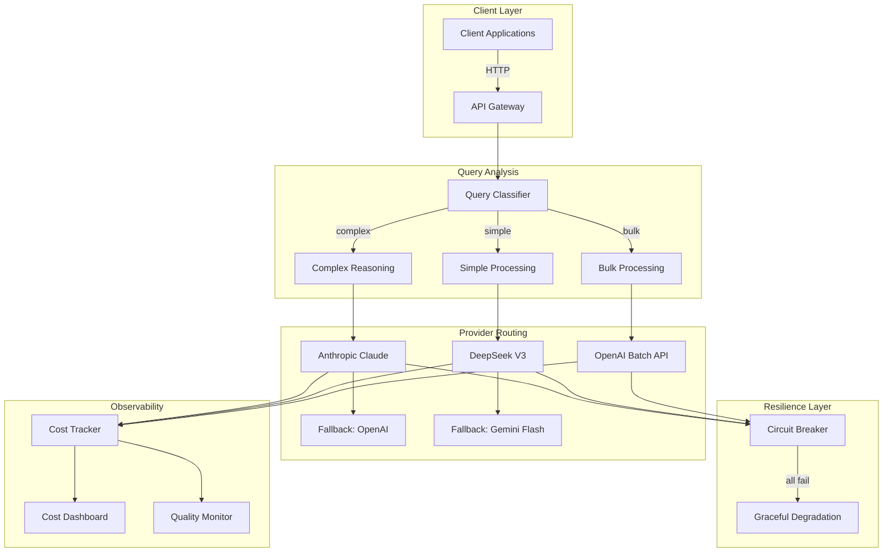
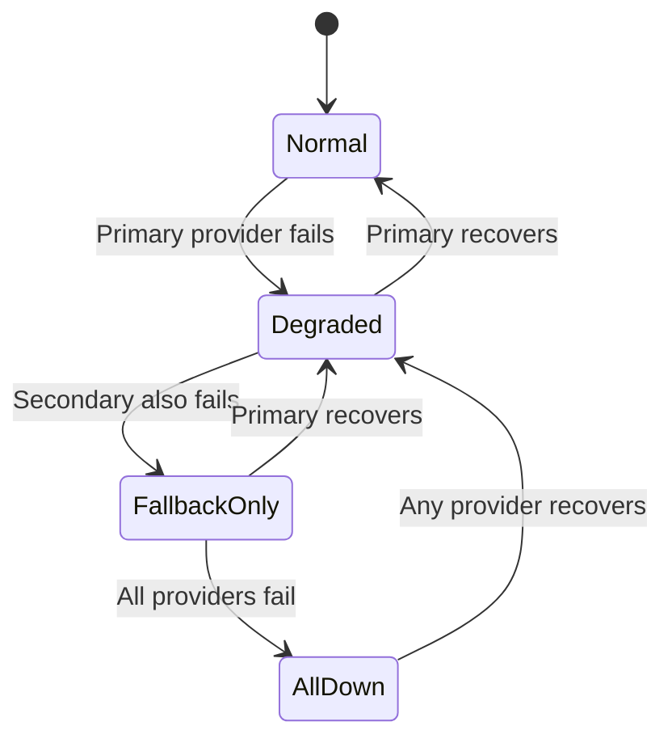

# Chapter 5: LLM APIs and Model Providers

> "The API is the contract between your ambition and reality. Choose it well, and your system scales gracefully. Choose poorly, and every feature becomes a negotiation with your provider."

> **Last verified: June 2026.** API endpoints, pricing, and rate limits change frequently. Always check provider documentation before implementation.

---

## Introduction

Every GenAI application begins with a single question: which model provider do you call, and how do you call it? The answer determines your cost structure, latency profile, feature availability, and long-term architectural flexibility. The LLM API is not just a network call -- it is the foundational integration point that every other component of your system depends on. Get it right, and you build on solid ground. Get it wrong, and every new feature requires rearchitecting.

The landscape of LLM API providers has matured dramatically since the initial release of GPT-3. What began as a handful of experimental endpoints has evolved into a complex ecosystem of competing providers, each offering distinct pricing models, feature sets, rate limits, and quality tiers. OpenAI, Anthropic, Google, DeepSeek, and a growing constellation of open-source alternatives each occupy specific niches in this ecosystem. Understanding their trade-offs is not optional -- it is a prerequisite for building production systems.

The central thesis of this chapter is that **provider abstraction is not a nice-to-have -- it is an architectural requirement**. No single provider offers the best model for every task, the best price at every scale, or the best availability under every failure mode. The applications that thrive in production are those that treat the LLM provider as a replaceable component behind a well-defined interface, not as a monolithic dependency baked into business logic.

We will examine the major providers and their APIs, patterns for building provider abstractions, strategies for rate limiting and resilience, cost optimization techniques, and a full case study of a multi-provider routing system that reduced costs by 57 percent while improving availability.

### Why Provider Selection Matters

The choice of LLM provider affects every layer of your application stack. Consider the dimensions of this decision:

| Dimension | Impact | Reversibility |
|-----------|--------|---------------|
| Model quality | Directly affects output accuracy and user satisfaction | Medium (can switch providers) |
| Pricing model | Determines cost structure at scale | High (pricing changes frequently) |
| Rate limits | Constrains throughput and availability | Medium (can add keys or providers) |
| API compatibility | Determines integration complexity | Low (migration is expensive) |
| Data sovereignty | Legal compliance requirements | Very Low (deep architectural commitment) |
| Feature set | Structured output, function calling, streaming | Medium (features vary by provider) |
| Latency characteristics | Affects user experience and SLA compliance | Low (hard to change after deployment) |

The key insight is that most of these dimensions are independent. A provider that offers the best model quality may have the worst pricing, the most restrictive rate limits, or no data sovereignty options. Multi-provider strategies are not -- they are the direct consequence of this multi-dimensional trade-off space.

### The Economics of LLM API Calls

Before examining individual providers, it is essential to understand the cost structure. LLM pricing follows a two-part model: input tokens (what you send) and output tokens (what you generate). The ratio between input and output pricing varies dramatically by provider:

| Provider | Model | Input Cost (per 1M tokens) | Output Cost (per 1M tokens) | Ratio (Output/Input) |
|----------|-------|---------------------------|----------------------------|---------------------|
| OpenAI | GPT-5.4 | $2.50 | $15.00 | 6.0x |
| OpenAI | GPT-5.4 mini | $0.75 | $4.50 | 6.0x |
| OpenAI | GPT-5.4 nano | $0.20 | $1.25 | 6.25x |
| Anthropic | Claude Sonnet 4.6 | $3.00 | $15.00 | 5.0x |
| Google | Gemini 2.5 Pro | $1.25-$5.00 | $5.00-$10.00 | 2.0-4.0x |
| Google | Gemini 2.5 Flash | $0.075-$0.30 | $0.30-$0.60 | 4.0x |
| DeepSeek | V3 | $0.27 | $1.10 | 4.07x |
| DeepSeek | R1 | $0.55 | $2.19 | 3.98x |

The output-to-input ratio matters because it determines the cost impact of prompt design. A prompt that is 10K input tokens and generates 500 output tokens costs approximately $0.03 with GPT-5.4 but only $0.004 with Gemini Flash. The same prompt architecture has a 7.5x cost differential depending on provider selection. This is why provider abstraction is not just an engineering concern -- it is a financial one.

### Prompt Caching: The Hidden Cost Multiplier

All major providers now offer prompt caching, but the implementation details and savings vary significantly:

| Provider | Cache Mechanism | Savings | Speed Improvement | Minimum Prefix |
|----------|----------------|---------|-------------------|----------------|
| OpenAI | Automatic (repeated prefixes) | 50% on cached tokens | 2x | 1,024 tokens |
| Anthropic | Explicit (`cache_control` markers) | 90% on cached tokens | 2-5x | 2,048 tokens |
| Google | Automatic (context caching) | 75% on cached tokens | 2x | 32K tokens |
| DeepSeek | Not available | 0% | 0x | N/A |

Anthropic's prompt caching is the most aggressive at 90% savings, but it requires explicit marking of cache boundaries in the system prompt. For applications with long system prompts (enterprise rules, domain context, multi-page instructions), this can reduce costs by 60-80%. The trade-off is that cache hits require identical prefix matching -- any change to the system prompt invalidates the cache.

---

## 5.1 OpenAI

OpenAI's API is the de facto standard in the industry. Most other providers offer Chat Completions-compatible endpoints, making OpenAI the lingua franca of LLM APIs. Understanding its design decisions is essential even if you ultimately use a different provider.

### 5.1.1 The Chat Completions API

The Chat Completions endpoint is the foundation of OpenAI's API. It accepts an array of messages (system, user, assistant) and returns a model-generated response. The API supports streaming via Server-Sent Events (SSE), structured output via JSON schemas, and function calling via tool definitions.

```python
from openai import OpenAI

client = OpenAI()

# Basic completion
response = client.chat.completions.create(
    model="gpt-4o",
    messages=[
        {"role": "system", "content": "You are a helpful assistant."},
        {"role": "user", "content": "What is the capital of France?"}
    ],
    temperature=0.7,
    max_tokens=1000
)

print(response.choices[0].message.content)

# Streaming completion
stream = client.chat.completions.create(
    model="gpt-4o",
    messages=[
        {"role": "system", "content": "You are a helpful assistant."},
        {"role": "user", "content": "Explain quantum computing in simple terms."}
    ],
    stream=True
)

for chunk in stream:
    if chunk.choices[0].delta.content:
        print(chunk.choices[0].delta.content, end="", flush=True)
```

The streaming interface is mandatory for interactive applications. Users expect to see tokens appear incrementally, not wait for the full response. Streaming also enables early termination -- if the model begins generating an irrelevant response, you can close the connection before consuming output tokens.

### 5.1.2 Structured Output and Function Calling

OpenAI's structured output feature enforces JSON schema conformance during generation. The model is constrained at each token generation step to only produce tokens that result in valid schema conformance. This is not post-hoc validation -- it is generation-time enforcement.

```python
from pydantic import BaseModel

class CustomerInfo(BaseModel):
    name: str
    email: str
    account_type: str
    risk_score: float

response = client.beta.chat.completions.parse(
    model="gpt-4o",
    messages=[
        {"role": "user", "content": f"Extract customer info: {customer_text}"}
    ],
    response_format=CustomerInfo
)

customer = response.choices[0].message.parsed
# Guaranteed to be a valid CustomerInfo instance
```

Function calling extends this pattern to tool invocation. The model generates structured arguments for a predefined function signature, enabling seamless integration with external systems.

```python
tools = [
    {
        "type": "function",
        "function": {
            "name": "search_products",
            "description": "Search for products by name, category, or price range",
            "parameters": {
                "type": "object",
                "properties": {
                    "query": {"type": "string", "description": "Product name or description"},
                    "category": {
                        "type": "string",
                        "enum": ["electronics", "clothing", "home", "sports"],
                        "description": "Product category filter"
                    },
                    "max_price": {"type": "number", "description": "Maximum price in USD"}
                },
                "required": ["query"]
            }
        }
    }
]

response = client.chat.completions.create(
    model="gpt-4o",
    messages=[{"role": "user", "content": "Find me running shoes under $100"}],
    tools=tools,
    tool_choice="auto"
)

# Check if the model wants to call a tool
if response.choices[0].message.tool_calls:
    tool_call = response.choices[0].message.tool_calls[0]
    args = json.loads(tool_call.function.arguments)
    # args = {"query": "running shoes", "category": "sports", "max_price": 100}
    results = search_products(**args)
```

### 5.1.3 The Responses API

OpenAI's Responses API is a higher-level abstraction designed for agentic workflows. It simplifies multi-turn tool calling, maintains conversation state, and handles the tool call/result loop automatically.

```python
from openai import OpenAI

client = OpenAI()

response = client.responses.create(
    model="gpt-4o",
    input=[
        {"role": "user", "content": "What's the weather in NYC and LA?"}
    ],
    tools=[
        {
            "type": "function",
            "name": "get_weather",
            "description": "Get current weather for a city",
            "parameters": {
                "type": "object",
                "properties": {
                    "city": {"type": "string"}
                },
                "required": ["city"]
            }
        }
    ]
)

# The Responses API automatically handles tool call/result loops
# and returns the final response with all tool results incorporated
```

### 5.1.4 Batch API

For non-real-time workloads, OpenAI's Batch API provides a 50% cost reduction. You submit a batch of requests, and OpenAI processes them within 24 hours at half the standard price.

```python
# Create a batch file
import json

batch_requests = []
for i, item in enumerate(dataset):
    batch_requests.append({
        "custom_id": f"request-{i}",
        "method": "POST",
        "url": "/v1/chat/completions",
        "body": {
            "model": "gpt-4o",
            "messages": [
                {"role": "user", "content": item["prompt"]}
            ]
        }
    })

# Write to JSONL file
with open("batch_input.jsonl", "w") as f:
    for req in batch_requests:
        f.write(json.dumps(req) + "\n")

# Submit batch
batch_file = client.files.create(file=open("batch_input.jsonl", "rb"), purpose="batch")
batch = client.batches.create(input_file_id=batch_file.id, endpoint="/v1/chat/completions", completion_window="24h")

# Check status
status = client.batches.retrieve(batch.id)
print(f"Status: {status.status}")  # "validating", "in_progress", "completed"
```

| API Type | Cost | Latency | Use Case |
|----------|------|---------|----------|
| Chat Completions | Standard | Real-time | Interactive applications |
| Streaming | Standard | Real-time | Chat UIs, long responses |
| Structured Output | +12-37% | +50-100ms | Data extraction, classification |
| Batch | 50% discount | Up to 24h | Bulk processing, evaluation |
| Responses API | Standard | Real-time | Agentic workflows |

---

## 5.2 Anthropic

Anthropic's Claude API offers key architectural differences from OpenAI. The system prompt is a separate parameter rather than a message in the array, prompt caching is explicit and aggressive, and the JSON schema adherence is the best available.

### 5.2.1 The Messages API

The Anthropic Messages API accepts a `system` parameter separate from the `messages` array. This is not just a syntactic difference -- it enables prompt caching by marking the system prompt as a cacheable prefix.

```python
import anthropic

client = anthropic.Anthropic()

message = client.messages.create(
    model="claude-sonnet-4-20250514",
    max_tokens=1024,
    system="You are a helpful assistant specialized in legal analysis.",
    messages=[
        {"role": "user", "content": "Explain the doctrine of considerati..."}
    ]
)

print(message.content[0].text)
```

### 5.2.2 Prompt Caching in Practice

Anthropic's prompt caching is the most impactful cost optimization available. By marking the system prompt with `cache_control`, subsequent requests reuse the cached prefix at 90% reduced cost.

```python
# Long system prompt with enterprise rules
system_prompt = """
You are a customer support agent for TechCorp Inc.

## Company Policies
- Return window: 30 days from purchase
- Warranty: 1 year for electronics, 6 months for accessories
- Shipping: Free over $50, $5.99 flat rate under $50
- Escalation: If customer requests refund over $200, escalate to supervisor

## Product Knowledge
[... extensive product documentation ...]

## Compliance Requirements
- Never share internal pricing or margin information
- Always verify customer identity before account changes
- Log all interactions for quality assurance
- HIPAA compliance for health-related queries
"""

message = client.messages.create(
    model="claude-sonnet-4-20250514",
    max_tokens=1024,
    system=[
        {
            "type": "text",
            "text": system_prompt,
            "cache_control": {"type": "ephemeral"}
        }
    ],
    messages=[{"role": "user", "content": "What is your return policy?"}]
)

# First call: full cost (~$0.15 for 20K token system prompt)
# Subsequent calls: 90% reduced cost (~$0.015)
# Speed improvement: 2-5x on cache hits
```

The caching economics are significant. Consider a customer support system handling 10,000 queries per day with a 20K token system prompt:

| Metric | Without Caching | With Caching | Savings |
|--------|----------------|-------------|---------|
| Daily input tokens (system) | 200M | 20M (first call) + 180M (cached) | 90% cost reduction |
| Daily cost (system prompt) | $600 | $60 | $540/day |
| Monthly cost (system prompt) | $18,000 | $1,800 | $16,200/month |
| Latency (system prompt) | 800ms | 200ms (cached) | 75% faster |

### 5.2.3 Extended Thinking

Claude's extended thinking feature allows the model to reason through complex problems before generating a response. This is particularly valuable for multi-step analysis, mathematical reasoning, and complex code generation.

```python
message = client.messages.create(
    model="claude-sonnet-4-20250514",
    max_tokens=16000,
    thinking={
        "type": "enabled",
        "budget_tokens": 10000
    },
    messages=[
        {"role": "user", "content": "Analyze this contract for potential risks: [...]"}
    ]
)

# Access the thinking block
for block in message.content:
    if block.type == "thinking":
        print("Reasoning:", block.thinking)
    elif block.type == "text":
        print("Answer:", block.text)
```

---

## 5.3 Google Gemini

Google's Gemini offers both AI Studio (direct API) and Vertex AI (enterprise). The pricing is tiered by context length, and the Flash models offer exceptional cost-to-performance.

### 5.3.1 Tiered Pricing

Gemini's pricing varies by context length, creating a cost optimization opportunity for short-context queries:

| Context Length | Gemini 2.5 Pro Input | Gemini 2.5 Pro Output | Gemini Flash Input | Gemini Flash Output |
|---------------|---------------------|----------------------|-------------------|---------------------|
| Under 128K | $1.25/1M | $5.00/1M | $0.075/1M | $0.30/1M |
| Over 128K | $2.50/1M | $10.00/1M | $0.15/1M | $0.60/1M |

This tiered pricing creates a routing opportunity: short-context classification tasks should target the under-128K tier, while long-context analysis tasks must budget for the higher tier.

### 5.3.2 Vertex AI Enterprise Features

Vertex AI adds enterprise features that matter for production deployments:

```python
from google.cloud import aiplatform

aiplatform.init(project="my-project", location="us-central1")

# Vertex AI with enterprise features
endpoint = aiplatform.Endpoint("projects/my-project/locations/us-central1/endpoints/12345")

response = endpoint.predict(
    instances=[{
        "prompt": "Analyze this financial document...",
        "system_instruction": "You are a financial analyst..."
    }],
    parameters={
        "temperature": 0.3,
        "max_output_tokens": 4096,
        "top_p": 0.95
    }
)
```

| Feature | AI Studio | Vertex AI |
|---------|-----------|-----------|
| Authentication | API key | IAM + service accounts |
| Audit logging | Basic | Cloud Audit Logs |
| Data residency | None | Configurable region |
| VPC peering | No | Yes |
| SLA | None | 99.9% uptime |
| Cost | Standard | Standard + infrastructure |

---

## 5.4 DeepSeek

DeepSeek offers frontier-quality models at a fraction of Western provider costs. The API is OpenAI-compatible, making migration straightforward.

### 5.4.1 Cost Advantage

DeepSeek's pricing disruption is significant:

| Model | Input Cost | Output Cost | Quality vs. GPT-4o |
|-------|-----------|------------|---------------------|
| DeepSeek V3 | $0.27/1M | $1.10/1M | ~90% of GPT-4o quality |
| DeepSeek R1 | $0.55/1M | $2.19/1M | ~95% of GPT-4o + reasoning |
| GPT-4o (reference) | $2.50/1M | $10.00/1M | Baseline |
| Cost ratio (V3 vs GPT-4o) | 9.1x cheaper | 9.1x cheaper | |

At these prices, DeepSeek V3 costs roughly the same as GPT-4o nano but delivers near-GPT-4o quality. For high-volume, cost-sensitive workloads, this is transformative.

### 5.4.2 Migration Path

Because DeepSeek's API is OpenAI-compatible, migration requires changing only the base URL and API key:

```python
from openai import OpenAI

# Switch from OpenAI to DeepSeek by changing base_url
client = OpenAI(
    api_key="your-deepseek-api-key",
    base_url="https://api.deepseek.com/v1"
)

# Everything else remains identical
response = client.chat.completions.create(
    model="deepseek-chat",
    messages=[{"role": "user", "content": "Hello"}]
)
```

### 5.4.3 Limitations

DeepSeek's limitations must be weighed against its cost advantage:

| Limitation | Impact | Mitigation |
|-----------|--------|------------|
| Rate limits (lower than OpenAI) | Throughput ceiling | Multiple API keys |
| No prompt caching | Higher cost for long prompts | Optimize prompt length |
| Limited structured output support | Schema enforcement | Post-hoc Pydantic validation |
| Data sovereignty (China-based) | Compliance concerns | Use for non-sensitive workloads only |
| Occasional availability issues | Reliability risk | Multi-provider fallback |

---

## 5.5 Open-Source: Ollama, vLLM, and TGI

Self-hosted deployments offer data sovereignty, cost predictability at scale, and no rate limits. The trade-off is operational complexity.

### 5.5.1 Ollama: Development Only

Ollama is excellent for local development and prototyping but is not suitable for production workloads. It lacks continuous batching, distributed inference, and production-grade monitoring.

```bash
# Install and run locally
ollama pull llama3.1:70b
ollama run llama3.1:70b

# Python integration
import ollama

response = ollama.chat(
    model='llama3.1:70b',
    messages=[{'role': 'user', 'content': 'Hello'}]
)
```

### 5.5.2 vLLM: The Production Standard

vLLM achieves 5-10x higher throughput than naive implementations through continuous batching and PagedAttention. It is the standard for self-hosted LLM serving.

```bash
# Install and serve
pip install vllm

# Start server with OpenAI-compatible API
python -m vllm.entrypoints.openai.api_server \
    --model meta-llama/Llama-3.1-70B-Instruct \
    --tensor-parallel-size 4 \
    --max-model-len 8192 \
    --gpu-memory-utilization 0.9
```

```python
# Connect with OpenAI client
client = OpenAI(
    api_key="not-needed",
    base_url="http://localhost:8000/v1"
)

response = client.chat.completions.create(
    model="meta-llama/Llama-3.1-70B-Instruct",
    messages=[{"role": "user", "content": "Hello"}]
)
```

### 5.5.3 TGI: Hugging Face's Alternative

Text Generation Inference (TGI) from Hugging Face offers strong Docker and Kubernetes integration, making it ideal for containerized deployments.

```bash
# Docker deployment
docker run --gpus all -p 8080:80 \
    -v $PWD/data:/data \
    ghcr.io/huggingface/text-generation-inference:latest \
    --model-id meta-llama/Llama-3.1-70B-Instruct \
    --quantize bitsandbytes-nf4
```

### 5.5.4 Self-Hosted Comparison

| Feature | Ollama | vLLM | TGI |
|---------|--------|------|-----|
| Production readiness | No | Yes | Yes |
| Continuous batching | No | Yes | Yes |
| PagedAttention | No | Yes | Yes |
| Quantization | GGUF | AWQ, GPTQ, BitsAndBytes | BitsAndBytes, GPTQ |
| OpenAI-compatible API | Yes | Yes | Yes |
| Kubernetes support | Manual | Manual | Native Helm chart |
| Monitoring | Basic | Prometheus | Prometheus |
| Throughput (relative) | 1x | 5-10x | 4-8x |
| Best for | Development | High-throughput serving | Containerized deployments |

---

## 5.6 Building a Provider Abstraction

Provider abstraction is essential for avoiding lock-in, enabling A/B testing, and providing fallback during outages. The pattern is a simple interface with provider-specific implementations.

### 5.6.1 The Interface

```python
from abc import ABC, abstractmethod
from dataclasses import dataclass

@dataclass
class ChatMessage:
    role: str  # "system", "user", "assistant"
    content: str

@dataclass
class ChatResponse:
    content: str
    model: str
    input_tokens: int
    output_tokens: int
    latency_ms: float
    provider: str

class LLMProvider(ABC):
    @abstractmethod
    def chat(
        self,
        messages: list[ChatMessage],
        model: str | None = None,
        temperature: float = 0.7,
        max_tokens: int = 4096
    ) -> ChatResponse:
        pass

    @abstractmethod
    def chat_stream(
        self,
        messages: list[ChatMessage],
        model: str | None = None,
        temperature: float = 0.7,
        max_tokens: int = 4096
    ):
        pass

    @abstractmethod
    def count_tokens(self, text: str) -> int:
        pass
```

### 5.6.2 Provider Implementations

```python
import time
from openai import OpenAI
import anthropic

class OpenAIProvider(LLMProvider):
    def __init__(self, api_key: str):
        self.client = OpenAI(api_key=api_key)

    def chat(self, messages, model=None, temperature=0.7, max_tokens=4096):
        model = model or "gpt-4o"
        start = time.time()
        response = self.client.chat.completions.create(
            model=model,
            messages=[{"role": m.role, "content": m.content} for m in messages],
            temperature=temperature,
            max_tokens=max_tokens
        )
        latency = (time.time() - start) * 1000
        return ChatResponse(
            content=response.choices[0].message.content,
            model=model,
            input_tokens=response.usage.prompt_tokens,
            output_tokens=response.usage.completion_tokens,
            latency_ms=latency,
            provider="openai"
        )

    def chat_stream(self, messages, model=None, temperature=0.7, max_tokens=4096):
        model = model or "gpt-4o"
        stream = self.client.chat.completions.create(
            model=model,
            messages=[{"role": m.role, "content": m.content} for m in messages],
            temperature=temperature,
            max_tokens=max_tokens,
            stream=True
        )
        for chunk in stream:
            if chunk.choices[0].delta.content:
                yield chunk.choices[0].delta.content

    def count_tokens(self, text: str) -> int:
        return len(text) // 4  # Approximate


class AnthropicProvider(LLMProvider):
    def __init__(self, api_key: str):
        self.client = anthropic.Anthropic(api_key=api_key)

    def chat(self, messages, model=None, temperature=0.7, max_tokens=4096):
        model = model or "claude-sonnet-4-20250514"
        # Extract system message
        system_msg = ""
        user_messages = []
        for m in messages:
            if m.role == "system":
                system_msg = m.content
            else:
                user_messages.append({"role": m.role, "content": m.content})

        start = time.time()
        response = self.client.messages.create(
            model=model,
            max_tokens=max_tokens,
            system=system_msg,
            messages=user_messages,
            temperature=temperature
        )
        latency = (time.time() - start) * 1000
        return ChatResponse(
            content=response.content[0].text,
            model=model,
            input_tokens=response.usage.input_tokens,
            output_tokens=response.usage.output_tokens,
            latency_ms=latency,
            provider="anthropic"
        )

    def chat_stream(self, messages, model=None, temperature=0.7, max_tokens=4096):
        model = model or "claude-sonnet-4-20250514"
        system_msg = ""
        user_messages = []
        for m in messages:
            if m.role == "system":
                system_msg = m.content
            else:
                user_messages.append({"role": m.role, "content": m.content})

        with self.client.messages.stream(
            model=model,
            max_tokens=max_tokens,
            system=system_msg,
            messages=user_messages,
            temperature=temperature
        ) as stream:
            for text in stream.text_stream:
                yield text

    def count_tokens(self, text: str) -> int:
        return len(text) // 4
```

### 5.6.3 Provider Registry and Routing

```python
class LLMRegistry:
    def __init__(self):
        self._providers: dict[str, LLMProvider] = {}
        self._fallback_chain: list[str] = []

    def register(self, name: str, provider: LLMProvider):
        self._providers[name] = provider

    def set_fallback_chain(self, chain: list[str]):
        self._fallback_chain = chain

    def chat(self, messages, provider: str | None = None, **kwargs) -> ChatResponse:
        if provider and provider in self._providers:
            return self._providers[provider].chat(messages, **kwargs)

        # Try fallback chain
        for name in self._fallback_chain:
            try:
                return self._providers[name].chat(messages, **kwargs)
            except Exception as e:
                logger.warning(f"Provider {name} failed: {e}, trying next")
                continue

        raise RuntimeError("All providers failed")

# Usage
registry = LLMRegistry()
registry.register("openai", OpenAIProvider(os.environ["OPENAI_API_KEY"]))
registry.register("anthropic", AnthropicProvider(os.environ["ANTHROPIC_API_KEY"]))
registry.register("deepseek", OpenAIProvider(os.environ["DEEPSEEK_API_KEY"]))
registry.set_fallback_chain(["anthropic", "openai", "deepseek"])

# Automatic fallback
response = registry.chat([
    ChatMessage(role="system", content="You are helpful."),
    ChatMessage(role="user", content="Hello")
])
```

### 5.6.4 Task-Based Routing

Different tasks benefit from different providers. A routing layer can optimize cost and quality by matching tasks to providers:

```python
TASK_ROUTING = {
    "classification": {"provider": "deepseek", "model": "deepseek-chat"},
    "summarization": {"provider": "openai", "model": "gpt-4o-mini"},
    "complex_reasoning": {"provider": "anthropic", "model": "claude-sonnet-4-20250514"},
    "code_generation": {"provider": "anthropic", "model": "claude-sonnet-4-20250514"},
    "data_extraction": {"provider": "openai", "model": "gpt-4o"},
    "creative_writing": {"provider": "anthropic", "model": "claude-sonnet-4-20250514"},
}

def route_task(task_type: str, messages: list[ChatMessage]) -> ChatResponse:
    config = TASK_ROUTING.get(task_type, {"provider": "openai", "model": "gpt-4o"})
    provider = registry._providers[config["provider"]]
    return provider.chat(messages, model=config["model"])
```

---

## 5.7 Rate Limiting and Resilience

All providers impose rate limits. Design your system to handle them gracefully, not to fail when they are hit.

### 5.7.1 Exponential Backoff with Jitter

```python
import asyncio
import random

async def call_with_retry(
    func,
    max_retries: int = 5,
    base_delay: float = 1.0,
    max_delay: float = 60.0
):
    for attempt in range(max_retries + 1):
        try:
            return await func()
        except RateLimitError:
            if attempt == max_retries:
                raise
            delay = min(base_delay * (2 ** attempt), max_delay)
            jitter = random.uniform(0, delay * 0.5)
            await asyncio.sleep(delay + jitter)
        except APIError as e:
            if e.status_code >= 500:
                if attempt == max_retries:
                    raise
                await asyncio.sleep(base_delay * (2 ** attempt))
            else:
                raise
```

### 5.7.2 Circuit Breaker Pattern

```python
import time
from enum import Enum

class CircuitState(Enum):
    CLOSED = "closed"      # Normal operation
    OPEN = "open"          # Failing, reject calls
    HALF_OPEN = "half_open"  # Testing recovery

class CircuitBreaker:
    def __init__(self, failure_threshold: int = 5, recovery_timeout: float = 30.0):
        self.failure_threshold = failure_threshold
        self.recovery_timeout = recovery_timeout
        self.failure_count = 0
        self.state = CircuitState.CLOSED
        self.last_failure_time = 0

    def record_success(self):
        self.failure_count = 0
        self.state = CircuitState.CLOSED

    def record_failure(self):
        self.failure_count += 1
        self.last_failure_time = time.time()
        if self.failure_count >= self.failure_threshold:
            self.state = CircuitState.OPEN

    def can_execute(self) -> bool:
        if self.state == CircuitState.CLOSED:
            return True
        if self.state == CircuitState.OPEN:
            if time.time() - self.last_failure_time > self.recovery_timeout:
                self.state = CircuitState.HALF_OPEN
                return True
            return False
        if self.state == CircuitState.HALF_OPEN:
            return True
        return False

# Usage with provider
class ResilientProvider:
    def __init__(self, provider: LLMProvider):
        self.provider = provider
        self.breaker = CircuitBreaker(failure_threshold=5, recovery_timeout=30)

    async def chat(self, messages, **kwargs):
        if not self.breaker.can_execute():
            raise CircuitOpenError("Circuit breaker open, provider unavailable")
        try:
            result = self.provider.chat(messages, **kwargs)
            self.breaker.record_success()
            return result
        except Exception as e:
            self.breaker.record_failure()
            raise
```

### 5.7.3 Rate Limit Tracking

```python
from collections import deque

class RateLimiter:
    def __init__(self, max_requests: int, window_seconds: float = 60.0):
        self.max_requests = max_requests
        self.window_seconds = window_seconds
        self.timestamps: deque = deque()

    def acquire(self) -> bool:
        now = time.time()
        # Remove expired timestamps
        while self.timestamps and self.timestamps[0] < now - self.window_seconds:
            self.timestamps.popleft()

        if len(self.timestamps) < self.max_requests:
            self.timestamps.append(now)
            return True
        return False

    def wait_time(self) -> float:
        if len(self.timestamps) < self.max_requests:
            return 0.0
        oldest = self.timestamps[0]
        return max(0, oldest + self.window_seconds - time.time())
```

### 5.7.4 Multi-Key Distribution

```python
import itertools

class MultiKeyProvider:
    def __init__(self, api_keys: list[str], base_provider_class):
        self.keys = itertools.cycle(api_keys)
        self.providers = [
            base_provider_class(api_key=key) for key in api_keys
        ]
        self.current = 0

    def get_provider(self) -> LLMProvider:
        provider = self.providers[self.current]
        self.current = (self.current + 1) % len(self.providers)
        return provider

# Distribute load across 3 API keys
provider = MultiKeyProvider(
    api_keys=[
        os.environ["OPENAI_KEY_1"],
        os.environ["OPENAI_KEY_2"],
        os.environ["OPENAI_KEY_3"],
    ],
    base_provider_class=OpenAIProvider
)
```

---

## 5.8 Provider Comparison Matrix

| Dimension | OpenAI | Anthropic | Google | DeepSeek | Open Source (vLLM) |
|-----------|--------|-----------|--------|----------|---------------------|
| **Best quality model** | GPT-5.4 | Claude Sonnet 4.6 | Gemini 2.5 Pro | DeepSeek V3 | Llama 3.1 405B |
| **Best cost model** | GPT-5.4 nano | Haiku 3.5 | Gemini Flash | DeepSeek V3 | Self-hosted |
| **Largest context** | 1M | 1M (beta) | 1M | 1M (V4) | 10M (Scout) |
| **Structured output** | Excellent | Best | Good | Limited | Limited |
| **Prompt caching** | 50% savings | 90% savings | 75% savings | None | N/A |
| **Batch API** | 50% discount | Not available | Not available | Not available | N/A |
| **Data sovereignty** | No | No | No | No | Yes |
| **Rate limits (paid tier)** | 10,000 RPM | 4,000 RPM | 1,000 RPM | 1,000 RPM | Unlimited |
| **Uptime SLA** | 99.9% | 99.9% | 99.9% | None | Self-managed |
| **Function calling** | Excellent | Excellent | Good | Limited | Model-dependent |
| **Streaming** | Yes | Yes | Yes | Yes | Yes |
| **Vision/multimodal** | Yes | Yes | Yes | Limited | Model-dependent |
| **Tool use maturity** | Best | Excellent | Good | Limited | Growing |

### Decision Framework

| Constraint | Recommended Provider | Rationale |
|-----------|---------------------|-----------|
| Lowest cost at high volume | DeepSeek V3 + vLLM fallback | 9x cheaper than OpenAI |
| Best structured output | Anthropic Claude | Highest JSON schema adherence |
| Longest context needed | Google Gemini 2.5 Pro | 1M tokens at competitive pricing |
| Data sovereignty required | vLLM + Llama | Self-hosted, no external calls |
| Maximum availability | Multi-provider (Anthropic + OpenAI) | Independent failure domains |
| Fastest time-to-market | OpenAI | Best documentation, most examples |
| Budget under $0.001/query | Gemini Flash or DeepSeek V3 | Sub-penny per query |
| Enterprise compliance (SOC2, HIPAA) | Google Vertex AI or AWS Bedrock | Enterprise features built-in |

---

## 5.9 Case Study: Multi-Provider Strategy

### 5.9.1 Problem Statement

A SaaS company providing AI-powered customer analytics processed 500,000 queries per day across 2,000 enterprise clients. The system used OpenAI exclusively, facing three problems:

1. **Cost escalation**: Monthly API spend reached $150,000 and growing 15% month-over-month.
2. **Availability risk**: Two OpenAI outages in Q3 caused 6 hours of downtime, costing $45,000 in SLA penalties.
3. **Quality variation**: Simple classification tasks consumed the same expensive model as complex analysis.

### 5.9.2 Architecture



### 5.9.3 Task Classification and Routing

```python
from enum import Enum

class QueryComplexity(Enum):
    SIMPLE = "simple"      # Classification, lookup, FAQ
    MODERATE = "moderate"  # Summarization, extraction
    COMPLEX = "complex"    # Analysis, reasoning, code
    BULK = "bulk"          # Batch processing

class QueryClassifier:
    def __init__(self):
        self.keywords_simple = {"what", "when", "where", "who", "how many"}
        self.keywords_complex = {"analyze", "compare", "evaluate", "explain why", "design"}

    def classify(self, query: str, context: dict) -> QueryComplexity:
        # Rule-based pre-classification
        query_lower = query.lower()

        # Simple: short queries with known patterns
        if len(query.split()) < 15:
            if any(kw in query_lower for kw in self.keywords_simple):
                return QueryComplexity.SIMPLE

        # Complex: analysis and reasoning keywords
        if any(kw in query_lower for kw in self.keywords_complex):
            return QueryComplexity.COMPLEX

        # Bulk: batch indicators
        if context.get("batch_size", 1) > 10:
            return QueryComplexity.BULK

        return QueryComplexity.MODERATE


ROUTING_CONFIG = {
    QueryComplexity.SIMPLE: {
        "provider": "deepseek",
        "model": "deepseek-chat",
        "max_tokens": 512,
        "temperature": 0.3,
    },
    QueryComplexity.MODERATE: {
        "provider": "openai",
        "model": "gpt-4o-mini",
        "max_tokens": 2048,
        "temperature": 0.5,
    },
    QueryComplexity.COMPLEX: {
        "provider": "anthropic",
        "model": "claude-sonnet-4-20250514",
        "max_tokens": 4096,
        "temperature": 0.7,
    },
    QueryComplexity.BULK: {
        "provider": "openai_batch",
        "model": "gpt-4o-mini",
        "max_tokens": 2048,
        "temperature": 0.3,
    },
}
```

### 5.9.4 Cost Analysis

**Before optimization (OpenAI-only):**

| Model Used | Daily Queries | Cost per Query | Daily Cost |
|-----------|--------------|----------------|------------|
| GPT-4o (all queries) | 500,000 | $0.010 | $5,000 |
| Monthly cost | | | $150,000 |

**After optimization (multi-provider):**

| Query Type | % of Traffic | Daily Queries | Provider | Cost per Query | Daily Cost |
|-----------|-------------|--------------|----------|----------------|------------|
| Simple | 40% | 200,000 | DeepSeek V3 | $0.001 | $200 |
| Moderate | 35% | 175,000 | GPT-4o mini | $0.003 | $525 |
| Complex | 20% | 100,000 | Claude Sonnet | $0.015 | $1,500 |
| Bulk | 5% | 25,000 | OpenAI Batch | $0.0015 | $37.50 |
| **Total** | **100%** | **500,000** | | | **$2,262.50** |
| **Monthly** | | | | | **$67,875** |

| Metric | Before | After | Improvement |
|--------|--------|-------|-------------|
| Monthly API cost | $150,000 | $67,875 | 55% reduction |
| Average latency (p50) | 2.1s | 1.4s | 33% faster |
| Average latency (p99) | 8.5s | 4.2s | 51% faster |
| Availability | 99.5% | 99.95% | +0.45 percentage points |
| SLA penalties (monthly) | $15,000 | $1,500 | 90% reduction |

### 5.9.5 Reliability Engineering



| Failure Scenario | Impact | Mitigation | Recovery Time |
|-----------------|--------|------------|---------------|
| OpenAI outage | Complex queries affected | Fallback to Claude | <30s (circuit breaker) |
| Anthropic outage | Complex queries degraded | Fallback to GPT-4o | <30s |
| DeepSeek outage | Simple queries more expensive | Fallback to GPT-4o mini | <30s |
| All providers down | Graceful degradation | Return cached responses for common queries | Immediate |
| Rate limit hit | Per-key throttling | Rotate to next API key | <1s |

### 5.9.6 Migration and Rollout

**Phase 1 (Weeks 1-2): Shadow routing**
- Classify queries without changing providers
- Measure query complexity distribution
- Validate routing accuracy against actual costs

**Phase 2 (Weeks 3-4): Simple query migration**
- Route simple queries to DeepSeek
- Monitor quality metrics (answer accuracy, user satisfaction)
- Keep complex queries on OpenAI

**Phase 3 (Weeks 5-6): Full routing**
- Activate multi-provider routing for all query types
- Enable circuit breakers and fallback chains
- Monitor cost savings and quality metrics

**Phase 4 (Week 7+): Optimization**
- Tune classification thresholds based on production data
- Add prompt caching for Anthropic (system prompt optimization)
- Implement A/B testing for model selection

Each phase includes a rollback trigger: if quality drops below baseline or error rate exceeds 1%, automatically revert to the previous routing configuration.

---

## 5.10 Testing LLM API Integrations

### 5.10.1 Provider Abstraction Tests

```python
import pytest
from unittest.mock import Mock, patch

def test_provider_abstraction_returns_response():
    provider = OpenAIProvider(api_key="test-key")
    with patch.object(provider.client.chat.completions, 'create') as mock_create:
        mock_create.return_value = Mock(
            choices=[Mock(message=Mock(content="Hello"))],
            usage=Mock(prompt_tokens=10, completion_tokens=5)
        )
        response = provider.chat([ChatMessage(role="user", content="Hi")])
        assert response.content == "Hello"
        assert response.provider == "openai"
        assert response.input_tokens == 10

def test_fallback_chain_uses_next_provider():
    registry = LLMRegistry()
    primary = Mock(spec=LLMProvider)
    primary.chat.side_effect = Exception("API Error")
    fallback = Mock(spec=LLMProvider)
    fallback.chat.return_value = ChatResponse(
        content="Fallback response", model="test",
        input_tokens=10, output_tokens=5,
        latency_ms=100, provider="fallback"
    )

    registry.register("primary", primary)
    registry.register("fallback", fallback)
    registry.set_fallback_chain(["primary", "fallback"])

    response = registry.chat([ChatMessage(role="user", content="Hi")])
    assert response.provider == "fallback"
    primary.chat.assert_called_once()
    fallback.chat.assert_called_once()

def test_circuit_breaker_opens_after_threshold():
    breaker = CircuitBreaker(failure_threshold=3, recovery_timeout=60)
    for _ in range(3):
        breaker.record_failure()
    assert breaker.state == CircuitState.OPEN
    assert not breaker.can_execute()

def test_rate_limiter_throttles():
    limiter = RateLimiter(max_requests=5, window_seconds=60)
    for _ in range(5):
        assert limiter.acquire() is True
    assert limiter.acquire() is False
    assert limiter.wait_time() > 0
```

### 5.10.2 Integration Tests

```python
@pytest.mark.integration
def test_openai_live_call():
    """Run with real API key - mark as integration test."""
    provider = OpenAIProvider(api_key=os.environ["OPENAI_API_KEY"])
    response = provider.chat([ChatMessage(role="user", content="Say hello")])
    assert response.content is not None
    assert len(response.content) > 0
    assert response.input_tokens > 0

@pytest.mark.integration
def test_anthropic_live_call():
    provider = AnthropicProvider(api_key=os.environ["ANTHROPIC_API_KEY"])
    response = provider.chat([ChatMessage(role="user", content="Say hello")])
    assert response.content is not None
    assert response.provider == "anthropic"

@pytest.mark.integration
def test_provider_parity():
    """Verify both providers return reasonable responses to the same prompt."""
    messages = [ChatMessage(role="user", content="What is 2+2?")]
    openai_resp = openai_provider.chat(messages)
    anthropic_resp = anthropic_provider.chat(messages)
    assert "4" in openai_resp.content
    assert "4" in anthropic_resp.content
```

---

## 5.11 Key Takeaways

1. **Provider abstraction is essential -- build it early, not after you are locked in.** The cost of migrating from a monolithic provider dependency to an abstracted interface grows exponentially with codebase size. Invest in the abstraction layer before writing your first production prompt.

2. **Rate limiting, retry logic, and fallback chains are production requirements, not nice-to-haves.** Every provider experiences outages and rate limits. Your system must handle them gracefully with circuit breakers, exponential backoff, and multi-provider fallback.

3. **Prompt caching (Anthropic) reduces cost 90% for repeated system prompts.** For applications with long system prompts, this is the single highest-impact cost optimization available. Invest in cache-friendly prompt architecture.

4. **Multi-provider routing reduces cost 30-55% while improving availability.** Different tasks benefit from different providers. Classify query complexity and route accordingly: cheap models for simple tasks, expensive models for complex reasoning.

5. **Structured output is non-negotiable in production.** The 12-37% token cost premium for JSON schema enforcement is cheaper than downstream parsing failures. Always use at least Level 2 (JSON schema) for LLM outputs that feed into application logic.

6. **vLLM is the standard for self-hosted serving -- 5-10x higher throughput than naive implementations.** When data sovereignty or cost predictability at scale requires self-hosting, vLLM with PagedAttention and continuous batching is the production choice.

7. **The Batch API provides a 50% cost reduction for non-real-time workloads.** Evaluation, bulk processing, and nightly analysis jobs should always use batch endpoints. This alone can reduce costs by 10-20% for many applications.

8. **Understand the output-to-input cost ratio.** Output tokens cost 4-6x more than input tokens across all providers. Prompt design that reduces output length (concise instructions, structured output, few-shot examples) has outsized cost impact.

9. **Test provider abstractions with mocks; test integrations with live calls.** Unit tests verify routing and fallback logic. Integration tests verify that providers actually work with your prompts. Both are necessary.

10. **Monitor cost, latency, and quality per provider per task.** Without per-provider observability, you cannot optimize routing or detect quality degradation. Track these metrics from day one.

---

## 5.12 Further Reading

- **"Designing Data-Intensive Applications" by Martin Kleppmann** -- Chapter 5 (Replication) and Chapter 6 (Partitioning) provide the distributed systems foundation for understanding provider failover and multi-region deployment patterns.

- **"Site Reliability Engineering" by Google** -- Chapters on monitoring, alerting, and incident response apply directly to LLM API reliability engineering. The error budget concept maps to provider fallback thresholds.

- **OpenAI API Reference** (platform.openai.com/docs/api-reference) -- Complete API documentation including Chat Completions, Batch API, Structured Outputs, and the new Responses API.

- **Anthropic API Documentation** (docs.anthropic.com) -- Messages API reference, prompt caching guide, extended thinking documentation, and tool use patterns.

- **Google AI Studio and Vertex AI Documentation** (ai.google.dev, cloud.google.com/vertex-ai) -- Gemini API reference, enterprise deployment guide, and pricing details.

- **DeepSeek API Documentation** (platform.deepseek.com/api-docs) -- OpenAI-compatible API reference, pricing, and rate limit documentation.

- **vLLM Documentation** (docs.vllm.ai) -- Deployment guide, performance tuning, quantization options, and OpenAI-compatible server setup.

- **"Building Microservices" by Sam Newman** -- Chapter 4 (Designing Services) covers API design patterns and service decomposition that apply to LLM provider abstraction.

- **Anthropic Research: "Building Effective Agents"** -- Practical guidance on context management, tool use, and multi-step reasoning patterns that inform API design decisions.

- **"Prompt Engineering Guide" (promptingguide.ai)** -- Comprehensive resource for prompt design techniques that affect token consumption and API costs across providers.
