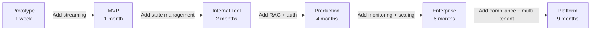
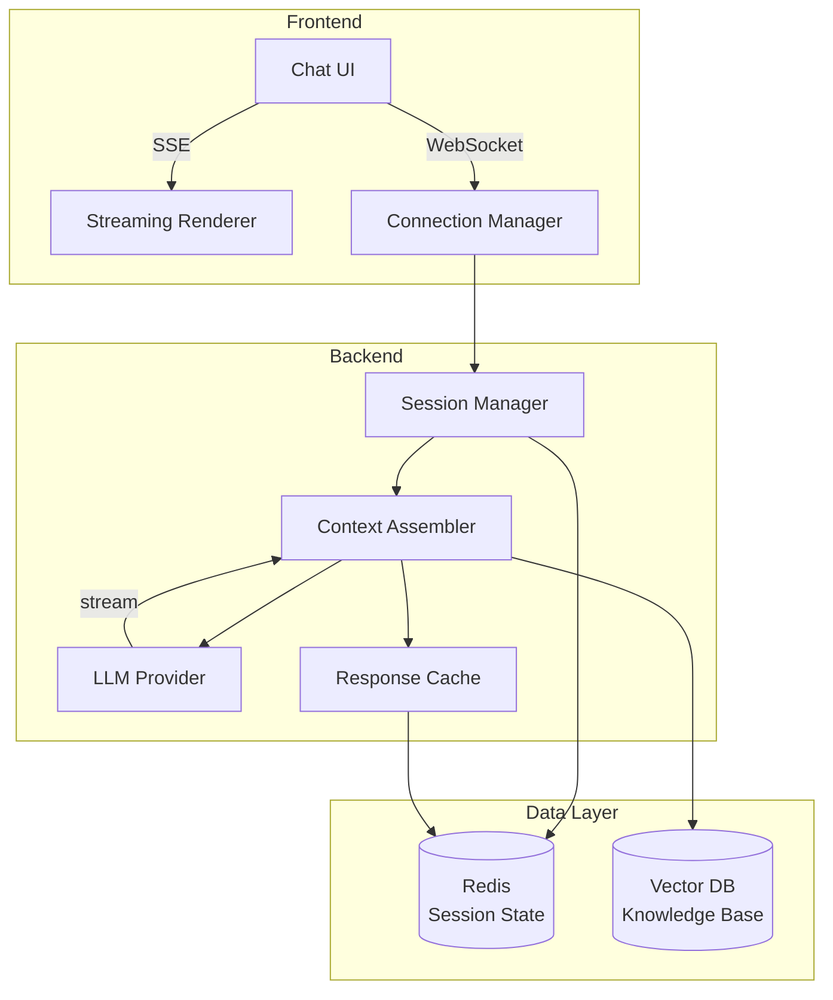
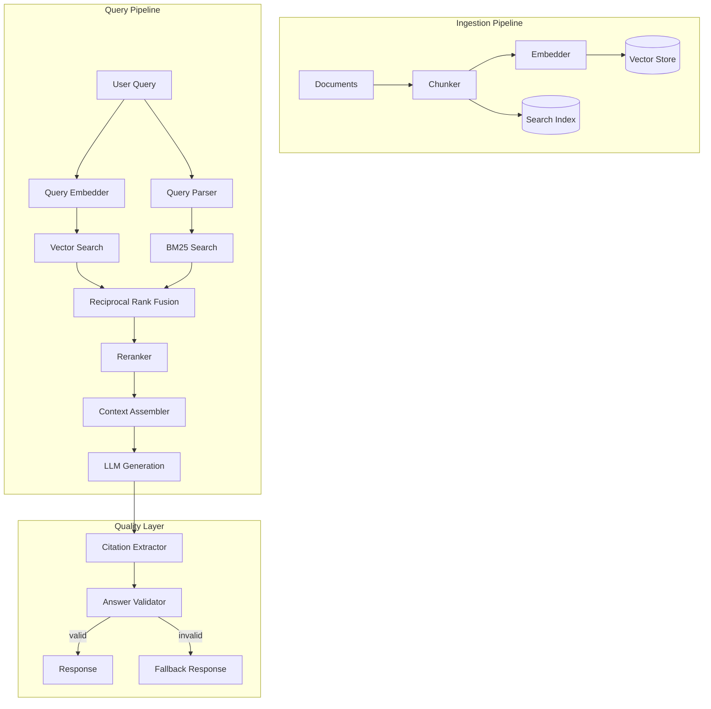
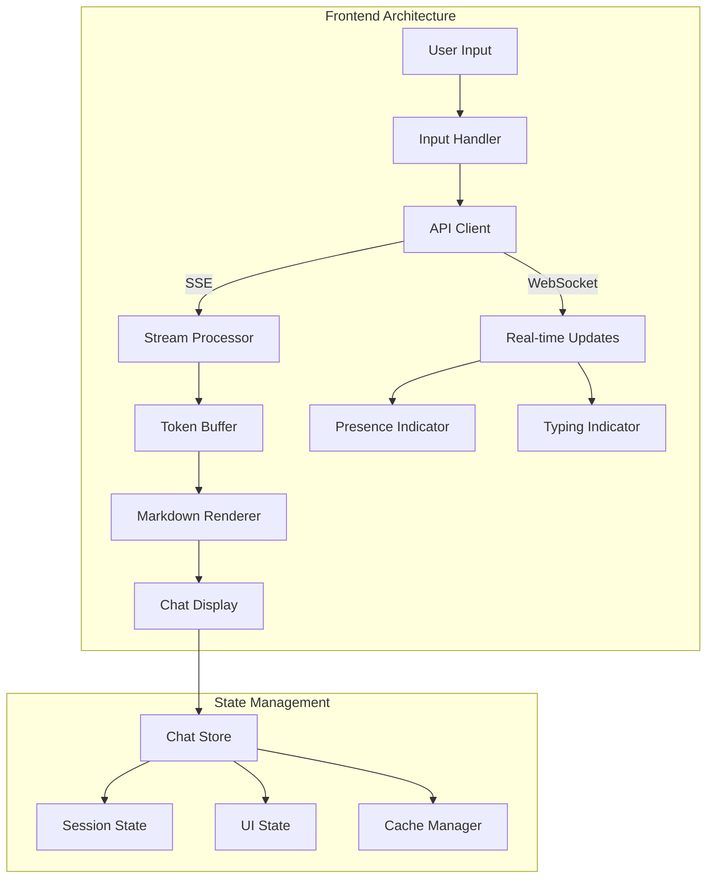
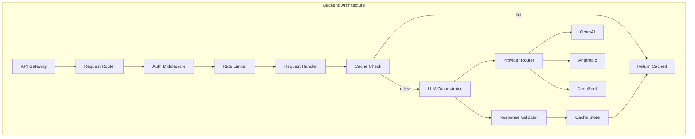
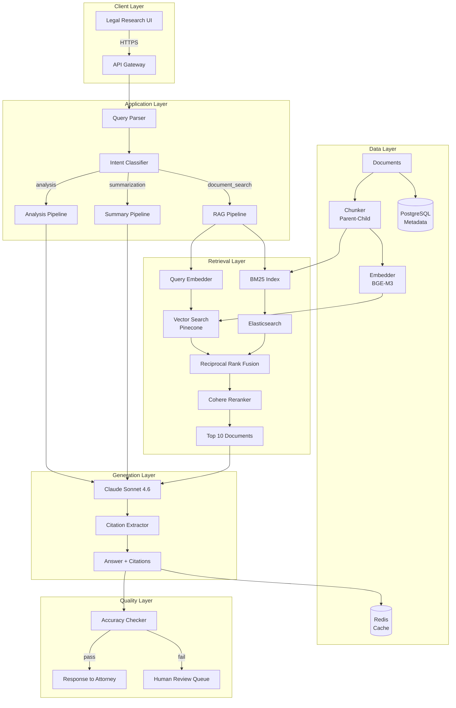

# Chapter 6: Building AI Applications

> "Architecture is not about building systems that work -- it is about building systems that work when everything else fails."

---

## Introduction

Building a GenAI application is fundamentally different from building traditional software. In conventional web applications, the logic is deterministic: given the same input, the system produces the same output every time. In AI applications, the core component -- the LLM -- is probabilistic. It may produce different outputs for the same input, it may hallucinate facts, and its behavior varies across model versions. This fundamental difference reshapes every architectural decision, from how you handle state to how you monitor quality.

The gap between a prototype and a production AI application is enormous. A prototype needs a single API call and a simple UI. A production application needs streaming, state management, context engineering, retrieval pipelines, tool orchestration, evaluation frameworks, monitoring dashboards, access control, rate limiting, caching, fallback chains, and compliance logging. Each of these concerns is a distinct architectural layer with its own design patterns and trade-offs.

The central thesis of this chapter is that **production AI applications are layered architectures where each layer has a single, well-defined responsibility**. The frontend handles user interaction. The backend orchestrates between components. The LLM layer abstracts provider complexity. The data layer provides persistent storage. The memory layer manages conversational state. The observability layer provides monitoring and debugging. These layers are not optional -- they are the minimum viable architecture for any production system.

We will examine each layer in detail, explore the architectural patterns that make them work, and build a complete case study of an enterprise knowledge assistant that serves 500 attorneys across 100,000 documents.

### The Prototype-to-Production Gap

Consider the trajectory of a typical AI application:



Each stage adds architectural layers. The mistake most teams make is treating production as a future concern rather than an architectural input. By the time you need monitoring, it is too late to instrument every component. By the time you need compliance, it is too late to add audit logging. The architecture must anticipate these requirements from day one.

| Stage | Duration | Layers | Typical Cost |
|-------|----------|--------|-------------|
| Prototype | 1 week | LLM call + UI | $500 |
| MVP | 1 month | + Streaming + state | $5,000 |
| Internal tool | 2 months | + RAG + auth + caching | $25,000 |
| Production | 4 months | + Monitoring + fallback + rate limiting | $100,000 |
| Enterprise | 6 months | + Compliance + RBAC + multi-tenant | $250,000 |
| Platform | 9 months | + Self-serve + analytics + governance | $500,000+ |

---

## 6.1 Application Types

Different AI application types have distinct architectural requirements. Understanding these requirements before building prevents costly rearchitecting later.

### 6.1.1 Chatbots and Assistants

The simplest application type -- user sends a message, model responds. But the simplicity is deceptive. Production chatbots require streaming response delivery, chat history management with token budget awareness, session persistence, rate limiting per user, and content filtering.



The key architectural decision is **context management**: how much history to retain, when to summarize, and how to balance history against retrieved documents in the context window. This decision directly affects quality and cost.

```python
from dataclasses import dataclass

@dataclass
class ChatConfig:
    max_history_tokens: int = 4000
    max_context_tokens: int = 8000
    summary_threshold: float = 0.8  # Summarize when history exceeds 80% of budget
    max_history_turns: int = 20
    enable_streaming: bool = True
    enable_caching: bool = True
    content_filter_enabled: bool = True

class ChatSession:
    def __init__(self, session_id: str, config: ChatConfig):
        self.session_id = session_id
        self.config = config
        self.history: list[dict] = []
        self.total_tokens = 0

    def add_message(self, role: str, content: str, token_count: int):
        self.history.append({"role": role, "content": content})
        self.total_tokens += token_count

        # Auto-summarize when history exceeds budget
        if self.total_tokens > self.config.max_history_tokens * self.config.summary_threshold:
            self._summarize_old_history()

    def _summarize_old_history(self):
        """Summarize older messages to free token budget."""
        old_messages = self.history[:-self.config.max_history_turns]
        if not old_messages:
            return

        summary = llm.summarize(old_messages)
        self.history = [
            {"role": "system", "content": f"Previous conversation summary: {summary}"}
        ] + self.history[-self.config.max_history_turns:]
        self.total_tokens = sum(count_tokens(m["content"]) for m in self.history)

    def get_context(self) -> list[dict]:
        """Return context within token budget."""
        context = []
        remaining = self.config.max_context_tokens

        for msg in reversed(self.history):
            tokens = count_tokens(msg["content"])
            if tokens <= remaining:
                context.insert(0, msg)
                remaining -= tokens
            else:
                break

        return context
```

### 6.1.2 Copilots

AI assistants embedded in existing workflows -- GitHub Copilot, Notion AI, Figma AI. The architecture requires ultra-low latency (under 500ms for completions), context extraction from editor state, incremental streaming, and background processing for complex tasks.

The distinguishing characteristic is the latency requirement. Code completions must feel instant. This means using fast, cheap models (GPT-4o mini) for completions and reserving expensive models for complex refactoring tasks that can run in the background.

| Copilot Type | Latency Target | Model Strategy | Context Source |
|-------------|---------------|----------------|----------------|
| Code completion | <300ms | Fast model (nano/mini) | Open files, cursor position |
| Code chat | <2s | Balanced model | Selected code, project structure |
| Code refactoring | <10s | Complex model | Full file, dependencies |
| Document writing | <3s | Balanced model | Document context, style guide |
| Data analysis | <5s | Complex model | Schema, sample data, query |

### 6.1.3 Knowledge Assistants

RAG-based systems that answer questions from organizational knowledge. The architecture centers on the retrieval pipeline: document ingestion, embedding generation, hybrid search (dense plus sparse), reranking, context assembly, and citation extraction.



The critical design decision in knowledge assistants is the separation between retrieval quality and generation quality. Bad retrieval produces bad answers regardless of model quality. Always measure retrieval precision independently from answer accuracy.

### 6.1.4 Customer Support Systems

Automated support with human escalation. The architecture adds intent classification (routing to the right handler), knowledge base integration, escalation logic, SLA tracking, and sentiment monitoring.

The critical design decision is the escalation threshold. Too aggressive escalation wastes human agent time. Too passive escalation frustrates customers. The threshold should be configurable and tuned based on measured quality metrics.

```python
class EscalationEngine:
    def __init__(self, config: dict):
        self.confidence_threshold = config.get("confidence_threshold", 0.7)
        self.sentiment_threshold = config.get("sentiment_threshold", -0.3)
        self.max_auto_retries = config.get("max_auto_retries", 2)
        self.cost_per_human_agent = config.get("cost_per_human_agent", 5.0)
        self.cost_per_auto_resolution = config.get("cost_per_auto_resolution", 0.01)

    def should_escalate(
        self,
        confidence: float,
        sentiment: float,
        retry_count: int,
        topic: str,
        customer_value: float
    ) -> tuple[bool, str]:
        # Hard escalation rules
        if topic in ["billing_dispute", "legal", "complaint"]:
            return True, "topic_requires_human"

        if retry_count >= self.max_auto_retries:
            return True, "max_retries_exceeded"

        if sentiment < self.sentiment_threshold:
            return True, "negative_sentiment"

        # Soft escalation: confidence-based
        if confidence < self.confidence_threshold:
            return True, "low_confidence"

        # High-value customer override
        if customer_value > 10000 and confidence < 0.9:
            return True, "high_value_low_confidence"

        return False, "auto_resolve"
```

### 6.1.5 Research Assistants and Content Generation

Deep analysis and synthesis tasks, and automated content creation at scale. Both require multi-step reasoning, external tool integration, and quality gates.

| Application Type | Key Requirement | Architecture Pattern | Critical Metric |
|-----------------|----------------|---------------------|-----------------|
| Chatbot | Streaming + history | Session-based | Response latency |
| Copilot | Ultra-low latency | Completion-optimized | Time-to-first-token |
| Knowledge assistant | Retrieval accuracy | RAG pipeline | Answer accuracy |
| Customer support | Escalation balance | Classification + routing | Resolution rate |
| Research assistant | Multi-step reasoning | Agent + tools | Task completion rate |
| Content generation | Quality control | Generation + validation | Output quality score |

---

## 6.2 The Architecture Layers

A production GenAI application has six distinct layers, each with specific responsibilities. These layers are not optional -- they represent the minimum viable architecture for any system that operates beyond a prototype.

### 6.2.1 The Frontend Layer

The frontend handles user interaction. For chat applications, streaming is mandatory -- chunked rendering, typing indicators, and partial response display are UX requirements that affect frontend architecture.



Streaming is not optional for interactive applications. Users expect to see tokens appear incrementally. The technical implementation uses Server-Sent Events (SSE) or WebSocket connections:

```python
# Backend: Streaming endpoint
from fastapi import FastAPI
from fastapi.responses import StreamingResponse

app = FastAPI()

@app.post("/api/chat")
async def chat(request: ChatRequest):
    session = await get_session(request.session_id)
    context = session.get_context()
    context.append({"role": "user", "content": request.message})

    async def generate_stream():
        async for chunk in llm.chat_stream(context):
            yield f"data: {json.dumps({'content': chunk})}\n\n"
            session.add_message("assistant", chunk, count_tokens(chunk))
        yield "data: [DONE]\n\n"

    return StreamingResponse(
        generate_stream(),
        media_type="text/event-stream",
        headers={
            "Cache-Control": "no-cache",
            "Connection": "keep-alive",
            "X-Accel-Buffering": "no"  # Disable nginx buffering
        }
    )
```

```javascript
// Frontend: Stream consumption
async function sendMessage(message) {
    const response = await fetch('/api/chat', {
        method: 'POST',
        headers: { 'Content-Type': 'application/json' },
        body: JSON.stringify({ message, session_id: currentSession })
    });

    const reader = response.body.getReader();
    const decoder = new TextDecoder();
    let buffer = '';

    while (true) {
        const { done, value } = await reader.read();
        if (done) break;

        buffer += decoder.decode(value);
        const lines = buffer.split('\n');
        buffer = lines.pop();

        for (const line of lines) {
            if (line.startsWith('data: ')) {
                const data = line.slice(6);
                if (data === '[DONE]') break;
                const { content } = JSON.parse(data);
                appendToChat(content);
            }
        }
    }
}
```

### 6.2.2 The Backend Layer

The backend orchestrates between frontend and LLM. It should be stateless for horizontal scaling, separate LLM calls from business logic, implement circuit breakers for LLM APIs, queue long-running operations, and cache responses for identical queries.



The backend must be stateless for horizontal scaling. All session state goes to Redis. All configuration goes to environment variables or config services. All long-running operations go to background queues.

```python
from fastapi import FastAPI, Depends
from contextlib import asynccontextmanager

@asynccontextmanager
async def lifespan(app: FastAPI):
    # Startup: initialize connections
    app.state.redis = await create_redis_pool()
    app.state.db = await create_db_pool()
    app.state.llm_registry = create_llm_registry()
    yield
    # Shutdown: close connections
    await app.state.redis.close()
    await app.state.db.close()

app = FastAPI(lifespan=lifespan)

class BackendService:
    def __init__(self, redis, db, llm_registry):
        self.redis = redis
        self.db = db
        self.llm = llm_registry
        self.cache_ttl = 3600  # 1 hour

    async def handle_query(self, query: str, session_id: str) -> AsyncIterator[str]:
        # Step 1: Check cache
        cache_key = f"query:{hash(query)}"
        cached = await self.redis.get(cache_key)
        if cached:
            yield cached
            return

        # Step 2: Get session context
        session = await self.get_session(session_id)
        context = session.get_context()

        # Step 3: Retrieve relevant documents (RAG)
        docs = await self.retrieve_documents(query)
        context.extend(docs)

        # Step 4: Stream from LLM
        full_response = ""
        async for chunk in self.llm.chat_stream(context):
            full_response += chunk
            yield chunk

        # Step 5: Cache response
        await self.redis.setex(cache_key, self.cache_ttl, full_response)

        # Step 6: Update session
        await session.add_turn(query, full_response)
```

### 6.2.3 The LLM Layer

The LLM layer is the abstraction over model providers. It handles provider selection, fallback chains, rate limiting, and cost tracking. This layer should be provider-agnostic -- you should be able to switch providers without changing business logic.

The LLM layer is covered in detail in Chapter 5. The key architectural requirement is that business logic never calls providers directly. All LLM interactions go through the registry, which handles routing, fallback, and observability.

### 6.2.4 The Data Layer

The data layer provides persistent storage. Each data type has an optimal storage technology:

| Data Type | Storage Technology | Why |
|-----------|-------------------|-----|
| Chat history | Redis | Fast retrieval, session state, TTL |
| Documents | Object storage (S3/GCS) | Cheap, durable, versioned |
| Embeddings | Vector database (Pinecone/Milvus) | ANN search, metadata filtering |
| Metadata | PostgreSQL | ACID transactions, complex queries |
| Response cache | Redis | Sub-millisecond retrieval, TTL |
| Audit logs | Append-only store (S3/Kafka) | Immutable, compliance |

```python
class DataLayer:
    def __init__(self):
        self.redis = Redis(host="redis-cluster", port=6379)
        self.postgres = await asyncpg.connect("postgresql://localhost/db")
        self.vector_store = Pinecone(api_key=os.environ["PINECONE_API_KEY"])
        self.s3 = boto3.client("s3")

    async def store_document(self, doc: Document):
        # Store original in S3
        await self.s3.put_object(
            Bucket="documents",
            Key=f"docs/{doc.id}/original",
            Body=doc.content
        )

        # Store metadata in Postgres
        await self.postgres.execute(
            "INSERT INTO documents (id, title, metadata, created_at) VALUES ($1, $2, $3, NOW())",
            doc.id, doc.title, json.dumps(doc.metadata)
        )

        # Store embeddings in vector DB
        embeddings = await self.embedder.embed(doc.chunks)
        self.vector_store.upsert(
            vectors=[(chunk.id, emb, {"doc_id": doc.id}) for chunk, emb in zip(doc.chunks, embeddings)]
        )

    async def retrieve_documents(self, query: str, top_k: int = 10) -> list[Document]:
        # Vector search
        query_embedding = await self.embedder.embed(query)
        results = self.vector_store.query(
            vector=query_embedding, top_k=top_k, include_metadata=True
        )

        # Enrich with full document metadata
        doc_ids = list(set(r["metadata"]["doc_id"] for r in results))
        metadata = await self.postgres.fetch(
            "SELECT * FROM documents WHERE id = ANY($1)", doc_ids
        )

        return self._assemble_results(results, metadata)
```

### 6.2.5 The Memory Layer

The memory layer manages state across conversations and sessions. Short-term memory (recent conversation) lives in Redis. Long-term memory (relevant past interactions) lives in a vector database. The memory manager retrieves both and assembles them into context.

```python
class MemoryManager:
    def __init__(self, redis, vector_store):
        self.redis = redis
        self.vector_store = vector_store

    async def get_memory(self, user_id: str, current_query: str) -> dict:
        # Short-term: recent conversation
        recent = await self._get_recent_history(user_id, limit=10)

        # Long-term: relevant past interactions
        relevant = await self._get_relevant_history(user_id, current_query, top_k=5)

        # Assemble memory
        return {
            "recent_conversation": recent,
            "relevant_past": relevant,
            "user_preferences": await self._get_preferences(user_id),
        }

    async def _get_recent_history(self, user_id: str, limit: int) -> list[dict]:
        key = f"history:{user_id}"
        history = await self.redis.lrange(key, 0, limit - 1)
        return [json.loads(h) for h in reversed(history)]

    async def _get_relevant_history(self, user_id: str, query: str, top_k: int) -> list[dict]:
        query_embedding = await embed(query)
        results = self.vector_store.query(
            vector=query_embedding,
            filter={"user_id": user_id},
            top_k=top_k
        )
        return [{"content": r["metadata"]["content"], "score": r["score"]} for r in results]
```

### 6.2.6 The Observability Layer

The observability layer provides monitoring, tracing, and debugging. OpenTelemetry for distributed tracing, Prometheus and Grafana for metrics, structured logging for debugging, and custom dashboards for cost tracking and quality scoring.

```python
from opentelemetry import trace
from opentelemetry.sdk.trace import TracerProvider
from opentelemetry.sdk.trace.export import BatchSpanExporter

# Initialize tracing
provider = TracerProvider()
provider.add_span_processor(BatchSpanExporter(JaegerExporter()))
trace.set_tracer_provider(provider)
tracer = trace.get_tracer("ai-app")

class ObservedLLMCall:
    def __init__(self, llm_registry):
        self.llm = llm_registry

    async def chat(self, messages, **kwargs):
        with tracer.start_as_current_span("llm.chat") as span:
            span.set_attribute("provider", kwargs.get("provider", "default"))
            span.set_attribute("model", kwargs.get("model", "default"))
            span.set_attribute("input_tokens", sum(count_tokens(m.content) for m in messages))

            start = time.time()
            response = await self.llm.chat(messages, **kwargs)
            latency = time.time() - start

            span.set_attribute("output_tokens", response.output_tokens)
            span.set_attribute("latency_ms", latency)
            span.set_attribute("cost_usd", self._calculate_cost(response))

            # Record metrics
            llm_latency_histogram.record(latency)
            llm_tokens_counter.add(response.output_tokens)
            llm_cost_counter.add(self._calculate_cost(response))

            return response

    def _calculate_cost(self, response) -> float:
        # Per-provider pricing calculation
        pricing = {
            "openai": {"input": 2.50, "output": 10.00},
            "anthropic": {"input": 3.00, "output": 15.00},
        }
        rates = pricing.get(response.provider, {"input": 2.50, "output": 10.00})
        return (response.input_tokens * rates["input"] + response.output_tokens * rates["output"]) / 1_000_000
```

| Observability Component | Tool | Purpose |
|------------------------|------|---------|
| Distributed tracing | OpenTelemetry + Jaeger | Request flow across services |
| Metrics | Prometheus + Grafana | Latency, throughput, error rates |
| Logging | Structured JSON + ELK | Debugging, audit trail |
| Cost tracking | Custom dashboard | Per-provider, per-task cost |
| Quality scoring | Custom evaluation pipeline | Answer accuracy, relevance |
| Alerting | PagerDuty / Opsgenie | Anomaly detection, SLA violations |

---

## 6.3 Enterprise Constraint Decision Table

| Constraint | Recommended Architecture | Trade-offs |
|-----------|------------------------|-----------|
| Under 500ms latency | Streaming + fast model (GPT-4o mini) + caching | May sacrifice answer quality |
| Over 1M requests/day | Multi-provider routing + caching + batch processing | Increased operational complexity |
| Data sovereignty | Self-hosted (vLLM + Llama) | Higher infrastructure cost |
| SOC2 compliance | Audit logging + encryption at rest + access controls | Development overhead |
| Real-time collaboration | WebSocket + conflict resolution | State synchronization complexity |
| Multi-tenant isolation | Tenant-scoped data stores + query routing | Storage cost multiplication |
| 99.99% availability | Multi-region + health checks + automatic failover | 3-5x infrastructure cost |
| GDPR data deletion | Externalized state + TTL + selective deletion | Query complexity increase |
| Cost ceiling per request | Model routing by task complexity + caching | Quality variance across tasks |
| HIPAA compliance | PHI encryption + audit trails + access controls | Limited provider options |

---

## 6.4 Case Study: Enterprise Knowledge Assistant

### 6.4.1 Problem Statement

A legal firm with 500 attorneys needed to search and analyze 100,000 documents spanning case law, contracts, memos, and regulatory filings. The current system relied on keyword search in a document management system, requiring attorneys to manually identify relevant precedents -- a process that took 4-6 hours per research task.

### 6.4.2 Architecture



### 6.4.3 Chunking Strategy: Parent-Child

The firm tested multiple chunking strategies and found parent-child chunking to be the most effective:

| Strategy | Chunk Size | Precision@5 | Recall@5 | Latency |
|----------|-----------|-------------|----------|---------|
| Fixed-size (256 tokens) | 256 | 62% | 58% | 2.1s |
| Fixed-size (512 tokens) | 512 | 68% | 65% | 2.3s |
| Semantic chunking | Variable | 74% | 71% | 2.5s |
| Section-based | Variable | 78% | 74% | 2.4s |
| Parent-child (256/1024) | 256/1024 | 85% | 82% | 2.3s |

The parent-child approach retrieves with small chunks (256 tokens) for precision, then returns context from the parent chunk (1,024 tokens) for completeness. This combines the precision of small chunks with the context preservation of large chunks.

```python
class ParentChildChunker:
    def __init__(self, child_tokens: int = 256, parent_tokens: int = 1024):
        self.child_tokens = child_tokens
        self.parent_tokens = parent_tokens

    def chunk_document(self, doc: Document) -> list[Chunk]:
        # Step 1: Split into parent chunks
        parents = self._split_by_tokens(doc.content, self.parent_tokens)

        # Step 2: Split each parent into child chunks
        chunks = []
        for i, parent in enumerate(parents):
            children = self._split_by_tokens(parent, self.child_tokens)
            for j, child in enumerate(children):
                chunks.append(Chunk(
                    content=child,
                    parent_content=parent,
                    doc_id=doc.id,
                    position=f"{i}.{j}",
                    metadata={"parent_idx": i, "child_idx": j}
                ))

        return chunks

    def retrieve_with_context(self, query_embedding, vector_store, top_k=5):
        # Retrieve by child chunks (precise matching)
        child_results = vector_store.query(
            vector=query_embedding, top_k=top_k * 2
        )

        # Group by parent and deduplicate
        seen_parents = set()
        results = []
        for r in child_results:
            parent_id = r["metadata"]["parent_idx"]
            if parent_id not in seen_parents:
                seen_parents.add(parent_id)
                # Return parent context, not just the child
                results.append({
                    "child_content": r["content"],
                    "parent_content": r["metadata"]["parent_content"],
                    "score": r["score"],
                    "doc_id": r["metadata"]["doc_id"]
                })

        return results[:top_k]
```

### 6.4.4 Retrieval Pipeline Implementation

```python
class LegalRAGPipeline:
    def __init__(self):
        self.embedder = BGEM3Embedder()
        self.vector_store = Pinecone(index="legal-docs")
        self.bm25 = Elasticsearch(index="legal-docs")
        self.reranker = CohereReranker(model="rerank-v3.5")
        self.chunker = ParentChildChunker(child_tokens=256, parent_tokens=1024)

    async def retrieve(self, query: str, top_k: int = 5) -> list[RetrievalResult]:
        # Step 1: Parallel initial retrieval
        query_embedding = await self.embedder.embed(query)

        dense_task = self.vector_store.query(
            vector=query_embedding, top_k=20, include_metadata=True
        )
        sparse_task = self.bm25.search(query, top_k=20)

        dense_results, sparse_results = await asyncio.gather(dense_task, sparse_task)

        # Step 2: Reciprocal Rank Fusion
        fused = self._rrf_fusion(dense_results, sparse_results, k=60)

        # Step 3: Reranking
        reranked = await self.reranker.rerank(
            query=query,
            documents=[r.content for r in fused],
            top_n=top_k
        )

        # Step 4: Assemble context
        results = []
        for r in reranked:
            results.append(RetrievalResult(
                content=r.parent_content,  # Use parent context
                score=r.relevance_score,
                doc_id=r.doc_id,
                citation=self._format_citation(r)
            ))

        return results

    def _rrf_fusion(self, dense, sparse, k=60):
        scores = {}
        for rank, r in enumerate(dense):
            scores[r.id] = scores.get(r.id, 0) + 1 / (k + rank + 1)
        for rank, r in enumerate(sparse):
            scores[r.id] = scores.get(r.id, 0) + 1 / (k + rank + 1)
        return sorted(scores.items(), key=lambda x: x[1], reverse=True)
```

### 6.4.5 Cost Analysis

**Monthly volume**: 500 attorneys x 20 queries/day x 22 working days = 220,000 queries/month

| Component | Per-Query Cost | Monthly Cost | Notes |
|-----------|---------------|-------------|-------|
| BGE-M3 embedding (query) | $0.00002 | $4.40 | Self-hosted on GPU |
| Pinecone query | $0.0001 | $22.00 | $0.30/million queries |
| Elasticsearch BM25 | $0.00001 | $2.20 | Self-hosted |
| Cohere rerank | $0.002 | $440.00 | $10/million queries |
| Claude Sonnet (generation) | $0.012 | $2,640.00 | ~2K input + 500 output |
| Redis cache hit (30%) | $0.00001 | $660.00 | 30% cache hit rate |
| PostgreSQL metadata | $0.00005 | $11.00 | |
| **Total per query** | **$0.007** | | |
| **Total monthly** | | **$3,760** | |

**Comparison with current process:**

| Metric | Current (Manual) | Proposed (RAG) | Improvement |
|--------|-----------------|---------------|-------------|
| Research time per query | 4.5 hours | 3.2 seconds | 99.98% faster |
| Cost per research task | $450 (attorney time) | $0.007 | 99.998% cheaper |
| Monthly research cost | $9,900,000 | $3,760 | 99.96% cheaper |
| Accuracy (precedent finding) | 72% | 94% | +22 percentage points |
| Citation coverage | 45% | 97% | +52 percentage points |
| Attorney satisfaction | 3.1/5 | 4.6/5 | +1.5 points |

### 6.4.6 Quality Measurement

| Metric | Target | Measurement Method |
|--------|--------|-------------------|
| Precision@5 | >85% | Golden dataset of 500 labeled queries |
| Recall@5 | >80% | Golden dataset of 500 labeled queries |
| Answer accuracy | >92% | Attorney review of 200 random responses |
| Citation accuracy | >95% | Automated citation verification |
| Hallucination rate | <3% | Fact-checking against source documents |
| p95 latency | <5s | End-to-end measurement |
| User satisfaction | >4.5/5 | In-app rating (sampled) |

### 6.4.7 Reliability Engineering

| Component | Availability | Failure Mode | Recovery |
|-----------|-------------|--------------|----------|
| API Gateway | 99.99% | AWS managed | Automatic failover |
| Query Parser | 99.95% | ECS Fargate | Auto-scaling |
| Vector Search | 99.95% | Pinecone managed | Automatic replica failover |
| BM25 Search | 99.9% | Elasticsearch cluster | Multi-node redundancy |
| Reranker | 99.9% | Cohere API | Fallback to no-reranking |
| LLM Generation | 99.9% | Anthropic API | Fallback to OpenAI |
| Cache | 99.99% | Redis Cluster | Automatic failover |
| **System total** | **99.5%** | | **Composite availability** |

The degradation strategy: if the reranker fails, skip reranking and use fused results directly. If the LLM fails, return top retrieved documents with a message that AI analysis is temporarily unavailable. If the vector store fails, fall back to BM25-only search. Each degradation reduces quality but maintains availability.

### 6.4.8 Migration and Rollout

**Phase 1 (Weeks 1-4): Document ingestion**
- Ingest all 100,000 documents
- Build vector index and BM25 index
- Validate chunking quality on sample queries

**Phase 2 (Weeks 5-8): Shadow mode**
- Run RAG system alongside existing search
- Compare results without replacing human research
- Measure precision and recall against attorney judgments

**Phase 3 (Weeks 9-12): Limited rollout**
- Enable for 50 attorneys (10% of firm)
- Monitor quality metrics and user feedback
- Tune retrieval parameters based on real queries

**Phase 4 (Weeks 13-16): Full rollout**
- Enable for all 500 attorneys
- Deprecate manual search for common queries
- Maintain fallback to manual search for edge cases

Each phase includes rollback triggers: if precision drops below 80% or user satisfaction drops below 4.0, automatically revert to the previous phase.

---

## 6.5 Testing Production AI Applications

### 6.5.1 Unit Tests for Business Logic

```python
import pytest
from unittest.mock import Mock, AsyncMock

@pytest.fixture
def mock_llm():
    return Mock(spec=LLMProvider)

@pytest.fixture
def backend_service(mock_llm):
    return BackendService(
        redis=Mock(),
        db=Mock(),
        llm_registry=Mock(chat=mock_llm)
    )

def test_chat_session_respects_token_budget(backend_service):
    session = ChatSession("test", ChatConfig(max_history_tokens=1000))
    for i in range(50):
        session.add_message("user", f"Message {i}", token_count=100)
    assert session.total_tokens <= 1000
    assert len(session.history) < 50  # Old messages summarized

def test_escalation_engine_escalates_on_low_confidence():
    engine = EscalationEngine({"confidence_threshold": 0.7})
    should_escalate, reason = engine.should_escalate(
        confidence=0.5, sentiment=0.0, retry_count=0,
        topic="general", customer_value=100
    )
    assert should_escalate
    assert reason == "low_confidence"

def test_escalation_engine_does_not_escalate_high_confidence():
    engine = EscalationEngine({"confidence_threshold": 0.7})
    should_escalate, reason = engine.should_escalate(
        confidence=0.9, sentiment=0.5, retry_count=0,
        topic="general", customer_value=100
    )
    assert not should_escalate
    assert reason == "auto_resolve"

def test_rrf_fusion_combines_results():
    pipeline = LegalRAGPipeline()
    dense = [{"id": "1", "score": 0.9}, {"id": "2", "score": 0.8}]
    sparse = [{"id": "2", "score": 0.95}, {"id": "3", "score": 0.7}]
    fused = pipeline._rrf_fusion(dense, sparse)
    # Document 2 should rank highest (appears in both)
    assert fused[0][0] == "2"
```

### 6.5.2 Integration Tests

```python
@pytest.mark.integration
async def test_rag_pipeline_end_to_end(legal_rag):
    query = "What are the elements of negligence in California?"
    results = await legal_rag.retrieve(query, top_k=5)
    assert len(results) > 0
    assert all(r.score > 0 for r in results)
    assert all(r.citation for r in results)  # All results have citations

@pytest.mark.integration
async def test_streaming_response(frontend_client):
    response = await frontend_client.post("/api/chat", json={
        "message": "Summarize this contract",
        "session_id": "test-session"
    })
    assert response.status_code == 200
    assert response.headers["content-type"] == "text/event-stream"

@pytest.mark.integration
async def test_cache_hit_performance(backend_service):
    query = "What is the statute of limitations for breach of contract?"
    # First call: cache miss
    start = time.time()
    await backend_service.handle_query(query, "session-1")
    first_call_time = time.time() - start

    # Second call: cache hit
    start = time.time()
    await backend_service.handle_query(query, "session-2")
    second_call_time = time.time() - start

    assert second_call_time < first_call_time * 0.5  # Cache hit is 2x faster
```

### 6.5.3 Evaluation Framework

```python
class EvaluationFramework:
    def __init__(self, rag_pipeline, golden_dataset_path: str):
        self.pipeline = rag_pipeline
        self.dataset = self._load_golden_dataset(golden_dataset_path)

    def evaluate(self) -> dict:
        results = {"precision": [], "recall": [], "accuracy": [], "latency": []}

        for item in self.dataset:
            start = time.time()
            retrieved = self.pipeline.retrieve(item["query"], top_k=5)
            latency = time.time() - start

            # Precision: fraction of retrieved docs that are relevant
            relevant_retrieved = sum(1 for r in retrieved if r.doc_id in item["relevant_doc_ids"])
            precision = relevant_retrieved / len(retrieved) if retrieved else 0

            # Recall: fraction of relevant docs that were retrieved
            recall = relevant_retrieved / len(item["relevant_doc_ids"]) if item["relevant_doc_ids"] else 0

            results["precision"].append(precision)
            results["recall"].append(recall)
            results["latency"].append(latency)

        return {
            "precision@5": sum(results["precision"]) / len(results["precision"]),
            "recall@5": sum(results["recall"]) / len(results["recall"]),
            "p50_latency": sorted(results["latency"])[len(results["latency"]) // 2],
            "p95_latency": sorted(results["latency"])[int(len(results["latency"]) * 0.95)],
            "total_queries": len(self.dataset),
        }
```

---

## 6.6 Key Takeaways

1. **Application architecture is layered -- frontend, backend, LLM layer, data layer, memory layer, observability.** Each layer has a single responsibility. Skipping a layer creates technical debt that compounds with scale. Build all six layers from day one, even if some are minimal.

2. **Streaming is mandatory for interactive applications -- it is a UX and technical requirement.** Users expect incremental token display. Streaming also enables early termination and cost reduction. Never build a chat application without streaming support.

3. **The LLM layer must be abstracted, routed, and resilient -- provider failures are inevitable.** Every provider experiences outages. The abstraction layer handles routing, fallback, and cost optimization. Business logic never calls providers directly.

4. **Memory management (short-term and long-term) is a core architectural concern.** Short-term memory (recent conversation) in Redis. Long-term memory (relevant past interactions) in a vector database. The memory manager assembles both into context within token budgets.

5. **Observability from day one -- tracing, metrics, cost tracking, quality scoring.** You cannot optimize what you cannot measure. Instrument every LLM call with latency, token count, cost, and quality score. Build dashboards before you need them.

6. **Enterprise applications require authentication, RBAC, audit logging, and compliance.** These are not afterthoughts -- they are architectural constraints that affect every layer. Design your auth model and audit logging before implementing business logic.

7. **The data layer is not one database -- it is five.** Chat history in Redis, documents in object storage, embeddings in a vector database, metadata in Postgres, and cache in Redis. Each data type has an optimal storage technology.

8. **Cache aggressively -- identical queries should hit the cache, not the LLM.** Response caching reduces cost and latency. For applications with repetitive queries (customer support, knowledge assistants), cache hit rates of 30-50% are achievable.

9. **Measure retrieval quality separately from generation quality.** Bad retrieval produces bad answers regardless of model quality. Track precision@k and recall@k independently from answer accuracy. Fix retrieval before upgrading models.

10. **Plan your migration path before building.** Shadow mode first, limited rollout second, full deployment third. Each phase needs rollback triggers and quality gates. The architecture must support running old and new systems simultaneously.

---

## 6.7 Further Reading

- **"Designing Data-Intensive Applications" by Martin Kleppmann** -- Chapter 1 (Reliability, Scalability, Maintainability) provides the foundation for understanding the architectural layers and their trade-offs.

- **"Building Microservices" by Sam Newman** -- Chapters on service decomposition, deployment, and testing patterns apply directly to AI application architecture.

- **"Software Architecture: The Hard Parts" by Ford, Richards, Sadalage, Dehghani** -- Covers trade-off analysis for distributed systems, directly applicable to AI architecture decisions.

- **OpenTelemetry Documentation** (opentelemetry.io) -- Distributed tracing, metrics, and logging instrumentation for AI applications.

- **FastAPI Documentation** (fastapi.tiangolo.com) -- Streaming responses, dependency injection, and production deployment patterns.

- **"System Design Interview" by Alex Xu** -- Chapters on designing URL shorteners and chat systems provide patterns applicable to AI application architecture.

- **"Site Reliability Engineering" by Google** -- Chapters on monitoring, alerting, and incident response apply to AI application reliability.

- **LangChain Documentation** (python.langchain.com) -- Patterns for RAG pipelines, memory management, and LLM orchestration.

- **"The Architecture of Open Source Applications" (aosabook.org)** -- Case studies on real-world architectures that inform AI application design decisions.

- **Anthropic Research: "Building Effective Agents"** -- Practical guidance on context management, tool use, and multi-step reasoning patterns for AI applications.
