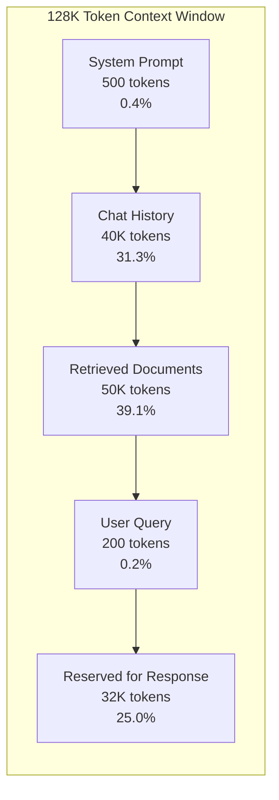
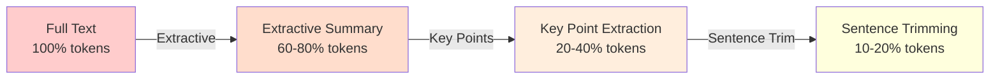
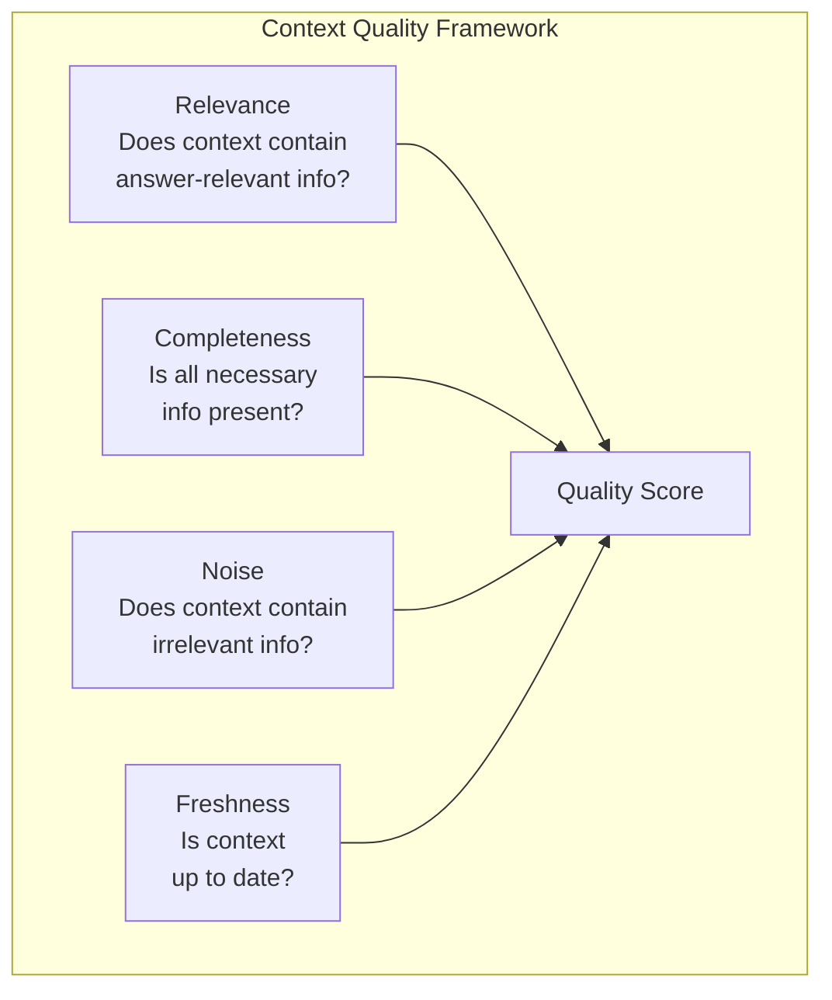
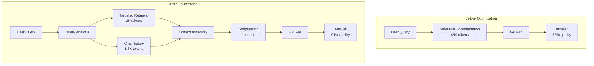

# Chapter 7: Context Engineering

> "Context is the new code. The quality of what you put into a prompt determines the quality of what comes out -- and every token you waste is a token that could have carried signal instead of noise."

---

## Introduction

Context engineering is one of the most important skills in modern software development, yet it is rarely taught as a discipline. Most engineers think of prompt engineering as writing clever instructions. Context engineering is something fundamentally different -- it is the systematic selection, organization, optimization, and management of every piece of information that enters an LLM's context window. It encompasses token budgeting, context selection strategies, compression techniques, priority management, and quality measurement.

The context window is the model's working memory. Every token you include competes for attention space with every other token. Research consistently shows that LLM performance degrades when relevant information is buried in irrelevant noise -- a phenomenon known as the "lost in the middle" effect. A model given 50,000 tokens of context with the answer buried in token position 30,000 will often miss it entirely, while the same answer in 5,000 tokens of focused context will be found reliably.

The central thesis of this chapter is that **context engineering is the single biggest quality lever for most applications -- it matters more than model selection, prompt wording, or fine-tuning**. A mediocre model with excellent context consistently outperforms an excellent model with poor context. This is counterintuitive but empirically validated across dozens of production deployments.

We will examine context windows as working memory, selection strategies (semantic, keyword, hybrid, recency, importance), compression techniques, the six context sources, token reduction and cost optimization, quality measurement frameworks, and a full case study of a customer support system that improved answer quality from 72% to 91% by reducing context by 82%.

### The Attention Economy

LLMs process tokens through an attention mechanism that assigns weights to each token relative to every other token. The computational cost of attention scales quadratically with sequence length, which means:

- Doubling context length quadruples attention computation
- The model must attend to every token in the context, even irrelevant ones
- Information at the beginning and end of context receives more attention than information in the middle
- Each additional token reduces the attention available to every other token

This creates an **attention economy** where every token has an opportunity cost. A token spent on irrelevant background information is a token not spent on the user's actual query. Context engineering is the discipline of maximizing signal-to-noise ratio within this economy.

| Context Size | Attention Computation | Cost (GPT-4o) | Latency Impact | Quality Impact |
|-------------|----------------------|---------------|----------------|----------------|
| 1K tokens | 1M attention ops | $0.0025 | Baseline | High quality (focused) |
| 10K tokens | 100M attention ops | $0.025 | +200ms | Good (if relevant) |
| 50K tokens | 2.5B attention ops | $0.125 | +800ms | Variable (noise risk) |
| 100K tokens | 10B attention ops | $0.250 | +2s | Degraded (lost in middle) |
| 1M tokens | 1T attention ops | $2.50 | +10s | Poor (overwhelmed) |

The optimal context size is not the maximum the model supports -- it is the minimum needed to answer the question well. More context is not better context.

---

## 7.1 Context Windows as Working Memory

The context window is the model's temporary working memory for a single request. Understanding its anatomy is the foundation of context engineering.

### 7.1.1 Anatomy of a Context Window

A typical context window allocation for a 128K token model:



The allocation is not arbitrary -- it reflects the attention patterns of transformer models. The system prompt is placed first to establish behavioral context. Chat history provides conversational continuity. Retrieved documents supply factual grounding. The user query is placed last (closest to the response) for maximum attention. The reserved space ensures the model can generate a complete response without truncation.

### 7.1.2 The Token Budget Principle

Every token used for one purpose is a token unavailable for another. This creates a zero-sum competition between context sources:

| Allocation Scenario | System | History | Documents | Query | Response | Result |
|--------------------|--------|---------|-----------|-------|----------|--------|
| Balanced | 500 | 20K | 50K | 200 | 57K | Good all-around |
| History-heavy | 500 | 60K | 10K | 200 | 57K | Good conversation, weak facts |
| Document-heavy | 500 | 5K | 70K | 200 | 52K | Strong facts, weak conversation |
| Query-heavy | 500 | 5K | 5K | 200 | 122K | Great response, weak context |

The right allocation depends on your application. A chatbot needs more history. A knowledge assistant needs more documents. A code assistant needs more response space. Design your allocation strategy before building your context assembly logic.

### 7.1.3 Context Window Sizing by Task

| Task Type | Optimal Context | Why |
|-----------|----------------|-----|
| Simple QA | 2-4K tokens | Focused, minimal noise |
| Document summarization | 8-16K tokens | Full document fit |
| Multi-turn chat | 16-32K tokens | History + context |
| Code generation | 16-64K tokens | File context + dependencies |
| Research analysis | 32-128K tokens | Multiple sources |
| Legal contract review | 64-256K tokens | Full contract + precedents |

The key insight: most tasks do not need the maximum context window. Using a smaller, focused context improves quality and reduces cost. Reserve large context windows for tasks that genuinely require extensive input.

---

## 7.2 Context Selection Strategies

Not all information is equally relevant. The selection strategy determines which information enters the context window. Poor selection is the most common cause of poor context engineering.

### 7.2.1 Semantic Search

Semantic search uses embedding similarity to find contextually relevant information. It excels at finding conceptually related content even when keywords differ.

```python
import numpy as np

class SemanticSelector:
    def __init__(self, embedder, vector_store):
        self.embedder = embedder
        self.vector_store = vector_store

    async def select(self, query: str, top_k: int = 10) -> list[ContextChunk]:
        query_embedding = await self.embedder.embed(query)
        results = self.vector_store.query(
            vector=query_embedding,
            top_k=top_k,
            include_metadata=True
        )
        return [
            ContextChunk(
                content=r["metadata"]["content"],
                score=r["score"],
                source="semantic",
                doc_id=r["metadata"]["doc_id"]
            )
            for r in results
        ]
```

| Semantic Search Strengths | Semantic Search Weaknesses |
|--------------------------|---------------------------|
| Captures conceptual meaning | Misses exact keyword matches |
| Handles synonyms naturally | Computationally expensive |
| Works across languages | Requires embedding model |
| Good for conceptual queries | Poor for precise lookups |

### 7.2.2 Keyword Search (BM25)

BM25 excels at exact keyword matching. It is essential for queries that contain specific terms, codes, or identifiers that must match literally.

```python
class KeywordSelector:
    def __init__(self, search_index):
        self.index = search_index

    async def select(self, query: str, top_k: int = 10) -> list[ContextChunk]:
        results = self.index.search(
            query=query,
            top_k=top_k,
            fields=["content", "title"],
            boost={"title": 2.0}  # Title matches are more relevant
        )
        return [
            ContextChunk(
                content=r.content,
                score=r.score,
                source="keyword",
                doc_id=r.doc_id
            )
            for r in results
        ]
```

| BM25 Strengths | BM25 Weaknesses |
|----------------|-----------------|
| Exact keyword matching | No semantic understanding |
| Fast computation | Misses synonyms |
| No embedding required | Poor for conceptual queries |
| Interpretable scores | Vocabulary mismatch problem |

### 7.2.3 Hybrid Selection with Reciprocal Rank Fusion

Hybrid search combines semantic and keyword retrieval, consistently outperforming either approach alone. The key is combining results using a fusion algorithm:

```python
class HybridSelector:
    def __init__(self, semantic: SemanticSelector, keyword: KeywordSelector):
        self.semantic = semantic
        self.keyword = keyword

    async def select(self, query: str, top_k: int = 10, rrf_k: int = 60) -> list[ContextChunk]:
        # Run both searches in parallel
        semantic_task = self.semantic.select(query, top_k=top_k * 2)
        keyword_task = self.keyword.select(query, top_k=top_k * 2)

        semantic_results, keyword_results = await asyncio.gather(semantic_task, keyword_task)

        # Reciprocal Rank Fusion
        scores = {}
        all_results = {}

        for rank, chunk in enumerate(semantic_results):
            key = chunk.doc_id
            scores[key] = scores.get(key, 0) + 1 / (rrf_k + rank + 1)
            all_results[key] = chunk

        for rank, chunk in enumerate(keyword_results):
            key = chunk.doc_id
            scores[key] = scores.get(key, 0) + 1 / (rrf_k + rank + 1)
            if key not in all_results:
                all_results[key] = chunk

        # Sort by fused score
        sorted_ids = sorted(scores.keys(), key=lambda x: scores[x], reverse=True)

        results = []
        for doc_id in sorted_ids[:top_k]:
            chunk = all_results[doc_id]
            chunk.score = scores[doc_id]
            chunk.source = "hybrid"
            results.append(chunk)

        return results
```

### 7.2.4 Recency and Importance Scoring

For some applications, when information was created matters as much as what it says. Recency scoring prioritizes newer information, while importance scoring prioritizes high-value content:

```python
class WeightedSelector:
    def __init__(self, hybrid: HybridSelector, weights: dict):
        self.hybrid = hybrid
        self.weights = weights  # {"semantic": 0.4, "keyword": 0.3, "recency": 0.2, "importance": 0.1}

    async def select(self, query: str, top_k: int = 10) -> list[ContextChunk]:
        # Get base hybrid results
        base_results = await self.hybrid.select(query, top_k=top_k * 3)

        # Apply recency and importance scores
        for chunk in base_results:
            recency_score = self._calculate_recency(chunk.metadata.get("created_at"))
            importance_score = chunk.metadata.get("importance", 0.5)

            chunk.score = (
                self.weights["semantic"] * chunk.score +
                self.weights["recency"] * recency_score +
                self.weights["importance"] * importance_score
            )

        # Sort by weighted score and return top_k
        return sorted(base_results, key=lambda x: x.score, reverse=True)[:top_k]

    def _calculate_recency(self, created_at: str) -> float:
        """Score recency: newer documents get higher scores."""
        age_days = (datetime.now() - datetime.fromisoformat(created_at)).days
        # Exponential decay: half-life of 90 days
        return math.exp(-0.693 * age_days / 90)
```

### 7.2.5 Selection Strategy Comparison

| Strategy | Latency | Best For | Weakness |
|----------|---------|----------|----------|
| Semantic only | 10-50ms | Conceptual queries | Misses exact matches |
| BM25 only | 1-5ms | Exact keyword queries | No semantic understanding |
| Hybrid (RRF) | 15-60ms | General-purpose | Slightly higher latency |
| Weighted hybrid | 20-80ms | Applications with time sensitivity | Weight tuning required |
| Reranked hybrid | 50-200ms | High-quality retrieval | Highest latency |

---

## 7.3 Context Compression

When context exceeds the token budget, compression reduces token count while preserving essential information. The choice of compression technique depends on the compression ratio needed and the acceptable quality loss.

### 7.3.1 Compression Technique Spectrum



| Technique | Token Reduction | Quality Loss | Best For |
|-----------|----------------|-------------|----------|
| Sentence trimming | 30-50% | Low | Long documents, preserve all topics |
| Extractive summarization | 60-80% | Low-Medium | Moderate reduction needed |
| Key point extraction | 80-95% | Medium | Heavy reduction, preserve critical facts |
| LLM summarization | 70-90% | Low | High-quality summaries when cost allows |

### 7.3.2 Extractive Summarization

Extractive summarization selects the most important sentences from the original text without generating new content. It preserves the original wording and is faster than abstractive summarization.

```python
class ExtractiveSummarizer:
    def __init__(self, model):
        self.model = model

    async def compress(self, text: str, target_tokens: int) -> str:
        sentences = self._split_sentences(text)
        current_tokens = count_tokens(text)

        if current_tokens <= target_tokens:
            return text

        # Score each sentence by importance
        scored_sentences = []
        for i, sentence in enumerate(sentences):
            score = await self._score_sentence(sentence, i, len(sentences))
            scored_sentences.append((score, i, sentence))

        # Select sentences until budget is met
        scored_sentences.sort(reverse=True)
        selected = []
        token_budget = target_tokens

        for score, original_idx, sentence in scored_sentences:
            sentence_tokens = count_tokens(sentence)
            if sentence_tokens <= token_budget:
                selected.append((original_idx, sentence))
                token_budget -= sentence_tokens

        # Restore original order
        selected.sort(key=lambda x: x[0])
        return " ".join(s for _, s in selected)

    async def _score_sentence(self, sentence: str, position: int, total: int) -> float:
        """Score sentence importance based on multiple signals."""
        score = 0.0

        # Position signal: first and last sentences are often important
        if position == 0 or position == total - 1:
            score += 0.3

        # Length signal: very short sentences are less informative
        word_count = len(sentence.split())
        if 10 <= word_count <= 30:
            score += 0.2

        # Keyword signal: sentences with key terms score higher
        key_terms = ["important", "significant", "conclusion", "therefore", "关键", "总结"]
        if any(term in sentence.lower() for term in key_terms):
            score += 0.3

        # Uniqueness signal: sentences similar to others are less important
        # (implementation omitted for brevity)
        return score
```

### 7.3.3 LLM-Based Compression

For higher quality compression, use an LLM to generate a summary. This is more expensive but produces better results:

```python
class LLMCompressor:
    def __init__(self, llm_provider):
        self.llm = llm_provider

    async def compress(self, text: str, target_tokens: int, preserve_quotes: bool = True) -> str:
        current_tokens = count_tokens(text)

        if current_tokens <= target_tokens:
            return text

        # Calculate reduction ratio
        reduction_ratio = target_tokens / current_tokens

        prompt = f"""Summarize the following text, preserving key information.
Target length: approximately {target_tokens} tokens ({reduction_ratio:.0%} of original).
{"Preserve any direct quotes exactly." if preserve_quotes else ""}

Original ({current_tokens} tokens):
{text}

Summary:"""

        response = await self.llm.chat([
            ChatMessage(role="user", content=prompt)
        ], max_tokens=target_tokens)

        return response.content
```

### 7.3.4 Compression Strategy Selection

| Scenario | Technique | Rationale |
|----------|-----------|-----------|
| Context 10-30% over budget | Sentence trimming | Minimal quality loss |
| Context 30-50% over budget | Extractive summarization | Good balance |
| Context 50%+ over budget | Key point extraction | Preserve critical facts only |
| High-quality requirement | LLM summarization | Best quality, highest cost |
| Real-time application | Extractive summarization | Fastest, no LLM call |
| Cost-sensitive application | Sentence trimming | Zero additional cost |

---

## 7.4 Context Sources

Six sources typically contribute to the context window. Understanding each source's characteristics and optimization strategies is essential for effective context engineering.

### 7.4.1 User Input

The user's current query is the most important context element. It should always be placed last (closest to output generation) for maximum attention.

```python
class QueryAnalyzer:
    def analyze(self, query: str) -> QueryAnalysis:
        """Analyze user query to guide context selection."""
        return QueryAnalysis(
            intent=self._classify_intent(query),
            entities=self._extract_entities(query),
            complexity=self._estimate_complexity(query),
            required_context_types=self._determine_context_types(query),
        )

    def _determine_context_types(self, query: str) -> list[str]:
        """Determine what types of context are needed."""
        types = []

        # Factual query -> need documents
        if any(kw in query.lower() for kw in ["what", "when", "where", "who", "how"]):
            types.append("documents")

        # Quantitative query -> need database
        if any(kw in query.lower() for kw in ["how many", "total", "average", "count"]):
            types.append("database")

        # Action query -> need tools
        if any(kw in query.lower() for kw in ["send", "create", "update", "delete"]):
            types.append("tools")

        # Conversational -> need history
        if len(query.split()) < 10 and not any(kw in query.lower() for kw in ["what", "how"]):
            types.append("history")

        return types or ["documents"]
```

### 7.4.2 Chat History

Chat history is the most expensive context source in terms of token consumption. A 20-turn conversation can easily consume 10,000+ tokens.

| Strategy | Token Usage | Quality | Best For |
|----------|------------|---------|----------|
| Sliding window (last N turns) | Fixed (N * avg_turn_tokens) | Good for recent context | Simple chatbots |
| Summarized history | Variable (summary size) | Good for long conversations | Extended sessions |
| Hybrid (recent full + older summarized) | Variable | Best balance | Production systems |
| Relevance-based | Variable (query-dependent) | Best quality | Research assistants |

```python
class HistoryManager:
    def __init__(self, max_tokens: int = 4000):
        self.max_tokens = max_tokens

    def get_history(self, history: list[dict], query: str) -> list[dict]:
        """Get chat history within token budget."""
        total_tokens = sum(count_tokens(m["content"]) for m in history)

        if total_tokens <= self.max_tokens:
            return history

        # Strategy: keep last 3 turns full, summarize older turns
        recent_turns = history[-6:]  # Last 3 user-assistant pairs
        older_turns = history[:-6]

        recent_tokens = sum(count_tokens(m["content"]) for m in recent_turns)

        if recent_tokens >= self.max_tokens:
            # Even recent turns exceed budget -- truncate
            return self._truncate_to_budget(recent_turns, self.max_tokens)

        # Summarize older turns to fit remaining budget
        remaining_budget = self.max_tokens - recent_tokens
        summary = self._summarize_turns(older_turns, remaining_budget)

        return [{"role": "system", "content": f"Previous conversation:\n{summary}"}] + recent_turns

    def _summarize_turns(self, turns: list[dict], budget: int) -> str:
        """Summarize conversation turns to fit token budget."""
        combined = "\n".join(f"{m['role']}: {m['content']}" for m in turns)
        return llm.summarize(
            f"Summarize this conversation in {budget // 4} words, preserving key facts and decisions:\n{combined}"
        )
```

### 7.4.3 Documents

External knowledge retrieved via RAG. The most valuable source for factual accuracy. Quality depends entirely on the retrieval pipeline (covered in Chapter 8).

### 7.4.4 Databases

Structured data accessed via function calling. Useful for quantitative queries that need precise data. The key optimization is to retrieve only the specific data points needed, not entire tables:

```python
class DatabaseContext:
    def get_context(self, query: str, schema: dict) -> str:
        """Generate minimal database context for the query."""
        # Parse query for data needs
        entities = self._extract_entities(query)

        # Build minimal SQL
        sql = self._build_query(entities, schema)

        # Execute and format as concise context
        result = self._execute(sql)

        # Format as structured context, not raw table
        return self._format_as_context(result, query)

    def _format_as_context(self, result: list[dict], query: str) -> str:
        """Format database results as concise context."""
        if not result:
            return "No matching data found."

        lines = []
        for row in result[:5]:  # Limit to 5 rows
            relevant_fields = {k: v for k, v in row.items() if v is not None}
            lines.append(", ".join(f"{k}: {v}" for k, v in relevant_fields.items()))

        return "Database results:\n" + "\n".join(lines)
```

### 7.4.5 APIs

External services accessed via tool calling. Extends the model's capabilities beyond its training data. The key optimization is to call APIs only when needed and return minimal, relevant responses.

### 7.4.6 Enterprise Systems

Internal CRM, ERP, and ticketing systems. Provides organizational context. The key challenge is access control -- different users should see different context based on their permissions.

### 7.4.7 Context Source Prioritization

| Priority | Source | When to Include | Token Budget |
|----------|--------|----------------|-------------|
| 1 (always) | User query | Every request | 100-500 tokens |
| 2 (always) | System prompt | Every request | 200-1000 tokens |
| 3 (if needed) | Retrieved documents | Factual queries | 5K-50K tokens |
| 4 (if needed) | Chat history | Multi-turn conversations | 2K-20K tokens |
| 5 (if needed) | Database results | Quantitative queries | 500-5K tokens |
| 6 (if needed) | API results | Action queries | 500-5K tokens |
| 7 (if needed) | Enterprise data | Organization-specific queries | 1K-10K tokens |

---

## 7.5 Token Reduction and Cost Optimization

Token reduction directly reduces cost and often improves quality. The techniques are practical and measurable.

### 7.5.1 System Prompt Optimization

```python
# BEFORE: Verbose system prompt (450 tokens)
system_prompt_verbose = """
You are a helpful customer support assistant for TechCorp Inc. You should always be polite and professional in your responses. When answering questions about our products, you should provide accurate information based on our knowledge base. If you don't know the answer to a question, you should honestly tell the customer that you don't know and offer to connect them with a human agent. You should never make up information or provide details that you are not confident about. Always end your responses by asking if there's anything else you can help with.
"""

# AFTER: Concise system prompt (120 tokens, 73% reduction)
system_prompt_concise = """
Role: TechCorp support agent.
Rules: Be accurate. If unsure, say so and offer human handoff. End with "Anything else?"
"""
```

| Prompt Style | Token Count | Quality Impact |
|-------------|------------|----------------|
| Verbose | 450 | Baseline |
| Concise | 120 | No degradation |
| Ultra-concise | 50 | Slight quality drop |

### 7.5.2 Structured Formats vs. Prose

```python
# Prose format: 200 tokens
context_prose = """
The customer John Smith has an active account. His subscription is the Enterprise plan which costs $99 per month. His last payment was on January 15, 2025 and it was successful. He has 3 open support tickets. His account was created on March 1, 2023.
"""

# Table format: 120 tokens (40% reduction)
context_table = """
| Field | Value |
|-------|-------|
| Name | John Smith |
| Plan | Enterprise ($99/mo) |
| Last payment | 2025-01-15 (success) |
| Open tickets | 3 |
| Account created | 2023-03-01 |
"""
```

### 7.5.3 Deduplication

```python
class ContextDeduplicator:
    def deduplicate(self, chunks: list[ContextChunk]) -> list[ContextChunk]:
        """Remove near-duplicate context chunks."""
        unique = []
        seen_embeddings = []

        for chunk in chunks:
            chunk_embedding = embed(chunk.content)

            # Check similarity against already-selected chunks
            is_duplicate = False
            for seen_emb in seen_embeddings:
                similarity = cosine_similarity(chunk_embedding, seen_emb)
                if similarity > 0.92:  # Threshold for deduplication
                    is_duplicate = True
                    break

            if not is_duplicate:
                unique.append(chunk)
                seen_embeddings.append(chunk_embedding)

        return unique
```

### 7.5.4 Cost Optimization Strategies

| Strategy | Token Savings | Quality Impact | Implementation Cost |
|----------|-------------|---------------|-------------------|
| Concise system prompts | 10-20% | None | Low |
| Structured formats | 20-40% | None | Low |
| Deduplication | 5-15% | None | Medium |
| Selective inclusion | 30-60% | Improves quality | High |
| Model routing (cheap for simple tasks) | 40-70% cost | Minor | Medium |
| Response caching | 30-50% cost | None | Low |
| Context compression | 50-80% | Low-Medium | Medium |

---

## 7.6 Context Quality Measurement

Measure context quality across four dimensions. These measurements close the evaluation loop. Without them, you are optimizing blindly.

### 7.6.1 The Four Dimensions



### 7.6.2 Relevance Measurement

```python
class RelevanceEvaluator:
    def __init__(self, embedder):
        self.embedder = embedder

    async def evaluate(self, query: str, context: list[str]) -> float:
        """Measure what fraction of context is relevant to the query."""
        query_embedding = await self.embedder.embed(query)

        relevance_scores = []
        for chunk in context:
            chunk_embedding = await self.embedder.embed(chunk)
            similarity = cosine_similarity(query_embedding, chunk_embedding)
            relevance_scores.append(similarity)

        # Average relevance across all context chunks
        avg_relevance = sum(relevance_scores) / len(relevance_scores) if relevance_scores else 0

        # Fraction of context with relevance > threshold
        relevant_fraction = sum(1 for s in relevance_scores if s > 0.7) / len(relevance_scores)

        return {
            "avg_relevance": avg_relevance,
            "relevant_fraction": relevant_fraction,
            "noise_fraction": 1 - relevant_fraction,
        }
```

### 7.6.3 Completeness Measurement

```python
class CompletenessEvaluator:
    def evaluate(self, context: list[str], required_info: list[str]) -> float:
        """Measure whether context contains all required information."""
        context_text = " ".join(context).lower()

        found = sum(1 for info in required_info if info.lower() in context_text)
        return found / len(required_info) if required_info else 1.0
```

### 7.6.4 Quality Measurement Dashboard

| Dimension | Metric | Target | Measurement |
|-----------|--------|--------|-------------|
| Relevance | Avg cosine similarity | >0.75 | Embedding comparison |
| Relevance | Relevant fraction | >80% | Threshold comparison |
| Completeness | Required info coverage | >90% | Keyword/semantic matching |
| Noise | Irrelevant fraction | <20% | 1 - relevant_fraction |
| Freshness | Data age | <7 days | Timestamp comparison |
| Freshness | Stale context % | <10% | TTL-based filtering |

---

## 7.7 Case Study: Context Engineering for Customer Support

### 7.7.1 Problem Statement

A customer support system using GPT-4o was achieving only 72% answer quality despite sending 45K tokens of context per query. The root cause: full product documentation (80K tokens) was being sent for every query, regardless of relevance. The model was overwhelmed with irrelevant information, missing critical details buried in the noise.

### 7.7.2 Architecture



### 7.7.3 Multi-Stage Context Engineering

```python
class OptimizedContextEngine:
    def __init__(self):
        self.query_analyzer = QueryAnalyzer()
        self.retriever = HybridSelector(semantic_selector, keyword_selector)
        self.history_manager = HistoryManager(max_tokens=1500)
        self.compressor = ExtractiveSummarizer()
        self.total_budget = 8000  # Down from 45K

    async def build_context(self, query: str, session_id: str) -> list[dict]:
        # Stage 1: Analyze query to determine what context is needed
        analysis = self.query_analyzer.analyze(query)

        # Stage 2: Retrieve only relevant documents
        if "documents" in analysis.required_context_types:
            docs = await self.retriever.select(query, top_k=5)
            doc_tokens = sum(count_tokens(d.content) for d in docs)
        else:
            docs = []
            doc_tokens = 0

        # Stage 3: Get recent conversation history
        history = await self.history_manager.get_history(
            await self.get_session_history(session_id), query
        )
        history_tokens = sum(count_tokens(m["content"]) for m in history)

        # Stage 4: Assemble within budget
        system_prompt_tokens = 200  # Optimized system prompt
        query_tokens = count_tokens(query)
        available_for_docs = self.total_budget - system_prompt_tokens - query_tokens - history_tokens

        if doc_tokens > available_for_docs:
            # Compress documents to fit
            compressed = await self.compressor.compress(
                "\n".join(d.content for d in docs),
                target_tokens=available_for_docs
            )
            doc_context = [{"role": "system", "content": f"Relevant documents:\n{compressed}"}]
        else:
            doc_context = [{"role": "system", "content": "Relevant documents:\n" + "\n---\n".join(d.content for d in docs)}]

        # Stage 5: Final context assembly
        context = [
            {"role": "system", "content": self.system_prompt},
            *doc_context,
            *history,
            {"role": "user", "content": query}
        ]

        return context
```

### 7.7.4 Results

| Metric | Before | After | Improvement |
|--------|--------|-------|-------------|
| Context tokens per query | 45,000 | 8,000 | 82% reduction |
| Answer quality | 72% | 91% | +19 percentage points |
| Cost per query | $0.015 | $0.003 | 80% reduction |
| Monthly cost (100K queries) | $1,500 | $300 | 80% reduction |
| p50 latency | 6.2s | 1.8s | 71% faster |
| p95 latency | 14.5s | 4.1s | 72% faster |
| User satisfaction | 3.4/5 | 4.5/5 | +1.1 points |

The counterintuitive result: less context, better quality. The model focused on relevant information instead of wading through noise. The 82% reduction in context tokens directly translated to 19% improvement in answer quality.

### 7.7.5 Quality Measurement Results

| Dimension | Before | After |
|-----------|--------|-------|
| Avg relevance (cosine similarity) | 0.42 | 0.83 |
| Relevant fraction | 35% | 88% |
| Noise fraction | 65% | 12% |
| Completeness (required info coverage) | 78% | 92% |
| Freshness (avg document age) | 45 days | 12 days |

### 7.7.6 Cost Analysis

**Before optimization:**

| Component | Cost per Query | Monthly Cost |
|-----------|---------------|-------------|
| Input tokens (45K x $2.50/1M) | $0.1125 | $11,250 |
| Output tokens (500 x $10/1M) | $0.005 | $500 |
| Total | $0.1175 | $11,750 |

**After optimization:**

| Component | Cost per Query | Monthly Cost |
|-----------|---------------|-------------|
| Input tokens (8K x $2.50/1M) | $0.02 | $2,000 |
| Output tokens (500 x $10/1M) | $0.005 | $500 |
| Total | $0.025 | $2,500 |

**Net monthly savings: $9,250 (78.7% reduction)**

---

## 7.8 Testing Context Engineering

### 7.8.1 Context Quality Tests

```python
import pytest

class TestContextEngineering:
    @pytest.fixture
    def context_engine(self):
        return OptimizedContextEngine()

    def test_context_stays_within_budget(self, context_engine):
        context = asyncio.run(context_engine.build_context(
            "What is your return policy?", "session-1"
        ))
        total_tokens = sum(count_tokens(m["content"]) for m in context)
        assert total_tokens <= context_engine.total_budget

    def test_context_includes_relevant_documents(self, context_engine):
        context = asyncio.run(context_engine.build_context(
            "What is your return policy?", "session-1"
        ))
        context_text = " ".join(m["content"] for m in context)
        assert "return" in context_text.lower() or "refund" in context_text.lower()

    def test_context_excludes_irrelevant_documents(self, context_engine):
        context = asyncio.run(context_engine.build_context(
            "What is your return policy?", "session-1"
        ))
        context_text = " ".join(m["content"] for m in context)
        # Should not include unrelated topics
        assert "stock price" not in context_text.lower()

    def test_compression_preserves_key_information(self):
        compressor = ExtractiveSummarizer()
        original = "The return policy allows returns within 30 days. Items must be unused. Refunds process in 5-7 business days. [1000 tokens of detail]"
        compressed = asyncio.run(compressor.compress(original, target_tokens=100))
        assert "30 days" in compressed
        assert "unused" in compressed

    def test_history_truncation_preserves_recent(self):
        manager = HistoryManager(max_tokens=500)
        history = [
            {"role": "user", "content": f"Message {i} " * 50}
            for i in range(20)
        ]
        result = manager.get_history(history, "current query")
        # Recent messages should be preserved
        recent_text = " ".join(m["content"] for m in result)
        assert "Message 19" in recent_text
```

### 7.8.2 Integration Tests

```python
@pytest.mark.integration
def test_end_to_end_context_quality(rag_pipeline, evaluator):
    queries = [
        "What is the return policy?",
        "How do I reset my password?",
        "What are your business hours?",
    ]

    for query in queries:
        context = rag_pipeline.build_context(query)
        quality = evaluator.evaluate(query, context)

        assert quality["avg_relevance"] > 0.7
        assert quality["noise_fraction"] < 0.3
```

---

## 7.9 Key Takeaways

1. **Context engineering is the single biggest quality lever -- it matters more than model selection for most applications.** A mediocre model with excellent context consistently outperforms an excellent model with poor context. Invest in context engineering before upgrading models.

2. **Token budgeting is mandatory -- allocate context window explicitly, not arbitrarily.** Design your token allocation strategy before implementing. The budget is zero-sum: every token for history is a token not available for documents.

3. **Less relevant context beats more irrelevant context -- targeted retrieval improves quality and reduces cost.** The customer support case study showed 82% context reduction with 19% quality improvement. The model performs better when it can focus.

4. **Hybrid search (semantic + keyword) consistently outperforms either alone.** Semantic search captures meaning; keyword search captures exact matches. Always use both, combined with reciprocal rank fusion.

5. **Context compression saves money and improves quality -- summarize long histories, extract key points from documents.** Compression is not a compromise -- it is an optimization that removes noise and preserves signal.

6. **Context quality measurement closes the loop -- evaluate relevance, completeness, noise, and freshness.** Without measurement, you are optimizing blindly. Track these four dimensions for every context assembly.

7. **Chat history is the most expensive context source -- manage it aggressively.** Use sliding windows, summarize older turns, and keep only recent conversation full. Most users will not notice summarized older context.

8. **The "lost in the middle" effect is real -- place important information at the beginning or end of context.** LLMs attend more to the first and last tokens in a sequence. Position critical documents accordingly.

9. **Structured formats (tables) use 20-40% fewer tokens than prose -- prefer them for factual context.** Tables convey the same information in fewer tokens and are easier for models to parse.

10. **Measure context quality per query, not per system.** Different query types need different context. Track relevance, completeness, and noise for each query category independently.

---

## 7.10 Further Reading

- **Liu et al., "Lost in the Middle" (2023)** -- The foundational paper demonstrating that LLM performance degrades when relevant information is placed in the middle of long contexts. Directly informs context positioning strategy.

- **Anthropic Research: "Building Effective Agents"** -- Practical guidance on context management patterns, including how to structure prompts, manage conversation history, and optimize token usage.

- **"Prompt Engineering Guide" (promptingguide.ai)** -- Comprehensive resource for prompt design techniques that affect token consumption and context quality.

- **OpenAI Cookbook** -- Practical examples of context engineering patterns, including few-shot learning, chain-of-thought prompting, and context compression.

- **"Designing Data-Intensive Applications" by Martin Kleppmann** -- Chapter 3 (Storage and Retrieval) provides the foundation for understanding indexing strategies that power retrieval-based context selection.

- **"Information Retrieval: A Survey" by Ed Greengrass** -- Comprehensive coverage of retrieval algorithms (BM25, TF-IDF, language models) that underpin keyword-based context selection.

- **"Attention Is All You Need" by Vaswani et al. (2017)** -- The original transformer paper, essential for understanding attention mechanisms and why context length matters.

- **"Efficient Transformers: A Survey" by Tay et al. (2020)** -- Covers efficient attention mechanisms that enable longer context windows, including sparse attention, linear attention, and memory-augmented approaches.

- **LangChain Context Management Documentation** -- Practical patterns for implementing context windows, history management, and context compression in production systems.

- **"The Art of Prompt Engineering" by Nathan Lam** -- Detailed guide to prompt optimization techniques that directly affect token consumption and context efficiency.
