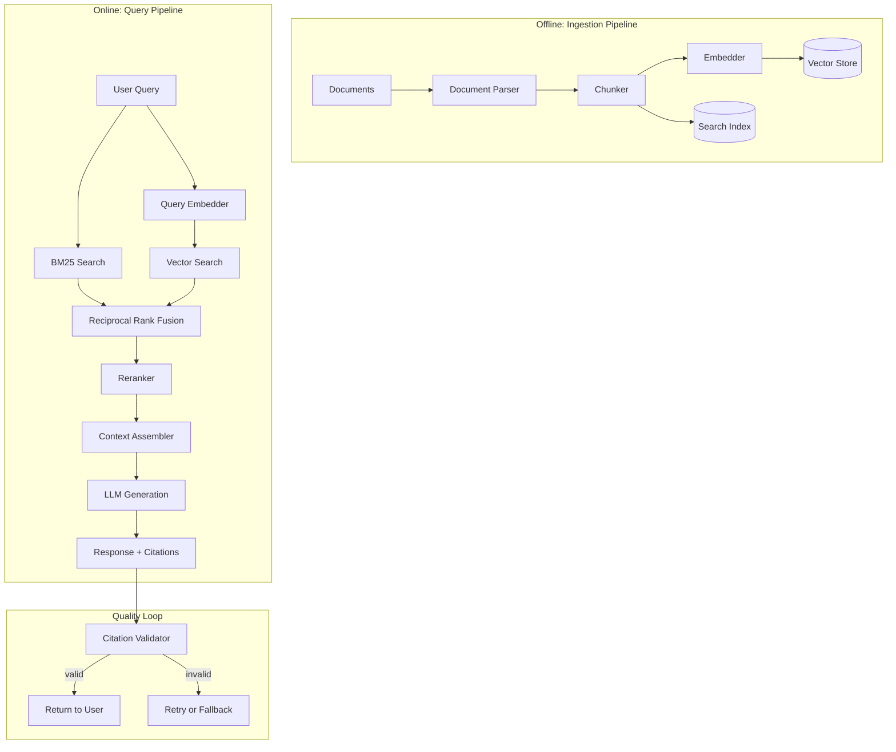
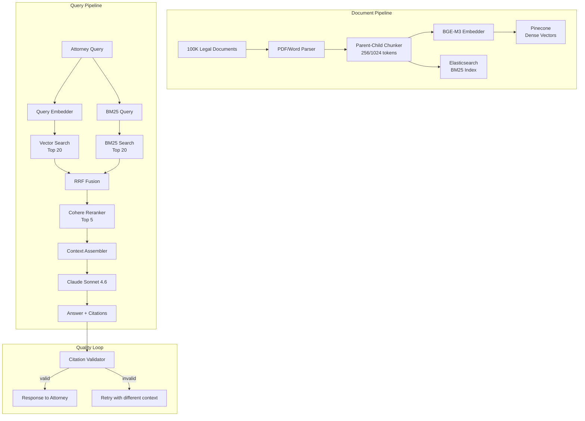

# Chapter 8: Retrieval Augmented Generation

> "The model knows what it was trained on. RAG tells it what it needs to know. The difference between a useful AI system and a hallucinating one is the quality of what you retrieve."

---

## Introduction

Retrieval Augmented Generation (RAG) is the technique that grounds LLM responses in factual data. Instead of relying solely on the model's training knowledge, you retrieve relevant documents and include them in the prompt. RAG reduces hallucinations, keeps knowledge current without retraining, and enables domain-specific expertise.

But RAG is fragile. Retrieval quality depends on a chain of decisions -- chunking strategy, embedding model selection, search algorithm, reranking approach, and context assembly. A failure at any stage propagates through the pipeline. Bad chunking breaks important context. Weak embeddings miss semantic similarity. Inadequate retrieval returns irrelevant documents. Missing reranking leaves noise in the results. Bad context assembly buries relevant information.

The central thesis of this chapter is that **RAG quality is determined by the retrieval pipeline, not the generation model**. A perfect model with bad retrieval produces bad answers. A mediocre model with excellent retrieval produces good answers. Invest in retrieval quality before upgrading models.

We will examine why RAG is necessary, the five-stage RAG pipeline, embeddings and vector search, chunking strategies, the retrieval pipeline (hybrid search, reranking, context assembly), advanced RAG patterns, and a full case study of a legal research RAG system that achieved 94% precision from a baseline of 58%.

### Why RAG Is Necessary

LLMs have three fundamental limitations that RAG addresses:

| Limitation | Description | Impact | RAG Solution |
|-----------|-------------|--------|-------------|
| Knowledge cutoff | Models do not know about events after training | Outdated information | Retrieve current documents |
| Hallucination | Models generate plausible but incorrect information | Unreliable outputs | Ground in retrieved facts |
| Domain specificity | Models lack specialized organizational knowledge | Generic responses | Retrieve domain-specific documents |

RAG is the default choice for knowledge-intensive applications. Fine-tuning is better when you need consistent formatting, domain-specific reasoning, or cost reduction at very high volumes. But for most use cases -- where knowledge changes frequently, where you need source citations, or where training data is limited -- RAG is the right approach.

| Approach | Knowledge Updates | Cost | Citations | Hallucination Control | Training Data Needed |
|----------|------------------|------|-----------|----------------------|---------------------|
| RAG | Real-time | Low | Yes | Strong | None |
| Fine-tuning | Requires retraining | High | No | Moderate | Thousands of examples |
| Prompt engineering | Limited by context | Very Low | Partial | Weak | None |
| Hybrid (RAG + fine-tuning) | Real-time + learned patterns | Medium | Yes | Strong | Moderate |

---

## 8.1 The RAG Pipeline

The standard RAG pipeline has five stages, each introducing potential quality loss:



Each stage has a specific purpose and specific failure modes. Understanding these failure modes is essential for building reliable RAG systems.

| Stage | Purpose | Failure Mode | Impact |
|-------|---------|-------------|--------|
| Document parsing | Extract text from files | Corrupted extraction | Garbage in, garbage out |
| Chunking | Split into searchable units | Broken context | Retrieval misses |
| Embedding | Convert to vectors | Weak semantic capture | Missed relevance |
| Search | Find relevant chunks | Poor ranking | Noise in results |
| Reranking | Reorder by relevance | Missing key documents | Degraded quality |
| Context assembly | Fit into token budget | Poor ordering | Lost in middle effect |
| Generation | Produce answer | Hallucination despite context | Unreliable output |

---

## 8.2 Embeddings and Vector Search

Embeddings convert text to dense vectors that capture semantic meaning. The quality of embeddings directly affects retrieval accuracy. This is not a component to optimize last -- it is foundational.

### 8.2.1 Embedding Model Selection

| Model | Dimensions | Quality | Cost | Self-Hosted | Best For |
|-------|-----------|---------|------|------------|----------|
| BGE-M3 | 1024 | Best | Free | Yes | Self-hosted production |
| OpenAI text-embedding-3-large | 3072 | Excellent | $0.13/1M tokens | No | Quick start |
| Cohere embed-v3 | 1024 | Excellent | $0.10/1M tokens | No | Managed production |
| OpenAI text-embedding-3-small | 1536 | Good | $0.02/1M tokens | No | Cost-sensitive |
| nomic-embed-text | 768 | Good | Free | Yes | Local development |

The key finding across benchmarks: BGE-M3 offers the best quality-to-cost ratio for self-hosted deployments. OpenAI embeddings are easiest to use but cost more at scale. Cohere provides a strong managed option with multi-language support.

### 8.2.2 Vector Database Selection

| Database | Managed | Performance | Scalability | Cost | Best For |
|----------|---------|------------|-------------|------|----------|
| Pinecone | Yes | Excellent | Excellent | $70+/month | Zero-ops production |
| Qdrant | Self/Managed | Excellent | Excellent | Free (self) | Self-hosted production |
| Milvus | Self/Managed | Excellent | Excellent | Free (self) | Large-scale self-hosted |
| pgvector | Self | Good | Good | Free (with Postgres) | Postgres shops |
| Chroma | Self | Good | Limited | Free | Development only |

### 8.2.3 Hybrid Search Implementation

Hybrid search combines dense (semantic) and sparse (BM25) retrieval. Dense search captures meaning -- "vehicle" matches "car." Sparse search captures exact terms -- "Q4 2024 revenue" matches the exact phrase. Neither alone is sufficient.

```python
import asyncio
from dataclasses import dataclass

@dataclass
class HybridSearchConfig:
    dense_weight: float = 0.6
    sparse_weight: float = 0.4
    rrf_k: int = 60
    initial_results: int = 20
    final_results: int = 5

class HybridRetriever:
    def __init__(self, vector_store, bm25_index, embedder, config: HybridSearchConfig):
        self.vector_store = vector_store
        self.bm25 = bm25_index
        self.embedder = embedder
        self.config = config

    async def search(self, query: str) -> list[RetrievalResult]:
        # Run dense and sparse search in parallel
        query_embedding = await self.embedder.embed(query)

        dense_task = self.vector_store.search(
            vector=query_embedding,
            top_k=self.config.initial_results,
            include_metadata=True
        )
        sparse_task = self.bm25.search(
            query=query,
            top_k=self.config.initial_results
        )

        dense_results, sparse_results = await asyncio.gather(dense_task, sparse_task)

        # Reciprocal Rank Fusion
        fused_scores = {}

        for rank, result in enumerate(dense_results):
            doc_id = result["id"]
            fused_scores[doc_id] = fused_scores.get(doc_id, 0) + self.config.dense_weight / (
                self.config.rrf_k + rank + 1
            )

        for rank, result in enumerate(sparse_results):
            doc_id = result["id"]
            fused_scores[doc_id] = fused_scores.get(doc_id, 0) + self.config.sparse_weight / (
                self.config.rrf_k + rank + 1
            )

        # Sort by fused score
        sorted_ids = sorted(fused_scores.keys(), key=lambda x: fused_scores[x], reverse=True)

        results = []
        for doc_id in sorted_ids[:self.config.final_results]:
            # Retrieve full content
            content = await self._get_content(doc_id)
            results.append(RetrievalResult(
                doc_id=doc_id,
                content=content,
                score=fused_scores[doc_id],
                source="hybrid"
            ))

        return results
```

### 8.2.4 Search Algorithm Comparison

| Algorithm | Latency | Recall | Precision | Best For |
|-----------|---------|--------|-----------|----------|
| Dense only | 10-50ms | Good | Good | Semantic queries |
| BM25 only | 1-5ms | Good | Good | Exact keyword queries |
| Hybrid (RRF) | 15-60ms | Excellent | Excellent | General-purpose |
| Hybrid (weighted) | 15-60ms | Excellent | Excellent | Tuned applications |
| HyDE | 50-200ms | Best | Good | Complex queries |

---

## 8.3 Chunking: The Most Impactful Early Decision

How you split documents directly determines retrieval quality. This decision is made during ingestion and affects every query thereafter. It is the most impactful early decision in RAG system design.

### 8.3.1 Chunking Strategies


| Strategy | Chunk Size | Precision | Context Preservation | Best For |
|----------|-----------|-----------|---------------------|----------|
| Fixed-size (256) | 256 tokens | High | Low | Simple documents |
| Fixed-size (512) | 512 tokens | Medium | Medium | Balanced approach |
| Semantic | Variable | High | High | Complex documents |
| Section-based | Variable | High | High | Structured documents |
| Parent-child | 256/1024 | High | High | Production systems |

### 8.3.2 Parent-Child Chunking: The Production Standard

Parent-child chunking is the most effective strategy across research and practice. It retrieves with small chunks (256 tokens) for precision, then returns context from the parent chunk (1,024 tokens) for completeness.

```python
@dataclass
class Chunk:
    content: str
    parent_content: str
    doc_id: str
    position: str  # e.g., "3.2" (parent 3, child 2)
    metadata: dict

class ParentChildChunker:
    def __init__(
        self,
        child_max_tokens: int = 256,
        parent_max_tokens: int = 1024,
        overlap_tokens: int = 50
    ):
        self.child_max = child_max_tokens
        self.parent_max = parent_max_tokens
        self.overlap = overlap_tokens

    def chunk_document(self, doc: Document) -> list[Chunk]:
        # Step 1: Split into parent chunks at natural boundaries
        parents = self._split_at_boundaries(doc.content, self.parent_max)

        # Step 2: Split each parent into child chunks with overlap
        chunks = []
        for parent_idx, parent in enumerate(parents):
            children = self._split_with_overlap(parent, self.child_max, self.overlap)
            for child_idx, child in enumerate(children):
                chunks.append(Chunk(
                    content=child,
                    parent_content=parent,
                    doc_id=doc.id,
                    position=f"{parent_idx}.{child_idx}",
                    metadata={
                        "parent_idx": parent_idx,
                        "child_idx": child_idx,
                        "doc_title": doc.title,
                    }
                ))

        return chunks

    def _split_at_boundaries(self, text: str, max_tokens: int) -> list[str]:
        """Split text at natural boundaries (paragraphs, sections)."""
        paragraphs = text.split("\n\n")
        parents = []
        current = ""

        for para in paragraphs:
            para_tokens = count_tokens(para)
            current_tokens = count_tokens(current)

            if current_tokens + para_tokens > max_tokens and current:
                parents.append(current.strip())
                current = para
            else:
                current += "\n\n" + para if current else para

        if current.strip():
            parents.append(current.strip())

        return parents

    def _split_with_overlap(self, text: str, max_tokens: int, overlap: int) -> list[str]:
        """Split text into child chunks with overlap for context continuity."""
        sentences = self._split_sentences(text)
        children = []
        current = ""
        prev_tail = ""

        for sentence in sentences:
            current_tokens = count_tokens(current + " " + sentence)
            if current_tokens > max_tokens and current:
                children.append(prev_tail + " " + current if prev_tail else current)
                # Keep tail of current chunk as overlap
                words = current.split()
                overlap_words = int(overlap * len(words) / max_tokens)
                prev_tail = " ".join(words[-overlap_words:]) if overlap_words > 0 else ""
                current = sentence
            else:
                current = current + " " + sentence if current else sentence

        if current.strip():
            children.append(prev_tail + " " + current if prev_tail else current)

        return children
```

### 8.3.3 Chunk Size Optimization

Chunk size matters more than most teams realize. The optimal size depends on document types and should be tuned with actual data.

| Chunk Size | Precision | Recall | Context Quality | Best For |
|-----------|-----------|--------|----------------|----------|
| 128 tokens | Very High | Low | Poor (too fragmented) | Exact phrase matching |
| 256 tokens | High | Good | Good | Production default |
| 512 tokens | Good | Good | Good | Balanced |
| 1024 tokens | Medium | High | Good | Context-rich queries |
| 2048 tokens | Low | Very High | Poor (too noisy) | Avoid for most cases |

The sweet spot for most applications is 256-512 tokens. But the optimal size depends on your document types. Legal documents with long paragraphs may need larger chunks. Technical documentation with short, focused sections may benefit from smaller chunks. Always tune with your actual data.

---

## 8.4 The Retrieval Pipeline

The retrieval pipeline has three layers: initial retrieval (dense plus sparse search), reranking, and context assembly.

### 8.4.1 Reranking: The Highest-ROI Investment

After initial retrieval returns 20 candidates, a cross-encoder reranks them by relevance and returns the top 5. This improves precision 20-30% for 50-200ms latency.

```python
class RerankingPipeline:
    def __init__(self, reranker, top_k: int = 5):
        self.reranker = reranker
        self.top_k = top_k

    async def rerank(self, query: str, candidates: list[RetrievalResult]) -> list[RetrievalResult]:
        if len(candidates) <= self.top_k:
            return candidates

        # Batch rerank for efficiency
        documents = [c.content for c in candidates]
        reranked = await self.reranker.rerank(
            query=query,
            documents=documents,
            top_n=self.top_k
        )

        results = []
        for r in reranked:
            original = candidates[r.index]
            original.score = r.relevance_score
            original.reranked = True
            results.append(original)

        return results
```

| Reranker | Quality | Latency | Cost | Best For |
|----------|---------|---------|------|----------|
| Cohere rerank-v3.5 | Excellent | 50-100ms | $10/1M queries | Managed production |
| BGE-reranker-v2-m3 | Excellent | 30-80ms | Free (self-hosted) | Self-hosted production |
| Cross-encoder/ms-marco | Good | 20-60ms | Free (self-hosted) | Development |
| No reranking | Baseline | 0ms | Free | Low-quality threshold |

### 8.4.2 Context Assembly

Context assembly orders and fits retrieved documents into the token budget. The most relevant document goes first (maximum attention), followed by supporting documents.

```python
class ContextAssembler:
    def __init__(self, max_tokens: int = 8000):
        self.max_tokens = max_tokens

    def assemble(
        self,
        query: str,
        retrieved: list[RetrievalResult],
        system_prompt: str
    ) -> list[dict]:
        """Assemble context within token budget."""
        context = []
        remaining = self.max_tokens - count_tokens(system_prompt) - count_tokens(query)

        # Add documents in relevance order (most relevant first)
        for result in retrieved:
            doc_tokens = count_tokens(result.content)
            if doc_tokens <= remaining:
                context.append({
                    "role": "system",
                    "content": f"[Source: {result.doc_id}]\n{result.content}"
                })
                remaining -= doc_tokens
            else:
                # Try to fit a truncated version
                truncated = self._truncate_to_budget(result.content, remaining)
                if truncated:
                    context.append({
                        "role": "system",
                        "content": f"[Source: {result.doc_id}]\n{truncated}"
                    })
                break

        # Add query last (maximum attention)
        context.append({"role": "user", "content": query})

        return context

    def _truncate_to_budget(self, text: str, budget: int) -> str | None:
        """Truncate text to fit within token budget."""
        if budget < 50:
            return None
        words = text.split()
        truncated = []
        tokens = 0
        for word in words:
            word_tokens = count_tokens(word)
            if tokens + word_tokens > budget:
                break
            truncated.append(word)
            tokens += word_tokens
        return " ".join(truncated) + "..."
```

### 8.4.3 Retrieval Pipeline Comparison

| Pipeline Configuration | Precision@5 | Latency | Cost | Best For |
|----------------------|-------------|---------|------|----------|
| Dense only | 58% | 2.1s | Low | Baseline |
| Dense + BM25 (hybrid) | 72% | 2.3s | Low | General improvement |
| Hybrid + reranking | 85% | 2.5s | Medium | Production systems |
| Hybrid + reranking + semantic chunking | 91% | 2.4s | Medium | Quality-critical |
| Hybrid + reranking + query decomposition | 94% | 2.8s | High | Maximum quality |

---

## 8.5 Advanced RAG Patterns

### 8.5.1 Multi-Query Retrieval

Multi-query retrieval handles ambiguous queries by generating multiple query variations and merging results:

```python
class MultiQueryRetriever:
    def __init__(self, llm, retriever, num_queries: int = 3):
        self.llm = llm
        self.retriever = retriever
        self.num_queries = num_queries

    async def retrieve(self, query: str) -> list[RetrievalResult]:
        # Generate multiple query variations
        variations = await self._generate_variations(query)

        # Retrieve for each variation
        all_results = []
        for variation in variations:
            results = await self.retriever.search(variation)
            all_results.extend(results)

        # Deduplicate and rerank
        deduplicated = self._deduplicate(all_results)
        return sorted(deduplicated, key=lambda x: x.score, reverse=True)[:10]

    async def _generate_variations(self, query: str) -> list[str]:
        response = await self.llm.chat([
            ChatMessage(role="system", content="Generate 3 different search queries for the following question. Return only the queries, one per line."),
            ChatMessage(role="user", content=query)
        ])
        return [q.strip() for q in response.content.split("\n") if q.strip()][:self.num_queries]
```

### 8.5.2 HyDE (Hypothetical Document Embeddings)

HyDE generates a hypothetical answer and uses it for retrieval, improving results for complex questions:

```python
class HyDERetriever:
    def __init__(self, llm, embedder, vector_store):
        self.llm = llm
        self.embedder = embedder
        self.vector_store = vector_store

    async def retrieve(self, query: str, top_k: int = 5) -> list[RetrievalResult]:
        # Step 1: Generate hypothetical answer
        hypothetical = await self.llm.chat([
            ChatMessage(role="system", content="Write a detailed answer to the following question. Focus on facts and specifics."),
            ChatMessage(role="user", content=query)
        ])

        # Step 2: Embed the hypothetical answer
        hyde_embedding = await self.embedder.embed(hypothetical.content)

        # Step 3: Retrieve similar real documents
        results = self.vector_store.search(
            vector=hyde_embedding,
            top_k=top_k,
            include_metadata=True
        )

        return [
            RetrievalResult(
                doc_id=r["id"],
                content=r["metadata"]["content"],
                score=r["score"],
                source="hyde"
            )
            for r in results
        ]
```

### 8.5.3 Agentic RAG

Agentic RAG uses an agent to decide when, how, and what to retrieve -- decomposing complex queries, filling information gaps, and iterating until quality thresholds are met:

```python
class AgenticRAG:
    def __init__(self, llm, retriever, max_iterations: int = 3):
        self.llm = llm
        self.retriever = retriever
        self.max_iterations = max_iterations

    async def query(self, question: str) -> RAGResponse:
        gathered_evidence = []
        queries_used = []

        for i in range(self.max_iterations):
            # Decide what to retrieve next
            next_query = await self._plan_next_query(
                question, gathered_evidence, queries_used
            )

            if next_query is None:
                break  # Enough information gathered

            # Retrieve
            results = await self.retriever.search(next_query)
            queries_used.append(next_query)

            # Evaluate quality
            quality = await self._evaluate_evidence(question, results)

            gathered_evidence.extend(results)

            if quality["sufficient"]:
                break

        # Generate final answer
        return await self._generate_answer(question, gathered_evidence)

    async def _plan_next_query(self, question, evidence, previous_queries) -> str | None:
        response = await self.llm.chat([
            ChatMessage(role="system", content="""You are a research planner. Analyze what information we have and what's missing.
Return a specific search query to fill the gap, or "ENOUGH" if we have sufficient information."""),
            ChatMessage(role="user", content=f"""
Question: {question}
Evidence gathered: {[e.content[:200] for e in evidence]}
Previous queries: {previous_queries}
What should we search for next?""")
        ])

        if "ENOUGH" in response.content:
            return None
        return response.content.strip()
```

### 8.5.4 Pattern Comparison

| Pattern | Complexity | Quality | Latency | Cost | Best For |
|---------|-----------|---------|---------|------|----------|
| Basic RAG | Low | Baseline | Fast | Low | Simple QA |
| Multi-query | Medium | +10-15% | +50% | +50% | Ambiguous queries |
| HyDE | Medium | +10-20% | +100% | +100% | Complex questions |
| Agentic RAG | High | +15-25% | +200% | +200% | Research tasks |
| Hybrid (all) | Very High | +20-30% | +300% | +300% | Maximum quality |

---

## 8.6 Case Study: Legal Research RAG

### 8.6.1 Problem Statement

A legal firm built a RAG system for case law research across 100,000 documents. The initial implementation used basic dense search and achieved only 58% precision@5 -- attorneys had to manually verify most results. The firm needed to achieve >90% precision to make the system useful in practice.

### 8.6.2 Architecture



### 8.6.3 Optimization Journey

| Phase | Technique Added | Precision@5 | Improvement | Latency |
|-------|----------------|-------------|-------------|---------|
| 1 | Dense search only | 58% | Baseline | 2.1s |
| 2 | + Hybrid search (dense + BM25) | 72% | +14% | 2.3s |
| 3 | + Cohere reranking | 85% | +13% | 2.5s |
| 4 | + Semantic chunking | 91% | +6% | 2.4s |
| 5 | + Multi-query decomposition | 94% | +3% | 2.8s |

The biggest single improvement was reranking (+13%). The combination achieved 94% precision compared to 58% for basic dense search.

### 8.6.4 Cost Analysis

**Monthly volume**: 500 attorneys x 20 queries/day x 22 working days = 220,000 queries/month

| Component | Per-Query Cost | Monthly Cost | Notes |
|-----------|---------------|-------------|-------|
| BGE-M3 embedding (query) | $0.00002 | $4.40 | Self-hosted on GPU |
| Pinecone query | $0.0001 | $22.00 | $0.30/million queries |
| Elasticsearch BM25 | $0.00001 | $2.20 | Self-hosted |
| Cohere rerank | $0.002 | $440.00 | $10/million queries |
| Claude Sonnet (generation) | $0.012 | $2,640.00 | ~2K input + 500 output |
| Cache hit (30% of queries) | $0.00001 | $660.00 | Reduces LLM calls |
| PostgreSQL metadata | $0.00005 | $11.00 | |
| **Total per query** | **$0.007** | | |
| **Total monthly** | | **$3,780** | |

**Cost comparison with manual research:**

| Metric | Manual Research | RAG System | Improvement |
|--------|----------------|-----------|-------------|
| Research time per query | 4.5 hours | 3.2 seconds | 99.98% faster |
| Cost per research task | $450 (attorney time) | $0.007 | 99.998% cheaper |
| Monthly research cost | $9,900,000 | $3,780 | 99.96% cheaper |
| Accuracy (precedent finding) | 72% | 94% | +22 percentage points |

### 8.6.5 Quality Measurement

| Metric | Target | Phase 1 | Phase 5 | Method |
|--------|--------|---------|---------|--------|
| Precision@5 | >90% | 58% | 94% | Golden dataset (500 labeled queries) |
| Recall@5 | >85% | 52% | 89% | Golden dataset |
| Answer accuracy | >92% | 65% | 93% | Attorney review (200 random) |
| Citation accuracy | >95% | 40% | 97% | Automated verification |
| Hallucination rate | <3% | 18% | 2.5% | Fact-checking against sources |
| p95 latency | <5s | 3.8s | 4.2s | End-to-end measurement |

### 8.6.6 Migration Strategy

**Phase 1 (Weeks 1-4): Ingestion and indexing**
- Parse all 100,000 documents
- Build parent-child chunks (256/1024 tokens)
- Generate embeddings with BGE-M3
- Index in Pinecone and Elasticsearch
- Validate chunking quality on 100 sample queries

**Phase 2 (Weeks 5-8): Shadow mode**
- Run RAG system alongside manual research
- Attorneys see both RAG results and manual search results
- Measure precision and recall against attorney judgments
- Tune retrieval parameters

**Phase 3 (Weeks 9-12): Limited rollout**
- Enable for 50 attorneys (10% of firm)
- Monitor quality metrics and user feedback
- Tune reranking thresholds and context assembly

**Phase 4 (Weeks 13-16): Full rollout**
- Enable for all 500 attorneys
- Deprecate manual search for common queries
- Maintain fallback to manual search for edge cases

Each phase includes rollback triggers: if precision drops below 85% or user satisfaction drops below 4.0, automatically revert to the previous phase.

---

## 8.7 Testing RAG Systems

### 8.7.1 Retrieval Quality Tests

```python
import pytest

class TestRetrievalQuality:
    @pytest.fixture
    def golden_dataset(self):
        return load_golden_dataset("legal_queries_500.json")

    @pytest.fixture
    def retriever(self):
        return HybridRetriever(vector_store, bm25_index, embedder)

    def test_precision_at_5(self, retriever, golden_dataset):
        """Precision@5 should exceed 90%."""
        precisions = []
        for item in golden_dataset:
            results = retriever.search(item["query"])
            relevant_retrieved = sum(
                1 for r in results[:5] if r.doc_id in item["relevant_doc_ids"]
            )
            precisions.append(relevant_retrieved / 5)

        avg_precision = sum(precisions) / len(precisions)
        assert avg_precision > 0.90, f"Precision@5: {avg_precision:.2%}"

    def test_recall_at_5(self, retriever, golden_dataset):
        """Recall@5 should exceed 85%."""
        recalls = []
        for item in golden_dataset:
            results = retriever.search(item["query"])
            relevant_retrieved = sum(
                1 for r in results[:5] if r.doc_id in item["relevant_doc_ids"]
            )
            recalls.append(relevant_retrieved / len(item["relevant_doc_ids"]))

        avg_recall = sum(recalls) / len(recalls)
        assert avg_recall > 0.85, f"Recall@5: {avg_recall:.2%}"

    def test_hallucination_rate(self, rag_pipeline, golden_dataset):
        """Hallucination rate should be below 3%."""
        hallucinations = 0
        total = 0

        for item in golden_dataset[:100]:  # Sample for speed
            response = rag_pipeline.query(item["query"])
            has_hallucination = not verify_citations(response, item["relevant_doc_ids"])
            if has_hallucination:
                hallucinations += 1
            total += 1

        rate = hallucinations / total
        assert rate < 0.03, f"Hallucination rate: {rate:.2%}"

    def test_latency_budget(self, retriever, golden_dataset):
        """p95 latency should be under 5 seconds."""
        latencies = []
        for item in golden_dataset[:50]:  # Sample for speed
            start = time.time()
            retriever.search(item["query"])
            latencies.append(time.time() - start)

        p95 = sorted(latencies)[int(len(latencies) * 0.95)]
        assert p95 < 5.0, f"p95 latency: {p95:.2f}s"
```

### 8.7.2 Integration Tests

```python
@pytest.mark.integration
def test_end_to_end_rag(rag_pipeline):
    response = rag_pipeline.query("What are the elements of negligence?")
    assert response.answer is not None
    assert len(response.citations) > 0
    assert all(c.doc_id for c in response.citations)

@pytest.mark.integration
def test_rag_with_ambiguous_query(rag_pipeline):
    response = rag_pipeline.query("Tell me about that case")
    assert response.answer is not None  # Should handle ambiguity gracefully

@pytest.mark.integration
def test_rag_handles_no_results(rag_pipeline):
    response = rag_pipeline.query("xyzzy plugh no such thing exists")
    assert "unable to find" in response.answer.lower() or "no relevant" in response.answer.lower()
```

---

## 8.8 Key Takeaways

1. **RAG reduces hallucinations and keeps knowledge current -- but retrieval quality is fragile.** The pipeline has five stages, each introducing potential quality loss. Invest in each stage, not just the final generation.

2. **Hybrid search (dense + sparse) outperforms either alone -- always use both.** Semantic search captures meaning; BM25 captures exact terms. Combine with reciprocal rank fusion for consistent improvement.

3. **Reranking is the highest-ROI investment -- 20-30% precision improvement for minimal latency cost.** After initial retrieval, a cross-encoder reranker transforms result quality. This is the single most impactful optimization.

4. **Chunking strategy is the most impactful early decision -- parent-child often wins.** Retrieve with small chunks (256 tokens) for precision; return context from large chunks (1024 tokens) for completeness. This combination consistently outperforms fixed-size approaches.

5. **Measure retrieval quality separately from generation quality -- bad retrieval = bad answers.** Track precision@k and recall@k independently from answer accuracy. Fix retrieval before upgrading models.

6. **Agentic RAG handles complex queries that static pipelines miss.** For research tasks and multi-hop questions, an agent that plans, retrieves, evaluates, and iterates achieves significantly better results.

7. **Context assembly matters -- most relevant document first for maximum attention.** The "lost in the middle" effect means the model pays most attention to the first and last documents in context. Order matters.

8. **Citation validation prevents hallucination propagation.** Verify that every claim in the response is supported by a retrieved document. Invalid citations indicate hallucination, even if the answer sounds plausible.

9. **Cache retrieval results for repeated queries.** For applications with repetitive queries (customer support, knowledge assistants), caching retrieval results reduces latency and cost without quality loss.

10. **Plan your migration path -- shadow mode first, limited rollout second, full deployment third.** RAG systems need tuning with real data. Shadow mode lets you measure quality without replacing existing processes.

---

## 8.9 Further Reading

- **Lewis et al., "Retrieval-Augmented Generation for Knowledge-Intensive NLP Tasks" (2020)** -- The original RAG paper. Foundational for understanding the architecture and motivation behind retrieval-augmented generation.

- **Gao et al., "Retrieval-Augmented Generation for Large Language Models: A Survey" (2024)** -- Comprehensive survey covering RAG patterns, optimizations, and production considerations.

- **Liu et al., "Lost in the Middle" (2023)** -- Demonstrates that LLM performance degrades when relevant information is placed in the middle of long contexts. Directly informs context assembly strategy.

- **"Dense Passage Retrieval for Open-Domain Question Answering" by Karpukhin et al. (2020)** -- Foundational paper on dense retrieval that underpins modern vector search approaches.

- **"ColBERT: Efficient and Effective Passage Search via Contextualized Late Interaction" by Khattab and Zaharia (2020)** -- Introduces late interaction for efficient reranking, relevant to retrieval pipeline design.

- **"Sentence-BERT: Sentence Embeddings using Siamese BERT-Networks" by Reimers and Gurevych (2019)** -- Foundational work on sentence embeddings that informs embedding model selection.

- **Pinecone Documentation** (docs.pinecone.io) -- Vector database operations, metadata filtering, and scaling patterns for production RAG.

- **Cohere Rerank Documentation** (docs.cohere.com/docs/reranking) -- Cross-encoder reranking implementation, model selection, and performance optimization.

- **"Building RAG Applications" by LangChain** -- Practical implementation patterns for RAG pipelines, including chunking, retrieval, and context assembly.

- **"Evaluating RAG Systems" by Deepset** -- Framework for measuring retrieval quality, generation quality, and end-to-end RAG performance.
