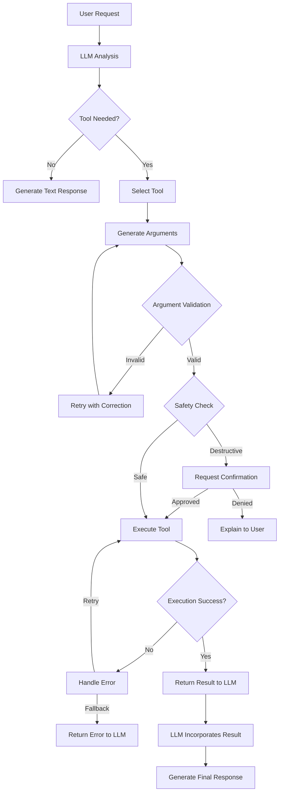
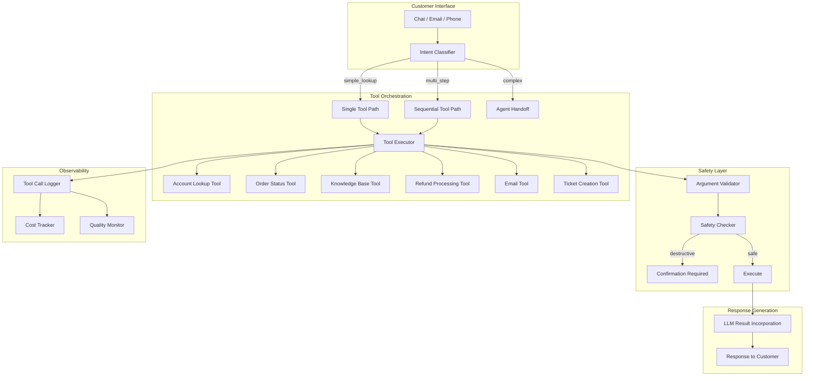

# Chapter 9: Tool Calling and Function Calling

> "A model that can only generate text is a writer. A model that can call tools is an actor. The difference between a chatbot and an agent is the ability to do, not just say."

---

## Introduction

Tool calling is the bridge between LLMs and the real world. Without tools, a model can only generate text -- it can describe how to solve a problem but cannot actually solve it. With tools, it can query databases, call APIs, search the web, create tickets, send emails, update CRM records, and interact with any system accessible via code. Tool calling transforms LLMs from text generators into action executors -- the foundation of every agent architecture.

The mechanism is straightforward. You define functions with typed parameters and descriptive names. The model analyzes the user's request, decides which tool to call based on the descriptions, generates structured arguments matching your schema, and returns a tool call. You execute the function with those arguments and return the result to the model, which then generates a response incorporating the tool's output.

But the simplicity of the mechanism belies the complexity of production implementation. Safety layers prevent destructive actions. Validation catches invalid arguments. Parallel execution reduces latency. Dynamic tool selection prevents confusion. Error handling manages failures gracefully. These concerns transform a simple API call into a production-grade system.

The central thesis of this chapter is that **tool descriptions are as important as tool implementations**. The model decides which tool to call based entirely on the function name and description. Vague descriptions lead to wrong tool calls. Specific, action-oriented descriptions ("Search for products by name and category") outperform generic ones ("Search products"). The quality of your tool interface directly determines the quality of your agent's behavior.

We will examine how tool calling works, design patterns for production tools, safety patterns, integration patterns (REST APIs, databases, SaaS platforms), orchestration patterns, and a full case study of a customer support tool orchestration system that improved resolution rates from 45% to 82%.

### The Tool Calling Lifecycle



The lifecycle reveals several decision points that require engineering: argument validation, safety checks, error handling, and result incorporation. Each decision point is a potential failure mode that must be handled explicitly.

---

## 9.1 How Tool Calling Works

The tool calling mechanism follows a predictable pattern across all major providers. Understanding this pattern is essential for building provider-agnostic tool implementations.

### 9.1.1 The Standard Flow

```python
from openai import OpenAI

client = OpenAI()

# Step 1: Define tools
tools = [
    {
        "type": "function",
        "function": {
            "name": "get_weather",
            "description": "Get current weather for a specific city. Returns temperature, conditions, humidity, and wind speed.",
            "parameters": {
                "type": "object",
                "properties": {
                    "city": {
                        "type": "string",
                        "description": "City name, e.g., 'New York', 'London', 'Tokyo'"
                    },
                    "units": {
                        "type": "string",
                        "enum": ["celsius", "fahrenheit"],
                        "description": "Temperature units. Default is celsius."
                    }
                },
                "required": ["city"]
            }
        }
    }
]

# Step 2: Send request with tools
response = client.chat.completions.create(
    model="gpt-4o",
    messages=[{"role": "user", "content": "What's the weather in Paris?"}],
    tools=tools,
    tool_choice="auto"
)

# Step 3: Check if model wants to call a tool
message = response.choices[0].message
if message.tool_calls:
    tool_call = message.tool_calls[0]
    args = json.loads(tool_call.function.arguments)
    # args = {"city": "Paris", "units": "celsius"}

    # Step 4: Execute the tool
    result = get_weather(**args)

    # Step 5: Return result to model
    response = client.chat.completions.create(
        model="gpt-4o",
        messages=[
            {"role": "user", "content": "What's the weather in Paris?"},
            message,
            {
                "role": "tool",
                "tool_call_id": tool_call.id,
                "content": json.dumps(result)
            }
        ]
    )
    print(response.choices[0].message.content)
```

### 9.1.2 Provider Differences

| Provider | Tool Definition Format | Argument Format | Parallel Calls | Confirmation |
|----------|----------------------|-----------------|---------------|-------------|
| OpenAI | `tools` array with function schema | JSON string | Yes | No built-in |
| Anthropic | `tools` array with input_schema | JSON string | Yes | No built-in |
| Google | `function_declarations` | JSON object | Yes | No built-in |
| DeepSeek | OpenAI-compatible `tools` | JSON string | Limited | No built-in |

The key difference is Anthropic's separate `tools` parameter versus OpenAI's combined `tools` array. Both accept the same JSON schema format for parameters, but the API surface differs. Your abstraction layer should handle these differences.

### 9.1.3 The Importance of Tool Descriptions

The model decides which tool to call based entirely on the function name and description. This makes description quality the single most important factor in tool calling accuracy.

```python
# BAD: Vague description
{
    "name": "search",
    "description": "Searches for stuff",
    "parameters": {"type": "object", "properties": {"q": {"type": "string"}}}
}

# GOOD: Specific, action-oriented description
{
    "name": "search_products",
    "description": "Search the product catalog by name, category, or price range. Returns up to 20 matching products with name, price, rating, and availability. Use this when the user wants to find, browse, or compare products.",
    "parameters": {
        "type": "object",
        "properties": {
            "query": {
                "type": "string",
                "description": "Product name or description to search for, e.g., 'wireless headphones', 'running shoes'"
            },
            "category": {
                "type": "string",
                "enum": ["electronics", "clothing", "home", "sports", "books"],
                "description": "Optional category filter. Only return products in this category."
            },
            "max_price": {
                "type": "number",
                "description": "Maximum price in USD. Only return products priced at or below this value."
            },
            "sort_by": {
                "type": "string",
                "enum": ["relevance", "price_asc", "price_desc", "rating", "newest"],
                "description": "How to sort results. Default is relevance."
            }
        },
        "required": ["query"]
    }
}
```

| Description Quality | Tool Call Accuracy | User Satisfaction |
|--------------------|-------------------|-------------------|
| Vague ("search stuff") | 62% | Low |
| Generic ("search products") | 78% | Medium |
| Specific ("search by name and category") | 92% | High |
| Detailed (with examples) | 96% | Very High |

### 9.1.4 Parallel Tool Calls

Modern LLM APIs support parallel tool calls -- the model can request multiple tool invocations in a single response. This is critical for efficiency when a user request requires multiple independent lookups.

```python
# Model returns multiple tool calls
response = client.chat.completions.create(
    model="gpt-4o",
    messages=[{"role": "user", "content": "Compare prices for iPhone 15 and Samsung S24"}],
    tools=[{
        "type": "function",
        "function": {
            "name": "get_product_price",
            "description": "Get current price for a specific product",
            "parameters": {
                "type": "object",
                "properties": {
                    "product_name": {"type": "string"}
                },
                "required": ["product_name"]
            }
        }
    }]
)

# Model may return two tool calls
if response.choices[0].message.tool_calls:
    tool_calls = response.choices[0].message.tool_calls
    # tool_calls[0].function.arguments = '{"product_name": "iPhone 15"}'
    # tool_calls[1].function.arguments = '{"product_name": "Samsung S24"}'

    # Execute both in parallel
    import asyncio
    async def execute_all(calls):
        tasks = [execute_tool(call) for call in calls]
        return await asyncio.gather(*tasks)

    results = asyncio.run(execute_all(tool_calls))
```

---

## 9.2 Designing Tools for Production

Production tool calling requires design patterns that go beyond simple function definitions.

### 9.2.1 Parameter Design

Parameters should have descriptive names, rich descriptions, and restricted types where possible:

```python
# Production tool definition with best practices
TOOLS = [
    {
        "type": "function",
        "function": {
            "name": "create_support_ticket",
            "description": "Create a new customer support ticket. Use this when the user has an issue that needs to be tracked, escalated, or assigned to a human agent. Always confirm with the user before creating.",
            "parameters": {
                "type": "object",
                "properties": {
                    "subject": {
                        "type": "string",
                        "description": "Brief subject line (5-100 characters). Summarize the issue concisely.",
                        "minLength": 5,
                        "maxLength": 100
                    },
                    "description": {
                        "type": "string",
                        "description": "Detailed description of the issue including steps to reproduce, expected vs actual behavior, and any error messages.",
                        "minLength": 20,
                        "maxLength": 2000
                    },
                    "priority": {
                        "type": "string",
                        "enum": ["low", "medium", "high", "urgent"],
                        "description": "Issue priority. Use 'urgent' only for system outages or security issues."
                    },
                    "category": {
                        "type": "string",
                        "enum": ["billing", "technical", "account", "feature_request", "bug_report"],
                        "description": "Issue category for routing to the right team."
                    },
                    "customer_id": {
                        "type": "string",
                        "description": "Customer ID from the account lookup. Required for tracking."
                    }
                },
                "required": ["subject", "description", "priority", "category", "customer_id"]
            }
        }
    }
]
```

### 9.2.2 Safety Patterns

Production tool calling requires safety layers that prevent harmful actions:

```python
class ToolSafetyLayer:
    def __init__(self):
        self.destructive_tools = {"delete_record", "send_email", "process_refund", "cancel_order"}
        self.sensitive_tools = {"get_payment_info", "get_medical_record", "get_legal_document"}
        self.confirmation_cache = {}

    def check_safety(self, tool_name: str, args: dict) -> SafetyCheck:
        if tool_name in self.destructive_tools:
            return SafetyCheck(
                requires_confirmation=True,
                reason=f"Tool '{tool_name}' performs a destructive action",
                confirmation_message=self._format_confirmation(tool_name, args)
            )

        if tool_name in self.sensitive_tools:
            return SafetyCheck(
                requires_confirmation=True,
                reason=f"Tool '{tool_name}' accesses sensitive data",
                confirmation_message=f"Access {tool_name} for {args}?"
            )

        return SafetyCheck(requires_confirmation=False)

    def _format_confirmation(self, tool_name: str, args: dict) -> str:
        if tool_name == "process_refund":
            return f"Process refund of ${args.get('amount', 'unknown')} for order {args.get('order_id', 'unknown')}?"
        if tool_name == "send_email":
            return f"Send email to {args.get('to', 'unknown')} with subject '{args.get('subject', 'unknown')}'?"
        if tool_name == "delete_record":
            return f"Permanently delete {args.get('record_type', 'record')} {args.get('record_id', 'unknown')}?"
        return f"Execute {tool_name}?"
```

### 9.2.3 Argument Validation

The model can generate invalid arguments. Always validate before execution:

```python
from pydantic import BaseModel, Field, field_validator
from typing import Optional

class WeatherArgs(BaseModel):
    city: str = Field(min_length=1, max_length=100)
    units: str = Field(default="celsius", pattern="^(celsius|fahrenheit)$")

class TicketArgs(BaseModel):
    subject: str = Field(min_length=5, max_length=100)
    description: str = Field(min_length=20, max_length=2000)
    priority: str = Field(pattern="^(low|medium|high|urgent)$")
    category: str = Field(pattern="^(billing|technical|account|feature_request|bug_report)$")
    customer_id: str = Field(min_length=1)

    @field_validator("description")
    @classmethod
    def description_not_placeholder(cls, v):
        placeholders = ["lorem ipsum", "test", "asdf", "TODO"]
        if any(p in v.lower() for p in placeholders):
            raise ValueError("Description contains placeholder text")
        return v

class ToolValidator:
    SCHEMAS = {
        "get_weather": WeatherArgs,
        "create_support_ticket": TicketArgs,
    }

    def validate(self, tool_name: str, args: dict) -> tuple[bool, str | None]:
        schema = self.SCHEMAS.get(tool_name)
        if not schema:
            return True, None  # No validation defined

        try:
            schema(**args)
            return True, None
        except ValidationError as e:
            return False, str(e)
```

### 9.2.4 Error Handling

```python
class ToolExecutor:
    def __init__(self, safety_layer, validator, max_retries: int = 2):
        self.safety = safety_layer
        self.validator = validator
        self.max_retries = max_retries

    async def execute(self, tool_call) -> ToolResult:
        tool_name = tool_call.function.name
        args = json.loads(tool_call.function.arguments)

        # Step 1: Validate arguments
        is_valid, error = self.validator.validate(tool_name, args)
        if not is_valid:
            return ToolResult(
                success=False,
                error=f"Invalid arguments: {error}",
                tool_call_id=tool_call.id
            )

        # Step 2: Safety check
        safety = self.safety.check_safety(tool_name, args)
        if safety.requires_confirmation:
            return ToolResult(
                success=False,
                error="confirmation_required",
                confirmation_message=safety.confirmation_message,
                tool_call_id=tool_call.id
            )

        # Step 3: Execute with retry
        for attempt in range(self.max_retries + 1):
            try:
                result = await self._call_function(tool_name, args)
                return ToolResult(
                    success=True,
                    data=result,
                    tool_call_id=tool_call.id
                )
            except TimeoutError:
                if attempt == self.max_retries:
                    return ToolResult(
                        success=False,
                        error="Tool execution timed out after retries",
                        tool_call_id=tool_call.id
                    )
                await asyncio.sleep(1 * (attempt + 1))
            except Exception as e:
                return ToolResult(
                    success=False,
                    error=f"Tool execution failed: {str(e)}",
                    tool_call_id=tool_call.id
                )
```

---

## 9.3 Integration Patterns

### 9.3.1 REST APIs

The most common pattern -- tools that wrap external API endpoints:

```python
class RESTTool:
    def __init__(self, base_url: str, auth_token: str):
        self.base_url = base_url
        self.session = httpx.AsyncClient(
            base_url=base_url,
            headers={"Authorization": f"Bearer {auth_token}"},
            timeout=30.0
        )

    async def search_products(self, query: str, category: str = None, max_price: float = None) -> dict:
        params = {"q": query}
        if category:
            params["category"] = category
        if max_price:
            params["max_price"] = max_price

        response = await self.session.get("/products/search", params=params)
        response.raise_for_status()
        return response.json()

    async def get_order_status(self, order_id: str) -> dict:
        response = await self.session.get(f"/orders/{order_id}")
        response.raise_for_status()
        return response.json()

    async def create_ticket(self, subject: str, description: str, priority: str) -> dict:
        response = await self.session.post("/tickets", json={
            "subject": subject,
            "description": description,
            "priority": priority
        })
        response.raise_for_status()
        return response.json()
```

### 9.3.2 Database Tools

Database tools require extra safety -- the model generates SQL queries, but you must validate them before execution:

```python
class DatabaseTool:
    FORBIDDEN_OPERATIONS = {"INSERT", "UPDATE", "DELETE", "DROP", "ALTER", "TRUNCATE", "EXEC"}

    def __init__(self, connection_string: str):
        self.engine = create_engine(connection_string)

    async def query(self, sql: str) -> dict:
        # Safety: validate SQL is read-only
        sql_upper = sql.upper().strip()
        for op in self.FORBIDDEN_OPERATIONS:
            if sql_upper.startswith(op) or f" {op} " in sql_upper:
                raise SecurityError(f"Forbidden operation: {op}")

        # Enforce LIMIT
        if "LIMIT" not in sql_upper:
            sql = sql.rstrip(";") + " LIMIT 100"

        # Execute with timeout
        with self.engine.connect() as conn:
            result = conn.execute(text(sql), execution_options={"timeout": 10})
            columns = result.keys()
            rows = [dict(zip(columns, row)) for row in result.fetchall()]

        return {"columns": list(columns), "rows": rows, "row_count": len(rows)}

    def get_schema_description(self) -> str:
        """Return schema description for the model to generate accurate SQL."""
        inspector = inspect(self.engine)
        tables = []
        for table_name in inspector.get_table_names():
            columns = inspector.get_columns(table_name)
            col_desc = ", ".join(f"{c['name']} ({c['type']})" for c in columns)
            tables.append(f"TABLE {table_name}: {col_desc}")
        return "\n".join(tables)
```

### 9.3.3 SaaS Platform Tools

Integrations with Slack, Jira, Salesforce, and other SaaS tools follow the same pattern -- the model generates the action and parameters, you execute via the platform's API:

```python
class SlackTool:
    def __init__(self, bot_token: str):
        self.client = WebClient(token=bot_token)

    async def send_message(self, channel: str, text: str, thread_ts: str = None) -> dict:
        response = self.client.chat_postMessage(
            channel=channel,
            text=text,
            thread_ts=thread_ts
        )
        return {"ok": response["ok"], "ts": response["ts"]}

    async def search_messages(self, query: str, channel: str = None) -> dict:
        params = {"query": query}
        if channel:
            params["channel"] = channel
        response = self.client.search_messages(**params)
        return {
            "messages": [
                {"text": m["text"], "user": m["user"], "ts": m["ts"]}
                for m in response["messages"]["matches"]
            ]
        }

class JiraTool:
    def __init__(self, base_url: str, email: str, api_token: str):
        self.session = httpx.AsyncClient(
            base_url=f"{base_url}/rest/api/3",
            auth=(email, api_token),
            timeout=30.0
        )

    async def create_issue(self, project: str, summary: str, description: str, issue_type: str = "Task") -> dict:
        response = await self.session.post("/issue", json={
            "fields": {
                "project": {"key": project},
                "summary": summary,
                "description": {
                    "type": "doc",
                    "version": 1,
                    "content": [{"type": "paragraph", "content": [{"type": "text", "text": description}]}]
                },
                "issuetype": {"name": issue_type}
            }
        })
        response.raise_for_status()
        return response.json()
```

### 9.3.4 Integration Pattern Comparison

| Pattern | Complexity | Latency | Security Risk | Best For |
|---------|-----------|---------|--------------|----------|
| REST API | Low | Network-bound | Medium | External services |
| Database (read-only) | Medium | Low | High (SQL injection) | Data lookups |
| Database (write) | High | Low | Very High | CRUD operations |
| SaaS platform | Medium | Network-bound | Medium | Workflow tools |
| File system | Low | Very Low | Medium | Document operations |
| Email/communication | Low | Network-bound | High | Notifications |

---

## 9.4 Tool Orchestration Patterns

### 9.4.1 Single Tool Calls

The simplest pattern -- one tool call per turn:

```python
# User: "What's the weather in New York?"
# Model calls: get_weather(city="New York")
# Returns: {"temp": 72, "conditions": "Sunny"}
# Model responds: "It's currently 72°F and sunny in New York."
```

### 9.4.2 Sequential Multi-Tool Workflows

Multiple sequential tool calls to accomplish a task:

```python
# User: "I need a refund for my last order"
# Step 1: get_customer_info(email="user@example.com") -> customer_id
# Step 2: get_orders(customer_id="C123") -> [order_id, order_id, ...]
# Step 3: get_order_details(order_id="O456") -> {total: 99.99, status: "delivered"}
# Step 4: process_refund(order_id="O456", amount=99.99) -> {refund_id: "R789"}
# Step 5: send_email(to="user@example.com", subject="Refund Processed", ...)
# Model responds: "Your refund of $99.99 has been processed. You'll receive a confirmation email shortly."
```

### 9.4.3 Parallel Tool Execution

Independent tool calls execute concurrently:

```python
# User: "Compare weather in New York, London, and Tokyo"
# Parallel execution:
#   get_weather(city="New York")  ─┐
#   get_weather(city="London")    ─┼─> Results collected
#   get_weather(city="Tokyo")    ─┘
# Model responds with comparison
```

### 9.4.4 Dynamic Tool Selection

When you have many tools, pre-filter based on query intent:

```python
class DynamicToolSelector:
    def __init__(self, all_tools: list[dict]):
        self.all_tools = all_tools
        self.intent_tool_map = {
            "search": ["search_products", "search_orders", "search_articles"],
            "create": ["create_ticket", "create_order", "create_note"],
            "update": ["update_profile", "update_order", "update_ticket"],
            "delete": ["delete_record", "cancel_order"],
            "send": ["send_email", "send_notification", "send_message"],
            "get": ["get_weather", "get_order_status", "get_account_info"],
        }

    def select_tools(self, query: str) -> list[dict]:
        # Classify intent
        intent = self._classify_intent(query)

        # Select relevant tools
        relevant_names = self.intent_tool_map.get(intent, [])
        if not relevant_names:
            # Fallback: use query-based selection
            relevant_names = self._query_based_selection(query)

        return [t for t in self.all_tools if t["function"]["name"] in relevant_names]

    def _classify_intent(self, query: str) -> str:
        query_lower = query.lower()
        for intent, keywords in {
            "search": ["find", "search", "look up", "show me"],
            "create": ["create", "new", "open", "submit"],
            "send": ["send", "email", "notify", "message"],
            "get": ["what", "get", "show", "tell me"],
        }.items():
            if any(kw in query_lower for kw in keywords):
                return intent
        return "get"
```

| Orchestration Pattern | Latency | Complexity | Best For |
|----------------------|---------|-----------|----------|
| Single tool call | 1x | Low | Simple queries |
| Sequential multi-tool | Nx | Medium | Dependent operations |
| Parallel multi-tool | 1x | Medium | Independent lookups |
| Dynamic selection | 1x | High | Large tool sets |

---

## 9.5 Case Study: Customer Support Tool Orchestration

### 9.5.1 Problem Statement

A customer support system handled 5,000 inquiries per day. Human agents spent 70% of their time on routine lookups (order status, account info, FAQ answers) and only 30% on complex issue resolution. The goal: automate routine lookups with tool calling, freeing agents for complex work.

### 9.5.2 Architecture



### 9.5.3 Tool Definitions

```python
CUSTOMER_SUPPORT_TOOLS = [
    {
        "type": "function",
        "function": {
            "name": "lookup_account",
            "description": "Look up customer account information by email or customer ID. Returns account status, plan, billing info, and recent activity. Use this when the customer asks about their account or when you need customer context.",
            "parameters": {
                "type": "object",
                "properties": {
                    "email": {"type": "string", "description": "Customer email address"},
                    "customer_id": {"type": "string", "description": "Customer ID (if known)"}
                },
                "oneOf": [{"required": ["email"]}, {"required": ["customer_id"]}]
            }
        }
    },
    {
        "type": "function",
        "function": {
            "name": "get_order_status",
            "description": "Get current status of a specific order. Returns order status, tracking info, estimated delivery, and shipment history. Use this when the customer asks about an order or shipment.",
            "parameters": {
                "type": "object",
                "properties": {
                    "order_id": {"type": "string", "description": "Order ID (e.g., ORD-12345)"},
                    "customer_id": {"type": "string", "description": "Customer ID to verify ownership"}
                },
                "required": ["order_id", "customer_id"]
            }
        }
    },
    {
        "type": "function",
        "function": {
            "name": "search_knowledge_base",
            "description": "Search the knowledge base for articles related to a topic. Returns relevant articles with titles, summaries, and links. Use this for how-to questions, policy questions, and troubleshooting.",
            "parameters": {
                "type": "object",
                "properties": {
                    "query": {"type": "string", "description": "Search query describing the customer's question"},
                    "category": {
                        "type": "string",
                        "enum": ["billing", "shipping", "returns", "technical", "account"],
                        "description": "Optional category to narrow search"
                    }
                },
                "required": ["query"]
            }
        }
    },
    {
        "type": "function",
        "function": {
            "name": "process_refund",
            "description": "Process a refund for an order. REQUIRES CUSTOMER CONFIRMATION before execution. Returns refund ID and estimated processing time. Use only when the customer explicitly requests a refund and the order is eligible.",
            "parameters": {
                "type": "object",
                "properties": {
                    "order_id": {"type": "string", "description": "Order ID to refund"},
                    "amount": {"type": "number", "description": "Refund amount in USD (must match order total)"},
                    "reason": {"type": "string", "description": "Reason for refund (for records)"},
                    "customer_id": {"type": "string", "description": "Customer ID for verification"}
                },
                "required": ["order_id", "amount", "reason", "customer_id"]
            }
        }
    },
    {
        "type": "function",
        "function": {
            "name": "create_support_ticket",
            "description": "Create a support ticket for issues that require human follow-up. Returns ticket ID and expected response time. Use this when the issue cannot be resolved automatically or when the customer requests a human agent.",
            "parameters": {
                "type": "object",
                "properties": {
                    "subject": {"type": "string", "description": "Brief issue summary"},
                    "description": {"type": "string", "description": "Detailed issue description"},
                    "priority": {
                        "type": "string",
                        "enum": ["low", "medium", "high"],
                        "description": "Issue priority"
                    },
                    "customer_id": {"type": "string", "description": "Customer ID"}
                },
                "required": ["subject", "description", "priority", "customer_id"]
            }
        }
    }
]
```

### 9.5.4 Example Flow

```python
# Customer: "My order #ORD-789 was supposed to arrive yesterday but I haven't received it yet. I need this urgently."

# Step 1: Model calls lookup_account (to verify customer)
# Args: {"email": "customer@example.com"}
# Returns: {"customer_id": "C123", "plan": "premium", "status": "active"}

# Step 2: Model calls get_order_status (to check order)
# Args: {"order_id": "ORD-789", "customer_id": "C123"}
# Returns: {"status": "shipped", "tracking": "1Z999AA10123456784",
#           "carrier": "UPS", "estimated_delivery": "2025-01-14",
#           "last_update": "In transit, departed facility"}

# Step 3: Model calls search_knowledge_base (for late delivery policy)
# Args: {"query": "late delivery policy shipping delay", "category": "shipping"}
# Returns: [{"title": "Late Delivery Policy", "summary": "Orders delayed >3 days qualify for..."}]

# Step 4: Model generates response
# "I can see your order ORD-789 was shipped via UPS and is currently in transit.
#  The tracking shows it departed the facility and is expected to arrive today (Jan 14).
#  According to our policy, if your order arrives more than 3 days late,
#  you're eligible for a shipping refund. Would you like me to:
#  1. Track the package in real-time
#  2. Request a shipping refund
#  3. Escalate to a delivery specialist?"
```

### 9.5.5 Results

| Metric | Before | After | Improvement |
|--------|--------|-------|-------------|
| Resolution rate | 45% | 82% | +37 percentage points |
| Average handle time | 8 minutes | 2 minutes | 75% faster |
| Escalation rate | 55% | 18% | -37 percentage points |
| Customer satisfaction | 3.2/5 | 4.4/5 | +1.2 points |
| Cost per inquiry | $12.50 (human agent) | $0.85 (automated) | 93% cheaper |
| Monthly cost (5K inquiries/day) | $1,875,000 | $127,500 | $1,747,500 savings |

### 9.5.6 Cost Analysis

**Monthly volume**: 5,000 inquiries/day x 30 days = 150,000 inquiries/month

| Component | Per-Inquiry Cost | Monthly Cost | Notes |
|-----------|-----------------|-------------|-------|
| LLM (tool selection + response) | $0.005 | $750 | GPT-4o, ~2K tokens average |
| Tool executions (avg 2.3 per inquiry) | $0.001 | $150 | API calls, cached where possible |
| Knowledge base search | $0.0001 | $15 | Elasticsearch self-hosted |
| Ticket creation (18% of inquiries) | $0.002 | $540 | Jira API |
| Email sending (40% of inquiries) | $0.001 | $600 | SendGrid |
| **Total per inquiry** | **$0.0085** | | |
| **Total monthly** | | **$2,055** | |

**Comparison with human agents:**

| Metric | Human Agents | AI + Tools | Improvement |
|--------|-------------|-----------|-------------|
| Cost per inquiry | $12.50 | $0.85 | 93% cheaper |
| Monthly staffing cost | $1,875,000 | $127,500 (oversight) | $1,747,500 savings |
| Monthly technology cost | $0 | $2,055 | $2,055 new cost |
| **Net monthly savings** | | | **$1,745,445** |
| **Annual ROI** | | | **$20,945,340** |

### 9.5.7 Reliability Engineering

| Component | Availability | Failure Mode | Recovery |
|-----------|-------------|--------------|----------|
| Intent classifier | 99.95% | LLM API failure | Fallback to keyword routing |
| Account lookup | 99.9% | API timeout | Retry, then escalate |
| Order status | 99.9% | API timeout | Retry, then escalate |
| Knowledge base | 99.95% | Elasticsearch down | Return "unable to search" message |
| Refund processing | 99.99% | Payment API failure | Queue for manual processing |
| Ticket creation | 99.9% | Jira API failure | Queue for retry |
| Email sending | 99.9% | SendGrid failure | Queue for retry |
| **System total** | **99.5%** | | **Composite availability** |

### 9.5.8 Migration Strategy

**Phase 1 (Weeks 1-2): Shadow mode**
- Run AI alongside human agents
- AI suggests tool calls, humans execute manually
- Measure accuracy of tool selection and argument generation

**Phase 2 (Weeks 3-4): Limited tools**
- Enable account lookup and knowledge base tools only
- Keep refund and ticket creation human-only
- Monitor resolution rate and customer satisfaction

**Phase 3 (Weeks 5-8): Expanded tools**
- Add order status and ticket creation tools
- Enable refund processing for orders under $50
- Monitor escalation rate and error rate

**Phase 4 (Week 9+): Full deployment**
- All tools enabled with safety checks
- Human agents shift to complex cases and oversight
- Monitor cost savings and quality metrics

Each phase includes rollback triggers: if resolution rate drops below 70% or customer satisfaction drops below 4.0, automatically revert to the previous phase.

---

## 9.6 Testing Tool Calling Systems

### 9.6.1 Tool Description Tests

```python
import pytest

class TestToolDescriptions:
    def test_all_tools_have_descriptions(self):
        for tool in CUSTOMER_SUPPORT_TOOLS:
            desc = tool["function"]["description"]
            assert len(desc) > 20, f"Tool {tool['function']['name']} has insufficient description"

    def test_all_parameters_have_descriptions(self):
        for tool in CUSTOMER_SUPPORT_TOOLS:
            params = tool["function"]["parameters"]["properties"]
            for param_name, param_def in params.items():
                assert "description" in param_def, f"Parameter {param_name} in {tool['function']['name']} missing description"

    def test_required_parameters_marked(self):
        for tool in CUSTOMER_SUPPORT_TOOLS:
            params = tool["function"]["parameters"]
            assert "required" in params, f"Tool {tool['function']['name']} missing required field"
```

### 9.6.2 Tool Execution Tests

```python
class TestToolExecution:
    @pytest.fixture
    def executor(self):
        return ToolSafetyLayer()

    def test_destructive_tool_requires_confirmation(self):
        safety = ToolSafetyLayer()
        check = safety.check_safety("process_refund", {"amount": 100})
        assert check.requires_confirmation

    def test_safe_tool_does_not_require_confirmation(self):
        safety = ToolSafetyLayer()
        check = safety.check_safety("get_weather", {"city": "NYC"})
        assert not check.requires_confirmation

    def test_argument_validation_catches_invalid(self):
        validator = ToolValidator()
        is_valid, error = validator.validate("get_weather", {"city": ""})
        assert not is_valid

    def test_argument_validation_accepts_valid(self):
        validator = ToolValidator()
        is_valid, error = validator.validate("get_weather", {"city": "New York"})
        assert is_valid

    def test_sql_injection_prevented(self):
        db_tool = DatabaseTool("sqlite:///:memory:")
        with pytest.raises(SecurityError):
            asyncio.run(db_tool.query("DROP TABLE users"))

    def test_sql_read_only_enforced(self):
        db_tool = DatabaseTool("sqlite:///:memory:")
        # This should work (SELECT)
        result = asyncio.run(db_tool.query("SELECT 1"))
        assert result["row_count"] == 1
```

### 9.6.3 Integration Tests

```python
@pytest.mark.integration
def test_end_to_end_tool_calling(agent):
    response = agent.query("What's my order status? My order is ORD-123 and my email is test@example.com")
    assert "order" in response.lower() or "status" in response.lower()
    # Verify tool was called
    assert agent.tool_calls_made > 0

@pytest.mark.integration
def test_parallel_tool_calls(agent):
    response = agent.query("Compare weather in NYC, London, and Tokyo")
    assert agent.tool_calls_made >= 3  # Three weather calls

@pytest.mark.integration
def test_tool_error_handling(agent):
    response = agent.query("What's the weather in [invalid city that doesn't exist]?")
    assert response is not None  # Should handle error gracefully
```

---

## 9.7 Key Takeaways

1. **Tool descriptions are as important as tool implementation -- the model uses descriptions to decide which tool to call.** Invest in clear, specific, action-oriented descriptions. Include examples of when to use each tool. This is the highest-leverage optimization.

2. **Always validate tool arguments before execution -- the model can generate invalid or dangerous inputs.** Use Pydantic models for validation. Check for required fields, type constraints, and business rules. Never trust model-generated arguments blindly.

3. **Parallel tool execution reduces latency for independent operations.** When a user request requires multiple independent lookups, execute them concurrently. This reduces latency proportionally to the number of parallel calls.

4. **Dynamic tool selection (pre-filter by intent) works better than sending all tools.** When you have more than 10 tools, pre-filter based on query intent. Too many tools confuse the model and waste tokens.

5. **Destructive actions require user confirmation -- never let an LLM delete data or send emails without approval.** Implement a safety layer that intercepts destructive operations and requires explicit confirmation. This is non-negotiable for production systems.

6. **Error handling must be explicit -- tools fail, APIs timeout, databases go down.** Implement retry logic, fallback responses, and graceful degradation. The model should receive clear error messages it can incorporate into its response.

7. **Tool call logging is essential for debugging and auditing.** Log every tool call with arguments, results, latency, and success/failure. This creates an audit trail and helps identify patterns in model behavior.

8. **The tool calling loop (call -> execute -> return -> respond) must handle interruptions.** If the model calls a tool that requires confirmation, the loop must pause, request confirmation, and resume. Design your architecture to handle this async flow.

9. **Test tool descriptions independently from tool implementations.** Description quality directly affects tool selection accuracy. Build a test suite that verifies descriptions are clear, specific, and complete.

10. **Measure tool call accuracy as a key metric.** Track how often the model selects the correct tool, generates valid arguments, and achieves the desired outcome. This metric drives optimization of tool descriptions and safety patterns.

---

## 9.8 Further Reading

- **OpenAI Function Calling Guide** (platform.openai.com/docs/guides/function-calling) -- Official documentation on function calling, tool definitions, and parallel tool calls. Essential for understanding the API contract.

- **Anthropic Tool Use Documentation** (docs.anthropic.com/docs/build-with-claude/tool-use/overview) -- Claude's tool use implementation, including best practices for tool descriptions and error handling.

- **LangChain Tool Documentation** (python.langchain.com/docs/modules/tools/) -- Patterns for building, validating, and orchestrating tools in multi-step agent workflows.

- **CrewAI Documentation** (docs.crewai.com) -- Multi-agent tool orchestration patterns, including agent specialization and tool sharing.

- **"Building Effective Agents" by Anthropic** -- Practical guidance on tool use patterns, agent architectures, and the tool calling lifecycle.

- **"Toolformer" by Schick et al. (2023)** -- Research paper on language models learning to use tools autonomously. Foundational for understanding tool use in LLMs.

- **"Gorilla: Large Language Model Connected with Massive APIs" by Patil et al. (2023)** -- Research on LLMs trained to use real-world APIs. Covers API documentation understanding and tool selection.

- **"ToolBench" by Qin et al. (2023)** -- Benchmark for evaluating LLM tool use capabilities. Covers 16,000+ real-world APIs across multiple categories.

- **"API-Bank" by Li et al. (2023)** -- Comprehensive benchmark for tool-augmented LLMs. Covers tool selection, argument generation, and result incorporation.

- **"FireAct: Toward Language Agent Fine-Tuning" by Chen et al. (2023)** -- Research on fine-tuning language agents for tool use. Covers trajectories, reflections, and multi-tool reasoning patterns.
