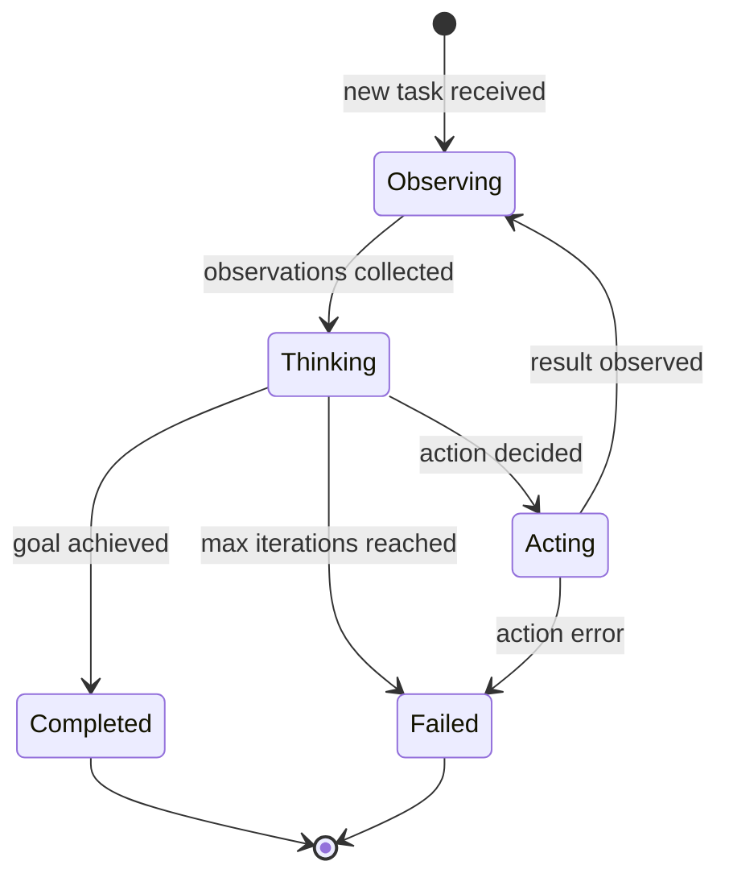
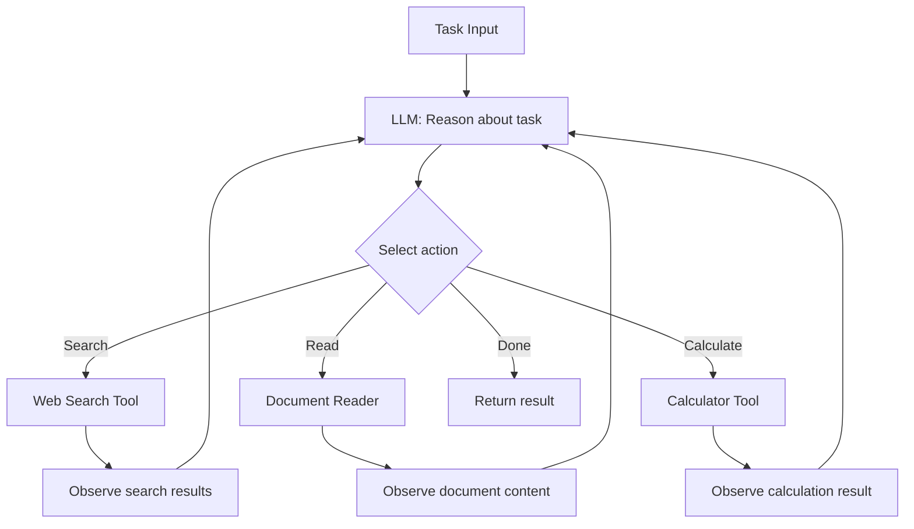
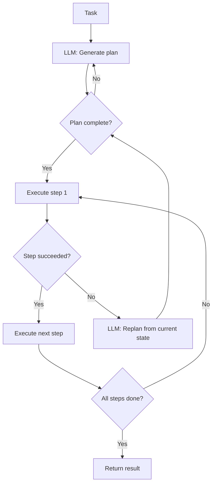
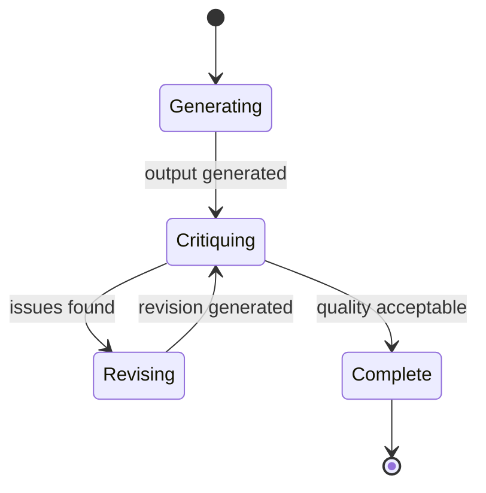
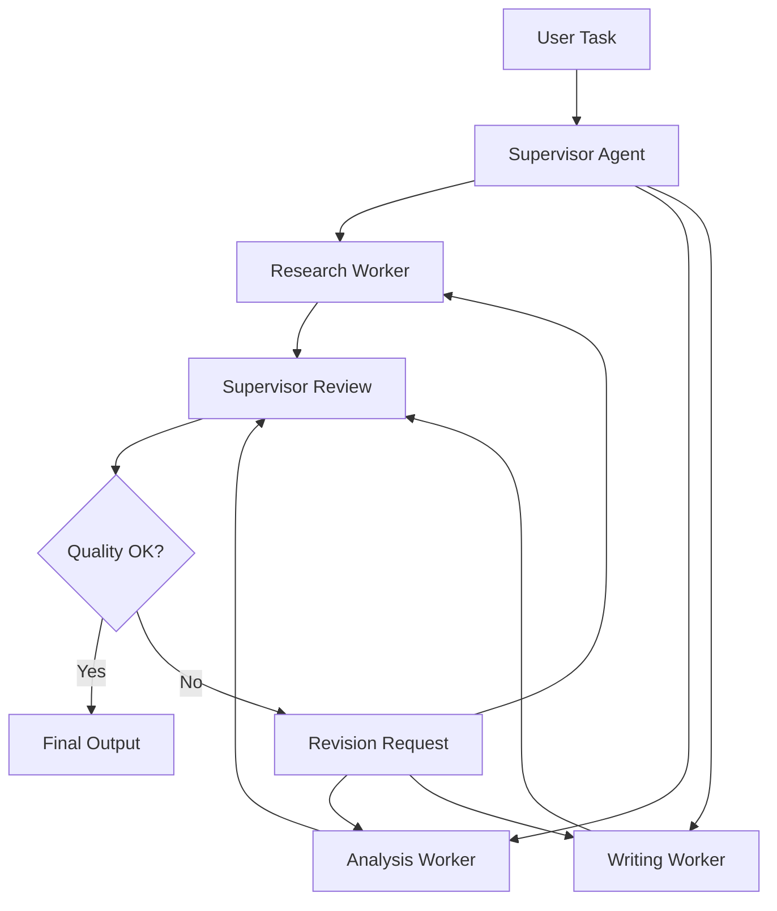
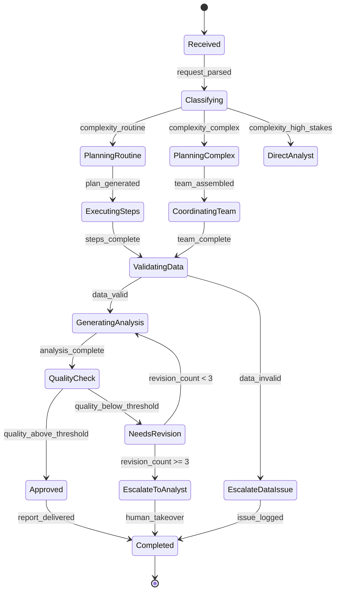

# Chapter 10: AI Agents

> "An agent is not a chatbot with tools. It is a system that reasons about its own limitations, plans around obstacles, and adapts when the world refuses to cooperate."

---

## Introduction

In the preceding chapters, we explored structured patterns for LLM applications—retrieval-augmented generation, chain-of-thought prompting, and deterministic workflows. Each of these patterns follows a predictable execution path: input flows through a fixed sequence of transformations, and the output emerges at the end. But many real-world tasks refuse to fit neat pipelines. Research questions require exploring multiple sources, synthesizing contradictory findings, and deciding when enough evidence has been gathered. Customer support interactions branch unpredictably—account verification, technical diagnosis, billing disputes—and the agent must recover when an API call fails or a customer provides incomplete information. Software development tasks demand planning, decomposition, iterative refinement, and coordination across multiple tools.

AI agents address this class of problems. An agent is a system that observes its environment, reasons about what to do next, takes action, and learns from the results—repeating this loop until the goal is achieved or a stopping condition is met. Unlike a chain (which follows a predetermined sequence), an agent dynamically decides its next step based on what it has observed so far. This adaptability is the agent's superpower—and its greatest liability. Agents consume five to twenty times more tokens than single-turn applications, they can loop indefinitely without guardrails, and their behavior is harder to predict and test.

The central thesis of this chapter is the **agent-adaptability trade-off**: the more adaptive your agent, the harder it is to control, test, and cost-predict. Production agents live on a spectrum between rigid pipelines (deterministic, cheap, predictable) and fully autonomous agents (adaptive, expensive, unpredictable). The architectural challenge is finding the point on this spectrum that matches your task's complexity without overspending on adaptability you do not need.

We will examine the agent lifecycle in detail—observation, reasoning, action, and learning loops. We will dissect the major agent architectures (ReAct, planning, reflection, tool-using) and their trade-offs. We will explore multi-agent coordination patterns including supervisor-worker, peer-to-peer, and swarm topologies. We will build a full case study: a financial research agent that navigates APIs, synthesizes reports, and operates under regulatory constraints. And we will cover the hard-won lessons of production agent deployment—cost control, failure modes, testing strategies, and the decision framework for when agents are warranted versus when simpler patterns suffice.

### The Agent Spectrum

Before diving into architectures, it is essential to understand where agents sit relative to other GenAI patterns:

| Pattern | Adaptability | Cost per Task | Predictability | When to Use |
|---------|-------------|---------------|----------------|-------------|
| **Single LLM call** | None | $0.001-0.01 | Fully deterministic | Simple Q&A, classification |
| **Chain (sequential)** | Low | $0.005-0.05 | Deterministic | Multi-step with known path |
| **Pipeline (branching)** | Medium | $0.01-0.10 | Mostly deterministic | Document processing, ETL |
| **Agent (ReAct)** | High | $0.05-0.50 | Probabilistic with guardrails | Research, support, coding |
| **Multi-agent system** | Very high | $0.50-5.00 | Emergent behavior | Complex collaboration tasks |
| **Autonomous agent** | Maximum | $5.00-50.00 | Hard to predict | Exploration, creative tasks |

Most production applications should start at the top of this table and only move down when simpler patterns demonstrably fail. The cost-per-task column tells the story: a single LLM call for a classification task costs $0.001, while an autonomous agent tackling the same task might cost $0.50. The 500x cost multiplier is justified only when the task genuinely requires multi-step reasoning, tool orchestration, and adaptive strategy.

---

## 10.1 The Agent Lifecycle

### 10.1.1 The Think-Act-Observe Loop

Every agent, regardless of architecture, runs a core loop:

1. **Observe**: Gather information from the environment—user input, tool outputs, previous observations, system state.
2. **Think**: Reason about the current state and decide what to do next. This is where the LLM's reasoning capabilities shine.
3. **Act**: Execute the chosen action—call a tool, generate a response, update internal state.
4. **Observe the result**: Capture the output of the action and feed it back into the loop.
5. **Repeat or stop**: If the goal is achieved or a stopping condition is met, exit the loop. Otherwise, return to step 1.

The following state machine models this lifecycle:



The critical guardrail is the **iteration limit**. Without one, agents can loop forever—retrying the same failed action, exploring dead ends, or generating increasingly verbose reasoning without progress. Every production agent must have:

- **Max iterations**: A hard cap on loop count (typically 10-25 for ReAct agents).
- **Timeout**: A wall-clock limit (typically 60-300 seconds) that kills the loop regardless of iteration count.
- **Budget cap**: A maximum token spend per task that triggers graceful termination.
- **Deduplication**: Detection of repeated observations or actions that indicate a loop.

```python
import time
from dataclasses import dataclass, field

@dataclass
class AgentConfig:
    max_iterations: int = 15
    timeout_seconds: float = 120.0
    max_tokens: int = 100_000
    dedup_window: int = 5

@dataclass
class AgentState:
    task: str
    observations: list[str] = field(default_factory=list)
    actions_taken: list[str] = field(default_factory=list)
    token_count: int = 0
    iteration: int = 0
    start_time: float = field(default_factory=time.time)
    recent_observations: list[str] = field(default_factory=list)

    @property
    def elapsed(self) -> float:
        return time.time() - self.start_time

    def should_stop(self, config: AgentConfig) -> tuple[bool, str]:
        if self.iteration >= config.max_iterations:
            return True, f"Max iterations ({config.max_iterations}) reached"
        if self.elapsed > config.timeout_seconds:
            return True, f"Timeout ({config.timeout_seconds}s) reached"
        if self.token_count > config.max_tokens:
            return True, f"Token budget ({config.max_tokens}) exceeded"
        if self._is_looping(config):
            return True, "Loop detected: repeated observations"
        return False, ""

    def _is_looping(self, config: AgentConfig) -> bool:
        if len(self.recent_observations) < config.dedup_window:
            return False
        recent = self.recent_observations[-config.dedup_window:]
        return len(set(recent)) < 3
```

### 10.1.2 Observation, Reasoning, and Action

Each phase of the loop serves a distinct purpose:

**Observation** is the agent's sensory input. Observations come from multiple sources:

```python
class Observation:
    def __init__(self, source: str, content: str, timestamp: float, metadata: dict = None):
        self.source = source
        self.content = content
        self.timestamp = timestamp
        self.metadata = metadata or {}

    def __str__(self):
        return f"[{self.source}] {self.content[:200]}"

class ObservationBuffer:
    """Manages observations with deduplication and importance scoring."""
    def __init__(self, max_size: int = 50):
        self.observations: list[Observation] = []
        self.max_size = max_size
        self.seen_hashes: set[int] = set()

    def add(self, obs: Observation) -> bool:
        obs_hash = hash(obs.content)
        if obs_hash in self.seen_hashes:
            return False  # Deduplicate
        self.seen_hashes.add(obs_hash)
        self.observations.append(obs)
        if len(self.observations) > self.max_size:
            self.observations = self.observations[-self.max_size:]
        return True

    def get_context(self, last_n: int = 10) -> str:
        recent = self.observations[-last_n:]
        return "\n".join(str(o) for o in recent)
```

**Reasoning** is the agent's decision engine. The LLM receives the task, recent observations, and available actions, then produces a reasoning trace and action selection:

```python
REACT_PROMPT = """You are an agent working on the following task: {task}

You have taken {iteration} steps so far. Here are your recent observations:
{observations}

Available actions:
{actions}

Think step by step about what to do next. Consider:
1. What have you learned so far?
2. What information is still missing?
3. Which action moves you closest to completing the task?
4. Are you making progress, or stuck in a loop?

Respond in this format:
Thought: [your reasoning about what to do next]
Action: [the action to take]
Action Input: [the input for that action]
"""
```

**Action** is the agent's output to the world. Actions are typed—each action has a name, expected inputs, and guaranteed output format:

```python
from enum import Enum
from pydantic import BaseModel

class ActionType(str, Enum):
    SEARCH_WEB = "search_web"
    READ_DOCUMENT = "read_document"
    CALCULATE = "calculate"
    WRITE_REPORT = "write_report"
    ASK_HUMAN = "ask_human"
    DONE = "done"

class AgentAction(BaseModel):
    action_type: ActionType
    input_data: dict
    reasoning: str

    def execute(self, environment: "AgentEnvironment") -> str:
        if self.action_type == ActionType.SEARCH_WEB:
            return environment.search(self.input_data["query"])
        elif self.action_type == ActionType.READ_DOCUMENT:
            return environment.read_doc(self.input_data["doc_id"])
        elif self.action_type == ActionType.CALCULATE:
            return environment.calculate(self.input_data["expression"])
        elif self.action_type == ActionType.WRITE_REPORT:
            return environment.write_report(self.input_data["content"])
        elif self.action_type == ActionType.ASK_HUMAN:
            return environment.ask_human(self.input_data["question"])
        elif self.action_type == ActionType.DONE:
            return "Task completed"
        raise ValueError(f"Unknown action: {self.action_type}")
```

### 10.1.3 The Full Agent Loop

Combining observation, reasoning, and action into a complete agent:

```python
class Agent:
    def __init__(self, llm, tools: list, config: AgentConfig):
        self.llm = llm
        self.tools = {tool.name: tool for tool in tools}
        self.config = config

    def run(self, task: str) -> str:
        state = AgentState(task=task)
        obs_buffer = ObservationBuffer()

        obs_buffer.add(Observation(
            source="user", content=task, timestamp=time.time()
        ))

        while True:
            should_stop, reason = state.should_stop(self.config)
            if should_stop:
                return self._format_partial_result(state, reason)

            # Build context for LLM
            context = self._build_context(state, obs_buffer)

            # Get LLM decision
            response = self.llm.generate(context)
            parsed = self._parse_response(response)

            state.iteration += 1
            state.actions_taken.append(f"{parsed.action_type}: {parsed.input_data}")

            # Execute action
            if parsed.action_type == ActionType.DONE:
                return parsed.input_data.get("result", "Task completed")

            result = parsed.execute(self._build_environment())

            # Observe result
            obs = Observation(
                source=parsed.action_type.value,
                content=result,
                timestamp=time.time()
            )
            obs_buffer.add(obs)
            state.observations.append(result)
            state.token_count += self._count_tokens(context) + self._count_tokens(result)

        return self._format_partial_result(state, "Unexpected exit")

    def _build_context(self, state: AgentState, obs_buffer: ObservationBuffer) -> str:
        tool_descriptions = "\n".join(
            f"- {name}: {tool.description}"
            for name, tool in self.tools.items()
        )
        return REACT_PROMPT.format(
            task=state.task,
            iteration=state.iteration,
            observations=obs_buffer.get_context(last_n=10),
            actions=tool_descriptions
        )
```

---

## 10.2 Agent Architectures

### 10.2.1 ReAct: Reasoning and Acting

ReAct is the foundational agent architecture. The LLM interleaves reasoning (thinking about what to do) with acting (calling tools), observes the result, and continues. ReAct is simple, effective, and the default starting point for most agent implementations.



**ReAct implementation with tool execution:**

```python
from openai import OpenAI

class ReActAgent:
    def __init__(self, model: str = "gpt-4o", tools: list = None):
        self.client = OpenAI()
        self.model = model
        self.tools = tools or []
        self.max_iterations = 15

    def run(self, task: str) -> str:
        messages = [
            {"role": "system", "content": self._system_prompt()},
            {"role": "user", "content": task}
        ]
        tool_results = []

        for i in range(self.max_iterations):
            response = self.client.chat.completions.create(
                model=self.model,
                messages=messages,
                tools=self._tool_definitions(),
                tool_choice="auto"
            )

            msg = response.choices[0].message

            if not msg.tool_calls:
                return msg.content

            # Execute all tool calls
            for tool_call in msg.tool_calls:
                result = self._execute_tool(tool_call)
                tool_results.append({
                    "tool_call_id": tool_call.id,
                    "result": result
                })

            # Build next message sequence
            messages.append(msg)
            for tr in tool_results:
                messages.append({
                    "role": "tool",
                    "tool_call_id": tr["tool_call_id"],
                    "content": tr["result"]
                })
            tool_results = []

        return "Max iterations reached. Partial results: " + messages[-1].content

    def _system_prompt(self) -> str:
        tool_list = "\n".join(f"- {t.name}: {t.description}" for t in self.tools)
        return f"""You are a reasoning agent. For each task:
1. Think about what information you need
2. Use the appropriate tool to get that information
3. Analyze the result
4. Decide if you have enough information to complete the task
5. If not, continue reasoning and using tools

Available tools:
{tool_list}

When you have enough information, provide a comprehensive final answer."""

    def _execute_tool(self, tool_call) -> str:
        for tool in self.tools:
            if tool.name == tool_call.function.name:
                import json
                args = json.loads(tool_call.function.arguments)
                return tool.execute(**args)
        return f"Unknown tool: {tool_call.function.name}"
```

**When to use ReAct:**
- Tasks requiring external information retrieval
- Customer support with multiple tools (CRM lookup, ticket creation, knowledge base)
- Research tasks with bounded scope
- Coding tasks with file reading and tool use

**When ReAct fails:**
- Tasks requiring long-horizon planning (use planning agents instead)
- Tasks requiring self-critique and improvement (use reflection agents)
- Tasks with many parallel subtasks (use multi-agent systems)

### 10.2.2 Planning Agents

Planning agents separate the thinking phase from the execution phase. First, the agent generates a complete plan. Then, it executes each step. If a step fails, it replans from the current state. This approach excels at tasks with clear decomposition—research projects, data pipelines, multi-file refactoring.



**Planning agent implementation:**

```python
from pydantic import BaseModel
from typing import Optional

class PlanStep(BaseModel):
    step_id: int
    description: str
    tool_needed: str
    expected_output: str
    depends_on: list[int] = []
    status: str = "pending"
    result: Optional[str] = None

class Plan(BaseModel):
    goal: str
    steps: list[PlanStep]
    current_step: int = 0

class PlanningAgent:
    def __init__(self, llm, tools: list, max_replans: int = 3):
        self.llm = llm
        self.tools = {t.name: t for t in tools}
        self.max_replans = max_replans

    def run(self, task: str) -> str:
        plan = self._generate_plan(task)
        replan_count = 0

        while plan.current_step < len(plan.steps):
            step = plan.steps[plan.current_step]

            # Check dependencies
            if not self._dependencies_met(plan, step):
                plan.current_step += 1
                continue

            # Execute step
            try:
                result = self._execute_step(step)
                step.result = result
                step.status = "completed"
                plan.current_step += 1
            except Exception as e:
                step.status = "failed"
                if replan_count < self.max_replans:
                    plan = self._replan(plan, step, str(e))
                    replan_count += 1
                else:
                    return f"Plan failed at step {step.step_id}: {e}"

        return self._synthesize_results(plan)

    def _generate_plan(self, task: str) -> Plan:
        prompt = f"""Create a step-by-step plan for: {task}

Available tools: {list(self.tools.keys())}

Return a JSON plan with steps, each having:
- description: what this step does
- tool_needed: which tool to use
- expected_output: what we expect to get
- depends_on: list of step IDs this depends on (0-indexed)
"""
        response = self.llm.generate(prompt, response_format="json")
        return Plan(goal=task, steps=[PlanStep(**s) for s in response["steps"]])

    def _execute_step(self, step: PlanStep) -> str:
        tool = self.tools.get(step.tool_needed)
        if not tool:
            raise ValueError(f"Unknown tool: {step.tool_needed}")
        return tool.execute(description=step.description)

    def _replan(self, failed_plan: Plan, failed_step: PlanStep, error: str) -> Plan:
        prompt = f"""The following plan failed at step {failed_step.step_id}.
Error: {error}

Original plan: {[s.description for s in failed_plan.steps]}
Completed steps: {[s.description for s in failed_plan.steps if s.status == "completed"]}
Accumulated results: {[s.result for s in failed_plan.steps if s.result]}

Create a new plan from the current state. Do not repeat completed steps."""
        return self._generate_plan(prompt)

    def _dependencies_met(self, plan: Plan, step: PlanStep) -> bool:
        return all(
            plan.steps[dep].status == "completed"
            for dep in step.depends_on
        )

    def _synthesize_results(self, plan: Plan) -> str:
        results = [(s.description, s.result) for s in plan.steps if s.result]
        prompt = f"Goal: {plan.goal}\n\nResults:\n"
        for desc, result in results:
            prompt += f"- {desc}: {result[:500]}\n"
        prompt += "\nSynthesize these results into a comprehensive answer."
        return self.llm.generate(prompt)
```

**Planning agent trade-offs:**

| Aspect | Planning Agent | ReAct Agent |
|--------|---------------|-------------|
| Task decomposition | Explicit upfront plan | Ad-hoc per iteration |
| Failure handling | Replan from current state | Retry same action |
| Latency | Higher (plan generation) | Lower (direct reasoning) |
| Token cost | 2-5x higher | Baseline |
| Complex tasks | Better decomposition | May miss steps |
| Parallel execution | Native (DAG dependencies) | Sequential |
| Transparency | Plan visible to user | Reasoning trace only |

### 10.2.3 Reflection Agents

Reflection agents generate an output, critique it, and improve it iteratively. This architecture is powerful for tasks where quality improves with refinement—code generation, analysis, writing, and design. The reflection loop continues until the output meets a quality threshold or a maximum iteration count is reached.



**Reflection agent implementation:**

```python
class ReflectionAgent:
    def __init__(self, llm, max_reflections: int = 3, quality_threshold: float = 0.8):
        self.llm = llm
        self.max_reflections = max_reflections
        self.quality_threshold = quality_threshold

    def run(self, task: str) -> str:
        # Initial generation
        output = self.llm.generate(
            f"Complete the following task with your best effort:\n{task}"
        )

        for reflection_num in range(self.max_reflections):
            # Critique
            critique = self.llm.generate(f"""Critique this output for the task: {task}

Output:
{output}

Identify specific issues:
1. Factual errors or missing information
2. Logical inconsistencies
3. Quality issues (clarity, completeness, accuracy)
4. Areas for improvement

For each issue, provide the specific fix needed.
If the output is acceptable, respond with "QUALITY_ACCEPTABLE" as the first line.""")

            if critique.startswith("QUALITY_ACCEPTABLE"):
                return output

            # Revise
            output = self.llm.generate(f"""Revise this output based on the critique.

Original task: {task}

Current output:
{output}

Critique:
{critique}

Produce a revised version that addresses all identified issues.""")

        return output
```

**Reflection loop cost model:**

| Reflections | LLM Calls | Token Multiplier | Quality Improvement |
|-------------|-----------|------------------|---------------------|
| 0 (baseline) | 1 | 1.0x | Baseline |
| 1 | 3 | 2.5-3.0x | +15-25% quality |
| 2 | 5 | 4.0-5.0x | +25-35% quality |
| 3 | 7 | 5.5-7.0x | +30-40% quality |

The diminishing returns are real: the first reflection typically produces the largest quality gain. For most applications, 1-2 reflections is the sweet spot. Three reflections are justified only for high-stakes outputs (legal documents, financial reports, code that will be deployed to production).

### 10.2.4 Tool-Using Agents

Tool-using agents focus primarily on deciding which tools to call and in what order. They are the simplest agent pattern—no complex reasoning loops, no planning, just intelligent tool orchestration. This pattern is sufficient for many production use cases.

```python
class ToolUsingAgent:
    def __init__(self, llm, tools: list):
        self.client = OpenAI()
        self.tools = tools

    def run(self, task: str) -> dict:
        messages = [{"role": "user", "content": task}]
        results = {}

        # Single round of tool calls
        response = self.client.chat.completions.create(
            model="gpt-4o",
            messages=messages,
            tools=self._tool_definitions(),
            tool_choice="required"
        )

        msg = response.choices[0].message
        if msg.tool_calls:
            for tc in msg.tool_calls:
                tool = self._get_tool(tc.function.name)
                args = json.loads(tc.function.arguments)
                result = tool.execute(**args)
                results[tc.function.name] = result

        # Synthesize results
        messages.append(msg)
        messages.append({
            "role": "tool",
            "tool_call_id": msg.tool_calls[0].id,
            "content": json.dumps(results)
        })

        final = self.client.chat.completions.create(
            model="gpt-4o",
            messages=messages + [{
                "role": "user",
                "content": "Synthesize the tool results into a final answer."
            }]
        )
        return {"answer": final.choices[0].message.content, "tools_used": list(results.keys())}
```

---

## 10.3 Multi-Agent Systems

### 10.3.1 Supervisor-Worker Pattern

The most common multi-agent topology: a supervisor agent coordinates specialized worker agents. The supervisor decomposes the task, delegates subtasks to appropriate workers, reviews results, and synthesizes the final output.



**Supervisor-worker implementation:**

```python
class WorkerAgent:
    def __init__(self, name: str, specialty: str, llm):
        self.name = name
        self.specialty = specialty
        self.llm = llm

    def execute(self, task: str, context: str = "") -> str:
        return self.llm.generate(
            f"You are a {self.specialty} specialist.\n"
            f"Task: {task}\n"
            f"Context: {context}\n"
            f"Provide your detailed analysis."
        )

class SupervisorAgent:
    def __init__(self, workers: list[WorkerAgent], llm):
        self.workers = {w.name: w for w in workers}
        self.llm = llm
        self.max_rounds = 3

    def run(self, task: str) -> str:
        # Decompose task
        decomposition = self.llm.generate(
            f"Decpose this task into subtasks for specialists:\n{task}\n"
            f"Available specialists: {list(self.workers.keys())}\n"
            f"Return JSON: {{subtasks: [{{
                'specialist': 'name',
                'task': 'description',
                'depends_on': []
            }}]}}"
        )

        # Execute subtasks
        results = {}
        for subtask in decomposition["subtasks"]:
            specialist = self.workers[subtask["specialist"]]
            context_parts = [
                results.get(dep, "") for dep in subtask.get("depends_on", [])
            ]
            result = specialist.execute(
                subtask["task"],
                context="\n".join(context_parts)
            )
            results[subtask["specialist"]] = result

        # Review and synthesize
        synthesis = self.llm.generate(
            f"Original task: {task}\n\n"
            f"Specialist results:\n"
            + "\n".join(f"**{k}:** {v}" for k, v in results.items())
            + "\n\nSynthesize these into a comprehensive final answer."
        )
        return synthesis
```

### 10.3.2 Peer-to-Peer Pattern

Agents communicate directly without a central coordinator. Each agent specializes in a domain and shares findings with others. This pattern works well for parallel exploration—multiple agents investigating different aspects of a problem simultaneously.

```python
class PeerAgent:
    def __init__(self, name: str, specialty: str, llm, peers: list = None):
        self.name = name
        self.specialty = specialty
        self.llm = llm
        self.peers = peers or []
        self.shared_knowledge = {}

    def explore(self, task: str, shared_context: str) -> str:
        my_result = self.llm.generate(
            f"Explore this task from your {self.specialty} perspective:\n{task}\n"
            f"Shared context from other agents:\n{shared_context}"
        )
        self.shared_knowledge[self.name] = my_result
        return my_result

    def share_with_peers(self):
        for peer in self.peers:
            peer.shared_knowledge[self.name] = self.shared_knowledge[self.name]

class PeerNetwork:
    def __init__(self, agents: list[PeerAgent]):
        for i, agent in enumerate(agents):
            agent.peers = [a for a in agents if a != agent]

    def run(self, task: str, rounds: int = 2) -> dict:
        all_results = {}
        for round_num in range(rounds):
            shared = "\n".join(
                f"[{k}]: {v[:300]}" for k, v in all_results.items()
            )
            for agent in self.agents:
                result = agent.explore(task, shared)
                all_results[agent.name] = result
            for agent in self.agents:
                agent.share_with_peers()
        return all_results
```

### 10.3.3 Agent Swarms

Large numbers of simple agents working on parallel tasks. Each agent tries a different approach or explores a different angle, and the best result is selected. Effective for creative tasks and exploration but expensive in token cost.

```python
class AgentSwarm:
    def __init__(self, llm, num_agents: int = 5):
        self.llm = llm
        self.num_agents = num_agents

    def run(self, task: str) -> str:
        approaches = [
            "Focus on technical accuracy",
            "Focus on practical applicability",
            "Focus on edge cases and limitations",
            "Focus on industry best practices",
            "Focus on innovative solutions"
        ]

        # Run agents in parallel
        import asyncio
        async def run_agent(approach):
            prompt = (
                f"Approach: {approach}\n"
                f"Task: {task}\n"
                f"Provide your best response considering your focus area."
            )
            return await self.llm.agenerate(prompt)

        loop = asyncio.get_event_loop()
        results = loop.run_until_complete(
            asyncio.gather(*[run_agent(a) for a in approaches[:self.num_agents]])
        )

        # Synthesize best elements
        synthesis = self.llm.generate(
            f"Task: {task}\n\n"
            "Multiple agents produced these responses:\n"
            + "\n---\n".join(f"Agent {i}: {r}" for i, r in enumerate(results))
            + "\n\nSynthesize the best elements from each into one comprehensive response."
        )
        return synthesis
```

### 10.3.4 Multi-Agent Coordination Comparison

| Pattern | Coordination | Scalability | Cost | Complexity | Best For |
|---------|-------------|-------------|------|------------|----------|
| Supervisor-worker | Centralized | Medium (5-20 workers) | High | Medium | Task decomposition |
| Peer-to-peer | Decentralized | High (2-10 agents) | Very high | High | Parallel exploration |
| Swarm | Broadcast | Very high (5-50 agents) | Very high | Low | Creative tasks |
| Pipeline | Sequential | Low (3-8 stages) | Medium | Low | Linear workflows |
| Blackboard | Shared state | Medium | Medium | High | Knowledge-intensive |

---

## 10.4 Production Agent Patterns

### 10.4.1 Human-in-the-Loop

Production agents must know when to stop and ask for help. The escalation pattern defines clear triggers for human intervention:

```python
class HumanInTheLoopAgent:
    def __init__(self, llm, tools, escalation_triggers: list[str] = None):
        self.llm = llm
        self.tools = tools
        self.escalation_triggers = escalation_triggers or [
            "confidence_below_0.6",
            "repeated_failure",
            "sensitive_operation",
            "budget_exceeded"
        ]

    def should_escalate(self, state: AgentState) -> tuple[bool, str]:
        # Check confidence
        if state.observations:
            last_obs = state.observations[-1]
            if "low confidence" in last_obs.lower():
                return True, "Low confidence in current approach"

        # Check for repeated failures
        recent_actions = state.actions_taken[-3:]
        if len(set(recent_actions)) == 1 and len(recent_actions) == 3:
            return True, "Repeated same action 3 times"

        # Check for sensitive operations
        sensitive_tools = ["delete", "send_payment", "modify_account"]
        for action in state.actions_taken:
            if any(tool in action for tool in sensitive_tools):
                return True, "Sensitive operation requires approval"

        # Check budget
        if state.token_count > state.config.max_tokens * 0.9:
            return True, "Approaching token budget limit"

        return False, ""

    def escalate(self, reason: str, partial_result: str) -> str:
        return (
            f"ESCALATION REQUIRED\n"
            f"Reason: {reason}\n"
            f"Progress so far:\n{partial_result}\n"
            f"Please review and provide guidance."
        )
```

### 10.4.2 Cost Control and Token Budgets

Agents consume tokens at every iteration. Without cost controls, a single agent run can cost more than expected. The token budget system tracks consumption and triggers graceful termination:

```python
class TokenBudget:
    def __init__(self, max_input: int = 100_000, max_output: int = 50_000, 
                 max_cost_usd: float = 1.0):
        self.max_input = max_input
        self.max_output = max_output
        self.max_cost_usd = max_cost_usd
        self.input_used = 0
        self.output_used = 0

    def can_afford(self, estimated_input: int, estimated_output: int) -> bool:
        return (
            self.input_used + estimated_input <= self.max_input and
            self.output_used + estimated_output <= self.max_output and
            self.current_cost_usd() + self._estimate_cost(estimated_input, estimated_output) <= self.max_cost_usd
        )

    def record_usage(self, input_tokens: int, output_tokens: int):
        self.input_used += input_tokens
        self.output_used += output_tokens

    def current_cost_usd(self) -> float:
        return self._estimate_cost(self.input_used, self.output_used)

    def _estimate_cost(self, input_tokens: int, output_tokens: int) -> float:
        # GPT-4o pricing: $2.50/1M input, $10.00/1M output
        return (input_tokens * 2.50 + output_tokens * 10.00) / 1_000_000

    def usage_summary(self) -> dict:
        return {
            "input_tokens": self.input_used,
            "output_tokens": self.output_used,
            "total_tokens": self.input_used + self.output_used,
            "cost_usd": round(self.current_cost_usd(), 4),
            "remaining_budget_usd": round(self.max_cost_usd - self.current_cost_usd(), 4)
        }
```

### 10.4.3 Error Recovery and Graceful Degradation

Agents must handle failures gracefully. The retry-exhaust-fallback pattern ensures the agent always produces a result, even when individual steps fail:

```python
class ResilientAgent:
    def __init__(self, llm, tools, fallback_llm=None):
        self.llm = llm
        self.tools = tools
        self.fallback_llm = fallback_llm

    def run_with_recovery(self, task: str, max_retries: int = 2) -> str:
        last_error = None

        for attempt in range(max_retries + 1):
            try:
                return self.run(task)
            except RateLimitError:
                if attempt < max_retries:
                    wait_time = 2 ** attempt * 5
                    time.sleep(wait_time)
                    continue
                last_error = "Rate limit exceeded"
            except TimeoutError:
                if attempt < max_retries:
                    continue
                last_error = "Request timed out"
            except Exception as e:
                last_error = str(e)
                continue

        # Fallback: try with simpler model or simpler approach
        if self.fallback_llm:
            try:
                return self._simple_run(task, self.fallback_llm)
            except Exception:
                pass

        return f"Agent failed after {max_retries + 1} attempts. Last error: {last_error}"

    def _simple_run(self, task: str, llm) -> str:
        """Simplified run without complex tool orchestration."""
        return llm.generate(f"Answer this question directly:\n{task}")
```

---

## 10.5 Case Study: Financial Research Agent

### 10.5.1 Problem Statement

A financial advisory firm processes 500+ research requests daily from portfolio managers. Each request requires pulling data from multiple sources (market data APIs, SEC filings, earnings reports), synthesizing findings, and producing a structured analysis. Currently, 12 analysts spend 2-4 hours per report. The firm needs to automate 60% of routine research requests while maintaining regulatory compliance and data accuracy.

**Requirements:**
- Process 300+ routine requests/day automatically
- Reduce average report time from 3 hours to 15 minutes
- Maintain >98% accuracy on financial data extraction
- Full audit trail for SEC compliance
- Cost per automated report under $2.00
- Human review for high-stakes recommendations

### 10.5.2 Architecture

```mermaid
graph TB
    subgraph "Request Interface"
        A[Research Portal] -->|request| B[API Gateway]
    end

    subgraph "Agent Orchestrator"
        B --> C[Request Classifier]
        C -->|routine| D[Planning Agent]
        C -->|complex| E[Supervisor Agent]
        C -->|urgent| F[Direct Analyst Queue]
    end

    subgraph "Planning Agent Pipeline"
        D --> G[Market Data Worker]
        D --> H[SEC Filing Worker]
        D --> Earnings Worker
        G --> I[Data Validator]
        H --> I
        E --> I
        I --> J[Analysis Generator]
        J --> K[Quality Checker]
    end

    subgraph "Supervisor Agent Team"
        E --> L[Senior Analyst Agent]
        E --> M[Quantitative Agent]
        E --> N[Risk Agent]
        L --> O[Synthesis]
        M --> O
        N --> O
        O --> K
    end

    subgraph "Compliance Layer"
        K --> P[Audit Logger]
        K --> Q[Data Lineage]
        P --> R[S3 Encrypted Store]
        Q --> R
    end

    subgraph "Output"
        K -->|approved| S[Report Generator]
        K -->|needs review| T[Analyst Queue]
        S --> U[Delivery]
    end
```

### 10.5.3 State Machine for Research Pipeline



### 10.5.4 Implementation

```python
from pydantic import BaseModel, Field
from typing import Literal, Optional
from datetime import datetime
import json

class ResearchRequest(BaseModel):
    request_id: str
    ticker: str
    analysis_type: Literal["earnings_review", "sector_analysis", "risk_assessment", "custom"]
    urgency: Literal["routine", "complex", "urgent"]
    data_sources: list[str] = ["market_data", "sec_filings", "earnings"]
    output_format: Literal["summary", "detailed", "executive_brief"]
    requester_id: str
    compliance_level: Literal["standard", "enhanced"]

class MarketDataResult(BaseModel):
    ticker: str
    price: float
    volume: int
    pe_ratio: float
    market_cap: float
    data_timestamp: datetime
    source: str

class SECFilingResult(BaseModel):
    ticker: str
    filing_type: str
    filing_date: datetime
    key_metrics: dict
    risk_factors: list[str]
    source_url: str

class ResearchOutput(BaseModel):
    request_id: str
    ticker: str
    summary: str
    key_findings: list[str]
    risk_assessment: str
    recommendation: Literal["buy", "hold", "sell", "neutral"]
    confidence: float = Field(ge=0.0, le=1.0)
    data_sources_used: list[str]
    generated_at: datetime
    audit_trail: list[dict]

@tool
def fetch_market_data(ticker: str) -> MarketDataResult:
    """Fetch current market data for a ticker from financial APIs."""
    # Integration with Bloomberg, Yahoo Finance, or internal market data
    data = market_data_api.get_quote(ticker)
    return MarketDataResult(
        ticker=ticker,
        price=data["price"],
        volume=data["volume"],
        pe_ratio=data["pe_ratio"],
        market_cap=data["market_cap"],
        data_timestamp=datetime.now(),
        source="market_data_api"
    )

@tool
def fetch_sec_filings(ticker: str, filing_type: str = "10-K") -> SECFilingResult:
    """Fetch latest SEC filings for a ticker."""
    filings = sec_api.get_filings(ticker, filing_type)
    return SECFilingResult(
        ticker=ticker,
        filing_type=filings["type"],
        filing_date=filings["date"],
        key_metrics=filings["metrics"],
        risk_factors=filings["risks"],
        source_url=filings["url"]
    )

@tool
def calculate_financial_metrics(data: dict) -> dict:
    """Calculate derived financial metrics from raw data."""
    return {
        "revenue_growth": (data["revenue"] - data["prev_revenue"]) / data["prev_revenue"],
        "profit_margin": data["net_income"] / data["revenue"],
        "debt_to_equity": data["total_debt"] / data["total_equity"],
        "current_ratio": data["current_assets"] / data["current_liabilities"],
    }

class FinancialResearchAgent:
    def __init__(self):
        self.planning_agent = PlanningAgent(
            tools=[fetch_market_data, fetch_sec_filings, calculate_financial_metrics],
            max_replans=2
        )
        self.analysis_llm = OpenAI(model="gpt-4o")
        self.quality_checker = QualityChecker(threshold=0.85)
        self.audit_logger = AuditLogger(compliance_level="enhanced")

    def process_request(self, request: ResearchRequest) -> ResearchOutput:
        # Log initiation
        self.audit_logger.log_event(
            request_id=request.request_id,
            event="request_received",
            details=request.dict()
        )

        # Execute research pipeline
        plan_steps = self._build_research_plan(request)
        raw_data = self.planning_agent.execute_plan(plan_steps)

        # Validate data
        validated_data = self._validate_data(raw_data)
        if not validated_data["is_valid"]:
            self.audit_logger.log_event(
                request_id=request.request_id,
                event="data_validation_failed",
                details=validated_data["errors"]
            )
            return self._handle_data_failure(request, validated_data)

        # Generate analysis
        analysis = self._generate_analysis(request, validated_data["data"])

        # Quality check
        quality_score = self.quality_checker.score(analysis)
        if quality_score < 0.85:
            analysis = self._revise_analysis(analysis, quality_score)

        # Build output
        output = ResearchOutput(
            request_id=request.request_id,
            ticker=request.ticker,
            summary=analysis["summary"],
            key_findings=analysis["findings"],
            risk_assessment=analysis["risks"],
            recommendation=analysis["recommendation"],
            confidence=quality_score,
            data_sources_used=[d["source"] for d in raw_data],
            generated_at=datetime.now(),
            audit_trail=self.audit_logger.get_trail(request.request_id)
        )

        self.audit_logger.log_event(
            request_id=request.request_id,
            event="research_completed",
            details={"quality_score": quality_score, "recommendation": output.recommendation}
        )
        return output

    def _build_research_plan(self, request: ResearchRequest) -> list:
        steps = []
        for source in request.data_sources:
            steps.append({
                "action": f"fetch_{source}",
                "params": {"ticker": request.ticker},
                "depends_on": []
            })
        steps.append({
            "action": "calculate_metrics",
            "params": {},
            "depends_on": list(range(len(steps)))
        })
        return steps
```

### 10.5.5 Cost Calculations

**Monthly volume**: 300 automated requests/day × 22 business days = 6,600 requests/month

| Component | Per-Request Cost | Monthly Cost | Notes |
|-----------|-----------------|-------------|-------|
| Planning agent (GPT-4o) | $0.12 | $792 | Plan generation + 5-8 tool calls |
| Market data API | $0.05 | $330 | Bloomberg/Yahoo Finance subscription |
| SEC filing API | $0.03 | $198 | EDGAR API access |
| Analysis generation (GPT-4o) | $0.08 | $528 | Detailed analysis output |
| Quality check (GPT-4o-mini) | $0.002 | $13.20 | Critique and scoring |
| Audit logging (S3) | $0.001 | $6.60 | Structured logs with retention |
| **Total per request** | **$0.283** | | |
| **Total monthly** | | **$1,867.80** | |

**Comparison with manual process:**

| Metric | Current (Manual) | Proposed (Agent) | Improvement |
|--------|-----------------|------------------|-------------|
| Time per report | 3 hours | 15 minutes | 92% reduction |
| Reports per day (analyst) | 3 | 30 | 10x throughput |
| Cost per report | $150 (analyst time) | $0.283 | 99.8% reduction |
| Monthly analyst cost (12 FTE) | $90,000 | $90,000 (60% automated) | Same headcount, 3x output |
| Monthly technology cost | $0 | $1,867.80 | New cost |
| **Net monthly savings** | | | **$88,132.20** |
| **Annual ROI** | | | **$1,057,586.40** |

### 10.5.6 Compliance and Audit Trail

Every agent action produces a structured audit log entry for SEC compliance:

```json
{
  "timestamp": "2025-01-15T09:23:07.123Z",
  "request_id": "REQ-2025-88431",
  "event": "tool_execution",
  "agent_id": "planning-agent-01",
  "tool_name": "fetch_market_data",
  "tool_input": {"ticker": "AAPL"},
  "tool_output_summary": {"price": 185.42, "source": "bloomberg_api"},
  "token_usage": {"input": 850, "output": 120},
  "latency_ms": 342,
  "compliance": {
    "data_classification": "public_market_data",
    "retention_years": 7,
    "sec_audit": true
  }
}
```

### 10.5.7 Reliability Engineering

| Component | Availability | Failure Mode | Recovery |
|-----------|-------------|--------------|----------|
| API Gateway | 99.99% | AWS managed | Automatic failover |
| Planning Agent | 99.95% | ECS Fargate | Auto-scaling + health checks |
| Market Data API | 99.9% | External provider | Fallback to cached data |
| SEC Filing API | 99.5% | External provider | Retry + fallback to cached |
| Analysis Generator | 99.95% | ECS Fargate | Auto-scaling |
| Quality Checker | 99.99% | Lambda | Automatic retry |
| Audit Logger | 99.99% | SQS + S3 | DLQ for failed logs |
| **System total** | **99.8%** | | **Composite availability** |

### 10.5.8 Migration and Rollout Strategy

**Phase 1 (Weeks 1-3): Shadow Mode**
Run the agent alongside human analysts. Every request gets both AI and human analysis. Compare results without replacing any human work. Target: measure accuracy, identify failure modes, build confidence.

**Phase 2 (Weeks 4-6): Low-Stakes Routing**
Route simple earnings reviews and sector summaries through the agent. Keep risk assessments and high-stakes recommendations human-only. Target: 30% of requests automated, human override rate <10%.

**Phase 3 (Weeks 7-10): Expansion**
Add complex analysis types. Maintain human review for recommendations rated below 0.85 confidence. Target: 60% of requests automated, human override rate <5%.

**Phase 4 (Week 11+): Full Deployment**
All routine requests through the agent. Analysts focus on complex research, client relationships, and quality oversight. Target: 75% of requests automated, analyst productivity tripled.

Rollback triggers: If data accuracy drops below 95% or compliance issues are detected, automatically revert the affected analysis type to human-only processing.

---

## 10.6 Testing Agents

### 10.6.1 Unit Testing Agent Components

```python
import pytest
from unittest.mock import Mock, patch

class MockLLM:
    def __init__(self, responses: list[str]):
        self.responses = iter(responses)
        self.calls = []

    def generate(self, prompt: str, **kwargs) -> str:
        self.calls.append(prompt)
        return next(self.responses)

def test_agent_stops_at_max_iterations():
    llm = MockLLM(["Thought: I need more info\nAction: search\nAction Input: query"] * 20)
    agent = ReActAgent(llm=llm, tools=[MockSearchTool()])
    result = agent.run("Find latest revenue for AAPL")
    assert "Max iterations reached" in result

def test_agent_completes_simple_task():
    llm = MockLLM([
        "Thought: I need market data\nAction: market_data\nAction Input: AAPL",
        "Thought: I have enough info\nDone: AAPL revenue is $394B"
    ])
    agent = ReActAgent(llm=llm, tools=[MockMarketDataTool()])
    result = agent.run("What is AAPL revenue?")
    assert "394B" in result

def test_supervisor_delegates_correctly():
    workers = {
        "researcher": MockWorker("researcher", "Found: revenue grew 8%"),
        "analyst": MockWorker("analyst", "Recommendation: hold")
    }
    supervisor = SupervisorAgent(workers=list(workers.values()), llm=MockLLM([
        '{"subtasks": [{"specialist": "researcher", "task": "get revenue", "depends_on": []}, '
        '{"specialist": "analyst", "task": "analyze", "depends_on": ["researcher"]}]}',
        "Synthesis: Revenue grew 8%, hold recommendation"
    ]))
    result = supervisor.run("Analyze AAPL")
    assert "hold" in result.lower()
```

### 10.6.2 Integration Testing

```python
def test_full_agent_pipeline():
    """Test the complete agent workflow with real (mocked) tools."""
    agent = FinancialResearchAgent()
    request = ResearchRequest(
        request_id="TEST-001",
        ticker="AAPL",
        analysis_type="earnings_review",
        urgency="routine",
        data_sources=["market_data", "sec_filings"],
        output_format="summary",
        requester_id="analyst-001",
        compliance_level="standard"
    )

    with patch('market_data_api.get_quote') as mock_quote, \
         patch('sec_api.get_filings') as mock_filings:

        mock_quote.return_value = {"price": 185.42, "volume": 50_000_000,
                                   "pe_ratio": 28.5, "market_cap": 2.8e12}
        mock_filings.return_value = {"type": "10-K", "date": "2024-12-31",
                                      "metrics": {"revenue": 394e9}, "risks": ["supply chain"],
                                      "url": "https://sec.gov/..."}

        output = agent.process_request(request)

        assert output.request_id == "TEST-001"
        assert output.ticker == "AAPL"
        assert output.confidence >= 0.85
        assert len(output.data_sources_used) >= 2
        assert len(output.audit_trail) >= 3
```

### 10.6.3 Evaluation Metrics for Agents

| Metric | Target | Measurement Method |
|--------|--------|-------------------|
| Goal completion rate | >90% | Golden dataset with known answers |
| Average iterations to complete | <8 | Track across 500 requests |
| Cost per task | <$2.00 | Token usage tracking |
| Average latency | <5 minutes | End-to-end timing |
| Data accuracy | >98% | Cross-reference with manual analysis |
| Audit trail completeness | 100% | Automated compliance checks |
| Human escalation rate | <10% | Track escalations per 100 requests |

---

## 10.7 Key Takeaways

1. **Agents are the most complex GenAI pattern—use them only when simpler patterns are insufficient.** Start with a single LLM call. Add a chain if you need sequential steps. Add an agent only when chains cannot solve the problem. Most applications do not need agents.

2. **ReAct is the default agent pattern—start here before exploring specialized architectures.** ReAct handles 80% of agent use cases with minimal complexity. Planning and reflection agents are warranted only for tasks that genuinely benefit from explicit planning or iterative refinement.

3. **Always set max iterations, timeout, and token budget—agents can loop forever without guardrails.** The three guardrails (iteration limit, wall-clock timeout, token budget) prevent runaway agents from consuming unlimited resources. Deduplication logic catches infinite loops where the agent repeats the same action.

4. **Multi-agent systems improve quality but increase cost and complexity exponentially.** A supervisor-worker pattern with 5 workers costs 5-10x a single agent. Peer-to-peer and swarm patterns cost even more. Reserve multi-agent architectures for tasks where the quality improvement justifies the cost multiplier.

5. **Human-in-the-loop is mandatory for production agents—define escalation paths before deployment.** Agents must know when to stop and ask for help. Define triggers for escalation: low confidence, repeated failures, sensitive operations, approaching budget limits. The escalation response should include partial results so humans can pick up where the agent left off.

6. **Agent evaluation is harder than single-turn evaluation—measure goal completion, not just response quality.** A single LLM call can be evaluated on relevance and faithfulness. An agent must be evaluated on whether it achieved its goal, how many iterations it took, what it cost, and whether it used tools correctly. Build evaluation datasets with known solutions and measure all dimensions.

7. **The cost-complexity trade-off is real—agents consume 5-20x more tokens than single-turn applications.** A simple query that costs $0.001 with a direct API call might cost $0.05-$0.50 with an agent. This is justified only when the task genuinely requires multi-step reasoning, tool orchestration, and adaptive strategy. Track cost per task and set budgets.

8. **Production agents need error recovery, graceful degradation, and fallback strategies.** No tool call succeeds 100% of the time. Build retry logic with exponential backoff, fallback to simpler models or simpler approaches, and always return a result (even if partial) rather than crashing. The fallback should produce a useful output, not just an error message.

9. **Agent architectures are testable—but you need different testing strategies for deterministic and probabilistic components.** Test tool execution with unit tests (deterministic). Test reasoning quality with evaluation datasets (probabilistic). Test the full pipeline with integration tests that mock external dependencies. Test cost and latency under load.

10. **Plan your agent's lifecycle before building it—shadow mode, low-risk routing, expansion, full deployment.** Never flip a switch from zero to full automation. Run in shadow mode first to measure accuracy. Route low-stakes requests first. Expand gradually. Maintain rollback triggers at every phase.

---

## 10.8 Further Reading

- **"ReAct: Synergizing Reasoning and Acting in Language Models" by Shunyu Yao et al. (2023)** — The foundational paper introducing the ReAct pattern. Essential reading for understanding how interleaving reasoning and acting improves LLM performance on multi-step tasks.

- **"A Survey on Large Language Model based Autonomous Agents" by Lei Wang et al. (2023)** — Comprehensive survey of agent architectures, memory systems, and planning approaches. Provides the theoretical foundation for the patterns in this chapter.

- **"Toolformer: Language Models Can Teach Themselves to Use Tools" by Timo Schick et al. (2023)** — Research on how language models learn to use tools, relevant to understanding agent-tool interaction patterns.

- **LangGraph Documentation** (langchain-ai.github.io/langgraph) — Official documentation for building stateful agent workflows with LangGraph. Includes tutorials on human-in-the-loop patterns, persistence, and time-travel debugging.

- **"Building Effective Agents" by Anthropic (2024)** — Practical guide to building production agents, covering tool use patterns, error handling, and architectural decisions.

- **"The Architecture of Open Source Applications" (aosabook.org)** — Case studies on workflow engine internals, including patterns applicable to agent orchestration.

- **"Designing Data-Intensive Applications" by Martin Kleppmann** — Chapters on distributed systems provide the foundation for understanding agent coordination, state management, and fault tolerance.

- **"Site Reliability Engineering" by Google** — Chapters on monitoring, alerting, and incident response apply directly to operating agents in production at scale.

- **OpenAI Function Calling Documentation** (platform.openai.com/docs/guides/function-calling) — Guide to structured tool use, relevant to implementing agent action schemas.

- **CrewAI Documentation** (docs.crewai.com) — Documentation for role-based multi-agent coordination, including task delegation and crew management patterns.

- **AutoGen Documentation** (microsoft.github.io/autogen) — Microsoft's framework for multi-agent conversations with code execution, relevant to agent coordination patterns.
