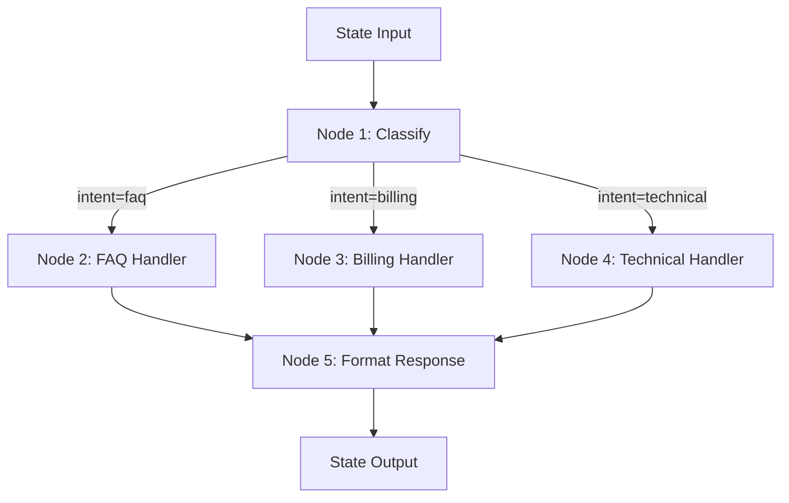
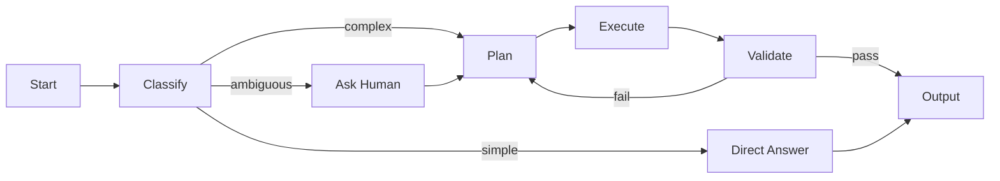

# Chapter 11: Agent Frameworks

> "A framework is not a silver bullet. It is a set of trade-offs encoded in code—choosing one means accepting its constraints while benefiting from its abstractions."

---

## Introduction

Building an agent from scratch—managing state, routing between tools, handling errors, persisting progress—requires solving problems that have already been solved dozens of times. Agent frameworks provide the scaffolding: state management, tool integration, workflow orchestration, observability, and persistence. They save months of development time and prevent entire categories of bugs.

But frameworks are not free. Every framework imposes architectural constraints, adds abstraction layers that complicate debugging, creates vendor dependencies, and requires your team to learn its conventions. The wrong framework choice can create more technical debt than building from scratch. The right framework choice accelerates development and provides production-grade reliability from day one.

The central thesis of this chapter is the **framework-task alignment principle**: the best framework for your project is the one whose abstractions match your task's natural structure. LangGraph excels at stateful graphs with cycles. CrewAI excels at role-based team coordination. PydanticAI excels at type-safe, performance-sensitive applications. There is no universally "best" framework—only the best fit for your specific requirements.

We will dissect the five major agent frameworks (LangGraph, LangChain, CrewAI, AutoGen, and PydanticAI), comparing their architectures, strengths, limitations, and ideal use cases. We will examine orchestration patterns—state machines, graph workflows, durable execution—and when each pattern applies. We will build a decision framework that maps your requirements to the right framework. And we will walk through a full case study: building the same agent in three different frameworks to understand the practical trade-offs.

### Why Framework Choice Matters Less Than You Think

Before diving into framework details, a critical caveat: framework choice matters less than architecture. A well-designed agent in any framework beats a poorly designed agent in the "best" framework. The principles in Chapter 10—bounded loops, human-in-the-loop, cost control, graceful degradation—apply regardless of framework. Frameworks provide convenience, not magic.

That said, frameworks matter for three practical reasons:

1. **Development velocity**: A good framework reduces development time by 40-60% for complex agents.
2. **Production reliability**: Frameworks handle edge cases (crash recovery, retry, persistence) that teams often overlook.
3. **Team adoption**: Frameworks with good documentation and communities reduce onboarding time.

The key is to choose a framework that matches your team's expertise and your task's structure, then invest in understanding it deeply rather than jumping between frameworks.

### Framework Ecosystem Overview

| Framework | Language Support | GitHub Stars | Primary Use Case | Learning Curve |
|-----------|-----------------|-------------|------------------|---------------|
| LangGraph | Python, TypeScript | 5K+ | Stateful graph-based agents | Medium-High |
| LangChain | Python, TypeScript | 95K+ | Integration-heavy prototyping | Medium |
| CrewAI | Python | 25K+ | Role-based multi-agent teams | Low-Medium |
| AutoGen | Python, .NET | 35K+ | Multi-agent conversations, code execution | High |
| PydanticAI | Python | 3K+ | Type-safe, performance-sensitive agents | Low |

---

## 11.1 LangGraph: Stateful Graphs for AI Workflows

### 11.1.1 Architecture and Core Concepts

LangGraph models workflows as directed graphs with explicit state. It is built by the LangChain team and designed specifically for agent workflows that need cycles, conditional routing, and persistent state.

**Core concepts:**

- **State**: A TypedDict or Pydantic model that flows through the graph. State is the single source of truth for all workflow data.
- **Nodes**: Functions that transform state. Each node is a unit of work—LLM call, API call, validation, tool execution.
- **Edges**: Fixed or conditional transitions between nodes. Edges are where routing logic lives.
- **Checkpointing**: State is persisted after every node execution, enabling crash recovery and time-travel debugging.



### 11.1.2 Implementation: Research Agent with Self-Critique

LangGraph's strength is cyclic workflows—patterns where the output of one step feeds back into a previous step. The self-critique loop is the canonical example:

```python
from langgraph.graph import StateGraph, END
from langgraph.checkpoint.sqlite import SqliteSaver
from typing import TypedDict, Literal

class ResearchState(TypedDict):
    query: str
    sources: list[str]
    draft: str
    critique: str
    iteration: int
    final_answer: str

def research(state: ResearchState) -> ResearchState:
    sources = search_api(state["query"])
    state["sources"] = sources
    return state

def draft(state: ResearchState) -> ResearchState:
    state["draft"] = llm.generate(
        f"Answer '{state['query']}' using sources: {state['sources']}"
    )
    state["iteration"] = state.get("iteration", 0) + 1
    return state

def critique(state: ResearchState) -> ResearchState:
    state["critique"] = llm.generate(
        f"Critique this answer for accuracy and completeness:\n"
        f"Question: {state['query']}\n"
        f"Draft: {state['draft']}\n"
        f"Respond with 'LGTM' if acceptable, otherwise list specific issues."
    )
    return state

def revise(state: ResearchState) -> ResearchState:
    state["draft"] = llm.generate(
        f"Revise this answer based on the critique:\n"
        f"Original: {state['draft']}\n"
        f"Critique: {state['critique']}\n"
        f"Provide improved version."
    )
    return state

def should_continue(state: ResearchState) -> str:
    if state["iteration"] >= 3:
        return "finalize"
    if "LGTM" in state["critique"]:
        return "finalize"
    return "revise"

graph = StateGraph(ResearchState)
graph.add_node("research", research)
graph.add_node("draft", draft)
graph.add_node("critique", critique)
graph.add_node("revise", revise)
graph.add_node("finalize", lambda s: {**s, "final_answer": s["draft"]})

graph.set_entry_point("research")
graph.add_edge("research", "draft")
graph.add_edge("draft", "critique")
graph.add_conditional_edges("critique", should_continue, {
    "revise": "revise",
    "finalize": "finalize"
})
graph.add_edge("revise", "draft")
graph.add_edge("finalize", END)

checkpointer = SqliteSaver.from_conn_string(":memory:")
app = graph.compile(checkpointer=checkpointer)
```

### 11.1.3 Human-in-the-Loop with LangGraph

LangGraph's checkpointing enables pausing execution and resuming when human input is received:

```python
from langgraph.graph import StateGraph, END

class ApprovalState(TypedDict):
    document: str
    action: str
    approved: bool
    human_feedback: str

def prepare_action(state: ApprovalState) -> ApprovalState:
    state["action"] = llm.generate(
        f"Based on this document, what action should we take?\n{state['document']}"
    )
    return state

def check_approval(state: ApprovalState) -> str:
    if state.get("approved"):
        return "execute"
    return "wait_for_approval"

graph = StateGraph(ApprovalState)
graph.add_node("prepare", prepare_action)
graph.add_node("execute", execute_action)
graph.add_node("wait", lambda s: s)  # Pauses here

graph.set_entry_point("prepare")
graph.add_edge("prepare", "wait")
graph.add_conditional_edges("wait", check_approval, {
    "execute": "execute",
    "wait_for_approval": "wait"
})
graph.add_edge("execute", END)

app = graph.compile(checkpointer=checkpointer)

# Run until approval needed
config = {"configurable": {"thread_id": "doc-123"}}
result = app.invoke({"document": "...", "approved": False}, config)

# Human reviews and approves
app.invoke({"approved": True, "human_feedback": "Looks good"}, config)
```

### 11.1.4 LangGraph Strengths and Limitations

| Strength | Detail |
|----------|--------|
| Cyclic workflows | Native support for loops, self-critique, iterative refinement |
| Checkpointing | Automatic state persistence after every node |
| Human-in-the-loop | Pause/resume with external input |
| Time-travel debugging | Replay from any checkpoint via LangSmith |
| Conditional routing | Dynamic path selection based on state |
| State management | TypedDict/Pydantic state with type safety |

| Limitation | Detail |
|------------|--------|
| Learning curve | Graph concepts (nodes, edges, state) require upfront investment |
| No built-in durability | Checkpointing is local; no distributed crash recovery |
| In-memory by default | Long-running workflows need external state stores |
| Debugging complexity | Cyclic graphs are harder to debug than linear chains |
| Team adoption | Requires LangChain ecosystem familiarity |

### 11.1.5 When to Use and When to Avoid

| Scenario | Recommendation |
|----------|---------------|
| Cyclic workflows (self-critique, iterative refinement) | **Use LangGraph** |
| Human-in-the-loop approval gates | **Use LangGraph** |
| Prototyping complex orchestration | **Use LangGraph** |
| Teams already using LangChain | **Use LangGraph** |
| Long-running workflows (hours/days) | **Avoid** — use Temporal |
| High-throughput serverless workloads | **Avoid** — use AWS Step Functions |
| Workflows requiring exactly-once guarantees | **Avoid** — use Temporal |

---

## 11.2 LangChain: The Integration Ecosystem

### 11.2.1 Architecture and Core Concepts

LangChain has the broadest ecosystem with 700+ integrations. It provides composable abstractions for LLM calls, prompt management, output parsing, tool use, and retrieval. While LangGraph handles complex orchestration, LangChain excels at the building blocks.

**Core components:**
- **LLM wrappers**: Unified interface for OpenAI, Anthropic, Google, Cohere, and 50+ providers
- **Prompt templates**: Reusable prompt composition with variable substitution
- **Output parsers**: Structured extraction from LLM responses (Pydantic, JSON, CSV)
- **Chains**: Sequential compositions of prompts and LLM calls
- **Retrievers**: Document loading, chunking, embedding, and retrieval
- **Callbacks**: Observability hooks for tracing, logging, and metrics

```python
from langchain_openai import ChatOpenAI
from langchain_core.prompts import ChatPromptTemplate
from langchain_core.output_parsers import StrOutputParser
from langchain_core.runnables import RunnablePassthrough

# Simple chain: prompt → LLM → parser
prompt = ChatPromptTemplate.from_template(
    "Answer this question about {topic}: {question}"
)
llm = ChatOpenAI(model="gpt-4o")
parser = StrOutputParser()

chain = prompt | llm | parser
result = chain.invoke({"topic": "Python", "question": "What is a decorator?"})
```

### 11.2.2 RAG Chain with LangChain

LangChain's integration ecosystem shines in RAG applications:

```python
from langchain_openai import OpenAIEmbeddings, ChatOpenAI
from langchain_community.vectorstores import Chroma
from langchain_core.prompts import ChatPromptTemplate
from langchain_core.output_parsers import StrOutputParser
from langchain_core.runnables import RunnablePassthrough

# Vector store
vectorstore = Chroma.from_documents(documents, OpenAIEmbeddings())
retriever = vectorstore.as_retriever(search_kwargs={"k": 3})

# Prompt
prompt = ChatPromptTemplate.from_template(
    """Answer the question based on the context below.
Context: {context}
Question: {question}
Answer:"""
)

def format_docs(docs):
    return "\n\n".join(doc.page_content for doc in docs)

# RAG chain
rag_chain = (
    {"context": retriever | format_docs, "question": RunnablePassthrough()}
    | prompt
    | ChatOpenAI(model="gpt-4o")
    | StrOutputParser()
)

answer = rag_chain.invoke("What are the key findings?")
```

### 11.2.3 LangChain Strengths and Limitations

| Strength | Detail |
|----------|--------|
| Integration breadth | 700+ connectors for LLMs, databases, APIs, file formats |
| Prompt management | Versioned, testable prompt templates |
| Output parsing | Pydantic, JSON, structured extraction built-in |
| Community | Largest ecosystem, most examples, most tutorials |
| Composability | Chain composition with pipe operator |

| Limitation | Detail |
|------------|--------|
| Abstraction overhead | Multiple layers between you and the LLM |
| Debugging difficulty | Hard to trace through abstraction layers |
| Performance | Overhead from abstraction layers |
| Versioning churn | Frequent breaking changes between versions |
| Agent support | LangGraph is preferred for complex agent workflows |

### 11.2.4 When to Use and When to Avoid

| Scenario | Recommendation |
|----------|---------------|
| Prototyping with many third-party integrations | **Use LangChain** |
| RAG applications with multiple data sources | **Use LangChain** |
| Teams familiar with LangChain ecosystem | **Use LangChain** |
| Simple LLM wrappers and prompt management | **Use LangChain** |
| Complex agent workflows | **Avoid** — use LangGraph |
| Performance-sensitive production systems | **Avoid** — use PydanticAI |
| Teams wanting minimal dependencies | **Avoid** — use lighter alternatives |

---

## 11.3 CrewAI: Role-Based Multi-Agent Teams

### 11.3.1 Architecture and Core Concepts

CrewAI models multi-agent collaboration as a team of specialists working on a project. You define agents with specific roles, assign tasks, and let the crew collaborate. The abstraction is intuitive—think of it as assigning work to team members rather than programming graph edges.

**Core concepts:**
- **Agent**: A specialist with a role, goal, backstory, and tools
- **Task**: A specific assignment with description, expected output, and assigned agent
- **Crew**: A team of agents working on a sequence or hierarchy of tasks
- **Process**: How tasks are executed—sequential (one after another) or hierarchical (supervisor assigns)

```python
from crewai import Agent, Task, Crew, Process

researcher = Agent(
    role="Senior Research Analyst",
    goal="Conduct thorough research on the given topic",
    backstory="You are an experienced analyst with 10 years in market research.",
    tools=[search_tool, web_scraper],
    verbose=True,
    llm="gpt-4o"
)

writer = Agent(
    role="Technical Writer",
    goal="Write clear, concise, and engaging content",
    backstory="You are a skilled writer who makes complex topics accessible.",
    tools=[file_writer],
    verbose=True,
    llm="gpt-4o"
)

research_task = Task(
    description="Research the current state of AI agent frameworks in 2025",
    expected_output="A comprehensive report with market data and comparisons",
    agent=researcher
)

writing_task = Task(
    description="Write a blog post based on the research findings",
    expected_output="A 2000-word blog post with clear sections and examples",
    agent=writer,
    context=[research_task]  # Uses output from research_task
)

crew = Crew(
    agents=[researcher, writer],
    tasks=[research_task, writing_task],
    process=Process.sequential,
    verbose=True
)

result = crew.kickoff()
```

### 11.3.2 Hierarchical Process

CrewAI's hierarchical process uses a manager agent to dynamically assign tasks:

```python
manager = Agent(
    role="Project Manager",
    goal="Coordinate the team to produce the best possible output",
    backstory="You are an experienced PM who knows how to leverage team strengths.",
    allow_delegation=True
)

crew = Crew(
    agents=[manager, researcher, writer],
    tasks=[research_task, writing_task],
    process=Process.hierarchical,
    manager_llm="gpt-4o",
    verbose=True
)
```

### 11.3.3 CrewAI Strengths and Limitations

| Strength | Detail |
|----------|--------|
| Intuitive API | Role-based agent definition feels natural |
| Quick setup | Minimal boilerplate for multi-agent teams |
| Built-in delegation | Hierarchical process handles task routing |
| Memory support | Short-term and long-term memory for agents |
| Human input | Built-in human feedback between tasks |

| Limitation | Detail |
|------------|--------|
| Limited state management | No fine-grained control over state flow |
| Conditional routing | Harder to implement than LangGraph |
| Debugging | Less visibility into agent decision-making |
| Complex workflows | Struggles with cyclic or highly branching logic |
| Production reliability | Less battle-tested than LangGraph or Temporal |

### 11.3.4 When to Use and When to Avoid

| Scenario | Recommendation |
|----------|---------------|
| Content creation pipelines | **Use CrewAI** |
| Research workflows with multiple specialists | **Use CrewAI** |
| Quick prototyping of multi-agent ideas | **Use CrewAI** |
| Teams wanting intuitive agent roles | **Use CrewAI** |
| Complex state management needs | **Avoid** — use LangGraph |
| Production systems requiring crash recovery | **Avoid** — use Temporal |
| Workflows with many conditional branches | **Avoid** — use LangGraph |

---

## 11.4 AutoGen: Multi-Agent Conversations

### 11.4.1 Architecture and Core Concepts

Microsoft's AutoGen models agent interaction as conversations. Multiple agents chat with each other, with a human or another agent acting as a group chat manager. AutoGen's strength is code execution—agents can write and run code in a sandboxed environment.

**Core concepts:**
- **ConversableAgent**: An agent that can send messages and receive responses
- **AssistantAgent**: LLM-powered agent that generates responses
- **UserProxyAgent**: Human-proxied agent that can execute code and request human input
- **GroupChat**: Multi-agent conversation with a manager directing turns

```python
from autogen import AssistantAgent, UserProxyAgent, GroupChat, GroupChatManager

assistant = AssistantAgent(
    name="researcher",
    system_message="You are a research specialist. Analyze data and provide insights.",
    llm_config={"model": "gpt-4o"}
)

coder = AssistantAgent(
    name="coder",
    system_message="You write Python code to analyze data. Always include error handling.",
    llm_config={"model": "gpt-4o"}
)

user_proxy = UserProxyAgent(
    name="user",
    human_input_mode="TERMINATE",
    code_execution_config={"work_dir": "workspace"}
)

groupchat = GroupChat(
    agents=[user_proxy, assistant, coder],
    messages=[],
    max_round=10
)

manager = GroupChatManager(groupchat=groupchat)

user_proxy.initiate_chat(
    manager,
    message="Analyze the sales data in sales.csv and create a visualization"
)
```

### 11.4.2 AutoGen Strengths and Limitations

| Strength | Detail |
|----------|--------|
| Code execution | Built-in sandboxed code execution |
| Multi-agent conversations | Natural group chat patterns |
| Human-in-the-loop | Flexible human input modes |
| Microsoft backing | Active development and enterprise support |
| .NET support | Cross-language agent development |

| Limitation | Detail |
|------------|--------|
| Steep learning curve | Complex API with many concepts |
| Smaller ecosystem | Fewer integrations than LangChain |
| Conversation-based | Limited to message-passing patterns |
| State management | Less explicit than LangGraph |
| Production readiness | Still maturing for production use |

### 11.4.3 When to Use and When to Avoid

| Scenario | Recommendation |
|----------|---------------|
| Code generation with execution | **Use AutoGen** |
| Multi-agent conversation patterns | **Use AutoGen** |
| Data analysis with code execution | **Use AutoGen** |
| .NET shops with Python teams | **Use AutoGen** |
| Simple tool-using agents | **Avoid** — use simpler frameworks |
| Complex stateful workflows | **Avoid** — use LangGraph |
| Teams wanting minimal complexity | **Avoid** — use CrewAI |

---

## 11.5 PydanticAI: Type-Safe Agent Development

### 11.5.1 Architecture and Core Concepts

PydanticAI is built on top of Pydantic and provides type-safe agent development with minimal overhead. It is designed for applications where type safety, performance, and simplicity matter more than complex orchestration.

**Core concepts:**
- **Agent**: A typed agent with input/output schemas defined via Pydantic
- **Tool**: Functions that the agent can call, with type-safe parameters
- **Structured output**: Agents return typed Pydantic models, not raw text
- **Dependencies**: Injected dependencies with type safety

```python
from pydantic_ai import Agent
from pydantic import BaseModel

class FinancialAnalysis(BaseModel):
    ticker: str
    recommendation: str
    confidence: float
    reasoning: str

agent = Agent(
    "gpt-4o",
    system_prompt="You are a financial analyst. Provide structured analysis.",
    result_type=FinancialAnalysis
)

@agent.tool
def get_stock_price(ticker: str) -> float:
    """Get current stock price from market API."""
    return market_api.get_price(ticker)

result = agent.run_sync("Analyze AAPL stock")
print(result.data.ticker)        # Type-safe access
print(result.data.confidence)    # No string parsing needed
```

### 11.5.2 PydanticAI Agent with Dependencies

```python
from pydantic_ai import Agent
from pydantic import BaseModel
from dataclasses import dataclass

@dataclass
class AnalysisContext:
    market_data: MarketDataService
    news_service: NewsService

class AnalysisOutput(BaseModel):
    summary: str
    risk_level: str
    key_factors: list[str]

agent = Agent(
    "gpt-4o",
    system_prompt="Analyze the stock and provide a structured assessment.",
    result_type=AnalysisOutput,
    deps_type=AnalysisContext
)

@agent.tool
def get_market_data(ctx: AnalysisContext, ticker: str) -> dict:
    """Get current market data for analysis."""
    return ctx.market_data.get_quote(ticker)

@agent.tool
def get_recent_news(ctx: AnalysisContext, ticker: str) -> list[str]:
    """Get recent news articles about the company."""
    return ctx.news_service.get_headlines(ticker, limit=5)

context = AnalysisContext(
    market_data=MarketDataService(),
    news_service=NewsService()
)
result = agent.run_sync("Analyze MSFT", deps=context)
```

### 11.5.3 PydanticAI Strengths and Limitations

| Strength | Detail |
|----------|--------|
| Type safety | Pydantic models guarantee output structure |
| Minimal overhead | Thin abstraction over LLM APIs |
| Performance | No unnecessary abstraction layers |
| Testing | Easy to test with Pydantic model assertions |
| Simple API | Agents defined in a few lines |

| Limitation | Detail |
|------------|--------|
| Smaller ecosystem | Fewer integrations than LangChain |
| Limited multi-agent | No built-in multi-agent coordination |
| No graph workflows | Linear agent execution only |
| Community | Smaller community than LangChain/LangGraph |
| Python only | No TypeScript support |

### 11.5.4 When to Use and When to Avoid

| Scenario | Recommendation |
|----------|---------------|
| Type-sensitive applications | **Use PydanticAI** |
| Performance-critical agents | **Use PydanticAI** |
| Simple tool-using agents | **Use PydanticAI** |
| Teams wanting minimal dependencies | **Use PydanticAI** |
| Complex multi-agent workflows | **Avoid** — use LangGraph or CrewAI |
| Applications needing many integrations | **Avoid** — use LangChain |
| Cyclic workflows with self-critique | **Avoid** — use LangGraph |

---

## 11.6 Orchestration Patterns

### 11.6.1 State Machines

Explicit state management for agent workflows. The agent transitions between defined states with enforced valid transitions:

```python
from enum import Enum

class AgentState(str, Enum):
    IDLE = "idle"
    PLANNING = "planning"
    EXECUTING = "executing"
    OBSERVING = "observing"
    WAITING_FOR_HUMAN = "waiting_for_human"
    COMPLETE = "complete"
    FAILED = "failed"

VALID_TRANSITIONS = {
    AgentState.IDLE: [AgentState.PLANNING],
    AgentState.PLANNING: [AgentState.EXECUTING, AgentState.WAITING_FOR_HUMAN],
    AgentState.EXECUTING: [AgentState.OBSERVING, AgentState.FAILED],
    AgentState.OBSERVING: [AgentState.PLANNING, AgentState.COMPLETE, AgentState.FAILED],
    AgentState.WAITING_FOR_HUMAN: [AgentState.PLANNING, AgentState.FAILED],
    AgentState.COMPLETE: [AgentState.IDLE],
    AgentState.FAILED: [AgentState.IDLE],
}

class StateMachineAgent:
    def __init__(self):
        self.state = AgentState.IDLE

    def transition(self, new_state: AgentState) -> bool:
        if new_state in VALID_TRANSITIONS.get(self.state, []):
            self.state = new_state
            return True
        raise ValueError(f"Invalid transition: {self.state} → {new_state}")
```

### 11.6.2 Graph Workflows

LangGraph-style directed graphs with nodes and edges:



### 11.6.3 Durable Execution

For long-running tasks, durable execution frameworks provide checkpointing and recovery:

```python
# Temporal-style durable execution pattern
@workflow.defn
class DurableAgentWorkflow:
    @workflow.run
    async def run(self, task: str) -> str:
        # Each step is checkpointed automatically
        plan = await workflow.execute_activity(
            plan_task, task, start_to_close_timeout=timedelta(seconds=30)
        )

        results = []
        for step in plan["steps"]:
            result = await workflow.execute_activity(
                execute_step, step, start_to_close_timeout=timedelta(minutes=5)
            )
            results.append(result)

        return await workflow.execute_activity(
            synthesize, results, start_to_close_timeout=timedelta(seconds=30)
        )
```

---

## 11.7 Framework Comparison Matrix

| Criterion | LangGraph | LangChain | CrewAI | AutoGen | PydanticAI |
|-----------|-----------|-----------|--------|---------|------------|
| **Primary pattern** | Graph workflows | Integration chains | Role-based teams | Conversations | Typed agents |
| **Cyclic workflows** | Native | Limited | Limited | Native | No |
| **Human-in-the-loop** | Native | Via callbacks | Built-in | Flexible | Manual |
| **Crash recovery** | Checkpointing | No | No | No | No |
| **Multi-agent** | Via subgraphs | Via chains | Native | Native | Manual |
| **Type safety** | TypedDict | Low | Low | Low | Pydantic |
| **Learning curve** | Medium-High | Medium | Low-Medium | High | Low |
| **Ecosystem** | LangChain | 700+ integrations | Growing | Microsoft | Pydantic |
| **Production readiness** | High | High | Medium | Medium | High |
| **Debugging** | LangSmith | LangSmith | Limited | Limited | Standard Python |
| **Cost** | Free (self-hosted) | Free (self-hosted) | Free (self-hosted) | Free (self-hosted) | Free (self-hosted) |
| **TypeScript** | Yes | Yes | No | No | No |
| **Best for** | Complex stateful agents | Integration-heavy apps | Content teams | Code generation | Type-sensitive apps |

### Decision Framework

Follow this decision tree to select a framework:

1. **Do you need cyclic workflows (self-critique, iterative refinement)?**
   - Yes → **LangGraph** (native support)
   - No → continue

2. **Do you need multi-agent coordination?**
   - Yes, with role-based delegation → **CrewAI**
   - Yes, with code execution → **AutoGen**
   - Yes, with complex state → **LangGraph** (subgraphs)
   - No → continue

3. **Do you need type safety and performance?**
   - Yes → **PydanticAI**
   - No → continue

4. **Do you need many third-party integrations?**
   - Yes → **LangChain**
   - No → **LangGraph** (simplest graph workflow)

5. **Still unsure?**
   - Start with **LangGraph**. It covers the widest range of patterns and can be simplified for simple use cases.

---

## 11.8 Case Study: Building the Same Agent in Three Frameworks

### 11.8.1 Problem

Build a research agent that searches the web, reads documents, synthesizes findings, and produces a report. The agent must handle search failures, validate sources, and produce structured output.

### 11.8.2 LangGraph Implementation

```python
from langgraph.graph import StateGraph, END
from typing import TypedDict

class ResearchState(TypedDict):
    query: str
    search_results: list[dict]
    documents: list[str]
    synthesis: str
    report: str
    errors: list[str]

def search(state: ResearchState) -> ResearchState:
    try:
        results = web_search(state["query"])
        state["search_results"] = results
    except SearchError as e:
        state["errors"].append(f"Search failed: {e}")
        state["search_results"] = []
    return state

def read_documents(state: ResearchState) -> ResearchState:
    docs = []
    for result in state["search_results"][:5]:
        try:
            doc = fetch_document(result["url"])
            docs.append(doc)
        except Exception as e:
            state["errors"].append(f"Failed to read {result['url']}: {e}")
    state["documents"] = docs
    return state

def synthesize(state: ResearchState) -> ResearchState:
    state["synthesis"] = llm.generate(
        f"Synthesize these documents about '{state['query']}':\n"
        + "\n---\n".join(state["documents"][:3])
    )
    return state

def generate_report(state: ResearchState) -> ResearchState:
    state["report"] = llm.generate(
        f"Write a structured report based on this synthesis:\n{state['synthesis']}"
    )
    return state

graph = StateGraph(ResearchState)
graph.add_node("search", search)
graph.add_node("read", read_documents)
graph.add_node("synthesize", synthesize)
graph.add_node("report", generate_report)

graph.set_entry_point("search")
graph.add_edge("search", "read")
graph.add_edge("read", "synthesize")
graph.add_edge("synthesize", "report")
graph.add_edge("report", END)

app = graph.compile()
```

### 11.8.3 CrewAI Implementation

```python
from crewai import Agent, Task, Crew, Process

researcher = Agent(
    role="Research Analyst",
    goal="Find and analyze relevant information",
    backstory="Expert researcher with strong analytical skills.",
    tools=[search_tool, web_reader],
    llm="gpt-4o"
)

analyst = Agent(
    role="Senior Analyst",
    goal="Synthesize findings into coherent insights",
    backstory="Experienced analyst who identifies key themes.",
    llm="gpt-4o"
)

writer = Agent(
    role="Report Writer",
    goal="Write clear, well-structured reports",
    backstory="Skilled writer who communicates complex ideas clearly.",
    llm="gpt-4o"
)

search_task = Task(
    description="Search for information about: {topic}",
    expected_output="List of relevant sources with key findings",
    agent=researcher
)

analysis_task = Task(
    description="Analyze the research findings and identify key themes",
    expected_output="Structured analysis with key insights",
    agent=analyst,
    context=[search_task]
)

report_task = Task(
    description="Write a comprehensive report based on the analysis",
    expected_output="Structured report with executive summary",
    agent=writer,
    context=[analysis_task]
)

crew = Crew(
    agents=[researcher, analyst, writer],
    tasks=[search_task, analysis_task, report_task],
    process=Process.sequential
)

result = crew.kickoff(inputs={"topic": "AI agent frameworks 2025"})
```

### 11.8.4 PydanticAI Implementation

```python
from pydantic_ai import Agent
from pydantic import BaseModel

class ResearchReport(BaseModel):
    topic: str
    executive_summary: str
    key_findings: list[str]
    analysis: str
    recommendations: list[str]
    sources: list[str]

agent = Agent(
    "gpt-4o",
    system_prompt="You are a research analyst. Search, analyze, and report.",
    result_type=ResearchReport
)

@agent.tool
def search_web(query: str) -> list[dict]:
    """Search the web for relevant information."""
    return web_search(query)

@agent.tool
def read_url(url: str) -> str:
    """Read the content of a web page."""
    return fetch_page_content(url)

result = agent.run_sync("Research AI agent frameworks in 2025")
print(result.data.executive_summary)
print(result.data.key_findings)
```

### 11.8.5 Framework Comparison for This Task

| Aspect | LangGraph | CrewAI | PydanticAI |
|--------|-----------|--------|------------|
| Lines of code | 65 | 45 | 30 |
| Setup complexity | Medium | Low | Very low |
| Error handling | Explicit (try/except in nodes) | Implicit (agent handles) | Manual |
| State visibility | Full (typed state dict) | Limited (task outputs) | Full (Pydantic model) |
| Debugging | LangSmith integration | Limited | Standard Python debugger |
| Output type safety | TypedDict | String | Pydantic model |
| Extensibility | High (graph modifications) | Medium (add agents/tasks) | Medium (add tools) |
| Production readiness | High | Medium | High |

---

## 11.9 Migration Between Frameworks

### 11.9.1 When to Migrate

| Signal | Action |
|--------|--------|
| LangChain chains becoming complex | Migrate to LangGraph |
| CrewAI agents need better state management | Migrate to LangGraph |
| AutoGen conversations need durability | Migrate to Temporal |
| PydanticAI needs multi-agent | Add LangGraph or CrewAI layer |
| Any framework needs crash recovery | Add Temporal or Durable Functions |

### 11.9.2 Migration Pattern: LangChain to LangGraph

```python
# Before: LangChain chain
from langchain.chains import LLMChain
from langchain.prompts import PromptTemplate

prompt = PromptTemplate.from_template("Analyze: {input}")
chain = LLMChain(llm=llm, prompt=prompt)
result = chain.run(input="market trends")

# After: LangGraph node
from langgraph.graph import StateGraph

class AnalysisState(TypedDict):
    input: str
    analysis: str
    confidence: float

def analyze(state: AnalysisState) -> AnalysisState:
    state["analysis"] = llm.generate(f"Analyze: {state['input']}")
    state["confidence"] = 0.85
    return state

graph = StateGraph(AnalysisState)
graph.add_node("analyze", analyze)
graph.set_entry_point("analyze")
graph.add_edge("analyze", END)
app = graph.compile()

result = app.invoke({"input": "market trends", "analysis": "", "confidence": 0.0})
```

---

## 11.10 Testing Frameworks

### 11.10.1 Unit Testing Agent Components

```python
import pytest
from unittest.mock import Mock, patch

def test_langgraph_node():
    state = {"query": "test", "results": [], "errors": []}
    result = search(state)
    assert "results" in result
    assert isinstance(result["results"], list)

def test_crewai_task():
    agent = Mock()
    agent.role = "researcher"
    task = Task(description="Research X", expected_output="Findings", agent=agent)
    assert task.agent == agent

def test_pydanticai_output():
    from pydantic import ValidationError
    with pytest.raises(ValidationError):
        ResearchReport(
            topic="test",
            executive_summary="",
            key_findings=[],
            analysis="",
            recommendations=[],
            sources=[]
        )
```

### 11.10.2 Integration Testing

```python
def test_full_agent_workflow():
    app = build_research_agent()
    result = app.invoke({
        "query": "AI agents 2025",
        "search_results": [],
        "documents": [],
        "synthesis": "",
        "report": "",
        "errors": []
    })
    assert result["report"] != ""
    assert len(result["errors"]) == 0

def test_agent_error_handling():
    app = build_research_agent()
    with patch('web_search', side_effect=SearchError("API down")):
        result = app.invoke({
            "query": "test",
            "search_results": [],
            "documents": [],
            "synthesis": "",
            "report": "",
            "errors": []
        })
        assert len(result["errors"]) > 0
```

---

## 11.11 Key Takeaways

1. **LangGraph is the best choice for complex, stateful agents in production.** Its graph-based architecture provides explicit control over state flow, conditional routing, and checkpointing. The learning curve is steep, but the investment pays off for production systems that need reliability and observability.

2. **CrewAI is best for role-based multi-agent workflows—intuitive but less flexible.** The role-based API makes multi-agent coordination accessible to teams without deep systems knowledge. But complex state management, conditional routing, and production reliability patterns are harder to implement than in LangGraph.

3. **PydanticAI is best for type-sensitive, performance-critical applications.** The thin abstraction and Pydantic integration provide type safety and performance that other frameworks cannot match. But it lacks built-in multi-agent coordination and complex workflow patterns.

4. **LangChain remains valuable for its integration ecosystem.** With 700+ connectors, LangChain is the fastest way to prototype applications that need many third-party connections. But for agent workflows specifically, LangGraph is the better choice.

5. **AutoGen excels at code generation with execution.** If your primary use case involves writing and executing code in a multi-agent setting, AutoGen's sandboxed execution environment is unmatched. But the learning curve is steep and the ecosystem is smaller.

6. **Framework choice matters less than architecture.** A well-designed agent in any framework beats a poorly designed agent in the "best" framework. Focus on the principles—bounded loops, human-in-the-loop, cost control, graceful degradation—before worrying about framework specifics.

7. **Start simple, add complexity only when needed.** A simple ReAct loop often suffices. Add planning only when tasks require explicit decomposition. Add reflection only when quality needs iterative improvement. Add multi-agent only when coordination is genuinely required.

8. **Production readiness varies significantly between frameworks.** LangGraph and PydanticAI have the strongest production track records. CrewAI and AutoGen are maturing but less battle-tested. Evaluate based on your specific reliability requirements.

9. **No framework provides everything.** LangGraph handles orchestration but not durability. CrewAI handles coordination but not complex state. PydanticAI handles type safety but not multi-agent. Combine frameworks when needed, and don't expect one tool to solve all problems.

10. **Test your agents regardless of framework.** Unit test deterministic components, integration test the full pipeline, and evaluate probabilistic components with golden datasets. Framework choice does not eliminate the need for thorough testing.

---

## 11.12 Further Reading

- **LangGraph Documentation** (langchain-ai.github.io/langgraph) — Official documentation with tutorials on state machines, human-in-the-loop, and persistence. Start with the Quick Start guide.

- **LangChain Documentation** (python.langchain.com) — Comprehensive guides for all LangChain components, including chains, prompts, output parsers, and integrations.

- **CrewAI Documentation** (docs.crewai.com) — Official documentation covering agent roles, task delegation, crew processes, and memory management.

- **AutoGen Documentation** (microsoft.github.io/autogen) — Microsoft's framework documentation covering multi-agent conversations, code execution, and group chat patterns.

- **PydanticAI Documentation** (ai.pydantic.dev) — Official documentation covering typed agents, tool definitions, dependencies, and structured output.

- **"Building Effective Agents" by Anthropic (2024)** — Practical guide to building production agents, covering framework selection, tool use patterns, and error handling.

- **"The Architecture of Open Source Applications" (aosabook.org)** — Case studies on workflow engine internals, including patterns applicable to agent frameworks.

- **"Designing Data-Intensive Applications" by Martin Kleppmann** — Chapters on distributed systems provide the foundation for understanding framework guarantees around state, consistency, and fault tolerance.

- **OpenTelemetry Documentation** (opentelemetry.io) — Tracing standard for observability, applicable to monitoring agent workflows across frameworks.

- **"Microservices Patterns" by Chris Richardson** — Chapter 9 (Distributed data management patterns) covers patterns relevant to agent state management and coordination.

- **Temporal Documentation** (docs.temporal.io) — For teams considering durable execution as a complement or alternative to LangGraph for long-running agent workflows.
