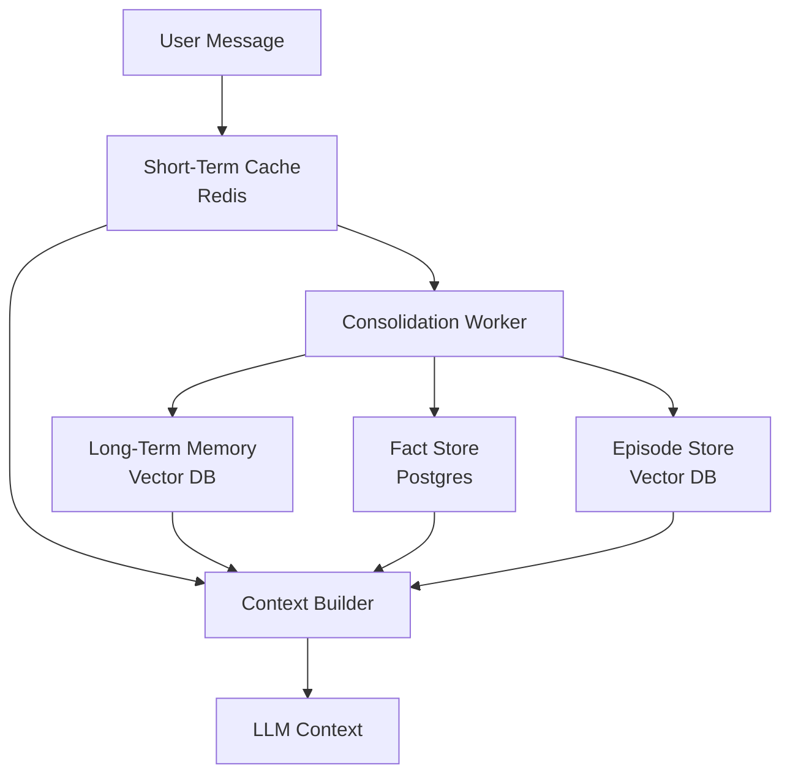
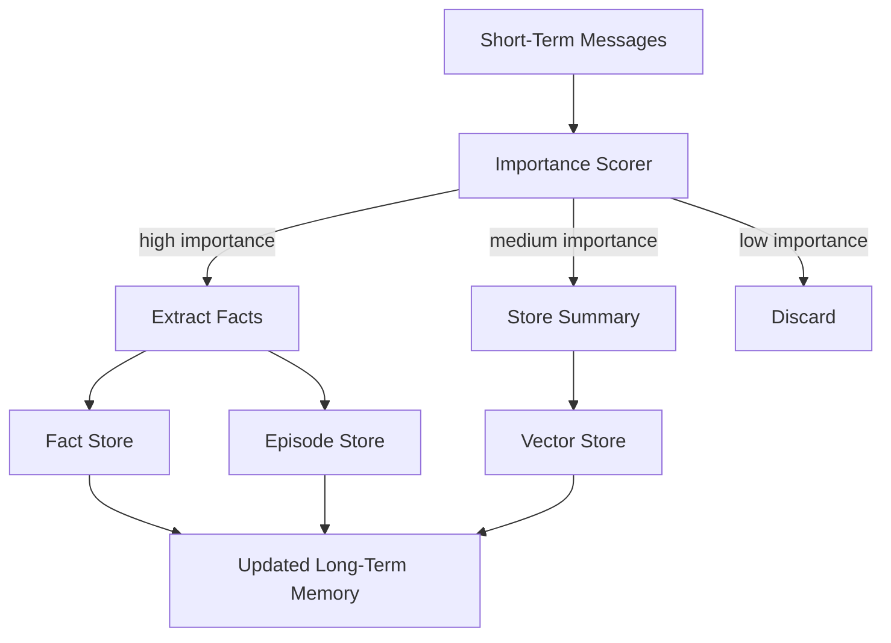
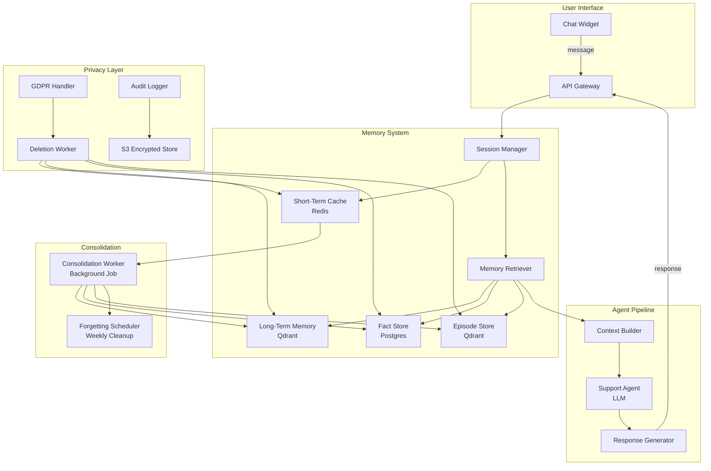

# Chapter 12: Memory Systems

> "Memory is not a database. It is the capacity of a system to learn from its past, adapt to its present, and anticipate its future—without forgetting who it is."

---

## Introduction

Without memory, every LLM interaction starts from scratch. The model has no recollection of previous conversations, no understanding of user preferences, no awareness of past decisions. This is acceptable for stateless Q&A but unacceptable for applications that need continuity—personalized assistants that remember user preferences, customer support systems that recall past issues, research agents that build on previous findings, and collaborative tools that track shared context.

Memory systems bridge this gap. They give applications the ability to store, retrieve, and manage information across sessions, creating the continuity that transforms a stateless API into an intelligent assistant. But memory is not a single thing—it is a layered architecture with different storage backends, retrieval strategies, consolidation mechanisms, and privacy constraints.

The central thesis of this chapter is the **memory-relevance trade-off**: storing more memories gives the system richer context, but retrieving the right memories becomes harder. The engineering challenge is building a memory system that stores enough to be useful, retrieves accurately enough to be relevant, and manages privacy constraints well enough to be compliant.

We will examine the four types of memory (short-term, long-term, episodic, semantic) and their storage architectures. We will build a complete memory system with tiered storage, consolidation pipelines, and retrieval strategies. We will explore memory retrieval as a RAG problem—finding relevant past interactions from thousands of stored entries. We will walk through a full case study: a personalized customer support system with memory that improved resolution rates from 72% to 89%. And we will cover the hard-won lessons of production memory systems—privacy compliance, forgetting mechanisms, and the engineering patterns that prevent memory systems from becoming liabilities.

### The Memory Spectrum

Memory systems exist on a spectrum from simple to complex:

| Complexity | Storage | Retrieval | Use Case | Cost |
|------------|---------|-----------|----------|------|
| **None** | No persistence | No retrieval | Stateless Q&A | $0 |
| **Session cache** | Redis (TTL) | Recency-based | Chat within session | Low |
| **Vector memory** | Vector DB | Semantic search | Cross-session recall | Medium |
| **Tiered memory** | Redis + Vector + Postgres | Multi-source retrieval | Production assistants | High |
| **Graph memory** | Neo4j / knowledge graph | Relationship traversal | Enterprise knowledge | Very high |

Most production applications should start with session caching and add vector memory when cross-session recall is needed. Graph memory is justified only for enterprise knowledge systems with complex relationship requirements.

---

## 12.1 Memory Types

### 12.1.1 Short-Term Memory

Short-term memory holds recent conversation context within a session. It is fast (sub-millisecond), ephemeral (expires after inactivity), and bounded (limited by token budget).

**Storage**: Redis with TTL (time-to-live) expiration.

**Challenge**: Trimming. The context window has a fixed token budget (4K-128K tokens). As conversations grow, older messages must be trimmed while preserving the most relevant context.

```python
import redis
import json
from datetime import datetime, timedelta

class ShortTermMemory:
    def __init__(self, redis_url: str = "redis://localhost:6379",
                 ttl_seconds: int = 3600, max_messages: int = 50):
        self.redis = redis.from_url(redis_url)
        self.ttl = ttl_seconds
        self.max_messages = max_messages

    def store(self, session_id: str, role: str, content: str, metadata: dict = None):
        key = f"session:{session_id}:messages"
        message = {
            "role": role,
            "content": content,
            "timestamp": datetime.utcnow().isoformat(),
            "metadata": metadata or {}
        }
        self.redis.rpush(key, json.dumps(message))
        self.redis.expire(key, self.ttl)

        # Trim to max messages
        length = self.redis.llen(key)
        if length > self.max_messages:
            self.redis.ltrim(key, length - self.max_messages, -1)

    def get_recent(self, session_id: str, n: int = 10) -> list[dict]:
        key = f"session:{session_id}:messages"
        messages = self.redis.lrange(key, -n, -1)
        return [json.loads(m) for m in messages]

    def get_token_count(self, session_id: str) -> int:
        messages = self.get_recent(session_id, n=self.max_messages)
        return sum(self._estimate_tokens(m["content"]) for m in messages)

    def _estimate_tokens(self, text: str) -> int:
        return len(text.split()) * 1.3  # Rough estimate
```

**Trimming strategies:**

| Strategy | Description | When to Use |
|----------|-------------|-------------|
| **Recency** | Keep last N messages | Simple conversations |
| **Importance** | Score and keep highest importance | Long conversations |
| **Hybrid** | Recency + importance with decay | Production systems |
| **Sliding window** | Fixed token budget, drop oldest | Token-constrained |

### 12.1.2 Long-Term Memory

Long-term memory holds persistent knowledge across sessions. It is slower (vector database, 10-100ms), permanent (until explicitly deleted), and searchable (semantic retrieval).

**Storage**: Vector database (Pinecone, Qdrant, pgvector, or Weaviate).

**Challenge**: Relevance. Given a current query, finding the right memories from thousands of stored entries.

```python
from qdrant_client import QdrantClient
from qdrant_client.models import VectorParams, Distance, PointStruct
from sentence_transformers import SentenceTransformer
import uuid

class LongTermMemory:
    def __init__(self, collection_name: str = "agent_memory"):
        self.client = QdrantClient("localhost", port=6333)
        self.encoder = SentenceTransformer("all-MiniLM-L6-v2")
        self.collection = collection_name
        self._ensure_collection()

    def _ensure_collection(self):
        collections = self.client.get_collections().collections
        if not any(c.name == self.collection for c in collections):
            self.client.create_collection(
                collection_name=self.collection,
                vectors_config=VectorParams(
                    size=384,  # MiniLM embedding size
                    distance=Distance.COSINE
                )
            )

    def store(self, user_id: str, content: str, memory_type: str = "interaction",
              importance: float = 0.5, metadata: dict = None):
        embedding = self.encoder.encode(content).tolist()
        point = PointStruct(
            id=str(uuid.uuid4()),
            vector=embedding,
            payload={
                "user_id": user_id,
                "content": content,
                "memory_type": memory_type,
                "importance": importance,
                "timestamp": datetime.utcnow().isoformat(),
                "metadata": metadata or {}
            }
        )
        self.client.upsert(collection_name=self.collection, points=[point])

    def retrieve(self, user_id: str, query: str, top_k: int = 5,
                 memory_type: str = None) -> list[dict]:
        query_embedding = self.encoder.encode(query).tolist()

        filter_conditions = [{"key": "user_id", "match": {"value": user_id}}]
        if memory_type:
            filter_conditions.append({"key": "memory_type", "match": {"value": memory_type}})

        results = self.client.search(
            collection_name=self.collection,
            query_vector=query_embedding,
            limit=top_k,
            query_filter={"must": filter_conditions} if filter_conditions else None
        )
        return [
            {
                "content": hit.payload["content"],
                "score": hit.score,
                "importance": hit.payload.get("importance", 0.5),
                "timestamp": hit.payload.get("timestamp"),
                "metadata": hit.payload.get("metadata", {})
            }
            for hit in results
        ]
```

### 12.1.3 Episodic Memory

Episodic memory stores specific past events and interactions. Unlike general long-term memory, episodic memory preserves the full context of what happened—the user's situation, what was tried, and what worked. This enables the system to recall "last time this user had this issue, we solved it by..."

```python
class EpisodicMemory:
    def __init__(self, vector_store: LongTermMemory):
        self.vector_store = vector_store

    def store_episode(self, user_id: str, situation: str, action_taken: str,
                      outcome: str, satisfaction: float):
        episode = {
            "situation": situation,
            "action": action_taken,
            "outcome": outcome,
            "satisfaction": satisfaction,
            "timestamp": datetime.utcnow().isoformat()
        }
        content = f"Situation: {situation}\nAction: {action_taken}\nOutcome: {outcome}"
        importance = self._calculate_importance(action_taken, outcome, satisfaction)

        self.vector_store.store(
            user_id=user_id,
            content=content,
            memory_type="episodic",
            importance=importance,
            metadata=episode
        )

    def recall_similar(self, user_id: str, current_situation: str,
                       top_k: int = 3) -> list[dict]:
        episodes = self.vector_store.retrieve(
            user_id=user_id,
            query=current_situation,
            top_k=top_k,
            memory_type="episodic"
        )
        return episodes

    def _calculate_importance(self, action: str, outcome: str,
                              satisfaction: float) -> float:
        importance = satisfaction * 0.6
        if "resolved" in outcome.lower() or "success" in outcome.lower():
            importance += 0.3
        if "escalated" in outcome.lower() or "failed" in outcome.lower():
            importance += 0.2  # Learn from failures too
        return min(importance, 1.0)
```

### 12.1.4 Semantic Memory

Semantic memory stores general knowledge and facts about the user or domain. Preferences, relationships, patterns—the distilled understanding that accumulates over time.

```python
class SemanticMemory:
    def __init__(self, db_connection):
        self.db = db_connection

    def store_fact(self, user_id: str, fact_type: str, fact: str,
                   confidence: float = 0.8):
        self.db.execute("""
            INSERT INTO user_facts (user_id, fact_type, fact, confidence, updated_at)
            VALUES (%s, %s, %s, %s, NOW())
            ON CONFLICT (user_id, fact_type) 
            DO UPDATE SET fact = EXCLUDED.fact, 
                         confidence = EXCLUDED.confidence,
                         updated_at = NOW()
        """, (user_id, fact_type, fact, confidence))

    def get_facts(self, user_id: str, fact_type: str = None) -> list[dict]:
        if fact_type:
            return self.db.execute(
                "SELECT fact_type, fact, confidence FROM user_facts WHERE user_id = %s AND fact_type = %s",
                (user_id, fact_type)
            ).fetchall()
        return self.db.execute(
            "SELECT fact_type, fact, confidence FROM user_facts WHERE user_id = %s",
            (user_id,)
        ).fetchall()

    def extract_facts_from_conversation(self, user_id: str, messages: list[dict]):
        conversation = "\n".join(f"{m['role']}: {m['content']}" for m in messages)

        extraction_prompt = f"""Extract user facts from this conversation:
{conversation}

Return JSON with facts as:
{{"facts": [{{"type": "preference|fact|pattern", "content": "...", "confidence": 0.0-1.0}}]}}
"""
        result = llm.generate(extraction_prompt, response_format="json")
        for fact in result["facts"]:
            self.store_fact(user_id, fact["type"], fact["content"], fact["confidence"])
```

### 12.1.5 Memory Types Comparison

| Type | Latency | Persistence | Retrieval | Use Case |
|------|---------|-------------|-----------|----------|
| Short-term | <1ms | Session (TTL) | Recency | Conversation context |
| Long-term | 10-100ms | Permanent | Semantic search | Cross-session recall |
| Episodic | 10-100ms | Permanent | Semantic search | Past experiences |
| Semantic | 1-10ms | Permanent | Structured query | User facts/preferences |

---

## 12.2 Storage Architecture

### 12.2.1 Tiered Storage Pattern

Production memory systems use tiered storage—fast cache for recent context, vector database for semantic retrieval, relational database for structured metadata.



```python
class TieredMemorySystem:
    def __init__(self):
        self.short_term = ShortTermMemory(redis_url="redis://localhost:6379")
        self.long_term = LongTermMemory(collection_name="long_term_memory")
        self.episodic = EpisodicMemory(self.long_term)
        self.semantic = SemanticMemory(db_connection=get_db())

    def add_message(self, session_id: str, user_id: str, role: str, content: str):
        # Always store in short-term
        self.short_term.store(session_id, role, content)

        # Trigger consolidation periodically
        messages = self.short_term.get_recent(session_id, n=20)
        if len(messages) % 10 == 0:  # Consolidate every 10 messages
            self._consolidate(user_id, messages)

    def build_context(self, session_id: str, user_id: str,
                      current_query: str) -> str:
        context_parts = []

        # Short-term: always include recent messages
        recent = self.short_term.get_recent(session_id, n=10)
        if recent:
            context_parts.append("Recent conversation:\n" +
                "\n".join(f"{m['role']}: {m['content']}" for m in recent))

        # Long-term: semantic search for relevant memories
        relevant_memories = self.long_term.retrieve(
            user_id, current_query, top_k=5
        )
        if relevant_memories:
            context_parts.append("Relevant past interactions:\n" +
                "\n".join(f"- {m['content']}" for m in relevant_memories))

        # Semantic: user facts and preferences
        facts = self.semantic.get_facts(user_id)
        if facts:
            context_parts.append("User facts:\n" +
                "\n".join(f"- {f['fact_type']}: {f['fact']}" for f in facts))

        return "\n\n".join(context_parts)

    def _consolidate(self, user_id: str, messages: list[dict]):
        # Extract and store important information
        self.semantic.extract_facts_from_conversation(user_id, messages)

        # Store conversation summary as episodic memory
        summary = llm.generate(
            f"Summarize this conversation in 2-3 sentences:\n"
            + "\n".join(f"{m['role']}: {m['content']}" for m in messages[-10:])
        )
        self.episodic.store_episode(
            user_id=user_id,
            situation=messages[0]["content"] if messages else "",
            action_taken=summary,
            outcome="conversation_completed",
            satisfaction=0.7
        )
```

### 12.2.2 Storage Backend Comparison

| Backend | Latency | Throughput | Cost | Best For |
|---------|---------|-----------|------|----------|
| Redis | <1ms | 100K+ ops/sec | $$ | Short-term, session cache |
| Pinecone | 10-50ms | 10K+ queries/sec | $$$ | Managed vector search |
| Qdrant | 5-20ms | 50K+ queries/sec | $ | Self-hosted vector search |
| pgvector | 10-100ms | 5K+ queries/sec | $ | PostgreSQL-based teams |
| Postgres | 1-10ms | 10K+ queries/sec | $ | Structured metadata |
| Neo4j | 5-50ms | 10K+ traversals/sec | $$$ | Relationship-rich data |

---

## 12.3 Memory Retrieval

### 12.3.1 Retrieval as a RAG Problem

Memory retrieval is fundamentally a RAG problem: given the current query, find relevant past interactions, user facts, and episodic memories from potentially thousands of stored entries.

```python
class MemoryRetriever:
    def __init__(self, memory_system: TieredMemorySystem):
        self.memory = memory_system
        self.reranker = CrossEncoderReranker()

    def retrieve(self, user_id: str, query: str, session_id: str) -> dict:
        # Stage 1: Retrieve from all memory sources
        short_term = self.memory.short_term.get_recent(session_id, n=10)
        long_term = self.memory.long_term.retrieve(user_id, query, top_k=20)
        episodes = self.memory.episodic.recall_similar(user_id, query, top_k=10)
        facts = self.memory.semantic.get_facts(user_id)

        # Stage 2: Deduplicate and merge
        candidates = self._merge_candidates(short_term, long_term, episodes, facts)

        # Stage 3: Rerank by relevance to current query
        reranked = self.reranker.rerank(query, candidates)

        # Stage 4: Select top-K with token budget
        selected = self._select_with_budget(reranked, max_tokens=4000)

        return {
            "short_term": short_term[-5:],
            "relevant_memories": selected["memories"],
            "user_facts": selected["facts"],
            "total_tokens": selected["token_count"]
        }

    def _merge_candidates(self, short_term, long_term, episodes, facts):
        candidates = []
        for msg in short_term:
            candidates.append({
                "content": msg["content"],
                "source": "short_term",
                "score": 1.0,  # Highest relevance for recent
                "importance": 0.5
            })
        for mem in long_term:
            candidates.append({
                "content": mem["content"],
                "source": "long_term",
                "score": mem["score"],
                "importance": mem.get("importance", 0.5)
            })
        for ep in episodes:
            candidates.append({
                "content": ep["content"],
                "source": "episodic",
                "score": ep["score"],
                "importance": ep.get("importance", 0.5)
            })
        return candidates

    def _select_with_budget(self, reranked: list, max_tokens: int) -> dict:
        selected = []
        total_tokens = 0
        for item in reranked:
            item_tokens = len(item["content"].split()) * 1.3
            if total_tokens + item_tokens <= max_tokens:
                selected.append(item)
                total_tokens += item_tokens
        return {"memories": selected, "token_count": total_tokens}
```

### 12.3.2 Retrieval Quality Metrics

| Metric | Target | Measurement |
|--------|--------|-------------|
| Recall@5 | >0.80 | Relevant memories in top 5 |
| Recall@10 | >0.90 | Relevant memories in top 10 |
| Precision@5 | >0.60 | Non-noise in top 5 |
| MRR | >0.70 | Rank of first relevant result |
| Latency p95 | <200ms | End-to-end retrieval time |

---

## 12.4 Memory Consolidation

### 12.4.1 Consolidation Pipeline

Short-term memories need periodic consolidation into long-term storage. The consolidation process evaluates importance, extracts key facts, and stores significant memories while clearing short-term storage.



```python
class ConsolidationPipeline:
    def __init__(self, memory_system: TieredMemorySystem):
        self.memory = memory_system
        self.importance_threshold = 0.6

    def consolidate(self, user_id: str, session_id: str):
        messages = self.memory.short_term.get_recent(session_id, n=50)
        if len(messages) < 10:
            return  # Not enough to consolidate

        # Score importance of each message
        scored_messages = []
        for msg in messages:
            importance = self._score_importance(msg, messages)
            scored_messages.append({**msg, "importance": importance})

        # Process by importance tier
        for msg in scored_messages:
            if msg["importance"] >= self.importance_threshold:
                self._extract_and_store(user_id, msg)
            elif msg["importance"] >= 0.3:
                self._store_summary(user_id, msg, messages)

    def _score_importance(self, message: dict, context: list[dict]) -> float:
        content = message["content"].lower()

        # Boost importance for certain patterns
        importance = 0.3
        if any(word in content for word in ["important", "remember", "always", "never"]):
            importance += 0.3
        if any(word in content for word in ["preference", "like", "prefer", "want"]):
            importance += 0.2
        if message["role"] == "user" and "?" in content:
            importance += 0.1  # Questions are often worth remembering
        if len(content) > 100:
            importance += 0.1  # Longer messages often contain more substance

        return min(importance, 1.0)

    def _extract_and_store(self, user_id: str, message: dict):
        extraction = llm.generate(
            f"Extract key information from this message:\n{message['content']}\n"
            f"Return: {{\"summary\": \"...\", \"facts\": [\"...\"]}}"
        )

        self.memory.long_term.store(
            user_id=user_id,
            content=message["content"],
            memory_type="consolidated",
            importance=message["importance"]
        )

        for fact in extraction.get("facts", []):
            self.memory.semantic.store_fact(user_id, "extracted", fact)

    def _store_summary(self, user_id: str, message: dict, context: list[dict]):
        self.memory.long_term.store(
            user_id=user_id,
            content=message["content"],
            memory_type="summary",
            importance=message["importance"]
        )
```

### 12.4.2 Forgetting Mechanisms

Not all memories should be kept forever. Forgetting is essential for maintaining memory quality and preventing storage bloat.

```python
class ForgettingMechanism:
    def __init__(self, vector_store: LongTermMemory, db_connection):
        self.vector_store = vector_store
        self.db = db_connection

    def apply_forgetting(self, user_id: str, max_memories: int = 1000):
        # Step 1: Get all memories sorted by importance
        all_memories = self.vector_store.retrieve(
            user_id, "", top_k=max_memories * 2  # Over-fetch
        )

        if len(all_memories) <= max_memories:
            return  # No forgetting needed

        # Step 2: Score and sort
        scored = []
        for mem in all_memories:
            decay = self._time_decay(mem.get("timestamp"))
            score = mem.get("importance", 0.5) * decay
            scored.append((score, mem))

        scored.sort(key=lambda x: x[0])

        # Step 3: Remove lowest-scoring memories
        to_remove = scored[:len(scored) - max_memories]
        for _, mem in to_remove:
            self.vector_store.delete(mem["id"])

    def _time_decay(self, timestamp: str) -> float:
        if not timestamp:
            return 0.5
        age_days = (datetime.utcnow() - datetime.fromisoformat(timestamp)).days
        return max(0.1, 1.0 - (age_days / 365))  # Linear decay over 1 year
```

---

## 12.5 Privacy and Compliance

### 12.5.1 Privacy Constraints

Memory systems raise critical privacy concerns. Stored conversations may contain sensitive information. Users have rights to deletion under GDPR. Data retention policies must be enforced. Access controls must prevent cross-user memory leakage.

| Requirement | Implementation | Compliance |
|-------------|---------------|------------|
| User deletion (GDPR) | Delete all memories by user_id | Article 17 |
| Data retention | TTL on all memory stores | Article 5(1)(e) |
| Access control | User_id filtering on all queries | Article 25 |
| Encryption at rest | AES-256 for stored content | Article 32 |
| Encryption in transit | TLS for all API calls | Article 32 |
| Audit logging | Log all memory access | Article 30 |
| Consent tracking | Opt-in for memory storage | Article 6 |

```python
class PrivacyCompliantMemory:
    def __init__(self, memory_system: TieredMemorySystem):
        self.memory = memory_system
        self.audit_log = AuditLog()

    def delete_all_user_data(self, user_id: str) -> dict:
        """GDPR Article 17: Right to erasure."""
        deleted = {
            "short_term": 0,
            "long_term": 0,
            "episodic": 0,
            "semantic": 0
        }

        # Delete from all stores
        self.memory.short_term.delete_user(user_id)
        deleted["short_term"] = self.memory.long_term.delete_by_user(user_id)
        deleted["episodic"] = self.memory.episodic.delete_by_user(user_id)
        deleted["semantic"] = self.memory.semantic.delete_by_user(user_id)

        # Audit log
        self.audit_log.log(
            event="user_data_deletion",
            user_id=user_id,
            details=deleted
        )

        return deleted

    def apply_retention_policy(self, max_age_days: int = 365):
        """Article 5(1)(e): Storage limitation."""
        cutoff = datetime.utcnow() - timedelta(days=max_age_days)
        self.memory.long_term.delete_older_than(cutoff)
        self.memory.episodic.delete_older_than(cutoff)
```

---

## 12.6 Case Study: Personalized Customer Support

### 12.6.1 Problem Statement

A SaaS company with 50,000 active users receives 800+ support tickets daily. Current system: no memory. Every interaction starts fresh. Agents spend 40% of their time re-asking questions already answered in previous sessions. Resolution rate: 72%. Average handle time: 6 minutes. Customer satisfaction: 3.6/5.0.

**Requirements:**
- Recall relevant past interactions within 200ms
- Improve resolution rate to >85%
- Reduce average handle time to <4 minutes
- Maintain GDPR compliance with user deletion rights
- Cost per interaction under $0.05

### 12.6.2 Architecture



### 12.6.3 Implementation

```python
class PersonalizedSupportAgent:
    def __init__(self):
        self.memory = TieredMemorySystem()
        self.privacy = PrivacyCompliantMemory(self.memory)
        self.agent_llm = OpenAI(model="gpt-4o")

    def handle_ticket(self, ticket_id: str, user_id: str,
                      message: str, session_id: str) -> dict:
        # Store incoming message
        self.memory.add_message(session_id, user_id, "user", message)

        # Retrieve relevant memories
        context = self.memory.build_context(session_id, user_id, message)

        # Check for recurring issues
        similar_episodes = self.memory.episodic.recall_similar(
            user_id, message, top_k=3
        )

        # Build enhanced prompt
        prompt = f"""You are a customer support agent. Help the user with their issue.

User message: {message}

Relevant past interactions:
{self._format_episodes(similar_episodes)}

User facts and preferences:
{context}

Previous solutions that worked:
{self._extract解决方案(similar_episodes)}

Provide a helpful, personalized response."""

        response = self.agent_llm.generate(prompt)

        # Store this interaction
        self.memory.add_message(session_id, user_id, "assistant", response)

        return {
            "response": response,
            "used_memory": bool(similar_episodes),
            "memory_sources": ["short_term", "long_term", "episodic"] if similar_episodes else ["short_term"]
        }

    def _format_episodes(self, episodes: list) -> str:
        if not episodes:
            return "No previous interactions found."
        return "\n".join(
            f"- [{ep.get('timestamp', 'unknown')}] {ep['content'][:200]}"
            for ep in episodes
        )

    def _extract解决方案(self, episodes: list) -> str:
        solutions = []
        for ep in episodes:
            if "resolved" in ep.get("content", "").lower():
                solutions.append(ep["content"][:150])
        return "\n".join(f"- {s}" for s in solutions) if solutions else "No known solutions."

    def handle_gdpr_deletion(self, user_id: str) -> dict:
        return self.privacy.delete_all_user_data(user_id)
```

### 12.6.4 Cost Calculations

**Monthly volume**: 800 tickets/day × 30 days = 24,000 tickets/month

| Component | Per-Interaction Cost | Monthly Cost | Notes |
|-----------|---------------------|-------------|-------|
| Short-term cache (Redis) | $0.00001 | $0.24 | Sub-ms operations |
| Long-term retrieval (Qdrant) | $0.0001 | $2.40 | Vector search, 20ms avg |
| Fact store (Postgres) | $0.00005 | $1.20 | Structured queries |
| Consolidation worker | $0.005 | $120.00 | LLM call for extraction |
| Embedding generation | $0.0002 | $4.80 | all-MiniLM-L6-v2 |
| Support agent LLM | $0.03 | $720.00 | GPT-4o, ~2K tokens avg |
| **Total per interaction** | **$0.035** | | |
| **Total monthly** | | **$848.64** | |

**Comparison with current system:**

| Metric | Current (No Memory) | With Memory | Improvement |
|--------|--------------------|---------|----|
| Resolution rate | 72% | 89% | +17 percentage points |
| Avg handle time | 6 minutes | 3.5 minutes | 42% reduction |
| Customer satisfaction | 3.6/5.0 | 4.4/5.0 | +0.8 points |
| Agent productivity | 12 tickets/day | 18 tickets/day | 50% increase |
| Monthly agent cost (60 FTE) | $180,000 | $180,000 | Same headcount |
| Monthly technology cost | $0 | $848.64 | New cost |
| **Net monthly savings** | | | **$60,000** (via productivity) |
| **Annual ROI** | | | **$720,000** |

### 12.6.5 Compliance and Audit Trail

```json
{
  "timestamp": "2025-01-15T14:23:07.123Z",
  "event": "memory_access",
  "user_id": "usr-12345",
  "session_id": "sess-67890",
  "access_type": "retrieve",
  "sources_queried": ["short_term", "long_term", "episodic"],
  "memories_returned": 5,
  "latency_ms": 45,
  "gdpr_compliance": {
    "consent_verified": true,
    "data_minimization": true,
    "purpose_limitation": "customer_support"
  }
}
```

### 12.6.6 Migration and Rollout

**Phase 1 (Weeks 1-2): Shadow Mode**
Store all interactions but do not retrieve. Measure storage growth, consolidation rates, and forgetting effectiveness.

**Phase 2 (Weeks 3-4): Opt-In Pilot**
5% of users opt in to personalized support. Compare resolution rates and handle times against control group.

**Phase 3 (Weeks 5-8): Gradual Rollout**
Expand to 25%, then 50%, then 75% of users. Monitor for privacy issues, retrieval quality, and cost.

**Phase 4 (Week 9+): Full Deployment**
All users with memory. Human agents shift to complex cases. Target: 89% resolution rate, <4 min handle time.

---

## 12.7 Testing Memory Systems

### 12.7.1 Unit Testing Memory Components

```python
import pytest

def test_short_term_storage():
    memory = ShortTermMemory(redis_url="redis://localhost:6379")
    memory.store("session-1", "user", "Hello")
    messages = memory.get_recent("session-1", n=1)
    assert len(messages) == 1
    assert messages[0]["content"] == "Hello"

def test_long_term_retrieval():
    memory = LongTermMemory(collection_name="test_memory")
    memory.store("user-1", "Prefers dark mode")
    results = memory.retrieve("user-1", "UI preferences", top_k=1)
    assert len(results) == 1
    assert "dark mode" in results[0]["content"]

def test_consolidation_importance():
    pipeline = ConsolidationPipeline(mock_memory_system)
    importance = pipeline._score_importance(
        {"content": "I always prefer email over phone", "role": "user"},
        []
    )
    assert importance > 0.6  # Preference detected

def test_forgetting_preserves_important():
    mechanism = ForgettingMechanism(mock_vector_store, mock_db)
    memories = [
        {"importance": 0.9, "timestamp": "2025-01-01"},
        {"importance": 0.1, "timestamp": "2024-01-01"}
    ]
    # Old, low-importance memory should be forgotten
    # Recent, high-importance memory should be kept
```

### 12.7.2 Integration Testing

```python
def test_full_memory_flow():
    memory = TieredMemorySystem()

    # Add messages
    memory.add_message("session-1", "user-1", "user", "I need help with billing")
    memory.add_message("session-1", "user-1", "assistant", "I can help with that")

    # Retrieve context
    context = memory.build_context("session-1", "user-1", "What was my billing issue?")
    assert "billing" in context.lower()

def test_privacy_deletion():
    memory = PrivacyCompliantMemory(mock_memory_system)
    memory.delete_all_user_data("user-1")

    # Verify all data deleted
    long_term = memory.memory.long_term.retrieve("user-1", "", top_k=100)
    assert len(long_term) == 0
```

---

## 12.8 Key Takeaways

1. **Short-term memory (Redis) handles session context; long-term memory (vector DB) handles persistent knowledge.** The tiered architecture gives you fast session context with Redis and semantic cross-session recall with vector databases. Do not use a single storage backend for all memory types.

2. **Memory consolidation is essential—periodically move important short-term memories to long-term storage.** Without consolidation, short-term memory fills up and older context is lost. With consolidation, important information persists across sessions. Score importance, extract key facts, and store summaries on a regular schedule.

3. **Memory retrieval is a RAG problem—use semantic search to find relevant past interactions.** Given a current query, finding the right memories from thousands of stored entries requires vector embeddings, semantic search, and reranking. Treat memory retrieval with the same rigor as document retrieval in RAG systems.

4. **Privacy matters—implement data retention policies, user deletion rights, and access controls.** GDPR Article 17 requires user data deletion on request. Build deletion mechanisms from day one, not as an afterthought. Log all memory access for audit compliance.

5. **Memory quality degrades—implement forgetting mechanisms for stale or low-importance memories.** Not all memories should be kept forever. Time-decay functions, importance scoring, and max-capacity limits prevent storage bloat and maintain retrieval quality.

6. **The memory-relevance trade-off is real—more storage does not mean better retrieval.** Storing every interaction creates noise that drowns out signal. Score importance, consolidate selectively, and forget aggressively to keep retrieval precise.

7. **Episodic memory enables learning from past experiences.** Unlike general long-term memory, episodic memory preserves the full context of what happened, what was tried, and what worked. This enables the system to recall "last time this user had this issue, we solved it by..."

8. **Consolidation should be triggered by conversation length, not time.** Consolidating after every message is wasteful. Consolidating after every 10-20 messages captures meaningful context without excessive LLM calls.

9. **Memory systems are testable—test retrieval quality, consolidation accuracy, and forgetting behavior.** Build golden datasets of user interactions and expected memories. Measure retrieval precision and recall. Test that forgetting removes low-importance data while preserving high-importance data.

10. **Start simple and add complexity only when needed.** Session caching (Redis with TTL) is sufficient for many applications. Add vector memory only when cross-session recall is genuinely needed. Add episodic and semantic memory only when the application benefits from past experience and user understanding.

---

## 12.9 Further Reading

- **Mem0 Documentation** (docs.mem0.ai) — Memory layer for LLM applications with built-in consolidation, retrieval, and privacy management. Production-ready memory system.

- **Zep Documentation** (docs.getzep.com) — Memory management for LLM assistants with long-term memory, fact extraction, and temporal knowledge graphs.

- **LangGraph Memory Documentation** (langchain-ai.github.io/langgraph) — Guide to memory management in LangGraph agents, including checkpointing and state persistence.

- **Qdrant Documentation** (qdrant.tech/documentation) — Vector database documentation covering collection management, search optimization, and filtering.

- **"Memory-Augmented Neural Networks" by Grave et al. (2017)** — Research on neural networks with external memory, providing theoretical foundation for LLM memory systems.

- **"A Survey on Retrieval-Augmented Text Generation" by Gao et al. (2023)** — Comprehensive survey covering RAG architectures, retrieval strategies, and generation with retrieved context.

- **"Designing Data-Intensive Applications" by Martin Kleppmann** — Chapters on storage engines and replication provide the foundation for understanding memory system architectures.

- **"The Architecture of Open Source Applications" (aosabook.org)** — Case studies on cache architectures (Redis, Memcached) applicable to short-term memory design.

- **GDPR Article 17** (gdpr-info.eu/art-17-gdpr) — Right to erasure requirements that constrain memory system design.

- **"Building Machine Learning Pipelines" by Hannes Hapke and Catherine Nelson** — Covers data pipeline patterns applicable to memory consolidation workflows.

- **Pinecone Documentation** (docs.pinecone.io) — Managed vector database documentation with guides on indexing, querying, and metadata filtering for memory retrieval.
