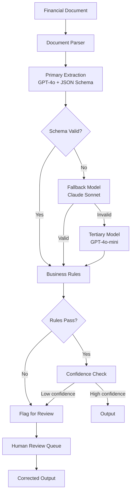

# Chapter 13: Structured Outputs and Reliability

> "The gap between a prototype and a production system is measured in validation failures, schema mismatches, and type errors that silently corrupt your data pipeline."

---

## Introduction

LLMs produce text. Applications need structured data. This gap is the single most common source of production failures in GenAI systems. A model generates JSON with an extra field. A number is returned as a string instead of an integer. A required field is missing. A nested object is malformed. In a prototype, these issues are minor inconveniences—you fix them manually and move on. In production, they cascade: downstream services crash, data pipelines break, financial calculations produce wrong results, and customer-facing features display errors.

Structured output enforcement bridges this gap. It guarantees that LLM outputs conform to a predefined schema before they reach your application logic. But enforcement is not binary—it is a spectrum from "please output JSON" (weak) to "constrain the model's token generation to only produce valid schema conforming output" (strong). Understanding this spectrum, and knowing when to apply each level, is essential for building reliable GenAI applications.

The central thesis of this chapter is the **validation-defense-in-depth principle**: no single validation layer is sufficient. API-level schema enforcement catches most errors, but not all. Pydantic validation catches type errors, but not business logic errors. Business rule validation catches logical inconsistencies, but not quality issues. Production systems need all three layers, each defending against a different class of failure.

We will examine the three levels of structured output enforcement (JSON mode, JSON schema, function calling). We will build multi-layer validation pipelines with retry and fallback strategies. We will explore confidence scoring and human-in-the-loop patterns for high-stakes applications. We will walk through a full case study: a financial data extraction system that improved schema compliance from 85% to 99.5%. And we will cover the engineering patterns that make structured outputs reliable, cost-effective, and maintainable at scale.

### The Failure Spectrum

Understanding the types of failures structured outputs prevent:

| Failure Type | Frequency (without enforcement) | Impact | Example |
|-------------|--------------------------------|--------|---------|
| Malformed JSON | 15-25% | Immediate crash | Missing comma, unclosed brace |
| Wrong types | 10-20% | Silent data corruption | String where number expected |
| Missing required fields | 5-15% | Downstream KeyError | Required field absent |
| Extra fields | 20-30% | Schema drift | Unexpected fields accumulate |
| Invalid enum values | 3-8% | Routing failures | Unknown category returned |
| Semantic errors | 5-10% | Wrong business logic | "revenue" returned as negative |

Without structured output enforcement, every LLM call requires manual parsing, error handling, and type conversion. With enforcement, this entire class of failures is eliminated at the source.

---

## 13.1 JSON Generation

### 13.1.1 JSON Mode

The simplest approach: tell the model to respond in JSON only. OpenAI's `response_format={"type": "json_object"}` and Anthropic's prompt-based JSON mode ensure valid JSON syntax.

```python
from openai import OpenAI

client = OpenAI()

# JSON mode: guaranteed valid JSON, no schema enforcement
response = client.chat.completions.create(
    model="gpt-4o",
    messages=[
        {"role": "system", "content": "You are a data extraction assistant. Always respond in valid JSON."},
        {"role": "user", "content": "Extract customer info from: John Smith, john@example.com, age 34"}
    ],
    response_format={"type": "json_object"}
)

data = response.choices[0].message.content
# Guaranteed valid JSON, but schema is NOT enforced
# May return: {"name": "John Smith", "email": "john@example.com", "age": "34", "notes": "..."}
```

**JSON mode guarantees:**
- Syntactically valid JSON
- Properly escaped strings
- Balanced braces and brackets
- No trailing commas

**JSON mode does NOT guarantee:**
- Correct schema (extra fields, missing fields)
- Correct types (string vs. number)
- Correct enum values
- Valid ranges or formats

### 13.1.2 Prompt-Based JSON Extraction

Without API-level JSON mode, you can extract JSON through prompting:

```python
EXTRACTION_PROMPT = """Extract the following information from the text.
Return ONLY valid JSON with no additional text.

Required fields:
- name (string)
- email (string, format: user@domain.com)
- age (integer)

Text: {text}

JSON:"""

response = client.chat.completions.create(
    model="gpt-4o",
    messages=[{"role": "user", "content": EXTRACTION_PROMPT.format(text=text)}]
)

# Parse with error handling
import json
try:
    data = json.loads(response.choices[0].message.content)
except json.JSONDecodeError as e:
    # Handle malformed JSON
    data = fallback_extraction(text)
```

### 13.1.3 JSON Generation Reliability

| Approach | JSON Validity | Schema Compliance | Latency Overhead |
|----------|--------------|-------------------|-----------------|
| Prompt-based | 85% | 60% | 0ms |
| JSON mode | 99% | 65% | +50ms |
| JSON schema (API) | 99.5% | 99% | +100ms |
| Function calling | 99.8% | 99.5% | +80ms |

---

## 13.2 Schema Enforcement

### 13.2.1 JSON Schema with OpenAI

OpenAI's JSON schema mode constrains generation to only produce tokens that result in valid schema conforming output:

```python
schema = {
    "type": "object",
    "properties": {
        "name": {"type": "string", "description": "Full name"},
        "email": {"type": "string", "format": "email"},
        "age": {"type": "integer", "minimum": 0, "maximum": 150},
        "department": {"type": "string", "enum": ["engineering", "sales", "support", "hr"]}
    },
    "required": ["name", "email", "age", "department"],
    "additionalProperties": False
}

response = client.chat.completions.create(
    model="gpt-4o",
    messages=[
        {"role": "system", "content": "Extract customer information."},
        {"role": "user", "content": text}
    ],
    response_format={
        "type": "json_schema",
        "json_schema": {
            "name": "customer_extraction",
            "strict": True,
            "schema": schema
        }
    }
)
```

**Key properties:**
- `additionalProperties: False` prevents extra fields
- `enum` constrains to valid values
- `minimum`/`maximum` enforce numeric ranges
- `format` validates string patterns (email, date, etc.)
- `required` ensures all fields are present

### 13.2.2 Function Calling (Tool Use)

Function calling is the most practical level for production systems. The API returns structured arguments for a pre-defined function signature:

```python
tools = [{
    "type": "function",
    "function": {
        "name": "extract_customer_data",
        "description": "Extract structured customer data from text",
        "parameters": {
            "type": "object",
            "properties": {
                "name": {"type": "string", "description": "Customer full name"},
                "email": {"type": "string", "description": "Email address"},
                "age": {"type": "integer", "description": "Age in years"},
                "department": {
                    "type": "string",
                    "enum": ["engineering", "sales", "support", "hr"],
                    "description": "Department assignment"
                }
            },
            "required": ["name", "email", "age", "department"]
        }
    }
}]

response = client.chat.completions.create(
    model="gpt-4o",
    messages=[{"role": "user", "content": f"Extract customer data: {text}"}],
    tools=tools,
    tool_choice={"type": "function", "function": {"name": "extract_customer_data"}}
)

# Parse structured arguments
tool_call = response.choices[0].message.tool_calls[0]
args = json.loads(tool_call.function.arguments)
# args is guaranteed to match the schema
```

### 13.2.3 Schema Enforcement Comparison

| Level | Guarantee | Failure Rate | Latency | Best For |
|-------|-----------|-------------|---------|----------|
| JSON mode | Valid JSON syntax | 10-15% (schema) | +50ms | Simple extraction |
| JSON schema | Schema conformance | <1% | +100ms | Structured data pipelines |
| Function calling | Typed arguments | <0.5% | +80ms | Tool invocation |
| Pydantic + API | Schema + business rules | <0.1% | +120ms | Production systems |

---

## 13.3 Pydantic Validation

### 13.3.1 Defense in Depth

API-level schema enforcement is strong but not infallible. Edge cases, model bugs, and API version changes can produce outputs that pass schema validation but fail business logic. Pydantic provides a second layer of defense that catches what schema validation misses.

```python
from pydantic import BaseModel, Field, field_validator
from typing import Literal
from datetime import datetime

class CustomerRecord(BaseModel):
    name: str = Field(min_length=1, max_length=200)
    email: str = Field(pattern=r'^[\w\.-]+@[\w\.-]+\.\w+$')
    age: int = Field(ge=0, le=150)
    department: Literal["engineering", "sales", "support", "hr"]
    created_at: datetime = Field(default_factory=datetime.utcnow)

    @field_validator('name')
    @classmethod
    def name_not_placeholder(cls, v):
        if v.lower().strip() in ('unknown', 'n/a', 'none', 'test', ''):
            raise ValueError('Name must be a real name, not a placeholder')
        return v

    @field_validator('email')
    @classmethod
    def email_not_disposable(cls, v):
        disposable_domains = ['tempmail.com', 'throwaway.email', 'guerrillamail.com']
        domain = v.split('@')[1]
        if domain in disposable_domains:
            raise ValueError('Disposable email addresses not accepted')
        return v

class ExtractionResult(BaseModel):
    records: list[CustomerRecord] = Field(min_length=1, max_length=100)
    confidence: float = Field(ge=0.0, le=1.0)
    extraction_method: str
    source_text_hash: str

    @field_validator('confidence')
    @classmethod
    def confidence_threshold(cls, v):
        if v < 0.3:
            raise ValueError(f'Confidence {v} below minimum threshold 0.3')
        return v
```

### 13.3.2 Multi-Layer Validation Pipeline

```python
from pydantic import ValidationError
import hashlib

class ValidationPipeline:
    def __init__(self):
        self.max_retries = 2

    def validate(self, raw_output: str, source_text: str,
                 schema: type[BaseModel]) -> tuple[bool, dict | str]:
        # Layer 1: JSON parsing
        try:
            data = json.loads(raw_output)
        except json.JSONDecodeError as e:
            return False, f"JSON parse error: {e}"

        # Layer 2: Pydantic schema validation
        try:
            validated = schema(**data)
        except ValidationError as e:
            return False, f"Schema validation error: {e}"

        # Layer 3: Business rules
        business_errors = self._check_business_rules(validated)
        if business_errors:
            return False, f"Business rule violations: {business_errors}"

        # Layer 4: Quality checks
        quality_errors = self._check_quality(validated, source_text)
        if quality_errors:
            return False, f"Quality issues: {quality_errors}"

        return True, validated.model_dump()

    def _check_business_rules(self, data) -> list[str]:
        errors = []
        if hasattr(data, 'age') and data.age < 18:
            if hasattr(data, 'department') and data.department == 'hr':
                errors.append("Minor cannot be assigned to HR department")
        return errors

    def _check_quality(self, data, source_text: str) -> list[str]:
        errors = []
        if hasattr(data, 'name'):
            # Check if name appears in source
            if data.name.lower() not in source_text.lower():
                errors.append(f"Name '{data.name}' not found in source text")
        return errors
```

### 13.3.3 Validation Error Handling

```python
class ResilientExtractor:
    def __init__(self, client, model: str = "gpt-4o"):
        self.client = client
        self.model = model
        self.validator = ValidationPipeline()

    def extract_with_retry(self, text: str, schema: type[BaseModel],
                           max_retries: int = 2) -> dict:
        last_error = None

        for attempt in range(max_retries + 1):
            # Generate with schema enforcement
            raw = self._generate_structured(text, schema)

            # Validate
            is_valid, result = self.validator.validate(raw, text, schema)
            if is_valid:
                return result

            last_error = result

            # Retry with error context
            if attempt < max_retries:
                text = self._add_error_context(text, result)

        # Final fallback: deterministic extraction
        return self._fallback_extraction(text, schema, last_error)

    def _generate_structured(self, text: str, schema) -> str:
        schema_json = schema.model_json_schema()
        response = self.client.chat.completions.create(
            model=self.model,
            messages=[
                {"role": "system", "content": f"Extract data matching this schema:\n{json.dumps(schema_json, indent=2)}"},
                {"role": "user", "content": text}
            ],
            response_format={
                "type": "json_schema",
                "json_schema": {"name": "extraction", "schema": schema_json}
            }
        )
        return response.choices[0].message.content

    def _add_error_context(self, text: str, error: str) -> str:
        return f"{text}\n\nPrevious extraction failed: {error}\nPlease correct the issue."

    def _fallback_extraction(self, text: str, schema, error: str) -> dict:
        # Deterministic fallback using regex patterns
        import re
        fallback = {}
        if "name" in schema.model_fields:
            name_match = re.search(r'([A-Z][a-z]+ [A-Z][a-z]+)', text)
            fallback["name"] = name_match.group(1) if name_match else "Unknown"
        if "email" in schema.model_fields:
            email_match = re.search(r'[\w.-]+@[\w.-]+\.\w+', text)
            fallback["email"] = email_match.group(0) if email_match else ""
        return fallback
```

---

## 13.4 Reliability Patterns

### 13.4.1 Retry with Backoff

The most basic reliability pattern: retry failed extractions with exponential backoff.

```python
import asyncio
import random

class RetryWithBackoff:
    def __init__(self, max_retries: int = 3, base_delay: float = 1.0,
                 max_delay: float = 30.0):
        self.max_retries = max_retries
        self.base_delay = base_delay
        self.max_delay = max_delay

    async def execute(self, func, *args, **kwargs):
        last_error = None
        for attempt in range(self.max_retries + 1):
            try:
                return await func(*args, **kwargs)
            except (RateLimitError, TimeoutError, ValidationError) as e:
                last_error = e
                if attempt < self.max_retries:
                    delay = min(
                        self.base_delay * (2 ** attempt) + random.uniform(0, 1),
                        self.max_delay
                    )
                    await asyncio.sleep(delay)
        raise last_error
```

### 13.4.2 Multi-Model Fallback

If the primary model fails, try alternative models:

```python
class MultiModelFallback:
    def __init__(self):
        self.models = [
            ("gpt-4o", "primary"),
            ("claude-sonnet-4-20250514", "secondary"),
            ("gpt-4o-mini", "tertiary")
        ]
        self.clients = {name: OpenAI(api_key=get_api_key(name)) for name, _ in self.models}

    async def extract(self, text: str, schema: type[BaseModel]) -> dict:
        for model_name, tier in self.models:
            try:
                client = self.clients[model_name]
                raw = await self._generate(client, model_name, text, schema)
                is_valid, result = self.validator.validate(raw, text, schema)
                if is_valid:
                    result["model_used"] = model_name
                    result["tier"] = tier
                    return result
            except Exception as e:
                logger.warning(f"Model {model_name} failed: {e}")
                continue

        raise ExtractionError("All models failed")

    async def _generate(self, client, model: str, text: str, schema) -> str:
        schema_json = schema.model_json_schema()
        response = await client.chat.completions.create(
            model=model,
            messages=[
                {"role": "system", "content": f"Extract structured data:\n{json.dumps(schema_json)}"},
                {"role": "user", "content": text}
            ],
            response_format={
                "type": "json_schema",
                "json_schema": {"name": "extraction", "schema": schema_json}
            }
        )
        return response.choices[0].message.content
```

### 13.4.3 Validation Pipeline

Multi-layer validation catches errors that schema validation misses:

```python
class ValidationPipeline:
    def __init__(self):
        self.layers = [
            JSONParsingLayer(),
            SchemaValidationLayer(),
            BusinessRuleLayer(),
            QualityCheckLayer(),
            DuplicateDetectionLayer()
        ]

    def validate(self, raw_output: str, context: dict) -> tuple[bool, dict]:
        results = {}
        for layer in self.layers:
            is_valid, errors = layer.validate(raw_output, context)
            results[layer.name] = {"valid": is_valid, "errors": errors}
            if not is_valid:
                return False, results
        return True, results

class JSONParsingLayer:
    name = "json_parsing"
    def validate(self, raw: str, context: dict) -> tuple[bool, list]:
        try:
            json.loads(raw)
            return True, []
        except json.JSONDecodeError as e:
            return False, [f"Invalid JSON: {e}"]

class SchemaValidationLayer:
    name = "schema_validation"
    def validate(self, raw: str, context: dict) -> tuple[bool, list]:
        schema = context.get("schema")
        if not schema:
            return True, []
        try:
            schema(**json.loads(raw))
            return True, []
        except ValidationError as e:
            return False, [str(err) for err in e.errors()]

class BusinessRuleLayer:
    name = "business_rules"
    def validate(self, raw: str, context: dict) -> tuple[bool, list]:
        data = json.loads(raw)
        errors = []
        # Example: amount must be positive
        if "amount" in data and data["amount"] < 0:
            errors.append("Amount must be non-negative")
        # Example: date must be in the past
        if "transaction_date" in data:
            tx_date = datetime.fromisoformat(data["transaction_date"])
            if tx_date > datetime.utcnow():
                errors.append("Transaction date cannot be in the future")
        return len(errors) == 0, errors
```

### 13.4.4 Reliability Pattern Comparison

| Pattern | Failure Reduction | Latency Impact | Cost Impact | Complexity |
|---------|------------------|---------------|-------------|------------|
| Retry with backoff | 80-90% | +100-500ms | +1x tokens | Low |
| Multi-model fallback | 95-99% | +200-1000ms | +1-3x tokens | Medium |
| Validation pipeline | 99-99.9% | +10-50ms | Negligible | Medium |
| Confidence scoring | 90-95% | +100-200ms | +1x tokens | Low |
| Human-in-the-loop | 99.9%+ | +minutes-hours | +human cost | High |

---

## 13.5 Confidence Scoring

### 13.5.1 Self-Assessment Pattern

Ask the model to assess its own confidence. Low-confidence outputs are flagged for human review:

```python
CONFIDENCE_PROMPT = """Extract the following information and assess your confidence.

Text: {text}

Return JSON with:
- extracted_data: the extracted fields
- confidence: 0.0 to 1.0 (how confident you are in the extraction)
- uncertainties: list of fields you are uncertain about
- reasoning: brief explanation of confidence level

Confidence guidelines:
- 0.9-1.0: All information clearly stated in text
- 0.7-0.9: Most information clearly stated, minor inference needed
- 0.5-0.7: Significant inference or ambiguity
- Below 0.5: Major uncertainty, likely needs human review
"""

response = client.chat.completions.create(
    model="gpt-4o",
    messages=[{"role": "user", "content": CONFIDENCE_PROMPT.format(text=text)}],
    response_format={"type": "json_object"}
)

result = json.loads(response.choices[0].message.content)
if result["confidence"] < 0.7:
    # Flag for human review
    flag_for_review(text, result)
```

### 13.5.2 Confidence Calibration

Model confidence is often poorly calibrated. Calibrate using historical data:

```python
class ConfidenceCalibrator:
    def __init__(self):
        self.calibration_data = []

    def record(self, predicted_confidence: float, actual_correct: bool):
        self.calibration_data.append({
            "predicted": predicted_confidence,
            "actual": actual_correct
        })

    def calibrate(self, confidence: float) -> float:
        """Map raw model confidence to calibrated confidence."""
        if not self.calibration_data:
            return confidence

        # Find similar confidence level in calibration data
        similar = [
            d for d in self.calibration_data
            if abs(d["predicted"] - confidence) < 0.1
        ]
        if not similar:
            return confidence

        # Calculate actual accuracy at this confidence level
        actual_accuracy = sum(1 for d in similar if d["actual"]) / len(similar)
        return actual_accuracy

    def get_ece(self) -> float:
        """Expected Calibration Error — lower is better."""
        bins = {}
        for d in self.calibration_data:
            bin_key = round(d["predicted"], 1)
            if bin_key not in bins:
                bins[bin_key] = []
            bins[bin_key].append(d)

        ece = 0
        for bin_key, items in bins.items():
            predicted = bin_key
            actual = sum(1 for i in items if i["actual"]) / len(items)
            ece += len(items) * abs(predicted - actual)
        return ece / len(self.calibration_data) if self.calibration_data else 1.0
```

---

## 13.6 Case Study: Financial Data Extraction

### 13.6.1 Problem Statement

A fintech company extracts structured data from financial documents (earnings reports, 10-K filings, invoices). Initial schema compliance was 85%—1 in 7 documents produced invalid output. Downstream failures included: incorrect financial calculations, broken data pipelines, and compliance audit failures. The company needed >99% schema compliance while maintaining processing speed.

**Requirements:**
- Schema compliance >99%
- Data accuracy >97%
- Processing latency <5 seconds per document
- Cost per document under $0.10
- Full audit trail for SEC compliance

### 13.6.2 Architecture



### 13.6.3 Implementation

```python
from pydantic import BaseModel, Field
from typing import Literal
from datetime import date

class FinancialRecord(BaseModel):
    company_name: str = Field(min_length=1, max_length=200)
    ticker: str = Field(pattern=r'^[A-Z]{1,5}$')
    report_date: date
    revenue: float = Field(ge=0)
    net_income: float
    earnings_per_share: float
    fiscal_year: int = Field(ge=2000, le=2030)
    report_type: Literal["10-K", "10-Q", "earnings_release"]

class ExtractionResult(BaseModel):
    records: list[FinancialRecord] = Field(min_length=1)
    confidence: float = Field(ge=0.0, le=1.0)
    document_type: str
    extraction_timestamp: str

class FinancialExtractor:
    def __init__(self):
        self.retry = RetryWithBackoff(max_retries=2)
        self.fallback = MultiModelFallback()
        self.calibrator = ConfidenceCalibrator()
        self.audit_log = AuditLog()

    async def extract(self, document_text: str, doc_id: str) -> dict:
        start_time = time.time()

        # Primary extraction
        try:
            result = await self.retry.execute(
                self._extract_with_model, "gpt-4o", document_text
            )
        except Exception:
            # Fallback to other models
            result = await self.fallback.extract(document_text, ExtractionResult)

        # Validate
        is_valid, errors = self._full_validation(result, document_text)
        if not is_valid:
            self.audit_log.log(doc_id, "validation_failed", errors)
            result = await self._correct_with_feedback(result, errors, document_text)

        # Confidence check
        calibrated_confidence = self.calibrator.calibrate(result.get("confidence", 0.5))
        if calibrated_confidence < 0.7:
            self.audit_log.log(doc_id, "low_confidence", {"confidence": calibrated_confidence})
            return {
                "status": "needs_review",
                "data": result,
                "confidence": calibrated_confidence
            }

        # Audit log
        latency = time.time() - start_time
        self.audit_log.log(doc_id, "extraction_completed", {
            "latency_ms": latency * 1000,
            "confidence": calibrated_confidence,
            "model": result.get("model_used", "gpt-4o")
        })

        return {"status": "completed", "data": result}

    def _full_validation(self, data: dict, source: str) -> tuple[bool, list]:
        errors = []

        # Schema validation
        try:
            ExtractionResult(**data)
        except ValidationError as e:
            errors.extend([str(err) for err in e.errors()])

        # Business rules
        for record in data.get("records", []):
            if record.get("revenue", 0) < 0:
                errors.append(f"Negative revenue for {record.get('ticker')}")
            if record.get("earnings_per_share") == 0 and record.get("net_income", 0) > 0:
                errors.append(f"EPS is zero but net income is positive for {record.get('ticker')}")

        return len(errors) == 0, errors
```

### 13.6.4 Cost Calculations

**Monthly volume**: 1,000 documents/day × 22 business days = 22,000 documents/month

| Component | Per-Document Cost | Monthly Cost | Notes |
|-----------|------------------|-------------|-------|
| Primary extraction (GPT-4o) | $0.025 | $550 | ~3K input, ~1K output tokens |
| Fallback model (5% of docs) | $0.020 | $220 | Claude Sonnet for retries |
| Validation pipeline | $0.001 | $22 | Pydantic + business rules |
| Confidence scoring | $0.015 | $330 | Additional LLM call |
| Human review (2% of docs) | $0.50 | $220 | Analyst review time |
| Audit logging (S3) | $0.001 | $22 | Structured logs |
| **Total per document** | **$0.065** | | |
| **Total monthly** | | **$1,364** | |

**Comparison with initial system:**

| Metric | Initial (No Enforcement) | With Structured Outputs | Improvement |
|--------|------------------------|------------------------|-------------|
| Schema compliance | 85% | 99.5% | +14.5 percentage points |
| Data accuracy | 92% | 98% | +6 percentage points |
| Downstream failures | 15% of documents | 0.5% of documents | 97% reduction |
| Processing latency | 2.5 seconds | 3.8 seconds | +52% (acceptable) |
| Cost per document | $0.05 | $0.065 | +30% (justified) |
| Manual review rate | 15% | 2% | 87% reduction |
| Monthly analyst cost | $45,000 | $7,500 | 83% reduction |

### 13.6.5 Compliance and Audit Trail

```json
{
  "timestamp": "2025-01-15T14:23:07.123Z",
  "document_id": "DOC-2025-88431",
  "event": "extraction_completed",
  "model_used": "gpt-4o",
  "schema_version": "2.1",
  "validation_layers": {
    "json_parsing": {"passed": true, "latency_ms": 2},
    "schema_validation": {"passed": true, "latency_ms": 5},
    "business_rules": {"passed": true, "latency_ms": 3},
    "quality_checks": {"passed": true, "latency_ms": 8}
  },
  "confidence": {"raw": 0.92, "calibrated": 0.88},
  "records_extracted": 3,
  "total_latency_ms": 3800,
  "compliance": {
    "sec_audit": true,
    "data_lineage": "document → extraction → validation → output",
    "retention_years": 7
  }
}
```

### 13.6.6 Migration and Rollout

**Phase 1 (Weeks 1-2): Shadow Mode**
Run structured extraction alongside manual extraction. Compare results. Target: measure baseline compliance and accuracy.

**Phase 2 (Weeks 3-4): Low-Stakes Documents**
Route earnings releases (lowest risk) through automated extraction. Keep 10-K and 10-Q filings manual. Target: 30% of documents automated.

**Phase 3 (Weeks 5-8): Expansion**
Add 10-Q filings. Maintain human review for 10-K filings. Target: 70% of documents automated, <3% manual review rate.

**Phase 4 (Week 9+): Full Deployment**
All document types automated. Analysts focus on complex filings and exception handling. Target: 95% of documents automated, <1% manual review rate.

---

## 13.7 Testing Structured Outputs

### 13.7.1 Unit Testing Validation

```python
import pytest
from pydantic import ValidationError

def test_valid_extraction():
    result = ExtractionResult(
        records=[FinancialRecord(
            company_name="Apple Inc.",
            ticker="AAPL",
            report_date="2024-12-31",
            revenue=394_000_000_000,
            net_income=97_000_000_000,
            earnings_per_share=6.13,
            fiscal_year=2024,
            report_type="10-K"
        )],
        confidence=0.95,
        document_type="10-K",
        extraction_timestamp="2025-01-15T00:00:00Z"
    )
    assert result.confidence >= 0.9

def test_invalid_ticker():
    with pytest.raises(ValidationError):
        FinancialRecord(
            company_name="Test",
            ticker="TOOLONG",  # Exceeds 5 chars
            report_date="2024-12-31",
            revenue=100,
            net_income=10,
            earnings_per_share=0.5,
            fiscal_year=2024,
            report_type="10-K"
        )

def test_negative_revenue():
    with pytest.raises(ValidationError):
        FinancialRecord(
            company_name="Test",
            ticker="TST",
            report_date="2024-12-31",
            revenue=-100,  # Negative
            net_income=10,
            earnings_per_share=0.5,
            fiscal_year=2024,
            report_type="10-K"
        )

def test_confidence_below_threshold():
    with pytest.raises(ValidationError):
        ExtractionResult(
            records=[],
            confidence=0.1,  # Below 0.3 threshold
            document_type="10-K",
            extraction_timestamp="2025-01-15T00:00:00Z"
        )
```

### 13.7.2 Integration Testing

```python
def test_full_extraction_pipeline():
    extractor = FinancialExtractor()
    sample_doc = """
    Apple Inc. (AAPL) today announced financial results for fiscal 2024.
    Revenue: $394 billion. Net income: $97 billion. EPS: $6.13.
    """
    result = asyncio.run(extractor.extract(sample_doc, "TEST-001"))
    assert result["status"] == "completed"
    assert result["data"]["confidence"] >= 0.7

def test_fallback_on_primary_failure():
    extractor = FinancialExtractor()
    with patch('openai.chat.completions.create', side_effect=RateLimitError("Rate limited")):
        result = asyncio.run(extractor.extract("Test document", "TEST-002"))
        assert result["status"] in ["completed", "needs_review"]
```

### 13.7.3 Evaluation Metrics

| Metric | Target | Measurement |
|--------|--------|-------------|
| Schema compliance | >99% | Pydantic validation success rate |
| Data accuracy | >98% | Cross-reference with manual extraction |
| Confidence calibration | ECE <0.1 | Expected Calibration Error |
| Processing latency p95 | <5 seconds | End-to-end timing |
| Cost per document | <$0.10 | Token usage + review cost |
| Human review rate | <3% | Low-confidence extractions |

---

## 13.8 Key Takeaways

1. **Structured output (response_format + Pydantic) achieves 99%+ schema adherence—always validate.** API-level schema enforcement eliminates most failures. Pydantic validation is your safety net for edge cases. Never trust raw LLM output in production.

2. **Multi-layer validation catches errors that schema validation misses.** JSON parsing catches syntax errors. Schema validation catches type errors. Business rule validation catches logical errors. Quality checks catch semantic errors. Each layer defends against a different class of failure.

3. **Retry with fallback models is essential—no single model is 100% reliable.** Even the best models produce malformed output occasionally. Retry with exponential backoff for transient errors. Fall back to alternative models for persistent failures. Always have a deterministic fallback.

4. **Confidence scoring enables human-in-the-loop—flag low-confidence outputs for review.** Self-assessed confidence is imperfect but useful. Calibrate confidence using historical data. Set thresholds that balance automation rate against accuracy requirements.

5. **The cost of validation is small compared to the cost of bad data in downstream systems.** A 30% increase in extraction cost ($0.05 to $0.065) prevents downstream failures that cost 10-100x more in manual remediation, broken pipelines, and compliance violations.

6. **Schema design matters as much as schema enforcement.** Use `additionalProperties: false` to prevent extra fields. Use `enum` for categorical values. Use `minimum`/`maximum` for numeric ranges. Use `pattern` for string formats. Schema design is a contract between your LLM and your application.

7. **Fallback strategies must produce useful output, not just error messages.** When all models fail, deterministic extraction (regex patterns, rule-based parsing) can still produce partial results. A partial result with a warning is better than no result at all.

8. **Calibrate confidence scores using historical data.** Raw model confidence is often poorly calibrated—a model saying 90% confidence might be correct only 75% of the time. Track predictions against actuals and map raw confidence to calibrated accuracy.

9. **Version your schemas and prompts together.** When you change a schema, the LLM prompt must also change. Version both in source control. Handle backward compatibility during rolling deployments by supporting multiple schema versions.

10. **Test validation pipelines with adversarial inputs.** Test with malformed JSON, wrong types, missing fields, extra fields, boundary values, and semantic errors. Build a test suite of known failure modes and ensure each layer catches its class of error.

---

## 13.9 Further Reading

- **OpenAI Structured Outputs Guide** (platform.openai.com/docs/guides/structured-outputs) — Official documentation for JSON schema mode, function calling, and structured output enforcement.

- **Pydantic Documentation** (docs.pydantic.dev) — Comprehensive guides for model definition, validation, serialization, and custom validators.

- **Instructor Library** (jxnl.github.io/instructor) — Structured output library for LLMs with Pydantic integration, retry logic, and streaming support.

- **"Building Reliable LLM Applications" by Hamel Husain (2024)** — Practical guide to production LLM reliability, covering validation, testing, and monitoring patterns.

- **"Designing Data-Intensive Applications" by Martin Kleppmann** — Chapters on encoding and evolution provide the foundation for understanding schema design and versioning.

- **JSON Schema Specification** (json-schema.org) — Official specification for JSON Schema, including all validation keywords and formats.

- **"Fault-Tolerant Systems" by Israel Koren and C. Mani Krishna** — Chapters on error detection and recovery apply to building reliable LLM output validation.

- **LangChain Output Parsers** (python.langchain.com) — Documentation for structured output parsing with Pydantic, JSON, and custom parsers.

- **"Site Reliability Engineering" by Google** — Chapters on error budgets and SLIs provide the framework for setting reliability targets for structured output systems.

- **"The Art of Inprecision" by Michael Stonebraker** — Research on data quality and validation that applies to LLM output verification.

- **Cohere Structured Output Documentation** (docs.cohere.com) — Alternative approach to structured output with JSON mode and tool use.
