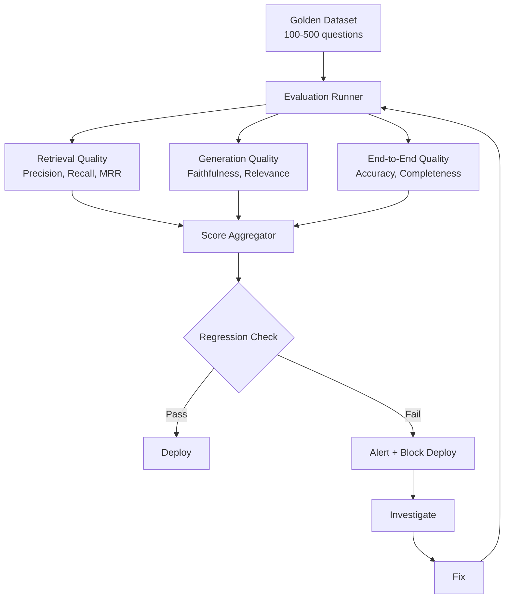

# Chapter 14: Evaluation

> "You cannot improve what you cannot measure. And in GenAI, measurement is not a one-time act—it is a continuous discipline that determines whether your system is getting better or silently degrading."

---

## Introduction

Traditional software testing has clear success criteria: a function either returns the correct output or it does not. A test passes or fails. A bug is reproducible. GenAI evaluation is fundamentally different. Outputs are probabilistic—running the same prompt twice may produce different (but equally valid) results. Correctness is often subjective—there is no single "right" answer for "write a marketing email." Quality depends on context—a response that is excellent for a casual user may be inadequate for an expert. And the ground truth itself may be ambiguous—different human evaluators may disagree on what constitutes a "good" response.

This chapter addresses the evaluation crisis in GenAI. Without rigorous evaluation, you are deploying systems blind—hoping they work, unable to prove they do, and unable to detect when they degrade. The cost of evaluation is small compared to the cost of deploying a system that hallucinates financial data, misclassifies medical symptoms, or generates offensive content.

The central thesis of this chapter is the **evaluation-as-infrastructure principle**: evaluation is not a phase in development—it is infrastructure that runs continuously, catches regressions, and provides the data needed to improve. Build your evaluation pipeline before you deploy to production, not after you discover quality problems.

We will examine the fundamental metrics for LLM evaluation (accuracy, hallucination rate, relevance, faithfulness). We will dissect the major evaluation frameworks (RAGAS, DeepEval, LangSmith) and their trade-offs. We will build testing strategies for unit, integration, prompt, and regression testing. We will walk through a full case study: building an evaluation pipeline for a RAG system that catches quality regressions before they reach users. And we will cover the hard-won lessons of production evaluation—LLM-as-judge calibration, dataset curation, and the metrics that actually matter.

### The Evaluation Spectrum

Evaluation approaches exist on a spectrum from automated to human:

| Approach | Cost | Accuracy | Speed | Scalability | Best For |
|----------|------|---------|-------|-------------|----------|
| **Automated metrics** | Low | Medium | Fast | High | Retrieval quality, schema compliance |
| **LLM-as-judge** | Medium | Medium-High | Medium | High | Relevance, faithfulness, tone |
| **Human evaluation** | High | High | Slow | Low | Nuance, creativity, safety |
| **A/B testing** | Medium | High | Slow | Medium | User preference, conversion |
| **Hybrid** | Medium | High | Medium | High | Production evaluation |

Most production systems use a hybrid approach: automated metrics for continuous monitoring, LLM-as-judge for quality scoring, and periodic human evaluation for calibration and edge cases.

---

## 14.1 LLM Evaluation Metrics

### 14.1.1 Accuracy Metrics

**Accuracy** measures the percentage of correct responses. Simple to compute for factual tasks, harder for open-ended generation.

```python
class AccuracyEvaluator:
    def __init__(self, llm):
        self.llm = llm

    def evaluate_exact_match(self, predicted: str, expected: str) -> bool:
        return predicted.strip().lower() == expected.strip().lower()

    def evaluate_semantic_match(self, predicted: str, expected: str) -> float:
        prompt = f"""Rate how semantically similar these two responses are.
Response 1: {predicted}
Response 2: {expected}

Rate from 0.0 (completely different) to 1.0 (semantically identical).
Return only the numeric score."""
        score = self.llm.generate(prompt)
        return float(score)

    def evaluate_factual_accuracy(self, response: str, source_documents: list[str]) -> float:
        prompt = f"""Verify each claim in the response against the source documents.

Response: {response}

Source documents:
{chr(10).join(source_documents)}

For each claim, determine if it is:
- SUPPORTED: directly stated or clearly implied in sources
- NOT VERIFIED: cannot be confirmed or denied by sources
- CONTRADICTED: contradicted by sources

Return JSON: {{"supported": N, "not_verified": N, "contradicted": N, "accuracy_score": 0.0-1.0}}"""
        result = self.llm.generate(prompt, response_format="json")
        return result["accuracy_score"]
```

### 14.1.2 Hallucination Detection

**Hallucination rate** measures the frequency of fabricated information. Requires a fact-checking layer that verifies each claim against source documents.

```python
class HallucinationDetector:
    def __init__(self, llm):
        self.llm = llm

    def detect_hallucinations(self, response: str,
                              context: list[str]) -> dict:
        prompt = f"""Analyze this response for hallucinations.

Response: {response}

Context documents:
{chr(10).join(context)}

Identify each factual claim in the response. For each claim:
1. Quote the exact claim
2. Determine if it is: SUPPORTED, NOT VERIFIED, or CONTRADICTED by the context
3. If CONTRADICTED, quote the contradicting passage

Return JSON:
{{
  "claims": [
    {{
      "claim": "...",
      "status": "SUPPORTED|NOT_VERIFIED|CONTRADICTED",
      "evidence": "..."
    }}
  ],
  "hallucination_rate": 0.0-1.0,
  "total_claims": N,
  "supported": N,
  "not_verified": N,
  "contradicted": N
}}"""
        return self.llm.generate(prompt, response_format="json")

    def calculate_hallucination_score(self, detection_result: dict) -> float:
        total = detection_result["total_claims"]
        if total == 0:
            return 0.0
        hallucinated = detection_result["contradicted"] + detection_result["not_verified"]
        return hallucinated / total
```

### 14.1.3 Relevance and Faithfulness

**Relevance** measures how well responses address the query. **Faithfulness** measures how well responses are grounded in provided context.

```python
class RelevanceEvaluator:
    def __init__(self, llm):
        self.llm = llm

    def evaluate_relevance(self, query: str, response: str) -> float:
        prompt = f"""Rate how well this response addresses the query.

Query: {query}
Response: {response}

Rate from 0.0 (completely irrelevant) to 1.0 (perfectly addresses the query).
Consider: Does the response answer the question? Is it on-topic? Is it complete?
Return only the numeric score."""
        return float(self.llm.generate(prompt))

    def evaluate_faithfulness(self, response: str, context: list[str]) -> dict:
        prompt = f"""Check if every claim in the response is supported by the context.

Response: {response}

Context:
{chr(10).join(context)}

For each sentence in the response:
1. Is it fully supported by the context? (faithful)
2. Is it partially supported? (partially faithful)
3. Is it unsupported or contradicted? (hallucination)

Return JSON:
{{
  "faithful_sentences": N,
  "partially_faithful": N,
  "hallucinated": N,
  "faithfulness_score": 0.0-1.0
}}"""
        return self.llm.generate(prompt, response_format="json")
```

### 14.1.4 Metrics Summary

| Metric | What It Measures | Range | Target |
|--------|-----------------|-------|--------|
| Accuracy | Correct responses / total | 0-1 | >0.90 |
| Hallucination rate | Fabricated claims / total claims | 0-1 | <0.05 |
| Relevance | Query-response alignment | 0-1 | >0.85 |
| Faithfulness | Context-grounded claims | 0-1 | >0.90 |
| Completeness | Coverage of expected answer | 0-1 | >0.80 |
| Coherence | Logical flow and clarity | 0-1 | >0.85 |

---

## 14.2 Evaluation Frameworks

### 14.2.1 RAGAS: RAG Evaluation

RAGAS is the standard framework for RAG evaluation. It measures four dimensions: faithfulness, answer relevancy, context precision, and context recall.

```python
from ragas import evaluate
from ragas.metrics import (
    faithfulness,
    answer_relevancy,
    context_precision,
    context_recall
)
from datasets import Dataset

# Prepare evaluation dataset
eval_data = {
    "question": [
        "What is the revenue growth rate?",
        "Who is the CEO?",
        "What are the main risk factors?"
    ],
    "answer": [
        "Revenue grew 12% year-over-year to $394 billion.",
        "Tim Cook is the CEO of Apple Inc.",
        "Main risks include supply chain disruption and regulatory changes."
    ],
    "contexts": [
        ["Revenue increased from $352B to $394B, representing 12% growth."],
        ["Tim Cook has served as CEO since August 2011."],
        ["Key risks: supply chain, regulatory, competition, currency fluctuations."]
    ],
    "ground_truth": [
        "12% YoY growth to $394B",
        "Tim Cook",
        "Supply chain, regulatory, competition, currency"
    ]
}

dataset = Dataset.from_dict(eval_data)

# Run evaluation
results = evaluate(
    dataset=dataset,
    metrics=[faithfulness, answer_relevancy, context_precision, context_recall]
)

print(results)
# {'faithfulness': 0.95, 'answer_relevancy': 0.92,
#  'context_precision': 0.88, 'context_recall': 0.90}
```

### 14.2.2 DeepEval: Broader LLM Evaluation

DeepEval provides metrics beyond RAG, including hallucination, toxicity, bias, and summarization quality.

```python
from deepeval import evaluate
from deepeval.test_case import LLMTestCase
from deepeval.metrics import (
    FaithfulnessMetric,
    AnswerRelevancyMetric,
    HallucinationMetric,
    ToxicityMetric
)

# Create test cases
test_case = LLMTestCase(
    input="What are the Q4 financial results?",
    actual_output="Q4 revenue was $10.2B, up 15% from last year.",
    retrieval_context=["Q4 2024: Revenue $10.2B, +15% YoY"],
    expected_output="$10.2B revenue, 15% growth"
)

# Define metrics
faithfulness = FaithfulnessMetric(threshold=0.8)
relevancy = AnswerRelevancyMetric(threshold=0.7)
hallucination = HallucinationMetric(threshold=0.3)
toxicity = ToxicityMetric(threshold=0.5)

# Evaluate
results = evaluate(
    test_cases=[test_case],
    metrics=[faithfulness, relevancy, hallucination, toxicity]
)
```

### 14.2.3 LangSmith: Observability and Evaluation

LangSmith provides tracing, evaluation, and monitoring for LangChain applications.

```python
from langsmith import Client
from langsmith.evaluation import evaluate

client = Client()

# Define evaluation function
def correctness(run, example):
    """Compare LLM output to expected answer."""
    prediction = run.outputs.get("output", "")
    expected = example.outputs.get("answer", "")
    # Use LLM to judge correctness
    score = llm_judge(prediction, expected)
    return {"key": "correctness", "score": score}

# Run evaluation on dataset
results = evaluate(
    target=your_rag_chain,
    data="financial-qa-dataset",
    evaluators=[correctness],
    experiment_prefix="v2.1-evaluation"
)
```

### 14.2.4 Framework Comparison

| Feature | RAGAS | DeepEval | LangSmith |
|---------|-------|----------|-----------|
| Primary focus | RAG evaluation | General LLM evaluation | Observability + evaluation |
| Metrics | Faithfulness, relevance, context | Hallucination, toxicity, bias | Custom evaluators |
| Dataset support | HuggingFace datasets | Pytest-style | Built-in datasets |
| CI/CD integration | Limited | Good (pytest) | Good (API) |
| Cost | Free (open source) | Free (open source) | Free tier + paid |
| Best for | RAG pipeline evaluation | Comprehensive quality testing | Production monitoring |

---

## 14.3 Testing Strategies

### 14.3.1 Unit Testing

Test individual components: chunking produces expected output, embedding produces correct dimensions, vector search returns relevant results.

```python
import pytest

def test_chunking_produces_expected_output():
    chunker = SemanticChunker(chunk_size=500, overlap=50)
    chunks = chunker.chunk("Long document text...")
    assert len(chunks) > 0
    assert all(len(c.text) <= 600 for c in chunks)  # Allow some overshoot

def test_embedding_produces_correct_dimensions():
    embedder = OpenAIEmbeddings()
    embedding = embedder.embed_query("test text")
    assert len(embedding) == 1536  # OpenAI embedding dimension

def test_vector_search_returns_relevant_results():
    store = VectorStore(documents=test_docs)
    results = store.search("revenue growth", top_k=3)
    assert len(results) == 3
    assert any("revenue" in r.text.lower() for r in results)

def test_prompt_template_produces_valid_output():
    prompt = ChatPromptTemplate.from_template("Answer: {question}")
    formatted = prompt.format(question="What is revenue?")
    assert "What is revenue?" in formatted
```

### 14.3.2 Integration Testing

Test component interactions: end-to-end RAG pipeline produces coherent responses, tool calling returns expected results.

```python
def test_end_to_end_rag_pipeline():
    pipeline = RAGPipeline(vector_store=test_store, llm=test_llm)
    result = pipeline.query("What was the Q4 revenue?")
    assert result["answer"] != ""
    assert len(result["sources"]) > 0
    assert result["confidence"] > 0.5

def test_tool_calling_returns_expected_results():
    agent = ToolUsingAgent(tools=[mock_search_tool])
    result = agent.run("Search for latest revenue data")
    assert "search_results" in result

def test_streaming_works_correctly():
    pipeline = RAGPipeline(vector_store=test_store, llm=test_llm)
    chunks = list(pipeline.stream_query("Summarize the report"))
    assert len(chunks) > 0
    assert all(isinstance(c, str) for c in chunks)
```

### 14.3.3 Prompt Testing

Test prompt variations: compare quality across different system prompts, few-shot examples, and output format instructions.

```python
class PromptEvaluator:
    def __init__(self, llm, eval_dataset):
        self.llm = llm
        self.dataset = eval_dataset

    def evaluate_prompt(self, prompt_template: str,
                        num_samples: int = 50) -> dict:
        scores = {"relevance": [], "faithfulness": [], "accuracy": []}

        for sample in self.dataset[:num_samples]:
            response = self.llm.generate(
                prompt_template.format(**sample["inputs"])
            )

            scores["relevance"].append(
                self._score_relevance(response, sample["expected"])
            )
            scores["faithfulness"].append(
                self._score_faithfulness(response, sample["context"])
            )
            scores["accuracy"].append(
                self._score_accuracy(response, sample["expected"])
            )

        return {
            "avg_relevance": sum(scores["relevance"]) / len(scores["relevance"]),
            "avg_faithfulness": sum(scores["faithfulness"]) / len(scores["faithfulness"]),
            "avg_accuracy": sum(scores["accuracy"]) / len(scores["accuracy"]),
            "num_samples": num_samples
        }

    def compare_prompts(self, prompts: dict[str, str]) -> dict:
        results = {}
        for name, template in prompts.items():
            results[name] = self.evaluate_prompt(template)
        return results

# Example usage
prompts = {
    "baseline": "Answer this question: {question}\nContext: {context}",
    "structured": "Based on the context below, answer the question. Cite sources.\n\nContext: {context}\n\nQuestion: {question}\n\nAnswer:",
    "cot": "Let me think step by step.\n\nContext: {context}\n\nQuestion: {question}\n\nStep-by-step answer:"
}

evaluator = PromptEvaluator(llm, eval_dataset)
results = evaluator.compare_prompts(prompts)
# {'baseline': {'avg_relevance': 0.78, ...},
#  'structured': {'avg_relevance': 0.85, ...},
#  'cot': {'avg_relevance': 0.82, ...}}
```

### 14.3.4 Regression Testing

Ensure changes do not degrade quality. Maintain a golden dataset and run it on every deployment.

```python
class RegressionTester:
    def __init__(self, pipeline, golden_dataset, threshold: float = 0.05):
        self.pipeline = pipeline
        self.dataset = golden_dataset
        self.threshold = threshold
        self.baseline_scores = None

    def set_baseline(self):
        self.baseline_scores = self._run_evaluation()
        return self.baseline_scores

    def check_regression(self) -> dict:
        current_scores = self._run_evaluation()
        regressions = {}

        for metric, current_value in current_scores.items():
            baseline_value = self.baseline_scores.get(metric, 0)
            if baseline_value > 0:
                change = (current_value - baseline_value) / baseline_value
                if change < -self.threshold:
                    regressions[metric] = {
                        "baseline": baseline_value,
                        "current": current_value,
                        "change": change
                    }

        return {
            "regressions": regressions,
            "passed": len(regressions) == 0,
            "current_scores": current_scores
        }

    def _run_evaluation(self) -> dict:
        scores = {"relevance": [], "faithfulness": [], "accuracy": []}
        for sample in self.dataset:
            result = self.pipeline.query(sample["question"])
            scores["relevance"].append(self._score_relevance(result, sample))
            scores["faithfulness"].append(self._score_faithfulness(result, sample))
            scores["accuracy"].append(self._score_accuracy(result, sample))
        return {k: sum(v)/len(v) for k, v in scores.items()}
```

---

## 14.4 The Evaluation Pipeline

### 14.4.1 Architecture



### 14.4.2 Continuous Evaluation Pipeline

```python
class EvaluationPipeline:
    def __init__(self, pipeline, golden_dataset: list[dict]):
        self.pipeline = pipeline
        self.dataset = golden_dataset
        self.metrics = {
            "retrieval_precision": RetrievalPrecisionEvaluator(),
            "retrieval_recall": RetrievalRecallEvaluator(),
            "faithfulness": FaithfulnessEvaluator(llm),
            "relevance": RelevanceEvaluator(llm),
            "accuracy": AccuracyEvaluator(llm)
        }

    def run_full_evaluation(self) -> dict:
        results = {metric: [] for metric in self.metrics}

        for sample in self.dataset:
            # Run pipeline
            output = self.pipeline.query(sample["question"])

            # Evaluate retrieval quality
            if "sources" in output:
                results["retrieval_precision"].append(
                    self.metrics["retrieval_precision"].evaluate(
                        output["sources"], sample.get("expected_sources", [])
                    )
                )
                results["retrieval_recall"].append(
                    self.metrics["retrieval_recall"].evaluate(
                        output["sources"], sample.get("expected_sources", [])
                    )
                )

            # Evaluate generation quality
            results["faithfulness"].append(
                self.metrics["faithfulness"].evaluate(
                    output["answer"], output.get("context", [])
                )
            )
            results["relevance"].append(
                self.metrics["relevance"].evaluate(
                    sample["question"], output["answer"]
                )
            )
            results["accuracy"].append(
                self.metrics["accuracy"].evaluate(
                    output["answer"], sample.get("expected_answer", "")
                )
            )

        # Aggregate scores
        return {
            metric: {
                "mean": sum(scores) / len(scores),
                "min": min(scores),
                "max": max(scores),
                "p50": sorted(scores)[len(scores)//2],
                "p95": sorted(scores)[int(len(scores)*0.95)]
            }
            for metric, scores in results.items()
        }

    def run_ci_check(self, baseline: dict, threshold: float = 0.05) -> dict:
        current = self.run_full_evaluation()
        regressions = []

        for metric in current:
            if metric in baseline:
                change = (current[metric]["mean"] - baseline[metric]["mean"]) / baseline[metric]["mean"]
                if change < -threshold:
                    regressions.append({
                        "metric": metric,
                        "baseline": baseline[metric]["mean"],
                        "current": current[metric]["mean"],
                        "change_pct": change * 100
                    })

        return {
            "passed": len(regressions) == 0,
            "regressions": regressions,
            "current_scores": current
        }
```

### 14.4.3 Golden Dataset Management

```python
class GoldenDatasetManager:
    def __init__(self, filepath: str):
        self.filepath = filepath
        self.dataset = self._load()

    def _load(self) -> list[dict]:
        with open(self.filepath) as f:
            return json.load(f)

    def add_sample(self, question: str, expected_answer: str,
                   expected_sources: list[str] = None,
                   category: str = "general"):
        sample = {
            "id": str(uuid.uuid4()),
            "question": question,
            "expected_answer": expected_answer,
            "expected_sources": expected_sources or [],
            "category": category,
            "added_date": datetime.utcnow().isoformat(),
            "difficulty": "medium"
        }
        self.dataset.append(sample)
        self._save()

    def get_samples_by_category(self, category: str) -> list[dict]:
        return [s for s in self.dataset if s["category"] == category]

    def get_samples_by_difficulty(self, difficulty: str) -> list[dict]:
        return [s for s in self.dataset if s["difficulty"] == difficulty]

    def validate_dataset(self) -> dict:
        issues = []
        for sample in self.dataset:
            if not sample.get("question"):
                issues.append(f"Sample {sample['id']} missing question")
            if not sample.get("expected_answer"):
                issues.append(f"Sample {sample['id']} missing expected_answer")
        return {"valid": len(issues) == 0, "issues": issues}

    def _save(self):
        with open(self.filepath, 'w') as f:
            json.dump(self.dataset, f, indent=2)
```

---

## 14.5 LLM-as-Judge

### 14.5.1 Using LLMs for Evaluation

LLM-as-judge uses a powerful model to evaluate the outputs of your application. It is cost-effective for large-scale evaluation but imperfect—LLMs have their own biases and blind spots.

```python
class LLMJudge:
    def __init__(self, judge_model: str = "gpt-4o"):
        self.client = OpenAI()
        self.judge_model = judge_model

    def judge_relevance(self, question: str, answer: str,
                        expected: str = None) -> dict:
        prompt = f"""You are an expert evaluator. Rate this Q&A pair.

Question: {question}
Answer: {answer}
{f'Expected: {expected}' if expected else ''}

Evaluate on these criteria (0-1 scale):
1. Relevance: Does the answer address the question?
2. Completeness: Does the answer cover all important aspects?
3. Accuracy: Is the information correct?
4. Clarity: Is the answer well-structured and clear?

Return JSON: {{"relevance": 0.0, "completeness": 0.0, "accuracy": 0.0, "clarity": 0.0, "overall": 0.0, "feedback": "..."}}"""

        response = self.client.chat.completions.create(
            model=self.judge_model,
            messages=[{"role": "user", "content": prompt}],
            response_format={"type": "json_object"}
        )
        return json.loads(response.choices[0].message.content)

    def judge_faithfulness(self, answer: str,
                           context: list[str]) -> dict:
        prompt = f"""Evaluate if this answer is faithful to the provided context.

Answer: {answer}

Context:
{chr(10).join(context)}

For each claim in the answer:
1. Is it supported by the context?
2. Is it partially supported?
3. Is it unsupported (hallucination)?

Return JSON: {{"faithful_claims": N, "partial_claims": N, "hallucinated_claims": N, "faithfulness_score": 0.0-1.0}}"""

        response = self.client.chat.completions.create(
            model=self.judge_model,
            messages=[{"role": "user", "content": prompt}],
            response_format={"type": "json_object"}
        )
        return json.loads(response.choices[0].message.content)

    def pairwise_comparison(self, question: str, answer_a: str,
                            answer_b: str) -> dict:
        prompt = f"""Compare these two answers to the same question.

Question: {question}
Answer A: {answer_a}
Answer B: {answer_b}

Which answer is better? Consider relevance, accuracy, completeness, and clarity.
Return JSON: {{"winner": "A" or "B" or "tie", "reasoning": "...", "scores": {{"A": 0.0-1.0, "B": 0.0-1.0}}}}"""

        response = self.client.chat.completions.create(
            model=self.judge_model,
            messages=[{"role": "user", "content": prompt}],
            response_format={"type": "json_object"}
        )
        return json.loads(response.choices[0].message.content)
```

### 14.5.2 LLM-as-Judge Limitations

| Limitation | Description | Mitigation |
|-----------|-------------|------------|
| Position bias | Prefers first answer in pairwise comparison | Randomize answer order |
| Verbosity bias | Longer answers rated higher | Normalize by length |
| Self-preference | Same model judges its own outputs | Use different model as judge |
| Inconsistency | Different runs produce different scores | Average multiple evaluations |
| Cost | Evaluating 1000 samples costs $5-50 | Use smaller judge models for screening |

---

## 14.6 Case Study: RAG Evaluation Pipeline

### 14.6.1 Problem Statement

A financial research firm built a RAG system for querying SEC filings. The system works well in testing but produces inconsistent quality in production. Some queries return perfectly grounded answers; others hallucinate financial figures. The firm needs a continuous evaluation pipeline that catches quality regressions before they affect users.

**Requirements:**
- Catch quality regressions within 1 hour of deployment
- Evaluate 500+ representative queries
- Measure retrieval quality, generation quality, and end-to-end accuracy
- Block deployments if any metric drops below threshold
- Provide actionable diagnostics for quality issues

### 14.6.2 Implementation

```python
class RAGEvaluationPipeline:
    def __init__(self, rag_pipeline, dataset_path: str):
        self.pipeline = rag_pipeline
        self.dataset = self._load_dataset(dataset_path)
        self.judge = LLMJudge()
        self.baseline = None

    def run_evaluation(self) -> dict:
        results = {
            "retrieval_precision": [],
            "retrieval_recall": [],
            "faithfulness": [],
            "relevance": [],
            "accuracy": []
        }

        for sample in self.dataset:
            output = self.pipeline.query(sample["question"])

            # Retrieval quality
            if "sources" in output and sample.get("expected_sources"):
                precision = self._calculate_precision(
                    output["sources"], sample["expected_sources"]
                )
                recall = self._calculate_recall(
                    output["sources"], sample["expected_sources"]
                )
                results["retrieval_precision"].append(precision)
                results["retrieval_recall"].append(recall)

            # Generation quality
            faithfulness = self.judge.judge_faithfulness(
                output["answer"], output.get("context", [])
            )
            results["faithfulness"].append(faithfulness["faithfulness_score"])

            relevance = self.judge.judge_relevance(
                sample["question"], output["answer"],
                sample.get("expected_answer")
            )
            results["relevance"].append(relevance["overall"])

            # Accuracy
            if sample.get("expected_answer"):
                accuracy = self._compare_answers(
                    output["answer"], sample["expected_answer"]
                )
                results["accuracy"].append(accuracy)

        return self._aggregate_results(results)

    def check_deployment_readiness(self, threshold: float = 0.05) -> dict:
        if not self.baseline:
            self.baseline = self.run_evaluation()

        current = self.run_evaluation()
        issues = []

        for metric in current:
            if metric in self.baseline:
                baseline_val = self.baseline[metric]["mean"]
                current_val = current[metric]["mean"]
                if baseline_val > 0:
                    change = (current_val - baseline_val) / baseline_val
                    if change < -threshold:
                        issues.append({
                            "metric": metric,
                            "baseline": baseline_val,
                            "current": current_val,
                            "change": f"{change*100:.1f}%"
                        })

        return {
            "ready": len(issues) == 0,
            "issues": issues,
            "current_scores": current
        }

    def _calculate_precision(self, retrieved: list, expected: list) -> float:
        if not retrieved:
            return 0.0
        relevant = sum(1 for r in retrieved if r in expected)
        return relevant / len(retrieved)

    def _calculate_recall(self, retrieved: list, expected: list) -> float:
        if not expected:
            return 1.0
        relevant = sum(1 for r in retrieved if r in expected)
        return relevant / len(expected)

    def _compare_answers(self, predicted: str, expected: str) -> float:
        judge_result = self.judge.judge_relevance(
            "", predicted, expected
        )
        return judge_result["accuracy"]

    def _aggregate_results(self, results: dict) -> dict:
        aggregated = {}
        for metric, scores in results.items():
            if scores:
                aggregated[metric] = {
                    "mean": sum(scores) / len(scores),
                    "min": min(scores),
                    "max": max(scores),
                    "std": (sum((s - sum(scores)/len(scores))**2 for s in scores) / len(scores)) ** 0.5,
                    "count": len(scores)
                }
            else:
                aggregated[metric] = {"mean": 0, "count": 0}
        return aggregated
```

### 14.6.3 CI/CD Integration

```yaml
# .github/workflows/eval.yml
name: Evaluation Pipeline
on:
  pull_request:
    paths:
      - 'src/**'
      - 'prompts/**'

jobs:
  evaluate:
    runs-on: ubuntu-latest
    steps:
      - uses: actions/checkout@v4
      - name: Run Evaluation
        run: python -m evaluation.run --dataset golden_dataset.json --threshold 0.05
      - name: Check Results
        run: |
          python -c "
          import json
          with open('eval_results.json') as f:
              results = json.load(f)
          if not results['ready']:
              print('Evaluation FAILED:')
              for issue in results['issues']:
                  print(f'  {issue[\"metric\"]}: {issue[\"change\"]} regression')
              exit(1)
          print('Evaluation PASSED')
          "
```

---

## 14.7 Testing Evaluation Systems

### 14.7.1 Unit Testing Evaluators

```python
def test_relevance_evaluator():
    evaluator = RelevanceEvaluator(mock_llm)
    score = evaluator.evaluate_relevance(
        "What is revenue?", "Revenue was $10 billion."
    )
    assert 0.8 <= score <= 1.0

def test_faithfulness_evaluator():
    evaluator = FaithfulnessEvaluator(mock_llm)
    result = evaluator.evaluate_faithfulness(
        "Revenue grew 12%",
        ["Revenue increased from $352B to $394B, representing 12% growth."]
    )
    assert result["faithfulness_score"] > 0.9

def test_hallucination_detector():
    detector = HallucinationDetector(mock_llm)
    result = detector.detect_hallucinations(
        "Revenue was $500 billion",
        ["Revenue was $394 billion"]
    )
    assert result["hallucination_rate"] > 0.5
```

### 14.7.2 Integration Testing

```python
def test_full_evaluation_pipeline():
    pipeline = RAGEvaluationPipeline(mock_rag, "test_dataset.json")
    results = pipeline.run_evaluation()
    assert "faithfulness" in results
    assert results["faithfulness"]["mean"] > 0.7

def test_deployment_readiness_check():
    pipeline = RAGEvaluationPipeline(mock_rag, "test_dataset.json")
    pipeline.baseline = pipeline.run_evaluation()
    readiness = pipeline.check_deployment_readiness()
    assert readiness["ready"] in [True, False]
    assert "issues" in readiness
```

### 14.7.3 Evaluation Metrics

| Metric | Target | Measurement |
|--------|--------|-------------|
| Evaluation coverage | >90% of failure modes | Golden dataset includes edge cases |
| Evaluator accuracy | >85% agreement with human | Periodic human calibration |
| Evaluation latency | <5 minutes for 500 samples | Pipeline execution time |
| Regression detection rate | >95% of real regressions caught | A/B testing validation |
| False positive rate | <5% | Evaluations that block valid deploys |

---

## 14.8 Key Takeaways

1. **Evaluation is not optional—build evaluation pipelines before deploying to production.** A golden dataset of 100-500 representative questions with expected answers is the foundation. Run it on every deployment. Alert if any metric drops below baseline. The investment in evaluation infrastructure pays for itself the first time it catches a quality regression.

2. **RAGAS is the standard for RAG evaluation—faithfulness, relevancy, precision, recall.** Faithfulness measures context grounding. Relevancy measures query alignment. Precision measures retrieval accuracy. Recall measures retrieval completeness. These four metrics cover the most common RAG failure modes.

3. **LLM-as-judge is cost-effective but imperfect—combine with human evaluation for critical applications.** LLM judges have biases (position, verbosity, self-preference) that require mitigation. Use different models as judges, average multiple evaluations, and periodically calibrate against human ratings.

4. **Regression testing prevents quality degradation—run golden dataset tests on every deployment.** Maintain a baseline of quality scores. Compare current scores against baseline on every change. Block deployments if any metric drops more than 5% below baseline. This catches subtle regressions that unit tests miss.

5. **Measure retrieval quality separately from generation quality.** A perfect generator cannot compensate for irrelevant retrieved documents. A perfect retriever cannot compensate for a poor generator. Measure both independently to identify which component needs improvement.

6. **Prompt testing is evaluation too—compare prompt variations systematically.** Use the same golden dataset to evaluate different prompt templates. Measure relevance, faithfulness, and accuracy for each. The best prompt is the one that produces the highest quality for your specific use case, not the one that looks most impressive in demos.

7. **Evaluation datasets must be representative and maintained.** Add new test cases for every production failure. Remove outdated cases. Balance across categories and difficulty levels. A stale evaluation dataset gives false confidence.

8. **Automated evaluation catches quantitative issues; human evaluation catches qualitative issues.** Use automated metrics for continuous monitoring. Use human evaluation for nuanced assessment—tone, creativity, appropriateness, and edge cases that automated metrics miss.

9. **Evaluate at multiple levels: component, pipeline, and end-to-end.** Unit test individual components. Integration test the pipeline. End-to-end test with real queries. Each level catches different classes of failure.

10. **Make evaluation results visible and actionable.** Dashboards showing quality trends over time. Alerts when metrics degrade. Diagnostic information for investigating failures. Evaluation that is not visible does not prevent regressions.

---

## 14.9 Further Reading

- **RAGAS Documentation** (docs.ragas.io) — Official documentation for RAG evaluation metrics, dataset preparation, and integration with CI/CD pipelines.

- **DeepEval Documentation** (docs.confident-ai.com) — Comprehensive guide to LLM evaluation metrics, test case creation, and pytest integration.

- **LangSmith Documentation** (docs.smith.langchain.com) — Official guide for tracing, evaluation, and monitoring of LangChain applications.

- **"Evaluating LLM Systems" by Hamel Husain (2024)** — Practical guide to building evaluation systems for production LLM applications.

- **"Building Effective RAG Systems" by Anthropic (2024)** — Covers evaluation patterns for RAG systems including faithfulness and relevance measurement.

- **"Human Evaluation of Language Models" by Liang et al. (2023)** — Research on human evaluation methodologies for LLMs, including inter-annotator agreement and evaluation frameworks.

- **"A Survey on Evaluation of Large Language Models" by Chang et al. (2023)** — Comprehensive survey covering automated metrics, human evaluation, and benchmark datasets.

- **"TruLens Documentation"** (truLens.org) — Evaluation and tracking for LLM experiments with feedback functions and dashboards.

- **"Site Reliability Engineering" by Google** — Chapters on SLIs, SLOs, and error budgets provide the framework for setting evaluation targets.

- **"Designing Data-Intensive Applications" by Martin Kleppmann** — Chapters on testing and monitoring provide patterns applicable to evaluation pipeline design.

- **HuggingFace Evaluate Library** (huggingface.co/docs/evaluate) — Library for computing evaluation metrics with support for custom metrics and distributed evaluation.
