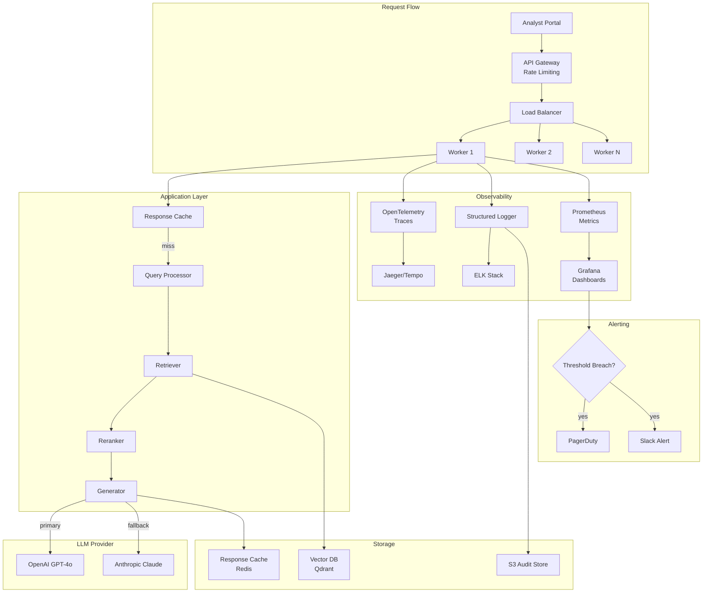

# Chapter 15: LLMOps

> "The distance between a demo and a production system is measured in monitoring dashboards, alert rules, and rollback procedures that you build before— not after— something goes wrong."

---

## Introduction

You have built a RAG system, an agent, or a structured output pipeline. It works in development. The tests pass. The demo impresses stakeholders. But development is not production. In production, the LLM provider has outages. Token costs spike because a new feature sends longer contexts. A prompt change degrades quality for 30% of users. A model update breaks your output schema. A user crafts an adversarial input that causes an infinite loop. Without LLMOps—monitoring, observability, cost tracking, deployment, and incident response—you are flying blind.

LLMOps is the discipline of operating LLM applications reliably, cost-effectively, and safely in production. It extends traditional MLOps with LLM-specific concerns: token-level monitoring, prompt versioning, model provider failover, and non-deterministic output quality tracking. The challenges are unique because LLM applications have failure modes that traditional software does not: hallucinations, prompt injection, token budget overruns, and quality degradation from model updates.

The central thesis of this chapter is the **observability-action loop**: you cannot improve what you cannot see, and you cannot act on what you cannot measure. LLMOps provides the visibility (tracing, logging, metrics) and the control (deployment, rollback, cost caps) to operate LLM applications with confidence.

We will examine the four pillars of LLMOps monitoring: cost, tokens, latency, and errors. We will build observability infrastructure with distributed tracing, structured logging, and real-time dashboards. We will explore deployment strategies including canary deployments, A/B testing, and automatic rollback. We will walk through a full case study: building the operational infrastructure for a production RAG system serving 10,000 requests per day. And we will cover the hard-won lessons of running LLM systems in production—incident response, cost optimization, and the operational patterns that prevent 3 AM pages.

### The LLMOps Stack

| Layer | Tools | Purpose |
|-------|-------|---------|
| **Tracing** | OpenTelemetry, LangSmith, Arize Phoenix | Request-level visibility |
| **Metrics** | Prometheus, Grafana, Datadog | Aggregate performance tracking |
| **Logging** | Structured JSON logs, ELK Stack | Debugging and audit |
| **Alerting** | PagerDuty, OpsGenie, Slack | Incident notification |
| **Deployment** | Docker, Kubernetes, ECS | Container orchestration |
| **CI/CD** | GitHub Actions, GitLab CI | Automated testing and deployment |
| **Cost management** | Custom dashboards, billing APIs | Budget tracking and optimization |
| **Feature flags** | LaunchDarkly, Unleash | Gradual rollout control |

---

## 15.1 Monitoring

### 15.1.1 Cost Monitoring

GenAI costs scale linearly with usage. Without monitoring, bills surprise you. Track cost per model, per user, per team, and per application.

```python
import time
from dataclasses import dataclass
from collections import defaultdict

@dataclass
class CostRecord:
    timestamp: float
    model: str
    input_tokens: int
    output_tokens: int
    cost_usd: float
    user_id: str
    team: str
    endpoint: str

class CostTracker:
    # Pricing per 1M tokens
    PRICING = {
        "gpt-4o": {"input": 2.50, "output": 10.00},
        "gpt-4o-mini": {"input": 0.15, "output": 0.60},
        "claude-sonnet-4-20250514": {"input": 3.00, "output": 15.00},
        "claude-haiku-3.5": {"input": 0.80, "output": 4.00},
    }

    def __init__(self):
        self.records: list[CostRecord] = []
        self.budgets: dict[str, float] = {}
        self.alerts: list[dict] = []

    def record_usage(self, model: str, input_tokens: int, output_tokens: int,
                     user_id: str, team: str, endpoint: str):
        pricing = self.PRICING.get(model, {"input": 0, "output": 0})
        cost = (input_tokens * pricing["input"] + output_tokens * pricing["output"]) / 1_000_000

        record = CostRecord(
            timestamp=time.time(),
            model=model,
            input_tokens=input_tokens,
            output_tokens=output_tokens,
            cost_usd=cost,
            user_id=user_id,
            team=team,
            endpoint=endpoint
        )
        self.records.append(record)

        # Check budgets
        self._check_budgets(team, cost)

        return record

    def set_budget(self, entity: str, daily_limit_usd: float):
        self.budgets[entity] = daily_limit_usd

    def _check_budgets(self, team: str, new_cost: float):
        if team not in self.budgets:
            return

        today_start = time.time() - 86400
        today_cost = sum(
            r.cost_usd for r in self.records
            if r.team == team and r.timestamp > today_start
        ) + new_cost

        budget = self.budgets[team]
        if today_cost > budget * 0.95:
            self.alerts.append({
                "type": "budget_critical",
                "team": team,
                "current": today_cost,
                "budget": budget,
                "timestamp": time.time()
            })
        elif today_cost > budget * 0.80:
            self.alerts.append({
                "type": "budget_warning",
                "team": team,
                "current": today_cost,
                "budget": budget,
                "timestamp": time.time()
            })

    def get_daily_summary(self, team: str = None) -> dict:
        today_start = time.time() - 86400
        today_records = [
            r for r in self.records
            if r.timestamp > today_start and (team is None or r.team == team)
        ]

        by_model = defaultdict(lambda: {"count": 0, "cost": 0, "tokens": 0})
        for r in today_records:
            by_model[r.model]["count"] += 1
            by_model[r.model]["cost"] += r.cost_usd
            by_model[r.model]["tokens"] += r.input_tokens + r.output_tokens

        return {
            "total_requests": len(today_records),
            "total_cost_usd": sum(r.cost_usd for r in today_records),
            "by_model": dict(by_model),
            "avg_cost_per_request": (
                sum(r.cost_usd for r in today_records) / len(today_records)
                if today_records else 0
            )
        }
```

### 15.1.2 Token Monitoring

Track input and output tokens per request. Monitor averages and outliers. Unusual spikes indicate bugs or abuse.

```python
class TokenMonitor:
    def __init__(self):
        self.token_history: list[dict] = []

    def record(self, request_id: str, input_tokens: int, output_tokens: int,
               model: str, endpoint: str):
        self.token_history.append({
            "request_id": request_id,
            "input_tokens": input_tokens,
            "output_tokens": output_tokens,
            "total_tokens": input_tokens + output_tokens,
            "model": model,
            "endpoint": endpoint,
            "timestamp": time.time()
        })

    def detect_anomalies(self, window_minutes: int = 5) -> list[dict]:
        if not self.token_history:
            return []

        cutoff = time.time() - (window_minutes * 60)
        recent = [r for r in self.token_history if r["timestamp"] > cutoff]

        if len(recent) < 10:
            return []

        total_tokens = [r["total_tokens"] for r in recent]
        mean_tokens = sum(total_tokens) / len(total_tokens)
        std_tokens = (sum((t - mean_tokens) ** 2 for t in total_tokens) / len(total_tokens)) ** 0.5

        anomalies = []
        for r in recent:
            if r["total_tokens"] > mean_tokens + 3 * std_tokens:
                anomalies.append({
                    "request_id": r["request_id"],
                    "total_tokens": r["total_tokens"],
                    "mean_tokens": mean_tokens,
                    "std_tokens": std_tokens,
                    "z_score": (r["total_tokens"] - mean_tokens) / std_tokens if std_tokens > 0 else 0
                })

        return anomalies

    def get_token_distribution(self) -> dict:
        if not self.token_history:
            return {}

        tokens = [r["total_tokens"] for r in self.token_history]
        tokens.sort()
        n = len(tokens)

        return {
            "count": n,
            "mean": sum(tokens) / n,
            "min": tokens[0],
            "max": tokens[-1],
            "p50": tokens[n // 2],
            "p95": tokens[int(n * 0.95)],
            "p99": tokens[int(n * 0.99)]
        }
```

### 15.1.3 Latency Monitoring

Track time-to-first-token (TTFT) and total response time. TTFT measures perceived speed; total response time includes full generation.

```python
class LatencyMonitor:
    def __init__(self):
        self.latencies: list[dict] = []

    def record(self, request_id: str, ttft_ms: float, total_ms: float,
               model: str, endpoint: str, tokens_generated: int):
        self.latencies.append({
            "request_id": request_id,
            "ttft_ms": ttft_ms,
            "total_ms": total_ms,
            "tokens_per_second": tokens_generated / (total_ms / 1000) if total_ms > 0 else 0,
            "model": model,
            "endpoint": endpoint,
            "timestamp": time.time()
        })

    def get_latency_distribution(self, endpoint: str = None) -> dict:
        filtered = self.latencies
        if endpoint:
            filtered = [l for l in filtered if l["endpoint"] == endpoint]

        if not filtered:
            return {}

        ttfts = sorted([l["ttft_ms"] for l in filtered])
        totals = sorted([l["total_ms"] for l in filtered])
        n = len(filtered)

        return {
            "count": n,
            "ttft": {
                "mean": sum(ttfts) / n,
                "p50": ttfts[n // 2],
                "p95": ttfts[int(n * 0.95)],
                "p99": ttfts[int(n * 0.99)]
            },
            "total": {
                "mean": sum(totals) / n,
                "p50": totals[n // 2],
                "p95": totals[int(n * 0.95)],
                "p99": totals[int(n * 0.99)]
            }
        }

    def detect_slow_requests(self, threshold_ms: float = 5000) -> list[dict]:
        return [
            l for l in self.latencies
            if l["total_ms"] > threshold_ms
        ]
```

### 15.1.4 Error Monitoring

Track error rates by type: rate limits, authentication failures, model overloaded, timeout, and validation errors.

```python
from enum import Enum

class ErrorType(str, Enum):
    RATE_LIMIT = "rate_limit"
    AUTH_FAILURE = "auth_failure"
    MODEL_OVERLOADED = "model_overloaded"
    TIMEOUT = "timeout"
    VALIDATION_ERROR = "validation_error"
    CONTEXT_TOO_LONG = "context_too_long"
    UNKNOWN = "unknown"

class ErrorMonitor:
    def __init__(self):
        self.errors: list[dict] = []

    def record_error(self, error_type: ErrorType, message: str,
                     model: str, endpoint: str, request_id: str = None):
        self.errors.append({
            "error_type": error_type,
            "message": message,
            "model": model,
            "endpoint": endpoint,
            "request_id": request_id,
            "timestamp": time.time()
        })

    def get_error_rates(self, window_minutes: int = 60) -> dict:
        cutoff = time.time() - (window_minutes * 60)
        recent = [e for e in self.errors if e["timestamp"] > cutoff]

        by_type = {}
        for e in recent:
            error_type = e["error_type"]
            if error_type not in by_type:
                by_type[error_type] = 0
            by_type[error_type] += 1

        return {
            "total_errors": len(recent),
            "by_type": by_type,
            "error_rate": len(recent) / max(window_minutes * 10, 1)  # Per 10 requests
        }

    def should_alert(self) -> list[dict]:
        rates = self.get_error_rates(window_minutes=5)
        alerts = []

        if rates["by_type"].get(ErrorType.RATE_LIMIT, 0) > 10:
            alerts.append({
                "type": "rate_limit_high",
                "count": rates["by_type"][ErrorType.RATE_LIMIT],
                "action": "Implement queuing or upgrade tier"
            })

        if rates["by_type"].get(ErrorType.MODEL_OVERLOADED, 0) > 5:
            alerts.append({
                "type": "model_overloaded",
                "count": rates["by_type"][ErrorType.MODEL_OVERLOADED],
                "action": "Enable model fallback or reduce traffic"
            })

        if rates["total_errors"] > 50:
            alerts.append({
                "type": "high_error_rate",
                "count": rates["total_errors"],
                "action": "Investigate systemic issues"
            })

        return alerts
```

### 15.1.5 Monitoring Summary

| Metric | What It Catches | Alert Threshold | Tool |
|--------|----------------|-----------------|------|
| Cost per request | Budget overruns | >2x baseline | Custom dashboard |
| Daily cost total | Budget exhaustion | >80% of budget | Billing API |
| Token usage per request | Infinite loops, context bloat | >3x p95 baseline | Custom monitor |
| TTFT | Provider latency degradation | >2x baseline | APM tool |
| Total latency | Slow generation | >SLA threshold | APM tool |
| Error rate | System failures | >5% error rate | Error tracker |
| Rate limit errors | Capacity issues | >10/hour | Error tracker |

---

## 15.2 Observability

### 15.2.1 Distributed Tracing

Trace requests across your entire system—from API gateway through retrieval, reranking, LLM generation, and response. OpenTelemetry is the standard.

```python
from opentelemetry import trace
from opentelemetry.sdk.trace import TracerProvider
from opentelemetry.sdk.trace.export import BatchSpanExporter
from opentelemetry.exporter.otlp.proto.grpc.trace_exporter import OTLPSpanExporter

# Configure tracing
provider = TracerProvider()
exporter = OTLPSpanExporter(endpoint="http://localhost:4317")
provider.add_span_processor(BatchSpanExporter(exporter))
trace.set_tracer_provider(provider)

tracer = trace.get_tracer("rag-pipeline")

class TracedRAGPipeline:
    def __init__(self, retriever, reranker, generator):
        self.retriever = retriever
        self.reranker = reranker
        self.generator = generator

    def query(self, question: str) -> dict:
        with tracer.start_as_current_span("rag_query") as span:
            span.set_attribute("question", question)

            # Retrieval phase
            with tracer.start_as_current_span("retrieval") as retrieval_span:
                docs = self.retriever.retrieve(question)
                retrieval_span.set_attribute("docs_retrieved", len(docs))
                retrieval_span.set_attribute("retrieval_method", "semantic_search")

            # Reranking phase
            with tracer.start_as_current_span("reranking") as rerank_span:
                reranked = self.reranker.rerank(question, docs)
                rerank_span.set_attribute("docs_reranked", len(reranked))

            # Generation phase
            with tracer.start_as_current_span("generation") as gen_span:
                response = self.generator.generate(question, reranked)
                gen_span.set_attribute("model", response["model"])
                gen_span.set_attribute("input_tokens", response["input_tokens"])
                gen_span.set_attribute("output_tokens", response["output_tokens"])

            span.set_attribute("total_latency_ms", response["latency_ms"])

            return {
                "answer": response["answer"],
                "sources": [d["source"] for d in reranked[:3]],
                "tracing_id": span.context.trace_id
            }
```

### 15.2.2 Structured Logging

Log every request with consistent fields for debugging and analysis:

```python
import json
import logging
from datetime import datetime

class StructuredLogger:
    def __init__(self, service_name: str):
        self.logger = logging.getLogger(service_name)
        self.logger.setLevel(logging.INFO)
        handler = logging.StreamHandler()
        handler.setFormatter(logging.Formatter('%(message)s'))
        self.logger.addHandler(handler)

    def log_request(self, request_id: str, user_id: str, endpoint: str,
                    model: str, input_tokens: int, output_tokens: int,
                    latency_ms: float, cost_usd: float, status: str,
                    quality_score: float = None, error: str = None):
        log_entry = {
            "timestamp": datetime.utcnow().isoformat(),
            "request_id": request_id,
            "user_id": user_id,
            "endpoint": endpoint,
            "model": model,
            "input_tokens": input_tokens,
            "output_tokens": output_tokens,
            "total_tokens": input_tokens + output_tokens,
            "latency_ms": latency_ms,
            "cost_usd": cost_usd,
            "status": status,
            "quality_score": quality_score,
            "error": error,
            "service": "rag-pipeline"
        }
        self.logger.info(json.dumps(log_entry))

    def log_event(self, event_type: str, details: dict):
        self.logger.info(json.dumps({
            "timestamp": datetime.utcnow().isoformat(),
            "event_type": event_type,
            "details": details
        }))
```

### 15.2.3 Dashboard Metrics

Key metrics to dashboard:

| Dashboard | Metrics | Refresh Rate |
|-----------|---------|-------------|
| **Cost Overview** | Daily cost, cost per model, cost per team, budget usage | 5 minutes |
| **Performance** | TTFT p50/p95/p99, total latency p50/p95/p99, throughput | 1 minute |
| **Quality** | Faithfulness score, relevance score, hallucination rate | 1 hour |
| **Errors** | Error rate by type, rate limit frequency, timeout rate | 1 minute |
| **Token Usage** | Input/output tokens per request, token distribution | 5 minutes |
| **User Activity** | Requests per user, top endpoints, peak hours | 15 minutes |

---

## 15.3 Deployment

### 15.3.1 Container Deployment

```dockerfile
FROM python:3.12-slim

WORKDIR /app

COPY requirements.txt .
RUN pip install --no-cache-dir -r requirements.txt

COPY src/ ./src/

HEALTHCHECK --interval=30s --timeout=10s --retries=3 \
    CMD curl -f http://localhost:8000/health || exit 1

EXPOSE 8000

CMD ["uvicorn", "src.main:app", "--host", "0.0.0.0", "--port", "8000"]
```

```python
from fastapi import FastAPI
import openai

app = FastAPI()

@app.get("/health")
async def health():
    checks = {
        "llm_connectivity": await check_llm(),
        "vector_db": await check_vector_db(),
        "redis": await check_redis()
    }
    healthy = all(checks.values())
    return {"status": "healthy" if healthy else "unhealthy", "checks": checks}

async def check_llm() -> bool:
    try:
        client = openai.OpenAI()
        client.chat.completions.create(
            model="gpt-4o-mini",
            messages=[{"role": "user", "content": "ping"}],
            max_tokens=5
        )
        return True
    except Exception:
        return False
```

### 15.3.2 Prompt and Model Versioning

Version your prompts, models, and configurations separately. A prompt change can affect quality as much as a model change.

```python
from dataclasses import dataclass
from typing import Optional

@dataclass
class PromptVersion:
    version: str
    system_prompt: str
    user_template: str
    model: str
    temperature: float = 0.7
    max_tokens: int = 1000

class PromptManager:
    def __init__(self):
        self.prompts: dict[str, PromptVersion] = {}
        self.active_version: Optional[str] = None

    def register(self, version: PromptVersion):
        self.prompts[version.version] = version

    def set_active(self, version: str):
        if version not in self.prompts:
            raise ValueError(f"Unknown prompt version: {version}")
        self.active_version = version

    def get_active(self) -> PromptVersion:
        if not self.active_version:
            raise RuntimeError("No active prompt version set")
        return self.prompts[self.active_version]

    def get_for_version(self, version: str) -> PromptVersion:
        return self.prompts[version]

# Usage
manager = PromptManager()
manager.register(PromptVersion(
    version="2.1",
    system_prompt="You are a financial analyst. Answer based on the provided context.",
    user_template="Context: {context}\n\nQuestion: {question}\n\nAnswer:",
    model="gpt-4o",
    temperature=0.3
))
manager.register(PromptVersion(
    version="2.2",
    system_prompt="You are a financial analyst. Cite sources. Be concise.",
    user_template="Context: {context}\n\nQuestion: {question}\n\nCited answer:",
    model="gpt-4o",
    temperature=0.3
))
manager.set_active("2.2")
```

### 15.3.3 Canary Deployments

Gradually shift traffic to new versions. Start with 10%, monitor for 5 minutes, increase to 50%, then 100%.

```python
class CanaryDeployer:
    def __init__(self):
        self.versions = {}
        self.traffic_split = {}

    def register_version(self, version: str, pipeline):
        self.versions[version] = pipeline

    def deploy_canary(self, canary_version: str, initial_traffic: float = 0.1):
        self.traffic_split[canary_version] = initial_traffic
        stable_version = [v for v in self.versions if v != canary_version][0]
        self.traffic_split[stable_version] = 1.0 - initial_traffic

    def route_request(self) -> str:
        import random
        rand = random.random()
        cumulative = 0
        for version, traffic in self.traffic_split.items():
            cumulative += traffic
            if rand <= cumulative:
                return version
        return list(self.versions.keys())[0]

    def promote_canary(self, canary_version: str):
        self.traffic_split = {canary_version: 1.0}

    def rollback_canary(self, canary_version: str):
        stable_version = [v for v in self.versions if v != canary_version][0]
        self.traffic_split = {stable_version: 1.0}

    def check_canary_health(self, canary_version: str,
                            metrics: dict) -> dict:
        alerts = []
        if metrics.get("error_rate", 0) > 0.05:
            alerts.append(f"High error rate: {metrics['error_rate']:.1%}")
        if metrics.get("latency_p95", 0) > 5000:
            alerts.append(f"High latency: {metrics['latency_p95']}ms")
        if metrics.get("quality_score", 1.0) < 0.7:
            alerts.append(f"Low quality: {metrics['quality_score']:.2f}")

        return {
            "healthy": len(alerts) == 0,
            "alerts": alerts,
            "recommendation": "promote" if len(alerts) == 0 else "rollback"
        }
```

---

## 15.4 Cost Optimization

### 15.4.1 Caching Strategies

```python
import hashlib
import redis
import json

class ResponseCache:
    def __init__(self, redis_url: str = "redis://localhost:6379",
                 ttl_seconds: int = 3600):
        self.redis = redis.from_url(redis_url)
        self.ttl = ttl_seconds
        self.hit_count = 0
        self.miss_count = 0

    def _cache_key(self, prompt: str, model: str, params: dict) -> str:
        content = f"{model}:{prompt}:{json.dumps(params, sort_keys=True)}"
        return f"llm_cache:{hashlib.sha256(content.encode()).hexdigest()}"

    def get(self, prompt: str, model: str, params: dict) -> str | None:
        key = self._cache_key(prompt, model, params)
        cached = self.redis.get(key)
        if cached:
            self.hit_count += 1
            return cached.decode()
        self.miss_count += 1
        return None

    def set(self, prompt: str, model: str, params: dict, response: str):
        key = self._cache_key(prompt, model, params)
        self.redis.setex(key, self.ttl, response)

    def hit_rate(self) -> float:
        total = self.hit_count + self.miss_count
        return self.hit_count / total if total > 0 else 0.0

class SemanticCache:
    """Cache based on semantic similarity, not exact match."""
    def __init__(self, vector_store, similarity_threshold: float = 0.95):
        self.vector_store = vector_store
        self.threshold = similarity_threshold

    def get_similar(self, query: str) -> str | None:
        results = self.vector_store.search(query, top_k=1)
        if results and results[0]["score"] > self.threshold:
            return results[0]["response"]
        return None

    def store(self, query: str, response: str):
        self.vector_store.upsert(query, {"response": response})
```

### 15.4.2 Token Optimization

```python
class TokenOptimizer:
    def __init__(self):
        self压缩_strategies = [
            self._remove_redundancy,
            self._summarize_context,
            self._truncate_old_messages
        ]

    def optimize_context(self, messages: list[dict],
                         max_tokens: int = 4000) -> list[dict]:
        optimized = messages.copy()

        for strategy in self压缩_strategies:
            optimized = strategy(optimized)
            if self._estimate_tokens(optimized) <= max_tokens:
                break

        return optimized

    def _remove_redundancy(self, messages: list[dict]) -> list[dict]:
        seen = set()
        unique = []
        for msg in messages:
            content = msg["content"]
            if content not in seen:
                seen.add(content)
                unique.append(msg)
        return unique

    def _summarize_context(self, messages: list[dict]) -> list[dict]:
        if len(messages) <= 3:
            return messages
        # Keep first and last message, summarize middle
        return [messages[0]] + messages[-2:]

    def _truncate_old_messages(self, messages: list[dict]) -> list[dict]:
        return messages[-10:]  # Keep last 10 messages

    def _estimate_tokens(self, messages: list[dict]) -> int:
        return sum(len(m["content"].split()) * 1.3 for m in messages)
```

---

## 15.5 Case Study: Production RAG System

### 15.5.1 Problem Statement

A financial research firm operates a RAG system serving 10,000 requests/day from 200 analysts. The system queries SEC filings, earnings reports, and market data. Current issues: no visibility into quality, cost overruns from long-context queries, occasional hallucinations in financial data, and no rollback capability for prompt changes.

**Requirements:**
- Full observability (tracing, metrics, logging)
- Cost per request under $0.05
- Quality regression detection within 1 hour
- Canary deployment for prompt changes
- Automatic rollback on quality degradation

### 15.5.2 Architecture



### 15.5.3 Implementation

```python
class ProductionRAGSystem:
    def __init__(self):
        self.cache = ResponseCache(redis_url="redis://localhost:6379")
        self.retriever = QdrantRetriever(collection="sec_filings")
        self.reranker = CrossEncoderReranker()
        self.generator = LLMGenerator(model="gpt-4o")
        self.fallback_generator = LLMGenerator(model="claude-sonnet-4-20250514")

        self.cost_tracker = CostTracker()
        self.token_monitor = TokenMonitor()
        self.latency_monitor = LatencyMonitor()
        self.error_monitor = ErrorMonitor()
        self.logger = StructuredLogger("rag-system")

        self.prompt_manager = PromptManager()
        self.canary = CanaryDeployer()

    async def query(self, question: str, user_id: str,
                    team: str) -> dict:
        request_id = str(uuid.uuid4())
        start_time = time.time()

        try:
            # Check cache
            cached = self.cache.get(question, "gpt-4o", {})
            if cached:
                return {"answer": cached, "source": "cache", "request_id": request_id}

            # Retrieve and rerank
            docs = await self.retriever.retrieve(question, top_k=10)
            reranked = self.reranker.rerank(question, docs)

            # Generate with fallback
            try:
                response = await self.generator.generate(
                    question, reranked,
                    system_prompt=self.prompt_manager.get_active().system_prompt
                )
            except Exception as e:
                self.error_monitor.record_error(ErrorType.MODEL_OVERLOADED, str(e), "gpt-4o", "query")
                response = await self.fallback_generator.generate(
                    question, reranked,
                    system_prompt=self.prompt_manager.get_active().system_prompt
                )

            # Record metrics
            latency_ms = (time.time() - start_time) * 1000
            self.cost_tracker.record_usage(
                "gpt-4o", response["input_tokens"], response["output_tokens"],
                user_id, team, "query"
            )
            self.token_monitor.record(request_id, response["input_tokens"],
                                       response["output_tokens"], "gpt-4o", "query")
            self.latency_monitor.record(request_id, response.get("ttft_ms", 0),
                                         latency_ms, "gpt-4o", "query",
                                         response["output_tokens"])

            # Cache response
            self.cache.set(question, "gpt-4o", {}, response["answer"])

            # Log request
            self.logger.log_request(
                request_id, user_id, "query", "gpt-4o",
                response["input_tokens"], response["output_tokens"],
                latency_ms, response["cost_usd"], "success"
            )

            return {
                "answer": response["answer"],
                "sources": [d["source"] for d in reranked[:3]],
                "request_id": request_id,
                "latency_ms": latency_ms,
                "model": "gpt-4o"
            }

        except Exception as e:
            latency_ms = (time.time() - start_time) * 1000
            self.error_monitor.record_error(ErrorType.UNKNOWN, str(e), "gpt-4o", "query", request_id)
            self.logger.log_request(
                request_id, user_id, "query", "gpt-4o",
                0, 0, latency_ms, 0, "error", error=str(e)
            )
            raise
```

### 15.5.4 Cost Calculations

**Monthly volume**: 10,000 requests/day × 30 days = 300,000 requests/month

| Component | Per-Request Cost | Monthly Cost | Notes |
|-----------|-----------------|-------------|-------|
| LLM (GPT-4o) | $0.025 | $7,500 | ~3K input, ~1K output |
| LLM fallback (5%) | $0.030 | $450 | Claude Sonnet for fallbacks |
| Cache (Redis) | $0.00001 | $3 | Sub-ms operations |
| Vector DB (Qdrant) | $0.001 | $300 | Semantic search |
| Observability | $0.002 | $600 | Tracing, logging, metrics |
| **Total per request** | **$0.028** | | |
| **Total monthly** | | **$8,853** | |

**Cost optimization impact:**

| Optimization | Before | After | Savings |
|-------------|--------|-------|---------|
| Response caching (30% hit rate) | $7,500 | $5,250 | $2,250/month |
| Token optimization (20% reduction) | $5,250 | $4,200 | $1,050/month |
| Model routing (simple → mini) | $4,200 | $3,360 | $840/month |
| **Total optimized** | **$7,500** | **$3,360** | **$4,140/month (55%)** |

---

## 15.6 Incident Response

### 15.6.1 Incident Playbooks

```python
class IncidentPlaybook:
    def __init__(self, monitors: dict):
        self.monitors = monitors
        self.playbooks = {
            "high_latency": self._handle_high_latency,
            "high_error_rate": self._handle_high_error_rate,
            "cost_overrun": self._handle_cost_overrun,
            "quality_degradation": self._handle_quality_degradation
        }

    def handle(self, incident_type: str, details: dict):
        handler = self.playbooks.get(incident_type)
        if handler:
            return handler(details)
        return {"action": "unknown_incident", "details": details}

    def _handle_high_latency(self, details: dict) -> dict:
        steps = [
            "1. Check LLM provider status page",
            "2. Check if latency is from retrieval or generation",
            "3. If retrieval: check vector DB health and index size",
            "4. If generation: check model load and consider fallback",
            "5. Enable response caching if not already active",
            "6. Consider reducing context window size"
        ]
        return {"steps": steps, "escalation": "engineering-oncall"}

    def _handle_high_error_rate(self, details: dict) -> dict:
        steps = [
            "1. Check error types: rate limits vs. validation vs. timeout",
            "2. If rate limits: implement queuing or upgrade tier",
            "3. If validation: check for schema changes in LLM output",
            "4. If timeout: increase timeout or reduce context size",
            "5. Enable model fallback if not active",
            "6. Check for adversarial inputs causing failures"
        ]
        return {"steps": steps, "escalation": "engineering-oncall"}

    def _handle_cost_overrun(self, details: dict) -> dict:
        steps = [
            "1. Identify top cost drivers by model, user, and endpoint",
            "2. Check for token anomalies: unusual context lengths",
            "3. Enable aggressive caching",
            "4. Route simple queries to cheaper models",
            "5. Set per-user token limits",
            "6. Review and optimize prompts for token efficiency"
        ]
        return {"steps": steps, "escalation": "finance + engineering"}

    def _handle_quality_degradation(self, details: dict) -> dict:
        steps = [
            "1. Check if model provider made changes",
            "2. Review recent prompt or configuration changes",
            "3. Run evaluation pipeline on golden dataset",
            "4. If regression found: rollback to previous version",
            "5. If no regression: expand evaluation dataset",
            "6. Consider human review for affected query types"
        ]
        return {"steps": steps, "escalation": "ml-engineering"}
```

---

## 15.7 Testing LLMOps

### 15.7.1 Unit Testing Operational Components

```python
import pytest

def test_cost_tracker_records_usage():
    tracker = CostTracker()
    record = tracker.record_usage("gpt-4o", 1000, 500, "user-1", "team-a", "query")
    assert record.cost_usd > 0

def test_budget_alert_triggers():
    tracker = CostTracker()
    tracker.set_budget("team-a", 100.0)
    # Simulate exceeding budget
    for _ in range(1000):
        tracker.record_usage("gpt-4o", 10000, 5000, "user-1", "team-a", "query")
    assert len(tracker.alerts) > 0

def test_token_anomaly_detection():
    monitor = TokenMonitor()
    # Normal requests
    for i in range(20):
        monitor.record(f"req-{i}", 1000, 500, "gpt-4o", "query")
    # Anomalous request
    monitor.record("req-anomaly", 100000, 50000, "gpt-4o", "query")
    anomalies = monitor.detect_anomalies()
    assert len(anomalies) > 0

def test_canary_deployment_routing():
    deployer = CanaryDeployer()
    deployer.register_version("v1", "pipeline_v1")
    deployer.register_version("v2", "pipeline_v2")
    deployer.deploy_canary("v2", 0.1)

    routes = [deployer.route_request() for _ in range(1000)]
    v2_count = routes.count("v2")
    assert 50 < v2_count < 150  # ~10% ± tolerance
```

### 15.7.2 Integration Testing

```python
def test_full_request_flow():
    system = ProductionRAGSystem()
    result = asyncio.run(system.query(
        "What was the Q4 revenue?",
        user_id="analyst-1",
        team="research"
    ))
    assert "answer" in result
    assert result["latency_ms"] < 5000

def test_fallback_on_provider_failure():
    system = ProductionRAGSystem()
    with patch.object(system.generator, 'generate', side_effect=Exception("API down")):
        result = asyncio.run(system.query("Test", "user-1", "team-a"))
        assert result["model"] == "claude-sonnet-4-20250514"

def test_cache_hit():
    system = ProductionRAGSystem()
    # First request
    result1 = asyncio.run(system.query("What is revenue?", "user-1", "team-a"))
    # Second request (should be cached)
    result2 = asyncio.run(system.query("What is revenue?", "user-1", "team-a"))
    assert result2.get("source") == "cache"
```

### 15.7.3 Operational Metrics

| Metric | Target | Measurement |
|--------|--------|-------------|
| System availability | >99.9% | Uptime monitoring |
| Mean time to recovery | <15 minutes | Incident tracking |
| Deployment frequency | >1 per week | CI/CD metrics |
| Rollback rate | <5% of deployments | Deployment tracking |
| Cost per request | <$0.05 | Cost tracker |
| Cache hit rate | >30% | Cache metrics |
| Error rate | <1% | Error monitor |

---

## 15.8 Key Takeaways

1. **Cost monitoring is mandatory—GenAI costs scale linearly and can surprise you.** Track cost per model, per user, per team, and per endpoint. Set budget alerts at 80% and 95% thresholds. The most common surprise is token consumption from long-context applications—a few requests with 100K+ tokens can dominate the daily bill.

2. **Tracing with OpenTelemetry gives visibility across your entire stack.** Trace requests from API gateway through retrieval, reranking, and generation. When retrieval takes 2 seconds and generation takes 1 second, optimizing generation only saves 1 second—optimizing retrieval saves 2 seconds. Tracing reveals where to focus.

3. **Canary deployments with automatic rollback prevent bad deployments from affecting all users.** Start with 10% traffic, monitor for 5 minutes, increase to 50%, then 100%. If error rate exceeds threshold or quality drops, automatically rollback. The deterministic state machine makes rollback trivial.

4. **Version your prompts and models—you need to know which version produced which output.** A prompt change can affect quality as much as a model change. Track which version produced which output for debugging and reproducibility. Maintain prompt changelogs alongside code changelogs.

5. **Token monitoring catches unusual patterns—spikes may indicate bugs or abuse.** Infinite loops, context that grows without bound, and adversarial inputs can all cause token overruns. Set anomaly detection thresholds at 3x the p95 baseline. Investigate every anomaly.

6. **Caching is the highest-ROI cost optimization.** Response caching (exact match) and semantic caching (similarity match) can reduce LLM costs by 30-50%. The hit rate depends on query diversity—financial research queries have higher hit rates than open-ended creative queries.

7. **Health checks must verify LLM connectivity, not just process liveness.** A process can be running but unable to reach the LLM provider. Health checks should make a small LLM call (gpt-4o-mini, 5 tokens) to verify end-to-end connectivity. Fail health checks if the LLM is unreachable.

8. **Incident playbooks prevent panic.** When the system breaks at 3 AM, you do not want to be thinking about what to do. Document step-by-step playbooks for each failure mode: high latency, high error rate, cost overrun, quality degradation. Include escalation paths and rollback procedures.

9. **Structured logging enables debugging at scale.** Log every request with consistent fields: request ID, user ID, model, tokens, latency, cost, status, quality score. Structured logs enable filtering, aggregation, and analysis. Without structured logs, debugging production issues is guesswork.

10. **Build operational infrastructure before you need it.** Monitoring, tracing, alerting, and deployment pipelines take weeks to build properly. Build them during development, not after your first production incident. The investment in operational infrastructure pays for itself the first time it prevents a prolonged outage.

---

## 15.9 Further Reading

- **OpenTelemetry Documentation** (opentelemetry.io) — Official guide for distributed tracing, metrics, and logging. The standard for observability in production systems.

- **LangSmith Documentation** (docs.smith.langchain.com) — Observability and evaluation platform for LangChain applications with tracing, datasets, and monitoring.

- **Arize Phoenix Documentation** (docs.phoenix.arize.com) — LLM observability platform with tracing, evaluation, and performance analytics.

- **Prometheus Documentation** (prometheus.io) — Metrics collection and alerting system. The standard for time-series monitoring in cloud-native applications.

- **Grafana Documentation** (grafana.com) — Visualization and dashboarding for metrics from Prometheus and other sources.

- **"Site Reliability Engineering" by Google** — The foundational text on operating large-scale systems. Chapters on monitoring, alerting, incident response, and capacity planning apply directly to LLMOps.

- **"The Site Reliability Workbook" by Google** — Practical guidance on implementing SRE practices, including SLIs, SLOs, and error budgets.

- **"Building Microservices" by Sam Newman** — Chapters on deployment, testing, and monitoring microservices apply to deploying LLM applications as services.

- **"Designing Data-Intensive Applications" by Martin Kleppmann** — Chapters on replication, partitioning, and transactions provide the foundation for understanding distributed system reliability.

- **"Incident Management for Operations" by Rob Schnepp et al.** — Practical guide to incident response, including playbooks, communication, and post-mortem processes.

- **"Cloud Native DevOps with Kubernetes" by Justin Domingus and John Arundel** — Chapters on deployment, monitoring, and alerting for cloud-native applications.

- **AWS Well-Architected Framework** (aws.amazon.com/architecture/well-architected) — Framework for building reliable, secure, efficient, and cost-effective systems in the cloud.

- **"The Art of Capacity Planning" by John Allspaw** — Chapters on capacity planning and performance monitoring apply to predicting and managing LLM usage growth.
