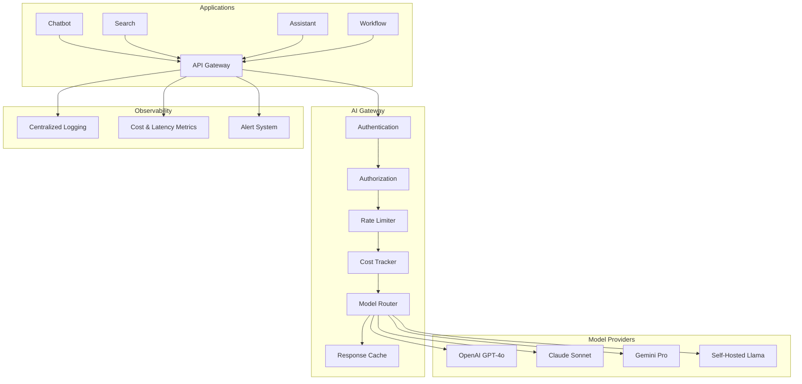
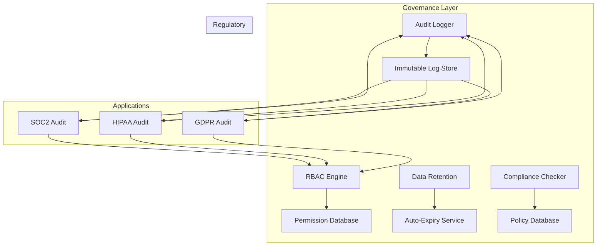
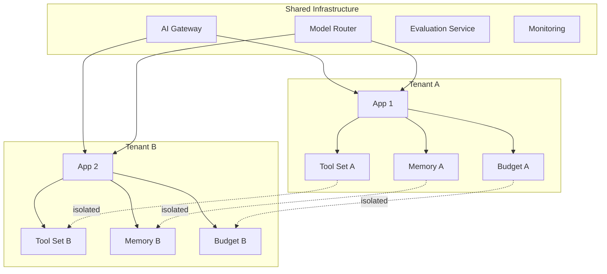
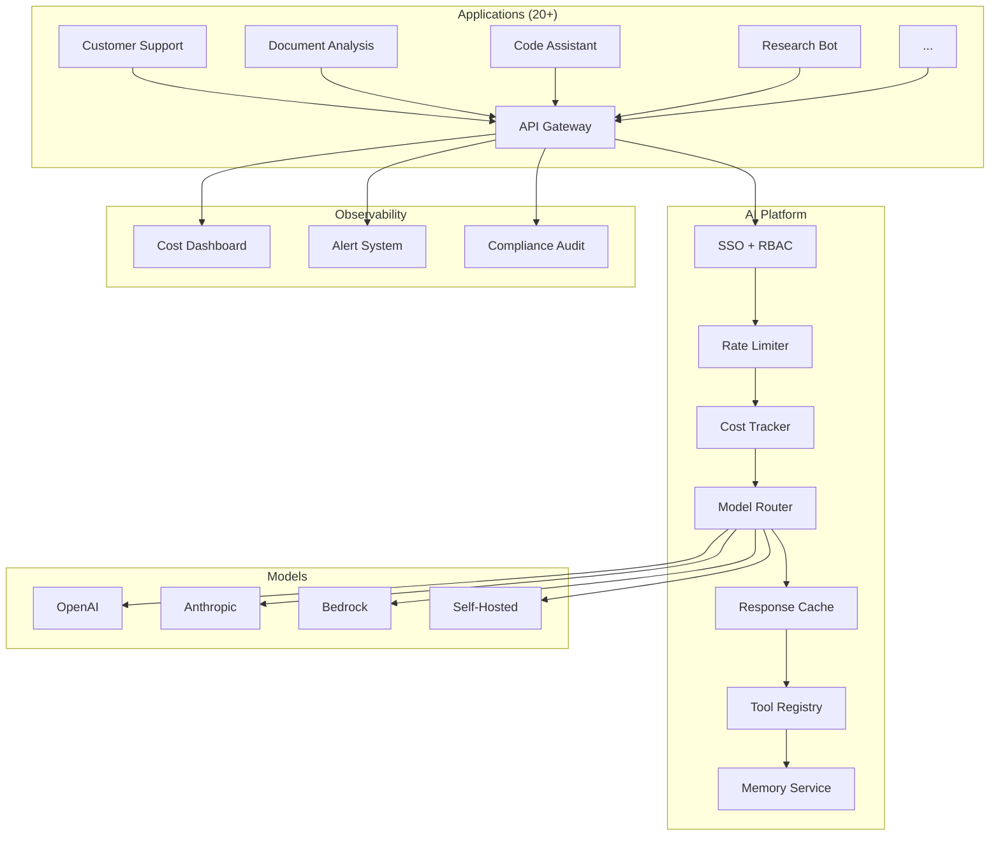

# Chapter 17: Enterprise GenAI Architecture

> "The goal of enterprise architecture is not to build the most sophisticated system, but to build the simplest system that serves every use case, enforces every policy, and scales to every user — without asking anyone to write infrastructure code."

---

## Introduction

Enterprise GenAI is not about building a chatbot. It is about building a platform that serves hundreds of use cases, enforces governance, manages costs, and scales to thousands of users — while remaining auditable, secure, and maintainable. The difference between a prototype and a platform is the difference between a script and a system: one works for one person; the other works for everyone.

The central thesis of this chapter is the **platform pattern**: centralize cross-cutting concerns (authentication, routing, cost tracking, governance) in a shared infrastructure layer, and let individual applications focus on their unique business logic. This pattern eliminates duplication, enforces consistency, and reduces the time-to-deploy for new AI applications from months to weeks.

The challenge is real. Before a platform, each application manages its own LLM integration — different providers, different authentication, no shared infrastructure. The result is chaos: inconsistent security, uncontrolled costs, no unified monitoring, and every team reinventing the same wheels. A Fortune 500 company found that 40% of their AI engineering time was spent on infrastructure concerns, not business logic. The platform pattern reclaims that time.

We will examine the AI Gateway pattern, model routing for cost optimization, shared platform services, governance and compliance architecture, cost control mechanisms, multi-tenancy, and a full case study of an enterprise AI platform deployment with cost analysis and migration strategy.

### The Enterprise AI Stack

Before diving into specific components, it is useful to understand the layers of an enterprise AI platform:

| Layer | Purpose | Components |
|-------|---------|------------|
| **Application Layer** | Business logic, user interface | Chatbots, search, assistants, workflows |
| **Orchestration Layer** | Chain/agent execution, state management | LangChain, LlamaIndex, custom orchestrators |
| **Platform Layer** | Shared services, governance, routing | AI Gateway, model router, tool registry |
| **Model Layer** | LLM inference, embedding, fine-tuning | OpenAI, Anthropic, Bedrock, self-hosted |
| **Infrastructure Layer** | Compute, storage, networking | Kubernetes, serverless, databases, vector stores |

Most teams focus on the Application and Model layers. The Platform layer is where enterprise value is created — and where most teams under-invest.

### Chapter Roadmap

We will examine:

1. **AI Gateway architecture** — the central entry point for all LLM requests
2. **Model routing** — intelligent selection of models based on task, cost, and latency
3. **Shared platform services** — tool registry, memory service, evaluation, monitoring
4. **Governance and compliance** — audit logging, RBAC, data retention, regulatory compliance
5. **Cost control** — budgets, alerts, optimization strategies
6. **Multi-tenancy** — isolation, resource allocation, tenant-aware routing
7. **Full case study** — Fortune 500 AI platform deployment with architecture, cost analysis, and migration strategy
8. **Testing** — platform-level testing and validation

---

## 17.1 The AI Gateway

### 17.1.1 Why a Gateway

The AI Gateway is the central entry point for all LLM requests. It handles authentication (who is making the request), authorization (what they can do), rate limiting (how many requests they can make), cost tracking (how much they are spending), and model routing (which model handles the request).

Without a gateway, each application implements its own authentication, rate limiting, and cost tracking — leading to inconsistency, security gaps, and duplicated effort. The gateway pattern centralizes these cross-cutting concerns.



### 17.1.2 Gateway Implementation

```python
from fastapi import FastAPI, Depends, HTTPException, Request
from pydantic import BaseModel
import time
import hashlib

app = FastAPI()

class LLMRequest(BaseModel):
    prompt: str
    model_preference: str | None = None
    max_tokens: int = 1000
    temperature: float = 0.7
    application_id: str
    user_id: str

class LLMResponse(BaseModel):
    response: str
    model_used: str
    tokens_input: int
    tokens_output: int
    cost_usd: float
    latency_ms: float
    cached: bool

class AIGateway:
    def __init__(self):
        self.auth_service = AuthService()
        self.rate_limiter = RateLimiter()
        self.cost_tracker = CostTracker()
        self.model_router = ModelRouter()
        self.cache = ResponseCache()
        self.audit_logger = AuditLogger()

    async def process_request(self, request: LLMRequest, auth_token: str) -> LLMResponse:
        start_time = time.time()

        # Step 1: Authenticate
        identity = await self.auth_service.authenticate(auth_token)
        if not identity:
            raise HTTPException(status_code=401, detail="Invalid authentication")

        # Step 2: Authorize
        authorized = await self.auth_service.authorize(
            identity, request.application_id, "llm:invoke"
        )
        if not authorized:
            raise HTTPException(status_code=403, detail="Unauthorized")

        # Step 3: Rate limit
        rate_check = self.rate_limiter.check(
            user_id=identity.user_id,
            application_id=request.application_id,
        )
        if not rate_check["allowed"]:
            raise HTTPException(
                status_code=429,
                detail=f"Rate limit exceeded. Retry after {rate_check['retry_after']}s"
            )

        # Step 4: Cost budget check
        budget = self.cost_tracker.check_budget(
            user_id=identity.user_id,
            application_id=request.application_id,
        )
        if not budget["allowed"]:
            raise HTTPException(
                status_code=402,
                detail=f"Budget exceeded. Remaining: ${budget['remaining']:.2f}"
            )

        # Step 5: Check cache
        cache_key = self._cache_key(request)
        cached = await self.cache.get(cache_key)
        if cached:
            return LLMResponse(
                response=cached["response"],
                model_used=cached["model"],
                tokens_input=0,
                tokens_output=0,
                cost_usd=0.0,
                latency_ms=(time.time() - start_time) * 1000,
                cached=True,
            )

        # Step 6: Route to model
        model = self.model_router.select(
            task_type=self._classify_task(request.prompt),
            preference=request.model_preference,
            latency_budget_ms=5000,
            cost_budget_usd=budget["per_request_limit"],
        )

        # Step 7: Call model
        result = await model.invoke(
            prompt=request.prompt,
            max_tokens=request.max_tokens,
            temperature=request.temperature,
        )

        # Step 8: Track cost
        self.cost_tracker.record(
            user_id=identity.user_id,
            application_id=request.application_id,
            model=model.name,
            tokens_input=result.tokens_input,
            tokens_output=result.tokens_output,
            cost=result.cost,
        )

        # Step 9: Cache response
        await self.cache.set(cache_key, {
            "response": result.text,
            "model": model.name,
        }, ttl=3600)

        # Step 10: Audit log
        await self.audit_logger.log({
            "timestamp": time.time(),
            "user_id": identity.user_id,
            "application_id": request.application_id,
            "model": model.name,
            "tokens": result.tokens_input + result.tokens_output,
            "cost": result.cost,
            "latency_ms": (time.time() - start_time) * 1000,
        })

        return LLMResponse(
            response=result.text,
            model_used=model.name,
            tokens_input=result.tokens_input,
            tokens_output=result.tokens_output,
            cost_usd=result.cost,
            latency_ms=(time.time() - start_time) * 1000,
            cached=False,
        )

    def _cache_key(self, request: LLMRequest) -> str:
        content = f"{request.prompt}:{request.max_tokens}:{request.temperature}"
        return hashlib.sha256(content.encode()).hexdigest()

    def _classify_task(self, prompt: str) -> str:
        # Simple task classification for routing
        if len(prompt) < 100:
            return "simple_qa"
        if "analyze" in prompt.lower() or "reason" in prompt.lower():
            return "complex_reasoning"
        if "code" in prompt.lower() or "program" in prompt.lower():
            return "code_generation"
        return "general"
```

### 17.1.3 Gateway Latency Budget

The gateway adds latency to every request. The overhead must be minimal:

| Gateway Step | Latency (p50) | Latency (p99) |
|-------------|---------------|---------------|
| Authentication | 5ms | 20ms |
| Authorization | 2ms | 5ms |
| Rate limit check | 1ms | 3ms |
| Cost budget check | 2ms | 5ms |
| Cache lookup | 3ms | 10ms |
| Model routing | 1ms | 2ms |
| **Total gateway overhead** | **14ms** | **45ms** |

The gateway overhead (14ms p50) is negligible compared to LLM inference (200ms-5000ms). The cache hit rate (typically 20-40% for repeated queries) reduces average latency significantly.

---

## 17.2 Model Routing

### 17.2.1 The Routing Problem

Not all queries need the best (and most expensive) model. A simple factual question ("What is the capital of France?") costs the same whether routed to GPT-4o ($0.01) or GPT-4o-mini ($0.001). The router's job is to match each query to the cheapest model that meets quality requirements.

### 17.2.2 Routing Strategy

```python
from enum import Enum
from dataclasses import dataclass

class TaskComplexity(Enum):
    SIMPLE = "simple"      # Factual Q&A, simple classification
    MODERATE = "moderate"   # Summarization, extraction, moderate reasoning
    COMPLEX = "complex"     # Multi-step reasoning, analysis, code generation

@dataclass
class ModelSpec:
    name: str
    cost_per_1k_input: float
    cost_per_1k_output: float
    latency_p50_ms: int
    quality_score: float  # 0-1, from evaluation benchmark
    max_context: int
    supports_vision: bool
    supports_tools: bool

MODELS = {
    "gpt-4o": ModelSpec("gpt-4o", 0.0025, 0.01, 400, 0.95, 128000, True, True),
    "gpt-4o-mini": ModelSpec("gpt-4o-mini", 0.00015, 0.0006, 200, 0.85, 128000, True, True),
    "claude-sonnet": ModelSpec("claude-sonnet-4-20250514", 0.003, 0.015, 500, 0.93, 200000, True, True),
    "claude-haiku": ModelSpec("claude-haiku-4-20250414", 0.00025, 0.00125, 150, 0.82, 200000, True, True),
    "gemini-pro": ModelSpec("gemini-2.5-pro", 0.00125, 0.005, 350, 0.92, 1000000, True, True),
    "llama-70b": ModelSpec("llama-3.3-70b", 0.0009, 0.0009, 300, 0.88, 128000, False, True),
}

class ModelRouter:
    ROUTING_RULES = {
        TaskComplexity.SIMPLE: ["gpt-4o-mini", "claude-haiku", "llama-70b"],
        TaskComplexity.MODERATE: ["gpt-4o-mini", "gemini-pro", "claude-sonnet"],
        TaskComplexity.COMPLEX: ["gpt-4o", "claude-sonnet", "gemini-pro"],
    }

    MIN_QUALITY_THRESHOLD = 0.85

    def select(
        self,
        task_type: str,
        preference: str | None = None,
        latency_budget_ms: int = 5000,
        cost_budget_usd: float = 0.05,
    ) -> ModelSpec:
        complexity = self._assess_complexity(task_type)

        # Get candidates for this complexity level
        candidates = self.ROUTING_RULES[complexity]

        # Apply filters
        viable = []
        for model_name in candidates:
            model = MODELS[model_name]
            if model.latency_p50_ms > latency_budget_ms:
                continue
            if model.quality_score < self.MIN_QUALITY_THRESHOLD:
                continue
            viable.append(model)

        if not viable:
            # Fallback: use cheapest model that meets latency
            viable = [m for m in MODELS.values() if m.latency_p50_ms <= latency_budget_ms]
            viable.sort(key=lambda m: m.cost_per_1k_input)
            return viable[0] if viable else MODELS["gpt-4o-mini"]

        # If user specified a preference, try that first
        if preference and preference in [m.name for m in viable]:
            return [m for m in viable if m.name == preference][0]

        # Sort by cost (cheapest first)
        viable.sort(key=lambda m: m.cost_per_1k_input)
        return viable[0]

    def _assess_complexity(self, task_type: str) -> TaskComplexity:
        simple_tasks = ["simple_qa", "classification", "extraction"]
        complex_tasks = ["complex_reasoning", "code_generation", "analysis"]

        if task_type in simple_tasks:
            return TaskComplexity.SIMPLE
        if task_type in complex_tasks:
            return TaskComplexity.COMPLEX
        return TaskComplexity.MODERATE
```

### 17.2.3 Routing Impact on Cost

| Query Type | % of Traffic | Best Model Cost | Routed Model Cost | Savings |
|-----------|-------------|----------------|-------------------|---------|
| Simple Q&A | 40% | $0.005 | $0.0008 | 84% |
| Classification | 25% | $0.005 | $0.0008 | 84% |
| Summarization | 20% | $0.008 | $0.003 | 63% |
| Complex Analysis | 10% | $0.015 | $0.012 | 20% |
| Code Generation | 5% | $0.015 | $0.012 | 20% |
| **Weighted Average** | **100%** | **$0.0068** | **$0.0025** | **63%** |

Model routing alone saves 63% on average. For a platform processing 1M queries/month, this reduces costs from $6,800/month to $2,500/month — a $4,300/month savings.

---

## 17.3 Shared Platform Services

### 17.3.1 The Duplication Problem

Without shared services, every application builds its own tool integration, memory management, evaluation pipeline, and monitoring dashboard. This duplication wastes engineering time and creates inconsistency.

### 17.3.2 Tool Registry

The tool registry centralizes management of tools that agents can use. Access controls ensure each application only uses tools it has permission for:

```python
from dataclasses import dataclass, field
from enum import Enum

class ToolPermission(Enum):
    READ = "read"
    WRITE = "write"
    EXECUTE = "execute"
    ADMIN = "admin"

@dataclass
class ToolDefinition:
    name: str
    description: str
    parameters: dict
    permissions_required: list[ToolPermission]
    cost_per_invocation: float
    rate_limit: int  # max invocations per minute
    owner_team: str

@dataclass
class ApplicationAccess:
    application_id: str
    allowed_tools: list[str]
    max_cost_per_hour: float
    max_rate: int

class ToolRegistry:
    def __init__(self):
        self.tools: dict[str, ToolDefinition] = {}
        self.access: dict[str, ApplicationAccess] = {}
        self.usage_log: list[dict] = []

    def register_tool(self, tool: ToolDefinition):
        self.tools[tool.name] = tool

    def check_access(self, application_id: str, tool_name: str) -> bool:
        app_access = self.access.get(application_id)
        if not app_access:
            return False
        return tool_name in app_access.allowed_tools

    def invoke_tool(
        self, application_id: str, tool_name: str, arguments: dict
    ) -> dict:
        if not self.check_access(application_id, tool_name):
            raise PermissionError(
                f"Application {application_id} not authorized for tool {tool_name}"
            )

        tool = self.tools[tool_name]

        # Rate limit check
        recent_calls = [
            log for log in self.usage_log
            if log["tool"] == tool_name
            and log["application_id"] == application_id
            and time.time() - log["timestamp"] < 60
        ]
        if len(recent_calls) >= tool.rate_limit:
            raise RateLimitError(f"Tool {tool_name} rate limit exceeded")

        # Execute tool
        result = self._execute_tool(tool_name, arguments)

        # Log usage
        self.usage_log.append({
            "timestamp": time.time(),
            "application_id": application_id,
            "tool": tool_name,
            "cost": tool.cost_per_invocation,
        })

        return result

    def _execute_tool(self, tool_name: str, arguments: dict) -> dict:
        # Tool execution logic
        pass
```

### 17.3.3 Memory Service

Shared memory management with scope isolation. User-level memories are private. Team-level memories are shared within a team. Organization-level memories are available to all applications:

```python
from enum import Enum

class MemoryScope(Enum):
    USER = "user"
    TEAM = "team"
    ORGANIZATION = "organization"
    PUBLIC = "public"

@dataclass
class MemoryEntry:
    key: str
    value: str
    scope: MemoryScope
    owner_id: str
    team_id: str | None = None
    ttl_seconds: int | None = None
    created_at: float = 0.0

class MemoryService:
    def __init__(self, vector_store, kv_store):
        self.vector_store = vector_store
        self.kv_store = kv_store

    def store(self, entry: MemoryEntry):
        # Store in both vector store (for semantic search) and KV store (for exact lookup)
        self.vector_store.upsert(
            id=f"{entry.scope.value}:{entry.owner_id}:{entry.key}",
            values=self._embed(entry.value),
            metadata={
                "scope": entry.scope.value,
                "owner_id": entry.owner_id,
                "team_id": entry.team_id,
            },
        )
        self.kv_store.set(
            f"mem:{entry.scope.value}:{entry.owner_id}:{entry.key}",
            entry.value,
            ttl=entry.ttl_seconds,
        )

    def retrieve(
        self,
        query: str,
        scope: MemoryScope,
        owner_id: str,
        team_id: str | None = None,
        top_k: int = 5,
    ) -> list[dict]:
        # Build filter based on scope
        filter_conditions = []
        if scope == MemoryScope.USER:
            filter_conditions.append({"owner_id": owner_id})
        elif scope == MemoryScope.TEAM:
            filter_conditions.append({"team_id": team_id})
        elif scope == MemoryScope.ORGANIZATION:
            pass  # No filter — all org memories
        elif scope == MemoryScope.PUBLIC:
            filter_conditions.append({"scope": "public"})

        results = self.vector_store.query(
            query_embedding=self._embed(query),
            filter=filter_conditions[0] if filter_conditions else None,
            top_k=top_k,
        )

        return results

    def delete(self, scope: MemoryScope, owner_id: str, key: str):
        self.vector_store.delete(f"{scope.value}:{owner_id}:{key}")
        self.kv_store.delete(f"mem:{scope.value}:{owner_id}:{key}")

    def _embed(self, text: str) -> list[float]:
        # Embedding model call
        pass
```

### 17.3.4 Evaluation Service

Shared evaluation pipelines and golden datasets. Every application benefits from consistent quality measurement:

```python
@dataclass
class EvaluationCase:
    input: str
    expected_output: str
    expected_behavior: str  # "exact_match", "contains", "semantic_similarity"
    tags: list[str] = field(default_factory=list)
    difficulty: str = "medium"

class EvaluationService:
    def __init__(self, llm_client):
        self.llm = llm_client
        self.golden_datasets: dict[str, list[EvaluationCase]] = {}

    def load_dataset(self, name: str, cases: list[EvaluationCase]):
        self.golden_datasets[name] = cases

    def evaluate(
        self,
        application_id: str,
        model_name: str,
        dataset_name: str,
    ) -> dict:
        cases = self.golden_datasets.get(dataset_name, [])
        results = []

        for case in cases:
            # Run the model
            response = self.llm.generate(
                model=model_name,
                prompt=case.input,
            )

            # Score the response
            score = self._score(response, case.expected_output, case.expected_behavior)

            results.append({
                "input": case.input,
                "expected": case.expected_output,
                "actual": response,
                "score": score,
                "tags": case.tags,
            })

        # Aggregate metrics
        total = len(results)
        passed = sum(1 for r in results if r["score"] >= 0.8)
        avg_score = sum(r["score"] for r in results) / total if total > 0 else 0

        return {
            "dataset": dataset_name,
            "model": model_name,
            "total_cases": total,
            "passed": passed,
            "pass_rate": passed / total if total > 0 else 0,
            "average_score": avg_score,
            "results": results,
        }

    def _score(self, actual: str, expected: str, behavior: str) -> float:
        if behavior == "exact_match":
            return 1.0 if actual.strip() == expected.strip() else 0.0
        elif behavior == "contains":
            return 1.0 if expected.lower() in actual.lower() else 0.0
        elif behavior == "semantic_similarity":
            # Use embedding similarity
            return self._cosine_similarity(
                self._embed(actual), self._embed(expected)
            )
        return 0.0
```

### 17.3.5 Monitoring Dashboard

Unified visibility across all GenAI applications:

```python
@dataclass
class ApplicationMetrics:
    application_id: str
    total_queries: int
    total_cost_usd: float
    avg_latency_ms: float
    error_rate: float
    cache_hit_rate: float
    model_distribution: dict[str, int]
    cost_by_hour: list[float]
    quality_score: float | None = None

class MonitoringService:
    def __init__(self, metrics_store):
        self.metrics_store = metrics_store

    def record_query(self, event: dict):
        self.metrics_store.insert("query_events", event)

    def get_application_metrics(
        self, application_id: str, window_hours: int = 24
    ) -> ApplicationMetrics:
        events = self.metrics_store.query(
            "query_events",
            filters={"application_id": application_id},
            time_range_hours=window_hours,
        )

        if not events:
            return ApplicationMetrics(
                application_id=application_id,
                total_queries=0, total_cost_usd=0,
                avg_latency_ms=0, error_rate=0,
                cache_hit_rate=0, model_distribution={},
                cost_by_hour=[],
            )

        total = len(events)
        errors = sum(1 for e in events if e.get("error"))
        cache_hits = sum(1 for e in events if e.get("cached"))
        total_cost = sum(e.get("cost", 0) for e in events)
        avg_latency = sum(e.get("latency_ms", 0) for e in events) / total

        model_dist = {}
        for e in events:
            model = e.get("model", "unknown")
            model_dist[model] = model_dist.get(model, 0) + 1

        # Cost by hour
        cost_by_hour = [0.0] * window_hours
        for e in events:
            hour = int((time.time() - e.get("timestamp", 0)) / 3600)
            if 0 <= hour < window_hours:
                cost_by_hour[hour] += e.get("cost", 0)

        return ApplicationMetrics(
            application_id=application_id,
            total_queries=total,
            total_cost_usd=total_cost,
            avg_latency_ms=avg_latency,
            error_rate=errors / total,
            cache_hit_rate=cache_hits / total,
            model_distribution=model_dist,
            cost_by_hour=cost_by_hour,
        )
```

---

## 17.4 Governance and Compliance

### 17.4.1 The Governance Framework

Enterprise governance requires audit logging, access controls, data retention, and regulatory compliance. The architecture enforces governance automatically, not through developer discipline:



### 17.4.2 Role-Based Access Control

```python
from enum import Enum

class Permission(Enum):
    LLM_INVOKE = "llm:invoke"
    LLM_INVOKE_VISION = "llm:invoke:vision"
    TOOL_USE = "tool:use"
    TOOL_ADMIN = "tool:admin"
    MEMORY_READ = "memory:read"
    MEMORY_WRITE = "memory:write"
    AUDIT_READ = "audit:read"
    COST_VIEW = "cost:view"
    COST_ADMIN = "cost:admin"
    MODEL_SELECT = "model:select"

class Role(Enum):
    VIEWER = "viewer"
    DEVELOPER = "developer"
    ADMIN = "admin"
    COMPLIANCE = "compliance"

ROLE_PERMISSIONS = {
    Role.VIEWER: [Permission.COST_VIEW],
    Role.DEVELOPER: [
        Permission.LLM_INVOKE,
        Permission.TOOL_USE,
        Permission.MEMORY_READ,
        Permission.MEMORY_WRITE,
        Permission.COST_VIEW,
    ],
    Role.ADMIN: [
        Permission.LLM_INVOKE,
        Permission.LLM_INVOKE_VISION,
        Permission.TOOL_USE,
        Permission.TOOL_ADMIN,
        Permission.MEMORY_READ,
        Permission.MEMORY_WRITE,
        Permission.COST_VIEW,
        Permission.COST_ADMIN,
        Permission.MODEL_SELECT,
    ],
    Role.COMPLIANCE: [
        Permission.AUDIT_READ,
        Permission.COST_VIEW,
    ],
}

class RBACEngine:
    def __init__(self):
        self.user_roles: dict[str, dict[str, Role]] = {}  # user_id -> app_id -> role

    def assign_role(self, user_id: str, app_id: str, role: Role):
        if user_id not in self.user_roles:
            self.user_roles[user_id] = {}
        self.user_roles[user_id][app_id] = role

    def check_permission(self, user_id: str, app_id: str, permission: Permission) -> bool:
        role = self.user_roles.get(user_id, {}).get(app_id)
        if not role:
            return False
        return permission in ROLE_PERMISSIONS.get(role, [])
```

### 17.4.3 Data Retention

```python
class DataRetentionPolicy:
    RETENTION_PERIODS = {
        "audit_logs": 7 * 365 * 24 * 3600,      # 7 years
        "query_history": 365 * 24 * 3600,          # 1 year
        "user_embeddings": 180 * 24 * 3600,        # 6 months
        "model_responses": 90 * 24 * 3600,         # 90 days
        "cost_records": 3 * 365 * 24 * 3600,       # 3 years
        "security_events": 7 * 365 * 24 * 3600,    # 7 years
    }

    def __init__(self, storage_backend):
        self.storage = storage_backend

    async def enforce_retention(self):
        """Run daily to delete expired data."""
        for data_type, retention_seconds in self.RETENTION_PERIODS.items():
            cutoff = time.time() - retention_seconds
            deleted = await self.storage.delete_before(
                collection=data_type,
                timestamp=cutoff,
            )
            logger.info(f"Retention: deleted {deleted} {data_type} records older than {retention_seconds / 86400 / 365:.1f} years")

    async def handle_deletion_request(self, user_id: str) -> dict:
        """GDPR right to erasure."""
        results = {}
        for data_type in self.RETENTION_PERIODS:
            count = await self.storage.delete_by_user(
                collection=data_type,
                user_id=user_id,
            )
            results[data_type] = count
        return results
```

---

## 17.5 Cost Control

### 17.5.1 Cost Tracking Architecture

```python
from dataclasses import dataclass

@dataclass
class CostBudget:
    entity_type: str  # "user", "team", "application", "organization"
    entity_id: str
    daily_limit_usd: float
    monthly_limit_usd: float
    per_request_limit_usd: float
    alert_threshold: float = 0.8  # Alert at 80%

class CostTracker:
    def __init__(self, storage):
        self.storage = storage
        self.budgets: dict[str, CostBudget] = {}

    def set_budget(self, budget: CostBudget):
        key = f"{budget.entity_type}:{budget.entity_id}"
        self.budgets[key] = budget

    def check_budget(self, user_id: str, application_id: str) -> dict:
        # Check user budget
        user_budget = self.budgets.get(f"user:{user_id}")
        if user_budget:
            daily_spend = self._get_daily_spend("user", user_id)
            if daily_spend >= user_budget.daily_limit_usd:
                return {
                    "allowed": False,
                    "remaining": 0,
                    "reason": "daily_user_limit",
                }

        # Check application budget
        app_budget = self.budgets.get(f"application:{application_id}")
        if app_budget:
            daily_spend = self._get_daily_spend("application", application_id)
            if daily_spend >= app_budget.daily_limit_usd:
                return {
                    "allowed": False,
                    "remaining": 0,
                    "reason": "daily_app_limit",
                }

        return {"allowed": True, "remaining": 1000}

    def record(self, user_id: str, application_id: str, model: str,
               tokens_input: int, tokens_output: int, cost: float):
        event = {
            "timestamp": time.time(),
            "user_id": user_id,
            "application_id": application_id,
            "model": model,
            "tokens_input": tokens_input,
            "tokens_output": tokens_output,
            "cost": cost,
        }
        self.storage.insert("cost_events", event)

        # Check alerts
        self._check_alerts(user_id, application_id)

    def _check_alerts(self, user_id: str, application_id: str):
        for key, budget in self.budgets.items():
            spend = self._get_daily_spend(budget.entity_type, budget.entity_id)
            threshold = budget.daily_limit_usd * budget.alert_threshold
            if spend >= threshold and spend < budget.daily_limit_usd:
                logger.warning(
                    f"Cost alert: {key} at {spend / budget.daily_limit_usd * 100:.0f}% "
                    f"of daily limit (${spend:.2f} / ${budget.daily_limit_usd:.2f})"
                )

    def _get_daily_spend(self, entity_type: str, entity_id: str) -> float:
        today_start = time.time() - (time.time() % 86400)
        events = self.storage.query(
            "cost_events",
            filters={entity_type + "_id": entity_id},
            time_range_start=today_start,
        )
        return sum(e["cost"] for e in events)
```

### 17.5.2 Cost Optimization Strategies

| Strategy | Savings | Implementation Effort | Risk |
|----------|---------|----------------------|------|
| Model routing (simple → cheap) | 60-80% | Low | Low (quality monitoring needed) |
| Response caching | 20-40% | Low | Low (staleness for time-sensitive data) |
| Prompt optimization (fewer tokens) | 10-30% | Medium | Low (requires prompt engineering) |
| Self-hosting (steady workloads) | 50-80% | High | Medium (operational overhead) |
| Batching (multiple queries per call) | 10-20% | Medium | Low (latency trade-off) |
| Fine-tuning (replace general model) | 30-60% | High | Medium (training data needed) |

---

## 17.6 Multi-Tenancy

### 17.6.1 Isolation Model



### 17.6.2 Tenant-Aware Routing

```python
@dataclass
class TenantConfig:
    tenant_id: str
    allowed_models: list[str]
    max_tokens_per_request: int
    daily_budget_usd: float
    data_region: str  # For data residency requirements
    compliance_requirements: list[str]  # ["SOC2", "HIPAA", "GDPR"]
    tool_access: list[str]

class TenantAwareRouter:
    def __init__(self):
        self.tenants: dict[str, TenantConfig] = {}

    def configure_tenant(self, config: TenantConfig):
        self.tenants[config.tenant_id] = config

    def route(self, tenant_id: str, request: LLMRequest) -> ModelSpec:
        config = self.tenants.get(tenant_id)
        if not config:
            raise ValueError(f"Unknown tenant: {tenant_id}")

        # Filter models by tenant allowed list
        viable_models = [
            m for m in MODELS.values()
            if m.name in config.allowed_models
        ]

        if not viable_models:
            raise ValueError(f"No allowed models for tenant {tenant_id}")

        # Select cheapest viable model
        viable_models.sort(key=lambda m: m.cost_per_1k_input)
        return viable_models[0]
```

---

## 17.7 Case Study: Enterprise AI Platform

### 17.7.1 Problem Statement

A Fortune 500 financial services company has 20+ teams building AI applications. Before the platform:

- Each team manages its own LLM integration (different providers, different auth)
- No centralized cost tracking — total AI spend unknown
- No governance — each team implements its own security
- Average time to deploy a new AI app: 3 months
- Security incidents: 3 per year (prompt injection, data leakage)
- Model utilization: 30% (each team provisions its own instances)

### 17.7.2 Architecture



### 17.7.3 Cost Analysis

**Before platform** (20 applications, each managing own infrastructure):

| Cost Component | Monthly Cost | Notes |
|---------------|-------------|-------|
| LLM API costs (unoptimized) | $120,000 | No routing, no caching |
| Infrastructure (per-team) | $80,000 | 20 x $4,000 avg |
| Engineering time (maintenance) | $60,000 | 3 engineers x 50% time |
| Security incidents | $15,000 | Average incident cost |
| **Total monthly** | **$275,000** | |

**After platform** (centralized):

| Cost Component | Monthly Cost | Notes |
|---------------|-------------|-------|
| LLM API costs (optimized) | $45,000 | Routing + caching (63% savings) |
| Platform infrastructure | $25,000 | Shared gateway, router, monitoring |
| Platform engineering (2 engineers) | $30,000 | Dedicated platform team |
| Security incidents | $2,000 | Centralized guardrails |
| **Total monthly** | **$102,000** | |

**Monthly savings**: $173,000 (63% reduction)
**Annual savings**: $2,076,000

### 17.7.4 Migration Strategy

**Phase 1 (Months 1-2): Gateway + First App**
Deploy gateway with authentication and logging. Onboard one non-critical application. Measure baseline metrics.

**Phase 2 (Months 3-4): Model Router + Cost Tracking**
Enable model routing and cost tracking. Onboard 5 more applications. Begin cost optimization.

**Phase 3 (Months 5-6): Shared Services**
Deploy tool registry, memory service, and evaluation service. Onboard 10 more applications. Migrate existing tool integrations to shared registry.

**Phase 4 (Months 7-8): Full Migration**
Onboard remaining applications. Decommission per-team infrastructure. Establish platform team for ongoing operations.

**Phase 5 (Month 9+): Optimization**
Enable advanced features: fine-tuning, self-hosting for steady workloads, advanced caching. Continuous optimization.

### 17.7.5 Compliance and Audit Trail

Every platform interaction produces an audit log:

```json
{
  "timestamp": "2025-06-15T14:30:22.456Z",
  "platform_version": "2.3.1",
  "tenant_id": "FIN-001",
  "application_id": "customer-support",
  "user_id": "USR-2025-4567",
  "role": "developer",
  "request": {
    "model_requested": "gpt-4o",
    "model_used": "gpt-4o-mini",
    "routing_reason": "cost_optimization",
    "tokens_input": 1247,
    "tokens_output": 423,
    "cached": false,
    "cost_usd": 0.0038
  },
  "security": {
    "injection_scan": "clean",
    "pii_scan": "clean",
    "content_policy": "compliant",
    "rate_limit_status": "within_limits"
  },
  "compliance": {
    "SOC2_CC6.1": "pass",
    "SOC2_CC7.2": "pass",
    "data_residency": "us-east-1",
    "retention_policy": "7_years"
  }
}
```

---

## 17.8 Testing the Platform

### 17.8.1 Platform-Level Tests

```python
import pytest

class TestAIGateway:
    def setup_method(self):
        self.gateway = AIGateway()

    def test_rejects_unauthenticated_request(self):
        with pytest.raises(HTTPException) as exc:
            self.gateway.process_request(
                LLMRequest(prompt="Hello", application_id="test", user_id="test"),
                auth_token="invalid"
            )
        assert exc.value.status_code == 401

    def test_enforces_rate_limit(self):
        for _ in range(31):
            self.gateway.process_request(
                LLMRequest(prompt="Hello", application_id="test", user_id="test"),
                auth_token="valid_token"
            )
        with pytest.raises(HTTPException) as exc:
            self.gateway.process_request(
                LLMRequest(prompt="Hello", application_id="test", user_id="test"),
                auth_token="valid_token"
            )
        assert exc.value.status_code == 429

    def test_routes_to_cheapest_viable_model(self):
        response = self.gateway.process_request(
            LLMRequest(prompt="What is 2+2?", application_id="test", user_id="test"),
            auth_token="valid_token"
        )
        assert response.model_used == "gpt-4o-mini"  # Cheapest for simple queries

    def test_caches_repeated_queries(self):
        request = LLMRequest(prompt="Exact same query", application_id="test", user_id="test")
        r1 = self.gateway.process_request(request, auth_token="valid_token")
        r2 = self.gateway.process_request(request, auth_token="valid_token")
        assert r2.cached is True
        assert r2.cost_usd == 0.0

class TestModelRouter:
    def setup_method(self):
        self.router = ModelRouter()

    def test_simple_query_uses_cheap_model(self):
        model = self.router.select(task_type="simple_qa")
        assert model.cost_per_1k_input <= 0.001

    def test_complex_query_uses_capable_model(self):
        model = self.router.select(task_type="complex_reasoning")
        assert model.quality_score >= 0.90

    def test_respects_latency_budget(self):
        model = self.router.select(
            task_type="general",
            latency_budget_ms=100,
        )
        assert model.latency_p50_ms <= 100
```

### 17.8.2 Integration Tests

```python
class TestEndToEndPlatform:
    def test_full_request_lifecycle(self):
        """Test complete request through gateway → router → model → output validation."""
        # This would use a test instance of the full platform
        pass

    def test_cost_tracking_accuracy(self):
        """Verify cost tracker records correct amounts."""
        pass

    def test_audit_log_completeness(self):
        """Every request produces an audit log entry."""
        pass

    def test_tenant_isolation(self):
        """Tenant A cannot access Tenant B's tools or memory."""
        pass
```

---

## 17.9 Key Takeaways

1. **The AI Gateway is the foundation.** Centralize authentication, authorization, rate limiting, cost tracking, and model routing in one place. Without it, every application reinvents these concerns inconsistently.

2. **Model routing reduces cost 60-80%.** Simple queries to cheap models, complex queries to capable models. The router should be configurable without code changes, driven by task complexity and quality requirements.

3. **Shared infrastructure prevents duplication.** One tool registry, one memory service, one evaluation pipeline, one monitoring dashboard — serving all applications. This eliminates 40%+ of per-team infrastructure work.

4. **Governance is architecture, not documentation.** RBAC, audit logging, data retention, and compliance checking must be enforced by the platform, not relied upon from application developers. Build governance into the infrastructure.

5. **Cost control requires budgets.** GenAI costs scale linearly without natural limits. Set daily and per-request budgets per user, team, and application. Alert before limits are hit, not after.

6. **Multi-tenancy needs isolation.** Each tenant gets isolated tools, memory, and budgets. Data residency and compliance requirements vary by tenant — the platform must handle this transparently.

7. **The platform approach saves 63% on costs.** A Fortune 500 company reduced monthly AI spend from $275K to $102K by centralizing infrastructure. The platform pays for itself in 1-2 months.

8. **Migration should be phased.** Start with one non-critical application, prove the pattern, then expand. Decommission per-team infrastructure only after all applications are migrated.

9. **Caching is the easiest optimization.** A 30% cache hit rate reduces LLM costs by 20-30% with zero quality impact for non-time-sensitive queries. Implement caching from day one.

10. **Monitoring is not optional.** Cost, latency, quality, and error metrics must be visible in real time. Dashboards and alerts catch problems before users do.

---

## 17.10 Further Reading

- **"Building Microservices" by Sam Newman** — Chapter 4 (Designing Services) covers the service decomposition patterns directly applicable to platform architecture.

- **"Enterprise Integration Patterns" by Gregor Hohpe and Bobby Woolf** — Chapter 4 (Messaging Patterns) describes the gateway pattern, router pattern, and content-based router that underpin AI gateway architecture.

- **"Designing Data-Intensive Applications" by Martin Kleppmann** — Chapters on replication, partitioning, and transactions apply to building reliable audit log and cost tracking systems.

- **AWS Well-Architected Framework** (docs.aws.amazon.com/wellarchitected) — The Operational Excellence and Cost Optimization pillars provide guidance on building efficient cloud-native platforms.

- **Kong API Gateway Documentation** (docs.konghq.com) — Production-grade API gateway implementation with plugins for authentication, rate limiting, and logging. Directly applicable to AI gateway implementation.

- **"The Enterprise Cloud" by James Urquhart** — Chapter 5 (Platform as a Product) covers the organizational and architectural patterns for building internal platforms.

- **NIST SP 800-218 (SSDF)** — Secure Software Development Framework requirements for supply chain security, applicable to AI model and dependency management.

- **"Platform Engineering on Kubernetes" by James Strong and Vallery Lancey** — Chapter 6 covers building internal developer platforms, directly applicable to GenAI platform architecture.

- **Cloud Native Computing Foundation (CNCF) Landscape** — Comprehensive catalog of cloud-native tools for building platform infrastructure (service mesh, observability, security).

- **"An Enterprise Guide to GenAI Architecture" (McKinsey, 2024)** — Industry survey of enterprise AI platform patterns, adoption strategies, and ROI analysis.
