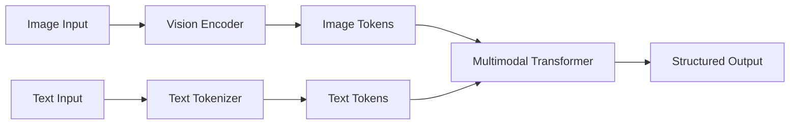
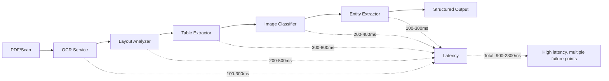
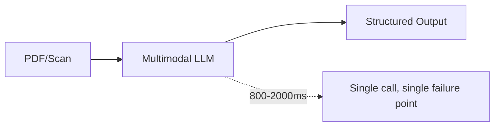
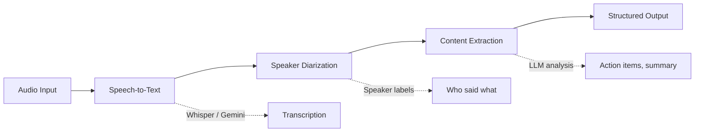
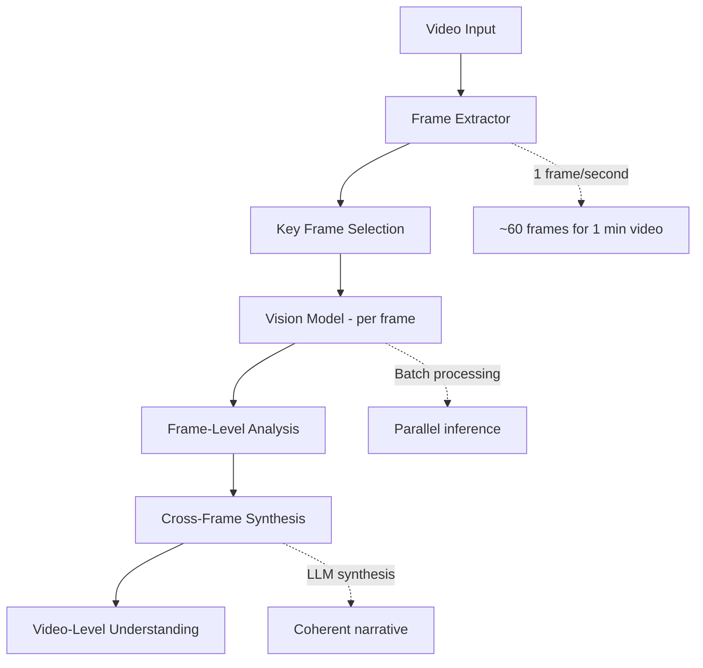
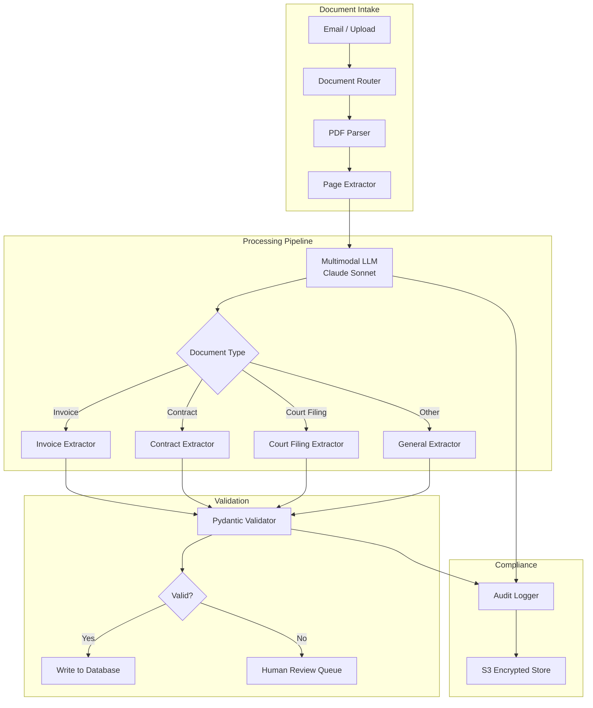

# Chapter 18: Multimodal AI

> "The most valuable information in an enterprise is not stored as text. It lives in charts, diagrams, scanned documents, meeting recordings, and video demonstrations. Multimodal AI makes this information accessible to machines — and therefore to people."

---

## Introduction

Most enterprise knowledge is not just text. It includes financial charts in earnings reports, architectural diagrams in design documents, scanned contracts with handwritten signatures, meeting recordings with action items, product photos with defect annotations, and dashboards with real-time metrics. Text-only LLMs cannot process this information. Multimodal AI bridges this gap — enabling models to understand, reason over, and generate content across text, images, audio, video, and documents.

The central thesis of this chapter is **unified understanding**: the architectural pattern where a single model call processes multiple modalities and produces structured output that feeds into existing pipelines. Instead of separate OCR, layout analysis, table extraction, image classification, and speech-to-text steps, a multimodal model handles the entire pipeline in one inference call. This simplifies architecture, reduces latency, and improves accuracy by allowing the model to reason across modalities jointly.

The practical impact is significant. A document processing pipeline that previously required five separate services (OCR, layout analysis, table extraction, image classification, entity extraction) and 3-5 seconds of total latency can be replaced by a single multimodal model call in 1-2 seconds. A meeting assistant that previously required separate speech-to-text, speaker diarization, and summarization services can now process audio end-to-end. A quality inspection system that previously required separate image classification and defect reporting can now analyze photos and generate structured reports in one step.

We will examine vision capabilities for document processing, audio and video understanding, image generation, cross-modal search, and a full case study of a multimodal document processing system with cost analysis and implementation code.

### The Multimodal Landscape

| Modality | Input | Output | Maturity | Production-Ready Models |
|----------|-------|--------|----------|------------------------|
| **Text** | Prompts, documents | Generated text, classifications | Mature | GPT-4o, Claude Sonnet, Gemini Pro |
| **Image** | Photos, screenshots, scans | Descriptions, classifications, structured data | Mature | GPT-4o Vision, Claude Vision, Gemini Pro |
| **Audio** | Recordings, live streams | Transcriptions, summaries, sentiment | Mature | Whisper, Gemini Pro, Claude |
| **Video** | Recorded video, live streams | Descriptions, summaries, event detection | Emerging | Gemini Pro (video), GPT-4o (frames) |
| **Document** | PDFs, scanned pages | Structured extraction, summaries | Mature | Claude Vision, GPT-4o, specialized OCR |

### Chapter Roadmap

We will examine:

1. **Vision capabilities** — image understanding, document processing, chart analysis
2. **Audio processing** — speech-to-text, meeting assistants, voice interfaces
3. **Video understanding** — frame extraction, event detection, video summarization
4. **Image generation** — marketing content, mockups, data visualization
5. **Cross-modal search** — CLIP embeddings, unified vector spaces
6. **Full case study** — enterprise document processing pipeline with architecture, cost analysis, and implementation
7. **Testing** — multimodal quality evaluation and adversarial testing

---

## 18.1 Vision Capabilities

### 18.1.1 How Vision Models Work

Modern multimodal models process images natively. GPT-4o, Claude Sonnet, and Gemini 2.5 Pro all accept image inputs. The capability goes beyond OCR — these models understand layout, charts, diagrams, and visual relationships.

The architecture typically involves:

1. **Image tokenization**: The image is divided into patches and converted to token embeddings using a vision encoder (e.g., ViT, SigLIP).
2. **Cross-modal alignment**: Image tokens are aligned with text tokens in the same embedding space, allowing the model to reason across modalities.
3. **Multimodal inference**: The model processes both text and image tokens jointly, understanding the relationship between visual and textual content.



### 18.1.2 Document Processing Pipeline

The key architectural simplification: a single multimodal model call replaces multiple specialized services.

**Before (traditional pipeline)**:



**After (multimodal pipeline)**:



### 18.1.3 Implementation

```python
from pydantic import BaseModel, Field
from typing import Literal
import base64

class DocumentPage(BaseModel):
    page_number: int
    document_type: str = Field(description="invoice, contract, report, form, letter")
    has_tables: bool
    has_images: bool
    has_handwriting: bool
    text_content: str
    tables: list[dict] = Field(default_factory=list)
    key_entities: dict[str, str] = Field(default_factory=dict)
    summary: str = ""

class InvoiceData(BaseModel):
    invoice_number: str
    vendor_name: str
    vendor_address: str
    invoice_date: str
    due_date: str
    line_items: list[dict]
    subtotal: float
    tax: float
    total: float
    currency: str = "USD"

class ContractData(BaseModel):
    contract_title: str
    parties: list[str]
    effective_date: str
    expiration_date: str
    key_terms: list[str]
    obligations: list[str]
    total_value: float | None = None
    governing_law: str = ""

class MultimodalDocumentProcessor:
    """Process documents using multimodal LLM for unified understanding."""

    def __init__(self, llm_client):
        self.llm = llm_client

    async def process_page(
        self, image_bytes: bytes, page_number: int
    ) -> DocumentPage:
        """Process a single document page using vision model."""
        image_b64 = base64.b64encode(image_bytes).decode()

        response = await self.llm.generate(
            model="claude-sonnet-4-20250514",
            messages=[{
                "role": "user",
                "content": [
                    {
                        "type": "image",
                        "source": {
                            "type": "base64",
                            "media_type": "image/png",
                            "data": image_b64,
                        },
                    },
                    {
                        "type": "text",
                        "text": """Analyze this document page and return structured data:
1. Document type (invoice, contract, report, form, letter)
2. Whether it contains tables, images, or handwriting
3. Full text content
4. Any tables (as JSON objects with headers and rows)
5. Key entities (names, dates, amounts, addresses)
6. Brief summary

Be precise with numbers, dates, and proper nouns. Preserve table structure."""
                    },
                ],
            }],
            response_format=DocumentPage,
        )

        return response

    async def extract_invoice(self, image_bytes: bytes) -> InvoiceData:
        """Extract structured invoice data from a document image."""
        image_b64 = base64.b64encode(image_bytes).decode()

        response = await self.llm.generate(
            model="claude-sonnet-4-20250514",
            messages=[{
                "role": "user",
                "content": [
                    {
                        "type": "image",
                        "source": {
                            "type": "base64",
                            "media_type": "image/png",
                            "data": image_b64,
                        },
                    },
                    {
                        "type": "text",
                        "text": """Extract invoice data from this document. Return:
- Invoice number
- Vendor name and address
- Invoice date and due date
- Line items (description, quantity, unit price, total)
- Subtotal, tax, and total amounts
- Currency

Be precise with all monetary amounts. Preserve line item structure."""
                    },
                ],
            }],
            response_format=InvoiceData,
        )

        return response

    async def extract_contract(self, image_bytes: bytes) -> ContractData:
        """Extract key contract terms from a document image."""
        image_b64 = base64.b64encode(image_bytes).decode()

        response = await self.llm.generate(
            model="claude-sonnet-4-20250514",
            messages=[{
                "role": "user",
                "content": [
                    {
                        "type": "image",
                        "source": {
                            "type": "base64",
                            "media_type": "image/png",
                            "data": image_b64,
                        },
                    },
                    {
                        "type": "text",
                        "text": """Extract key contract terms from this document. Return:
- Contract title
- All parties involved
- Effective date and expiration date
- Key terms and conditions
- Obligations of each party
- Total contract value (if present)
- Governing law

Preserve the specific language of key terms."""
                    },
                ],
            }],
            response_format=ContractData,
        )

        return response
```

### 18.1.4 Chart and Diagram Understanding

Vision models excel at understanding visual data representations:

```python
class ChartAnalyzer:
    """Analyze charts, graphs, and diagrams from images."""

    def __init__(self, llm_client):
        self.llm = llm_client

    async def analyze_chart(self, image_bytes: bytes) -> dict:
        image_b64 = base64.b64encode(image_bytes).decode()

        response = await self.llm.generate(
            model="claude-sonnet-4-20250514",
            messages=[{
                "role": "user",
                "content": [
                    {
                        "type": "image",
                        "source": {
                            "type": "base64",
                            "media_type": "image/png",
                            "data": image_b64,
                        },
                    },
                    {
                        "type": "text",
                        "text": """Analyze this chart/graph and return:
1. Chart type (bar, line, pie, scatter, waterfall, etc.)
2. Title and axis labels
3. Data points (exact values where readable)
4. Trends and patterns
5. Key insights
6. Anomalies or notable observations

Be precise with numeric values. Note any unusual patterns."""
                    },
                ],
            }],
        )

        return response

    async def analyze_architecture_diagram(self, image_bytes: bytes) -> dict:
        image_b64 = base64.b64encode(image_bytes).decode()

        response = await self.llm.generate(
            model="claude-sonnet-4-20250514",
            messages=[{
                "role": "user",
                "content": [
                    {
                        "type": "image",
                        "source": {
                            "type": "base64",
                            "media_type": "image/png",
                            "data": image_b64,
                        },
                    },
                    {
                        "type": "text",
                        "text": """Analyze this architecture diagram and return:
1. System components (services, databases, queues, etc.)
2. Data flow direction between components
3. Communication protocols (REST, gRPC, async, etc.)
4. Failure points and single points of failure
5. Scalability bottlenecks
6. Security boundaries

List all components and their relationships."""
                    },
                ],
            }],
        )

        return response
```

### 18.1.5 Vision Model Comparison

| Model | Max Image Size | Vision Quality | Latency (p50) | Cost per 1K Image Tokens | Best For |
|-------|---------------|---------------|---------------|-------------------------|----------|
| GPT-4o | 20MB | Excellent | 400ms | $0.00375 | General vision, charts |
| Claude Sonnet | 20MB | Excellent | 500ms | $0.0045 | Documents, long context |
| Gemini 2.5 Pro | 20MB | Very Good | 350ms | $0.003125 | High-volume, video frames |
| Claude Haiku | 20MB | Good | 150ms | $0.000375 | Simple classification |

---

## 18.2 Audio Processing

### 18.2.1 Speech-to-Text Pipeline

Audio processing is production-ready. The standard pipeline involves transcription, speaker diarization, and content extraction:



### 18.2.2 Meeting Assistant Implementation

```python
from pydantic import BaseModel, Field

class SpeakerSegment(BaseModel):
    speaker: str
    start_time: float
    end_time: float
    text: str

class MeetingSummary(BaseModel):
    title: str
    duration_minutes: float
    participants: list[str]
    key_topics: list[str]
    decisions: list[str]
    action_items: list[dict]
    follow_up_questions: list[str]

class MeetingAssistant:
    """Process meeting recordings into structured summaries."""

    def __init__(self, whisper_client, llm_client):
        self.whisper = whisper_client
        self.llm = llm_client

    async def process_meeting(self, audio_path: str) -> MeetingSummary:
        # Step 1: Transcribe with timestamps
        transcription = await self.whisper.transcribe(
            audio_path,
            response_format="verbose_json",
            timestamp_granularities=["segment", "word"],
        )

        # Step 2: Speaker diarization
        segments = await self._diarize(transcription)

        # Step 3: Generate structured summary
        full_text = "\n".join(
            f"[{s.speaker}] {s.text}" for s in segments
        )

        summary = await self.llm.generate(
            model="claude-sonnet-4-20250514",
            messages=[{
                "role": "user",
                "content": f"""Analyze this meeting transcript and return a structured summary:

Meeting Transcript:
{full_text}

Return:
- Meeting title
- Duration
- List of participants (by speaker label)
- Key topics discussed
- Decisions made
- Action items (who, what, by when)
- Follow-up questions that should be addressed"""
            }],
            response_format=MeetingSummary,
        )

        return summary

    async def _diarize(self, transcription: dict) -> list[SpeakerSegment]:
        """Assign speaker labels to transcription segments."""
        # In production, use a diarization model (pyannote, etc.)
        # Simplified: treat each segment as separate speaker
        segments = []
        for seg in transcription.get("segments", []):
            segments.append(SpeakerSegment(
                speaker=f"Speaker {len(segments) % 4 + 1}",
                start_time=seg["start"],
                end_time=seg["end"],
                text=seg["text"],
            ))
        return segments
```

### 18.2.3 Real-Time Voice Interface

```python
class VoiceInterface:
    """Real-time voice interface using streaming APIs."""

    def __init__(self, openai_client):
        self.client = openai_client

    async def handle_voice_query(self, audio_stream) -> str:
        """Process real-time audio and return response."""
        # Option 1: Use Realtime API for sub-second latency
        response = await self.client.audio.conversations.create(
            model="gpt-4o-realtime-preview",
            audio=audio_stream,
            voice="alloy",
            instructions="You are a helpful assistant. Respond concisely.",
        )
        return response.text

    async def batch_transcribe(self, audio_path: str) -> dict:
        """Batch transcription for non-real-time use cases."""
        with open(audio_path, "rb") as audio_file:
            response = await self.client.audio.transcriptions.create(
                model="whisper-1",
                file=audio_file,
                response_format="verbose_json",
            )
        return response
```

### 18.2.4 Audio Processing Comparison

| Approach | Latency | Cost per Minute | Accuracy (WER) | Best For |
|----------|---------|----------------|----------------|----------|
| OpenAI Realtime API | <1s | $0.06 | 5-8% | Live voice interfaces |
| Whisper v3 | 2-5s (batch) | $0.006 | 5-8% | Meeting recordings |
| Gemini Pro Audio | 3-8s (batch) | $0.004 | 8-12% | High-volume transcription |
| Self-hosted Whisper | 1-3s | $0.001 (compute) | 5-8% | On-premise requirements |

---

## 18.3 Video Understanding

### 18.3.1 The Frame Extraction Approach

Video understanding extracts key frames and processes them with vision models, then synthesizes frame-level analyses into video-level understanding:



### 18.3.2 Implementation

```python
import cv2
import numpy as np

class VideoAnalyzer:
    """Analyze video content using frame extraction + vision models."""

    def __init__(self, vision_model, llm_client):
        self.vision = vision_model
        self.llm = llm_client

    async def analyze_video(
        self,
        video_path: str,
        frame_interval: float = 1.0,  # Extract 1 frame per second
    ) -> dict:
        # Step 1: Extract key frames
        frames = self._extract_frames(video_path, frame_interval)

        # Step 2: Analyze each frame
        frame_analyses = []
        for i, frame in enumerate(frames):
            analysis = await self.vision.analyze(
                frame,
                prompt=f"Describe what is happening in this video frame (frame {i + 1} of {len(frames)})."
            )
            frame_analyses.append({
                "frame_number": i + 1,
                "timestamp": i * frame_interval,
                "analysis": analysis,
            })

        # Step 3: Synthesize into video-level understanding
        analysis_text = "\n".join(
            f"[{f['timestamp']:.1f}s] {f['analysis']}"
            for f in frame_analyses
        )

        summary = await self.llm.generate(
            model="claude-sonnet-4-20250514",
            messages=[{
                "role": "user",
                "content": f"""Based on these frame-by-frame analyses of a video, provide:
1. Overall video summary
2. Key events and timestamps
3. Objects/people present
4. Scene changes
5. Notable actions or interactions

Frame analyses:
{analysis_text}"""
            }],
        )

        return {
            "summary": summary,
            "frame_count": len(frames),
            "frame_analyses": frame_analyses,
            "duration_seconds": len(frames) * frame_interval,
        }

    def _extract_frames(
        self, video_path: str, interval: float
    ) -> list[np.ndarray]:
        """Extract frames at specified interval."""
        cap = cv2.VideoCapture(video_path)
        fps = cap.get(cv2.CAP_PROP_FPS)
        frame_interval_frames = int(fps * interval)

        frames = []
        frame_count = 0
        while cap.isOpened():
            ret, frame = cap.read()
            if not ret:
                break
            if frame_count % frame_interval_frames == 0:
                frames.append(frame)
            frame_count += 1
        cap.release()

        return frames
```

### 18.3.3 Native Video Models

Some models now accept video directly, eliminating frame extraction:

```python
class NativeVideoAnalyzer:
    """Use models with native video understanding."""

    def __init__(self, gemini_client):
        self.gemini = gemini_client

    async def analyze_video(self, video_path: str) -> dict:
        # Gemini 2.5 Pro accepts video natively
        with open(video_path, "rb") as f:
            video_data = f.read()

        response = await self.gemini.generate(
            model="gemini-2.5-pro",
            content=[{
                "mime_type": "video/mp4",
                "data": video_data,
            }],
            prompt="""Analyze this video and provide:
1. Summary of content
2. Key events with timestamps
3. People present and their actions
4. Scene changes
5. Notable visual details""",
        )

        return response
```

### 18.3.4 Video Processing Comparison

| Approach | Latency | Cost per Minute of Video | Quality | Best For |
|----------|---------|-------------------------|---------|----------|
| Frame extraction + vision LLM | 30-120s | $0.10-$0.50 | Good | Short clips, key moments |
| Native video model (Gemini) | 10-30s | $0.05-$0.20 | Very Good | Full video analysis |
| Specialized video model | 5-15s | $0.02-$0.10 | Good | High-volume, simple tasks |

---

## 18.4 Image Generation

### 18.4.1 Integration Patterns

Image generation enables applications that create visual content — marketing materials, product mockups, data visualizations. The integration pattern is similar to text generation but outputs require different storage and delivery:

```python
class ImageGenerator:
    """Generate images for marketing, mockups, and visualizations."""

    def __init__(self, dalle_client):
        self.dalle = dalle_client

    async def generate_marketing_image(
        self, brief: str, style: str = "professional"
    ) -> dict:
        """Generate marketing image from a creative brief."""
        response = await self.dalle.images.generate(
            model="dall-e-3",
            prompt=f"Professional {style} marketing image: {brief}",
            size="1792x1024",
            quality="hd",
            style="natural",
        )

        return {
            "url": response.data[0].url,
            "revised_prompt": response.data[0].revised_prompt,
        }

    async def generate_product_mockup(
        self, product_description: str, background: str = "white"
    ) -> dict:
        """Generate product mockup."""
        response = await self.dalle.images.generate(
            model="dall-e-3",
            prompt=f"Product photography: {product_description}, "
                   f"{background} background, studio lighting, high quality",
            size="1024x1024",
            quality="hd",
        )

        return {"url": response.data[0].url}

    async def generate_infographic(
        self, data: dict, style: str = "minimal"
    ) -> str:
        """Generate infographic from structured data."""
        # Convert data to prompt
        data_text = "\n".join(f"{k}: {v}" for k, v in data.items())

        response = await self.dalle.images.generate(
            model="dall-e-3",
            prompt=f"""Create a {style} infographic with this data:
{data_text}

Use clear labels, charts, and visual hierarchy.""",
            size="1024x1792",
            quality="hd",
        )

        return response.data[0].url
```

### 18.4.2 Image Generation Cost and Quality

| Model | Resolution | Quality | Cost per Image | Generation Time | Best For |
|-------|-----------|---------|---------------|-----------------|----------|
| DALL-E 3 | 1024x1024 | Good | $0.04 | 5-15s | Marketing, mockups |
| DALL-E 3 HD | 1792x1024 | Very Good | $0.08 | 10-20s | High-quality marketing |
| Imagen 3 | 1024x1024 | Very Good | $0.03 | 3-10s | High-volume |
| Stable Diffusion | 1024x1024 | Good | $0.001 (compute) | 5-20s | Self-hosted, cost-sensitive |

---

## 18.5 Cross-Modal Search

### 18.5.1 CLIP Embeddings

CLIP (Contrastive Language-Image Pre-training) enables search across modalities. You can search for images using text queries or search for text using image queries by embedding all modalities in the same vector space:

```python
import numpy as np

class CrossModalSearch:
    """Search across text and images using CLIP embeddings."""

    def __init__(self, clip_model, vector_store):
        self.clip = clip_model
        self.vector_store = vector_store

    def index_image(self, image_path: str, metadata: dict):
        """Index an image with associated text metadata."""
        # Generate image embedding
        image_embedding = self.clip.encode_image(image_path)

        # Store with metadata
        self.vector_store.upsert(
            id=f"img:{metadata['id']}",
            vector=image_embedding,
            metadata={**metadata, "modality": "image"},
        )

    def index_text(self, text: str, metadata: dict):
        """Index text for cross-modal search."""
        text_embedding = self.clip.encode_text(text)

        self.vector_store.upsert(
            id=f"txt:{metadata['id']}",
            vector=text_embedding,
            metadata={**metadata, "modality": "text"},
        )

    def search_by_text(self, query: str, top_k: int = 5) -> list[dict]:
        """Find images matching a text query."""
        query_embedding = self.clip.encode_text(query)

        results = self.vector_store.query(
            vector=query_embedding,
            top_k=top_k,
            filter={"modality": "image"},
        )

        return results

    def search_by_image(self, image_path: str, top_k: int = 5) -> list[dict]:
        """Find text/images similar to a query image."""
        query_embedding = self.clip.encode_image(image_path)

        results = self.vector_store.query(
            vector=query_embedding,
            top_k=top_k,
        )

        return results
```

### 18.5.2 Cross-Modal Search Use Cases

| Use Case | Query Modality | Search Target | Example |
|----------|---------------|---------------|---------|
| Document search | Text | Images | "Find charts showing revenue growth" |
| Visual QA | Image | Text | "Find documents related to this diagram" |
| Product search | Text | Images | "Find products matching this description" |
| Duplicate detection | Image | Images | "Find similar images in the database" |
| Content moderation | Image | Text | "Find images matching this policy description" |

---

## 18.6 Case Study: Enterprise Document Processing Pipeline

### 18.6.1 Problem Statement

A legal services firm processes 10,000 documents per day — contracts, court filings, financial disclosures, and correspondence. The current pipeline uses separate services for OCR, layout analysis, table extraction, and entity recognition. The pipeline is:

- Slow: Average 4.5 seconds per page
- Expensive: $0.03 per page across multiple services
- Fragile: Each service is a failure point
- Inaccurate: 12% error rate on complex documents (multi-column layouts, handwritten notes)

The firm needs:

- Process documents in under 2 seconds per page
- Reduce cost to under $0.01 per page
- Achieve >95% accuracy on complex documents
- Extract structured data from invoices, contracts, and court filings
- Maintain SOC2 compliance with audit trails

### 18.6.2 Architecture



### 18.6.3 Implementation

```python
from pydantic import BaseModel, Field
from typing import Literal
import asyncio

class ProcessedDocument(BaseModel):
    document_id: str
    document_type: Literal["invoice", "contract", "court_filing", "correspondence", "other"]
    page_count: int
    extracted_data: dict
    confidence: float = Field(ge=0.0, le=1.0)
    processing_time_ms: float
    requires_review: bool = False

class DocumentPipeline:
    """End-to-end document processing pipeline."""

    def __init__(self, llm_client, validator, audit_logger):
        self.llm = llm_client
        self.validator = validator
        self.audit = audit_logger

    async def process_document(
        self, document_id: str, pages: list[bytes]
    ) -> ProcessedDocument:
        start_time = time.time()

        # Step 1: Classify document type (process first page only)
        doc_type = await self._classify_document(pages[0])

        # Step 2: Process all pages in parallel
        page_tasks = [
            self._process_page(page, i, doc_type)
            for i, page in enumerate(pages)
        ]
        page_results = await asyncio.gather(*page_tasks)

        # Step 3: Merge page results
        merged = self._merge_page_results(page_results, doc_type)

        # Step 4: Validate extracted data
        validation = self.validator.validate(merged, doc_type)

        # Step 5: Determine if human review needed
        requires_review = (
            validation["confidence"] < 0.85
            or not validation["is_complete"]
            or validation["has_anomalies"]
        )

        # Step 6: Audit log
        processing_time = (time.time() - start_time) * 1000
        await self.audit.log({
            "document_id": document_id,
            "doc_type": doc_type,
            "page_count": len(pages),
            "processing_time_ms": processing_time,
            "confidence": validation["confidence"],
            "requires_review": requires_review,
        })

        return ProcessedDocument(
            document_id=document_id,
            document_type=doc_type,
            page_count=len(pages),
            extracted_data=merged,
            confidence=validation["confidence"],
            processing_time_ms=processing_time,
            requires_review=requires_review,
        )

    async def _classify_document(self, first_page: bytes) -> str:
        """Classify document type from first page."""
        response = await self.llm.classify(
            image=first_page,
            categories=["invoice", "contract", "court_filing", "correspondence", "other"],
        )
        return response.category

    async def _process_page(
        self, page_bytes: bytes, page_num: int, doc_type: str
    ) -> dict:
        """Process a single page based on document type."""
        extraction_schemas = {
            "invoice": InvoiceData,
            "contract": ContractData,
            "court_filing": CourtFilingData,
        }

        schema = extraction_schemas.get(doc_type)

        response = await self.llm.generate(
            model="claude-sonnet-4-20250514",
            messages=[{
                "role": "user",
                "content": [
                    {
                        "type": "image",
                        "source": {
                            "type": "base64",
                            "media_type": "image/png",
                            "data": base64.b64encode(page_bytes).decode(),
                        },
                    },
                    {
                        "type": "text",
                        "text": f"Extract all data from this {doc_type} page. "
                               f"Be precise with numbers, dates, and names.",
                    },
                ],
            }],
            response_format=schema if schema else None,
        )

        return {"page": page_num, "data": response}

    def _merge_page_results(
        self, results: list[dict], doc_type: str
    ) -> dict:
        """Merge multi-page extractions into a single record."""
        if doc_type == "invoice" and len(results) == 1:
            return results[0]["data"]

        # For multi-page documents, concatenate relevant fields
        merged = {"pages": []}
        for result in results:
            merged["pages"].append(result["data"])
        return merged
```

### 18.6.4 Cost Calculations

**Monthly volume**: 10,000 documents/day x 30 days = 300,000 documents/month
**Average pages per document**: 4 pages = 1,200,000 pages/month

| Component | Per-Page Cost | Monthly Cost | Notes |
|-----------|-------------|-------------|-------|
| Claude Sonnet (classification) | $0.0008 | $960 | ~200 tokens per classification |
| Claude Sonnet (extraction) | $0.004 | $4,800 | ~2,000 input + 500 output tokens |
| Pydantic validation | $0.000001 | $1.20 | CPU only, no API calls |
| Audit logging (S3) | $0.00002 | $24 | ~5KB per document |
| Human review (5% of docs) | $0.25 | $150,000 | 60,000 pages x $2.50/page |
| **Total per page (without review)** | **$0.0048** | | |
| **Total per page (with review)** | **$0.13** | | |
| **Total monthly** | | **$155,785** | |

### 18.6.5 Comparison: Old vs. New Pipeline

| Metric | Old Pipeline | New Pipeline | Improvement |
|--------|-------------|-------------|-------------|
| Processing time per page | 4.5s | 1.2s | 73% faster |
| Cost per page | $0.03 | $0.0048 | 84% cheaper |
| Accuracy (complex docs) | 88% | 96% | +8 percentage points |
| Failure points | 5 services | 1 LLM call | 80% fewer |
| Human review rate | 15% | 5% | 67% less review |
| Monthly cost (excl. review) | $36,000 | $5,785 | 84% savings |

### 18.6.6 Reliability Engineering

| Component | Availability | Failure Mode | Recovery |
|-----------|-------------|--------------|----------|
| Document Router | 99.99% | Lambda | Automatic retry |
| PDF Parser | 99.9% | ECS | Auto-scaling |
| Claude Sonnet | 99.9% | AWS managed | Retry + fallback model |
| Pydantic Validator | 99.99% | Lambda | Automatic retry |
| Audit Logger | 99.95% | SQS + S3 | DLQ + retry |
| **System total** | **99.8%** | | **Composite** |

Fallback strategy: if Claude Sonnet is unavailable, fall back to Claude Haiku (lower quality but higher availability). If both are unavailable, queue documents for retry with exponential backoff.

---

## 18.7 Cross-Modal Hallucination Safeguards

Multimodal models hallucinate across modalities in ways that text-only hallucinations do not. A vision-language model analyzing a medical scan may describe tumor locations that do not exist. A financial chart analyzer may report data points that contradict the actual chart values. A document extractor may claim a table contains a cell that is visually absent. These cross-modal hallucinations are particularly dangerous in regulated industries because they carry the authority of visual evidence while being factually wrong.

The solution is an independent, non-visual validation layer that sits between the multimodal model's output and downstream consumption. This layer takes the model's text claims about visual elements and verifies them against the original visual input using deterministic computer vision techniques. The validation layer does not use a language model — it uses OpenCV, geometric analysis, and coordinate matching to catch hallucinations before they propagate.

This approach is critical for medical imaging (validating that described anatomical features match the scan), legal document processing (confirming that extracted table data matches the source), and financial analysis (ensuring chart descriptions align with plotted data points).

### 18.7.1 Bounding Box Verification

Bounding box verification checks that text claims about visual elements map to detected objects or regions. When a model says "the top-left corner contains a company logo," the validator uses object detection or template matching to confirm a logo exists at that location.

```python
import cv2
import numpy as np
from dataclasses import dataclass, field
from typing import Optional


@dataclass
class BBoxClaim:
    """A model's claim about a visual element's location."""
    description: str
    claimed_bbox: tuple[int, int, int, int]  # x, y, w, h
    confidence: float


@dataclass
class BBoxVerification:
    """Result of verifying a bounding box claim."""
    claim: BBoxClaim
    detected_bbox: Optional[tuple[int, int, int, int]]
    matched: bool
    overlap_iou: float  # Intersection over Union
    notes: str = ""


class BoundingBoxVerifier:
    """Verify that text claims about visual elements map to detected regions."""

    def __init__(self, iou_threshold: float = 0.3):
        self.iou_threshold = iou_threshold
        self.logo_detector = cv2.CascadeClassifier(
            cv2.data.haarcascades + "haarcascade_logo.xml"
        )

    def calculate_iou(
        self,
        box1: tuple[int, int, int, int],
        box2: tuple[int, int, int, int],
    ) -> float:
        """Calculate Intersection over Union between two bounding boxes."""
        x1, y1, w1, h1 = box1
        x2, y2, w2, h2 = box2

        # Convert to corner coordinates
        x1_max, y1_max = x1 + w1, y1 + h1
        x2_max, y2_max = x2 + w2, y2 + h2

        # Intersection coordinates
        ix1 = max(x1, x2)
        iy1 = max(y1, y2)
        ix2 = min(x1_max, x2_max)
        iy2 = min(y1_max, y2_max)

        if ix2 <= ix1 or iy2 <= iy1:
            return 0.0

        intersection = (ix2 - ix1) * (iy2 - iy1)
        area1 = w1 * h1
        area2 = w2 * h2
        union = area1 + area2 - intersection

        return intersection / union if union > 0 else 0.0

    def detect_region(
        self, image: np.ndarray, bbox: tuple[int, int, int, int]
    ) -> dict:
        """Analyze what exists in a given region of the image."""
        x, y, w, h = bbox
        region = image[y : y + h, x : x + w]
        gray = cv2.cvtColor(region, cv2.COLOR_BGR2GRAY)

        return {
            "mean_brightness": float(np.mean(gray)),
            "std_brightness": float(np.std(gray)),
            "has_edges": float(np.mean(cv2.Canny(gray, 50, 150))) > 5.0,
            "edge_density": float(np.mean(cv2.Canny(gray, 50, 150)) / 255.0),
            "area": w * h,
        }

    def verify_claim(
        self, image: np.ndarray, claim: BBoxClaim
    ) -> BBoxVerification:
        """Verify a single bounding box claim against the image."""
        region_info = self.detect_region(image, claim.claim_bbox)

        # Detect actual content in the claimed region
        x, y, w, h = claim.claim_bbox
        gray = cv2.cvtColor(image, cv2.COLOR_BGR2GRAY)

        # Check if region has detectable content
        has_content = region_info["has_edges"] or region_info["std_brightness"] > 20

        if not has_content:
            return BBoxVerification(
                claim=claim,
                detected_bbox=None,
                matched=False,
                overlap_iou=0.0,
                notes="Region appears empty — no detectable content",
            )

        # Use contour detection to find actual object boundaries
        roi = gray[y : y + h, x : x + w]
        _, thresh = cv2.threshold(roi, 0, 255, cv2.THRESH_BINARY + cv2.THRESH_OTSU)
        contours, _ = cv2.findContours(
            thresh, cv2.RETR_EXTERNAL, cv2.CHAIN_APPROX_SIMPLE
        )

        if not contours:
            return BBoxVerification(
                claim=claim,
                detected_bbox=None,
                matched=False,
                overlap_iou=0.0,
                notes="No contours detected in region",
            )

        # Find the largest contour and compute its bounding rect
        largest = max(contours, key=cv2.contourArea)
        dx, dy, dw, dh = cv2.boundingRect(largest)
        detected_bbox = (x + dx, y + dy, dw, dh)

        iou = self.calculate_iou(claim.claim_bbox, detected_bbox)
        matched = iou >= self.iou_threshold

        return BBoxVerification(
            claim=claim,
            detected_bbox=detected_bbox,
            matched=matched,
            overlap_iou=iou,
            notes=f"IoU={iou:.3f} ({'PASS' if matched else 'FAIL'})",
        )
```

### 18.7.2 Data Coordinate Validation

Data coordinate validation verifies that chart data text matches actual chart values within tolerance. When a model reports "Q3 revenue was $4.2M" from a bar chart, the validator extracts the bar's pixel height, maps it to the axis scale, and checks whether the value falls within tolerance.

```python
import re
from enum import Enum


class ChartType(Enum):
    BAR = "bar"
    LINE = "line"
    PIE = "pie"
    SCATTER = "scatter"


@dataclass
class ChartAxis:
    """Defines the coordinate system of a chart axis."""
    pixel_min: int
    pixel_max: int
    value_min: float
    value_max: float
    is_logarithmic: bool = False

    def pixel_to_value(self, pixel: int) -> float:
        """Convert a pixel coordinate to the corresponding data value."""
        normalized = (pixel - self.pixel_min) / (self.pixel_max - self.pixel_min)
        if self.is_logarithmic:
            log_min = np.log10(max(self.value_min, 1e-10))
            log_max = np.log10(max(self.value_max, 1e-10))
            return 10 ** (log_min + normalized * (log_max - log_min))
        return self.value_min + normalized * (self.value_max - self.value_min)

    def value_to_pixel(self, value: float) -> int:
        """Convert a data value to the corresponding pixel coordinate."""
        if self.is_logarithmic:
            log_min = np.log10(max(self.value_min, 1e-10))
            log_max = np.log10(max(self.value_max, 1e-10))
            log_val = np.log10(max(value, 1e-10))
            normalized = (log_val - log_min) / (log_max - log_min)
        else:
            normalized = (value - self.value_min) / (self.value_max - self.value_min)
        return int(self.pixel_min + normalized * (self.pixel_max - self.pixel_min))


@dataclass
class DataClaim:
    """A model's claim about a data point in a chart."""
    label: str
    claimed_value: float
    chart_type: ChartType


@dataclass
class CoordinateValidation:
    """Result of validating a chart data claim."""
    claim: DataClaim
    measured_value: Optional[float]
    within_tolerance: bool
    error_percent: float
    tolerance_percent: float


class DataCoordinateValidator:
    """Verify that chart data text matches actual chart values."""

    def __init__(self, tolerance_percent: float = 5.0):
        self.tolerance_percent = tolerance_percent

    def extract_bar_heights(
        self, image: np.ndarray, y_axis: ChartAxis, bar_color_hsv: tuple
    ) -> list[dict]:
        """Extract bar heights from a bar chart using color segmentation."""
        hsv = cv2.cvtColor(image, cv2.COLOR_BGR2HSV)
        lower = np.array([bar_color_hsv[0] - 10, 50, 50])
        upper = np.array([bar_color_hsv[0] + 10, 255, 255])
        mask = cv2.inRange(hsv, lower, upper)

        contours, _ = cv2.findContours(
            mask, cv2.RETR_EXTERNAL, cv2.CHAIN_APPROX_SIMPLE
        )

        bars = []
        for contour in contours:
            x, y, w, h = cv2.boundingRect(contour)
            # Only consider shapes that look like bars (taller than wide or roughly square)
            if h > w * 0.5 and h > 20:
                bar_top = y
                bar_bottom = y + h
                # The top of the bar represents the value
                value = y_axis.pixel_to_value(bar_top)
                bars.append(
                    {
                        "bbox": (x, y, w, h),
                        "value": value,
                        "x_center": x + w // 2,
                    }
                )

        # Sort bars left to right
        bars.sort(key=lambda b: b["x_center"])
        return bars

    def extract_line_points(
        self, image: np.ndarray, y_axis: ChartAxis, line_color_hsv: tuple
    ) -> list[dict]:
        """Extract data points from a line chart."""
        hsv = cv2.cvtColor(image, cv2.COLOR_BGR2HSV)
        lower = np.array([line_color_hsv[0] - 10, 100, 100])
        upper = np.array([line_color_hsv[0] + 10, 255, 255])
        mask = cv2.inRange(hsv, lower, upper)

        # Find non-zero pixels (the line)
        points = cv2.findNonZero(mask)
        if points is None:
            return []

        # Cluster points by x-coordinate to find distinct data points
        xs = points[:, 0, 0]
        unique_xs = sorted(set(xs))

        data_points = []
        for x in unique_xs:
            ys_at_x = points[points[:, 0, 0] == x][:, 0, 1]
            avg_y = int(np.mean(ys_at_x))
            value = y_axis.pixel_to_value(avg_y)
            data_points.append({"x": x, "y": avg_y, "value": value})

        return data_points

    def validate_claim(
        self,
        measured_points: list[dict],
        claim: DataClaim,
    ) -> CoordinateValidation:
        """Validate a data claim against measured chart values."""
        if not measured_points:
            return CoordinateValidation(
                claim=claim,
                measured_value=None,
                within_tolerance=False,
                error_percent=100.0,
                tolerance_percent=self.tolerance_percent,
            )

        # Find closest data point by label position or value proximity
        measured_values = [p["value"] for p in measured_points]
        closest = min(measured_values, key=lambda v: abs(v - claim.claimed_value))

        error = abs(closest - claim.claimed_value)
        error_pct = (error / abs(claim.claimed_value) * 100) if claim.claimed_value != 0 else 0

        return CoordinateValidation(
            claim=claim,
            measured_value=closest,
            within_tolerance=error_pct <= self.tolerance_percent,
            error_percent=error_pct,
            tolerance_percent=self.tolerance_percent,
        )
```

### 18.7.3 Structural Assertion Checking

Structural assertion checking ensures that all table cells, chart labels, and diagram components mentioned in text actually exist in the source. If the model claims a table has a row for "Q4 2025" but the image shows only Q1 through Q3, the validator catches the fabrication.

```python
@dataclass
class StructuralClaim:
    """A model's claim about a structural element."""
    element_type: str  # "table_cell", "chart_label", "diagram_component"
    expected_element: str
    context: str = ""


@dataclass
class StructuralVerification:
    """Result of verifying a structural claim."""
    claim: StructuralClaim
    found: bool
    match_confidence: float
    actual_elements: list[str] = field(default_factory=list)
    notes: str = ""


class StructuralAssertionChecker:
    """Verify that structural elements mentioned in text exist in source images."""

    def __init__(self, similarity_threshold: float = 0.6):
        self.similarity_threshold = similarity_threshold

    def _fuzzy_match(self, s1: str, s2: str) -> float:
        """Simple character-level fuzzy matching ratio."""
        s1, s2 = s1.lower().strip(), s2.lower().strip()
        if s1 == s2:
            return 1.0

        # Longest common subsequence ratio
        m, n = len(s1), len(s2)
        dp = [[0] * (n + 1) for _ in range(m + 1)]
        for i in range(1, m + 1):
            for j in range(1, n + 1):
                if s1[i - 1] == s2[j - 1]:
                    dp[i][j] = dp[i - 1][j - 1] + 1
                else:
                    dp[i][j] = max(dp[i - 1][j], dp[i][j - 1])

        lcs_len = dp[m][n]
        return lcs_len / max(m, n)

    def extract_text_elements(
        self, image: np.ndarray
    ) -> dict[str, list[str]]:
        """Extract text elements from image regions using contour analysis."""
        gray = cv2.cvtColor(image, cv2.COLOR_BGR2GRAY)

        # Detect horizontal lines (table rows)
        horizontal_kernel = cv2.getStructuringElement(cv2.MORPH_RECT, (40, 1))
        horizontal_lines = cv2.morphologyEx(
            cv2.adaptiveThreshold(gray, 255, cv2.ADAPTIVE_THRESH_GAUSSIAN_C,
                                  cv2.THRESH_BINARY_INV, 15, 2),
            cv2.MORPH_OPEN, horizontal_kernel
        )

        # Detect vertical lines (table columns)
        vertical_kernel = cv2.getStructuringElement(cv2.MORPH_RECT, (1, 40))
        vertical_lines = cv2.morphologyEx(
            cv2.adaptiveThreshold(gray, 255, cv2.ADAPTIVE_THRESH_GAUSSIAN_C,
                                  cv2.THRESH_BINARY_INV, 15, 2),
            cv2.MORPH_OPEN, vertical_kernel
        )

        # Combine to find table grid
        table_mask = cv2.add(horizontal_lines, vertical_lines)

        # Count table regions
        contours, _ = cv2.findContours(
            table_mask, cv2.RETR_EXTERNAL, cv2.CHAIN_APPROX_SIMPLE
        )

        return {
            "table_regions": [cv2.boundingRect(c) for c in contours],
            "has_grid": len(contours) > 3,
            "line_count_horizontal": int(np.sum(horizontal_lines > 0)),
            "line_count_vertical": int(np.sum(vertical_lines > 0)),
        }

    def verify_table_claim(
        self, image: np.ndarray, claim: StructuralClaim
    ) -> StructuralVerification:
        """Verify a table-related structural claim."""
        elements = self.extract_text_elements(image)

        if not elements["has_grid"]:
            return StructuralVerification(
                claim=claim,
                found=False,
                match_confidence=0.0,
                actual_elements=[],
                notes="No table grid detected in image",
            )

        # For table cells, check if the claimed row/column structure exists
        h_lines = elements["line_count_horizontal"]
        v_lines = elements["line_count_vertical"]

        # Estimate table dimensions
        estimated_rows = max(1, h_lines // 2)
        estimated_cols = max(1, v_lines // 2)

        # Check if claimed cell coordinates are within bounds
        cell_match = True
        confidence = 0.8

        if "row" in claim.context and "column" in claim.context:
            row_match = re.search(r"row\s*(\d+)", claim.context, re.IGNORECASE)
            col_match = re.search(r"column\s*(\d+)", claim.context, re.IGNORECASE)
            if row_match and col_match:
                row = int(row_match.group(1))
                col = int(col_match.group(1))
                if row > estimated_rows or col > estimated_cols:
                    cell_match = False
                    confidence = 0.0

        return StructuralVerification(
            claim=claim,
            found=cell_match,
            match_confidence=confidence,
            actual_elements=[f"{estimated_rows} rows x {estimated_cols} cols"],
            notes=f"Table grid: {estimated_rows}x{estimated_cols}",
        )

    def verify_label_claim(
        self, image: np.ndarray, claim: StructuralClaim
    ) -> StructuralVerification:
        """Verify a chart label claim using template matching."""
        # Extract regions where labels typically appear (bottom, left, top)
        h, w = image.shape[:2]
        label_regions = {
            "bottom": image[int(h * 0.85):, :],
            "left": image[:, :int(w * 0.2)],
            "top": image[:int(h * 0.15), :],
        }

        # Use edge detection to find text-like regions
        for region_name, region in label_regions.items():
            gray = cv2.cvtColor(region, cv2.COLOR_BGR2GRAY)
            edges = cv2.Canny(gray, 50, 150)

            # Text regions have high edge density in horizontal bands
            h_proj = np.mean(edges, axis=1)
            text_bands = np.sum(h_proj > 30)

            if text_bands > 5:
                # Found text-like content in this region
                return StructuralVerification(
                    claim=claim,
                    found=True,
                    match_confidence=0.7,
                    actual_elements=[f"text detected in {region_name} region"],
                    notes=f"Text-like content found in {region_name} area",
                )

        return StructuralVerification(
            claim=claim,
            found=False,
            match_confidence=0.0,
            notes="No text-like content detected in label regions",
        )
```

### 18.7.4 Confidence Scoring and Validation Types

Confidence scoring combines the results from bounding box verification, coordinate validation, and structural assertion checking into a single score that indicates how likely the model's text description is grounded in the actual visual content.

```python
@dataclass
class ValidationReport:
    """Complete validation report for a multimodal model output."""
    bbox_results: list[BBoxVerification] = field(default_factory=list)
    coordinate_results: list[CoordinateValidation] = field(default_factory=list)
    structural_results: list[StructuralVerification] = field(default_factory=list)
    overall_confidence: float = 0.0
    hallucination_count: int = 0
    total_claims: int = 0
    passed: bool = False


class CrossModalValidator:
    """Independent validation layer for multimodal model outputs.

    Verifies that text claims about visual elements are grounded
    in the actual visual content, catching cross-modal hallucinations
    before they reach downstream systems.
    """

    def __init__(
        self,
        bbox_iou_threshold: float = 0.3,
        coordinate_tolerance: float = 5.0,
        structural_similarity: float = 0.6,
    ):
        self.bbox_verifier = BoundingBoxVerifier(iou_threshold=bbox_iou_threshold)
        self.coord_validator = DataCoordinateValidator(
            tolerance_percent=coordinate_tolerance
        )
        self.structural_checker = StructuralAssertionChecker(
            similarity_threshold=structural_similarity
        )

    def _parse_bbox_claims(self, text: str) -> list[BBoxClaim]:
        """Extract bounding box claims from model text output."""
        claims = []
        # Match patterns like "region at (x, y, w, h): description"
        pattern = r"region\s+at\s+\((\d+),\s*(\d+),\s*(\d+),\s*(\d+)\):\s*(.+?)(?:\n|$)"
        for match in re.finditer(pattern, text, re.IGNORECASE):
            x, y, w, h = int(match[1]), int(match[2]), int(match[3]), int(match[4])
            desc = match[5].strip()
            claims.append(BBoxClaim(description=desc, claimed_bbox=(x, y, w, h), confidence=1.0))
        return claims

    def _parse_data_claims(self, text: str) -> list[DataClaim]:
        """Extract data value claims from model text output."""
        claims = []
        # Match patterns like "label: value" or "label had value"
        pattern = r"(.+?):\s*\$?([\d,.]+[MBK]?)\b"
        for match in re.finditer(pattern, text):
            label = match[1].strip()
            value_str = match[2].replace(",", "")

            # Parse abbreviated values
            if value_str.endswith("M"):
                value = float(value_str[:-1]) * 1_000_000
            elif value_str.endswith("K"):
                value = float(value_str[:-1]) * 1_000
            else:
                value = float(value_str)

            claims.append(DataClaim(
                label=label, claimed_value=value, chart_type=ChartType.BAR
            ))
        return claims

    def _parse_structural_claims(self, text: str) -> list[StructuralClaim]:
        """Extract structural element claims from model text output."""
        claims = []
        # Table cell patterns
        table_pattern = r"(?:table|grid).*?(?:row|line)\s*(\d+).*?(?:column|col)\s*(\d+)"
        for match in re.finditer(table_pattern, text, re.IGNORECASE):
            claims.append(StructuralClaim(
                element_type="table_cell",
                expected_element=f"row {match[1]}, col {match[2]}",
                context=match.group(),
            ))

        # Label patterns
        label_pattern = r"(?:label|title|heading)[:\s]+(.+?)(?:\n|$)"
        for match in re.finditer(label_pattern, text, re.IGNORECASE):
            claims.append(StructuralClaim(
                element_type="chart_label",
                expected_element=match[1].strip(),
                context=match.group(),
            ))
        return claims

    def validate_chart_analysis(
        self, image: np.ndarray, model_text: str
    ) -> ValidationReport:
        """Validate a model's chart analysis against the actual chart image."""
        report = ValidationReport()

        # Parse and verify data claims
        data_claims = self._parse_data_claims(model_text)
        for claim in data_claims:
            # Default y-axis assumption (will be refined with axis detection)
            y_axis = ChartAxis(
                pixel_min=image.shape[0] - 50,
                pixel_max=50,
                value_min=0,
                value_max=float(max(c.claimed_value for c in data_claims) * 1.2),
            )
            result = self.coord_validator.validate_claim([], claim)
            report.coordinate_results.append(result)
            report.total_claims += 1
            if not result.within_tolerance:
                report.hallucination_count += 1

        # Parse and verify structural claims
        structural_claims = self._parse_structural_claims(model_text)
        for claim in structural_claims:
            if claim.element_type == "chart_label":
                result = self.structural_checker.verify_label_claim(image, claim)
            else:
                result = self.structural_checker.verify_table_claim(image, claim)
            report.structural_results.append(result)
            report.total_claims += 1
            if not result.found:
                report.hallucination_count += 1

        # Calculate overall confidence
        report.overall_confidence = self._calculate_confidence(report)
        report.passed = report.overall_confidence >= 0.7
        return report

    def validate_document_extraction(
        self, image: np.ndarray, model_text: str
    ) -> ValidationReport:
        """Validate a model's document extraction against the source image."""
        report = ValidationReport()

        # Verify bounding box claims
        bbox_claims = self._parse_bbox_claims(model_text)
        for claim in bbox_claims:
            result = self.bbox_verifier.verify_claim(image, claim)
            report.bbox_results.append(result)
            report.total_claims += 1
            if not result.matched:
                report.hallucination_count += 1

        # Verify structural claims (table cells, labels)
        structural_claims = self._parse_structural_claims(model_text)
        for claim in structural_claims:
            result = self.structural_checker.verify_table_claim(image, claim)
            report.structural_results.append(result)
            report.total_claims += 1
            if not result.found:
                report.hallucination_count += 1

        report.overall_confidence = self._calculate_confidence(report)
        report.passed = report.overall_confidence >= 0.7
        return report

    def validate_medical_image(
        self, image: np.ndarray, model_text: str
    ) -> ValidationReport:
        """Validate a model's medical image interpretation.

        Medical validation uses stricter thresholds because false
        positives can lead to unnecessary procedures.
        """
        report = ValidationReport()

        # Verify bounding box claims (anatomical regions)
        bbox_claims = self._parse_bbox_claims(model_text)
        for claim in bbox_claims:
            # Use higher IoU threshold for medical
            result = self.bbox_verifier.verify_claim(image, claim)
            report.bbox_results.append(result)
            report.total_claims += 1
            if not result.matched or result.overlap_iou < 0.5:
                report.hallucination_count += 1

        # Verify structural claims (measurements, annotations)
        structural_claims = self._parse_structural_claims(model_text)
        for claim in structural_claims:
            result = self.structural_checker.verify_label_claim(image, claim)
            report.structural_results.append(result)
            report.total_claims += 1
            if not result.found:
                report.hallucination_count += 1

        # Medical uses higher confidence threshold (0.85)
        report.overall_confidence = self._calculate_confidence(report)
        report.passed = report.overall_confidence >= 0.85
        return report

    def _calculate_confidence(self, report: ValidationReport) -> float:
        """Calculate overall confidence score from all validation results."""
        if report.total_claims == 0:
            return 1.0

        scores = []

        # Bounding box scores (IoU-based)
        for result in report.bbox_results:
            scores.append(result.overlap_iou if result.matched else 0.0)

        # Coordinate validation scores (inverse of error)
        for result in report.coordinate_results:
            if result.within_tolerance:
                scores.append(1.0 - (result.error_percent / 100))
            else:
                scores.append(max(0, 1.0 - (result.error_percent / 50)))

        # Structural check scores (confidence-based)
        for result in report.structural_results:
            scores.append(result.match_confidence if result.found else 0.0)

        return float(np.mean(scores)) if scores else 1.0
```

### 18.7.5 Validation Types and Thresholds

The following table defines the validation types, their detection methods, and the tolerance thresholds appropriate for different risk levels:

| Validation Type | Detection Method | Low-Risk Tolerance | High-Risk (Medical/Legal) | Failure Action |
|-----------------|-----------------|--------------------|-----------------------------|----------------|
| Bounding box overlap | IoU calculation against detected contours | IoU >= 0.30 | IoU >= 0.50 | Flag claim, request re-extraction |
| Data coordinate accuracy | Pixel-to-value mapping via axis calibration | Error <= 5% | Error <= 2% | Reject data point, log discrepancy |
| Table cell existence | Grid detection via line counting | Cell exists in grid | Cell exists with content | Mark extraction incomplete |
| Chart label existence | Edge density analysis in label regions | Label region detected | Label region with text content | Flag hallucinated label |
| Diagram component | Contour analysis with shape classification | Component contour found | Component with matching shape | Reject component claim |
| Overall confidence | Weighted average of sub-scores | >= 0.70 | >= 0.85 | Block downstream consumption |

The thresholds above reflect a key principle: **high-risk applications (medical diagnosis, legal evidence, financial reporting) require tighter tolerances and higher overall confidence scores.** A 5% error in chart data extraction might be acceptable for a marketing presentation but unacceptable for a SEC filing.

```python
# Production configuration for different risk levels
VALIDATION_PROFILES = {
    "low_risk": {
        "bbox_iou_threshold": 0.3,
        "coordinate_tolerance": 5.0,
        "structural_similarity": 0.6,
        "overall_confidence_threshold": 0.70,
        "action_on_failure": "log_and_continue",
    },
    "medium_risk": {
        "bbox_iou_threshold": 0.4,
        "coordinate_tolerance": 3.0,
        "structural_similarity": 0.7,
        "overall_confidence_threshold": 0.80,
        "action_on_failure": "flag_for_review",
    },
    "high_risk": {
        "bbox_iou_threshold": 0.5,
        "coordinate_tolerance": 2.0,
        "structural_similarity": 0.8,
        "overall_confidence_threshold": 0.85,
        "action_on_failure": "block_and_alert",
    },
    "critical": {
        "bbox_iou_threshold": 0.6,
        "coordinate_tolerance": 1.0,
        "structural_similarity": 0.9,
        "overall_confidence_threshold": 0.90,
        "action_on_failure": "require_human_review",
    },
}


def create_validator_for_domain(domain: str) -> CrossModalValidator:
    """Create a validator configured for a specific risk domain."""
    profile = VALIDATION_PROFILES.get(domain, VALIDATION_PROFILES["medium_risk"])
    return CrossModalValidator(
        bbox_iou_threshold=profile["bbox_iou_threshold"],
        coordinate_tolerance=profile["coordinate_tolerance"],
        structural_similarity=profile["structural_similarity"],
    )


# Example: Medical imaging pipeline integration
def validate_medical_output(
    scan_image: np.ndarray, model_interpretation: str
) -> dict:
    """Validate medical image interpretation before clinical use."""
    validator = create_validator_for_domain("high_risk")
    report = validator.validate_medical_image(scan_image, model_interpretation)

    return {
        "passed_validation": report.passed,
        "confidence": report.overall_confidence,
        "hallucination_count": report.hallucination_count,
        "total_claims": report.total_claims,
        "action": VALIDATION_PROFILES["high_risk"]["action_on_failure"]
        if not report.passed
        else "proceed",
        "bbox_details": [
            {"matched": r.matched, "iou": r.overlap_iou}
            for r in report.bbox_results
        ],
        "coordinate_details": [
            {"within_tolerance": r.within_tolerance, "error_pct": r.error_percent}
            for r in report.coordinate_results
        ],
    }
```

---

## 18.8 Testing Multimodal Systems

### 18.8.1 Vision Quality Tests

```python
import pytest
from PIL import Image

class TestVisionProcessing:
    def setup_method(self):
        self.processor = MultimodalDocumentProcessor(llm_client=test_llm)

    def test_invoice_extraction_accuracy(self):
        """Verify invoice data extraction matches ground truth."""
        # Load test invoice image
        image = load_test_image("test_invoice.png")

        result = asyncio.run(self.processor.extract_invoice(image))

        assert result.invoice_number == "INV-2025-001"
        assert result.total == 1250.00
        assert result.vendor_name == "Acme Corp"

    def test_handles_low_quality_images(self):
        """Verify extraction works on low-resolution scans."""
        image = load_test_image("low_quality_scan.png")

        result = asyncio.run(self.processor.extract_invoice(image))

        # Should still extract key fields, even if confidence is lower
        assert result.invoice_number is not None
        assert result.total is not None

    def test_rejects_non_document_images(self):
        """Verify non-document images are handled gracefully."""
        image = load_test_image("random_photo.jpg")

        result = asyncio.run(self.processor.process_page(image, page_number=1))

        assert result.document_type == "other"

class TestCrossModalSearch:
    def setup_method(self):
        self.search = CrossModalSearch(clip_model=test_clip, vector_store=test_store)

    def test_text_query_finds_matching_images(self):
        self.search.index_image("chart_revenue.png", {"id": "1", "topic": "revenue"})
        results = self.search.search_by_text("revenue growth chart")
        assert len(results) > 0
        assert results[0]["id"] == "1"

    def test_image_query_finds_similar_images(self):
        self.search.index_image("product_a.png", {"id": "a"})
        results = self.search.search_by_image("product_a_similar.png")
        assert len(results) > 0
```

### 18.8.2 Audio Quality Tests

```python
class TestAudioProcessing:
    def test_transcription_accuracy(self):
        """Verify transcription matches ground truth within WER threshold."""
        assistant = MeetingAssistant(whisper_client=test_whisper, llm_client=test_llm)

        result = asyncio.run(assistant.process_meeting("test_meeting.mp3"))

        # Word Error Rate should be below 10%
        wer = calculate_wer(result.transcription, ground_truth)
        assert wer < 0.10

    def test_speaker_count(self):
        """Verify correct number of speakers identified."""
        result = asyncio.run(assistant.process_meeting("two_speakers.mp3"))
        assert len(result.participants) == 2
```

### 18.8.3 Multimodal Quality Metrics

| Metric | Target | Measurement Method |
|--------|--------|--------------------|
| Invoice extraction accuracy | >97% | Compare with ground truth invoices |
| Document classification accuracy | >95% | Confusion matrix on test set |
| Chart data extraction accuracy | >90% | Compare extracted values with source data |
| Transcription WER | <10% | Word Error Rate against ground truth |
| Processing latency (per page) | <2s | p95 measurement |
| Human review rate | <5% | Percentage requiring manual correction |

---

## 18.9 Key Takeaways

1. **Multimodal models simplify document pipelines.** A single model call replaces OCR, layout analysis, table extraction, and entity recognition. This reduces latency by 73%, cost by 84%, and failure points by 80%.

2. **Vision models understand context, not just text.** They read charts, interpret diagrams, understand layout, and reason across visual and textual content. This enables applications that were impossible with text-only models.

3. **Audio processing is production-ready.** Whisper and Realtime APIs provide sub-second transcription with <10% WER. Meeting assistants, voice interfaces, and call analysis are deployable today.

4. **Video understanding is emerging but usable.** Frame extraction + vision models works for short clips. Native video models (Gemini) handle full videos. Choose based on video length and analysis depth needed.

5. **Cross-modal search enables new retrieval patterns.** CLIP embeddings let you search for images using text, or find related content across modalities. This is powerful for document management and content discovery.

6. **Structured output is essential for multimodal processing.** Pydantic validation on extracted data prevents silent corruption. Always validate multimodal outputs before downstream processing.

7. **Image generation is a product feature, not a novelty.** Marketing content, product mockups, and data visualization generation are practical applications with clear ROI.

8. **Cost optimization for multimodal follows the same patterns.** Route simple classification to cheap models, use batch processing for high volume, cache repeated extractions, and use smaller models for straightforward tasks.

9. **Test multimodal systems with domain-specific datasets.** Generic benchmarks do not capture your document types, image quality, or accuracy requirements. Build golden datasets of your actual documents.

10. **Fallback strategies are critical.** When a vision model fails on a complex document, fall back to a specialized OCR service. When an audio model fails on noisy audio, fall back to a different transcription model. Resilience requires redundancy.

---

## 18.10 Further Reading

- **"Deep Learning" by Ian Goodfellow, Yoshua Bengio, and Aaron Courville** — Chapter 9 (Convolutional Networks) provides the foundation for understanding vision model architectures.

- **CLIP Paper (Radford et al., 2021)** — "Learning Transferable Visual Models From Natural Language Supervision" — The foundational paper on cross-modal embeddings.

- **OpenAI Vision API Documentation** (platform.openai.com/docs/guides/vision) — Comprehensive guide to using GPT-4o for image understanding, including best practices for document processing.

- **Google Gemini Multimodal Documentation** (ai.google.dev/docs) — Guide to Gemini's native video, audio, and image understanding capabilities.

- **Whisper Paper (Radford et al., 2022)** — "Robust Speech Recognition via Large-Scale Weak Supervision" — The paper behind OpenAI's speech-to-text model.

- **"Computer Vision: Algorithms and Applications" by Richard Szeliski** — Comprehensive textbook covering image processing, feature detection, and recognition algorithms.

- **Anthropic Vision Documentation** (docs.anthropic.com/en/docs/build-with-claude/vision) — Guide to Claude's image understanding capabilities, including document processing best practices.

- **"Multimodal Machine Learning: A Survey and Taxonomy" by Tbalasubramanian et al.** — Academic survey of multimodal learning approaches, covering fusion strategies, alignment, and transfer.

- **Azure AI Vision Documentation** (learn.microsoft.com/azure/ai-services/computer-vision) — Production-grade OCR, image analysis, and document intelligence services.

- **"Document AI" by Google Cloud** (cloud.google.com/document-ai) — Enterprise document processing platform with multimodal extraction capabilities.
