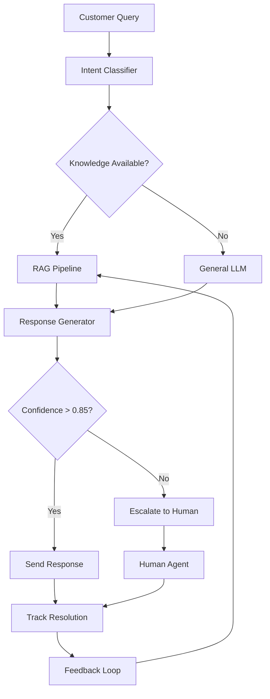
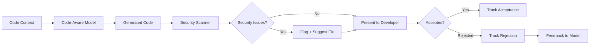
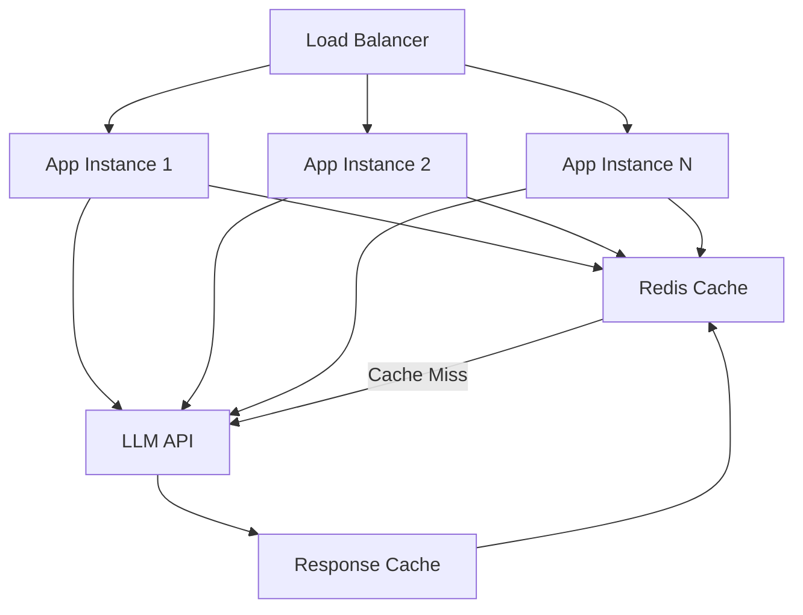
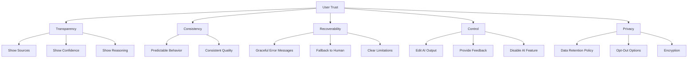
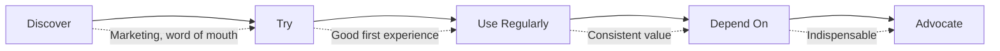
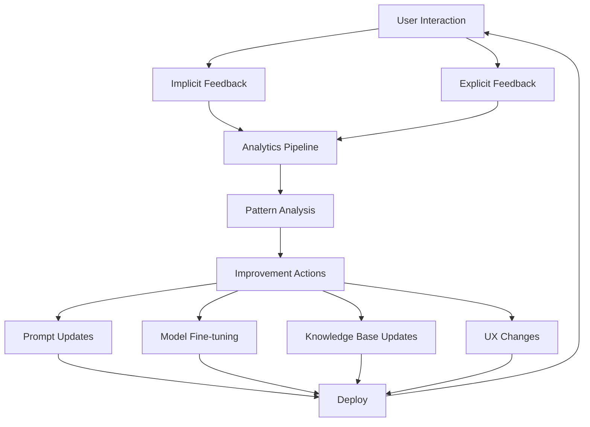
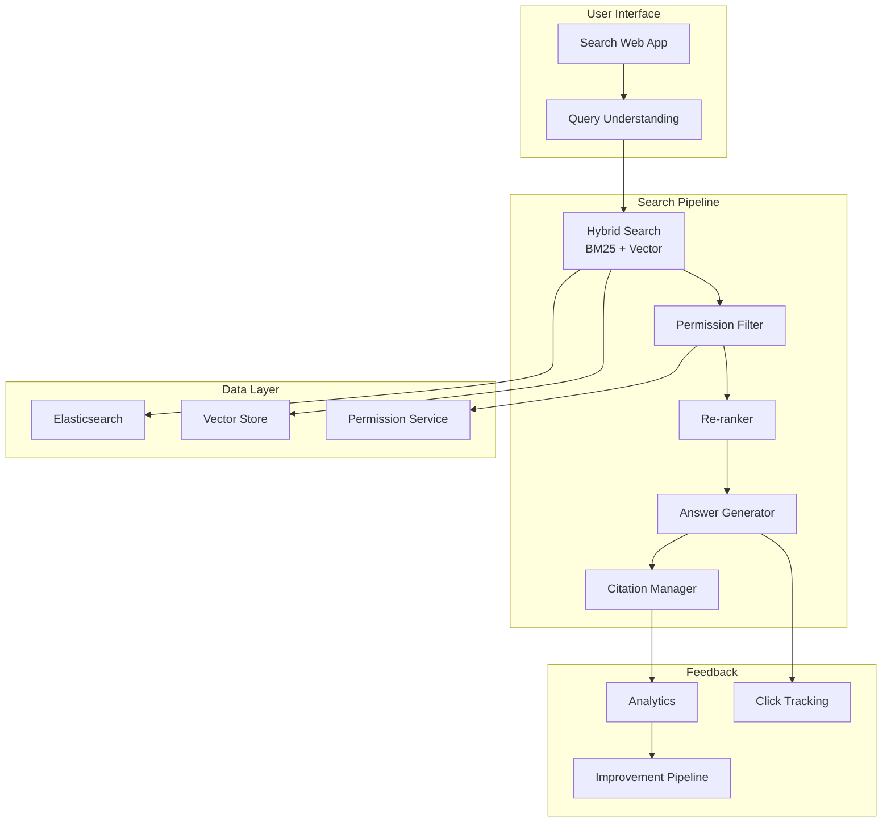
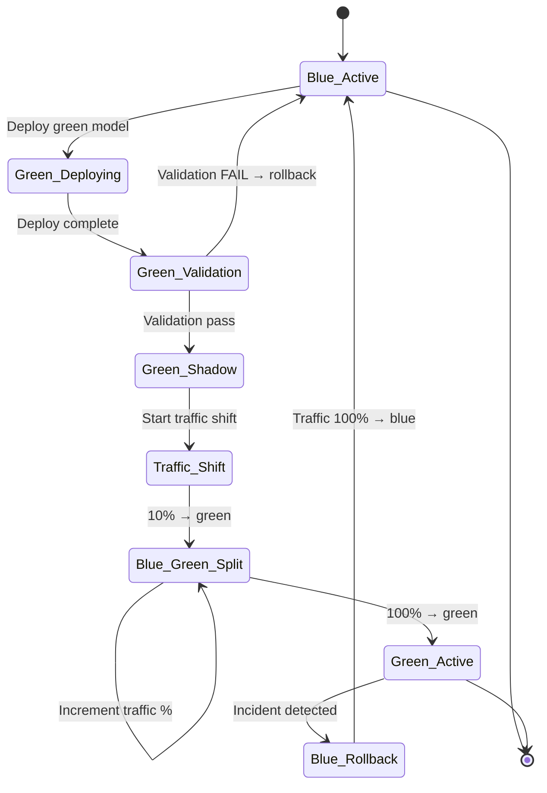

# Chapter 19: Building Production GenAI Products

> "A technically excellent product that users do not adopt is a failure. A mediocre product that users love is a success. Build for adoption, not just accuracy."

---

## Introduction

Building a GenAI product is not the same as building a GenAI prototype. A prototype demonstrates that the technology works. A product demonstrates that users want it, will pay for it, and will keep using it. The gap between prototype and product is where most AI projects die.

The central thesis of this chapter is the **product-engineering feedback loop**: technical architecture decisions drive user experience, user behavior generates data, data informs product decisions, and product decisions constrain technical architecture. This loop must be designed intentionally — not left to chance. Teams that optimize only for technical metrics (accuracy, latency, cost) build products that users abandon. Teams that optimize only for user metrics (adoption, satisfaction) build products that collapse under scale. The winning approach optimizes for both simultaneously.

The GenAI product landscape is maturing rapidly. The early era (2023-2024) was characterized by "AI-first" products where the AI was the entire value proposition — chatbots, writing assistants, image generators. The current era (2025+) is characterized by "AI-enhanced" products where AI is one component of a larger workflow — search, automation, decision support. The products that succeed are those where AI makes existing workflows faster, cheaper, or better — not those that ask users to adopt entirely new interaction patterns.

We will examine product categories and their architectural requirements, engineering concerns (scalability, reliability, cost, UX), adoption metrics, trust design, feedback loops, and a full case study of a production GenAI product with metrics, cost analysis, and iteration strategy.

### The Product Categories

| Product Category | Primary Value | Key Metric | Architecture Pattern |
|-----------------|---------------|------------|---------------------|
| Customer Support AI | Faster resolution | Resolution rate | RAG + escalation |
| Enterprise Search | Faster information finding | Time-to-answer | Hybrid search + citations |
| Coding Assistant | Faster development | Acceptance rate | Code-aware models + IDE |
| Research Assistant | Thorough analysis | Completeness | Multi-step reasoning + web |
| Workflow Automation | Less manual work | Automation rate | Tool calling + state |
| Content Generation | Faster creation | Usage rate | Generation + human review |
| Data Analysis | Faster insights | Insight accuracy | Code generation + visualization |

### Chapter Roadmap

We will examine:

1. **Product categories** — architectural requirements for each type
2. **Scalability** — horizontal scaling, caching, async processing
3. **Reliability** — circuit breakers, fallbacks, health checks
4. **Cost optimization** — routing, caching, prompt optimization
5. **User experience** — streaming, citations, confidence, feedback
6. **Trust design** — transparency, human-in-the-loop, error recovery
7. **Adoption metrics** — what to measure and why
8. **Feedback loops** — continuous improvement from user behavior
9. **Full case study** — enterprise search product with architecture, metrics, cost analysis, and iteration strategy
10. **Testing** — product-level testing beyond unit tests

---

## 19.1 Product Categories and Architectural Requirements

### 19.1.1 Customer Support AI

The most common GenAI product. Architecture must balance automation with escalation:



**Key architectural requirements:**

- Intent classification to route queries efficiently
- RAG pipeline with up-to-date knowledge base
- Confidence scoring to determine when to escalate
- SLA tracking (response time, resolution rate)
- Human escalation with full context transfer
- Feedback collection for continuous improvement

### 19.1.2 Enterprise Search

Finds information across internal documents, wikis, and databases:

```python
class EnterpriseSearch:
    """Enterprise search with permission filtering and citations."""

    def __init__(self, vector_store, llm_client, permission_service):
        self.vector_store = vector_store
        self.llm = llm_client
        self.permissions = permission_service

    async def search(
        self, query: str, user_id: str, top_k: int = 10
    ) -> dict:
        # Step 1: Get user's accessible document collections
        accessible = await self.permissions.get_accessible_collections(user_id)

        # Step 2: Retrieve relevant documents
        results = await self.vector_store.query(
            query=query,
            top_k=top_k * 2,  # Retrieve extra for filtering
            filter={"collection_id": {"$in": accessible}},
        )

        # Step 3: Re-rank with LLM
        reranked = await self._rerank(query, results[:top_k])

        # Step 4: Generate answer with citations
        answer = await self._generate_answer(query, reranked)

        return {
            "answer": answer["text"],
            "sources": [
                {
                    "title": doc["metadata"]["title"],
                    "url": doc["metadata"]["url"],
                    "relevance_score": doc["score"],
                    "excerpt": doc["text"][:200],
                }
                for doc in reranked[:5]
            ],
            "confidence": answer["confidence"],
            "total_results": len(results),
        }

    async def _generate_answer(
        self, query: str, documents: list[dict]
    ) -> dict:
        context = "\n\n".join(
            f"Source: {doc['metadata']['title']}\n{doc['text']}"
            for doc in documents
        )

        response = await self.llm.generate(
            model="claude-sonnet-4-20250514",
            messages=[{
                "role": "user",
                "content": f"""Answer this question using ONLY the provided sources.
Cite sources using [Source N] notation.

Question: {query}

Sources:
{context}

Rules:
- Only use information from the sources above
- If the sources do not contain enough information, say so
- Cite every claim with its source"""
            }],
        )

        return response
```

### 19.1.3 Coding Assistant

Must understand code context, IDE integration, and security implications:



### 19.1.4 Research Assistant

Multi-step reasoning with web search and citation management:

```python
class ResearchAssistant:
    """Multi-step research with source verification."""

    def __init__(self, llm_client, web_search, citation_manager):
        self.llm = llm_client
        self.search = web_search
        self.citations = citation_manager

    async def research(self, topic: str, depth: str = "standard") -> dict:
        # Step 1: Generate research plan
        plan = await self.llm.generate(
            model="claude-sonnet-4-20250514",
            messages=[{
                "role": "user",
                "content": f"""Create a research plan for: {topic}
Include 3-5 specific sub-questions to investigate.
For each sub-question, identify what sources to search."""
            }],
        )

        # Step 2: Execute research for each sub-question
        findings = []
        for sub_question in plan["sub_questions"]:
            # Search for sources
            sources = await self.search.find(sub_question)

            # Verify source credibility
            verified = await self._verify_sources(sources)

            # Extract relevant information
            info = await self._extract_information(sub_question, verified)
            findings.append({
                "question": sub_question,
                "sources": verified,
                "findings": info,
            })

        # Step 3: Synthesize into comprehensive answer
        synthesis = await self._synthesize_findings(topic, findings)

        # Step 4: Verify all citations
        verified_citations = await self.citations.verify(synthesis["citations"])

        return {
            "topic": topic,
            "summary": synthesis["summary"],
            "detailed_findings": findings,
            "citations": verified_citations,
            "confidence": synthesis["confidence"],
            "completeness_score": len(findings) / len(plan["sub_questions"]),
        }
```

---

## 19.2 Engineering Concerns

### 19.2.1 Scalability



**Horizontal scaling**: Stateless application instances behind a load balancer. Each instance can serve any request. Scale by adding instances.

**Caching**: Cache repeated queries to reduce LLM calls. For many applications, 20-40% of queries are repeatable. Cache at the query level (exact match) and semantic level (similar queries).

```python
class SemanticCache:
    """Cache similar queries using embedding similarity."""

    def __init__(self, vector_store, llm_client):
        self.vector_store = vector_store
        self.llm = llm_client
        self.similarity_threshold = 0.92

    async def get_or_generate(self, query: str, generate_fn) -> dict:
        # Check semantic cache
        query_embedding = await self.llm.embed(query)
        cached = await self.vector_store.query(
            vector=query_embedding,
            top_k=1,
            filter={"cache_type": "semantic"},
        )

        if cached and cached[0]["score"] >= self.similarity_threshold:
            return {
                "response": cached[0]["metadata"]["response"],
                "cached": True,
                "cache_similarity": cached[0]["score"],
            }

        # Cache miss: generate response
        response = await generate_fn(query)

        # Store in cache
        await self.vector_store.upsert(
            id=f"cache:{hash(query)}",
            vector=query_embedding,
            metadata={
                "query": query,
                "response": response["text"],
                "cache_type": "semantic",
            },
        )

        return {**response, "cached": False}
```

**Async processing**: Long-running tasks (document processing, research) should be async. Return a job ID immediately; poll for completion. This prevents timeout errors and allows parallel processing.

### 19.2.2 Reliability

```python
class CircuitBreaker:
    """Prevent cascade failures when LLM providers are down."""

    def __init__(self, failure_threshold=5, recovery_timeout=60):
        self.failure_threshold = failure_threshold
        self.recovery_timeout = recovery_timeout
        self.failures = 0
        self.state = "closed"  # closed = normal, open = failing, half_open = testing
        self.last_failure_time = 0

    async def call(self, fn, fallback_fn=None):
        if self.state == "open":
            if time.time() - self.last_failure_time > self.recovery_timeout:
                self.state = "half_open"
            else:
                if fallback_fn:
                    return await fallback_fn()
                raise CircuitBreakerOpen("Service unavailable")

        try:
            result = await fn()
            if self.state == "half_open":
                self.state = "closed"
                self.failures = 0
            return result
        except Exception as e:
            self.failures += 1
            self.last_failure_time = time.time()
            if self.failures >= self.failure_threshold:
                self.state = "open"
            if fallback_fn:
                return await fallback_fn()
            raise
```

**Fallback chains**: When the primary model fails, fall back to alternatives:

```python
class FallbackChain:
    """Try multiple models in order of preference."""

    def __init__(self):
        self.chain = [
            {"model": "claude-sonnet-4-20250514", "timeout": 5000},
            {"model": "gpt-4o", "timeout": 5000},
            {"model": "gpt-4o-mini", "timeout": 3000},
        ]

    async def generate(self, prompt: str) -> dict:
        for provider in self.chain:
            try:
                result = await self._call_model(
                    provider["model"],
                    prompt,
                    timeout=provider["timeout"],
                )
                return result
            except (TimeoutError, APIError) as e:
                logger.warning(f"Model {provider['model']} failed: {e}")
                continue

        # All models failed
        return {
            "text": "I'm experiencing technical difficulties. Please try again later.",
            "model": "fallback_message",
            "error": True,
        }
```

### 19.2.3 Cost Optimization

| Strategy | Savings | Implementation | Risk |
|----------|---------|---------------|------|
| Model routing | 60-80% | Route simple queries to cheap models | Quality monitoring needed |
| Semantic caching | 20-40% | Cache similar queries | Staleness for dynamic data |
| Prompt compression | 10-30% | Shorter prompts, fewer tokens | May reduce quality |
| Batching | 10-20% | Group similar requests | Latency trade-off |
| Self-hosting | 50-80% | For steady, high-volume workloads | Operational overhead |

---

## 19.3 User Experience

### 19.3.1 Streaming Is Mandatory

Users will not wait 10 seconds for a response. Streaming provides immediate feedback and perceived speed:

```python
from fastapi import FastAPI
from fastapi.responses import StreamingResponse

app = FastAPI()

@app.post("/chat")
async def chat(request: ChatRequest):
    async def generate_stream():
        async for chunk in llm.stream(
            model="claude-sonnet-4-20250514",
            messages=[{"role": "user", "content": request.message}],
        ):
            yield f"data: {json.dumps({'text': chunk.text})}\n\n"
        yield "data: [DONE]\n\n"

    return StreamingResponse(
        generate_stream(),
        media_type="text/event-stream",
    )
```

### 19.3.2 Citations Build Trust

Users need to verify that AI responses are grounded in reality. Citations provide the evidence:

```python
class CitationManager:
    """Manage citations for AI responses."""

    def add_citations(self, response: str, sources: list[dict]) -> str:
        """Add inline citations to response text."""
        # For each claim in the response, find matching source
        cited_response = response

        for i, source in enumerate(sources, 1):
            # Mark source references
            cited_response = cited_response.replace(
                f"[{source['id']}]",
                f" [{i}]({source['url']})",
            )

        return cited_response

    def verify_citations(self, response: str, sources: list[dict]) -> dict:
        """Verify all cited sources are real and accessible."""
        import re
        citation_pattern = r'\[(\d+)\]'
        cited_numbers = set(re.findall(citation_pattern, response))

        verified = []
        broken = []

        for num in cited_numbers:
            source = next(
                (s for s in sources if str(s["id"]) == num),
                None,
            )
            if source and self._is_accessible(source["url"]):
                verified.append(source)
            else:
                broken.append(num)

        return {
            "verified_count": len(verified),
            "broken_count": len(broken),
            "broken_citations": broken,
        }
```

### 19.3.3 Confidence Indicators

Help users judge response reliability:

```python
class ConfidenceIndicator:
    """Generate confidence indicators for responses."""

    def assess(self, response: str, sources: list[dict], query: str) -> dict:
        factors = []

        # Source count
        if len(sources) >= 3:
            factors.append(("sources", 0.3, "Multiple sources support this answer"))
        elif len(sources) >= 1:
            factors.append(("sources", 0.15, "Limited source support"))
        else:
            factors.append(("sources", 0.0, "No sources found"))

        # Source relevance
        avg_relevance = sum(s.get("score", 0) for s in sources) / max(len(sources), 1)
        factors.append(("relevance", avg_relevance * 0.3, f"Average source relevance: {avg_relevance:.0%}"))

        # Response length vs query complexity
        if len(response) > 500 and len(query) < 50:
            factors.append(("completeness", 0.2, "Detailed response to simple query"))
        elif len(response) > 100:
            factors.append(("completeness", 0.15, "Adequate detail"))

        total_score = sum(f[1] for f in factors)

        if total_score >= 0.7:
            level = "high"
        elif total_score >= 0.4:
            level = "medium"
        else:
            level = "low"

        return {
            "score": total_score,
            "level": level,
            "factors": [(f[0], f[2]) for f in factors],
            "disclaimer": self._get_disclaimer(level),
        }

    def _get_disclaimer(self, level: str) -> str:
        disclaimers = {
            "high": "This response is well-supported by sources.",
            "medium": "This response may need additional verification.",
            "low": "This response has limited source support. Please verify independently.",
        }
        return disclaimers[level]
```

### 19.3.4 Feedback Loops

Collect implicit and explicit feedback to improve the product:

```python
class FeedbackCollector:
    """Collect user feedback for continuous improvement."""

    def __init__(self, storage):
        self.storage = storage

    async def record_interaction(
        self,
        query: str,
        response: str,
        sources: list[dict],
        user_id: str,
    ) -> str:
        """Record an interaction for feedback collection."""
        interaction_id = str(uuid.uuid4())

        await self.storage.insert("interactions", {
            "id": interaction_id,
            "query": query,
            "response": response,
            "sources": sources,
            "user_id": user_id,
            "timestamp": time.time(),
            "feedback": None,
            "implicit_signals": {},
        })

        return interaction_id

    async def record_explicit_feedback(
        self,
        interaction_id: str,
        rating: int,  # 1-5
        comment: str = "",
    ):
        """Record explicit user feedback (thumbs up/down, rating)."""
        await self.storage.update(
            "interactions",
            interaction_id,
            {"feedback": {"rating": rating, "comment": comment}},
        )

    async def record_implicit_feedback(
        self,
        interaction_id: str,
        signals: dict,
    ):
        """Record implicit feedback (clicked sources, time spent, etc.)."""
        await self.storage.update(
            "interactions",
            interaction_id,
            {"implicit_signals": signals},
        )

    async def get_improvement_insights(self, period_days: int = 30) -> dict:
        """Analyze feedback to identify improvement opportunities."""
        interactions = await self.storage.query(
            "interactions",
            time_range_days=period_days,
        )

        # Calculate metrics
        total = len(interactions)
        with_feedback = [i for i in interactions if i["feedback"]]
        avg_rating = (
            sum(i["feedback"]["rating"] for i in with_feedback) / len(with_feedback)
            if with_feedback else 0
        )

        # Find low-rated queries for improvement
        low_rated = [
            i for i in with_feedback
            if i["feedback"]["rating"] <= 2
        ]

        return {
            "total_interactions": total,
            "feedback_rate": len(with_feedback) / total if total > 0 else 0,
            "average_rating": avg_rating,
            "low_rated_count": len(low_rated),
            "low_rated_queries": [i["query"] for i in low_rated[:10]],
            "improvement_opportunities": self._analyze_patterns(low_rated),
        }
```

---

## 19.4 Trust Design

### 19.4.1 The Trust Equation

Trust in AI products is built through:

1. **Transparency**: Show sources, confidence, and reasoning
2. **Consistency**: Reliable behavior across similar queries
3. **Recoverability**: Graceful handling of errors and edge cases
4. **Control**: User can override, correct, or dismiss AI outputs
5. **Privacy**: Clear data handling policies and user control



### 19.4.2 Human-in-the-Loop Patterns

```python
class HumanInTheLoop:
    """Manage human oversight for AI decisions."""

    def __init__(self, notification_service):
        self.notifications = notification_service

    async def review_gate(
        self,
        decision: dict,
        confidence: float,
        risk_level: str,
    ) -> dict:
        """Determine if human review is needed."""

        # High-risk decisions always need review
        if risk_level == "high":
            return await self._request_human_review(decision)

        # Low confidence always needs review
        if confidence < 0.7:
            return await self._request_human_review(decision)

        # Medium risk: sample for review
        if risk_level == "medium" and random.random() < 0.1:
            return await self._request_human_review(decision)

        # Auto-approve
        return {"approved": True, "reviewer": "auto", "timestamp": time.time()}

    async def _request_human_review(self, decision: dict) -> dict:
        """Request human review and wait for approval."""
        review_id = str(uuid.uuid4())

        await self.notifications.send(
            channel="review_queue",
            message={
                "review_id": review_id,
                "decision": decision,
                "requested_at": time.time(),
            },
        )

        # Wait for review (with timeout)
        review_result = await self._wait_for_review(review_id, timeout=3600)

        return review_result

    async def correction_feedback(self, review_id: str, correction: dict):
        """Process human corrections as training data."""
        await self.storage.insert("corrections", {
            "review_id": review_id,
            "correction": correction,
            "timestamp": time.time(),
        })

        # This data can be used for:
        # 1. Fine-tuning the model
        # 2. Updating prompt templates
        # 3. Adjusting confidence thresholds
        # 4. Adding new rules to the guardrails
```

---

## 19.5 Adoption Metrics

### 19.5.1 What to Measure

Technical metrics (accuracy, latency, cost) are important for engineering. Adoption metrics are important for product success. The metrics that matter:

| Metric | Definition | Target | Why It Matters |
|--------|-----------|--------|----------------|
| **Daily Active Users (DAU)** | Unique users per day | Growing | Are people using it? |
| **Queries per User per Day** | Engagement depth | 5+ | How deeply? |
| **Resolution Rate** | % queries handled without human | >80% | Does it work? |
| **Return Rate** | % users who return next week | >60% | Do they come back? |
| **Time Saved** | Minutes saved per query vs. manual | >2 min | Is it faster? |
| **NPS** | Net Promoter Score | >40 | Are they satisfied? |
| **Feedback Ratio** | Thumbs up vs. thumbs down | >5:1 | Quality signal |

### 19.5.2 Metrics Dashboard

```python
class ProductMetrics:
    """Track product-level adoption metrics."""

    def __init__(self, storage):
        self.storage = storage

    async def record_daily_metrics(self, date: str):
        """Calculate and store daily metrics."""
        interactions = await self.storage.query(
            "interactions",
            date=date,
        )

        unique_users = len(set(i["user_id"] for i in interactions))
        total_queries = len(interactions)
        avg_queries_per_user = total_queries / max(unique_users, 1)

        # Resolution rate (queries without escalation)
        resolved = sum(1 for i in interactions if not i.get("escalated"))
        resolution_rate = resolved / max(total_queries, 1)

        # Return rate (users who also used yesterday)
        yesterday_users = set(await self._get_users(date_minus_1(date)))
        today_users = set(i["user_id"] for i in interactions)
        return_rate = len(yesterday_users & today_users) / max(len(yesterday_users), 1)

        # Feedback metrics
        feedbacks = [i["feedback"] for i in interactions if i["feedback"]]
        positive = sum(1 for f in feedbacks if f.get("rating", 0) >= 4)
        negative = sum(1 for f in feedbacks if f.get("rating", 0) <= 2)
        feedback_ratio = positive / max(negative, 1)

        await self.storage.insert("daily_metrics", {
            "date": date,
            "dau": unique_users,
            "total_queries": total_queries,
            "avg_queries_per_user": avg_queries_per_user,
            "resolution_rate": resolution_rate,
            "return_rate": return_rate,
            "feedback_ratio": feedback_ratio,
            "nps_score": self._calculate_nps(feedbacks),
        })

    def _calculate_nps(self, feedbacks: list[dict]) -> int:
        """Calculate Net Promoter Score from ratings."""
        if not feedbacks:
            return 0
        promoters = sum(1 for f in feedbacks if f.get("rating", 0) >= 4)
        detractors = sum(1 for f in feedbacks if f.get("rating", 0) <= 2)
        total = len(feedbacks)
        return int(((promoters - detractors) / total) * 100)
```

### 19.5.3 The Adoption Funnel



Track users through the funnel:

- **Discover → Try**: Trial signup rate (target: >30% of exposed users)
- **Try → Use Regularly**: Day-7 retention (target: >40%)
- **Use Regularly → Depend On**: Day-30 retention (target: >25%)
- **Depend On → Advocate**: Referral rate (target: >10%)

---

## 19.6 Feedback Loops

### 19.6.1 The Continuous Improvement Cycle



### 19.6.2 Acting on Feedback

```python
class FeedbackAnalyzer:
    """Analyze feedback to drive product improvements."""

    def __init__(self, storage, llm_client):
        self.storage = storage
        self.llm = llm_client

    async def identify_improvement_areas(self) -> dict:
        """Find the most impactful improvement opportunities."""
        # Get recent low-rated interactions
        low_rated = await self.storage.query(
            "interactions",
            filters={"feedback.rating": {"$lte": 2}},
            time_range_days=30,
            limit=100,
        )

        # Cluster similar issues
        clusters = await self._cluster_issues(low_rated)

        # Prioritize by frequency and severity
        prioritized = sorted(
            clusters,
            key=lambda c: c["frequency"] * c["avg_severity"],
            reverse=True,
        )

        return {
            "top_issues": prioritized[:5],
            "total_low_rated": len(low_rated),
            "suggested_actions": [
                self._suggest_action(issue) for issue in prioritized[:3]
            ],
        }

    def _suggest_action(self, issue: dict) -> dict:
        """Suggest specific improvement action for an issue."""
        issue_type = issue["type"]

        if issue_type == "inaccurate_answer":
            return {
                "action": "knowledge_base_update",
                "description": f"Update knowledge base for: {issue['topic']}",
                "priority": "high",
                "effort": "medium",
            }
        elif issue_type == "irrelevant_response":
            return {
                "action": "prompt_optimization",
                "description": "Refine retrieval and prompt for this query type",
                "priority": "medium",
                "effort": "low",
            }
        elif issue_type == "missing_information":
            return {
                "action": "source_expansion",
                "description": f"Add sources for: {issue['topic']}",
                "priority": "high",
                "effort": "medium",
            }
        else:
            return {
                "action": "investigate",
                "description": f"Manual investigation needed for: {issue_type}",
                "priority": "low",
                "effort": "high",
            }
```

---

## 19.7 Case Study: Enterprise Search Product

### 19.7.1 Problem Statement

A professional services firm (5,000 employees) needs an enterprise search product that helps consultants find relevant information across 2M+ documents — proposals, reports, research papers, client communications, and internal knowledge bases. Current pain points:

- Average time to find information: 25 minutes per query
- 40% of searches end in frustration (consultant asks a colleague instead)
- Documents are scattered across SharePoint, Confluence, and file shares
- Permission restrictions are complex (client-confidential documents)

### 19.7.2 Architecture



### 19.7.3 Implementation

```python
class EnterpriseSearchProduct:
    """Production enterprise search product."""

    def __init__(self):
        self.hybrid_search = HybridSearch()  # BM25 + vector
        self.permissions = PermissionService()
        self.reranker = Reranker()
        self.generator = CitationGenerator()
        self.analytics = SearchAnalytics()

    async def search(
        self, query: str, user_id: str, filters: dict = None
    ) -> SearchResponse:
        start_time = time.time()

        # Step 1: Understand query intent
        intent = await self._understand_query(query)

        # Step 2: Get accessible collections
        accessible = await self.permissions.get_accessible(user_id)

        # Step 3: Hybrid search (BM25 + vector)
        raw_results = await self.hybrid_search.search(
            query=query,
            collections=accessible,
            filters=filters,
            top_k=20,
        )

        # Step 4: Re-rank with cross-encoder
        reranked = await self.reranker.rerank(query, raw_results, top_k=5)

        # Step 5: Generate answer with citations
        answer = await self.generator.generate(query, reranked)

        # Step 6: Calculate confidence
        confidence = self._assess_confidence(answer, reranked)

        # Step 7: Track analytics
        search_id = await self.analytics.record_search({
            "query": query,
            "user_id": user_id,
            "results_count": len(reranked),
            "answer_generated": answer is not None,
            "confidence": confidence["level"],
            "latency_ms": (time.time() - start_time) * 1000,
        })

        return SearchResponse(
            answer=answer["text"] if answer else None,
            sources=[
                Source(
                    title=r["metadata"]["title"],
                    url=r["metadata"]["url"],
                    excerpt=r["text"][:300],
                    relevance_score=r["score"],
                )
                for r in reranked
            ],
            confidence=confidence,
            search_id=search_id,
        )

    async def _understand_query(self, query: str) -> dict:
        """Classify query intent for routing."""
        return await self.llm.classify(
            query,
            categories=["factual", "conceptual", "comparison", "list", "how_to"],
        )

    def _assess_confidence(self, answer: dict, sources: list[dict]) -> dict:
        """Assess answer confidence based on source quality."""
        if not sources:
            return {"level": "low", "score": 0.0, "reason": "No sources found"}

        avg_score = sum(s["score"] for s in sources) / len(sources)
        source_count = len(sources)

        if avg_score > 0.8 and source_count >= 3:
            return {"level": "high", "score": 0.9, "reason": "Strong sources"}
        elif avg_score > 0.6 and source_count >= 2:
            return {"level": "medium", "score": 0.7, "reason": "Moderate sources"}
        else:
            return {"level": "low", "score": 0.4, "reason": "Weak sources"}
```

### 19.7.4 Cost Calculations

**Monthly volume**: 5,000 users x 20 queries/user/month = 100,000 queries/month

| Component | Per-Query Cost | Monthly Cost | Notes |
|-----------|-------------|-------------|-------|
| Embedding (query) | $0.00003 | $3.00 | 100 tokens per query |
| Vector search | $0.0001 | $10.00 | Managed vector store |
| BM25 search (Elasticsearch) | $0.00001 | $1.00 | Self-hosted |
| Re-ranking (cross-encoder) | $0.0002 | $20.00 | Small model, fast |
| Answer generation (Claude Haiku) | $0.001 | $100.00 | ~1,000 input + 300 output |
| Citation verification | $0.00005 | $5.00 | Lightweight check |
| Analytics and storage | $0.0001 | $10.00 | Event storage + processing |
| **Total per query** | **$0.00148** | | |
| **Total monthly** | | **$149.00** | |

### 19.7.5 Before vs. After

| Metric | Before (Manual Search) | After (AI Search) | Improvement |
|--------|----------------------|-------------------|-------------|
| Average time to find info | 25 minutes | 2 minutes | 92% faster |
| Search success rate | 60% | 85% | +25 percentage points |
| User satisfaction (NPS) | 15 | 55 | +40 points |
| Monthly cost (productivity) | $500,000 (lost time) | $149 (technology) | 99.97% reduction |
| Knowledge reuse rate | 20% | 55% | +35 percentage points |

### 19.7.6 Iteration Strategy

**Month 1-2: Launch with basic search**
Deploy hybrid search + basic answer generation. Collect implicit feedback (clicks, time on page).

**Month 3-4: Add citations and confidence**
Implement citation manager and confidence indicators. Measure impact on trust metrics.

**Month 5-6: Personalization**
Use user search history to personalize results. Improve return rate and queries per user.

**Month 7+: Advanced features**
Add conversational search (follow-up questions), cross-document reasoning, and proactive suggestions.

### 19.7.7 Rollout Strategy

| Phase | Users | Duration | Success Criteria |
|-------|-------|----------|-----------------|
| Alpha | 50 (power users) | 4 weeks | >70% search success rate |
| Beta | 500 (early adopters) | 4 weeks | >80% success, >40 NPS |
| GA | 5,000 (all users) | Ongoing | >85% success, >50 NPS |

Rollback trigger: if search success rate drops below 65% or NPS drops below 30, revert to previous version.

---

## 19.8 Testing Product-Level Quality

### 19.8.1 End-to-End Tests

```python
import pytest

class TestEnterpriseSearch:
    def setup_method(self):
        self.search = EnterpriseSearchProduct()

    def test_returns_relevant_results(self):
        response = asyncio.run(self.search.search(
            "quarterly revenue report",
            user_id="USR-001",
        ))
        assert len(response.sources) > 0
        assert any("revenue" in s.title.lower() for s in response.sources)

    def test_respects_permissions(self):
        # User without access to confidential docs
        response = asyncio.run(self.search.search(
            "client confidential report",
            user_id="USR-002",
        ))
        assert not any("confidential" in s.url for s in response.sources)

    def test_generates_answer_with_citations(self):
        response = asyncio.run(self.search.search(
            "what was our Q3 revenue?",
            user_id="USR-001",
        ))
        assert response.answer is not None
        assert "[" in response.answer  # Has citation markers

    def test_handles_no_results(self):
        response = asyncio.run(self.search.search(
            "xyzzy plugh nonexist",
            user_id="USR-001",
        ))
        assert response.answer is not None
        assert "no results" in response.answer.lower() or "not found" in response.answer.lower()

    def test_confidence_reflects_source_quality(self):
        response = asyncio.run(self.search.search(
            "very specific obscure topic",
            user_id="USR-001",
        ))
        # Obscure topic should have lower confidence
        assert response.confidence["level"] in ("low", "medium")
```

### 19.8.2 Product Quality Metrics

| Metric | Target | Measurement |
|--------|--------|-------------|
| Search success rate | >85% | User finds useful result in top 3 |
| Answer accuracy | >90% | Verified against ground truth |
| Citation accuracy | >95% | All cited sources are real and relevant |
| Permission accuracy | 100% | No unauthorized data exposed |
| Latency (p95) | <3s | End-to-end search to answer |
| Uptime | 99.9% | Monthly availability |

---

## 19.9 Asynchronous Chunked Streaming & UI State Sync

Modern GenAI applications rarely produce a single, monolithic response. A code-generation assistant might stream syntax-highlighted code, update a diff viewer, populate a file tree, and refresh linter warnings — all simultaneously from a single model response. Each downstream consumer expects chunked, incremental updates delivered over a persistent connection. Designing the network protocol layer for this pattern requires careful attention to message structure, transport selection, and UI state reconciliation.

### 19.9.1 Transport Selection: WebSocket vs. SSE

The choice between WebSockets and Server-Sent Events (SSE) determines the fundamental capabilities of the streaming layer.

| Criterion | WebSocket | SSE |
|-----------|-----------|-----|
| Direction | Bidirectional | Unidirectional (server to client) |
| Protocol | `ws://` / `wss://` | HTTP/1.1 or HTTP/2 |
| Reconnection | Manual implementation required | Automatic built-in retry |
| Binary data | Native support | Text only (base64 overhead) |
| Firewall friendliness | Often blocked by corporate proxies | Uses standard HTTP ports |
| Connection limit | One per domain (HTTP/1.1) | Six per domain (HTTP/1.1), unlimited (HTTP/2) |
| Complexity | Higher (frame handling, ping/pong) | Lower (event stream) |
| Backpressure | Client can send signals to server | No native mechanism |

**Rule of thumb:** Use SSE for unidirectional model output (text generation, status updates). Use WebSocket when the client needs to send messages back during generation (streaming tool calls, user interrupts, collaborative editing cursors).

For applications requiring bidirectional communication during generation — such as a code assistant that accepts user clarifications mid-stream — WebSocket is the only viable option. For simpler text-generation UIs, SSE reduces operational complexity and integrates cleanly with HTTP load balancers.

### 19.9.2 Chunked Message Protocol Design

Regardless of transport, the message protocol must encode enough metadata for the client to route each chunk to the correct UI component. A well-designed protocol uses JSON messages with sequence IDs, mutation types, and content payloads.

```python
import asyncio
import json
import time
from dataclasses import dataclass, field
from enum import Enum
from typing import Any, AsyncIterator, Optional


class MutationType(Enum):
    TEXT_APPEND = "text_append"
    CODE_HIGHLIGHT = "code_highlight"
    CHART_UPDATE = "chart_update"
    FORM_FIELD = "form_field"
    STATUS_UPDATE = "status_update"
    THINKING_STEP = "thinking_step"
    ERROR = "error"
    DONE = "done"


@dataclass
class StreamChunk:
    sequence_id: int
    mutation_type: MutationType
    session_id: str
    payload: dict[str, Any]
    timestamp: float = field(default_factory=time.time)
    parent_sequence_id: Optional[int] = None  # For out-of-order reconciliation
    checksum: Optional[str] = None            # For deduplication

    def to_json(self) -> str:
        return json.dumps({
            "seq": self.sequence_id,
            "type": self.mutation_type.value,
            "session": self.session_id,
            "payload": self.payload,
            "ts": self.timestamp,
            "parent": self.parent_sequence_id,
            "cksum": self.checksum,
        })

    @classmethod
    def from_json(cls, raw: str) -> "StreamChunk":
        data = json.loads(raw)
        return cls(
            sequence_id=data["seq"],
            mutation_type=MutationType(data["type"]),
            session_id=data["session"],
            payload=data["payload"],
            timestamp=data.get("ts", 0.0),
            parent_sequence_id=data.get("parent"),
            checksum=data.get("cksum"),
        )


class ChunkedStreamingProtocol:
    """Server-side protocol handler for chunked streaming responses.

    Manages sequence numbering, message framing, and transport abstraction.
    """

    def __init__(self, session_id: str):
        self.session_id = session_id
        self._sequence_counter = 0
        self._send_lock = asyncio.Lock()

    async def send_chunk(
        self,
        mutation_type: MutationType,
        payload: dict[str, Any],
        transport: AsyncIterator[str],
        parent_sequence_id: Optional[int] = None,
    ) -> StreamChunk:
        """Frame and send a single chunk over the transport."""
        async with self._send_lock:
            self._sequence_counter += 1
            chunk = StreamChunk(
                sequence_id=self._sequence_counter,
                mutation_type=mutation_type,
                session_id=self.session_id,
                payload=payload,
                parent_sequence_id=parent_sequence_id,
            )

        await transport.send(chunk.to_json())
        return chunk

    async def stream_text_response(
        self,
        text_iterator: AsyncIterator[str],
        transport: AsyncIterator[str],
    ) -> list[StreamChunk]:
        """Stream a text response, buffering into line-delimited chunks.

        Each yielded string from text_iterator is accumulated and flushed
        as a TEXT_APPEND chunk when a newline boundary is reached or the
        buffer exceeds 512 characters.
        """
        buffer = ""
        sent_chunks: list[StreamChunk] = []

        async for token in text_iterator:
            buffer += token

            # Flush on newline boundary or large buffer
            while "\n" in buffer or len(buffer) > 512:
                if "\n" in buffer:
                    split_idx = buffer.index("\n") + 1
                else:
                    split_idx = 512

                chunk_text = buffer[:split_idx]
                buffer = buffer[split_idx:]

                chunk = await self.send_chunk(
                    MutationType.TEXT_APPEND,
                    {"text": chunk_text},
                    transport,
                )
                sent_chunks.append(chunk)

        # Flush remaining buffer
        if buffer:
            chunk = await self.send_chunk(
                MutationType.TEXT_APPEND,
                {"text": buffer},
                transport,
            )
            sent_chunks.append(chunk)

        # Send completion signal
        done_chunk = await self.send_chunk(
            MutationType.DONE,
            {"total_chunks": len(sent_chunks)},
            transport,
        )
        sent_chunks.append(done_chunk)

        return sent_chunks

    async def stream_multi_mutation(
        self,
        mutations: AsyncIterator[tuple[MutationType, dict[str, Any]]],
        transport: AsyncIterator[str],
    ) -> list[StreamChunk]:
        """Route heterogeneous mutations to a single transport.

        Use this when the model response triggers different UI updates:
        code blocks, chart data, form field suggestions, etc.
        """
        sent_chunks: list[StreamChunk] = []

        async for mutation_type, payload in mutations:
            chunk = await self.send_chunk(mutation_type, payload, transport)
            sent_chunks.append(chunk)

        done_chunk = await self.send_chunk(
            MutationType.DONE,
            {"total_chunks": len(sent_chunks)},
            transport,
        )
        sent_chunks.append(done_chunk)

        return sent_chunks
```

### 19.9.3 Client-Side State Reconciliation

The client must handle three challenges: out-of-order delivery (possible under connection retry), duplicate chunks (from at-least-once delivery), and progressive rendering without visible jank.

```python
import json
from dataclasses import dataclass, field
from typing import Any, Callable, Optional


@dataclass
class ClientStreamState:
    """Manages client-side stream state with deduplication and ordering."""

    session_id: str
    last_processed_seq: int = 0
    seen_checksums: set[str] = field(default_factory=set)
    pending_chunks: dict[int, dict[str, Any]] = field(default_factory=dict)
    text_buffer: str = ""
    is_complete: bool = False

    # Registry of mutation handlers
    _handlers: dict[str, Callable] = field(default_factory=dict, repr=False)

    def register_handler(self, mutation_type: str, handler: Callable) -> None:
        """Register a callback for a specific mutation type."""
        self._handlers[mutation_type] = handler

    def process_chunk(self, raw_json: str) -> bool:
        """Process a single chunk. Returns True if chunk was applied."""
        data = json.loads(raw_json)
        seq = data["seq"]
        checksum = data.get("cksum")

        # Deduplication: skip if already seen
        if checksum and checksum in self.seen_checksums:
            return False

        # Ordering: buffer out-of-order chunks
        if seq != self.last_processed_seq + 1:
            self.pending_chunks[seq] = data
            return False

        # Apply this chunk
        self._apply_chunk(data)
        if checksum:
            self.seen_checksums.add(checksum)

        # Process any buffered in-order chunks
        while (self.last_processed_seq + 1) in self.pending_chunks:
            next_data = self.pending_chunks.pop(self.last_processed_seq + 1)
            self._apply_chunk(next_data)
            cksum = next_data.get("cksum")
            if cksum:
                self.seen_checksums.add(cksum)

        return True

    def _apply_chunk(self, data: dict[str, Any]) -> None:
        """Dispatch chunk to the appropriate handler."""
        mutation_type = data["type"]
        payload = data["payload"]
        self.last_processed_seq = data["seq"]

        if mutation_type == "done":
            self.is_complete = True
            return

        handler = self._handlers.get(mutation_type)
        if handler:
            handler(payload)
        else:
            # Default: append text chunks to buffer
            if mutation_type == "text_append":
                self.text_buffer += payload.get("text", "")
```

### 19.9.4 Zero-Jank Rendering with `requestAnimationFrame` Batching

Direct DOM manipulation on every incoming chunk causes layout thrashing. The solution is to batch mutations within a single animation frame.

```javascript
class ChunkedRenderer {
  constructor(stateManager) {
    this.state = stateManager;
    this.pendingMutations = [];
    this.rafScheduled = false;
  }

  onChunk(rawJson) {
    const chunk = JSON.parse(rawJson);

    // Deduplication
    if (chunk.cksum && this.seenChecksums?.has(chunk.cksum)) {
      return;
    }

    // Buffer mutations
    this.pendingMutations.push(chunk);

    // Schedule a single DOM update
    if (!this.rafScheduled) {
      this.rafScheduled = true;
      requestAnimationFrame(() => this.flushMutations());
    }
  }

  flushMutations() {
    this.rafScheduled = false;

    // Sort by sequence ID for deterministic ordering
    this.pendingMutations.sort((a, b) => a.seq - b.seq);

    for (const chunk of this.pendingMutations) {
      this.applyMutation(chunk);
    }

    this.pendingMutations = [];
  }

  applyMutation(chunk) {
    const { type, payload } = chunk;

    switch (type) {
      case 'text_append':
        this.appendToActiveElement(payload.text);
        break;
      case 'code_highlight':
        this.updateCodeBlock(payload.language, payload.code);
        break;
      case 'chart_update':
        this.updateChart(payload.chartId, payload.dataPoints);
        break;
      case 'form_field':
        this.populateFormField(payload.fieldId, payload.value);
        break;
      case 'status_update':
        this.updateStatusBar(payload.message, payload.progress);
        break;
      case 'done':
        this.markStreamComplete(payload.totalChunks);
        break;
    }
  }

  appendToActiveElement(text) {
    const el = document.getElementById('stream-output');
    if (el) {
      el.appendChild(document.createTextNode(text));
      // Progressive scroll: keep bottom in view if user hasn't scrolled up
      if (this.isNearBottom(el)) {
        el.scrollTop = el.scrollHeight;
      }
    }
  }

  isNearBottom(el, threshold = 50) {
    return el.scrollHeight - el.scrollTop - el.clientHeight < threshold;
  }
}
```

### 19.9.5 Protocol Trade-offs

| Decision | Option A | Option B | Production Recommendation |
|----------|----------|----------|--------------------------|
| Transport | WebSocket | SSE | SSE for text generation; WebSocket for bidirectional (tool calls, interrupts) |
| Message format | JSON | Protobuf/MessagePack | JSON for debugging simplicity; binary for high-throughput (>10k chunks/sec) |
| Ordering guarantee | Server-side sequence IDs | Client-side reassembly | Server-side IDs — simpler client, easier debugging |
| Deduplication | Checksum on content | Sequence-based idempotency | Checksum — handles connection retries cleanly |
| Chunk size | Fixed (e.g., 512 bytes) | Variable (natural boundaries) | Variable with max cap — balances latency and overhead |
| Reconnection | Client auto-retry with backoff | Server replays from last ACK | Client retry + server stores last N chunks for replay |
| Backpressure | Client signals pause via WebSocket | None (SSE) | Implement application-level flow control for WebSocket; rate-limit generation for SSE |

### 19.9.6 Testing the Streaming Protocol

```python
import pytest
import asyncio


class TestChunkedStreamingProtocol:
    def setup_method(self):
        self.protocol = ChunkedStreamingProtocol(session_id="test-session-001")

    @pytest.mark.asyncio
    async def test_sequence_ids_are_monotonic(self):
        """Chunks must arrive with strictly increasing sequence IDs."""
        transport_chunks = []

        async def mock_transport_send(data: str):
            transport_chunks.append(data)

        async def text_stream():
            for word in ["Hello", " ", "World"]:
                yield word

        await self.protocol.stream_text_response(text_stream(), mock_transport_send())

        sequences = [json.loads(c)["seq"] for c in transport_chunks]
        assert sequences == sorted(sequences)
        assert sequences[-1] > sequences[0]

    @pytest.mark.asyncio
    async def test_done_signal_sent_last(self):
        """The DONE chunk must always be the final message."""
        transport_chunks = []

        async def mock_transport_send(data: str):
            transport_chunks.append(data)

        async def text_stream():
            yield "test"

        await self.protocol.stream_text_response(text_stream(), mock_transport_send())

        last_chunk = json.loads(transport_chunks[-1])
        assert last_chunk["type"] == "done"
        assert last_chunk["payload"]["total_chunks"] == len(transport_chunks) - 1

    def test_client_deduplicates_chunks(self):
        """Client must skip chunks with duplicate checksums."""
        state = ClientStreamState(session_id="test-session-001")
        state.register_handler("text_append", lambda p: None)

        chunk_json = json.dumps({
            "seq": 1,
            "type": "text_append",
            "session": "test-session-001",
            "payload": {"text": "hello"},
            "ts": 1000.0,
            "parent": None,
            "cksum": "abc123",
        })

        assert state.process_chunk(chunk_json) is True
        assert state.process_chunk(chunk_json) is False  # Duplicate rejected

    def test_client_handles_out_of_order(self):
        """Client must buffer and reorder out-of-order chunks."""
        state = ClientStreamState(session_id="test-session-001")
        results = []
        state.register_handler("text_append", lambda p: results.append(p["text"]))

        # Send chunk 2 before chunk 1
        chunk2 = json.dumps({
            "seq": 2, "type": "text_append", "session": "s1",
            "payload": {"text": "world"}, "ts": 1000.0, "parent": None, "cksum": None,
        })
        chunk1 = json.dumps({
            "seq": 1, "type": "text_append", "session": "s1",
            "payload": {"text": "hello "}, "ts": 999.0, "parent": None, "cksum": None,
        })

        state.process_chunk(chunk2)  # Buffered
        assert results == []

        state.process_chunk(chunk1)  # Triggers both 1 and 2
        assert results == ["hello ", "world"]
```

---

## 19.10 Blue-Green Model Deployment

Deploying a new model version in a GenAI application is fundamentally different from deploying a typical web service. A model upgrade changes the weights, the tokenizer, the context window requirements, and potentially the response format — all while active users maintain multi-minute streaming WebSocket connections to the current version. Blue-green deployment provides zero-downtime migration, but the mechanics require special handling for long-lived AI connections.

### 19.10.1 Architecture Overview



### 19.10.2 Connection Draining

When shifting traffic from blue to green, active WebSocket connections must be drained gracefully. Dropping a mid-stream connection loses generated content and degrades user experience.

```python
import asyncio
import time
from dataclasses import dataclass, field
from enum import Enum
from typing import Optional


class DeploymentState(Enum):
    BLUE_ACTIVE = "blue_active"
    GREEN_DEPLOYING = "green_deploying"
    GREEN_VALIDATION = "green_validation"
    GREEN_SHADOW = "green_shadow"
    TRAFFIC_SHIFT = "traffic_shift"
    GREEN_ACTIVE = "green_active"
    BLUE_ROLLBACK = "blue_rollback"


@dataclass
class ActiveConnection:
    connection_id: str
    model_version: str
    started_at: float
    last_activity: float
    is_streaming: bool = False
    completion_sent: bool = False


@dataclass
class BlueGreenDeployer:
    """Manages blue-green deployment for GenAI model versions.

    Handles connection draining, traffic shifting, and rollback for
    applications with long-lived streaming connections.
    """

    blue_endpoint: str
    green_endpoint: str
    state: DeploymentState = DeploymentState.BLUE_ACTIVE
    active_connections: dict[str, ActiveConnection] = field(default_factory=dict)
    traffic_split_pct: float = 100.0  # % routed to blue
    drain_timeout_seconds: float = 300.0  # 5 minutes max drain
    validation_suite_results: Optional[dict] = None

    def route_request(self, user_id: str) -> str:
        """Route a new request based on current traffic split.

        Uses consistent hashing on user_id to ensure session affinity:
        the same user always hits the same model version during a shift.
        """
        if self.state == DeploymentState.BLUE_ACTIVE:
            return self.blue_endpoint

        if self.state == DeploymentState.GREEN_ACTIVE:
            return self.green_endpoint

        if self.state == DeploymentState.TRAFFIC_SHIFT:
            # Consistent hash: same user always routes same direction
            hash_val = hash(user_id) % 100
            if hash_val < self.traffic_split_pct:
                return self.blue_endpoint
            return self.green_endpoint

        # During deployment/validation, all traffic stays on blue
        return self.blue_endpoint

    def register_connection(self, conn: ActiveConnection) -> None:
        """Track a new active connection."""
        self.active_connections[conn.connection_id] = conn

    def deregister_connection(self, connection_id: str) -> None:
        """Remove a completed or closed connection."""
        self.active_connections.pop(connection_id, None)

    def get_blue_connections(self) -> list[ActiveConnection]:
        """Return all connections currently on the blue model."""
        return [
            c for c in self.active_connections.values()
            if c.model_version == "blue"
        ]

    def get_green_connections(self) -> list[ActiveConnection]:
        """Return all connections currently on the green model."""
        return [
            c for c in self.active_connections.values()
            if c.model_version == "green"
        ]

    async def drain_blue_connections(self) -> dict:
        """Wait for all blue connections to complete naturally.

        Returns a status report with connection counts and any timeouts.
        """
        start_time = time.time()
        report = {
            "total_drained": 0,
            "timed_out": 0,
            "timed_out_connections": [],
        }

        while True:
            blue_conns = self.get_blue_connections()
            if not blue_conns:
                break

            elapsed = time.time() - start_time
            if elapsed > self.drain_timeout_seconds:
                report["timed_out"] = len(blue_conns)
                report["timed_out_connections"] = [
                    c.connection_id for c in blue_conns
                ]
                # Force-close remaining connections
                for conn in blue_conns:
                    self.deregister_connection(conn.connection_id)
                break

            # Check for stale connections (no activity for 60s)
            stale_threshold = time.time() - 60.0
            for conn in blue_conns:
                if conn.last_activity < stale_threshold and not conn.is_streaming:
                    self.deregister_connection(conn.connection_id)
                    report["total_drained"] += 1

            await asyncio.sleep(1.0)

        report["drain_duration_seconds"] = time.time() - start_time
        return report
```

### 19.10.3 Traffic Shifting Strategies

Gradual traffic shifting with session affinity prevents the "thundering herd" problem where all users hit the new model simultaneously.

```python
    async def shift_traffic(
        self,
        increment_pct: float = 10.0,
        shift_interval_seconds: float = 60.0,
        health_check_fn=None,
    ) -> dict:
        """Gradually shift traffic from blue to green.

        Args:
            increment_pct: Percentage of traffic to shift per step.
            shift_interval_seconds: Seconds to wait between shifts.
            health_check_fn: Async callable that returns True if green is healthy.

        Returns:
            Final deployment report.
        """
        report = {
            "steps": [],
            "final_state": None,
            "rollback_triggered": False,
        }

        green_pct = 0.0

        while green_pct < 100.0:
            green_pct = min(green_pct + increment_pct, 100.0)
            self.traffic_split_pct = 100.0 - green_pct

            step_report = {
                "green_traffic_pct": green_pct,
                "timestamp": time.time(),
                "blue_connections": len(self.get_blue_connections()),
                "green_connections": len(self.get_green_connections()),
            }

            # Run health check at each step
            if health_check_fn:
                is_healthy = await health_check_fn()
                if not is_healthy:
                    step_report["health_check"] = "FAILED"
                    report["steps"].append(step_report)
                    report["rollback_triggered"] = True
                    await self.rollback()
                    report["final_state"] = self.state.value
                    return report
                step_report["health_check"] = "passed"

            report["steps"].append(step_report)
            await asyncio.sleep(shift_interval_seconds)

        # All traffic shifted — drain remaining blue connections
        drain_report = await self.drain_blue_connections()
        report["drain_report"] = drain_report

        self.state = DeploymentState.GREEN_ACTIVE
        report["final_state"] = self.state.value
        return report
```

### 19.10.4 Rollback Mechanics

Rollback must be instantaneous — shift all traffic back to blue immediately — without waiting for green connections to drain. Green connections are allowed to finish naturally while all new traffic goes to blue.

```python
    async def rollback(self, reason: str = "manual") -> dict:
        """Instantly shift all traffic back to blue.

        Existing green connections continue until completion.
        No new connections are routed to green.
        """
        rollback_report = {
            "reason": reason,
            "timestamp": time.time(),
            "previous_state": self.state.value,
            "green_connections_orphaned": len(self.get_green_connections()),
        }

        # Instant traffic shift — no gradual transition
        self.traffic_split_pct = 100.0
        self.state = DeploymentState.BLUE_ACTIVE
        rollback_report["new_state"] = self.state.value

        # Log orphaned green connections for monitoring
        for conn in self.get_green_connections():
            rollback_report.setdefault("orphaned_connection_ids", []).append(
                conn.connection_id
            )

        return rollback_report
```

### 19.10.5 Pre-Shift Validation

Before shifting any traffic to green, run an evaluation suite against the green model to catch regressions before users see them.

```python
    async def validate_green_model(
        self,
        eval_suite_fn,
        min_pass_rate: float = 0.95,
    ) -> dict:
        """Run evaluation suite against green model before traffic shift.

        Args:
            eval_suite_fn: Async function that returns {
                "pass_rate": float,
                "total_cases": int,
                "failed_cases": list[dict],
                "latency_p95_ms": float,
            }
            min_pass_rate: Minimum acceptable pass rate (0.0-1.0).

        Returns:
            Validation report with pass/fail decision.
        """
        self.state = DeploymentState.GREEN_VALIDATION

        results = await eval_suite_fn()
        passed = results["pass_rate"] >= min_pass_rate

        report = {
            "pass_rate": results["pass_rate"],
            "min_required": min_pass_rate,
            "total_cases": results["total_cases"],
            "failed_count": len(results.get("failed_cases", [])),
            "latency_p95_ms": results.get("latency_p95_ms"),
            "decision": "PROCEED" if passed else "ROLLBACK",
        }

        if not passed:
            report["failed_samples"] = results.get("failed_cases", [])[:5]
            self.state = DeploymentState.BLUE_ACTIVE
        else:
            self.state = DeploymentState.GREEN_SHADOW

        self.validation_suite_results = report
        return report
```

### 19.10.6 Complete Deployment Flow

```python
async def execute_blue_green_deploy(
    deployer: BlueGreenDeployer,
    eval_suite_fn,
    health_check_fn,
):
    """Execute a complete blue-green deployment cycle."""

    # Step 1: Deploy green model (infrastructure-level, not shown)
    deployer.state = DeploymentState.GREEN_DEPLOYING
    await deploy_green_model(deployer.green_endpoint)
    deployer.state = DeploymentState.GREEN_VALIDATION

    # Step 2: Validate green against evaluation suite
    validation = await deployer.validate_green_model(eval_suite_fn)
    if validation["decision"] == "ROLLBACK":
        print(f"Validation failed: {validation['failed_count']} failures")
        return validation

    # Step 3: Shadow mode — route 0% live traffic but compare outputs
    deployer.state = DeploymentState.GREEN_SHADOW
    shadow_report = await run_shadow_comparison(
        deployer.blue_endpoint,
        deployer.green_endpoint,
        duration_seconds=300,
    )

    if shadow_report["regression_detected"]:
        await deployer.rollback(reason="shadow_regression")
        return {"status": "rolled_back", "reason": "shadow_regression"}

    # Step 4: Gradual traffic shift with health checks
    deployer.state = DeploymentState.TRAFFIC_SHIFT
    shift_report = await deployer.shift_traffic(
        increment_pct=10.0,
        shift_interval_seconds=120.0,
        health_check_fn=health_check_fn,
    )

    return shift_report
```

### 19.10.7 Deployment Decision Matrix

| Scenario | Action | Rationale |
|----------|--------|-----------|
| Green validation pass rate > 95% | Proceed to traffic shift | Model meets quality bar |
| Green validation pass rate 85-95% | Extend shadow period, investigate failures | Marginal — needs more data |
| Green validation pass rate < 85% | Rollback, do not shift traffic | Clear regression |
| Shadow comparison shows >2% regression on any metric | Rollback | Latency or quality regression detected under real traffic patterns |
| Traffic shift at 50% shows latency spike > 2x blue | Pause shift, investigate | Green may have resource contention |
| All traffic shifted, green connections draining | Monitor drain completion | Normal operation |
| Drain timeout exceeded | Force-close stale connections, alert on-call | Connection leak or client bug |
| Incident detected post-deployment | Instant rollback to blue | Safety first — restore user experience immediately |

---

## 19.11 Key Takeaways

1. **Product design matters as much as technical architecture.** A technically excellent product that users do not adopt is a failure. Design for adoption from day one — streaming, citations, confidence indicators, feedback loops.

2. **Measure what matters: adoption metrics, not just accuracy.** DAU, queries per user, resolution rate, return rate, and NPS tell you whether the product succeeds. Accuracy is necessary but not sufficient.

3. **Streaming is mandatory.** Users will not wait 10 seconds for a response. SSE streaming provides immediate feedback and perceived speed. Implement streaming from day one.

4. **Citations build trust.** Users need to verify AI responses are grounded in reality. Always show sources. Always verify that cited sources are real. Let users click through to original documents.

5. **Human-in-the-loop is essential for trust.** For high-risk decisions, require human approval. For low-confidence responses, offer human review. Let users correct AI outputs. This builds trust and generates training data.

6. **Feedback loops drive continuous improvement.** Collect both implicit (clicks, time spent) and explicit (ratings, comments) feedback. Analyze patterns weekly. Act on the top 3 issues each sprint.

7. **Cost optimization should be a design constraint.** Model routing, caching, and prompt optimization should be designed into the product from the start, not bolted on later. Budget $0.001-$0.005 per query for most products.

8. **Reliability is a product feature.** Circuit breakers, fallback chains, and health checks prevent cascade failures. Users do not care about the technical details — they care that the product works when they need it.

9. **The adoption funnel requires measurement.** Track users from discovery through advocacy. Identify where users drop off and focus improvement efforts there. Day-7 and Day-30 retention are the most important metrics.

10. **Iterate based on data, not assumptions.** Launch with basic features, measure usage, and add features based on actual user behavior. The features you think are important may not be the features users actually need.

---

## 19.12 Further Reading

- **"The Design of Everyday Things" by Don Norman** — Chapter 3 (Knowledge in the Head and in the World) covers how users form mental models, directly applicable to AI product design.

- **"Inspired: How to Create Tech Products Customers Love" by Marty Cagan** — Chapter 4 (The Product Mindset) covers the product-engineering feedback loop and dual-track agile.

- **"Measure What Matters" by John Doerr** — OKR framework for setting and tracking product metrics that drive adoption.

- **"Don't Make Me Think" by Steve Krug** — Chapter 1 (Don't make me think) covers UX principles for reducing cognitive load, applicable to AI product interfaces.

- **"The Lean Startup" by Eric Ries** — Chapter 6 (Test) covers the build-measure-learn loop that drives product iteration.

- **Anthropic Prompt Engineering Guide** (docs.anthropic.com/en/docs/build-with-claude/prompt-engineering) — Practical guidance on crafting effective prompts for production applications.

- **OpenAI Cookbook** (cookbook.openai.com) — Production patterns for streaming, function calling, and RAG pipelines.

- **"UI Patterns for Chatbots" (ui-chen.com)** — Catalog of proven UI patterns for conversational AI interfaces.

- **Google HEART Framework** (research.google/pubs/measuring-the-user-experience-on-a-large-scale/) — Product-level UX metrics framework applicable to AI products.

- **"Continuous Discovery Habits" by Teresa Torres** — Chapter 3 (Opportunity Solution Trees) covers the structured approach to product discovery that connects user needs to product solutions.
