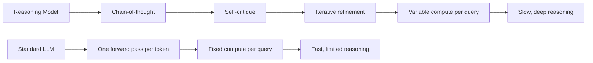
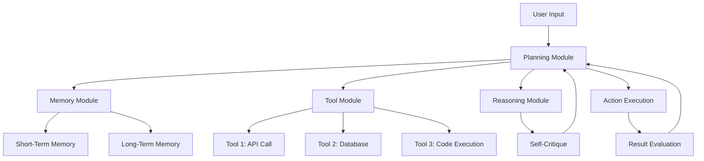
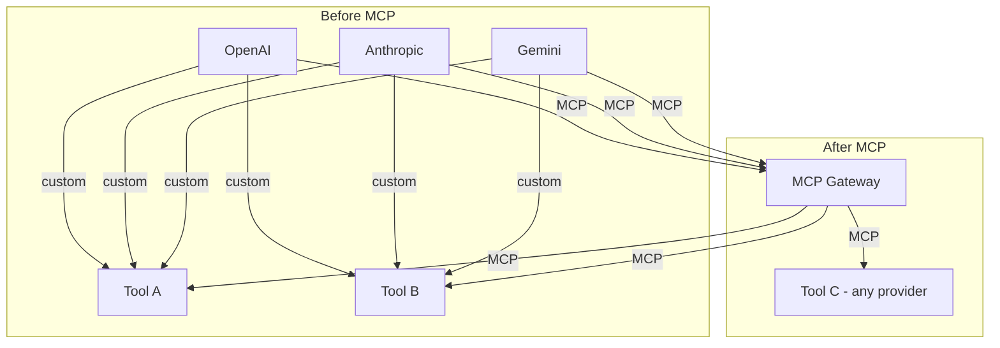
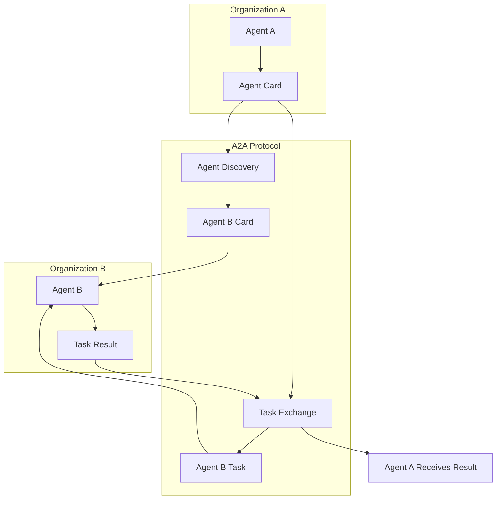
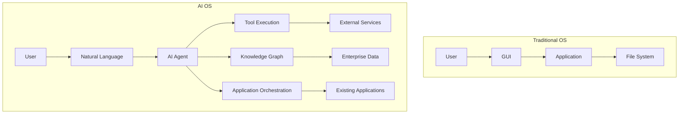
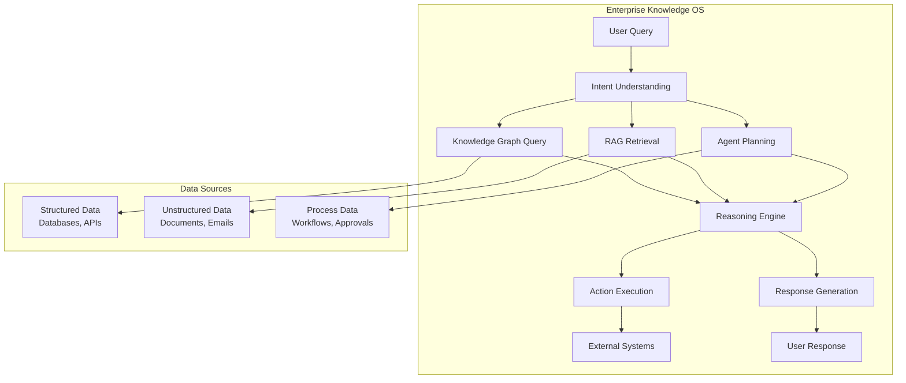
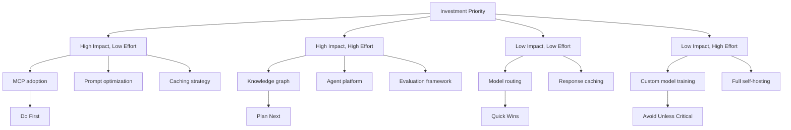

# Chapter 20: Future of GenAI Applications

> "The best way to predict the future is to invent it — but the best way to invent it is to understand the patterns already emerging in the present."

---

## Introduction

The GenAI landscape evolves rapidly. What was cutting-edge six months ago is production infrastructure today. What is research today will be production infrastructure in twelve months. This chapter examines emerging trends and next-generation architectures — not predictions, but patterns already visible in current research and early production systems.

The central thesis of this chapter is **convergence**: the separate threads of GenAI development — reasoning models, agentic systems, standardized protocols, and AI-native architectures — are converging into a unified paradigm. Reasoning models provide the cognitive foundation. Agentic systems provide the action layer. Protocols like MCP and A2A provide the connectivity layer. AI-native architectures provide the infrastructure layer. Together, they form the basis for the next generation of AI applications.

This convergence is not hypothetical. Reasoning models (o3, Claude with extended thinking) are already in production. Agentic systems are handling real workflows. MCP is being adopted by major platforms. The pieces are in place — the question is not whether this convergence will happen, but how fast and what forms it will take.

We will examine the key emerging areas — reasoning models, agentic systems, MCP, agent-to-agent communication — and the next-generation architectures they enable — AI operating systems, enterprise knowledge operating systems, agent commerce. We will also discuss the evolving role of the architect in this new landscape.

### The Convergence Map

| Thread | Current State | Trajectory | Convergence Target |
|--------|--------------|------------|-------------------|
| **Reasoning Models** | o3, Claude thinking, Gemini reasoning | Universal test-time compute | All models reason by default |
| **Agentic Systems** | Single-agent workflows | Multi-agent orchestration | Autonomous enterprises |
| **Protocols (MCP)** | Tool connectivity | Universal data + tool access | Any model + any tool |
| **Protocols (A2A)** | Research / early standard | Cross-organization collaboration | Federated AI systems |
| **AI-Native Architecture** | Chatbots on existing tools | AI-first interfaces | AI operating systems |
| **Knowledge Systems** | RAG + vector stores | Knowledge graphs + reasoning | Enterprise knowledge OS |

### Chapter Roadmap

We will examine:

1. **Reasoning models** — test-time compute, chain-of-thought, universal reasoning
2. **Agentic systems** — planning, tool use, multi-agent orchestration, autonomy
3. **Model Context Protocol (MCP)** — standardized tool and data connectivity
4. **Agent-to-Agent Communication (A2A)** — cross-organization collaboration
5. **AI Operating Systems** — AI-native interfaces and workflows
6. **Enterprise Knowledge Operating Systems** — unified intelligence layers
7. **Agent Commerce** — marketplaces for agent services
8. **The architect's role** — evolving from code to intelligence orchestration

---

## 20.1 Reasoning Models

### 20.1.1 The Reasoning Revolution

Standard LLMs generate responses token by token, allocating roughly the same computational effort to every token. Reasoning models allocate test-time compute based on task complexity — spending more time "thinking" on harder problems and less on simple ones.

This is a fundamental shift. Previous models optimized for training compute (more data, more parameters). Reasoning models optimize for inference compute (more thinking at query time). The result: models that can solve problems standard models cannot — complex math, multi-step planning, nuanced analysis.



### 20.1.2 How Reasoning Models Work

The key technique is chain-of-thought (CoT) reasoning, where the model generates intermediate reasoning steps before producing a final answer:

```python
# Standard LLM call
response = llm.generate("What is 17 * 23?")
# Response: "391" (sometimes wrong, no reasoning visible)

# Reasoning model call
response = llm.generate(
    "What is 17 * 23?",
    thinking=True,  # Enable chain-of-thought
)
# Response includes reasoning:
# "Let me think step by step:
#  17 * 23 = 17 * 20 + 17 * 3
#  = 340 + 51
#  = 391"
# Final answer: 391
```

The reasoning trace is not just for show — it allows the model to catch and correct errors, consider multiple approaches, and arrive at more accurate conclusions. The trade-off: reasoning models are slower and more expensive because they generate more tokens.

### 20.1.3 Reasoning Model Comparison

| Model | Reasoning Approach | Speed vs. Standard | Accuracy Improvement | Cost Premium | Best For |
|-------|-------------------|-------------------|---------------------|-------------|----------|
| o3 (OpenAI) | Explicit chain-of-thought | 2-5x slower | +15-25% on complex tasks | 3-5x | Math, coding, analysis |
| Claude (extended thinking) | Extended thinking blocks | 2-3x slower | +10-20% on complex tasks | 2-4x | Nuanced reasoning, planning |
| Gemini 2.5 Pro | Native reasoning | 1.5-3x slower | +10-15% on complex tasks | 2-3x | Multimodal reasoning |
| DeepSeek-R1 | Open-source reasoning | 2-4x slower | +12-22% on complex tasks | 2-4x | Self-hosted, cost-sensitive |

### 20.1.4 Universal Test-Time Compute

The trajectory is toward universal reasoning: all models will allocate test-time compute based on task complexity. Simple questions get fast, cheap responses. Complex questions get slow, thorough responses. This is already happening with models like Claude that can toggle extended thinking.

```python
class AdaptiveReasoning:
    """Route queries to appropriate reasoning level."""

    REASONING_LEVELS = {
        "none": {"model": "gpt-4o-mini", "thinking": False, "max_tokens": 500},
        "light": {"model": "gpt-4o", "thinking": False, "max_tokens": 1000},
        "standard": {"model": "claude-sonnet-4-20250514", "thinking": True, "max_tokens": 2000},
        "deep": {"model": "o3", "thinking": True, "max_tokens": 4000},
    }

    async def reason(self, query: str, complexity_hint: str = None) -> dict:
        # Determine complexity
        if complexity_hint:
            level = complexity_hint
        else:
            level = await self._assess_complexity(query)

        config = self.REASONING_LEVELS[level]

        response = await self.llm.generate(
            model=config["model"],
            prompt=query,
            thinking=config["thinking"],
            max_tokens=config["max_tokens"],
        )

        return {
            "response": response.text,
            "reasoning_trace": response.thinking if config["thinking"] else None,
            "reasoning_level": level,
            "tokens_used": response.tokens,
            "latency_ms": response.latency,
        }

    async def _assess_complexity(self, query: str) -> str:
        """Classify query complexity for reasoning level selection."""
        simple_indicators = ["what is", "who is", "define", "list"]
        complex_indicators = ["why", "analyze", "compare", "design", "optimize", "prove"]

        lower = query.lower()
        if any(ind in lower for ind in complex_indicators):
            return "deep"
        if any(ind in lower for ind in simple_indicators):
            return "light"
        if len(query) > 200:
            return "standard"
        return "standard"
```

---

## 20.2 Agentic Systems

### 20.2.1 From Chains to Agents

The evolution from simple chains to agentic systems is the most significant architectural shift in GenAI:

| Era | Architecture | Capabilities | Limitations |
|-----|-------------|-------------|-------------|
| 2023 | Simple chains | Prompt → response | Single step, no tools |
| 2024 | RAG + tool calling | Retrieve + act | Single agent, limited planning |
| 2025 | Single agents | Plan + reason + act | Single agent, limited collaboration |
| 2026+ | Multi-agent systems | Collaborative planning + action | Early stage, standardization needed |

### 20.2.2 The Agent Architecture

A production agent has four core components:



**Planning**: The agent breaks complex tasks into steps, sequences them, and handles dependencies. Planning can be explicit (pre-computed plan) or dynamic (re-plan after each step).

**Memory**: Short-term memory holds conversation context. Long-term memory holds learned facts, preferences, and past interactions. The memory architecture determines the agent's ability to learn and adapt.

**Tools**: The agent accesses external systems — APIs, databases, code execution, file systems. Tool calling is the mechanism by which agents affect the real world.

**Reasoning**: The agent evaluates options, makes decisions, and handles ambiguity. Reasoning quality determines the agent's ability to handle complex, multi-step tasks.

### 20.2.3 Multi-Agent Orchestration

The next frontier: multiple agents collaborating on complex tasks.

```python
class MultiAgentOrchestrator:
    """Coordinate multiple specialized agents."""

    def __init__(self):
        self.agents = {
            "researcher": ResearchAgent(),
            "analyst": AnalystAgent(),
            "writer": WriterAgent(),
            "reviewer": ReviewerAgent(),
        }

    async def execute_workflow(self, task: str) -> dict:
        # Step 1: Plan the workflow
        plan = await self._plan_workflow(task)

        # Step 2: Execute each step with appropriate agent
        results = {}
        for step in plan["steps"]:
            agent = self.agents[step["agent"]]
            context = {**results, "task": task, "step": step}

            result = await agent.execute(step["action"], context)
            results[step["id"]] = result

        # Step 3: Review and finalize
        review = await self.agents["reviewer"].review(results)

        return {
            "plan": plan,
            "results": results,
            "review": review,
            "final_output": review["output"],
        }

    async def _plan_workflow(self, task: str) -> dict:
        """Use a planning agent to decompose the task."""
        planner = self.agents["researcher"]  # Researcher doubles as planner

        plan = await planner.plan(
            task,
            available_agents=list(self.agents.keys()),
            available_tools=["web_search", "database_query", "code_execution"],
        )

        return plan
```

### 20.2.4 Agent Autonomy Levels

| Level | Description | Example | Human Oversight |
|-------|------------|---------|----------------|
| **L0: Tool Use** | Agent uses tools, human directs | "Search for X, then summarize" | Every step |
| **L1: Task Execution** | Agent completes a defined task | "Write a report on Y" | Task-level |
| **L2: Workflow Execution** | Agent manages a multi-step workflow | "Process this invoice end-to-end" | Exception handling |
| **L3: Autonomous Operation** | Agent operates independently with goals | "Monitor and optimize ad spend" | Goal-level |
| **L4: Collaborative Autonomy** | Agents collaborate without human oversight | "Market research + content creation + scheduling" | Strategic oversight |

Most production systems are at L1-L2. L3-L4 is emerging but requires robust guardrails, monitoring, and rollback capabilities.

---

## 20.3 Model Context Protocol (MCP)

### 20.3.1 The Connectivity Problem

Today, every LLM provider has its own tool-calling format. Every data source requires custom integration. Every agent framework has its own tool interface. This fragmentation means that connecting a model to a new tool requires writing custom integration code — for every model-tool combination.

MCP (Model Context Protocol) solves this by providing a universal standard for connecting LLMs to tools and data sources.



### 20.3.2 MCP Architecture

```python
class MCPServer:
    """MCP server that exposes tools and data sources."""

    def __init__(self):
        self.tools = {}
        self.resources = {}

    def register_tool(self, name: str, handler: callable, schema: dict):
        """Register a tool that agents can call."""
        self.tools[name] = {
            "handler": handler,
            "schema": schema,
        }

    def register_resource(self, uri: str, provider: callable):
        """Register a data source that agents can query."""
        self.resources[uri] = provider

    async def handle_request(self, request: dict) -> dict:
        """Handle an MCP request from an LLM."""
        method = request.get("method")

        if method == "tools/list":
            return {
                "tools": [
                    {"name": name, "schema": tool["schema"]}
                    for name, tool in self.tools.items()
                ]
            }

        elif method == "tools/call":
            tool_name = request["params"]["name"]
            arguments = request["params"]["arguments"]
            tool = self.tools[tool_name]
            result = await tool["handler"](**arguments)
            return {"content": [{"type": "text", "text": str(result)}]}

        elif method == "resources/read":
            uri = request["params"]["uri"]
            provider = self.resources[uri]
            data = await provider()
            return {"contents": [{"uri": uri, "mimeType": "application/json", "text": str(data)}]}

        return {"error": "Method not found"}

# Example: Register a database tool
mcp_server = MCPServer()

async def query_database(sql: str, database: str = "production") -> list[dict]:
    """Execute SQL query and return results."""
    # Database execution logic
    pass

mcp_server.register_tool(
    name="query_database",
    handler=query_database,
    schema={
        "description": "Execute a read-only SQL query against the database",
        "parameters": {
            "sql": {"type": "string", "description": "SQL query to execute"},
            "database": {"type": "string", "description": "Database name", "default": "production"},
        },
    },
)
```

### 20.3.3 MCP Impact on Development

| Aspect | Before MCP | After MCP | Impact |
|--------|-----------|-----------|--------|
| Adding a new tool | Write model-specific integration | Register with MCP server | 10x faster |
| Supporting new models | Rewrite all tool integrations | Model connects to MCP gateway | 5x faster |
| Tool discovery | Manual documentation | Automatic via MCP protocol | Real-time |
| Security | Per-integration auth | Centralized via MCP gateway | Consistent |
| Cost tracking | Per-integration logging | Centralized via MCP gateway | Unified |

### 20.3.4 MCP Adoption Status

| Platform | MCP Support | Status |
|----------|------------|--------|
| Claude (Anthropic) | Native | Production |
| OpenAI | Supported | Production |
| Google Gemini | Supported | Beta |
| LangChain | Supported | Production |
| LlamaIndex | Supported | Production |
| VS Code | Supported | Production |
| Cursor | Native | Production |

---

## 20.4 Agent-to-Agent Communication (A2A)

### 20.4.1 The Collaboration Problem

Today's agents operate within a single organization. But many workflows span multiple organizations — supply chains, financial transactions, healthcare referrals, legal proceedings. A2A (Agent-to-Agent) protocols enable agents from different organizations to collaborate on shared goals.

### 20.4.2 A2A Architecture



### 20.4.3 A2A Protocol Elements

```python
class AgentCard:
    """Agent capability descriptor for discovery."""

    def __init__(
        self,
        agent_id: str,
        name: str,
        description: str,
        capabilities: list[str],
        endpoint: str,
        authentication: str,
    ):
        self.agent_id = agent_id
        self.name = name
        self.description = description
        self.capabilities = capabilities
        self.endpoint = endpoint
        self.authentication = authentication

    def to_dict(self) -> dict:
        return {
            "agent_id": self.agent_id,
            "name": self.name,
            "description": self.description,
            "capabilities": self.capabilities,
            "endpoint": self.endpoint,
            "authentication": self.authentication,
            "protocol_version": "1.0",
        }

class A2AClient:
    """Client for agent-to-agent communication."""

    def __init__(self):
        self.discovered_agents: dict[str, AgentCard] = {}

    async def discover_agents(self, capability: str) -> list[AgentCard]:
        """Discover agents with a specific capability."""
        # In production, this would query a registry
        return [
            agent for agent in self.discovered_agents.values()
            if capability in agent.capabilities
        ]

    async def send_task(
        self,
        target_agent: AgentCard,
        task: dict,
    ) -> dict:
        """Send a task to another agent."""
        # Authenticate with target agent
        auth_token = await self._authenticate(target_agent)

        # Send task via A2A protocol
        response = await httpx.post(
            f"{target_agent.endpoint}/tasks",
            json={
                "task_id": str(uuid.uuid4()),
                "type": task["type"],
                "payload": task["payload"],
                "callback_url": self.callback_url,
            },
            headers={"Authorization": f"Bearer {auth_token}"},
        )

        return response.json()

    async def handle_task_result(self, result: dict):
        """Handle result from another agent."""
        task_id = result["task_id"]
        status = result["status"]
        output = result["output"]

        # Process result based on task type
        if status == "completed":
            await self._process_completed_task(task_id, output)
        elif status == "failed":
            await self._handle_failed_task(task_id, output)
```

### 20.4.4 A2A Use Cases

| Use Case | Organizations | Workflow | A2A Benefit |
|----------|--------------|----------|-------------|
| Supply chain | Manufacturer + logistics + retailer | Order → ship → receive | Real-time coordination |
| Healthcare | Hospital + lab + insurance | Test → diagnose → approve | Faster patient care |
| Financial | Bank + compliance + auditor | Transaction → verify → report | Automated compliance |
| Legal | Firm + court + opposing counsel | File → serve → respond | Process automation |
| Research | University + pharma + regulator | Discover → test → approve | Accelerated R&D |

---

## 20.5 AI Operating Systems

### 20.5.1 The AI-Native Interface

The current paradigm: users interact with applications through graphical interfaces (clicks, menus, forms). The AI paradigm: users interact with systems through natural language, and AI agents execute the actions.

This is not chatbots bolted onto existing tools. It is a fundamentally new interface paradigm where the primary interaction is conversational, the logic is agent-driven, and the data layer is a knowledge graph.



### 20.5.2 AI OS Architecture

```python
class AIOperatingSystem:
    """AI-native operating system for enterprise use."""

    def __init__(self):
        self.agent = CoreAgent()
        self.knowledge_graph = EnterpriseKnowledgeGraph()
        self.tool_registry = MCPToolRegistry()
        self.application_manager = ApplicationManager()
        self.security = SecurityLayer()

    async def handle_user_intent(self, intent: str, context: dict) -> dict:
        """Process user intent through the AI OS."""

        # Step 1: Understand intent
        parsed_intent = await self.agent.understand(intent, context)

        # Step 2: Check permissions
        authorized = await self.security.authorize(
            user=context["user_id"],
            action=parsed_intent["action"],
            resources=parsed_intent["resources"],
        )

        if not authorized:
            return {"error": "Unauthorized action"}

        # Step 3: Plan execution
        plan = await self.agent.plan(
            intent=parsed_intent,
            available_tools=self.tool_registry.list_tools(),
            knowledge=self.knowledge_graph.query(parsed_intent["topic"]),
        )

        # Step 4: Execute plan
        results = await self.agent.execute(plan)

        # Step 5: Return human-readable response
        response = await self.agent.format_response(results, parsed_intent)

        return response
```

### 20.5.3 AI OS vs. Traditional OS

| Aspect | Traditional OS | AI OS |
|--------|---------------|-------|
| Interface | GUI (clicks, forms) | Natural language |
| Logic | Application code | Agent reasoning |
| Data | File system / database | Knowledge graph |
| Tools | Application integrations | MCP-registered tools |
| Workflows | Manual orchestration | Agent-planned execution |
| Learning | None (static) | Continuous from usage |
| Multi-tasking | User manages | Agent manages |

---

## 20.6 Enterprise Knowledge Operating Systems

### 20.6.1 Beyond Search

Enterprise knowledge operating systems combine RAG, knowledge graphs, agent workflows, and enterprise data into a unified intelligence layer. They go beyond search — they reason over organizational knowledge and take actions.



### 20.6.2 Knowledge Graph Integration

```python
class EnterpriseKnowledgeOS:
    """Unified intelligence layer over enterprise data."""

    def __init__(self):
        self.knowledge_graph = KnowledgeGraph()
        self.vector_store = VectorStore()
        self.agent = ReasoningAgent()
        self.action_engine = ActionEngine()

    async def reason_and_act(self, query: str, user_context: dict) -> dict:
        """Reason over enterprise knowledge and take action."""

        # Step 1: Query knowledge graph for structured relationships
        graph_results = await self.knowledge_graph.query(
            query,
            filters={"tenant": user_context["tenant_id"]},
        )

        # Step 2: Query vector store for relevant documents
        doc_results = await self.vector_store.search(
            query,
            filters={"collection": user_context["accessible_collections"]},
        )

        # Step 3: Reason over combined knowledge
        reasoning = await self.agent.reason(
            query=query,
            graph_context=graph_results,
            document_context=doc_results,
            user_context=user_context,
        )

        # Step 4: Determine if action is needed
        if reasoning["requires_action"]:
            action_result = await self.action_engine.execute(
                reasoning["action_plan"],
                user_context=user_context,
            )
            return {
                "reasoning": reasoning["explanation"],
                "action_taken": action_result,
                "sources": reasoning["sources"],
            }

        return {
            "reasoning": reasoning["explanation"],
            "answer": reasoning["answer"],
            "sources": reasoning["sources"],
        }
```

---

## 20.7 Agent Commerce

### 20.7.1 The Agent Marketplace

As agents become more capable, they will offer services to other agents. An agent specialized in legal document review can be hired by an agent managing a contract negotiation. An agent specialized in financial analysis can be engaged by an agent planning an acquisition.

```python
class AgentMarketplace:
    """Marketplace for agent services."""

    def __init__(self):
        self.service_registry: dict[str, AgentService] = {}
        self.transaction_log: list[dict] = []

    def list_service(self, service: AgentService):
        """List an agent service for hire."""
        self.service_registry[service.service_id] = service

    async def find_service(self, capability: str, budget: float) -> list[AgentService]:
        """Find agents offering a specific capability within budget."""
        return [
            s for s in self.service_registry.values()
            if capability in s.capabilities
            and s.price_per_invocation <= budget
        ]

    async def hire_service(
        self,
        service_id: str,
        task: dict,
        budget: float,
    ) -> dict:
        """Hire an agent service to complete a task."""
        service = self.service_registry[service_id]

        if service.price_per_invocation > budget:
            return {"error": "Budget exceeded"}

        # Execute the service
        result = await service.execute(task)

        # Log transaction
        self.transaction_log.append({
            "service_id": service_id,
            "task": task,
            "result": result,
            "cost": service.price_per_invocation,
            "timestamp": time.time(),
        })

        return result

@dataclass
class AgentService:
    service_id: str
    name: str
    description: str
    capabilities: list[str]
    price_per_invocation: float
    sla_latency_ms: int
    accuracy_score: float

    async def execute(self, task: dict) -> dict:
        """Execute a task (implemented by specific service)."""
        raise NotImplementedError
```

### 20.7.2 Agent Commerce Models

| Model | Description | Example | Pricing |
|-------|------------|---------|---------|
| **Pay-per-invocation** | Fixed cost per task | Legal document review | $0.10/document |
| **Subscription** | Monthly access to agent | Financial analysis agent | $500/month |
| **Outcome-based** | Pay on success | Contract negotiation agent | 1% of deal value |
| **Auction** | Bidding for tasks | Specialized research agent | Market-driven |

---

## 20.8 The Architect's Role

### 20.8.1 The Evolving Skill Set

The architect's role evolves with the technology:

| Era | Primary Skills | Focus |
|-----|---------------|-------|
| **Past** | APIs, databases, infrastructure | Building and scaling systems |
| **Present** | RAG, vector stores, prompt engineering | Building AI applications |
| **Future** | Agent platforms, knowledge graphs, protocols | Designing intelligence orchestration |

### 20.8.2 What Stays the Same

The core engineering discipline does not change:

1. **Understanding trade-offs**: Every architectural decision involves trade-offs. Speed vs. accuracy, cost vs. quality, autonomy vs. control. The trade-offs change; the discipline of analyzing them does not.

2. **Designing for constraints**: Every system operates under constraints — budget, latency, compliance, scale. The architect's job is to design within constraints, not ignore them.

3. **Building for production**: Prototypes demonstrate feasibility. Production systems require reliability, scalability, security, and maintainability. The gap between prototype and production is the architect's domain.

4. **Managing complexity**: As systems become more complex (multi-agent, multi-model, multi-protocol), the architect's role in managing that complexity becomes more critical.

### 20.8.3 What Changes

New skills required:

1. **Agent design**: Designing agent architectures, multi-agent orchestration, and autonomy levels.

2. **Protocol literacy**: Understanding MCP, A2A, and emerging standards for connectivity.

3. **Knowledge engineering**: Designing knowledge graphs, ontologies, and reasoning systems.

4. **Evaluation methodology**: Evaluating probabilistic systems requires new metrics and methodologies beyond traditional software testing.

5. **Cost modeling**: GenAI costs are dynamic and model-dependent. Architectural decisions directly impact costs in ways that traditional infrastructure does not.

---

## 20.9 Preparing for the Future

### 20.9.1 Architectural Decisions That Future-Proof

| Decision | Rationale | Risk if Ignored |
|----------|-----------|-----------------|
| **Adopt MCP early** | Universal tool connectivity | Fragmented integrations, vendor lock-in |
| **Design for agent autonomy** | Agents will handle more tasks | Re-architecture when autonomy increases |
| **Build knowledge graphs** | Structured reasoning over data | RAG alone insufficient for complex reasoning |
| **Plan for multi-agent** | Single-agent systems hit limits | Cannot scale to complex workflows |
| **Invest in evaluation** | Quality measurement is the bottleneck | Ship products you cannot improve |
| **Design for explainability** | Trust requires understanding | Cannot debug or audit agent decisions |

### 20.9.2 Investment Priorities



---

## 20.10 Key Takeaways

1. **Reasoning models are the biggest near-term improvement.** They solve complex tasks that standard models cannot — math, planning, multi-step analysis. The trajectory is toward universal reasoning: all models will allocate compute based on task complexity.

2. **Agentic systems are moving from prototype to production.** The key enablers are better tool calling, more reliable planning, and improved state management. Master agent architectures now — they will be the dominant paradigm within 2 years.

3. **MCP will standardize tool connectivity.** Any model will connect to any tool through a universal protocol. Build for MCP compatibility now to avoid fragmented integrations later.

4. **A2A will enable cross-organization collaboration.** Agents from different organizations will collaborate on shared tasks. This enables federated AI systems for supply chains, healthcare, finance, and research.

5. **AI operating systems are the long-term vision.** Not chatbots added to existing tools, but new paradigms where the interface is conversational, the logic is agent-driven, and the data layer is a knowledge graph.

6. **Enterprise knowledge operating systems go beyond search.** They combine RAG, knowledge graphs, agent workflows, and enterprise data into a unified intelligence layer that reasons over organizational knowledge and takes actions.

7. **Agent commerce is emerging.** Marketplaces where agents trade services will enable complex multi-organization workflows. Agents hiring other agents, negotiating terms, and completing tasks.

8. **The architect's role is evolving from code to intelligence orchestration.** The core discipline (trade-offs, constraints, production-readiness) stays the same. The tools (agents, protocols, knowledge graphs) are new.

9. **Future-proof by adopting standards early.** MCP, knowledge graphs, and agent architectures are the foundation. Invest in them now, even if current applications do not require them.

10. **The future is AI-native.** Not AI added to existing systems, but new systems designed for AI from the ground up. The interface is natural language. The logic is agent-driven. The data is a knowledge graph. Build for this world.

---

## 20.11 Further Reading

- **"Superintelligence" by Nick Bostrom** — Chapter 4 (Orthogonality Thesis) and Chapter 8 (Convergent Instrumental Goals) provide the theoretical foundation for understanding agent behavior and alignment.

- **"Life 3.0" by Max Tegmark** — Chapter 7 (Intelligence) covers the trajectory from narrow AI to general intelligence, including the societal implications.

- **Anthropic MCP Documentation** (modelcontextprotocol.io) — The official specification and implementation guide for the Model Context Protocol.

- **Google A2A Protocol Research** (developers.googleblog.com) — Technical overview of the Agent-to-Agent protocol and its design principles.

- **"AI Agents: A Comprehensive Survey" (2024)** — Academic survey of agent architectures, planning methods, and multi-agent systems.

- **"The Bitter Lesson" by Rich Sutton** — Classic essay on how general methods that leverage computation tend to win over specialized methods, directly applicable to the reasoning model trend.

- **"Systems That Work" by Emily Bender and Alexander Koller** — Critical examination of LLM capabilities and limitations, essential reading for understanding what agents can and cannot do.

- **OpenAI o3 Technical Report** — Technical details on reasoning model architecture, training, and evaluation.

- **"Building Agents with LangChain" (LangChain Documentation)** — Practical guide to building single-agent and multi-agent systems.

- **"The Age of AI" by Henry Kissinger, Eric Schmidt, and Daniel Huttenlocher** — Chapter 5 (AI and World Order) covers the geopolitical implications of AI agent systems.

- **"Architecting for the Future" (ThoughtWorks Technology Radar)** — Bi-annual technology assessment including AI agent patterns, protocols, and architectural trends.

- **MCP Specification (GitHub: modelcontextprotocol)** — The open-source specification and reference implementations for the Model Context Protocol.
