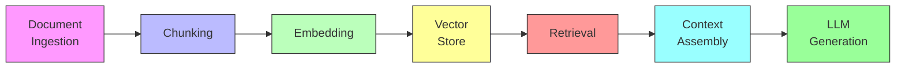
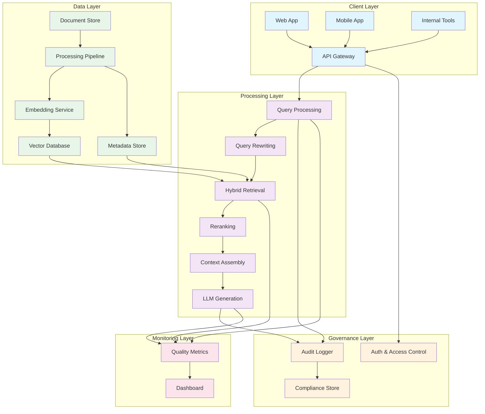

# Introduction: Why This Book Exists

> "The goal is not to build a RAG system. The goal is to build a knowledge system that happens to use RAG as its retrieval mechanism."

---

**Last verified: June 2026.** Model names, pricing, and context windows change frequently. Verify current details at provider websites before making architectural decisions.

## Introduction

Most engineers can build a simple RAG system in an afternoon. Embeddings, vector database, prompt template, done. The notebook demo works. The Slack demo works. Then someone asks to process 50,000 legal contracts with access control, audit trails, and sub-second latency, and the entire architecture collapses under its own weight.

The gap between a notebook demo and a production RAG system is not a gradient — it is a chasm. It spans information retrieval, search engineering, knowledge management, distributed systems, evaluation, governance, and AI architecture. These are not the same disciplines, and they do not live in the same teams. A Principal GenAI Architect must orchestrate all of them, often simultaneously, under enterprise constraints that no tutorial mentions.

This book exists because the existing literature fails at the intersection of depth and breadth. Papers on retrieval are dense but disconnected from engineering reality. Framework documentation is practical but shallow. Blog posts are shallow and often wrong. Enterprise architects need a single reference that covers the full discipline — from classical information retrieval theory to cutting-edge agentic RAG patterns — with the depth required to make architectural decisions and the breadth to understand the trade-offs across the entire pipeline.

### The State of RAG in 2026

RAG has evolved from a research curiosity to the default architectural pattern for grounding LLMs in factual data. Every major enterprise — from healthcare to finance to legal to technology — is building or operating RAG systems. The technology has matured: embedding models are more powerful, vector databases are more scalable, reranking models are more accurate, and LLMs are better at using retrieved context.

But maturity does not mean simplicity. The surface area of a production RAG system has expanded faster than the tooling has simplified it. A modern RAG system might involve:

- Multiple retrieval strategies (dense, sparse, hybrid, graph-based)
- Complex document processing pipelines (PDFs, OCR, tables, images)
- Sophisticated chunking strategies (semantic, hierarchical, parent-child)
- Reranking models (cross-encoders, LLM-based, ColBERT)
- Context engineering (prompt templates, context compression, relevance filtering)
- Access control and multi-tenancy
- Evaluation frameworks (offline metrics, online A/B tests, human evaluation)
- Production infrastructure (monitoring, alerting, cost tracking)

Each of these is a deep discipline. This book covers all of them, with the understanding that the reader needs to make architectural decisions across the entire stack.

### Who This Book Is For

This book is written for Principal GenAI Architects, Senior ML Engineers, and Platform Engineers responsible for designing and operating enterprise-scale RAG systems. The reader is expected to:

- Understand LLM fundamentals (prompting, tokens, context windows)
- Have experience with Python or TypeScript in production
- Be comfortable with distributed systems concepts
- Have working knowledge of information retrieval (or be willing to learn it from this book)

The book is not a tutorial. It does not walk you through building a chatbot. It explains the engineering decisions behind production RAG systems, shows the trade-offs, and grounds everything in enterprise constraints. Code appears where it genuinely clarifies a concept. Diagrams appear where they genuinely clarify architecture.

### How This Book Is Organized

The book follows the lifecycle of a RAG system, from foundational concepts to enterprise operations.

**Part I: Foundations (Chapters 1-6)** covers the fundamental building blocks: RAG concepts, information retrieval theory, document processing, chunking strategies, embedding models, and vector databases. These chapters establish the vocabulary and mental models needed for the rest of the book.

**Part II: Retrieval Engineering (Chapters 7-12)** covers the retrieval pipeline in depth: retrieval strategies, reranking, context engineering, knowledge graph RAG, multimodal RAG, and agentic RAG. These chapters address the quality challenges that separate production systems from demos.

**Part III: Enterprise Operations (Chapters 13-16)** covers production concerns: evaluation, production architecture, security, and advanced enterprise patterns. These chapters address the organizational and operational challenges of running RAG at scale.

Each chapter follows a consistent structure: explain the concept, show the trade-offs, map to enterprise constraints, and ground in a real-world scenario. This structure ensures that the reader can use each chapter as a reference without reading the entire book sequentially.

### The RAG Quality Problem

The central thesis of this book is that RAG quality is determined by the weakest link in the pipeline. A state-of-the-art LLM cannot compensate for poor retrieval. Perfect chunking cannot compensate for a bad embedding model. The entire pipeline must be engineered as a system, with each component evaluated independently and in combination.

Consider a concrete example. A legal research firm builds a RAG system to search 100,000 contracts. The embedding model is excellent (state-of-the-art on MTEB). The vector database is fast (sub-10ms queries). The LLM is powerful (GPT-4o). But the chunking strategy splits contracts at fixed 512-token boundaries, breaking clauses across chunks. The result: precision@5 is 45%. The model sees fragments of clauses without context, generating answers that sound plausible but are legally wrong.

The fix is not a better LLM or a better embedding model. The fix is semantic chunking that respects clause boundaries. The quality bottleneck was chunking, not retrieval or generation. This pattern — the quality bottleneck moving through the pipeline as you improve individual components — is the core engineering challenge of RAG systems.

### The Enterprise Constraint Space

Enterprise RAG systems operate under constraints that academic systems do not. These constraints shape every architectural decision:

| Constraint | Impact on Architecture |
|------------|----------------------|
| **Access control** | Users can only retrieve documents they have permission to see. Requires document-level or field-level permissions at the vector store level. |
| **Audit trails** | Every query, retrieval, and generation must be logged for compliance. Requires immutable logging infrastructure. |
| **Data residency** | Documents must stay in specific geographic regions. Requires region-aware vector stores and processing pipelines. |
| **Latency SLAs** | Users expect sub-second responses. Constrains the retrieval pipeline: no expensive reranking on every query. |
| **Cost budgets** | Enterprise finance teams track cost per query. Requires careful management of embedding calls, LLM calls, and vector store operations. |
| **Freshness requirements** | Documents change. Embeddings must be updated when source documents change. Requires incremental re-embedding pipelines. |
| **Multi-tenancy** | Multiple business units share the infrastructure but must not see each other's data. Requires tenant-aware indexing and retrieval. |

These constraints are not optional. They are the price of admission for enterprise deployment. This book treats them as first-class concerns, not afterthoughts.

### The RAG Maturity Model

Enterprise RAG systems evolve through four maturity levels:

| Level | Description | Capabilities | Typical Organization |
|-------|-------------|-------------|---------------------|
| **Level 1: Prototype** | Basic embedding + vector search | Simple QA, single document type | Startup, small team |
| **Level 2: Production** | Hybrid search, reranking, evaluation | Multi-document QA, basic access control | Mid-size company |
| **Level 3: Enterprise** | Access control, audit trails, multi-tenancy | Regulated industries, multiple business units | Enterprise |
| **Level 4: Adaptive** | Agentic RAG, knowledge graphs, self-improving | Complex reasoning, multi-modal, autonomous | Advanced enterprise |

Most organizations are at Level 1 or 2. This book covers all four levels, with the understanding that the reader may be at any point on this spectrum.

### The Retrieval-Generation Feedback Loop

A critical insight that many RAG practitioners miss: retrieval quality and generation quality are not independent. The LLM's ability to use retrieved context depends on the relevance and formatting of that context. Retrieval quality depends on the embedding model's understanding of what constitutes "relevant" — which is influenced by the generation model's ability to use different types of context.

This feedback loop means that optimizing retrieval in isolation can miss opportunities. A retrieval system that returns 10 moderately relevant chunks may outperform one that returns 3 highly relevant chunks, because the LLM can synthesize across multiple sources. The optimal retrieval strategy depends on the generation model, and vice versa.

### What This Book Does Not Cover

To maintain focus and depth, this book does not cover:

- **LLM fundamentals**: We assume the reader understands tokens, context windows, and prompting. If you need this foundation, read "Build a Large Language Model (From Scratch)" by Sebastian Raschka.
- **General machine learning**: This is not an ML textbook. We cover the specific ML techniques relevant to RAG (embeddings, reranking) but not general ML theory.
- **Specific framework tutorials**: We reference LangChain, LlamaIndex, and other frameworks but do not provide step-by-step tutorials. Framework documentation serves this purpose.
- **Non-English RAG**: While the principles apply universally, the book focuses on English-language systems for simplicity.

### A Note on Code Examples

Code examples in this book are written in Python and use current (as of June 2026) library versions. We use:

- **LangChain/LangGraph** for orchestration examples
- **LlamaIndex** for retrieval pipeline examples
- **OpenAI / Anthropic / Cohere APIs** for LLM and embedding examples
- **Elasticsearch / OpenSearch** for hybrid search examples
- **Pydantic** for schema validation
- **Pytest** for testing examples

All code is illustrative. Production implementations will differ based on your infrastructure, team, and constraints. The goal is to clarify concepts, not to provide copy-paste solutions.

### How to Read This Book

If you are new to RAG, start with Part I (Chapters 1-6) to build a solid foundation. Then read Chapter 7 (Retrieval Strategies) and Chapter 10 (Context Engineering) — these two chapters deliver the highest ROI for improving RAG quality.

If you are experienced with RAG but struggling with production quality, skip to Part II (Chapters 7-12) and focus on reranking (Chapter 8), context engineering (Chapter 10), and evaluation (Chapter 13).

If you are building enterprise RAG and need to address governance and operations, go directly to Part III (Chapters 13-16).

If you are a Principal GenAI Architect designing a new system, read the entire book sequentially. The architectural decisions in later chapters depend on the foundational concepts in earlier chapters.

---

## 0.1 The Cost of Getting RAG Wrong

Before diving into the technical content, it is worth understanding the cost of poor RAG implementation. Enterprise RAG failures are expensive:

| Failure Mode | Cost | Example |
|-------------|------|---------|
| **Poor retrieval quality** | Wasted LLM tokens on irrelevant context | $0.002-0.01 per wasted query |
| **Hallucination from bad context** | Incorrect answers, legal liability | Potentially unlimited |
| **Missed relevant documents** | Users lose trust, revert to manual search | Reduced productivity |
| **Slow retrieval** | Users abandon the system | Lost investment |
| **Data leakage** | Regulatory fines, reputation damage | $10K-$1M+ per incident |
| **Pipeline failures** | System downtime, SLA breaches | $1K-$100K per hour |

These are not theoretical risks. They are the daily reality of poorly implemented RAG systems. This book exists to help you avoid them.

---

## 0.2 The RAG Pipeline Overview

The standard RAG pipeline has five stages, each introducing potential quality loss:



Each stage is a potential failure point. The pipeline's overall quality is bounded by its weakest stage. This book devotes entire chapters to each stage because each stage deserves deep analysis.

---

## 0.3 Comparison: Approaches to Grounding LLMs

RAG is not the only way to ground LLMs in factual data. The following table compares the major approaches:

| Approach | How It Works | Knowledge Updates | Citation Support | Cost Model | Best For |
|----------|-------------|-------------------|-----------------|------------|----------|
| **RAG** | Retrieve relevant documents at query time, include in prompt | Real-time (re-index) | Natural (source documents) | Per-query (retrieval + LLM) | Dynamic knowledge, regulated industries |
| **Fine-tuning** | Train model on domain-specific data | Requires retraining | No inherent support | High upfront, low per-query | Consistent formatting, domain reasoning |
| **Prompt engineering** | Include facts in the system prompt | Manual (edit prompt) | Limited by context window | Low upfront, high per-query | Small knowledge bases |
| **Knowledge graphs** | Query structured relationships | Graph updates | Explicit relationships | Medium upfront, low per-query | Relationship-heavy domains |
| **Hybrid (RAG + fine-tuning)** | RAG for knowledge, fine-tuned model for reasoning | Both | Via RAG | Medium upfront, medium per-query | High-quality domain-specific QA |

For most applications, RAG is the right default choice. Fine-tune only when you have quantified evidence that RAG plus prompt engineering is insufficient. This book focuses primarily on RAG but covers knowledge graphs (Chapter 11) and hybrid approaches where relevant.

---

## 0.4 The Enterprise RAG Architecture

A production RAG system requires infrastructure beyond the core pipeline. The following diagram shows a typical enterprise RAG architecture:



This architecture is what separates enterprise RAG from a notebook demo. The governance layer (access control, audit logging, compliance) and monitoring layer (quality metrics, dashboards) are not optional — they are requirements for production deployment in regulated industries.

---

## 0.5 What Makes RAG Hard

RAG appears simple. Embed documents, store in a vector database, retrieve relevant chunks, generate answers. But the simplicity is deceptive. Each step has dozens of decisions, each decision has trade-offs, and the trade-offs interact in ways that are not obvious until you are in production.

### The Chunking Problem

How do you split a 50-page legal contract into retrievable units? Fixed-size chunks break clauses across boundaries. Semantic chunks may split a definition from its usage. Section-based chunks may be too large for precise retrieval. The "right" chunking strategy depends on your documents, your queries, and your LLM — and there is no universal answer.

### The Embedding Problem

Which embedding model do you use? A general-purpose model may not capture domain-specific terminology. A domain-specific model may not generalize. The embedding model's context window limits how much text it can embed at once. Long documents require hierarchical embeddings. The embedding model is the foundation of retrieval quality — a mismatch here means relevant documents are never found.

### The Retrieval Problem

Do you use dense (semantic) search, sparse (keyword) search, or both? Dense search captures meaning but misses exact terms. Sparse search captures exact terms but misses meaning. How do you combine them? How do you weight them? How do you handle queries that need both approaches?

### The Reranking Problem

Initial retrieval is fast but imprecise. Reranking is accurate but slow and expensive. How many candidates do you rerank? Do you rerank on every query, or only when initial retrieval confidence is low? The reranking model's latency directly impacts user experience.

### The Context Problem

How many chunks do you include in the prompt? Too few and you miss relevant information. Too many and you add noise. How do you order them? How do you handle contradictions across chunks? How do you fit everything within the LLM's context window while leaving room for the query and response?

### The Evaluation Problem

How do you measure RAG quality? Offline metrics (precision, recall, MRR) do not capture end-to-end answer quality. Human evaluation is expensive and slow. Online metrics (user feedback, click-through rates) are noisy. The evaluation framework determines what you can improve — and what you cannot see, you cannot fix.

These problems are the subject of this book. Each chapter addresses one or more of them, with the depth required to make informed architectural decisions.

---

## 0.6 Case Study Preview: Legal Research RAG

Throughout this book, we reference a running case study: a legal research firm building a RAG system to search 100,000 contracts. The system must:

- Support 200+ users with role-based access control
- Process queries in under 2 seconds
- Achieve 90%+ precision@5 for clause-level retrieval
- Maintain audit trails for all queries
- Handle contract updates without full re-indexing
- Cost less than $0.05 per query

The following table summarizes the case study's architecture choices, which we will revisit throughout the book:

| Component | Choice | Rationale |
|-----------|--------|-----------|
| **Document store** | PostgreSQL with JSONB | Mature, supports access control, audit trails |
| **Embedding model** | Cohere Embed v3 | Strong on legal text, 512 token input |
| **Vector database** | Weaviate | Hybrid search native, multi-tenancy support |
| **Reranking model** | Cohere Rerank v3 | High accuracy on legal text, fast inference |
| **Chunking strategy** | Section-based + parent-child | Respects contract structure, supports both precise and contextual retrieval |
| **Orchestration** | LangGraph | Supports complex retrieval workflows, human-in-the-loop |
| **Monitoring** | Custom + LangSmith | Quality metrics, cost tracking, latency monitoring |
| **Access control** | Document-level ACLs in PostgreSQL | Checked at retrieval time, not index time |

We will use this case study to illustrate how the concepts in each chapter apply to a real-world system with real constraints.

---

## 0.7 The Evaluation Framework

Every chapter in this book includes evaluation criteria. RAG quality cannot be improved without measurement. The following framework underpins all evaluations:

```mermaid
graph TD
    A[RAG Quality] --> B[Retrieval Quality]
    A --> C[Generation Quality]
    A --> D[End-to-End Quality]
    
    B --> B1[Precision@K]
    B --> B2[Recall@K]
    B --> B3[MRR]
    B --> B4[NDCG]
    
    C --> C1[Faithfulness]
    C --> C2[Relevance]
    C --> C3[Coherence]
    
    D --> D1[Answer Correctness]
    D --> D2[User Satisfaction]
    D --> D3[Task Completion]
```

This framework separates retrieval quality (are we finding the right documents?), generation quality (is the LLM using the context well?), and end-to-end quality (is the system producing correct answers?). Most RAG quality problems are retrieval problems — the LLM is fine, but it is seeing the wrong information. Measuring retrieval quality independently from generation quality is essential for diagnosing and fixing quality issues.

---

## 0.8 Cost Model Overview

Enterprise RAG costs are driven by four components. Understanding these cost drivers is essential for architectural decisions:

| Cost Component | Typical Share | Key Lever |
|---------------|--------------|-----------|
| **Embedding** | 5-10% | Batch embedding, model selection |
| **Retrieval** | 10-20% | Vector database sizing, index optimization |
| **Reranking** | 15-25% | Candidate count, model selection |
| **LLM generation** | 50-70% | Model selection, context window management |

The LLM generation cost dominates. Reducing context window usage — through context compression, relevance filtering, or better chunking — has the highest impact on total cost. A 50% reduction in context tokens directly translates to a 25-35% reduction in total RAG cost.

For the legal research case study, the cost breakdown looks like this:

| Component | Cost per Query | Notes |
|-----------|---------------|-------|
| Embedding (query) | $0.0001 | Cohere Embed v3 |
| Vector search | $0.00005 | Weaviate cloud |
| Reranking | $0.001 | Cohere Rerank v3, 20 candidates |
| LLM generation | $0.025 | GPT-4o, ~2000 context tokens |
| **Total** | **$0.026** | |

At 10,000 queries per day, this is $260/day or $7,800/month. Under the $0.05/query target. But if context window usage doubles (poor chunking, no compression), the LLM cost doubles to $0.050, pushing the total to $0.051 — above the target. Cost management is quality management.

---

## 0.9 Testing Strategy Overview

Testing RAG systems requires testing each pipeline stage independently and the pipeline as a whole. The following table summarizes the testing approach for each stage:

| Stage | Test Type | Metric | Tool |
|-------|----------|--------|------|
| Document ingestion | Unit tests | Parse accuracy | Pytest + golden documents |
| Chunking | Unit + integration | Boundary quality | Pytest + manual review |
| Embedding | Benchmark | MTEB scores, domain similarity | MTEB, custom benchmarks |
| Retrieval | Offline evaluation | Precision, recall, MRR, NDCG | Ragas, custom evaluation |
| Reranking | Offline evaluation | Precision improvement | Ragas, custom evaluation |
| Generation | Human evaluation + LLM-as-judge | Faithfulness, relevance | Ragas, Prometheus |
| End-to-end | User acceptance testing | Task completion rate | User studies, A/B tests |

The testing strategy is not a one-time effort. It is a continuous process that runs in CI/CD, monitors production quality, and feeds back into system improvements. Chapter 13 covers testing and evaluation in depth.

---

## 0.10 The Roadmap for Enterprise RAG

Building a production RAG system is a multi-month effort. The following roadmap reflects the typical enterprise timeline:

| Phase | Duration | Deliverables |
|-------|----------|-------------|
| **Phase 1: Foundation** | 4-6 weeks | Document processing pipeline, embedding service, vector store |
| **Phase 2: Retrieval** | 4-6 weeks | Hybrid search, reranking, basic query processing |
| **Phase 3: Generation** | 2-4 weeks | Context assembly, prompt templates, LLM integration |
| **Phase 4: Quality** | 4-8 weeks | Evaluation framework, quality monitoring, A/B testing |
| **Phase 5: Enterprise** | 6-10 weeks | Access control, audit trails, multi-tenancy |
| **Phase 6: Operations** | Ongoing | Monitoring, alerting, cost optimization, quality improvement |

The critical insight: Phase 4 (Quality) is not optional and is not a quick pass. Most enterprise RAG systems spend more time on quality engineering than on initial development. This investment is what separates production systems from demos.

---

## 0.11 Decision Framework for RAG Architecture

The following decision table maps enterprise constraints to architectural choices. Refer to this table when making initial design decisions:

| Enterprise Constraint | Architectural Implication | Recommended Approach |
|----------------------|--------------------------|---------------------|
| **Regulated industry** | Audit trails, access control, data residency | PostgreSQL + document-level ACLs + immutable audit logs |
| **High query volume (>10K/day)** | Cost management, latency optimization | Hybrid search + selective reranking + context compression |
| **Frequently changing documents** | Incremental re-embedding | Change detection + targeted re-embedding |
| **Multi-modal content** | Images, tables, code | Multimodal embedding + specialized parsers |
| **Complex queries** | Query decomposition, multi-step retrieval | Agentic RAG + query planning |
| **Low latency requirement (<1s)** | Pipeline optimization | Cache + early termination + async processing |
| **Tight cost budget** | Model selection, context management | Smaller models + compression + batching |
| **Multi-language support** | Language-aware embeddings, translation | Multilingual models + language detection |

These constraints are not independent. A regulated industry with high query volume and tight cost budgets requires careful architectural trade-offs across all three dimensions. This book helps you navigate those trade-offs.

---

## 0.12 Key Takeaways

1. **The gap between a notebook demo and production RAG is enormous.** It spans retrieval engineering, document processing, evaluation, governance, and operations. Plan for this complexity from the start.

2. **RAG quality is determined by the weakest link in the pipeline.** A state-of-the-art LLM cannot compensate for poor retrieval. Optimize each stage independently and in combination.

3. **Enterprise constraints are first-class architectural concerns.** Access control, audit trails, data residency, and cost budgets shape every decision. They are not afterthoughts.

4. **Hybrid search (dense + sparse) is the production standard.** Neither approach alone is sufficient. Always combine them.

5. **Reranking is the highest-ROI investment in retrieval quality.** A cross-encoder reranker typically improves precision by 15-25% for minimal latency cost.

6. **Chunking strategy is the most impactful early decision.** It determines what information is available for retrieval. Test with your actual data, not generic benchmarks.

7. **Evaluation is not optional.** Measure retrieval quality independently from generation quality. Use offline metrics, online metrics, and human evaluation in combination.

8. **Cost management is quality management.** The LLM generation cost dominates total RAG cost. Context window management directly impacts both quality and cost.

9. **The retrieval-generation feedback loop is real.** Retrieval quality affects generation quality and vice versa. Optimize the system, not individual components.

10. **Enterprise RAG is a multi-month effort.** Plan for 4-6 months from foundation to production. The quality engineering phase is not optional and is typically the longest phase.

---

## 0.13 Further Reading

- **"Retrieval-Augmented Generation for Knowledge-Intensive NLP Tasks" by Lewis et al. (2020)** — The original RAG paper. Essential reading for understanding the theoretical foundation of RAG.

- **"A Survey on Retrieval-Augmented Text Generation for Large Language Models" by Gao et al. (2024)** — Comprehensive survey covering RAG approaches, challenges, and future directions.

- **"Build a Large Language Model (From Scratch)" by Sebastian Raschka** — Excellent foundation for understanding LLM internals, relevant to understanding how RAG interacts with generation.

- **"Designing Data-Intensive Applications" by Martin Kleppmann** — Chapter 6 (Partitioning), Chapter 7 (Transactions), and Chapter 11 (Stream Processing) provide the distributed systems foundation for production RAG infrastructure.

- **"Introduction to Information Retrieval" by Manning, Raghavan, and Schutze** — The definitive textbook on information retrieval. Essential for understanding the retrieval fundamentals that underpin RAG.

- **LangChain Documentation** (python.langchain.com) — Framework documentation for RAG orchestration, retrieval, and generation patterns.

- **LlamaIndex Documentation** (docs.llamaindex.ai) — Framework documentation focused on data ingestion, indexing, and retrieval.

- **Weaviate Documentation** (weaviate.io/developers) — Vector database documentation with RAG-specific patterns.

- **Elasticsearch Documentation** (elastic.co/guide) — Hybrid search implementation with BM25 + dense retrieval.

- **Ragas Documentation** (docs.ragas.io) — RAG evaluation framework for offline metrics (faithfulness, relevancy, context precision).

- **"Lost in the Middle" by Liu et al. (2023)** — Research on context position effects in LLMs, directly relevant to context assembly and ordering in RAG.

- **"Retrieval-Augmented Generation for Large Language Models: A Survey" by Wang et al. (2024)** — Another comprehensive survey covering RAG architectures, benchmarks, and challenges.
