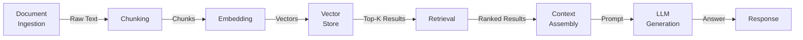
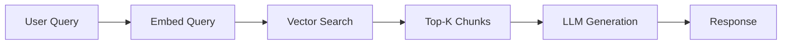
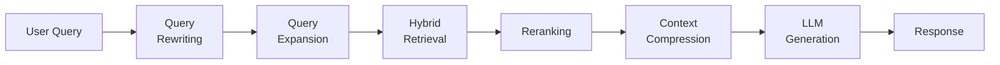
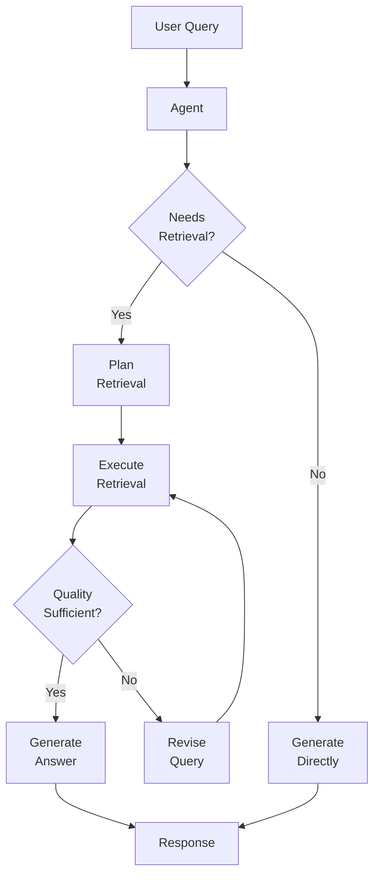
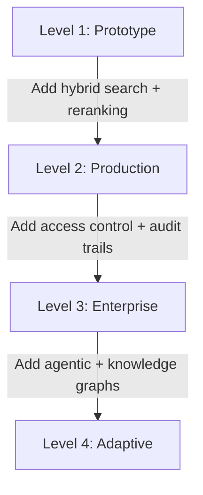
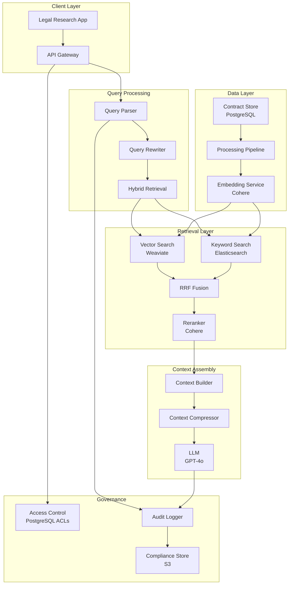

# Chapter 1: RAG Fundamentals

> "RAG does not make LLMs smarter. It makes them honest — grounded in evidence rather than confabulation."

---

**Last verified: June 2026.** Verify current model specifications at provider documentation.

---

## Introduction

A language model's knowledge is frozen at training time. It cannot know about events after its training cutoff, it cannot access your organization's private documents, and it sometimes generates plausible but incorrect information — hallucination. These are not bugs to be fixed. They are fundamental characteristics of how language models work.

RAG (Retrieval-Augmented Generation) addresses all three limitations by retrieving relevant documents at query time and including them in the prompt. The model provides reasoning ability; the retrieval system provides knowledge. This separation of concerns — reasoning from knowledge — is the foundational insight behind RAG.

But RAG is not a silver bullet. Retrieval quality is fragile. Every stage of the pipeline — chunking, embedding, search, reranking, context assembly — introduces potential quality loss. A RAG system with poor retrieval produces worse answers than no RAG at all, because the model sees irrelevant information and gets confused. The model tries to make sense of noise, generating confident-sounding answers that are wrong.

This chapter establishes the conceptual foundation for the entire book. We will define what RAG actually does, distinguish it from alternative approaches, dissect the pipeline into its component stages, and establish the metrics you need to measure quality. The chapter is deliberately conceptual — code appears where it clarifies a concept, but the focus is on understanding the architecture, not implementing it.

The central thesis of this chapter is that **RAG quality is a pipeline problem, not a component problem**. No single component — embedding model, vector database, reranker, or LLM — determines overall quality. The pipeline's quality is bounded by its weakest stage. This means you must understand every stage, evaluate every stage, and optimize the system as a whole.

We will examine the five-stage RAG pipeline, compare RAG to fine-tuning and other grounding approaches, define retrieval quality metrics, and ground everything in a real-world legal research case study.

---

## 1.1 What RAG Actually Does

### 1.1.1 The Knowledge Problem

Language models learn patterns from training data. They can generate fluent text, answer questions, and reason about concepts — but only based on what they have seen during training. This creates three fundamental limitations:

**Temporal limitation**: The model cannot know about events after its training cutoff. A model trained in early 2024 cannot tell you what happened in late 2024. This is not a bug — it is a consequence of how training works.

**Access limitation**: The model cannot access your organization's private documents. Your contracts, internal documentation, research papers, and knowledge base are invisible to the model.

**Hallucination**: When the model lacks knowledge, it does not say "I don't know." It generates plausible-sounding text that may be incorrect. This is the most dangerous limitation because the output is indistinguishable from correct answers.

RAG addresses all three by connecting the model to external knowledge at query time. The model does not need to "know" the answer — it needs to "find" the answer in the retrieved documents and then "reason" about it.

### 1.1.2 The RAG Mental Model

The simplest mental model for RAG is an open-book exam. Without RAG, the model takes a closed-book exam — it can only use what it memorized during training. With RAG, the model takes an open-book exam — it can look up relevant information and use it to answer the question.

This mental model reveals a critical insight: RAG quality depends on two things — the quality of the "book" (your document collection) and the quality of the "lookup" (your retrieval system). A brilliant student with a poor lookup system will miss relevant information. A mediocre student with a great lookup system will find the right answers. The retrieval system is as important as the model.

### 1.1.3 The Retrieval-Generation Boundary

RAG introduces a boundary between retrieval and generation that does not exist in pure prompting. This boundary has three critical properties:

1. **Retrieval quality bounds generation quality.** If the retrieval system does not find relevant documents, the LLM cannot generate correct answers. The LLM is limited by what it sees.

2. **Generation quality depends on retrieval formatting.** The way retrieved documents are formatted, ordered, and compressed affects how well the LLM can use them. Poor formatting wastes context window space on noise.

3. **The boundary is where most quality problems live.** Most RAG failures are retrieval failures, not generation failures. The LLM is usually fine — it is seeing the wrong information.

Understanding this boundary is essential for diagnosing quality problems. When answers are wrong, the first question is: "Did the retrieval system find the right documents?" Not: "Is the LLM good enough?"

---

## 1.2 RAG versus Fine-Tuning

RAG and fine-tuning solve different problems. Understanding the distinction prevents costly architectural mistakes.

### 1.2.1 When to Use RAG

RAG is the right choice when:

- **Knowledge changes frequently.** You can update documents without retraining the model. A fine-tuned model requires expensive retraining to incorporate new knowledge.
- **You need source citations.** Retrieved documents provide verifiable provenance. Fine-tuned models embed knowledge in weights, making citation impossible.
- **You have limited training data.** Fine-tuning requires large, high-quality training datasets. RAG works with any document collection.
- **You need to reduce hallucination.** Grounding in retrieved documents reduces the model's tendency to confabulate.
- **You need access control.** RAG can filter documents by user permissions. Fine-tuned models expose all training data to all users.

### 1.2.2 When to Use Fine-Tuning

Fine-tuning is the right choice when:

- **You need consistent output formatting.** Fine-tuning teaches the model to output in a specific format (JSON, structured text, specific style).
- **You need domain-specific reasoning patterns.** Not just domain facts — the way domain experts think about problems. RAG provides facts; fine-tuning provides reasoning.
- **You need cost reduction at high volume.** A fine-tuned smaller model can replace a larger model, reducing per-query cost.
- **You have proprietary reasoning patterns.** Legal analysis, medical diagnosis, financial modeling — these require domain-specific reasoning that RAG alone cannot provide.

### 1.2.3 The Hybrid Approach

The most powerful approach combines RAG and fine-tuning. The fine-tuned model learns domain-specific reasoning patterns, and RAG provides current, factual knowledge. This is the approach used in production systems where both reasoning quality and knowledge freshness matter.

| Approach | Knowledge Updates | Citation Support | Cost Model | Reasoning Quality | Best For |
|----------|-------------------|-----------------|------------|-------------------|----------|
| **RAG only** | Real-time | Natural | Per-query | General | Dynamic knowledge, regulated industries |
| **Fine-tuning only** | Requires retraining | No inherent support | High upfront, low per-query | Domain-specific | Consistent formatting, domain reasoning |
| **RAG + fine-tuning** | Both | Via RAG | Medium upfront, medium per-query | Domain-specific | High-quality domain QA |
| **Prompt engineering** | Manual | Limited by context | Low upfront, high per-query | General | Small knowledge bases |

For most applications, RAG is the right default. Fine-tune only when you have quantified evidence that RAG plus prompt engineering is insufficient. The evidence is usually a specific quality gap — the model understands the domain but cannot reason about it in the domain-specific way that experts do.

---

## 1.3 The RAG Pipeline

The standard RAG pipeline has five stages. Each stage introduces potential quality loss, and the pipeline's overall quality is bounded by its weakest stage.



### 1.3.1 Stage 1: Document Ingestion

Document ingestion reads documents from various formats and extracts raw text. This is the most underestimated stage. Each format presents different challenges:

**PDFs** are the most common enterprise document format and the hardest to process correctly. Text PDFs (generated from Word, LaTeX, or web pages) extract cleanly. Scanned PDFs require OCR, which introduces errors. Layouts with columns, tables, and images require specialized parsing.

**Office documents** (Word, Excel, PowerPoint) are easier. The main challenge is preserving hierarchy — headers, sections, and bullet points that provide structural context for chunking.

**Web pages** require HTML parsing with boilerplate removal. Navigation, footers, and sidebars add noise. The content extraction quality varies dramatically across websites.

**APIs** provide structured data that needs transformation. The challenge is mapping API responses to the document format expected by downstream processing.

The quality of ingestion directly determines the quality of everything downstream. Garbage in, garbage out.

### 1.3.2 Stage 2: Chunking

Chunking splits documents into retrievable units. This is one of the most impactful decisions in the entire pipeline. The chunking strategy determines what information is available for retrieval.

Too small and you lose context — the model sees a fragment without understanding what it means. Too large and you add noise — the relevant information is buried in irrelevant content. The optimal chunk size depends on your documents and your queries.

Chapter 4 covers chunking strategies in depth. For now, the key insight: chunking is not a preprocessing step — it is an architectural decision that affects retrieval quality, context quality, and cost.

### 1.3.3 Stage 3: Embedding

Embedding converts chunks to dense vectors that capture semantic meaning. The quality of the embedding model directly affects retrieval accuracy. A mismatch between embedding model and domain vocabulary causes relevant documents to be missed.

The embedding model must understand your domain's vocabulary. A general-purpose embedding model may not capture the nuances of legal terminology, medical terminology, or financial terminology. Domain-specific fine-tuning of embedding models is a common pattern in enterprise RAG.

Chapter 5 covers embedding models in depth.

### 1.3.4 Stage 4: Retrieval

Retrieval finds the chunks most relevant to the query. The combination of dense (semantic) and sparse (keyword) search consistently outperforms either approach alone.

Dense search captures meaning — "vehicle" matches "car." Sparse search captures exact terms — "Q4 2024 revenue" matches the exact phrase. Neither alone is sufficient. Hybrid search combines both, using Reciprocal Rank Fusion or a learned weighting to produce a unified ranking.

Chapter 6 covers vector databases. Chapter 7 covers retrieval strategies in depth.

### 1.3.5 Stage 5: Generation

Generation assembles retrieved chunks into context and generates the answer. The context must be ordered by relevance, deduplicated, and fitted within the token budget. The LLM then uses this context to generate a response.

The generation stage is where context engineering matters. The way retrieved chunks are formatted, ordered, and compressed affects how well the LLM can use them. Chapter 10 covers context engineering in depth.

---

## 1.4 Types of RAG

### 1.4.1 Naive RAG

Naive RAG is the simplest form: embed the query, search the vector store, return the top results, and generate. It works for simple use cases but lacks the sophistication needed for production.

The naive RAG pipeline has no preprocessing (query rewriting, expansion) and no postprocessing (reranking, context compression). It relies entirely on the embedding model's ability to capture relevance and the LLM's ability to use raw retrieved chunks.



**When to use naive RAG:**
- Prototyping and proof-of-concept
- Simple document collections with uniform content
- Queries that are straightforward and specific
- Cost-sensitive applications where every LLM call counts

**When to avoid naive RAG:**
- Complex queries requiring multi-step reasoning
- Large, heterogeneous document collections
- Applications requiring high precision (legal, medical, financial)
- Production systems with quality SLAs

### 1.4.2 Advanced RAG

Advanced RAG adds preprocessing (query rewriting, expansion, decomposition) and postprocessing (reranking, context compression). The improvements are significant — precision typically improves 20-40% over naive RAG.



**Preprocessing improvements:**

| Technique | What It Does | Quality Impact | Cost Impact |
|-----------|-------------|----------------|-------------|
| Query rewriting | Reformulates query for better retrieval | +10-15% precision | +1 LLM call |
| Query expansion | Adds related terms to increase recall | +15-20% recall | +1 LLM call or embeddings |
| Query decomposition | Breaks complex queries into sub-queries | +20-30% for complex queries | +N LLM calls |

**Postprocessing improvements:**

| Technique | What It Does | Quality Impact | Cost Impact |
|-----------|-------------|----------------|-------------|
| Reranking | Re-scores retrieved chunks with a cross-encoder | +15-25% precision | +1 model call |
| Context compression | Removes irrelevant parts of retrieved chunks | +5-10% precision, lower cost | +1 LLM call |
| Deduplication | Removes near-identical chunks | +5% precision | Negligible |

### 1.4.3 Agentic RAG

Agentic RAG uses an agent to decide when, how, and what to retrieve. The agent can decompose complex queries into sub-queries, evaluate retrieval quality, retry with different strategies, and combine multiple data sources.



Agentic RAG handles the complex queries that static pipelines miss. A legal researcher might ask: "What are the termination clauses in our contracts with vendors in the EU, and how do they compare to our US contracts?" A static pipeline would struggle with this multi-part query. An agentic system can decompose it into sub-queries, retrieve from different document collections, and synthesize a comprehensive answer.

**When to use agentic RAG:**
- Complex, multi-part queries
- Queries requiring multi-step reasoning
- Heterogeneous document collections
- Applications where retrieval quality must be self-evaluated

**When to avoid agentic RAG:**
- Simple, straightforward queries
- Cost-sensitive applications (agents use more LLM calls)
- Latency-sensitive applications (agents add overhead)

### 1.4.4 Hybrid RAG

Hybrid RAG combines dense (semantic) and sparse (keyword) retrieval. Dense search captures meaning — "vehicle" matches "car." Sparse search captures exact terms — "Q4 2024 revenue" matches the exact phrase. Neither alone is sufficient.

The combination is typically done through Reciprocal Rank Fusion (RRF), which merges ranked lists from both approaches:

```python
def reciprocal_rank_fusion(
    dense_results: list[tuple[str, float]],
    sparse_results: list[tuple[str, float]],
    k: int = 60
) -> list[tuple[str, float]]:
    """Merge dense and sparse results using RRF."""
    scores = {}
    for rank, (doc_id, _) in enumerate(dense_results):
        scores[doc_id] = scores.get(doc_id, 0) + 1 / (k + rank + 1)
    for rank, (doc_id, _) in enumerate(sparse_results):
        scores[doc_id] = scores.get(doc_id, 0) + 1 / (k + rank + 1)
    return sorted(scores.items(), key=lambda x: x[1], reverse=True)
```

Hybrid RAG is the production standard. It consistently outperforms either approach alone.

### 1.4.5 Graph RAG

Graph RAG adds knowledge graph traversal to vector search. This captures relationships between entities — something vector search alone cannot do well.

For example, in a legal document collection, a vector search for "termination clauses" finds documents mentioning termination. But it does not find the relationship between termination clauses and specific vendors, because that relationship is implicit in the document structure. A knowledge graph can represent these relationships explicitly.

Chapter 11 covers Graph RAG in depth.

---

## 1.5 Retrieval Quality Metrics

Measuring retrieval quality independently from generation quality is essential. Four metrics matter most.

### 1.5.1 Precision@K

Precision@K measures how many of the top K retrieved documents are relevant. High precision means the model sees relevant information.

```python
def precision_at_k(retrieved: list[str], relevant: set[str], k: int) -> float:
    """Calculate Precision@K."""
    retrieved_at_k = retrieved[:k]
    relevant_retrieved = len(set(retrieved_at_k) & relevant)
    return relevant_retrieved / k
```

**Target**: Above 80% for production systems. Below 60% indicates a retrieval quality problem.

### 1.5.2 Recall@K

Recall@K measures how many relevant documents are retrieved. High recall means few relevant documents are missed.

```python
def recall_at_k(retrieved: list[str], relevant: set[str], k: int) -> float:
    """Calculate Recall@K."""
    retrieved_at_k = retrieved[:k]
    relevant_retrieved = len(set(retrieved_at_k) & relevant)
    return relevant_retrieved / len(relevant) if relevant else 0.0
```

**Target**: Above 90% for production systems. Below 75% indicates relevant documents are being missed.

### 1.5.3 Mean Reciprocal Rank (MRR)

MRR measures where the first relevant document appears in the results. Higher MRR means relevant documents appear earlier.

```python
def mean_reciprocal_rank(
    results_list: list[list[str]],
    relevant_sets: list[set[str]]
) -> float:
    """Calculate MRR across multiple queries."""
    rr_sum = 0.0
    for retrieved, relevant in zip(results_list, relevant_sets):
        for rank, doc_id in enumerate(retrieved, 1):
            if doc_id in relevant:
                rr_sum += 1.0 / rank
                break
    return rr_sum / len(results_list)
```

**Target**: Above 0.8. Below 0.6 means relevant documents are buried in the results.

### 1.5.4 Normalized Discounted Cumulative Gain (NDCG)

NDCG considers the position of relevant results. Higher-ranked relevant results contribute more. This is the most nuanced metric because it rewards systems that put the most relevant documents at the top.

**Target**: Above 0.85. Below 0.7 indicates significant ranking quality issues.

### 1.5.5 Hit Rate

Hit Rate measures the percentage of queries where at least one relevant document is retrieved. This is the most basic quality bar.

**Target**: Above 95%. Below 90% means users frequently get no relevant results.

### 1.5.6 Metrics Comparison

| Metric | What It Measures | Target | Failure Indicator |
|--------|-----------------|--------|-------------------|
| **Precision@K** | Relevance of top-K results | >80% | Model sees irrelevant information |
| **Recall@K** | Coverage of relevant documents | >90% | Relevant documents missed |
| **MRR** | Position of first relevant result | >0.8 | Relevant results buried |
| **NDCG** | Overall ranking quality | >0.85 | Ranking does not match relevance |
| **Hit Rate** | At least one relevant result | >95% | Users get no relevant results |

These metrics measure retrieval quality, not generation quality. A system can have perfect retrieval metrics but poor generation if the LLM cannot use the context effectively. Chapter 13 covers end-to-end evaluation.

---

## 1.6 Enterprise RAG Requirements

Enterprise RAG adds requirements beyond basic retrieval. These requirements shape every architectural decision.

### 1.6.1 Access Control

Users can only retrieve documents they have permission to see. This requires document-level or field-level permissions at the vector store level. The two main approaches:

**Index-time filtering**: Permissions are embedded in the vector index. Queries are filtered at search time. This is efficient but requires re-indexing when permissions change.

**Query-time filtering**: Permissions are checked at query time against an external permission system. This is more flexible but adds latency.

| Approach | Latency Impact | Permission Freshness | Complexity |
|----------|---------------|---------------------|------------|
| Index-time | Minimal | Stale until re-index | Low |
| Query-time | 5-20ms | Real-time | Medium |
| Hybrid | Minimal | Near real-time | High |

### 1.6.2 Multi-Tenancy

Multiple business units share the infrastructure but must not see each other's data. This requires tenant-aware indexing and retrieval. The approaches are similar to access control — index-time tenant isolation or query-time tenant filtering.

### 1.6.3 Audit Logging

Every query, retrieval, and generation must be logged for compliance. The audit log must be immutable, searchable, and retained for the required period (often 7 years in regulated industries).

### 1.6.4 Freshness Management

Documents change. Embeddings must be updated when source documents change. The main approaches:

**Full re-embedding**: Re-embed all documents periodically. Simple but expensive. Suitable for small document collections that change infrequently.

**Incremental re-embedding**: Detect changes and re-embed only affected documents. More efficient but requires change detection infrastructure.

**Event-driven re-embedding**: Trigger re-embedding when documents change via webhooks or event streams. Real-time freshness but requires integration with document management systems.

### 1.6.5 Quality Evaluation

Enterprise RAG requires continuous quality measurement. This means:

- **Offline evaluation**: Automated metrics on labeled datasets, run daily or weekly
- **Online evaluation**: User feedback, click-through rates, task completion rates
- **Human evaluation**: Periodic expert review of retrieval and generation quality
- **A/B testing**: Comparing pipeline changes against baseline quality

Chapter 13 covers evaluation in depth.

---

## 1.7 The RAG Maturity Model

Enterprise RAG systems evolve through four maturity levels. Understanding where you are on this spectrum helps you plan your next investments.

| Level | Description | Capabilities | Typical Organization |
|-------|-------------|-------------|---------------------|
| **Level 1: Prototype** | Basic embedding + vector search | Simple QA, single document type | Startup, small team |
| **Level 2: Production** | Hybrid search, reranking, evaluation | Multi-document QA, basic access control | Mid-size company |
| **Level 3: Enterprise** | Access control, audit trails, multi-tenancy | Regulated industries, multiple business units | Enterprise |
| **Level 4: Adaptive** | Agentic RAG, knowledge graphs, self-improving | Complex reasoning, multi-modal, autonomous | Advanced enterprise |



Most organizations are at Level 1 or 2. This book covers all four levels, with the understanding that the reader may be at any point on this spectrum.

---

## 1.8 Case Study: Legal Research RAG

### 1.8.1 Problem Statement

A legal research firm needs to build a RAG system to search 100,000 contracts. The system must:

- Support 200+ users with role-based access control
- Process queries in under 2 seconds
- Achieve 90%+ precision@5 for clause-level retrieval
- Maintain audit trails for all queries
- Handle contract updates without full re-indexing
- Cost less than $0.05 per query

### 1.8.2 Architecture



### 1.8.3 Component Selection

| Component | Choice | Rationale |
|-----------|--------|-----------|
| **Document store** | PostgreSQL with JSONB | Mature, supports access control, audit trails |
| **Embedding model** | Cohere Embed v3 | Strong on legal text, 512 token input |
| **Vector database** | Weaviate | Hybrid search native, multi-tenancy support |
| **Keyword search** | Elasticsearch | BM25 implementation, hybrid search support |
| **Reranking model** | Cohere Rerank v3 | High accuracy on legal text, fast inference |
| **Chunking strategy** | Section-based + parent-child | Respects contract structure |
| **Orchestration** | LangGraph | Supports complex retrieval workflows |
| **Monitoring** | Custom + LangSmith | Quality metrics, cost tracking |

### 1.8.4 Cost Analysis

**Monthly volume**: 10,000 queries/day x 30 days = 300,000 queries/month

| Component | Per-Query Cost | Monthly Cost | Notes |
|-----------|---------------|-------------|-------|
| Embedding (query) | $0.0001 | $30 | Cohere Embed v3 |
| Vector search | $0.00005 | $15 | Weaviate cloud |
| Keyword search | $0.00002 | $6 | Elasticsearch |
| Reranking | $0.001 | $300 | Cohere Rerank v3, 20 candidates |
| LLM generation | $0.025 | $7,500 | GPT-4o, ~2000 context tokens |
| **Total** | **$0.026** | **$7,851** | |

The LLM generation cost dominates at 95.5% of total cost. Reducing context window usage has the highest impact on total cost. If context tokens increase from 2000 to 4000 (poor chunking), LLM cost doubles to $0.050, pushing total to $0.051 — above the $0.05 target.

### 1.8.5 Quality Baseline

| Metric | Naive RAG | Advanced RAG (Target) | Gap |
|--------|----------|----------------------|-----|
| Precision@5 | 58% | 90% | +32% |
| Recall@5 | 65% | 92% | +27% |
| MRR | 0.62 | 0.88 | +0.26 |
| Hit Rate | 78% | 97% | +19% |

The gap between naive and advanced RAG is enormous. Closing it requires investing in every pipeline stage — hybrid search, reranking, query rewriting, and context engineering.

### 1.8.6 Migration Strategy

| Phase | Duration | Scope | Success Criteria |
|-------|----------|-------|-----------------|
| **Phase 1: Prototype** | 4 weeks | Naive RAG, single document type | Basic QA works |
| **Phase 2: Hybrid Search** | 4 weeks | Add BM25 + RRF fusion | Precision@5 > 75% |
| **Phase 3: Reranking** | 3 weeks | Add Cohere Rerank | Precision@5 > 85% |
| **Phase 4: Access Control** | 4 weeks | Document-level ACLs | All users see authorized docs only |
| **Phase 5: Evaluation** | 4 weeks | Automated quality metrics | Daily quality dashboards |
| **Phase 6: Production** | 3 weeks | Monitoring, alerting, cost tracking | Full production deployment |

Total timeline: 22 weeks (approximately 5 months). The critical path is Phase 2-3 (retrieval quality) and Phase 4 (enterprise requirements).

---

## 1.9 Testing RAG Systems

### 1.9.1 Unit Testing Retrieval

```python
import pytest
from your_rag_system import HybridRetriever, RRFMerger

@pytest.fixture
def retriever():
    return HybridRetriever(
        dense_index="contracts_dense",
        sparse_index="contracts_sparse",
        rrf_k=60
    )

def test_retrieval_returns_relevant_chunks(retriever):
    query = "termination clause for breach"
    results = retriever.search(query, top_k=10)
    assert len(results) > 0
    assert any("termination" in r.text.lower() for r in results)

def test_retrieval_respects_access_control(retriever):
    query = "confidential settlement terms"
    results = retriever.search(
        query, top_k=10, user_role="junior_associate"
    )
    assert all(r.access_level != "confidential" for r in results)

def test_hybrid_search_outperforms_dense_only(retriever):
    query = "Section 7.2(b) breach remedies"
    dense_results = retriever.dense_search(query, top_k=10)
    hybrid_results = retriever.search(query, top_k=10)
    assert any("7.2" in r.text for r in hybrid_results)
```

### 1.9.2 Integration Testing the Pipeline

```python
def test_end_to_end_retrieval_generation():
    rag = RAGPipeline(config="production.yaml")
    query = "What are the termination rights under this contract?"
    response = rag.query(query, document_id="contract_001")

    assert response.answer is not None
    assert len(response.sources) > 0
    assert response.confidence > 0.7
    assert all(
        s.document_id == "contract_001" for s in response.sources
    )

def test_retrieval_quality_metrics():
    evaluator = RAGEvaluator(
        golden_dataset="contracts_eval.jsonl"
    )
    metrics = evaluator.evaluate(retriever, sample_size=500)

    assert metrics.precision_at_5 > 0.80
    assert metrics.recall_at_5 > 0.90
    assert metrics.mrr > 0.80
    assert metrics.hit_rate > 0.95
```

### 1.9.3 Quality Metrics Dashboard

| Metric | Target | Measurement Frequency | Alert Threshold |
|--------|--------|----------------------|-----------------|
| Precision@5 | >80% | Daily | <75% |
| Recall@5 | >90% | Daily | <85% |
| MRR | >0.80 | Daily | <0.70 |
| Hit Rate | >95% | Daily | <90% |
| Latency (p50) | <2s | Real-time | >3s |
| Latency (p99) | <5s | Real-time | >8s |
| Cost per query | <$0.05 | Daily | >$0.06 |
| User satisfaction | >4.0/5.0 | Weekly | <3.5/5.0 |

---

## 1.10 Key Takeaways

1. **RAG combines parametric reasoning with non-parametric knowledge.** The model provides reasoning; retrieval provides facts. This separation of concerns is the foundational insight behind RAG.

2. **RAG quality is a pipeline problem, not a component problem.** No single component determines overall quality. The pipeline's quality is bounded by its weakest stage. Optimize the system, not individual components.

3. **Hybrid search (dense + sparse) is the production standard.** Neither approach alone is sufficient. Dense search captures meaning; sparse search captures exact terms. Always combine them.

4. **Reranking is the highest-ROI investment in retrieval quality.** A cross-encoder reranker typically improves precision by 15-25% for minimal latency cost.

5. **Chunking strategy is the most impactful early decision.** It determines what information is available for retrieval. Test with your actual data, not generic benchmarks.

6. **Measure retrieval quality independently from generation quality.** Bad retrieval = bad answers. Use Precision@K, Recall@K, MRR, and Hit Rate to diagnose retrieval problems before blaming the LLM.

7. **Enterprise RAG requires access control, audit trails, and freshness management.** These are not afterthoughts — they are architectural constraints that shape every decision.

8. **RAG is the right default for grounding LLMs.** Fine-tune only when you have quantified evidence that RAG plus prompt engineering is insufficient. The evidence is usually a specific reasoning gap, not a knowledge gap.

9. **Cost management is quality management.** The LLM generation cost dominates total RAG cost. Context window management directly impacts both quality and cost.

10. **The retrieval-generation boundary is where most quality problems live.** When answers are wrong, the first question is: "Did the retrieval system find the right documents?" Not: "Is the LLM good enough?"

---

## 1.11 Advanced RAG vs. Naive RAG: A Deep Comparison

The difference between naive and advanced RAG is not incremental — it is transformational. Understanding this difference justifies the additional engineering investment.

### 1.11.1 Naive RAG Limitations

Naive RAG makes several assumptions that fail in production:

1. **The query is well-formed.** Users often ask vague, ambiguous, or incomplete questions. "Tell me about the contract" is not specific enough for effective retrieval.

2. **The embedding model captures all relevance.** Dense retrieval misses exact terms, numerical references, and domain-specific jargon.

3. **All retrieved chunks are equally useful.** Without reranking, the LLM sees a mix of relevant and irrelevant content.

4. **The LLM can handle raw retrieved text.** Without formatting or compression, the context may be noisy or poorly structured.

### 1.11.2 Advanced RAG Improvements

Advanced RAG addresses each limitation:

| Naive RAG Assumption | Advanced RAG Solution | Quality Impact |
|---------------------|----------------------|----------------|
| Well-formed query | Query rewriting, expansion | +10-20% recall |
| Dense retrieval captures all | Hybrid search (dense + sparse) | +15-30% precision |
| All chunks equally useful | Reranking with cross-encoder | +15-25% precision |
| Raw text is fine | Context compression, formatting | +5-10% faithfulness |

### 1.11.3 The Investment Required

Advanced RAG requires additional infrastructure:

| Component | Naive RAG | Advanced RAG | Additional Cost |
|-----------|----------|--------------|-----------------|
| Query rewriting | None | LLM call | $0.001/query |
| Hybrid search | Vector only | BM25 + vector | Negligible |
| Reranking | None | Cross-encoder | $0.001/query |
| Context compression | None | LLM call | $0.0005/query |
| **Total additional** | | | **$0.0025/query** |

At 10,000 queries/day, the additional cost is $750/month. The quality improvement typically justifies this investment within the first month of production.

---

## 1.12 The Embedding Model Decision

The embedding model is the foundation of retrieval quality. Choosing the right model requires benchmarking on your specific data.

### 1.12.1 Benchmarking Methodology

1. **Create a golden dataset**: 500+ query-document pairs with relevance labels.
2. **Embed all documents**: Run each candidate embedding model on your document collection.
3. **Embed all queries**: Run each candidate embedding model on your query set.
4. **Evaluate retrieval quality**: Compute Precision@5, Recall@5, MRR, and NDCG for each model.
5. **Measure latency and cost**: The best model is useless if it is too slow or expensive.

### 1.12.2 Common Pitfalls

| Pitfall | Description | Consequence |
|---------|-------------|-------------|
| **MTEB-only evaluation** | Using public benchmarks without domain testing | Domain mismatch |
| **Ignoring latency** | Choosing the largest model without latency testing | SLA violations |
| **Ignoring cost** | Choosing the most expensive model without cost analysis | Budget overruns |
| **Single-model testing** | Not comparing against alternatives | Missed optimizations |
| **Ignoring document length** | Using a model with short context for long documents | Truncated embeddings |

---

## 1.13 The Vector Database Decision

The vector database stores embeddings and supports similarity search. The choice of vector database affects scalability, cost, and features.

### 1.13.1 Selection Criteria

| Criterion | Why It Matters | How to Evaluate |
|-----------|---------------|-----------------|
| **Hybrid search support** | Dense + sparse retrieval is the production standard | Test BM25 + vector search in same system |
| **Multi-tenancy** | Enterprise requirement for data isolation | Test tenant-level data isolation |
| **Scalability** | Must handle your document collection size | Test with 10x your expected load |
| **Filtering** | Metadata filtering for access control | Test complex filter combinations |
| **Cost model** | Must fit your budget | Calculate cost at your expected scale |
| **Operational overhead** | Managed vs. self-hosted | Evaluate team capacity for operations |

### 1.13.2 Decision Matrix

| Requirement | Weaviate | Pinecone | Qdrant | pgvector | Elasticsearch |
|------------|----------|----------|--------|----------|---------------|
| Hybrid search | Native | No | No | No | Native |
| Multi-tenancy | Class-level | Namespace | Collection | Row-level | Index-level |
| Managed option | Yes | Yes | Yes | Yes | Yes |
| Self-hosted | Yes | No | Yes | Yes | Yes |
| Maximum scale | 100M+ vectors | 100M+ vectors | 100M+ vectors | 10M vectors | 100M+ vectors |
| Best for | Hybrid, multi-tenant | Serverless, simple | Performance, flexibility | PostgreSQL shops | Production hybrid |

---

## 1.14 The Reranking Decision

Reranking re-scores initial retrieval results using a more accurate but slower model. It is the highest-ROI improvement in most RAG systems.

### 1.14.1 When to Rerank

| Scenario | Rerank? | Rationale |
|----------|---------|-----------|
| High precision required | Yes | Cross-encoder accuracy justifies latency |
| Cost-sensitive | Selective | Rerank only low-confidence queries |
| Latency-sensitive | Selective | Rerank top-K only, not all candidates |
| Simple queries | Optional | Initial retrieval may be sufficient |
| Complex queries | Yes | Reranking disambiguates results |

### 1.14.2 Reranking Model Selection

| Model | Accuracy | Latency | Cost | Best For |
|-------|----------|---------|------|----------|
| Cohere Rerank v3 | High | Fast | $0.001/query | Enterprise, legal text |
| BGE-reranker-v2-m3 | High | Medium | Self-hosted | Open source |
| Cross-encoder/ms-marco-MiniLM | Medium | Fast | Self-hosted | Prototyping |
| LLM-based reranking | Very High | Slow | $0.005/query | Maximum quality |

---

## 1.15 Key Takeaways (Expanded)

1. **RAG combines parametric reasoning with non-parametric knowledge.** The model provides reasoning; retrieval provides facts. This separation of concerns is the foundational insight behind RAG.

2. **RAG quality is a pipeline problem, not a component problem.** No single component determines overall quality. The pipeline's quality is bounded by its weakest stage.

3. **Hybrid search (dense + sparse) is the production standard.** Dense captures meaning; sparse captures exact terms. Always combine them.

4. **Reranking is the highest-ROI investment in retrieval quality.** A cross-encoder reranker typically improves precision by 15-25% for minimal latency cost.

5. **Chunking strategy is the most impactful early decision.** It determines what information is available for retrieval. Test with your actual data.

6. **Measure retrieval quality independently from generation quality.** Bad retrieval = bad answers. Diagnose retrieval problems before blaming the LLM.

7. **Enterprise RAG requires access control, audit trails, and freshness management.** These are architectural constraints, not afterthoughts.

8. **RAG is the right default for grounding LLMs.** Fine-tune only when you have quantified evidence that RAG plus prompt engineering is insufficient.

9. **Cost management is quality management.** The LLM generation cost dominates total RAG cost. Context window management impacts both quality and cost.

10. **The retrieval-generation boundary is where most quality problems live.** When answers are wrong, ask: "Did retrieval find the right documents?" first.

11. **Advanced RAG is not optional for production.** The 2-3x cost increase over naive RAG is justified by 20-40% quality improvement.

12. **Benchmark embedding models on your data.** Public benchmarks (MTEB) do not reflect domain-specific retrieval quality. Always test on your actual documents and queries.

---

## 1.11 Further Reading

- **"Retrieval-Augmented Generation for Knowledge-Intensive NLP Tasks" by Lewis et al. (2020)** — The original RAG paper. Essential for understanding the theoretical foundation.

- **"A Survey on Retrieval-Augmented Text Generation for Large Language Models" by Gao et al. (2024)** — Comprehensive survey covering RAG approaches, challenges, and future directions.

- **"Lost in the Middle" by Liu et al. (2023)** — Research on context position effects in LLMs, directly relevant to context assembly and ordering.

- **"Retrieval-Augmented Generation for Large Language Models: A Survey" by Wang et al. (2024)** — Another comprehensive survey covering RAG architectures, benchmarks, and challenges.

- **"Introduction to Information Retrieval" by Manning, Raghavan, and Schutze** — The definitive textbook on information retrieval. Essential for understanding retrieval fundamentals.

- **LangChain Documentation** (python.langchain.com) — Framework documentation for RAG orchestration patterns.

- **LlamaIndex Documentation** (docs.llamaindex.ai) — Framework documentation focused on data ingestion and retrieval.

- **Weaviate Documentation** (weaviate.io/developers) — Vector database documentation with RAG-specific patterns.

- **Ragas Documentation** (docs.ragas.io) — RAG evaluation framework for offline metrics.

- **"Building Production-Ready RAG Applications" by Jerry Liu (LlamaIndex)** — Practical guide to production RAG architecture decisions.
