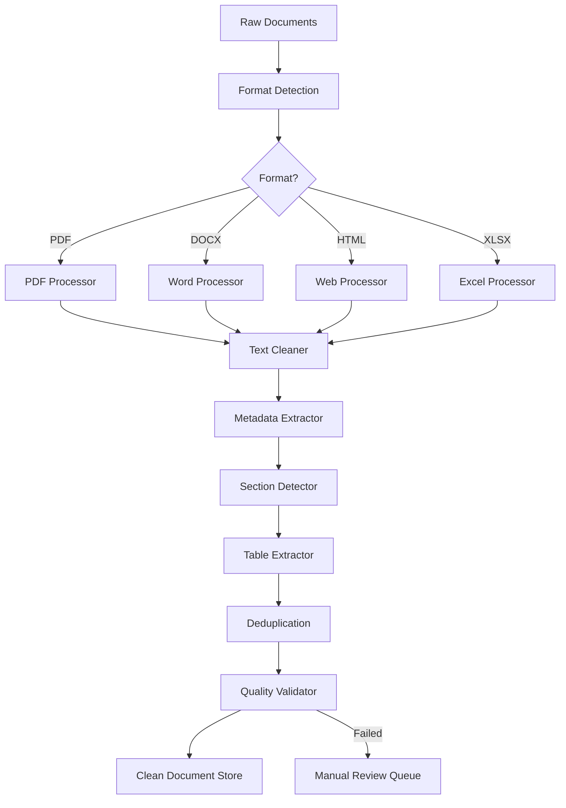
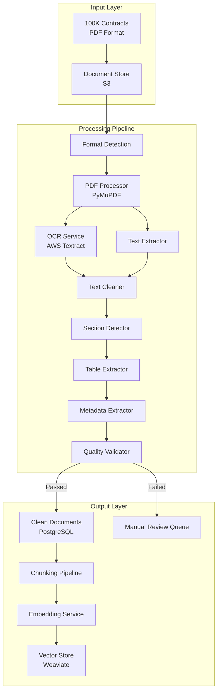

# Chapter 3: Document Processing Pipeline

> "Garbage in, garbage out is not a cliché in RAG — it is the most common cause of production failure."

---

**Last verified: June 2026.**

---

## Introduction

Document processing is the foundation of RAG. Garbage in, garbage out. If your documents are poorly processed — noisy, incorrectly parsed, missing metadata — your RAG system will fail regardless of how good your retrieval or LLM is. A state-of-the-art embedding model cannot find relevant information in garbled text. A powerful LLM cannot reason about incorrectly extracted tables.

Yet document processing is the most underestimated stage in the RAG pipeline. Teams spend weeks fine-tuning embedding models and tuning retrieval parameters, then discover that the real problem was in ingestion all along: headers mixed with body text, tables garbled into strings, images silently dropped, and metadata lost.

The reality of enterprise document processing is messy. PDFs come from different tools, with different layouts, different encodings, and different levels of structure. Word documents have inconsistent formatting. Web pages have varying quality of HTML. Scanned documents require OCR, which introduces errors. Tables, figures, and images carry critical information that plain text extraction loses.

This chapter covers the full document processing pipeline: ingestion from multiple formats, data cleaning, metadata extraction, layout-aware parsing, and the quality validation that ensures your pipeline produces clean, structured, searchable documents. We will build a complete processing pipeline, compare parsing libraries, and ground everything in a legal contract processing case study.

The central thesis of this chapter is that **parsing quality directly determines chunking quality**. If parsing mixes headers with body text, semantic chunking cannot find natural boundaries. If parsing garbles tables, table-aware chunking cannot preserve structure. The document processing pipeline is not a preprocessing step — it is the foundation of retrieval quality.

---

## 3.1 Ingestion

### 3.1.1 The Format Landscape

Enterprise documents come in many formats, each with different challenges:

| Format | Prevalence | Extraction Difficulty | Common Issues |
|--------|-----------|----------------------|---------------|
| **PDF** | 60-70% | High | Layout complexity, OCR for scans, tables |
| **Word (DOCX)** | 15-20% | Medium | Hierarchy preservation, track changes |
| **Excel (XLSX)** | 5-10% | Medium | Multi-sheet, formulas, merged cells |
| **PowerPoint (PPTX)** | 2-5% | Medium | Slide structure, images, notes |
| **HTML/Web** | 5-10% | Medium | Boilerplate, JavaScript-rendered content |
| **Plain Text** | 2-5% | Low | Encoding issues, minimal structure |
| **API/JSON** | 2-5% | Low | Schema mapping, nested structures |

### 3.1.2 PDF Processing

PDFs are the most common enterprise document format and the hardest to process correctly. The challenges depend on how the PDF was created:

**Text PDFs** (generated from Word, LaTeX, or web pages) contain selectable text. Extraction is straightforward but layout preservation is challenging. Multi-column layouts, headers/footers, and page numbers require special handling.

**Scanned PDFs** are images of text. They require OCR (Optical Character Recognition), which introduces errors. The quality of OCR depends on scan resolution, font clarity, and document condition.

**Hybrid PDFs** contain both text and scanned pages. They require detection of which pages need OCR and which have extractable text.

```python
import fitz  # PyMuPDF
from dataclasses import dataclass

@dataclass
class ExtractedPage:
    page_number: int
    text: str
    tables: list[list[list[str]]]
    images: list[bytes]
    has_scanned_content: bool

class PDFProcessor:
    def __init__(self, use_ocr: bool = True):
        self.use_ocr = use_ocr

    def process(self, pdf_path: str) -> list[ExtractedPage]:
        """Process a PDF file into structured pages."""
        doc = fitz.open(pdf_path)
        pages = []

        for page_num in range(len(doc)):
            page = doc[page_num]
            text = page.get_text("text")
            has_scanned = self._is_scanned_page(page, text)

            if has_scanned and self.use_ocr:
                text = self._ocr_page(page)

            tables = self._extract_tables(page)
            images = self._extract_images(page)

            pages.append(ExtractedPage(
                page_number=page_num + 1,
                text=text,
                tables=tables,
                images=images,
                has_scanned_content=has_scanned
            ))

        doc.close()
        return pages

    def _is_scanned_page(self, page, text: str) -> bool:
        """Detect if a page contains scanned content."""
        text_length = len(text.strip())
        image_count = len(page.get_images())
        return text_length < 50 and image_count > 0

    def _ocr_page(self, page) -> str:
        """Perform OCR on a scanned page."""
        raise NotImplementedError("OCR integration required")

    def _extract_tables(self, page) -> list[list[list[str]]]:
        """Extract tables from a page."""
        return []

    def _extract_images(self, page) -> list[bytes]:
        """Extract images from a page."""
        images = []
        for img in page.get_images():
            xref = img[0]
            images.append(page.parent.extract_image(xref)["image"])
        return images
```

### 3.1.3 Office Document Processing

Office documents are easier to process but require hierarchy preservation:

```python
from docx import Document
from dataclasses import dataclass

@dataclass
class StructuredParagraph:
    text: str
    style: str
    level: int
    metadata: dict

class WordProcessor:
    def process(self, docx_path: str) -> list[StructuredParagraph]:
        """Process a Word document preserving structure."""
        doc = Document(docx_path)
        paragraphs = []

        for para in doc.paragraphs:
            style = para.style.name.lower()
            level = 0
            if "heading" in style:
                try:
                    level = int(style.replace("heading ", ""))
                except ValueError:
                    level = 0

            paragraphs.append(StructuredParagraph(
                text=para.text,
                style=style,
                level=level,
                metadata={"source": docx_path}
            ))

        for table in doc.tables:
            table_text = self._table_to_text(table)
            paragraphs.append(StructuredParagraph(
                text=table_text,
                style="table",
                level=0,
                metadata={"source": docx_path, "type": "table"}
            ))

        return paragraphs

    def _table_to_text(self, table) -> str:
        """Convert a Word table to structured text."""
        rows = []
        for row in table.rows:
            cells = [cell.text.strip() for cell in row.cells]
            rows.append(" | ".join(cells))
        return "\n".join(rows)
```

### 3.1.4 Web Page Processing

Web pages require HTML parsing with boilerplate removal:

```python
from bs4 import BeautifulSoup
import re

class WebPageProcessor:
    BOILERPLATE_TAGS = {
        "nav", "header", "footer", "aside", "script",
        "style", "noscript", "iframe"
    }

    def process(self, html: str, url: str) -> dict:
        """Process a web page into clean text."""
        soup = BeautifulSoup(html, "html.parser")

        for tag in self.BOILERPLATE_TAGS:
            for element in soup.find_all(tag):
                element.decompose()

        from bs4 import Comment
        for comment in soup.find_all(
            string=lambda text: isinstance(text, Comment)
        ):
            comment.extract()

        title = ""
        if soup.title:
            title = soup.title.string or ""

        main_content = (
            soup.find("main")
            or soup.find("article")
            or soup.find("body")
            or soup
        )

        text = main_content.get_text(separator="\n", strip=True)
        text = re.sub(r'\n{3,}', '\n\n', text)
        text = re.sub(r' {2,}', ' ', text)

        return {
            "title": title,
            "text": text,
            "url": url,
            "word_count": len(text.split())
        }
```

---

## 3.2 Data Cleaning

### 3.2.1 Why Cleaning Matters

Raw extracted text contains noise that degrades retrieval quality. Cleaning is not optional — it is essential. The most impactful cleaning step is often the simplest: removing headers and footers that repeat across pages.

Consider a 50-page document with a 20-word header on every page. That is 1,000 words of noise that dilutes retrieval quality. When the embedding model processes a chunk containing the header, the header's semantic signal competes with the actual content, reducing retrieval precision.

### 3.2.2 Cleaning Pipeline

```python
import re
from collections import Counter

class TextCleaner:
    def __init__(self):
        self.header_footer_buffer: list[str] = []

    def clean(self, pages: list[dict]) -> list[dict]:
        """Clean a list of extracted pages."""
        headers, footers = self._detect_repeated_content(pages)
        cleaned_pages = []
        for page in pages:
            text = page["text"]
            text = self._remove_header_footer(text, headers, footers)
            cleaned_pages.append({**page, "text": text})

        for page in cleaned_pages:
            page["text"] = self._clean_whitespace(page["text"])

        for page in cleaned_pages:
            page["text"] = self._clean_special_chars(page["text"])

        for page in cleaned_pages:
            page["text"] = self._remove_page_numbers(page["text"])

        return cleaned_pages

    def _detect_repeated_content(
        self, pages: list[dict]
    ) -> tuple[set[str], set[str]]:
        """Detect headers and footers that repeat across pages."""
        first_lines = []
        last_lines = []
        for page in pages:
            lines = page["text"].strip().split("\n")
            if lines:
                first_lines.append(lines[0].strip())
                last_lines.append(lines[-1].strip())

        threshold = len(pages) * 0.5
        headers = {
            line for line, count in Counter(first_lines).items()
            if count >= threshold
        }
        footers = {
            line for line, count in Counter(last_lines).items()
            if count >= threshold
        }
        return headers, footers

    def _remove_header_footer(
        self, text: str, headers: set[str], footers: set[str]
    ) -> str:
        """Remove detected headers and footers from text."""
        lines = text.strip().split("\n")
        cleaned = []
        for line in lines:
            if line.strip() in headers or line.strip() in footers:
                continue
            cleaned.append(line)
        return "\n".join(cleaned)

    def _clean_whitespace(self, text: str) -> str:
        text = re.sub(r'\t', ' ', text)
        text = re.sub(r' {2,}', ' ', text)
        text = re.sub(r'\n{3,}', '\n\n', text)
        return text.strip()

    def _clean_special_chars(self, text: str) -> str:
        text = re.sub(
            r'[^\w\s\.\,\;\:\!\?\-\(\)\[\]\/\'\"\$\%\@\#]', '', text
        )
        return text

    def _remove_page_numbers(self, text: str) -> str:
        lines = text.strip().split("\n")
        cleaned = []
        for line in lines:
            stripped = line.strip()
            if re.match(r'^page\s+\d+\s+of\s+\d+$', stripped, re.I):
                continue
            if re.match(r'^\d+\s*/\s*\d+$', stripped):
                continue
            if re.match(r'^-\s*\d+\s*-$', stripped):
                continue
            cleaned.append(line)
        return "\n".join(cleaned)
```

### 3.2.3 Duplicate Detection

Different documents may contain similar content. Duplicate chunks waste retrieval slots and context space.

```python
from difflib import SequenceMatcher

class DuplicateDetector:
    def __init__(self, similarity_threshold: float = 0.85):
        self.threshold = similarity_threshold

    def find_duplicates(
        self, chunks: list[dict]
    ) -> list[tuple[int, int, float]]:
        """Find pairs of near-duplicate chunks."""
        duplicates = []
        for i in range(len(chunks)):
            for j in range(i + 1, len(chunks)):
                similarity = SequenceMatcher(
                    None, chunks[i]["text"], chunks[j]["text"]
                ).ratio()
                if similarity >= self.threshold:
                    duplicates.append((i, j, similarity))
        return duplicates

    def deduplicate(self, chunks: list[dict]) -> list[dict]:
        """Remove near-duplicate chunks, keeping the first occurrence."""
        if not chunks:
            return chunks

        keep = [True] * len(chunks)
        for i in range(len(chunks)):
            if not keep[i]:
                continue
            for j in range(i + 1, len(chunks)):
                if not keep[j]:
                    continue
                similarity = SequenceMatcher(
                    None, chunks[i]["text"], chunks[j]["text"]
                ).ratio()
                if similarity >= self.threshold:
                    keep[j] = False

        return [chunk for chunk, k in zip(chunks, keep) if k]
```

---

## 3.3 Metadata Extraction

### 3.3.1 Why Metadata Matters

Metadata provides filtering signals that improve retrieval. Without metadata, every query searches the entire corpus. With metadata, queries can filter by date, type, author, and other attributes — dramatically improving precision.

The investment in metadata extraction pays dividends in retrieval quality. A system that can filter by date, type, and author will retrieve more relevant documents than one that searches the entire corpus blindly.

### 3.3.2 Metadata Types

| Metadata Type | Source | Retrieval Use | Example |
|--------------|--------|---------------|---------|
| **Document title** | PDF metadata, HTML title | Relevance signal, display | "Q4 2024 Financial Report" |
| **Author** | PDF metadata, email headers | Access control, relevance | "Legal Department" |
| **Creation date** | File system, document metadata | Date range filtering | "2024-01-15" |
| **Modification date** | File system | Freshness filtering | "2024-11-30" |
| **Document type** | File extension, content analysis | Type filtering | "contract", "invoice", "report" |
| **Page number** | PDF processing | Citation, context | "Page 12" |
| **Section header** | Layout parsing | Context, hierarchy | "Section 4.2: Payment Terms" |
| **Access level** | External ACL system | Access control | "confidential", "internal" |
| **Tags/keywords** | PDF metadata, content analysis | Topic filtering | "termination", "breach" |

### 3.3.3 Metadata Extraction Implementation

```python
import os
from datetime import datetime
from pathlib import Path

@dataclass
class DocumentMetadata:
    filename: str
    file_path: str
    file_type: str
    file_size: int
    created_date: datetime | None
    modified_date: datetime | None
    title: str
    author: str
    page_count: int
    word_count: int
    custom_metadata: dict

class MetadataExtractor:
    def extract(
        self, file_path: str, pages: list[dict]
    ) -> DocumentMetadata:
        """Extract metadata from a document."""
        path = Path(file_path)
        stat = path.stat()
        pdf_meta = self._extract_pdf_metadata(file_path)

        word_count = sum(
            len(page.get("text", "").split()) for page in pages
        )

        return DocumentMetadata(
            filename=path.name,
            file_path=str(path),
            file_type=path.suffix.lower(),
            file_size=stat.st_size,
            created_date=datetime.fromtimestamp(stat.st_ctime),
            modified_date=datetime.fromtimestamp(stat.st_mtime),
            title=pdf_meta.get("title", path.stem),
            author=pdf_meta.get("author", "unknown"),
            page_count=len(pages),
            word_count=word_count,
            custom_metadata=pdf_meta.get("custom", {})
        )

    def _extract_pdf_metadata(self, file_path: str) -> dict:
        try:
            doc = fitz.open(file_path)
            meta = doc.metadata
            result = {
                "title": meta.get("title", ""),
                "author": meta.get("author", ""),
                "custom": {}
            }
            for key, value in meta.items():
                if key.startswith("custom:"):
                    result["custom"][key[7:]] = value
            doc.close()
            return result
        except Exception:
            return {"title": "", "author": "", "custom": {}}
```

### 3.3.4 Section Header Detection

Section headers are critical metadata for chunking. They define the document's structure and serve as natural chunking boundaries.

```python
import re

class SectionDetector:
    HEADER_PATTERNS = [
        re.compile(r'^[A-Z]\.\s+.+'),
        re.compile(r'^\d+\.\d*\s+.+'),
        re.compile(r'^[IVXLC]+\.\s+.+'),
        re.compile(r'^Article\s+\d+.+', re.I),
        re.compile(r'^Section\s+\d+.+', re.I),
        re.compile(r'^PART\s+\d+.+', re.I),
    ]

    def detect_sections(
        self, paragraphs: list[dict]
    ) -> list[dict]:
        """Detect section boundaries in paragraphs."""
        sections = []
        current_section = {
            "title": "Preamble", "level": 0, "paragraphs": []
        }

        for para in paragraphs:
            text = para.get("text", "").strip()
            if not text:
                continue

            header_info = self._is_header(text)
            if header_info:
                if current_section["paragraphs"]:
                    sections.append(current_section)
                current_section = {
                    "title": text,
                    "level": header_info["level"],
                    "paragraphs": []
                }
            else:
                current_section["paragraphs"].append(para)

        if current_section["paragraphs"]:
            sections.append(current_section)

        return sections

    def _is_header(self, text: str) -> dict | None:
        for pattern in self.HEADER_PATTERNS:
            if pattern.match(text):
                level = self._extract_level(text)
                return {"level": level}
        if len(text.split()) < 8 and text.istitle():
            return {"level": 2}
        return None

    def _extract_level(self, text: str) -> int:
        match = re.match(r'^(\d+(?:\.\d+)*)', text)
        if match:
            return match.group(1).count('.') + 1
        return 1
```

---

## 3.4 Layout-Aware Parsing

### 3.4.1 Why Layout Matters

Standard text extraction loses document structure. Headers become regular text. Tables become garbled strings. Lists lose their structure. Layout-aware parsing preserves this structure, which is essential for high-quality chunking.

The architectural implication is that parsing quality directly determines chunking quality. If parsing mixes headers with body text, semantic chunking cannot find natural boundaries.

### 3.4.2 Table Extraction

Tables carry structured information that plain text extraction destroys:

```python
@dataclass
class ExtractedTable:
    rows: list[list[str]]
    headers: list[str]
    num_rows: int
    num_cols: int
    raw_html: str | None = None

class TableExtractor:
    def extract_from_pdf(self, page) -> list[ExtractedTable]:
        """Extract tables from a PDF page."""
        tables = []
        tabs = page.find_tables()
        for tab in tabs:
            data = tab.extract()
            if data and len(data) > 1:
                tables.append(ExtractedTable(
                    headers=data[0],
                    rows=data[1:],
                    num_rows=len(data) - 1,
                    num_cols=len(data[0]) if data else 0
                ))
        return tables

    def table_to_text(self, table: ExtractedTable) -> str:
        """Convert a table to structured text for chunking."""
        lines = []
        lines.append(" | ".join(table.headers))
        lines.append(" | ".join(["---"] * table.num_cols))
        for row in table.rows:
            lines.append(" | ".join(str(cell) for cell in row))
        return "\n".join(lines)
```

### 3.4.3 List Detection

Lists have semantic structure that should be preserved:

```python
class ListDetector:
    LIST_PATTERNS = [
        (re.compile(r'^[\-\*]\s+'), "unordered"),
        (re.compile(r'^\d+[\.\)]\s+'), "ordered"),
        (re.compile(r'^[a-z][\.\)]\s+'), "ordered_alpha"),
        (re.compile(r'^[IVXLC]+[\.\)]\s+'), "ordered_roman"),
    ]

    def detect_list_items(
        self, paragraphs: list[dict]
    ) -> list[dict]:
        """Detect and classify list items."""
        results = []
        for para in paragraphs:
            text = para.get("text", "").strip()
            list_info = self._classify_list_item(text)
            results.append({
                **para,
                "is_list_item": list_info is not None,
                "list_type": list_info["type"] if list_info else None,
                "list_level": self._get_indent_level(text)
            })
        return results

    def _classify_list_item(self, text: str) -> dict | None:
        for pattern, list_type in self.LIST_PATTERNS:
            if pattern.match(text):
                return {"type": list_type}
        return None

    def _get_indent_level(self, text: str) -> int:
        stripped = text.lstrip()
        indent = len(text) - len(stripped)
        return indent // 2
```

---

## 3.5 The Complete Processing Pipeline

### 3.5.1 Pipeline Architecture



### 3.5.2 Complete Implementation

```python
from pathlib import Path

class DocumentProcessingPipeline:
    def __init__(self, config: dict):
        self.pdf_processor = PDFProcessor(
            use_ocr=config.get("use_ocr", True)
        )
        self.word_processor = WordProcessor()
        self.web_processor = WebPageProcessor()
        self.cleaner = TextCleaner()
        self.metadata_extractor = MetadataExtractor()
        self.section_detector = SectionDetector()
        self.table_extractor = TableExtractor()
        self.deduplicator = DuplicateDetector(
            similarity_threshold=config.get("dedup_threshold", 0.85)
        )
        self.min_word_count = config.get("min_word_count", 10)

    def process(self, file_path: str) -> dict:
        """Process a document through the complete pipeline."""
        path = Path(file_path)
        raw_pages = self._extract_content(file_path)
        cleaned_pages = self.cleaner.clean(raw_pages)
        metadata = self.metadata_extractor.extract(
            file_path, cleaned_pages
        )
        sections = self.section_detector.detect_sections(
            [{"text": p["text"], "page": p["page_number"]}
             for p in cleaned_pages]
        )
        all_tables = []
        for page in cleaned_pages:
            all_tables.extend(page.get("tables", []))

        quality_report = self._validate_quality(cleaned_pages, metadata)
        chunks = self._pages_to_chunks(cleaned_pages, sections)
        chunks = self.deduplicator.deduplicate(chunks)

        return {
            "metadata": metadata,
            "sections": sections,
            "tables": all_tables,
            "chunks": chunks,
            "quality_report": quality_report,
            "page_count": len(cleaned_pages)
        }

    def _extract_content(self, file_path: str) -> list[dict]:
        path = Path(file_path)
        suffix = path.suffix.lower()

        if suffix == ".pdf":
            pages = self.pdf_processor.process(file_path)
            return [
                {"text": p.text, "page_number": p.page_number,
                 "tables": p.tables}
                for p in pages
            ]
        elif suffix == ".docx":
            paras = self.word_processor.process(file_path)
            return [{"text": p.text, "page_number": 0, "style": p.style}
                    for p in paras]
        elif suffix in (".html", ".htm"):
            with open(file_path) as f:
                html = f.read()
            result = self.web_processor.process(html, file_path)
            return [{"text": result["text"], "page_number": 0}]
        else:
            with open(file_path) as f:
                text = f.read()
            return [{"text": text, "page_number": 0}]

    def _pages_to_chunks(
        self, pages: list[dict], sections: list[dict]
    ) -> list[dict]:
        chunks = []
        for page in pages:
            text = page.get("text", "").strip()
            if len(text.split()) < self.min_word_count:
                continue
            chunks.append({
                "text": text,
                "page": page.get("page_number", 0),
                "metadata": page.get("metadata", {})
            })
        return chunks

    def _validate_quality(
        self, pages: list[dict], metadata: DocumentMetadata
    ) -> dict:
        issues = []
        total_words = sum(
            len(p.get("text", "").split()) for p in pages
        )

        if total_words < self.min_word_count:
            issues.append("Document has very few words")

        empty_pages = sum(
            1 for p in pages if len(p.get("text", "").strip()) < 10
        )
        if empty_pages > len(pages) * 0.3:
            issues.append(f"{empty_pages} pages have minimal content")

        if metadata.title == metadata.filename:
            issues.append("No title metadata found")

        return {
            "total_words": total_words,
            "total_pages": len(pages),
            "empty_pages": empty_pages,
            "issues": issues,
            "quality_score": max(0, 1.0 - len(issues) * 0.1)
        }
```

---

## 3.6 Quality Validation

### 3.6.1 Why Quality Validation Is Essential

Document processing is unreliable. PDFs are corrupted, encodings are wrong, OCR fails, tables are garbled. Without quality validation, bad documents silently enter your pipeline and degrade retrieval quality.

### 3.6.2 Quality Metrics

| Metric | What It Measures | Target | Failure Action |
|--------|-----------------|--------|----------------|
| **Word count** | Document has meaningful content | >100 words | Flag for review |
| **Empty page ratio** | Pages with minimal content | <30% | Re-process |
| **Encoding correctness** | Text is properly decoded | 100% | Re-extract |
| **Table integrity** | Tables are correctly extracted | >90% cells populated | Specialized parser |
| **Section detection** | Headers are correctly identified | >80% headers found | Manual review |
| **Duplicate ratio** | Near-duplicate content | <5% | Deduplicate |

### 3.6.3 Automated Quality Checks

```python
class QualityValidator:
    def validate(self, processed_doc: dict) -> dict:
        """Run quality checks on processed document."""
        checks = {
            "word_count": self._check_word_count(processed_doc),
            "encoding": self._check_encoding(processed_doc),
            "structure": self._check_structure(processed_doc),
            "tables": self._check_tables(processed_doc),
            "duplicates": self._check_duplicates(processed_doc),
        }

        passed = all(check["passed"] for check in checks.values())
        return {
            "passed": passed,
            "checks": checks,
            "quality_score": sum(
                1 for c in checks.values() if c["passed"]
            ) / len(checks)
        }

    def _check_word_count(self, doc: dict) -> dict:
        total_words = sum(
            len(c.get("text", "").split())
            for c in doc.get("chunks", [])
        )
        return {
            "passed": total_words > 50,
            "value": total_words,
            "message": f"Total words: {total_words}"
        }

    def _check_encoding(self, doc: dict) -> dict:
        for chunk in doc.get("chunks", []):
            text = chunk.get("text", "")
            try:
                text.encode("utf-8")
            except UnicodeEncodeError:
                return {
                    "passed": False,
                    "message": "Encoding issues detected"
                }
        return {"passed": True, "message": "All text is valid UTF-8"}

    def _check_structure(self, doc: dict) -> dict:
        sections = doc.get("sections", [])
        return {
            "passed": len(sections) > 0,
            "value": len(sections),
            "message": f"Found {len(sections)} sections"
        }

    def _check_tables(self, doc: dict) -> dict:
        tables = doc.get("tables", [])
        empty_cells = 0
        total_cells = 0
        for table in tables:
            for row in table:
                for cell in row:
                    total_cells += 1
                    if not cell.strip():
                        empty_cells += 1
        ratio = empty_cells / total_cells if total_cells > 0 else 0
        return {
            "passed": ratio < 0.1,
            "value": f"{ratio:.1%} empty cells",
            "message": f"Table quality: {(1-ratio):.1%} populated"
        }

    def _check_duplicates(self, doc: dict) -> dict:
        chunks = doc.get("chunks", [])
        if len(chunks) < 2:
            return {
                "passed": True,
                "message": "Not enough chunks to check"
            }
        dupes = DuplicateDetector().find_duplicates(chunks)
        ratio = len(dupes) / len(chunks) if chunks else 0
        return {
            "passed": ratio < 0.05,
            "value": f"{ratio:.1%} duplicates",
            "message": f"Found {len(dupes)} duplicate pairs"
        }
```

---

## 3.7 Case Study: Legal Contract Processing

### 3.7.1 Problem Statement

A law firm needs to process 100,000 contracts in PDF format. The contracts are from different sources, with different templates, different levels of structure, and different quality.

### 3.7.2 Architecture



### 3.7.3 Component Choices

| Component | Choice | Rationale |
|-----------|--------|-----------|
| **PDF parser** | PyMuPDF | Fast, handles most layouts, good table detection |
| **OCR** | AWS Textract | High accuracy, handles complex layouts |
| **Text cleaning** | Custom pipeline | Contracts have unique formatting patterns |
| **Section detection** | Custom regex patterns | Legal contracts have standard section formats |
| **Table extraction** | PyMuPDF + custom | Financial tables require precise extraction |
| **Quality validation** | Custom checks | Legal documents have specific quality requirements |
| **Document store** | PostgreSQL | Supports JSONB for metadata, audit trails |

### 3.7.4 Cost Analysis

| Component | Per-Document Cost | Total (100K Docs) | Notes |
|-----------|------------------|-------------------|-------|
| PDF parsing (PyMuPDF) | $0.0001 | $10 | Self-hosted |
| OCR (Textract, 30% scanned) | $0.015 | $450 | $0.05/page avg |
| Text cleaning | $0.00005 | $5 | Self-hosted |
| Metadata extraction | $0.0001 | $10 | Self-hosted |
| Quality validation | $0.00005 | $5 | Self-hosted |
| Storage (S3) | $0.00002/GB | $5 | 500GB total |
| **Total** | | **$485** | One-time processing |

### 3.7.5 Quality Results

| Metric | Basic Extraction | Structured Pipeline | Improvement |
|--------|-----------------|--------------------|----|
| Text accuracy | 85% | 97% | +12% |
| Table extraction | N/A | 94% | New capability |
| Section detection | N/A | 91% | New capability |
| Retrieval precision@5 | 58% | 78% | +20% |
| Processing time/doc | 0.5s | 2.1s | +1.6s |
| Cost per document | $0.001 | $0.005 | +$0.004 |

The structured pipeline costs 5x more per document but improves retrieval precision by 20 percentage points.

---

## 3.8 Testing Document Processing

### 3.8.1 Unit Testing Parsers

```python
import pytest

@pytest.fixture
def sample_pdf():
    return "tests/fixtures/sample_contract.pdf"

@pytest.fixture
def sample_docx():
    return "tests/fixtures/sample_contract.docx"

def test_pdf_extraction_basic(sample_pdf):
    processor = PDFProcessor(use_ocr=False)
    pages = processor.process(sample_pdf)
    assert len(pages) > 0
    assert all(p.text for p in pages)

def test_pdf_preserves_page_numbers(sample_pdf):
    processor = PDFProcessor(use_ocr=False)
    pages = processor.process(sample_pdf)
    assert pages[0].page_number == 1
    assert pages[-1].page_number == len(pages)

def test_word_preserves_headings(sample_docx):
    processor = WordProcessor()
    paras = processor.process(sample_docx)
    headings = [p for p in paras if "heading" in p.style]
    assert len(headings) > 0

def test_cleaner_removes_headers():
    cleaner = TextCleaner()
    pages = [
        {"text": "CONFIDENTIAL\nPage 1\nActual content", "page_number": 1},
        {"text": "CONFIDENTIAL\nPage 2\nMore content", "page_number": 2},
        {"text": "CONFIDENTIAL\nPage 3\nFinal content", "page_number": 3},
    ]
    cleaned = cleaner.clean(pages)
    for page in cleaned:
        assert "CONFIDENTIAL" not in page["text"]

def test_duplicate_detector_finds_duplicates():
    detector = DuplicateDetector(similarity_threshold=0.85)
    chunks = [
        {"text": "This is a contract between Party A and Party B."},
        {"text": "This is a contract between Party A and Party B."},
        {"text": "This agreement is between Company X and Company Y."},
    ]
    dupes = detector.find_duplicates(chunks)
    assert len(dupes) == 1
    assert dupes[0][0] == 0
    assert dupes[0][1] == 1
```

### 3.8.2 Integration Testing the Pipeline

```python
def test_full_pipeline():
    pipeline = DocumentProcessingPipeline(
        config={"use_ocr": False}
    )
    result = pipeline.process("tests/fixtures/sample_contract.pdf")

    assert result["metadata"] is not None
    assert result["page_count"] > 0
    assert len(result["chunks"]) > 0
    assert result["quality_report"]["quality_score"] > 0.8

def test_pipeline_handles_corrupted_pdf():
    pipeline = DocumentProcessingPipeline(
        config={"use_ocr": False}
    )
    with pytest.raises(Exception):
        pipeline.process("tests/fixtures/corrupted.pdf")
```

---

## 3.9 Key Takeaways

1. **Document processing is the foundation of RAG quality.** Garbage in, garbage out. Invest in proper parsing before tuning retrieval.

2. **PDF processing is the most common and most challenging ingestion task.** Text PDFs extract cleanly; scanned PDFs require OCR; layouts require specialized parsing.

3. **Data cleaning is essential.** Remove noise, boilerplate, and duplicates before chunking. The most impactful cleaning step is removing repeated headers/footers.

4. **Layout-aware parsing preserves document structure.** Headers, sections, and tables matter for chunking quality. Standard text extraction loses this structure.

5. **Metadata extraction enables filtering.** Document type, date, author, and section headers are useful retrieval signals that improve precision.

6. **Parsing quality directly determines chunking quality.** If parsing mixes headers with body text, semantic chunking cannot find natural boundaries.

7. **Quality validation catches silent failures.** PDFs are corrupted, encodings are wrong, OCR fails. Without validation, bad documents silently degrade retrieval.

8. **Table extraction preserves structured information.** Tables carry critical data that plain text extraction destroys.

9. **The processing pipeline is not a preprocessing step — it is an architectural decision.** The quality of your processing pipeline determines the quality of everything downstream.

10. **One-time processing costs are negligible compared to retrieval quality improvement.** The investment in structured processing pays for itself through better retrieval.

---

## 3.10 Further Reading

- **Unstructured Documentation** (unstructured.io) — Open-source document processing library with support for PDFs, Word, HTML, and more.

- **PyMuPDF Documentation** (pymupdf.readthedocs.io) — Fast PDF processing library with text extraction, table detection, and image extraction.

- **pdfplumber Documentation** (github.com/jsvine/pdfplumber) — PDF parsing library with excellent table extraction capabilities.

- **AWS Textract Documentation** (docs.aws.amazon.com/textract) — Cloud OCR service with document layout analysis and table extraction.

- **Tesseract OCR Documentation** (github.com/tesseract-ocr/tesseract) — Open-source OCR engine for basic scanning.

- **"Document Layout Analysis" by Breuel (2002)** — Foundational paper on identifying document structure from PDF layout.

- **"Table Detection in Document Images" by Casado et al. (2022)** — Survey of table detection methods.

- **LangChain Document Loaders** (python.langchain.com/docs/modules/data_connection/document_loaders) — Framework for loading documents from various formats.
