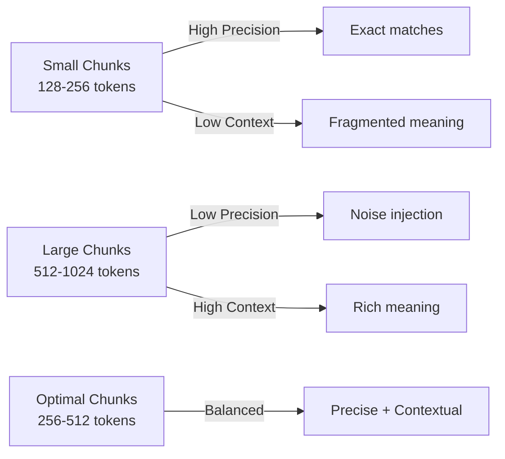
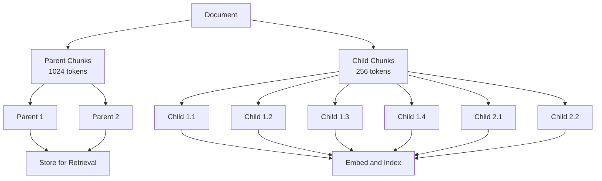
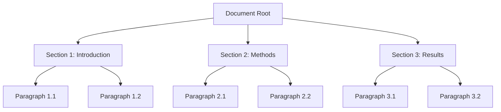
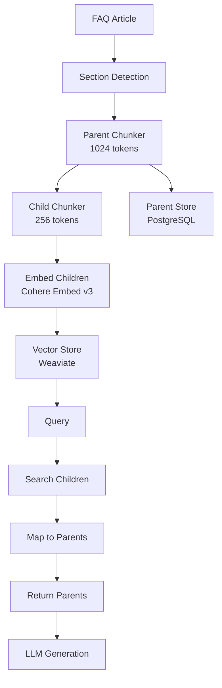

# Chapter 4: Chunking Strategies

> "The chunk is the atomic unit of retrieval. Get it right, and everything downstream works. Get it wrong, and no amount of reranking can save you."

---

**Last verified: June 2026.**

---

## Introduction

Chunking is one of the most impactful decisions in RAG. How you split documents directly determines retrieval quality, context relevance, and answer quality. The chunking decision is made early and affects everything downstream — embedding quality, retrieval precision, context assembly, and ultimately the LLM's ability to generate correct answers.

The chunking problem is deceptively simple: split text into retrievable units. But the simplicity is deceptive. Too small and you lose context — the model sees a fragment without understanding what it means. Too large and you add noise — the relevant information is buried in irrelevant content. The optimal chunk size depends on your documents and your queries, and there is no universal answer.

Consider a concrete example. A 50-page contract contains a termination clause on page 37. The clause is 400 words. If you chunk at 256 tokens (roughly 340 words), the clause splits across two chunks. If you chunk at 512 tokens (roughly 680 words), the clause fits in one chunk but includes 280 words of irrelevant surrounding text. Neither is ideal. The right chunk size depends on the clause length, the query specificity, and the LLM's ability to use context.

This chapter covers the full spectrum of chunking strategies: fixed-size, semantic, section-based, parent-child, hierarchical, and specialized approaches for code, tables, and multimodal content. We will build implementations of each strategy, compare them on real-world metrics, and establish a decision framework for choosing the right strategy for your use case.

The central thesis of this chapter is that **chunking strategy is not a preprocessing decision — it is an architectural decision**. The chunking strategy determines what information is available for retrieval, how much context the LLM receives, and how much you pay per query. It should be chosen deliberately, tested rigorously, and revisited as your document collection and query patterns evolve.

---

## 4.1 Why Chunking Matters

### 4.1.1 The Chunking Trade-Off

Every chunking strategy involves a fundamental trade-off between precision and context:



The trade-off manifests in three dimensions:

**Retrieval precision**: Smaller chunks are more likely to be about a single topic, making them easier to match to queries. Larger chunks cover multiple topics, diluting the relevance signal.

**Context completeness**: Larger chunks provide more context for the LLM to understand and reason about the information. Smaller chunks may lack the context needed to interpret the information correctly.

**Cost**: More chunks per document means more embeddings, more retrieval operations, and potentially more context tokens in the LLM prompt. Fewer chunks means less processing but potentially lower quality.

### 4.1.2 The Quality Cascade

Chunking quality cascades through the entire pipeline:

| Pipeline Stage | Impact of Poor Chunking |
|---------------|------------------------|
| **Embedding** | Chunks mixing multiple topics produce ambiguous embeddings |
| **Retrieval** | Ambiguous embeddings miss relevant matches |
| **Reranking** | Reranker cannot distinguish relevant from irrelevant chunks |
| **Context assembly** | Multiple irrelevant chunks waste context window space |
| **LLM generation** | Model sees noise, generating less accurate answers |
| **Cost** | More context tokens equals higher LLM cost |

This cascade means that improving chunking quality has a multiplicative effect on the entire pipeline. A 20% improvement in chunking quality can translate to a 30-40% improvement in end-to-end answer quality.

---

## 4.2 Fixed-Size Chunking

### 4.2.1 How It Works

The simplest approach: split text into equal-sized chunks with optional overlap. The chunk size is specified in tokens.

```python
import tiktoken

class FixedSizeChunker:
    def __init__(
        self,
        chunk_size: int = 512,
        chunk_overlap: int = 50,
        encoding_name: str = "cl100k_base"
    ):
        self.chunk_size = chunk_size
        self.chunk_overlap = chunk_overlap
        self.enc = tiktoken.get_encoding(encoding_name)

    def chunk(self, text: str) -> list[dict]:
        """Split text into fixed-size chunks with overlap."""
        tokens = self.enc.encode(text)
        chunks = []
        start = 0

        while start < len(tokens):
            end = start + self.chunk_size
            chunk_tokens = tokens[start:end]
            chunk_text = self.enc.decode(chunk_tokens)

            chunks.append({
                "text": chunk_text,
                "token_count": len(chunk_tokens),
                "start_token": start,
                "end_token": end,
                "strategy": "fixed_size"
            })

            start = end - self.chunk_overlap

        return chunks
```

### 4.2.2 Strengths and Weaknesses

| Strength | Weakness |
|----------|----------|
| Fast and predictable | Breaks sentences at arbitrary boundaries |
| Easy to implement | Loses semantic coherence |
| Consistent chunk sizes | May split paragraphs, lists, or tables |
| Deterministic | Does not respect document structure |

### 4.2.3 When to Use

- Uniform documents with consistent structure
- Cost-sensitive applications with predictable budgets
- Prototyping and initial quality assessment
- Non-semantic content: code, logs, structured data

### 4.2.4 When to Avoid

- Narrative content where meaning flows across paragraphs
- Legal/medical documents where precise boundaries matter
- Technical documentation with varying section lengths
- Tables and lists that require structural preservation

---

## 4.3 Semantic Chunking

### 4.3.1 How It Works

Split at semantic boundaries — where the meaning shifts. Compare embeddings of consecutive sentences; when similarity drops below a threshold, start a new chunk.

The key insight: semantic similarity between consecutive sentences indicates topic continuity. When similarity drops, the topic is shifting, and a chunk boundary should be placed there.

```python
import numpy as np
from sentence_transformers import SentenceTransformer

class SemanticChunker:
    def __init__(
        self,
        embedding_model: str = "all-MiniLM-L6-v2",
        similarity_threshold: float = 0.5,
        max_chunk_tokens: int = 512
    ):
        self.model = SentenceTransformer(embedding_model)
        self.threshold = similarity_threshold
        self.max_tokens = max_chunk_tokens
        self.enc = tiktoken.get_encoding("cl100k_base")

    def chunk(self, text: str) -> list[dict]:
        """Split text into semantically coherent chunks."""
        sentences = self._split_sentences(text)
        if len(sentences) <= 1:
            return [{"text": text, "token_count": len(self.enc.encode(text))}]

        embeddings = self.model.encode(sentences)
        boundaries = self._find_boundaries(embeddings)

        chunks = []
        start = 0
        for boundary in boundaries:
            chunk_text = " ".join(sentences[start:boundary])
            chunks.append({
                "text": chunk_text,
                "token_count": len(self.enc.encode(chunk_text)),
                "sentence_range": (start, boundary),
                "strategy": "semantic"
            })
            start = boundary

        if start < len(sentences):
            chunk_text = " ".join(sentences[start:])
            chunks.append({
                "text": chunk_text,
                "token_count": len(self.enc.encode(chunk_text)),
                "sentence_range": (start, len(sentences)),
                "strategy": "semantic"
            })

        return self._split_oversized(chunks)

    def _split_sentences(self, text: str) -> list[str]:
        import re
        sentences = re.split(r'(?<=[.!?])\s+', text)
        return [s.strip() for s in sentences if s.strip()]

    def _find_boundaries(self, embeddings: np.ndarray) -> list[int]:
        boundaries = []
        for i in range(1, len(embeddings)):
            similarity = np.dot(embeddings[i], embeddings[i-1]) / (
                np.linalg.norm(embeddings[i]) * np.linalg.norm(embeddings[i-1])
            )
            if similarity < self.threshold:
                boundaries.append(i)
        return boundaries

    def _split_oversized(self, chunks: list[dict]) -> list[dict]:
        result = []
        for chunk in chunks:
            if chunk["token_count"] <= self.max_tokens:
                result.append(chunk)
            else:
                fixed_chunker = FixedSizeChunker(chunk_size=self.max_tokens)
                result.extend(fixed_chunker.chunk(chunk["text"]))
        return result
```

### 4.3.2 Threshold Selection

| Threshold | Effect | Typical Use |
|-----------|--------|-------------|
| 0.3 | Few boundaries, large chunks | Narrative content |
| 0.5 | Moderate boundaries | General purpose |
| 0.7 | Many boundaries, small chunks | Technical content |
| 0.8 | Very many boundaries | Precise retrieval |

### 4.3.3 Strengths and Weaknesses

| Strength | Weakness |
|----------|----------|
| Preserves semantic coherence | Requires embedding model pass |
| Respects topic boundaries | Slower than fixed-size |
| Adapts to content structure | Threshold tuning required |
| Better retrieval quality | Non-deterministic across models |

---

## 4.4 Section-Based Chunking

### 4.4.1 How It Works

Split by document structure — headers, sections, and subsections. This is the most natural approach for structured documents (technical documentation, legal contracts, reports).

```python
class SectionChunker:
    def __init__(self, max_chunk_tokens: int = 1024):
        self.max_tokens = max_chunk_tokens
        self.enc = tiktoken.get_encoding("cl100k_base")

    def chunk(self, sections: list[dict], metadata: dict = None) -> list[dict]:
        """Chunk by document sections."""
        chunks = []
        for section in sections:
            section_text = self._section_to_text(section)
            token_count = len(self.enc.encode(section_text))

            if token_count <= self.max_tokens:
                chunks.append({
                    "text": section_text,
                    "token_count": token_count,
                    "section_title": section.get("title", ""),
                    "section_level": section.get("level", 0),
                    "strategy": "section_based",
                    "metadata": metadata or {}
                })
            else:
                paragraphs = section.get("paragraphs", [])
                current_chunk = ""
                for para in paragraphs:
                    para_text = para.get("text", "")
                    if len(self.enc.encode(
                        current_chunk + " " + para_text
                    )) > self.max_tokens:
                        if current_chunk:
                            chunks.append({
                                "text": current_chunk,
                                "token_count": len(self.enc.encode(current_chunk)),
                                "section_title": section.get("title", ""),
                                "strategy": "section_based",
                                "metadata": metadata or {}
                            })
                        current_chunk = para_text
                    else:
                        current_chunk = (
                            current_chunk + "\n" + para_text
                            if current_chunk else para_text
                        )
                if current_chunk:
                    chunks.append({
                        "text": current_chunk,
                        "token_count": len(self.enc.encode(current_chunk)),
                        "section_title": section.get("title", ""),
                        "strategy": "section_based",
                        "metadata": metadata or {}
                    })

        return chunks

    def _section_to_text(self, section: dict) -> str:
        title = section.get("title", "")
        paragraphs = section.get("paragraphs", [])
        texts = [p.get("text", "") for p in paragraphs]
        return title + "\n" + "\n".join(texts) if title else "\n".join(texts)
```

### 4.4.2 Strengths and Weaknesses

| Strength | Weakness |
|----------|----------|
| Preserves author's structure | Requires section detection |
| Natural chunk boundaries | Uneven chunk sizes |
| Contextually coherent | May produce very large or small chunks |
| Works well with metadata | Depends on document having clear sections |

---

## 4.5 Parent-Child Chunking

### 4.5.1 The Two-Level Approach

Parent-child chunking creates two levels of chunks: small child chunks for retrieval precision and large parent chunks for context. Retrieve with children (high precision), return parents (rich context).



### 4.5.2 Implementation

```python
class ParentChildChunker:
    def __init__(
        self,
        parent_size: int = 1024,
        child_size: int = 256,
        child_overlap: int = 50
    ):
        self.parent_size = parent_size
        self.child_size = child_size
        self.child_overlap = child_overlap
        self.enc = tiktoken.get_encoding("cl100k_base")

    def chunk(self, text: str, metadata: dict = None) -> dict:
        """Create parent and child chunks."""
        parent_chunks = self._create_parents(text, metadata)
        all_children = []
        for parent in parent_chunks:
            children = self._create_children(parent, metadata)
            all_children.extend(children)

        return {
            "parents": parent_chunks,
            "children": all_children,
            "parent_to_children": {
                p["id"]: [c["id"] for c in all_children
                          if c["parent_id"] == p["id"]]
                for p in parent_chunks
            }
        }

    def _create_parents(self, text: str, metadata: dict = None) -> list[dict]:
        tokens = self.enc.encode(text)
        parents = []
        idx = 0
        while idx < len(tokens):
            end = min(idx + self.parent_size, len(tokens))
            chunk_tokens = tokens[idx:end]
            chunk_text = self.enc.decode(chunk_tokens)
            parents.append({
                "id": f"parent_{idx}",
                "text": chunk_text,
                "token_count": len(chunk_tokens),
                "start_token": idx,
                "end_token": end,
                "strategy": "parent",
                "metadata": metadata or {}
            })
            idx = end
        return parents

    def _create_children(self, parent: dict, metadata: dict = None) -> list[dict]:
        tokens = self.enc.encode(parent["text"])
        children = []
        start = 0
        while start < len(tokens):
            end = min(start + self.child_size, len(tokens))
            chunk_tokens = tokens[start:end]
            chunk_text = self.enc.decode(chunk_tokens)
            children.append({
                "id": f"child_{parent['id']}_{start}",
                "parent_id": parent["id"],
                "text": chunk_text,
                "token_count": len(chunk_tokens),
                "start_token": start,
                "end_token": end,
                "strategy": "child",
                "metadata": metadata or {}
            })
            start = end - self.child_overlap
        return children
```

### 4.5.3 Retrieval Process

1. Search with child chunks: small, precise chunks match queries accurately
2. Identify parent: each child chunk maps to a parent chunk
3. Return parent: the parent chunk provides full context for the LLM

```python
class ParentChildRetriever:
    def __init__(self, vector_store, chunk_mapping: dict):
        self.vector_store = vector_store
        self.mapping = chunk_mapping  # child_id -> parent_id

    def search(self, query: str, top_k: int = 5) -> list[dict]:
        """Search with children, return parents."""
        child_results = self.vector_store.search(query, top_k=top_k * 3)

        seen_parents = set()
        parent_results = []
        for child in child_results:
            parent_id = self.mapping[child["id"]]
            if parent_id not in seen_parents:
                seen_parents.add(parent_id)
                parent = self.vector_store.get(parent_id)
                parent_results.append({
                    **parent,
                    "matched_children": [
                        c["id"] for c in child_results
                        if self.mapping[c["id"]] == parent_id
                    ]
                })

        return parent_results[:top_k]
```

### 4.5.4 Strengths and Weaknesses

| Strength | Weakness |
|----------|----------|
| High retrieval precision (small chunks) | Two levels to manage |
| Rich context for LLM (large chunks) | More storage required |
| Flexible retrieval strategies | More complex retrieval logic |
| Works for all document types | Requires mapping between levels |

---

## 4.6 Hierarchical Chunking

### 4.6.1 The Tree Structure

Hierarchical chunking creates a tree of chunks at multiple levels of granularity. This mirrors the document's natural hierarchy: document, sections, subsections, paragraphs.



### 4.6.2 Implementation

```python
class HierarchicalChunker:
    def __init__(self, levels: list[int] = None):
        self.levels = levels or [1024, 512, 256]
        self.enc = tiktoken.get_encoding("cl100k_base")

    def chunk(self, text: str, metadata: dict = None) -> dict:
        """Create hierarchical chunks at multiple levels."""
        chunks = {}
        for level_idx, chunk_size in enumerate(self.levels):
            level_chunks = self._chunk_at_level(text, chunk_size, level_idx, metadata)
            chunks[f"level_{level_idx}"] = level_chunks

        relationships = self._build_relationships(chunks)
        return {
            "levels": chunks,
            "relationships": relationships,
            "max_level": len(self.levels) - 1
        }

    def _chunk_at_level(self, text: str, size: int, level: int, metadata: dict) -> list[dict]:
        tokens = self.enc.encode(text)
        chunks = []
        idx = 0
        while idx < len(tokens):
            end = min(idx + size, len(tokens))
            chunk_tokens = tokens[idx:end]
            chunk_text = self.enc.decode(chunk_tokens)
            chunks.append({
                "id": f"L{level}_chunk_{idx}",
                "text": chunk_text,
                "token_count": len(chunk_tokens),
                "level": level,
                "start_token": idx,
                "end_token": end,
                "metadata": metadata or {}
            })
            idx = end
        return chunks

    def _build_relationships(self, chunks: dict) -> dict:
        relationships = {}
        for level in range(1, len(self.levels)):
            parent_key = f"level_{level - 1}"
            child_key = f"level_{level}"
            if parent_key in chunks and child_key in chunks:
                for parent in chunks[parent_key]:
                    children = [
                        c for c in chunks[child_key]
                        if (c["start_token"] >= parent["start_token"]
                            and c["end_token"] <= parent["end_token"])
                    ]
                    relationships[parent["id"]] = [c["id"] for c in children]
        return relationships
```

---

## 4.7 Specialized Chunking Strategies

### 4.7.1 Code Chunking

Code has its own structural boundaries: functions, classes, modules. Respecting these boundaries preserves semantic meaning.

```python
import ast

class CodeChunker:
    def chunk(self, code: str, language: str = "python") -> list[dict]:
        """Chunk code by function and class boundaries."""
        if language == "python":
            return self._chunk_python(code)
        return [{"text": code, "strategy": "code_passthrough"}]

    def _chunk_python(self, code: str) -> list[dict]:
        try:
            tree = ast.parse(code)
        except SyntaxError:
            return [{"text": code, "strategy": "code_raw"}]

        chunks = []
        for node in ast.iter_child_nodes(tree):
            if isinstance(node, (ast.FunctionDef, ast.AsyncFunctionDef)):
                chunks.append({
                    "text": ast.get_source_segment(code, node),
                    "type": "function",
                    "name": node.name,
                    "strategy": "code_ast"
                })
            elif isinstance(node, ast.ClassDef):
                class_text = ast.get_source_segment(code, node)
                chunks.append({
                    "text": class_text,
                    "type": "class",
                    "name": node.name,
                    "strategy": "code_ast"
                })
            else:
                chunk_text = ast.get_source_segment(code, node)
                if chunk_text:
                    chunks.append({
                        "text": chunk_text,
                        "type": "module_level",
                        "strategy": "code_ast"
                    })
        return chunks
```

### 4.7.2 Table Chunking

Tables require special handling to preserve row/column relationships:

```python
class TableChunker:
    def chunk(self, table_text: str, max_rows: int = 20) -> list[dict]:
        """Chunk tables while preserving structure."""
        lines = table_text.strip().split("\n")
        if len(lines) <= max_rows:
            return [{"text": table_text, "strategy": "table_whole"}]

        chunks = []
        header = lines[0] if lines else ""
        separator = lines[1] if len(lines) > 1 else ""
        data_rows = lines[2:] if len(lines) > 2 else []

        for i in range(0, len(data_rows), max_rows):
            batch = data_rows[i:i + max_rows]
            chunk_text = "\n".join([header, separator] + batch)
            chunks.append({
                "text": chunk_text,
                "row_range": (i + 2, min(i + max_rows + 2, len(lines))),
                "strategy": "table_chunked"
            })
        return chunks
```

---

## 4.8 Chunk Optimization

### 4.8.1 Size Selection

The research and practice consensus: 256-512 tokens is the sweet spot for most applications.

| Chunk Size | Precision | Recall | Context | Cost |
|-----------|-----------|--------|---------|------|
| 128 tokens | High | Low | Minimal | Low |
| 256 tokens | High | Medium | Good | Medium |
| 512 tokens | Medium | High | Rich | Medium |
| 1024 tokens | Low | Very High | Very Rich | High |
| 2048 tokens | Very Low | Maximum | Maximum | Very High |

### 4.8.2 Overlap

Overlapping chunks prevents context loss at boundaries. A 10-20% overlap ensures that sentences split across chunks appear in at least one complete form.

| Overlap | Context Preservation | Token Waste | Recommended |
|---------|---------------------|-------------|-------------|
| 0% | None | None | Short, uniform documents |
| 10% | Good | 10% | General purpose |
| 20% | Excellent | 20% | Narrative content |
| 30% | Maximum | 30% | Only when precision critical |

### 4.8.3 Deduplication

After chunking, deduplicate near-identical chunks. Different documents may contain similar content. Duplicate chunks waste retrieval slots and context space.

---

## 4.9 Case Study: Chunk Size Impact

### 4.9.1 Problem Statement

A customer support RAG system needs to find relevant FAQ answers. The system processes 50,000 FAQ articles. Different chunk sizes affect retrieval quality differently.

### 4.9.2 Experiment Results

| Chunk Size | Precision@5 | Recall@5 | MRR | Latency | Cost/Query |
|-----------|-------------|----------|-----|---------|------------|
| 128 tokens | 82% | 65% | 0.78 | 1.2s | $0.018 |
| 256 tokens | 88% | 78% | 0.85 | 1.4s | $0.021 |
| 512 tokens | 85% | 85% | 0.82 | 1.6s | $0.024 |
| 1024 tokens | 78% | 91% | 0.75 | 2.0s | $0.030 |
| Parent-child (256/1024) | 89% | 88% | 0.87 | 1.7s | $0.026 |

### 4.9.3 Analysis

256 tokens provided the best precision. 512 tokens balanced precision and recall. 1024 tokens had the highest recall but lowest precision. Parent-child chunking achieved the best overall quality (89% precision, 88% recall) at moderate cost.

### 4.9.4 Decision

The team chose parent-child chunking (256-token children, 1024-token parents) for the best overall quality. The 26% cost increase over 256-token chunks was justified by the 7% precision improvement and 13% recall improvement.

### 4.9.5 Architecture



### 4.9.6 Cost Analysis

| Component | 256-token Chunks | Parent-Child | Change |
|-----------|-----------------|--------------|--------|
| Embedding | $0.0001/query | $0.0001/query | Same |
| Vector storage | $50/month | $120/month | +$70 |
| Retrieval | $0.00005/query | $0.00008/query | +$0.00003 |
| LLM (context) | $0.015/query | $0.018/query | +$0.003 |
| **Total per query** | **$0.021** | **$0.026** | **+$0.005** |
| **Monthly (10K queries/day)** | **$6,300** | **$7,800** | **+$1,500** |

The $1,500/month cost increase is justified by the quality improvement. The system resolves 13% more queries correctly, reducing human escalation costs.

---

## 4.10 Decision Framework

| Document Type | Recommended Strategy | Chunk Size | Rationale |
|--------------|---------------------|------------|-----------|
| Legal contracts | Section-based + parent-child | 256/1024 | Respects clause structure |
| Technical docs | Section-based | 512 | Author-defined structure |
| FAQ/knowledge base | Parent-child | 256/1024 | Precise matching + context |
| Narrative content | Semantic | 512 | Respects topic flow |
| Code repositories | Code-aware (AST) | Function-level | Respects code structure |
| Mixed content | Hierarchical | 256/512/1024 | Multiple granularity levels |
| Financial reports | Table-aware + section | 512 | Preserves tabular data |
| Web pages | Semantic | 256 | Variable structure |

---

## 4.11 Testing Chunking Strategies

### 4.11.1 Unit Testing

```python
import pytest

def test_fixed_size_chunker_respects_size():
    chunker = FixedSizeChunker(chunk_size=100, chunk_overlap=10)
    text = "word " * 500  # 500 words
    chunks = chunker.chunk(text)
    for chunk in chunks:
        assert chunk["token_count"] <= 100

def test_fixed_size_chunker_overlap():
    chunker = FixedSizeChunker(chunk_size=100, chunk_overlap=10)
    text = "word " * 500
    chunks = chunker.chunk(text)
    # Verify overlap exists
    if len(chunks) > 1:
        first_end = chunks[0]["text"][-50:]
        second_start = chunks[1]["text"][:50]
        # Some text should overlap
        assert len(set(first_end.split()) & set(second_start.split())) > 0

def test_semantic_chunker_finds_boundaries():
    chunker = SemanticChunker(similarity_threshold=0.3)
    text = (
        "The quick brown fox jumps over the lazy dog. "
        "Cats are independent animals that prefer solitude. "
        "Machine learning models require large datasets for training. "
        "Dogs are social animals that thrive on companionship."
    )
    chunks = chunker.chunk(text)
    # Should split at topic changes
    assert len(chunks) >= 2

def test_section_chunker_preserves_titles():
    chunker = SectionChunker(max_chunk_tokens=1024)
    sections = [
        {"title": "Introduction", "level": 1, "paragraphs": [
            {"text": "This is the introduction."}
        ]},
        {"title": "Methods", "level": 1, "paragraphs": [
            {"text": "These are the methods."}
        ]},
    ]
    chunks = chunker.chunk(sections)
    assert len(chunks) == 2
    assert chunks[0]["section_title"] == "Introduction"
    assert chunks[1]["section_title"] == "Methods"
```

### 4.11.2 Integration Testing

```python
def test_chunking_end_to_end_quality():
    """Test chunking impact on retrieval quality."""
    chunker = ParentChildChunker(parent_size=1024, child_size=256)
    text = load_test_document("sample_contract.txt")
    result = chunker.chunk(text)

    assert len(result["parents"]) > 0
    assert len(result["children"]) > 0
    assert all(
        c["parent_id"] in [p["id"] for p in result["parents"]]
        for c in result["children"]
    )

def test_chunk_quality_metrics():
    """Test chunk quality against golden dataset."""
    chunker = SectionChunker(max_chunk_tokens=512)
    documents = load_test_documents()
    all_chunks = []
    for doc in documents:
        chunks = chunker.chunk(doc["sections"])
        all_chunks.extend(chunks)

    # Verify chunks are not empty
    assert all(c["token_count"] > 0 for c in all_chunks)

    # Verify chunk size distribution
    sizes = [c["token_count"] for c in all_chunks]
    avg_size = sum(sizes) / len(sizes)
    assert 100 < avg_size < 600  # Reasonable average
```

---

## 4.12 Key Takeaways

1. **Chunking is the most impactful early decision in RAG.** It determines what information is available for retrieval. Test with your actual data, not generic benchmarks.

2. **Parent-child chunking combines precision (small chunks) with context (large chunks).** Retrieve with children for accuracy, return parents for context. This is the production standard for quality-critical applications.

3. **256-512 tokens is the sweet spot for most applications.** Smaller chunks improve precision but lose context. Larger chunks improve recall but add noise. Parent-child with 256/1024 is the best overall approach.

4. **Semantic chunking outperforms fixed-size for natural language documents.** It respects topic boundaries, producing more coherent chunks. The trade-off is additional processing time.

5. **Overlap prevents context loss at boundaries.** 10-20% overlap is typical. Too much overlap wastes tokens on duplicate content.

6. **The right strategy depends on your document types.** One size does not fit all. Legal contracts need section-based chunking. Code needs AST-aware chunking. Tables need structure-preserving chunking.

7. **Chunking quality cascades through the entire pipeline.** Poor chunking produces ambiguous embeddings, which produce poor retrieval, which produces poor generation. A 20% chunking improvement can yield 30-40% end-to-end improvement.

8. **Deduplication is essential after chunking.** Different documents may contain similar content. Duplicate chunks waste retrieval slots and context space.

9. **Cost increases with smaller chunks.** More chunks means more embeddings and more context tokens. Parent-child chunking adds 20-30% cost but typically improves quality by 15-25%.

10. **Chunking strategy should evolve with your system.** Start with section-based or parent-child, measure quality, and refine. The optimal strategy changes as your document collection and query patterns evolve.

---

## 4.13 Further Reading

- **"Text Splitting and Chunking" by LangChain** (python.langchain.com/docs/modules/data_connection/document_transformers) — Comprehensive documentation on text splitting strategies including recursive character, HTML, and code splitters.

- **"Semantic Chunking for RAG" by Greg Kamradt** (github.com/FullStackRetrieval-com/RetrievalTutorials) — Tutorial on semantic chunking with embeddings and threshold tuning.

- **"Advanced RAG: Parent Document Retriever" by LlamaIndex** (docs.llamaindex.ai) — Implementation guide for parent-child chunking in LlamaIndex.

- **"Chunking Strategies for LLM Applications" by Chroma** (docs.trychroma.com) — Analysis of chunking strategies and their impact on retrieval quality.

- **"Lost in the Middle" by Liu et al. (2023)** — Research on context position effects, directly relevant to chunk ordering and context assembly.

- **"Textbooks Are All You Need" by Gunasekar et al. (2023)** — Research on data quality for training, applicable to chunk quality principles.

- **"Recursive Character Text Splitters" by LangChain** — Implementation of intelligent text splitting that respects document structure.

- **Unstructured Chunking** (unstructured.io) — Open-source document chunking with section-aware and table-aware strategies.

- **"Chunking for RAG: Best Practices" by Weaviate** (weaviate.io/blog) — Practical guide to chunking strategies with benchmarks.

- **"The Impact of Chunking on RAG Performance" by Pinecone** (www.pinecone.io/learn/chunking-strategies) — Analysis of chunk size and strategy impact on retrieval quality.
