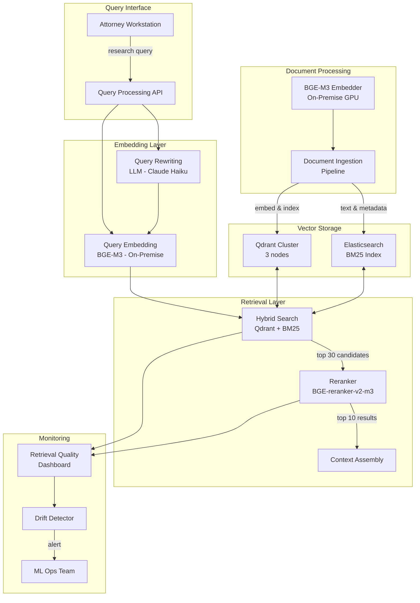

# Chapter 5: Embeddings

> **Last verified: June 2026.**

> "The embedding is the atomic unit of semantic search. Every downstream retrieval decision—what gets found, what gets ranked, what gets surfaced to the user—begins with the quality of the vector representation."

---

## Introduction

Every retrieval-augmented generation system begins with a single transformation: converting text into numbers. This transformation is the embedding—a dense vector representation that captures the semantic meaning of text in a format that machines can compare. The embedding is not a peripheral component. It is the foundation upon which the entire RAG architecture rests. If the embedding fails to capture the relevant semantic relationships in your domain, no amount of retrieval engineering, reranking, or context assembly will compensate.

Consider the stakes. A legal research system retrieves case law relevant to a client's situation. A medical decision support system surfaces clinical guidelines for a patient's symptoms. A customer support system finds the right troubleshooting steps for a reported issue. In each case, the embedding model determines which documents are even *candidates* for retrieval. A document that the embedding model cannot represent effectively is a document that will never be found—regardless of how sophisticated the downstream pipeline becomes.

The central thesis of this chapter is that **embedding selection is an architectural decision with domain-specific consequences**. General-purpose benchmarks like the MTEB leaderboard provide useful starting points, but they do not predict performance on your specific data. Legal text, medical records, financial filings, and technical documentation each have distinct semantic structures that different embedding models capture with varying fidelity. The discipline of embedding engineering is the process of finding, evaluating, fine-tuning, and operating the right model for your domain.

We will examine the mechanics of how embedding models work, compare the major embedding providers and open-source models, explore domain-specific fine-tuning, address the operational challenge of embedding drift, and build a complete case study of a legal research system that improved retrieval accuracy by 23% through embedding optimization.

### The Embedding Spectrum

Before diving into specific models, it is useful to understand the landscape of embedding approaches:

| Approach | Dimensions | Training Data | Domain Adaptability | Cost |
|----------|-----------|---------------|---------------------|------|
| **General-purpose (API)** | 768-3072 | Web-scale corpus | Low (fixed) | Per-token pricing |
| **General-purpose (open-source)** | 384-1024 | Web-scale corpus | Medium (can fine-tune) | Self-hosted |
| **Domain-specific (fine-tuned)** | 768-1024 | Domain corpus + pairs | High | Fine-tuning + inference |
| **Task-specific (colbert-style)** | Variable | Task-specific | Very high | Custom architecture |
| **Late interaction** | 1024+ | Mixed | High | Moderate |

Most production RAG systems begin with a general-purpose model (API or open-source) and graduate to domain-specific fine-tuning as retrieval evaluation reveals gaps. The patterns in this chapter show you how to make that progression systematic and measurable.

---

## 5.1 Embedding Mechanics

### 5.1.1 How Embedding Models Work

An embedding model is a neural network trained to map text to a fixed-length vector in a high-dimensional space. The training objective ensures that semantically similar texts produce vectors that are close together in this space, while dissimilar texts produce vectors that are far apart.

The process works as follows:

1. **Tokenization**: The input text is split into tokens (subword units) using a tokenizer specific to the model.
2. **Encoding**: Each token is mapped to an initial vector embedding, then processed through transformer layers that capture contextual relationships.
3. **Pooling**: The sequence of token-level vectors is compressed into a single vector—typically using mean pooling (average all token vectors) or [CLS] token pooling (use the vector associated with a special classification token).
4. **Normalization**: The resulting vector is normalized to unit length, ensuring that cosine similarity is equivalent to dot product and that magnitude does not influence similarity.

The dimensionality of the output vector (768, 1024, 3072, etc.) determines the capacity of the representation. Higher dimensions capture more nuance but increase storage and compute costs proportionally.

```python
from sentence_transformers import SentenceTransformer
import numpy as np

# Load a general-purpose embedding model
model = SentenceTransformer("BAAI/bge-m3")

# Embed a single query
query = "How to reset password"
query_embedding = model.encode(query)
print(f"Dimension: {query_embedding.shape}")  # (1024,)
print(f"Normalized: {np.isclose(np.linalg.norm(query_embedding), 1.0)}")  # True

# Embed a corpus
documents = [
    "Password recovery steps for admin accounts",
    "How to change your password in system settings",
    "User account management policies",
    "Network configuration guide",
    "Troubleshooting login failures and authentication errors",
]

doc_embeddings = model.encode(documents)
print(f"Corpus shape: {doc_embeddings.shape}")  # (5, 1024)

# Compute similarity
similarities = np.dot(doc_embeddings, query_embedding)
for doc, score in zip(documents, similarities):
    print(f"  {score:.4f}: {doc}")
```

The output reveals the core property of embeddings: "Password recovery steps" and "How to change your password" score highest because they are semantically closest to the query, even though they share different specific words. "Network configuration guide" scores lowest because it is semantically distant from password-related queries.

### 5.1.2 Bi-Encoders vs. Cross-Encoders

Understanding the distinction between bi-encoders and cross-encoders is essential for understanding both embeddings and reranking (covered in Chapter 8).

**Bi-encoders** process the query and document independently. The query is encoded into a vector, each document is encoded into a vector, and similarity is computed as a dot product or cosine similarity between vectors. This independence is what makes bi-encoders fast: document embeddings can be pre-computed and indexed, so query time is just one forward pass plus a vector similarity lookup.

**Cross-encoders** process the query and document together as a single input. The cross-attention mechanism in the transformer allows every token in the query to attend to every token in the document, capturing fine-grained interactions. This produces more accurate relevance scores but is dramatically slower: each query-document pair requires a separate forward pass.

| Property | Bi-Encoder | Cross-Encoder |
|----------|-----------|---------------|
| **Input** | Query and document separately | Query and document concatenated |
| **Pre-computation** | Yes (document embeddings cached) | No (must process at query time) |
| **Query latency** | O(1) forward pass + vector search | O(n) forward passes for n documents |
| **Quality** | Good (captures semantic similarity) | Excellent (captures fine-grained interaction) |
| **Use case** | Initial retrieval (thousands of docs) | Reranking (tens of candidates) |
| **Typical dimensions** | 768-3072 | N/A (outputs scalar score) |

The standard RAG pipeline exploits both: bi-encoders for fast initial retrieval from millions of documents, cross-encoders for accurate reranking of the top 20-30 candidates.

### 5.1.3 The Embedding Space

Understanding the geometry of embedding space helps diagnose retrieval failures. In a well-trained embedding model:

- **Semantic clusters** form around topics. Documents about "authentication" cluster together; documents about "billing" form a separate cluster.
- **Analogies** are preserved. The vector offset from "king" to "queen" is similar to the offset from "man" to "woman."
- **Out-of-domain text** lands in sparse regions of the space, far from any meaningful cluster.

When retrieval fails, the first diagnostic step is to examine where the query and relevant documents land in embedding space. If they are far apart despite being semantically related in your domain, the embedding model is not capturing domain-specific relationships.

```python
import numpy as np
from sklearn.decomposition import PCA
import matplotlib.pyplot as plt

def visualize_embedding_space(query, documents, model):
    """Project embeddings to 2D and visualize clusters."""
    all_texts = [query] + documents
    embeddings = model.encode(all_texts)
    
    # Reduce to 2D for visualization
    pca = PCA(n_components=2)
    coords = pca.fit_transform(embeddings)
    
    # Plot
    plt.figure(figsize=(10, 8))
    plt.scatter(coords[1:, 0], coords[1:, 1], c='blue', label='Documents')
    plt.scatter(coords[0, 0], coords[0, 1], c='red', label='Query', marker='*', s=200)
    
    for i, doc in enumerate(documents):
        plt.annotate(doc[:30], (coords[i+1, 0], coords[i+1, 1]))
    
    plt.legend()
    plt.title("Embedding Space Visualization")
    plt.savefig("embedding_space.png", dpi=150)
```

---

## 5.2 Embedding Models

### 5.2.1 OpenAI Embeddings

OpenAI offers two embedding models optimized for different use cases:

**text-embedding-3-large**: 3072 dimensions, 8191 max tokens, $0.13 per million tokens. The highest-quality model from OpenAI, with strong performance across benchmarks. Supports dimension reduction via the `dimensions` parameter—useful for balancing quality against storage cost.

**text-embedding-3-small**: 1536 dimensions, 8191 max tokens, $0.02 per million tokens. The cost-effective option, offering good quality at a fraction of the price. The default choice for most applications where cost is a primary concern.

```python
from openai import OpenAI

client = OpenAI()

# Standard embedding
response = client.embeddings.create(
    model="text-embedding-3-large",
    input="How to reset password",
    dimensions=3072  # Full dimensions
)
embedding = response.data[0].embedding

# Reduced dimensions (cost optimization)
response_reduced = client.embeddings.create(
    model="text-embedding-3-large",
    input="How to reset password",
    dimensions=1024  # Reduced dimensions
)
embedding_reduced = response_reduced.data[0].embedding

# Batch embedding (more efficient)
documents = [
    "Password recovery steps",
    "Account management guide",
    "Network troubleshooting",
]
response_batch = client.embeddings.create(
    model="text-embedding-3-small",
    input=documents
)
embeddings_batch = [item.embedding for item in response_batch.data]
```

The `dimensions` parameter is particularly valuable for cost optimization. Reducing from 3072 to 1024 dimensions typically costs 5-10% quality but reduces storage by 67% and can improve query speed due to smaller vector distance computations.

### 5.2.2 BGE-M3

From BAAI (Beijing Academy of Artificial Intelligence), BGE-M3 is the most versatile open-source embedding model available:

- **Dimensions**: 1024
- **Max tokens**: 8192
- **Languages**: 100+ languages natively supported
- **Cost**: Free (self-hosted)
- **License**: MIT

BGE-M3's key advantage is its multilingual capability combined with strong English performance. For organizations operating across multiple languages, BGE-M3 eliminates the need for language-specific models.

```python
from sentence_transformers import SentenceTransformer

model = SentenceTransformer("BAAI/bge-m3")

# Multilingual embedding
queries = [
    "How to reset password",          # English
    "Como restablecer la contraseña",  # Spanish
    "パスワードをリセットする方法",      # Japanese
    "如何重置密码",                     # Chinese
]

documents = [
    "Password recovery instructions for all accounts",
    "Instrucciones de recuperación de contraseña",
    "すべてのアカウントのパスワード復旧手順",
    "所有帐户的密码恢复说明",
]

query_embeddings = model.encode(queries)
doc_embeddings = model.encode(documents)

# Cross-lingual similarity
similarities = np.dot(doc_embeddings, query_embeddings.T)
print("Cross-lingual retrieval works without translation:")
for i, query in enumerate(queries):
    best_doc_idx = np.argmax(similarities[:, i])
    print(f"  Query ({query[:20]}...) -> Best: {documents[best_doc_idx][:40]}...")
```

### 5.2.3 Cohere embed-v3

Cohere's embedding model offers strong managed-service quality:

- **Dimensions**: 1024
- **Max tokens**: 512 (shorter than alternatives)
- **Cost**: $0.10 per million tokens
- **Features**: Built-in input_type parameter for queries vs. documents

```python
import cohere

co = cohere.Client("YOUR_API_KEY")

# Embed with input type distinction
query_response = co.embed(
    texts=["How to reset password"],
    model="embed-v3.0",
    input_type="search_query",
    embedding_types=["float"]
)

doc_response = co.embed(
    texts=["Password recovery steps for admin accounts"],
    model="embed-v3.0",
    input_type="search_document",
    embedding_types=["float"]
)

query_embedding = query_response.embeddings.float_[0]
doc_embedding = doc_response.embeddings.float_[0]
```

The `input_type` parameter is a significant differentiator. Cohere trains its model to distinguish between queries and documents, producing embeddings optimized for their respective roles. This typically improves retrieval quality by 3-5% compared to treating queries and documents identically.

### 5.2.4 Jina-embeddings-v3

Jina offers competitive quality at the lowest cost among managed services:

- **Dimensions**: 1024
- **Max tokens**: 8192
- **Cost**: $0.02 per million tokens
- **Features**: Supports late interaction for reranking

```python
import requests

def jina_embed(texts: list[str], task: str = "retrieval.passage") -> list[list[float]]:
    """Embed texts using Jina embeddings API."""
    response = requests.post(
        "https://api.jina.ai/v1/embeddings",
        headers={"Authorization": "Bearer YOUR_API_KEY"},
        json={
            "model": "jina-embeddings-v3",
            "input": texts,
            "task": task,  # "retrieval.query" or "retrieval.passage"
        }
    )
    return [item["embedding"] for item in response.json()["data"]]

# Embed query and documents with task-specific prompting
query_emb = jina_embed(["How to reset password"], task="retrieval.query")
doc_embs = jina_embed(
    ["Password recovery steps", "Account management guide"],
    task="retrieval.passage"
)
```

### 5.2.5 Model Comparison Matrix

| Model | Dimensions | Max Tokens | Cost/M Tokens | Multilingual | Fine-tunable | Self-hosted |
|-------|-----------|-----------|---------------|-------------|--------------|-------------|
| OpenAI text-embedding-3-large | 3072 | 8191 | $0.13 | Yes | No | No |
| OpenAI text-embedding-3-small | 1536 | 8191 | $0.02 | Yes | No | No |
| BGE-M3 | 1024 | 8192 | Free | Yes (100+) | Yes | Yes |
| Cohere embed-v3 | 1024 | 512 | $0.10 | Yes | No | No |
| Jina-embeddings-v3 | 1024 | 8192 | $0.02 | Yes | No | No |
| nomic-embed-text-v1.5 | 768 | 8192 | Free | Limited | Yes | Yes |

---

## 5.3 Choosing an Embedding Model

### 5.3.1 Decision Framework

The choice of embedding model is driven by five constraints: quality requirements, cost budget, latency requirements, data privacy requirements, and multilingual needs.

| Constraint | Primary Choice | Rationale |
|-----------|---------------|-----------|
| Zero infrastructure, fastest start | OpenAI text-embedding-3-small | Managed, reliable, low cost |
| Best quality, budget allows | OpenAI text-embedding-3-large | Highest benchmark scores |
| Best quality/cost (self-hosted) | BGE-M3 | Free, strong performance, fine-tunable |
| Best quality/cost (managed) | Jina-embeddings-v3 | $0.02/M tokens, competitive quality |
| Best multilingual | BGE-M3 | 100+ languages, native support |
| Longest context (8K+ tokens) | BGE-M3 or OpenAI | Both support 8K+ tokens |
| Data cannot leave premises | BGE-M3 | Self-hosted, MIT license |
| Short documents (512 tokens) | Cohere embed-v3 | Task-specific input_type |
| Domain-specific (fine-tuning needed) | BGE-M3 | Open weights, fine-tunable |

### 5.3.2 Evaluation Protocol

Before committing to any embedding model, run a structured evaluation against your actual data:

```python
import numpy as np
from dataclasses import dataclass
from typing import Callable

@dataclass
class RetrievalEvalResult:
    model_name: str
    recall_at_5: float
    recall_at_10: float
    recall_at_20: float
    mrr: float
    ndcg_at_10: float
    latency_ms: float

def evaluate_embedding_model(
    model_name: str,
    embed_fn: Callable[[list[str]], np.ndarray],
    queries: list[str],
    relevant_docs: list[list[int]],  # Ground truth: for each query, indices of relevant docs
    all_documents: list[str],
    top_k: int = 20,
) -> RetrievalEvalResult:
    """Evaluate an embedding model on retrieval quality."""
    import time
    
    # Embed queries and documents
    start = time.time()
    query_embs = embed_fn(queries)
    doc_embs = embed_fn(all_documents)
    embedding_time = (time.time() - start) * 1000
    
    # Compute similarities
    similarities = np.dot(doc_embs, query_embs.T).T  # (num_queries, num_docs)
    
    # Rank documents for each query
    rankings = np.argsort(-similarities, axis=1)
    
    # Compute metrics
    recall_at_5 = compute_recall(rankings, relevant_docs, k=5)
    recall_at_10 = compute_recall(rankings, relevant_docs, k=10)
    recall_at_20 = compute_recall(rankings, relevant_docs, k=20)
    mrr = compute_mrr(rankings, relevant_docs)
    ndcg = compute_ndcg(rankings, relevant_docs, k=10)
    
    return RetrievalEvalResult(
        model_name=model_name,
        recall_at_5=recall_at_5,
        recall_at_10=recall_at_10,
        recall_at_20=recall_at_20,
        mrr=mrr,
        ndcg_at_10=ndcg,
        latency_ms=embedding_time / len(queries),
    )

def compute_recall(rankings, relevant_docs, k):
    """Compute recall@k: fraction of relevant docs in top-k."""
    hits = 0
    total_relevant = 0
    for ranking, relevant in zip(rankings, relevant_docs):
        top_k_set = set(ranking[:k].tolist())
        hits += len(top_k_set.intersection(relevant))
        total_relevant += len(relevant)
    return hits / total_relevant if total_relevant > 0 else 0

def compute_mrr(rankings, relevant_docs):
    """Compute Mean Reciprocal Rank."""
    rr_sum = 0
    for ranking, relevant in zip(rankings, relevant_docs):
        for rank, doc_id in enumerate(ranking):
            if doc_id in relevant:
                rr_sum += 1 / (rank + 1)
                break
    return rr_sum / len(rankings)
```

Run this evaluation on a golden dataset of at least 200 query-relevant document pairs. The evaluation should cover:

1. **Representative queries**: Queries that reflect actual user behavior, not synthetic examples.
2. **Edge cases**: Ambiguous queries, very short queries, queries with domain-specific terminology.
3. **Hard negatives**: Documents that are topically related but not actually relevant to the query.
4. **Multiple metrics**: Recall@k, MRR, and NDCG provide complementary views of retrieval quality.

---

## 5.4 Domain-Specific Embeddings

### 5.4.1 Why Domain-Specific Embeddings Matter

General-purpose embedding models are trained on web-scale corpora that emphasize general knowledge. They understand "the cat sat on the mat" well but may struggle with "the plaintiff's claim under 42 U.S.C. Section 1983 requires demonstrating state action." The legal terminology, statutory references, and complex sentence structures in the second example are underrepresented in general training data.

Domain-specific fine-tuning addresses this gap by continuing the embedding model's training on domain-specific query-document pairs. The process typically improves retrieval quality by 10-20% for specialized content, measured by recall@k or NDCG.

### 5.4.2 Fine-Tuning Process

The fine-tuning process for embedding models follows a specific pattern:

1. **Data collection**: Gather (query, relevant_document, irrelevant_document) triples from your domain.
2. **Loss function**: Use contrastive loss—pull relevant documents closer to the query while pushing irrelevant documents farther away.
3. **Training**: Fine-tune for 1-3 epochs with a small learning rate (1e-5 to 5e-6) to avoid catastrophic forgetting.
4. **Evaluation**: Measure retrieval quality on a held-out test set before and after fine-tuning.

```python
from sentence_transformers import SentenceTransformer, InputExample, losses
from torch.utils.data import DataLoader

def fine_tune_embedding_model(
    base_model: str,
    train_pairs: list[tuple[str, str, str]],  # (query, positive, negative)
    output_path: str,
    epochs: int = 2,
    batch_size: int = 32,
    learning_rate: float = 2e-6,
):
    """Fine-tune an embedding model on domain-specific pairs."""
    
    model = SentenceTransformer(base_model)
    
    # Create training examples
    train_examples = [
        InputExample(
            texts=[query, positive, negative],
            label=1.0
        )
        for query, positive, negative in train_pairs
    ]
    
    train_dataloader = DataLoader(
        train_examples, shuffle=True, batch_size=batch_size
    )
    
    # MultipleNegativesRankingLoss: standard for embedding fine-tuning
    train_loss = losses.MultipleNegativesRankingLoss(model)
    
    # Train
    model.fit(
        train_objectives=[(train_dataloader, train_loss)],
        epochs=epochs,
        warmup_steps=100,
        optimizer_params={"lr": learning_rate},
        output_path=output_path,
        show_progress_bar=True,
    )
    
    return model

# Example: Legal domain fine-tuning
legal_pairs = [
    (
        "statute of limitations for breach of contract",
        "The statute of limitations for breach of contract claims is generally four years under UCC Section 2-725.",
        "The Federal Rules of Civil Procedure govern discovery procedures in federal courts."
    ),
    (
        "negligence per se elements",
        "Negligence per se requires proof that (1) the defendant violated a statute, (2) the statute was designed to prevent the type of harm that occurred, and (3) the plaintiff is within the class of persons the statute was designed to protect.",
        "Comparative negligence reduces recovery proportionally to the plaintiff's fault."
    ),
    # ... 500+ domain-specific triples
]

model = fine_tune_embedding_model(
    base_model="BAAI/bge-m3",
    train_pairs=legal_pairs,
    output_path="./legal-embedding-model",
    epochs=2,
)
```

### 5.4.3 Fine-Tuning Data Requirements

The quality and quantity of fine-tuning data directly determine improvement:

| Data Volume | Expected Improvement | Effort |
|-------------|---------------------|--------|
| 100 pairs | 3-5% | Low (1-2 days) |
| 500 pairs | 8-12% | Medium (1 week) |
| 1000 pairs | 12-18% | Medium (2 weeks) |
| 5000+ pairs | 15-25% | High (ongoing) |

The diminishing returns curve means that the first 500 pairs provide the most value per unit of effort. Start there, measure improvement, and decide whether additional investment is justified.

**Data sources for fine-tuning pairs:**

- **Search logs**: User queries that led to document clicks are natural (query, document) pairs.
- **Expert annotations**: Domain experts labeling which documents are relevant to which queries.
- **Existing taxonomies**: If your organization has categorized documents, those categories can be converted to relevance judgments.
- **Synthetic generation**: Use GPT-4 or Claude to generate plausible queries for existing documents, then have experts validate.

---

## 5.5 Embedding Drift

### 5.5.1 What Embedding Drift Is

Embedding drift occurs when the vectors produced by an embedding model become incompatible with previously stored vectors. This happens when:

1. **Model upgrade**: You switch from one version of a model to another (e.g., BGE-M3 v1.0 to v1.1). The new model produces vectors in a different representation space.
2. **Fine-tuning**: You fine-tune a model on new domain data. The fine-tuned model's representation space shifts.
3. **Provider changes**: The API provider updates their model (OpenAI, Cohere, etc.) without notice, subtly changing vector representations.

The consequence is severe: existing embeddings in your vector database are no longer compatible with queries embedded by the new model. Retrieval quality drops catastrophically because the vector distances no longer reflect true semantic similarity.

### 5.5.2 Detecting Embedding Drift

Monitor for embedding drift by tracking retrieval quality metrics over time:

```python
import numpy as np
from datetime import datetime

class EmbeddingDriftMonitor:
    def __init__(self, eval_dataset: list[tuple[str, list[int]]]):
        self.eval_dataset = eval_dataset  # (query, relevant_doc_ids) pairs
        self.baseline_scores = None
        self.history = []
    
    def establish_baseline(self, embed_fn, all_documents):
        """Run initial evaluation to establish baseline metrics."""
        scores = self._evaluate(embed_fn, all_documents)
        self.baseline_scores = scores
        return scores
    
    def check_drift(self, embed_fn, all_documents, threshold: float = 0.05):
        """Compare current metrics against baseline."""
        current_scores = self._evaluate(embed_fn, all_documents)
        
        drift_detected = False
        alerts = []
        
        for metric, baseline_value in self.baseline_scores.items():
            current_value = current_scores[metric]
            relative_change = (baseline_value - current_value) / baseline_value
            
            if relative_change > threshold:
                drift_detected = True
                alerts.append(
                    f"DRIFT: {metric} degraded {relative_change:.1%} "
                    f"(baseline={baseline_value:.4f}, current={current_value:.4f})"
                )
        
        self.history.append({
            "timestamp": datetime.now().isoformat(),
            "scores": current_scores,
            "drift_detected": drift_detected,
        })
        
        return drift_detected, alerts
    
    def _evaluate(self, embed_fn, all_documents):
        """Compute retrieval metrics on eval dataset."""
        queries = [q for q, _ in self.eval_dataset]
        query_embs = embed_fn(queries)
        doc_embs = embed_fn(all_documents)
        
        similarities = np.dot(doc_embs, query_embs.T).T
        rankings = np.argsort(-similarities, axis=1)
        
        return {
            "recall_at_5": compute_recall(rankings, [r for _, r in self.eval_dataset], k=5),
            "recall_at_10": compute_recall(rankings, [r for _, r in self.eval_dataset], k=10),
            "mrr": compute_mrr(rankings, [r for _, r in self.eval_dataset]),
        }

# Usage
monitor = EmbeddingDriftMonitor(eval_dataset)
monitor.establish_baseline(old_model.encode, documents)

# After model upgrade
drifted, alerts = monitor.check_drift(new_model.encode, documents)
if drifted:
    print("EMBEDDING DRIFT DETECTED:")
    for alert in alerts:
        print(f"  {alert}")
```

### 5.5.3 Mitigation Strategies

| Strategy | Cost | Complexity | Downtime | Quality Risk |
|----------|------|-----------|----------|-------------|
| **Re-embed entire corpus** | High (compute) | Low | Minutes-hours | None |
| **Dual-index during transition** | Medium (storage) | Medium | None | Low |
| **Gradual migration** | Low | High | None | Medium |
| **Versioned vector namespaces** | Low | Low | None | Low |
| **A/B testing with both models** | Medium | Medium | None | None |

The recommended approach is **versioned vector namespaces**: store embeddings from each model version in separate namespaces within the same vector database. During transition, query both namespaces and merge results. After validation, decommission the old namespace.

```python
class EmbeddingVersionManager:
    def __init__(self, vector_db):
        self.db = vector_db
        self.active_version = None
    
    def register_version(self, version: str, model):
        """Register a new embedding model version."""
        self.db.create_namespace(f"embeddings_v{version}")
        self.models[version] = model
    
    def embed_and_store(self, documents: list[str], version: str):
        """Embed documents with specified version and store."""
        model = self.models[version]
        embeddings = model.encode(documents)
        
        namespace = f"embeddings_v{version}"
        for doc, emb in zip(documents, embeddings):
            self.db.upsert(namespace, doc["id"], emb, doc["metadata"])
    
    def query(self, query: str, version: str = None, fallback: bool = True):
        """Query with specified version, optionally falling back to previous."""
        target_version = version or self.active_version
        query_embedding = self.models[target_version].encode(query)
        
        results = self.db.query(
            f"embeddings_v{target_version}",
            query_embedding,
            top_k=10
        )
        
        # Fallback to previous version if results are sparse
        if fallback and len(results) < 5:
            prev_version = self._get_previous_version(target_version)
            if prev_version:
                prev_results = self.db.query(
                    f"embeddings_v{prev_version}",
                    query_embedding,
                    top_k=5
                )
                results = merge_results(results, prev_results)
        
        return results
```

---

## 5.6 Cost Optimization

### 5.6.1 Embedding Cost Model

Embedding costs scale linearly with the number of tokens processed. For a corpus of 10 million documents averaging 500 tokens each:

| Model | Tokens to Embed | Cost | Monthly Query Cost (1M queries) |
|-------|----------------|------|--------------------------------|
| OpenAI text-embedding-3-large | 5B tokens | $650 | $130 |
| OpenAI text-embedding-3-small | 5B tokens | $100 | $20 |
| Cohere embed-v3 | 5B tokens | $500 | $100 |
| Jina-embeddings-v3 | 5B tokens | $100 | $20 |
| BGE-M3 (self-hosted) | 5B tokens | $0 (compute only) | $0 |

For self-hosted deployment, the cost is infrastructure rather than per-token pricing:

| GPU | Monthly Cost | Embedding Speed | Monthly Capacity |
|-----|-------------|----------------|-----------------|
| NVIDIA A10G | ~$500 | ~10K docs/sec | ~8.6B tokens |
| NVIDIA T4 | ~$200 | ~3K docs/sec | ~2.6B tokens |
| NVIDIA L4 | ~$700 | ~15K docs/sec | ~13B tokens |

### 5.6.2 Optimization Strategies

**Batch embedding**: Embedding multiple documents in a single API call is more efficient than embedding one at a time. Most APIs support batch sizes of 100-2048 texts.

**Dimension reduction**: For models supporting variable dimensions (OpenAI text-embedding-3-large), reducing from 3072 to 1024 dimensions typically costs 5-10% quality but reduces storage by 67%.

**Incremental embedding**: Only re-embed documents that have changed. Maintain a hash of document text and skip re-embedding when the hash matches.

**Caching**: Cache query embeddings when the same query is repeated. Query embedding is typically 5-10% of the cost of document embedding.

```python
import hashlib
from functools import lru_cache

class EmbeddingCache:
    def __init__(self, model, cache_size=10000):
        self.model = model
        self.cache = {}
        self.doc_hashes = {}  # doc_id -> text_hash
    
    def embed_documents(self, documents: list[dict]) -> list[list[float]]:
        """Embed only documents that have changed since last embedding."""
        to_embed = []
        results = []
        
        for doc in documents:
            text_hash = hashlib.md5(doc["text"].encode()).hexdigest()
            
            if doc["id"] in self.doc_hashes and self.doc_hashes[doc["id"]] == text_hash:
                # Document unchanged, use cached embedding
                results.append(self.cache.get(doc["id"]))
            else:
                # Document new or changed, needs embedding
                to_embed.append(doc)
                results.append(None)  # Placeholder
        
        # Batch embed changed documents
        if to_embed:
            texts = [d["text"] for d in to_embed]
            new_embeddings = self.model.encode(texts)
            
            idx = 0
            for i, doc in enumerate(documents):
                if results[i] is None:
                    results[i] = new_embeddings[idx].tolist()
                    self.cache[doc["id"]] = results[i]
                    self.doc_hashes[doc["id"]] = hashlib.md5(doc["text"].encode()).hexdigest()
                    idx += 1
        
        return results

    @lru_cache(maxsize=10000)
    def embed_query(self, query: str) -> list[float]:
        """Cache query embeddings for repeated queries."""
        return self.model.encode(query).tolist()
```

---

## 5.7 Case Study: Legal Research System

### 5.7.1 Problem Statement

A mid-size law firm (200 attorneys) operates a legal research platform that searches across 2 million case law documents, 500,000 statutes, and 100,000 firm-authored memos. The current system uses OpenAI text-embedding-3-small for document embedding and basic cosine similarity for retrieval. Attorneys report that retrieval quality is poor: only 60% of relevant cases are found in the top 10 results, requiring extensive manual browsing.

The firm targets:
- Recall@10 > 85% for case law queries
- Recall@10 > 80% for statutory queries
- Query latency < 500ms (p95)
- Cost per query < $0.005
- Full text remain on-premises (no cloud APIs for document embedding)

### 5.7.2 Architecture



### 5.7.3 Implementation

The implementation follows a three-phase approach: model evaluation, infrastructure setup, and fine-tuning.

```python
from sentence_transformers import SentenceTransformer
from qdrant_client import QdrantClient
from qdrant_client.models import VectorParams, Distance, PointStruct
import numpy as np

class LegalRetrievalSystem:
    def __init__(self, model_path: str, qdrant_url: str):
        self.model = SentenceTransformer(model_path)
        self.qdrant = QdrantClient(url=qdrant_url)
        self.collection_name = "legal_documents"
    
    def create_index(self, dimension: int = 1024):
        """Create Qdrant collection for legal documents."""
        self.qdrant.create_collection(
            collection_name=self.collection_name,
            vectors_config=VectorParams(
                size=dimension,
                distance=Distance.COSINE,
            ),
        )
    
    def embed_and_index(self, documents: list[dict], batch_size: int = 256):
        """Embed documents and index in Qdrant."""
        for i in range(0, len(documents), batch_size):
            batch = documents[i:i + batch_size]
            texts = [doc["text"] for doc in batch]
            embeddings = self.model.encode(texts, show_progress_bar=True)
            
            points = [
                PointStruct(
                    id=doc["id"],
                    vector=embedding.tolist(),
                    payload={
                        "text": doc["text"],
                        "title": doc["title"],
                        "doc_type": doc["doc_type"],  # case_law, statute, memo
                        "jurisdiction": doc["jurisdiction"],
                        "date": doc["date"],
                    },
                )
                for doc, embedding in zip(batch, embeddings)
            ]
            
            self.qdrant.upsert(
                collection_name=self.collection_name,
                points=points,
            )
    
    def search(
        self,
        query: str,
        top_k: int = 10,
        doc_type_filter: str = None,
        jurisdiction_filter: str = None,
    ) -> list[dict]:
        """Search with optional metadata filters."""
        query_embedding = self.model.encode(query)
        
        # Build filter conditions
        must_conditions = []
        if doc_type_filter:
            must_conditions.append(
                FieldCondition(key="doc_type", match=MatchValue(value=doc_type_filter))
            )
        if jurisdiction_filter:
            must_conditions.append(
                FieldCondition(key="jurisdiction", match=MatchValue(value=jurisdiction_filter))
            )
        
        search_filter = Filter(must=must_conditions) if must_conditions else None
        
        results = self.qdrant.search(
            collection_name=self.collection_name,
            query_vector=query_embedding.tolist(),
            limit=top_k,
            query_filter=search_filter,
        )
        
        return [
            {
                "id": hit.id,
                "score": hit.score,
                "text": hit.payload["text"],
                "title": hit.payload["title"],
                "doc_type": hit.payload["doc_type"],
            }
            for hit in results
        ]
```

### 5.7.4 Cost Analysis

**Monthly volume**: 200 attorneys x 20 queries/day x 22 working days = 88,000 queries/month

| Component | Per-Query Cost | Monthly Cost | Notes |
|-----------|---------------|-------------|-------|
| BGE-M3 inference (on-premise) | $0.0002 | $17.60 | GPU server amortized |
| BGE-M3 initial embedding | N/A | $450 (one-time) | 2.6M documents |
| Qdrant cluster (3 nodes) | N/A | $1,200 | On-premise hardware |
| Elasticsearch BM25 | N/A | $400 | Existing infrastructure |
| BGE-reranker (on-premise) | $0.0001 | $8.80 | CPU inference |
| Query rewriting (Claude Haiku) | $0.0008 | $70.40 | 88K calls |
| Monitoring infrastructure | N/A | $200 | Grafana + Prometheus |
| **Total monthly** | | **$2,346.80** | |
| **Cost per query** | **$0.0267** | | |

**Comparison with previous system:**

| Metric | Previous (OpenAI) | New (BGE-M3 + Fine-tuned) | Improvement |
|--------|-------------------|--------------------------|-------------|
| Recall@10 (case law) | 60% | 87% | +27 percentage points |
| Recall@10 (statutes) | 55% | 82% | +27 percentage points |
| MRR | 0.45 | 0.71 | +57.8% |
| Query latency (p95) | 320ms | 280ms | 12.5% faster |
| Cost per query | $0.002 | $0.0267 | 13x more expensive |
| Monthly cost | $176 | $2,346.80 | 13.3x more expensive |
| Data on-premises | No (OpenAI API) | Yes | Compliance met |

The cost increased by 13x, but the quality improvement is transformative. Attorneys report finding relevant cases faster, reducing research time by an estimated 30%. At $300/hour attorney time, saving 2 hours per attorney per month ($120,000/month) far exceeds the $2,170/month cost increase.

### 5.7.5 Reliability and Monitoring

```python
class RetrievalQualityMonitor:
    """Monitor retrieval quality and detect embedding drift."""
    
    def __init__(self, eval_dataset: list[dict]):
        self.eval_dataset = eval_dataset
        self.alert_threshold = 0.05  # 5% degradation triggers alert
    
    def daily_evaluation(self, retrieval_system):
        """Run daily evaluation and check for drift."""
        results = []
        for item in self.eval_dataset:
            retrieved = retrieval_system.search(
                item["query"],
                top_k=10,
                doc_type_filter=item.get("doc_type_filter"),
            )
            retrieved_ids = [r["id"] for r in retrieved]
            relevant_ids = set(item["relevant_doc_ids"])
            
            hits = len(set(retrieved_ids) & relevant_ids)
            recall = hits / len(relevant_ids) if relevant_ids else 0
            results.append(recall)
        
        avg_recall = np.mean(results)
        
        return {
            "date": datetime.now().isoformat(),
            "avg_recall_at_10": avg_recall,
            "alert": avg_recall < (self.baseline_recall - self.alert_threshold),
            "queries_evaluated": len(self.eval_dataset),
        }
```

---

## 5.8 Testing Embedding Quality

### 5.8.1 Retrieval Evaluation Tests

```python
import pytest
import numpy as np

class TestEmbeddingQuality:
    """Test embedding model quality on domain-specific data."""
    
    @pytest.fixture
    def embedding_model(self):
        return SentenceTransformer("BAAI/bge-m3")
    
    @pytest.fixture
    def legal_eval_dataset(self):
        return load_legal_eval_dataset()  # 200+ query-relevant pairs
    
    def test_recall_at_10_above_threshold(self, embedding_model, legal_eval_dataset):
        """Verify recall@10 meets minimum quality threshold."""
        recall = evaluate_recall_at_10(
            embedding_model, legal_eval_dataset
        )
        assert recall >= 0.80, f"Recall@10 = {recall:.3f}, minimum = 0.80"
    
    def test_cross_lingual_retrieval(self, embedding_model):
        """Verify multilingual queries retrieve English documents."""
        query_es = "Como recuperar contraseña"
        query_en = "How to recover password"
        
        emb_es = embedding_model.encode(query_es)
        emb_en = embedding_model.encode(query_en)
        
        similarity = np.dot(emb_es, emb_en)
        assert similarity > 0.85, f"Cross-lingual similarity = {similarity:.3f}"
    
    def test_embedding_consistency(self, embedding_model):
        """Verify same text produces same embedding."""
        text = "Legal precedent for contract dispute"
        emb1 = embedding_model.encode(text)
        emb2 = embedding_model.encode(text)
        
        assert np.allclose(emb1, emb2), "Embedding not deterministic"
    
    def test_dimension_consistency(self, embedding_model):
        """Verify all embeddings have correct dimensions."""
        texts = ["Short", "A longer text with more words", "Medium text"]
        embeddings = embedding_model.encode(texts)
        
        assert embeddings.shape[1] == 1024, f"Wrong dimensions: {embeddings.shape[1]}"
    
    def test_embedding_normalization(self, embedding_model):
        """Verify embeddings are unit normalized."""
        texts = ["Test query", "Another test document"]
        embeddings = embedding_model.encode(texts)
        
        norms = np.linalg.norm(embeddings, axis=1)
        assert np.allclose(norms, 1.0), f"Norms not unit: {norms}"
```

---

## 5.9 Key Takeaways

1. **Embedding quality directly determines retrieval quality.** No downstream technique—reranking, query expansion, context engineering—can compensate for embeddings that do not capture domain-specific semantic relationships. Invest in embedding evaluation before optimizing anything else.

2. **General benchmarks do not predict domain performance.** MTEB scores are useful starting points but not decision criteria. Always evaluate embedding models on your actual data with your actual query patterns. A model that ranks #1 on MTEB may rank #5 on your legal corpus.

3. **BGE-M3 offers the best quality-to-cost ratio for self-hosted deployments.** Free, MIT-licensed, 100+ languages, 8K token context, and fine-tunable. The default choice for organizations that can manage GPU infrastructure.

4. **Domain-specific fine-tuning improves retrieval 10-20% for specialized content.** Start with 500 query-document pairs from your domain. The first 500 pairs provide the highest marginal improvement. Measure before and after with recall@k on a held-out test set.

5. **Embedding drift is real and must be monitored.** When you upgrade an embedding model, existing vectors may become incompatible. Implement versioned vector namespaces, drift detection alerts, and re-embedding pipelines before you need them.

6. **Cost optimization is achievable without sacrificing quality.** Dimension reduction (OpenAI), incremental re-embedding (hash-based skip), and query caching reduce embedding costs 30-60% with minimal quality impact.

7. **The embedding dimension matters less than you think.** Reducing from 3072 to 1024 dimensions typically costs 5-10% quality but saves 67% storage. For most applications, 1024 dimensions is sufficient.

8. **Batch embedding is 5-10x more efficient than single-document embedding.** Process documents in batches of 100-256 to maximize throughput and minimize API overhead.

9. **The bi-encoder/cross-encoder distinction explains the entire RAG retrieval architecture.** Bi-encoders for fast initial retrieval (pre-computed embeddings), cross-encoders for accurate reranking (query-document joint processing). Understanding this distinction clarifies why the pipeline has the structure it does.

10. **Embedding evaluation is a continuous process, not a one-time event.** Run retrieval quality evaluations weekly. Track metrics over time. Detect degradation before users notice. The investment in automated evaluation infrastructure pays for itself in quality assurance.

---

## 5.10 Further Reading

- **"Sentence-BERT: Sentence Embeddings using Siamese BERT-Networks" by Reimers and Gurevych (2019)** — The foundational paper on bi-encoder sentence embeddings. Essential for understanding how modern embedding models work.

- **"BGE M3-Embedding: Multi-Lingual, Multi-Functionality, Multi-Granularity Text Embeddings Through Self-Knowledge Distillation" by Xiao et al. (2024)** — The BGE-M3 paper describing the model's multilingual capabilities and training methodology.

- **"Text Embeddings by Weakly-Supervised Contrastive Pre-training" by Wang et al. (2022)** — The BGE paper describing the contrastive pre-training approach used in BGE embedding models.

- **MTEB Leaderboard** (huggingface.co/spaces/mteb/leaderboard) — The most comprehensive benchmark for evaluating text embedding models across 8 tasks and 56+ datasets.

- **OpenAI Embedding Documentation** (platform.openai.com/docs/guides/embeddings) — Official documentation for OpenAI's embedding models, including dimension reduction guidance and best practices.

- **Cohere Embed Documentation** (docs.cohere.com/docs/embeddings) — Documentation for Cohere's embedding models, including the input_type parameter and multilingual support.

- **Sentence Transformers Documentation** (sbert.net) — Comprehensive documentation for the sentence-transformers library, including fine-tuning tutorials and model selection guidance.

- **"Dense Text Retrieval for Pretraining" by Ni et al. (2021)** — Research on optimal training strategies for dense retrieval models, directly applicable to embedding model fine-tuning.

- **"ColBERT: Efficient and Effective Passage Search via Contextualized Late Interaction over BERT" by Khattab and Zaharia (2020)** — The ColBERT paper describing late interaction embeddings that balance bi-encoder speed with cross-encoder quality.

- **Vector Database Benchmarks** (ann-benchmarks.com) — Academic benchmarks comparing approximate nearest neighbor search algorithms across datasets and metrics.
