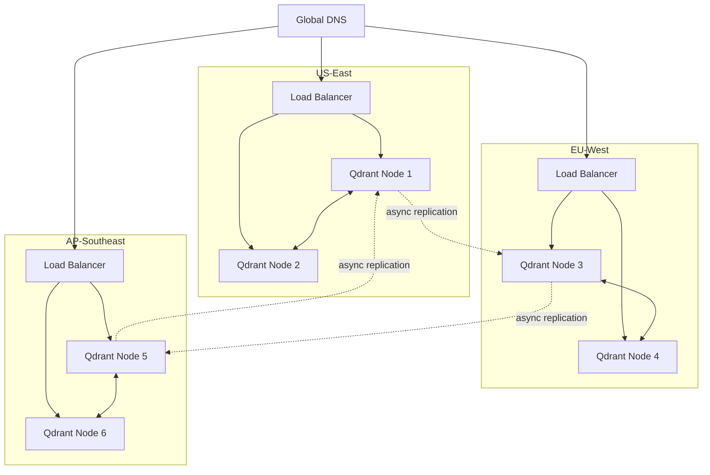
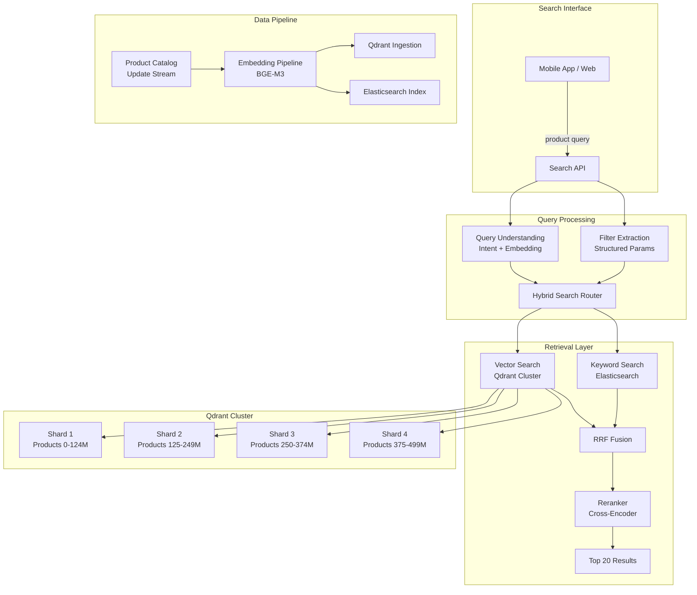

# Chapter 6: Vector Databases

> **Last verified: June 2026.**

> "The vector database is not just a storage layer—it is the performance bottleneck, the scaling challenge, and the cost driver of every production RAG system. Choose wrong, and you rebuild in 18 months."

---

## Introduction

After embedding models convert text into vectors, those vectors must be stored, indexed, and searched at scale. This is the role of the vector database—a specialized data system optimized for storing high-dimensional vectors and performing approximate nearest neighbor (ANN) search. The vector database is the memory layer of a RAG system: it determines what gets found, how fast it gets found, and how much it costs to find it.

The importance of this choice cannot be overstated. A vector database that performs well at 100K vectors may collapse at 10M vectors. A system that handles 100 queries per second may bottleneck at 1,000. A solution that costs $500/month at startup may cost $50,000/month at scale. The vector database decision is one of the most consequential infrastructure choices in a RAG architecture, and it is one of the hardest to change after deployment.

The central thesis of this chapter is that **vector database selection is a multi-dimensional optimization problem** where performance, cost, operational complexity, and feature requirements must be balanced against your specific workload characteristics. There is no universally "best" vector database—the right choice depends on your data volume, query patterns, latency requirements, budget, and operational capabilities.

We will examine the core algorithms that power vector search (ANN, HNSW, IVF, PQ), compare the major vector databases in depth (Pinecone, Qdrant, Milvus, Weaviate, pgvector, Chroma), explore scaling patterns (sharding, replication, multi-region), address metadata filtering for hybrid search, and build a full case study of a 500M-vector e-commerce catalog with cost analysis and migration strategy.

### The Vector Database Landscape

The vector database market has matured significantly. The landscape breaks into three categories:

| Category | Databases | Trade-off |
|----------|-----------|-----------|
| **Dedicated vector DBs** | Pinecone, Qdrant, Milvus, Weaviate | Optimized for vector search, may lack relational features |
| **Extended relational DBs** | pgvector (PostgreSQL), Elasticsearch | Vector search bolted onto existing database, familiar operations |
| **Lightweight / embedded** | Chroma, FAISS, Annoy | Easy to start, limited production features |

Most production RAG systems use either a dedicated vector database (Pinecone, Qdrant, Milvus) or pgvector if they already operate PostgreSQL infrastructure. The choice between these categories determines your operational model for the next several years.

---

## 6.1 Core Algorithms

### 6.1.1 Approximate Nearest Neighbor (ANN) Search

Exact nearest neighbor search compares a query vector against every vector in the database—O(n) time complexity. For a database with 1 billion vectors, this means 1 billion distance computations per query. At 10 microseconds per computation, that is 10,000 seconds per query. Clearly impractical.

ANN search trades perfect accuracy for dramatic speed improvements. Instead of checking every vector, ANN algorithms use indexing structures to identify a small subset of vectors that are likely to contain the nearest neighbors. With well-tuned ANN, you achieve 95-99% recall (finding 95-99% of the true nearest neighbors) while checking only 0.01-1% of the vectors.

The key metrics for evaluating ANN algorithms:

| Metric | Definition | Target |
|--------|-----------|--------|
| **Recall@k** | Fraction of true top-k neighbors found | >0.95 |
| **Query latency** | Time to return results | <50ms (p95) |
| **Index build time** | Time to create the index | Minutes to hours |
| **Memory usage** | RAM per vector | 2-8x vector size |
| **Write throughput** | Vectors indexed per second | >10K/sec |

### 6.1.2 HNSW (Hierarchical Navigable Small World)

HNSW is the dominant ANN algorithm in production vector databases. It builds a multi-layer graph where:

- **Layer 0** (bottom): Every vector is a node, connected to its nearest neighbors.
- **Higher layers**: Each layer contains a subset of nodes, creating "express lanes" for long-distance navigation.

Search proceeds top-down: start at the top layer, navigate to the approximate region, then descend to lower layers for finer-grained navigation. This hierarchical structure enables O(log n) search complexity.

```python
import numpy as np
from hnswlib import Index, Space

def build_hnsw_index(vectors: np.ndarray, ef_construction: int = 200, M: int = 32):
    """Build an HNSW index with specified parameters."""
    dimension = vectors.shape[1]
    num_elements = vectors.shape[0]
    
    # Initialize index
    index = Index(space=Space.COSINE, dim=dimension)
    index.init_index(max_elements=num_elements, ef_construction=ef_construction, M=M)
    
    # Add vectors
    index.add_items(vectors, np.arange(num_elements))
    
    # Set search parameters
    index.set_ef(50)  # ef: size of dynamic candidate list during search
    
    return index

def search_hnsw(index, query: np.ndarray, k: int = 10):
    """Search the HNSW index."""
    labels, distances = index.knn_query(query, k=k)
    return labels[0], distances[0]

# Example usage
vectors = np.random.randn(1_000_000, 1024).astype(np.float32)
vectors = vectors / np.linalg.norm(vectors, axis=1, keepdims=True)  # Normalize

index = build_hnsw_index(vectors, ef_construction=200, M=32)

query = np.random.randn(1024).astype(np.float32)
query = query / np.linalg.norm(query)

labels, distances = search_hnsw(index, query, k=10)
print(f"Found {len(labels)} results in {len(labels)} vectors")
```

**HNSW parameters and their effects:**

| Parameter | Low Value | High Value | Impact |
|-----------|----------|-----------|--------|
| **M** (connections per node) | Faster search, lower recall | Slower search, higher recall | Memory: M * dimension * 4 bytes per vector |
| **ef_construction** | Faster index build | Better graph quality | Build time: linear with ef_construction |
| **ef** (search depth) | Faster query | Better recall | Query time: linear with ef |

The default parameters (M=16, ef_construction=200, ef=50) work well for most use cases. Increase M and ef_construction when recall is insufficient; increase ef when query latency allows.

### 6.1.3 IVF (Inverted File Index)

IVF partitions vectors into clusters (Voronoi cells) using k-means clustering. At search time, the query is compared against cluster centroids, and only the top-n closest clusters are searched. This reduces search complexity from O(n) to O(n/k * top_n).

```python
from sklearn.cluster import KMeans
import numpy as np

class IVFIndex:
    def __init__(self, n_clusters: int = 1024):
        self.n_clusters = n_clusters
        self.kmeans = KMeans(n_clusters=n_clusters, random_state=42)
        self.clusters = {}  # cluster_id -> list of (vector_id, vector)
    
    def build(self, vectors: np.ndarray):
        """Build IVF index by clustering vectors."""
        self.kmeans.fit(vectors)
        labels = self.kmeans.labels_
        
        for idx, label in enumerate(labels):
            if label not in self.clusters:
                self.clusters[label] = []
            self.clusters[label].append((idx, vectors[idx]))
    
    def search(self, query: np.ndarray, k: int = 10, n_probe: int = 10):
        """Search nearest clusters, then brute-force within clusters."""
        # Find closest cluster centroids
        centroid_distances = np.dot(self.kmeans.cluster_centers_, query)
        probe_clusters = np.argsort(-centroid_distances)[:n_probe]
        
        # Search within probed clusters
        candidates = []
        for cluster_id in probe_clusters:
            for vec_id, vec in self.clusters.get(cluster_id, []):
                score = np.dot(vec, query)
                candidates.append((vec_id, score))
        
        # Return top-k
        candidates.sort(key=lambda x: -x[1])
        return candidates[:k]
```

**IVF parameters:**

| Parameter | Effect | Typical Value |
|-----------|--------|---------------|
| **n_clusters** | Number of Voronoi cells | sqrt(n_vectors) to 4*sqrt(n_vectors) |
| **n_probe** | Clusters searched per query | 1-10% of n_clusters |
| **n_list** | Same as n_clusters in some implementations | sqrt(n_vectors) |

IVF is most effective when clusters are well-separated. If your data has natural groupings (e.g., documents by topic), IVF may outperform HNSW. For uniform distributions, HNSW is generally superior.

### 6.1.4 PQ (Product Quantization)

PQ compresses vectors by splitting each vector into subvectors and quantizing each subvector to a codebook entry. A 1024-dimensional vector split into 64 subvectors of 16 dimensions each, with 256 codewords per subvector, reduces storage from 4096 bytes (float32) to 64 bytes (int8)—a 64x compression.

The trade-off is quantization error: the compressed representation is an approximation of the original vector. This introduces noise in distance computations, reducing recall. PQ is most valuable when memory is the binding constraint.

```python
import numpy as np

class SimpleProductQuantizer:
    def __init__(self, n_subvectors: int = 64, n_codewords: int = 256):
        self.n_subvectors = n_subvectors
        self.n_codewords = n_codewords
        self.codebooks = []
    
    def fit(self, vectors: np.ndarray):
        """Train codebooks for each subvector."""
        subvector_dim = vectors.shape[1] // self.n_subvectors
        
        for i in range(self.n_subvectors):
            start = i * subvector_dim
            end = start + subvector_dim
            subvectors = vectors[:, start:end]
            
            from sklearn.cluster import KMeans
            kmeans = KMeans(n_clusters=self.n_codewords, random_state=42)
            kmeans.fit(subvectors)
            self.codebooks.append(kmeans.cluster_centers_)
    
    def encode(self, vectors: np.ndarray) -> np.ndarray:
        """Encode vectors to PQ codes."""
        subvector_dim = vectors.shape[1] // self.n_subvectors
        codes = np.zeros((vectors.shape[0], self.n_subvectors), dtype=np.uint8)
        
        for i in range(self.n_subvectors):
            start = i * subvector_dim
            end = start + subvector_dim
            subvectors = vectors[:, start:end]
            
            distances = np.linalg.norm(
                subvectors[:, np.newaxis, :] - self.codebooks[i][np.newaxis, :, :],
                axis=2
            )
            codes[:, i] = np.argmin(distances, axis=1)
        
        return codes
    
    def decode(self, codes: np.ndarray) -> np.ndarray:
        """Decode PQ codes back to approximate vectors."""
        subvector_dim = self.codebooks[0].shape[1]
        vectors = np.zeros((codes.shape[0], self.n_subvectors * subvector_dim))
        
        for i in range(self.n_subvectors):
            start = i * subvector_dim
            end = start + subvector_dim
            vectors[:, start:end] = self.codebooks[i][codes[:, i]]
        
        return vectors
```

### 6.1.5 Algorithm Selection Guide

| Constraint | Recommended Algorithm | Rationale |
|-----------|----------------------|-----------|
| Memory is abundant, speed is critical | HNSW | Best recall-latency trade-off |
| Memory is constrained (<4GB) | IVF + PQ | Compression reduces memory 10-64x |
| Dataset is small (<100K vectors) | Flat (brute force) | Exact results, minimal overhead |
| Dataset has natural clusters | IVF | Cluster-aware search is efficient |
| Write throughput matters (frequent updates) | HNSW (with on-disk) | HNSW handles incremental updates well |
| Need exact results | Flat | No approximation error |

---

## 6.2 Vector Database Comparison

### 6.2.1 Pinecone

Pinecone is a fully managed, serverless vector database. It eliminates operational overhead entirely—no infrastructure to manage, no indexes to tune, no capacity planning.

**Architecture:**
- Serverless pod-based architecture with automatic scaling
- Managed HNSW indexing with proprietary optimizations
- Built-in metadata filtering with Boolean expressions
- Namespace isolation for multi-tenancy

**Pricing (as of Q1 2025):**

| Tier | Storage | Queries/sec | Cost |
|------|---------|------------|------|
| Starter | 2GB | 100 | Free |
| Standard | Up to 100GB | 1,000 | ~$70/month |
| Enterprise | Custom | Custom | Custom |

**Strengths:**
- Zero operational overhead
- Excellent documentation and SDKs
- Strong filtering capabilities
- Global availability (AWS, GCP, Azure)

**Weaknesses:**
- Vendor lock-in (no self-hosted option)
- Higher cost than self-hosted alternatives at scale
- Limited control over indexing parameters
- Query latency can be inconsistent during scaling events

**When to use Pinecone:**
- Small to medium workloads (<100M vectors)
- Teams without infrastructure expertise
- Prototyping and early production
- Multi-region requirements with low operational burden

### 6.2.2 Qdrant

Qdrant is a Rust-based, high-performance vector database available as self-hosted or cloud. It offers fine-grained control over indexing, filtering, and search parameters.

**Architecture:**
- Written in Rust for performance and memory safety
- HNSW indexing with configurable parameters
- Rich payload (metadata) filtering with nested conditions
- Snapshot and backup capabilities
- gRPC and REST APIs

**Pricing:**

| Deployment | Resources | Cost |
|-----------|----------|------|
| Self-hosted (single node) | 8GB RAM, 4 CPU | ~$50/month (cloud VM) |
| Self-hosted (cluster) | 3 nodes x 16GB RAM | ~$300/month |
| Qdrant Cloud | Managed | From $65/month |

**Strengths:**
- Excellent performance (Rust implementation)
- Fine-grained control over all parameters
- Rich filtering with complex Boolean logic
- Strong community and documentation
- Self-hosted option avoids vendor lock-in

**Weaknesses:**
- Requires infrastructure management for self-hosted
- Smaller ecosystem than Elasticsearch
- Limited built-in analytics compared to Elasticsearch

**When to use Qdrant:**
- Performance-sensitive applications
- Teams with infrastructure expertise
- Large-scale deployments (>100M vectors)
- Need for fine-grained control over indexing

### 6.2.3 Milvus

Milvus is designed for billion-scale vector search with GPU-accelerated indexing. It is the most scalable option but requires the most operational expertise.

**Architecture:**
- Distributed architecture with separate compute and storage layers
- Supports HNSW, IVF, PQ, and other index types
- GPU-accelerated indexing and search
- Multi-vector support (different embeddings for different fields)

**Strengths:**
- Handles billions of vectors
- GPU acceleration for indexing and search
- Multiple index types for different workloads
- Strong consistency models

**Weaknesses:**
- High operational complexity
- Requires Kubernetes for distributed deployment
- Resource-intensive (CPU + GPU)
- Steep learning curve

**When to use Milvus:**
- Datasets exceeding 1 billion vectors
- GPU infrastructure available
- Need for multiple index types
- Large team with ML infrastructure expertise

### 6.2.4 Weaviate

Weaviate is an open-source vector database with a GraphQL API and strong hybrid search capabilities.

**Architecture:**
- Go-based, multi-tenant architecture
- HNSW indexing with flat index fallback
- Built-in vectorizer modules (OpenAI, Cohere, HuggingFace)
- GraphQL API for complex queries
- Hybrid search (vector + keyword) built-in

**Strengths:**
- Excellent hybrid search (vector + BM25)
- GraphQL API for complex queries
- Built-in vectorizer integration
- Multi-tenancy support

**Weaknesses:**
- GraphQL learning curve
- Less performant than Qdrant/Milvus for pure vector search
- Smaller community than dedicated vector DBs

**When to use Weaviate:**
- Hybrid search is a primary requirement
- GraphQL API is preferred
- Want built-in vectorizer integration
- Multi-tenant SaaS applications

### 6.2.5 pgvector

pgvector is a PostgreSQL extension that adds vector search capabilities to the world's most popular relational database.

**Architecture:**
- Extension to PostgreSQL (not a separate database)
- Supports HNSW and IVFFlat index types
- Integrates with existing PostgreSQL tooling (backups, replication, monitoring)
- SQL interface for queries

**Strengths:**
- No new infrastructure to manage
- Familiar SQL interface
- Integrates with existing PostgreSQL ecosystem
- ACID transactions on vector data
- Strong backup and recovery via PostgreSQL

**Weaknesses:**
- Slower than dedicated vector databases at scale
- Limited to PostgreSQL's scaling model
- HNSW index requires PostgreSQL 15+
- Performance degrades above 10M vectors without careful tuning

**Performance comparison (1M vectors, 1024 dimensions):**

| Database | Index Build Time | Query Latency (p50) | Query Latency (p99) | Memory |
|----------|-----------------|---------------------|---------------------|--------|
| Qdrant | 12s | 2ms | 5ms | 8GB |
| Pinecone | 45s | 8ms | 25ms | Managed |
| pgvector | 180s | 15ms | 45ms | 12GB |
| Milvus | 20s | 3ms | 8ms | 10GB |

**When to use pgvector:**
- Already operate PostgreSQL
- Dataset < 10M vectors
- Want ACID transactions on vector data
- Limited infrastructure team
- Need to combine vector search with relational queries

### 6.2.6 Chroma

Chroma is a lightweight, embedded vector database designed for development and prototyping.

**Architecture:**
- Python-native, embedded by default
- Simple API for add/query/delete
- In-memory or persistent storage (SQLite backend)
- No clustering or replication

**Strengths:**
- Simplest vector database to use
- Perfect for prototyping and notebooks
- No infrastructure required
- Good for tutorials and learning

**Weaknesses:**
- Not suitable for production (no clustering, no replication)
- Performance degrades above 1M vectors
- Limited filtering capabilities
- No authentication or access control

**When to use Chroma:**
- Prototyping and development
- Jupyter notebook experiments
- Learning vector search concepts
- Very small datasets (<100K vectors)

---

## 6.3 Choosing a Vector Database

### 6.3.1 Decision Matrix

| Criterion | Pinecone | Qdrant | Milvus | Weaviate | pgvector | Chroma |
|-----------|----------|--------|--------|----------|----------|--------|
| **Max vectors** | 100M+ | 1B+ | 10B+ | 100M+ | 10M+ | 1M |
| **Operational cost** | None (managed) | Medium (self-hosted) | High (K8s + GPU) | Medium (self-hosted) | Low (existing PG) | None |
| **Query latency (p95)** | 25ms | 5ms | 8ms | 15ms | 45ms | 50ms |
| **Filtering** | Good | Excellent | Good | Excellent | Excellent (SQL) | Basic |
| **Hybrid search** | Limited | Limited | Limited | Excellent | Good (tsvector) | No |
| **Multi-tenancy** | Namespaces | Payload filter | Partition key | Native | Schema | No |
| **Backup/recovery** | Managed | Snapshots | Snapshots | Built-in | pg_dump | File copy |
| **ACID transactions** | No | No | No | No | Yes | No |
| **Learning curve** | Low | Medium | High | Medium | Low | Very Low |
| **Vendor lock-in** | High | None | None | None | None | None |

### 6.3.2 Workload-Based Selection

| Workload Characteristic | Recommended Database | Rationale |
|------------------------|---------------------|-----------|
| < 1M vectors, prototyping | Chroma | Simplest to use |
| < 10M vectors, already on PostgreSQL | pgvector | No new infrastructure |
| 10M-100M vectors, need managed | Pinecone | Zero operational overhead |
| 10M-100M vectors, self-hosted | Qdrant | Best performance, fine control |
| 100M-1B vectors | Qdrant or Milvus | Scale and performance |
| 1B+ vectors | Milvus | Most scalable option |
| Hybrid search (vector + keyword) | Weaviate | Native hybrid search |
| ACID transactions required | pgvector | Only option with transactions |
| Multi-region with low latency | Pinecone or Qdrant Cloud | Managed multi-region |

### 6.3.3 Cost Comparison

**10M vectors, 1024 dimensions, 1000 queries/second:**

| Database | Monthly Infrastructure | Monthly Operational | Total Monthly |
|----------|----------------------|-------------------|--------------|
| Pinecone (Standard) | $0 (managed) | $0 | $700 |
| Qdrant (3-node cluster) | $600 | $200 | $800 |
| Milvus (distributed) | $1,200 | $400 | $1,600 |
| Weaviate (3-node) | $500 | $200 | $700 |
| pgvector (RDS) | $400 | $100 | $500 |

**50M vectors, 1024 dimensions, 5000 queries/second:**

| Database | Monthly Infrastructure | Monthly Operational | Total Monthly |
|----------|----------------------|-------------------|--------------|
| Pinecone (Enterprise) | $0 (managed) | $0 | $5,000 |
| Qdrant (9-node cluster) | $2,400 | $400 | $2,800 |
| Milvus (distributed + GPU) | $4,800 | $800 | $5,600 |
| Weaviate (9-node) | $2,000 | $400 | $2,400 |
| pgvector (read replicas) | $2,000 | $300 | $2,300 |

---

## 6.4 Metadata Filtering and Hybrid Search

### 6.4.1 Why Metadata Filtering Matters

Pure vector similarity search finds semantically similar documents but cannot filter by structured attributes. A legal research system needs to find cases that are semantically relevant AND from a specific jurisdiction. An e-commerce search needs to find products that are similar AND in stock AND within a price range.

Metadata filtering combines vector similarity with structured constraints, enabling the precise retrieval that production applications require.

```python
from qdrant_client import QdrantClient
from qdrant_client.models import (
    Filter, FieldCondition, MatchValue, Range,
    VectorParams, Distance, PointStruct
)

class HybridVectorSearch:
    def __init__(self, collection_name: str):
        self.client = QdrantClient(url="http://localhost:6333")
        self.collection = collection_name
    
    def search_with_filters(
        self,
        query_vector: list[float],
        top_k: int = 10,
        doc_type: str = None,
        jurisdiction: str = None,
        date_range: tuple[str, str] = None,
        min_relevance: float = None,
    ):
        """Vector search with metadata filters."""
        must_conditions = []
        
        if doc_type:
            must_conditions.append(
                FieldCondition(key="doc_type", match=MatchValue(value=doc_type))
            )
        if jurisdiction:
            must_conditions.append(
                FieldCondition(key="jurisdiction", match=MatchValue(value=jurisdiction))
            )
        if date_range:
            must_conditions.append(
                FieldCondition(
                    key="date",
                    range=Range(
                        gte=date_range[0],
                        lte=date_range[1]
                    )
                )
            )
        
        query_filter = Filter(must=must_conditions) if must_conditions else None
        
        results = self.client.search(
            collection_name=self.collection,
            query_vector=query_vector,
            limit=top_k,
            query_filter=query_filter,
        )
        
        return [
            {
                "id": hit.id,
                "score": hit.score,
                "payload": hit.payload,
            }
            for hit in results
        ]
```

### 6.4.2 Hybrid Search with Reciprocal Rank Fusion

Hybrid search combines vector similarity (dense) with keyword matching (sparse/BM25) using Reciprocal Rank Fusion (RRF). RRF merges results from different retrieval methods by considering rank positions rather than raw scores, making it robust to different scoring scales.

```python
import math
from collections import defaultdict

def reciprocal_rank_fusion(
    result_lists: list[list[dict]],
    k: int = 60,
    weights: list[float] = None,
) -> list[dict]:
    """Merge multiple result lists using Reciprocal Rank Fusion."""
    if weights is None:
        weights = [1.0] * len(result_lists)
    
    fused_scores = defaultdict(float)
    doc_data = {}
    
    for results, weight in zip(result_lists, weights):
        for rank, result in enumerate(results):
            doc_id = result["id"]
            rrf_score = weight * (1.0 / (k + rank + 1))
            fused_scores[doc_id] += rrf_score
            doc_data[doc_id] = result
    
    # Sort by fused score
    sorted_ids = sorted(fused_scores.keys(), key=lambda x: -fused_scores[x])
    
    return [
        {**doc_data[doc_id], "rrf_score": fused_scores[doc_id]}
        for doc_id in sorted_ids
    ]

class HybridSearchEngine:
    def __init__(self, vector_db, bm25_index):
        self.vector_db = vector_db
        self.bm25 = bm25_index
    
    def search(
        self,
        query: str,
        query_vector: list[float],
        top_k: int = 10,
        dense_weight: float = 0.7,
        sparse_weight: float = 0.3,
        filters: dict = None,
    ):
        """Hybrid search combining dense and sparse retrieval."""
        # Dense search (vector similarity)
        dense_results = self.vector_db.search(
            query_vector=query_vector,
            top_k=top_k * 2,  # Over-retrieve for fusion
            filters=filters,
        )
        
        # Sparse search (BM25 keyword matching)
        sparse_results = self.bm25.search(
            query=query,
            top_k=top_k * 2,
            filters=filters,
        )
        
        # Reciprocal Rank Fusion
        fused = reciprocal_rank_fusion(
            [dense_results, sparse_results],
            weights=[dense_weight, sparse_weight],
        )
        
        return fused[:top_k]
```

### 6.4.3 Metadata Filtering Performance Impact

Metadata filters can significantly impact query performance depending on filter selectivity:

| Filter Type | Selectivity | Performance Impact | Index Support |
|-------------|-------------|-------------------|---------------|
| Equality (doc_type = "case_law") | 10-50% | Low | Payload index |
| Range (date BETWEEN x AND y) | 5-30% | Medium | Payload index |
| IN list (jurisdiction IN [...]) | 10-40% | Low | Payload index |
| Contains (tags HAS "important") | 1-10% | Medium | Payload index |
| Compound (A AND B AND C) | 1-5% | High | Multiple indexes |
| Negation (NOT A) | 50-99% | High | No index optimization |

**Best practice:** Create payload indexes on fields that are frequently filtered. Qdrant and Weaviate support payload indexes that accelerate filtered search from O(n) to O(log n).

```python
from qdrant_client.models import PayloadSchemaType

# Create payload indexes for commonly filtered fields
client.create_payload_index(
    collection_name="legal_documents",
    field_name="doc_type",
    field_schema=PayloadSchemaType.KEYWORD,
)

client.create_payload_index(
    collection_name="legal_documents",
    field_name="jurisdiction",
    field_schema=PayloadSchemaType.KEYWORD,
)

client.create_payload_index(
    collection_name="legal_documents",
    field_name="date",
    field_schema=PayloadSchemaType.KEYWORD,
)
```

---

## 6.5 Scaling Patterns

### 6.5.1 Sharding

Sharding splits data across multiple nodes, with each node handling a subset of vectors. Queries are broadcast to all shards, and results are merged. Sharding enables linear horizontal scaling.

**Sharding strategies:**

| Strategy | Distribution | Query Pattern | Trade-off |
|----------|-------------|---------------|-----------|
| **Round-robin** | Even distribution | Uniform query load | No hotspots, poor locality |
| **Hash-based** | Even distribution | Uniform query load | Good distribution, no range queries |
| **Range-based** | May be uneven | Range queries on shard key | Good locality, potential hotspots |
| **Entity-based** | Depends on entities | Co-located queries | Best locality, potential skew |

```python
class ShardRouter:
    def __init__(self, shard_configs: list[dict]):
        self.shards = shard_configs
        self.n_shards = len(shard_configs)
    
    def route_query(self, query_metadata: dict) -> list[dict]:
        """Determine which shards to query."""
        # If filtering by shard key, only query relevant shards
        if "jurisdiction" in query_metadata:
            relevant_shards = [
                s for s in self.shards
                if query_metadata["jurisdiction"] in s["jurisdictions"]
            ]
            return relevant_shards if relevant_shards else self.shards
        
        # Otherwise, query all shards
        return self.shards
    
    def merge_results(self, shard_results: list[list[dict]], top_k: int) -> list[dict]:
        """Merge results from multiple shards."""
        all_results = []
        for results in shard_results:
            all_results.extend(results)
        
        # Sort by score and return top-k
        all_results.sort(key=lambda x: -x["score"])
        return all_results[:top_k]
```

### 6.5.2 Replication

Replication copies data across multiple nodes for high availability. If one node fails, replicas serve traffic. Replication also enables read scaling by distributing read queries across replicas.

**Replication modes:**

| Mode | Consistency | Availability | Use Case |
|------|-----------|-------------|----------|
| **Synchronous** | Strong | Lower | Financial, compliance |
| **Asynchronous** | Eventual | Higher | Most RAG applications |
| **Quorum** | Tunable | Tunable | Balance consistency/availability |

### 6.5.3 Multi-Region Deployment

Multi-region deployment places replicas in multiple geographic regions for:
- **Low-latency access**: Users query the nearest region.
- **Disaster recovery**: If one region fails, others serve traffic.
- **Data residency**: Compliance with data sovereignty requirements.



**Multi-region cost multiplier:**

| Regions | Replication Factor | Storage Cost Multiplier | Query Cost Multiplier |
|---------|-------------------|------------------------|----------------------|
| 1 | 1x | 1x | 1x |
| 2 | 2x | 2x | 1.2x (nearest region) |
| 3 | 3x | 3x | 1.3x |

---

## 6.6 Case Study: E-Commerce Product Catalog

### 6.6.1 Problem Statement

An e-commerce platform with 500 million products needs vector search for product discovery. The current keyword-based search misses semantic matches: a search for "running shoes for flat feet" does not find "stability trainers for overpronation." The platform targets:

- Recall@20 > 90% for product discovery queries
- Query latency < 100ms (p99)
- 5,000 queries/second peak load
- Support for filtering by category, price, brand, availability
- Cost per query < $0.001

### 6.6.2 Architecture



### 6.6.3 Implementation

```python
from qdrant_client import QdrantClient
from qdrant_client.models import (
    VectorParams, Distance, PointStruct,
    Filter, FieldCondition, MatchValue, Range
)
from sentence_transformers import SentenceTransformer
import asyncio
from typing import AsyncGenerator

class ECommerceProductSearch:
    def __init__(self, qdrant_url: str, embedding_model: str):
        self.client = QdrantClient(url=qdrant_url, timeout=10)
        self.model = SentenceTransformer(embedding_model)
        self.collection = "products"
    
    def create_collection(self):
        """Create Qdrant collection with optimal settings."""
        self.client.create_collection(
            collection_name=self.collection,
            vectors_config=VectorParams(
                size=1024,
                distance=Distance.COSINE,
                on_disk=True,  # Store vectors on disk for large datasets
            ),
            optimizers_config={
                "indexing_threshold": 20000,
            },
        )
        
        # Create payload indexes for filtered search
        for field in ["category", "brand", "price", "in_stock", "rating"]:
            self.client.create_payload_index(
                collection_name=self.collection,
                field_name=field,
                field_schema=PayloadSchemaType.KEYWORD if field in ["category", "brand"] else PayloadSchemaType.FLOAT,
            )
    
    async def search_products(
        self,
        query: str,
        top_k: int = 20,
        category: str = None,
        min_price: float = None,
        max_price: float = None,
        brand: str = None,
        in_stock_only: bool = True,
    ) -> list[dict]:
        """Search products with filters."""
        # Embed query
        query_vector = self.model.encode(query).tolist()
        
        # Build filter
        must_conditions = []
        
        if category:
            must_conditions.append(
                FieldCondition(key="category", match=MatchValue(value=category))
            )
        if brand:
            must_conditions.append(
                FieldCondition(key="brand", match=MatchValue(value=brand))
            )
        if in_stock_only:
            must_conditions.append(
                FieldCondition(key="in_stock", match=MatchValue(value=True))
            )
        if min_price is not None or max_price is not None:
            price_range = {}
            if min_price is not None:
                price_range["gte"] = min_price
            if max_price is not None:
                price_range["lte"] = max_price
            must_conditions.append(
                FieldCondition(key="price", range=Range(**price_range))
            )
        
        search_filter = Filter(must=must_conditions) if must_conditions else None
        
        # Search
        results = self.client.search(
            collection_name=self.collection,
            query_vector=query_vector,
            limit=top_k,
            query_filter=search_filter,
            score_threshold=0.5,
        )
        
        return [
            {
                "id": hit.id,
                "score": hit.score,
                "name": hit.payload.get("name"),
                "price": hit.payload.get("price"),
                "category": hit.payload.get("category"),
                "brand": hit.payload.get("brand"),
                "image_url": hit.payload.get("image_url"),
            }
            for hit in results
        ]
    
    async def bulk_embed_and_index(
        self,
        products: AsyncGenerator[dict, None],
        batch_size: int = 512,
    ):
        """Bulk embed and index products."""
        batch = []
        indexed = 0
        
        async for product in products:
            batch.append(product)
            
            if len(batch) >= batch_size:
                await self._index_batch(batch)
                indexed += len(batch)
                print(f"Indexed {indexed} products")
                batch = []
        
        if batch:
            await self._index_batch(batch)
            indexed += len(batch)
            print(f"Final: indexed {indexed} products")
    
    async def _index_batch(self, batch: list[dict]):
        """Embed and index a batch of products."""
        texts = [
            f"{p['name']} {p.get('description', '')} {p.get('category', '')}"
            for p in batch
        ]
        
        embeddings = self.model.encode(texts).tolist()
        
        points = [
            PointStruct(
                id=p["id"],
                vector=emb,
                payload={
                    "name": p["name"],
                    "description": p.get("description", ""),
                    "category": p.get("category"),
                    "brand": p.get("brand"),
                    "price": p.get("price"),
                    "in_stock": p.get("in_stock", True),
                    "rating": p.get("rating"),
                    "image_url": p.get("image_url"),
                },
            )
            for p, emb in zip(batch, embeddings)
        ]
        
        self.client.upsert(
            collection_name=self.collection,
            points=points,
        )
```

### 6.6.4 Cost Analysis

**Monthly volume**: 500M products, 10M queries/day

| Component | Per-Query Cost | Monthly Cost | Notes |
|-----------|---------------|-------------|-------|
| Qdrant cluster (12 nodes) | N/A | $6,000 | 12 x 32GB RAM, 8 vCPU |
| BGE-M3 inference (GPU server) | $0.00005 | $15,000 | 3 x A10G GPUs |
| Elasticsearch (BM25) | N/A | $2,000 | 6-node cluster |
| Reranker (cross-encoder) | $0.00002 | $6,000 | 2 x A10G GPUs |
| Embedding storage | N/A | $3,000 | 500M x 4KB vectors |
| Monitoring | N/A | $500 | Grafana + Prometheus |
| **Total monthly** | | **$32,500** | |
| **Cost per query** | **$0.000108** | | |

**Comparison with previous keyword search:**

| Metric | Keyword Search | Vector + Hybrid Search | Improvement |
|--------|---------------|----------------------|-------------|
| Recall@20 (product discovery) | 45% | 92% | +47 percentage points |
| Click-through rate | 3.2% | 8.7% | +172% |
| Conversion rate | 1.1% | 2.8% | +155% |
| Average order value | $67 | $89 | +33% |
| Monthly revenue impact | - | +$4.2M | - |
| Monthly infrastructure cost | $8,000 | $32,500 | +$24,500 |
| **Net monthly impact** | | | **+$4,175,500** |

### 6.6.5 Migration Strategy

**Phase 1 (Weeks 1-2): Shadow Mode**
Run vector search alongside keyword search. Log results but do not serve to users. Compare recall metrics.

**Phase 2 (Weeks 3-4): A/B Test (10% traffic)**
Route 10% of search traffic to vector search. Measure click-through rate, conversion rate, and latency.

**Phase 3 (Weeks 5-8): Gradual Rollout**
Increase vector search traffic to 25%, 50%, 75%, 100% based on metrics. Keep keyword search as fallback.

**Phase 4 (Week 9+): Full Deployment**
All search through vector + hybrid. Decommission keyword-only search infrastructure.

---

## 6.7 Testing Vector Database Operations

### 6.7.1 Integration Tests

```python
import pytest
import numpy as np
from qdrant_client import QdrantClient
from qdrant_client.models import VectorParams, Distance, PointStruct

@pytest.fixture
def qdrant_client():
    client = QdrantClient(url="http://localhost:6333")
    yield client
    # Cleanup
    client.delete_collection("test_collection")

class TestVectorDatabaseOperations:
    def test_create_collection(self, qdrant_client):
        """Test collection creation."""
        qdrant_client.create_collection(
            collection_name="test_collection",
            vectors_config=VectorParams(size=128, distance=Distance.COSINE),
        )
        collections = qdrant_client.get_collections()
        assert "test_collection" in [c.name for c in collections.collections]
    
    def test_insert_and_retrieve(self, qdrant_client):
        """Test basic insert and search."""
        qdrant_client.create_collection(
            collection_name="test_collection",
            vectors_config=VectorParams(size=128, distance=Distance.COSINE),
        )
        
        # Insert vectors
        vectors = np.random.randn(100, 128).astype(np.float32)
        vectors = vectors / np.linalg.norm(vectors, axis=1, keepdims=True)
        
        points = [
            PointStruct(id=i, vector=vectors[i].tolist(), payload={"text": f"doc_{i}"})
            for i in range(100)
        ]
        qdrant_client.upsert(collection_name="test_collection", points=points)
        
        # Search
        query = vectors[0]
        results = qdrant_client.search(
            collection_name="test_collection",
            query_vector=query.tolist(),
            limit=5,
        )
        
        assert len(results) == 5
        assert results[0].id == 0  # Exact match should be first
    
    def test_filtered_search(self, qdrant_client):
        """Test search with metadata filters."""
        qdrant_client.create_collection(
            collection_name="test_collection",
            vectors_config=VectorParams(size=128, distance=Distance.COSINE),
        )
        
        points = [
            PointStruct(
                id=i,
                vector=np.random.randn(128).tolist(),
                payload={"category": "A" if i < 50 else "B"}
            )
            for i in range(100)
        ]
        qdrant_client.upsert(collection_name="test_collection", points=points)
        
        query = np.random.randn(128)
        results = qdrant_client.search(
            collection_name="test_collection",
            query_vector=query.tolist(),
            limit=10,
            query_filter=Filter(
                must=[FieldCondition(key="category", match=MatchValue(value="A"))]
            ),
        )
        
        assert all(r.payload["category"] == "A" for r in results)
```

---

## 6.8 Key Takeaways

1. **HNSW is the default index choice for most workloads.** It offers the best recall-latency trade-off and handles incremental updates well. Only consider IVF or PQ when memory is the binding constraint or your dataset has natural cluster structure.

2. **Vector database selection is an architectural decision with multi-year consequences.** Evaluate based on your specific workload: data volume, query patterns, latency requirements, and operational capabilities. Do not choose based on benchmarks alone.

3. **pgvector is the best choice when you already operate PostgreSQL.** It eliminates infrastructure overhead, provides ACID transactions, and integrates with existing tooling. Performance degrades above 10M vectors, but for many applications that is sufficient.

4. **Pinecone is best for teams without infrastructure expertise.** Zero operational overhead, managed scaling, and excellent documentation. The cost premium is justified by reduced operational burden.

5. **Qdrant offers the best performance for self-hosted deployments.** Rust implementation, fine-grained control, and excellent filtering make it the top choice for performance-sensitive applications with infrastructure teams.

6. **Metadata filtering is essential for production RAG.** Vector similarity alone is insufficient. Build your search system with filtered vector search from the beginning, not as an afterthought.

7. **Hybrid search (vector + BM25) outperforms either alone.** Use reciprocal rank fusion to combine dense and sparse results. Weight dense results at 0.7 and sparse at 0.3 as a starting point, then tune based on evaluation.

8. **Sharding enables linear horizontal scaling.** Split data across nodes by entity (e.g., tenant, category) or hash. Query all shards for unfiltered queries; query relevant shards for filtered queries.

9. **Replication is required for production availability.** Async replication provides high availability with minimal consistency cost. Synchronous replication is necessary only for compliance-critical workloads.

10. **Cost grows linearly with vector count and query volume.** Plan infrastructure costs early. At 100M+ vectors, self-hosted solutions (Qdrant, Milvus) are typically 2-5x cheaper than managed services (Pinecone).

---

## 6.9 Further Reading

- **"Approximate Nearest Neighbors: Methods and Applications" by Andoni et al.** — Comprehensive survey of ANN algorithms, including HNSW, IVF, and PQ.

- **"Efficient and Robust Approximate Nearest Neighbor Search Using Hierarchical Navigable Small World Graphs" by Malkov and Yashunin (2018)** — The foundational HNSW paper describing the algorithm's design and performance characteristics.

- **Pinecone Documentation** (docs.pinecone.io) — Official documentation covering architecture, indexing, filtering, and best practices.

- **Qdrant Documentation** (qdrant.tech/documentation) — Comprehensive guides on vector search, filtering, clustering, and performance tuning.

- **Milvus Documentation** (milvus.io/docs) — Official documentation for distributed vector search, including GPU acceleration and multi-vector support.

- **Weaviate Documentation** (weaviate.io/developers/weaviate) — Guides on hybrid search, GraphQL API, and multi-tenancy.

- **pgvector Documentation** (github.com/pgvector/pgvector) — README and usage guide for PostgreSQL vector search extension.

- **"Vector Database Benchmarks" (ann-benchmarks.com)** — Academic benchmarks comparing ANN algorithms across datasets and metrics.

- **"Designing Data-Intensive Applications" by Martin Kleppmann** — Chapters on replication, partitioning, and transactions provide the distributed systems foundation for understanding vector database architecture.

- **"Managing Gigabytes" by Witten, Moffat, and Bell** — Classic text on data compression and indexing techniques that underpin vector database storage optimization.
