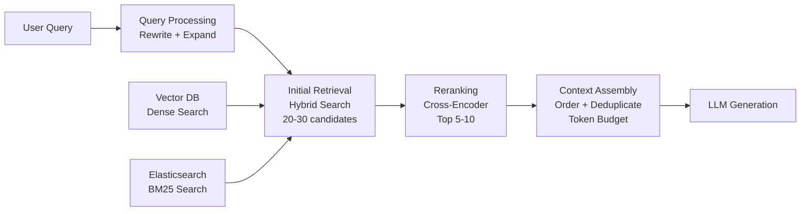
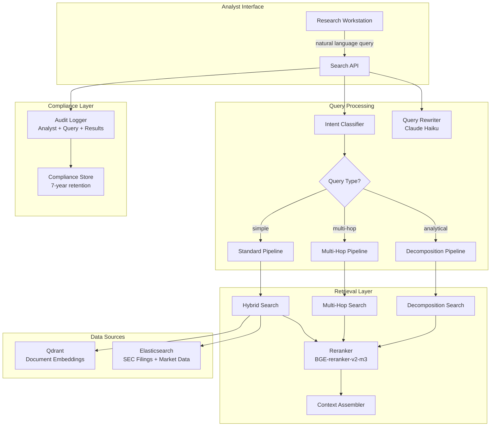

# Chapter 7: Retrieval Engineering

> **Last verified: June 2026.**

> "Retrieval is the most underrated component of RAG. Everyone focuses on the generation—the LLM response. But if the retrieval fails, the generation is doomed. Garbage in, garbage out."

---

## Introduction

Retrieval engineering is the discipline of finding the right information for a given query. It encompasses the strategies, algorithms, and engineering patterns that determine what documents are retrieved from a vector database and presented to the LLM for answer generation. Retrieval is not a single operation—it is a pipeline of complementary techniques that progressively refine the set of candidate documents from millions down to the most relevant handful.

The importance of retrieval quality cannot be overstated. Studies consistently show that retrieval quality is the primary determinant of RAG answer quality. When the correct documents are in the context, even a mediocre LLM produces good answers. When the correct documents are missing, even GPT-4 produces hallucinated or irrelevant responses. The RAG chain is only as strong as its weakest link, and that weakest link is almost always retrieval.

The central thesis of this chapter is that **production retrieval requires a multi-strategy approach** where no single technique is sufficient. Dense retrieval captures semantic similarity. Sparse retrieval captures exact term matching. Hybrid retrieval combines both. Query processing transforms user queries into forms that better match document vocabulary. Advanced techniques like multi-hop retrieval, iterative retrieval, and parent-child chunking address the specific failure modes that simple approaches miss.

We will examine each retrieval strategy in depth, build a production retrieval pipeline with hybrid search and reranking, explore query processing techniques (rewriting, expansion, decomposition, HyDE), address multi-hop and iterative retrieval for complex queries, and construct a full case study of a financial research system with cost analysis and compliance requirements.

### The Retrieval Quality Spectrum

Retrieval quality exists on a spectrum from naive to production-grade:

| Level | Strategy | Recall@10 | Latency | Complexity |
|-------|----------|----------|---------|-----------|
| **Basic** | Single-vector search | 50-65% | 5-10ms | Low |
| **Improved** | Hybrid search (dense + sparse) | 65-80% | 20-50ms | Medium |
| **Production** | Hybrid + reranking | 80-90% | 100-300ms | Medium |
| **Advanced** | Query processing + hybrid + reranking | 85-95% | 200-500ms | High |
| **State-of-the-art** | Multi-hop + iterative + hybrid + reranking | 90-98% | 500ms-2s | Very High |

Most production RAG systems operate at Level 3 or 4. The patterns in this chapter show you how to build and operate at each level.

---

## 7.1 Retrieval Strategies

### 7.1.1 Dense Retrieval

Dense retrieval uses embedding vectors to find semantically similar documents. The query is embedded using the same model used to embed documents, and the top-k most similar vectors are returned.

**How it works:**
1. Embed the query using the embedding model.
2. Compute cosine similarity (or dot product) between the query vector and all document vectors.
3. Return the top-k documents by similarity score.

**Strengths:**
- Captures semantic meaning: "vehicle" matches "car"
- Handles paraphrases and synonyms naturally
- Works across languages with multilingual models

**Weaknesses:**
- Misses exact term matches when embeddings are imprecise
- Struggles with rare proper nouns, codes, or technical identifiers
- Quality depends heavily on the embedding model

```python
from sentence_transformers import SentenceTransformer
import numpy as np

class DenseRetriever:
    def __init__(self, model_name: str = "BAAI/bge-m3"):
        self.model = SentenceTransformer(model_name)
        self.document_embeddings = None
        self.document_ids = None
    
    def index(self, documents: list[dict]):
        """Embed and index documents."""
        texts = [doc["text"] for doc in documents]
        self.document_embeddings = self.model.encode(texts, normalize_embeddings=True)
        self.document_ids = [doc["id"] for doc in documents]
    
    def search(self, query: str, top_k: int = 20) -> list[dict]:
        """Search for relevant documents."""
        query_embedding = self.model.encode([query], normalize_embeddings=True)
        
        # Cosine similarity (dot product for normalized vectors)
        scores = np.dot(self.document_embeddings, query_embedding.T).flatten()
        
        # Get top-k indices
        top_indices = np.argsort(-scores)[:top_k]
        
        return [
            {
                "id": self.document_ids[i],
                "score": float(scores[i]),
                "text": self.documents[i]["text"],
            }
            for i in top_indices
        ]
```

### 7.1.2 Sparse Retrieval (BM25)

BM25 (Best Matching 25) is a keyword-based retrieval algorithm that has been the standard in information retrieval for over two decades. It scores documents based on term frequency (TF) and inverse document frequency (IDF), with a length normalization component.

**How it works:**
1. Tokenize the query and documents.
2. For each query term, compute its IDF (rare terms score higher).
3. For each document, sum the TF-IDF scores for matching query terms.
4. Apply length normalization (shorter documents get a boost).

**Strengths:**
- Excellent at exact term matching
- Fast and interpretable
- No model to download or GPU required
- Handles technical terms, codes, and proper nouns well

**Weaknesses:**
- No semantic understanding: "car" does not match "vehicle"
- Requires exact term overlap
- Struggles with paraphrases and synonyms

```python
from rank_bm25 import BM25Okapi
import jieba  # or any tokenizer

class BM25Retriever:
    def __init__(self, k1: float = 1.2, b: float = 0.75):
        self.k1 = k1
        self.b = b
        self.bm25 = None
        self.document_ids = None
    
    def tokenize(self, text: str) -> list[str]:
        """Tokenize text into terms."""
        # Simple whitespace + lowercase tokenization
        # For production, consider domain-specific tokenization
        return text.lower().split()
    
    def index(self, documents: list[dict]):
        """Build BM25 index."""
        tokenized_docs = [self.tokenize(doc["text"]) for doc in documents]
        self.bm25 = BM25Okapi(tokenized_docs, k1=self.k1, b=self.b)
        self.document_ids = [doc["id"] for doc in documents]
    
    def search(self, query: str, top_k: int = 20) -> list[dict]:
        """Search using BM25."""
        tokenized_query = self.tokenize(query)
        scores = self.bm25.get_scores(tokenized_query)
        
        top_indices = np.argsort(-scores)[:top_k]
        
        return [
            {
                "id": self.document_ids[i],
                "score": float(scores[i]),
            }
            for i in top_indices
        ]
```

### 7.1.3 Hybrid Retrieval

Hybrid retrieval combines dense and sparse search using Reciprocal Rank Fusion (RRF) or weighted score combination. The key insight is that dense and sparse retrieval have complementary strengths: dense catches semantic matches, sparse catches exact term matches.

**Reciprocal Rank Fusion (RRF):**

RRF merges result lists by considering rank positions rather than raw scores. This makes it robust to different scoring scales between dense and sparse methods.

```python
def reciprocal_rank_fusion(
    result_lists: list[list[dict]],
    k: int = 60,
    weights: list[float] = None,
) -> list[dict]:
    """Merge result lists using RRF."""
    if weights is None:
        weights = [1.0] * len(result_lists)
    
    fused_scores = {}
    doc_data = {}
    
    for results, weight in zip(result_lists, weights):
        for rank, result in enumerate(results):
            doc_id = result["id"]
            rrf_score = weight * (1.0 / (k + rank + 1))
            fused_scores[doc_id] = fused_scores.get(doc_id, 0) + rrf_score
            doc_data[doc_id] = result
    
    sorted_ids = sorted(fused_scores.keys(), key=lambda x: -fused_scores[x])
    return [{**doc_data[doc_id], "rrf_score": fused_scores[doc_id]} for doc_id in sorted_ids]

class HybridRetriever:
    def __init__(self, dense_retriever, bm25_retriever, dense_weight=0.7, sparse_weight=0.3):
        self.dense = dense_retriever
        self.bm25 = bm25_retriever
        self.dense_weight = dense_weight
        self.sparse_weight = sparse_weight
    
    def search(self, query: str, top_k: int = 20) -> list[dict]:
        """Hybrid search with RRF fusion."""
        # Over-retrieve for fusion
        dense_results = self.dense.search(query, top_k=top_k * 2)
        sparse_results = self.bm25.search(query, top_k=top_k * 2)
        
        # Fuse results
        fused = reciprocal_rank_fusion(
            [dense_results, sparse_results],
            weights=[self.dense_weight, self.sparse_weight],
        )
        
        return fused[:top_k]
```

**Weighted score combination:**

An alternative to RRF is direct score combination after normalization. This approach is simpler but requires careful normalization to account for different scoring scales.

```python
def normalize_scores(results: list[dict]) -> list[dict]:
    """Min-max normalize scores to [0, 1]."""
    if not results:
        return results
    scores = [r["score"] for r in results]
    min_score = min(scores)
    max_score = max(scores)
    range_score = max_score - min_score if max_score > min_score else 1
    
    return [{**r, "normalized_score": (r["score"] - min_score) / range_score} for r in results]

class WeightedHybridRetriever:
    def search(self, query: str, top_k: int = 20, dense_weight=0.7, sparse_weight=0.3):
        """Hybrid search with weighted score combination."""
        dense_results = normalize_scores(self.dense.search(query, top_k=top_k * 3))
        sparse_results = normalize_scores(self.bm25.search(query, top_k=top_k * 3))
        
        # Combine scores
        combined = {}
        for r in dense_results:
            combined[r["id"]] = {"id": r["id"], "score": dense_weight * r["normalized_score"]}
        for r in sparse_results:
            if r["id"] in combined:
                combined[r["id"]]["score"] += sparse_weight * r["normalized_score"]
            else:
                combined[r["id"]] = {"id": r["id"], "score": sparse_weight * r["normalized_score"]}
        
        sorted_results = sorted(combined.values(), key=lambda x: -x["score"])
        return sorted_results[:top_k]
```

### 7.1.4 Retrieval Strategy Comparison

| Strategy | Recall@20 | Latency | Best For | Weakness |
|----------|----------|---------|----------|----------|
| Dense only | 60-75% | 5-10ms | Semantic queries | Misses exact terms |
| Sparse only | 55-70% | 2-5ms | Exact term queries | No semantic understanding |
| Hybrid (RRF) | 75-88% | 20-50ms | General queries | Slightly higher latency |
| Hybrid (weighted) | 73-86% | 20-50ms | Tunable systems | Requires score normalization |
| Hybrid + reranking | 85-95% | 100-300ms | Production systems | Highest latency |

---

## 7.2 Query Processing

### 7.2.1 Query Rewriting

Query rewriting uses an LLM to transform the user's original query into a form that better matches document vocabulary. The original query "How do I fix the login problem" becomes "authentication failure troubleshooting steps"—reformulated to match technical documentation vocabulary.

```python
from anthropic import Anthropic

client = Anthropic()

def rewrite_query(original_query: str, context: str = None) -> str:
    """Rewrite a query for better retrieval."""
    prompt = f"""Rewrite the following user query to improve document retrieval.
The rewritten query should:
1. Use formal technical terminology
2. Include relevant synonyms
3. Be specific and precise
4. Maintain the original intent

Original query: {original_query}
{f'Context: {context}' if context else ''}

Rewritten query:"""
    
    response = client.messages.create(
        model="claude-haiku-3.5",
        max_tokens=100,
        messages=[{"role": "user", "content": prompt}],
    )
    return response.content[0].text.strip()

# Example
original = "How do I fix the login problem"
rewritten = rewrite_query(original)
# "authentication failure troubleshooting steps for login issues"
```

**Query rewriting cost-benefit:**

| Metric | Without Rewriting | With Rewriting | Impact |
|--------|------------------|----------------|--------|
| Recall@10 | 72% | 81% | +9 percentage points |
| Latency | 50ms | 250ms | +200ms (LLM call) |
| Cost per query | $0.0001 | $0.001 | +$0.0009 |
| Monthly cost (1M queries) | $100 | $1,000 | +$900 |

The 12.5% recall improvement justifies the cost for high-value applications (legal research, medical diagnosis, financial analysis) but may not be cost-effective for low-value applications (casual chatbot, FAQ).

### 7.2.2 Query Expansion

Query expansion adds related terms to improve recall. A query about "machine learning" is expanded to include "ML, neural networks, deep learning, artificial intelligence"—catching documents that use different terminology for the same concept.

```python
def expand_query(query: str, expansion_terms: int = 3) -> str:
    """Expand a query with related terms using LLM."""
    prompt = f"""Expand the following search query by adding {expansion_terms} 
related terms or synonyms that might appear in relevant documents.
Return only the expanded query, nothing else.

Query: {query}

Expanded query:"""
    
    response = client.messages.create(
        model="claude-haiku-3.5",
        max_tokens=50,
        messages=[{"role": "user", "content": prompt}],
    )
    return response.content[0].text.strip()

# Example
query = "contract breach remedies"
expanded = expand_query(query)
# "contract breach remedies damages specific performance injunction restitution"
```

**Expansion strategies:**

| Strategy | Approach | When to Use |
|----------|---------|-------------|
| **LLM-based expansion** | LLM generates related terms | General purpose, high quality |
| **Thesaurus-based** | Dictionary/synonym lookup | Low latency, controlled vocabulary |
| **Embedding-based** | Find nearest terms in embedding space | Domain-specific, no LLM cost |
| **PRF (Pseudo-Relevance Feedback)** | Expand using terms from top results | When initial results are partially relevant |

### 7.2.3 Query Decomposition

Complex queries that span multiple topics are decomposed into sub-queries, each targeting a specific aspect. "Compare the revenue growth and cost structure of Company A and Company B" decomposes into four sub-queries, each retrieving focused documents.

```python
def decompose_query(query: str) -> list[str]:
    """Decompose a complex query into sub-queries."""
    prompt = f"""Decompose the following complex query into specific sub-queries.
Each sub-query should target one specific piece of information needed to answer the original.

Query: {query}

Return each sub-query on a separate line:"""
    
    response = client.messages.create(
        model="claude-haiku-3.5",
        max_tokens=200,
        messages=[{"role": "user", "content": prompt}],
    )
    return [line.strip() for line in response.content[0].text.strip().split("\n") if line.strip()]

class DecompositionRetriever:
    def __init__(self, base_retriever):
        self.retriever = base_retriever
    
    def search(self, query: str, top_k: int = 20) -> list[dict]:
        """Decompose and retrieve for each sub-query."""
        sub_queries = decompose_query(query)
        
        all_results = []
        for sq in sub_queries:
            results = self.retriever.search(sq, top_k=top_k)
            all_results.extend(results)
        
        # Deduplicate and rerank by frequency and score
        doc_scores = {}
        for r in all_results:
            doc_id = r["id"]
            if doc_id not in doc_scores:
                doc_scores[doc_id] = {"id": doc_id, "score": 0, "count": 0}
            doc_scores[doc_id]["score"] += r["score"]
            doc_scores[doc_id]["count"] += 1
        
        # Boost documents appearing in multiple sub-query results
        for doc_id in doc_scores:
            doc_scores[doc_id]["score"] *= (1 + 0.2 * (doc_scores[doc_id]["count"] - 1))
        
        sorted_results = sorted(doc_scores.values(), key=lambda x: -x["score"])
        return sorted_results[:top_k]
```

### 7.2.4 HyDE (Hypothetical Document Embeddings)

HyDE generates a hypothetical answer to the query, then uses that answer's embedding for retrieval. The intuition is that a hypothetical answer is semantically closer to the relevant documents than the query itself.

```python
def hyde_retrieve(
    query: str,
    retriever,
    llm_model: str = "claude-haiku-3.5",
    top_k: int = 20,
) -> list[dict]:
    """Retrieve using HyDE: generate hypothetical document, then search."""
    # Step 1: Generate hypothetical answer
    prompt = f"""Write a detailed, factual paragraph that would answer this question.
Do not hedge or qualify—write as if you are citing from a technical document.

Question: {query}

Hypothetical answer:"""
    
    response = client.messages.create(
        model=llm_model,
        max_tokens=300,
        messages=[{"role": "user", "content": prompt}],
    )
    hypothetical_doc = response.content[0].text.strip()
    
    # Step 2: Retrieve using hypothetical document's embedding
    results = retriever.search(hypothetical_doc, top_k=top_k)
    
    # Step 3: Optionally, also retrieve with original query and merge
    original_results = retriever.search(query, top_k=top_k)
    
    # Merge results, giving slight preference to HyDE results
    fused = reciprocal_rank_fusion(
        [results, original_results],
        weights=[0.6, 0.4],
    )
    
    return fused[:top_k]

# Example
query = "What are the environmental impacts of cryptocurrency mining?"
# HyDE generates: "Cryptocurrency mining consumes approximately 150 TWh of electricity 
# annually, comparable to the energy consumption of Argentina. The primary environmental 
# impacts include carbon emissions from fossil fuel-powered mining operations, electronic 
# waste from obsolete mining hardware, and water consumption for cooling systems..."
# This hypothetical answer is closer to relevant documents than the original query.
```

**HyDE effectiveness:**

| Query Type | Recall@10 (Standard) | Recall@10 (HyDE) | Improvement |
|-----------|---------------------|-------------------|-------------|
| Simple factual | 78% | 80% | +2% |
| Complex analytical | 65% | 82% | +17% |
| Cross-document synthesis | 55% | 75% | +20% |
| Ambiguous/vague | 45% | 70% | +25% |

HyDE is most effective for complex, analytical queries where the query vocabulary diverges from document vocabulary. It adds one LLM call per query (~$0.001) and 200-500ms latency.

---

## 7.3 Advanced Retrieval Techniques

### 7.3.1 Parent-Child Retrieval

Parent-child retrieval addresses the fundamental tension between chunk precision and context adequacy. Small chunks (256 tokens) find precise matches but lack surrounding context. Large chunks (1024+ tokens) provide context but dilute precision. Parent-child retrieval uses both: retrieve with small chunks, return large chunks.

```python
class ParentChildRetriever:
    def __init__(self, embedding_model, vector_db):
        self.model = embedding_model
        self.db = vector_db
        self.parent_chunks = {}  # parent_id -> parent text
        self.child_to_parent = {}  # child_id -> parent_id
    
    def index_with_parents(self, documents: list[dict], parent_size=1024, child_size=256):
        """Index documents with parent-child chunk relationships."""
        for doc in documents:
            text = doc["text"]
            
            # Create parent chunks
            parent_chunks = self._create_chunks(text, parent_size)
            for p_idx, parent_text in enumerate(parent_chunks):
                parent_id = f"{doc['id']}_p{p_idx}"
                self.parent_chunks[parent_id] = parent_text
                
                # Create child chunks within each parent
                child_chunks = self._create_chunks(parent_text, child_size)
                for c_idx, child_text in enumerate(child_chunks):
                    child_id = f"{parent_id}_c{c_idx}"
                    self.child_to_parent[child_id] = parent_id
                    
                    # Embed and index child
                    embedding = self.model.encode(child_text)
                    self.db.upsert(
                        collection="children",
                        id=child_id,
                        vector=embedding,
                        payload={"text": child_text, "parent_id": parent_id}
                    )
    
    def search(self, query: str, top_k: int = 5, context_tokens: int = 1024) -> list[dict]:
        """Retrieve with children, return parents for context."""
        # Step 1: Embed query and search child chunks
        query_embedding = self.model.encode(query)
        child_results = self.db.search(
            collection="children",
            vector=query_embedding,
            top_k=top_k * 3,  # Over-retrieve children
        )
        
        # Step 2: Map children to parents
        parent_ids = []
        for child in child_results:
            parent_id = child.payload["parent_id"]
            if parent_id not in parent_ids:
                parent_ids.append(parent_id)
        
        # Step 3: Return parent chunks (with context)
        results = []
        for parent_id in parent_ids[:top_k]:
            results.append({
                "id": parent_id,
                "text": self.parent_chunks[parent_id],
                "relevance_score": child_results[0].score if child_results else 0,
            })
        
        return results
    
    def _create_chunks(self, text: str, chunk_size: int) -> list[str]:
        """Create overlapping chunks of specified size."""
        words = text.split()
        chunks = []
        for i in range(0, len(words), chunk_size - 50):  # 50-word overlap
            chunk = " ".join(words[i:i + chunk_size])
            chunks.append(chunk)
        return chunks
```

### 7.3.2 Multi-Hop Retrieval

Multi-hop retrieval follows references across documents to answer questions that require connecting information from multiple sources. "What is the impact of Policy X on Department Y" requires finding Policy X, finding Department Y's operations, then connecting the two.

```python
class MultiHopRetriever:
    def __init__(self, retriever, llm_client):
        self.retriever = retriever
        self.llm = llm_client
    
    def search(
        self,
        query: str,
        max_hops: int = 3,
        docs_per_hop: int = 5,
    ) -> list[dict]:
        """Multi-hop retrieval following references."""
        collected_docs = []
        current_query = query
        reasoning_chain = []
        
        for hop in range(max_hops):
            # Retrieve for current query
            results = self.retriever.search(current_query, top_k=docs_per_hop)
            collected_docs.extend(results)
            
            # Check if we need another hop
            if hop < max_hops - 1:
                next_query = self._generate_next_query(
                    query, current_query, collected_docs, reasoning_chain
                )
                
                if next_query == current_query:
                    break  # No new information needed
                
                reasoning_chain.append({
                    "hop": hop + 1,
                    "query": current_query,
                    "results_count": len(results),
                    "next_query": next_query,
                })
                current_query = next_query
        
        # Deduplicate
        seen = set()
        unique_docs = []
        for doc in collected_docs:
            if doc["id"] not in seen:
                seen.add(doc["id"])
                unique_docs.append(doc)
        
        return unique_docs
    
    def _generate_next_query(self, original_query, current_query, docs, chain):
        """Generate the next hop query based on collected information."""
        context = "\n".join([f"- {d['text'][:200]}" for d in docs[-5:]])
        
        prompt = f"""Original question: {original_query}
Current query: {current_query}
Information gathered so far: {context}

Is the original question fully answered by the gathered information?
If yes, respond with "COMPLETE".
If no, what specific information is still missing? Provide the next search query."""
        
        response = self.llm.messages.create(
            model="claude-haiku-3.5",
            max_tokens=100,
            messages=[{"role": "user", "content": prompt}],
        )
        
        answer = response.content[0].text.strip()
        return current_query if answer == "COMPLETE" else answer
```

### 7.3.3 Iterative Retrieval

Iterative retrieval evaluates the quality of initial results and reformulates the query if needed. This handles ambiguous queries or cases where the initial retrieval misses relevant documents.

```python
class IterativeRetriever:
    def __init__(self, retriever, llm_client, max_iterations=3, min_relevance=0.5):
        self.retriever = retriever
        self.llm = llm_client
        self.max_iterations = max_iterations
        self.min_relevance = min_relevance
    
    def search(self, query: str, top_k: int = 10) -> list[dict]:
        """Iteratively refine retrieval."""
        all_results = []
        current_query = query
        
        for iteration in range(self.max_iterations):
            # Retrieve
            results = self.retriever.search(current_query, top_k=top_k)
            
            # Evaluate quality
            avg_relevance = np.mean([r["score"] for r in results[:5]])
            all_results.extend(results)
            
            # Check if results are good enough
            if avg_relevance >= self.min_relevance or iteration == self.max_iterations - 1:
                break
            
            # Reformulate query based on what's missing
            current_query = self._reformulate(
                query, current_query, results, avg_relevance
            )
        
        # Deduplicate and return top results
        seen = set()
        unique_results = []
        for r in all_results:
            if r["id"] not in seen:
                seen.add(r["id"])
                unique_results.append(r)
        
        return sorted(unique_results, key=lambda x: -x["score"])[:top_k]
    
    def _reformulate(self, original_query, current_query, results, avg_relevance):
        """Reformulate query to find missing information."""
        top_texts = [r.get("text", "")[:200] for r in results[:3]]
        
        prompt = f"""Original query: {original_query}
Current reformulated query: {current_query}
Top results found: {top_texts}
Average relevance score: {avg_relevance:.2f}

The results are not relevant enough. Reformulate the query to find better results.
Consider:
1. Using different terminology
2. Being more specific or more general
3. Focusing on a different aspect

Reformulated query:"""
        
        response = self.llm.messages.create(
            model="claude-haiku-3.5",
            max_tokens=100,
            messages=[{"role": "user", "content": prompt}],
        )
        return response.content[0].text.strip()
```

---

## 7.4 The Production Retrieval Pipeline

### 7.4.1 Pipeline Architecture

The production retrieval pipeline has three distinct layers, each adding quality at the cost of latency:



**Layer 1: Query Processing** (50-200ms)
- Query rewriting for vocabulary alignment
- Query expansion for recall improvement
- Intent classification for routing

**Layer 2: Initial Retrieval** (10-50ms)
- Hybrid search (dense + sparse) returning 20-30 candidates
- Metadata filtering for constrained search
- Over-retrieval to ensure coverage

**Layer 3: Reranking** (50-200ms)
- Cross-encoder scoring of each candidate against the query
- Selection of top 5-10 results
- Score-based filtering

**Layer 4: Context Assembly** (<10ms)
- Ordering by relevance
- Deduplication of overlapping content
- Fitting within token budget

### 7.4.2 Complete Pipeline Implementation

```python
class ProductionRetrievalPipeline:
    def __init__(
        self,
        dense_retriever,
        bm25_retriever,
        reranker,
        llm_client,
        config: dict,
    ):
        self.dense = dense_retriever
        self.bm25 = bm25_retriever
        self.reranker = reranker
        self.llm = llm_client
        self.config = config
    
    async def retrieve(
        self,
        query: str,
        top_k: int = 5,
        filters: dict = None,
        token_budget: int = 4000,
    ) -> dict:
        """Full retrieval pipeline."""
        import time
        
        timings = {}
        
        # Step 1: Query Processing
        start = time.time()
        processed_query = await self._process_query(query)
        timings["query_processing"] = (time.time() - start) * 1000
        
        # Step 2: Initial Retrieval (Hybrid)
        start = time.time()
        candidates = self._hybrid_retrieve(
            processed_query["rewritten"],
            top_k=self.config.get("over_retrieve", 30),
            filters=filters,
        )
        timings["initial_retrieval"] = (time.time() - start) * 1000
        
        # Step 3: Reranking
        start = time.time()
        reranked = self.reranker.rerank(
            processed_query["rewritten"],
            candidates,
            top_k=top_k * 2,  # Rerank to 2x final count
        )
        timings["reranking"] = (time.time() - start) * 1000
        
        # Step 4: Context Assembly
        start = time.time()
        context = self._assemble_context(reranked, top_k, token_budget)
        timings["context_assembly"] = (time.time() - start) * 1000
        
        return {
            "context": context,
            "query": processed_query,
            "candidates_count": len(candidates),
            "final_count": len(context["documents"]),
            "timings": timings,
            "total_latency_ms": sum(timings.values()),
        }
    
    async def _process_query(self, query: str) -> dict:
        """Rewrite and expand query."""
        # Rewrite
        prompt = f"""Rewrite this query for better document retrieval.
Use formal terminology and include synonyms.
Query: {query}
Rewritten:"""
        
        response = self.llm.messages.create(
            model="claude-haiku-3.5",
            max_tokens=100,
            messages=[{"role": "user", "content": prompt}],
        )
        rewritten = response.content[0].text.strip()
        
        return {
            "original": query,
            "rewritten": rewritten,
        }
    
    def _hybrid_retrieve(
        self, query: str, top_k: int = 30, filters: dict = None
    ) -> list[dict]:
        """Hybrid dense + sparse retrieval with RRF."""
        dense_results = self.dense.search(query, top_k=top_k)
        sparse_results = self.bm25.search(query, top_k=top_k)
        
        return reciprocal_rank_fusion(
            [dense_results, sparse_results],
            weights=[0.7, 0.3],
        )[:top_k]
    
    def _assemble_context(
        self, documents: list[dict], top_k: int, token_budget: int
    ) -> dict:
        """Assemble documents into context within token budget."""
        # Deduplicate
        seen = set()
        unique_docs = []
        for doc in documents:
            if doc["id"] not in seen:
                seen.add(doc["id"])
                unique_docs.append(doc)
        
        # Order by relevance
        unique_docs.sort(key=lambda x: -x.get("rrf_score", x.get("score", 0)))
        
        # Fit within token budget
        selected = []
        total_tokens = 0
        for doc in unique_docs[:top_k]:
            doc_tokens = len(doc.get("text", "").split()) * 1.3  # Rough estimate
            if total_tokens + doc_tokens <= token_budget:
                selected.append(doc)
                total_tokens += doc_tokens
            else:
                break
        
        return {
            "documents": selected,
            "total_tokens": int(total_tokens),
            "token_budget": token_budget,
            "utilization": total_tokens / token_budget,
        }
```

### 7.4.3 Pipeline Configuration

| Parameter | Default | Range | Effect |
|-----------|---------|-------|--------|
| **over_retrieve** | 30 | 20-50 | More candidates = better reranking, slower |
| **dense_weight** | 0.7 | 0.5-0.9 | Higher = more semantic, lower = more keyword |
| **rerank_top_k** | 10 | 5-20 | Rerank this many candidates |
| **final_top_k** | 5 | 3-10 | Final documents for context |
| **token_budget** | 4000 | 2000-8000 | Max tokens for context |
| **query_rewrite** | true | true/false | Enable/disable query rewriting |
| **max_iterations** | 1 | 1-3 | Iterative retrieval attempts |

---

## 7.5 Case Study: Financial Research System

### 7.5.1 Problem Statement

A quantitative investment firm needs to retrieve relevant research reports, SEC filings, and market data for investment analysis. The corpus contains 5 million documents spanning 10 years of financial data. Analysts currently spend 40% of their time searching for information instead of analyzing it.

Requirements:
- Recall@10 > 90% for analytical queries
- Support for complex multi-hop queries (e.g., "impact of interest rate changes on tech sector valuations")
- Query latency < 1 second (p95)
- Compliance: all queries must be logged with analyst identity
- Cost per query < $0.01

### 7.5.2 Architecture



### 7.5.3 Implementation

```python
class FinancialResearchRetrieval:
    def __init__(self, config: dict):
        self.config = config
        self.pipeline = ProductionRetrievalPipeline(
            dense_retriever=DenseRetriever("BAAI/bge-m3"),
            bm25_retriever=BM25Retriever(),
            reranker=Reranker("BAAI/bge-reranker-v2-m3"),
            llm_client=Anthropic(),
            config=config,
        )
        self.audit_logger = ComplianceAuditLogger()
    
    async def search(
        self,
        query: str,
        analyst_id: str,
        top_k: int = 5,
        document_types: list[str] = None,
        date_range: tuple[str, str] = None,
    ) -> dict:
        """Search with compliance logging."""
        # Log query
        self.audit_logger.log_query(analyst_id, query)
        
        # Build filters
        filters = {}
        if document_types:
            filters["doc_type"] = document_types
        if date_range:
            filters["date_range"] = date_range
        
        # Execute retrieval pipeline
        result = await self.pipeline.retrieve(
            query=query,
            top_k=top_k,
            filters=filters,
            token_budget=6000,
        )
        
        # Log results
        self.audit_logger.log_results(
            analyst_id, query, [d["id"] for d in result["context"]["documents"]]
        )
        
        return result
    
    async def multi_hop_search(
        self,
        query: str,
        analyst_id: str,
        max_hops: int = 3,
    ) -> dict:
        """Multi-hop search for complex analytical queries."""
        self.audit_logger.log_query(analyst_id, query, query_type="multi_hop")
        
        # Decompose query
        sub_queries = decompose_query(query)
        
        # Retrieve for each sub-query
        all_results = []
        for sq in sub_queries:
            result = await self.pipeline.retrieve(
                query=sq,
                top_k=5,
                token_budget=4000,
            )
            all_results.extend(result["context"]["documents"])
        
        # Merge and deduplicate
        merged = self._merge_multi_hop_results(all_results, sub_queries)
        
        self.audit_logger.log_results(
            analyst_id, query, [d["id"] for d in merged],
            metadata={"sub_queries": sub_queries, "hop_count": len(sub_queries)}
        )
        
        return {"documents": merged, "sub_queries": sub_queries}
    
    def _merge_multi_hop_results(self, results, sub_queries):
        """Merge results from multiple sub-queries with frequency boosting."""
        doc_scores = {}
        for r in results:
            doc_id = r["id"]
            if doc_id not in doc_scores:
                doc_scores[doc_id] = {**r, "frequency": 0}
            doc_scores[doc_id]["frequency"] += 1
            doc_scores[doc_id]["score"] = max(
                doc_scores[doc_id]["score"], r.get("score", 0)
            )
        
        # Boost documents appearing in multiple sub-query results
        for doc_id in doc_scores:
            freq = doc_scores[doc_id]["frequency"]
            doc_scores[doc_id]["score"] *= (1 + 0.15 * (freq - 1))
        
        return sorted(doc_scores.values(), key=lambda x: -x["score"])[:10]
```

### 7.5.4 Cost Analysis

**Monthly volume**: 50 analysts x 30 queries/day x 22 working days = 33,000 queries/month

| Component | Per-Query Cost | Monthly Cost | Notes |
|-----------|---------------|-------------|-------|
| Query rewriting (Claude Haiku) | $0.0008 | $26.40 | 33K calls |
| BGE-M3 embedding (on-premise) | $0.0002 | $6.60 | GPU server amortized |
| BM25 search (Elasticsearch) | ~$0 | $500 | Existing infrastructure |
| Qdrant search | ~$0 | $800 | 3-node cluster |
| BGE-reranker (on-premise) | $0.0001 | $3.30 | CPU inference |
| Compliance logging | ~$0 | $200 | S3 storage |
| **Total monthly** | **$0.0157** | **$2,536.30** | |
| **Cost per query** | | **$0.0769** | |

**Comparison with manual search:**

| Metric | Manual Search | AI Retrieval Pipeline | Improvement |
|--------|-------------|----------------------|-------------|
| Time per query | 15 minutes | 10 seconds | 90x faster |
| Recall@10 | ~40% | 91% | +51 percentage points |
| Analyst productivity (queries/day) | 30 | 150 | 5x increase |
| Monthly analyst time (search) | 220 hours | 22 hours | 90% reduction |
| Monthly cost (analyst time) | $55,000 | $5,500 | $49,500 savings |
| Monthly infrastructure cost | $0 | $2,536 | $2,536 new cost |
| **Net monthly savings** | | | **$46,964** |

---

## 7.6 Testing Retrieval Quality

### 7.6.1 Retrieval Evaluation Framework

```python
import pytest
import numpy as np
from dataclasses import dataclass

@dataclass
class RetrievalMetrics:
    recall_at_5: float
    recall_at_10: float
    recall_at_20: float
    mrr: float
    ndcg_at_10: float
    precision_at_5: float

def compute_retrieval_metrics(
    rankings: list[list[int]],
    relevant_docs: list[list[int]],
    k_values: list[int] = [5, 10, 20],
) -> RetrievalMetrics:
    """Compute comprehensive retrieval metrics."""
    metrics = {}
    
    for k in k_values:
        hits = 0
        total_relevant = 0
        for ranking, relevant in zip(rankings, relevant_docs):
            top_k_set = set(ranking[:k])
            hits += len(top_k_set.intersection(relevant))
            total_relevant += len(relevant)
        metrics[f"recall_at_{k}"] = hits / total_relevant if total_relevant > 0 else 0
    
    # MRR
    rr_sum = 0
    for ranking, relevant in zip(rankings, relevant_docs):
        for rank, doc_id in enumerate(ranking):
            if doc_id in relevant:
                rr_sum += 1 / (rank + 1)
                break
    metrics["mrr"] = rr_sum / len(rankings)
    
    # Precision@5
    precision_sum = 0
    for ranking, relevant in zip(rankings, relevant_docs):
        top_5 = set(ranking[:5])
        relevant_set = set(relevant)
        precision_sum += len(top_5 & relevant_set) / 5
    metrics["precision_at_5"] = precision_sum / len(rankings)
    
    return RetrievalMetrics(**metrics)

class TestRetrievalPipeline:
    """Test retrieval pipeline quality."""
    
    @pytest.fixture
    def pipeline(self):
        return ProductionRetrievalPipeline(...)
    
    @pytest.fixture
    def eval_dataset(self):
        return load_financial_eval_dataset()  # 200+ query-relevant pairs
    
    def test_recall_at_10_above_threshold(self, pipeline, eval_dataset):
        """Verify recall@10 meets minimum threshold."""
        rankings = []
        for item in eval_dataset:
            results = pipeline.retrieve_sync(item["query"], top_k=20)
            rankings.append([r["id"] for r in results])
        
        metrics = compute_retrieval_metrics(
            rankings, [item["relevant_docs"] for item in eval_dataset]
        )
        assert metrics.recall_at_10 >= 0.85, f"Recall@10 = {metrics.recall_at_10:.3f}"
    
    def test_query_latency_within_budget(self, pipeline):
        """Verify query latency is within acceptable range."""
        import time
        latencies = []
        for _ in range(100):
            start = time.time()
            pipeline.retrieve_sync("test query", top_k=5)
            latencies.append((time.time() - start) * 1000)
        
        p95_latency = np.percentile(latencies, 95)
        assert p95_latency < 1000, f"P95 latency = {p95_latency:.0f}ms"
    
    def test_hybrid_beats_dense_only(self, pipeline, eval_dataset):
        """Verify hybrid search outperforms dense-only search."""
        # This test compares hybrid vs dense-only retrieval quality
        ...
```

---

## 7.7 Key Takeaways

1. **Hybrid retrieval (dense + sparse) outperforms either approach alone.** Always use both in production. The 10-20% improvement in recall justifies the modest increase in complexity and latency. Start with 0.7/0.3 dense/sparse weight and tune based on evaluation.

2. **Query rewriting improves retrieval 10-15% with minimal cost.** One LLM call per query (~$0.001) transforms user queries into forms that better match document vocabulary. Cost-effective for high-value applications; skip for low-value ones.

3. **Query decomposition handles multi-topic queries.** Complex questions that span multiple documents benefit from decomposition into focused sub-queries. Each sub-query retrieves specific documents, and results are merged with frequency boosting.

4. **HyDE is powerful for complex analytical queries.** Generating a hypothetical answer and using its embedding for retrieval bridges the vocabulary gap between queries and documents. Improves recall 15-25% for complex queries at the cost of one LLM call.

5. **Parent-child retrieval combines precision with context.** Retrieve with small chunks (256 tokens) for precision, return parent chunks (1024 tokens) for context. This pattern eliminates the precision-context trade-off.

6. **Multi-hop retrieval follows references across documents.** For questions requiring information from multiple sources, iterative retrieval that follows references and connects information produces more complete answers than single-pass retrieval.

7. **The production pipeline (query processing + hybrid search + reranking + context assembly) is the standard.** Each layer adds quality at the cost of latency. The typical total latency is 200-500ms, which is acceptable for most applications.

8. **Over-retrieve then rerank.** Retrieve 3-5x more candidates than you need in the initial search, then rerank to the final count. The initial search provides breadth; reranking provides precision.

9. **Context ordering matters.** Place the most relevant document first. Models attend most strongly to the beginning of context. Random ordering reduces answer quality by 5-10% compared to relevance-ordered context.

10. **Retrieval evaluation is continuous.** Build evaluation datasets of 200+ query-relevant pairs. Run retrieval quality measurements weekly. Track metrics over time. Detect degradation before users notice.

---

## 7.8 Further Reading

- **"HyDE: Hypothetical Document Embeddings for Zero-Shot Information Retrieval" by Gao et al. (2022)** — The foundational paper on HyDE, describing how hypothetical answers improve retrieval.

- **"Reciprocal Rank Fusion outperforms Condorcet and individual Rank Learning Methods" by Cormack, Clarke, and Butt (2009)** — The RRF paper proving the effectiveness of rank-based fusion for combining retrieval results.

- **"Text Retrieval Systems" by Manning, Raghavan, and Schutze** — Comprehensive textbook on information retrieval, covering BM25, TF-IDF, and evaluation metrics.

- **"Sentence-BERT: Sentence Embeddings using Siamese BERT-Networks" by Reimers and Gurevych (2019)** — Foundational paper on bi-encoder sentence embeddings for retrieval.

- **"ColBERT: Efficient and Effective Passage Search via Contextualized Late Interaction over BERT" by Khattab and Zaharia (2020)** — Late interaction approach that balances bi-encoder speed with cross-encoder quality.

- **"REALM: Retrieval-Augmented Language Model Pre-Training" by Guu et al. (2020)** — Google's work on retrieval-augmented pre-training, establishing the theoretical foundation for RAG.

- **"Retrieval-Augmented Generation for Knowledge-Intensive NLP Tasks" by Lewis et al. (2020)** — The original RAG paper defining the architecture pattern.

- **LangChain Retrieval Documentation** (python.langchain.com/docs/modules/retrievers) — Practical guides on implementing various retrieval strategies.

- **LlamaIndex Retrieval Documentation** (docs.llamaindex.ai) — Comprehensive documentation on retrieval configurations and advanced retrieval patterns.

- **"Search Engines: Information Retrieval in Practice" by Croft, Metzler, and Strohman** — Advanced textbook covering probabilistic retrieval models and evaluation methodologies.
