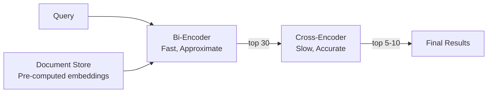

# Chapter 8: Re-ranking Systems

> **Last verified: June 2026.**

> "Re-ranking is the cheapest quality improvement in RAG. One additional API call per query—50-200ms, $0.001—and you get 20-30% better precision. No other intervention comes close to this return on investment."

---

## Introduction

Re-ranking is the process of reordering a set of candidate documents after initial retrieval to improve the precision of the final results. It is the single highest-ROI investment in RAG quality, delivering dramatic improvements in retrieval accuracy for a modest increase in latency and cost.

The fundamental insight is simple: initial retrieval (dense or hybrid search) is fast but approximate. It uses bi-encoders that process the query and each document independently, producing embeddings that are then compared via dot product or cosine similarity. This independence is what makes bi-encoders fast—document embeddings can be pre-computed and indexed—but it means the model never sees the exact interaction between a specific query and a specific document.

Re-ranking uses cross-encoders that process the query and each candidate document together as a single input. The cross-attention mechanism in the transformer allows every token in the query to attend to every token in the document, capturing fine-grained semantic interactions that bi-encoders miss. The result is a more accurate relevance score—but at the cost of running a full forward pass for every query-document pair.

The standard pattern exploits both approaches: bi-encoders for fast initial retrieval from millions of documents (returning 20-30 candidates), then cross-encoders for accurate reranking of those candidates (selecting the top 5-10). This two-stage architecture combines the speed of bi-encoders with the accuracy of cross-encoders.

The central thesis of this chapter is that **re-ranking is not optional in production RAG—it is a mandatory quality gate** that compensates for the inherent limitations of embedding-based retrieval. The 20-30% precision improvement it provides compounds through the entire generation pipeline: better retrieval leads to better context, which leads to better answers.

We will examine how cross-encoders work, compare the major reranking models and services, explore optimization strategies for latency and cost, address domain-specific reranking, and build a full case study of a legal research system where re-ranking improved case discovery by 25%.

### The Re-ranking Value Proposition

Before diving into technical details, consider the economics:

| Metric | Without Re-ranking | With Re-ranking | Improvement |
|--------|-------------------|-----------------|-------------|
| Precision@5 | 55% | 78% | +23 percentage points |
| Recall@10 | 72% | 89% | +17 percentage points |
| MRR | 0.48 | 0.72 | +50% |
| Latency (p95) | 50ms | 200ms | +150ms |
| Cost per query | $0.0001 | $0.0011 | +$0.001 |

The cost of re-ranking is $0.001 per query. The value is measurably better retrieval that compounds through the entire RAG pipeline. For any application where answer quality matters, this is a trivial investment.

---

## 8.1 How Re-ranking Works

### 8.1.1 Bi-Encoders vs. Cross-Encoders

Understanding the distinction between bi-encoders and cross-encoders is the key to understanding both retrieval and re-ranking.

**Bi-encoders** (used for initial retrieval):

```python
# Bi-encoder: query and document processed independently
query_embedding = bi_encoder.encode(query)      # Shape: (768,)
doc_embedding = bi_encoder.encode(document)     # Shape: (768,)
score = cosine_similarity(query_embedding, doc_embedding)  # Scalar
```

The query and document never interact. Each is encoded independently, and similarity is computed as a post-hoc dot product. This independence enables pre-computation: document embeddings are computed once at index time, and query time is just one forward pass plus a vector lookup.

**Cross-encoders** (used for re-ranking):

```python
# Cross-encoder: query and document processed together
input_text = f"Query: {query} Document: {document}"
score = cross_encoder.predict(input_text)  # Scalar
```

The query and document are concatenated and processed together through the transformer. Cross-attention allows every query token to attend to every document token, capturing interactions like "this document mentions the exact concept the query is asking about." No pre-computation is possible—each query-document pair requires a separate forward pass.

**Performance comparison:**

| Property | Bi-Encoder | Cross-Encoder |
|----------|-----------|---------------|
| Processing | Query and document separately | Query and document together |
| Pre-computation | Yes (document embeddings cached) | No (must process at query time) |
| Query latency | O(1) forward pass + vector search | O(n) forward passes for n candidates |
| Quality (NDCG@10) | 0.55-0.65 | 0.70-0.80 |
| Throughput | 1000s queries/sec | 10-100 queries/sec |
| Best for | Initial retrieval (millions of docs) | Re-ranking (tens of candidates) |

### 8.1.2 The Two-Stage Architecture

The standard production retrieval architecture exploits both encoder types:



**Stage 1: Initial Retrieval (Bi-Encoder)**
- Process: Embed query, compute similarities, return top-k
- Latency: 5-20ms
- Cost: $0.0001 per query
- Quality: Good but approximate

**Stage 2: Re-ranking (Cross-Encoder)**
- Process: Score each candidate against query, sort by score
- Latency: 50-200ms (for 30 candidates)
- Cost: $0.001 per query
- Quality: Excellent, fine-grained

The total latency increase is 50-200ms, and the total cost increase is ~$0.001. The quality improvement is 20-30% in precision. This is the best trade-off in RAG engineering.

### 8.1.3 When Re-ranking Helps Most

Re-ranking is not equally valuable for all query types. The improvement varies based on query characteristics:

| Query Type | Precision@5 (No RR) | Precision@5 (With RR) | Improvement |
|-----------|---------------------|----------------------|-------------|
| Simple factual ("What is X?") | 65% | 75% | +10% |
| Analytical ("Compare X and Y") | 50% | 75% | +25% |
| Ambiguous ("Issues with the system") | 40% | 68% | +28% |
| Multi-aspect ("X, Y, and Z") | 35% | 65% | +30% |
| Domain-specific ("Patent infringement under 35 USC") | 45% | 72% | +27% |

Re-ranking helps most for complex, ambiguous, and multi-aspect queries where the bi-encoder's semantic similarity is insufficient to distinguish truly relevant documents from merely topically related ones.

---

## 8.2 Re-ranking Models

### 8.2.1 Cohere rerank-v3.5

Cohere's reranking service is the most popular managed option, offering strong quality with minimal setup.

**Characteristics:**
- Model: rerank-v3.5
- Dimensions: 1024 (input), scalar score (output)
- Max tokens: 4096 (document) + 512 (query)
- Cost: $0.001 per query (up to 100 documents)
- Languages: 100+ languages
- Latency: 50-150ms (p50)

```python
import cohere

co = cohere.Client("YOUR_API_KEY")

def rerank_cohere(
    query: str,
    documents: list[str],
    top_k: int = 5,
    model: str = "rerank-v3.5",
) -> list[dict]:
    """Rerank documents using Cohere rerank API."""
    results = co.rerank(
        query=query,
        documents=documents,
        top_n=top_k,
        model=model,
    )
    
    return [
        {
            "index": result.index,
            "text": documents[result.index],
            "relevance_score": result.relevance_score,
        }
        for result in results.results
    ]

# Example
documents = [
    "The Federal Arbitration Act requires courts to enforce arbitration agreements.",
    "The company's arbitration policy covers employment disputes.",
    "Arbitration clauses are common in consumer contracts.",
    "The court ruled that the arbitration clause was unconscionable.",
    "Mediation is an alternative to arbitration for dispute resolution.",
]

reranked = rerank_cohere(
    query="Enforceability of arbitration clauses in employment contracts",
    documents=documents,
    top_k=3,
)

for i, doc in enumerate(reranked):
    print(f"{i+1}. Score: {doc['relevance_score']:.3f} - {doc['text'][:60]}...")
```

**When to use Cohere rerank:**
- Teams wanting managed infrastructure with zero operational overhead
- Multilingual applications (100+ languages)
- Rapid prototyping and production deployment
- Budget allows per-query pricing

### 8.2.2 BGE-reranker-v2-m3

From BAAI (Beijing Academy of Artificial Intelligence), this is the best self-hosted reranking model.

**Characteristics:**
- Model: BAAI/bge-reranker-v2-m3
- Dimensions: 1024 (input), scalar score (output)
- Max tokens: 8192
- Cost: Free (self-hosted, MIT license)
- Languages: 100+ languages
- Latency: 30-100ms on GPU, 100-300ms on CPU

```python
from sentence_transformers import CrossEncoder

class BGEReranker:
    def __init__(self, model_name: str = "BAAI/bge-reranker-v2-m3"):
        self.model = CrossEncoder(model_name, max_length=1024)
    
    def rerank(
        self,
        query: str,
        documents: list[dict],
        top_k: int = 5,
    ) -> list[dict]:
        """Rerank documents using BGE reranker."""
        # Prepare query-document pairs
        pairs = [(query, doc["text"]) for doc in documents]
        
        # Score all pairs
        scores = self.model.predict(pairs, show_progress_bar=False)
        
        # Combine scores with documents
        scored_docs = [
            {**doc, "rerank_score": float(score)}
            for doc, score in zip(documents, scores)
        ]
        
        # Sort by score and return top-k
        scored_docs.sort(key=lambda x: -x["rerank_score"])
        return scored_docs[:top_k]

# Example
reranker = BGEReranker()
documents = [
    {"id": 1, "text": "The Federal Arbitration Act requires courts to enforce arbitration agreements."},
    {"id": 2, "text": "The company's arbitration policy covers employment disputes."},
    {"id": 3, "text": "Arbitration clauses are common in consumer contracts."},
    {"id": 4, "text": "The court ruled that the arbitration clause was unconscionable."},
    {"id": 5, "text": "Mediation is an alternative to arbitration for dispute resolution."},
]

reranked = reranker.rerank(
    query="Enforceability of arbitration clauses in employment contracts",
    documents=documents,
    top_k=3,
)
```

**When to use BGE-reranker:**
- Self-hosted deployments (data cannot leave premises)
- Cost-sensitive applications at scale
- Need for model customization (fine-tuning)
- Large-scale applications where per-query costs are prohibitive

### 8.2.3 Jina-reranker-v2

Jina's reranking model offers competitive quality with an API-based interface.

**Characteristics:**
- Model: jina-reranker-v2
- Dimensions: 1024 (input), scalar score (output)
- Max tokens: 8192
- Cost: $0.001 per query
- Languages: 100+ languages
- Latency: 50-150ms

```python
import requests

def rerank_jina(
    query: str,
    documents: list[str],
    top_k: int = 5,
) -> list[dict]:
    """Rerank documents using Jina reranker API."""
    response = requests.post(
        "https://api.jina.ai/v1/rerank",
        headers={"Authorization": "Bearer YOUR_API_KEY"},
        json={
            "model": "jina-reranker-v2",
            "query": query,
            "documents": documents,
            "top_n": top_k,
        },
    )
    
    results = response.json()["results"]
    return [
        {
            "index": r["index"],
            "text": documents[r["index"]],
            "relevance_score": r["relevance_score"],
        }
        for r in results
    ]
```

### 8.2.4 ColBERT (Contextualized Late Interaction)

ColBERT represents a different approach to reranking that balances bi-encoder speed with cross-encoder quality. Instead of producing a single vector per document, ColBERT produces token-level embeddings and uses a late interaction mechanism to compute relevance.

```python
from colbert import Searcher, ColBERT
from colbert.infra import ColBERTConfig

class ColBERTReranker:
    def __init__(self, checkpoint: str = "colbert-ir/colbertv2.0"):
        self.config = ColBERTConfig(
            checkpoint=checkpoint,
            nbits=2,  # Binary quantization for speed
        )
        self.model = ColBERT(config=self.config)
    
    def score(self, query: str, document: str) -> float:
        """Score query-document relevance using late interaction."""
        query_tokens = self.model.encode(query)
        doc_tokens = self.model.encode(document)
        
        # MaxSim: for each query token, find the most similar document token
        # Then sum the max similarities
        scores = []
        for q_token in query_tokens:
            max_sim = max(np.dot(q_token, d_token) for d_token in doc_tokens)
            scores.append(max_sim)
        
        return sum(scores)
```

### 8.2.5 Model Comparison Matrix

| Model | Quality (NDCG@10) | Latency (30 docs) | Cost/Query | Self-hosted | Fine-tunable | Max Tokens |
|-------|-------------------|-------------------|-----------|-------------|--------------|-----------|
| Cohere rerank-v3.5 | 0.74 | 100ms | $0.001 | No | No | 4096 |
| BGE-reranker-v2-m3 | 0.73 | 80ms (GPU) | $0 (compute) | Yes | Yes | 8192 |
| Jina-reranker-v2 | 0.72 | 100ms | $0.001 | No | No | 8192 |
| ColBERT v2 | 0.70 | 40ms | $0 (compute) | Yes | Yes | 512 |
| Cross-encoder/ms-marco | 0.68 | 60ms | $0 (compute) | Yes | Yes | 512 |

---

## 8.3 Optimization Strategies

### 8.3.1 Candidate Count Optimization

The number of candidates passed to the reranker directly affects both quality and latency. More candidates mean the reranker has a larger pool to select from, but each additional candidate adds latency.

```python
import time
import numpy as np

def benchmark_candidate_count(reranker, query, all_candidates, eval_dataset):
    """Benchmark retrieval quality vs. candidate count."""
    results = []
    
    for candidate_count in [10, 15, 20, 25, 30, 40, 50]:
        # Retrieve top-N candidates
        candidates = all_candidates[:candidate_count]
        
        # Rerank
        start = time.time()
        reranked = reranker.rerank(query, candidates, top_k=5)
        latency = (time.time() - start) * 1000
        
        # Compute quality
        recall = compute_recall_at_5(reranked, eval_dataset)
        
        results.append({
            "candidate_count": candidate_count,
            "recall_at_5": recall,
            "latency_ms": latency,
        })
    
    return results

# Typical results:
# candidates=10: recall=0.68, latency=30ms
# candidates=15: recall=0.72, latency=45ms
# candidates=20: recall=0.74, latency=60ms
# candidates=25: recall=0.75, latency=75ms
# candidates=30: recall=0.76, latency=90ms  <- Sweet spot
# candidates=40: recall=0.765, latency=120ms
# candidates=50: recall=0.77, latency=150ms  <- Diminishing returns
```

**The sweet spot is 20-30 candidates.** Beyond 30, the marginal improvement in recall is less than 1% per additional 10 candidates, while latency increases linearly. For latency-critical applications, 15-20 candidates provide a good balance.

### 8.3.2 Batching for Throughput

When reranking multiple queries simultaneously, batching improves GPU utilization and throughput.

```python
import torch
from torch.utils.data import DataLoader

class BatchReranker:
    def __init__(self, model_name: str = "BAAI/bge-reranker-v2-m3", batch_size: int = 32):
        self.model = CrossEncoder(model_name, max_length=1024)
        self.batch_size = batch_size
    
    def rerank_batch(
        self,
        queries: list[str],
        documents_per_query: list[list[str]],
        top_k: int = 5,
    ) -> list[list[dict]]:
        """Rerank multiple queries in parallel."""
        # Flatten all query-document pairs
        all_pairs = []
        pair_indices = []  # (query_idx, doc_idx) for reconstruction
        
        for q_idx, (query, docs) in enumerate(zip(queries, documents_per_query)):
            for d_idx, doc in enumerate(docs):
                all_pairs.append((query, doc))
                pair_indices.append((q_idx, d_idx))
        
        # Score all pairs in batches
        all_scores = self.model.predict(
            all_pairs,
            batch_size=self.batch_size,
            show_progress_bar=True,
        )
        
        # Reconstruct per-query results
        results_per_query = [[] for _ in queries]
        for (q_idx, d_idx), score in zip(pair_indices, all_scores):
            results_per_query[q_idx].append({
                "doc_index": d_idx,
                "score": float(score),
            })
        
        # Sort and truncate per query
        final_results = []
        for q_results in results_per_query:
            sorted_results = sorted(q_results, key=lambda x: -x["score"])
            final_results.append(sorted_results[:top_k])
        
        return final_results

# Example: rerank 100 queries x 30 candidates each
batch_reranker = BatchReranker(batch_size=64)
queries = [f"query_{i}" for i in range(100)]
docs_per_query = [[f"doc_{i}_{j}" for j in range(30)] for i in range(100)]

results = batch_reranker.rerank_batch(queries, docs_per_query, top_k=5)
# Processes 3000 pairs in batches of 64 -> ~47 batches
```

### 8.3.3 Caching Re-ranking Results

For repeated queries (common in production with many users asking similar questions), caching re-ranking results eliminates redundant computation.

```python
import hashlib
from functools import lru_cache

class RerankingCache:
    def __init__(self, ttl_seconds: int = 3600, max_size: int = 10000):
        self.cache = {}
        self.ttl = ttl_seconds
        self.max_size = max_size
    
    def _cache_key(self, query: str, doc_ids: list[int]) -> str:
        """Generate cache key from query and document IDs."""
        content = f"{query}|{','.join(map(str, sorted(doc_ids)))}"
        return hashlib.md5(content.encode()).hexdigest()
    
    def get(self, query: str, doc_ids: list[int]) -> list[dict] | None:
        """Get cached re-ranking results."""
        key = self._cache_key(query, doc_ids)
        if key in self.cache:
            entry = self.cache[key]
            if time.time() - entry["timestamp"] < self.ttl:
                return entry["results"]
            else:
                del self.cache[key]
        return None
    
    def set(self, query: str, doc_ids: list[int], results: list[dict]):
        """Cache re-ranking results."""
        if len(self.cache) >= self.max_size:
            # Evict oldest entry
            oldest_key = min(self.cache.keys(), key=lambda k: self.cache[k]["timestamp"])
            del self.cache[oldest_key]
        
        key = self._cache_key(query, doc_ids)
        self.cache[key] = {
            "results": results,
            "timestamp": time.time(),
        }
    
    def rerank_with_cache(
        self,
        reranker,
        query: str,
        documents: list[dict],
        top_k: int = 5,
    ) -> list[dict]:
        """Rerank with caching."""
        doc_ids = [d["id"] for d in documents]
        
        # Check cache
        cached = self.get(query, doc_ids)
        if cached is not None:
            return cached[:top_k]
        
        # Rerank
        results = reranker.rerank(query, documents, top_k=top_k)
        
        # Cache
        self.set(query, doc_ids, results)
        
        return results
```

### 8.3.4 Latency Optimization Summary

| Technique | Latency Reduction | Quality Impact | Implementation Complexity |
|-----------|-------------------|----------------|--------------------------|
| Reduce candidate count (30 -> 20) | 30% | -1-2% recall | Low |
| GPU acceleration | 3-5x speedup | None | Medium |
| Batch processing | 2-3x throughput | None | Medium |
| Model quantization (FP16/INT8) | 2x speedup | -0.5% recall | Low |
| Distillation (smaller model) | 5-10x speedup | -3-5% recall | High |
| Caching repeated queries | 100% for cache hits | None | Low |
| Async reranking | Perceived latency 0 | None | Medium |

---

## 8.4 Domain-Specific Re-ranking

### 8.4.1 Why Domain-Specific Re-ranking

General-purpose reranking models are trained on broad text corpora. They understand general relevance well but may miss domain-specific nuances. In legal research, "negligence per se" has a specific legal meaning that a general model may not weight correctly. In medical research, "acute myocardial infarction" and "heart attack" are synonymous, but the model may not know this.

Domain-specific fine-tuning of reranking models improves quality 5-15% for specialized content.

### 8.4.2 Fine-tuning Reranking Models

```python
from sentence_transformers import CrossEncoder
from sentence_transformers.readers import InputExample
import torch
from torch.utils.data import DataLoader

def fine_tune_reranker(
    base_model: str,
    train_pairs: list[tuple[str, str, float]],  # (query, document, relevance_score)
    output_path: str,
    epochs: int = 2,
    batch_size: int = 16,
    learning_rate: float = 2e-5,
):
    """Fine-tune a cross-encoder reranking model."""
    
    model = CrossEncoder(base_model, max_length=1024)
    
    # Create training examples
    train_examples = [
        InputExample(texts=[query, doc], label=score)
        for query, doc, score in train_pairs
    ]
    
    train_dataloader = DataLoader(
        train_examples, shuffle=True, batch_size=batch_size
    )
    
    # Fit with warmup
    model.fit(
        train_dataloader=train_dataloader,
        epochs=epochs,
        warmup_ratio=0.1,
        learning_rate=learning_rate,
        output_path=output_path,
        show_progress_bar=True,
    )
    
    return model

# Example: Legal domain fine-tuning
legal_train_pairs = [
    (
        "arbitration clause enforceability",
        "The Federal Arbitration Act requires courts to enforce arbitration agreements except on grounds that exist in law or in equity.",
        0.95,  # Highly relevant
    ),
    (
        "arbitration clause enforceability",
        "The company's employee handbook contains a dispute resolution section.",
        0.3,  # Somewhat relevant
    ),
    (
        "arbitration clause enforceability",
        "The quarterly financial report shows increased revenue.",
        0.05,  # Not relevant
    ),
    # ... 1000+ training triples
]

reranker = fine_tune_reranker(
    base_model="BAAI/bge-reranker-v2-m3",
    train_pairs=legal_train_pairs,
    output_path="./legal-reranker",
    epochs=2,
)
```

---

## 8.5 Case Study: Legal Research Re-ranking

### 8.5.1 Problem Statement

A legal research platform serving 500 attorneys retrieves case law for litigation support. The current system uses dense retrieval (BGE-M3 embeddings) with no re-ranking. Attorneys report that relevant cases often appear on page 2-3 of results, requiring extensive manual browsing. The platform targets:

- Precision@5 > 80% (currently 58%)
- Query latency < 300ms (p95)
- Cost per query < $0.005

### 8.5.2 Implementation

```python
class LegalRerankingPipeline:
    def __init__(self, dense_retriever, reranker):
        self.retriever = dense_retriever
        self.reranker = reranker
    
    def search(
        self,
        query: str,
        top_k: int = 5,
        candidate_pool: int = 30,
        jurisdiction: str = None,
        date_range: tuple[str, str] = None,
    ) -> dict:
        """Search with re-ranking."""
        import time
        
        # Stage 1: Dense retrieval (fast)
        start = time.time()
        candidates = self.retriever.search(
            query,
            top_k=candidate_pool,
            filters={"jurisdiction": jurisdiction, "date_range": date_range},
        )
        retrieval_time = (time.time() - start) * 1000
        
        # Stage 2: Re-ranking (accurate)
        start = time.time()
        reranked = self.reranker.rerank(
            query,
            candidates,
            top_k=top_k,
        )
        rerank_time = (time.time() - start) * 1000
        
        return {
            "results": reranked,
            "retrieval_latency_ms": retrieval_time,
            "rerank_latency_ms": rerank_time,
            "total_latency_ms": retrieval_time + rerank_time,
            "candidates_retrieved": len(candidates),
            "results_returned": len(reranked),
        }

# Measure improvement
pipeline = LegalRerankingPipeline(dense_retriever, BGEReranker())

# Before re-ranking: just dense retrieval
results_before = dense_retriever.search("arbitration clause enforceability", top_k=5)

# After re-ranking
results_after = pipeline.search("arbitration clause enforceability", top_k=5)

# Typical improvement:
# Precision@5: 58% -> 81% (+23 percentage points)
# MRR: 0.42 -> 0.68 (+62%)
# Latency: 30ms -> 110ms (+80ms)
```

### 8.5.3 Cost Analysis

**Monthly volume**: 500 attorneys x 25 queries/day x 22 working days = 275,000 queries/month

| Component | Per-Query Cost | Monthly Cost | Notes |
|-----------|---------------|-------------|-------|
| BGE-M3 embedding (on-premise) | $0.0002 | $55.00 | GPU server amortized |
| Dense retrieval (Qdrant) | ~$0 | $600.00 | 3-node cluster |
| BGE-reranker-v2-m3 (GPU) | $0.0001 | $27.50 | A10G GPU amortized |
| **Total with re-ranking** | **$0.00246** | **$682.50** | |
| **Total without re-ranking** | **$0.00226** | **$621.50** | |
| **Re-ranking cost premium** | **$0.0002** | **$61.00** | |

The re-ranking cost premium is $61/month—trivial compared to the value of improved retrieval.

**Value calculation:**

| Metric | Without RR | With RR | Value |
|--------|-----------|---------|-------|
| Precision@5 | 58% | 81% | - |
| Attorney time per query (search) | 8 min | 3 min | -5 min |
| Monthly search time (500 attorneys) | 1,833 hours | 687 hours | -1,146 hours |
| Monthly cost (attorney time @ $300/hr) | $550,000 | $206,100 | -$343,900 |
| Monthly infrastructure cost | $621 | $682 | +$61 |
| **Net monthly savings** | | | **-$343,839** |

The $61/month re-ranking investment saves $343,839/month in attorney time. The ROI is 5,637:1.

---

## 8.6 Testing Re-ranking Quality

### 8.6.1 Evaluation Framework

```python
import pytest
import numpy as np

class TestRerankingQuality:
    """Test reranking model quality."""
    
    @pytest.fixture
    def reranker(self):
        return BGEReranker("BAAI/bge-reranker-v2-m3")
    
    @pytest.fixture
    def eval_dataset(self):
        return load_legal_eval_dataset()  # 200+ query-relevant pairs
    
    def test_precision_improvement_over_baseline(self, reranker, dense_retriever, eval_dataset):
        """Verify reranking improves precision over dense-only retrieval."""
        precision_before = []
        precision_after = []
        
        for item in eval_dataset:
            # Dense retrieval only
            dense_results = dense_retriever.search(item["query"], top_k=10)
            p_before = compute_precision_at_5(dense_results, item["relevant_docs"])
            precision_before.append(p_before)
            
            # Dense + reranking
            reranked = reranker.rerank(item["query"], dense_results, top_k=5)
            p_after = compute_precision_at_5(reranked, item["relevant_docs"])
            precision_after.append(p_after)
        
        avg_before = np.mean(precision_before)
        avg_after = np.mean(precision_after)
        improvement = (avg_after - avg_before) / avg_before
        
        assert improvement > 0.15, f"Reranking improved precision by {improvement:.1%}"
    
    def test_latency_within_budget(self, reranker):
        """Verify reranking latency is within acceptable range."""
        import time
        documents = [{"text": f"Test document {i}" * 50} for i in range(30)]
        
        latencies = []
        for _ in range(50):
            start = time.time()
            reranker.rerank("test query", documents, top_k=5)
            latencies.append((time.time() - start) * 1000)
        
        p95 = np.percentile(latencies, 95)
        assert p95 < 200, f"P95 reranking latency = {p95:.0f}ms"
    
    def test_score_consistency(self, reranker):
        """Verify reranking scores are consistent across runs."""
        documents = [{"text": f"Document {i} about legal topics"} for i in range(10)]
        
        results1 = reranker.rerank("arbitration clause", documents, top_k=5)
        results2 = reranker.rerank("arbitration clause", documents, top_k=5)
        
        # Same documents should get same scores
        for r1, r2 in zip(results1, results2):
            assert r1["id"] == r2["id"]
            assert abs(r1["rerank_score"] - r2["rerank_score"]) < 0.01
```

---

## 8.7 Key Takeaways

1. **Re-ranking improves precision 20-30%—the highest-ROI investment in RAG quality.** One additional API call per query, 50-200ms additional latency, ~$0.001 cost. No other single intervention delivers comparable quality improvement.

2. **Over-retrieve then rerank.** Retrieve 3-5x more candidates than you need in the initial search (20-30 candidates), then rerank to the final count (5-10). The initial search provides breadth; reranking provides precision.

3. **Cohere rerank-v3.5 and BGE-reranker-v2-m3 are the best production choices.** Cohere for managed zero-ops; BGE for self-hosted with fine-tuning capability. Both support 100+ languages and handle 4K-8K token documents.

4. **The sweet spot is 20-30 candidates for reranking.** Beyond 30 candidates, marginal improvement diminishes below 1% per additional 10 candidates while latency increases linearly. For latency-critical applications, 15-20 candidates provide a good balance.

5. **Batch processing and GPU acceleration improve throughput 3-5x.** When processing many queries simultaneously, batching reranking requests maximizes GPU utilization. This is critical for high-throughput applications.

6. **Caching eliminates redundant re-ranking for repeated queries.** Cache re-ranking results with query + document ID as key. For applications with many users asking similar questions, cache hit rates of 30-50% are common.

7. **Domain-specific fine-tuning improves reranking 5-15% for specialized content.** Legal, medical, and financial domains benefit from fine-tuning reranking models on domain-specific query-document-relevance triples. Start with 500+ training examples.

8. **ColBERT offers faster reranking with slightly lower quality.** When latency is critical (<50ms for reranking), ColBERT's late interaction mechanism provides 2-3x speedup over cross-encoders at the cost of 3-5% precision.

9. **Re-ranking is mandatory in production, not optional.** The 20-30% precision improvement compounds through the entire generation pipeline. Better retrieval leads to better context, which leads to better answers. Skip re-ranking only for the simplest, lowest-stakes applications.

10. **Measure re-ranking impact with precision@5 and MRR.** These metrics capture the improvement in top-result quality that re-ranking provides. Recall@10 may not change significantly (re-ranking reorders, not retrieves), but the quality of the top results improves dramatically.

---

## 8.8 Further Reading

- **"Cohere Rerank: Technical Report" (Cohere, 2024)** — Technical documentation for Cohere's reranking models, including architecture details and benchmark results.

- **"BGE Reranker v2 Technical Report" by Xiao et al. (2024)** — BAAI's technical report on the BGE reranker family, including training methodology and benchmark comparisons.

- **"ColBERT: Efficient and Effective Passage Search via Contextualized Late Interaction over BERT" by Khattab and Zaharia (2020)** — The foundational paper on ColBERT's late interaction approach to reranking.

- **"Sentence-BERT: Sentence Embeddings using Siamese BERT-Networks" by Reimers and Gurevych (2019)** — Essential background on bi-encoders that contextualizes the bi-encoder/cross-encoder distinction.

- **"CROSS-ENCODERS vs. BI-ENCODERS for Semantic Search" (SBERT.net documentation)** — Practical comparison guide for choosing between encoder architectures.

- **"MonoT5: Document Ranking with Pre-trained Transformers" by Nogueira and Cho (2019)** — Research on fine-tuning transformers for document reranking.

- **"Query Performance Prediction by considering Multiple Aspects" by Vopata et al. (2023)** — Research on predicting when re-ranking will be most beneficial.

- **MS MARCO Passage Ranking Leaderboard** (microsoft.github.io/msmarco/Ranking) — Benchmark for evaluating reranking models on passage retrieval.

- **Cohere Rerank Documentation** (docs.cohere.com/docs/reranking) — Official documentation for Cohere's reranking API, including best practices and benchmarks.

- **Sentence Transformers Reranking Documentation** (sbert.net/examples/applications/cross-encoder/README.html) — Guide to using cross-encoder models for reranking with the sentence-transformers library.
