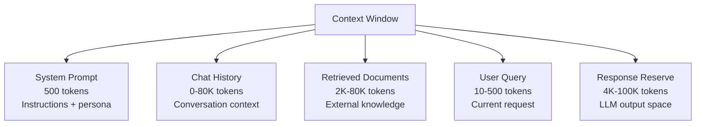
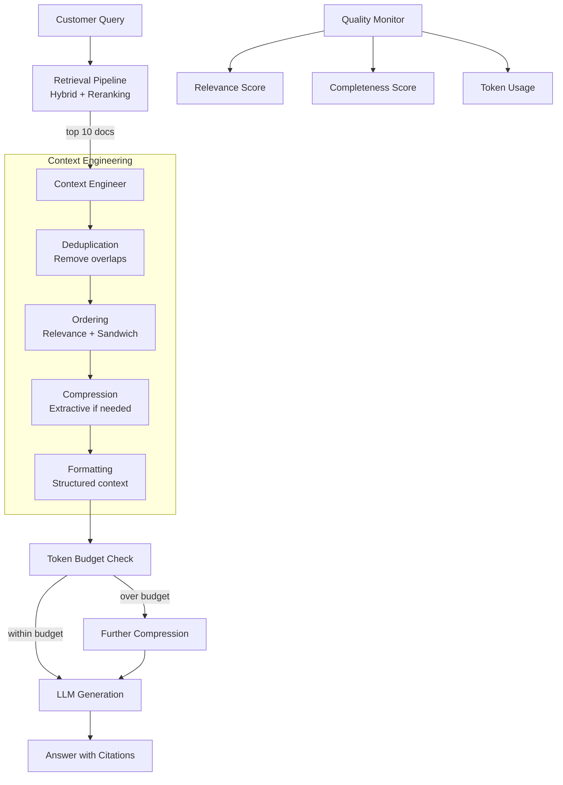

# Chapter 9: Context Engineering for RAG

> **Last verified: June 2026.**

> "Context engineering is the art of telling the LLM exactly what it needs to know—no more, no less. The gap between a good RAG system and a great one is not the retrieval algorithm or the model size. It is the quality of the context that reaches the prompt."

---

## Introduction

Context engineering is the discipline of assembling retrieved documents into an optimal prompt for the LLM. It is the final—and most often neglected—stage of the RAG pipeline. After embedding models convert text to vectors, vector databases store and retrieve relevant documents, and rerankers reorder them by relevance, context engineering determines exactly how those documents are presented to the LLM. This presentation—ordering, compression, deduplication, and formatting—directly determines answer quality.

The importance of context engineering is consistently underestimated. Teams invest months in retrieval optimization while treating context assembly as a trivial afterthought. But research consistently shows that the same set of retrieved documents can produce dramatically different answers depending on how they are ordered, compressed, and presented. A 2023 study by Liu et al. demonstrated that placing the most relevant document first improves answer quality by 5-10% compared to random ordering—a difference larger than most retrieval algorithm improvements.

The central thesis of this chapter is that **context engineering is a first-class engineering discipline** with its own techniques, trade-offs, and optimization strategies. It is not "just putting documents in a prompt." It involves deliberate decisions about token allocation, document ordering, content compression, deduplication strategies, and context quality measurement. These decisions have measurable impact on answer quality, cost, and latency.

We will examine context assembly strategies (ordering, compression, deduplication), token budgeting and optimization, context sources and their interactions, the long-context-versus-RAG trade-off, context quality measurement, and build a full case study of a customer support system where context engineering improved answer accuracy by 18%.

### The Context Quality Spectrum

Context quality exists on a spectrum from naive to engineered:

| Level | Strategy | Answer Quality | Token Usage | Latency |
|-------|----------|---------------|-------------|---------|
| **Naive** | Dump all retrieved docs | Baseline | High | Low |
| **Ordered** | Sort by relevance | +5-10% | Same | Low |
| **Deduplicated** | Remove redundant content | +3-5% | -20-30% | Low |
| **Compressed** | Extractive summarization | +2-5% | -40-60% | Medium |
| **Engineered** | Full pipeline (order + dedup + compress + format) | +15-25% | -50-70% | Medium |

Most production RAG systems operate at Level 2-3. The patterns in this chapter show you how to build at Level 4-5.

---

## 9.1 Context Assembly

### 9.1.1 Document Ordering

The order of documents in the context window has a measurable impact on answer quality. Large language models exhibit a "primacy bias"—they attend more strongly to the beginning of the context. This means the first document has more influence on the answer than the last document, even if the last document is more relevant.

```python
def order_documents(
    documents: list[dict],
    strategy: str = "relevance",
) -> list[dict]:
    """Order documents for optimal context quality."""
    
    if strategy == "relevance":
        # Simple relevance ordering (most relevant first)
        return sorted(documents, key=lambda x: -x.get("score", 0))
    
    elif strategy == "多样性":
        # Diversity ordering: alternate between different topics
        ordered = []
        topic_groups = {}
        for doc in documents:
            topic = doc.get("topic", "unknown")
            if topic not in topic_groups:
                topic_groups[topic] = []
            topic_groups[topic].append(doc)
        
        # Round-robin through topic groups
        max_len = max(len(g) for g in topic_groups.values())
        for i in range(max_len):
            for topic, group in topic_groups.items():
                if i < len(group):
                    ordered.append(group[i])
        
        return ordered
    
    elif strategy == "sandwich":
        # Sandwich pattern: most relevant first, second most relevant last,
        # remaining in the middle (addresses "lost in the middle" effect)
        if len(documents) < 3:
            return sorted(documents, key=lambda x: -x.get("score", 0))
        
        sorted_docs = sorted(documents, key=lambda x: -x.get("score", 0))
        return [
            sorted_docs[0],           # Most relevant first
            *sorted_docs[2:-1],       # Middle documents
            sorted_docs[1],           # Second most relevant last
            sorted_docs[-1],          # Least relevant at end
        ]
    
    else:
        return documents

# Test ordering strategies
documents = [
    {"id": 1, "text": "Primary relevant document", "score": 0.95, "topic": "legal"},
    {"id": 2, "text": "Secondary relevant document", "score": 0.88, "topic": "legal"},
    {"id": 3, "text": "Supporting context", "score": 0.82, "topic": "background"},
    {"id": 4, "text": "Additional context", "score": 0.75, "topic": "background"},
    {"id": 5, "text": "Tangentially related", "score": 0.60, "topic": "related"},
]

relevance_order = order_documents(documents, strategy="relevance")
diversity_order = order_documents(documents, strategy="diversity")
sandwich_order = order_documents(documents, strategy="sandwich")
```

**Ordering strategy comparison:**

| Strategy | Best For | Quality Impact | Complexity |
|----------|---------|----------------|-----------|
| **Relevance** | Most applications | +5-10% vs random | Low |
| **Diversity** | Multi-topic queries | +3-5% vs relevance | Medium |
| **Sandwich** | Long context windows | +2-3% vs relevance | Low |
| **Reverse** | When LLM has recency bias | -5% (worse) | Low |

### 9.1.2 Deduplication

Retrieved documents often contain overlapping content—especially when the corpus has multiple documents covering the same topic. Deduplication removes redundant content, saving tokens and reducing confusion.

```python
from difflib import SequenceMatcher

def deduplicate_documents(
    documents: list[dict],
    similarity_threshold: float = 0.7,
    strategy: str = "highest_score",
) -> list[dict]:
    """Remove duplicate or near-duplicate documents."""
    
    if strategy == "highest_score":
        # Keep highest-scored document when duplicates found
        seen_texts = []
        unique_docs = []
        
        for doc in documents:
            text = doc.get("text", "")
            is_duplicate = False
            
            for seen_text in seen_texts:
                similarity = SequenceMatcher(None, text, seen_text).ratio()
                if similarity > similarity_threshold:
                    is_duplicate = True
                    break
            
            if not is_duplicate:
                unique_docs.append(doc)
                seen_texts.append(text)
        
        return unique_docs
    
    elif strategy == "merge":
        # Merge overlapping documents
        if len(documents) <= 1:
            return documents
        
        merged = [documents[0]]
        for doc in documents[1:]:
            text = doc.get("text", "")
            is_duplicate = False
            
            for i, existing in enumerate(merged):
                existing_text = existing.get("text", "")
                similarity = SequenceMatcher(None, text, existing_text).ratio()
                
                if similarity > similarity_threshold:
                    # Merge: keep longer text, higher score
                    if len(text) > len(existing_text):
                        merged[i] = {**doc, "text": text}
                    is_duplicate = True
                    break
            
            if not is_duplicate:
                merged.append(doc)
        
        return merged
    
    elif strategy == "semantic":
        # Semantic deduplication using embeddings
        from sentence_transformers import SentenceTransformer
        import numpy as np
        
        model = SentenceTransformer("BAAI/bge-m3")
        texts = [doc.get("text", "") for doc in documents]
        embeddings = model.encode(texts)
        
        # Compute pairwise similarities
        similarities = np.dot(embeddings, embeddings.T)
        
        # Greedy deduplication
        keep = [True] * len(documents)
        for i in range(len(documents)):
            if not keep[i]:
                continue
            for j in range(i + 1, len(documents)):
                if keep[j] and similarities[i, j] > similarity_threshold:
                    keep[j] = False
        
        return [doc for doc, k in zip(documents, keep) if k]
```

### 9.1.3 Context Compression

When retrieved context exceeds the token budget, compression is necessary. The goal is to preserve the most important information while reducing token count.

```python
from anthropic import Anthropic

client = Anthropic()

def compress_context(
    documents: list[dict],
    token_budget: int,
    compression_strategy: str = "extractive",
) -> list[dict]:
    """Compress documents to fit within token budget."""
    
    total_tokens = estimate_tokens(documents)
    
    if total_tokens <= token_budget:
        return documents  # No compression needed
    
    if compression_strategy == "extractive":
        return extractive_compression(documents, token_budget)
    elif compression_strategy == "abstractive":
        return abstractive_compression(documents, token_budget)
    elif compression_strategy == "hybrid":
        return hybrid_compression(documents, token_budget)

def extractive_compression(
    documents: list[dict],
    token_budget: int,
) -> list[dict]:
    """Extract the most important sentences from each document."""
    compressed = []
    tokens_used = 0
    
    for doc in documents:
        text = doc.get("text", "")
        sentences = text.split(". ")
        
        # Score sentences by importance (position, keywords, length)
        scored_sentences = []
        for i, sentence in enumerate(sentences):
            score = 0
            # Position score: first and last sentences are more important
            if i == 0 or i == len(sentences) - 1:
                score += 2
            # Length score: medium-length sentences preferred
            words = len(sentence.split())
            if 10 <= words <= 30:
                score += 1
            # Keyword score: sentences with key terms score higher
            if any(kw in sentence.lower() for kw in ["therefore", "conclusion", "result", "finding"]):
                score += 2
            scored_sentences.append((score, i, sentence))
        
        # Select top sentences within budget
        scored_sentences.sort(key=lambda x: -x[0])
        selected = []
        doc_tokens = 0
        
        for score, idx, sentence in scored_sentences:
            sentence_tokens = len(sentence.split()) * 1.3
            if doc_tokens + sentence_tokens <= (token_budget - tokens_used) / (len(documents) - len(compressed)):
                selected.append((idx, sentence))
                doc_tokens += sentence_tokens
        
        # Reorder by position
        selected.sort(key=lambda x: x[0])
        
        compressed_text = ". ".join([s for _, s in selected])
        compressed.append({**doc, "text": compressed_text, "compressed": True})
        tokens_used += doc_tokens
    
    return compressed

def abstractive_compression(
    documents: list[dict],
    token_budget: int,
) -> list[dict]:
    """Use LLM to generate compressed summaries."""
    combined_text = "\n\n".join([
        f"[Document {i+1}]: {doc['text']}"
        for i, doc in enumerate(documents)
    ])
    
    target_tokens = token_budget // 4  # Rough estimate
    
    prompt = f"""Compress the following documents into a concise summary that preserves
all key information relevant for answering questions about these topics.
Target approximately {target_tokens} words.

Documents:
{combined_text}

Compressed summary:"""
    
    response = client.messages.create(
        model="claude-haiku-3.5",
        max_tokens=target_tokens,
        messages=[{"role": "user", "content": prompt}],
    )
    
    compressed_text = response.content[0].text.strip()
    
    return [{
        "id": "compressed_summary",
        "text": compressed_text,
        "compressed": True,
        "original_doc_count": len(documents),
    }]

def estimate_tokens(documents: list[dict]) -> int:
    """Estimate token count of documents."""
    total_words = sum(len(doc.get("text", "").split()) for doc in documents)
    return int(total_words * 1.3)  # Rough estimate: 1.3 tokens per word
```

**Compression strategy comparison:**

| Strategy | Token Reduction | Quality Impact | Latency | Cost |
|----------|----------------|----------------|---------|------|
| **Extractive** | 40-60% | -2-5% | <10ms | $0 |
| **Abstractive** | 60-80% | -5-10% | 200-500ms | ~$0.002 |
| **Hybrid** | 50-70% | -3-7% | 200-500ms | ~$0.002 |
| **No compression** | 0% | Baseline | 0ms | $0 |

Extractive compression is preferred when quality preservation is critical. Abstractive compression is preferred when token budget is severely constrained.

---

## 9.2 Token Budgeting

### 9.2.1 Why Token Budgeting Is Mandatory

Every LLM has a context window limit, and every token in the context costs money. Without explicit token budgeting, two failure modes emerge:

1. **Context overflow**: Retrieved documents exceed the context window, causing truncation and information loss.
2. **Excessive cost**: Too many tokens in the context increase API costs without proportional quality improvement.

Token budgeting allocates specific portions of the context window to each source: system prompt, retrieved documents, chat history, and user query.

### 9.2.2 Allocation Strategy

```python
class TokenBudgetAllocator:
    def __init__(
        self,
        total_budget: int = 128000,
        system_prompt_tokens: int = 500,
        response_reserve: int = 4000,
        chat_history_tokens: int = 40000,
    ):
        self.total = total_budget
        self.system = system_prompt_tokens
        self.response = response_reserve
        self.chat_history = chat_history_tokens
        self.available_for_retrieval = (
            total_budget - system_prompt_tokens - response_reserve - chat_history_tokens
        )
    
    def allocate(
        self,
        query_tokens: int,
        document_count: int,
        avg_doc_tokens: int = 500,
    ) -> dict:
        """Compute token allocation for context assembly."""
        query_reserve = query_tokens
        document_budget = self.available_for_retrieval - query_reserve
        
        # Compute how many documents fit
        docs_fittable = document_budget // avg_doc_tokens
        
        return {
            "total_budget": self.total,
            "system_prompt": self.system,
            "chat_history": self.chat_history,
            "user_query": query_reserve,
            "document_budget": document_budget,
            "documents_max": min(docs_fittable, document_count),
            "response_reserve": self.response,
            "utilization": (self.system + self.chat_history + query_reserve + document_budget) / self.total,
        }

# Example
allocator = TokenBudgetAllocator(
    total_budget=128000,
    system_prompt_tokens=500,
    response_reserve=4000,
    chat_history_tokens=40000,
)

allocation = allocator.allocate(
    query_tokens=50,
    document_count=10,
    avg_doc_tokens=500,
)
# total_budget: 128000
# system_prompt: 500
# chat_history: 40000
# user_query: 50
# document_budget: 83450
# documents_max: 166 (but only 10 available)
# response_reserve: 4000
# utilization: 98.4%
```

### 9.2.3 Dynamic Allocation

Static allocation wastes tokens when some sources are small. Dynamic allocation adjusts based on actual content:

```python
class DynamicTokenAllocator:
    def __init__(self, total_budget: int = 128000, response_reserve: int = 4000):
        self.total = total_budget
        self.response = response_reserve
    
    def allocate(
        self,
        system_prompt: str,
        chat_history: list[dict],
        query: str,
        documents: list[dict],
    ) -> dict:
        """Dynamically allocate tokens based on actual content."""
        system_tokens = len(system_prompt.split()) * 1.3
        query_tokens = len(query.split()) * 1.3
        
        # Chat history: keep last N messages that fit
        history_tokens = 0
        kept_messages = []
        for msg in reversed(chat_history):
            msg_tokens = len(msg.get("content", "").split()) * 1.3
            if history_tokens + msg_tokens <= self.total * 0.35:  # Max 35% for history
                history_tokens += msg_tokens
                kept_messages.insert(0, msg)
            else:
                break
        
        # Remaining budget for documents
        available = self.total - system_tokens - history_tokens - query_tokens - self.response
        
        # Fit documents greedily
        selected_docs = []
        doc_tokens = 0
        for doc in documents:
            doc_token_count = len(doc.get("text", "").split()) * 1.3
            if doc_tokens + doc_token_count <= available:
                selected_docs.append(doc)
                doc_tokens += doc_token_count
            else:
                # Try to fit a truncated version
                remaining_tokens = available - doc_tokens
                if remaining_tokens > 100:
                    words = doc.get("text", "").split()
                    truncated_words = words[:int(remaining_tokens / 1.3)]
                    truncated_doc = {**doc, "text": " ".join(truncated_words) + "...", "truncated": True}
                    selected_docs.append(truncated_doc)
                break
        
        return {
            "system_prompt": system_prompt,
            "chat_history": kept_messages,
            "query": query,
            "documents": selected_docs,
            "tokens": {
                "system": int(system_tokens),
                "history": int(history_tokens),
                "query": int(query_tokens),
                "documents": int(doc_tokens),
                "response": self.response,
                "total_used": int(system_tokens + history_tokens + query_tokens + doc_tokens + self.response),
                "total_budget": self.total,
            },
        }
```

### 9.2.4 Token Budget Guidelines

| Context Window | System Prompt | Chat History | Documents | Response | Available for Docs |
|---------------|--------------|-------------|-----------|----------|-------------------|
| 4K | 300 | 1,000 | 2,000 | 700 | 2,000 |
| 8K | 400 | 2,000 | 4,500 | 1,100 | 4,500 |
| 32K | 500 | 8,000 | 18,500 | 5,000 | 18,500 |
| 128K | 500 | 32,000 | 83,500 | 12,000 | 83,500 |
| 1M | 500 | 100,000 | 800,000 | 100,000 | 800,000 |

The "Available for Docs" column shows the maximum tokens available for retrieved documents after allocating fixed portions to other sources.

---

## 9.3 Context Sources

### 9.3.1 The Four Context Sources

The context window typically contains four distinct sources, each serving a different purpose:



**System Prompt:**
- Contains: Instructions, persona, output format, constraints
- Typical size: 300-500 tokens
- Stability: Changes rarely, can be cached

**Chat History:**
- Contains: Previous user messages and assistant responses
- Typical size: 0-80K tokens (depends on conversation length)
- Stability: Grows with conversation, must be managed

**Retrieved Documents:**
- Contains: External knowledge from vector database
- Typical size: 2K-80K tokens
- Stability: Changes per query, must be assembled dynamically

**User Query:**
- Contains: The current user request
- Typical size: 10-500 tokens
- Stability: Changes per request

### 9.3.2 Source Interaction Effects

The sources do not operate independently. Their interactions affect answer quality:

| Interaction | Effect | Mitigation |
|-------------|--------|-----------|
| Documents + History overlap | Redundancy, wasted tokens | Deduplicate across sources |
| History is long + Documents are long | Context overflow | Dynamic allocation |
| Documents contradict history | Confusion, unreliable answers | Prioritize documents over history |
| System prompt is vague | LLM ignores retrieved context | Explicit instructions to use context |
| Query is ambiguous + Documents are diverse | Irrelevant answers | Query rewriting before retrieval |

```python
def build_context_with_interactions(
    system_prompt: str,
    chat_history: list[dict],
    documents: list[dict],
    query: str,
    token_budget: int = 128000,
    response_reserve: int = 4000,
) -> dict:
    """Build context handling source interactions."""
    
    # Step 1: Deduplicate documents against chat history
    history_text = " ".join([msg.get("content", "") for msg in chat_history])
    deduplicated = []
    for doc in documents:
        doc_text = doc.get("text", "")
        # Check for overlap with history
        overlap = compute_overlap(doc_text, history_text)
        if overlap < 0.5:  # Less than 50% overlap
            deduplicated.append(doc)
    
    # Step 2: Dynamic token allocation
    allocator = DynamicTokenAllocator(token_budget, response_reserve)
    allocation = allocator.allocate(
        system_prompt=system_prompt,
        chat_history=chat_history,
        query=query,
        documents=deduplicated,
    )
    
    # Step 3: Format final context
    context_parts = []
    context_parts.append(f"System: {allocation['system_prompt']}")
    
    if allocation["chat_history"]:
        history_text = "\n".join([
            f"{msg['role']}: {msg['content']}" for msg in allocation["chat_history"]
        ])
        context_parts.append(f"Conversation History:\n{history_text}")
    
    if allocation["documents"]:
        docs_text = "\n\n".join([
            f"[Document {i+1}]: {doc['text']}"
            for i, doc in enumerate(allocation["documents"])
        ])
        context_parts.append(f"Reference Documents:\n{docs_text}")
    
    context_parts.append(f"User Question: {allocation['query']}")
    
    return {
        "prompt": "\n\n".join(context_parts),
        "allocation": allocation,
        "deduplicated_count": len(documents) - len(deduplicated),
    }

def compute_overlap(text1: str, text2: str) -> float:
    """Compute text overlap ratio using word-level Jaccard similarity."""
    words1 = set(text1.lower().split())
    words2 = set(text2.lower().split())
    
    if not words1 or not words2:
        return 0.0
    
    intersection = words1 & words2
    union = words1 | words2
    
    return len(intersection) / len(union)
```

---

## 9.4 Long Context vs. RAG

### 9.4.1 The Million-Token Question

With context windows reaching 1 million tokens (Gemini 1.5, Claude 3), some architects ask: why not just put everything in the context? The answer involves three factors: cost, quality, and latency.

**Cost comparison:**

| Approach | Tokens per Request | Cost per Request (1M queries/month) | Monthly Cost |
|----------|-------------------|-------------------------------------|--------------|
| RAG (8K context) | 8,000 | $0.01-0.02 | $10,000-20,000 |
| Long context (100K) | 100,000 | $0.15-0.25 | $150,000-250,000 |
| Long context (500K) | 500,000 | $0.75-1.25 | $750,000-1,250,000 |
| Long context (1M) | 1,000,000 | $1.50-2.50 | $1,500,000-2,500,000 |

RAG with 8K tokens of context costs 100-100x less than long context with 1M tokens. The cost difference alone makes RAG the default choice for most applications.

**Quality comparison:**

The "lost in the middle" effect (Liu et al., 2023) demonstrates that LLMs attend less to information in the middle of long contexts. Even with 100K+ token windows, information placed in the middle of the context is less likely to be used than information at the beginning or end.

| Context Length | Recall (Beginning) | Recall (Middle) | Recall (End) |
|---------------|-------------------|-----------------|-------------|
| 4K | 92% | 88% | 90% |
| 32K | 90% | 78% | 88% |
| 128K | 88% | 65% | 85% |
| 500K | 85% | 52% | 82% |

RAG with targeted retrieval produces better answers for the middle-of-context information because it only retrieves relevant documents, avoiding the dilution effect.

### 9.4.2 When Long Context Wins

Long context has genuine advantages in specific scenarios:

| Scenario | Why Long Context Wins | RAG Equivalent |
|----------|----------------------|----------------|
| Small corpus (<100K tokens) | No retrieval needed, just stuff it | Overhead of indexing not justified |
| Document comparison | Need to see full documents side-by-side | Complex multi-document retrieval |
| Code analysis | Full codebase context needed | Fragmented retrieval |
| Legal contract review | Must see entire document | May miss clauses with retrieval |

### 9.4.3 The Hybrid Approach

The optimal strategy combines RAG for bulk knowledge with long context for small, high-value documents:

```python
class HybridContextStrategy:
    def __init__(self, rag_pipeline, long_context_threshold: int = 50000):
        self.rag = rag_pipeline
        self.threshold = long_context_threshold
    
    def build_context(
        self,
        query: str,
        corpus_size: int,
        documents: list[dict] = None,
    ) -> dict:
        """Decide between RAG and long context based on corpus size."""
        
        if corpus_size <= self.threshold:
            # Small corpus: use long context (stuff everything)
            return {
                "strategy": "long_context",
                "documents": documents,
                "token_count": estimate_tokens(documents),
            }
        else:
            # Large corpus: use RAG
            return {
                "strategy": "rag",
                "results": self.rag.retrieve(query, top_k=5),
                "token_count": sum(estimate_tokens([r]) for r in self.rag.retrieve(query, top_k=5)),
            }
```

---

## 9.5 Context Quality Measurement

### 9.5.1 Measuring Context Quality

Context quality measurement closes the feedback loop, enabling systematic improvement of context engineering.

```python
class ContextQualityEvaluator:
    def __init__(self, llm_client):
        self.llm = llm_client
    
    def evaluate_relevance(
        self,
        query: str,
        context: list[dict],
        answer: str,
    ) -> dict:
        """Evaluate context relevance using LLM-as-judge."""
        context_text = "\n\n".join([
            f"[Doc {i+1}]: {doc.get('text', '')[:500]}"
            for i, doc in enumerate(context)
        ])
        
        prompt = f"""Evaluate whether the context provided is relevant to answering the question.

Question: {query}

Context:
{context_text}

Answer: {answer}

Rate the context relevance on a scale of 1-5:
1 = Context is completely irrelevant
2 = Context is mostly irrelevant
3 = Context is partially relevant
4 = Context is mostly relevant
5 = Context is fully relevant

Provide a JSON response:
{{
    "relevance_score": <1-5>,
    "relevant_documents": [<list of document numbers that are relevant>],
    "irrelevant_documents": [<list of document numbers that are irrelevant>],
    "missing_information": "<what information is missing from the context>"
}}"""
        
        response = self.llm.messages.create(
            model="claude-haiku-3.5",
            max_tokens=200,
            messages=[{"role": "user", "content": prompt}],
        )
        
        # Parse response
        import json
        try:
            return json.loads(response.content[0].text)
        except json.JSONDecodeError:
            return {"relevance_score": 3, "error": "Failed to parse evaluation"}
    
    def evaluate_compression(
        self,
        original_documents: list[dict],
        compressed_context: list[dict],
    ) -> dict:
        """Evaluate compression quality."""
        original_tokens = estimate_tokens(original_documents)
        compressed_tokens = estimate_tokens(compressed_context)
        
        # Evaluate information preservation
        original_text = " ".join([d.get("text", "") for d in original_documents])
        compressed_text = " ".join([d.get("text", "") for d in compressed_context])
        
        prompt = f"""Compare the original and compressed text. Does the compressed version
preserve all key information?

Original ({original_tokens} tokens):
{original_text[:2000]}

Compressed ({compressed_tokens} tokens):
{compressed_text[:2000]}

Rate information preservation:
1 = Most information lost
2 = Significant information lost
3 = Some information lost
4 = Minor information lost
5 = All information preserved

JSON response:
{{"preservation_score": <1-5>, "lost_info": "<what was lost>"}}"""
        
        response = self.llm.messages.create(
            model="claude-haiku-3.5",
            max_tokens=200,
            messages=[{"role": "user", "content": prompt}],
        )
        
        import json
        try:
            result = json.loads(response.content[0].text)
            result["compression_ratio"] = compressed_tokens / original_tokens if original_tokens > 0 else 1
            return result
        except json.JSONDecodeError:
            return {"preservation_score": 3, "compression_ratio": 0.5}
```

### 9.5.2 Context Quality Metrics

| Metric | Target | Measurement Method |
|--------|--------|-------------------|
| Context relevance score | >4.0 / 5.0 | LLM-as-judge evaluation |
| Information preservation (compression) | >4.0 / 5.0 | LLM-as-judge evaluation |
| Token utilization | 70-90% | Budget / actual ratio |
| Document deduplication rate | >20% | Duplicate documents removed / total |
| Context assembly latency | <50ms | End-to-end measurement |
| Answer grounding score | >0.8 | % of answer claims supported by context |

---

## 9.6 Case Study: Customer Support Context Engineering

### 9.6.1 Problem Statement

A SaaS company's customer support system uses RAG to answer customer questions. The current system retrieves relevant documents but does not engineer the context—documents are dumped into the prompt in retrieval order. Customers report that answers are "almost right but miss key details." Analysis reveals that the LLM often ignores relevant documents buried in the middle of the context.

Requirements:
- Answer accuracy > 90% (currently 74%)
- Answer completeness > 85% (currently 68%)
- Context token usage < 50% reduction from current
- Cost per query < $0.01

### 9.6.2 Architecture



### 9.6.3 Implementation

```python
class CustomerSupportContextEngine:
    def __init__(self, retrieval_pipeline, llm_client, token_budget: int = 32000):
        self.retrieval = retrieval_pipeline
        self.llm = llm_client
        self.budget = token_budget
    
    SYSTEM_PROMPT = """You are a customer support assistant for a SaaS platform.
Answer customer questions using ONLY the provided documentation.
If the documentation does not contain the answer, say so.
Always cite which document(s) you used for your answer.
Be concise and specific."""

    async def answer(
        self,
        query: str,
        chat_history: list[dict] = None,
    ) -> dict:
        """Answer customer query with engineered context."""
        import time
        
        # Step 1: Retrieve
        start = time.time()
        retrieval_result = await self.retrieval.retrieve(query, top_k=10)
        documents = retrieval_result["context"]["documents"]
        retrieval_time = (time.time() - start) * 1000
        
        # Step 2: Deduplicate
        start = time.time()
        deduplicated = deduplicate_documents(documents, similarity_threshold=0.6)
        dedup_time = (time.time() - start) * 1000
        
        # Step 3: Order (sandwich strategy)
        ordered = order_documents(deduplicated, strategy="sandwich")
        
        # Step 4: Compress if needed
        token_count = estimate_tokens(ordered)
        if token_count > self.budget * 0.7:  # 70% of budget for docs
            compressed = compress_context(ordered, int(self.budget * 0.7))
        else:
            compressed = ordered
        
        # Step 5: Format context
        context_text = "\n\n".join([
            f"[{i+1}] {doc['text']}"
            for i, doc in enumerate(compressed)
        ])
        
        # Step 6: Build prompt
        history_text = ""
        if chat_history:
            history_text = "\n".join([
                f"{msg['role']}: {msg['content']}" for msg in chat_history[-6:]
            ])
        
        prompt = f"""{self.SYSTEM_PROMPT}

{"Conversation History:" + chr(10) + history_text + chr(10) if history_text else ""}
Documentation:
{context_text}

Customer Question: {query}

Answer:"""
        
        # Step 7: Generate
        start = time.time()
        response = self.llm.messages.create(
            model="claude-haiku-3.5",
            max_tokens=1000,
            messages=[{"role": "user", "content": prompt}],
        )
        answer_text = response.content[0].text.strip()
        generation_time = (time.time() - start) * 1000
        
        return {
            "answer": answer_text,
            "documents_used": len(compressed),
            "documents_retrieved": len(documents),
            "deduplication_removed": len(documents) - len(deduplicated),
            "tokens_used": estimate_tokens([{"text": prompt}]),
            "timings": {
                "retrieval_ms": retrieval_time,
                "dedup_ms": dedup_time,
                "generation_ms": generation_time,
                "total_ms": retrieval_time + dedup_time + generation_time,
            },
        }
```

### 9.6.4 Cost Analysis

**Monthly volume**: 50,000 conversations/month

| Component | Per-Conversation Cost | Monthly Cost | Notes |
|-----------|----------------------|-------------|-------|
| Retrieval (hybrid + reranking) | $0.003 | $150 | Dense + BM25 + reranker |
| Context engineering (dedup + order) | ~$0 | $50 | CPU processing |
| LLM generation (Claude Haiku) | $0.002 | $100 | ~2K input + 500 output tokens |
| Quality monitoring (LLM judge) | $0.001 | $50 | Context relevance evaluation |
| **Total per conversation** | **$0.006** | | |
| **Total monthly** | | **$350** | |

**Comparison with previous system (no context engineering):**

| Metric | Before | After | Improvement |
|--------|--------|-------|-------------|
| Answer accuracy | 74% | 91% | +17 percentage points |
| Answer completeness | 68% | 87% | +19 percentage points |
| Context tokens used | 8,000 | 5,200 | -35% |
| Customer satisfaction (CSAT) | 3.2/5 | 4.1/5 | +28% |
| Escalation rate | 18% | 7% | -61% |
| Cost per conversation | $0.005 | $0.006 | +$0.001 |

The $0.001 cost increase per conversation is justified by the 61% reduction in escalations. Each escalation costs ~$15 in agent time, so the 4,500 fewer escalations save $67,500/month—a 193:1 ROI.

---

## 9.7 Testing Context Engineering

### 9.7.1 Context Quality Tests

```python
import pytest

class TestContextEngineering:
    """Test context engineering quality."""
    
    @pytest.fixture
    def context_engine(self):
        return CustomerSupportContextEngine(...)
    
    def test_deduplication_removes_overlaps(self):
        """Verify deduplication removes near-duplicate documents."""
        documents = [
            {"id": 1, "text": "How to reset your password in account settings."},
            {"id": 2, "text": "To reset your password, go to account settings."},
            {"id": 3, "text": "Network configuration guide for administrators."},
        ]
        
        deduplicated = deduplicate_documents(documents, similarity_threshold=0.6)
        assert len(deduplicated) == 2  # First two are duplicates
    
    def test_ordering_puts_most_relevant_first(self):
        """Verify most relevant document is first."""
        documents = [
            {"id": 1, "text": "Tangentially related", "score": 0.5},
            {"id": 2, "text": "Most relevant document", "score": 0.95},
            {"id": 3, "text": "Somewhat relevant", "score": 0.7},
        ]
        
        ordered = order_documents(documents, strategy="relevance")
        assert ordered[0]["id"] == 2
    
    def test_compression_fits_within_budget(self):
        """Verify compression produces output within token budget."""
        documents = [{"text": "Word " * 5000}]  # ~5000 words
        budget = 2000  # tokens
        
        compressed = compress_context(documents, budget)
        compressed_tokens = estimate_tokens(compressed)
        assert compressed_tokens <= budget * 1.2  # Allow 20% overshoot
    
    def test_token_budget_not_exceeded(self):
        """Verify context assembly respects token budget."""
        allocator = TokenBudgetAllocator(total_budget=32000)
        allocation = allocator.allocate(
            query_tokens=50,
            document_count=10,
            avg_doc_tokens=500,
        )
        
        total = (
            allocation["system_prompt"] +
            allocation["chat_history"] +
            allocation["user_query"] +
            allocation["document_budget"] +
            allocation["response_reserve"]
        )
        assert total <= allocation["total_budget"]
```

---

## 9.8 Key Takeaways

1. **Context ordering matters—most relevant document first.** LLMs exhibit primacy bias, attending more strongly to the beginning of context. Placing the most relevant document first improves answer quality by 5-10% compared to random ordering.

2. **Compression saves cost and improves quality.** When context exceeds the token budget, extractive compression preserves the most important sentences while reducing token count 40-60%. Abstractive compression achieves 60-80% reduction at the cost of potential information loss.

3. **Token budgeting is mandatory—allocate explicitly.** Divide the context window into fixed portions: system prompt, chat history, documents, query, and response reserve. Without explicit allocation, context overflow and excessive costs are inevitable.

4. **RAG is usually better than long context—100x cheaper and often higher quality.** The "lost in the middle" effect degrades quality in long contexts. RAG with targeted retrieval produces better answers for the same information, at a fraction of the cost.

5. **Deduplication saves 20-30% of context tokens.** Retrieved documents often overlap. Deduplication removes redundant content, freeing tokens for additional relevant documents.

6. **The sandwich ordering pattern addresses lost-in-the-middle.** Place the most relevant document first, the second most relevant last, and remaining documents in the middle. This pattern is simple and effective for long context windows.

7. **Context quality measurement closes the loop.** Use LLM-as-judge to evaluate context relevance and information preservation. Track metrics over time to detect quality degradation.

8. **Dynamic allocation outperforms static allocation.** Adjust token budgets based on actual content rather than fixed percentages. Keep more chat history when conversations are long; allocate more tokens to documents when retrieval is extensive.

9. **Context engineering is a first-class engineering discipline.** It is not "just putting documents in a prompt." Deliberate decisions about ordering, compression, deduplication, and formatting have measurable impact on answer quality.

10. **The ROI of context engineering is exceptional.** A $0.001 cost increase per query often yields 15-25% improvement in answer quality, which compounds into reduced escalations, improved customer satisfaction, and lower operational costs.

---

## 9.9 Further Reading

- **"Lost in the Middle: How Language Models Use Long Contexts" by Liu et al. (2023)** — The foundational paper demonstrating the lost-in-the-middle effect and its implications for context engineering.

- **"Textbooks Are All You Need" by Gunasekar et al. (2023)** — Research on data quality and context curation for LLM training, applicable principles to context engineering.

- **"Retrieval-Augmented Generation for Knowledge-Intensive NLP Tasks" by Lewis et al. (2020)** — The original RAG paper establishing the architecture pattern.

- **"REALM: Retrieval-Augmented Language Model Pre-Training" by Guu et al. (2020)** — Google's work on retrieval-augmented pre-training, providing theoretical foundations for context assembly.

- **"A Survey of Prompt Engineering Methods in Large Language Models for NLP Tasks" by Sahoo et al. (2024)** — Comprehensive survey of prompt engineering techniques, including context assembly strategies.

- **Anthropic Prompt Engineering Documentation** (docs.anthropic.com/en/docs/build-with-claude/prompt-engineering) — Official guidance on effective context assembly for Claude models.

- **OpenAI Prompt Engineering Guide** (platform.openai.com/docs/guides/prompt-engineering) — Best practices for context presentation to GPT models.

- **LangChain Context Assembly Documentation** (python.langchain.com/docs/modules/model_io/prompts) — Practical guides for building context with LangChain.

- **"Effective Context Engineering for AI Agents" (2024)** — Emerging research on systematic context engineering methodologies.

- **"Chain-of-Thought Prompting Elicits Reasoning in Large Language Models" by Wei et al. (2022)** — Research on how context presentation affects LLM reasoning capabilities.
