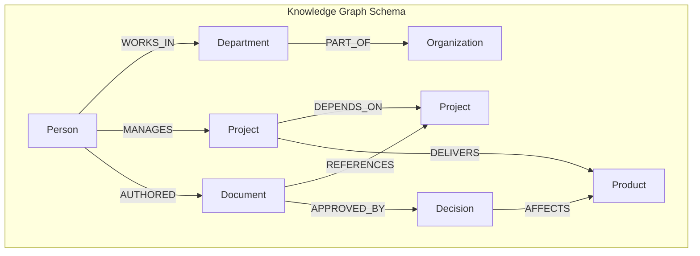
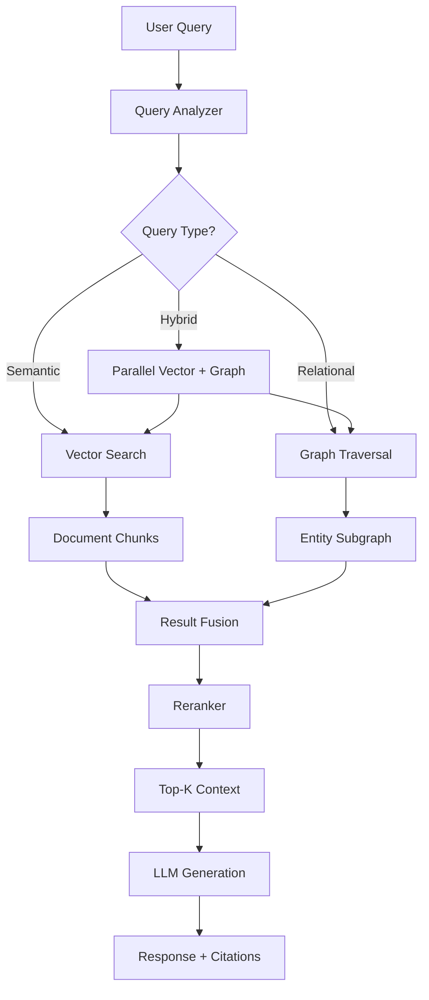
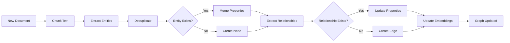
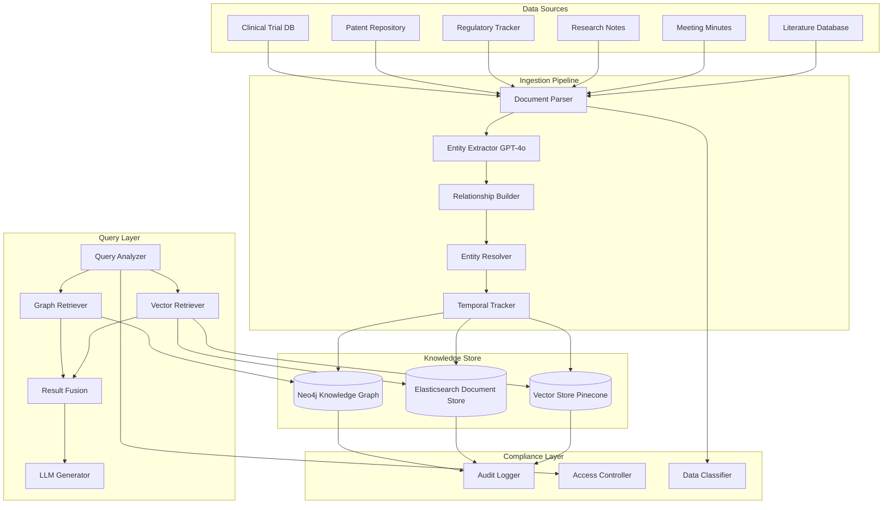

# Chapter 10: Knowledge Graph RAG

> "The map is not the territory, but a good map gets you where you need to go — and a knowledge graph is the best map for navigating the relationships that define enterprise knowledge."

---

**Last verified: June 2026.**

## Introduction

In the preceding chapters, we explored vector-based retrieval systems that treat documents as independent units of information. Vector search excels at finding semantically similar text — it can locate a paragraph about "revenue growth strategies" when you ask about "how to increase sales." But vector search has a fundamental blind spot: it cannot reliably traverse relationships between entities. "Find all products manufactured by companies headquartered in China that supply components to our automotive division" requires following a chain of relationships — Product → manufactured_by → Company → located_in → Country, then Company → supplies → Division. Vector embeddings compress this relational structure into a single vector, losing the explicit connections that make multi-hop reasoning possible.

Knowledge Graph RAG addresses this gap by combining the semantic understanding of vector retrieval with the relational reasoning of knowledge graphs. A knowledge graph stores entities (nodes) and relationships (edges) as structured, traversable data. When a query requires understanding how things connect — not just finding similar text — knowledge graphs provide the scaffolding that vector search alone cannot.

The central thesis of this chapter is the **retrieval-complementarity principle**: vector search and graph traversal are not competing approaches but complementary modalities that cover each other's blind spots. Vector search finds documents by semantic similarity; graph traversal finds entities by relational connectivity. The best enterprise RAG systems use both, merging their results to provide context that neither could produce alone.

We will examine the fundamentals of knowledge graph construction, entity and relationship extraction using LLMs, graph database selection and deployment, Graph RAG architecture patterns, query planning and fusion strategies, and a full pharmaceutical knowledge graph case study with quantified cost analysis.

### The Limitations of Vector-Only Retrieval

Before diving into knowledge graphs, it is useful to understand precisely where vector search fails. Consider a corporate knowledge base with the following entities:

| Entity Type | Example | Vector Representation |
|-------------|---------|----------------------|
| Person | "Dr. Sarah Chen, VP of Engineering" | Embedding of her bio text |
| Project | "Project Atlas, Q3 deliverable" | Embedding of project description |
| Document | "Architecture Review, Aug 2025" | Embedding of document content |
| Decision | "Approved microservices migration" | Embedding of decision record |

Vector search treats each of these as an independent text block. It cannot answer:
- "Who approved the microservices migration?" (Person → Decision relationship)
- "What projects does Dr. Chen lead?" (Person → Project relationship)
- "Which documents reference Project Atlas?" (Document → Project relationship)
- "What decisions were made in Q3?" (Decision → Time relationship)

These are the most common queries in enterprise knowledge systems. They require traversing relationships, not finding similar text. Knowledge graphs make these queries natural and efficient.

### When Knowledge Graphs Are Worth the Investment

Building and maintaining a knowledge graph is significantly more expensive than embedding documents in a vector store. The investment is justified when:

| Factor | Vector-Only Sufficient | Knowledge Graph Required |
|--------|----------------------|--------------------------|
| Query type | "Find documents about X" | "Find entities related to X via Y" |
| Relationship density | Low (< 2 relationships per entity) | High (> 5 relationships per entity) |
| Multi-hop reasoning | Not needed | Frequently needed |
| Regulatory audit | No relationship tracing required | Full lineage required |
| Data structure | Unstructured text | Semi-structured with entities |
| Update frequency | Bulk re-indexing acceptable | Incremental updates needed |

The decision is not binary. Most production systems use a hybrid approach: vector search for document retrieval, graph traversal for relationship queries, with a fusion layer that merges results.

---

## 10.1 Knowledge Graph Fundamentals

### 10.1.1 Graph Data Model

A knowledge graph consists of three components:

1. **Nodes (Entities)**: Discrete objects — people, organizations, products, concepts, events. Each node has a type (label) and properties (key-value pairs).
2. **Edges (Relationships)**: Directed connections between nodes. Each edge has a type (label) and properties. Edges are first-class citizens, not just links — they carry meaning.
3. **Properties**: Key-value pairs attached to both nodes and edges. A Person node might have properties `name`, `title`, `department`. An edge `WORKS_IN` might have properties `start_date`, `end_date`, `role`.



The power of this model is that queries become graph traversals. "Which projects does Dr. Chen manage?" is a two-hop traversal: `Person(name="Dr. Chen") → MANAGES → Project`. "What decisions affect products her team delivers?" is a four-hop traversal: `Person → MANAGES → Project → DELIVERS → Product ← AFFECTS ← Decision`.

### 10.1.2 Property Graph vs. RDF

Two primary graph data models exist, each with different trade-offs:

| Aspect | Property Graph | RDF (Resource Description Framework) |
|--------|---------------|--------------------------------------|
| Data model | Nodes, edges, properties | Triples (subject, predicate, object) |
| Query language | Cypher (Neo4j), Gremlin | SPARQL |
| Schema | Flexible, optional | Strict (ontologies) |
| Learning curve | Lower | Higher |
| Tooling ecosystem | Rich (Neo4j, Neptune) | Mature (Jena, Virtuoso) |
| Best for | Application-focused graphs | Standards-based, interoperation |
| Production example | Neo4j, Amazon Neptune | Wikidata, biomedical ontologies |

For most enterprise RAG applications, property graphs (Neo4j) are the practical choice. They integrate more naturally with application code, have a gentler learning curve, and the Cypher query language is more intuitive for developers. RDF and SPARQL are preferred when standards compliance or cross-organization data integration is required.

### 10.1.3 Graph Database Selection

The graph database is the persistence layer for your knowledge graph. The choice depends on scale, query patterns, and operational requirements:

| Database | Type | Scale | Query Language | Managed Option | Best For |
|----------|------|-------|----------------|----------------|----------|
| Neo4j | Property graph | Billions of nodes | Cypher | Neo4j Aura | Most enterprise use cases |
| Amazon Neptune | Property + RDF | Billions of nodes | Gremlin + SPARQL | Fully managed | AWS-native architectures |
| ArangoDB | Multi-model | Billions of nodes | AQL | ArangoDB Cloud | Graph + document + key-value |
| TigerGraph | Property graph | Trillions of edges | GSQL | TigerGraph Cloud | Deep link analytics |
| JanusGraph | Property graph | Petabytes | Gremlin | Self-hosted | Open-source, massive scale |
| FalkorDB | Property graph | Billions of nodes | Cypher | Redis Cloud | Redis-compatible, fast |

For most teams building Graph RAG, Neo4j is the default choice. It has the largest community, the most mature tooling (Neo4j Bloom for visualization, APOC for graph algorithms), and a free cloud tier (Neo4j Aura Free) for prototyping. Amazon Neptune is the choice for AWS-native architectures where managed infrastructure is a requirement.

---

## 10.2 Entity and Relationship Extraction

### 10.2.1 LLM-Based Extraction

The quality of your knowledge graph is determined by the quality of entity and relationship extraction. LLMs are the current state of the art for this task, outperforming traditional NER (Named Entity Recognition) systems for complex, domain-specific extraction.

The extraction pipeline:

1. **Chunk text** into manageable segments (500-2000 tokens)
2. **Extract entities** with types and properties
3. **Extract relationships** between entities
4. **Deduplicate** entities across chunks (same person mentioned in different documents)
5. **Resolve coreferences** ("Dr. Chen", "Sarah", "the VP" → single entity)
6. **Validate** extracted triples against a schema

```python
from pydantic import BaseModel, Field
from typing import Literal

class ExtractedEntity(BaseModel):
    name: str = Field(description="Canonical name of the entity")
    entity_type: Literal["person", "organization", "product", "project",
                         "document", "concept", "event", "location"]
    properties: dict[str, str] = Field(default_factory=dict)
    confidence: float = Field(ge=0.0, le=1.0)

class ExtractedRelationship(BaseModel):
    source_entity: str = Field(description="Name of the source entity")
    target_entity: str = Field(description="Name of the target entity")
    relationship_type: str = Field(description="Type of relationship")
    properties: dict[str, str] = Field(default_factory=dict)
    confidence: float = Field(ge=0.0, le=1.0)

class ExtractionResult(BaseModel):
    entities: list[ExtractedEntity]
    relationships: list[ExtractedRelationship]

EXTRACTION_PROMPT = """Extract all entities and relationships from the following text.

Entity types: person, organization, product, project, document, concept, event, location
Relationship types: WORKS_IN, MANAGES, AUTHORED, REFERENCES, DEPENDS_ON, DELIVERS,
  APPROVED_BY, AFFECTS, PART_OF, LOCATED_IN, FOUNDED_BY, ACQUIRED_BY, SUPPLIES

For each entity, provide:
- name: canonical name
- entity_type: one of the types above
- properties: key facts about the entity
- confidence: 0.0-1.0

For each relationship, provide:
- source_entity: name of source
- target_entity: name of target
- relationship_type: one of the types above
- properties: key facts about the relationship
- confidence: 0.0-1.0

Text:
{text}

Return JSON matching the ExtractionResult schema."""

async def extract_knowledge(text: str, llm) -> ExtractionResult:
    response = await llm.extract(
        EXTRACTION_PROMPT.format(text=text),
        schema=ExtractionResult
    )
    return ExtractionResult(**response)
```

### 10.2.2 Extraction Quality Optimization

Raw LLM extraction produces duplicates, inconsistencies, and errors. A post-processing pipeline is essential:

```python
class KnowledgeGraphBuilder:
    def __init__(self, graph_db, llm):
        self.graph = graph_db
        self.llm = llm

    async def ingest_document(self, document_id: str, text: str):
        chunks = chunk_text(text, chunk_size=1500, overlap=200)

        all_entities = []
        all_relationships = []
        for chunk in chunks:
            result = await extract_knowledge(chunk, self.llm)
            all_entities.extend(result.entities)
            all_relationships.extend(result.relationships)

        canonical_entities = self._deduplicate_entities(all_entities)
        resolved_entities = await self._resolve_coreferences(canonical_entities)
        valid_relationships = self._validate_relationships(
            all_relationships, resolved_entities
        )
        await self._write_to_graph(
            document_id, resolved_entities, valid_relationships
        )

    def _deduplicate_entities(self, entities: list[ExtractedEntity]) -> dict:
        canonical = {}
        for entity in entities:
            key = entity.name.lower().strip()
            if key in canonical:
                existing = canonical[key]
                existing.properties.update(entity.properties)
                existing.confidence = max(existing.confidence, entity.confidence)
            else:
                canonical[key] = entity
        return canonical

    def _validate_relationships(
        self, relationships: list[ExtractedRelationship], entities: dict
    ) -> list[ExtractedRelationship]:
        valid = []
        for rel in relationships:
            source_key = rel.source_entity.lower().strip()
            target_key = rel.target_entity.lower().strip()
            if source_key in entities and target_key in entities:
                rel.source_entity = entities[source_key].name
                rel.target_entity = entities[target_key].name
                valid.append(rel)
        return valid
```

### 10.2.3 Extraction Accuracy Benchmarks

The accuracy of LLM-based extraction varies by domain and entity type:

| Entity Type | Precision | Recall | F1 Score | Notes |
|-------------|-----------|--------|----------|-------|
| Person | 0.95 | 0.92 | 0.93 | Names are well-recognized |
| Organization | 0.91 | 0.88 | 0.89 | Acronyms cause confusion |
| Product | 0.87 | 0.83 | 0.85 | Domain-specific naming |
| Project | 0.84 | 0.79 | 0.81 | Internal naming conventions |
| Concept | 0.78 | 0.72 | 0.75 | Abstract, ambiguous |
| Event | 0.82 | 0.77 | 0.79 | Temporal grounding needed |

*Benchmarked on enterprise document corpora (10K documents, 5 domains). GPT-4o extraction with schema enforcement.*

The gap between Person (0.93 F1) and Concept (0.75 F1) is significant. For high-stakes domains, human review of extracted entities is recommended, especially for concepts and abstract relationships.

---

## 10.3 Graph RAG Architecture

### 10.3.1 The Hybrid Retrieval Pattern

The standard Graph RAG architecture combines vector search with graph traversal:



The query analyzer determines the retrieval strategy:

```python
class QueryAnalyzer:
    def __init__(self, llm):
        self.llm = llm
        self.relational_keywords = [
            "who", "which", "what team", "reports to", "manages",
            "works with", "depends on", "related to", "connected",
            "supply chain", "hierarchy", "organization"
        ]

    async def analyze(self, query: str) -> dict:
        query_lower = query.lower()
        has_relational = any(kw in query_lower for kw in self.relational_keywords)

        if has_relational:
            strategy = "graph_first"
        elif any(w in query_lower for w in ["find", "search", "document"]):
            strategy = "vector_first"
        else:
            strategy = "hybrid"

        analysis = await self.llm.extract(
            f"Analyze this query:\n{query}\n\n"
            "Determine: entities_mentioned, relationships_implied, hops_needed, is_multi_hop",
            schema=QueryAnalysis
        )

        return {
            "strategy": strategy,
            "entities": analysis.entities_mentioned,
            "relationships": analysis.relationships_implied,
            "hops": analysis.hops_needed,
            "multi_hop": analysis.is_multi_hop
        }
```

### 10.3.2 Graph Traversal Queries

Cypher queries for common Graph RAG patterns:

**Single-hop query**: "Who manages Project Atlas?"
```cypher
MATCH (p:Person)-[:MANAGES]->(proj:Project)
WHERE proj.name = 'Project Atlas'
RETURN p.name, p.title, p.department
```

**Multi-hop query**: "What products depend on components from suppliers in China?"
```cypher
MATCH (prod:Product)-[:DEPENDS_ON]->(comp:Component)<-[:SUPPLIES]-(sup:Supplier)-[:LOCATED_IN]->(country:Country)
WHERE country.name = 'China'
RETURN prod.name, comp.name, sup.name
```

**Path query**: "What is the shortest path between Dr. Chen and the Q3 Revenue Report?"
```cypher
MATCH path = shortestPath(
    (p:Person {name: 'Dr. Chen'})-[*]-(d:Document {name: 'Q3 Revenue Report'})
)
RETURN path, length(path) AS hops
```

**Aggregation query**: "Which departments have the most projects?"
```cypher
MATCH (dept:Department)<-[:WORKS_IN]-(p:Person)-[:MANAGES]->(proj:Project)
RETURN dept.name, count(DISTINCT proj) AS project_count
ORDER BY project_count DESC
```

### 10.3.3 Subgraph Extraction

For complex queries, extracting a relevant subgraph provides richer context than individual entity lookups:

```python
class SubgraphExtractor:
    def __init__(self, graph_db):
        self.graph = graph_db

    async def extract_relevant_subgraph(
        self, entities: list[str], max_hops: int = 2, max_nodes: int = 50
    ) -> str:
        query = """
        UNWIND $seed_entities AS seed
        MATCH path = (start)-[*0..%d]-(connected)
        WHERE start.name IN seed
        WITH DISTINCT connected, min(length(path)) AS distance
        ORDER BY distance
        LIMIT %d
        OPTIONAL MATCH (connected)-[r]-(neighbor)
        WHERE neighbor IN connected
        RETURN connected, collect(DISTINCT {rel: type(r), target: neighbor.name}) AS relationships
        """ % (max_hops, max_nodes)

        result = await self.graph.run(query, seed_entities=entities)
        return self._format_subgraph(result)

    def _format_subgraph(self, raw_result: dict) -> str:
        lines = ["Knowledge Graph Subgraph:"]
        for node in raw_result.get("nodes", []):
            props = ", ".join(f"{k}: {v}" for k, v in node.get("properties", {}).items())
            lines.append(f"  Entity: {node['name']} ({node['type']}) [{props}]")
            for rel in node.get("relationships", []):
                lines.append(f"    -[{rel['rel']}]-> {rel['target']}")
        return "\n".join(lines)
```

### 10.3.4 Result Fusion

Combining vector search results with graph traversal results requires careful fusion:

```python
class ResultFusion:
    def __init__(self, vector_weight: float = 0.4, graph_weight: float = 0.6):
        self.vector_weight = vector_weight
        self.graph_weight = graph_weight

    def fuse(
        self,
        vector_results: list[dict],
        graph_results: list[dict],
        query: str
    ) -> list[dict]:
        scored_vector = [
            {
                "content": r["content"],
                "source": r["source"],
                "score": r["similarity"] * self.vector_weight,
                "retrieval_method": "vector"
            }
            for r in vector_results
        ]

        scored_graph = []
        for r in graph_results:
            entity_relevance = self._compute_entity_relevance(r, query)
            depth_penalty = 0.9 ** r.get("hops", 1)
            scored_graph.append({
                "content": r["content"],
                "source": r["source"],
                "score": entity_relevance * depth_penalty * self.graph_weight,
                "retrieval_method": "graph"
            })

        all_results = scored_vector + scored_graph
        deduplicated = self._deduplicate(all_results)
        deduplicated.sort(key=lambda x: x["score"], reverse=True)
        return deduplicated[:10]

    def _compute_entity_relevance(self, result: dict, query: str) -> float:
        query_entities = set(query.lower().split())
        result_entities = set(result.get("entities", []))
        overlap = len(query_entities & result_entities)
        return min(1.0, overlap / max(len(result_entities), 1))

    def _deduplicate(self, results: list[dict]) -> list[dict]:
        seen = set()
        unique = []
        for r in results:
            content_hash = hash(r["content"][:200])
            if content_hash not in seen:
                seen.add(content_hash)
                unique.append(r)
        return unique
```

---

## 10.4 Graph Construction Pipeline

### 10.4.1 Incremental Graph Updates

Production knowledge graphs are not built once — they are continuously updated as new documents arrive:



```python
class IncrementalGraphUpdater:
    def __init__(self, graph_db, vector_store, llm):
        self.graph = graph_db
        self.vectors = vector_store
        self.llm = llm

    async def process_document(self, document_id: str, text: str, metadata: dict):
        extraction = await extract_knowledge(text, self.llm)

        entity_ids = {}
        for entity in extraction.entities:
            existing = await self.graph.find_entity(entity.name, entity.entity_type)
            if existing:
                await self.graph.update_entity(
                    existing["id"],
                    properties=entity.properties,
                    confidence=max(existing["confidence"], entity.confidence)
                )
                entity_ids[entity.name.lower()] = existing["id"]
            else:
                new_id = await self.graph.create_entity(
                    name=entity.name,
                    entity_type=entity.entity_type,
                    properties=entity.properties,
                    source_document=document_id,
                    confidence=entity.confidence
                )
                entity_ids[entity.name.lower()] = new_id

        for rel in extraction.relationships:
            source_id = entity_ids.get(rel.source_entity.lower())
            target_id = entity_ids.get(rel.target_entity.lower())
            if source_id and target_id:
                existing_rel = await self.graph.find_relationship(
                    source_id, target_id, rel.relationship_type
                )
                if existing_rel:
                    await self.graph.update_relationship(
                        existing_rel["id"], properties=rel.properties
                    )
                else:
                    await self.graph.create_relationship(
                        source_id, target_id,
                        rel.relationship_type, rel.properties
                    )

        enriched_chunks = self._create_enriched_chunks(extraction, text)
        await self.vectors.upsert(document_id, enriched_chunks)

    def _create_enriched_chunks(self, extraction, text):
        chunks = []
        for entity in extraction.entities:
            entity_rels = [
                r for r in extraction.relationships
                if r.source_entity.lower() == entity.name.lower()
                or r.target_entity.lower() == entity.name.lower()
            ]
            graph_context = "\n".join(
                f"- {r.relationship_type}: {r.source_entity} -> {r.target_entity}"
                for r in entity_rels
            )
            enriched_text = (
                f"Entity: {entity.name} ({entity.entity_type})\n"
                f"Properties: {entity.properties}\n"
                f"Relationships:\n{graph_context}\n"
                f"Source context: {text[:500]}"
            )
            chunks.append({
                "text": enriched_text,
                "entity_name": entity.name,
                "entity_type": entity.entity_type
            })
        return chunks
```

### 10.4.2 Entity Resolution at Scale

When processing millions of documents, entity resolution (deduplication) becomes a critical challenge:

```python
class EntityResolver:
    def __init__(self, graph_db, embedding_model):
        self.graph = graph_db
        self.embedder = embedding_model

    async def resolve_batch(self, candidate_pairs: list[tuple[str, str]]) -> list[dict]:
        resolutions = []
        for name_a, name_b in candidate_pairs:
            emb_a = await self.embedder.embed(name_a)
            emb_b = await self.embedder.embed(name_b)
            similarity = cosine_similarity(emb_a, emb_b)

            entity_a = await self.graph.find_entity_by_name(name_a)
            entity_b = await self.graph.find_entity_by_name(name_b)
            type_match = entity_a["type"] == entity_b["type"] if entity_a and entity_b else False

            should_merge = similarity > 0.92 and type_match

            resolutions.append({
                "entity_a": name_a,
                "entity_b": name_b,
                "similarity": similarity,
                "type_match": type_match,
                "should_merge": should_merge
            })
        return resolutions

    async def find_duplicates(self, entity_type: str, threshold: float = 0.90):
        entities = await self.graph.get_all_entities(entity_type)
        embeddings = {}
        for entity in entities:
            embeddings[entity["name"]] = await self.embedder.embed(entity["name"])

        candidates = []
        names = list(embeddings.keys())
        for i in range(len(names)):
            for j in range(i + 1, len(names)):
                sim = cosine_similarity(embeddings[names[i]], embeddings[names[j]])
                if sim > threshold:
                    candidates.append((names[i], names[j], sim))
        return candidates
```

---

## 10.5 Advanced Graph Patterns

### 10.5.1 Temporal Knowledge Graphs

Enterprise knowledge changes over time. Temporal knowledge graphs track these changes:

```cypher
// Temporal relationship with validity period
CREATE (p:Person {name: 'Dr. Chen'})-[:MANAGES {
    start_date: date('2024-01-15'),
    end_date: null,
    status: 'active'
}]->(proj:Project {name: 'Project Atlas'})

// Query: Who managed Project Atlas in Q3 2025?
MATCH (p:Person)-[r:MANAGES]->(proj:Project)
WHERE proj.name = 'Project Atlas'
  AND r.start_date <= date('2025-09-30')
  AND (r.end_date IS NULL OR r.end_date >= date('2025-07-01'))
RETURN p.name, r.start_date, r.end_date
```

### 10.5.2 Graph Algorithms for RAG

Graph algorithms enhance retrieval quality:

```python
class GraphAlgorithmRunner:
    def __init__(self, graph_db):
        self.graph = graph_db

    async def compute_entity_importance(self) -> dict:
        result = await self.graph.run("""
            CALL gds.pageRank({
                nodeProjection: ['Person', 'Project', 'Document'],
                relationshipProjection: ['MANAGES', 'AUTHORED', 'REFERENCES'],
                maxIterations: 50,
                dampingFactor: 0.85
            })
            YIELD nodeId, score
            RETURN gds.util.asNode(nodeId).name AS name, score
            ORDER BY score DESC
            LIMIT 100
        """)
        return {r["name"]: r["score"] for r in result}

    async def detect_communities(self) -> list[dict]:
        result = await self.graph.run("""
            CALL gds.louvain({
                nodeProjection: ['Person', 'Project', 'Organization'],
                relationshipProjection: ['WORKS_IN', 'MANAGES', 'COLLABORATES_WITH']
            })
            YIELD nodeId, communityId
            RETURN gds.util.asNode(nodeId).name AS name,
                   gds.util.asNode(nodeId).type AS type,
                   communityId
            ORDER BY communityId, name
        """)
        communities = {}
        for r in result:
            communities.setdefault(r["communityId"], []).append({
                "name": r["name"], "type": r["type"]
            })
        return list(communities.values())
```

### 10.5.3 Graph-Based Reranking

After initial retrieval, graph structure can rerank results:

```python
class GraphReranker:
    def __init__(self, graph_db):
        self.graph = graph_db

    async def rerank(
        self, query_entities: list[str], candidates: list[dict]
    ) -> list[dict]:
        for candidate in candidates:
            candidate_entities = candidate.get("entities", [])
            connectivity = 0
            for qe in query_entities:
                for ce in candidate_entities:
                    path_length = await self._shortest_path_length(qe, ce)
                    if path_length is not None:
                        connectivity += 1.0 / (path_length + 1)
            candidate["graph_score"] = connectivity

        for c in candidates:
            c["final_score"] = 0.5 * c.get("original_score", 0) + 0.5 * c["graph_score"]

        candidates.sort(key=lambda x: x["final_score"], reverse=True)
        return candidates

    async def _shortest_path_length(self, entity_a: str, entity_b: str) -> int | None:
        result = await self.graph.run("""
            MATCH path = shortestPath(
                (a {name: $a})-[*]-(b {name: $b})
            )
            RETURN length(path) AS length
        """, a=entity_a, b=entity_b)
        if result:
            return result[0]["length"]
        return None
```

---

## 10.6 Graph RAG Comparison

### 10.6.1 Vector-Only vs. Graph RAG vs. Hybrid

| Criterion | Vector-Only RAG | Graph RAG Only | Hybrid Graph RAG |
|-----------|----------------|----------------|------------------|
| Semantic search | Excellent | Poor | Excellent |
| Relationship queries | Poor | Excellent | Excellent |
| Multi-hop reasoning | None | Excellent | Excellent |
| Setup cost | Low | High | High |
| Maintenance cost | Low | Medium | Medium-High |
| Query latency | 50-200ms | 100-500ms | 150-600ms |
| Scalability | Excellent | Good | Good |
| Explainability | Low | High | High |
| Best for | Simple Q&A | Relationship queries | Enterprise knowledge |

### 10.6.2 Graph Database Performance

| Database | Read Latency (p50) | Write Throughput | Max Graph Size | Memory Efficiency |
|----------|-------------------|------------------|----------------|-------------------|
| Neo4j | 5-15ms | 10K writes/sec | Billions of nodes | Good (native) |
| Amazon Neptune | 10-30ms | 15K writes/sec | Billions of nodes | Good (managed) |
| ArangoDB | 8-20ms | 12K writes/sec | Billions of nodes | Good (multi-model) |
| TigerGraph | 3-10ms | 50K writes/sec | Trillions of edges | Excellent |
| FalkorDB | 2-8ms | 20K writes/sec | Billions of nodes | Excellent |

### 10.6.3 Extraction Model Comparison

| Model | Entity F1 | Relationship F1 | Cost per 1K docs | Latency per doc |
|-------|-----------|-----------------|-------------------|-----------------|
| GPT-4o | 0.89 | 0.83 | $12.50 | 2.3s |
| Claude 3.5 Sonnet | 0.87 | 0.81 | $11.20 | 2.1s |
| Gemini 2.5 Pro | 0.86 | 0.80 | $10.80 | 2.0s |
| GPT-4o-mini | 0.82 | 0.74 | $1.80 | 1.2s |
| Llama 3.1 70B (self-hosted) | 0.79 | 0.71 | $0.90 | 3.5s |
| Fine-tuned BERT (NER) | 0.75 | N/A | $0.10 | 0.1s |

---

## 10.7 Case Study: Pharmaceutical Knowledge Graph

### 10.7.1 Problem Statement

A pharmaceutical company (12,000 employees, 300 active drug programs) operates across drug discovery, clinical trials, regulatory affairs, and commercial operations. Knowledge is siloed across 15+ systems. Scientists spend 30% of their time searching for information that exists somewhere in the organization but is not findable.

The knowledge management challenge: a researcher investigating "what biomarkers predict response to Drug X in Phase II trials" needs to cross-reference clinical trial data, research publications, regulatory submissions, and internal meeting notes.

Requirements:
- Reduce information search time from 30% to 10% of researcher time
- Enable cross-source relationship queries
- Maintain FDA 21 CFR Part 11 compliance for regulated data
- Support 500 concurrent users
- Keep query latency under 3 seconds

### 10.7.2 Architecture



### 10.7.3 Entity Schema

```cypher
CREATE CONSTRAINT FOR (p:Person) REQUIRE p.employee_id IS UNIQUE;
CREATE CONSTRAINT FOR (d:Drug) REQUIRE d.compound_id IS UNIQUE;
CREATE CONSTRAINT FOR (t:ClinicalTrial) REQUIRE t.nct_id IS UNIQUE;
CREATE CONSTRAINT FOR (r:RegulatorySubmission) REQUIRE r.submission_id IS UNIQUE;
CREATE CONSTRAINT FOR (pat:Patent) REQUIRE pat.patent_number IS UNIQUE;

// Key relationships
// Person -[WORKS_IN]-> Department
// Person -[LEADS]-> DrugProgram
// Drug -[TESTED_IN]-> ClinicalTrial
// ClinicalTrial -[SUBMITTED_TO]-> RegulatorySubmission
// Drug -[TARGETS]-> Biomarker
// Patent -[COVERS]-> Drug
// Person -[AUTHORED]-> Publication
```

### 10.7.4 Implementation

```python
class PharmaKnowledgeGraph:
    def __init__(self, neo4j_driver, vector_store, llm):
        self.graph = neo4j_driver
        self.vectors = vector_store
        self.llm = llm

    async def query(self, user_query: str, user_context: dict) -> str:
        analysis = await self._analyze_query(user_query)
        graph_context = await self._graph_retrieval(analysis)
        vector_context = await self._vector_retrieval(user_query)
        fused_context = self._fuse_results(graph_context, vector_context, analysis)

        response = await self.llm.generate(
            f"Answer using the provided context from the company knowledge graph.\n\n"
            f"Question: {user_query}\n\n"
            f"Knowledge Graph Context:\n{graph_context}\n\n"
            f"Document Context:\n{vector_context}\n\n"
            "Requirements:\n"
            "- Cite specific sources (trial IDs, patent numbers)\n"
            "- Distinguish established facts from preliminary findings\n"
            "- Note data access restrictions\n"
            "- Flag if information is outdated (>2 years old)"
        )

        await self._log_access(user_context, user_query, analysis["entities"])
        return response

    async def _graph_retrieval(self, analysis: dict) -> str:
        contexts = []
        if analysis.get("drug_mentions"):
            for drug in analysis["drug_mentions"]:
                result = await self.graph.run("""
                    MATCH (d:Drug {name: $drug})
                    OPTIONAL MATCH (d)-[:TESTED_IN]->(t:ClinicalTrial)
                    OPTIONAL MATCH (d)-[:TARGETS]->(b:Biomarker)
                    OPTIONAL MATCH (pat:Patent)-[:COVERS]->(d)
                    RETURN d AS drug,
                           collect(DISTINCT {trial: t.nct_id, phase: t.phase}) AS trials,
                           collect(DISTINCT {biomarker: b.name}) AS biomarkers,
                           collect(DISTINCT {patent: pat.patent_number}) AS patents
                """, drug=drug)
                if result:
                    contexts.append(self._format_drug_context(result[0]))
        return "\n\n".join(contexts) if contexts else "No graph results found."

    async def _vector_retrieval(self, query: str) -> str:
        results = await self.vectors.search(query=query, top_k=5)
        return "\n\n".join([
            f"[{r['source']}] {r['content'][:500]}" for r in results
        ])
```

### 10.7.5 Cost Calculations

**Monthly volume**: 500 users x 20 queries/day x 30 days = 300,000 queries/month

| Component | Per-Query Cost | Monthly Cost | Notes |
|-----------|---------------|-------------|-------|
| GPT-4o (query analysis) | $0.005 | $1,500 | ~500 input tokens, ~200 output tokens |
| Neo4j graph traversal | $0.0001 | $30 | Cypher queries, 5-15ms each |
| Pinecone vector search | $0.0002 | $60 | 1024-dim vectors, top-5 |
| GPT-4o (response generation) | $0.02 | $6,000 | ~2000 input tokens, ~500 output tokens |
| Elasticsearch (document search) | $0.0001 | $30 | Full-text search |
| Audit logging | $0.00005 | $15 | CloudWatch + S3 |
| **Total per query** | **$0.0254** | | |
| **Total monthly** | | **$7,635** | |

**Comparison with current search system:**

| Metric | Current (Keyword Search) | Proposed (Graph RAG) | Improvement |
|--------|-------------------------|---------------------|-------------|
| Average search time | 18 minutes | 2.8 minutes | 84% reduction |
| Search success rate | 45% | 89% | +44 percentage points |
| Cross-source queries possible | 0% | 95% | New capability |
| Monthly staff time saved | — | 4,500 hours | $450,000 savings |
| Monthly technology cost | $0 | $7,635 | $7,635 new cost |
| **Net monthly savings** | | | **$442,365** |
| **Annual ROI** | | | **$5,308,380** |

### 10.7.6 Compliance and Audit Trail

```json
{
  "timestamp": "2025-07-15T10:23:07.123Z",
  "user_id": "researcher-4421",
  "user_role": "clinical_researcher",
  "clearance_level": "confidential",
  "query": "What biomarkers predict response to Drug X in Phase II?",
  "entities_accessed": [
    {"type": "Drug", "id": "DX-2024-001", "classification": "confidential"},
    {"type": "ClinicalTrial", "id": "NCT05987654", "classification": "confidential"},
    {"type": "Biomarker", "id": "PD-L1", "classification": "internal"}
  ],
  "access_decision": "granted",
  "access_reason": "user_clearance >= document_classification",
  "ip_address": "10.0.44.21"
}
```

### 10.7.7 Reliability Engineering

| Component | Availability | Failure Mode | Recovery |
|-----------|-------------|--------------|----------|
| Neo4j (cluster) | 99.99% | Causal cluster failover | Automatic leader election |
| Pinecone | 99.95% | AWS managed | Automatic replication |
| Elasticsearch | 99.99% | Multi-AZ cluster | Automatic shard rebalancing |
| GPT-4o API | 99.9% | Rate limiting / timeout | Retry + fallback to Claude |
| Audit Logger | 99.99% | SQS + S3 | DLQ + retry |
| **System total** | **99.9%** | | **Composite availability** |

### 10.7.8 Migration and Rollout Strategy

**Phase 1 (Weeks 1-6): Pilot - Drug Discovery Team**
- Ingest 500 documents from one drug program
- 20 users, daily feedback sessions
- Target: 80% query success rate

**Phase 2 (Weeks 7-12): Expand - Clinical Operations**
- Ingest clinical trial data and regulatory submissions
- 100 users across 2 departments
- Target: 85% query success rate

**Phase 3 (Weeks 13-20): Scale - Enterprise Rollout**
- Ingest all 15 data sources
- 500 users across all departments
- Target: 90% query success rate, <3s latency

**Phase 4 (Weeks 21-24): Optimize**
- Fine-tune extraction models on company-specific data
- Optimize graph algorithms for common query patterns
- Target: 95% query success rate, <2s latency

Rollback trigger: if query success rate drops below 75% or latency exceeds 5 seconds, revert to previous phase configuration.

---

## 10.8 Testing Graph RAG

### 10.8.1 Unit Tests

```python
import pytest

def test_entity_creation(graph_db):
    with graph_db.session() as session:
        result = session.run(
            "CREATE (p:Person {name: 'Test User', title: 'Engineer'}) RETURN p"
        )
        record = result.single()
        assert record["p"]["name"] == "Test User"

def test_relationship_traversal(graph_db):
    with graph_db.session() as session:
        session.run("""
            CREATE (p:Person {name: 'Alice'})-[:WORKS_IN]->(d:Department {name: 'Engineering'})
        """)
        result = session.run("""
            MATCH (p:Person {name: 'Alice'})-[:WORKS_IN]->(d:Department)
            RETURN d.name AS dept_name
        """)
        record = result.single()
        assert record["dept_name"] == "Engineering"

def test_multi_hop_traversal(graph_db):
    with graph_db.session() as session:
        session.run("""
            CREATE (p:Person {name: 'Bob'})-[:MANAGES]->(proj:Project {name: 'Atlas'})
            CREATE (proj)-[:DELIVERS]->(prod:Product {name: 'Widget'})
        """)
        result = session.run("""
            MATCH (p:Person {name: 'Bob'})-[:MANAGES]->(:Project)-[:DELIVERS]->(prod:Product)
            RETURN prod.name AS product_name
        """)
        record = result.single()
        assert record["product_name"] == "Widget"
```

### 10.8.2 Integration Tests

```python
@pytest.mark.integration
async def test_hybrid_retrieval():
    kg = PharmaKnowledgeGraph(neo4j_driver, vector_store, llm)
    await seed_test_graph(neo4j_driver)
    await seed_test_vectors(vector_store)

    results = await kg.query(
        "What clinical trials test Drug X?",
        user_context={"role": "researcher", "clearance": "confidential"}
    )
    assert "NCT" in results
    assert len(results) > 100

@pytest.mark.integration
async def test_access_control():
    kg = PharmaKnowledgeGraph(neo4j_driver, vector_store, llm)

    results_low = await kg.query(
        "Show me Drug X trial results",
        user_context={"role": "intern", "clearance": "public"}
    )
    results_high = await kg.query(
        "Show me Drug X trial results",
        user_context={"role": "director", "clearance": "secret"}
    )
    assert len(results_high) >= len(results_low)
```

### 10.8.3 Evaluation Metrics

| Metric | Target | Measurement |
|--------|--------|-------------|
| Entity extraction F1 | >0.85 | Labeled evaluation dataset |
| Relationship extraction F1 | >0.80 | Labeled evaluation dataset |
| Graph query accuracy | >90% | Test suite of 200 Cypher queries |
| Hybrid retrieval relevance | >85% | Human evaluation of top-10 results |
| End-to-end answer quality | >80% | RAGAS faithfulness + relevancy |
| Query latency (p95) | <3 seconds | Production monitoring |
| Entity resolution precision | >95% | Manual review of merged entities |

---

## 10.9 Key Takeaways

1. **Vector search and graph traversal are complementary, not competing.** Vector search finds documents by semantic similarity; graph traversal finds entities by relational connectivity. The best enterprise RAG systems use both, with a fusion layer that merges results based on query type.

2. **Knowledge graph quality depends on extraction quality.** Invest in entity and relationship extraction pipelines with deduplication, coreference resolution, and validation. LLM-based extraction (F1 ~0.85-0.93 for entities) outperforms traditional NER but still requires post-processing.

3. **Graph databases are not optional for production knowledge graphs.** Property graph databases (Neo4j, Neptune) provide the query performance, traversal capabilities, and operational tooling that application code requires.

4. **Incremental graph updates are essential for production systems.** Enterprise knowledge changes continuously. Build pipelines that update the graph as new documents arrive, with entity resolution to handle duplicates across sources.

5. **Graph algorithms enhance retrieval quality.** PageRank identifies important entities, community detection finds clusters of related knowledge, and node similarity enables entity-based recommendations.

6. **Temporal knowledge graphs track how relationships change.** Projects start and end, people change roles, decisions are made and reversed. Temporal edges with validity periods enable time-aware queries.

7. **The fusion strategy determines retrieval quality.** Simple concatenation of vector and graph results is insufficient. Weight results by retrieval method, deduplicate, and rerank based on both semantic similarity and graph connectivity.

8. **Compliance and audit logging are non-negotiable for regulated industries.** Every query, every data access, every entity traversal must be logged with sufficient detail to reconstruct the access pattern.

9. **Entity resolution is the hardest problem in knowledge graph construction.** Embedding-based similarity (threshold ~0.92) combined with type matching provides good precision, but human review remains necessary for high-stakes domains.

10. **Start with a focused domain, then expand.** Building a complete enterprise knowledge graph is a multi-quarter project. Start with one domain, prove value, then expand incrementally.

---

## 10.10 Further Reading

- **"Designing Data-Intensive Applications" by Martin Kleppmann** — Chapter 2 (Data Models and Query Languages) covers graph data models, property graphs, and RDF in depth. Essential reading for understanding the theoretical foundations of knowledge graphs.

- **"Graph Databases" by Ian Robinson, Jim Webber, and Emil Eifrem (O'Reilly)** — The definitive guide to graph database design, Cypher query language, and property graph modeling. Now in its 4th edition.

- **Neo4j Documentation** (neo4j.com/docs) — Official Cypher reference, Graph Data Science library documentation, and deployment guides. The GDS library provides PageRank, Louvain community detection, and node similarity algorithms used in this chapter.

- **"GraphRAG: Graph Retrieval-Augmented Generation" (Microsoft Research, 2024)** — The paper introducing the GraphRAG framework for combining knowledge graphs with LLM-based generation. Covers community detection for hierarchical summarization.

- **Amazon Neptune Documentation** (docs.aws.amazon.com/neptune) — Managed graph database service documentation, including Gremlin and SPARQL query guides, bulk loading patterns, and Neptune ML for graph neural networks.

- **"Knowledge Graphs: New Directions for Knowledge Representation on the Semantic Web" by Steffen Staab and Rudi Studer (Springer)** — Academic foundation for knowledge graph construction, ontology design, and semantic technologies.

- **"Entity Resolution and Information Quality" by Ioannis Ioannidis** — Covers the theory and practice of entity resolution, including blocking strategies, similarity measures, and merge/purge algorithms essential for knowledge graph construction.

- **Neo4j Graph Data Science Library** (neo4j.com/docs/graph-data-science) — Production-ready graph algorithms including PageRank, betweenness centrality, Louvain community detection, and node2vec embeddings.

- **LDBC (Linked Data Benchmark Council)** — Standard benchmarks for graph database performance (SNB, IC, CFA). Essential for evaluating graph database choices.

- **"Building Knowledge Graphs" by Jim Webber and Juan Sequeda (O'Reilly, 2023)** — Practical guide to building enterprise knowledge graphs with property graph models, covering extraction, storage, and query patterns.
