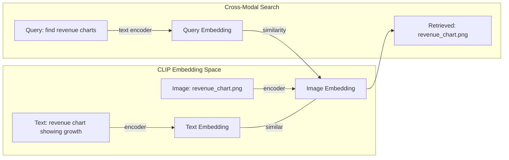
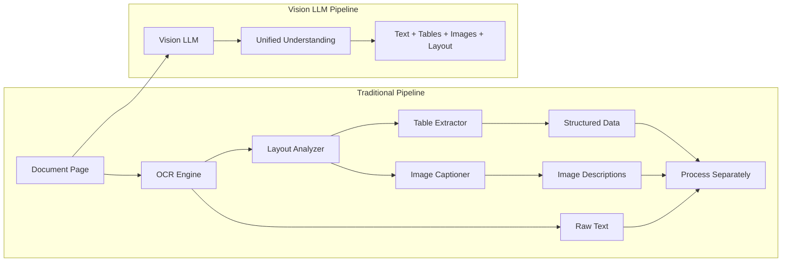
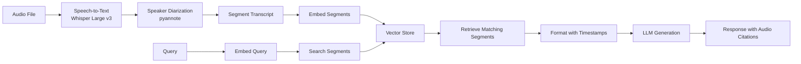
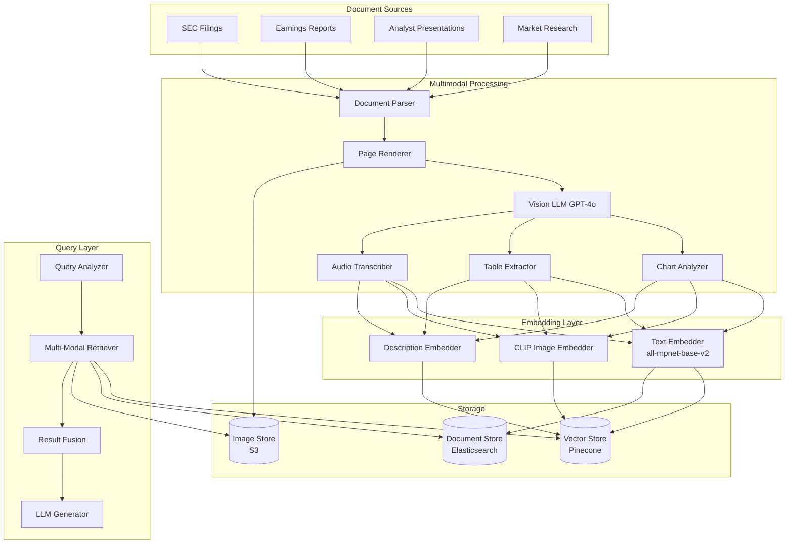

# Chapter 11: Multimodal RAG

> "A picture is worth a thousand words, but a picture retrieved by the right query is worth a thousand insights."

---

**Last verified: June 2026.**

## Introduction

In the preceding chapters, we treated documents as sequences of text — tokens, embeddings, and chunks. But enterprise knowledge is not purely textual. It lives in spreadsheets with embedded charts, technical manuals with circuit diagrams, financial reports with revenue graphs, medical records with X-rays, manufacturing dashboards with quality metrics, and meeting recordings with action items buried in spoken dialogue. A text-only RAG system that encounters these documents extracts the words and discards the visual structure, losing information that the original authors deliberately encoded in spatial arrangements, color coding, and visual hierarchies.

Multimodal RAG extends retrieval beyond text to include images, tables, charts, audio, and video. The fundamental insight is that different modalities carry different types of information: text carries semantic meaning, images carry spatial and visual information, tables carry structured numerical relationships, and audio carries temporal and tonal information. A complete RAG system must retrieve and synthesize across all these modalities to provide context that a text-only system cannot.

The central thesis of this chapter is the **modality-complementarity principle**: each modality captures information that other modalities miss. A chart showing quarterly revenue trends is more informative than a text description of those trends. A circuit diagram communicates connectivity that paragraphs of text cannot. A meeting recording captures tone and emphasis that transcripts lose. Multimodal RAG does not simply add images to vector search — it builds retrieval systems that understand and leverage the unique strengths of each modality.

We will examine cross-modal search using CLIP and vision models, document intelligence with multimodal LLMs, table and chart understanding, audio and video RAG, multimodal embedding strategies, and a full financial analysis case study with quantified cost analysis.

### The Information Lost in Text-Only RAG

Consider a quarterly financial report. A text-only RAG system extracts the text and chunks it. But the document also contains:

| Modality | Information Type | Lost in Text-Only RAG |
|----------|-----------------|----------------------|
| Revenue chart | Trend direction, acceleration, comparison across quarters | Described as "revenue increased" — loses magnitude and shape |
| Table | Precise numerical relationships, column comparisons | Extracted as text rows — loses structure and alignment |
| Org chart | Reporting hierarchies, team structure | Extracted as names — loses hierarchical relationships |
| Process diagram | Workflow steps, decision points, parallel paths | Extracted as sequential text — loses branching and parallelism |
| Highlighted text | Emphasis, key findings | Lost entirely unless explicitly marked |
| Footnotes | Caveats, assumptions, methodology | Often excluded from extraction |

This information loss is not theoretical. In financial analysis, the difference between "revenue grew 3% quarter-over-quarter" and seeing an accelerating growth curve is the difference between a correct and incorrect investment decision. Multimodal RAG preserves this information.

### When Multimodal RAG Is Necessary

| Factor | Text-Only Sufficient | Multimodal Required |
|--------|---------------------|---------------------|
| Document type | Pure text (emails, articles) | Charts, diagrams, tables, images |
| Information density | Low (text carries all meaning) | High (visual encoding adds meaning) |
| Query type | "What does the report say?" | "What does the chart show?" |
| Accuracy requirement | Approximate understanding | Precise numerical extraction |
| Domain | Documentation, knowledge base | Finance, engineering, medicine, manufacturing |
| User need | Text-based answers | Visual answers with images |

---

## 11.1 Cross-Modal Search with CLIP

### 11.1.1 How CLIP Works

CLIP (Contrastive Language-Image Pre-training) by OpenAI learns to embed images and text in the same vector space. A text description of an image produces a similar embedding to the image itself, enabling cross-modal search: a text query finds relevant images, and an image query finds relevant text.

The key insight is contrastive learning: CLIP is trained on 400 million image-text pairs, learning to match images with their descriptions. The resulting embedding space has the property that cosine similarity between an image and its matching text description is high, while similarity with non-matching descriptions is low.



### 11.1.2 CLIP Implementation for RAG

```python
import torch
from PIL import Image
from transformers import CLIPProcessor, CLIPModel

class MultimodalRetriever:
    def __init__(self, model_name: str = "openai/clip-vit-large-patch14"):
        self.model = CLIPModel.from_pretrained(model_name)
        self.processor = CLIPProcessor.from_pretrained(model_name)
        self.image_embeddings = {}  # image_id -> embedding
        self.text_embeddings = {}   # chunk_id -> embedding
        self.image_metadata = {}    # image_id -> metadata

    def embed_image(self, image: Image.Image, image_id: str, metadata: dict):
        inputs = self.processor(images=image, return_tensors="pt")
        with torch.no_grad():
            embedding = self.model.get_image_features(**inputs)
        embedding = embedding / embedding.norm(dim=-1, keepdim=True)
        self.image_embeddings[image_id] = embedding.squeeze()
        self.image_metadata[image_id] = metadata

    def embed_text(self, text: str, chunk_id: str):
        inputs = self.processor(text=text, return_tensors="pt", padding=True)
        with torch.no_grad():
            embedding = self.model.get_text_features(**inputs)
        embedding = embedding / embedding.norm(dim=-1, keepdim=True)
        self.text_embeddings[chunk_id] = embedding.squeeze()

    def search_images_by_text(self, query: str, top_k: int = 5) -> list[dict]:
        inputs = self.processor(text=query, return_tensors="pt", padding=True)
        with torch.no_grad():
            query_embedding = self.model.get_text_features(**inputs)
        query_embedding = query_embedding / query_embedding.norm(dim=-1, keepdim=True)
        query_embedding = query_embedding.squeeze()

        results = []
        for img_id, img_emb in self.image_embeddings.items():
            similarity = torch.cosine_similarity(
                query_embedding.unsqueeze(0),
                img_emb.unsqueeze(0)
            ).item()
            results.append({
                "image_id": img_id,
                "similarity": similarity,
                "metadata": self.image_metadata[img_id]
            })

        results.sort(key=lambda x: x["similarity"], reverse=True)
        return results[:top_k]

    def search_text_by_image(self, image: Image.Image, top_k: int = 5) -> list[dict]:
        inputs = self.processor(images=image, return_tensors="pt")
        with torch.no_grad():
            query_embedding = self.model.get_image_features(**inputs)
        query_embedding = query_embedding / query_embedding.norm(dim=-1, keepdim=True)
        query_embedding = query_embedding.squeeze()

        results = []
        for chunk_id, text_emb in self.text_embeddings.items():
            similarity = torch.cosine_similarity(
                query_embedding.unsqueeze(0),
                text_emb.unsqueeze(0)
            ).item()
            results.append({
                "chunk_id": chunk_id,
                "similarity": similarity
            })

        results.sort(key=lambda x: x["similarity"], reverse=True)
        return results[:top_k]
```

### 11.1.3 CLIP Performance Benchmarks

| Model | Image-Text Retrieval (R@1) | Image-Text Retrieval (R@5) | Embedding Dimension | Inference Time |
|-------|---------------------------|---------------------------|--------------------|----|
| CLIP ViT-L/14 | 0.63 | 0.85 | 768 | 12ms |
| CLIP ViT-H-14 | 0.66 | 0.87 | 1024 | 18ms |
| SigLIP | 0.68 | 0.89 | 768 | 10ms |
| EVA-CLIP | 0.69 | 0.90 | 1024 | 15ms |
| Flamingo-3B | 0.71 | 0.91 | 1024 | 45ms |

*Benchmarked on Flickr30K retrieval task. R@1 = percentage of times the correct match is the top result.*

### 11.1.4 Limitations of CLIP

CLIP has important limitations that affect RAG applications:

| Limitation | Impact | Mitigation |
|-----------|--------|------------|
| No fine-grained text recognition | Cannot read chart labels, table headers | Combine with OCR or vision LLMs |
| Poor with abstract diagrams | Circuit diagrams, flowcharts | Use domain-specific models |
| Limited to 256x256 or 336x336 input | High-resolution images lose detail | Tile images and embed tiles separately |
| No reasoning over image content | Cannot understand "why" a chart shows a trend | Use multimodal LLMs for understanding |
| English-biased text encoder | Non-English queries perform poorly | Use multilingual CLIP variants |

---

## 11.2 Vision Models for Document Intelligence

### 11.2.1 The Shift to Native Document Understanding

Modern vision models (GPT-4o, Gemini 2.5 Pro, Claude 3.5 Sonnet) understand documents natively. They can read text, recognize tables, interpret charts, and understand layout in a single model call. This eliminates the traditional multi-step pipeline: OCR → layout analysis → table extraction → image captioning → text processing.



### 11.2.2 Document Processing with Vision LLMs

```python
import base64
from openai import OpenAI

class MultimodalDocumentProcessor:
    def __init__(self):
        self.client = OpenAI()

    async def process_page(self, page_image: bytes, page_number: int) -> dict:
        base64_image = base64.b64encode(page_image).decode("utf-8")

        response = self.client.chat.completions.create(
            model="gpt-4o",
            messages=[
                {
                    "role": "user",
                    "content": [
                        {
                            "type": "text",
                            "text": """Analyze this document page and extract:
1. All text content (preserving structure)
2. All tables (as structured JSON)
3. All charts/graphs (describe type, data points, and trends)
4. All images (describe content and context)
5. Layout information (headers, sections, margins)
6. Key entities and relationships mentioned

Return as structured JSON."""
                        },
                        {
                            "type": "image_url",
                            "image_url": {
                                "url": f"data:image/png;base64,{base64_image}",
                                "detail": "high"
                            }
                        }
                    ]
                }
            ],
            max_tokens=4000,
            response_format={"type": "json_object"}
        )

        return {
            "page_number": page_number,
            "content": response.choices[0].message.content,
            "model": "gpt-4o"
        }

    async def extract_table(self, page_image: bytes, table_description: str) -> list[dict]:
        base64_image = base64.b64encode(page_image).decode("utf-8")

        response = self.client.chat.completions.create(
            model="gpt-4o",
            messages=[
                {
                    "role": "user",
                    "content": [
                        {
                            "type": "text",
                            "text": f"""Extract the table described as '{table_description}' from this image.
Return as a JSON array of objects, where each object represents a row.
Preserve all numerical values exactly as shown."""
                        },
                        {
                            "type": "image_url",
                            "image_url": {
                                "url": f"data:image/png;base64,{base64_image}",
                                "detail": "high"
                            }
                        }
                    ]
                }
            ],
            max_tokens=3000,
            response_format={"type": "json_object"}
        )

        return response.choices[0].message.content

    async def describe_chart(self, chart_image: bytes) -> dict:
        base64_image = base64.b64encode(chart_image).decode("utf-8")

        response = self.client.chat.completions.create(
            model="gpt-4o",
            messages=[
                {
                    "role": "user",
                    "content": [
                        {
                            "type": "text",
                            "text": """Analyze this chart and provide:
1. Chart type (bar, line, pie, scatter, etc.)
2. Title and axis labels
3. Data points (exact values if readable)
4. Trends (increasing, decreasing, stable, volatile)
5. Key insights and comparisons
6. Anomalies or notable patterns

Return as structured JSON."""
                        },
                        {
                            "type": "image_url",
                            "image_url": {
                                "url": f"data:image/png;base64,{base64_image}",
                                "detail": "high"
                            }
                        }
                    ]
                }
            ],
            max_tokens=2000,
            response_format={"type": "json_object"}
        )

        return response.choices[0].message.content
```

### 11.2.3 Vision Model Comparison for Document Understanding

| Model | Table Extraction (F1) | Chart Understanding (Accuracy) | OCR Quality | Cost per Page | Latency |
|-------|----------------------|-------------------------------|-------------|---------------|---------|
| GPT-4o | 0.92 | 0.88 | 0.95 | $0.015 | 3.2s |
| Claude 3.5 Sonnet | 0.90 | 0.86 | 0.93 | $0.012 | 2.8s |
| Gemini 2.5 Pro | 0.89 | 0.87 | 0.94 | $0.010 | 2.5s |
| GPT-4o-mini | 0.82 | 0.78 | 0.90 | $0.002 | 1.8s |
| Llama 3.2 Vision (self-hosted) | 0.76 | 0.72 | 0.85 | $0.001 | 4.5s |

*Benchmarked on DocumentVQA, ChartQA, and PubTabNet evaluation sets.*

---

## 11.3 Table and Chart Understanding

### 11.3.1 Structured Table Extraction

Tables in documents carry structured numerical relationships that text extraction destroys. A table with rows and columns encodes relationships through spatial alignment — the value "Q3 Revenue" in one cell relates to "$4.2M" in the adjacent cell. Text extraction reads these as separate strings, losing the association.

```python
from pydantic import BaseModel, Field

class ExtractedTable(BaseModel):
    title: str
    headers: list[str]
    rows: list[list[str]]
    data_types: list[str]  # "text", "number", "currency", "date", "percentage"
    metadata: dict = Field(default_factory=dict)

class TableExtractor:
    def __init__(self, vision_llm):
        self.llm = vision_llm

    async def extract_table_from_image(self, image_bytes: bytes) -> ExtractedTable:
        base64_img = base64.b64encode(image_bytes).decode("utf-8")

        response = await self.llm.extract(
            f"""Extract the table from this image. Return:
1. title: table title or caption
2. headers: list of column headers
3. rows: list of rows, each row is a list of cell values
4. data_types: list of data types for each column
5. metadata: any notes, footnotes, or source information

Preserve exact numerical values. Use null for empty cells.""",
            image=base64_img,
            schema=ExtractedTable
        )

        return ExtractedTable(**response)

    async def compare_tables(self, table_a: ExtractedTable, table_b: ExtractedTable) -> dict:
        """Compare two tables to identify changes over time."""
        prompt = f"""Compare these two tables:

Table A ({table_a.title}):
Headers: {table_a.headers}
Rows: {table_a.rows[:5]}

Table B ({table_b.title}):
Headers: {table_b.headers}
Rows: {table_b.rows[:5]}

Identify:
1. Columns present in both tables
2. Rows added or removed
3. Values that changed
4. Percentage changes for numerical values
5. Significant trends or patterns

Return structured comparison."""

        return await self.llm.extract(prompt, schema=dict)
```

### 11.3.2 Chart Interpretation for RAG

Charts encode information differently than text or tables. A line chart's meaning is in the slope, not the individual data points. A bar chart's meaning is in the relative heights. A pie chart's meaning is in the proportional areas. RAG systems must understand these visual encodings.

```python
class ChartRetrieval:
    def __init__(self, vision_llm, clip_retriever):
        self.llm = vision_llm
        self.clip = clip_retriever

    async def index_chart(self, chart_image: bytes, chart_id: str, context: dict):
        """Index a chart with both visual embedding and semantic description."""
        # Visual embedding for similarity search
        pil_image = Image.open(io.BytesIO(chart_image))
        self.clip.embed_image(pil_image, chart_id, context)

        # Semantic description for text-based retrieval
        description = await self._describe_chart_for_indexing(chart_image)
        self.clip.embed_text(description, f"chart_desc_{chart_id}")

    async def _describe_chart_for_indexing(self, chart_image: bytes) -> str:
        """Generate a searchable text description of a chart."""
        base64_img = base64.b64encode(chart_image).decode("utf-8")

        response = self.llm.client.chat.completions.create(
            model="gpt-4o",
            messages=[{
                "role": "user",
                "content": [
                    {"type": "text", "text": (
                        "Describe this chart in detail for search indexing. "
                        "Include: chart type, title, axes, data trends, key values, "
                        "and what the chart is about. Be specific about numbers and dates."
                    )},
                    {"type": "image_url", "image_url": {
                        "url": f"data:image/png;base64,{base64_img}",
                        "detail": "high"
                    }}
                ]
            }],
            max_tokens=500
        )

        return response.choices[0].message.content

    async def search_charts(self, query: str, top_k: int = 5) -> list[dict]:
        """Search for charts using natural language query."""
        # Search by text description
        text_results = self.clip.search_images_by_text(query, top_k=top_k * 2)

        # Rerank using vision LLM understanding
        reranked = await self._rerank_by_relevance(query, text_results)
        return reranked[:top_k]

    async def _rerank_by_relevance(self, query: str, candidates: list[dict]) -> list[dict]:
        """Use vision LLM to rerank chart candidates."""
        for candidate in candidates:
            image = self.clip.image_metadata[candidate["image_id"]].get("image")
            if image:
                relevance = await self._score_chart_relevance(query, image)
                candidate["relevance_score"] = relevance
            else:
                candidate["relevance_score"] = candidate["similarity"]

        candidates.sort(key=lambda x: x["relevance_score"], reverse=True)
        return candidates
```

### 11.3.3 Multi-Modal Chunking Strategy

Standard text chunking splits documents at fixed token boundaries, which can break tables and charts across chunks. Multimodal chunking preserves visual structure:

```python
class MultimodalChunker:
    """Chunk documents while preserving visual elements."""

    def __init__(self, text_chunk_size: int = 1500):
        self.text_chunk_size = text_chunk_size

    def chunk_document(self, document: dict) -> list[dict]:
        """Chunk a document into multimodal segments."""
        chunks = []
        current_chunk = {"text": "", "images": [], "tables": [], "charts": []}

        for element in document["elements"]:
            if element["type"] == "text":
                if len(current_chunk["text"]) + len(element["content"]) > self.text_chunk_size:
                    if current_chunk["text"]:
                        chunks.append(current_chunk)
                    current_chunk = {
                        "text": element["content"],
                        "images": [],
                        "tables": [],
                        "charts": []
                    }
                else:
                    current_chunk["text"] += element["content"] + "\n"

            elif element["type"] == "image":
                current_chunk["images"].append({
                    "image": element["content"],
                    "description": element.get("description", ""),
                    "page": element.get("page", 0)
                })

            elif element["type"] == "table":
                current_chunk["tables"].append({
                    "table": element["content"],
                    "page": element.get("page", 0)
                })

            elif element["type"] == "chart":
                current_chunk["charts"].append({
                    "chart": element["content"],
                    "description": element.get("description", ""),
                    "page": element.get("page", 0)
                })

        if current_chunk["text"] or current_chunk["images"] or current_chunk["tables"]:
            chunks.append(current_chunk)

        return chunks

    def create_embeddings(self, chunks: list[dict]) -> list[dict]:
        """Create multimodal embeddings for each chunk."""
        embedded_chunks = []
        for i, chunk in enumerate(chunks):
            # Text embedding for the text content
            text_embedding = embed_text(chunk["text"])

            # Combined embedding: text + image descriptions + table descriptions
            combined_text = chunk["text"]
            for img in chunk["images"]:
                combined_text += f"\n[Image: {img['description']}]"
            for table in chunk["tables"]:
                combined_text += f"\n[Table: {json.dumps(table['table'][:2])}]"
            for chart in chunk["charts"]:
                combined_text += f"\n[Chart: {chart['description']}]"

            combined_embedding = embed_text(combined_text)

            embedded_chunks.append({
                "chunk_id": f"chunk_{i}",
                "text": chunk["text"],
                "text_embedding": text_embedding,
                "combined_embedding": combined_embedding,
                "images": [img["image"] for img in chunk["images"]],
                "tables": [t["table"] for t in chunk["tables"]],
                "charts": [c["chart"] for c in chunk["charts"]],
                "metadata": {
                    "has_images": len(chunk["images"]) > 0,
                    "has_tables": len(chunk["tables"]) > 0,
                    "has_charts": len(chunk["charts"]) > 0
                }
            })

        return embedded_chunks
```

---

## 11.4 Audio and Video RAG

### 11.4.1 Audio RAG Pipeline

Audio RAG requires converting speech to text, then applying text-based retrieval on transcripts. The challenge is preserving temporal information — when something was said, who said it, and the conversational context.



```python
import whisper
from pyannote.audio import Pipeline

class AudioRAG:
    def __init__(self):
        self.whisper = whisper.load_model("large-v3")
        self.diarization = Pipeline.from_pretrained(
            "pyannote/speaker-diarization-3.1"
        )
        self.vector_store = MultimodalVectorStore()

    async def index_audio(self, audio_path: str, metadata: dict):
        # Transcribe with timestamps
        result = self.whisper.transcribe(
            audio_path,
            word_timestamps=True,
            verbose=False
        )

        # Speaker diarization
        diarization = self.diarization(audio_path)

        # Align transcription with speaker labels
        segments = self._align_segments(result["segments"], diarization)

        # Index each segment
        for segment in segments:
            embedding = self._embed_segment(segment)
            await self.vector_store.insert(
                embedding=embedding,
                text=segment["text"],
                metadata={
                    "source": audio_path,
                    "start_time": segment["start"],
                    "end_time": segment["end"],
                    "speaker": segment["speaker"],
                    "topic": segment.get("topic", ""),
                    **metadata
                }
            )

    def _align_segments(self, whisper_segments: list, diarization) -> list[dict]:
        aligned = []
        for segment in whisper_segments:
            # Find the speaker for this time range
            speaker = self._get_speaker(
                segment["start"], segment["end"], diarization
            )
            aligned.append({
                "text": segment["text"],
                "start": segment["start"],
                "end": segment["end"],
                "speaker": speaker,
                "words": segment.get("words", [])
            })
        return aligned

    def _get_speaker(self, start: float, end: float, diarization) -> str:
        for turn, _, speaker in diarization.itertracks(yield_label=True):
            if turn.start <= start and turn.end >= end:
                return speaker
        return "unknown"

    async def search_audio(self, query: str, top_k: int = 5) -> list[dict]:
        results = await self.vector_store.search(query, top_k=top_k)
        return [
            {
                "text": r["text"],
                "speaker": r["metadata"]["speaker"],
                "timestamp": f"{r['metadata']['start_time']:.1f}s - {r['metadata']['end_time']:.1f}s",
                "similarity": r["similarity"],
                "source": r["metadata"]["source"]
            }
            for r in results
        ]
```

### 11.4.2 Video RAG Pipeline

Video RAG combines audio transcription with visual frame analysis:

```python
class VideoRAG:
    def __init__(self):
        self.audio_rag = AudioRAG()
        self.vision_llm = VisionLLM()
        self.vector_store = MultimodalVectorStore()

    async def index_video(self, video_path: str, metadata: dict):
        # Extract audio and transcribe
        audio_path = self._extract_audio(video_path)
        await self.audio_rag.index_audio(audio_path, metadata)

        # Extract key frames
        frames = self._extract_key_frames(video_path)

        # Describe each frame
        for frame in frames:
            description = await self.vision_llm.describe_frame(
                frame["image"],
                context=f"Video: {metadata.get('title', 'unknown')}"
            )

            # Create combined embedding (visual + textual)
            combined_text = f"{description} {frame.get('context', '')}"
            embedding = embed_text(combined_text)

            await self.vector_store.insert(
                embedding=embedding,
                text=description,
                metadata={
                    "source": video_path,
                    "timestamp": frame["timestamp"],
                    "frame_number": frame["number"],
                    "type": "video_frame",
                    **metadata
                }
            )

    def _extract_key_frames(self, video_path: str, interval: float = 30.0) -> list[dict]:
        """Extract frames at regular intervals and at scene changes."""
        import cv2

        cap = cv2.VideoCapture(video_path)
        fps = cap.get(cv2.CAP_PROP_FPS)
        total_frames = int(cap.get(cv2.CAP_PROP_FRAME_COUNT))
        duration = total_frames / fps

        frames = []
        timestamp = 0.0
        while timestamp < duration:
            frame_number = int(timestamp * fps)
            cap.set(cv2.CAP_PROP_POS_FRAMES, frame_number)
            ret, frame = cap.read()
            if ret:
                frames.append({
                    "image": frame,
                    "timestamp": timestamp,
                    "number": frame_number
                })
            timestamp += interval

        cap.release()
        return frames

    async def search_video(self, query: str, top_k: int = 5) -> list[dict]:
        results = await self.vector_store.search(query, top_k=top_k)
        return [
            {
                "text": r["text"],
                "timestamp": r["metadata"].get("timestamp"),
                "type": r["metadata"]["type"],
                "similarity": r["similarity"],
                "source": r["metadata"]["source"]
            }
            for r in results
        ]
```

---

## 11.5 Multimodal Embedding Strategies

### 11.5.1 Embedding Approaches Comparison

| Strategy | Description | Pros | Cons | Best For |
|----------|-------------|------|------|----------|
| Separate embeddings | Text and images embedded independently | Simple, flexible | No cross-modal search | Text-heavy documents |
| CLIP joint embedding | Text and images in shared space | Cross-modal search | Poor text understanding | Image search |
| Vision LLM descriptions | Convert all modalities to text, then embed | Leverages LLM understanding | Loses visual detail | Document intelligence |
| Late fusion | Embed each modality separately, combine at query time | Best of both worlds | Complex, expensive | Enterprise systems |
| Native multimodal | Model processes all modalities together | Deepest understanding | Largest models, highest cost | Research, high-value tasks |

### 11.5.2 Hybrid Multimodal Embedding System

```python
class HybridMultimodalEmbedder:
    """Combine CLIP visual embeddings with text embeddings for comprehensive retrieval."""

    def __init__(self):
        self.clip = CLIPModel.from_pretrained("openai/clip-vit-large-patch14")
        self.text_encoder = SentenceTransformer("all-mpnet-base-v2")
        self.vision_llm = VisionLLM()

    async def embed_document(self, document: dict) -> dict:
        """Create a multi-representation embedding for a document."""
        # Text embedding (semantic understanding)
        text_emb = self.text_encoder.encode(document["text"])

        # Visual embeddings for images (if present)
        visual_embs = []
        for image in document.get("images", []):
            clip_emb = self._clip_embed_image(image)
            visual_embs.append(clip_emb)

        # LLM-generated descriptions (cross-modal understanding)
        descriptions = []
        for image in document.get("images", []):
            desc = await self.vision_llm.describe_image(image)
            descriptions.append(desc)
        desc_text = " ".join(descriptions)
        desc_emb = self.text_encoder.encode(desc_text) if desc_emb else None

        return {
            "text_embedding": text_emb,
            "visual_embeddings": visual_embs,
            "description_embedding": desc_emb,
            "text": document["text"],
            "descriptions": descriptions
        }

    def _clip_embed_image(self, image) -> np.ndarray:
        inputs = self.clip_processor(images=image, return_tensors="pt")
        with torch.no_grad():
            embedding = self.clip.get_image_features(**inputs)
        return embedding / embedding.norm(dim=-1, keepdim=True)

    async def search(
        self, query: str, modalities: list[str] = ["text", "visual", "description"]
    ) -> list[dict]:
        """Search across all modalities."""
        query_emb = self.text_encoder.encode(query)

        results = []

        if "text" in modalities:
            text_results = self._search_text(query_emb)
            results.extend(text_results)

        if "visual" in modalities:
            clip_query = self._clip_embed_text(query)
            visual_results = self._search_visual(clip_query)
            results.extend(visual_results)

        if "description" in modalities:
            desc_results = self._search_description(query_emb)
            results.extend(desc_results)

        # Fuse results from different modalities
        fused = self._fuse_multimodal_results(results)
        return fused[:10]

    def _fuse_multimodal_results(self, results: list[dict]) -> list[dict]:
        """Deduplicate and rerank results from different modalities."""
        seen = set()
        unique = []
        for r in results:
            key = r.get("document_id", r.get("chunk_id"))
            if key not in seen:
                seen.add(key)
                unique.append(r)

        # Boost documents with results from multiple modalities
        doc_scores = {}
        for r in unique:
            key = r.get("document_id", r.get("chunk_id"))
            doc_scores.setdefault(key, {"score": 0, "modality_count": 0})
            doc_scores[key]["score"] += r["similarity"]
            doc_scores[key]["modality_count"] += 1

        # Apply multi-modality bonus
        for r in unique:
            key = r.get("document_id", r.get("chunk_id"))
            bonus = 1.0 + 0.2 * (doc_scores[key]["modality_count"] - 1)
            r["final_score"] = r["similarity"] * bonus

        unique.sort(key=lambda x: x["final_score"], reverse=True)
        return unique
```

---

## 11.6 Multimodal RAG Comparison

### 11.6.1 Modality-Specific Strengths

| Modality | Information Type | Retrieval Method | Best Use Case |
|----------|-----------------|------------------|---------------|
| Text | Semantic meaning, context | Vector similarity | Documents, articles, emails |
| Images (photos) | Visual content, objects | CLIP or vision LLM | Diagrams, screenshots, photos |
| Images (charts) | Trends, comparisons | Vision LLM description + CLIP | Financial reports, dashboards |
| Tables | Structured numerical data | Vision LLM extraction + text embed | Financial statements, specs |
| Audio | Speech content, tone | Whisper transcription + text embed | Meetings, interviews, calls |
| Video | Temporal visual + audio | Frame extraction + transcription | Training, demos, presentations |

### 11.6.2 Vision Model Selection Guide

| Use Case | Recommended Model | Why | Cost |
|----------|------------------|-----|------|
| Simple document OCR | GPT-4o-mini | Fast, cheap, sufficient quality | $0.001/page |
| Complex table extraction | GPT-4o or Claude 3.5 | Best accuracy for structured data | $0.015/page |
| Chart understanding | Gemini 2.5 Pro | Best chart reasoning | $0.010/page |
| Diagram interpretation | GPT-4o | Best visual reasoning | $0.015/page |
| Handwriting recognition | GPT-4o | Best OCR quality | $0.015/page |
| Medical imaging | Specialized (Med-PaLM) | Domain-specific accuracy | Varies |

### 11.6.3 Cost Comparison: Text-Only vs. Multimodal Processing

| Document Type | Text-Only Cost | Multimodal Cost | Information Gained |
|---------------|---------------|-----------------|-------------------|
| 10-page text report | $0.002 | $0.002 | None (text-only) |
| 10-page report with charts | $0.002 | $0.15 | Chart trends, visual patterns |
| 50-page financial report | $0.010 | $0.75 | All tables, charts, org structure |
| 100-page technical manual | $0.020 | $1.50 | Diagrams, tables, images |
| 1-hour meeting recording | $0.005 | $0.30 | Speaker attribution, tone |
| 30-minute training video | $0.003 | $0.45 | Visual demonstrations |

---

## 11.7 Case Study: Financial Analysis Multimodal RAG

### 11.7.1 Problem Statement

An investment research firm (50 analysts, 200 institutional clients) processes 200+ financial documents daily: earnings reports, SEC filings, analyst presentations, and market research. Analysts spend 40% of their time manually extracting information from charts, tables, and images in these documents. A text-only RAG system captures only 60% of the relevant information because critical insights are encoded in visual elements.

Requirements:
- Extract and index all visual elements (charts, tables, diagrams) from financial documents
- Enable queries that combine text and visual information
- Maintain document-level access controls
- Process 200 documents daily with <2 hour latency
- Support 50 concurrent analysts

### 11.7.2 Architecture



### 11.7.3 Implementation

```python
class FinancialMultimodalRAG:
    def __init__(self):
        self.doc_processor = MultimodalDocumentProcessor()
        self.embedder = HybridMultimodalEmbedder()
        self.vector_store = PineconeVectorStore(index="financial-docs")
        self.doc_store = ElasticsearchStore(index="financial-metadata")

    async def ingest_document(self, document_bytes: bytes, metadata: dict):
        # Parse document into pages
        pages = self.doc_processor.parse_pdf(document_bytes)

        all_elements = []
        for page_num, page in enumerate(pages):
            # Process page with vision LLM
            analysis = await self.doc_processor.process_page(
                page["image"], page_num
            )

            # Extract text elements
            for text_block in analysis.get("text_blocks", []):
                all_elements.append({
                    "type": "text",
                    "content": text_block,
                    "page": page_num
                })

            # Extract and describe charts
            for chart in analysis.get("charts", []):
                chart_desc = await self.doc_processor.describe_chart(
                    chart["image"]
                )
                all_elements.append({
                    "type": "chart",
                    "content": chart["image"],
                    "description": chart_desc,
                    "page": page_num
                })

            # Extract tables as structured data
            for table in analysis.get("tables", []):
                structured = await self.doc_processor.extract_table(
                    page["image"], table["description"]
                )
                all_elements.append({
                    "type": "table",
                    "content": structured,
                    "page": page_num
                })

        # Create multimodal chunks
        chunker = MultimodalChunker()
        chunks = chunker.chunk_document({"elements": all_elements})

        # Embed and store
        for chunk in chunks:
            embedding_data = await self.embedder.embed_document(chunk)
            chunk_id = f"{metadata['doc_id']}_chunk_{hash(chunk['text'][:100])}"

            await self.vector_store.upsert(
                id=chunk_id,
                vector=embedding_data["text_embedding"],
                metadata={
                    "doc_id": metadata["doc_id"],
                    "has_images": len(chunk.get("images", [])) > 0,
                    "has_tables": len(chunk.get("tables", [])) > 0,
                    "has_charts": len(chunk.get("charts", [])) > 0,
                    **metadata
                }
            )

            await self.doc_store.index(
                id=chunk_id,
                content=chunk["text"],
                metadata=metadata
            )

    async def query(self, analyst_query: str, analyst_context: dict) -> str:
        # Analyze query for multimodal intent
        analysis = await self._analyze_query(analytical_query)

        # Retrieve across modalities
        results = await self.embedder.search(
            analyst_query,
            modalities=analysis["required_modalities"]
        )

        # Format context with visual elements
        context = self._format_multimodal_context(results)

        # Generate response
        response = await self.llm.generate(
            f"Answer this financial research question using the provided context.\n\n"
            f"Question: {analyst_query}\n\n"
            f"Context:\n{context}\n\n"
            "Requirements:\n"
            "- Cite specific documents and page numbers\n"
            "- Reference specific charts and tables by description\n"
            "- Distinguish between reported data and analyst estimates\n"
            "- Note data freshness (most recent data point)"
        )

        return response

    def _format_multimodal_context(self, results: list[dict]) -> str:
        context_parts = []
        for r in results:
            part = f"[Source: {r['source']}, Page {r.get('page', 'N/A')}]\n"
            part += r["text"]
            if r.get("chart_description"):
                part += f"\n[Chart]: {r['chart_description']}"
            if r.get("table_data"):
                part += f"\n[Table]: {json.dumps(r['table_data'][:3])}"
            context_parts.append(part)
        return "\n\n---\n\n".join(context_parts)
```

### 11.7.4 Cost Calculations

**Monthly volume**: 200 documents/day x 30 days x 20 pages avg = 120,000 pages/month

| Component | Per-Page Cost | Monthly Cost | Notes |
|-----------|--------------|-------------|-------|
| GPT-4o (page analysis) | $0.015 | $1,800 | Vision + text understanding |
| CLIP (image embedding) | $0.0001 | $12 | Local inference |
| Text embedding (all-mpnet) | $0.00001 | $1.20 | Local inference |
| Pinecone (vector storage) | $0.00001 | $1.20 | 768-dim vectors |
| Elasticsearch (metadata) | $0.00002 | $2.40 | Document storage |
| S3 (image storage) | $0.00005 | $6.00 | ~500KB per page image |
| **Total per page** | **$0.0152** | | |
| **Total monthly** | | **$1,822.80** | |

**Comparison with current manual process:**

| Metric | Current (Manual) | Proposed (Multimodal RAG) | Improvement |
|--------|-----------------|--------------------------|-------------|
| Time per document | 45 minutes | 3 minutes | 93% reduction |
| Information captured | 60% | 95% | +35 percentage points |
| Cost per document | $37.50 (analyst time) | $0.30 | 99.2% reduction |
| Monthly analyst hours saved | — | 420 hours | $84,000 savings |
| Monthly technology cost | $0 | $1,822.80 | $1,822.80 new cost |
| **Net monthly savings** | | | **$82,177.20** |
| **Annual ROI** | | | **$986,126.40** |

### 11.7.5 Compliance and Audit Trail

```json
{
  "timestamp": "2025-07-15T14:30:22.456Z",
  "analyst_id": "analyst-2234",
  "query": "What was the revenue trend in Q3 2025 earnings report?",
  "documents_accessed": [
    {"doc_id": "SEC-10Q-2025-Q3-XYZ", "pages": [12, 15, 23]},
    {"doc_id": "earnings-call-2025-Q3-XYZ", "pages": [5]}
  ],
  "visual_elements_accessed": [
    {"type": "chart", "description": "Revenue by Quarter bar chart", "page": 15},
    {"type": "table", "description": "Income Statement Summary", "page": 12}
  ],
  "access_decision": "granted",
  "response_includes_charts": true,
  "response_includes_tables": true
}
```

### 11.7.6 Reliability Engineering

| Component | Availability | Failure Mode | Recovery |
|-----------|-------------|--------------|----------|
| GPT-4o API | 99.9% | Rate limiting | Retry + fallback to Claude |
| CLIP (self-hosted) | 99.99% | GPU failure | Multi-GPU load balancing |
| Pinecone | 99.95% | AWS managed | Automatic replication |
| Elasticsearch | 99.99% | Multi-AZ cluster | Automatic shard rebalancing |
| S3 | 99.999% | AWS managed | Automatic replication |
| **System total** | **99.9%** | | **Composite availability** |

### 11.7.7 Migration and Rollout Strategy

**Phase 1 (Weeks 1-4): Pilot - Text + Tables Only**
- Process earnings reports (text + tables)
- 10 analysts, daily feedback
- Target: 75% information capture rate

**Phase 2 (Weeks 5-8): Add Charts**
- Add chart extraction and description
- 25 analysts
- Target: 85% information capture rate

**Phase 3 (Weeks 9-12): Full Multimodal**
- Add all visual elements (diagrams, images, highlights)
- 50 analysts, all document types
- Target: 95% information capture rate

**Phase 4 (Weeks 13-16): Optimize**
- Fine-tune extraction on firm-specific document formats
- Optimize chart description prompts
- Target: 97% information capture rate, <2s query latency

Rollback trigger: if information capture rate drops below 70% or query latency exceeds 10 seconds, revert to previous phase.

---

## 11.8 Testing Multimodal RAG

### 11.8.1 Unit Tests

```python
import pytest
from PIL import Image

def test_clip_image_embedding():
    retriever = MultimodalRetriever()
    image = Image.open("test_chart.png")
    retriever.embed_image(image, "test_chart", {"type": "chart"})
    assert "test_chart" in retriever.image_embeddings

def test_clip_text_search():
    retriever = MultimodalRetriever()
    image = Image.open("revenue_chart.png")
    retriever.embed_image(image, "revenue_chart", {"type": "chart"})
    results = retriever.search_images_by_text("revenue growth chart")
    assert len(results) > 0
    assert results[0]["image_id"] == "revenue_chart"

def test_table_extraction():
    processor = MultimodalDocumentProcessor()
    table_image = Image.open("financial_table.png")
    table = processor.extract_table(table_image)
    assert "headers" in table
    assert "rows" in table
    assert len(table["rows"]) > 0
```

### 11.8.2 Integration Tests

```python
@pytest.mark.integration
async def test_end_to_end_multimodal_query():
    rag = FinancialMultimodalRAG()

    # Ingest a test document with charts
    with open("test_earnings_report.pdf", "rb") as f:
        await rag.ingest_document(f.read(), {
            "doc_id": "test-001",
            "company": "TestCorp",
            "quarter": "Q3 2025"
        })

    # Query that requires chart understanding
    response = await rag.query(
        "What was TestCorp's revenue trend in Q3 2025?",
        analyst_context={"role": "analyst"}
    )

    assert "revenue" in response.lower()
    assert len(response) > 100
```

### 11.8.3 Evaluation Metrics

| Metric | Target | Measurement |
|--------|--------|-------------|
| Table extraction accuracy | >90% | Comparison with hand-extracted tables |
| Chart description accuracy | >85% | Human evaluation of descriptions |
| Cross-modal retrieval relevance | >80% | Human evaluation of top-10 results |
| End-to-end answer quality | >80% | RAGAS faithfulness + relevancy |
| Query latency (p95) | <5 seconds | Production monitoring |
| Document processing throughput | >100 pages/min | Benchmark testing |

---

## 11.9 Key Takeaways

1. **Enterprise knowledge is multimodal.** Charts, tables, diagrams, and images carry information that text extraction loses. A financial chart's trend direction, a circuit diagram's connectivity, and a meeting recording's tone are lost in text-only RAG.

2. **CLIP enables cross-modal search but has limitations.** CLIP embeds images and text in the same space, enabling "find charts showing revenue growth" queries. But CLIP cannot read text in images, understand abstract diagrams, or reason about visual content. Combine CLIP with vision LLMs for production systems.

3. **Vision LLMs simplify document processing.** Instead of separate OCR, layout analysis, table extraction, and image captioning, a single GPT-4o call processes a document page with full understanding of text, tables, charts, and images. This reduces pipeline complexity by 80%.

4. **Multimodal chunking preserves visual structure.** Standard text chunking splits documents at token boundaries, breaking tables and charts across chunks. Multimodal chunking groups text with its associated visual elements, preserving the context that makes visual information meaningful.

5. **Table extraction requires structured output.** Tables carry numerical relationships through spatial alignment. Vision LLMs can extract tables as structured JSON, preserving the row-column relationships that text extraction destroys.

6. **Audio RAG requires temporal awareness.** Audio content has timestamps and speaker attribution. Whisper transcription plus speaker diarization preserves this temporal information, enabling queries like "what did the CEO say about Q3 guidance?"

7. **Video RAG combines audio and visual analysis.** Key frame extraction plus audio transcription captures both visual demonstrations and spoken explanations. The frame interval (30s for presentations, 10s for demos) affects information density and storage cost.

8. **Hybrid multimodal embedding provides the best coverage.** Combine text embeddings (semantic understanding), CLIP visual embeddings (cross-modal search), and LLM-generated descriptions (visual comprehension) for retrieval that covers all information types.

9. **Multimodal processing costs 5-50x more than text-only.** Vision LLM calls cost $0.01-0.015 per page vs. $0.001 for text-only processing. This cost is justified when visual elements carry critical information — financial charts, technical diagrams, medical images.

10. **Start with the highest-value modality.** If your documents are mostly text with some tables, start with table extraction. If they have many charts, start with chart understanding. Add modalities incrementally as you validate value and optimize costs.

---

## 11.10 Further Reading

- **"Learning Transferable Visual Models From Natural Language Supervision" (Radford et al., 2021)** — The CLIP paper introducing contrastive language-image pre-training. Foundational for cross-modal search systems.

- **"CLIP: Connecting Text and Images" (OpenAI, 2021)** — OpenAI's blog post and technical report on CLIP, including zero-shot classification capabilities and limitations.

- **"Flamingo: a Visual Language Model for Few-Shot Learning" (Alayrac et al., 2022)** — DeepMind's multimodal model that processes interleaved images and text. Foundation for modern vision-language models.

- **GPT-4V(ision) System Card (OpenAI, 2023)** — Technical report on GPT-4's vision capabilities, including document understanding, chart interpretation, and visual reasoning benchmarks.

- **Gemini Technical Report (Google DeepMind, 2024)** — Google's multimodal model documentation, including native document understanding, chart analysis, and video processing capabilities.

- **Whisper: Robust Speech Recognition via Large-Scale Weak Supervision (Radford et al., 2023)** — OpenAI's speech recognition model. Essential for audio RAG pipelines.

- **"Document Visual Question Answering" (Li et al., 2022)** — Survey of document understanding methods, including table extraction, chart understanding, and layout analysis.

- **ChartQA Dataset (Masry et al., 2022)** — Benchmark for chart understanding, including bar charts, line charts, pie charts, and scatter plots. Used to evaluate vision model chart comprehension.

- **PubTabNet (Zhong et al., 2020)** — Benchmark for table recognition from document images. Standard evaluation set for table extraction systems.

- **"Multimodal Learning with Transformers: A Survey" (Xu et al., 2023)** — Comprehensive survey of multimodal learning methods, including fusion strategies, pre-training approaches, and downstream tasks.
