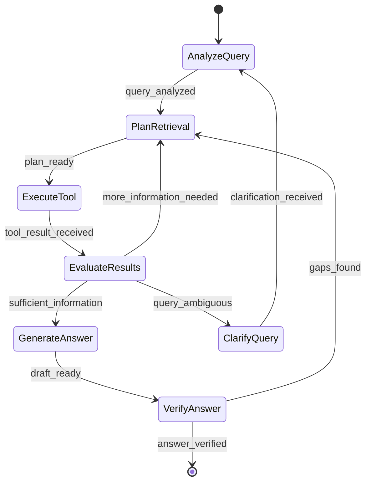
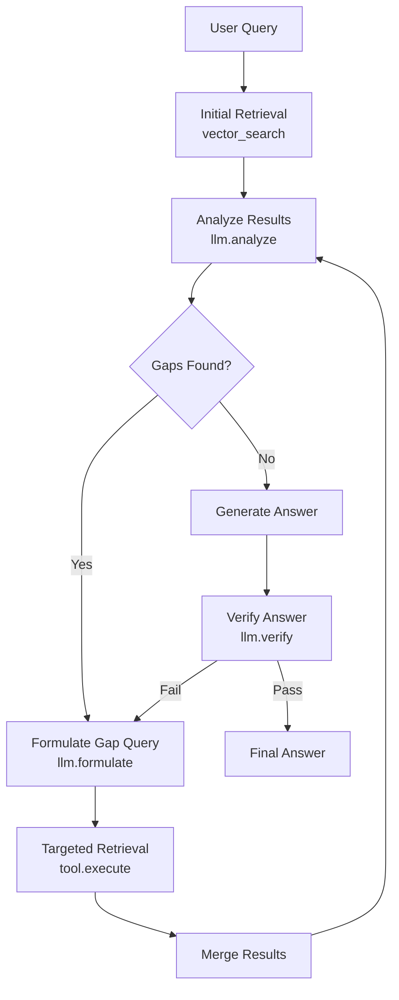
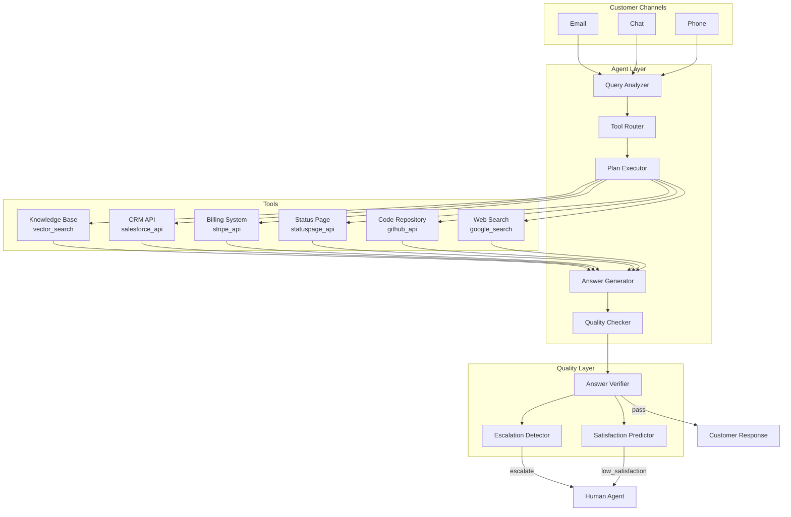

# Chapter 12: Agentic RAG

> "The best retrieval system is not the one that finds the most documents — it is the one that knows when to stop searching and start thinking."

---

**Last verified: June 2026.**

## Introduction

In the preceding chapters, we built RAG systems that follow fixed pipelines: embed the query, retrieve documents, rerank, generate. These static pipelines work well for straightforward queries — "What is our return policy?" retrieves the policy document and generates an answer. But real-world enterprise queries are not always straightforward. "Compare our Q3 revenue performance against the three competitors mentioned in the analyst report, accounting for the currency adjustment noted in the footnote" requires decomposing the query into sub-queries, retrieving from multiple sources, cross-referencing results, identifying missing information, and iterating until the answer is complete.

Agentic RAG replaces static retrieval pipelines with intelligent agents that decide when, how, and what to retrieve. Instead of always running the same retrieval process, an agent analyzes the query complexity, plans a retrieval strategy, executes it, evaluates the results, and iterates if needed. The agent has access to multiple tools — vector search, graph traversal, web search, database queries, API calls — and decides which tools to use based on the query requirements.

The central thesis of this chapter is the **adaptive-retrieval principle**: the optimal retrieval strategy is a function of query complexity. Simple queries benefit from fast, direct retrieval. Complex queries require multi-step reasoning with iterative retrieval. Ambiguous queries need clarification before retrieval. The agent's role is to classify query complexity and dispatch to the appropriate strategy, optimizing the cost-quality-latency trade-off for each query.

We will examine the agent architecture for RAG, query planning and decomposition, multi-step retrieval patterns, tool-based retrieval, self-reflective retrieval, and a full customer support case study with quantified cost analysis.

### When Static Pipelines Fail

Static RAG pipelines fail in predictable ways:

| Query Pattern | Failure Mode | Example |
|---------------|-------------|---------|
| Ambiguous scope | Retrieves irrelevant documents | "Tell me about the policy" — which policy? |
| Multi-hop reasoning | Retrieves only first-hop results | "What is the impact of Policy X on Department Y?" |
| Cross-source information | Misses information in other sources | Answer requires both HR handbook and engineering wiki |
| Temporal queries | Retrieves outdated information | "What is the current pricing?" — pricing changed last month |
| Comparative analysis | Cannot synthesize across documents | "Compare our approach to competitors' approaches" |
| Quantitative reasoning | Cannot aggregate across sources | "What is the total budget across all projects?" |

Agentic RAG handles these cases by adapting its strategy to the query. The cost is additional LLM calls for planning and evaluation, higher latency (5-20 seconds versus 1-3 seconds), and higher token consumption (5-20x more tokens per query).

### The Agentic RAG Decision Framework

| Query Characteristic | Static RAG | Agentic RAG | Decision Rule |
|---------------------|-----------|-------------|---------------|
| Single-topic, factual | Yes | Overkill | Use static |
| Multi-hop required | Fails | Yes | Use agentic |
| Ambiguous scope | Fails | Yes (clarification) | Use agentic |
| Cross-source needed | Fails | Yes (multi-tool) | Use agentic |
| Time-sensitive | Risky | Yes (web search) | Use agentic |
| Comparative analysis | Fails | Yes (parallel retrieval) | Use agentic |
| High-stakes / regulated | Risky | Yes (verification) | Use agentic |
| Simple FAQ | Yes | Overkill | Use static |

---

## 12.1 Agent Architecture for RAG

### 12.1.1 The ReAct Agent Pattern

The most common agent pattern for RAG is ReAct (Reasoning + Acting): the agent reasons about what it needs, takes an action (tool call), observes the result, and decides the next step. This loop continues until the agent has enough information to generate a final answer.



### 12.1.2 Agent State Management

```python
from pydantic import BaseModel, Field
from typing import Literal
from enum import Enum

class RetrievalStrategy(Enum):
    DIRECT = "direct"              # Single retrieval, simple query
    MULTI_STEP = "multi_step"      # Iterative retrieval with gap analysis
    PARALLEL = "parallel"          # Multiple tools simultaneously
    CLARIFICATION = "clarification" # Need user clarification first
    DECOMPOSITION = "decomposition" # Break into sub-queries

class AgentState(BaseModel):
    original_query: str
    strategy: RetrievalStrategy
    sub_queries: list[str] = Field(default_factory=list)
    current_step: int = 0
    max_steps: int = 5
    retrieved_context: list[dict] = Field(default_factory=list)
    gaps_identified: list[str] = Field(default_factory=list)
    tools_used: list[str] = Field(default_factory=list)
    total_tokens: int = 0
    total_cost: float = 0.0
    is_complete: bool = False

class RAGAgent:
    def __init__(self, tools: dict, llm, max_steps: int = 5):
        self.tools = tools
        self.llm = llm
        self.max_steps = max_steps

    async def run(self, query: str) -> dict:
        state = AgentState(
            original_query=query,
            strategy=RetrievalStrategy.DIRECT,
            max_steps=self.max_steps
        )

        while not state.is_complete:
            # Step 1: Analyze current state
            analysis = await self._analyze_state(state)

            # Step 2: Decide action
            action = await self._decide_action(analysis, state)

            # Step 3: Execute action
            result = await self._execute_action(action, state)

            # Step 4: Update state
            state = self._update_state(state, result)

            # Step 5: Check completion
            if self._should_complete(state):
                state.is_complete = True

        # Generate final answer
        answer = await self._generate_answer(state)
        return {
            "answer": answer,
            "state": state,
            "retrieved_context": state.retrieved_context,
            "tools_used": state.tools_used,
            "total_cost": state.total_cost
        }

    async def _analyze_state(self, state: AgentState) -> dict:
        prompt = f"""Analyze the current state of this RAG retrieval process.

Original query: {state.original_query}
Current step: {state.current_step}/{state.max_steps}
Strategy: {state.strategy.value}
Retrieved so far: {len(state.retrieved_context)} documents
Gaps identified: {state.gaps_identified}

Determine:
1. Do we have enough information to answer the query?
2. What information is missing?
3. Which tool should we use next?
4. Are we making progress toward the answer?

Return JSON."""

        return await self.llm.extract(prompt, schema=dict)

    async def _decide_action(self, analysis: dict, state: AgentState) -> dict:
        if state.current_step >= state.max_steps:
            return {"action": "generate_answer", "reason": "max_steps_reached"}

        if not analysis.get("has_sufficient_info", False):
            gaps = analysis.get("missing_info", [])
            best_tool = analysis.get("recommended_tool", "vector_search")
            return {
                "action": "retrieve",
                "tool": best_tool,
                "query": self._formulate_retrieval_query(state, gaps),
                "reason": analysis.get("reason", "more_information_needed")
            }

        return {"action": "generate_answer", "reason": "sufficient_information"}

    async def _execute_action(self, action: dict, state: AgentState) -> dict:
        if action["action"] == "generate_answer":
            return {"type": "complete", "reason": action["reason"]}

        if action["action"] == "retrieve":
            tool = self.tools[action["tool"]]
            result = await tool.execute(action["query"])

            state.tools_used.append(action["tool"])
            state.total_tokens += result.get("tokens_used", 0)
            state.total_cost += result.get("cost", 0.0)

            return {
                "type": "retrieval_result",
                "tool": action["tool"],
                "results": result["documents"],
                "query": action["query"]
            }

        return {"type": "unknown"}

    def _update_state(self, state: AgentState, result: dict) -> AgentState:
        if result["type"] == "retrieval_result":
            state.retrieved_context.extend(result["results"])
            state.current_step += 1

            # Analyze gaps
            new_gaps = self._identify_gaps(state)
            state.gaps_identified = new_gaps

        return state

    def _should_complete(self, state: AgentState) -> bool:
        if state.current_step >= state.max_steps:
            return True
        if not state.gaps_identified and len(state.retrieved_context) >= 3:
            return True
        return False

    def _identify_gaps(self, state: AgentState) -> list[str]:
        """Identify what information is still missing."""
        prompt = f"""Given this query: {state.original_query}
And the information retrieved so far: {json.dumps([r['content'][:200] for r in state.retrieved_context])}

What key information is still missing to fully answer the query?
Return a list of specific information gaps."""

        gaps = self.llm.extract(prompt, schema=list)
        return gaps
```

### 12.1.3 Tool Definitions for Agentic RAG

```python
from abc import ABC, abstractmethod

class RAGTool(ABC):
    @abstractmethod
    async def execute(self, query: str) -> dict:
        pass

    @abstractmethod
    def describe(self) -> str:
        pass

class VectorSearchTool(RAGTool):
    def __init__(self, vector_store):
        self.store = vector_store

    async def execute(self, query: str) -> dict:
        results = await self.store.search(query, top_k=10)
        return {
            "documents": [
                {"content": r["content"], "source": r["source"],
                 "score": r["similarity"], "tool": "vector_search"}
                for r in results
            ],
            "tokens_used": 0,
            "cost": 0.0002
        }

    def describe(self) -> str:
        return "Vector search: finds semantically similar documents from the knowledge base"

class WebSearchTool(RAGTool):
    def __init__(self, search_api):
        self.api = search_api

    async def execute(self, query: str) -> dict:
        results = await self.api.search(query, num_results=5)
        return {
            "documents": [
                {"content": r["snippet"], "source": r["url"],
                 "score": r.get("relevance", 0.5), "tool": "web_search"}
                for r in results
            ],
            "tokens_used": 0,
            "cost": 0.001
        }

    def describe(self) -> str:
        return "Web search: finds current information from the internet"

class DatabaseQueryTool(RAGTool):
    def __init__(self, db_connection):
        self.db = db_connection

    async def execute(self, query: str) -> dict:
        # Use LLM to convert natural language to SQL
        sql = await self._nl_to_sql(query)
        results = await self.db.execute(sql)
        return {
            "documents": [
                {"content": json.dumps(row), "source": "database",
                 "score": 1.0, "tool": "database_query"}
                for row in results
            ],
            "tokens_used": 200,
            "cost": 0.001
        }

    async def _nl_to_sql(self, query: str) -> str:
        schema = await self.db.get_schema()
        return await self.llm.extract(
            f"Convert this natural language query to SQL.\nQuery: {query}\nSchema: {schema}",
            schema=str
        )

    def describe(self) -> str:
        return "Database query: retrieves structured data from SQL databases"

class GraphTraversalTool(RAGTool):
    def __init__(self, graph_db):
        self.graph = graph_db

    async def execute(self, query: str) -> dict:
        cypher = await self._nl_to_cypher(query)
        results = await self.graph.run(cypher)
        return {
            "documents": [
                {"content": json.dumps(r), "source": "knowledge_graph",
                 "score": 0.8, "tool": "graph_traversal"}
                for r in results
            ],
            "tokens_used": 150,
            "cost": 0.0001
        }

    def describe(self) -> str:
        return "Knowledge graph traversal: finds entities and relationships"

class APICallTool(RAGTool):
    def __init__(self, api_client):
        self.client = api_client

    async def execute(self, query: str) -> dict:
        endpoint, params = await self._determine_endpoint(query)
        results = await self.client.call(endpoint, params)
        return {
            "documents": [
                {"content": json.dumps(results), "source": f"api:{endpoint}",
                 "score": 1.0, "tool": "api_call"}
            ],
            "tokens_used": 100,
            "cost": 0.0005
        }

    def describe(self) -> str:
        return "API call: retrieves data from external systems and services"
```

---

## 12.2 Query Planning and Decomposition

### 12.2.1 Query Complexity Classification

The first step in agentic RAG is classifying query complexity to determine the retrieval strategy:

```python
class QueryComplexityClassifier:
    def __init__(self, llm):
        self.llm = llm

    async def classify(self, query: str) -> dict:
        prompt = f"""Classify this query's retrieval complexity.

Query: {query}

Determine:
1. complexity: "simple", "moderate", "complex", or "ambiguous"
2. reasoning_type: "factual", "comparative", "analytical", "temporal", "multi_hop"
3. required_sources: estimated number of different sources needed
4. estimated_hops: number of retrieval steps needed (1-5)
5. needs_clarification: whether the query is too vague to answer
6. time_sensitivity: "none", "recent", "real_time"

Return JSON."""

        return await self.llm.extract(prompt, schema=ComplexityAssessment)

COMPLEXITY_ROUTING = {
    "simple": RetrievalStrategy.DIRECT,
    "moderate": RetrievalStrategy.MULTI_STEP,
    "complex": RetrievalStrategy.DECOMPOSITION,
    "ambiguous": RetrievalStrategy.CLARIFICATION,
}
```

### 12.2.2 Query Decomposition

Complex queries are decomposed into sub-queries that each target a specific piece of information:

```python
class QueryDecomposer:
    def __init__(self, llm):
        self.llm = llm

    async def decompose(self, query: str, context: dict = None) -> list[dict]:
        prompt = f"""Decompose this query into sub-queries that can be answered independently.

Original query: {query}
Available context: {context or 'None'}

For each sub-query, provide:
1. sub_query: the specific question to answer
2. tool: recommended tool (vector_search, web_search, database_query, graph_traversal, api_call)
3. dependencies: list of sub-query indices this depends on (empty if independent)
4. priority: execution order (1 = first)
5. expected_answer_type: "text", "number", "list", "boolean"

Return JSON array of sub-queries."""

        return await self.llm.extract(prompt, schema=list)

    async def decompose_comparative(self, query: str) -> list[dict]:
        """Specialized decomposition for comparison queries."""
        prompt = f"""This is a comparison query. Break it into individual information retrieval tasks.

Query: {query}

For each comparison dimension:
1. dimension: what is being compared
2. entities: what entities are being compared
3. sub_queries: specific queries for each entity
4. synthesis: how to combine results for comparison

Return JSON."""

        return await self.llm.extract(prompt, schema=list)
```

### 12.2.3 Adaptive Retrieval Strategies

```python
class AdaptiveRetriever:
    def __init__(self, tools: dict, llm):
        self.tools = tools
        self.llm = llm
        self.classifier = QueryComplexityClassifier(llm)
        self.decomposer = QueryDecomposer(llm)

    async def retrieve(self, query: str) -> dict:
        # Classify query complexity
        complexity = await self.classifier.classify(query)

        # Route to appropriate strategy
        strategy = COMPLEXITY_ROUTING.get(complexity["complexity"],
                                           RetrievalStrategy.MULTI_STEP)

        if strategy == RetrievalStrategy.DIRECT:
            return await self._direct_retrieval(query)
        elif strategy == RetrievalStrategy.MULTI_STEP:
            return await self._multi_step_retrieval(query, complexity)
        elif strategy == RetrievalStrategy.DECOMPOSITION:
            return await self._decomposed_retrieval(query, complexity)
        elif strategy == RetrievalStrategy.CLARIFICATION:
            return await self._clarification_needed(query, complexity)

    async def _direct_retrieval(self, query: str) -> dict:
        """Simple single-step retrieval for straightforward queries."""
        results = await self.tools["vector_search"].execute(query)
        return {
            "strategy": "direct",
            "documents": results["documents"][:5],
            "sub_queries": [query],
            "total_cost": results["cost"]
        }

    async def _multi_step_retrieval(self, query: str, complexity: dict) -> dict:
        """Iterative retrieval with gap analysis."""
        all_results = []
        current_query = query
        step = 0
        max_steps = min(complexity["estimated_hops"], 5)

        while step < max_steps:
            # Retrieve
            results = await self.tools["vector_search"].execute(current_query)
            all_results.extend(results["documents"])

            # Analyze gaps
            gaps = await self._analyze_gaps(query, all_results)

            if not gaps:
                break

            # Formulate next query based on gaps
            current_query = await self._formulate_gap_query(query, gaps)
            step += 1

        return {
            "strategy": "multi_step",
            "documents": all_results,
            "steps": step,
            "total_cost": sum(r.get("cost", 0) for r in [results])
        }

    async def _decomposed_retrieval(self, query: str, complexity: dict) -> dict:
        """Decompose into sub-queries and execute in parallel."""
        sub_queries = await self.decomposer.decompose(query, complexity)

        # Execute independent sub-queries in parallel
        independent = [sq for sq in sub_queries if not sq.get("dependencies")]
        dependent = [sq for sq in sub_queries if sq.get("dependencies")]

        # Execute independent queries concurrently
        import asyncio
        independent_results = await asyncio.gather(*[
            self.tools[sq["tool"]].execute(sq["sub_query"])
            for sq in independent
        ])

        all_results = []
        for results in independent_results:
            all_results.extend(results["documents"])

        # Execute dependent queries (sequential, using prior results)
        for sq in dependent:
            context = self._gather_dependency_context(sq, all_results)
            results = await self.tools[sq["tool"]].execute(
                f"{sq['sub_query']}\n\nContext from related queries: {context}"
            )
            all_results.extend(results["documents"])

        return {
            "strategy": "decomposition",
            "documents": all_results,
            "sub_queries": [sq["sub_query"] for sq in sub_queries],
            "total_cost": sum(r.get("cost", 0) for r in independent_results)
        }

    async def _analyze_gaps(self, original_query: str, retrieved: list[dict]) -> list[str]:
        prompt = f"""Original query: {original_query}
Retrieved information: {[r['content'][:200] for r in retrieved[:5]]}

What specific information is still missing to fully answer the original query?
Return a list of specific gaps (empty list if none)."""

        return await self.llm.extract(prompt, schema=list)

    async def _formulate_gap_query(self, original_query: str, gaps: list[str]) -> str:
        prompt = f"""Formulate a search query to find this missing information:
Gaps: {gaps}
Original query context: {original_query}

Return a single effective search query."""

        return await self.llm.extract(prompt, schema=str)
```

---

## 12.3 Multi-Step Retrieval Patterns

### 12.3.1 The Retrieve-Analyze-Retrieve Pattern

The most common agentic RAG pattern: initial retrieval, gap analysis, targeted retrieval:



```python
class RetrieveAnalyzeRetrieve:
    def __init__(self, tools: dict, llm):
        self.tools = tools
        self.llm = llm

    async def execute(self, query: str) -> dict:
        all_documents = []
        all_queries = [query]
        step = 0
        max_steps = 4

        while step < max_steps:
            # Retrieve
            current_query = all_queries[-1]
            results = await self.tools["vector_search"].execute(current_query)
            all_documents.extend(results["documents"])

            # Analyze
            analysis = await self._analyze_results(query, all_documents)

            if analysis["is_sufficient"]:
                break

            # Formulate gap query
            gap_query = await self._formulate_gap_query(
                query, analysis["gaps"], all_queries
            )
            all_queries.append(gap_query)
            step += 1

        return {
            "documents": all_documents,
            "queries_used": all_queries,
            "steps": step
        }

    async def _analyze_results(self, query: str, documents: list[dict]) -> dict:
        prompt = f"""Analyze whether the retrieved documents sufficiently answer this query.

Query: {query}
Retrieved documents ({len(documents)} total):
{[d['content'][:300] for d in documents[:5]]}

Determine:
1. is_sufficient: can we fully answer the query with this information?
2. gaps: list of specific information gaps
3. confidence: how confident are we (0.0-1.0)
4. next_action: "answer" or "retrieve_more"

Return JSON."""

        return await self.llm.extract(prompt, schema=dict)

    async def _formulate_gap_query(
        self, original_query: str, gaps: list[str], previous_queries: list[str]
    ) -> str:
        prompt = f"""Formulate a targeted search query to fill these information gaps.

Original query: {original_query}
Gaps: {gaps}
Previous queries (to avoid repetition): {previous_queries}

Create a query that targets the specific missing information.
Return just the query string."""

        return await self.llm.extract(prompt, schema=str)
```

### 12.3.2 The Parallel Multi-Tool Pattern

When a query requires information from multiple sources, execute tools in parallel:

```python
import asyncio

class ParallelMultiToolRetriever:
    def __init__(self, tools: dict, llm):
        self.tools = tools
        self.llm = llm

    async def retrieve(self, query: str) -> dict:
        # Analyze which tools are needed
        tool_plan = await self._plan_tools(query)

        # Execute tools in parallel
        tasks = []
        for tool_call in tool_plan:
            tool = self.tools[tool_call["tool"]]
            tasks.append(tool.execute(tool_call["query"]))

        results = await asyncio.gather(*tasks, return_exceptions=True)

        # Collect successful results
        all_documents = []
        tools_used = []
        for i, result in enumerate(results):
            if isinstance(result, Exception):
                continue
            all_documents.extend(result["documents"])
            tools_used.append(tool_plan[i]["tool"])

        return {
            "documents": all_documents,
            "tools_used": tools_used,
            "tool_plan": tool_plan
        }

    async def _plan_tools(self, query: str) -> list[dict]:
        prompt = f"""Determine which tools are needed to answer this query.

Query: {query}

Available tools:
- vector_search: semantic document search
- web_search: current internet information
- database_query: structured data from SQL databases
- graph_traversal: entity relationships from knowledge graph
- api_call: external system data

For each tool needed, provide:
1. tool: tool name
2. query: specific query for this tool
3. purpose: why this tool is needed

Return JSON array. Only include tools that are actually needed."""

        return await self.llm.extract(prompt, schema=list)
```

### 12.3.3 The Tree-of-Thought Retrieval Pattern

For complex analytical queries, explore multiple retrieval paths and select the best:

```python
class TreeOfThoughtRetriever:
    def __init__(self, tools: dict, llm, branch_factor: int = 3):
        self.tools = tools
        self.llm = llm
        self.branch_factor = branch_factor

    async def retrieve(self, query: str) -> dict:
        # Generate multiple retrieval strategies
        strategies = await self._generate_strategies(query)

        # Execute each strategy
        branches = []
        for strategy in strategies[:self.branch_factor]:
            result = await self._execute_strategy(query, strategy)
            branches.append(result)

        # Evaluate each branch
        evaluations = []
        for branch in branches:
            eval_result = await self._evaluate_branch(query, branch)
            evaluations.append(eval_result)

        # Select best branch
        best_idx = max(range(len(evaluations)),
                       key=lambda i: evaluations[i]["score"])

        return {
            "documents": branches[best_idx]["documents"],
            "strategy_used": branches[best_idx]["strategy"],
            "evaluation": evaluations[best_idx],
            "alternatives_explored": len(branches)
        }

    async def _generate_strategies(self, query: str) -> list[dict]:
        prompt = f"""Generate {self.branch_factor} different retrieval strategies for this query.

Query: {query}

Each strategy should use a different approach:
- Different tools
- Different query formulations
- Different information priorities

Return JSON array of strategies."""

        return await self.llm.extract(prompt, schema=list)

    async def _execute_strategy(self, query: str, strategy: dict) -> dict:
        all_docs = []
        for step in strategy.get("steps", []):
            tool = self.tools[step["tool"]]
            result = await tool.execute(step["query"])
            all_docs.extend(result["documents"])
        return {"documents": all_docs, "strategy": strategy}

    async def _evaluate_branch(self, query: str, branch: dict) -> dict:
        prompt = f"""Evaluate how well this retrieval branch answers the query.

Query: {query}
Retrieved documents: {[d['content'][:200] for d in branch['documents'][:5]]}

Score from 0-1 based on:
1. Relevance: do the documents address the query?
2. Completeness: do they cover all aspects?
3. Quality: are the sources reliable and current?

Return JSON with score and reasoning."""

        return await self.llm.extract(prompt, schema=dict)
```

---

## 12.4 Self-Reflective Retrieval

### 12.4.1 Reflection and Verification

After generating an answer, the agent reflects on its quality and re-retrieves if needed:

```python
class SelfReflectiveRAG:
    def __init__(self, tools: dict, llm):
        self.tools = tools
        self.llm = llm

    async def query(self, user_query: str) -> dict:
        # Initial retrieval and generation
        retrieval = await self._retrieve(user_query)
        draft_answer = await self._generate(user_query, retrieval["documents"])

        # Reflect on answer quality
        reflection = await self._reflect(user_query, draft_answer, retrieval["documents"])

        max_iterations = 3
        iteration = 0

        while not reflection["is_satisfactory"] and iteration < max_iterations:
            # Re-retrieve based on reflection
            if reflection.get("missing_evidence"):
                new_query = await self._formulate_reflection_query(
                    user_query, reflection["missing_evidence"]
                )
                new_results = await self.tools["vector_search"].execute(new_query)
                retrieval["documents"].extend(new_results["documents"])

            # Regenerate
            draft_answer = await self._generate(user_query, retrieval["documents"])

            # Re-reflect
            reflection = await self._reflect(
                user_query, draft_answer, retrieval["documents"]
            )
            iteration += 1

        return {
            "answer": draft_answer,
            "reflection": reflection,
            "iterations": iteration,
            "documents_used": retrieval["documents"]
        }

    async def _reflect(self, query: str, answer: str, documents: list[dict]) -> dict:
        prompt = f"""Reflect on the quality of this RAG answer.

Query: {query}
Generated Answer: {answer}
Supporting Documents: {[d['content'][:200] for d in documents[:5]]}

Evaluate:
1. is_satisfactory: does the answer fully address the query?
2. faithfulness: is every claim in the answer supported by the documents?
3. completeness: does the answer cover all aspects of the query?
4. missing_evidence: list of claims lacking sufficient evidence
5. hallucinated_claims: list of claims not supported by any document
6. improvement_suggestions: how to improve the answer

Return JSON."""

        return await self.llm.extract(prompt, schema=dict)

    async def _generate(self, query: str, documents: list[dict]) -> str:
        context = "\n\n".join([
            f"[{d.get('source', 'unknown')}] {d['content'][:500]}"
            for d in documents[:10]
        ])

        return await self.llm.generate(
            f"Answer this query using ONLY the provided context.\n\n"
            f"Query: {query}\n\nContext:\n{context}\n\n"
            "Requirements:\n"
            "- Only make claims supported by the context\n"
            "- Cite specific sources\n"
            "- If context is insufficient, say so explicitly"
        )

    async def _formulate_reflection_query(
        self, original_query: str, missing: list[str]
    ) -> str:
        prompt = f"""Formulate a search query to find evidence for these missing claims.

Original query: {original_query}
Missing evidence: {missing}

Return a single search query."""

        return await self.llm.extract(prompt, schema=str)
```

### 12.4.2 Corrective RAG (CRAG)

CRAG adds a retrieval quality评估 step that determines whether to use, refine, or discard retrieved documents:

```python
class CorrectiveRAG:
    def __init__(self, tools: dict, llm):
        self.tools = tools
        self.llm = llm

    async def query(self, query: str) -> dict:
        # Retrieve documents
        results = await self.tools["vector_search"].execute(query)

        # Evaluate retrieval quality
        evaluation = await self._evaluate_retrieval(query, results["documents"])

        if evaluation["verdict"] == "correct":
            # Documents are relevant, proceed with generation
            answer = await self._generate(query, results["documents"])
            return {"answer": answer, "strategy": "direct", "documents": results["documents"]}

        elif evaluation["verdict"] == "ambiguous":
            # Documents are partially relevant, use knowledge refinement
            refined = await self._knowledge_refinement(query, results["documents"])
            answer = await self._generate(query, refined)
            return {"answer": answer, "strategy": "refined", "documents": refined}

        else:  # incorrect
            # Documents are irrelevant, trigger web search
            web_results = await self.tools["web_search"].execute(query)
            answer = await self._generate(query, web_results["documents"])
            return {"answer": answer, "strategy": "web_search", "documents": web_results["documents"]}

    async def _evaluate_retrieval(self, query: str, documents: list[dict]) -> dict:
        prompt = f"""Evaluate the quality of these retrieved documents for the query.

Query: {query}
Documents: {[d['content'][:300] for d in documents[:5]]}

Determine:
1. verdict: "correct" (highly relevant), "ambiguous" (partially relevant), or "incorrect" (irrelevant)
2. relevance_score: 0.0-1.0
3. reasoning: why this verdict

Return JSON."""

        return await self.llm.extract(prompt, schema=dict)

    async def _knowledge_refinement(self, query: str, documents: list[dict]) -> list[str]:
        prompt = f"""Extract and refine the relevant knowledge from these documents.

Query: {query}
Documents: {[d['content'][:500] for d in documents]}

For each document:
1. Extract the sentences/passages that are relevant to the query
2. Remove irrelevant or contradictory information
3. Synthesize into a coherent knowledge passage

Return refined passages as JSON array."""

        return await self.llm.extract(prompt, schema=list)
```

---

## 12.5 Tool-Based Retrieval

### 12.5.1 Tool Selection Logic

The agent must select the right tool for each retrieval step:

| Query Characteristic | Recommended Tool | Rationale |
|---------------------|-----------------|-----------|
| Semantic/document search | vector_search | Find similar text |
| Current events/prices | web_search | Up-to-date information |
| Aggregation/statistics | database_query | Structured numerical data |
| Entity relationships | graph_traversal | Relationship queries |
| External system data | api_call | CRM, ERP, HRIS data |
| File contents | file_search | Documents, code, configs |

### 12.5.2 Tool Chaining

Tools can be chained where one tool's output feeds another:

```python
class ToolChain:
    def __init__(self, tools: dict):
        self.tools = tools

    async def execute_chain(self, chain: list[dict]) -> dict:
        """Execute a sequence of tool calls where each feeds the next."""
        current_input = None
        results = []

        for step in chain:
            tool = self.tools[step["tool"]]

            if current_input:
                query = f"{step['query']}\n\nBased on: {json.dumps(current_input)[:500]}"
            else:
                query = step["query"]

            result = await tool.execute(query)
            current_input = result["documents"]
            results.append({
                "tool": step["tool"],
                "query": step["query"],
                "result_count": len(result["documents"])
            })

        return {
            "final_documents": current_input,
            "chain_results": results
        }

# Example chain: find company -> look up financials -> compare to industry
chain = [
    {"tool": "vector_search", "query": "Find company profile for Acme Corp"},
    {"tool": "database_query", "query": "Get latest quarterly financials for Acme Corp"},
    {"tool": "web_search", "query": "Industry averages for Acme Corp's sector"},
    {"tool": "database_query", "query": "Compare Acme Corp metrics to industry averages"}
]
```

---

## 12.6 Agentic RAG Comparison

### 12.6.1 Static vs. Agentic RAG

| Criterion | Static RAG | Agentic RAG |
|-----------|-----------|-------------|
| Query complexity handling | Simple only | Simple to complex |
| Latency | 1-3 seconds | 5-20 seconds |
| Cost per query | $0.001-0.01 | $0.01-0.10 |
| Token consumption | 1-5K tokens | 5-50K tokens |
| Accuracy on complex queries | 60-70% | 85-95% |
| Implementation complexity | Low | High |
| Debugging difficulty | Easy | Hard |
| Best for | FAQ, simple lookup | Analysis, research, support |

### 12.6.2 Agent Framework Comparison

| Framework | Strengths | Weaknesses | Best For |
|-----------|----------|------------|----------|
| LangGraph | Native LangChain integration, state machines | Steep learning curve | Complex orchestration |
| AutoGen | Multi-agent conversations | High overhead | Multi-agent research |
| CrewAI | Role-based agents | Limited customization | Team-based workflows |
| Custom (ReAct) | Full control, minimal overhead | Must build everything | Production systems |
| OpenAI Assistants | Managed, easy to start | Vendor lock-in | Prototyping |

### 12.6.3 Cost-Quality Trade-off

| Strategy | Avg Quality Score | Avg Cost per Query | Avg Latency | Best For |
|----------|------------------|-------------------|-------------|----------|
| Static RAG (top-5) | 0.72 | $0.003 | 1.2s | Simple FAQ |
| Static RAG (top-10 + rerank) | 0.78 | $0.008 | 2.5s | Moderate complexity |
| Agentic RAG (2-step) | 0.85 | $0.025 | 5.0s | Multi-hop queries |
| Agentic RAG (4-step) | 0.91 | $0.060 | 10.0s | Complex analysis |
| Agentic RAG (tree-of-thought) | 0.94 | $0.095 | 15.0s | High-stakes decisions |

---

## 12.7 Case Study: Customer Support Agentic RAG

### 12.7.1 Problem Statement

A SaaS company (10,000 customers, 50 support agents) handles 500 support tickets daily. Current static RAG retrieves from the knowledge base but fails on complex queries requiring multiple data sources. Support agents spend 40% of their time manually searching across the knowledge base, CRM, billing system, and status page to answer complex tickets.

Requirements:
- Handle complex queries requiring multiple data sources
- Reduce average resolution time from 45 minutes to 15 minutes
- Maintain 95% customer satisfaction score
- Keep cost per ticket under $0.10
- Support 100 concurrent queries

### 12.7.2 Architecture



### 12.7.3 Implementation

```python
class CustomerSupportAgent:
    def __init__(self):
        self.tools = {
            "vector_search": VectorSearchTool(knowledge_base_store),
            "crm_api": APICallTool(salesforce_client),
            "billing_api": APICallTool(stripe_client),
            "status_api": APICallTool(statuspage_client),
            "github_api": APICallTool(github_client),
        }
        self.llm = OpenAILLM(model="gpt-4o")
        self.agent = RAGAgent(self.tools, self.llm, max_steps=5)

    async def handle_ticket(self, ticket: dict) -> dict:
        query = f"""Customer: {ticket['customer_email']}
Ticket: {ticket['subject']}
Message: {ticket['body']}
Plan: {ticket.get('plan', 'unknown')}
Account age: {ticket.get('account_age', 'unknown')}"""

        # Run agentic retrieval
        result = await self.agent.run(query)

        # Verify answer quality
        verification = await self._verify_answer(
            query, result["answer"], result["retrieved_context"]
        )

        # Determine if escalation is needed
        escalation_needed = await self._check_escalation(
            ticket, result, verification
        )

        if escalation_needed:
            return {
                "action": "escalate",
                "reason": escalation_needed,
                "partial_answer": result["answer"],
                "context": result["retrieved_context"]
            }

        return {
            "action": "respond",
            "answer": result["answer"],
            "confidence": verification["confidence"],
            "sources": [r["source"] for r in result["retrieved_context"]],
            "cost": result["total_cost"]
        }

    async def _verify_answer(self, query: str, answer: str, context: list[dict]) -> dict:
        prompt = f"""Verify this support answer for accuracy and completeness.

Customer query: {query}
Proposed answer: {answer}
Supporting context: {[c['content'][:200] for c in context[:5]]}

Check:
1. accuracy: is every claim correct and supported?
2. completeness: does it address all parts of the question?
3. tone: is it helpful and professional?
4. confidence: 0.0-1.0 how confident are we?
5. issues: any problems with the answer?

Return JSON."""

        return await self.llm.extract(prompt, schema=dict)

    async def _check_escalation(self, ticket: dict, result: dict, verification: dict) -> str:
        if verification["confidence"] < 0.7:
            return "low_confidence_answer"
        if ticket.get("priority") == "urgent":
            return "urgent_ticket"
        if verification.get("issues"):
            return "answer_quality_issues"
        if result["total_cost"] > 0.08:
            return "complex_query_exceeds_budget"
        return None
```

### 12.7.4 Cost Calculations

**Monthly volume**: 500 tickets/day x 30 days = 15,000 tickets/month

| Component | Per-Ticket Cost | Monthly Cost | Notes |
|-----------|----------------|-------------|-------|
| GPT-4o (query analysis) | $0.003 | $45 | ~300 input tokens |
| GPT-4o (planning) | $0.005 | $75 | ~500 input tokens |
| Vector search (2-4 calls) | $0.001 | $15 | ~2K vectors |
| CRM API call | $0.0005 | $7.50 | Salesforce API |
| Billing API call | $0.0003 | $4.50 | Stripe API |
| Status API call | $0.0001 | $1.50 | Statuspage API |
| GPT-4o (answer generation) | $0.01 | $150 | ~1000 input tokens |
| GPT-4o (verification) | $0.005 | $75 | ~500 input tokens |
| **Total per ticket** | **$0.025** | | |
| **Total monthly** | | **$373.50** | |

**Comparison with current process:**

| Metric | Current (Agent-Assisted) | Proposed (Agentic RAG) | Improvement |
|--------|-------------------------|----------------------|-------------|
| Average resolution time | 45 minutes | 12 minutes | 73% reduction |
| First-contact resolution rate | 62% | 84% | +22 percentage points |
| Customer satisfaction | 3.8/5 | 4.3/5 | +0.5 points |
| Cost per ticket | $11.25 (agent time) | $0.025 (tech) + $3.00 (oversight) | 73% reduction |
| Monthly agent hours | 3,750 hours | 1,500 hours | 60% reduction |
| Monthly agent cost | $187,500 | $75,000 | $112,500 savings |
| Monthly tech cost | $0 | $373.50 | $373.50 new cost |
| **Net monthly savings** | | | **$112,126.50** |
| **Annual ROI** | | | **$1,345,518** |

### 12.7.5 Reliability Engineering

| Component | Availability | Failure Mode | Recovery |
|-----------|-------------|--------------|----------|
| GPT-4o API | 99.9% | Rate limiting | Retry + fallback to Claude |
| Vector search | 99.99% | Pinecone managed | Automatic replication |
| CRM API | 99.5% | Salesforce downtime | Cache + queue retry |
| Billing API | 99.9% | Stripe managed | Retry with backoff |
| Status API | 99.99% | Statuspage managed | Cache for 5 min |
| **System total** | **99.5%** | | **Composite availability** |

### 12.7.6 Migration and Rollout Strategy

**Phase 1 (Weeks 1-3): Shadow Mode**
- Run agentic RAG alongside human agents
- Compare answers without acting on them
- Target: 80% answer accuracy

**Phase 2 (Weeks 4-6): Simple Tickets**
- Route simple FAQ tickets through agentic RAG
- Keep complex tickets human-only
- Target: 30% of tickets on AI, 90% accuracy

**Phase 3 (Weeks 7-10): Expansion**
- Add CRM and billing tool integration
- Route moderate-complexity tickets
- Target: 60% of tickets on AI, 85% accuracy

**Phase 4 (Weeks 11-14): Full Deployment**
- All ticket types through agentic RAG
- Human agents handle escalations only
- Target: 80% of tickets on AI, <5% escalation rate

Rollback trigger: if accuracy drops below 75% or customer satisfaction drops below 4.0, revert to previous phase.

---

## 12.8 Testing Agentic RAG

### 12.8.1 Unit Tests

```python
import pytest

def test_query_complexity_classification():
    classifier = QueryComplexityClassifier(mock_llm)
    result = classifier.classify("What is our return policy?")
    assert result["complexity"] == "simple"
    assert result["reasoning_type"] == "factual"

def test_query_decomposition():
    decomposer = QueryDecomposer(mock_llm)
    sub_queries = decomposer.decompose(
        "Compare our Q3 revenue to competitors' Q3 revenue"
    )
    assert len(sub_queries) >= 2
    assert any("revenue" in sq["sub_query"].lower() for sq in sub_queries)

def test_tool_selection():
    router = ToolRouter(mock_llm)
    tool = router.select_tool("What is the current stock price of AAPL?")
    assert tool == "web_search"

def test_gap_analysis():
    agent = RAGAgent(tools, mock_llm)
    gaps = agent._identify_gaps(state)
    assert isinstance(gaps, list)
```

### 12.8.2 Integration Tests

```python
@pytest.mark.integration
async def test_simple_query_direct_retrieval():
    agent = CustomerSupportAgent()
    result = await agent.handle_ticket({
        "customer_email": "test@example.com",
        "subject": "How do I reset my password?",
        "body": "I forgot my password and need to reset it.",
        "plan": "pro"
    })
    assert result["action"] == "respond"
    assert "password" in result["answer"].lower()

@pytest.mark.integration
async def test_complex_query_multi_step():
    agent = CustomerSupportAgent()
    result = await agent.handle_ticket({
        "customer_email": "test@example.com",
        "subject": "Why was I charged twice?",
        "body": "I see two charges on my card for $49.99. I'm on the Pro plan.",
        "plan": "pro"
    })
    # Should use both billing API and knowledge base
    assert result["action"] == "respond"
    assert len(result["sources"]) >= 2

@pytest.mark.integration
async def test_escalation_on_low_confidence():
    agent = CustomerSupportAgent()
    result = await agent.handle_ticket({
        "customer_email": "test@example.com",
        "subject": "Legal dispute regarding SLA breach",
        "body": "Your service was down for 48 hours and we want compensation.",
        "priority": "urgent"
    })
    assert result["action"] == "escalate"
```

### 12.8.3 Evaluation Metrics

| Metric | Target | Measurement |
|--------|--------|-------------|
| Simple query accuracy | >95% | Golden dataset (200 queries) |
| Complex query accuracy | >85% | Golden dataset (100 queries) |
| Tool selection accuracy | >90% | Manual evaluation |
| Escalation appropriateness | >85% | Human review of escalations |
| End-to-end latency (simple) | <5 seconds | Production monitoring |
| End-to-end latency (complex) | <15 seconds | Production monitoring |
| Cost per query | <$0.05 | Production monitoring |
| Customer satisfaction | >4.2/5 | Post-interaction surveys |

---

## 12.9 Key Takeaways

1. **Agentic RAG adapts retrieval strategy to query complexity.** Simple queries use direct retrieval (fast, cheap). Complex queries use multi-step retrieval with gap analysis (thorough, expensive). The agent classifies query complexity and routes to the appropriate strategy.

2. **Multi-step retrieval fills information gaps iteratively.** The retrieve-analyze-retrieve loop identifies what information is missing after each retrieval step, formulates targeted queries for the gaps, and continues until the answer is complete. This handles queries that no single retrieval step can answer.

3. **Tool-based retrieval leverages multiple data sources.** Enterprise knowledge lives in vector stores, databases, APIs, knowledge graphs, and external sources. Agentic RAG selects and chains tools based on the query requirements, retrieving from the right source for each piece of information.

4. **Self-reflection improves answer quality.** After generating a draft answer, the agent reflects on its faithfulness, completeness, and accuracy. If gaps are found, it re-retrieves and regenerates. This catches hallucinations and incomplete answers before they reach users.

5. **Corrective RAG evaluates retrieval quality before generation.** CRAG classifies retrieved documents as correct, ambiguous, or incorrect, then applies the appropriate strategy: direct generation for correct, knowledge refinement for ambiguous, and web search for incorrect.

6. **Agentic RAG costs 5-20x more than static RAG.** Additional LLM calls for planning, evaluation, and reflection increase cost and latency. Use agentic RAG only when static pipelines are insufficient — the cost premium is justified for complex, multi-hop, or high-stakes queries.

7. **Tool chaining enables complex retrieval workflows.** Sequential tool execution where one tool's output feeds another enables workflows like: find company -> look up financials -> compare to industry benchmarks. This handles analytical queries that require data from multiple systems.

8. **Escalation logic is critical for production reliability.** When the agent cannot answer with sufficient confidence, it must escalate to a human. This prevents bad answers from reaching users and maintains trust in the system.

9. **Parallel tool execution reduces latency.** When multiple independent tools are needed, execute them concurrently rather than sequentially. This can reduce latency by 50-70% for multi-tool queries.

10. **Start with static RAG and add agentic capabilities incrementally.** Deploy static RAG first, identify the query patterns it fails on, then add agentic capabilities for those specific patterns. This minimizes cost and complexity while maximizing coverage.

---

## 12.10 Further Reading

- **"ReAct: Synergizing Reasoning and Acting in Language Models" (Yao et al., 2023)** — The foundational paper on the ReAct pattern combining reasoning traces with action execution. Essential for understanding agent-based RAG.

- **"Self-RAG: Learning to Retrieve, Generate, and Critique through Self-Reflection" (Asai et al., 2023)** — Introduces self-reflective RAG with learned retrieval tokens and reflection mechanisms. Key for understanding retrieval quality assessment.

- **"Corrective Retrieval Augmented Generation" (Yan et al., 2024)** — The CRAG paper introducing retrieval quality evaluation and corrective strategies (refine, retrieve web, discard). Important for production RAG reliability.

- **"Toolformer: Language Models Can Teach Themselves to Use Tools" (Schick et al., 2023)** — Meta's research on teaching LLMs to use external tools. Foundation for tool-based retrieval systems.

- **LangGraph Documentation** (langchain-ai.github.io/langgraph) — Official documentation for building agentic workflows with state machines, including RAG-specific patterns and human-in-the-loop integration.

- **"Building Effective Agents" (Anthropic, 2024)** — Anthropic's guide to building reliable agent systems, covering tool use, error handling, and production deployment patterns.

- **"A Survey on Large Language Model based Autonomous Agents" (Wang et al., 2023)** — Comprehensive survey of LLM agent architectures, including planning, memory, and tool use patterns.

- **"BOLAA: Benchmarking and Orchestrating LLM-Augmented Autonomous Systems" (Liu et al., 2023)** — Framework for evaluating multi-agent systems, applicable to agentic RAG evaluation.

- **"Adaptive Retrieval-Augmented Generation" (Jeong et al., 2024)** — Research on dynamically selecting retrieval strategies based on query complexity. Directly applicable to adaptive agentic RAG.

- **OpenAI Function Calling Documentation** (platform.openai.com/docs) — Technical reference for implementing tool use with OpenAI models, including structured output schemas and parallel tool calls.
