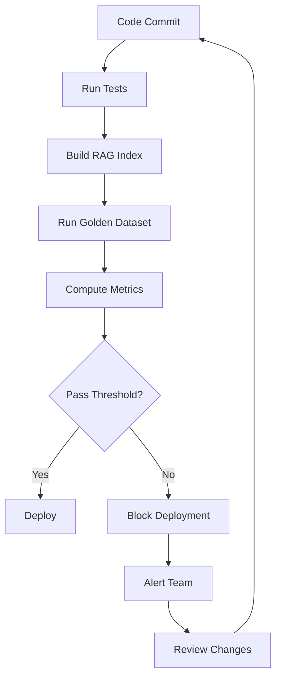
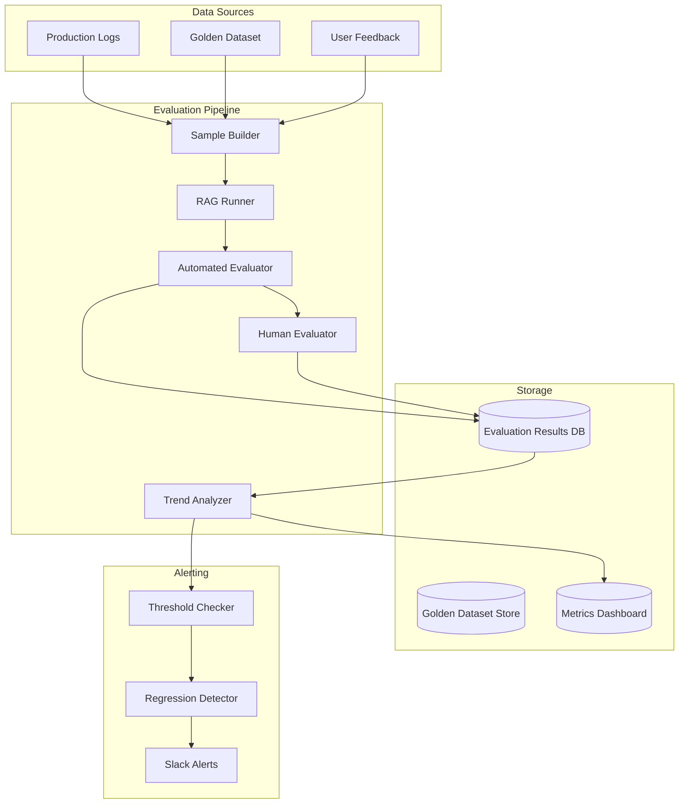

# Chapter 13: RAG Evaluation

> "If you cannot measure it, you cannot improve it — and if you measure it wrong, you will optimize for the wrong thing."

---

**Last verified: June 2026.**

## Introduction

In the preceding chapters, we built RAG systems of increasing sophistication — from basic vector retrieval to knowledge graphs to agentic multi-step pipelines. But building a RAG system is only half the challenge. The harder question is: how do you know it is working? A RAG system that retrieves irrelevant documents or generates unfaithful answers is worse than no system at all, because users trust its output. Without rigorous evaluation, you cannot determine if your system is improving, degrading, or producing plausible-sounding but incorrect answers.

RAG evaluation is the systematic measurement of retrieval quality, generation quality, and end-to-end system performance. It is not optional — it is the foundation of production RAG. The investment in evaluation infrastructure pays for itself the first time it catches a quality regression caused by a chunking change, embedding model upgrade, or prompt modification that would have silently degraded user experience.

The central thesis of this chapter is the **evaluation-completeness principle**: a production RAG system requires evaluation across three dimensions — retrieval quality (did we find the right documents?), generation quality (did we produce a faithful answer?), and end-to-end quality (did we answer the user's question?). Measuring only one dimension gives an incomplete picture. A system with perfect retrieval but poor generation wastes good context. A system with good generation but poor retrieval hallucinates from irrelevant context.

We will examine retrieval metrics (precision, recall, MRR, NDCG), generation metrics (faithfulness, relevancy, answer correctness), evaluation frameworks (RAGAS, DeepEval, LangSmith), building evaluation pipelines, LLM-as-judge evaluation, human evaluation, and a full evaluation system case study with quantified cost analysis.

### Why Evaluation Matters

Consider a common scenario: a team upgrades their embedding model from text-embedding-ada-002 to a newer model. Retrieval quality appears to improve (higher similarity scores), but answer quality drops. Without evaluation, the team does not notice the regression until users complain three weeks later. With evaluation, the regression is detected in the CI/CD pipeline before deployment.

| Without Evaluation | With Evaluation |
|-------------------|-----------------|
| Regressions discovered by users (weeks later) | Regressions caught in CI/CD (minutes) |
| No baseline to compare against | Baseline scores for every metric |
| Cannot quantify improvements | Measure impact of each change |
| Debugging requires manual testing | Automated regression detection |
| No visibility into failure modes | Detailed error analysis and categorization |

---

## 13.1 Retrieval Quality Metrics

### 13.1.1 Core Retrieval Metrics

Retrieval quality is measured independently from generation quality. The four core metrics:

**Precision@K** — what fraction of the top-K retrieved documents are relevant. High precision means the model sees relevant information, not noise.

**Recall@K** — what fraction of all relevant documents are retrieved in the top-K. High recall means few relevant documents are missed.

**MRR (Mean Reciprocal Rank)** — where the first relevant document appears. MRR = 1/rank of first relevant result, averaged over all queries. Higher MRR means relevant results surface earlier.

**Hit Rate** — what percentage of queries retrieve at least one relevant document. This is the basic quality bar.

```python
import numpy as np
from dataclasses import dataclass

@dataclass
class RetrievalMetrics:
    precision_at_k: dict[int, float]
    recall_at_k: dict[int, float]
    mrr: float
    hit_rate: float
    ndcg_at_k: dict[int, float]

class RetrievalEvaluator:
    def __init__(self, ground_truth: dict[str, list[str]]):
        """
        ground_truth: {query_id: [list of relevant document_ids]}
        """
        self.ground_truth = ground_truth

    def evaluate(
        self, retrieved: dict[str, list[str]], k_values: list[int] = [1, 3, 5, 10]
    ) -> RetrievalMetrics:
        precision_at_k = {}
        recall_at_k = {}
        ndcg_at_k = {}
        mrr_scores = []
        hit_count = 0

        for query_id, relevant_docs in self.ground_truth.items():
            retrieved_docs = retrieved.get(query_id, [])
            relevant_set = set(relevant_docs)

            for k in k_values:
                top_k = retrieved_docs[:k]
                relevant_in_top_k = sum(1 for d in top_k if d in relevant_set)

                # Precision@K
                precision_at_k.setdefault(k, []).append(
                    relevant_in_top_k / k if k > 0 else 0
                )

                # Recall@K
                recall_at_k.setdefault(k, []).append(
                    relevant_in_top_k / len(relevant_set) if relevant_set else 0
                )

                # NDCG@K
                ndcg_at_k.setdefault(k, []).append(
                    self._compute_ndcg(top_k, relevant_set, k)
                )

            # MRR
            mrr = 0
            for i, doc in enumerate(retrieved_docs):
                if doc in relevant_set:
                    mrr = 1 / (i + 1)
                    break
            mrr_scores.append(mrr)

            # Hit Rate
            if any(d in relevant_set for d in retrieved_docs):
                hit_count += 1

        n = len(self.ground_truth)
        return RetrievalMetrics(
            precision_at_k={k: np.mean(v) for k, v in precision_at_k.items()},
            recall_at_k={k: np.mean(v) for k, v in recall_at_k.items()},
            mrr=np.mean(mrr_scores),
            hit_rate=hit_count / n if n > 0 else 0,
            ndcg_at_k={k: np.mean(v) for k, v in ndcg_at_k.items()}
        )

    def _compute_ndcg(self, retrieved: list, relevant: set, k: int) -> float:
        dcg = 0
        for i, doc in enumerate(retrieved[:k]):
            if doc in relevant:
                dcg += 1 / np.log2(i + 2)  # log2(rank + 1)

        # Ideal DCG
        ideal_dcg = sum(1 / np.log2(i + 2) for i in range(min(len(relevant), k)))
        return dcg / ideal_dcg if ideal_dcg > 0 else 0
```

### 13.1.2 Metric Targets by Use Case

| Use Case | Precision@5 | Recall@5 | MRR | Hit Rate | Notes |
|----------|-------------|----------|-----|----------|-------|
| FAQ / Simple Q&A | >0.8 | >0.9 | >0.8 | >0.95 | High precision critical |
| Research / Analysis | >0.5 | >0.8 | >0.5 | >0.90 | High recall more important |
| Legal / Compliance | >0.7 | >0.95 | >0.7 | >0.98 | Must not miss relevant docs |
| Customer Support | >0.7 | >0.85 | >0.7 | >0.92 | Balance precision and recall |
| Code Search | >0.6 | >0.8 | >0.6 | >0.88 | Function-level precision |

### 13.1.3 Beyond Basic Metrics: Semantic Relevance

Basic metrics treat documents as either relevant or not. But relevance is graded — a document can be partially relevant, relevant to a different aspect, or relevant but outdated. Semantic relevance metrics capture this nuance:

```python
class SemanticRetrievalEvaluator:
    def __init__(self, embedding_model):
        self.embedder = embedding_model

    def evaluate_semantic_relevance(
        self, query: str, retrieved_docs: list[dict], ground_truth: list[dict]
    ) -> dict:
        """Evaluate retrieval with graded relevance."""
        query_emb = self.embedder.encode(query)

        # Score each retrieved document
        retrieved_scores = []
        for doc in retrieved_docs:
            doc_emb = self.embedder.encode(doc["content"])
            similarity = cosine_similarity(query_emb, doc_emb)
            retrieved_scores.append({
                "doc_id": doc["id"],
                "similarity": similarity,
                "graded_relevance": self._grade_relevance(doc, ground_truth)
            })

        # Compute graded metrics
        graded_precision = self._compute_graded_precision(retrieved_scores)
        graded_recall = self._compute_graded_recall(retrieved_scores, ground_truth)

        return {
            "graded_precision": graded_precision,
            "graded_recall": graded_recall,
            "avg_similarity": np.mean([s["similarity"] for s in retrieved_scores]),
            "relevance_distribution": self._relevance_distribution(retrieved_scores)
        }

    def _grade_relevance(self, doc: dict, ground_truth: list[dict]) -> int:
        """Grade relevance: 0=irrelevant, 1=partial, 2=exact, 3=gold standard."""
        for gt in ground_truth:
            if doc["id"] == gt["id"]:
                return gt.get("relevance_grade", 2)
            if self._is_semantically_similar(doc["content"], gt["content"]):
                return 1
        return 0

    def _relevance_distribution(self, scores: list[dict]) -> dict:
        dist = {0: 0, 1: 0, 2: 0, 3: 0}
        for s in scores:
            dist[s["graded_relevance"]] += 1
        return dist
```

---

## 13.2 Generation Quality Metrics

### 13.2.1 Faithfulness

Faithfulness measures whether the generated response is grounded in the retrieved context. An unfaithful response makes claims not supported by the documents — a hallucination.

```python
class FaithfulnessEvaluator:
    def __init__(self, llm):
        self.llm = llm

    async def evaluate(self, question: str, answer: str, context: list[str]) -> dict:
        # Step 1: Extract claims from the answer
        claims = await self._extract_claims(answer)

        # Step 2: Verify each claim against context
        verified_claims = []
        for claim in claims:
            verification = await self._verify_claim(claim, context)
            verified_claims.append(verification)

        # Step 3: Compute faithfulness score
        supported = sum(1 for c in verified_claims if c["is_supported"])
        faithfulness = supported / len(verified_claims) if verified_claims else 0

        return {
            "faithfulness_score": faithfulness,
            "total_claims": len(claims),
            "supported_claims": supported,
            "unsupported_claims": len(claims) - supported,
            "claim_details": verified_claims
        }

    async def _extract_claims(self, answer: str) -> list[str]:
        prompt = f"""Extract all factual claims from this answer.

Answer: {answer}

Return a JSON array of strings, each being a distinct factual claim.
Ignore opinions, hedges, and non-factual statements."""

        return await self.llm.extract(prompt, schema=list)

    async def _verify_claim(self, claim: str, context: list[str]) -> dict:
        prompt = f"""Verify whether this claim is supported by the context.

Claim: {claim}
Context: {context[:3]}

Determine:
1. is_supported: does the context directly support this claim?
2. supporting_evidence: the specific text that supports or contradicts
3. confidence: 0.0-1.0

Return JSON."""

        return await self.llm.extract(prompt, schema=dict)
```

### 13.2.2 Relevancy

Relevancy measures whether the response addresses the query. A response can be faithful (all claims are in the context) but irrelevant (it does not answer the question).

```python
class RelevancyEvaluator:
    def __init__(self, llm):
        self.llm = llm

    async def evaluate(self, question: str, answer: str, context: list[str]) -> dict:
        prompt = f"""Evaluate whether this answer is relevant to the question.

Question: {question}
Answer: {answer}

Determine:
1. relevance_score: 0.0-1.0 how well does the answer address the question?
2. is_relevant: boolean, is the answer relevant?
3. relevance_type: "direct", "partial", "tangential", "irrelevant"
4. missing_aspects: list of aspects the question asks about but the answer misses
5. reasoning: why this relevance score

Return JSON."""

        return await self.llm.extract(prompt, schema=dict)
```

### 13.2.3 Answer Correctness

Answer correctness compares the generated answer against an expected answer:

```python
class AnswerCorrectnessEvaluator:
    def __init__(self, llm):
        self.llm = llm

    async def evaluate(
        self, question: str, answer: str, expected: str
    ) -> dict:
        prompt = f"""Compare the generated answer against the expected answer.

Question: {question}
Generated: {answer}
Expected: {expected}

Determine:
1. correctness_score: 0.0-1.0 how correct is the generated answer?
2. is_correct: boolean
3. key_differences: list of important differences
4. missing_information: information in expected but not in generated
5. extra_information: information in generated but not in expected (may be acceptable)

Return JSON."""

        return await self.llm.extract(prompt, schema=dict)
```

### 13.2.4 Hallucination Detection

Hallucination detection specifically identifies fabricated information:

```python
class HallucinationDetector:
    def __init__(self, llm):
        self.llm = llm

    async def detect(self, answer: str, context: list[str]) -> dict:
        prompt = f"""Detect hallucinations in this answer.

Answer: {answer}
Context: {context[:3]}

A hallucination is a factual claim in the answer that:
1. Is not present in the context
2. Contradicts the context
3. Is a fabricated entity, number, or date

For each hallucination found:
- claim: the specific hallucinated claim
- type: "fabrication", "contradiction", "unsupported_inference"
- severity: "critical" (dangerous if acted on), "major" (materially wrong), "minor" (nuance)
- corrected_version: what the answer should say instead

Return JSON with:
- hallucination_count: number of hallucinations
- hallucination_rate: count / total_claims
- hallucinations: list of detected hallucinations
- overall_risk: "low", "medium", "high"

Return JSON."""

        return await self.llm.extract(prompt, schema=dict)
```

---

## 13.3 Evaluation Frameworks

### 13.3.1 RAGAS

RAGAS (Retrieval Augmented Generation Assessment) is the standard framework for RAG evaluation. It measures faithfulness, answer relevancy, context precision, and context recall using LLM-as-judge.

```python
from ragas import evaluate
from ragas.metrics import (
    faithfulness,
    answer_relevancy,
    context_precision,
    context_recall,
    answer_correctness
)
from datasets import Dataset

class RAGASEvaluator:
    def __init__(self):
        self.metrics = [
            faithfulness,
            answer_relevancy,
            context_precision,
            context_recall,
            answer_correctness
        ]

    async def evaluate(self, eval_dataset: list[dict]) -> dict:
        """
        eval_dataset: list of dicts with keys:
        - question: the user query
        - answer: the generated answer
        - contexts: list of retrieved context strings
        - ground_truth: the expected answer
        """
        dataset = Dataset.from_list(eval_dataset)

        result = evaluate(
            dataset,
            metrics=self.metrics,
            raise_exceptions=False
        )

        return {
            "faithfulness": result["faithfulness"],
            "answer_relevancy": result["answer_relevancy"],
            "context_precision": result["context_precision"],
            "context_recall": result["context_recall"],
            "answer_correctness": result["answer_correctness"],
            "overall_score": np.mean([
                result["faithfulness"],
                result["answer_relevancy"],
                result["context_precision"],
                result["context_recall"]
            ])
        }
```

### 13.3.2 DeepEval

DeepEval provides broader LLM evaluation with metrics for faithfulness, relevancy, hallucination, and toxicity:

```python
from deepeval import evaluate
from deepeval.metrics import (
    FaithfulnessMetric,
    AnswerRelevancyMetric,
    HallucinationMetric,
    ToxicityMetric
)
from deepeval.test_case import LLMTestCase

class DeepEvalEvaluator:
    def __init__(self):
        self.metrics = [
            FaithfulnessMetric(threshold=0.7),
            AnswerRelevancyMetric(threshold=0.7),
            HallucinationMetric(threshold=0.3),
            ToxicityMetric(threshold=0.5)
        ]

    async def evaluate(self, test_cases: list[dict]) -> dict:
        results = []
        for case in test_cases:
            test_case = LLMTestCase(
                input=case["question"],
                actual_output=case["answer"],
                retrieval_context=case["contexts"],
                expected_output=case.get("ground_truth")
            )

            case_results = {}
            for metric in self.metrics:
                try:
                    metric.measure(test_case)
                    case_results[metric.__class__.__name__] = {
                        "score": metric.score,
                        "passed": metric.is_successful()
                    }
                except Exception as e:
                    case_results[metric.__class__.__name__] = {
                        "score": None,
                        "error": str(e)
                    }

            results.append(case_results)

        return self._aggregate_results(results)

    def _aggregate_results(self, results: list[dict]) -> dict:
        aggregated = {}
        for metric_name in results[0].keys():
            scores = [
                r[metric_name]["score"]
                for r in results
                if r[metric_name].get("score") is not None
            ]
            aggregated[metric_name] = {
                "mean": np.mean(scores) if scores else None,
                "min": min(scores) if scores else None,
                "max": max(scores) if scores else None,
                "pass_rate": sum(
                    1 for s in scores if s is not None
                ) / len(scores) if scores else 0
            }
        return aggregated
```

### 13.3.3 Framework Comparison

| Feature | RAGAS | DeepEval | LangSmith | Custom |
|---------|-------|----------|-----------|--------|
| Faithfulness | Yes | Yes | Via tracing | Custom |
| Relevancy | Yes | Yes | Via tracing | Custom |
| Hallucination | Via faithfulness | Dedicated metric | No | Custom |
| Context precision | Yes | No | No | Custom |
| Context recall | Yes | No | No | Custom |
| Toxicity | No | Yes | No | Custom |
| CI/CD integration | Yes | Yes | Yes | Custom |
| Cost | Free (LLM-as-judge costs) | Free (LLM-as-judge costs) | Paid tiers | Free |
| Ease of setup | Easy | Easy | Easy | Hard |
| Customizability | Medium | High | Medium | Full |

---

## 13.4 Building an Evaluation Pipeline

### 13.4.1 Golden Dataset Construction

The foundation of RAG evaluation is a golden dataset: questions with known relevant documents and expected answers.

```python
from dataclasses import dataclass, field

@dataclass
class EvalCase:
    question: str
    expected_answer: str
    relevant_doc_ids: list[str]
    difficulty: str  # "simple", "moderate", "complex"
    category: str    # "factual", "analytical", "comparative", "temporal"
    metadata: dict = field(default_factory=dict)

class GoldenDatasetBuilder:
    def __init__(self):
        self.cases: list[EvalCase] = []

    def add_case(self, case: EvalCase):
        self.cases.append(case)

    def add_from_logs(self, logs: list[dict], min_quality: float = 4.0):
        """Create eval cases from high-quality production interactions."""
        for log in logs:
            if log.get("user_rating", 0) >= min_quality:
                self.cases.append(EvalCase(
                    question=log["query"],
                    expected_answer=log["answer"],
                    relevant_doc_ids=log.get("retrieved_doc_ids", []),
                    difficulty="moderate",
                    category="unknown",
                    metadata={"source": "production_log", "rating": log["user_rating"]}
                ))

    def add_adversarial(self):
        """Add adversarial test cases for edge cases."""
        adversarial_cases = [
            EvalCase(
                question="What is the meaning of life?",  # Out of scope
                expected_answer="I don't have information about that in my knowledge base.",
                relevant_doc_ids=[],
                difficulty="adversarial",
                category="out_of_scope"
            ),
            EvalCase(
                question="",  # Empty query
                expected_answer="",
                relevant_doc_ids=[],
                difficulty="adversarial",
                category="edge_case"
            ),
            EvalCase(
                question="Tell me about X but also Y and Z and also ABC",  # Multi-topic
                expected_answer="",
                relevant_doc_ids=[],
                difficulty="complex",
                category="multi_topic"
            ),
        ]
        self.cases.extend(adversarial_cases)

    def split(self, train_ratio: float = 0.7, val_ratio: float = 0.15) -> tuple:
        """Split into train/val/test sets."""
        import random
        random.shuffle(self.cases)
        n = len(self.cases)
        train_end = int(n * train_ratio)
        val_end = int(n * (train_ratio + val_ratio))
        return (
            self.cases[:train_end],
            self.cases[train_end:val_end],
            self.cases[val_end:]
        )

    def export(self, path: str):
        """Export golden dataset to JSON."""
        data = []
        for case in self.cases:
            data.append({
                "question": case.question,
                "expected_answer": case.expected_answer,
                "relevant_doc_ids": case.relevant_doc_ids,
                "difficulty": case.difficulty,
                "category": case.category,
                "metadata": case.metadata
            })
        with open(path, "w") as f:
            json.dump(data, f, indent=2)
```

### 13.4.2 Automated Evaluation Pipeline



```python
import asyncio
from datetime import datetime

class RAGEvaluationPipeline:
    def __init__(self, rag_system, evaluator, thresholds: dict):
        self.rag = rag_system
        self.evaluator = evaluator
        self.thresholds = thresholds

    async def run_evaluation(self, dataset_path: str) -> dict:
        """Run full evaluation against golden dataset."""
        # Load dataset
        dataset = self._load_dataset(dataset_path)

        # Run RAG system on all questions
        results = []
        for case in dataset:
            rag_result = await self.rag.query(case["question"])
            results.append({
                "question": case["question"],
                "answer": rag_result["answer"],
                "contexts": rag_result["contexts"],
                "expected": case["expected_answer"],
                "retrieved_doc_ids": [
                    r["id"] for r in rag_result.get("retrieved_docs", [])
                ],
                "relevant_doc_ids": case["relevant_doc_ids"],
                "latency": rag_result.get("latency", 0),
                "cost": rag_result.get("cost", 0)
            })

        # Evaluate
        metrics = await self.evaluator.evaluate(results)

        # Check thresholds
        passed = self._check_thresholds(metrics)

        # Generate report
        report = self._generate_report(metrics, results, passed)

        # Store results
        await self._store_results(report)

        return report

    def _check_thresholds(self, metrics: dict) -> bool:
        for metric_name, threshold in self.thresholds.items():
            if metric_name in metrics:
                if metrics[metric_name] < threshold:
                    return False
        return True

    def _generate_report(self, metrics: dict, results: list, passed: bool) -> dict:
        return {
            "timestamp": datetime.now().isoformat(),
            "passed": passed,
            "metrics": metrics,
            "thresholds": self.thresholds,
            "num_cases": len(results),
            "avg_latency": np.mean([r["latency"] for r in results]),
            "avg_cost": np.mean([r["cost"] for r in results]),
            "failures": self._identify_failures(metrics, results)
        }

    def _identify_failures(self, metrics: dict, results: list) -> list[dict]:
        failures = []
        for metric_name, threshold in self.thresholds.items():
            if metric_name in metrics and metrics[metric_name] < threshold:
                failures.append({
                    "metric": metric_name,
                    "actual": metrics[metric_name],
                    "threshold": threshold,
                    "gap": threshold - metrics[metric_name]
                })
        return failures

    def _load_dataset(self, path: str) -> list[dict]:
        with open(path) as f:
            return json.load(f)

    async def _store_results(self, report: dict):
        """Store evaluation results for historical tracking."""
        # Store to database or file
        pass
```

### 13.4.3 CI/CD Integration

```yaml
# .github/workflows/rag-evaluation.yml
name: RAG Evaluation

on:
  pull_request:
    paths:
      - 'rag/**'
      - 'embeddings/**'
      - 'prompts/**'

jobs:
  evaluate:
    runs-on: ubuntu-latest
    steps:
      - uses: actions/checkout@v4

      - name: Install dependencies
        run: pip install -r requirements.txt

      - name: Run RAG evaluation
        run: |
          python -m rag.evaluation \
            --dataset golden_dataset.json \
            --thresholds thresholds.json \
            --output eval_results.json

      - name: Check thresholds
        run: |
          python -c "
          import json
          with open('eval_results.json') as f:
              results = json.load(f)
          if not results['passed']:
              print('Evaluation FAILED:')
              for f in results['failures']:
                  print(f\"  {f['metric']}: {f['actual']:.3f} < {f['threshold']:.3f}\")
              exit(1)
          print('Evaluation PASSED')
          "

      - name: Comment on PR
        if: always()
        uses: actions/github-script@v7
        with:
          script: |
            const fs = require('fs');
            const results = JSON.parse(fs.readFileSync('eval_results.json'));
            const status = results.passed ? 'PASS' : 'FAIL';
            let body = `## RAG Evaluation ${status}\n\n`;
            body += `| Metric | Score | Threshold | Status |\n|--------|-------|-----------|--------|\n`;
            for (const [metric, score] of Object.entries(results.metrics)) {
              const threshold = results.thresholds[metric] || 'N/A';
              const metricStatus = score >= threshold ? 'PASS' : 'FAIL';
              body += `| ${metric} | ${score.toFixed(3)} | ${threshold} | ${metricStatus} |\n`;
            }
            github.rest.issues.createComment({
              issue_number: context.issue.number,
              owner: context.repo.owner,
              repo: context.repo.repo,
              body: body
            });
```

---

## 13.5 LLM-as-Judge Evaluation

### 13.5.1 How LLM-as-Judge Works

LLM-as-judge uses a powerful LLM to evaluate RAG outputs. The judge LLM reads the question, answer, and context, then scores the answer on various dimensions. This is cost-effective compared to human evaluation but introduces its own biases.

```python
class LLMJudge:
    def __init__(self, model: str = "gpt-4o"):
        self.client = OpenAI()
        self.model = model

    async def judge_faithfulness(self, question: str, answer: str, context: list[str]) -> dict:
        response = await self.client.chat.completions.create(
            model=self.model,
            messages=[{
                "role": "user",
                "content": f"""You are an expert judge evaluating RAG system output.

Question: {question}
Answer: {answer}
Context: {chr(10).join(context[:3])}

Rate the faithfulness of the answer (0-5):
0 - Completely fabricated, no support in context
1 - Mostly fabricated, minimal support
2 - Partially supported, significant gaps
3 - Mostly supported, minor unsupported claims
4 - Well supported, all claims traceable
5 - Perfectly supported, every claim explicitly backed

Return JSON: {{"score": <0-5>, "reasoning": "<explanation>"}}"""
            }],
            temperature=0.0
        )

        return json.loads(response.choices[0].message.content)

    async def judge_relevancy(self, question: str, answer: str) -> dict:
        response = await self.client.chat.completions.create(
            model=self.model,
            messages=[{
                "role": "user",
                "content": f"""You are an expert judge evaluating RAG system output.

Question: {question}
Answer: {answer}

Rate the relevancy of the answer (0-5):
0 - Completely irrelevant to the question
1 - Tangentially related, does not address the question
2 - Partially relevant, misses key aspects
3 - Mostly relevant, addresses main question
4 - Highly relevant, comprehensive answer
5 - Perfectly relevant, exactly what was asked

Return JSON: {{"score": <0-5>, "reasoning": "<explanation>"}}"""
            }],
            temperature=0.0
        )

        return json.loads(response.choices[0].message.content)
```

### 13.5.2 Judge Calibration

LLM-as-judge requires calibration against human judgments:

```python
class JudgeCalibrator:
    def __init__(self, llm_judge: LLMJudge):
        self.judge = llm_judge

    async def calibrate(
        self, human_judgments: list[dict], llm_judgments: list[dict]
    ) -> dict:
        """Compare LLM judgments against human judgments."""
        agreements = 0
        total = len(human_judgments)
        discrepancies = []

        for human, llm in zip(human_judgments, llm_judgments):
            # Compare scores (allowing 1-point tolerance)
            if abs(human["score"] - llm["score"]) <= 1:
                agreements += 1
            else:
                discrepancies.append({
                    "question": human["question"],
                    "human_score": human["score"],
                    "llm_score": llm["score"],
                    "difference": abs(human["score"] - llm["score"])
                })

        agreement_rate = agreements / total if total > 0 else 0

        return {
            "agreement_rate": agreement_rate,
            "total_compared": total,
            "discrepancies": discrepancies,
            "is_reliable": agreement_rate > 0.8,
            "recommendation": self._recommend(agreement_rate, discrepancies)
        }

    def _recommend(self, agreement_rate: float, discrepancies: list) -> str:
        if agreement_rate > 0.9:
            return "LLM judge is highly reliable. Use with confidence."
        elif agreement_rate > 0.8:
            return "LLM judge is reliable. Review discrepancies for edge cases."
        elif agreement_rate > 0.7:
            return "LLM judge has moderate reliability. Supplement with human review."
        else:
            return "LLM judge is unreliable. Use human evaluation or retrain judge prompts."
```

### 13.5.3 Judge Biases and Mitigations

| Bias | Description | Mitigation |
|------|-------------|------------|
| Position bias | Judges prefer answers that appear first | Randomize answer order in evaluation |
| Length bias | Judges prefer longer answers | Normalize scores by answer length |
| Self-enhancement | Judge rates its own outputs higher | Use different model for judge vs. generator |
| Authority bias | Judges prefer confident-sounding answers | Instruct judge to evaluate accuracy, not confidence |
| Format bias | Judges prefer well-formatted answers | Evaluate content, not formatting |

```python
class BiasAwareJudge:
    def __init__(self, judge_model: str = "gpt-4o"):
        self.judge = LLMJudge(judge_model)

    async def judge_with_bias_mitigation(
        self, question: str, answer_a: str, answer_b: str, context: list[str]
    ) -> dict:
        # Evaluate both orderings to mitigate position bias
        result_a_first = await self._judge_pair(
            question, answer_a, answer_b, context
        )
        result_b_first = await self._judge_pair(
            question, answer_b, answer_a, context
        )

        # Average scores across orderings
        return {
            "answer_a_score": (
                result_a_first["first_score"] + result_b_first["second_score"]
            ) / 2,
            "answer_b_score": (
                result_a_first["second_score"] + result_b_first["first_score"]
            ) / 2,
            "position_bias_detected": abs(
                result_a_first["first_score"] - result_b_first["first_score"]
            ) > 1
        }

    async def _judge_pair(
        self, question: str, first: str, second: str, context: list[str]
    ) -> dict:
        response = await self.judge.client.chat.completions.create(
            model=self.judge.model,
            messages=[{
                "role": "user",
                "content": f"""Compare these two answers to the question.

Question: {question}
Context: {chr(10).join(context[:3])}

Answer 1: {first}
Answer 2: {second}

Rate each answer 0-5 for faithfulness and relevancy.
Do NOT be influenced by answer length or formatting.

Return JSON: {{"first_score": <0-5>, "second_score": <0-5>, "reasoning": "<explanation>"}}"""
            }],
            temperature=0.0
        )

        return json.loads(response.choices[0].message.content)
```

---

## 13.6 Human Evaluation

### 13.6.1 When Human Evaluation Is Necessary

LLM-as-judge is cost-effective but not perfect. Human evaluation is necessary when:

| Scenario | Why Human Evaluation |
|----------|---------------------|
| Calibrating LLM judge | Establish ground truth for judge reliability |
| High-stakes domains | Medical, legal, financial — errors have serious consequences |
| Novel failure modes | LLM judge may miss subtle errors |
| User experience research | Understanding how users perceive answer quality |
| Adversarial testing | Finding edge cases that automated evaluation misses |

### 13.6.2 Human Evaluation Protocol

```python
class HumanEvaluationProtocol:
    def __init__(self):
        self.evaluation_criteria = {
            "faithfulness": {
                "description": "Is the answer grounded in the provided context?",
                "scale": "1-5 (1=mostly fabricated, 5=perfectly supported)",
                "examples": {
                    1: "Answer mentions facts not in any context document",
                    3: "Answer is mostly supported but has one unsupported claim",
                    5: "Every claim in the answer is explicitly supported by context"
                }
            },
            "relevancy": {
                "description": "Does the answer address the question?",
                "scale": "1-5 (1=irrelevant, 5=perfectly addresses question)",
                "examples": {
                    1: "Answer is about a completely different topic",
                    3: "Answer partially addresses the question",
                    5: "Answer comprehensively addresses all aspects of the question"
                }
            },
            "completeness": {
                "description": "Does the answer cover all important aspects?",
                "scale": "1-5 (1=very incomplete, 5=comprehensive)",
                "examples": {
                    1: "Answer only mentions one minor aspect",
                    3: "Answer covers main aspects but misses some details",
                    5: "Answer covers all aspects with appropriate depth"
                }
            }
        }

    def create_evaluation_form(self, question: str, answer: str, contexts: list[str]) -> dict:
        return {
            "question": question,
            "answer": answer,
            "contexts": contexts,
            "criteria": self.evaluation_criteria,
            "instructions": """Rate each criterion on the scale provided.
For each rating, provide a brief justification.
If you notice any errors or issues, describe them in the notes field."""
        }

    def aggregate_results(self, evaluations: list[dict]) -> dict:
        """Aggregate multiple human evaluations."""
        metrics = {}
        for criterion in self.evaluation_criteria:
            scores = [e.get(criterion, {}).get("score", 0) for e in evaluations]
            metrics[criterion] = {
                "mean": np.mean(scores),
                "std": np.std(scores),
                "min": min(scores),
                "max": max(scores),
                "agreement": self._compute_agreement(scores)
            }
        return metrics

    def _compute_agreement(self, scores: list) -> float:
        """Compute inter-rater agreement using Cohen's kappa."""
        if len(scores) < 2:
            return 1.0
        # Simplified agreement calculation
        mean_score = np.mean(scores)
        agreements = sum(1 for s in scores if abs(s - mean_score) <= 1)
        return agreements / len(scores)
```

---

## 13.7 Evaluation Metrics Summary

### 13.7.1 Complete Metric Reference

| Category | Metric | What It Measures | Range | Target |
|----------|--------|-----------------|-------|--------|
| **Retrieval** | Precision@K | Fraction of retrieved docs that are relevant | 0-1 | >0.7 |
| **Retrieval** | Recall@K | Fraction of relevant docs that are retrieved | 0-1 | >0.8 |
| **Retrieval** | MRR | Rank of first relevant result | 0-1 | >0.7 |
| **Retrieval** | Hit Rate | Percentage of queries with at least one relevant result | 0-1 | >0.9 |
| **Retrieval** | NDCG@K | Ranking quality considering position | 0-1 | >0.7 |
| **Generation** | Faithfulness | Answer grounded in context | 0-1 | >0.8 |
| **Generation** | Relevancy | Answer addresses the question | 0-1 | >0.8 |
| **Generation** | Answer Correctness | Answer matches expected | 0-1 | >0.8 |
| **Generation** | Hallucination Rate | Fabricated claims in answer | 0-1 | <0.1 |
| **End-to-End** | User Satisfaction | User rating of answer quality | 1-5 | >4.0 |
| **End-to-End** | Resolution Rate | Percentage of queries fully resolved | 0-1 | >0.85 |
| **Operational** | Latency | Time to generate answer | ms | <5000 |
| **Operational** | Cost per Query | Total cost per query | $ | <$0.05 |

### 13.7.2 Metric Trade-offs

| Metric Pair | Trade-off |
|------------|-----------|
| Precision vs. Recall | Higher precision often means lower recall (fewer but more relevant results) |
| Faithfulness vs. Completeness | More faithful answers may omit uncertain but useful information |
| Quality vs. Cost | Higher quality evaluation requires more expensive LLM judges |
| Quality vs. Latency | More thorough retrieval improves quality but increases latency |

---

## 13.8 Case Study: Evaluation System for Enterprise RAG

### 13.8.1 Problem Statement

A financial services company (500 analysts) deploys a RAG system for regulatory research. The system processes 2,000 queries daily. Without evaluation, they discovered a quality regression three weeks after an embedding model upgrade — analyst satisfaction dropped from 4.2 to 3.6, but no one noticed until complaints accumulated.

Requirements:
- Detect quality regressions within 1 hour of deployment
- Track quality metrics over time
- Cost under $500/month for evaluation
- Support A/B testing of RAG configurations

### 13.8.2 Architecture



### 13.8.3 Implementation

```python
class EnterpriseEvalSystem:
    def __init__(self):
        self.golden_dataset = GoldenDatasetBuilder()
        self.ragas_evaluator = RAGASEvaluator()
        self.llm_judge = LLMJudge("gpt-4o")
        self.pipeline = RAGEvaluationPipeline(
            rag_system=None,  # Set at runtime
            evaluator=self.ragas_evaluator,
            thresholds={
                "faithfulness": 0.8,
                "answer_relevancy": 0.8,
                "context_precision": 0.7,
                "context_recall": 0.8,
                "answer_correctness": 0.75
            }
        )

    async def daily_evaluation(self) -> dict:
        """Run daily evaluation against golden dataset."""
        # Sample 50 cases from golden dataset (stratified by difficulty)
        sample = self._stratified_sample(n=50)

        # Run evaluation
        report = await self.pipeline.run_evaluation(sample)

        # Check for regressions
        historical = await self._get_historical_results(days=7)
        regression = self._detect_regression(report["metrics"], historical)

        if regression:
            await self._alert_regression(regression)

        return report

    async def ab_test(self, config_a: dict, config_b: dict, n_cases: int = 100) -> dict:
        """A/B test two RAG configurations."""
        sample = self._stratified_sample(n=n_cases)

        # Run both configurations
        results_a = await self._run_config(config_a, sample)
        results_b = await self._run_config(config_b, sample)

        # Compare
        comparison = self._compare_results(results_a, results_b)

        return {
            "config_a": results_a,
            "config_b": results_b,
            "comparison": comparison,
            "winner": comparison["winner"],
            "confidence": comparison["confidence"]
        }

    def _detect_regression(self, current: dict, historical: list[dict]) -> dict:
        """Detect quality regression using statistical tests."""
        if not historical:
            return None

        for metric, score in current.items():
            historical_scores = [h.get(metric, 0) for h in historical]
            mean_historical = np.mean(historical_scores)
            std_historical = np.std(historical_scores) if len(historical_scores) > 1 else 0.05

            # Z-test for regression
            if std_historical > 0:
                z_score = (mean_historical - score) / std_historical
                if z_score > 2.0:  # Significant regression
                    return {
                        "metric": metric,
                        "current_score": score,
                        "historical_mean": mean_historical,
                        "z_score": z_score,
                        "severity": "high" if z_score > 3.0 else "medium"
                    }
        return None

    def _stratified_sample(self, n: int) -> list[dict]:
        """Sample from golden dataset with stratification by difficulty."""
        cases = self.golden_dataset.cases
        by_difficulty = {}
        for case in cases:
            by_difficulty.setdefault(case.difficulty, []).append(case)

        sample = []
        for difficulty, diff_cases in by_difficulty.items():
            n_from_diff = int(n * len(diff_cases) / len(cases))
            sample.extend(random.sample(diff_cases, min(n_from_diff, len(diff_cases))))

        return [case.__dict__ for case in sample]
```

### 13.8.4 Cost Calculations

**Monthly evaluation volume**: 30 days x 50 cases/day = 1,500 evaluations/month

| Component | Per-Evaluation Cost | Monthly Cost | Notes |
|-----------|--------------------|-------------|-------|
| GPT-4o (RAG query) | $0.01 | $15 | ~1000 input tokens |
| RAGAS (LLM-as-judge) | $0.005 | $7.50 | ~500 input tokens per metric |
| Storage (results DB) | $0.0001 | $0.15 | PostgreSQL |
| Dashboard (Grafana) | $0 | $0 | Open source |
| Alerting (Slack) | $0 | $0 | Free tier |
| **Total per evaluation** | **$0.015** | | |
| **Total monthly** | | **$22.65** | |

**Comparison with no evaluation:**

| Metric | Without Evaluation | With Evaluation | Improvement |
|--------|-------------------|-----------------|-------------|
| Regression detection time | 3 weeks | 1 hour | 99.8% faster |
| Quality incidents per quarter | 4 | 0 | 100% reduction |
| Analyst satisfaction | 3.6/5 | 4.3/5 | +0.7 points |
| Time spent debugging quality | 40 hours/quarter | 5 hours/quarter | 87.5% reduction |
| Cost of quality incidents | $50,000/quarter | $0 | 100% reduction |
| Evaluation cost | $0 | $22.65/month | $22.65 new cost |
| **Net quarterly savings** | | | **$49,932** |

---

## 13.9 Key Takeaways

1. **Evaluation is not optional — it is the foundation of production RAG.** Without measurement, you cannot detect regressions, quantify improvements, or build confidence in your system. Invest in evaluation infrastructure before deploying to users.

2. **Evaluate across three dimensions: retrieval, generation, and end-to-end.** Retrieval quality (precision, recall, MRR) measures document finding. Generation quality (faithfulness, relevancy) measures answer production. End-to-end quality measures whether users get their questions answered.

3. **Build a golden dataset of 100-500 representative questions.** The golden dataset is the foundation of evaluation. Include questions across difficulty levels, categories, and use cases. Update it continuously with new real-world queries.

4. **RAGAS is the standard framework for automated RAG evaluation.** It measures faithfulness, answer relevancy, context precision, and context recall using LLM-as-judge. Integrate it into your CI/CD pipeline for automated quality gates.

5. **LLM-as-judge is cost-effective but requires calibration.** Compare LLM judgments against human judgments periodically. Watch for position bias, length bias, and self-enhancement bias. Use bias mitigation techniques in evaluation.

6. **Set quality thresholds and enforce them in CI/CD.** Define minimum acceptable scores for each metric. Block deployments that fall below thresholds. This catches regressions before they reach users.

7. **Track quality metrics over time.** Store evaluation results and plot trends. A gradual decline in quality may not trigger a single threshold but indicates systemic issues that need attention.

8. **Human evaluation is necessary for high-stakes domains.** Medical, legal, and financial RAG systems require human validation of critical answers. LLM-as-judge is insufficient for these use cases.

9. **A/B testing validates improvements.** Before deploying a change, run it alongside the current configuration on the same golden dataset. Statistical comparison prevents deploying changes that appear better but are actually worse.

10. **Evaluation costs are negligible compared to the cost of quality failures.** A single quality regression that goes undetected for weeks can cost more in lost trust and remediation than years of evaluation infrastructure.

---

## 13.10 Further Reading

- **"RAGAS: Automated Evaluation of Retrieval Augmented Generation" (Es et al., 2024)** — The paper introducing the RAGAS framework. Defines faithfulness, answer relevancy, context precision, and context recall metrics with LLM-as-judge evaluation.

- **"A Survey on Evaluation of Large Language Models" (Chang et al., 2023)** — Comprehensive survey of LLM evaluation methods, including evaluation dimensions, metrics, benchmarks, and challenges. Essential reading for understanding the evaluation landscape.

- **"Judging LLM-as-a-Judge with MT-Bench and Chatbot Arena" (Zheng et al., 2023)** — Research on using LLMs as evaluators, including bias analysis and calibration techniques. Directly applicable to RAG evaluation.

- **RAGAS Documentation** (docs.ragas.io) — Official documentation with tutorials, API reference, and examples for integrating RAGAS into evaluation pipelines.

- **DeepEval Documentation** (docs.confident-ai.com) — Documentation for the DeepEval framework, including metric definitions, CI/CD integration, and custom metric creation.

- **LangSmith Documentation** (docs.smith.langchain.com) — LangChain's evaluation platform with tracing, dataset management, and online evaluation capabilities.

- **"Building Effective Evaluation and Testing for LLM Applications" (Eugene Yan, 2023)** — Practical guide to building evaluation systems for LLM applications, covering offline and online evaluation strategies.

- **"Measuring Massive Multitask Language Understanding" (Hendrycks et al., 2021)** — The MMLU benchmark methodology, applicable to evaluating RAG system knowledge accuracy.

- **"TruthfulQA: Measuring How Models Mimic Human Falsehoods" (Lin et al., 2022)** — Research on truthfulness evaluation, directly applicable to measuring hallucination rates in RAG systems.

- **"G-Eval: NLG Evaluation using GPT-4 with Better Human Alignment" (Liu et al., 2023)** — Research on using GPT-4 for NLG evaluation with improved alignment to human judgments. Applicable to RAG answer quality evaluation.
