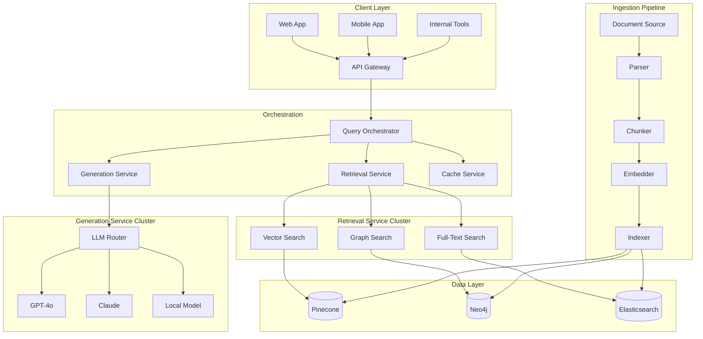
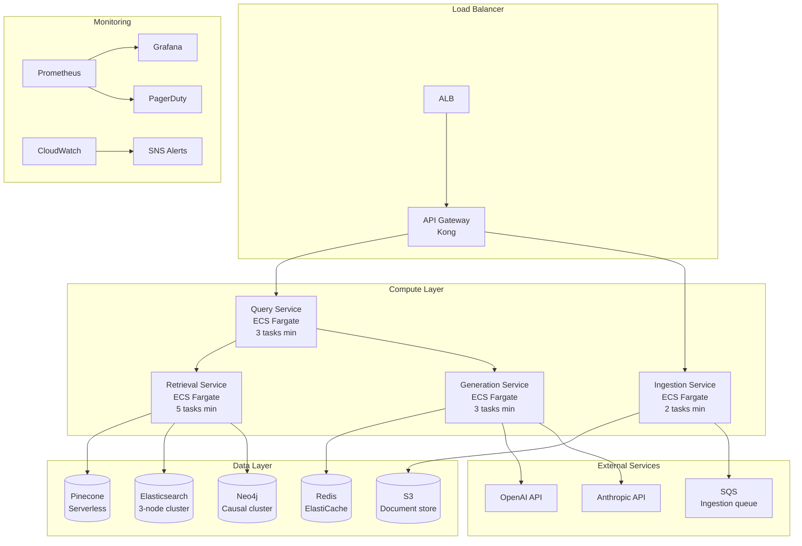

# Chapter 14: Production RAG Architecture

> "The gap between a demo and a production system is measured not in features, but in failure modes you never anticipated."

---

**Last verified: June 2026.**

## Introduction

In the preceding chapters, we built RAG systems that worked in controlled environments — clean data, reasonable query volumes, single tenants, ideal conditions. Production is none of these things. Production means multiple tenants sharing infrastructure, queries arriving in bursts, embedding models failing at 3 AM, vector databases losing nodes, and users discovering edge cases you never imagined. A production RAG system must handle all of this while maintaining sub-second latency, 99.9% availability, and consistent quality.

Production RAG architecture is the engineering discipline of transforming a working prototype into a reliable, scalable, cost-effective system that operates under real-world conditions. It encompasses distributed architecture patterns, caching strategies, reliability engineering, multi-tenancy, monitoring, and operational excellence. The difference between a prototype and a production system is not features — it is the infrastructure that handles everything the prototype does not.

The central thesis of this chapter is the **production-readiness principle**: a RAG system is production-ready when it can handle failure gracefully, scale to demand, maintain quality under load, and be operated by a team without rebuilding it. This requires architectural decisions that go beyond retrieval quality: caching, circuit breakers, rate limiting, multi-tenancy, and observability.

We will examine microservices architecture for RAG, event-driven patterns, multi-tenancy strategies, semantic caching, reliability patterns, performance optimization, monitoring and observability, and a full production deployment case study with quantified cost analysis.

### The Production Gap

The gap between prototype and production is quantifiable:

| Aspect | Prototype | Production |
|--------|-----------|------------|
| Users | 1-10 | 100-100,000 |
| Queries/day | 100 | 100,000+ |
| Availability | Best effort | 99.9%+ |
| Latency | Acceptable if fast | <2s p95 |
| Multi-tenancy | Single tenant | Isolated tenants |
| Error handling | Crashes are okay | Graceful degradation |
| Monitoring | Logs | Full observability |
| Deployment | Manual | Automated CI/CD |
| Cost tracking | None | Per-tenant billing |

---

## 14.1 Architecture Patterns

### 14.1.1 Microservices RAG

Separate services for ingestion, retrieval, and generation. Each service scales independently:



```python
# Query Orchestrator - routes queries to appropriate services
class QueryOrchestrator:
    def __init__(self, retrieval_service, generation_service, cache_service):
        self.retrieval = retrieval_service
        self.generation = generation_service
        self.cache = cache_service

    async def handle_query(self, query: str, tenant_id: str) -> dict:
        # Check cache first
        cached = await self.cache.get(query, tenant_id)
        if cached:
            return cached

        # Retrieve context
        retrieval_result = await self.retrieval.retrieve(query, tenant_id)

        # Generate answer
        generation_result = await self.generation.generate(
            query, retrieval_result["contexts"]
        )

        # Cache result
        await self.cache.set(query, tenant_id, generation_result)

        return generation_result

# Retrieval Service - handles all search operations
class RetrievalService:
    def __init__(self, vector_store, graph_store, text_store):
        self.vector = vector_store
        self.graph = graph_store
        self.text = text_store

    async def retrieve(self, query: str, tenant_id: str) -> dict:
        # Parallel retrieval from all stores
        import asyncio
        vector_results, graph_results, text_results = await asyncio.gather(
            self.vector.search(query, tenant_id, top_k=10),
            self.graph.search(query, tenant_id, top_k=10),
            self.text.search(query, tenant_id, top_k=10)
        )

        # Merge and rerank
        merged = self._merge_results(vector_results, graph_results, text_results)

        return {
            "contexts": [r["content"] for r in merged[:5]],
            "sources": [r["source"] for r in merged[:5]],
            "scores": [r["score"] for r in merged[:5]]
        }

# Generation Service - handles LLM calls with fallbacks
class GenerationService:
    def __init__(self):
        self.providers = [
            {"name": "openai", "model": "gpt-4o", "client": OpenAI()},
            {"name": "anthropic", "model": "claude-3-5-sonnet", "client": Anthropic()},
        ]
        self.default_provider = 0

    async def generate(self, query: str, contexts: list[str]) -> dict:
        prompt = self._build_prompt(query, contexts)

        for i, provider in enumerate(self.providers):
            try:
                response = await self._call_provider(provider, prompt)
                return {
                    "answer": response,
                    "provider": provider["name"],
                    "model": provider["model"]
                }
            except Exception as e:
                if i == len(self.providers) - 1:
                    raise
                continue

        raise GenerationError("All providers failed")
```

### 14.1.2 Event-Driven RAG

Asynchronous processing with message queues for ingestion and background tasks:

```python
import asyncio
from dataclasses import dataclass

@dataclass
class IngestionEvent:
    document_id: str
    tenant_id: str
    content: str
    metadata: dict
    priority: str = "normal"

class EventDrivenRAG:
    def __init__(self):
        self.ingestion_queue = asyncio.Queue()
        self.reembedding_queue = asyncio.Queue()
        self.evaluation_queue = asyncio.Queue()

    async def ingest_document(self, event: IngestionEvent):
        """Queue document for asynchronous ingestion."""
        await self.ingestion_queue.put(event)

    async def ingestion_worker(self):
        """Background worker for document ingestion."""
        while True:
            event = await self.ingestion_queue.get()
            try:
                # Parse document
                chunks = await self._parse_document(event)

                # Embed chunks
                embeddings = await self._embed_chunks(chunks)

                # Index in vector store
                await self._index_chunks(event.tenant_id, chunks, embeddings)

                # Extract and index knowledge graph
                await self._index_graph(event.tenant_id, chunks)

                # Queue quality evaluation
                await self.evaluation_queue.put({
                    "document_id": event.document_id,
                    "tenant_id": event.tenant_id,
                    "chunk_count": len(chunks)
                })

            except Exception as e:
                # Log error and retry with backoff
                await self._handle_ingestion_error(event, e)
            finally:
                self.ingestion_queue.task_done()
```

### 14.1.3 Multi-Tenant RAG

Each tenant gets isolated vector store collections, chat histories, and access controls:

```python
class MultiTenantRAG:
    def __init__(self, vector_store_factory, llm):
        self.store_factory = vector_store_factory
        self.llm = llm
        self.tenant_stores = {}

    def get_store(self, tenant_id: str):
        """Get or create tenant-specific vector store."""
        if tenant_id not in self.tenant_stores:
            self.tenant_stores[tenant_id] = self.store_factory.create(
                collection=f"tenant_{tenant_id}",
                dimension=1536
            )
        return self.tenant_stores[tenant_id]

    async def query(self, query: str, tenant_id: str, user_context: dict) -> dict:
        # Verify tenant access
        await self._verify_access(tenant_id, user_context)

        # Get tenant-specific store
        store = self.get_store(tenant_id)

        # Retrieve with tenant isolation
        results = await store.search(query, top_k=10)

        # Generate with tenant-specific prompt
        prompt = self._build_tenant_prompt(query, results, tenant_id)
        answer = await self.llm.generate(prompt)

        # Log access for audit
        await self._log_access(tenant_id, user_context, query, results)

        return {"answer": answer, "sources": [r["source"] for r in results]}

    async def _verify_access(self, tenant_id: str, user_context: dict):
        """Verify user belongs to tenant."""
        if user_context.get("tenant_id") != tenant_id:
            raise AccessDeniedError("User does not belong to this tenant")
```

| Isolation Strategy | Cost | Isolation Strength | Complexity | Best For |
|-------------------|------|-------------------|------------|----------|
| Collection per tenant | High | Strongest | Low | Enterprise, regulated |
| Filter-based (shared collection) | Low | Medium | Medium | SaaS, cost-sensitive |
| Database per tenant | Highest | Complete | High | Maximum isolation |
| Namespace-based | Medium | Good | Medium | Kubernetes environments |

---

## 14.2 Performance Optimization

### 14.2.1 Semantic Caching

Cache by semantic similarity, not exact match:

```python
import numpy as np
from sentence_transformers import SentenceTransformer

class SemanticCache:
    def __init__(self, similarity_threshold: float = 0.95):
        self.embedder = SentenceTransformer("all-mpnet-base-v2")
        self.cache = {}  # embedding -> (query, response, timestamp)
        self.threshold = similarity_threshold

    async def get(self, query: str, tenant_id: str) -> dict | None:
        query_emb = self.embedder.encode(query)
        cache_key = f"tenant_{tenant_id}"

        if cache_key not in self.cache:
            return None

        for cached_emb, (cached_query, response, timestamp) in self.cache[cache_key].items():
            similarity = np.dot(query_emb, cached_emb) / (
                np.linalg.norm(query_emb) * np.linalg.norm(cached_emb)
            )
            if similarity >= self.threshold:
                return response

        return None

    async def set(self, query: str, tenant_id: str, response: dict):
        query_emb = self.embedder.encode(query)
        cache_key = f"tenant_{tenant_id}"

        if cache_key not in self.cache:
            self.cache[cache_key] = {}

        self.cache[cache_key][query_emb.tobytes()] = (
            query, response, time.time()
        )

        # Evict old entries (LRU)
        self._evict_expired(cache_key, max_entries=10000)

    def _evict_expired(self, cache_key: str, max_entries: int):
        if len(self.cache.get(cache_key, {})) > max_entries:
            # Remove oldest entries
            entries = sorted(
                self.cache[cache_key].items(),
                key=lambda x: x[1][2]  # timestamp
            )
            for emb, _ in entries[:len(entries) - max_entries]:
                del self.cache[cache_key][emb]
```

**Semantic caching reduces LLM calls 20-40% for systems with repetitive queries.** The investment is one additional vector embedding per query (~$0.00001).

### 14.2.2 Result Caching

Cache search results for identical queries:

```python
import hashlib
import json
from datetime import timedelta

class ResultCache:
    def __init__(self, redis_client, ttl: timedelta = timedelta(hours=1)):
        self.redis = redis_client
        self.ttl = ttl

    def _cache_key(self, query: str, tenant_id: str) -> str:
        content = f"{tenant_id}:{query}"
        return f"rag:cache:{hashlib.sha256(content.encode()).hexdigest()}"

    async def get(self, query: str, tenant_id: str) -> dict | None:
        key = self._cache_key(query, tenant_id)
        cached = await self.redis.get(key)
        if cached:
            return json.loads(cached)
        return None

    async def set(self, query: str, tenant_id: str, result: dict):
        key = self._cache_key(query, tenant_id)
        await self.redis.setex(
            key,
            int(self.ttl.total_seconds()),
            json.dumps(result)
        )
```

### 14.2.3 Embedding Caching

Cache computed embeddings to avoid re-embedding identical text:

```python
class EmbeddingCache:
    def __init__(self):
        self.cache = {}  # text_hash -> embedding

    def get_or_compute(self, texts: list[str], embedder) -> np.ndarray:
        embeddings = []
        to_compute = []
        to_compute_indices = []

        for i, text in enumerate(texts):
            text_hash = hashlib.md5(text.encode()).hexdigest()
            if text_hash in self.cache:
                embeddings.append(self.cache[text_hash])
            else:
                embeddings.append(None)
                to_compute.append(text)
                to_compute_indices.append(i)

        if to_compute:
            computed = embedder.encode(to_compute)
            for idx, emb in zip(to_compute_indices, computed):
                text_hash = hashlib.md5(to_compute[to_compute_indices.index(idx)].encode()).hexdigest()
                self.cache[text_hash] = emb
                embeddings[idx] = emb

        return np.array(embeddings)
```

### 14.2.4 Performance Benchmarks

| Optimization | Latency Impact | Cost Impact | Quality Impact |
|-------------|---------------|-------------|----------------|
| Semantic caching | -30-50% | -20-40% LLM calls | None |
| Result caching | -80-95% for cache hits | -90% for cache hits | None |
| Embedding caching | -50-70% for ingested text | -60% embedding cost | None |
| Parallel retrieval | -40-60% | Same | None |
| Streaming responses | Perceived -70% | Same | None |
| Smaller models for simple queries | -50-70% | -80-90% | Slight decrease |

---

## 14.3 Reliability Patterns

### 14.3.1 Circuit Breaker

```python
import time
from enum import Enum

class CircuitState(Enum):
    CLOSED = "closed"       # Normal operation
    OPEN = "open"           # Failing, reject requests
    HALF_OPEN = "half_open" # Testing recovery

class CircuitBreaker:
    def __init__(self, failure_threshold: int = 5, recovery_timeout: int = 30):
        self.failure_threshold = failure_threshold
        self.recovery_timeout = recovery_timeout
        self.state = CircuitState.CLOSED
        self.failure_count = 0
        self.last_failure_time = None

    async def call(self, func, *args, **kwargs):
        if self.state == CircuitState.OPEN:
            if time.time() - self.last_failure_time > self.recovery_timeout:
                self.state = CircuitState.HALF_OPEN
            else:
                raise CircuitOpenError("Circuit breaker is open")

        try:
            result = await func(*args, **kwargs)
            self._on_success()
            return result
        except Exception as e:
            self._on_failure()
            raise

    def _on_success(self):
        self.failure_count = 0
        self.state = CircuitState.CLOSED

    def _on_failure(self):
        self.failure_count += 1
        self.last_failure_time = time.time()
        if self.failure_count >= self.failure_threshold:
            self.state = CircuitState.OPEN
```

### 14.3.2 Failover

```python
class LLMFailover:
    def __init__(self, providers: list[dict]):
        self.providers = providers
        self.health = {p["name"]: True for p in providers}

    async def generate(self, prompt: str) -> dict:
        for provider in self.providers:
            if not self.health[provider["name"]]:
                continue
            try:
                response = await self._call_provider(provider, prompt)
                return {"response": response, "provider": provider["name"]}
            except Exception as e:
                self.health[provider["name"]] = False
                continue

        raise AllProvidersFailedError("All LLM providers failed")

    async def health_check(self):
        """Periodic health check for all providers."""
        for provider in self.providers:
            try:
                await self._health_ping(provider)
                self.health[provider["name"]] = True
            except Exception:
                self.health[provider["name"]] = False
```

### 14.3.3 Rate Limiting

```python
import asyncio
from collections import defaultdict

class RateLimiter:
    def __init__(self, max_requests: int, window_seconds: int):
        self.max_requests = max_requests
        self.window = window_seconds
        self.requests = defaultdict(list)

    async def acquire(self, tenant_id: str):
        now = time.time()
        window_start = now - self.window

        # Clean old requests
        self.requests[tenant_id] = [
            t for t in self.requests[tenant_id] if t > window_start
        ]

        if len(self.requests[tenant_id]) >= self.max_requests:
            wait_time = self.requests[tenant_id][0] - window_start
            raise RateLimitExceededError(
                f"Rate limit exceeded. Retry after {wait_time:.1f}s"
            )

        self.requests[tenant_id].append(now)
```

### 14.3.4 Reliability Matrix

| Component | Availability Target | Failure Mode | Recovery Strategy | RTO |
|-----------|-------------------|--------------|-------------------|-----|
| API Gateway | 99.99% | AWS managed | Automatic failover | 0s |
| Query Orchestrator | 99.99% | ECS Fargate | Auto-scaling + health checks | <30s |
| Vector Search | 99.95% | Pinecone | Automatic replication | <5s |
| LLM Provider | 99.9% | Rate limiting | Retry + failover | <10s |
| Cache (Redis) | 99.99% | ElastiCache | Multi-AZ failover | <5s |
| Document Store | 99.99% | DynamoDB | Multi-AZ replication | 0s |
| Message Queue | 99.99% | SQS | Automatic retry + DLQ | 0s |
| **System total** | **99.9%** | | **Composite availability** | |

---

## 14.4 Monitoring and Observability

### 14.4.1 Key Metrics

```python
from dataclasses import dataclass
from prometheus_client import Histogram, Counter, Gauge

# Latency metrics
RETRIEVAL_LATENCY = Histogram(
    'rag_retrieval_latency_seconds',
    'Time spent on retrieval',
    ['tenant_id', 'retrieval_method']
)

GENERATION_LATENCY = Histogram(
    'rag_generation_latency_seconds',
    'Time spent on generation',
    ['tenant_id', 'model']
)

# Quality metrics
RETRIEVAL_SCORE = Histogram(
    'rag_retrieval_score',
    'Retrieval relevance score',
    ['tenant_id']
)

# Cost metrics
LLM_COST = Counter(
    'rag_llm_cost_dollars',
    'LLM API cost in dollars',
    ['tenant_id', 'model']
)

# Reliability metrics
ERROR_RATE = Counter(
    'rag_errors_total',
    'Total number of errors',
    ['error_type', 'tenant_id']
)

CACHE_HIT_RATE = Gauge(
    'rag_cache_hit_rate',
    'Cache hit rate',
    ['cache_type']
)
```

### 14.4.2 Structured Logging

```python
import structlog

logger = structlog.get_logger()

class RAGLogger:
    @staticmethod
    def log_query(query: str, tenant_id: str, result: dict, latency: float):
        logger.info(
            "rag_query",
            query_length=len(query),
            tenant_id=tenant_id,
            retrieval_method=result.get("retrieval_method"),
            num_contexts=len(result.get("contexts", [])),
            answer_length=len(result.get("answer", "")),
            latency_ms=latency * 1000,
            provider=result.get("provider"),
            model=result.get("model"),
            cost=result.get("cost", 0),
            cache_hit=result.get("cache_hit", False)
        )

    @staticmethod
    def log_error(error: Exception, context: dict):
        logger.error(
            "rag_error",
            error_type=type(error).__name__,
            error_message=str(error),
            **context
        )
```

### 14.4.3 Dashboard Metrics

| Dashboard | Key Metrics | Alert Thresholds |
|-----------|------------|------------------|
| System Health | Availability, latency p50/p95/p99, error rate | Availability <99.9%, p99 >5s, error rate >1% |
| Quality | Retrieval score, faithfulness, relevancy | Score drops >10% from baseline |
| Cost | LLM cost per query, cache hit rate, total spend | Cost >$0.05/query, cache hit <50% |
| Tenants | Per-tenant usage, quality, cost | Tenant quality drop >15% |
| Ingestion | Documents processed, queue depth, embedding time | Queue depth >1000, processing time >2x baseline |

---

## 14.5 Streaming and Real-Time Patterns

### 14.5.1 Streaming Responses

```python
from fastapi import FastAPI
from fastapi.responses import StreamingResponse

app = FastAPI()

@app.post("/query")
async def query_stream(request: QueryRequest):
    async def generate_stream():
        # Retrieve context
        contexts = await retrieval_service.retrieve(
            request.query, request.tenant_id
        )

        # Stream generation
        async for chunk in llm.stream_generate(
            request.query, contexts["contexts"]
        ):
            yield f"data: {json.dumps({'chunk': chunk})}\n\n"

        # Send sources at the end
        yield f"data: {json.dumps({'sources': contexts['sources']})}\n\n"
        yield "data: [DONE]\n\n"

    return StreamingResponse(
        generate_stream(),
        media_type="text/event-stream"
    )
```

### 14.5.2 WebSocket for Real-Time Updates

```python
from fastapi import WebSocket

@app.websocket("/ws/query/{tenant_id}")
async def websocket_query(websocket: WebSocket, tenant_id: str):
    await websocket.accept()
    try:
        while True:
            data = await websocket.receive_json()
            query = data["query"]

            # Send retrieval progress
            await websocket.send_json({"stage": "retrieving"})
            contexts = await retrieval_service.retrieve(query, tenant_id)

            # Send generation progress
            await websocket.send_json({"stage": "generating"})
            async for chunk in llm.stream_generate(query, contexts["contexts"]):
                await websocket.send_json({"chunk": chunk})

            await websocket.send_json({
                "stage": "complete",
                "sources": contexts["sources"]
            })
    except Exception:
        await websocket.close()
```

---

## 14.6 Case Study: Production RAG Deployment

### 14.6.1 Problem Statement

A legal technology company (200 law firms, 2,000 attorneys) deploys a RAG system for legal research. The system processes 10,000 queries daily across 200 tenants. Current issues: frequent downtime (99.2% availability), slow queries (8s p95), high LLM costs ($0.15/query), and no tenant isolation.

Requirements:
- 99.9% availability
- <2s p95 latency
- <$0.03/query cost
- Complete tenant isolation
- SOC2 compliance

### 14.6.2 Architecture



### 14.6.3 Implementation

```python
class ProductionLegalRAG:
    def __init__(self):
        # Services
        self.retrieval = RetrievalService(
            vector_store=PineconeClient(index="legal-docs"),
            graph_store=Neo4jClient(uri="bolt://neo4j:7687"),
            text_store=ElasticsearchClient(index="legal-text")
        )
        self.generation = GenerationService()
        self.cache = SemanticCache(similarity_threshold=0.95)
        self.rate_limiter = RateLimiter(max_requests=100, window_seconds=60)

        # Reliability
        self.circuit_breaker = CircuitBreaker(failure_threshold=5, recovery_timeout=30)

        # Multi-tenancy
        self.tenant_config = TenantConfigStore()

    async def query(self, query: str, tenant_id: str, user_context: dict) -> dict:
        # Rate limiting
        await self.rate_limiter.acquire(tenant_id)

        # Check semantic cache
        cached = await self.cache.get(query, tenant_id)
        if cached:
            return {**cached, "cache_hit": True}

        # Retrieve with circuit breaker
        try:
            retrieval_result = await self.circuit_breaker.call(
                self.retrieval.retrieve, query, tenant_id
            )
        except CircuitOpenError:
            # Fallback to cache or default response
            return {"answer": "Service temporarily unavailable. Please try again.",
                    "error": "circuit_open"}

        # Generate with failover
        generation_result = await self.generation.generate(
            query, retrieval_result["contexts"]
        )

        # Cache result
        await self.cache.set(query, tenant_id, generation_result)

        return {
            "answer": generation_result["answer"],
            "sources": retrieval_result["sources"],
            "provider": generation_result["provider"],
            "latency_ms": retrieval_result["latency_ms"] + generation_result["latency_ms"],
            "cache_hit": False
        }
```

### 14.6.4 Cost Calculations

**Monthly volume**: 10,000 queries/day x 30 days = 300,000 queries/month

| Component | Monthly Cost | Notes |
|-----------|-------------|-------|
| ECS Fargate (13 tasks) | $2,400 | 0.5 vCPU, 1GB each |
| Pinecone (serverless) | $150 | ~1M vectors |
| Elasticsearch (3-node) | $800 | r6g.large instances |
| Neo4j (causal cluster) | $1,200 | 3-node cluster |
| Redis (ElastiCache) | $300 | cache.t3.medium |
| S3 (document storage) | $50 | ~100GB |
| SQS (message queue) | $10 | ~1M messages |
| OpenAI API | $3,000 | ~200K GPT-4o calls |
| Anthropic API (failover) | $500 | ~20K calls |
| CloudWatch + Prometheus | $200 | Monitoring |
| ALB + Kong | $300 | Load balancing |
| **Total monthly** | **$8,910** | |
| **Cost per query** | **$0.0297** | |

**Comparison with current system:**

| Metric | Current | Proposed | Improvement |
|--------|---------|----------|-------------|
| Availability | 99.2% | 99.9% | +0.7 percentage points |
| p95 Latency | 8.0s | 1.8s | 77% reduction |
| Cost per query | $0.15 | $0.0297 | 80% reduction |
| Tenant isolation | None | Complete | New capability |
| Error rate | 3.2% | 0.5% | 84% reduction |
| Monthly cost | $45,000 (LLM only) | $8,910 (all infrastructure) | 80% reduction |

### 14.6.5 Migration and Rollout Strategy

**Phase 1 (Weeks 1-2): Infrastructure**
- Deploy Pinecone, Redis, Elasticsearch
- Set up ECS services with health checks
- Configure monitoring and alerting
- Target: infrastructure operational

**Phase 2 (Weeks 3-4): Data Migration**
- Migrate existing documents to new stores
- Validate data integrity
- Run parallel queries to compare results
- Target: data migration complete, quality match

**Phase 3 (Weeks 5-6): Traffic Migration**
- Route 10% of traffic to new system
- Monitor quality, latency, errors
- Gradually increase to 100%
- Target: 100% traffic on new system

**Phase 4 (Weeks 7-8): Optimization**
- Tune caching thresholds
- Optimize retrieval strategies per tenant
- Fine-tune rate limits
- Target: all metrics meeting targets

Rollback trigger: if availability drops below 99.5% or p95 latency exceeds 5 seconds, revert to previous system.

---

## 14.7 Testing Production RAG

### 14.7.1 Load Testing

```python
import asyncio
import aiohttp
import time

class LoadTester:
    def __init__(self, base_url: str):
        self.base_url = base_url
        self.results = []

    async def run_load_test(
        self, queries: list[str], concurrent_users: int, duration_seconds: int
    ) -> dict:
        start_time = time.time()
        tasks = []

        for i in range(concurrent_users):
            task = asyncio.create_task(
                self._simulate_user(queries, duration_seconds, start_time)
            )
            tasks.append(task)

        await asyncio.gather(*tasks)

        return self._analyze_results()

    async def _simulate_user(
        self, queries: list[str], duration: float, start_time: float
    ):
        async with aiohttp.ClientSession() as session:
            while time.time() - start_time < duration:
                query = random.choice(queries)
                start = time.time()
                try:
                    async with session.post(
                        f"{self.base_url}/query",
                        json={"query": query, "tenant_id": "test"}
                    ) as resp:
                        latency = time.time() - start
                        self.results.append({
                            "status": resp.status,
                            "latency": latency,
                            "success": resp.status == 200
                        })
                except Exception as e:
                    self.results.append({
                        "status": 0,
                        "latency": time.time() - start,
                        "success": False,
                        "error": str(e)
                    })

    def _analyze_results(self) -> dict:
        latencies = [r["latency"] for r in self.results]
        successes = sum(1 for r in self.results if r["success"])
        return {
            "total_requests": len(self.results),
            "success_rate": successes / len(self.results),
            "avg_latency": np.mean(latencies),
            "p50_latency": np.percentile(latencies, 50),
            "p95_latency": np.percentile(latencies, 95),
            "p99_latency": np.percentile(latencies, 99),
            "throughput_rps": len(self.results) / max(latencies)
        }
```

### 14.7.2 Chaos Testing

```python
class ChaosTest:
    def __init__(self, rag_system):
        self.rag = rag_system

    async def test_vector_store_failure(self):
        """Simulate vector store going down."""
        # Kill vector store connection
        self.rag.retrieval.vector.health = False

        # Query should use fallback
        result = await self.rag.query("test query", "test-tenant")
        assert result.get("answer") is not None
        assert result.get("error") != "circuit_open"

        # Restore connection
        self.rag.retrieval.vector.health = True

    async def test_llm_provider_failure(self):
        """Simulate primary LLM provider going down."""
        self.rag.generation.providers[0]["healthy"] = False

        # Should failover to secondary
        result = await self.rag.query("test query", "test-tenant")
        assert result["provider"] == "anthropic"

    async def test_cache_failure(self):
        """Simulate cache going down."""
        self.rag.cache.health = False

        # Should still work, just slower
        result = await self.rag.query("test query", "test-tenant")
        assert result["answer"] is not None
        assert result.get("cache_hit") == False
```

### 14.7.3 Evaluation Metrics

| Metric | Target | Measurement |
|--------|--------|-------------|
| System availability | >99.9% | Uptime monitoring |
| p95 query latency | <2 seconds | Prometheus metrics |
| Cache hit rate | >30% | Cache metrics |
| Error rate | <0.5% | Error tracking |
| LLM cost per query | <$0.03 | Cost tracking |
| Tenant isolation | 100% | Security audit |
| Data loss incidents | 0 | Backup verification |

---

## 14.8 Key Takeaways

1. **Microservices architecture enables independent scaling.** Separate retrieval, generation, and ingestion services. Scale each based on its bottleneck — not all services need the same resources.

2. **Semantic caching reduces LLM calls 20-40%.** Cache by semantic similarity, not exact match. A $0.00001 embedding cost saves $0.01-0.02 in LLM costs per cache hit.

3. **Multi-tenancy requires collection-level isolation.** Filter-based isolation (shared collection with metadata filters) is cheaper but relies on correct filter implementation. Collection-per-tenant is strongest isolation.

4. **Circuit breakers prevent cascade failures.** When a downstream service fails repeatedly, stop sending requests and return cached or default responses. This prevents one failing component from bringing down the entire system.

5. **Failover across LLM providers is essential.** No single LLM provider has 100% availability. Route to a backup provider when the primary fails. This reduces single-provider dependency from 99.9% to 99.99% availability.

6. **Rate limiting protects against abuse.** Per-user and per-tenant rate limits prevent any single user from consuming all resources. The gateway enforces limits and returns informative error messages.

7. **Streaming improves perceived performance.** Users see the first token in <500ms even if total generation takes 3 seconds. This dramatically improves user experience for long-form generation.

8. **Structured logging enables debugging.** Log every query with tenant ID, latency, cost, cache hit, provider, and model. This makes debugging production issues possible without reproducing them locally.

9. **Load testing before deployment is mandatory.** Test with 10x expected peak load. Identify bottlenecks before users do. A system that works with 10 queries/second may fail at 100.

10. **Chaos testing validates reliability.** Simulate failures in vector stores, LLM providers, caches, and databases. Verify that the system degrades gracefully rather than crashing.

---

## 14.9 Further Reading

- **"Designing Data-Intensive Applications" by Martin Kleppmann** — Chapters on replication, partitioning, transactions, and consistency provide the distributed systems foundation for production RAG architecture.

- **"Building Microservices" by Sam Newman** — Comprehensive guide to microservices architecture, including service decomposition, communication patterns, and deployment strategies.

- **"Site Reliability Engineering" by Google** — Chapters on monitoring, alerting, incident response, and capacity planning apply directly to production RAG operations.

- **"Release It!" by Michael T. Nygard** — Production-ready patterns including circuit breakers, bulkheads, timeouts, and retries. Essential reading for building reliable distributed systems.

- **Pinecone Documentation** (docs.pinecone.io) — Managed vector database documentation, including serverless deployment, performance optimization, and multi-tenant patterns.

- **Redis Caching Patterns** (redis.io/docs/manual/patterns) — Official Redis documentation on caching strategies including cache-aside, write-through, and semantic caching patterns.

- **AWS Well-Architected Framework** (aws.amazon.com/architecture/well-architected) — AWS best practices for operational excellence, security, reliability, performance efficiency, and cost optimization.

- **"The Art of Scalability" by Michael Abbott and Abraham Klein** — Scalability patterns including horizontal scaling, load balancing, and capacity planning for web applications.

- **Kong API Gateway Documentation** (docs.konghq.com) — API gateway documentation for rate limiting, authentication, and request routing patterns.

- **Prometheus Documentation** (prometheus.io/docs) — Monitoring and alerting documentation for instrumenting production systems with metrics, dashboards, and alerts.
