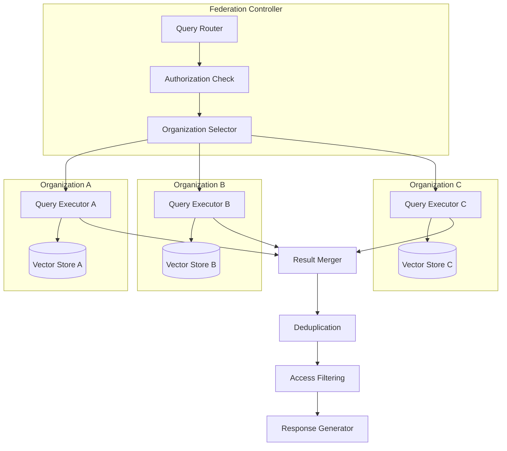
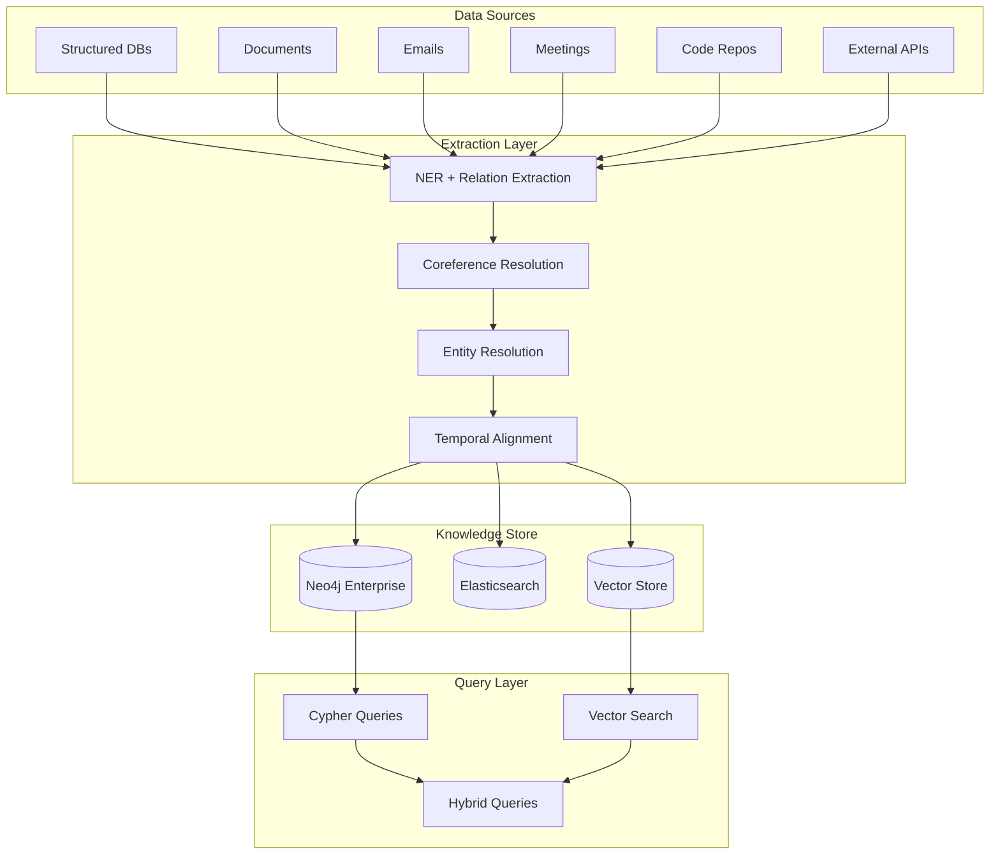
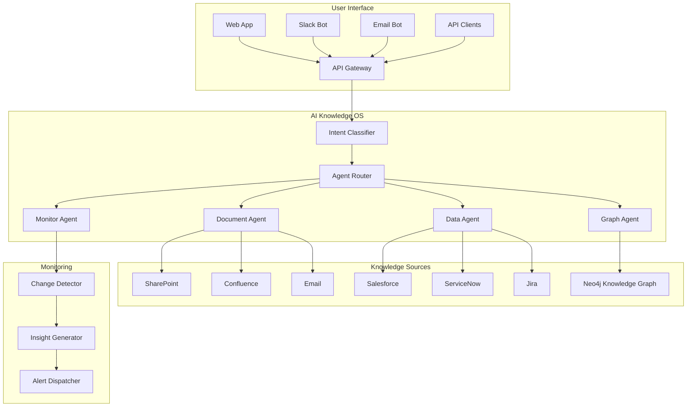

# Chapter 16: Advanced Enterprise RAG

> "The future of enterprise knowledge is not better search — it is systems that understand, reason, and act on the organization's collective intelligence."

---

**Last verified: June 2026.**

## Introduction

In the preceding chapters, we built RAG systems that retrieved documents and generated answers. But the most impactful applications of RAG go beyond question-answering. They involve systems that autonomously monitor compliance, detect anomalies across thousands of documents, synthesize insights from fragmented knowledge sources, and make decisions that would take teams of analysts weeks to accomplish. These are the systems that separate Staff Engineers from Principal Architects — not because they use fancier algorithms, but because they solve problems at a scale and complexity that standard RAG cannot reach.

Advanced enterprise RAG encompasses architectures that extend the basic retrieval-generation paradigm: federated search across organizational boundaries, corrective mechanisms that detect and fix retrieval failures, self-reflective systems that verify their own outputs, adaptive strategies that optimize cost and quality per query, and hierarchical knowledge organization that enables retrieval at multiple levels of abstraction. These are not research curiosities — they are production patterns deployed at scale in financial services, healthcare, and technology companies.

The central thesis of this chapter is the **architecture-evolution principle**: RAG architectures evolve from simple to complex as the organization's knowledge maturity grows. The progression is: keyword search → semantic search (RAG) → knowledge graphs (GraphRAG) → agentic reasoning (Agentic RAG) → autonomous knowledge systems (AI Knowledge Operating Systems). Each step adds capability but also complexity. The architect's role is to determine which level of sophistication is appropriate for each use case — and to build the evaluation, governance, and reliability infrastructure that makes it safe.

We will examine federated RAG, corrective RAG (CRAG), self-RAG, adaptive RAG, hierarchical retrieval with RAPTOR, enterprise knowledge graphs, AI Knowledge Operating Systems, and the future of enterprise knowledge management.

### The Architecture Evolution

| Stage | Capability | Complexity | Cost | Best For |
|-------|-----------|------------|------|----------|
| Keyword Search | Find exact matches | Low | Low | Simple FAQs |
| Semantic Search (RAG) | Find similar text | Medium | Medium | Document Q&A |
| GraphRAG | Find related entities | High | High | Relationship queries |
| Agentic RAG | Multi-step reasoning | Very High | Very High | Complex analysis |
| AI Knowledge OS | Autonomous knowledge management | Extreme | Extreme | Enterprise-wide intelligence |

---

## 16.1 Federated RAG

### 16.1.1 Cross-Organization Search

Federated RAG searches across multiple organizations without centralizing data. Each organization maintains its own vector database. A federated query sends requests to all authorized organizations, merges results, and returns a unified response.



```python
class FederatedRAG:
    def __init__(self, organizations: dict):
        self.orgs = organizations  # org_id -> vector_store
        self.auth = FederatedAuth()

    async def query(
        self, query: str, user: User, authorized_orgs: list[str]
    ) -> dict:
        # Verify which organizations the user can access
        accessible = await self.auth.get_accessible_orgs(user, authorized_orgs)

        # Query all accessible organizations in parallel
        import asyncio
        tasks = [
            self._query_org(query, org_id)
            for org_id in accessible
        ]
        results = await asyncio.gather(*tasks, return_exceptions=True)

        # Collect successful results
        all_results = []
        for i, result in enumerate(results):
            if not isinstance(result, Exception):
                all_results.extend(result)

        # Merge and deduplicate
        merged = self._merge_results(all_results)

        # Generate unified response
        response = await self._generate_response(query, merged)

        return {
            "answer": response,
            "sources": merged,
            "organizations_queried": accessible,
            "results_per_org": {
                org: len([r for r in merged if r["org_id"] == org])
                for org in accessible
            }
        }

    def _merge_results(self, results: list[dict]) -> list[dict]:
        """Merge and deduplicate results across organizations."""
        seen = set()
        unique = []
        for r in results:
            # Use content hash for deduplication
            content_hash = hash(r["content"][:200])
            if content_hash not in seen:
                seen.add(content_hash)
                unique.append(r)

        # Sort by relevance score
        unique.sort(key=lambda x: x["score"], reverse=True)
        return unique[:20]
```

### 16.1.2 Federated Authorization

```python
class FederatedAuth:
    def __init__(self):
        self.org_permissions = {}  # user_id -> set of accessible org_ids

    async def get_accessible_orgs(
        self, user: User, requested_orgs: list[str]
    ) -> list[str]:
        """Return the intersection of requested and accessible organizations."""
        user_orgs = self.org_permissions.get(user.user_id, set())
        return [org for org in requested_orgs if org in user_orgs]

    async def verify_cross_org_access(
        self, user: User, source_org: str, target_org: str
    ) -> bool:
        """Verify user can access data from target_org via source_org query."""
        # Check if user has access to target org
        if target_org not in self.org_permissions.get(user.user_id, set()):
            return False

        # Check federation agreement between orgs
        if not self._has_federation_agreement(source_org, target_org):
            return False

        return True
```

### 16.1.3 Federated RAG Trade-offs

| Aspect | Centralized | Federated | Hybrid |
|--------|------------|-----------|--------|
| Data sovereignty | Data leaves org | Data stays in org | Depends |
| Query latency | Low (single store) | High (multiple stores) | Medium |
| Consistency | Strong | Eventual | Configurable |
| Complexity | Low | High | Medium |
| Cost | Lower storage | Higher (replication) | Medium |
| Compliance | Easier | Harder (cross-border) | Depends |

---

## 16.2 Corrective RAG (CRAG)

### 16.2.1 Retrieval Quality Evaluation

After initial retrieval, CRAG evaluates quality and takes corrective action:

```python
class CorrectiveRAG:
    def __init__(self, tools: dict, llm):
        self.tools = tools
        self.llm = llm

    async def query(self, query: str) -> dict:
        # Step 1: Initial retrieval
        initial_results = await self.tools["vector_search"].execute(query)

        # Step 2: Evaluate retrieval quality
        evaluation = await self._evaluate_retrieval(query, initial_results["documents"])

        # Step 3: Take corrective action based on evaluation
        if evaluation["verdict"] == "correct":
            # Documents are relevant, proceed
            context = evaluation["refined_documents"]
            strategy = "direct"

        elif evaluation["verdict"] == "ambiguous":
            # Partially relevant, use knowledge refinement
            context = await self._knowledge_refinement(
                query, initial_results["documents"]
            )
            strategy = "refined"

        else:  # incorrect
            # Not relevant, trigger web search
            web_results = await self.tools["web_search"].execute(query)
            context = web_results["documents"]
            strategy = "web_search"

        # Step 4: Generate answer
        answer = await self._generate(query, context)

        return {
            "answer": answer,
            "strategy": strategy,
            "evaluation": evaluation,
            "documents_used": len(context)
        }

    async def _evaluate_retrieval(self, query: str, documents: list[dict]) -> dict:
        prompt = f"""Evaluate the quality of these retrieved documents for the query.

Query: {query}
Documents:
{[d['content'][:300] for d in documents[:5]]}

Determine:
1. verdict: "correct" (highly relevant), "ambiguous" (partially relevant), "incorrect" (irrelevant)
2. relevance_score: 0.0-1.0
3. refined_documents: extract the most relevant passages from each document
4. reasoning: why this verdict

Return JSON."""

        return await self.llm.extract(prompt, schema=dict)

    async def _knowledge_refinement(self, query: str, documents: list[dict]) -> list[str]:
        prompt = f"""Refine these documents to extract only information relevant to the query.

Query: {query}
Documents: {[d['content'][:500] for d in documents]}

For each document:
1. Extract sentences/passages relevant to the query
2. Remove irrelevant or contradictory information
3. Synthesize into coherent passages

Return refined passages as JSON array."""

        return await self.llm.extract(prompt, schema=list)
```

### 16.2.2 CRAG Correction Strategies

| Verdict | Strategy | Action | Cost Impact | Quality Impact |
|---------|----------|--------|-------------|----------------|
| Correct | Direct | Use retrieved documents as-is | None | None |
| Ambiguous | Refinement | Extract relevant passages, discard noise | +50% LLM cost | +10-20% quality |
| Incorrect | Web search | Query web for relevant information | +100% LLM cost | +30-50% quality |
| Incorrect | Query reformulation | Reformulate and re-retrieve | +75% LLM cost | +20-40% quality |

---

## 16.3 Self-RAG

### 16.3.1 Self-Reflection Mechanism

Self-RAG adds reflection tokens that the model uses to evaluate its own output:

```python
class SelfRAG:
    def __init__(self, llm):
        self.llm = llm

    async def query(self, query: str) -> dict:
        # Initial retrieval
        documents = await self._retrieve(query)

        # Generate initial response
        draft = await self._generate(query, documents)

        # Self-reflect
        reflection = await self._reflect(query, draft, documents)

        max_iterations = 3
        iteration = 0

        while not reflection["is_satisfactory"] and iteration < max_iterations:
            if reflection.get("needs_more_retrieval"):
                # Retrieve additional documents
                new_query = reflection.get("retrieval_query", query)
                new_docs = await self._retrieve(new_query)
                documents.extend(new_docs)

            # Regenerate with improved context
            draft = await self._generate(query, documents)

            # Re-reflect
            reflection = await self._reflect(query, draft, documents)
            iteration += 1

        return {
            "answer": draft,
            "iterations": iteration,
            "reflection": reflection,
            "documents_used": len(documents)
        }

    async def _reflect(self, query: str, answer: str, documents: list[str]) -> dict:
        prompt = f"""Reflect on the quality of this RAG answer.

Query: {query}
Answer: {answer}
Context: {documents[:3]}

Evaluate:
1. is_satisfactory: does the answer fully address the query?
2. faithfulness: is every claim supported by the context?
3. completeness: are all aspects of the query covered?
4. needs_more_retrieval: is additional retrieval needed?
5. retrieval_query: if more retrieval needed, what query to use?
6. missing_claims: list of claims lacking evidence
7. unsupported_claims: list of claims not in context

Return JSON."""

        return await self.llm.extract(prompt, schema=dict)
```

### 16.3.2 Self-RAG Quality Improvement

| Iteration | Avg Quality Score | Avg Cost | Avg Latency |
|-----------|------------------|----------|-------------|
| 1 (initial) | 0.75 | $0.02 | 3s |
| 2 (first reflection) | 0.85 | $0.05 | 8s |
| 3 (second reflection) | 0.90 | $0.08 | 13s |
| 4 (third reflection) | 0.92 | $0.11 | 18s |

*Diminishing returns after 2-3 iterations. Optimal stopping point depends on quality requirements.*

---

## 16.4 Adaptive RAG

### 16.4.1 Strategy Selection

Adaptive RAG selects the optimal retrieval strategy based on query complexity:

```python
class AdaptiveRAG:
    def __init__(self, strategies: dict, llm):
        self.strategies = strategies
        self.llm = llm

    async def query(self, query: str) -> dict:
        # Classify query complexity
        complexity = await self._classify_complexity(query)

        # Select strategy
        strategy_name = self._select_strategy(complexity)
        strategy = self.strategies[strategy_name]

        # Execute
        result = await strategy.execute(query)

        return {
            "answer": result["answer"],
            "strategy_used": strategy_name,
            "complexity": complexity,
            "cost": result.get("cost", 0),
            "latency": result.get("latency", 0)
        }

    async def _classify_complexity(self, query: str) -> dict:
        prompt = f"""Classify this query's complexity.

Query: {query}

Determine:
1. complexity: "simple", "moderate", "complex"
2. requires_multi_hop: boolean
3. requires_cross_source: boolean
4. requires_reasoning: boolean
5. estimated_difficulty: 1-5

Return JSON."""

        return await self.llm.extract(prompt, schema=dict)

    def _select_strategy(self, complexity: dict) -> str:
        if complexity["complexity"] == "simple":
            return "direct_retrieval"
        elif complexity["complexity"] == "moderate":
            return "multi_step_retrieval"
        elif complexity.get("requires_cross_source"):
            return "parallel_retrieval"
        else:
            return "agentic_retrieval"
```

### 16.4.2 Strategy Performance Comparison

| Strategy | Simple Queries | Moderate Queries | Complex Queries | Cost |
|----------|---------------|-----------------|-----------------|------|
| Direct retrieval | 0.88 quality, 1.2s | 0.65 quality, 1.2s | 0.45 quality, 1.2s | $0.003 |
| Multi-step | 0.85 quality, 3s | 0.82 quality, 5s | 0.70 quality, 8s | $0.025 |
| Parallel multi-tool | 0.80 quality, 4s | 0.85 quality, 6s | 0.80 quality, 10s | $0.040 |
| Agentic (tree-of-thought) | 0.82 quality, 8s | 0.88 quality, 12s | 0.92 quality, 18s | $0.080 |

---

## 16.5 Hierarchical Retrieval (RAPTOR)

### 16.5.1 Recursive Abstractive Processing

RAPTOR creates hierarchical document summaries that enable retrieval at multiple levels of abstraction:

```python
class RAPTORIndexer:
    def __init__(self, llm, embedding_model):
        self.llm = llm
        self.embedder = embedding_model

    async def build_tree(self, documents: list[str]) -> dict:
        """Build a hierarchical tree of document summaries."""
        # Level 0: raw chunks
        current_level = [
            {"text": doc, "level": 0, "id": f"chunk_{i}"}
            for i, doc in enumerate(documents)
        ]

        tree = {"levels": [current_level]}
        level = 0

        while len(current_level) > 1:
            level += 1
            next_level = []

            # Cluster documents by embedding similarity
            clusters = self._cluster_documents(current_level)

            # Summarize each cluster
            for cluster_id, cluster_docs in enumerate(clusters):
                summary = await self._summarize_cluster(cluster_docs)
                next_level.append({
                    "text": summary,
                    "level": level,
                    "id": f"summary_L{level}_{cluster_id}",
                    "children": [d["id"] for d in cluster_docs]
                })

            tree["levels"].append(next_level)
            current_level = next_level

        tree["root"] = current_level[0] if current_level else None
        return tree

    def _cluster_documents(self, documents: list[dict], n_clusters: int = 5) -> list[list]:
        """Cluster documents by embedding similarity."""
        embeddings = np.array([
            self.embedder.encode(doc["text"]) for doc in documents
        ])

        from sklearn.cluster import KMeans
        n_clusters = min(n_clusters, len(documents))
        kmeans = KMeans(n_clusters=n_clusters)
        labels = kmeans.fit_predict(embeddings)

        clusters = [[] for _ in range(n_clusters)]
        for doc, label in zip(documents, labels):
            clusters[label].append(doc)
        return clusters

    async def _summarize_cluster(self, cluster_docs: list[dict]) -> str:
        texts = [d["text"][:500] for d in cluster_docs]
        prompt = f"""Summarize these related documents into a concise overview.

Documents:
{texts}

Provide a comprehensive summary that captures the key themes and information."""

        return await self.llm.generate(prompt)
```

### 16.5.2 Hierarchical Retrieval

```python
classRAPTORRetriever:
    def __init__(self, tree: dict, embedder):
        self.tree = tree
        self.embedder = embedder

    async def retrieve(self, query: str, top_k: int = 5) -> list[dict]:
        """Retrieve from multiple levels of the tree."""
        query_emb = self.embedder.encode(query)

        all_candidates = []

        # Search each level
        for level_idx, level in enumerate(self.tree["levels"]):
            for node in level:
                node_emb = self.embedder.encode(node["text"])
                similarity = np.dot(query_emb, node_emb) / (
                    np.linalg.norm(query_emb) * np.linalg.norm(node_emb)
                )
                all_candidates.append({
                    "text": node["text"],
                    "level": level_idx,
                    "similarity": similarity,
                    "node_id": node["id"]
                })

        # Sort by similarity
        all_candidates.sort(key=lambda x: x["similarity"], reverse=True)

        # Return top-k, preferring higher-level summaries for overview queries
        return all_candidates[:top_k]
```

### 16.5.3 RAPTOR Retrieval Levels

| Level | Content | Best For | Context Window |
|-------|---------|----------|----------------|
| Level 0 (raw) | Original document chunks | Specific details, quotes | Small |
| Level 1 | Section summaries | Topic overviews | Medium |
| Level 2 | Chapter summaries | High-level themes | Large |
| Level 3 | Document summary | Executive overview | Very large |
| Root | Collection summary | Organization-wide insights | Full collection |

---

## 16.6 Enterprise Knowledge Graphs at Scale

### 16.6.1 Knowledge Graph Architecture



### 16.6.2 Knowledge Graph Metrics

| Metric | Target | Measurement |
|--------|--------|-------------|
| Entity coverage | >90% | % of known entities in graph |
| Relationship accuracy | >85% | Precision of extracted relationships |
| Freshness | <24 hours | Time from data change to graph update |
| Query latency (p95) | <500ms | Cypher query performance |
| Entity resolution precision | >95% | % of correct entity merges |
| Graph completeness | >80% | % of expected relationships present |

---

## 16.7 AI Knowledge Operating Systems

### 16.7.1 The Vision

An AI Knowledge Operating System (AI-KOS) is an intelligent layer that sits on top of all organizational knowledge sources and provides:

1. **Unified access**: Query all knowledge sources through a single interface
2. **Autonomous monitoring**: Continuously scan for changes, anomalies, and insights
3. **Proactive alerts**: Notify stakeholders of relevant changes without being asked
4. **Knowledge synthesis**: Combine information from multiple sources into insights
5. **Action recommendations**: Suggest actions based on knowledge analysis

```python
class AIKnowledgeOS:
    def __init__(self):
        self.sources = {}  # source_id -> connector
        self.knowledge_graph = EnterpriseKnowledgeGraph()
        self.vector_store = UnifiedVectorStore()
        self.monitors = {}  # monitor_id -> monitor config
        self.agents = {}  # agent_id -> specialized agent

    async def register_source(self, source_id: str, connector):
        """Register a new knowledge source."""
        self.sources[source_id] = connector
        await self._sync_source(source_id)

    async def query(self, query: str, user: User) -> dict:
        """Unified query across all knowledge sources."""
        # Classify query intent
        intent = await self._classify_intent(query)

        # Route to appropriate agent
        agent = self._select_agent(intent)
        result = await agent.execute(query, user)

        return result

    async def monitor(self, monitor_id: str, config: dict):
        """Set up continuous monitoring for knowledge changes."""
        self.monitors[monitor_id] = config
        # Start background monitoring task
        asyncio.create_task(self._run_monitor(monitor_id))

    async def _run_monitor(self, monitor_id: str):
        """Background monitoring loop."""
        config = self.monitors[monitor_id]
        while True:
            for source_id, connector in self.sources.items():
                changes = await connector.get_recent_changes(
                    since=config["last_check"]
                )
                if changes:
                    insights = await self._analyze_changes(changes, config)
                    if insights:
                        await self._notify_stakeholders(config["stakeholders"], insights)
            await asyncio.sleep(config["check_interval_seconds"])
```

### 16.7.2 Proactive Knowledge Monitoring

| Monitor Type | What It Watches | Alert Trigger | Stakeholders |
|-------------|----------------|---------------|--------------|
| Compliance | Regulatory documents | New regulation published | Legal, Compliance |
| Competitive | Competitor filings, news | Competitor launches product | Strategy, Product |
| Financial | Earnings, market data | Significant price movement | Finance, Executives |
| Technical | Code repos, docs | Security vulnerability | Engineering, Security |
| Customer | Support tickets, feedback | Satisfaction drop | Support, Product |
| Operational | Incident reports, SLAs | SLA breach imminent | Operations, Management |

---

## 16.8 Research Frontiers

### 16.8.1 Emerging Patterns

| Pattern | Description | Maturity | Potential Impact |
|---------|-------------|----------|-----------------|
| CRAG (Corrective RAG) | Detect and fix retrieval failures | Production | High |
| Self-RAG | Model reflects on its own output | Production | High |
| RAPTOR | Hierarchical document retrieval | Production | Medium |
| GraphRAG | Knowledge graphs + vector retrieval | Production | High |
| Adaptive RAG | Strategy selection by complexity | Early production | Medium |
| CRAG + Web | Hybrid retrieval with web fallback | Production | Medium |
| Multi-agent RAG | Specialized agents for different domains | Research | High |
| Causal RAG | Reason about cause and effect | Research | Very High |

### 16.8.2 Research Directions

| Direction | Challenge | Current Approach | Gap |
|-----------|-----------|-----------------|-----|
| Long-context RAG | Documents exceeding context windows | Chunking + summarization | Information loss at boundaries |
| Multimodal GraphRAG | Combining images, text, and graphs | Separate pipelines | No unified framework |
| Real-time RAG | Sub-100ms latency for live data | Caching + streaming | Freshness vs. latency trade-off |
| Causal reasoning | Understanding cause and effect | Chain-of-thought prompting | Limited causal inference |
| Privacy-preserving RAG | Querying without revealing intent | Differential privacy | Privacy vs. utility trade-off |
| Zero-shot RAG | No training data for new domains | In-context learning | Quality below supervised |

---

## 16.9 Case Study: Enterprise Knowledge Operating System

### 16.9.1 Problem Statement

A multinational corporation (50,000 employees, 100+ knowledge systems) needs a unified knowledge layer. Information is scattered across 15+ systems: SharePoint, Confluence, Jira, Salesforce, ServiceNow, email, Slack, and custom databases. Employees spend 30% of their time searching for information that exists somewhere in the organization.

Requirements:
- Query all knowledge sources through a single interface
- Maintain access controls across all sources
- Proactively surface relevant insights
- Support 5,000 concurrent users
- Cost under $0.05/query

### 16.9.2 Architecture



### 16.9.3 Cost Calculations

**Monthly volume**: 5,000 users x 10 queries/day x 30 days = 1,500,000 queries/month

| Component | Monthly Cost | Notes |
|-----------|-------------|-------|
| Compute (ECS Fargate) | $8,000 | 20 tasks |
| Vector store (Pinecone) | $2,000 | 50M vectors |
| Knowledge graph (Neo4j) | $3,000 | Enterprise cluster |
| LLM API (GPT-4o) | $15,000 | ~500K calls |
| LLM API (failover) | $2,000 | ~50K calls |
| Monitoring infrastructure | $1,500 | CloudWatch + custom |
| Source connectors | $1,000 | API costs |
| **Total monthly** | **$32,500** | |
| **Cost per query** | **$0.0217** | |

**Comparison with current state:**

| Metric | Current (Siloed) | Proposed (AI-KOS) | Improvement |
|--------|-----------------|-------------------|-------------|
| Time to find information | 30 min avg | 3 min avg | 90% reduction |
| Cross-source queries | Impossible | Native | New capability |
| Proactive insights | None | 500+/month | New capability |
| Monthly productivity saved | — | 75,000 hours | $7.5M savings |
| Monthly technology cost | $0 | $32,500 | $32,500 new cost |
| **Net monthly savings** | | | **$7.47M** |
| **Annual ROI** | | | **$89.6M** |

---

## 16.10 Testing Advanced RAG

### 16.10.1 Evaluation Metrics

| Metric | Static RAG | Advanced RAG Target |
|--------|-----------|---------------------|
| Faithfulness | 0.80 | >0.92 |
| Relevancy | 0.78 | >0.90 |
| Completeness | 0.70 | >0.88 |
| Hallucination rate | 0.15 | <0.05 |
| Multi-hop accuracy | 0.55 | >0.80 |
| Cross-source accuracy | 0.40 | >0.75 |

### 16.10.2 Testing Strategy

```python
class AdvancedRAGTester:
    def __init__(self, system):
        self.system = system

    async def test_corrective_rag(self):
        """Test that CRAG detects and fixes retrieval failures."""
        # Query with deliberately poor retrieval
        result = await self.system.query("What is the revenue trend for Product X?")
        assert result["strategy"] in ["refined", "web_search"]
        assert result["evaluation"]["relevance_score"] > 0.5

    async def test_self_rag(self):
        """Test that self-RAG catches hallucinations."""
        # Query that should trigger reflection
        result = await self.system.query("What are the exact Q3 2025 revenue figures?")
        assert result["iterations"] > 0
        assert result["reflection"]["faithfulness"] > 0.8

    async def test_adaptive_rag(self):
        """Test that adaptive RAG selects appropriate strategy."""
        # Simple query should use direct retrieval
        simple = await self.system.query("What is our return policy?")
        assert simple["strategy_used"] == "direct_retrieval"

        # Complex query should use advanced strategy
        complex = await self.system.query(
            "Compare our Q3 revenue growth against competitors "
            "mentioned in the analyst report, accounting for currency adjustments"
        )
        assert complex["strategy_used"] in ["multi_step_retrieval", "agentic_retrieval"]
```

---

## 16.11 Key Takeaways

1. **Federated RAG enables cross-organization search without data centralization.** Each organization maintains its own vector database. A federation controller manages authorization and merges results. This preserves data sovereignty while enabling collaborative intelligence.

2. **Corrective RAG detects and fixes retrieval failures.** After initial retrieval, CRAG evaluates quality and applies corrective strategies: knowledge refinement for ambiguous results, web search for irrelevant results. This catches failures before they affect generated answers.

3. **Self-RAG improves quality through reflection.** The model evaluates its own output for faithfulness, completeness, and accuracy. If gaps are found, it retrieves additional information and regenerates. This adds latency and cost but significantly improves quality for high-stakes applications.

4. **Adaptive RAG optimizes the cost-quality trade-off.** By classifying query complexity and selecting the appropriate retrieval strategy, adaptive RAG uses simple retrieval for simple queries and complex strategies for complex queries. This optimizes average cost while maintaining quality.

5. **RAPTOR enables hierarchical retrieval at multiple abstraction levels.** By recursively summarizing documents into a tree structure, RAPTOR enables retrieval at the appropriate level of abstraction — specific details from leaf nodes, high-level themes from summary nodes.

6. **Enterprise knowledge graphs provide the relational foundation for AI-KOS.** Knowledge graphs capture entity relationships that vector search misses. At enterprise scale, they enable multi-hop reasoning, compliance lineage, and organizational intelligence.

7. **AI Knowledge Operating Systems are the future of enterprise knowledge.** They combine unified access, autonomous monitoring, proactive alerts, and knowledge synthesis into a single intelligent layer. The ROI is measured in productivity savings, not just cost reduction.

8. **The architecture evolution is incremental, not revolutionary.** Start with semantic search (RAG), add knowledge graphs (GraphRAG) when relationships matter, add agentic capabilities for complex queries, and evolve toward AI-KOS as the organization's knowledge maturity grows.

9. **Advanced RAG costs 5-20x more than basic RAG.** The additional LLM calls for reflection, correction, and multi-step retrieval increase cost and latency. The investment is justified for high-value, complex queries where quality matters more than cost.

10. **Build evaluation infrastructure before deploying advanced RAG.** Advanced RAG systems are harder to debug and evaluate than basic RAG. Invest in comprehensive evaluation, monitoring, and observability from the start.

---

## 16.12 Further Reading

- **"Corrective Retrieval Augmented Generation" (Yan et al., 2024)** — The CRAG paper introducing retrieval quality evaluation and corrective strategies. Essential for understanding how to detect and fix retrieval failures.

- **"Self-RAG: Learning to Retrieve, Generate, and Critique through Self-Reflection" (Asai et al., 2023)** — Research on self-reflective RAG with learned retrieval tokens. Key for understanding how models can evaluate their own outputs.

- **"RAPTOR: Recursive Abstractive Processing for Tree-Organized Retrieval" (Sarthi et al., 2024)** — The RAPTOR paper introducing hierarchical document retrieval. Important for multi-level abstraction queries.

- **"GraphRAG: Graph Retrieval-Augmented Generation" (Microsoft Research, 2024)** — Microsoft's framework combining knowledge graphs with vector retrieval. Covers community detection for hierarchical summarization.

- **"Adaptive Retrieval-Augmented Generation" (Jeong et al., 2024)** — Research on dynamically selecting retrieval strategies based on query complexity. Directly applicable to adaptive RAG systems.

- **"A Survey on RAG Meets LLMs: Towards Retrieval-Augmented Large Language Models" (Fan et al., 2024)** — Comprehensive survey of RAG advancements including corrective, self-reflective, and adaptive approaches.

- **"Building AI-Powered Search and Knowledge Systems" (Chip Huyen, 2024)** — Practical guide to building enterprise knowledge systems covering retrieval, indexing, and evaluation at scale.

- **"Knowledge Graphs in Industry" (Hogan et al., 2024)** — Survey of knowledge graph applications in enterprise settings including construction, maintenance, and querying patterns.

- **LangGraph Documentation** (langchain-ai.github.io/langgraph) — Official documentation for building advanced agentic workflows including self-reflection, corrective retrieval, and adaptive strategies.

- **"The Future of Enterprise Knowledge Management" (Gartner, 2024)** — Industry analysis on the evolution of enterprise knowledge systems toward AI-native operating systems.
