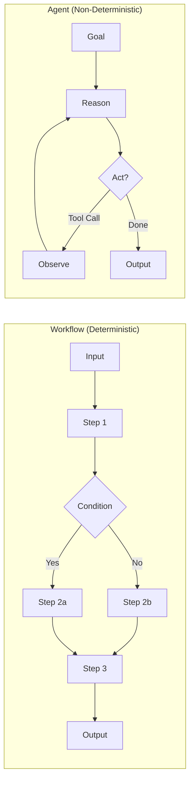
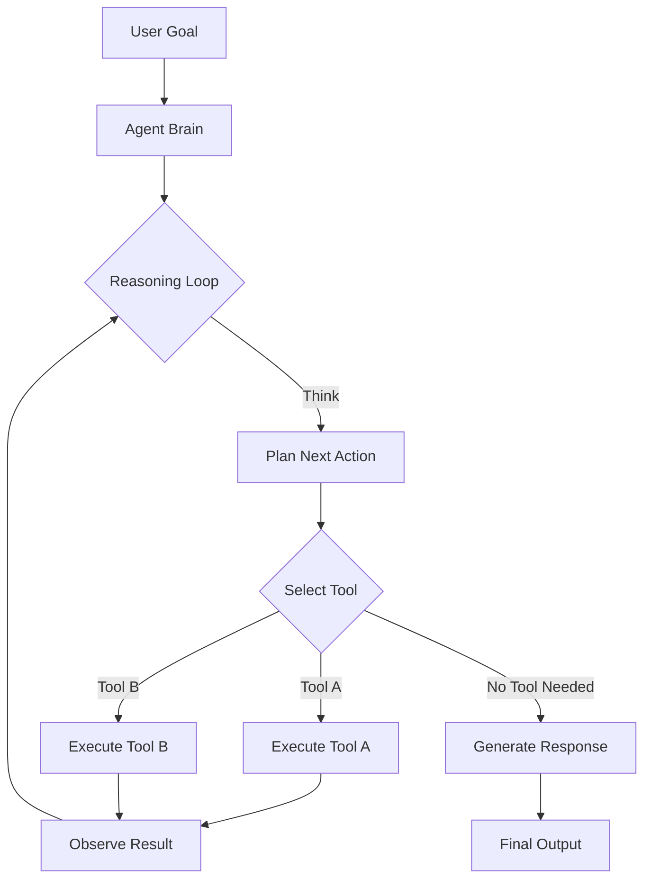
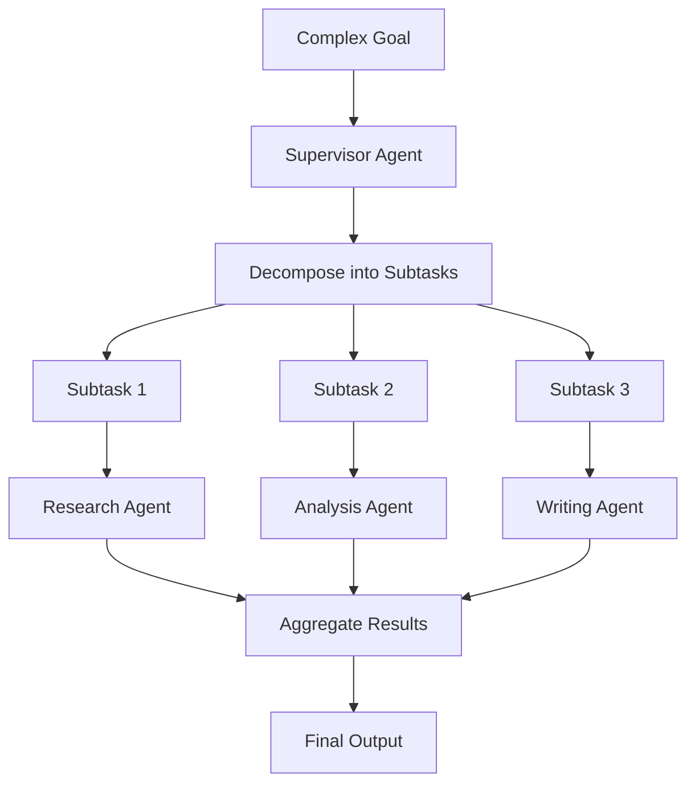
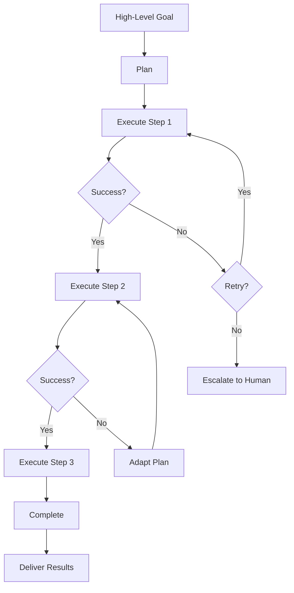
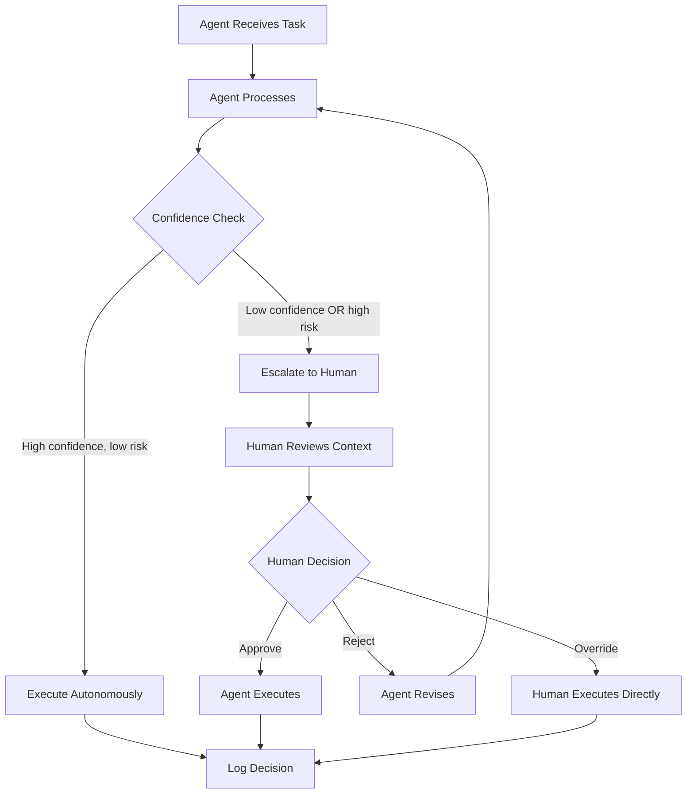
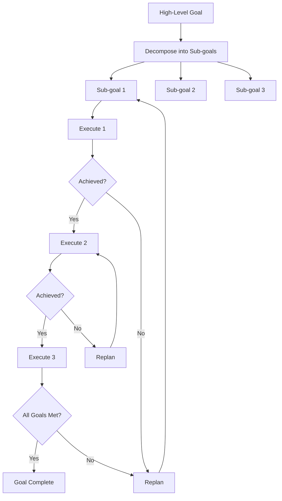
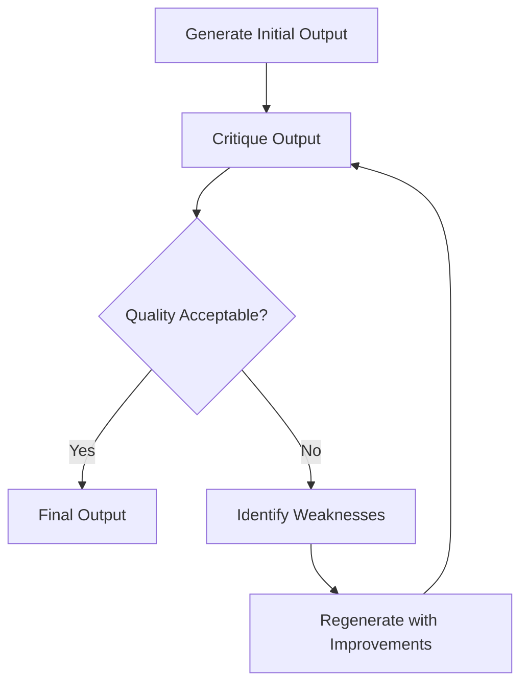

# Chapter 1: Agentic AI Fundamentals

The shift from LLM-as-chatbot to LLM-as-autonomous-agent is the defining architectural change in production AI systems. Understanding the precise vocabulary and mental models for agents — what they are, how they differ from simpler patterns, and what kinds exist — is the foundation for every decision that follows in this book.

## Agent vs Workflow

The most consequential distinction in agentic AI is between an agent and a workflow. The difference determines predictability, cost, debugging approach, and which problems each can solve.



A **workflow** is a predetermined sequence of steps. Control flow is defined upfront — step A goes to step B, which branches to step C or D based on a condition. The system follows the path you defined. Every possible execution path is known before running.

An **agent** is a system that reasons about what to do next. Given a goal and a set of tools, the agent decides — at runtime — which actions to take, in what order, and when to stop. Control flow emerges from the agent's reasoning at each step.

This is not a binary distinction. Most production systems use workflows for the parts that need predictability and agents for the parts that require judgment. A customer support system might use a workflow to route incoming requests, an agent to reason about the answer, and a workflow again to format and deliver the response.

| Dimension | Workflow | Agent |
|-----------|----------|-------|
| Control flow | Defined upfront | Decided at runtime |
| Predictability | High — every path is known | Variable — depends on LLM reasoning |
| Flexibility | Low — new cases require code changes | High — handles novel inputs |
| Debuggability | Straightforward — step-by-step trace | Complex — reasoning is opaque |
| Cost | Predictable — fixed LLM calls per path | Variable — loops can consume unbounded tokens |
| Failure modes | Known — handle each path's failures | Unknown — LLM can take unexpected actions |
| Best for | Known sequences with clear logic | Open-ended reasoning requiring judgment |

**When to choose workflow over agent:**
- The decision tree is finite and well-understood
- Regulatory requirements demand deterministic execution paths
- Cost predictability is a hard constraint
- The task can be expressed as a finite state machine

**When to choose agent over workflow:**
- The input space is too large to enumerate paths
- The task requires natural language understanding and reasoning
- Novel edge cases are common
- The value of correct judgment exceeds the cost of token variability

```python
# Workflow: deterministic routing with LangGraph
from langgraph.graph import StateGraph, END
from typing import TypedDict, Literal

class OrderState(TypedDict):
    order_type: str
    priority: str
    result: str

def route_order(state: OrderState) -> Literal["express", "standard", "review"]:
    if state["priority"] == "urgent":
        return "express"
    elif state["priority"] == "review":
        return "review"
    return "standard"

def process_express(state: OrderState) -> dict:
    return {"result": "Express processing: skip queue, priority fulfillment"}

def process_standard(state: OrderState) -> dict:
    return {"result": "Standard processing: normal queue, 3-day SLA"}

def process_review(state: OrderState) -> dict:
    return {"result": "Manual review required: flagged for human inspection"}

# Build the workflow graph
graph = StateGraph(OrderState)
graph.add_conditional_edges("route_order", route_order)
graph.add_node("express", process_express)
graph.add_node("standard", process_standard)
graph.add_node("review", process_review)
graph.set_entry_point("route_order")
graph.add_edge("express", END)
graph.add_edge("standard", END)
graph.add_edge("review", END)

workflow = graph.compile()
result = workflow.invoke({"order_type": "widget", "priority": "urgent", "result": ""})
```

```python
# Agent: non-deterministic reasoning with LangGraph
from langgraph.prebuilt import create_react_agent
from langchain_openai import ChatOpenAI
from langchain_core.tools import tool

@tool
def check_inventory(product_id: str) -> str:
    """Check current inventory for a product."""
    # Real implementation: query inventory database
    return f"Product {product_id}: 247 units in stock"

@tool
def calculate_shipping(order: str, address: str) -> str:
    """Calculate shipping cost and delivery time."""
    return f"Shipping to {address}: $12.99, arrives in 2-3 days"

@tool
def process_payment(order_id: str, amount: float) -> str:
    """Process payment for an order."""
    return f"Payment processed: ${amount} charged to order {order_id}"

# Agent decides which tools to call and in what order
agent = create_react_agent(
    ChatOpenAI(model="gpt-5.4"),
    tools=[check_inventory, calculate_shipping, process_payment],
)

result = agent.invoke({
    "messages": [("user", "Check if product ABC-123 is in stock, calculate shipping to 123 Main St, and process payment of $89.99 for order ORD-456")]
})
```

The key difference: the workflow takes the same path every time for the same input. The agent reasons about what tools to call, in what order, and may take different paths for similar inputs.

## Agent vs Assistant

An **assistant** is a conversational interface backed by an LLM. It responds to user messages, maintains conversation history, and typically operates within a single turn. Assistants are stateless across sessions unless you build state management on top.

An **agent** goes further. It has access to tools, can take actions in the world, maintains state across interactions, and pursues goals that may span multiple turns and external systems.

In practice, many systems called "AI assistants" are actually agents — they use tool calling, maintain context, and perform multi-step operations. The distinction is about capability and autonomy, not terminology.

| Capability | Assistant | Agent |
|-----------|----------|-------|
| Conversation | ✓ | ✓ |
| Tool calling | Optional | Required |
| State across turns | Built on top | Native |
| Autonomous action | ✗ | ✓ |
| Multi-step task completion | Limited | Required |
| Goal persistence | ✗ | ✓ |

## Single Agent Systems

A single agent system is the simplest form of agentic AI. One LLM, one set of tools, one reasoning loop.



**Architecture of a single agent:**
1. **Receive goal** — user input or system trigger
2. **Reason** — LLM plans next action based on current state
3. **Act** — call a tool, search, or generate output
4. **Observe** — process the tool result
5. **Repeat** — loop back to step 2 until goal is achieved or stopping condition is met

Single agent systems work well when:
- The task is well-scoped and can be completed in a bounded number of steps
- The tools required are all available to one agent
- The reasoning does not require multiple perspectives or specializations
- Failure modes are simple enough for one agent to handle

**The tool selection problem:** As the number of tools increases, the agent's ability to select the correct tool decreases. Research shows tool selection accuracy drops significantly above 15-20 tools. This is the primary reason to move from single agent to multi agent — each agent has a focused toolset.

```python
# Single agent with bounded tool set
from langgraph.prebuilt import create_react_agent
from langchain_openai import ChatOpenAI
from langchain_core.tools import tool

@tool
def search_knowledge_base(query: str) -> str:
    """Search internal documentation for relevant information."""
    return f"Found 3 results for: {query}"

@tool
def escalate_to_human(issue: str, context: str) -> str:
    """Escalate unresolved issues to human support team."""
    return f"Escalated: {issue}"

@tool
def create_ticket(title: str, description: str, priority: str) -> str:
    """Create a support ticket in the ticketing system."""
    return f"Ticket created: {title} (priority: {priority})"

# Single agent with 3 focused tools — good accuracy
support_agent = create_react_agent(
    ChatOpenAI(model="gpt-5.4"),
    tools=[search_knowledge_base, escalate_to_human, create_ticket],
)
```

**Limitations of single agent systems:**
- **Tool confusion:** Too many tools → poor selection accuracy
- **Context window limits:** One agent carrying all context hits window limits faster
- **No parallelism:** Sequential reasoning — cannot do independent tasks simultaneously
- **Single point of failure:** Agent failure = system failure
- **No specialization:** Same model for all tasks, regardless of difficulty

## Multi Agent Systems

Multi agent systems decompose complex tasks across specialized agents. Instead of one agent doing everything, multiple agents — each with a focused set of tools and responsibilities — collaborate to accomplish a goal.



Multi agent systems are appropriate when:
- The problem decomposes into distinct sub-problems requiring different expertise
- You need parallel execution of independent tasks
- The reasoning for different parts of the problem benefits from different prompts or models
- You want to isolate failures so one component does not bring down the entire system

**The coordination overhead tax:** Every additional agent introduces:
- Communication latency between agents
- Shared state management complexity
- Token cost for context passing between agents
- New failure modes (deadlocks, lost messages, inconsistent state)

The justification for multi agent must outweigh this tax.

**Token cost comparison:**

```
Single Agent (15 tools, full context):
  Context: ~8,000 tokens (tools + history + reasoning)
  Per request: ~2-3 LLM calls = ~16,000-24,000 tokens

Multi Agent (3 agents, 5 tools each, filtered context):
  Supervisor: ~3,000 tokens (decomposition + aggregation)
  Worker A: ~2,000 tokens (focused tools + subtask)
  Worker B: ~2,000 tokens
  Worker C: ~2,000 tokens
  Per request: ~3 LLM calls (supervisor) + 3 (workers) = ~27,000 tokens
  
  BUT: workers can run in parallel → latency reduction
  AND: workers use smaller/cheaper models → cost reduction
```

The economics depend on model choice. If workers use a cheaper model (GPT-5.4 mini at $0.75/$4.50 per 1M tokens vs GPT-5.4 at $2.50/$15.00 per 1M tokens), multi agent can be significantly cheaper despite more total tokens.

## Autonomous Systems

An autonomous agent operates with minimal human oversight. It receives a high-level goal, breaks it into subtasks, executes them, handles failures, and delivers results — all without human intervention at each step.



Autonomy is a spectrum:

| Level | Description | Example |
|-------|-------------|---------|
| 0 | Human does everything | Human writes code manually |
| 1 | AI suggests, human decides | Copilot suggests, human accepts |
| 2 | AI acts, human reviews | Agent writes PR, human reviews |
| 3 | AI acts, human audits | Agent deploys, human reviews logs |
| 4 | AI acts autonomously | Agent handles support tickets end-to-end |

**Production autonomy requirements:**
- Robust error handling and self-correction
- Clear escalation criteria for when to ask for help
- Audit trails for every autonomous decision
- Kill switches and circuit breakers
- Cost budgets per task

## Human in the Loop Systems

HITL systems keep a human in the decision chain for critical or ambiguous actions. The agent handles routine operations autonomously but escalates to a human when confidence is low, stakes are high, or the task falls outside its training.



**Good HITL design:**
- **Clear escalation criteria:** define exactly when the agent asks for help
- **Efficient handoff:** the human gets context, not just a raw prompt
- **Feedback loops:** human decisions train the agent to handle similar cases in the future
- **Response integration:** the agent seamlessly resumes after human input

**Escalation threshold example:**

```python
# HITL escalation logic
def should_escalate(action: str, confidence: float, risk_level: str) -> bool:
    """Determine if human intervention is required."""
    # Always escalate for high-risk actions
    if risk_level in ("critical", "irreversible"):
        return True
    
    # Escalate when confidence is low
    if confidence < 0.7:
        return True
    
    # Escalate for specific action types
    high_risk_actions = {"delete_account", "process_refund", "send_mass_email"}
    if action in high_risk_actions:
        return True
    
    return False
```

## Reactive vs Proactive Agents

**Reactive agents** respond to stimuli. They receive input, process it, and produce output. The interaction is event-driven: something happens, the agent reacts.

**Proactive agents** take initiative. They monitor conditions, identify opportunities or threats, and act without being prompted.

| Dimension | Reactive | Proactive |
|-----------|----------|-----------|
| Trigger | User input or external event | Internal schedule or condition monitoring |
| Latency | As fast as the reasoning loop | May have monitoring interval delay |
| Risk | Lower — responds to known inputs | Higher — acts on its own judgment |
| Use case | Chatbots, Q&A, task execution | Anomaly detection, monitoring, alerts |
| Safety requirement | Standard | Stronger — acts without human prompt |

```python
# Proactive agent: monitoring and alerting
import asyncio
from langchain_openai import ChatOpenAI
from langchain_core.tools import tool

@tool
def check_system_metrics(service: str) -> dict:
    """Check CPU, memory, and error rates for a service."""
    # Real implementation: query Prometheus/DataDog
    return {"cpu": 78, "memory": 65, "error_rate": 0.02}

@tool
def create_incident(title: str, severity: str, description: str) -> str:
    """Create an incident in PagerDuty/Opsgenie."""
    return f"Incident created: {title} (severity: {severity})"

llm = ChatOpenAI(model="gpt-5.4")

async def monitoring_loop(services: list[str], interval: int = 60):
    """Proactive monitoring loop — checks conditions and acts."""
    while True:
        for service in services:
            metrics = check_system_metrics.invoke(service)
            
            # Agent decides if action is needed
            response = llm.invoke(
                f"Current metrics for {service}: {metrics}. "
                "Should any action be taken? If yes, what action?"
            )
            
            if "create_incident" in response.content:
                create_incident.invoke(
                    title=f"High load on {service}",
                    severity="warning",
                    description=response.content
                )
        
        await asyncio.sleep(interval)
```

## Goal Driven Agents

Goal driven agents decompose high-level objectives into actionable steps. Given a goal, the agent reasons about what sub-goals need to be achieved, what tools are available, and what sequence of actions will reach the goal.

This is fundamentally different from reactive processing. A reactive agent processes each input independently. A goal driven agent maintains a plan, tracks progress, and adapts based on intermediate results.



**Goal decomposition is one of the hardest problems in agent design.** Poor decomposition leads to:
- Agents taking irrelevant actions
- Missing critical steps
- Getting stuck in loops
- Exceeding token budgets

Good decomposition requires understanding problem structure, identifying dependencies, and prioritizing correctly.

## Planning Agents

Planning agents extend goal driven agents with explicit planning capabilities. Before acting, they generate a plan — a sequence of steps with dependencies and expected outcomes. They then execute the plan, monitoring progress and adapting when reality diverges.

```python
# Plan-and-Execute pattern with LangGraph
from typing import TypedDict, Annotated
from langgraph.graph import StateGraph, END
from langchain_openai import ChatOpenAI
from langchain_core.prompts import ChatPromptTemplate

class PlanState(TypedDict):
    goal: str
    plan: list[str]
    current_step: int
    results: Annotated[list[str], lambda x, y: x + y]
    status: str

llm = ChatOpenAI(model="gpt-5.4")

def create_plan(state: PlanState) -> dict:
    """Generate a multi-step plan for the goal."""
    response = llm.invoke(
        f"Create a step-by-step plan to achieve: {state['goal']}. "
        "Return numbered steps, each as a separate line."
    )
    steps = [line.strip() for line in response.content.split("\n") if line.strip()]
    return {"plan": steps, "current_step": 0, "status": "planning"}

def execute_step(state: PlanState) -> dict:
    """Execute the current step in the plan."""
    step = state["plan"][state["current_step"]]
    response = llm.invoke(f"Execute this step: {step}")
    return {
        "results": [response.content],
        "current_step": state["current_step"] + 1,
        "status": "executing"
    }

def should_continue(state: PlanState) -> str:
    """Decide whether to continue executing or finish."""
    if state["current_step"] >= len(state["plan"]):
        return "finish"
    return "execute"

def aggregate_results(state: PlanState) -> dict:
    """Combine all step results into final output."""
    combined = "\n".join(f"Step {i+1}: {r}" for i, r in enumerate(state["results"]))
    return {"status": "complete", "results": [combined]}

# Build the graph
graph = StateGraph(PlanState)
graph.add_node("plan", create_plan)
graph.add_node("execute", execute_step)
graph.add_node("finish", aggregate_results)
graph.set_entry_point("plan")
graph.add_edge("plan", "execute")
graph.add_conditional_edges("execute", should_continue, {
    "execute": "execute",
    "finish": "finish"
})
graph.add_edge("finish", END)

planner = graph.compile()
result = planner.invoke({"goal": "Research and write a market analysis for AI agents"})
```

**Key planning decisions:**
- **Stopping criteria:** maximum iterations, quality thresholds, diminishing return detection
- **Plan granularity:** coarse-grained (high-level steps) vs fine-grained (detailed actions)
- **Adaptation:** when a step fails, replan from current state or restart?

## Reflection Agents

Reflection agents evaluate their own outputs and iteratively improve them. After generating a response or completing a task, the agent critiques its own work, identifies weaknesses, and produces an improved version.



**The reflection trade-off:**

| Iterations | Quality Gain | Token Cost | Latency |
|-----------|-------------|------------|---------|
| 1 (no reflection) | Baseline | 1x | 1x |
| 2 (one reflection) | +15-25% quality | 2-3x | 2-3x |
| 3 (two reflections) | +20-30% quality | 4-5x | 4-5x |
| 4+ (diminishing returns) | +5-10% quality | 6x+ | 6x+ |

Reflection is most valuable for tasks where output quality has a high cost of failure — code generation, legal analysis, medical reasoning.

```python
# Reflection pattern
from langchain_openai import ChatOpenAI
from langchain_core.prompts import ChatPromptTemplate

llm = ChatOpenAI(model="gpt-5.4")

def generate_and_reflect(task: str, max_iterations: int = 3) -> str:
    """Generate output with iterative self-improvement."""
    # Initial generation
    response = llm.invoke(f"Complete this task: {task}")
    output = response.content
    
    for i in range(max_iterations):
        # Critique
        critique = llm.invoke(
            f"Critically review this output for accuracy, completeness, "
            f"and quality. Identify specific improvements needed:\n\n{output}"
        )
        
        # Check if quality is acceptable
        if "acceptable" in critique.content.lower() or "no significant issues" in critique.content.lower():
            break
        
        # Regenerate with critique context
        response = llm.invoke(
            f"Improve this output based on the critique:\n\n"
            f"Original: {output}\n\nCritique: {critique.content}"
        )
        output = response.content
    
    return output
```

## Self Correcting Agents

Self correcting agents detect their own errors and fix them without external prompting. When an action fails, produces an unexpected result, or violates a constraint, the agent recognizes the problem and adjusts.

This is distinct from simple retry logic:

| Mechanism | Behavior | Adaptation |
|-----------|----------|-----------|
| Retry | Same action, same approach | None |
| Retry with backoff | Same action, delayed | None |
| Self correction | Changed approach based on failure analysis | Adapts strategy |

**Self correction requires:**
1. **Error detection:** recognizing something went wrong
2. **Diagnosis:** understanding why it went wrong
3. **Recovery:** knowing what to do differently
4. **Prevention:** adjusting behavior to avoid repeating the error

## Enterprise Constraint Decision Table

| Constraint | Favors Single Agent | Favors Multi Agent | Favors HITL |
|-----------|-------------------|-------------------|-------------|
| Simple, well-scoped task | ✓ | | |
| Multiple distinct expertise needed | | ✓ | |
| High-stakes decisions (finance, health) | | | ✓ |
| Real-time response required | ✓ | | |
| Cost ceiling on token spend | ✓ | | |
| Complex multi-step reasoning | | ✓ | |
| Regulatory audit trail needed | | ✓ (structured logging) | ✓ |
| 99.9% availability SLA | | ✓ (fault isolation) | |
| Rapid prototyping | ✓ | | |
| Novel/ambiguous inputs | | ✓ | ✓ |

## Key Takeaways

- **Workflow vs Agent** is the primary architectural decision — choose based on predictability requirements, not hype
- **Single agents** work for bounded tasks with <15 tools; multi agent is required when complexity exceeds one agent's context and tool capacity
- **Autonomy is a spectrum** — most production systems operate at Level 2-3 (AI acts, human reviews/audits)
- **HITL is an architectural choice**, not a fallback for poor design — define escalation criteria upfront
- **Goal decomposition** is the hardest problem in agent design — poor decomposition causes cascading failures
- **Planning and reflection** add quality at the cost of latency and tokens — use when the value of correctness exceeds the cost
- **Self correction** is more than retry — it requires error detection, diagnosis, strategy adaptation, and prevention
- **Multi agent economics** depend on model choice — cheaper worker models can make multi agent cost-competitive with single agent

## Further Reading

- "Building Effective Agents" — Anthropic (2024)
- "ReAct: Synergizing Reasoning and Acting in Language Models" — Yao et al. (2022)
- "Reflexion: Language Agents with Verbal Reinforcement Learning" — Shinn et al. (2023)
- "LLM Powered Autonomous Agents" — Lilian Weng (2023)
- "LangGraph: Multi-Actor Applications with LangGraph" — LangChain (2024)
- "Toolformer: Language Models Can Teach Themselves to Use Tools" — Meta AI (2023)
- "The Landscape of Emerging AI Agent Architectures for Reasoning, Planning, and Tool Calling" — Masterman et al. (2024)
