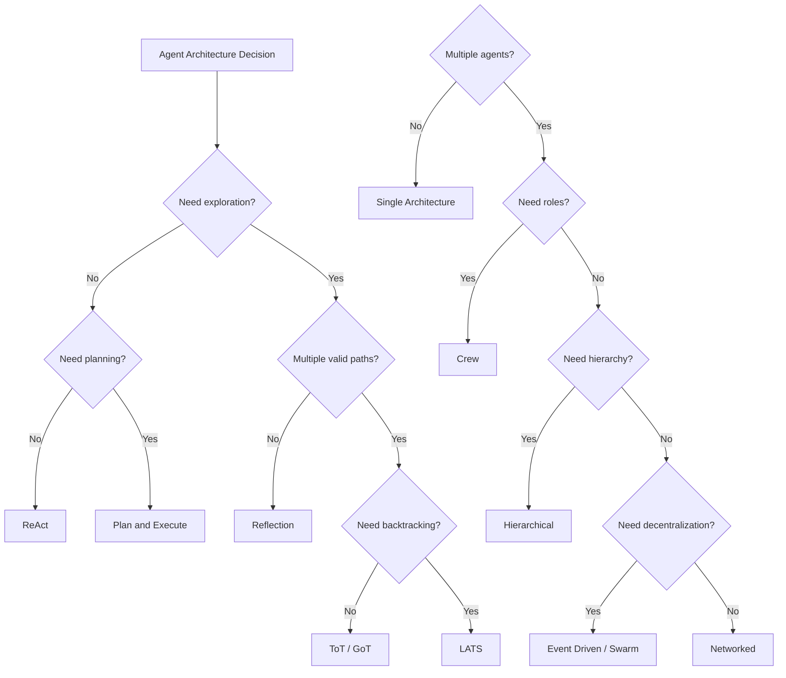
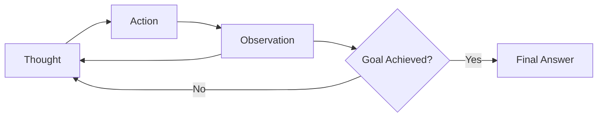
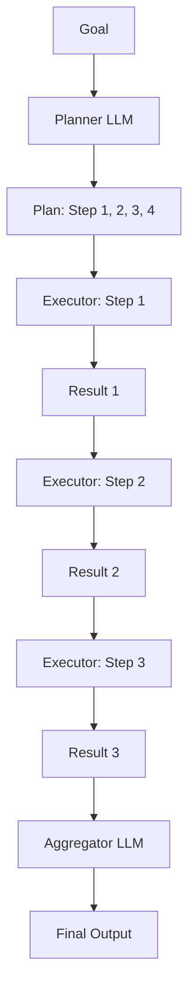
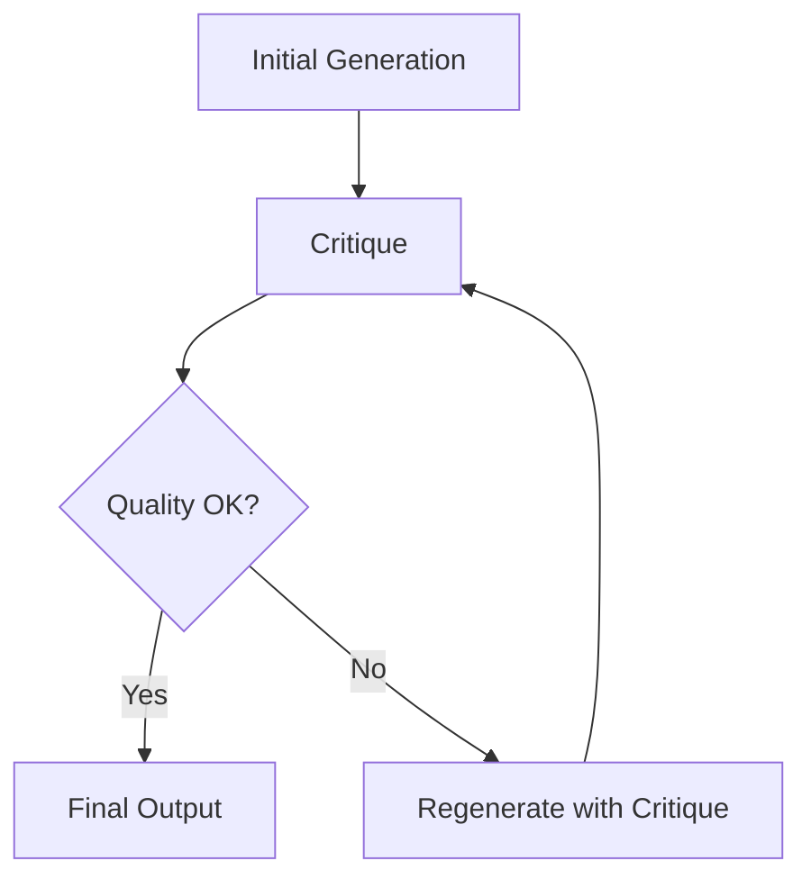
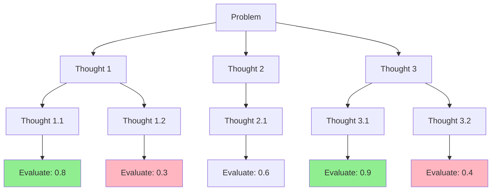
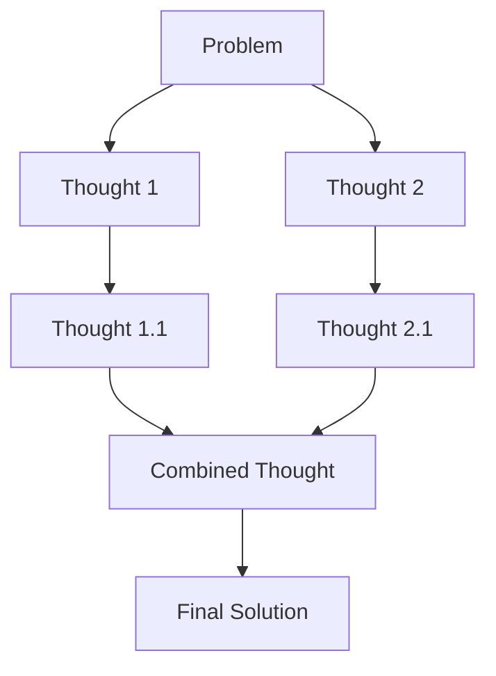
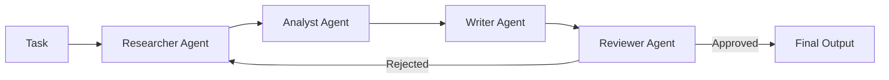
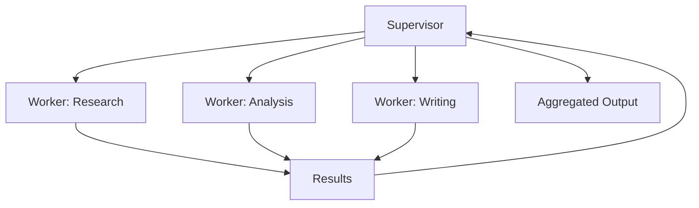
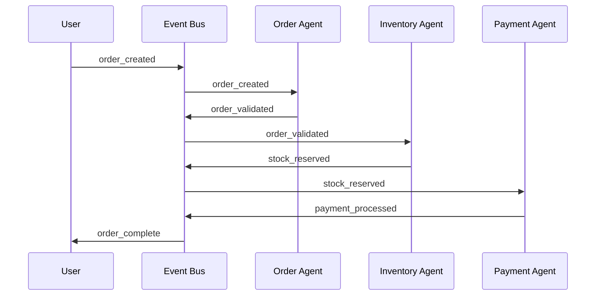
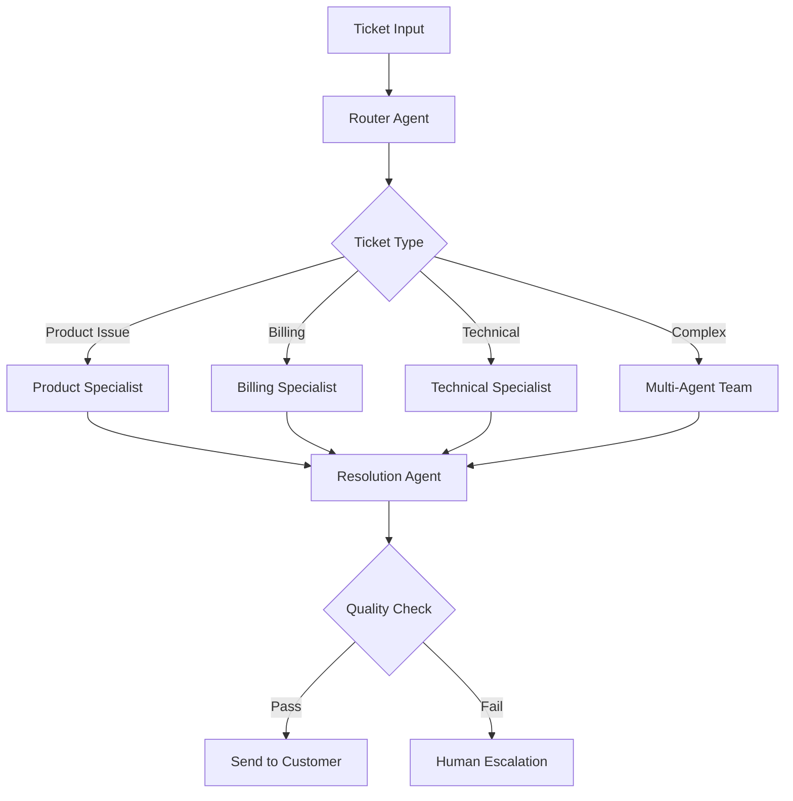

# Chapter 2: Agent Architectures

The architecture you choose for an agent determines its capabilities, reliability, cost profile, and failure modes. This chapter covers the major agent architectures — the structural patterns that define how agents reason, plan, and act. For each architecture, we provide the mechanism, implementation patterns, quantified trade-offs, and when to use it.

## Architecture Selection Framework

Before diving into individual architectures, use this decision framework:



## ReAct: Reasoning and Acting

ReAct is the foundational agent architecture. It interleaves reasoning and action in a single loop: the agent thinks about what to do, takes an action, observes the result, and thinks again.



**How it works internally:**
1. The LLM receives the current context (conversation history + tool results)
2. It generates a "Thought" — reasoning about what to do next
3. It selects an "Action" — which tool to call with what parameters
4. The tool executes and returns an "Observation"
5. The observation is appended to context
6. Loop back to step 1 until the goal is achieved

```python
# ReAct agent with LangGraph (2025/2026 standard)
from langgraph.prebuilt import create_react_agent
from langchain_openai import ChatOpenAI
from langchain_core.tools import tool

@tool
def search_web(query: str) -> str:
    """Search the web for current information."""
    return f"Results for '{query}': [simulated web results]"

@tool
def calculate(expression: str) -> str:
    """Evaluate a mathematical expression."""
    try:
        result = eval(expression)  # Use a safe evaluator in production
        return f"Result: {result}"
    except Exception as e:
        return f"Error: {e}"

@tool
def lookup_database(query: str) -> str:
    """Query the internal database."""
    return f"Database results for: {query}"

# Production ReAct agent
agent = create_react_agent(
    ChatOpenAI(model="gpt-5.4"),
    tools=[search_web, calculate, lookup_database],
)

result = agent.invoke({
    "messages": [("user", "What is the current population of France divided by the number of US states?")]
})
```

**Token cost model:**

```
ReAct per request:
  Base context: ~2,000 tokens (system prompt + tools)
  Per iteration: ~500 tokens (thought) + ~100 tokens (action) + ~300 tokens (observation)
  Typical task: 3-5 iterations
  Total: ~2,000 + (4 × 900) = ~5,600 tokens
  Cost at GPT-5.4: ~$0.014 input + ~$0.056 output = ~$0.07 per request
```

**Scalability characteristics:**
- Throughput: limited by LLM latency per iteration
- Latency: 3-5 seconds per iteration × 4 iterations = 12-20 seconds
- No parallelism within a single ReAct loop
- Scales horizontally by running multiple instances

**When to use ReAct:**
- Tasks with clear sequential logic
- Transparency matters (every step is visible)
- Number of steps is bounded (< 10)
- You need to debug agent reasoning

**When NOT to use ReAct:**
- Tasks requiring exploration of multiple paths
- Tasks where the first approach may not be the best
- Tasks requiring lookahead and backtracking

## Plan and Execute

Plan and Execute separates reasoning into two phases: planning and execution. The agent first generates a complete plan, then executes each step.



**How it differs from ReAct:**
- ReAct interleaves thinking and acting — each step is a single LLM call
- Plan-and-Execute separates planning (expensive) from execution (cheap)
- Planning happens once; execution happens per step
- The planner can be a more powerful model; executors can be cheaper

**Token cost model:**

```
Plan and Execute per request:
  Planner: ~3,000 tokens (full context + plan generation)
  Per executor: ~1,000 tokens (focused task + context)
  Aggregator: ~2,000 tokens (all results)
  Typical: 4 steps
  Total: ~3,000 + (4 × 1,000) + 2,000 = ~9,000 tokens
  
  BUT: planners can use GPT-5.4, executors can use GPT-5.4 mini
  Hybrid cost: ~$0.075 (planner) + 4 × $0.002 (executors) = ~$0.083
  vs pure ReAct at GPT-5.4: ~$0.07
  
  Cost advantage appears at scale when executors are cheap
```

```python
# Plan-and-Execute with LangGraph
from typing import TypedDict, Annotated
from langgraph.graph import StateGraph, END
from langchain_openai import ChatOpenAI
from langchain_core.prompts import ChatPromptTemplate

class PlanExecuteState(TypedDict):
    goal: str
    plan: list[str]
    current_step: int
    results: Annotated[list[str], lambda x, y: x + y]

planner_llm = ChatOpenAI(model="gpt-5.4")      # Smart planner
executor_llm = ChatOpenAI(model="gpt-5.4-mini")  # Cheap executor

def create_plan(state: PlanExecuteState) -> dict:
    """Planner generates a multi-step plan."""
    response = planner_llm.invoke(
        f"Create a detailed plan to achieve: {state['goal']}\n"
        "Return each step on a separate line, numbered."
    )
    steps = [line.strip() for line in response.content.split("\n") if line.strip()]
    return {"plan": steps, "current_step": 0}

def execute_step(state: PlanExecuteState) -> dict:
    """Executor completes one step using a cheaper model."""
    step = state["plan"][state["current_step"]]
    context = "\n".join(f"Previous result {i}: {r}" for i, r in enumerate(state["results"]))
    
    response = executor_llm.invoke(
        f"Execute this step: {step}\n\nContext from previous steps:\n{context}"
    )
    return {
        "results": [response.content],
        "current_step": state["current_step"] + 1
    }

def should_continue(state: PlanExecuteState) -> str:
    return "execute" if state["current_step"] < len(state["plan"]) else "aggregate"

def aggregate_results(state: PlanExecuteState) -> dict:
    """Planner aggregates all results into final output."""
    results_text = "\n".join(f"Step {i+1} result: {r}" for i, r in enumerate(state["results"]))
    response = planner_llm.invoke(
        f"Goal: {state['goal']}\n\nStep results:\n{results_text}\n\n"
        "Synthesize these results into a comprehensive final answer."
    )
    return {"results": [response.content]}

graph = StateGraph(PlanExecuteState)
graph.add_node("plan", create_plan)
graph.add_node("execute", execute_step)
graph.add_node("aggregate", aggregate_results)
graph.set_entry_point("plan")
graph.add_edge("plan", "execute")
graph.add_conditional_edges("execute", should_continue, {
    "execute": "execute",
    "aggregate": "aggregate"
})
graph.add_edge("aggregate", END)

 planner = graph.compile()
```

**When to use Plan and Execute:**
- Complex multi-step tasks where upfront reasoning reduces total cost
- Individual steps can be executed independently
- You want to review/approve plans before execution
- Planner and executor benefit from different model capabilities

**When NOT to use Plan and Execute:**
- Simple tasks where ReAct is sufficient
- Tasks where the plan cannot be determined upfront
- Tasks requiring dynamic replanning at each step

## Reflection Architecture

Reflection adds a self-evaluation loop to agent outputs. After generating a result, the agent critiques it, identifies improvements, and regenerates.



**Quantified trade-offs:**

| Iterations | Quality Gain | Token Multiplier | Latency Multiplier | When to Stop |
|-----------|-------------|-----------------|-------------------|-------------|
| 1 (baseline) | 0% | 1x | 1x | Always |
| 2 | +15-25% | 2.5x | 2.5x | After first critique |
| 3 | +20-30% | 4x | 4x | After second critique |
| 4+ | +5-10% | 6x+ | 6x+ | Diminishing returns |

**Cost at GPT-5.4 for a 1,000-token output task:**
- No reflection: ~$0.025 per request
- 1 reflection cycle: ~$0.063 per request
- 2 reflection cycles: ~$0.10 per request

**When reflection adds value:**
- Code generation (bug detection)
- Legal/medical analysis (accuracy critical)
- High-stakes decisions (error cost > reflection cost)

**When reflection wastes money:**
- Simple factual queries
- Low-stakes content generation
- Tasks where latency matters more than quality

```python
# Reflection pattern with quality threshold
from langchain_openai import ChatOpenAI

llm = ChatOpenAI(model="gpt-5.4")

def reflect_and_improve(task: str, max_iterations: int = 3) -> str:
    """Generate with iterative self-improvement."""
    output = llm.invoke(f"Complete: {task}").content
    
    for i in range(max_iterations):
        critique = llm.invoke(
            f"Review this output for accuracy, completeness, and quality. "
            f"Rate it 1-10 and list specific issues:\n\n{output}"
        )
        
        # Parse quality score from critique
        score = extract_score(critique.content)  # Custom parser
        if score >= 8:
            break
        
        output = llm.invoke(
            f"Improve this based on the critique (score: {score}/10):\n\n"
            f"Output: {output}\n\nCritique: {critique.content}"
        ).content
    
    return output
```

## Tree of Thoughts (ToT)

Tree of Thoughts extends single-path reasoning into a tree structure. At each decision point, the agent generates multiple possible "thoughts," evaluates them, and explores the most promising branches.



**How it works:**
1. Generate N possible next steps (thoughts)
2. Evaluate each thought (score 0-1)
3. Keep top-K thoughts (beam width)
4. Expand each surviving thought
5. Repeat until goal depth is reached or a solution is found
6. Backtrack if all branches fail

**Token cost model:**

```
ToT per request (N=3 thoughts, K=1 beam width, depth=3):
  Per level: 3 thoughts × 500 tokens each = 1,500 tokens
  Evaluation: 3 evaluations × 200 tokens each = 600 tokens
  Levels: 3
  Total: 3 × (1,500 + 600) = 6,300 tokens
  
  vs ReAct: ~5,600 tokens for same task
  
  Cost premium: ~12% more tokens
  Benefit: explores alternatives, finds better solutions
```

**When to use ToT:**
- Problems with multiple valid approaches
- Puzzles, strategic planning, creative problem-solving
- Tasks where the first obvious approach may not be the best

**When NOT to use ToT:**
- Simple sequential tasks (ReAct is cheaper)
- Tasks where latency is critical (ToT is 3x slower)
- Well-understood problems with known solutions

## Graph of Thoughts (GoT)

Graph of Thoughts generalizes ToT from trees to graphs. Thoughts can merge — insights from different branches can be combined.



**Key operation: aggregation.** GoT can combine the best aspects of different reasoning paths. If Thought 1.1 has a good structure and Thought 2.1 has good content, GoT merges them.

**When to use GoT:** Complex analytical tasks where different reasoning paths produce complementary insights.

## LATS: Language Agent Tree Search

LATS combines tree search with Monte Carlo Tree Search (MCTS) principles. It uses exploration vs exploitation trade-offs to allocate computation to the most promising branches.

**When to use LATS:** Code generation, mathematical reasoning, complex problem-solving where lookahead and backtracking provide clear value.

**Implementation complexity:** Significantly higher than ReAct or Plan-and-Execute. For most production systems, the complexity is only justified for specific high-value use cases.

## Crew Based Architecture

Crew architectures organize multiple agents into teams with defined roles. Each agent has a specific expertise — researcher, analyst, writer, reviewer.



**Framework comparison:**

| Feature | CrewAI | AutoGen | LangGraph |
|---------|--------|---------|-----------|
| Philosophy | Role-based hierarchy | Conversational network | Stateful graphs |
| Best for | Structured business processes | Open-ended problem solving | Complex stateful workflows |
| Prototyping speed | Fast (declarative) | Medium | Slow (explicit graph) |
| Production readiness | High | Medium | High |
| Token cost control | Good (role-specific prompts) | Poor (open dialogue) | Excellent (explicit control) |
| Enterprise adoption | Growing | Moderate | High |

```python
# CrewAI pattern
from crewai import Agent, Task, Crew

researcher = Agent(
    role="Research Analyst",
    goal="Find accurate, up-to-date information",
    backstory="Expert researcher with attention to detail",
    tools=[search_tool, database_tool],
    llm="gpt-5.4"
)

analyst = Agent(
    role="Data Analyst",
    goal="Analyze data and identify patterns",
    backstory="Experienced analyst with statistical expertise",
    tools=[calculation_tool, visualization_tool],
    llm="gpt-5.4"
)

writer = Agent(
    role="Technical Writer",
    goal="Write clear, comprehensive reports",
    backstory="Skilled writer with technical background",
    llm="gpt-5.4-mini"  # Cheaper model for writing
)

research_task = Task(
    description="Research the latest trends in AI agents",
    agent=researcher,
    expected_output="Detailed research findings with sources"
)

analysis_task = Task(
    description="Analyze research findings and identify key trends",
    agent=analyst,
    expected_output="Trend analysis with data support"
)

report_task = Task(
    description="Write a comprehensive report based on the analysis",
    agent=writer,
    expected_output="Professional report document"
)

crew = Crew(
    agents=[researcher, analyst, writer],
    tasks=[research_task, analysis_task, report_task],
    verbose=True
)

result = crew.kickoff()
```

**Token cost model for Crew (3 agents):**
- Researcher: ~3,000 tokens (search queries + results + reasoning)
- Analyst: ~2,500 tokens (analysis + reasoning)
- Writer: ~4,000 tokens (long-form output)
- Total: ~9,500 tokens per request
- At GPT-5.4: ~$0.095 per request (with cheaper writer: ~$0.07)

**When to use Crew:**
- Tasks that naturally decompose into roles
- Workflows benefiting from specialization
- Scenarios where different agents need different prompts or models

**When NOT to use Crew:**
- Simple tasks (single agent is cheaper)
- Tasks requiring tight coordination (hierarchical is better)
- Real-time requirements (sequential handoffs add latency)

## Hierarchical Agents

Hierarchical architectures organize agents in a tree. A supervisor decomposes tasks and delegates to workers. Workers report results back.



**Bottleneck analysis:**

| Worker Count | Supervisor Throughput (req/s) | System Throughput | Latency per Request |
|-------------|------------------------------|-------------------|-------------------|
| 3 | 10 | 10 | 8s |
| 5 | 10 | 10 | 12s |
| 10 | 10 | 10 | 15s |
| 20 | 10 | 10 | 20s |

Adding workers reduces per-request latency (parallelism) but NOT system throughput (supervisor bottleneck).

**When to use Hierarchical:**
- Complex tasks with clear sub-task decomposition
- Central coordination adds value
- Workers can be added/removed dynamically

## Event Driven Agents

Event driven agents respond to events in a message bus. Each agent subscribes to specific event types.



**Scalability characteristics:**
- Adding agents: linear throughput increase
- No single point of failure
- Each agent scales independently via consumer groups

**When to use Event Driven:**
- Systems needing independent agent scaling
- Naturally asynchronous workflows
- Loose coupling between agents required

## Swarm Architectures

Swarm architectures use simple local rules that produce emergent complex behavior. Individual agents follow minimal rules; collective intelligence emerges.

**When to use Swarm:**
- Large-scale optimization problems
- Search and exploration tasks
- When decentralized decision-making is inherently more effective

## Architecture Comparison Matrix

| Architecture | Latency | Token Cost | Parallelism | Debuggability | Max Tools | Best Scale |
|-------------|---------|-----------|-------------|---------------|-----------|-----------|
| ReAct | High (sequential) | Low | None | High | 15-20 | < 10 agents |
| Plan & Execute | Medium | Medium | Step-level | High | Unlimited | < 20 agents |
| Reflection | Very High | High (2-5x) | None | Medium | Unlimited | < 5 agents |
| ToT | High | Medium-High | Branch-level | Medium | Unlimited | < 10 agents |
| GoT | High | High | Branch-level | Low | Unlimited | < 10 agents |
| LATS | Very High | Very High | Search-level | Low | Unlimited | < 5 agents |
| Crew | Medium | Medium | Role-level | Medium | Per-role | 5-50 agents |
| Hierarchical | Medium | Low-Medium | Worker-level | High | Per-worker | 3-100 agents |
| Event Driven | Low | Medium | Agent-level | Low | Unlimited | 10-1000 agents |
| Swarm | Low | Medium | Full | Very Low | Unlimited | 100-10000 agents |

## Enterprise Constraint Table

| Constraint | Recommended Architecture | Rationale |
|-----------|------------------------|-----------|
| Debuggability required | ReAct or Hierarchical | Step-by-step trace, central coordinator |
| Cost ceiling strict | ReAct or Hierarchical | Lowest token overhead |
| Multiple expertise needed | Crew or Hierarchical | Role specialization |
| Real-time response | Event Driven | No sequential bottleneck |
| 99.99% availability | Event Driven or Swarm | No SPOF |
| Complex reasoning | Plan & Execute or ToT | Upfront planning or exploration |
| High output quality | Reflection | Iterative improvement |
| Dynamic agent fleet | Event Driven with service discovery | Agents join/leave freely |
| Cross-org collaboration | Event Driven (federated) | Loose coupling |
| Regulatory audit trail | Hierarchical | Central logging |

## Case Study: Customer Support Resolution System

An enterprise customer support system handling 10,000 tickets/day across product issues, billing, and technical support.

**Architecture choice: Hierarchical (Supervisor + Specialized Workers)**



**Why hierarchical wins here:**
1. **Audit trail:** Router logs every classification decision (SOC2 compliance)
2. **Cost control:** Router uses GPT-5.4 mini ($0.75/1M tokens), specialists use GPT-5.4 ($2.50/1M)
3. **Scalability:** Add specialist workers independently
4. **Debuggability:** Trace any ticket through router → specialist → resolution

**Token cost breakdown:**
- Router: ~500 tokens (ticket classification)
- Specialist: ~2,000 tokens (focused reasoning)
- Resolution: ~1,000 tokens (final output)
- Total per ticket: ~3,500 tokens
- At 10K tickets/day: ~35M tokens/day
- Cost: ~$87.50/day at GPT-5.4 rates (with cheaper router: ~$45/day)

**Scalability calculation:**
- Supervisor throughput: 50 requests/second (pooled)
- Specialist pool: 10 workers × 2 requests/second = 20 req/s
- System throughput: 20 req/s (limited by specialists)
- Capacity: 1.7M tickets/day (vs 10K needed — 170x headroom)

## Key Takeaways

- **Start with ReAct** — covers 80% of use cases with minimal complexity
- **Plan-and-Execute** when tasks need upfront reasoning or multi-model cost optimization
- **Reflection** for high-stakes output quality — measure quality gain vs token cost
- **ToT/GoT/LATS** for exploration-heavy problems — complexity justified only for high-value tasks
- **Crew** for role-based tasks requiring specialization
- **Hierarchical** for production systems needing debuggability and central control
- **Event Driven** for scalable, decoupled systems with independent agent scaling
- **Architecture choice is a trade-off** — no single architecture dominates all dimensions

## Further Reading

- "ReAct: Synergizing Reasoning and Acting in Language Models" — Yao et al. (2022)
- "Tree of Thoughts: Deliberate Problem Solving with Large Language Models" — Yao et al. (2023)
- "Graph of Thoughts: Solving Elaborate Problems with Large Language Models" — Besta et al. (2023)
- "Language Agent Tree Search Unifies Reasoning Acting and Planning" — Zhou et al. (2023)
- "CrewAI: Framework for Role-Playing Autonomous AI Agents" — CrewAI (2024)
- "AutoGen: Enabling Next-Gen LLM Applications via Multi-Agent Conversation" — Wu et al. (2023)
- "Building Effective Agents" — Anthropic (2024)
- "OpenAI Agents SDK" — OpenAI (2026) — Production framework for building agents with native tool use, sandbox execution, and MCP integration
- "Claude Agent SDK" — Anthropic (2026) — Agentic engine powering Claude Code, exposed as a library for Python and TypeScript
- "Google Agent Development Kit (ADK)" — Google (2026) — Framework for building agents on the Gemini Enterprise Agent Platform
