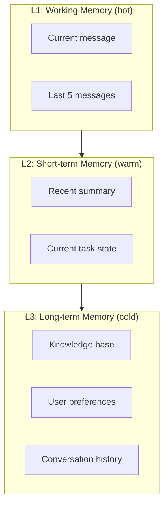
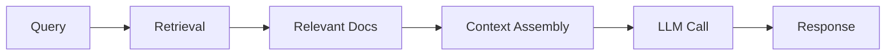
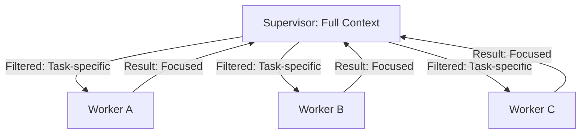
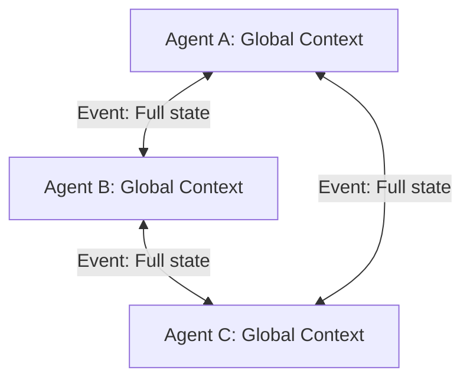
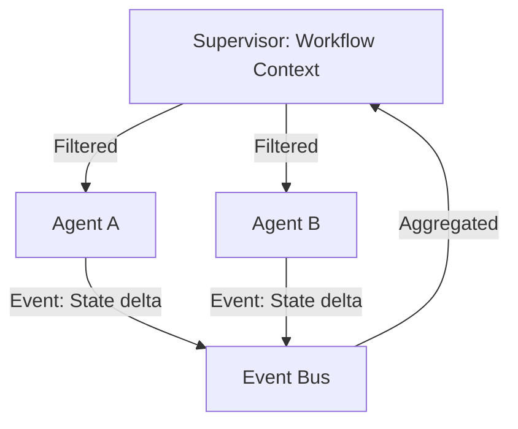

# Chapter 5: Context Engineering

Context engineering is the discipline of managing what information an LLM sees at each step of an agent's execution. Poor context engineering leads to context window bloat, token cost explosion, hallucinations, and degraded agent performance. This chapter covers the mechanisms, strategies, and topology-specific patterns for effective context management.

## The Context Problem

Every LLM call requires a context window — the prompt, conversation history, tool definitions, and current state. As agent systems grow, context windows fill up rapidly:

```
Context window breakdown for a typical agent call:
├── System prompt:           500-2,000 tokens
├── Tool definitions:        500-3,000 tokens
├── Conversation history:    2,000-20,000 tokens
├── Current state:           1,000-5,000 tokens
├── Tool results:            500-5,000 tokens
└── Reasoning space:         2,000-4,000 tokens
    Total:                  6,500-39,000 tokens
```

At 1M+ context windows (GPT-5.4, Claude Sonnet 4.6), you have headroom. But in multi-agent systems with 10+ agents, each carrying context, the aggregate context consumption becomes the primary cost driver.

## Context Windows: Model Comparison

| Model | Context Window | Input Cost (per 1M tokens) | Output Cost (per 1M tokens) | Sweet Spot |
|-------|---------------|---------------------------|----------------------------|-----------|
| GPT-5.4 | 1M | $2.50 | $15.00 | Complex reasoning, multi-agent |
| GPT-5.4 mini | 1M | $0.75 | $4.50 | Worker agents, simple tasks |
| GPT-5.4 nano | 1M | $0.20 | $1.25 | High-volume, ultra-cheap tasks |
| Claude Sonnet 4.6 | 1M | $3.00 | $15.00 | Long-context analysis, balanced |
| Claude Haiku 4.5 | 1M | $1.00 | $5.00 | Fast workers, high throughput |
| Claude Opus 4.8 | 1M | $5.00 | $25.00 | Complex reasoning, agentic tasks |
| Gemini 3.1 Pro | 2M | $2.00 | $12.00 | Massive context, document analysis |
| Gemini 3.5 Flash | 1M | $0.15 | $0.60 | Ultra-cheap, high-throughput |

**Note:** Pricing reflects June 2026 rates. Prompt caching can reduce input costs by up to 90% on supported models. Always verify current rates before production budgeting.

**Key insight:** Context window size is not the bottleneck — cost is. A 1M window at $2.50/1M tokens means filling the full context costs $2.50 per call. But prompt caching cuts cached inputs to $0.25/1M, making context-heavy agents viable. Multiply by 10 agents per request × 10K requests/day with caching = $2.5K/day just for input tokens.

## Context Bloat: The Silent Cost Driver

Context bloat occurs when agents carry more information than they need. It happens gradually as conversation history accumulates, tool results pile up, and state grows.

**Bloat symptoms:**
- Token costs growing faster than request volume
- Agent latency increasing over time
- Context window errors (context_length_exceeded)
- Agent accuracy degrading (too much irrelevant context)

**Bloat measurement:**

```python
def measure_context_efficiency(agent_output: dict) -> dict:
    """Calculate context efficiency metrics."""
    messages = agent_output["messages"]
    total_tokens = sum(count_tokens(m.content) for m in messages)
    relevant_tokens = sum(
        count_tokens(m.content) for m in messages 
        if is_relevant(m)  # Custom relevance check
    )
    
    return {
        "total_tokens": total_tokens,
        "relevant_tokens": relevant_tokens,
        "efficiency": relevant_tokens / total_tokens if total_tokens > 0 else 0,
        "wasted_tokens": total_tokens - relevant_tokens,
        "wasted_cost": (total_tokens - relevant_tokens) * 0.0000025  # At GPT-5.4 rates
    }
```

**Typical efficiency numbers:**

| System | Efficiency | Wasted Tokens per Request |
|--------|-----------|--------------------------|
| Unoptimised agent | 40-60% | 3,000-5,000 |
| Basic optimisation | 60-75% | 1,500-3,000 |
| Well-engineered | 75-90% | 500-1,500 |
| Optimised production | 85-95% | 200-800 |

## Context Compression Strategies

### Sliding Window

Keep only the most recent N messages or tokens.

```python
from langchain_core.messages import trim_messages

# Keep last 20 messages or 4,000 tokens
trimmed = trim_messages(
    messages=conversation_history,
    max_tokens=4000,
    strategy="last",  # Keep most recent
    token_counter=count_tokens,
)

# Or keep messages that fit within a token budget
trimmed = trim_messages(
    messages=conversation_history,
    max_tokens=4000,
    strategy="last",
    start_on="human",  # Ensure conversation starts with user
)
```

**When to use:** Simple conversations, chatbots, single-turn tasks.
**When NOT to use:** Tasks requiring long-term context, workflows with important early messages.

### Summary Compression

Summarise older messages and replace with a summary.

```python
from langchain_openai import ChatOpenAI

llm = ChatOpenAI(model="gpt-5.4-mini")  # Use cheaper model for summarisation

def compress_conversation(messages: list, max_summary_tokens: int = 500) -> list:
    """Summarise older messages and keep recent ones intact."""
    if len(messages) <= 6:
        return messages  # Not enough to compress
    
    # Split into old and recent
    old_messages = messages[:-6]
    recent_messages = messages[-6:]
    
    # Summarise old messages
    conversation_text = "\n".join(
        f"{m['role']}: {m['content']}" for m in old_messages
    )
    
    summary = llm.invoke(
        f"Summarise this conversation, preserving key facts and decisions "
        f"in {max_summary_tokens} tokens or less:\n\n{conversation_text}"
    ).content
    
    # Replace old messages with summary
    return [
        {"role": "system", "content": f"Conversation summary:\n{summary}"}
    ] + recent_messages
```

**Compression ratio:** Typical 10:1 (10,000 tokens → 1,000 tokens).

### Hierarchical Memory

Organise context into tiers with different access patterns:



**Access latency:**
- L1: 0ms (in-memory)
- L2: 1-5ms (Redis)
- L3: 10-100ms (Postgres/Vector DB)

**Token budget per tier:**
- L1: 2,000-4,000 tokens (always in context)
- L2: 1,000-2,000 tokens (retrieved when needed)
- L3: 500-1,000 tokens (retrieved on demand)

## Dynamic Context Assembly

Instead of loading all context upfront, assemble context dynamically based on the current task.

```python
def assemble_context(task: str, available_context: dict) -> str:
    """Dynamically select only relevant context for the current task."""
    context_parts = []
    
    # Always include system prompt
    context_parts.append(available_context["system_prompt"])
    
    # Include task-specific context
    task_type = classify_task(task)
    if task_type == "code_generation":
        context_parts.append(available_context["codebase_context"])
    elif task_type == "data_analysis":
        context_parts.append(available_context["data_schema"])
    elif task_type == "customer_support":
        context_parts.append(available_context["customer_history"])
    
    # Include only relevant conversation history
    relevant_history = filter_relevant(task, available_context["conversation"])
    context_parts.append(relevant_history)
    
    return "\n\n".join(context_parts)
```

**Token savings:** 50-70% reduction vs loading all context.

## RAG as Context Management

Retrieval Augmented Generation is fundamentally a context management strategy — retrieving only the relevant documents for the current query.



**RAG context patterns:**

| Pattern | Context Size | Latency | Accuracy |
|---------|-------------|---------|----------|
| No RAG (full context) | Large (all docs) | Low | Medium (noise) |
| Basic RAG (top-K) | Medium (K docs) | Medium | High |
| Multi-step RAG | Medium (retrieved + re-ranked) | High | Very High |
| Agentic RAG (agent decides what to retrieve) | Dynamic | Variable | Highest |

## Per-Topology Context Patterns

### Hierarchical Context Flow



**Context propagation:** Supervisor filters context before delegation. Workers receive only what they need. Results are returned and aggregated at supervisor level.

**Token budget:**
- Supervisor: 8,000-15,000 tokens (full context + worker results)
- Each worker: 2,000-4,000 tokens (task-specific)
- Total for 5 workers: ~28,000-35,000 tokens

### P2P Context Flow



**Context propagation:** Each agent needs enough global context to make autonomous decisions. No central filtering.

**Token budget:**
- Each agent: 6,000-10,000 tokens (global state + local reasoning)
- Total for 5 agents: ~30,000-50,000 tokens
- **60-100% more tokens than hierarchical**

### Hybrid Context Flow



**Context propagation:** Supervisor filters for task delegation. Event bus carries lightweight state deltas between agents.

**Token budget:**
- Supervisor: 8,000-12,000 tokens
- Each agent: 3,000-5,000 tokens (filtered + event context)
- Total for 5 agents: ~23,000-37,000 tokens
- **Similar to hierarchical, with P2P flexibility**

## Token Cost Modelling

### Cost Formula

```
Daily Token Cost = (Requests/day × Tokens per request × Price per 1M tokens) / 1,000,000

For a 5-agent hierarchical system:
  Supervisor: 10,000 tokens × $2.50/1M = $0.025 per request
  Workers: 5 × 3,000 tokens × $0.75/1M = $0.001125 per request
  Total per request: $0.026125
  At 10K requests/day: $261.25/day = ~$7,838/month
```

### Cost Comparison: Hierarchical vs P2P

| Metric | Hierarchical | P2P | Delta |
|--------|-------------|-----|-------|
| Tokens per request | 25,000 | 40,000 | +60% |
| Cost per request (GPT-5.4) | $0.0625 | $0.10 | +60% |
| Daily cost (10K req) | $625 | $1,000 | +$375 |
| Monthly cost | $18,750 | $30,000 | +$11,250 |
| With GPT-5.4 mini workers | $272/day | $1,000/day | +$728/day |

**Key insight:** Using cheaper models for workers in hierarchical systems reduces cost by 56% vs P2P where all agents need the full context.

## Context Window Budgeting

Allocate token budgets per component in a multi-agent system:

```python
def calculate_token_budget(
    model_context_window: int,
    num_agents: int,
    agent_type: str = "worker",
    system_prompt_tokens: int = 1000,
    safety_margin: float = 0.2
) -> int:
    """Calculate token budget per agent."""
    available = model_context_window * (1 - safety_margin)
    
    if agent_type == "supervisor":
        return int(available * 0.7)  # Supervisor gets 70%
    elif agent_type == "worker":
        per_worker = (available * 0.3) / num_agents
        return int(per_worker)
    else:
        return int(available / num_agents)

# Example: 128K window, 5 workers
supervisor_budget = calculate_token_budget(128000, 5, "supervisor")
# = 128000 × 0.8 × 0.7 = 71,680 tokens

worker_budget = calculate_token_budget(128000, 5, "worker")
# = 128000 × 0.8 × 0.3 / 5 = 6,144 tokens per worker
```

## Context Engineering Decision Table

| Scenario | Strategy | Token Savings | Complexity |
|----------|---------|--------------|------------|
| Simple chatbot | Sliding window | 30-50% | Low |
| Long conversations | Summary compression | 70-90% | Medium |
| Multi-agent system | Dynamic assembly + hierarchical filtering | 50-70% | High |
| Document analysis | RAG | 80-95% | Medium |
| Real-time chat | Working memory + session cache | 40-60% | Low |
| Enterprise workflow | Hierarchical context flow + summarisation | 50-70% | High |

## Case Study: Customer Support Context Management

A customer support system handling 10K tickets/day with 3 agent types (router, specialist, resolver).

**Context architecture:**
- Router: 500 tokens (ticket text + classification prompt)
- Specialist: 3,000 tokens (ticket + relevant KB articles + conversation history)
- Resolver: 4,000 tokens (full context + specialist results + resolution templates)

**Optimisation results:**

| Metric | Before | After | Improvement |
|--------|--------|-------|-------------|
| Tokens per ticket | 12,000 | 4,500 | 62% reduction |
| Cost per ticket | $0.03 | $0.011 | 63% reduction |
| Daily cost | $300 | $110 | $190 saved |
| Monthly cost | $9,000 | $3,300 | $5,700 saved |
| Agent accuracy | 82% | 89% | +7% (less noise) |

**Techniques applied:**
1. Dynamic context assembly (only load relevant KB articles)
2. Sliding window for conversation history (keep last 6 messages)
3. Summary compression for long conversations
4. Hierarchical filtering (supervisor filters before specialist)

## Key Takeaways

- **Context bloat is the silent cost driver** — measure efficiency regularly (target: >80%)
- **Compression saves 50-90%** of token costs with minimal quality loss
- **Hierarchical filtering** reduces per-agent context by 60-70% vs P2P
- **Dynamic context assembly** loads only what the current task needs
- **Token budgeting** prevents any single component from consuming the full context window
- **RAG is a context management strategy** — not just an accuracy improvement
- **Use cheaper models for summarisation** — GPT-5.4 mini at $0.75/1M tokens for compression
- **Per-topology context patterns** — hierarchical is cheapest, P2P is most expensive, hybrid is practical

## Further Reading

- "Building Effective Agents" — Anthropic (2024)
- "Lost in the Middle: How Language Models Use Long Contexts" — Liu et al. (2023)
- "RAGAS: Automated Evaluation of Retrieval Augmented Generation" — ES (2023)
- "Context Engineering for AI Agents" — swyx (2025)
- "The Art of Prompt Engineering" — promptingguide.ai (2024)
