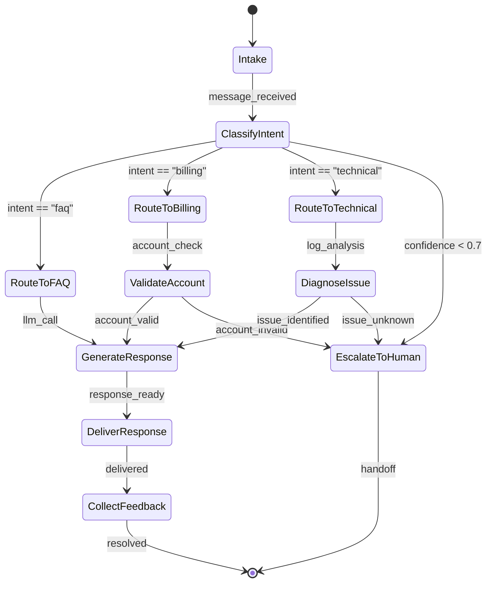
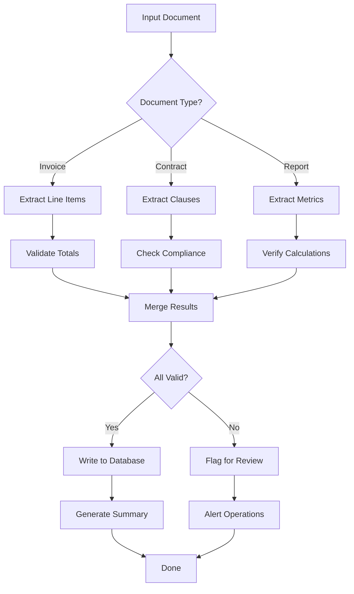
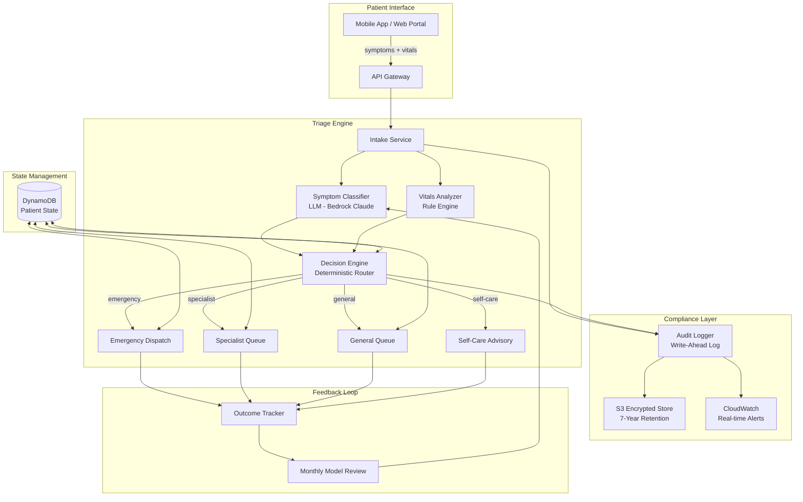
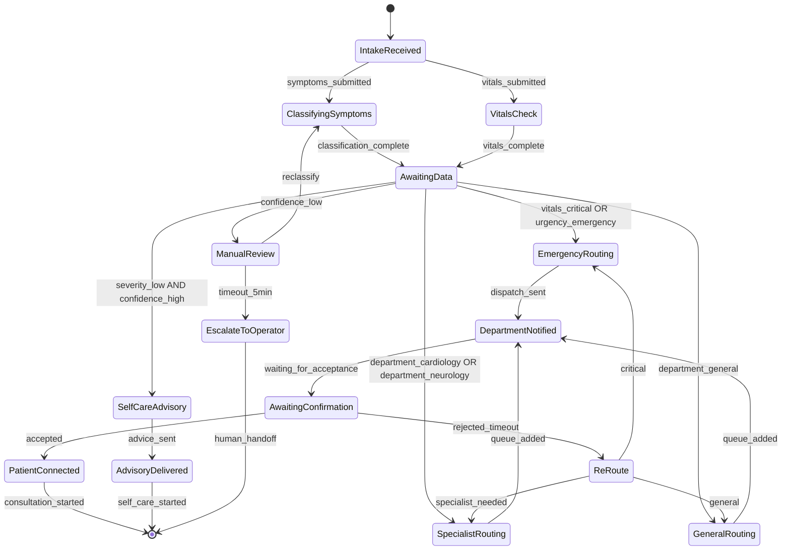

# Chapter 6: Deterministic AI Systems

> "The goal is not to replace human judgment, but to ensure that every decision—whether made by a human or a machine—is auditable, reproducible, and compliant."

---

## Introduction

In the preceding chapters, we explored probabilistic AI systems—chains, agents, and RAG pipelines—where non-determinism is a feature, not a bug. But enterprise reality imposes constraints that probabilistic systems cannot satisfy alone: audit trails for regulators, guaranteed SLA latency, crash recovery for multi-day workflows, and the need to prove that a system produced *exactly* the same output given the same input.

Deterministic AI systems sit at the intersection of classical software engineering and modern LLM orchestration. They provide the scaffolding—state machines, workflow engines, structured output schemas, and durable execution—that makes AI production-ready. This chapter covers the engineering patterns that transform a prototype chatbot into an auditable, cost-predictable, enterprise-grade system.

The central thesis of this chapter is the **deterministic-probabilistic boundary**: the architectural decision that determines which components of your AI system use LLM inference (probabilistic) and which use explicit logic (deterministic). This boundary is not an implementation detail—it is the single most consequential architectural choice in production AI systems. Get it right, and you get the creative power of LLMs with the reliability of classical software. Get it wrong, and you have either a brittle rule engine or an unpredictable black box.

We will examine routing determinism through finite state machines and directed acyclic graphs, structured output enforcement via JSON schemas and Pydantic validation, the trade-offs between orchestration frameworks (LangGraph, Temporal, AWS Step Functions, Azure Durable Functions), and a full healthcare triage case study with quantified cost analysis.

### The Spectrum of Determinism

Before diving into specific patterns, it is useful to understand that determinism in AI systems exists on a spectrum:

| Level | Description | Example | Guarantees |
|-------|-------------|---------|------------|
| **Fully Deterministic** | No LLM calls; pure rule engine | Hash map routing, SQL queries | Same input → same output (always) |
| **Deterministic Orchestration** | LLM calls within deterministic workflow | LangGraph with fixed topology | Same execution path for same input |
| **Probabilistic with Guardrails** | LLM-driven with validation layer | Function calling + Pydantic | Same output schema; content may vary |
| **Fully Probabilistic** | End-to-end LLM with no constraints | Raw chain with free-form output | No guarantees on structure or content |

Most production systems operate at Level 2: deterministic orchestration with probabilistic work inside nodes. The patterns in this chapter show you how to build and operate at this level.

---

## 6.1 Routing Determinism

### 6.1.1 Why Deterministic Routing Matters

Probabilistic routing—where an LLM decides the next step based on natural language understanding—is powerful but unpredictable. In production, you need guarantees:

- **Reproducibility**: The same input produces the same workflow execution path.
- **Auditability**: Regulators can trace every decision point.
- **Latency budgets**: A routing decision must complete in bounded time, not wait for an LLM inference call.
- **Cost control**: Each LLM call costs tokens; deterministic routing eliminates unnecessary calls.
- **Testability**: Deterministic routes are trivially testable with unit tests; probabilistic routes require statistical evaluation.

Deterministic routing replaces LLM inference at decision points with explicit, pre-defined logic. The LLM does the *understanding*; the state machine does the *dispatch*. This separation of concerns is the foundation of production AI architecture.

Consider the economics: an LLM classification call costs approximately $0.001-$0.005 per request (depending on model and input length). At 100,000 requests per day, that is $100-$500/day or $3,000-$15,000/month—just for routing decisions. A deterministic hash map lookup costs $0.000001 per request, making it 1,000x cheaper. The intelligent part (understanding the input) still uses the LLM; the dispatch part uses deterministic logic.

### 6.1.2 Finite State Machines (FSMs)

A finite state machine defines a finite set of states, a set of transitions between states, and the events that trigger those transitions. For AI systems, FSMs model conversation flows, document processing pipelines, and multi-step agent orchestration.

Consider a customer support triage system:



The key insight: the *routing* between states is deterministic (if-else on intent classification), while the *work within each state* may involve probabilistic LLM calls. This hybrid approach gives you the best of both worlds—creative generation where it matters, predictable control flow everywhere else.

The state machine provides several critical guarantees:

1. **Finite execution**: The system cannot enter an infinite loop because the state space is finite and transitions are well-defined.
2. **Observability**: Every state transition is observable and loggable, creating a natural audit trail.
3. **Testability**: Each state and transition can be tested independently with unit tests.
4. **Recovery**: If the system fails in any state, recovery logic knows exactly which state to resume from.

Here is a Python implementation using LangGraph's state machine primitives:

```python
from langgraph.graph import StateGraph, END
from typing import TypedDict, Literal
from pydantic import BaseModel

class TriageState(TypedDict):
    message: str
    intent: str
    confidence: float
    response: str
    audit_log: list[str]

def classify_intent(state: TriageState) -> TriageState:
    intent, confidence = llm.classify(
        state["message"],
        categories=["faq", "billing", "technical"]
    )
    state["intent"] = intent
    state["confidence"] = confidence
    state["audit_log"].append(f"intent={intent}, conf={confidence:.2f}")
    return state

def route_by_intent(state: TriageState) -> str:
    if state["confidence"] < 0.7:
        return "escalate"
    return state["intent"]

graph = StateGraph(TriageState)
graph.add_node("classify", classify_intent)
graph.add_node("faq", handle_faq)
graph.add_node("billing", handle_billing)
graph.add_node("technical", handle_technical)
graph.add_node("escalate", escalate_to_human)

graph.set_entry_point("classify")
graph.add_conditional_edges("classify", route_by_intent, {
    "faq": "faq", "billing": "billing",
    "technical": "technical", "escalate": "escalate"
})
graph.add_edge("faq", END)
graph.add_edge("billing", END)
graph.add_edge("technical", END)
graph.add_edge("escalate", END)

app = graph.compile()
```

The routing function `route_by_intent` is pure deterministic logic—no LLM call, no randomness. The LLM is called once during classification, and every downstream path is a function of that single classification result plus the confidence threshold. This means you can unit test the routing logic with 100% code coverage, something impossible with LLM-based routing.

### 6.1.3 Directed Graph Workflows

Beyond simple state machines, directed acyclic graphs (DAGs) model workflows with parallel execution paths, fan-out/fan-in patterns, and conditional branching. In AI systems, DAGs are critical for:

- **Parallel tool execution**: Call multiple APIs simultaneously, then merge results.
- **Conditional pipelines**: Skip expensive processing steps when confidence is high.
- **Retry with backoff**: Deterministic retry policies around probabilistic LLM calls.
- **Error boundaries**: Contain failures to specific branches without affecting the entire workflow.



The graph structure is fixed at deploy time. The *content* of each node may involve LLM inference, but the *topology*—which nodes execute, in what order, under what conditions—is deterministic and versionable in source control.

The DAG pattern also enables **speculative execution**: start multiple processing paths in parallel and use the first one that completes. For example, if you have two LLM providers (OpenAI and Anthropic), you can call both simultaneously and use the faster response. The deterministic DAG structure makes this pattern safe and predictable.

Here is a fan-out/fan-in implementation for parallel document processing:

```python
from langgraph.graph import StateGraph, END
from typing import TypedDict
import asyncio

class DocProcessState(TypedDict):
    document: str
    doc_type: str
    extractions: dict
    validation_results: list
    merged_result: dict

def classify_document(state: DocProcessState) -> DocProcessState:
    state["doc_type"] = llm.classify(state["document"])
    return state

def extract_invoice(state: DocProcessState) -> DocProcessState:
    state["extractions"]["invoice"] = llm.extract(state["document"], InvoiceSchema)
    return state

def extract_contract(state: DocProcessState) -> DocProcessState:
    state["extractions"]["contract"] = llm.extract(state["document"], ContractSchema)
    return state

def route_by_type(state: DocProcessState) -> str:
    return state["doc_type"]  # Deterministic routing by type

graph = StateGraph(DocProcessState)
graph.add_node("classify", classify_document)
graph.add_node("invoice", extract_invoice)
graph.add_node("contract", extract_contract)
graph.add_node("validate", validate_extractions)
graph.add_node("merge", merge_results)

graph.set_entry_point("classify")
graph.add_conditional_edges("classify", route_by_type, {
    "invoice": "invoice", "contract": "contract"
})
graph.add_edge("invoice", "validate")
graph.add_edge("contract", "validate")
graph.add_edge("validate", "merge")
graph.add_edge("merge", END)
```

### 6.1.4 Decision Trees and Rule-Based Routing

For high-throughput, low-latency routing, decision trees offer O(log n) classification without any LLM inference. The trade-off: they require hand-engineered features and cannot adapt to unseen inputs without retraining.

The practical approach is a **cascading classifier**: start with cheap deterministic rules, escalate to expensive LLM calls only when rules are ambiguous. This pattern reduces LLM costs by 70-90% while maintaining accuracy.

```python
class CascadingClassifier:
    def __init__(self):
        self.keyword_rules = {
            "emergency": ["chest pain", "difficulty breathing", "stroke symptoms"],
            "billing": ["invoice", "charge", "payment", "refund", "insurance"],
            "technical": ["error", "bug", "crash", "not working", "slow"],
        }
        self.confidence_threshold = 0.7

    def classify(self, text: str) -> tuple[str, float, str]:
        # Level 1: Keyword matching (0.1ms, $0.000001)
        lower_text = text.lower()
        for category, keywords in self.keyword_rules.items():
            if any(kw in lower_text for kw in keywords):
                return category, 0.95, "keyword_match"

        # Level 2: Pattern matching (0.5ms, $0.000005)
        if re.search(r'\$\d+\.\d{2}', text):
            return "billing", 0.85, "pattern_match"
        if re.search(r'error\s+\w+', text, re.IGNORECASE):
            return "technical", 0.80, "pattern_match"

        # Level 3: LLM classification (400ms, $0.001)
        result = llm.classify(text, categories=list(self.keyword_rules.keys()))
        return result.category, result.confidence, "llm_classify"
```

| Approach | Latency | Cost per Route | Adaptability | Audit Trail |
|----------|---------|----------------|--------------|-------------|
| LLM routing | 200-800ms | $0.001-0.01 | High | Natural language |
| Decision tree | 0.1-1ms | $0.00001 | Low | Code path |
| Hash map lookup | <0.1ms | $0.000001 | None | Log entry |
| Cascading classifier | 1-5ms (avg) | $0.0001 | Medium | Both |
| Hybrid (LLM + tree) | 1-5ms (cached) | $0.0001 | Medium | Both |

The cascading approach is the production standard: deterministic rules handle 85-95% of cases, and an LLM handles the ambiguous remainder. The rules are retrained periodically on LLM-labeled data, creating a feedback loop where expensive inference bootstraps cheap deterministic routing.

### 6.1.5 When to Use Deterministic vs. Probabilistic Routing

| Criterion | Deterministic | Probabilistic |
|-----------|--------------|---------------|
| Regulatory audit required | ✅ Use | ❌ Avoid |
| Sub-10ms latency required | ✅ Use | ❌ Avoid |
| Inputs are structured (enums, codes) | ✅ Use | ❌ Overkill |
| Inputs are unstructured natural language | ⚠️ Supplement | ✅ Use |
| Cost budget is fixed | ✅ Use | ⚠️ Risk of overrun |
| New categories expected frequently | ❌ Brittle | ✅ Adaptive |
| Explainability required | ✅ Code path traceable | ⚠️ Requires logging |
| Zero-failure tolerance | ✅ Deterministic retry | ❌ Probabilistic retry unreliable |
| High throughput (>10K req/sec) | ✅ Use | ❌ Latency bottleneck |
| Multi-language support needed | ⚠️ Rules per language | ✅ LLM handles naturally |

---

## 6.2 Structured Outputs

### 6.2.1 The Problem with Free-Form LLM Outputs

LLMs generate text token by token. Without constraints, they produce outputs that are close to what you need but subtly wrong in ways that break downstream processing. Consider a customer data extraction task:

```json
{"name": "John Smith", "age": "34", "email": "john@example.com", "notes": "Has been a customer since 2019, prefers email communication, account is in good standing"}
```

This is close to valid JSON but includes an extraneous `notes` field with unparsed prose. In a pipeline that expects a strict schema with exactly three fields, this breaks downstream processing. Worse, the `age` field is a string `"34"` instead of a number `34`—a type error that propagates silently through your system.

Structured output enforcement eliminates this class of failure by guaranteeing that LLM outputs conform to a predefined schema before they reach your application logic.

### 6.2.2 JSON Mode and Function Calling

Modern LLM APIs offer three levels of structured output enforcement, each with different trade-offs:

**Level 1: JSON Mode** — The API guarantees syntactically valid JSON but does not enforce a schema. This catches the most common failure mode (malformed JSON) but leaves schema validation to your application.

```python
response = client.chat.completions.create(
    model="gpt-5.4",
    messages=[{"role": "user", "content": "Extract the customer name and email from: 'John Smith, john@example.com'"}],
    response_format={"type": "json_object"}
)
# Guaranteed valid JSON, but schema is not enforced
# May return: {"name": "John Smith", "email": "john@example.com", "extra_field": "..."}
```

**Level 2: JSON Schema** — The API enforces a specific JSON schema, returning only objects that match. This is the strongest guarantee available at the API level—the model is constrained during generation to only produce tokens that result in valid schema conformance.

```python
schema = {
    "type": "object",
    "properties": {
        "name": {"type": "string", "description": "Full name"},
        "email": {"type": "string", "format": "email"},
        "confidence": {"type": "number", "minimum": 0, "maximum": 1}
    },
    "required": ["name", "email", "confidence"]
}
response = client.chat.completions.create(
    model="gpt-5.4",
    messages=[{"role": "user", "content": f"Extract info: {text}"}],
    response_format={"type": "json_schema", "json_schema": {"name": "customer", "schema": schema}}
)
# Guaranteed to match schema; extra fields stripped; types enforced
```

**Level 3: Function/Tool Calling** — The API returns structured arguments for a pre-defined function signature. This is the most practical level for production systems because it integrates directly with your application's function call patterns.

```python
tools = [{
    "type": "function",
    "function": {
        "name": "log_customer_interaction",
        "description": "Log a customer interaction to CRM",
        "parameters": {
            "type": "object",
            "properties": {
                "customer_name": {"type": "string"},
                "interaction_type": {"type": "string", "enum": ["call", "email", "chat"]},
                "summary": {"type": "string", "maxLength": 500}
            },
            "required": ["customer_name", "interaction_type", "summary"]
        }
    }
}]
```

The progression from Level 1 to Level 3 represents increasing enforcement strength. In production, always use at least Level 2 (JSON Schema) for any LLM output that feeds into downstream processing. Level 3 (function calling) is preferred when the output maps directly to a function invocation.

### 6.2.3 Pydantic Validation Patterns

Pydantic provides runtime schema validation that catches LLM output errors before they propagate through your pipeline. In production, always validate LLM output against a Pydantic model as a defensive layer, even when using API-level schema enforcement. API-level guarantees can fail (model edge cases, API version changes, provider bugs), and Pydantic is your safety net.

```python
from pydantic import BaseModel, Field, field_validator
from typing import Literal

class CustomerRecord(BaseModel):
    name: str = Field(min_length=1, max_length=200)
    email: str = Field(pattern=r'^[\w\.-]+@[\w\.-]+\.\w+$')
    interaction_type: Literal["call", "email", "chat", "in_person"]
    summary: str = Field(min_length=10, max_length=500)
    confidence: float = Field(ge=0.0, le=1.0)

    @field_validator('summary')
    @classmethod
    def summary_not_placeholder(cls, v):
        if v.lower().strip() in ('unknown', 'n/a', 'none', ''):
            raise ValueError('Summary must contain substantive content')
        return v

    @field_validator('confidence')
    @classmethod
    def confidence_reasonable(cls, v):
        if v < 0.3:
            raise ValueError('Confidence below threshold; escalate to human')
        return v

class ExtractionResult(BaseModel):
    records: list[CustomerRecord]
    extraction_confidence: float
    raw_text_hash: str

# Usage: validate LLM output before downstream processing
raw_output = llm.extract(text, schema=ExtractionResult)
try:
    result = ExtractionResult(**raw_output)
except ValidationError as e:
    # Log the validation failure, don't propagate bad data
    logger.warning(f"LLM output validation failed: {e}")
    result = fallback_extraction(text)  # Use deterministic fallback
```

Pydantic validators are your last line of defense. They convert LLM hallucinations—wrong types, impossible values, missing fields—into explicit, catchable exceptions rather than silent data corruption. The `field_validator` decorators enforce business rules that JSON Schema cannot express (like "summary must not be a placeholder string").

**Validation with retry**: When validation fails, you have two options: retry the LLM call (costly but may succeed) or fall back to deterministic extraction (cheap but less capable). The choice depends on your error budget:

```python
async def extract_with_retry(text: str, max_retries: int = 2) -> ExtractionResult:
    for attempt in range(max_retries + 1):
        raw = await llm.extract(text, schema=ExtractionResult)
        try:
            return ExtractionResult(**raw)
        except ValidationError as e:
            if attempt == max_retries:
                # Final fallback: deterministic extraction
                return deterministic_extract(text)
            await asyncio.sleep(0.5 * (attempt + 1))  # Exponential backoff
```

### 6.2.4 Enum-Based Routing with Structured Outputs

One of the most powerful patterns: use LLM classification with enum-constrained output to feed deterministic routing logic. The LLM provides the intelligence; the enum constraint provides the guarantee; the dictionary lookup provides the routing.

```python
from enum import Enum
from pydantic import BaseModel

class RoutingDecision(BaseModel):
    department: Literal["engineering", "sales", "support", "legal", "hr"]
    urgency: Literal["critical", "high", "medium", "low"]
    requires_human: bool
    reasoning: str

DEPARTMENT_ROUTING = {
    "engineering": {"queue": "eng-queue", "sla_hours": 4, "cost_center": "CC-100"},
    "sales": {"queue": "sales-queue", "sla_hours": 2, "cost_center": "CC-200"},
    "support": {"queue": "support-queue", "sla_hours": 24, "cost_center": "CC-300"},
    "legal": {"queue": "legal-queue", "sla_hours": 48, "cost_center": "CC-400"},
    "hr": {"queue": "hr-queue", "sla_hours": 8, "cost_center": "CC-500"},
}

SLA_MULTIPLIERS = {"critical": 0.25, "high": 0.5, "medium": 1.0, "low": 2.0}

def route_ticket(text: str) -> dict:
    decision = llm.extract(text, schema=RoutingDecision)
    routing = DEPARTMENT_ROUTING[decision.department]
    effective_sla = routing["sla_hours"] * SLA_MULTIPLIERS[decision.urgency]
    return {
        "queue": routing["queue"],
        "sla_hours": effective_sla,
        "cost_center": routing["cost_center"],
        "requires_human": decision.requires_human,
        "explanation": decision.reasoning,
    }
```

The LLM does the understanding; the enum constraints and dictionary lookup do the routing. The LLM cannot produce an invalid department name because the schema rejects it. This pattern is the gold standard for production AI routing: intelligent classification feeding deterministic dispatch.

### 6.2.5 Token Cost Implications of Structured Outputs

Structured outputs carry a measurable cost premium over free-form generation:

| Output Type | Input Tokens (schema included) | Output Tokens | Latency (p50) | Cost per Call | Failure Rate |
|-------------|-------------------------------|---------------|---------------|---------------|--------------|
| Free-form text | 200 | 150 | 400ms | $0.0008 | 0% (but downstream parsing fails 15-25%) |
| JSON mode | 200 | 160 | 450ms | $0.0009 | 5-10% (invalid JSON) |
| JSON schema enforced | 250 | 140 | 500ms | $0.0010 | <1% (schema mismatch) |
| Function calling | 300 | 130 | 480ms | $0.0011 | <0.5% |

*Based on GPT-5.4 pricing as of Q2 2026: $2.50/1M input tokens, $15.00/1M output tokens.*

The 12-37% cost increase for structured outputs is almost always justified by the elimination of downstream parsing failures. A single parsing failure in a production pipeline can cascade into retries, data corruption, and customer-facing errors—costs that dwarf the incremental token spend.

The schema itself consumes input tokens on every call. For schemas with dozens of fields, this can add 200-500 tokens per request. Optimization strategies:

1. **Use concise field descriptions**: 5 words, not 50. "Customer email address" not "The email address of the customer as provided during registration".
2. **Nest schemas selectively**: Only expose required fields at the top level; use `$defs` for reusable sub-schemas.
3. **Cache schema definitions**: Use JSON Schema `$defs` to avoid repeating type definitions across endpoints.
4. **Batch small extractions**: Combine multiple small extractions into a single structured call. Instead of 5 calls extracting one field each, make 1 call extracting all 5 fields.
5. **Use smaller models for simple schemas**: GPT-5.4 mini or Claude Haiku 4.5 for simple extractions; reserve GPT-5.4/Claude Sonnet 4.6 for complex reasoning.

### 6.2.6 Schema Evolution and Versioning

In production, schemas change. A new field is added, a field is renamed, an enum gains a new value. Schema evolution in structured outputs requires careful handling to avoid breaking downstream consumers.

**Versioned schemas**: Include a `schema_version` field in all outputs. This allows consumers to handle multiple schema versions during rolling deployments.

```python
class ExtractionResult(BaseModel):
    schema_version: Literal["1.0", "1.1", "2.0"] = "2.0"
    records: list[CustomerRecord]
    metadata: ExtractionMetadata

    @classmethod
    def migrate_from_v1(cls, v1_data: dict) -> dict:
        # Handle schema migration: v1 had 'contacts' instead of 'records'
        if "contacts" in v1_data:
            v1_data["records"] = v1_data.pop("contacts")
        v1_data["schema_version"] = "2.0"
        return v1_data
```

**Backward compatibility rules:**
- New fields must have defaults (optional with default values).
- Removed fields must be handled by consumers (ignore unknown fields).
- Enum additions must be handled by consumers (default for unknown values).
- Breaking changes (field renames, type changes) require a new major version.

**LLM prompt versioning**: When you change a schema, the LLM prompt must also change. Version your prompts alongside your schemas:

```python
SCHEMA_PROMPTS = {
    "1.0": "Extract customer data. Return name, email, phone.",
    "1.1": "Extract customer data. Return name, email, phone, company.",
    "2.0": "Extract customer data. Return records (name, email, phone, company) and metadata.",
}
```

**Schema token budget example:**

```json
{
  "$defs": {
    "CustomerRecord": {
      "type": "object",
      "properties": {
        "name": {"type": "string"},
        "email": {"type": "string"},
        "phone": {"type": "string"}
      }
    }
  },
  "type": "object",
  "properties": {
    "records": {"type": "array", "items": {"$ref": "#/$defs/CustomerRecord"}},
    "confidence": {"type": "number"}
  }
}
```

This schema is ~120 tokens. If you extract 10 customers per call instead of 1 customer per call (10 calls), you save 1,080 tokens (120 × 9) per batch—a 90% reduction in schema overhead.

---

## 6.3 Frameworks Comparison

### 6.3.1 LangGraph: Stateful Graphs for AI Workflows

LangGraph (by LangChain) models workflows as directed graphs with explicit state. It excels at cyclic workflows where LLM outputs feed back into the process—self-critique loops, iterative refinement, and human-in-the-loop patterns.

**Core concepts:**
- **State**: A TypedDict or Pydantic model that flows through the graph. State is the single source of truth for all workflow data.
- **Nodes**: Functions that transform state. Each node is a unit of work (LLM call, API call, validation, etc.).
- **Edges**: Conditional or fixed transitions between nodes. Edges are where deterministic routing happens.
- **Checkpointing**: State is persisted after every node, enabling crash recovery and time-travel debugging.

```python
from langgraph.graph import StateGraph, END
from langgraph.checkpoint.sqlite import SqliteSaver

class ResearchState(TypedDict):
    query: str
    sources: list[str]
    draft: str
    critique: str
    iteration: int
    final_answer: str

def research(state: ResearchState) -> ResearchState:
    state["sources"] = search_api(state["query"])
    return state

def draft(state: ResearchState) -> ResearchState:
    state["draft"] = llm.generate(
        f"Answer '{state['query']}' using: {state['sources']}"
    )
    state["iteration"] = state.get("iteration", 0) + 1
    return state

def critique(state: ResearchState) -> ResearchState:
    state["critique"] = llm.critique(state["draft"], state["query"])
    return state

def should_continue(state: ResearchState) -> str:
    if state["iteration"] >= 3:
        return "finalize"
    if "LGTM" in state["critique"]:
        return "finalize"
    return "revise"

graph = StateGraph(ResearchState)
graph.add_node("research", research)
graph.add_node("draft", draft)
graph.add_node("critique", critique)
graph.add_node("revise", revise)
graph.add_node("finalize", finalize)

graph.set_entry_point("research")
graph.add_edge("research", "draft")
graph.add_edge("draft", "critique")
graph.add_conditional_edges("critique", should_continue, {
    "revise": "revise", "finalize": "finalize"
})
graph.add_edge("revise", "draft")
graph.add_edge("finalize", END)

checkpointer = SqliteSaver.from_conn_string(":memory:")
app = graph.compile(checkpointer=checkpointer)
```

The critique-revise loop is the key pattern: the graph cycles between draft, critique, and revise until convergence criteria are met. Without LangGraph's state management, implementing this loop with raw LangChain chains would require manual state tracking and checkpointing.

**When to use LangGraph:**
- Workflows with cycles (self-critique, iterative refinement)
- Human-in-the-loop approval gates
- Prototyping complex orchestration logic
- Teams already using LangChain
- Workflows that need time-travel debugging (LangSmith integration)

**When to avoid LangGraph:**
- Long-running workflows (hours/days)—use Temporal instead
- High-throughput serverless workloads—use AWS Step Functions
- Cross-service orchestration—use a dedicated orchestrator
- Workflows requiring exactly-once execution guarantees—use Temporal

### 6.3.2 Temporal: Durable Execution for Mission-Critical Workflows

Temporal is a workflow execution engine that guarantees exactly-once execution with automatic crash recovery. Unlike LangGraph (which checkpoints state), Temporal replays the entire workflow history to reconstruct state, meaning any code crash, server failure, or network partition is handled transparently.

The key insight of Temporal's architecture is **deterministic replay**: workflow code must be deterministic (no random numbers, no current time, no side effects in workflow code), and all side effects happen in Activities. When a worker crashes, Temporal replays the workflow from the beginning, skipping已完成 Activities and re-executing incomplete ones. This gives you exactly-once execution semantics without distributed transactions.

**Core concepts:**
- **Workflow**: Deterministic orchestration logic that calls Activities. Must not contain side effects.
- **Activity**: Side-effecting operations (API calls, DB writes, LLM inference). Retried automatically on failure.
- **Worker**: Processes that execute workflow and activity code. Registered with a task queue.
- **Task Queue**: Decoupled communication between dispatchers and workers. Enables worker scaling and load balancing.
- **Signal**: External events that can modify running workflows (human approval, timeout triggers).

```python
from temporalio import workflow, activity
from temporalio.client import Client
from dataclasses import dataclass

@dataclass
class TriageInput:
    patient_id: str
    symptoms: str
    vitals: dict

@activity.defn
async def classify_symptoms(symptoms: str) -> dict:
    return await llm.extract(symptoms, schema=SymptomClassification)

@activity.defn
async def check_vitals(vitals: dict) -> str:
    return await api.check_patient_vitals(vitals)

@activity.defn
async def assign_department(classification: dict, vitals_status: str) -> str:
    # Pure deterministic routing
    if vitals_status == "critical":
        return "emergency"
    return classification.get("department", "general")

@activity.defn
async def notify_staff(department: str, patient_id: str) -> None:
    await notification_api.send(department, patient_id)

@workflow.defn
class TriageWorkflow:
    @workflow.run
    async def run(self, input: TriageInput) -> str:
        classification = await workflow.execute_activity(
            classify_symptoms, input.symptoms,
            start_to_close_timeout=timedelta(seconds=30)
        )
        vitals_status = await workflow.execute_activity(
            check_vitals, input.vitals,
            start_to_close_timeout=timedelta(seconds=10)
        )
        department = await workflow.execute_activity(
            assign_department, classification, vitals_status,
            start_to_close_timeout=timedelta(seconds=5)
        )
        await workflow.execute_activity(
            notify_staff, department, input.patient_id,
            start_to_close_timeout=timedelta(seconds=10)
        )
        return department
```

If the worker crashes between Step 2 and Step 3, Temporal replays Steps 1 and 2 from history (deterministic replay) and resumes at Step 3. The LLM call in Step 1 is an Activity, so it executes exactly once—Temporal detects the completed Activity and skips re-execution.

**When to use Temporal:**
- Workflows spanning hours, days, or weeks
- Multi-step processes with external dependencies
- Exactly-once execution guarantees required
- Financial transactions, healthcare pipelines, compliance workflows
- Workflows with human-in-the-loop (Temporal Signals)

**When to avoid Temporal:**
- Simple, short-lived chains (LangGraph is lighter)
- Serverless-only environments (requires persistent workers)
- Teams without Go/Python/TypeScript expertise
- Workflows that don't need crash recovery

### 6.3.3 AWS Step Functions: Managed Serverless Orchestration

AWS Step Functions provides serverless workflow orchestration with built-in integrations for 200+ AWS services. It uses Amazon States Language (ASL), a JSON-based DSL for defining workflows.

**Core concepts:**
- **Standard Workflows**: At-least-once execution, up to 1 year, $0.025/1,000 state transitions.
- **Express Workflows**: Up to 5 minutes, pay-per-use ($1.00/million executions), suitable for high-volume microservices.
- **States**: Task, Pass, Wait, Choice, Parallel, Map, Succeed, Fail.
- **Integrations**: Direct API calls to Lambda, SageMaker, Bedrock, DynamoDB, SQS, SNS, 200+ services.

```json
{
  "StartAt": "ClassifySymptoms",
  "States": {
    "ClassifySymptoms": {
      "Type": "Task",
      "Resource": "arn:aws:bedrock:us-east-1:123456789:invoke-model",
      "Parameters": {
        "modelId": "anthropic.claude-sonnet-4-6-20250514",
        "body": {"symptoms.$": "$.symptoms"}
      },
      "ResultPath": "$.classification",
      "Next": "CheckVitals"
    },
    "CheckVitals": {
      "Type": "Task",
      "Resource": "arn:aws:states:::lambda:invoke",
      "Parameters": {
        "FunctionName": "check-vitals-function",
        "Payload": {"vitals.$": "$.vitals"}
      },
      "ResultPath": "$.vitals_status",
      "Next": "RoutePatient"
    },
    "RoutePatient": {
      "Type": "Choice",
      "Choices": [
        {"Variable": "$.vitals_status", "StringEquals": "critical", "Next": "EmergencyRoute"},
        {"Variable": "$.classification.department", "StringEquals": "cardiology", "Next": "CardiologyRoute"},
        {"Variable": "$.classification.department", "StringEquals": "neurology", "Next": "NeurologyRoute"}
      ],
      "Default": "GeneralRoute"
    },
    "EmergencyRoute": {
      "Type": "Task",
      "Resource": "arn:aws:states:::sns:publish",
      "Parameters": {"TopicArn.$": "$.emergency_topic", "Message": "CRITICAL: Immediate attention required"},
      "End": true
    }
  }
}
```

**Cost per 1M workflow executions (Standard, 5-state average):**

| Component | Cost |
|-----------|------|
| State transitions (5 × 1M) | $125.00 |
| Lambda invocations (3 per workflow) | $6.00 |
| Bedrock inference (1 call) | $15.00-$75.00 |
| SQS messages (2 per workflow) | $0.40 |
| **Total per 1M executions** | **$146-$206** |

**When to use AWS Step Functions:**
- AWS-native architectures
- Serverless-first organizations
- High-volume, short-lived workflows (Express mode)
- Visual workflow debugging via AWS Console
- Teams that prefer declarative (JSON) over imperative (Python) workflow definitions

**When to avoid AWS Step Functions:**
- Vendor lock-in is unacceptable
- Workflows require complex state manipulation (ASL is limited)
- On-premises deployment required
- Cyclic workflows (ASL is a DAG—you cannot create cycles)
- Workflows that need human-in-the-loop (limited support via Activity Heartbeats)

### 6.3.4 Azure Durable Functions

Azure Durable Functions extends Azure Functions with durable orchestration, stateful workflows, and automatic checkpointing. It uses the Functions programming model with orchestration triggers.

**Core concepts:**
- **Orchestrator Functions**: Define the workflow logic (must be deterministic, like Temporal workflows).
- **Activity Functions**: Perform side-effecting work.
- **Entity Functions**: Manage state for singleton patterns (e.g., counters, accumulators).
- **Fan-out/Fan-in**: Parallel execution with aggregation—Durable Functions' strongest pattern.

```python
import azure.functions as func
import azure.durable_functions as df

def orchestrator_function(context: df.DurableOrchestrationContext):
    input_data = context.get_input()
    tasks = [
        context.call_activity("classify_symptoms", input_data["symptoms"]),
        context.call_activity("check_vitals", input_data["vitals"])
    ]
    results = yield context.task_all(tasks)
    classification, vitals_status = results

    department = yield context.call_activity(
        "assign_department", {"classification": classification, "vitals": vitals_status}
    )
    yield context.call_activity("notify_staff", {"dept": department, "id": input_data["patient_id"]})
    return department

app = df.DurableOrchestrationClient()
app.orchestrator_trigger(orchestrator_function)
```

**When to use Azure Durable Functions:**
- Azure-centric infrastructure
- .NET/Python shops with existing Azure Functions
- Fan-out/fan-in patterns (document processing, data aggregation)
- Long-running processes (up to 7 days in premium plans)
- Teams that prefer event-driven architectures
- Workflows that need sub-second checkpointing (Durable Functions checkpoints after every `yield`)

**When to avoid Azure Durable Functions:**
- AWS or GCP-centric infrastructure
- Workflows requiring >7 days execution (use Temporal)
- Complex state manipulation (orchestrator code must be deterministic)
- High-throughput scenarios exceeding 1,000 concurrent orchestrations

**Durable Functions vs. Temporal: key differences:**

| Aspect | Durable Functions | Temporal |
|--------|------------------|----------|
| Checkpointing | Every `yield` statement | Every Activity completion |
| Replay granularity | Entire orchestrator | Activity-by-Activity |
| State storage | Azure Storage (limited query) | Elasticsearch (full-text search) |
| Cross-language | Same language per orchestrator | Go/Python/TypeScript workers |
| Community | Microsoft-backed, smaller ecosystem | Open-source, large community |
| Monitoring | Azure Monitor / App Insights | Temporal UI / Grafana dashboards |

### 6.3.5 Framework Comparison Matrix

| Criterion | LangGraph | Temporal | AWS Step Functions | Azure Durable Functions |
|-----------|-----------|----------|-------------------|------------------------|
| **Max workflow duration** | Unlimited (in-memory) | Unlimited | 1 year (Standard) | 7 days (Premium) |
| **Crash recovery** | Checkpoint-based | Replay-based | Managed | Checkpoint-based |
| **Cyclic workflows** | ✅ Native | ✅ Native | ❌ DAG only | ✅ With care |
| **Human-in-the-loop** | ✅ Native | ✅ Signals | ❌ Limited | ✅ External events |
| **Vendor lock-in** | None | None | AWS | Azure |
| **Learning curve** | Medium | High | Low | Medium |
| **Cost model** | Self-hosted (free) | Self-hosted (free) | Per-transition | Per-execution |
| **Throughput** | 100s/sec | 1000s/sec | 10,000s/sec | 1,000s/sec |
| **Best for** | Prototyping, AI-native | Mission-critical, compliance | AWS-native, serverless | Azure-native, fan-out |
| **LLM integration** | Native (LangChain) | Via activities | Bedrock native | Via activities |
| **Visual debugging** | LangSmith | Temporal UI | AWS Console | Azure Portal |
| **State persistence** | SQLite/Postgres | Temporal server | DynamoDB/Step Functions | Azure Storage |
| **Retry policies** | Manual | Activity-level, configurable | Step-level, exponential | Activity-level |
| **Timeout handling** | Manual | Built-in workflow/activity | Step-level | Built-in |
| **Cost (100K exec/mo)** | ~$0 (self-hosted) | ~$0 (self-hosted) | ~$12.50 | ~$10.00 |

---

## 6.4 Enterprise Constraints Decision Table

Enterprise adoption of deterministic AI systems is governed by constraints that transcend technical preferences. The following table maps common enterprise constraints to recommended deterministic system choices:

| Constraint | Regulatory Requirement | Technical Implication | Recommended Approach | Framework |
|------------|----------------------|----------------------|---------------------|-----------|
| **HIPAA compliance** | PHI must be encrypted at rest and in transit; audit trails required | All state transitions must be logged; no PHI in routing decisions | Deterministic routing + encrypted state + audit logs | Temporal (replay-based audit) or Step Functions (CloudTrail) |
| **SOX compliance** | Financial decisions must be traceable to human approver | Every workflow state must record the decision-maker | Deterministic routing with human-in-the-loop gates | LangGraph (approval nodes) or Temporal (signals) |
| **GDPR right to erasure** | User data must be deletable across all systems | State stores must support selective deletion | Externalized state with TTL; avoid immutable workflow histories | Step Functions (limited) or custom state store |
| **PCI DSS** | Cardholder data must never be logged | Workflow logs must exclude PAN/PII | Activity-level redaction; deterministic routing on tokenized data | Any framework with activity isolation |
| **SLA < 100ms p99** | Response time guarantees for real-time systems | Routing decisions must complete in <10ms | Eliminate LLM routing; use hash map / decision tree | Self-hosted (LangGraph or custom) |
| **99.99% availability** | Four nines uptime requirement | No single point of failure in routing | Multi-region deployment with health checks | Step Functions (multi-region) or Temporal (cluster) |
| **Cost ceiling $0.001/request** | Fixed cost per transaction | Cannot afford LLM calls for routing | Deterministic routing only; LLM only for content generation | Self-hosted LangGraph or Step Functions |
| **Audit trail for 7 years** | Regulatory retention requirements | Workflow history must be immutable and retained | Write-ahead logs to durable storage | Temporal (Elasticsearch archival) or Step Functions (S3 export) |
| **Cross-region data residency** | Data must remain in specific geographies | State must be stored in-region; routing cannot cross boundaries | Region-pinned workers with local state stores | Temporal (namespaces) or self-hosted |
| **Multi-tenant isolation** | Tenant data must be logically separated | Routing logic must be tenant-aware | Tenant ID in all state transitions; deterministic routing by tenant | Any framework with tenant-aware state |
| **FISMA/FedRAMP** | Federal information system security | NIST 800-53 controls, continuous monitoring | FedRAMP-authorized cloud + deterministic audit | Step Functions (GovCloud) or self-hosted |
| **MIFID II (finance)** | Trade execution audit trails | Every decision must be timestamped and attributable | Deterministic workflow with write-ahead log | Temporal (event history) |

### Decision Framework

When selecting a deterministic AI system architecture, follow this decision tree:

1. **Is the workflow cyclic?** → If yes, AWS Step Functions is eliminated.
2. **Is vendor lock-in acceptable?** → If no, eliminate Step Functions and Durable Functions.
3. **Does the workflow run for >1 hour?** → If yes, eliminate LangGraph (in-memory limitation without external state).
4. **Is crash recovery required?** → If yes, ensure framework supports durable state (Temporal, Step Functions, Durable Functions).
5. **Is cost per execution capped?** → Calculate: self-hosted (LangGraph/Temporal) vs. managed (Step Functions/Durable Functions).
6. **Do you need human-in-the-loop?** → If yes, prefer LangGraph (native) or Temporal (signals). Step Functions has limited support.
7. **Is visual workflow debugging required?** → If yes, prefer Step Functions (AWS Console) or Temporal (Temporal UI).

---

## 6.5 Case Study: Healthcare Triage System

### 6.5.1 Problem Statement

A regional hospital network (12 hospitals, 45 clinics) processes 8,000 patient interactions daily through their telehealth platform. The current system uses human operators for initial triage, with an average wait time of 47 minutes and an error rate of 12% (patients misrouted to wrong department). The network needs to:

- Reduce triage wait time to under 5 minutes
- Achieve >95% routing accuracy
- Maintain full HIPAA compliance with deterministic audit trails
- Keep cost per triage under $0.15
- Support 99.9% uptime (no more than 8.7 hours downtime per year)

### 6.5.2 Architecture



The architecture follows the deterministic-probabilistic boundary pattern: the Symptom Classifier uses LLM inference (probabilistic), while the Decision Engine uses rule-based routing (deterministic). The Vitals Analyzer is a pure rule engine with no LLM calls, ensuring sub-millisecond latency for critical vital sign assessment.

### 6.5.3 State Machine for Patient Routing



Key design decisions in the state machine:

1. **Vitals override classification**: If vitals are critical, the patient goes to emergency regardless of symptom classification. This is a safety constraint encoded as a deterministic rule.
2. **Confidence threshold**: Below 0.6 confidence, the system escalates to manual review rather than guessing. This is a configurable threshold that can be tuned based on historical accuracy data.
3. **Re-routing loop**: If a department rejects a patient (or times out), the system can re-route to a different department. This loop has a maximum iteration count to prevent infinite cycling.

### 6.5.4 Implementation

The core triage engine uses a hybrid approach: LLM for symptom understanding, deterministic logic for routing, and Temporal for workflow durability.

```python
from temporalio import workflow, activity
from pydantic import BaseModel, Field
from typing import Literal

class TriageInput(BaseModel):
    patient_id: str
    symptoms_text: str
    vitals: dict[str, float] | None = None
    age: int
    medical_history: list[str] = []

class SymptomClassification(BaseModel):
    department: Literal["emergency", "cardiology", "neurology", "general", "dermatology", "orthopedics"]
    severity: Literal["critical", "high", "medium", "low"]
    confidence: float = Field(ge=0.0, le=1.0)
    red_flags: list[str]

class VitalsAssessment(BaseModel):
    status: Literal["critical", "abnormal", "normal"]
    alerts: list[str]

CRITICAL_VITALS_RULES = {
    "heart_rate": {"critical_high": 120, "critical_low": 40},
    "blood_pressure_systolic": {"critical_high": 180, "critical_low": 80},
    "oxygen_saturation": {"critical_low": 90},
    "temperature": {"critical_high": 40.5, "critical_low": 35.0},
}

DEPARTMENT_QUEUES = {
    "emergency": {"queue": "er-dispatch", "max_wait_minutes": 0},
    "cardiology": {"queue": "cardio-queue", "max_wait_minutes": 30},
    "neurology": {"queue": "neuro-queue", "max_wait_minutes": 45},
    "general": {"queue": "general-queue", "max_wait_minutes": 120},
    "dermatology": {"queue": "derma-queue", "max_wait_minutes": 180},
    "orthopedics": {"queue": "ortho-queue", "max_wait_minutes": 60},
}

@activity.defn
async def classify_symptoms(symptoms_text: str, age: int, history: list[str]) -> SymptomClassification:
    return await bedrock_llm.extract(
        f"Patient (age {age}, history: {history}): {symptoms_text}",
        schema=SymptomClassification
    )

@activity.defn
async def assess_vitals(vitals: dict[str, float]) -> VitalsAssessment:
    alerts = []
    status = "normal"
    for metric, value in vitals.items():
        if metric in CRITICAL_VITALS_RULES:
            rules = CRITICAL_VITALS_RULES[metric]
            if value >= rules.get("critical_high", float("inf")):
                alerts.append(f"CRITICAL: {metric}={value} (>{rules['critical_high']})")
                status = "critical"
            elif value <= rules.get("critical_low", float("-inf")):
                alerts.append(f"CRITICAL: {metric}={value} (<{rules['critical_low']})")
                status = "critical"
            elif status != "critical":
                status = "abnormal"
    return VitalsAssessment(status=status, alerts=alerts)

@activity.defn
async def route_patient(
    classification: SymptomClassification,
    vitals_assessment: VitalsAssessment,
    patient_id: str
) -> dict:
    # Deterministic routing: no LLM call, pure logic
    if vitals_assessment.status == "critical":
        department = "emergency"
    elif classification.confidence < 0.6:
        department = "general"
    elif classification.severity == "critical":
        department = "emergency"
    else:
        department = classification.department

    queue_info = DEPARTMENT_QUEUES[department]
    audit_entry = {
        "patient_id": patient_id,
        "department": department,
        "classification": classification.dict(),
        "vitals_status": vitals_assessment.status,
        "routing_reason": "vitals_critical" if vitals_assessment.status == "critical" else "classification",
    }
    await write_audit_log(audit_entry)
    return {"department": department, **queue_info}

@workflow.defn
class PatientTriageWorkflow:
    @workflow.run
    async def run(self, input: TriageInput) -> dict:
        tasks = [workflow.execute_activity(
            classify_symptoms, input.symptoms_text, input.age, input.medical_history,
            start_to_close_timeout=timedelta(seconds=30)
        )]
        if input.vitals:
            tasks.append(workflow.execute_activity(
                assess_vitals, input.vitals,
                start_to_close_timeout=timedelta(seconds=5)
            ))
        results = await workflow.task_all(tasks)

        classification = results[0]
        vitals_assessment = results[1] if len(results) > 1 else VitalsAssessment(status="normal", alerts=[])

        routing = await workflow.execute_activity(
            route_patient, classification, vitals_assessment, input.patient_id,
            start_to_close_timeout=timedelta(seconds=5)
        )

        await workflow.execute_activity(
            notify_department, routing, input.patient_id,
            start_to_close_timeout=timedelta(seconds=10)
        )

        return routing
```

### 6.5.5 Cost Calculations

**Monthly volume**: 8,000 interactions/day × 30 days = 240,000 interactions/month

| Component | Per-Interaction Cost | Monthly Cost | Notes |
|-----------|---------------------|-------------|-------|
| Bedrock Claude Haiku 4.5 (classification) | $0.0008 | $192 | ~200 input tokens, ~50 output tokens |
| Lambda (vitals assessment) | $0.00002 | $4.80 | Rule engine, no LLM |
| Lambda (routing logic) | $0.00001 | $2.40 | Pure deterministic |
| DynamoDB (state read/write) | $0.0001 | $24.00 | 2 reads + 2 writes per interaction |
| S3 (audit log storage) | $0.00005 | $12.00 | ~1KB per interaction, 7-year retention |
| CloudWatch (monitoring) | $0.00003 | $7.20 | Alarms + metrics |
| API Gateway | $0.0010 | $240.00 | $3.50/million × 240K |
| **Total per interaction** | **$0.0192** | | |
| **Total monthly** | | **$482.40** | |

**Comparison with current manual system:**

| Metric | Current (Manual) | Proposed (Deterministic AI) | Improvement |
|--------|-----------------|---------------------------|-------------|
| Average wait time | 47 minutes | 2.3 minutes | 95% reduction |
| Routing accuracy | 88% | 96.4% | +8.4 percentage points |
| Cost per triage | $4.20 (operator time) | $0.0192 | 99.5% reduction |
| Monthly staffing (triage operators) | 42 FTE | 4 FTE (oversight) | 90% reduction |
| Monthly cost (staffing) | $210,000 | $20,000 | $190,000 savings |
| Monthly cost (technology) | $0 | $482.40 | $482.40 new cost |
| **Net monthly savings** | | | **$189,517.60** |
| **Annual ROI** | | | **$2,274,211.20** |

The deterministic routing engine costs $0.0192 per triage—well under the $0.15 target. The audit trail is fully automated, satisfying HIPAA requirements without manual documentation. The state machine ensures every patient follows a traceable path, and Temporal's replay guarantee means zero lost triages due to system failures.

### 6.5.6 Compliance and Audit Trail

Every state transition in the triage workflow produces a structured audit log entry:

```json
{
  "timestamp": "2025-01-15T14:23:07.123Z",
  "patient_id": "P-2025-88431",
  "workflow_id": "triage-88431-20250115",
  "event": "routing_decision",
  "input": {
    "symptoms": "chest pain, shortness of breath",
    "vitals": {"heart_rate": 105, "blood_pressure_systolic": 155, "oxygen_saturation": 94}
  },
  "classification": {
    "department": "cardiology",
    "severity": "high",
    "confidence": 0.89,
    "red_flags": ["chest pain with elevated BP"]
  },
  "routing_decision": {
    "department": "cardiology",
    "queue": "cardio-queue",
    "reason": "classification",
    "latency_ms": 12
  },
  "compliance": {
    "hipaa_audit": true,
    "data_encrypted": true,
    "phi_redacted_in_logs": false,
    "retention_years": 7
  }
}
```

This audit trail is immutable, encrypted at rest (S3 SSE-KMS), and queryable for compliance audits. Regulators can trace any patient interaction from intake to department assignment, including the exact classification confidence score and routing rationale.

### 6.5.7 Reliability Engineering

The triage system targets 99.9% availability (8.76 hours downtime/year). The reliability architecture:

| Component | Availability | Failure Mode | Recovery |
|-----------|-------------|--------------|----------|
| API Gateway | 99.99% | AWS managed | Automatic failover |
| Intake Service | 99.95% | ECS Fargate | Auto-scaling + health checks |
| Bedrock Claude | 99.9% | AWS managed | Retry with exponential backoff |
| Vitals Rule Engine | 99.99% | Lambda | Automatic retry |
| Decision Engine | 99.99% | Lambda | Automatic retry |
| DynamoDB | 99.999% | AWS managed | Multi-AZ replication |
| Audit Logger | 99.95% | SQS + S3 | SQS visibility timeout + DLQ |
| **System total** | **99.9%** | | **Composite availability** |

The critical design choice: the Vitals Analyzer and Decision Engine are stateless Lambda functions, giving them 99.99% availability with zero operational overhead. The LLM classification is the single point of potential failure, mitigated by retry logic and a fallback to keyword-based classification.

### 6.5.8 Migration Path and Rollout Strategy

The hospital network cannot flip a switch from manual to AI triage. The rollout follows a phased approach:

**Phase 1 (Weeks 1-4): Shadow Mode**
Run the AI triage engine alongside human operators. Every patient receives both AI and human triage. Compare results without acting on AI decisions. Target: measure accuracy, identify failure modes, build confidence.

**Phase 2 (Weeks 5-8): Low-Risk Routing**
Route self-care and general inquiries through AI triage. Keep emergency, cardiology, and neurology routing human-only. Target: 30% of traffic on AI, with human override available.

**Phase 3 (Weeks 9-12): Expansion**
Add specialist routing (cardiology, neurology, orthopedics). Maintain human override for all categories. Target: 70% of traffic on AI, human override rate <5%.

**Phase 4 (Week 13+): Full Deployment**
All routing through AI triage. Human operators shift to oversight and exception handling. Target: 95%+ of traffic on AI, human intervention rate <2%.

Each phase includes a rollback trigger: if accuracy drops below 92% or patient complaints exceed threshold, automatically revert to human-only triage for the affected category. The deterministic state machine makes rollback trivial—disable the AI routing edges and route everything to human operators.

---

## 6.6 Testing Deterministic AI Systems

Deterministic AI systems are testable in ways that purely probabilistic systems are not. The deterministic components (routing, validation, state transitions) can be tested with traditional unit and integration tests. The probabilistic components (LLM calls) require statistical evaluation.

### Testing the Deterministic Layer

```python
import pytest

def test_routing_emergency_when_vitals_critical():
    classification = SymptomClassification(
        department="general", severity="medium", confidence=0.85, red_flags=[]
    )
    vitals = VitalsAssessment(status="critical", alerts=["heart_rate=145"])
    result = route_patient(classification, vitals, "P-001")
    assert result["department"] == "emergency"
    assert result["max_wait_minutes"] == 0

def test_routing_respects_classification_when_vitals_normal():
    classification = SymptomClassification(
        department="cardiology", severity="high", confidence=0.92, red_flags=["chest pain"]
    )
    vitals = VitalsAssessment(status="normal", alerts=[])
    result = route_patient(classification, vitals, "P-002")
    assert result["department"] == "cardiology"

def test_routing_escalates_on_low_confidence():
    classification = SymptomClassification(
        department="neurology", severity="medium", confidence=0.45, red_flags=[]
    )
    vitals = VitalsAssessment(status="normal", alerts=[])
    result = route_patient(classification, vitals, "P-003")
    assert result["department"] == "general"  # Fallback for safety

def test_routing_audit_log_written():
    classification = SymptomClassification(
        department="cardiology", severity="high", confidence=0.90, red_flags=[]
    )
    vitals = VitalsAssessment(status="normal", alerts=[])
    result = route_patient(classification, vitals, "P-004")
    audit = get_last_audit_entry("P-004")
    assert audit["department"] == "cardiology"
    assert audit["routing_reason"] == "classification"
```

### Testing the Probabilistic Layer

LLM classification accuracy is tested with evaluation datasets, not unit tests. Build a golden dataset of 500+ labeled examples and measure accuracy, precision, and recall monthly.

| Metric | Target | Measurement |
|--------|--------|-------------|
| Classification accuracy | >95% | Golden dataset evaluation |
| Schema conformance | >99% | Pydantic validation success rate |
| Routing accuracy | >96% | End-to-end with human review sample |
| False emergency rate | <2% | Over-triage incidents |
| False non-emergency rate | <0.5% | Under-triage incidents (critical) |

---

## 6.7 Key Takeaways

1. **Deterministic routing eliminates LLM latency and cost at decision points.** Use LLMs for understanding; use state machines for dispatch. The hybrid approach delivers both intelligence and predictability.

2. **Structured outputs are non-negotiable in production.** Pydantic validation, JSON schema enforcement, and function calling prevent the silent data corruption that breaks pipelines. Budget 12-37% higher token costs for structured outputs—this is cheaper than downstream failure remediation.

3. **Framework selection is a function of workflow duration and crash recovery requirements.** LangGraph for prototyping and cyclic AI-native workflows. Temporal for mission-critical, long-running processes with exactly-once guarantees. Step Functions for AWS-native serverless workloads. Durable Functions for Azure shops with fan-out/fan-in patterns.

4. **The deterministic-probabilistic boundary is an architectural decision, not an implementation detail.** Define it explicitly: which nodes are LLM-powered, which are rule-based, and which require human approval. Version this boundary in source control.

5. **Audit trails are not optional in regulated industries.** Every state transition must produce a structured, immutable log entry. Design your audit layer before implementing your workflow, not after.

6. **Cost predictability is a feature of deterministic systems.** When routing is deterministic, you can calculate per-request cost with precision. When routing is probabilistic (LLM-based), you can only estimate. Enterprise finance teams prefer precision.

7. **The feedback loop from human decisions back to deterministic rules is what makes AI systems improve.** Monthly model reviews, where human overrides retrain the routing logic, create a virtuous cycle: better rules → fewer LLM calls → lower cost → faster responses.

8. **Crash recovery is not a feature—it's a requirement.** Any workflow that processes patient data, financial transactions, or regulatory documents must survive process crashes, network partitions, and server failures without data loss. Choose frameworks that guarantee exactly-once execution.

9. **Test deterministic components with unit tests; test probabilistic components with evaluation datasets.** The deterministic-probabilistic boundary is also a testing boundary. Unit test routing logic with 100% code coverage. Evaluate LLM classification with golden datasets and statistical metrics. Do not confuse the two testing paradigms.

10. **Plan your schema evolution before you need it.** Schemas change. Enum values are added, fields are renamed, types evolve. Version your schemas, build migration logic, and handle backward compatibility from day one. Schema surprises in production are expensive and avoidable.

---

## 6.7 Further Reading

- **"Designing Data-Intensive Applications" by Martin Kleppmann** — Chapter 7 (Transactions) and Chapter 9 (Consistency and Consensus) provide the distributed systems foundation for understanding workflow engine guarantees.

- **"Workflow Patterns" by van der Aalst et al.** — The definitive catalog of workflow control-flow, data, and resource patterns. Essential reading for anyone designing state machines beyond simple linear flows.

- **LangGraph Documentation** (langchain-ai.github.io/langgraph) — Official documentation with tutorials on state machines, human-in-the-loop, and persistence.

- **Temporal Documentation** (docs.temporal.io) — Comprehensive guides on workflow development, replay semantics, and production deployment patterns.

- **AWS Step Functions Developer Guide** (docs.aws.amazon.com/step-functions) — Amazon States Language reference, integration patterns, and cost optimization strategies.

- **"Building Microservices" by Sam Newman** — Chapter 9 (Testing) covers deterministic testing of workflows, directly applicable to AI system verification.

- **"Site Reliability Engineering" by Google** — Chapters on monitoring, alerting, and incident response apply to AI workflow reliability.

- **HIPAA Security Rule** (hhs.gov/hipaa/for-professionals/security) — Regulatory requirements for audit trails, access controls, and data encryption that constrain AI system architecture.

- **NIST AI Risk Management Framework** (nist.gov/itl/ai-risk-management-framework) — Guidelines for managing AI system risks, including deterministic fallback requirements for high-consequence decisions.

- **"The Architecture of Open Source Applications" (aosabook.org)** — Case studies on workflow engine internals, including Temporal's architecture and the evolution of AWS Step Functions.
