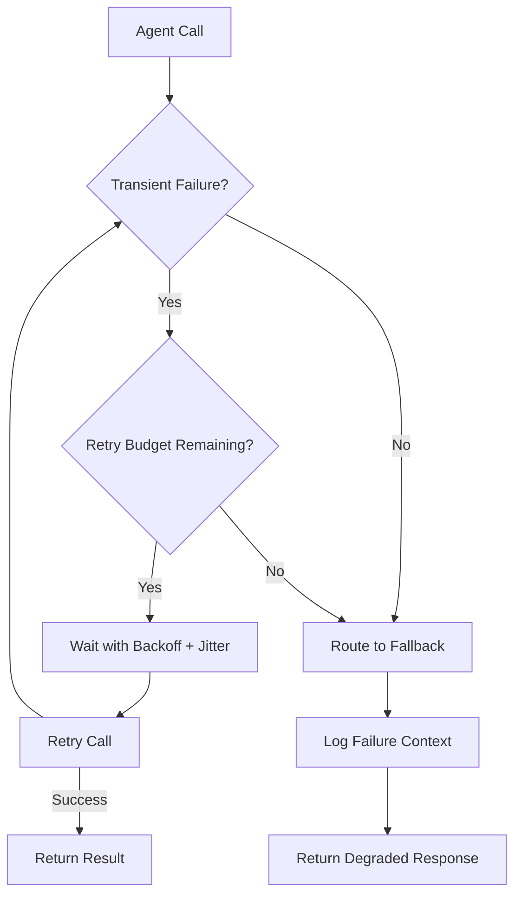
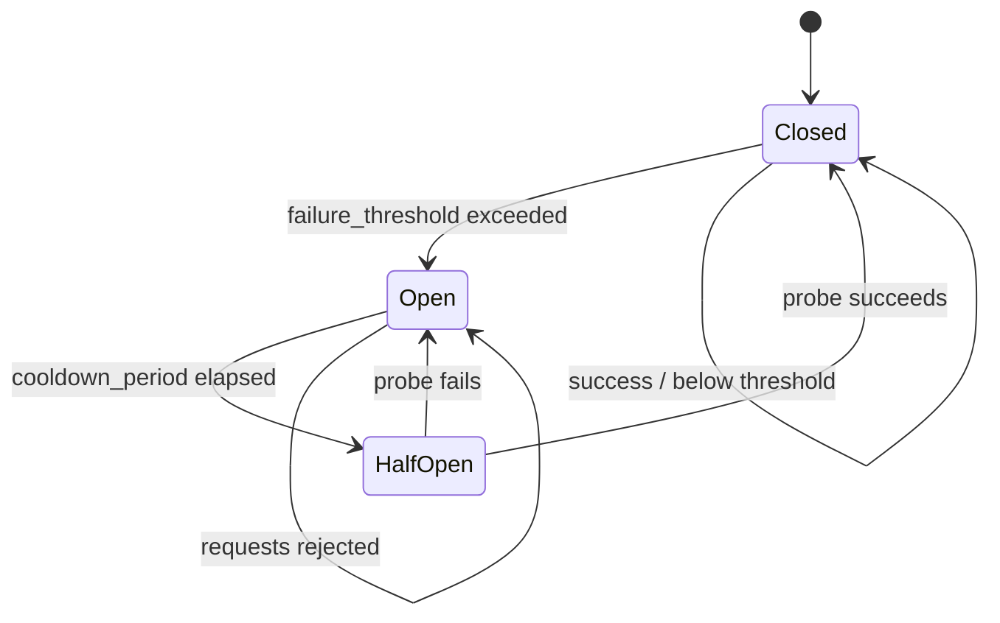
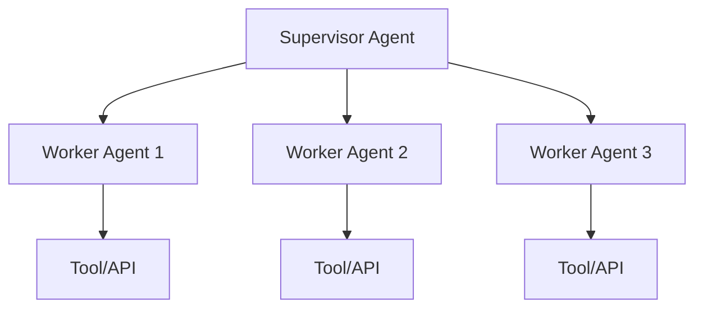
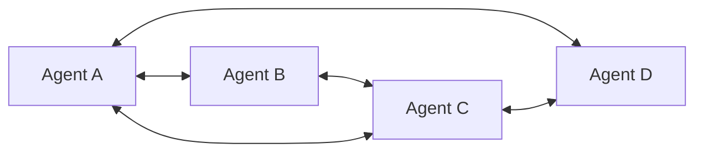
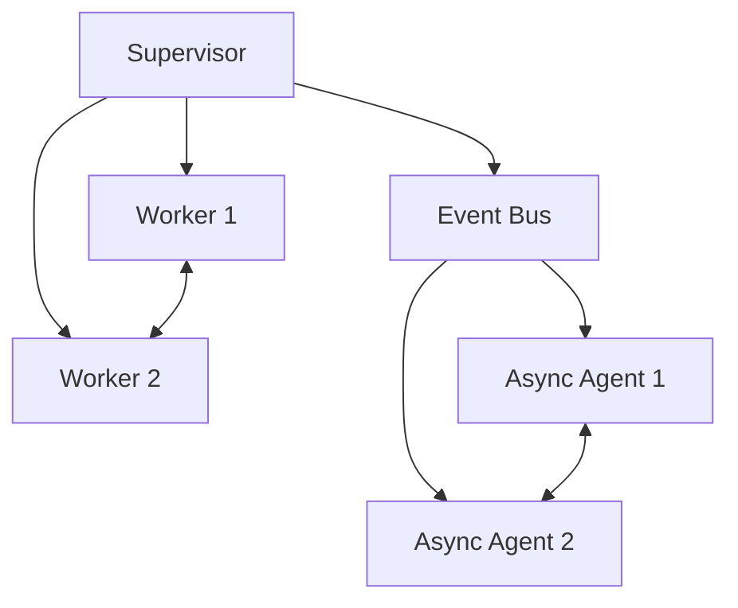
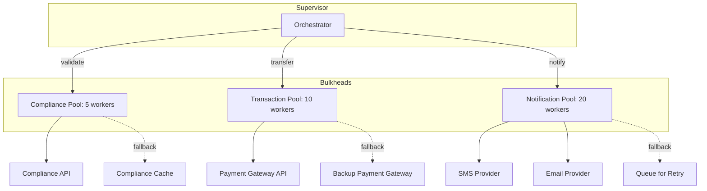
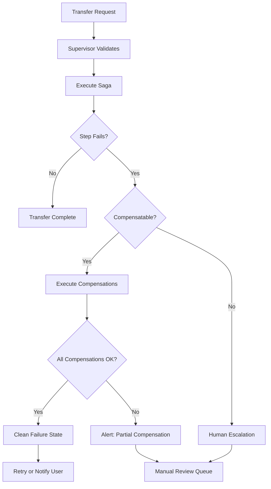

# Chapter 7: Reliability Engineering for Agents

> "Reliability is not a feature you bolt on after the demo works. It is the architecture you build when you accept that production is hostile."

---

## 7.1 Why Agents Fail Differently

Traditional microservices fail in predictable ways: network partitions, disk exhaustion, connection pool saturation. Agent systems fail *creatively*. An LLM call returns a slightly different response that causes a downstream tool to enter an unexpected state. A self-correcting agent detects a "mistake" that isn't actually a mistake and "fixes" it into a broken state. A multi-agent loop oscillates between two valid-but-conflicting strategies, burning tokens until budget exhaustion.

The failure modes of agentic systems are qualitatively different from traditional software because the execution path is non-deterministic. A function call either raises an exception or it doesn't. An LLM might return a valid-but-wrong response that passes every structural check while violating domain semantics. This chapter addresses reliability engineering for systems where the execution graph is generated at runtime, not statically defined at deploy time.

We cover four pillars: **failure management** (what to do when things break), **loop prevention** (stopping infinite waste), **recovery strategies** (restoring to a known-good state), and **topology-specific failure modes** (how architecture shape determines failure shape).

### 7.1.1 Agent Failure Taxonomy

Understanding *how* agents fail is prerequisite to engineering reliability. Failures in agent systems fall into four categories, each requiring different countermeasures.

**Table 7.0**: Agent failure taxonomy

| Category | Example | Detection Difficulty | Auto-Recovery Possible |
|---|---|---|---|
| Transient infrastructure | LLM API timeout, rate limit | Easy (HTTP status codes) | Yes (retry) |
| Semantic reasoning error | Agent produces wrong plan, bad tool call | Hard (requires validation) | Partially (self-correction) |
| State corruption | Agent overwrites correct state with incorrect data | Hard (no obvious error) | Yes (checkpoint rollback) |
| Emergent multi-agent | Loop between agents, resource exhaustion | Very hard (no single agent sees it) | Partially (circuit breakers) |

The critical insight is that **semantic reasoning errors** are the failure mode unique to agent systems. Traditional software has well-defined failure semantics: a function either returns the correct type or throws an exception. An LLM returns a structurally valid response that is factually wrong, logically incomplete, or subtly misleading. These errors pass all automated validation checks and only surface downstream when the system acts on incorrect reasoning.

Engineering reliability for agent systems therefore requires a layered defense: infrastructure-level patterns (retries, circuit breakers) for transient failures, application-level patterns (validation, human escalation) for semantic failures, and system-level patterns (budgets, state tracking) for emergent failures.

### 7.1.2 The Reliability Budget

Every reliability pattern has a cost — in latency, in compute, in development effort, in operational complexity. The goal is not zero failures but rather *acceptable failure rates* justified by the cost of prevention.

A reliability budget quantifies the acceptable failure rate for each workload class, then allocates engineering investment accordingly. The formula:

```
max_investment_per_pattern = (failure_rate * cost_per_failure * pattern_prevention_rate)
```

For example: a pattern that prevents 60% of failures, where failures cost $50K each and occur at 100/year, justifies up to $3M/year in investment. In practice, most reliability patterns cost far less, making the ROI calculation straightforward.

---

## 7.2 Failure Management

### 7.2.1 Retry Strategies

Retries are the first line of defense, but naive retries in agentic systems are dangerous. A retry of an LLM call that returns a hallucinated response just gives the hallucination another chance. Retries must be *semantic* — you retry when the failure is transient (network timeout, rate limit, temporary API outage), not when the failure is semantic (wrong reasoning, invalid tool invocation).



**Figure 7.1**: Retry decision flowchart for agentic systems. Note the distinction between transient and semantic failures — this gate prevents wasteful retries on responses that will always be wrong.

#### Exponential Backoff with Jitter

Pure exponential backoff creates thundering herds when many agents retry simultaneously. Full jitter randomizes the wait, spreading retries across the time window.

The wait time formula is:

```
wait = random(0, min(cap, base * 2^attempt))
```

```python
import random
import time
from enum import Enum


class FailureClass(Enum):
    TRANSIENT = "transient"
    SEMANTIC = "semantic"
    PERMANENT = "permanent"


def retry_with_backoff(
    fn,
    max_attempts: int = 4,
    base_delay: float = 1.0,
    max_delay: float = 60.0,
    classify_error=None,
):
    if classify_error is None:
        classify_error = lambda e: FailureClass.TRANSIENT

    last_exception = None
    for attempt in range(max_attempts):
        try:
            return fn()
        except Exception as e:
            last_exception = e
            failure_class = classify_error(e)

            if failure_class == FailureClass.SEMANTIC:
                raise
            if failure_class == FailureClass.PERMANENT:
                raise

            if attempt == max_attempts - 1:
                raise

            upper_bound = min(max_delay, base_delay * (2 ** attempt))
            wait_time = random.uniform(0, upper_bound)
            time.sleep(wait_time)

    raise last_exception
```

#### Retry Budget Patterns

Unbounded retries are unacceptable. A retry budget caps how many retries occur within a time window, across all callers. Without budgets, a failing LLM API causes every agent to retry independently — multiplying load instead of reducing it.

```python
import time
from collections import deque
from threading import Lock


class RetryBudget:
    def __init__(self, max_retries: int = 5, window_seconds: float = 60.0):
        self.max_retries = max_retries
        self.window_seconds = window_seconds
        self.timestamps: deque = deque()
        self._lock = Lock()

    def allow_retry(self) -> bool:
        now = time.monotonic()
        with self._lock:
            while self.timestamps and self.timestamps[0] <= now - self.window_seconds:
                self.timestamps.popleft()

            if len(self.timestamps) < self.max_retries:
                self.timestamps.append(now)
                return True
            return False

    @property
    def retries_remaining(self) -> int:
        now = time.monotonic()
        with self._lock:
            while self.timestamps and self.timestamps[0] <= now - self.window_seconds:
                self.timestamps.popleft()
            return max(0, self.max_retries - len(self.timestamps))
```

**Usage**: A single `RetryBudget` shared across all agents calling the same LLM provider ensures total retry load stays bounded.

#### Token Cost of Retries

Every retry consumes tokens. For a typical agentic workflow with 3–5 tool-use steps, each retry of the full prompt costs 2,000–8,000 input tokens plus 500–2,000 output tokens. At GPT-4-class pricing ($30/M input, $60/M output), retries compound fast.

**Table 7.1**: Retry cost multiplier for a 5-step agentic workflow (per invocation)

| Retry Count | Additional Tokens (in) | Additional Tokens (out) | Added Cost (GPT-4) | Latency Added |
|---|---|---|---|---|
| 0 | 0 | 0 | $0.00 | 0 ms |
| 1 | 15,000 | 4,000 | $0.69 | ~4 s |
| 2 | 30,000 | 8,000 | $1.38 | ~8 s |
| 3 | 45,000 | 12,000 | $2.07 | ~12 s |
| 5 | 75,000 | 20,000 | $3.45 | ~20 s |

At 10,000 invocations/day with an average 1.5 retries, the daily retry cost alone is ~$10,350. This is why retry budgets are not optional — they are a cost control mechanism.

#### Retry Strategy Selection Guide

Not every failure warrants the same retry strategy. The choice depends on the failure's characteristics and the cost of delay versus the cost of wasted work.

**Table 7.1a**: Retry strategy decision matrix

| Failure Type | Strategy | Max Attempts | Base Delay | Jitter | Rationale |
|---|---|---|---|---|---|
| LLM rate limit (429) | Exponential backoff | 5 | 2 s | Full | Rate limits reset over time; longer waits more likely to succeed |
| LLM server error (500) | Fixed interval | 3 | 1 s | None | Server errors are often transient; quick retry if still broken, give up |
| Network timeout | Exponential backoff | 4 | 0.5 s | Full | Network issues are transient but may persist; spread retries |
| Tool API failure | Exponential backoff | 3 | 1 s | Decorrelated | Tool APIs vary; decorrelated jitter prevents synchronized retries |
| Semantic/quality failure | No retry | 1 | — | — | Wrong reasoning won't improve with repetition |
| Authentication failure | No retry | 1 | — | — | Permanent until credentials change |
| Token limit exceeded | No retry | 1 | — | — | Structural constraint; retry with smaller prompt or different model |

The key principle: **never retry semantic failures**. If an LLM produces a response that violates domain constraints (wrong format, bad reasoning, hallucinated facts), retrying with the same prompt produces the same wrong answer 95%+ of the time. Instead, route to a fallback: a different model, a cached response, or human review.

### 7.2.2 Circuit Breakers

Circuit breakers prevent an agent from repeatedly calling a failing dependency. The circuit has three states:



**Figure 7.2**: Circuit breaker state machine. In the Open state, all calls fail fast without hitting the dependency, giving it time to recover.

```python
import time
import threading
from enum import Enum


class CircuitState(Enum):
    CLOSED = "closed"
    OPEN = "open"
    HALF_OPEN = "half_open"


class CircuitBreaker:
    def __init__(
        self,
        failure_threshold: int = 5,
        cooldown_seconds: float = 30.0,
        half_open_max_calls: int = 1,
    ):
        self.failure_threshold = failure_threshold
        self.cooldown_seconds = cooldown_seconds
        self.half_open_max_calls = half_open_max_calls
        self.state = CircuitState.CLOSED
        self.failure_count = 0
        self.last_failure_time = 0.0
        self.half_open_calls = 0
        self._lock = threading.Lock()

    def call(self, fn, *args, **kwargs):
        with self._lock:
            if self.state == CircuitState.OPEN:
                elapsed = time.monotonic() - self.last_failure_time
                if elapsed >= self.cooldown_seconds:
                    self.state = CircuitState.HALF_OPEN
                    self.half_open_calls = 0
                else:
                    raise CircuitOpenError(
                        f"Circuit open. Retry after "
                        f"{self.cooldown_seconds - elapsed:.1f}s"
                    )

            if self.state == CircuitState.HALF_OPEN:
                if self.half_open_calls >= self.half_open_max_calls:
                    raise CircuitOpenError("Half-open probe limit reached")
                self.half_open_calls += 1

        try:
            result = fn(*args, **kwargs)
        except Exception as e:
            self._record_failure()
            raise
        else:
            self._record_success()
            return result

    def _record_failure(self):
        with self._lock:
            self.failure_count += 1
            self.last_failure_time = time.monotonic()
            if self.failure_count >= self.failure_threshold:
                self.state = CircuitState.OPEN

    def _record_success(self):
        with self._lock:
            self.failure_count = 0
            self.state = CircuitState.CLOSED


class CircuitOpenError(Exception):
    pass
```

#### Circuit Breaker Configuration for Agent Systems

Circuit breaker parameters must be tuned to the specific dependency. LLM APIs have different failure characteristics than database connections or payment gateways.

**Table 7.2a**: Circuit breaker tuning parameters by dependency type

| Dependency | failure_threshold | cooldown_seconds | half_open_max_calls | Rationale |
|---|---|---|---|---|
| LLM API (primary) | 5 | 60 | 1 | LLM APIs recover quickly; longer cooldown avoids hammering |
| LLM API (secondary) | 3 | 30 | 1 | Backup providers used less; fail fast to primary |
| Database | 3 | 10 | 1 | DB failures are usually infrastructure; quick recovery |
| Payment gateway | 2 | 120 | 1 | Financial systems need conservative thresholds; long cooldown |
| External tool API | 5 | 30 | 2 | Third-party APIs vary widely; generous thresholds |
| Cache (Redis/Memcached) | 10 | 5 | 3 | Caches fail often (eviction, restart); high tolerance |

The `half_open_max_calls` parameter is critical for agent systems. Setting it to 1 ensures only a single probe request tests the dependency during recovery. Setting it higher risks flooding a still-recovering service with probe traffic.

#### Circuit Breaker Metrics

Effective circuit breaker deployment requires observability into state transitions, failure rates, and recovery times. Without metrics, circuit breakers are black boxes that either silently protect or silently degrade.

```python
from dataclasses import dataclass, field
from collections import deque


@dataclass
class CircuitBreakerMetrics:
    state_transitions: list = field(default_factory=list)
    failure_counts: deque = field(default_factory=lambda: deque(maxlen=1000))
    success_counts: deque = field(default_factory=lambda: deque(maxlen=1000))

    def record_transition(self, from_state: str, to_state: str, timestamp: float):
        self.state_transitions.append({
            "from": from_state,
            "to": to_state,
            "timestamp": timestamp,
        })

    def record_call(self, success: bool, latency_ms: float, timestamp: float):
        entry = {"latency_ms": latency_ms, "timestamp": timestamp}
        if success:
            self.success_counts.append(entry)
        else:
            self.failure_counts.append(entry)

    @property
    def failure_rate(self) -> float:
        total = len(self.failure_counts) + len(self.success_counts)
        if total == 0:
            return 0.0
        return len(self.failure_counts) / total

    @property
    def avg_failure_latency(self) -> float:
        if not self.failure_counts:
            return 0.0
        return sum(e["latency_ms"] for e in self.failure_counts) / len(self.failure_counts)

    def summary(self) -> dict:
        return {
            "total_transitions": len(self.state_transitions),
            "failure_rate": f"{self.failure_rate:.2%}",
            "avg_failure_latency_ms": f"{self.avg_failure_latency:.0f}",
            "recent_transitions": self.state_transitions[-5:],
        }
```

### 7.2.3 Bulkheads

Bulkheads isolate failures to prevent cascading. In agent systems, the most effective bulkhead pattern is **agent pool isolation**: separate pools of agents handle different workload classes, sharing no resources except the LLM API itself.

```python
from concurrent.futures import ThreadPoolExecutor
from dataclasses import dataclass, field


@dataclass
class AgentPool:
    name: str
    max_concurrency: int = 10
    _executor: ThreadPoolExecutor = field(init=False, repr=False)

    def __post_init__(self):
        self._executor = ThreadPoolExecutor(
            max_workers=self.max_concurrency,
            thread_name_prefix=f"agent-{self.name}",
        )

    def submit(self, fn, *args, **kwargs):
        return self._executor.submit(fn, *args, **kwargs)

    def shutdown(self, wait=True):
        self._executor.shutdown(wait=wait)


transaction_pool = AgentPool("transaction", max_concurrency=5)
analysis_pool = AgentPool("analysis", max_concurrency=20)
```

The key insight: if the analysis pool saturates (20 concurrent calls), the transaction pool (5 concurrent calls) continues unaffected. Without bulkheads, a spike in analysis work steals execution capacity from transaction processing, potentially causing regulatory SLA violations.

#### Bulkhead Dimensions

Bulkhead sizing requires understanding the concurrency characteristics of each workload class. Too small, and the pool rejects work unnecessarily. Too large, and the bulkhead provides no isolation — the pool consumes all available resources before the other pools are tested.

**Table 7.2b**: Bulkhead sizing guidelines by workload class

| Workload Class | Concurrency Pattern | Recommended Pool Size | Queue Depth Limit | Overflow Strategy |
|---|---|---|---|---|
| Financial transactions | Low volume, high value | 3–10 | 50 | Reject with error |
| Customer support | Medium volume, interactive | 20–50 | 200 | Queue + timeout |
| Batch analytics | High volume, async | 50–200 | 1,000 | Throttle input |
| Internal tools | Variable, bursty | 10–30 | 100 | Queue + timeout |
| Real-time streaming | Constant, latency-sensitive | 5–15 | 10 | Reject immediately |

The `queue_depth_limit` is as important as `max_concurrency`. Without it, a saturated pool queues work indefinitely, increasing latency for users without providing any useful throughput. Better to fail fast and route to fallback than to silently queue work that will never complete within acceptable latency.

### 7.2.4 Fallback Routing

When the primary agent fails (circuit open, budget exhausted, or quality threshold not met), the system must route to a fallback. Fallback options, ranked by decreasing capability:

1. **Secondary LLM provider** (e.g., Claude if GPT-4 fails)
2. **Smaller/faster model** (e.g., GPT-3.5-turbo as degraded mode)
3. **Cached response** for similar past queries
4. **Template-based response** with human review queue
5. **Explicit failure** with user notification

```python
from dataclasses import dataclass, field
from typing import Callable, Any, Optional


@dataclass
class FallbackRoute:
    name: str
    handler: Callable[..., Any]
    is_available: Callable[[], bool] = field(default=lambda: True)
    quality_floor: float = 0.0


class FallbackChain:
    def __init__(self, routes: list[FallbackRoute]):
        self.routes = routes

    def execute(
        self,
        task: dict,
        primary_quality_check: Optional[Callable] = None,
    ):
        errors = []
        for route in self.routes:
            if not route.is_available():
                continue
            try:
                result = route.handler(task)
                if primary_quality_check and route.quality_floor > 0:
                    quality = primary_quality_check(result)
                    if quality < route.quality_floor:
                        errors.append(
                            f"{route.name}: quality {quality:.2f} "
                            f"< floor {route.quality_floor}"
                        )
                        continue
                return {"result": result, "route_used": route.name}
            except Exception as e:
                errors.append(f"{route.name}: {e}")
                continue

        raise AllRoutesExhausted(
            f"All fallback routes failed: {'; '.join(errors)}"
        )


class AllRoutesExhausted(Exception):
    pass
```

#### Fallback Routing Quality

Not all fallbacks are equal. A secondary LLM provider may produce output in a different style, different format, or with different accuracy characteristics. The system must validate that fallback output meets minimum quality thresholds before returning it to the caller.

**Table 7.2c**: Fallback route quality characteristics

| Route | Typical Quality Degradation | Latency Impact | Cost Impact | When to Use |
|---|---|---|---|---|
| Secondary LLM provider | 5–15% accuracy drop | +100–500 ms | +20–50% | Primary API outage |
| Smaller/faster model | 15–30% accuracy drop | -50% (faster) | -40–60% | Latency-sensitive, accuracy flexible |
| Cached response | 0–5% relevance drop | -90% (instant) | Near zero | Repeated/similar queries |
| Template response | 30–50% quality drop | -95% (instant) | Near zero | Structured/predictable queries |
| Explicit failure | N/A | Immediate | Zero | No acceptable degradation |

The quality floor in `FallbackRoute` enforces a minimum acceptable quality. If the fallback produces output below the floor, it is rejected and the next route is tried. This prevents degraded-but-acceptable responses from becoming degraded-and-harmful responses.

---

## 7.3 Loop Prevention

Infinite loops in agentic systems are insidious because they consume tokens — the only finite resource in many agent deployments — while producing no useful work. Unlike a traditional infinite loop that pegs a CPU at 100%, an agent loop calls an LLM, waits for a response, processes it, decides nothing has changed, and calls the LLM again. Each iteration costs money and time.

### 7.3.0 The Token Cost of Loops

Before diving into prevention techniques, quantify the waste. A typical agent loop iteration consumes 3,000–10,000 tokens (input prompt + output). At GPT-5.4 pricing, each iteration costs $0.15–$0.90. A loop that runs 50 iterations before detection wastes $7.50–$45.00 per incident. At scale — say, 100 loops per day across a fleet of agents — that's $750–$4,500/day in pure waste, plus the opportunity cost of work that wasn't done.

**Table 7.2d**: Loop waste quantification by loop duration

| Iterations | Tokens Consumed | Cost (GPT-4) | Latency Added | User Impact |
|---|---|---|---|---|
| 5 | 25,000 | $1.13 | ~20 s | Mild delay |
| 20 | 100,000 | $4.50 | ~80 s | Noticeable wait |
| 50 | 250,000 | $11.25 | ~200 s | User abandonment likely |
| 100 | 500,000 | $22.50 | ~400 s | Service effectively down |
| 500 | 2,500,000 | $112.50 | ~33 min | Budget exhaustion |

### 7.3.1 State Hashing for Duplicate Detection

When an agent re-enters a state it has already visited, it is almost certainly looping. State hashing detects this by computing a hash of the agent's working memory and comparing against a set of previously visited states.

```python
import hashlib
import json
from typing import Any


class StateTracker:
    def __init__(self, max_history: int = 100):
        self.visited: dict[str, int] = {}
        self.max_history = max_history

    def _hash_state(self, state: dict[str, Any]) -> str:
        canonical = json.dumps(state, sort_keys=True, default=str)
        return hashlib.sha256(canonical.encode()).hexdigest()[:16]

    def visit(self, state: dict[str, Any]) -> bool:
        h = self._hash_state(state)
        if h in self.visited:
            self.visited[h] += 1
            return True  # duplicate detected
        self.visited[h] = 1

        if len(self.visited) > self.max_history:
            oldest = min(self.visited, key=self.visited.get)
            del self.visited[oldest]

        return False

    def get_repeat_count(self, state: dict[str, Any]) -> int:
        return self.visited.get(self._hash_state(state), 0)
```

**Integration**: Call `tracker.visit(current_state)` at the top of every agent loop iteration. If it returns `True`, the state has been seen before. After 2–3 repeats, escalate to human review or terminate the loop.

#### State Hash Granularity

The effectiveness of state hashing depends on what constitutes the "state." Too coarse (hash only the user message), and legitimate rephrasings trigger false positives. Too fine (hash every intermediate variable), and nearly-identical states with one changed field are treated as novel, missing the loop.

**Table 7.2e**: State hashing granularity trade-offs

| Granularity | What's Hashed | False Positive Rate | False Negative Rate | Best For |
|---|---|---|---|---|
| Message-level | User message + agent response | Low | High | Simple Q&A agents |
| Goal-level | Current goal + progress summary | Low | Medium | Multi-step planning agents |
| Full working memory | All state fields | Medium | Low | Complex stateful agents |
| Tool-call-level | Last N tool calls + results | Low | Medium | Tool-use heavy agents |

The recommended approach for most agents is **goal-level hashing**: hash the current objective, the progress toward it, and the last action taken. This catches the common case (agent re-does the same action toward the same goal) while allowing legitimate state progression.

### 7.3.2 Workflow Checkpointing

Checkpointing saves workflow state at defined intervals, enabling both loop detection (compare current state to recent checkpoints) and recovery (resume from last valid checkpoint). LangGraph provides `PostgresSaver` for persistent checkpointing.

```python
from langgraph.checkpoint.postgres import PostgresSaver
from langgraph.graph import StateGraph, END


class AgentState(dict):
    pass


def create_checkpointer(connection_string: str) -> PostgresSaver:
    checkpointer = PostgresSaver.from_conn_string(connection_string)
    checkpointer.setup()
    return checkpointer


def build_workflow(checkpointer: PostgresSaver):
    graph = StateGraph(AgentState)
    graph.add_node("reason", reason_node)
    graph.add_node("act", action_node)
    graph.add_node("observe", observation_node)

    graph.set_entry_point("reason")
    graph.add_edge("reason", "act")
    graph.add_edge("act", "observe")
    graph.add_conditional_edges(
        "observe",
        should_continue,
        {"continue": "reason", "done": END},
    )

    return graph.compile(checkpointer=checkpointer)


def run_with_checkpoints(workflow, initial_state: dict, thread_id: str):
    config = {"configurable": {"thread_id": thread_id}}
    state = initial_state

    for step in range(100):  # hard limit
        state = workflow.invoke(state, config)

        if should_stop(state):
            break

    return state
```

### 7.3.3 Deadlock Detection in Multi-Agent Systems

Multi-agent systems deadlock when Agent A waits for Agent B, which waits for Agent C, which waits for Agent A. Detection requires maintaining a wait-for graph and checking for cycles.

```python
from collections import defaultdict


class DeadlockDetector:
    def __init__(self):
        self.wait_for: dict[str, set[str]] = defaultdict(set)

    def register_wait(self, waiter: str, dependency: str):
        self.wait_for[waiter].add(dependency)

    def clear_wait(self, waiter: str):
        self.wait_for.pop(waiter, None)

    def detect_cycle(self) -> list[str] | None:
        WHITE, GRAY, BLACK = 0, 1, 2
        color = defaultdict(lambda: WHITE)
        parent = {}

        def dfs(node):
            color[node] = GRAY
            for neighbor in self.wait_for.get(node, []):
                if color[neighbor] == GRAY:
                    cycle = [neighbor, node]
                    curr = node
                    while curr != neighbor:
                        curr = parent.get(curr)
                        if curr is None:
                            break
                        cycle.append(curr)
                    cycle.reverse()
                    return cycle
                if color[neighbor] == WHITE:
                    parent[neighbor] = node
                    result = dfs(neighbor)
                    if result:
                        return result
            color[node] = BLACK
            return None

        for node in list(self.wait_for.keys()):
            if color[node] == WHITE:
                result = dfs(node)
                if result:
                    return result
        return None
```

### 7.3.4 Circular Dependency Detection

Circular dependencies differ from deadlocks: they are structural (in the agent graph), not runtime (in the wait-for graph). Detection runs once at deployment time, not on every invocation.

```python
def detect_circular_dependencies(
    agents: dict[str, list[str]],
) -> list[list[str]]:
    """Detect cycles in agent dependency graph.

    Args:
        agents: mapping of agent_name -> list of agents it depends on.

    Returns:
        List of cycles found. Each cycle is a list of agent names.
    """
    cycles = []
    visited = set()
    rec_stack = set()
    path = []

    def dfs(node):
        visited.add(node)
        rec_stack.add(node)
        path.append(node)

        for dep in agents.get(node, []):
            if dep not in visited:
                dfs(dep)
            elif dep in rec_stack:
                cycle_start = path.index(dep)
                cycles.append(path[cycle_start:] + [dep])

        path.pop()
        rec_stack.discard(node)

    for agent in agents:
        if agent not in visited:
            dfs(agent)

    return cycles
```

### 7.3.5 Maximum Depth Limits and Token Budget Enforcement

Hard limits prevent runaway agents from consuming unlimited resources. Two independent limits are needed: **depth limits** (max reasoning steps) and **token budgets** (max total tokens consumed).

```python
from dataclasses import dataclass, field
from typing import Optional


@dataclass
class AgentBudget:
    max_depth: int = 20
    max_total_tokens: int = 100_000
    max_single_call_tokens: int = 8_000
    token_usage: list = field(default_factory=list)

    @property
    def current_depth(self) -> int:
        return len(self.token_usage)

    @property
    def total_tokens(self) -> int:
        return sum(self.token_usage)

    def can_proceed(self) -> tuple[bool, Optional[str]]:
        if self.current_depth >= self.max_depth:
            return False, f"Max depth {self.max_depth} reached"
        if self.total_tokens >= self.max_total_tokens:
            return (
                False,
                f"Token budget {self.max_total_tokens} reached "
                f"({self.total_tokens} used)",
            )
        return True, None

    def record_usage(self, input_tokens: int, output_tokens: int):
        call_tokens = input_tokens + output_tokens
        if call_tokens > self.max_single_call_tokens:
            raise ValueError(
                f"Single call used {call_tokens} tokens, "
                f"exceeds max_single_call_tokens={self.max_single_call_tokens}"
            )
        self.token_usage.append(call_tokens)
```

**Table 7.2**: Loop prevention technique trade-offs

| Technique | Detection Latency | Token Waste Before Detection | Memory Overhead | Implementation Complexity |
|---|---|---|---|---|
| State hashing | 1 iteration | 2,000–8,000 tokens | Low (hash set) | Low |
| Checkpointing | 1 step | 5,000–20,000 tokens | Medium (DB writes) | Medium |
| Deadlock detection | 1 wait cycle | 0 (no progress) | Low (graph) | Medium |
| Max depth limit | Immediate | 0 | Minimal | Trivial |
| Token budget | Immediate | 0 | Minimal | Trivial |

---

## 7.4 Recovery Strategies

Recovery is what happens *after* a failure is detected. Detection without recovery is just expensive monitoring. The recovery strategy must be designed before the failure occurs — you cannot design a recovery procedure while the system is down and stakeholders are asking for status updates.

### 7.4.0 Recovery Design Principles

Three principles govern recovery system design:

**Determinism over cleverness.** Recovery procedures must be simple, deterministic, and testable. A clever recovery strategy that works 99% of the time but fails in unpredictable ways during the 1% is worse than a simple strategy that works 95% of the time but always fails the same way.

**Idempotency over speed.** Recovery operations must be idempotent — running them twice must produce the same result as running them once. This allows safe retries of the recovery itself without risk of compounding failures.

**Observability over opacity.** Every recovery action must be logged, timed, and attributed. When a recovery succeeds or fails, the team must be able to determine exactly what happened, how long it took, and what the system state looks like afterward.

### 7.4.1 Checkpoint Recovery

Checkpoint recovery restores agent state to a known-good point and resumes execution from there. This requires two components: a checkpoint store and a recovery procedure.

```python
import json
import time
from dataclasses import dataclass, asdict
from typing import Any, Optional
from pathlib import Path


@dataclass
class Checkpoint:
    step: int
    state: dict[str, Any]
    timestamp: float
    metadata: dict[str, Any]


class CheckpointStore:
    def __init__(self, base_path: str = "/tmp/agent_checkpoints"):
        self.base_path = Path(base_path)
        self.base_path.mkdir(parents=True, exist_ok=True)

    def save(self, workflow_id: str, checkpoint: Checkpoint):
        path = self.base_path / f"{workflow_id}.json"
        with open(path, "w") as f:
            json.dump(asdict(checkpoint), f, indent=2, default=str)

    def load(self, workflow_id: str) -> Optional[Checkpoint]:
        path = self.base_path / f"{workflow_id}.json"
        if not path.exists():
            return None
        with open(path) as f:
            data = json.load(f)
        return Checkpoint(**data)

    def delete(self, workflow_id: str):
        path = self.base_path / f"{workflow_id}.json"
        path.unlink(missing_ok=True)


def recover_from_checkpoint(
    store: CheckpointStore,
    workflow_id: str,
    workflow_fn,
    max_recovery_attempts: int = 3,
):
    checkpoint = store.load(workflow_id)
    if checkpoint is None:
        return None

    for attempt in range(max_recovery_attempts):
        try:
            return workflow_fn(checkpoint.state, resume_from=checkpoint.step)
        except Exception as e:
            if attempt == max_recovery_attempts - 1:
                raise
            time.sleep(2 ** attempt)

    return None
```

### 7.4.2 Workflow Replay (Temporal-style)

Workflow replay treats agent execution as a deterministic replay problem: record every decision point and external call result, then replay the entire workflow from scratch, substituting recorded results for actual calls. This is the pattern used by Temporal, AWS Step Functions, and similar orchestration engines.

```python
from dataclasses import dataclass, field
from typing import Callable, Any
import hashlib


@dataclass
class WorkflowEvent:
    step_name: str
    input_hash: str
    output: Any
    timestamp: float


@dataclass
class WorkflowReplayLog:
    events: list[WorkflowEvent] = field(default_factory=list)

    def record(self, step_name: str, input_data: Any, output: Any):
        input_str = str(sorted(str(input_data).encode()))
        self.events.append(WorkflowEvent(
            step_name=step_name,
            input_hash=hashlib.md5(input_str.encode()).hexdigest(),
            output=output,
            timestamp=__import__("time").time(),
        ))

    def get_recorded_output(self, step_name: str, input_data: Any) -> Any | None:
        input_str = str(sorted(str(input_data).encode()))
        h = hashlib.md5(input_str.encode()).hexdigest()
        for event in self.events:
            if event.step_name == step_name and event.input_hash == h:
                return event.output
        return None


class ReplayExecutor:
    def __init__(self, log: WorkflowReplayLog):
        self.log = log

    def execute_step(
        self,
        step_name: str,
        actual_fn: Callable,
        input_data: Any,
    ) -> Any:
        recorded = self.log.get_recorded_output(step_name, input_data)
        if recorded is not None:
            return recorded

        result = actual_fn(input_data)
        self.log.record(step_name, input_data, result)
        return result
```

### 7.4.3 Human Escalation Patterns

Not every failure should be retried or auto-recovered. Some require human judgment. The escalation decision depends on failure severity, cost of continued automation, and regulatory requirements.

**Table 7.3**: Human escalation decision matrix

| Condition | Escalation Level | Response SLA |
|---|---|---|
| Single tool failure, retryable | None (auto-retry) | N/A |
| Quality below threshold after 3 attempts | Log + queue | 4 hours |
| Agent loop detected (same state 3x) | Alert + pause | 1 hour |
| Compliance violation suspected | Immediate halt | 15 minutes |
| Financial amount > $10,000 | Human-in-the-loop | 30 minutes |
| All fallback routes exhausted | Alert + degraded mode | 2 hours |
| Data integrity question | Halt + human review | Immediate |

```python
from enum import Enum
from dataclasses import dataclass
from typing import Optional


class EscalationLevel(Enum):
    NONE = "none"
    LOG_AND_QUEUE = "log_and_queue"
    ALERT_AND_PAUSE = "alert_and_pause"
    IMMEDIATE_HALT = "immediate_halt"


@dataclass
class EscalationPolicy:
    level: EscalationLevel
    sla_minutes: int
    notify_channels: list[str]


@dataclass
class EscalationEngine:
    policies: dict[str, EscalationPolicy]

    def evaluate(
        self,
        failure_type: str,
        context: dict,
    ) -> Optional[EscalationPolicy]:
        policy = self.policies.get(failure_type)
        if policy is None:
            policy = self.policies.get("default")

        if policy.level == EscalationLevel.IMMEDIATE_HALT:
            self._trigger_halt(context)

        if policy.level != EscalationLevel.NONE:
            self._notify(policy, failure_type, context)

        return policy

    def _trigger_halt(self, context: dict):
        pass  # implement: stop all agents in this workflow

    def _notify(self, policy, failure_type, context):
        pass  # implement: send to Slack/PagerDuty/email
```

### 7.4.4 Compensation Actions (Saga Pattern)

When a multi-step agent workflow fails partway through, completed steps may have side effects (API calls made, data written, notifications sent). The saga pattern executes compensating actions to undo completed steps in reverse order.

```python
from dataclasses import dataclass, field
from typing import Callable
import logging

logger = logging.getLogger(__name__)


@dataclass
class SagaStep:
    name: str
    action: Callable
    compensation: Callable
    executed: bool = False
    result: object = None


class AgentSaga:
    def __init__(self, steps: list[SagaStep]):
        self.steps = steps
        self.completed_steps: list[SagaStep] = []

    def execute(self, initial_context: dict) -> dict:
        context = initial_context

        for step in self.steps:
            try:
                step.result = step.action(context)
                step.executed = True
                self.completed_steps.append(step)
                context = {**context, **(step.result or {})}
            except Exception as e:
                logger.error(f"Saga step '{step.name}' failed: {e}")
                self._compensate()
                raise SagaFailed(
                    f"Step '{step.name}' failed, compensations executed"
                ) from e

        return context

    def _compensate(self):
        for step in reversed(self.completed_steps):
            if not step.executed:
                continue
            try:
                step.compensation(step.result)
                logger.info(f"Compensated step '{step.name}'")
            except Exception as e:
                logger.critical(
                    f"Compensation failed for '{step.name}': {e}. "
                    f"Manual intervention required."
                )


class SagaFailed(Exception):
    pass
```

### 7.4.5 RTO and RPO for Agent Systems

**Recovery Time Objective (RTO)** is the maximum acceptable time from failure detection to service restoration. **Recovery Point Objective (RPO)** is the maximum acceptable amount of data (or work) lost during recovery.

Traditional RTO/RPO definitions assume deterministic systems: a database fails, you restore from backup, you know exactly what data was lost. Agent systems complicate this because "state" includes not just persisted data but also conversational context, reasoning chains, and in-progress tool invocations. An agent that has called 3 out of 5 tools in a sequence is in a state that cannot be simply restored from a snapshot — the tool call results must be replayed.

**Table 7.4**: RTO/RPO targets by agent workload class

| Workload Class | RTO | RPO | Checkpoint Frequency | Recovery Mechanism |
|---|---|---|---|---|
| Financial transactions | < 30 s | 0 (zero loss) | Every step | Sync checkpoint + saga |
| Customer support | < 5 min | < 2 min of conversation | Every 3 turns | Async checkpoint + replay |
| Batch analytics | < 30 min | < 100 records | Every 1,000 rows | Restart from last batch |
| Internal tools | < 15 min | Best effort | Periodic | Restart from scratch |

#### RTO/RPO Cost Implications

Achieving lower RTO/RPO values requires increasingly expensive infrastructure. The relationship is non-linear: reducing RPO from 1 hour to 0 (zero loss) typically increases infrastructure cost by 3–5x because it requires synchronous checkpointing to durable storage.

**Table 7.4a**: RTO/RPO cost curve

| Target | Infrastructure Multiplier | Typical Use Case |
|---|---|---|
| RPO = 24 h, RTO = 4 h | 1x (baseline) | Internal dashboards, non-critical analytics |
| RPO = 1 h, RTO = 1 h | 1.5x | Customer-facing tools, support bots |
| RPO = 5 min, RTO = 15 min | 2x | E-commerce, content generation |
| RPO = 0, RTO = 30 s | 3–5x | Financial transactions, healthcare |
| RPO = 0, RTO = 0 (active-active) | 5–10x | Trading systems, real-time compliance |

---

## 7.5 Per-Topology Failure Modes

Agent topologies — how agents are connected and communicate — determine which failure modes are possible and how severe they are.

### 7.5.1 Hierarchical (Supervisor-Worker)



**SPOF: Supervisor.** If the supervisor fails, all workers become orphaned. No worker can initiate work, and partial results from workers cannot be aggregated. The entire system halts.

**Worker failure**: Contained. The supervisor detects the failure (timeout or error response) and can retry, reassign, or skip. Workers are stateless from the supervisor's perspective.

**Aggregation failure**: If the supervisor fails during result aggregation, partial results may be lost. This is the highest-risk moment in hierarchical topologies.

**Mitigation**: Duplicate the supervisor with a hot standby. The standby monitors the primary's heartbeats and takes over if it stops responding. This adds latency (heartbeat interval) but eliminates the SPOF.

#### Hierarchical Failure Scenarios

Consider a concrete example: a supervisor agent decomposes a complex research question into 5 sub-queries, dispatches them to worker agents, and aggregates the results. Three failure scenarios are common:

**Scenario 1 — Supervisor crash mid-dispatch.** Workers 1 and 2 have started work. Workers 3–5 never receive their tasks. If the supervisor crashes before dispatching, no work is wasted. If it crashes after dispatching some but not all workers, the system is in an inconsistent state: some workers are running, others are idle, and no one will aggregate results. Recovery requires detecting the crash, restarting the supervisor, and re-dispatching all tasks (since partial results are unreliable without aggregation).

**Scenario 2 — Worker failure during aggregation.** All 5 workers complete their tasks. The supervisor begins aggregating results and crashes after processing 3 of 5 results. The 2 unprocessed results are in memory (the supervisor's context window) and are lost. Without checkpointing, the supervisor must re-run all 5 workers to re-aggregate.

**Scenario 3 — Supervisor timeout cascade.** Worker 3 takes longer than expected. The supervisor's timeout fires, marking Worker 3 as failed. Workers 4 and 5 complete successfully. Worker 3 eventually completes but its result is discarded. The supervisor aggregates 4 of 5 results (missing Worker 3's contribution) and returns a degraded answer. This is a *correct* failure mode — the timeout prevented the supervisor from waiting indefinitely — but it produces a subtly incomplete result that may not be obvious to the caller.

### 7.5.2 Peer-to-Peer



**Cascading failures**: If Agent A fails while Agent B is waiting for a response, B may retry, creating load. If B's retry causes A to fail again, A's circuit breaker opens, which causes C (which depends on A) to fail. The cascade propagates through the dependency graph.

**Event storms**: In event-driven P2P systems, a failure can generate a burst of error events. Each agent processes the error event, potentially generating more events. Without circuit breakers or dead-letter queues, event volume grows exponentially.

**Split brain**: If a network partition separates the agent group, two sub-groups may each believe they are the complete system, leading to inconsistent state.

**Mitigation**: Implement message-level circuit breakers (not just connection-level). Use quorum-based decision making for state-changing operations. Add message TTLs to prevent infinite event propagation.

#### P2P Cascading Failure Example

Consider four agents in a dependency chain: Agent A feeds Agent B, which feeds Agent C, which feeds Agent D. If Agent B's LLM call fails:

1. **B retries** (3 attempts, exponential backoff). Total load on LLM API triples for B's traffic.
2. **A notices B is slow** (timeout). A retries its call to B. Now A's retries + B's retries = 6x load on LLM API.
3. **C notices B is slow** (no response). C's circuit breaker opens (threshold: 3 failures). C stops calling B.
4. **D notices C is slow** (no response from C). D's circuit breaker opens. D stops calling C.

The cascade has propagated from B to D. Even if B's original failure was transient, the cascade has knocked out the entire chain. Recovery requires C and D's circuit breakers to enter half-open state, which requires B to be healthy, which requires the LLM API to recover from the 6x load spike caused by A and B's retries.

This is why retry budgets and circuit breakers work together: the retry budget caps B's retries (and A's), preventing the 6x spike, and the circuit breakers on C and D prevent the cascade from propagating.

### 7.5.3 Hybrid Topologies



**Partial failures**: The most complex failure mode. The supervisor's synchronous workers may be healthy while the event bus's async agents are degraded. Users see partial results: some answers arrive, others time out.

**Event bus failure**: The event bus (Kafka, RabbitMQ, etc.) is a shared dependency. If it fails, all async communication stops. The supervisor's synchronous workers continue, but cross-agent coordination halts.

**Supervisor failure**: Same as hierarchical, but the async agents may continue processing stale events, leading to inconsistent state.

**Mitigation**: Health-check both synchronous and async paths independently. Use separate circuit breakers for the event bus and LLM API. Implement eventual consistency protocols for cross-path state synchronization.

#### Hybrid Topology: The Dual-Path Problem

Hybrid topologies introduce a unique challenge: the synchronous path (supervisor → workers) and the asynchronous path (event bus → async agents) may produce conflicting results or process the same event twice.

Consider a customer support agent system. The supervisor handles the synchronous conversation, while async agents handle background tasks (sentiment analysis, knowledge base updates, escalation routing). If the supervisor processes a customer message while the sentiment analyzer is still processing the *previous* message, the system may escalate based on stale sentiment data.

The solution is **path-aware sequencing**: the event bus must guarantee that async agents process events in order, and the supervisor must wait for critical async results before proceeding. This requires a coordination protocol between the two paths, typically implemented via shared state (a database or cache) that both paths read and write.

### 7.5.4 Topology Comparison

**Table 7.5**: Failure mode comparison by topology

| Failure Mode | Hierarchical | P2P | Hybrid |
|---|---|---|---|
| Single point of failure | Supervisor (high) | None (low) | Supervisor (medium) |
| Cascading failure risk | Low (isolation) | High (direct) | Medium (partial) |
| Split brain risk | None | High | Medium |
| Event storm risk | None | High | Medium |
| Recovery complexity | Simple (restart supervisor) | Complex (state reconciliation) | Very complex (mixed modes) |
| Blast radius of single failure | All workers | Connected peers | Subset of agents |
| Natural circuit breaker placement | Supervisor → workers | Each peer link | Per-dependency |

---

## 7.6 Enterprise Constraints and Decision Table

Enterprise environments impose constraints that directly determine which reliability patterns are required. The following table maps common enterprise requirements to specific patterns.

**Table 7.6**: Enterprise constraint → reliability pattern mapping

| Enterprise Constraint | Required Pattern | Implementation | Cost Impact |
|---|---|---|---|
| SOC 2 compliance (audit logs) | Checkpoint logging + replay | Every state transition logged to append-only store | +15% storage, +5% latency |
| GDPR right to erasure | Saga compensation | Data deletion saga with compensating actions | +20% development time |
| 99.9% SLA (< 8.76 h downtime/yr) | Circuit breakers + fallbacks + hot standby | Multi-region deployment with health checks | +2–3x infrastructure cost |
| Zero data loss (financial) | Sync checkpointing + WAL | Every step checkpointed to durable store before commit | +30% latency per step |
| Sub-second response (trading) | Bulkhead isolation + cached fallbacks | Pre-computed responses for known patterns | +40% infrastructure cost |
| Multi-tenant isolation | Agent pool bulkheads | Separate pools per tenant, shared LLM API | +10–20% per tenant overhead |
| Regulatory review (48 h SLA) | Workflow replay + human escalation | Full execution log with human review queue | +1 FTE reviewer per 10K workflows/day |
| Disaster recovery (RPO < 1 h) | Async checkpoint replication | Checkpoints replicated to secondary region every 5 min | +50% storage cost |

### 7.6.1 Compliance-Driven Reliability

Enterprise compliance frameworks (SOC 2, GDPR, HIPAA, PCI-DSS) impose specific reliability requirements that go beyond uptime SLAs. These requirements typically mandate:

- **Auditability**: Every decision must be traceable to its inputs and reasoning chain.
- **Reversibility**: Actions with data side effects must be reversible or compensatable.
- **Retention**: Execution logs must be retained for regulatory periods (typically 3–7 years).
- **Isolation**: Multi-tenant systems must prevent cross-tenant data leakage in failure scenarios.

Each compliance requirement maps to specific reliability patterns. SOC 2's audit requirement mandates checkpoint logging with append-only storage (tamper-evident). GDPR's right to erasure mandates saga compensation with data deletion as a compensating action. HIPAA's access controls mandate agent pool isolation with per-tenant encryption.

The cost of compliance-driven reliability is significant but predictable. A typical SOC 2 audit requires 6–12 months of implementation and $100K–$500K in engineering investment, depending on existing infrastructure. The ongoing operational cost is 10–20% above baseline infrastructure.

### 7.6.2 Cost of Compliance vs. Cost of Non-Compliance

**Table 7.6a**: Compliance cost comparison

| Framework | Implementation Cost | Annual Operational Cost | Non-Compliance Fine | Incident Cost |
|---|---|---|---|---|
| SOC 2 | $100K–$500K | $50K–$100K/yr | $50K–$500K | $100K–$1M |
| GDPR | $200K–$800K | $100K–$200K/yr | Up to 4% annual revenue | $1M–$10M |
| HIPAA | $300K–$1M | $150K–$300K/yr | $100K–$1.5M per violation | $500K–$5M |
| PCI-DSS | $200K–$600K | $75K–$150K/yr | $5K–$100K/month | $50K–$500K |

---

## 7.7 Case Study: Financial Transaction Processing

### 7.7.1 Architecture

A fintech company processes international money transfers using a multi-agent system. The system validates sender identity, checks compliance rules, calculates fees, executes the transfer, and notifies both parties. Each step is an agent, orchestrated by a supervisor.



**Figure 7.3**: Financial transaction processing architecture with bulkhead isolation and fallback routing.

#### Design Decisions

The architecture makes several deliberate reliability choices:

1. **Separate bulkhead pools per function.** Compliance checking (5 workers) runs at lower concurrency than notifications (20 workers) because compliance API calls are slower and more expensive. Notifications are fire-and-forget and can absorb higher concurrency.

2. **Circuit breakers at every external dependency.** Each API (compliance, payment, SMS, email) has its own circuit breaker. If the compliance API fails, payment processing continues using cached compliance results.

3. **Fallback routes for critical paths.** Payment processing falls back to a backup gateway. Compliance checking falls back to a local cache of recent compliance decisions. Notifications queue for retry if both SMS and email fail.

4. **Saga pattern with compensating actions.** If the payment step fails after compliance passes, the system does not need to "undo" compliance — it is a read-only check. But if the notification step fails after payment succeeds, the system must queue the notification for later delivery (the "compensation" is ensuring eventual notification).

### 7.7.2 Implementation

```python
import time
from dataclasses import dataclass


@dataclass
class TransferRequest:
    sender_id: str
    receiver_id: str
    amount: float
    currency: str
    idempotency_key: str


def build_transfer_workflow():
    compliance_breaker = CircuitBreaker(
        failure_threshold=3, cooldown_seconds=60
    )
    payment_breaker = CircuitBreaker(
        failure_threshold=2, cooldown_seconds=120
    )
    retry_budget = RetryBudget(max_retries=3, window_seconds=30)

    saga = AgentSaga([
        SagaStep(
            name="validate_identity",
            action=lambda ctx: validate_identity(ctx["request"]),
            compensation=lambda r: None,  # no-op, read-only
        ),
        SagaStep(
            name="check_compliance",
            action=lambda ctx: compliance_breaker.call(
                lambda: check_compliance(ctx["request"])
            ),
            compensation=lambda r: None,  # read-only
        ),
        SagaStep(
            name="calculate_fees",
            action=lambda ctx: calculate_fees(ctx["request"], ctx["compliance"]),
            compensation=lambda r: None,  # read-only
        ),
        SagaStep(
            name="execute_transfer",
            action=lambda ctx: retry_with_backoff(
                lambda: payment_breaker.call(
                    lambda: execute_payment(ctx["request"], ctx["fees"])
                ),
                max_attempts=3,
                classify_error=lambda e: (
                    FailureClass.PERMANENT
                    if isinstance(e, (AuthError, InvalidAmountError))
                    else FailureClass.TRANSIENT
                ),
            ),
            compensation=lambda r: reverse_transfer(r["transfer_id"]),
        ),
        SagaStep(
            name="notify_parties",
            action=lambda ctx: send_notifications(ctx["transfer"], ctx["fees"]),
            compensation=lambda r: None,  # best-effort notifications
        ),
    ])

    return saga
```

### 7.7.3 Recovery Flow



**Figure 7.4**: Recovery flow for failed financial transfers. Every step has a compensation action, and failures escalate to human review when compensation is uncertain.

#### Recovery Timing Analysis

The recovery flow has specific timing requirements based on the failure point:

**Table 7.4b**: Recovery timing by failure point in financial transfer saga

| Failure Point | Compensation Required | Recovery Time | Human Involvement | Data Loss Risk |
|---|---|---|---|---|
| Identity validation | None (read-only) | < 5 s | None | None |
| Compliance check | None (read-only) | < 5 s | None | None |
| Fee calculation | None (read-only) | < 5 s | None | None |
| Payment execution | Transfer reversal | 5–30 s | Automated | None (if reversal succeeds) |
| Notification delivery | Queue retry | 1–60 s | None | None (eventual delivery) |
| Saga compensation failure | Manual investigation | 1–24 h | Required | Potential partial loss |

The highest-risk failure point is **payment execution** because it has real financial side effects. The compensation (transfer reversal) is itself a financial transaction that can fail. If the reversal fails, the system enters an inconsistent state: money has moved but the agent system thinks it hasn't. This is why the recovery flow routes to human escalation when compensation fails — automated recovery cannot be trusted for financial side effects that fail to compensate.

### 7.7.4 Cost of Failure vs. Cost of Reliability

**Table 7.7**: Cost analysis for financial transaction agent system

| Item | Annual Cost | Notes |
|---|---|---|
| **Reliability Investment** | | |
| Circuit breaker implementation | $15,000 | One-time dev + testing |
| Retry + budget system | $10,000 | One-time dev + testing |
| Saga compensation framework | $25,000 | One-time dev + testing |
| Bulkhead isolation | $20,000 | One-time dev + testing |
| Checkpoint infrastructure | $30,000 | One-time dev + DB ops |
| Monitoring + alerting | $40,000 | Annual ops |
| Hot standby (infrastructure) | $60,000 | Annual infra cost |
| **Total reliability cost** | **$200,000** | |
| | | |
| **Cost of Failure (without reliability)** | | |
| Avg. failed transfers/day | 50 | Industry benchmark |
| Avg. transfer value | $2,000 | |
| Regulatory fine per incident | $50,000 | |
| Customer churn per incident | $100,000 | Estimated LTV loss |
| Recovery labor per incident | $5,000 | Manual investigation |
| **Daily failure cost** | **$180,000** | |
| **Annual failure cost** | **$65,700,000** | Assuming 365 days |

The reliability investment ($200K/year) prevents an estimated $65.7M in annual failure costs. Even if the reliability system prevents only 0.3% of potential failures, it breaks even. In practice, well-implemented reliability patterns prevent 95%+ of failure scenarios.

**Table 7.8**: Reliability pattern cost-effectiveness ranking

| Pattern | Implementation Cost | Failure Prevention Rate | ROI (annual) |
|---|---|---|---|
| Retry budget | Low ($10K) | 15% of transient failures | 47:1 |
| Circuit breaker | Low ($15K) | 30% of cascading failures | 63:1 |
| Saga compensation | Medium ($25K) | 60% of partial failures | 39:1 |
| Bulkhead isolation | Medium ($20K) | 40% of cross-service failures | 53:1 |
| Checkpoint recovery | Medium ($30K) | 70% of state corruption | 46:1 |
| Hot standby | High ($60K/yr) | 90% of SPOF failures | 30:1 |

---

## 7.8 Key Takeaways

1. **Retry with classification, not by default.** Classify failures as transient, semantic, or permanent. Only retry transient failures. Semantic failures (wrong reasoning) never self-correct with retries. The cost of retrying semantic failures is not just wasted tokens — it is delayed detection, because each retry postpones the fallback that would have produced a correct answer.

2. **Budget your retries.** A shared retry budget across all agents prevents the retry storm problem where every agent independently hammers a failing API, multiplying load instead of reducing it. The budget is a global constraint, not a per-agent constraint. Ten agents each retrying once is ten retries; a budget of five prevents five of them.

3. **Circuit breakers are mandatory for external dependencies.** Every LLM API call, every tool call, every database connection needs a circuit breaker. The cost of implementing them is trivial compared to the cost of uncontrolled cascading failures. Tune the parameters to the dependency: aggressive thresholds for payment gateways, generous thresholds for LLM APIs.

4. **Topology determines failure shape.** Hierarchical systems have SPOF problems. P2P systems have cascading and split-brain problems. Hybrid systems have all of the above, partially. Design your reliability patterns to match your topology. A circuit breaker in a hierarchical system protects a single dependency; in a P2P system, it must protect every peer link.

5. **Prefer prevention over recovery.** Loop prevention (depth limits, token budgets, state hashing) costs almost nothing and prevents the most common form of agent waste: infinite loops burning tokens. A single token budget check at the top of an agent loop costs zero tokens and prevents unlimited waste.

6. **Every side effect needs a compensation.** If an agent action changes external state (sends an email, transfers money, creates a record), there must be a compensating action. The saga pattern is not optional for production agent systems with side effects. If a compensation is impossible (you cannot unsend an email), the action must be gated by human approval before execution.

7. **Measure the cost of reliability against the cost of failure.** Enterprise reliability is not about achieving 100% uptime. It is about ensuring the reliability investment is justified by the failure costs it prevents. A $200K reliability investment that prevents $65M in annual failure costs has a 325:1 ROI — there is no engineering decision where the answer is "skip reliability."

8. **Checkpoint early, checkpoint often.** For any agent workflow longer than 3 steps or costing more than $0.10 per invocation, persistent checkpointing pays for itself on the first prevented re-execution. The cost of a checkpoint is a database write (~1 ms); the cost of replaying a 10-step workflow from scratch is ~10 seconds of LLM calls (~$0.50–$2.00).

9. **Design for human escalation, not just automation.** The most reliable agent system is one that knows when to stop and ask for help. Every failure mode that cannot be automatically recovered must have a clear escalation path with defined SLAs. The escalation path is part of the reliability architecture, not an afterthought.

10. **Test your failure modes, not just your happy paths.** Chaos engineering applies to agent systems: inject LLM failures, simulate circuit breaker opens, force token budget exhaustion. If you cannot reliably reproduce a failure mode in testing, you cannot reliably recover from it in production.

---

## 7.9 Further Reading

- Nygard, M. T. (2018). *Release It! Design and Deploy Production-Ready Software* (2nd ed.). The Pragmatic Programmers. — The foundational text on circuit breakers, bulkheads, and stability patterns.
- Young, J. (2020). *Mastering Chaos — A Netflix Guide to Microservices*. Netflix Tech Blog. — Chaos engineering principles applicable to agent systems.
- Temporal Technologies. (2024). *Workflow Recovery Patterns*. Temporal Documentation. — Workflow replay, sagas, and compensation patterns.
- LangGraph. (2024). *Checkpointing and State Management*. LangChain Documentation. — Practical checkpointing implementation for agent workflows.
- Basiri, A. et al. (2016). "Chaos Engineering." *IEEE Software*, 33(4), 35–41. — The academic foundation for systematic failure injection.
- Amazon Web Services. (2023). *AWS Well-Architected Framework — Reliability Pillar*. — Enterprise-grade reliability patterns and cost models.
- Laplante, P. & Neill, C. (2004). *The Art of Capacity Planning*. O'Reilly Media. — Capacity planning and retry budget methodology.
- Heck, B. et al. (2023). "Building Reliable AI Systems." *Google Research*. — Reliability patterns specific to ML/AI serving systems.
