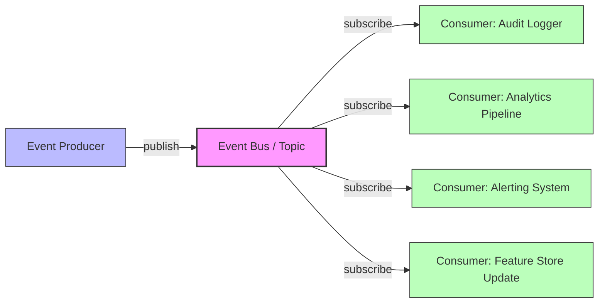
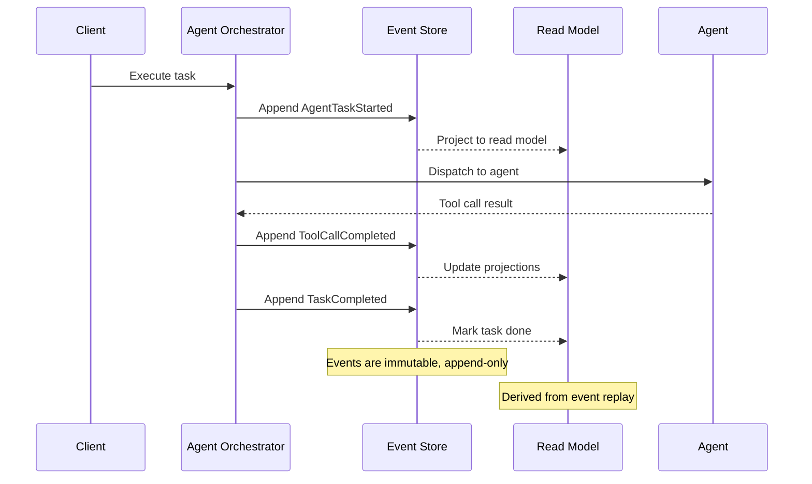
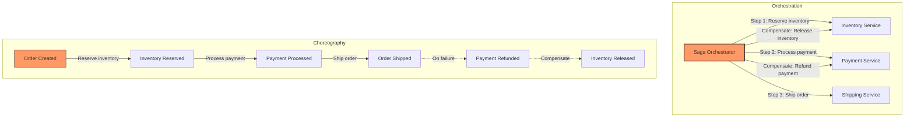
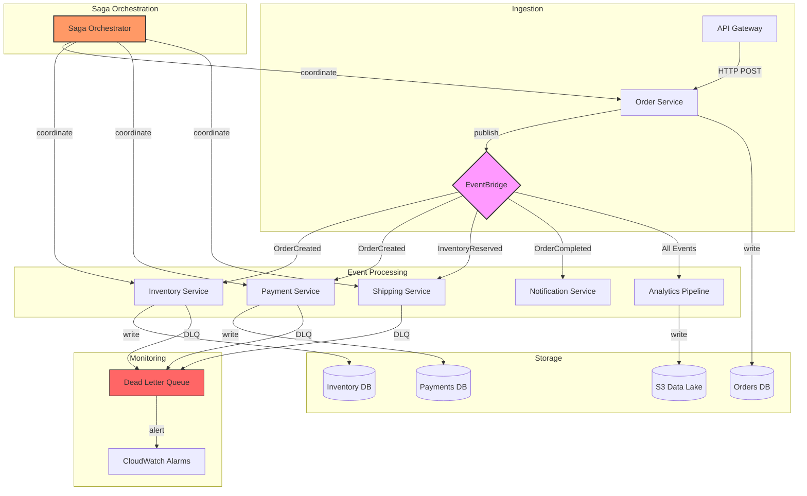

# Chapter 8: Distributed Systems for AI

As AI systems evolve from single-model inference pipelines to autonomous agent architectures, the underlying infrastructure must handle events flowing across dozens of services, thousands of concurrent agent executions, and millions of state transitions. Distributed messaging is no longer optional—it is the backbone that determines whether your AI platform scales gracefully or collapses under its own weight.

This chapter examines the messaging systems, patterns, and trade-offs that senior architects must master when building production AI infrastructure. We move beyond theoretical discussions into concrete implementations: real Kafka producers, idempotent consumers, saga orchestrators, and cost calculations that map architecture decisions to quarterly budgets.

The shift toward agentic AI compounds these challenges. A single user request might trigger a chain of 5–15 model calls, tool invocations, and external API requests, each of which must be tracked, coordinated, and made resilient to partial failures. The messaging layer sits beneath all of this, determining whether your system degrades gracefully or cascades into failure when a downstream service becomes slow or unavailable.

---

## 8.1 Messaging Systems Comparison

The choice of messaging system cascades through every downstream decision—latency budgets, durability guarantees, operational complexity, and ultimately cost. No single system wins across all dimensions. The architect's job is to identify which trade-offs matter most for their specific workload.

Before evaluating individual systems, establish your workload characteristics:
- **Message volume:** Steady-state and peak messages per second
- **Message size:** Payload size in bytes or kilobytes
- **Ordering requirements:** Global, per-entity, or unordered
- **Durability requirements:** At-most-once, at-least-once, or exactly-once
- **Retention needs:** How long messages must remain available for replay
- **Consumer patterns:** Single consumer, fan-out, competing consumers
- **Operational capacity:** Can your team operate a distributed system?

These characteristics eliminate options before you begin detailed evaluation. A team with no Kafka experience and a 50K msg/s workload should start with SQS, not spend three months learning Kafka operations.

### 8.1.1 Apache Kafka

Kafka dominates high-throughput event streaming. Its append-only log model provides strict ordering within partitions, persistent storage with configurable retention, and horizontal scalability through partitioning. Kafka was originally built by LinkedIn to handle their activity stream and operational metrics—workloads that map directly to AI agent telemetry.

**Core characteristics:**
- **Throughput:** 1–2 million messages/second per broker cluster, with benchmarks showing 2M+ msg/s on well-tuned hardware
- **Latency:** Sub-millisecond for producer→broker ack, 5–15ms end-to-end including consumer processing
- **Durability:** Configurable replication factor (typically 3), zero data loss with `acks=all` and `min.insync.replicas=2`
- **Ordering:** Guaranteed within a partition; no global ordering without single partition (which kills throughput)
- **Retention:** Time-based or size-based, typically days to weeks; compacted topics retain latest value per key indefinitely
- **Exactly-once semantics:** Achievable via transactional producers and consumers (idempotent writes + atomic multi-partition writes)

Kafka excels when your AI system generates high-volume event streams—model training telemetry, real-time feature pipelines, agent action logs. It struggles when you need complex routing logic or priority queues, because Kafka's model is fundamentally about ordered logs, not message queues.

**Kafka's partition model deserves special attention for AI workloads.** When an agent processes a task, all events for that task should land on the same partition to guarantee ordering. Use the `task_id` or `agent_id` as the partition key. This ensures that events for a single agent execution are processed sequentially, while events across different agents can be processed in parallel across multiple consumers.

**When Kafka is the right choice:**
- Event sourcing with long-term retention (weeks/months of history)
- Real-time feature stores where events must be ordered per entity
- High-throughput training pipelines that emit millions of telemetry events
- Systems requiring event replay for debugging or reprocessing

**When Kafka is the wrong choice:**
- Simple task queues where SQS suffices
- Teams without distributed systems operational experience
- Workloads under 10K msg/s where operational overhead isn't justified
- Systems needing complex message routing or priority queues

### 8.1.2 RabbitMQ

RabbitMQ implements the AMQP protocol with a traditional message broker model. Messages are consumed and acknowledged, unlike Kafka's log-based approach. RabbitMQ has been battle-tested since 2007 and remains the most popular open-source message broker.

**Core characteristics:**
- **Throughput:** 20,000–50,000 messages/second per node, with Erlang's lightweight process model enabling high concurrency
- **Latency:** Sub-millisecond for local delivery, 1–5ms typical across a cluster
- **Durability:** Optional (transient vs durable queues, persistent vs non-persistent messages). Durable queues survive broker restarts; persistent messages survive broker restarts and are written to disk
- **Ordering:** FIFO within a queue, but competing consumers break ordering (use a single consumer per queue for ordering)
- **Routing:** Exchange/binding model supports direct, topic, fanout, headers-based, and consistent-hash routing
- **Priority queues:** Native support for message priority (up to 255 priority levels)
- **Dead lettering:** Built-in support for dead-letter exchanges (DLX) with configurable conditions

RabbitMQ shines for task distribution where messages have different priorities, routing requirements, or consumption patterns. Agent task queues, webhook handlers, and RPC-style request/reply patterns map naturally to RabbitMQ's model.

**The exchange/binding model is RabbitMQ's superpower.** Unlike Kafka's topic-based model, RabbitMQ can route messages based on content, headers, or routing keys. For example, you can route "high-priority agent tasks" to a fast consumer pool while "background analytics events" go to a batch processing queue—all from the same exchange.

**When RabbitMQ is the right choice:**
- Task queues with priority requirements (e.g., user-facing requests vs background jobs)
- Complex routing logic (content-based routing, topic-based fan-out)
- RPC patterns where request/reply semantics are needed
- Workloads where messages should be deleted after consumption (not retained)

**When RabbitMQ is the wrong choice:**
- Event sourcing (no log retention model)
- Throughput above 100K msg/s per node
- Systems requiring event replay or temporal queries
- Workloads where ordering across partitions matters

### 8.1.3 Amazon SQS

SQS removes operational burden entirely. AWS manages brokers, replication, and scaling. You pay per request with no minimums. SQS is the most widely used message queue in the world, processing trillions of messages daily.

**Core characteristics:**
- **Throughput:** Virtually unlimited (auto-scales with no pre-provisioning)
- **Latency:** 10–100ms (network-dependent, higher cross-region)
- **Durability:** Messages replicated across three AZs by default, 11 nines of durability
- **Ordering:** Standard queue: best-effort (at-least-once, order not preserved); FIFO queue: strict ordering with 300 msg/s (or 3,000 with message group ID batching) limit
- **Retention:** 1 minute to 14 days (configurable)
- **Visibility timeout:** 0 seconds to 12 hours (controls how long a message is hidden after being received)
- **Delay queues:** Up to 15 minutes (Standard) or 15 minutes per message (FIFO)

SQS is the pragmatic choice for workloads where operational simplicity outweighs latency requirements. Most agent orchestration workloads—tool calls, external API invocations, asynchronous processing—tolerate 50ms latency easily.

**SQS FIFO's 300 msg/s limit is a hard constraint.** For AI workloads generating thousands of events per second per entity, FIFO queues won't work. Use Standard queues with application-level idempotency instead, or migrate to Kafka for ordering requirements above this threshold.

**The SQS + Lambda combination is the fastest path to a production messaging system.** Lambda's event source mapping handles batching, retry, and DLQ configuration. You can go from zero to a production-grade message processing pipeline in under an hour.

**When SQS is the right choice:**
- Teams without infrastructure operations capacity
- Workloads with unpredictable traffic patterns (auto-scaling is automatic)
- Simple producer-consumer patterns without complex routing
- Cost-sensitive workloads (SQS is 5–10x cheaper than self-hosted alternatives)

**When SQS is the wrong choice:**
- Event replay requirements (SQS deletes messages after consumption)
- Throughput above 300 msg/s with strict ordering (FIFO limit)
- Multi-consumer fan-out (each subscriber needs its own queue, increasing cost)
- Systems requiring message retention beyond 14 days

### 8.1.4 Amazon EventBridge

EventBridge operates as a serverless event bus with native AWS integrations. It routes events based on content patterns rather than explicit queue bindings. EventBridge processes over 100 billion events per month across AWS customers.

**Core characteristics:**
- **Throughput:** Virtually unlimited (auto-scales, no pre-provisioning)
- **Latency:** 10–200ms (higher than SQS due to content-based routing overhead)
- **Durability:** Managed by AWS, multi-AZ
- **Ordering:** No ordering guarantees (events are processed as they arrive)
- **Routing:** Content-based filtering with rule expressions (up to 5 rules per event bus)
- **Targets:** Lambda, SQS, SNS, Step Functions, Kinesis, API Gateway, and 20+ AWS services
- **Schema registry:** Auto-discover event schemas from producers (EventBridge Schema Registry)
- **Archive and replay:** Store events for up to 100 days and replay them on demand

EventBridge excels in event-driven architectures where events originate from AWS services (S3, Lambda, DynamoDB streams, CodePipeline) and need fan-out to multiple consumers. AI pipelines triggered by data uploads, model deployment events, or infrastructure changes map well to EventBridge.

**EventBridge's content-based routing is fundamentally different from Kafka/RabbitMQ.** Instead of subscribing to a topic, you define rules like "route events where `detail-type = 'OrderCompleted'` and `detail.amount > 1000` to this Lambda." This eliminates the need for producers to know about routing, but adds latency and limits throughput compared to topic-based systems.

**When EventBridge is the right choice:**
- Event-driven architectures tightly integrated with AWS services
- Fan-out patterns where multiple consumers process the same event
- Content-based routing without building custom routing logic
- Serverless-first architectures where you want zero operational overhead

**When EventBridge is the wrong choice:**
- Low-latency requirements under 10ms
- Ordered event processing (no ordering guarantees)
- High-throughput workloads above 1M events/second
- Multi-cloud or hybrid-cloud deployments

### 8.1.5 Apache Pulsar

Pulsar combines Kafka's streaming model with RabbitMQ's queue semantics. Its architecture separates serving (brokers) from storage (BookKeeper), enabling independent scaling of compute and storage. This architectural choice is Pulsar's key differentiator—brokers are stateless and can scale independently of storage capacity.

**Core characteristics:**
- **Throughput:** 500K–1M messages/second per cluster, with benchmarks showing higher on optimized hardware
- **Latency:** 5–10ms end-to-end
- **Durability:** BookKeeper provides replication with tunable durability (write quorum, ack quorum)
- **Ordering:** Per-partition, with optional key-shared subscriptions for ordered consumption with parallelism
- **Multi-tenancy:** Native tenant/namespace isolation with per-tenant quotas, authentication, and authorization
- **Geo-replication:** Built-in cross-datacenter replication with configurable replication factor per tenant/namespace
- **Tiered storage:** Offload old data to S3/GCS/HDFS while keeping recent data on fast storage
- **Subscription types:** Exclusive, Shared, Failover, Key_Shared—four modes covering different consumption patterns

Pulsar is compelling for multi-tenant AI platforms where different teams or customers share infrastructure but require isolation. Its geo-replication capability matters for globally distributed inference systems that need low-latency access to events in multiple regions.

**Pulsar's tiered storage is a game changer for AI workloads.** Training pipelines generate massive volumes of telemetry data. With tiered storage, you can retain months of data for analysis while keeping only the last few days on fast BookKeeper storage. This reduces costs dramatically compared to Kafka, where all retained data sits on local disks.

**When Pulsar is the right choice:**
- Multi-tenant AI platforms with strict isolation requirements
- Globally distributed systems requiring geo-replication
- Workloads with mixed retention needs (recent events on fast storage, historical on cheap storage)
- Teams that need both streaming and queuing semantics in one system

**When Pulsar is the wrong choice:**
- Simple workloads where Kafka or SQS suffices (Pulsar's operational complexity is higher than Kafka's)
- Small teams without distributed systems expertise (BookKeeper adds another distributed system to manage)
- Workloads under 100K msg/s where the overhead isn't justified

### 8.1.6 NATS

NATS prioritizes simplicity and speed over durability. It is a lightweight messaging system designed for edge computing and IoT scenarios. NATS can run as a single binary with zero configuration, making it ideal for resource-constrained environments.

**Core characteristics:**
- **Throughput:** 10M+ messages/second (single node), limited only by network bandwidth
- **Latency:** Sub-microsecond on local network (measured in nanoseconds for same-node communication)
- **Durability:** JetStream adds persistence with at-least-once delivery; core NATS is at-most-once (fire-and-forget)
- **Ordering:** Per-subject (NATS equivalent of a topic)
- **Clustering:** Built-in with RAFT consensus for leader election
- **Leaf nodes:** Extend clusters across data centers or to edge devices
- **Request/reply:** Native support with built-in timeout handling

NATS fits edge AI deployments—devices running local models that occasionally sync with central systems. Its minimal footprint and zero-dependency design make it ideal for resource-constrained environments. NATS can run on a Raspberry Pi with 256MB of RAM.

**NATS JetStream bridges the gap between lightweight messaging and durable streaming.** For AI workloads that need persistence but not Kafka's complexity, JetStream provides at-least-once delivery, stream persistence, and consumer acknowledgment. However, JetStream's feature set is more limited than Kafka's (no compaction, limited retention options).

**When NATS is the right choice:**
- Edge AI deployments with limited compute resources
- Microservice communication within a single cluster (request/reply, pub/sub)
- Workloads prioritizing ultra-low latency over durability
- Prototyping and development environments

**When NATS is the wrong choice:**
- Event sourcing (no log retention model in core NATS)
- Workloads requiring durable at-least-once delivery without JetStream
- Multi-region replication (requires manual configuration)
- Compliance-critical workloads requiring audit trails

### 8.1.7 Comparison Matrix

The following matrix compares messaging systems across the dimensions that matter most for AI infrastructure decisions. Numbers represent typical production benchmarks, not theoretical maximums.

| Dimension | Kafka | RabbitMQ | SQS | EventBridge | Pulsar | NATS |
|---|---|---|---|---|---|---|
| **Throughput (msg/s)** | 1–2M | 20–50K | Unlimited | Unlimited | 500K–1M | 10M+ |
| **P99 Latency** | 5–15ms | 1–5ms | 10–100ms | 10–200ms | 5–10ms | <1ms |
| **Durability** | High | Configurable | High | High | High | Low (JetStream: High) |
| **Ordering** | Per-partition | Per-queue | FIFO: Yes | No | Per-partition | Per-subject |
| **Routing Complexity** | Low | High | Low | High | Medium | Medium |
| **Operational Cost** | High | Medium | None | None | High | Low |
| **Managed Offering** | Confluent/MSK | CloudAMQP | AWS native | AWS native | StreamNative | Self-hosted |
| **At-least-once** | Yes | Yes | Yes | Yes | Yes | No (core) |
| **Exactly-once** | Transactional | No | Deduplication | No | Transactional | No |
| **Complexity** | High | Medium | Low | Low | High | Low |
| **Multi-tenancy** | Manual | Vhost-based | Account-based | Account-based | Native | Account-based |
| **Event Replay** | Native | No | No | Archive | Native | JetStream |
| **Schema Evolution** | Schema Registry | Manual | Manual | Schema Registry | Manual | Manual |

**Cost estimates (monthly, moderate workload of 100K msg/s sustained):**
- Kafka (MSK): $800–2,400 (3-broker cluster, m5.large instances)
- RabbitMQ: $200–600 (3-node cluster, m5.large instances)
- SQS: $40–80 (standard queue, 300M messages/month)
- EventBridge: $10–30 (300M events/month, negligible compute)
- Pulsar (StreamNative): $1,500–4,000
- NATS: $50–200 (self-hosted, 3-node cluster)

---

## 8.2 Messaging Patterns for AI Systems

Patterns provide the vocabulary for communicating architectural intent. When an architect says "we use saga orchestration for agent workflows," every engineer on the team immediately understands the coordination model, failure modes, and trade-offs involved. Patterns also serve as building blocks—most production systems combine multiple patterns into a cohesive architecture.

### 8.2.1 Publish/Subscribe

Publish/subscribe decouples event producers from consumers. The producer has no knowledge of who consumes its events, and consumers can be added or removed without modifying the producer. This decoupling is essential for AI systems where the set of consumers evolves over time—you might add a new analytics consumer, a compliance logging consumer, or a real-time alerting consumer without touching any producer code.



In AI systems, pub/sub is the default pattern for telemetry: agent actions generate events, and multiple downstream systems—audit logs, analytics, real-time dashboards, feature stores—consume those events independently. This prevents the "audit logger blocks the analytics pipeline" antipattern.

**The fan-out pattern within pub/sub deserves attention.** When an agent completes a task, the completion event might need to:
1. Update the agent's state in the orchestration database
2. Refresh the feature store with new observations
3. Emit metrics to the monitoring system
4. Notify the user of the result
5. Log the action for compliance

Each consumer processes the event independently, on its own timeline. If the analytics consumer is slow, it doesn't affect the notification consumer. This independence is the primary value of pub/sub.

**Consumer group patterns:**
- **Competing consumers:** Multiple instances of the same consumer type share a queue, distributing load. Use for horizontal scaling of a single processing function.
- **Broadcast consumers:** Each consumer instance receives every message. Use for independent processing (audit + analytics + alerting).
- **Load-balanced broadcast:** Group competing consumers by function, then broadcast to groups. This combines horizontal scaling with independent processing.

### 8.2.2 Event Sourcing

Event sourcing stores state as a sequence of events rather than mutable records. Current state is derived by replaying events. This provides a complete audit trail and enables temporal queries ("what was the agent's state at 3:42 PM?").



The event store becomes the source of truth. If the read model corrupts, rebuild it by replaying events. For AI systems, event sourcing provides the audit trail required by regulatory frameworks and enables debugging complex agent behaviors by replaying the exact event sequence.

**Event sourcing has three critical properties that matter for AI:**
1. **Immutable audit trail:** Events cannot be modified or deleted, providing a tamper-proof record of agent actions
2. **Temporal queries:** You can reconstruct the system state at any point in time, enabling post-mortem analysis of agent failures
3. **Event replay:** If a bug is found in event processing, you can replay events through corrected logic without data loss

**The projection pattern separates write and read models.** Writes append events to the store (fast, sequential I/O). Reads query denormalized views built by projectors (fast random access). If a projector has a bug, rebuild its view by replaying events—no data is lost.

```python
import json
from datetime import datetime, timezone
from typing import List, Dict, Any
from dataclasses import dataclass, field, asdict
from uuid import uuid4

@dataclass
class Event:
    event_type: str
    aggregate_id: str
    payload: Dict[str, Any]
    timestamp: str = field(default_factory=lambda: datetime.now(timezone.utc).isoformat())
    event_id: str = field(default_factory=lambda: str(uuid4()))
    version: int = 1

    def to_json(self) -> str:
        return json.dumps(asdict(self))

class EventStore:
    def __init__(self):
        self._events: Dict[str, List[Event]] = {}
        self._subscribers: List[callable] = []

    def append(self, event: Event) -> None:
        if event.aggregate_id not in self._events:
            self._events[event.aggregate_id] = []
        event.version = len(self._events[event.aggregate_id]) + 1
        self._events[event.aggregate_id].append(event)
        self._notify(event)

    def get_events(self, aggregate_id: str) -> List[Event]:
        return list(self._events.get(aggregate_id, []))

    def get_events_since(self, aggregate_id: str, since_version: int) -> List[Event]:
        events = self._events.get(aggregate_id, [])
        return [e for e in events if e.version > since_version]

    def replay(self, aggregate_id: str, up_to: str = None) -> List[Event]:
        events = self.get_events(aggregate_id)
        if up_to:
            events = [e for e in events if e.timestamp <= up_to]
        return events

    def subscribe(self, callback: callable) -> None:
        self._subscribers.append(callback)

    def _notify(self, event: Event) -> None:
        for subscriber in self._subscribers:
            subscriber(event)

class AgentTaskAggregate:
    def __init__(self, task_id: str):
        self.task_id = task_id
        self.status = "pending"
        self.tool_calls: List[Dict] = []
        self.result = None
        self.cost_usd: float = 0.0

    def apply(self, event: Event) -> None:
        if event.event_type == "AgentTaskStarted":
            self.status = "running"
        elif event.event_type == "ToolCallCompleted":
            self.tool_calls.append(event.payload)
            self.cost_usd += event.payload.get("cost", 0.0)
        elif event.event_type == "TaskCompleted":
            self.status = "completed"
            self.result = event.payload.get("result")
            self.cost_usd += event.payload.get("model_cost", 0.0)

    @classmethod
    def from_events(cls, task_id: str, events: List[Event]) -> "AgentTaskAggregate":
        agg = cls(task_id)
        for event in events:
            agg.apply(event)
        return agg

# Usage: reconstruct state from events
store = EventStore()

# Simulate an agent executing a research task
store.append(Event("AgentTaskStarted", "task-42", {"agent": "research", "query": "summarize Q3"}))
store.append(Event("ToolCallCompleted", "task-42", {"tool": "web_search", "latency_ms": 340, "cost": 0.002}))
store.append(Event("ToolCallCompleted", "task-42", {"tool": "summarizer", "latency_ms": 1200, "cost": 0.015}))
store.append(Event("TaskCompleted", "task-42", {"result": "Q3 revenue grew 12%...", "model_cost": 0.008}))

# Rebuild aggregate from events
aggregate = AgentTaskAggregate.from_events("task-42", store.get_events("task-42"))
print(f"Status: {aggregate.status}")
print(f"Tool calls: {len(aggregate.tool_calls)}")
print(f"Total cost: ${aggregate.cost_usd:.4f}")

# Rebuild from events at a specific point in time (temporal query)
partial_events = store.replay("task-42", up_to=store.get_events("task-42")[2].timestamp)
partial_agg = AgentTaskAggregate.from_events("task-42", partial_events)
print(f"\nState after 3 events: {partial_agg.status}, cost: ${partial_agg.cost_usd:.4f}")
```

### 8.2.3 CQRS (Command Query Responsibility Segregation)

CQRS separates read and write models. Commands (writes) go to one model optimized for transactional consistency. Queries (reads) go to a separate model optimized for fast lookups and complex aggregations.

In AI systems, this separation matters: the write side must guarantee exactly-once processing of agent actions (financial implications), while the read side must serve sub-second dashboard queries across millions of events.

**The read model is typically a denormalized view**—think Elasticsearch indices, materialized views in PostgreSQL, or Redis caches—that projections update asynchronously. The write model uses event sourcing or traditional CRUD depending on consistency requirements.

**CQRS trade-offs for AI systems:**

| Benefit | Cost |
|---|---|
| Read model optimized for query patterns | Eventual consistency between write and read |
| Write model optimized for throughput | Two codebases to maintain |
| Independent scaling of reads and writes | Increased infrastructure complexity |
| Read model can be rebuilt from events | Projection bugs can cause stale reads |

**When CQRS adds value:**
- Dashboard queries need to aggregate millions of events in sub-second time
- Write throughput and read throughput have different scaling requirements
- Multiple read models serve different query patterns (analytics, monitoring, user-facing)

**When CQRS adds unnecessary complexity:**
- Simple CRUD applications with moderate traffic
- Teams small enough that the maintenance overhead isn't justified
- Read and write patterns scale similarly

### 8.2.4 Saga Pattern

Sagas coordinate multi-step business processes across distributed services without distributed transactions. Each step publishes an event that triggers the next step. If any step fails, compensating transactions undo completed steps.

**Orchestration vs Choreography:**

Orchestration uses a central coordinator that directs participants. Choreography lets each participant react to events independently. The choice between them has lasting architectural implications.



**Orchestration characteristics:**
- Central coordinator has full visibility into workflow state
- Easier to reason about and debug (one place to look)
- Coordinator is a single point of failure (mitigate with HA deployment)
- Tight coupling between coordinator and participants
- Best for complex workflows with conditional branching

**Choreography characteristics:**
- No single point of failure
- Loose coupling between participants (they don't know about each other)
- Harder to reason about (flow is distributed across services)
- Workflow changes require modifying multiple services
- Best for simple, linear workflows

**Decision criteria for orchestration vs choreography:**

| Factor | Orchestration | Choreography |
|---|---|---|
| Workflow complexity | Complex, branching | Simple, linear |
| Team structure | Single team owns workflow | Multiple teams own services |
| Debugging | Centralized (orchestrator) | Distributed (event tracing) |
| Coupling | High (coordinator knows participants) | Low (event-driven) |
| Failure handling | Centralized compensation | Distributed compensation |
| Scalability | Orchestrator is bottleneck | Naturally distributed |
| Visibility | Easy (check orchestrator state) | Hard (reconstruct from events) |

```python
from enum import Enum
from typing import List, Dict, Callable, Optional
from dataclasses import dataclass, field

class StepStatus(Enum):
    PENDING = "pending"
    RUNNING = "running"
    COMPLETED = "completed"
    FAILED = "failed"
    COMPENSATED = "compensated"

@dataclass
class SagaStep:
    name: str
    action: Callable
    compensation: Callable
    status: StepStatus = StepStatus.PENDING
    max_retries: int = 3
    timeout_seconds: int = 30

class OrderSaga:
    def __init__(self, order_id: str):
        self.order_id = order_id
        self.steps: List[SagaStep] = []
        self.context: Dict = {"order_id": order_id}
        self._build_workflow()

    def _build_workflow(self) -> None:
        self.steps = [
            SagaStep("reserve_inventory", self._reserve_inventory, self._release_inventory),
            SagaStep("process_payment", self._process_payment, self._refund_payment),
            SagaStep("ship_order", self._ship_order, self._cancel_shipment),
        ]

    def execute(self) -> Dict:
        completed_steps = []
        for step in self.steps:
            for attempt in range(step.max_retries):
                step.status = StepStatus.RUNNING
                try:
                    step.action(self.context)
                    step.status = StepStatus.COMPLETED
                    completed_steps.append(step)
                    print(f"  [OK] {step.name}")
                    break
                except Exception as e:
                    print(f"  [FAIL] {step.name} attempt {attempt+1}: {e}")
                    if attempt == step.max_retries - 1:
                        step.status = StepStatus.FAILED
                        self._compensate(completed_steps)
                        return {"status": "failed", "failed_step": step.name}
        return {"status": "completed", "context": self.context}

    def _compensate(self, completed_steps: List[SagaStep]) -> None:
        print(f"  [COMPENSATE] Rolling back {len(completed_steps)} steps")
        for step in reversed(completed_steps):
            try:
                step.compensation(self.context)
                step.status = StepStatus.COMPENSATED
                print(f"  [UNDO] {step.name}")
            except Exception as e:
                print(f"  [CRITICAL] Compensation failed for {step.name}: {e}")
                # In production: alert, manual intervention queue, or dead letter

    def _reserve_inventory(self, ctx: Dict) -> None:
        ctx["inventory_reserved"] = True
        print(f"    Reserved inventory for order {ctx['order_id']}")

    def _release_inventory(self, ctx: Dict) -> None:
        ctx["inventory_reserved"] = False

    def _process_payment(self, ctx: Dict) -> None:
        if "fail_payment" in ctx:
            raise RuntimeError("Payment gateway timeout")
        ctx["payment_processed"] = True
        print(f"    Processed payment for order {ctx['order_id']}")

    def _refund_payment(self, ctx: Dict) -> None:
        ctx["payment_processed"] = False

    def _ship_order(self, ctx: Dict) -> None:
        ctx["shipped"] = True
        print(f"    Shipped order {ctx['order_id']}")

    def _cancel_shipment(self, ctx: Dict) -> None:
        ctx["shipped"] = False

# Execute successful saga
saga = OrderSaga("ORD-789")
result = saga.execute()
print(f"\nSaga result: {result['status']}")
```

### 8.2.5 Command Pattern for Agent Actions

The command pattern encapsulates agent actions as objects, enabling queuing, undo, retry, and audit logging. Each command is a self-contained unit of work with metadata for traceability.

In AI agent systems, the command pattern serves three purposes:
1. **Audit trail:** Every command records who (agent), what (action), when (timestamp), and why (correlation ID)
2. **Retry logic:** Failed commands are retried with exponential backoff and dead letter routing
3. **Undo capability:** Commands that modify external state can be reversed through their `undo()` method

```python
from abc import ABC, abstractmethod
from dataclasses import dataclass, field
from typing import Any, Dict, Optional
from uuid import uuid4
from datetime import datetime, timezone

@dataclass
class CommandMetadata:
    command_id: str = field(default_factory=lambda: str(uuid4()))
    agent_id: str = ""
    correlation_id: str = ""
    created_at: str = field(default_factory=lambda: datetime.now(timezone.utc).isoformat())
    retry_count: int = 0
    max_retries: int = 3

class AgentCommand(ABC):
    def __init__(self, metadata: CommandMetadata, params: Dict[str, Any]):
        self.metadata = metadata
        self.params = params

    @abstractmethod
    def execute(self) -> Any:
        pass

    @abstractmethod
    def undo(self) -> None:
        pass

    def to_dict(self) -> Dict:
        return {
            "command_type": self.__class__.__name__,
            "metadata": self.metadata.__dict__,
            "params": self.params,
        }

class WebSearchCommand(AgentCommand):
    def __init__(self, metadata: CommandMetadata, query: str, max_results: int = 5):
        super().__init__(metadata, {"query": query, "max_results": max_results})
        self._results = []

    def execute(self) -> list:
        query = self.params["query"]
        print(f"  Searching: '{query}' (max {self.params['max_results']} results)")
        self._results = [
            {"title": f"Result {i} for {query}", "url": f"https://example.com/{i}"}
            for i in range(self.params["max_results"])
        ]
        return self._results

    def undo(self) -> None:
        self._results = []

class SendEmailCommand(AgentCommand):
    def __init__(self, metadata: CommandMetadata, to: str, subject: str, body: str):
        super().__init__(metadata, {"to": to, "subject": subject, "body": body})
        self._sent = False

    def execute(self) -> bool:
        print(f"  Sending email to {self.params['to']}: {self.params['subject']}")
        self._sent = True
        return True

    def undo(self) -> None:
        if self._sent:
            print(f"  Recall email to {self.params['to']} (if supported)")
            self._sent = False

class CommandQueue:
    def __init__(self):
        self._queue: list = []
        self._history: list = []

    def enqueue(self, command: AgentCommand) -> None:
        self._queue.append(command)
        print(f"  Enqueued: {command.__class__.__name__} [{command.metadata.command_id[:8]}]")

    def process_next(self) -> Optional[Any]:
        if not self._queue:
            return None
        command = self._queue.pop(0)
        try:
            result = command.execute()
            self._history.append(("executed", command))
            return result
        except Exception as e:
            command.metadata.retry_count += 1
            if command.metadata.retry_count <= command.metadata.max_retries:
                self._queue.append(command)
                print(f"  Retrying {command.__class__.__name__} (attempt {command.metadata.retry_count})")
            else:
                self._history.append(("failed", command))
            return None

    def get_audit_log(self) -> list:
        return [
            {"status": status, "command": cmd.to_dict()}
            for status, cmd in self._history
        ]

# Usage: agent dispatching commands
queue = CommandQueue()
meta = CommandMetadata(agent_id="agent-001", correlation_id="conv-42")

queue.enqueue(WebSearchCommand(meta, "distributed systems patterns", max_results=3))
queue.enqueue(SendEmailCommand(meta, "user@example.com", "Research Complete", "Here are the results..."))

while True:
    result = queue.process_next()
    if result is None:
        break

print(f"\nAudit log entries: {len(queue.get_audit_log())}")
```

### 8.2.6 Workflow Orchestration vs Choreography

Beyond sagas, the orchestration vs choreography decision applies to entire AI workflows. Consider a multi-step research agent that searches, summarizes, and reports:

**Orchestration with a workflow engine (e.g., AWS Step Functions, Temporal, Prefect):**
- Define the workflow as a state machine or DAG
- Each step is a function call with explicit inputs and outputs
- The engine handles retries, timeouts, and error handling
- Visibility into workflow state is built-in

**Choreography with event-driven architecture:**
- Each step publishes events that trigger the next step
- No central coordinator—services react to events independently
- Workflow logic is distributed across services
- Debugging requires distributed tracing (e.g., Jaeger, X-Ray)

**When to choose orchestration for AI workflows:**
- Agent workflows with complex branching (if-else based on model outputs)
- Workflows requiring human-in-the-loop approval steps
- Systems where debugging and observability are critical
- Workflows that span multiple teams or services

**When to choose choreography for AI workflows:**
- Simple linear pipelines (input → process → output)
- Systems where services evolve independently
- High-throughput pipelines where the orchestrator would be a bottleneck
- Event-driven architectures already using pub/sub

---

## 8.3 Distributed Challenges

Distributed systems fail in ways that monolithic systems do not. The network is unreliable, messages arrive out of order, and services crash at the worst possible moment. Understanding these failure modes—and designing for them—is what separates production-grade AI systems from demos.

The fallacies of distributed computing, articulated by Peter Deutsch in 1994, remain as relevant today as they were three decades ago:
1. The network is reliable
2. Latency is zero
3. Bandwidth is infinite
4. The network is secure
5. Topology doesn't change
6. There is one administrator
7. Transport cost is zero
8. The network is homogeneous

Every distributed AI system is built on top of these fallacies. Design accordingly.

### 8.3.1 Network Failures and Partial Failures

Network partitions create split-brain scenarios where different parts of the system see different states. An agent might successfully charge a customer's credit card while the inventory service thinks the item is still available—or vice versa.

**Partial failures are the norm, not the exception.** In a system with 10 services, the probability of all 10 being healthy simultaneously is far lower than any individual service's availability. If each service has 99.9% availability, the end-to-end availability of a sequential chain of 10 services is 99.9%^10 = 99%—a full order of magnitude worse than any individual component.

**Common partial failure scenarios in AI systems:**
- Agent calls an external API that times out (did the API process the request or not?)
- Model inference service returns a response, but the network drops it before arrival
- Database write succeeds, but the acknowledgment is lost (producer thinks it failed)
- Consumer processes a message, but crashes before acknowledging (message re-delivered)

**The CAP theorem in practice:**
- **Consistency + Availability:** Requires synchronous replication, which fails during partitions (no system achieves this perfectly)
- **Consistency + Partition Tolerance:** System becomes unavailable during partitions (e.g., traditional RDBMS with synchronous replication)
- **Availability + Partition Tolerance:** System serves potentially stale data during partitions (most distributed systems, including Kafka with `acks=1`)

For AI agent systems, AP is usually the right choice: serve responses with eventual consistency rather than blocking agent execution. Compensating transactions handle the inconsistency windows.

### 8.3.2 Distributed Transactions: Two-Phase Commit vs Saga

Two-phase commit (2PC) provides strong consistency across distributed services by coordinating a prepare→commit protocol. The coordinator asks all participants "can you commit?" (prepare phase), and if all say yes, tells them to commit (commit phase). However, it has well-documented failure modes:

- **Blocking:** All participants hold locks during the prepare phase. If the coordinator crashes, participants are stuck until it recovers.
- **Single point of failure:** The coordinator's failure blocks all participants. Even with coordinator election, there's a window where the system is unavailable.
- **Performance:** Synchronous coordination adds latency proportional to the number of participants. A 5-step saga with 100ms per step adds 500ms minimum.
- **Three-phase commit (3PC):** Attempts to solve the blocking problem with an additional "pre-commit" phase, but introduces network dependency and is rarely used in practice.

Sagas sacrifice atomicity for availability. Each step commits independently, and compensating transactions handle failures. The trade-off: you can observe intermediate states, and compensation might not be perfectly reversible (e.g., a refund takes 3–5 business days, a sent email cannot be unsent).

**Decision criteria:**
| Scenario | 2PC | Saga |
|---|---|---|
| Financial transactions requiring strict consistency | ✓ | |
| Multi-service workflows with UI interactions | | ✓ |
| Short-lived transactions (<100ms) | ✓ | |
| Long-running processes (minutes/hours) | | ✓ |
| High-throughput systems (>10K TPS) | | ✓ |
| Audit-critical operations | ✓ | ✓ (with event sourcing) |
| Cross-system consistency (different databases) | ✓ | |
| Human-in-the-loop workflows | | ✓ |

### 8.3.3 Eventual Consistency vs Strong Consistency

In distributed AI systems, eventual consistency is the practical default. Agent actions propagate asynchronously: the inventory service might not reflect a reservation for 50–200ms after the order service commits it.

**Eventual consistency is not "eventually correct."** It means that if no new updates are made, all replicas will eventually converge to the same value. In practice, this means:
- A user might see a stale dashboard for a few seconds
- A feature store might serve features that are milliseconds out of date
- An agent might see slightly different state depending on which replica it queries

**When eventual consistency is acceptable:**
- Agent action logging (non-financial)
- Feature store updates (stale features for milliseconds don't affect model quality)
- Dashboard metrics (seconds of delay are fine)
- Notification delivery (at-least-once is sufficient)
- Analytics and reporting (batch processing tolerates staleness)

**When strong consistency matters:**
- Financial transactions (charge/refund coordination)
- Resource allocation (GPU scheduling, rate limiting)
- Deduplication (preventing double-processing of agent actions)
- Compliance-critical state transitions (regulatory requirements)
- Inventory management (preventing overselling)

**Implementing strong consistency when needed:**
- Use distributed locks (Redis Redlock, ZooKeeper) for resource coordination
- Use compare-and-swap operations for optimistic concurrency control
- Use synchronous replication for critical state (at the cost of latency)
- Use serializable isolation levels for multi-row transactions

### 8.3.4 Idempotency

Idempotency is the guarantee that processing the same message multiple times produces the same result as processing it once. In distributed systems, at-least-once delivery is the norm, making idempotency essential.

**Why at-least-once is the default:**
- Network timeouts cause producers to retry, even though the original message was delivered
- Consumer crashes after processing but before acknowledging cause redelivery
- Broker failovers can cause messages to be re-sent from the last committed offset

**Idempotency implementation patterns:**

1. **Deduplication table:** Store processed message IDs in a database with TTL. Before processing, check if the ID exists.
2. **Natural idempotency:** Design operations to be naturally idempotent (e.g., "set balance to X" is idempotent; "add X to balance" is not).
3. **Conditional updates:** Use database conditions (e.g., "UPDATE WHERE version = expected_version") to prevent double-processing.
4. **Idempotency keys:** Include a unique key in each request that the server uses to detect duplicates.

```python
import hashlib
import json
import time
from typing import Dict, Any, Optional
from dataclasses import dataclass

@dataclass
class ProcessedMessage:
    message_id: str
    result: Any
    processed_at: float

class IdempotencyGuard:
    def __init__(self, ttl_seconds: int = 3600, max_size: int = 100_000):
        self._processed: Dict[str, ProcessedMessage] = {}
        self._ttl = ttl_seconds
        self._max_size = max_size

    def _evict_expired(self) -> None:
        now = time.time()
        expired = [k for k, v in self._processed.items()
                   if now - v.processed_at > self._ttl]
        for k in expired:
            del self._processed[k]

    def is_duplicate(self, message_id: str) -> bool:
        self._evict_expired()
        return message_id in self._processed

    def record(self, message_id: str, result: Any) -> None:
        if len(self._processed) >= self._max_size:
            self._evict_expired()
        self._processed[message_id] = ProcessedMessage(
            message_id=message_id,
            result=result,
            processed_at=time.time(),
        )

    def get_result(self, message_id: str) -> Optional[Any]:
        msg = self._processed.get(message_id)
        return msg.result if msg else None

def compute_message_id(payload: Dict[str, Any]) -> str:
    canonical = json.dumps(payload, sort_keys=True, default=str)
    return hashlib.sha256(canonical.encode()).hexdigest()[:16]

class IdempotentOrderProcessor:
    def __init__(self):
        self.guard = IdempotencyGuard(ttl_seconds=86400)
        self.orders: Dict[str, Dict] = {}

    def process_order(self, payload: Dict[str, Any]) -> Dict:
        msg_id = compute_message_id(payload)
        if self.guard.is_duplicate(msg_id):
            print(f"  Duplicate detected: {msg_id}, returning cached result")
            return self.guard.get_result(msg_id)

        order_id = payload["order_id"]
        result = {
            "order_id": order_id,
            "status": "processed",
            "total": payload["amount"] * 1.08,
        }
        self.orders[order_id] = result
        self.guard.record(msg_id, result)
        print(f"  New order processed: {order_id}")
        return result

# Simulate duplicate delivery
processor = IdempotentOrderProcessor()
order = {"order_id": "ORD-101", "amount": 49.99, "items": ["widget", "gadget"]}

print("First delivery:")
processor.process_order(order)
print("\nSecond delivery (duplicate):")
processor.process_order(order)
print(f"\nTotal orders tracked: {len(processor.orders)}")
```

### 8.3.5 Message Ordering Guarantees

Ordering in distributed systems comes with a fundamental tension: strict ordering requires single-partition consumption, which limits throughput.

**Ordering strategies:**
1. **Global ordering:** Single partition/consumer. Maximum consistency, minimum throughput. Only suitable for low-volume, high-consistency workloads.
2. **Key-based ordering:** Partition by key (e.g., user_id, agent_id). Messages for the same entity are ordered; messages across entities are not. This is the pragmatic choice for most AI systems.
3. **No ordering:** Maximum throughput, applications must handle out-of-order processing. Use when message order doesn't matter (e.g., independent analytics events).

**The throughput cost of ordering is severe.** A single Kafka partition can sustain ~10K msg/s with replication. A topic with 100 partitions can sustain ~1M msg/s. If you need global ordering, you're limited to 10K msg/s regardless of how many brokers you add.

**Practical guidance for AI systems:**
- Order by `task_id` or `agent_id`: ensures events for a single agent execution are ordered, while parallel executions run independently
- Order by `user_id`: ensures events for a single user are ordered, enabling per-user consistency
- No ordering: for independent events where order doesn't matter (metrics, logging)

### 8.3.6 Dead Letter Queues

Dead letter queues (DLQs) capture messages that cannot be processed after exhausting retries. Without DLQs, poison messages block entire queues, degrading system throughput and potentially causing cascading failures.

**DLQ strategy for AI systems:**
1. Configure max retry count (typically 3–5) per message type
2. Route failed messages to a DLQ with diagnostic metadata (error message, stack trace, retry count, timestamp)
3. Alert on DLQ depth exceeding threshold (e.g., >10 messages triggers PagerDuty alert)
4. Provide tooling for DLQ inspection and replay (web UI or CLI)
5. Implement automatic remediation for common failure modes (e.g., retry with exponential backoff for transient errors)
6. Periodically review DLQ patterns to identify systemic issues

**DLQ monitoring is critical.** A growing DLQ indicates a systemic problem that won't resolve itself. Common causes:
- Downstream service is permanently down (not transient)
- Message format changed but consumers weren't updated
- Rate limiting is rejecting messages
- Bug in consumer logic

```python
from typing import List, Dict, Any, Callable
from dataclasses import dataclass, field
from datetime import datetime, timezone

@dataclass
class FailedMessage:
    original_message: Dict[str, Any]
    error: str
    failed_at: str
    retry_count: int
    step_name: str
    stack_trace: str = ""

class DeadLetterQueue:
    def __init__(self, alert_threshold: int = 10):
        self._messages: List[FailedMessage] = []
        self._alert_threshold = alert_threshold

    def add(self, message: Dict, error: str, step: str, retries: int, stack_trace: str = "") -> None:
        self._messages.append(FailedMessage(
            original_message=message,
            error=error,
            failed_at=datetime.now(timezone.utc).isoformat(),
            retry_count=retries,
            step_name=step,
            stack_trace=stack_trace,
        ))
        if len(self._messages) >= self._alert_threshold:
            print(f"  [ALERT] DLQ depth: {len(self._messages)} messages")
            self._trigger_alert()

    def _trigger_alert(self) -> None:
        # In production: send to PagerDuty, Slack, or CloudWatch
        print(f"  [ALERT] DLQ depth exceeded threshold!")

    def get_messages(self) -> List[FailedMessage]:
        return list(self._messages)

    def get_by_error(self, error_pattern: str) -> List[FailedMessage]:
        return [m for m in self._messages if error_pattern in m.error]

    def replay(self, processor: Callable) -> int:
        successful = 0
        remaining = []
        for msg in self._messages:
            try:
                processor(msg.original_message)
                successful += 1
            except Exception:
                remaining.append(msg)
        self._messages = remaining
        return successful

class ReliableMessageProcessor:
    def __init__(self, max_retries: int = 3):
        self.max_retries = max_retries
        self.dlq = DeadLetterQueue()

    def process(self, message: Dict, handler: Callable) -> bool:
        import traceback
        for attempt in range(self.max_retries):
            try:
                handler(message)
                return True
            except Exception as e:
                if attempt == self.max_retries - 1:
                    self.dlq.add(
                        message, str(e), "main", self.max_retries,
                        traceback.format_exc()
                    )
                    print(f"  Message sent to DLQ after {self.max_retries} attempts")
        return False

# Usage: demonstrate DLQ with flaky handler
processor = ReliableMessageProcessor(max_retries=2)

def flaky_handler(msg):
    import random
    if random.random() < 0.8:
        raise RuntimeError("Transient API failure")
    print(f"  Processed: {msg['id']}")

for i in range(5):
    processor.process({"id": f"msg-{i}", "data": f"payload-{i}"}, flaky_handler)

dlq_messages = processor.dlq.get_messages()
print(f"\nDLQ messages: {len(dlq_messages)}")
for msg in dlq_messages:
    print(f"  - {msg.original_message['id']}: {msg.error}")
```

### 8.3.7 Circuit Breaker Pattern

When a downstream service is slow or failing, continuing to send requests wastes resources and increases latency. The circuit breaker pattern prevents cascading failures by short-circuiting requests to a failing service.

**Circuit breaker states:**
1. **Closed:** Normal operation. Requests pass through. Failures are counted.
2. **Open:** Too many failures. Requests are rejected immediately without calling the downstream service.
3. **Half-Open:** After a timeout, a limited number of test requests are allowed through. If they succeed, the circuit closes. If they fail, it opens again.

```python
import time
from enum import Enum
from typing import Callable, Any
from dataclasses import dataclass, field

class CircuitState(Enum):
    CLOSED = "closed"
    OPEN = "open"
    HALF_OPEN = "half_open"

@dataclass
class CircuitBreaker:
    failure_threshold: int = 5
    recovery_timeout: float = 30.0
    half_open_max_calls: int = 3

    _state: CircuitState = field(default=CircuitState.CLOSED, init=False)
    _failure_count: int = field(default=0, init=False)
    _last_failure_time: float = field(default=0.0, init=False)
    _half_open_calls: int = field(default=0, init=False)

    def call(self, func: Callable, *args, **kwargs) -> Any:
        if self._state == CircuitState.OPEN:
            if time.time() - self._last_failure_time > self.recovery_timeout:
                self._state = CircuitState.HALF_OPEN
                self._half_open_calls = 0
                print("  Circuit: OPEN -> HALF_OPEN")
            else:
                raise RuntimeError("Circuit is OPEN, request rejected")

        if self._state == CircuitState.HALF_OPEN:
            if self._half_open_calls >= self.half_open_max_calls:
                raise RuntimeError("Circuit HALF_OPEN limit reached")
            self._half_open_calls += 1

        try:
            result = func(*args, **kwargs)
            self._on_success()
            return result
        except Exception as e:
            self._on_failure()
            raise

    def _on_success(self) -> None:
        if self._state == CircuitState.HALF_OPEN:
            self._state = CircuitState.CLOSED
            self._failure_count = 0
            print("  Circuit: HALF_OPEN -> CLOSED")
        elif self._state == CircuitState.CLOSED:
            self._failure_count = 0

    def _on_failure(self) -> None:
        self._failure_count += 1
        self._last_failure_time = time.time()
        if self._failure_count >= self.failure_threshold:
            self._state = CircuitState.OPEN
            print(f"  Circuit: CLOSED -> OPEN (failures: {self._failure_count})")

# Usage: protect an external API call
breaker = CircuitBreaker(failure_threshold=3, recovery_timeout=5.0)

call_count = 0
def unreliable_api():
    global call_count
    call_count += 1
    if call_count % 4 == 0:
        return {"status": "ok"}
    raise ConnectionError("API unavailable")

for i in range(8):
    try:
        result = breaker.call(unreliable_api)
        print(f"  Call {i+1}: success")
    except RuntimeError as e:
        print(f"  Call {i+1}: {e}")
    time.sleep(0.1)
```

---

## 8.4 Enterprise Constraint Decision Table

Architecture decisions are constrained by enterprise requirements that override technical preferences. The following table maps common constraints to recommended patterns and systems.

| Constraint | Throughput Requirement | Latency Requirement | Compliance | Recommended System | Recommended Pattern |
|---|---|---|---|---|---|
| **Financial services** | 50K msg/s | <100ms | PCI-DSS, SOX | Kafka + Schema Registry | Event sourcing + CQRS |
| **Healthcare** | 10K msg/s | <500ms | HIPAA | Kafka (encrypted) + DLQ | Saga + audit trail |
| **E-commerce** | 200K msg/s | <50ms | GDPR | SQS/Kafka hybrid | Saga (orchestration) |
| **IoT/Edge** | 1M msg/s | <10ms | None | NATS/Pulsar | Pub/sub + command |
| **Multi-tenant SaaS** | 100K msg/s | <200ms | SOC 2 | Pulsar (tenancy) | CQRS + event sourcing |
| **Real-time ML inference** | 500K msg/s | <5ms | None | Kafka or NATS | Pub/sub + command |
| **Compliance-heavy audit** | 10K msg/s | <1s | Various | EventBridge + S3 | Event sourcing (full) |
| **Cost-constrained startup** | 50K msg/s | <200ms | Basic | SQS + Lambda | Choreography saga |
| **Global distribution** | 100K msg/s | <50ms | Varies | Pulsar (geo-replication) | Saga + event sourcing |
| **Prototype/MVP** | 10K msg/s | <500ms | None | SQS or RabbitMQ | Simple pub/sub |

**Decision flow:**
1. **Compliance requirements** eliminate options immediately. PCI-DSS requires encryption at rest and in transit. HIPAA requires audit trails. Start here.
2. **Throughput requirements** narrow the field. Above 100K msg/s, SQS FIFO and RabbitMQ become limiting. Above 1M msg/s, only Kafka and Pulsar scale.
3. **Latency requirements** eliminate options. Sub-10ms requires Kafka, RabbitMQ, or NATS. SQS and EventBridge add 10–200ms.
4. **Operational maturity** determines feasibility. Can your team operate Kafka? If not, choose managed services.
5. **Total cost of ownership** (TCO) includes operations staff, not just infrastructure. A $500/month Kafka cluster requiring a dedicated engineer costs more than a $5000/month managed service.

**The "start simple" principle:** Begin with the simplest system that meets your requirements. Migrate only when you hit concrete limits. Many teams adopt Kafka prematurely, adding operational complexity they don't need. SQS + Lambda handles most workloads under 100K msg/s with zero operational overhead.

---

## 8.5 Case Study: E-commerce Order Processing System

An e-commerce platform processes 50,000 orders per hour during peak traffic. Each order triggers inventory reservation, payment processing, shipping coordination, notification delivery, and analytics event emission. The system must handle 99.99% availability, maintain a complete audit trail, and recover from service failures without data loss.

### 8.5.1 Requirements Analysis

Before designing the architecture, establish the constraints:

| Requirement | Value | Implication |
|---|---|---|
| Peak orders/hour | 50,000 | ~14 orders/second sustained, 50+ at peak |
| Events per order | 8 average | 400K events/hour peak |
| Availability | 99.99% | 52 minutes downtime/year maximum |
| Audit trail | Required | Event sourcing or equivalent |
| Payment consistency | Strong | Saga with compensation, not 2PC |
| Latency (user-facing) | <200ms | Order confirmation must be fast |
| Cost budget | <$100K/year | Infrastructure + operations |

### 8.5.1 Architecture



**Architecture decisions and rationale:**

1. **EventBridge for event routing:** Content-based routing eliminates the need for complex topic hierarchies. The `OrderCreated` event fans out to Inventory, Payment, and Analytics without the producer knowing about consumers.

2. **Saga orchestration for order workflow:** The order workflow has 5 steps with complex compensation logic (refund payment, release inventory, cancel shipment). Orchestration provides visibility and centralized error handling.

3. **SQS for task queues:** Each service (Inventory, Payment, Shipping) has its own SQS queue for incoming tasks. This provides natural backpressure, retry handling, and DLQ routing without custom infrastructure.

4. **Event sourcing for order state:** The order aggregate stores all state transitions as events, providing a complete audit trail and enabling temporal queries for debugging.

### 8.5.2 Event Sourcing Implementation

```python
from enum import Enum
from typing import List, Dict, Any, Optional
from dataclasses import dataclass, field
from datetime import datetime, timezone
from uuid import uuid4

class OrderEventType(Enum):
    CREATED = "OrderCreated"
    INVENTORY_RESERVED = "InventoryReserved"
    PAYMENT_PROCESSED = "PaymentProcessed"
    SHIPPED = "OrderShipped"
    COMPLETED = "OrderCompleted"
    CANCELLED = "OrderCancelled"
    PAYMENT_FAILED = "PaymentFailed"
    INVENTORY_RELEASED = "InventoryReleased"

@dataclass
class OrderEvent:
    event_type: OrderEventType
    order_id: str
    payload: Dict[str, Any]
    timestamp: str = field(default_factory=lambda: datetime.now(timezone.utc).isoformat())
    event_id: str = field(default_factory=lambda: str(uuid4()))

class OrderAggregate:
    def __init__(self, order_id: str):
        self.order_id = order_id
        self.status = "new"
        self.items: List[Dict] = []
        self.total = 0.0
        self.payment_id: Optional[str] = None
        self.shipment_id: Optional[str] = None
        self.events: List[OrderEvent] = []

    def apply_event(self, event: OrderEvent) -> None:
        self.events.append(event)
        handlers = {
            OrderEventType.CREATED: self._on_created,
            OrderEventType.INVENTORY_RESERVED: self._on_inventory_reserved,
            OrderEventType.PAYMENT_PROCESSED: self._on_payment_processed,
            OrderEventType.SHIPPED: self._on_shipped,
            OrderEventType.COMPLETED: self._on_completed,
            OrderEventType.CANCELLED: self._on_cancelled,
            OrderEventType.PAYMENT_FAILED: self._on_payment_failed,
        }
        handler = handlers.get(event.event_type)
        if handler:
            handler(event)

    def _on_created(self, e: OrderEvent) -> None:
        self.status = "created"
        self.items = e.payload["items"]
        self.total = e.payload["total"]

    def _on_inventory_reserved(self, e: OrderEvent) -> None:
        self.status = "inventory_reserved"

    def _on_payment_processed(self, e: OrderEvent) -> None:
        self.status = "payment_processed"
        self.payment_id = e.payload.get("payment_id")

    def _on_shipped(self, e: OrderEvent) -> None:
        self.status = "shipped"
        self.shipment_id = e.payload.get("shipment_id")

    def _on_completed(self, e: OrderEvent) -> None:
        self.status = "completed"

    def _on_cancelled(self, e: OrderEvent) -> None:
        self.status = "cancelled"

    def _on_payment_failed(self, e: OrderEvent) -> None:
        self.status = "payment_failed"

    @classmethod
    def from_events(cls, order_id: str, events: List[OrderEvent]) -> "OrderAggregate":
        agg = cls(order_id)
        for event in events:
            agg.apply_event(event)
        return agg

class OrderEventStore:
    def __init__(self):
        self._events: Dict[str, List[OrderEvent]] = {}

    def append(self, event: OrderEvent) -> None:
        self._events.setdefault(event.order_id, []).append(event)

    def get_events(self, order_id: str) -> List[OrderEvent]:
        return self._events.get(order_id, [])

# Rebuild order state from events
store = OrderEventStore()
store.append(OrderEvent(OrderEventType.CREATED, "ORD-501", {
    "items": [{"sku": "WIDGET-1", "qty": 2, "price": 29.99}],
    "total": 59.98, "customer_id": "CUST-42"
}))
store.append(OrderEvent(OrderEventType.INVENTORY_RESERVED, "ORD-501", {"warehouse": "US-EAST"}))
store.append(OrderEvent(OrderEventType.PAYMENT_PROCESSED, "ORD-501", {"payment_id": "PAY-991", "method": "card"}))
store.append(OrderEvent(OrderEventType.SHIPPED, "ORD-501", {"shipment_id": "SHP-331", "carrier": "UPS"}))
store.append(OrderEvent(OrderEventType.COMPLETED, "ORD-501", {"delivered_at": "2026-01-15T14:30:00Z"}))

order = OrderAggregate.from_events("ORD-501", store.get_events("ORD-501"))
print(f"Order {order.order_id}: {order.status}")
print(f"  Items: {len(order.items)}, Total: ${order.total:.2f}")
print(f"  Payment: {order.payment_id}, Shipment: {order.shipment_id}")
print(f"  Events in history: {len(order.events)}")
```

### 8.5.3 Saga Pattern for Order Workflow

The order saga orchestrates five steps: validate order, reserve inventory, process payment, create shipment, and send confirmation. Each step has a compensating action for rollback.

```python
from enum import Enum
from typing import Dict, Any, List, Callable
from dataclasses import dataclass

class StepResult(Enum):
    SUCCESS = "success"
    FAILURE = "failure"

@dataclass
class SagaStep:
    name: str
    execute: Callable[[Dict], StepResult]
    compensate: Callable[[Dict], None]

class OrderSagaOrchestrator:
    def __init__(self, order_id: str, order_data: Dict):
        self.order_id = order_id
        self.context: Dict[str, Any] = {"order_id": order_id, "data": order_data}
        self.completed_steps: List[SagaStep] = []
        self.steps = self._define_steps()

    def _define_steps(self) -> List[SagaStep]:
        return [
            SagaStep("validate_order", self._validate_order, self._noop),
            SagaStep("reserve_inventory", self._reserve_inventory, self._release_inventory),
            SagaStep("process_payment", self._process_payment, self._refund_payment),
            SagaStep("create_shipment", self._create_shipment, self._cancel_shipment),
            SagaStep("send_confirmation", self._send_confirmation, self._revoke_confirmation),
        ]

    def execute(self) -> Dict[str, Any]:
        print(f"=== Saga for Order {self.order_id} ===")
        for step in self.steps:
            print(f"  Executing: {step.name}")
            result = step.execute(self.context)
            if result == StepResult.FAILURE:
                print(f"  FAILED at {step.name}, compensating...")
                self._compensate()
                return {"status": "failed", "failed_step": step.name, "context": self.context}
            self.completed_steps.append(step)
            print(f"  Completed: {step.name}")
        print(f"  Saga completed successfully")
        return {"status": "completed", "context": self.context}

    def _compensate(self) -> None:
        for step in reversed(self.completed_steps):
            print(f"  Compensating: {step.name}")
            step.compensate(self.context)

    def _validate_order(self, ctx: Dict) -> StepResult:
        if not ctx["data"].get("items"):
            return StepResult.FAILURE
        ctx["validated"] = True
        return StepResult.SUCCESS

    def _reserve_inventory(self, ctx: Dict) -> StepResult:
        ctx["inventory_reservation_id"] = f"RES-{self.order_id}"
        ctx["inventory_reserved"] = True
        return StepResult.SUCCESS

    def _release_inventory(self, ctx: Dict) -> None:
        ctx["inventory_reserved"] = False

    def _process_payment(self, ctx: Dict) -> StepResult:
        if ctx["data"].get("simulate_payment_failure"):
            return StepResult.FAILURE
        ctx["payment_id"] = f"PAY-{self.order_id}"
        ctx["payment_processed"] = True
        return StepResult.SUCCESS

    def _refund_payment(self, ctx: Dict) -> None:
        ctx["payment_processed"] = False
        ctx["refund_id"] = f"REF-{self.order_id}"

    def _create_shipment(self, ctx: Dict) -> StepResult:
        ctx["shipment_id"] = f"SHP-{self.order_id}"
        ctx["shipped"] = True
        return StepResult.SUCCESS

    def _cancel_shipment(self, ctx: Dict) -> None:
        ctx["shipped"] = False

    def _send_confirmation(self, ctx: Dict) -> StepResult:
        ctx["confirmation_sent"] = True
        return StepResult.SUCCESS

    def _revoke_confirmation(self, ctx: Dict) -> None:
        ctx["confirmation_sent"] = False

    def _noop(self, ctx: Dict) -> None:
        pass

# Happy path
saga = OrderSagaOrchestrator("ORD-501", {"items": [{"sku": "W1", "qty": 2}], "amount": 59.98})
result = saga.execute()
print(f"\nResult: {result['status']}\n")

# Failure path: payment fails, all previous steps compensate
saga2 = OrderSagaOrchestrator("ORD-502", {
    "items": [{"sku": "W1", "qty": 1}], "amount": 29.99, "simulate_payment_failure": True
})
result2 = saga2.execute()
print(f"\nResult: {result2['status']}, Failed at: {result2.get('failed_step')}")
```

### 8.5.4 Cost Calculations: Kafka vs SQS

The following analysis assumes 50,000 orders/hour peak, average 8 events per order, 400,000 events/hour peak, 100,000 events/hour average sustained traffic.

**Kafka (Amazon MSK) Annual Cost:**

| Component | Specification | Monthly Cost |
|---|---|---|
| Broker instances | 3x m5.large (2 vCPU, 8GB) | $430 |
| Storage | 500GB EBS (gp3) | $40 |
| Data transfer | 1TB/month inter-AZ | $10 |
| CloudWatch | Metrics + logs | $30 |
| Backup | 2 snapshots | $15 |
| **Total MSK** | | **$525** |
| **Annual** | | **$6,300** |

**Operational overhead:** Requires dedicated DevOps (0.25 FTE ≈ $45,000/year for Kafka operations, monitoring, upgrades, partition rebalancing, security patches).

**Total Kafka TCO: $51,300/year**

**SQS + EventBridge Annual Cost:**

| Component | Specification | Monthly Cost |
|---|---|---|
| SQS requests | 300M standard + 100M FIFO | $85 |
| EventBridge events | 200M events/month | $20 |
| Lambda invocations | 10M invocations (consumers) | $20 |
| Lambda compute | 1M GB-seconds | $17 |
| CloudWatch | Metrics + logs | $25 |
| **Total AWS** | | **$167** |
| **Annual** | | **$2,004** |

**Operational overhead:** Minimal. AWS manages infrastructure. ~0.05 FTE for monitoring and configuration. (~$9,000/year).

**Total SQS TCO: $11,004/year**

**Decision matrix:**

| Factor | Kafka | SQS+EB | Winner |
|---|---|---|---|
| Annual TCO | $51,300 | $11,004 | SQS |
| Ordering guarantees | Strong (partition) | FIFO queues (limited) | Kafka |
| Replay capability | Native (log retention) | None (S3 archive) | Kafka |
| Throughput ceiling | 1M+ msg/s | Unlimited | Tie |
| Operational complexity | High | Low | SQS |
| Schema evolution | Schema Registry | Manual | Kafka |
| Multi-consumer fan-out | Native | Per-subscriber cost | Kafka |
| Audit trail | Native | Requires S3 integration | Kafka |
| Time to production | 2–4 weeks | 1–2 days | SQS |
| Disaster recovery | Cross-region mirroring | Cross-region queue | Tie |

**Recommendation for this workload:** SQS + EventBridge unless replay capability or complex routing is required. The 4.7x cost difference and dramatically lower operational overhead make managed services the pragmatic choice for most teams. Migrate to Kafka only when you hit SQS ordering limitations or need event replay for debugging.

**When to reconsider Kafka for this workload:**
- You need to replay events to rebuild analytics after a bug fix
- You require strict ordering for inventory operations above 300 msg/s
- You're building a real-time feature store that needs event history
- Your team has Kafka expertise and the operational overhead is acceptable

---

## 8.6 Key Takeaways

1. **No single messaging system wins everywhere.** Kafka dominates high-throughput streaming, SQS eliminates operational overhead, RabbitMQ provides flexible routing. Choose based on your primary constraint, not theoretical maximums. Profile your workload before choosing.

2. **Event sourcing is an audit trail, not a silver bullet.** It provides complete history and temporal queries, but adds complexity. Use it where auditability matters (financial, compliance). Skip it for internal telemetry where you can afford to lose history.

3. **Sagas replace distributed transactions for most AI workloads.** The compensation model handles the 95% case where eventual consistency is acceptable. Reserve 2PC for financial transactions requiring strict atomicity. Choose orchestration for complex workflows; choreography for simple linear pipelines.

4. **Idempotency is not optional.** Every message consumer must be idempotent. At-least-once delivery is the reality of distributed systems. Design for duplicate processing from day one, not as an afterthought.

5. **Dead letter queues are your safety net.** Without them, a single poison message blocks an entire queue. Configure DLQs with alerting, inspection tooling, and replay capabilities. Monitor DLQ depth as a leading indicator of systemic issues.

6. **Total cost of ownership includes operations.** A "free" self-hosted solution requiring a dedicated operations engineer costs more than an expensive managed service. Calculate TCO including staffing, not just infrastructure. A $500/month Kafka cluster with a $150,000/year engineer costs more than a $5,000/month managed service with no operations overhead.

7. **Ordering constraints shape architecture.** Strict global ordering kills throughput. Key-based ordering by entity (user_id, agent_id, task_id) provides the right balance for most AI systems. Only use global ordering when you have a concrete business requirement.

8. **Start simple, migrate when you hit limits.** SQS + Lambda handles most workloads up to 100K msg/s. Don't adopt Kafka until you have concrete evidence that you need its capabilities. Premature adoption of complex infrastructure is a common and costly mistake.

---

## 8.7 Further Reading

- *Designing Data-Intensive Applications* by Martin Kleppmann — the definitive reference for distributed systems fundamentals. Chapter 5 (Replication), Chapter 6 (Partitioning), and Chapter 7 (Transactions) are essential reading.
- *Building Event-Driven Microservices* by Adam Bellemare — practical patterns for event-driven architectures, with emphasis on operational concerns.
- *Kafka: The Definitive Guide* by Neha Narkhede — deep dive into Kafka internals and operations. Essential for teams adopting Kafka.
- *Microservices Patterns* by Chris Richardson — saga patterns and distributed transaction strategies with practical implementation guidance.
- *Enterprise Integration Patterns* by Gregor Hohpe — the original patterns catalog for messaging systems. Still the best reference for messaging pattern vocabulary.
- *Understanding Distributed Systems* by Roberto Vitillo — accessible introduction to distributed systems concepts for engineers new to the domain.
- Apache Kafka documentation: https://kafka.apache.org/documentation/
- Amazon SQS Developer Guide: https://docs.aws.amazon.com/AWSSimpleQueueService/latest/SQSDeveloperGuide/
- Apache Pulsar documentation: https://pulsar.apache.org/docs/
- NATS documentation: https://docs.nats.io/
- *Distributed Systems* by Maarten van Steen, Andrew Tanenbaum — free textbook covering distributed systems theory and practice
