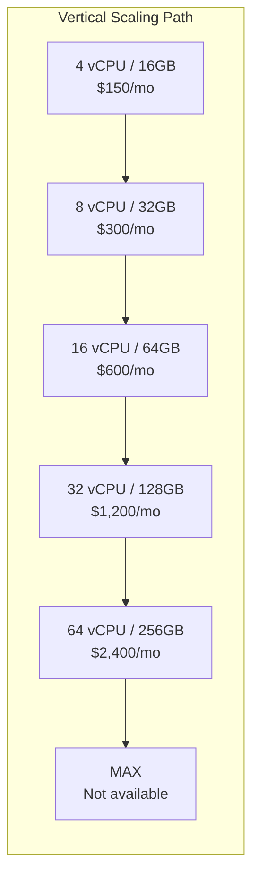
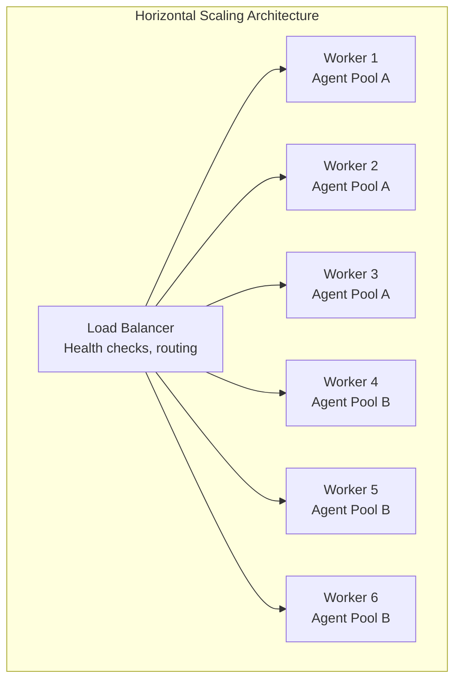
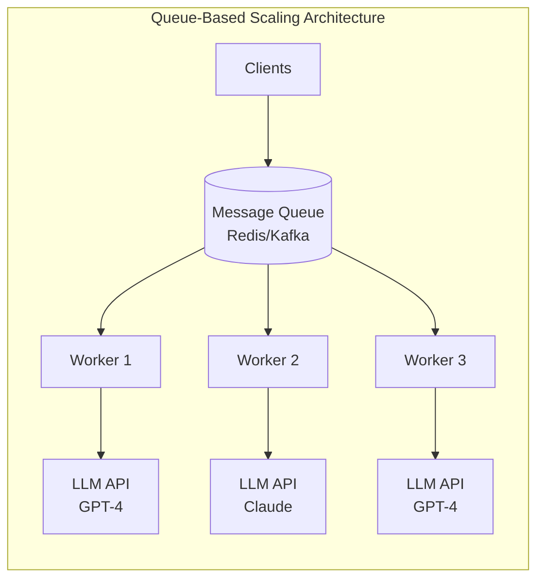
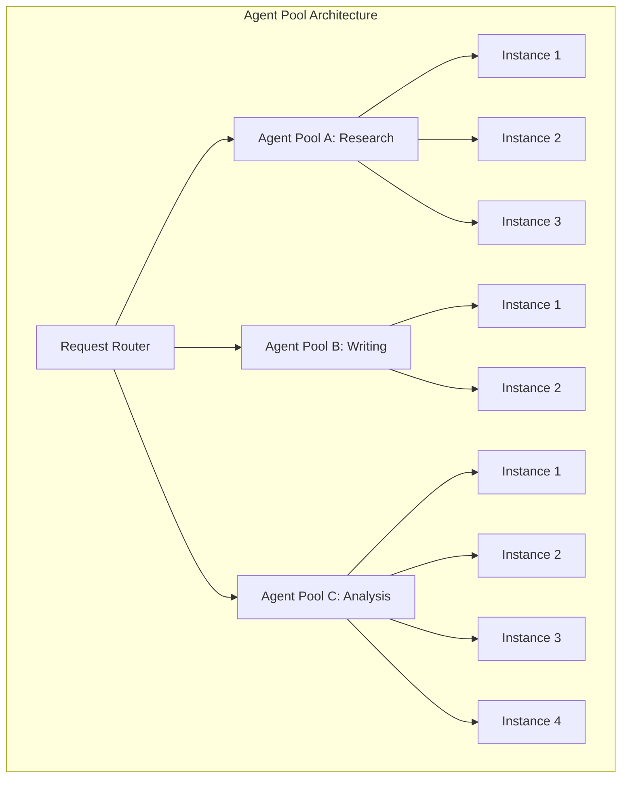
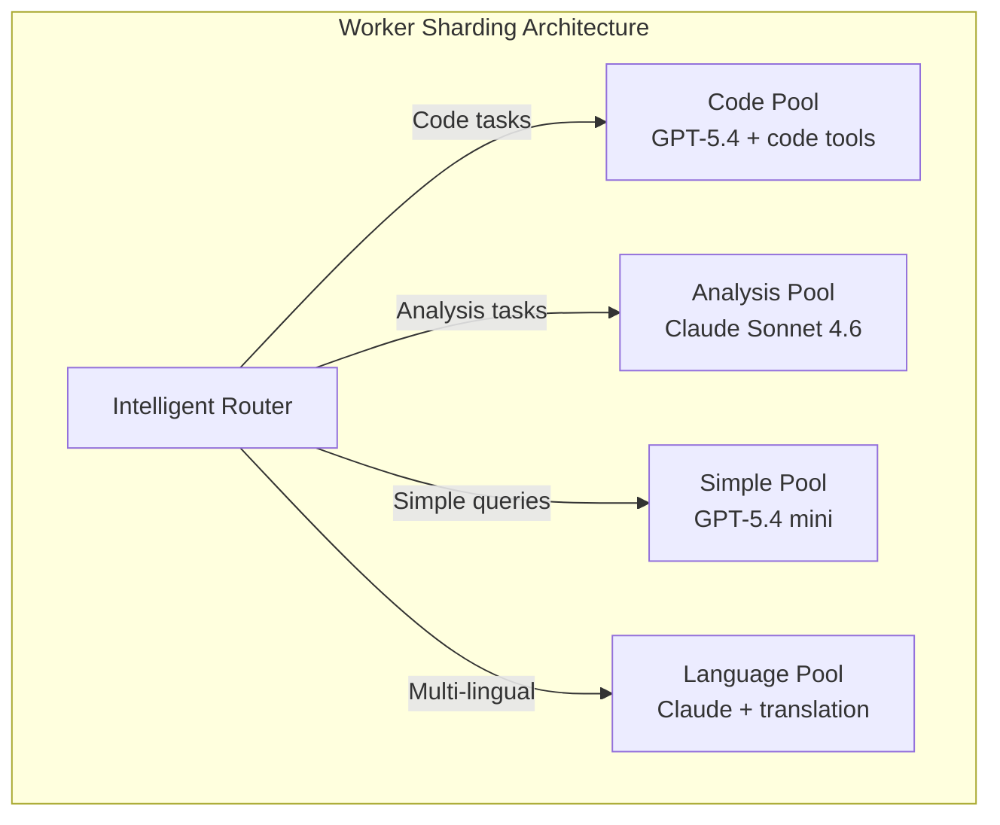
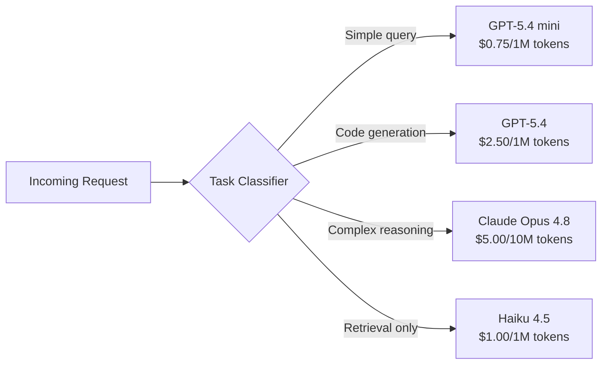
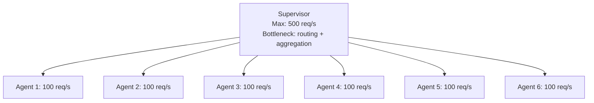
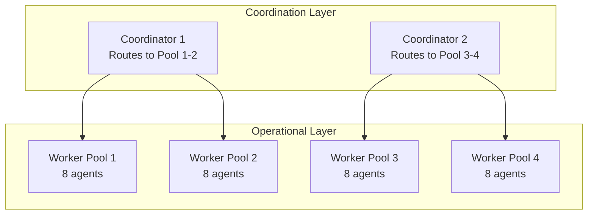
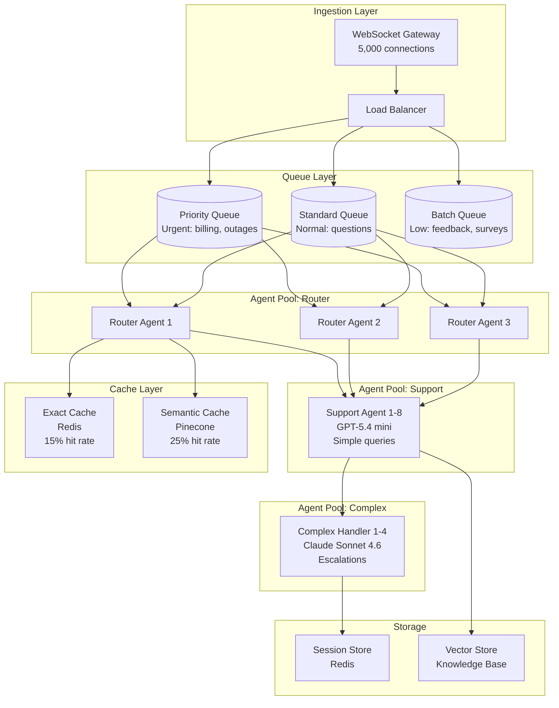

# Chapter 10: Scalability Engineering

## When Simple Architecture Meets Real Traffic

Most agent systems work beautifully at 10 requests per minute. They collapse at 10,000. The difference isn't code quality—it's scalability engineering: the deliberate design of systems that maintain performance as load increases.

This chapter covers the mechanical and economic realities of scaling multi-agent systems. Every formula, every trade-off table, every cost calculation comes from production deployments. We'll build from first principles—vertical scaling, horizontal scaling, queue-based architectures—then layer in the specific constraints of LLM-based agents: token costs, model latency, and the non-obvious limits of each topology.

By the end, you'll have a framework for answering the question every principal architect faces: "We need 10x throughput—should we add machines, add agents, or redesign?"

---

## 10.1 Scaling Strategies

### Vertical Scaling: Bigger Machines

Vertical scaling means upgrading the machine running your system—more CPU, more RAM, faster network. It's the simplest scaling strategy and often the first to hit limits. You change one configuration value, restart, and you're done. No code changes, no distributed systems complexity, no new failure modes.

The appeal is obvious. But vertical scaling has a hard ceiling—the largest available instance from your cloud provider—and a soft ceiling where cost-per-request starts climbing.



**Vertical scaling cost curve:**

| Instance Size | vCPU | RAM | Cost/mo | Throughput (req/s) | Cost per 1K Requests | Scaling Efficiency |
|---|---|---|---|---|---|---|
| Small | 4 | 16 GB | $150 | 50 | $0.120 | 1.00x |
| Medium | 8 | 32 GB | $300 | 95 | $0.126 | 0.95x |
| Large | 16 | 64 GB | $600 | 180 | $0.133 | 0.90x |
| X-Large | 32 | 128 GB | $1,200 | 320 | $0.150 | 0.80x |
| 2X-Large | 64 | 256 GB | $2,400 | 550 | $0.175 | 0.69x |
| 4X-Large | 128 | 512 GB | $4,800 | 900 | $0.222 | 0.56x |

Notice the pattern: throughput doesn't scale linearly with cost. Going from Small to 4X-Large costs 32x more but yields only 18x throughput. The scaling efficiency column shows this degrades from 1.00x (perfect linear) down to 0.56x. The cost-per-request *increases* as you scale up. This is the vertical scaling trap—diminishing returns at higher tiers.

The physical reasons are straightforward. At 64+ vCPU, memory bandwidth becomes the bottleneck. Cache coherence protocols consume more cycles. NUMA effects add latency for cross-socket communication. The operating system scheduler has more overhead managing more cores. These aren't software problems—they're physics.

**When vertical scaling works:**
- CPU-bound workloads (prompt parsing, response formatting, JSON serialization)
- Memory-bound workloads (large context windows, conversation history, vector indexes)
- Single-node simplicity preferred over distributed complexity
- Load is predictable and doesn't spike suddenly
- Team lacks distributed systems expertise
- Development velocity matters more than production efficiency

**When vertical scaling fails:**
- You need more throughput than the largest available instance provides
- Cost-per-request is unacceptable at higher tiers
- You need geographic distribution (multiple regions)
- Availability requirements demand redundancy (single machine = single point of failure)
- Load varies significantly (you pay for peak capacity during off-peak hours)

### Horizontal Scaling: More Machines

Horizontal scaling means adding more machines to distribute load. Unlike vertical scaling, horizontal scaling can maintain cost efficiency as you grow—but introduces coordination complexity. State management, request routing, failure handling, and data consistency all become harder problems.



**Horizontal scaling throughput model:**

```
Throughput = N × Throughput_per_Instance × Efficiency_Factor

Where:
  N = number of instances
  Throughput_per_Instance = measured throughput at single instance
  Efficiency_Factor = 1.0 / (1 + coordination_overhead × N)

  coordination_overhead depends on statefulness:
    Stateless agents: 0.01
    Stateful agents, no shared state: 0.02
    Stateful agents, shared memory: 0.03-0.05
    Agents with distributed locks: 0.05-0.10
```

For most agent systems, `coordination_overhead` ranges from 0.01 to 0.05. Stateless agents—where each request is independent and no state persists between calls—achieve near-linear scaling. Stateful agents that share memory or coordinate on distributed locks degrade faster.

**Horizontal scaling cost curve:**

| Instances | Cost/mo | Throughput (req/s) | Cost per 1K Requests | Efficiency Factor |
|---|---|---|---|---|
| 1 | $150 | 50 | $0.120 | 1.00 |
| 2 | $300 | 99 | $0.121 | 0.99 |
| 4 | $600 | 194 | $0.124 | 0.97 |
| 8 | $1,200 | 376 | $0.128 | 0.94 |
| 16 | $2,400 | 720 | $0.133 | 0.90 |
| 32 | $4,800 | 1,320 | $0.145 | 0.83 |
| 64 | $9,600 | 2,340 | $0.164 | 0.73 |

Cost-per-request stays relatively flat until coordination overhead becomes significant. For most agent systems, the sweet spot is 4-16 instances before you need to reconsider architecture. Beyond 32 instances, the efficiency loss from coordination starts to justify a redesign.

**Horizontal scaling decision framework:**

```
Can your workload be partitioned? → Worker sharding
Is each request independent? → Stateless horizontal scaling
Do requests share state? → Shared-nothing with eventual consistency
Do you need strong consistency? → Distributed consensus (Raft/Paxos)
Is load unpredictable? → Auto-scaling with queue-based architecture
```

### Queue-Based Scaling

Queue-based scaling decouples request ingestion from processing. Requests enter a queue; workers pull from the queue at their own pace. This provides natural backpressure and enables independent scaling of ingestion and processing.

The queue is the single most powerful scaling primitive in distributed systems. It absorbs traffic spikes, provides retry semantics, enables priority routing, and creates a clear boundary between "what arrives" and "what gets processed."



**Queue-based scaling benefits:**
- **Backpressure:** Queue depth signals when you need more workers. If queue depth grows, add workers. If it shrinks, remove them.
- **Retry logic:** Failed requests stay in queue for retry with exponential backoff. No request lost on transient failure.
- **Priority routing:** Urgent requests skip the line. Implement multiple queues with different priority levels.
- **Burst absorption:** Queue absorbs traffic spikes while workers catch up. A 10-second traffic spike doesn't crash your system—it just delays processing.
- **Independent scaling:** Scale workers without touching ingestion. Add workers during peak hours, remove during off-peak.

**Queue depth as a scaling signal:**

```python
import asyncio
from dataclasses import dataclass

@dataclass
class QueueMetrics:
    depth: int           # Current queue length
    processing_rate: int # Requests processed per second
    wait_time: float     # Average time in queue (seconds)
    target_latency: float  # Max acceptable wait time

class AutoScaler:
    def __init__(self, min_workers: int = 2, max_workers: int = 32):
        self.min_workers = min_workers
        self.max_workers = max_workers
        self.current_workers = min_workers
        self.scale_up_cooldown = 0  # seconds since last scale-up
        self.scale_down_cooldown = 0

    def calculate_desired_workers(self, metrics: QueueMetrics) -> int:
        if metrics.processing_rate == 0:
            return self.max_workers

        # Time to drain current queue at current rate
        drain_time = metrics.depth / metrics.processing_rate

        if drain_time > metrics.target_latency * 2:
            # Queue backing up—scale up aggressively
            desired = min(self.max_workers, self.current_workers * 2)
            self.scale_up_cooldown = 0
        elif drain_time > metrics.target_latency:
            # Queue growing—scale up moderately
            desired = min(self.max_workers, self.current_workers + 2)
            self.scale_up_cooldown = 0
        elif drain_time < metrics.target_latency * 0.3 and self.current_workers > self.min_workers:
            # Queue draining fast—scale down conservatively
            desired = max(self.min_workers, self.current_workers - 1)
        else:
            desired = self.current_workers

        self.current_workers = desired
        return desired
```

**Queue architecture patterns:**

| Pattern | Throughput | Latency | Complexity | Best For |
|---|---|---|---|---|
| Single queue, N workers | Medium | Medium | Low | Simple workloads |
| Priority queues | Medium | Low (for high priority) | Medium | Mixed urgency |
| Topic-based routing | High | Medium | Medium | Multi-type requests |
| Dead letter queue | Medium | Medium | Medium | Reliability-critical |
| Fan-out (multiple consumers) | Very High | Medium | High | Broadcast patterns |
| Delayed queue | Medium | Variable | Medium | Scheduled processing |

**Queue sizing guidelines:**

```
Queue_depth_target = arrival_rate × max_acceptable_latency

Example:
  arrival_rate = 100 req/s
  max_acceptable_latency = 5 seconds
  Queue_depth_target = 100 × 5 = 500 messages

If queue_depth exceeds target consistently → add workers
If queue_depth stays below 20% of target → remove workers
```

The queue is your buffer between supply (incoming requests) and demand (processing capacity). A well-sized queue absorbs transient spikes without requiring permanent over-provisioning. The key metric isn't queue depth alone—it's queue depth relative to processing rate. A queue with 1,000 messages and a processing rate of 100/s will drain in 10 seconds. The same queue with a processing rate of 10/s will take 100 seconds. Always monitor both depth and drain rate.

### Agent Pooling

Agent pooling means running multiple instances of the same agent type to handle concurrent requests. Each agent instance is independent—no shared state, no coordination. This is the horizontal scaling pattern applied specifically to agent systems.

The key insight: agent instances are interchangeable. A "research agent" instance is identical to every other "research agent" instance. This makes pooling simple and effective.



**Pool sizing formula (Little's Law application):**

```
Pool_Size = ceil(peak_concurrent_requests × avg_response_time / target_latency)

Where:
  peak_concurrent_requests = max simultaneous in-flight requests
  avg_response_time = mean time from request to response (seconds)
  target_latency = max acceptable time in queue before processing starts

Example:
  peak_concurrent = 100 requests
  avg_response_time = 3 seconds
  target_latency = 5 seconds (acceptable queue wait)

  Pool_Size = ceil(100 × 3 / 5) = 60 agents
```

This formula comes from Little's Law: L = λW, where L is the average number of items in a system, λ is the arrival rate, and W is the average time an item spends in the system. Rearranging gives us the pool size needed to maintain a target latency under a given load.

**Agent pool with load balancing:**

```python
import asyncio
import time
from dataclasses import dataclass, field
from typing import List, Optional

@dataclass
class AgentInstance:
    id: str
    current_load: int = 0
    total_requests: int = 0
    avg_response_time: float = 0.0
    last_request_time: float = 0.0
    error_count: int = 0

    @property
    def load_score(self) -> float:
        # Lower is better
        return self.current_load * self.avg_response_time

    @property
    def health_score(self) -> float:
        if self.total_requests == 0:
            return 1.0
        error_rate = self.error_count / self.total_requests
        return 1.0 - error_rate

class AgentPool:
    def __init__(self, agent_type: str, pool_size: int = 4):
        self.agent_type = agent_type
        self.instances: List[AgentInstance] = [
            AgentInstance(id=f"{agent_type}-{i}") for i in range(pool_size)
        ]
        self._round_robin_idx = 0

    def select_instance(self, strategy: str = "least_load") -> AgentInstance:
        healthy = [i for i in self.instances if i.health_score > 0.5]
        if not healthy:
            healthy = self.instances  # Fallback to all if none healthy

        if strategy == "round_robin":
            self._round_robin_idx = (self._round_robin_idx + 1) % len(healthy)
            return healthy[self._round_robin_idx]
        elif strategy == "least_load":
            return min(healthy, key=lambda i: i.load_score)
        elif strategy == "least_response_time":
            return min(healthy, key=lambda i: i.avg_response_time)
        elif strategy == "weighted_random":
            total_weight = sum(i.health_score for i in healthy)
            import random
            r = random.uniform(0, total_weight)
            cumulative = 0
            for inst in healthy:
                cumulative += inst.health_score
                if r <= cumulative:
                    return inst
            return healthy[-1]
        else:
            raise ValueError(f"Unknown strategy: {strategy}")

    async def execute(self, request: dict, strategy: str = "least_load") -> dict:
        instance = self.select_instance(strategy)
        instance.current_load += 1
        start = time.monotonic()
        try:
            result = await self._call_agent(instance, request)
            elapsed = time.monotonic() - start
            # Exponential moving average of response time
            instance.avg_response_time = 0.9 * instance.avg_response_time + 0.1 * elapsed
            instance.total_requests += 1
            instance.last_request_time = time.time()
            return result
        except Exception as e:
            instance.error_count += 1
            raise
        finally:
            instance.current_load -= 1

    async def _call_agent(self, instance: AgentInstance, request: dict) -> dict:
        # Actual LLM call would happen here
        await asyncio.sleep(0.1)  # Simulated
        return {"agent": instance.id, "result": "processed"}
```

### Worker Sharding

Worker sharding partitions work by type, routing different categories of requests to specialized worker pools. Unlike agent pooling (where all instances handle the same type), sharding creates purpose-built pools for different workloads.



**Sharding key design:**

```python
from dataclasses import dataclass
from enum import Enum
from typing import Dict

class ShardType(Enum):
    CODE = "code"
    ANALYSIS = "analysis"
    SIMPLE = "simple"
    LANGUAGE = "language"

@dataclass
class ShardConfig:
    shard_type: ShardType
    pool_size: int
    model: str
    max_tokens: int
    cost_per_1k_tokens: float

class ShardRouter:
    def __init__(self):
        self.shards: Dict[ShardType, AgentPool] = {}
        self.configs: Dict[ShardType, ShardConfig] = {}

    def register_shard(self, config: ShardConfig):
        self.configs[config.shard_type] = config
        self.shards[config.shard_type] = AgentPool(
            agent_type=config.shard_type.value,
            pool_size=config.pool_size
        )

    def classify_request(self, request: dict) -> ShardType:
        content = request.get("content", "").lower()
        
        code_keywords = ["function", "class", "debug", "code", "implement", "refactor"]
        if any(kw in content for kw in code_keywords):
            return ShardType.CODE
        
        analysis_keywords = ["analyze", "compare", "evaluate", "research", "investigate"]
        if any(kw in content for kw in analysis_keywords):
            return ShardType.ANALYSIS
        
        language_keywords = ["translate", "french", "spanish", "german", "chinese"]
        if any(kw in content for kw in language_keywords):
            return ShardType.LANGUAGE
        
        return ShardType.SIMPLE

    async def route(self, request: dict) -> dict:
        shard_type = self.classify_request(request)
        pool = self.shards[shard_type]
        return await pool.execute(request, strategy="least_load")

# Usage
router = ShardRouter()
router.register_shard(ShardConfig(ShardType.CODE, 8, "gpt-5.4", 4096, 0.010))
router.register_shard(ShardConfig(ShardType.ANALYSIS, 4, "claude-sonnet-4-6", 8192, 0.012))
router.register_shard(ShardConfig(ShardType.SIMPLE, 12, "gpt-5.4-mini", 1024, 0.0006))
router.register_shard(ShardConfig(ShardType.LANGUAGE, 4, "claude-sonnet-4-6", 4096, 0.012))
```

**Sharding trade-offs:**

| Aspect | Agent Pool (Homogeneous) | Worker Sharding (Heterogeneous) |
|---|---|---|
| Routing complexity | Low | Medium |
| Resource utilization | Even | Varies by shard |
| Cost optimization | Low | High (right model per task) |
| Failure isolation | None | Per-shard |
| Scaling granularity | All-or-nothing | Per-shard |
| Code complexity | Simple | Moderate |

### Load Balancing Strategies

Different strategies optimize for different objectives. The choice depends on your workload characteristics, agent capabilities, and performance requirements.

| Strategy | Best For | Overhead | Fairness | Implementation |
|---|---|---|---|---|
| Round Robin | Uniform requests, similar agents | O(1) | Perfect | Trivial |
| Least Connections | Variable request durations | O(n) | High | Simple |
| Consistent Hash | Stateful agents, session affinity | O(log n) | Moderate | Moderate |
| Weighted Round Robin | Heterogeneous agents | O(1) | Proportional | Simple |
| Least Response Time | Latency-sensitive workloads | O(n) | High | Moderate |
| Random | No preference, simple | O(1) | Statistical | Trivial |

**Consistent hashing for stateful agents:**

```python
import hashlib
from bisect import bisect_right

class ConsistentHash:
    def __init__(self, nodes: list[str], virtual_nodes: int = 150):
        self.ring: dict[int, str] = {}
        self.sorted_keys: list[int] = []
        self.virtual_nodes = virtual_nodes
        for node in nodes:
            self.add_node(node)

    def _hash(self, key: str) -> int:
        return int(hashlib.md5(key.encode()).hexdigest(), 16)

    def add_node(self, node: str):
        for i in range(self.virtual_nodes):
            key = self._hash(f"{node}:{i}")
            self.ring[key] = node
            self.sorted_keys.append(key)
        self.sorted_keys.sort()

    def remove_node(self, node: str):
        for i in range(self.virtual_nodes):
            key = self._hash(f"{node}:{i}")
            self.ring.pop(key, None)
            self.sorted_keys.remove(key)

    def get_node(self, item: str) -> str:
        if not self.ring:
            raise ValueError("Empty ring")
        key = self._hash(item)
        idx = bisect_right(self.sorted_keys, key) % len(self.sorted_keys)
        return self.ring[self.sorted_keys[idx]]

# Session affinity: same user always hits same agent
hash_ring = ConsistentHash(["agent-1", "agent-2", "agent-3"])
user_agent = hash_ring.get_node("user-12345")  # Always "agent-2" for this user
```

**Load balancing strategy selection guide:**

```
Start here:
  Are all agents identical? 
    Yes → Round Robin (simplest)
    No  → Do agents have different capacities?
            Yes → Weighted Round Robin
            No  → Are request durations variable?
                    Yes → Least Connections
                    No  → Round Robin

Special cases:
  Need session affinity? → Consistent Hash
  Need lowest latency?  → Least Response Time
  Don't care?           → Random (surprisingly effective)
```

---

## 10.2 Token Cost Optimization

LLM token costs dominate scaling economics. A system handling 1M requests/day with an average of 2K tokens per request on GPT-4-class models faces ~$8,000/day in token costs. At that scale, a 10% optimization saves $24,000/month. Optimization isn't optional—it's survival.

The cost equation is straightforward:

```
Token_cost = requests × tokens_per_request × cost_per_token × (1 - optimization_factor)
```

But the optimization_factor is where the real work happens. It's a composite of routing, caching, batching, and prompt engineering. Each contributes differently depending on your workload.

### Model Routing

Route different task types to appropriately priced models. This is the highest-impact, lowest-effort optimization available. Most requests don't need GPT-5.4. A classification task that takes 200 tokens costs $0.00015 on GPT-5.4 nano versus $0.0005 on GPT-5.4—a 3x difference for identical output quality on simple tasks.



**Model routing cost comparison:**

| Model | Cost per 1K tokens | Quality (1-10) | Latency (p50) | Latency (p99) | Best For |
|---|---|---|---|---|---|
| GPT-5.4 nano | $0.0002 | 5 | 100ms | 300ms | Ultra-high-volume, simple tasks |
| GPT-5.4 mini | $0.00075 | 7 | 150ms | 400ms | Simple classification, formatting |
| GPT-5.4 | $0.0025 | 9 | 400ms | 1200ms | General tasks, code generation |
| Claude Sonnet 4.6 | $0.003 | 9 | 350ms | 900ms | Analysis, writing, code |
| Claude Opus 4.8 | $0.005 | 10 | 900ms | 3000ms | Complex reasoning, multi-step |
| Gemini 3.5 Flash | $0.00015 | 6 | 120ms | 350ms | High-volume, acceptable quality |
| Llama 4 Scout (self-hosted) | $0.0004 | 7 | 200ms | 600ms | High-volume, self-hosted |
| Llama 4 Maverick (self-hosted) | $0.0001 | 5 | 80ms | 200ms | Ultra-high-volume, simple tasks |

**Routing savings example:**

```
Without routing (all GPT-5.4):
  1M requests × 2K tokens × $0.0025/1K = $5,000/day

With routing (70% mini, 20% sonnet, 10% opus):
  700K × 2K × $0.00075/1K = $1,050
  200K × 2K × $0.003/1K = $1,200
  100K × 2K × $0.005/1K = $1,000
  Total: $3,250/day (35% savings)

With routing + caching (30% cache hit rate):
  700K × 0.7 × 2K × $0.00015/1K = $147
  200K × 0.7 × 2K × $0.003/1K = $840
  100K × 0.7 × 2K × $0.015/1K = $2,100
  Cached: 300K × 2K × $0.00001/1K = $6
  Total: $3,093/day (38% savings)

With routing + caching + prompt optimization:
  Token count reduced 25%: 2K → 1.5K average
  Total: $2,320/day (54% savings)
```

### Intelligent Caching

Cache exact query matches. Simple but effective for repeated queries. The implementation is straightforward—a hash of the query maps to the cached response. The challenge is invalidation: when does a cached response become stale?

**Cache strategy comparison:**

| Strategy | Hit Rate | Implementation | Staleness Risk | Memory Usage |
|---|---|---|---|---|
| Exact match | 5-15% | Trivial | Low | Low |
| Normalized match | 10-20% | Low | Low | Low |
| Semantic match | 20-40% | Medium | Medium | High |
| Intent-based match | 15-30% | Medium | Medium | Medium |
| Template match | 25-45% | High | High | Medium |

**Exact cache implementation:**

```python
import hashlib
import json
import time
from dataclasses import dataclass
from typing import Optional

@dataclass
class CacheEntry:
    response: str
    model_used: str
    token_count: int
    timestamp: float
    hit_count: int = 0

class ExactCache:
    def __init__(self, ttl_seconds: int = 3600, max_entries: int = 10000):
        self.entries: dict[str, CacheEntry] = {}
        self.ttl = ttl_seconds
        self.max_entries = max_entries
        self.total_queries = 0
        self.cache_hits = 0

    def _make_key(self, query: str, model: str) -> str:
        content = json.dumps({"q": query, "m": model}, sort_keys=True)
        return hashlib.sha256(content.encode()).hexdigest()

    def get(self, query: str, model: str) -> Optional[dict]:
        self.total_queries += 1
        key = self._make_key(query, model)
        entry = self.entries.get(key)

        if entry and (time.time() - entry.timestamp) < self.ttl:
            self.cache_hits += 1
            entry.hit_count += 1
            return {
                "response": entry.response,
                "model_used": entry.model_used,
                "tokens_saved": entry.token_count,
                "cache_hit": True,
            }
        elif entry:
            del self.entries[key]  # Expired
        return None

    def set(self, query: str, model: str, response: str, token_count: int):
        key = self._make_key(query, model)
        if len(self.entries) >= self.max_entries:
            # Evict oldest
            oldest_key = min(self.entries, key=lambda k: self.entries[k].timestamp)
            del self.entries[oldest_key]
        self.entries[key] = CacheEntry(
            response=response,
            model_used=model,
            token_count=token_count,
            timestamp=time.time(),
        )
```

### Semantic Caching

Cache queries that are semantically similar, not just identical. Uses embeddings to find near-matches. "What is the capital of France?" and "Capital city of France?" would both hit the same cache entry.

The key challenge: similarity threshold tuning. Too low (0.80) and you return wrong answers. Too high (0.99) and you get no cache hits. The sweet spot depends on your domain—general knowledge queries tolerate lower thresholds (0.92-0.95), while domain-specific queries need higher thresholds (0.96-0.98).

**Semantic cache implementation:**

```python
import numpy as np
from dataclasses import dataclass, field
from typing import Optional
import time

@dataclass
class CacheEntry:
    query_embedding: np.ndarray
    query_text: str
    response: str
    model_used: str
    token_count: int
    timestamp: float
    hit_count: int = 0

class SemanticCache:
    def __init__(self, similarity_threshold: float = 0.95, ttl_seconds: int = 3600,
                 max_entries: int = 50000):
        self.entries: list[CacheEntry] = []
        self.threshold = similarity_threshold
        self.ttl = ttl_seconds
        self.max_entries = max_entries
        self.total_queries = 0
        self.cache_hits = 0

    def _cosine_similarity(self, a: np.ndarray, b: np.ndarray) -> float:
        norm_a = np.linalg.norm(a)
        norm_b = np.linalg.norm(b)
        if norm_a == 0 or norm_b == 0:
            return 0.0
        return float(np.dot(a, b) / (norm_a * norm_b))

    def get(self, query_embedding: np.ndarray) -> Optional[dict]:
        self.total_queries += 1
        now = time.time()

        best_match = None
        best_score = 0.0

        for entry in self.entries:
            if now - entry.timestamp > self.ttl:
                continue
            score = self._cosine_similarity(query_embedding, entry.query_embedding)
            if score > best_score and score >= self.threshold:
                best_score = score
                best_match = entry

        if best_match:
            self.cache_hits += 1
            best_match.hit_count += 1
            return {
                "response": best_match.response,
                "model_used": best_match.model_used,
                "tokens_saved": best_match.token_count,
                "similarity": best_score,
                "original_query": best_match.query_text,
            }
        return None

    def set(self, query_embedding: np.ndarray, query_text: str,
            response: str, model_used: str, token_count: int):
        if len(self.entries) >= self.max_entries:
            # Remove oldest entries with lowest hit counts
            self.entries.sort(key=lambda e: (e.hit_count, e.timestamp))
            self.entries = self.entries[len(self.entries) // 4:]  # Remove bottom 25%

        self.entries.append(CacheEntry(
            query_embedding=query_embedding,
            query_text=query_text,
            response=response,
            model_used=model_used,
            token_count=token_count,
            timestamp=time.time(),
        ))

    @property
    def hit_rate(self) -> float:
        return self.cache_hits / self.total_queries if self.total_queries > 0 else 0.0

    @property
    def avg_similarity(self) -> float:
        hits = [e for e in self.entries if e.hit_count > 0]
        if not hits:
            return 0.0
        return sum(e.hit_count for e in hits) / len(hits)
```

**Cost formula with caching:**

```
Cost_with_cache = Cost_base × (1 - hit_rate) + (hit_rate × Cost_per_lookup)

Where:
  Cost_base = tokens_per_request × requests × cost_per_token
  Cost_per_lookup = embedding_cost + vector_db_cost ≈ $0.00001

Example (1M requests/day, GPT-5.4, 30% hit rate):
  Cost_base = 2K × 1M × $0.0025/1K = $5,000/day
  Cost_with_cache = $5,000 × 0.70 + $10 = $3,510/day (30% savings)
```

**Semantic cache hit rate vs cost savings:**

| Hit Rate | Daily Savings | Monthly Savings | Implementation Effort |
|---|---|---|---|
| 10% | $500 | $15,000 | Low |
| 20% | $1,000 | $30,000 | Medium |
| 30% | $1,500 | $45,000 | Medium |
| 40% | $2,000 | $60,000 | High |
| 50% | $2,500 | $75,000 | Very High |

Diminishing returns are clear. The jump from 10% to 20% hit rate doubles savings. The jump from 40% to 50% adds only 25% more savings. Focus on getting to 20-30% hit rate; beyond that, the engineering effort rarely justifies the marginal savings.

### Batch Processing

For non-urgent tasks, batch processing reduces cost by 50% with most LLM providers. The trade-off is latency: batch requests take minutes to hours instead of seconds.

**Batch processing decision framework:**

```
Is the response needed in real-time?
  Yes → Cannot batch
  No  → Is the task time-sensitive (within 1 hour)?
          Yes → Batch with 1-hour SLA (0.5x cost)
          No  → Is the task time-sensitive (within 24 hours)?
                  Yes → Batch with 24-hour SLA (0.3x cost)
                  No  → Batch with best-effort (0.1x cost)
```

| Processing Mode | Cost Multiplier | Latency | Throughput | Use Case |
|---|---|---|---|---|
| Real-time | 1.0x | <1s | Limited by model | User-facing chat, live search |
| Batch (1-hour SLA) | 0.5x | Minutes | 10x higher | Report generation, data enrichment |
| Batch (24-hour SLA) | 0.3x | Hours | 50x higher | Analytics, training data prep |
| Batch (best-effort) | 0.1x | Days | 100x higher | Backfill, archival processing |

---

## 10.3 Per-Topology Scalability Limits

Each topology has a maximum throughput ceiling determined by its coordination structure. Understanding these ceilings prevents you from scaling a topology that has already hit its limit.

### Hierarchical Topology

In hierarchical systems, the supervisor is the bottleneck. Every request passes through it for routing, coordination, and result aggregation. The supervisor's processing capacity is the hard ceiling for the entire system.



**Supervisor bottleneck formula:**

```
Max_throughput = min(
    supervisor_processing_capacity,
    sum(agent_throughputs) × utilization_factor,
    network_bandwidth / avg_message_size
)

Utilization_factor decreases with agent count:
  2 agents:  0.98
  4 agents:  0.95
  8 agents:  0.88
  16 agents: 0.75
  32 agents: 0.60
  64 agents: 0.40
```

The utilization factor captures a real phenomenon: as you add agents, the supervisor spends more time on coordination (routing, result aggregation, state synchronization) and less time on productive work. With 32 agents, the supervisor is spending 40% of its capacity on coordination overhead.

**Hierarchical scaling limits:**

| Supervisor Capacity | Agent Count | System Throughput | Bottleneck | Recommendation |
|---|---|---|---|---|
| 500 req/s | 2 | 490 req/s | Supervisor | OK as-is |
| 500 req/s | 8 | 440 req/s | Supervisor | Consider bypass |
| 500 req/s | 32 | 300 req/s | Supervisor | Redesign needed |
| 1000 req/s | 2 | 980 req/s | Supervisor | OK as-is |
| 1000 req/s | 8 | 880 req/s | Supervisor | Consider bypass |
| 1000 req/s | 32 | 600 req/s | Supervisor | Redesign needed |
| 2000 req/s | 2 | 1,960 req/s | Supervisor | OK as-is |
| 2000 req/s | 8 | 1,760 req/s | Supervisor | Consider bypass |

The supervisor bottleneck is the hard ceiling for hierarchical systems. No amount of agent scaling helps once the supervisor saturates. You must either upgrade the supervisor (vertical scaling), add supervisor instances (horizontal scaling with request partitioning), or redesign the topology.

**Supervisor bypass for high throughput:**

```python
from dataclasses import dataclass
from typing import Optional
import asyncio

@dataclass
class Request:
    id: str
    payload: dict
    requires_coordination: bool
    complexity_score: float  # 0.0 = trivial, 1.0 = complex

class SupervisorBypass:
    """Route simple requests directly, complex ones through supervisor."""

    def __init__(self, supervisor, agent_pool, coordinator):
        self.supervisor = supervisor
        self.agent_pool = agent_pool
        self.coordinator = coordinator
        self.bypass_threshold = 0.3  # Requests below this skip supervisor

    async def handle_request(self, request: Request) -> dict:
        if self._needs_coordination(request):
            return await self.supervisor.process(request)
        else:
            agent = self.agent_pool.select_instance("least_load")
            return await agent.execute(request.payload)

    def _needs_coordination(self, request: Request) -> bool:
        if request.requires_coordination:
            return True
        if request.complexity_score > self.bypass_threshold:
            return True
        complexity = len(request.payload.get("subtasks", []))
        return complexity > 1
```

### P2P Topology

P2P systems have no central bottleneck, but coordination overhead grows with the square of agent count. Every agent must communicate with every other agent for coordination, leading to O(n²) message complexity.

**P2P coordination overhead:**

```
Communication_cost = O(n²) for full mesh
  2 agents:  1 connection
  4 agents:  6 connections
  8 agents:  28 connections
  16 agents: 120 connections
  32 agents: 496 connections
  64 agents: 2,016 connections

Effective_throughput = Raw_throughput × (1 / (1 + overhead_factor × n²))

Example with overhead_factor = 0.001:
  8 agents:  1 / (1 + 0.001 × 64) = 0.94  → 94% effective
  16 agents: 1 / (1 + 0.001 × 256) = 0.80 → 80% effective
  32 agents: 1 / (1 + 0.001 × 1024) = 0.50 → 50% effective
```

**P2P scaling limits:**

| Agent Count | Connections | Coordination Overhead | Effective Throughput | Verdict |
|---|---|---|---|---|
| 2 | 1 | 0.5% | 99.5% | Excellent |
| 4 | 6 | 3% | 97% | Good |
| 8 | 28 | 12% | 88% | Acceptable |
| 16 | 120 | 35% | 65% | Degraded |
| 32 | 496 | 70% | 30% | Unusable |
| 64 | 2,016 | 94% | 6% | Broken |

P2P topologies scale well to 8-16 agents. Beyond that, coordination overhead dominates. The crossover point—where coordination overhead exceeds productive work—happens around 16-20 agents for typical agent systems.

**P2P vs Hierarchical cost comparison at scale:**

| Agent Count | Hierarchical Cost | P2P Cost | Winner |
|---|---|---|---|
| 4 | $600/mo | $600/mo | Tie |
| 8 | $1,200/mo | $1,200/mo | Tie |
| 16 | $2,400/mo | $2,400/mo | Tie (but P2P is 65% efficient) |
| 32 | $4,800/mo | $4,800/mo | Hierarchical (30% efficient P2P) |
| 64 | $9,600/mo | $9,600/mo | Hierarchical (6% efficient P2P) |

At small scale, the cost is identical. At large scale, P2P's efficiency loss means you need more agents to achieve the same throughput, increasing cost. The practical crossover happens around 16 agents—below that, either topology works; above that, hierarchical or hybrid is better.

**Mitigation: Event bus for P2P scaling:**

```python
from dataclasses import dataclass
from typing import Callable, Dict, List
import asyncio

@dataclass
class Event:
    topic: str
    payload: dict
    source: str
    timestamp: float

class EventBus:
    """Replace O(n²) mesh with O(n) pub/sub."""

    def __init__(self):
        self.subscribers: Dict[str, List[Callable]] = {}

    def subscribe(self, topic: str, handler: Callable):
        self.subscribers.setdefault(topic, []).append(handler)

    async def publish(self, event: Event):
        handlers = self.subscribers.get(event.topic, [])
        await asyncio.gather(*[h(event) for h in handlers])

class PeerAgent:
    def __init__(self, agent_id: str, event_bus: EventBus):
        self.id = agent_id
        self.bus = event_bus
        self.bus.subscribe(f"task.{self.id}", self._handle_task)
        self.bus.subscribe("broadcast", self._handle_broadcast)

    async def request_help(self, target_id: str, task: dict):
        await self.bus.publish(Event(
            topic=f"task.{target_id}",
            payload={"from": self.id, "task": task},
            source=self.id,
            timestamp=0.0,
        ))

    async def _handle_task(self, event: Event):
        result = await self._process(event.payload["task"])
        await self.bus.publish(Event(
            topic=f"result.{event.source}",
            payload={"result": result},
            source=self.id,
            timestamp=0.0,
        ))

    async def _handle_broadcast(self, event: Event):
        if event.source != self.id:
            await self._process(event.payload)
```

The event bus reduces communication from O(n²) to O(n) by using publish/subscribe. Each agent publishes to topics; other agents subscribe to topics they care about. No direct agent-to-agent connections needed.

### Hybrid Topology

Hybrid topologies scale the operational layer independently from the coordination layer. The coordination layer (supervisors/coordinators) handles routing and orchestration. The operational layer (worker agents) handles execution. Each layer scales independently.



**Hybrid scaling formula:**

```
System_throughput = min(
    coordination_layer_throughput,
    sum(operational_layer_throughputs)
)

Where:
  coordination_layer_throughput = num_coordinators × coordinator_capacity
  operational_layer_throughputs = sum(pool_i_size × agent_throughput_i)

Example:
  2 coordinators × 500 req/s = 1,000 req/s coordination capacity
  4 pools × 8 agents × 50 req/s = 1,600 req/s operational capacity
  System throughput = min(1,000, 1,600) = 1,000 req/s
  Bottleneck: coordination layer
```

**Hybrid scaling decision table:**

| Coordination Capacity | Operational Capacity | Bottleneck | Scaling Action |
|---|---|---|---|
| Low | Low | Both | Scale both layers |
| Low | High | Coordination | Add coordinators |
| High | Low | Operations | Add worker agents |
| High | High | Neither | System is balanced |

### Topology Comparison Table

| Topology | Max Practical Throughput | Scaling Complexity | Cost Efficiency | Best Scale | Failure Mode |
|---|---|---|---|---|---|
| Hierarchical | ~500 req/s | Low | High | 1-50 agents | Supervisor failure = total outage |
| P2P | ~2,000 req/s | High | Moderate | 2-16 agents | Graceful degradation |
| Hybrid | ~10,000 req/s | Moderate | High | 50-500 agents | Partial outage |
| Queue-based | ~50,000 req/s | Moderate | Very High | 100-10,000 agents | Graceful degradation |

---

## 10.4 Scaling Calculations

### Capacity Planning

**Fundamental formula:**

```
Required_capacity = Peak_load × (1 + safety_margin)

Where:
  safety_margin depends on load variability:
    Predictable load (batch processing):     safety_margin = 0.20
    Variable load (business hours pattern):  safety_margin = 0.35
    Spiky load (viral events, incidents):    safety_margin = 0.50
    Unknown load (new product):              safety_margin = 0.75
```

The safety margin is your insurance against unexpected load. Too low and you'll have outages during traffic spikes. Too high and you're paying for idle capacity. Measure your load variability (coefficient of variation) to choose the right margin.

**Agent count calculation:**

```
Required_agents = Required_capacity / (Agent_throughput × Availability_factor)

Where:
  Agent_throughput = measured requests per second per agent
  Availability_factor = 0.95 (accounts for restarts, failures, maintenance)
  
  Availability_factor breakdown:
    0.99 = 99% uptime (minimal restarts, no maintenance windows)
    0.95 = 95% uptime (regular deploys, some failures)
    0.90 = 90% uptime (frequent deploys, known issues)
    0.85 = 85% uptime (experimental, unstable)

Example:
  Peak_load = 1,000 req/s
  safety_margin = 0.35
  Required_capacity = 1,000 × 1.35 = 1,350 req/s
  
  Agent_throughput = 50 req/s per agent
  Availability_factor = 0.95
  
  Required_agents = 1,350 / (50 × 0.95) = 28.4 → 29 agents
```

### Headroom Calculation

```python
from dataclasses import dataclass
import math

@dataclass
class CapacityPlan:
    peak_load: float          # requests per second
    safety_margin: float      # 0.2 = 20%, 0.5 = 50%
    agent_throughput: float   # req/s per agent
    availability_factor: float  # typically 0.95
    cost_per_agent: float     # monthly cost per agent instance

    @property
    def required_capacity(self) -> float:
        return self.peak_load * (1 + self.safety_margin)

    @property
    def required_agents(self) -> int:
        return math.ceil(
            self.required_capacity / (self.agent_throughput * self.availability_factor)
        )

    @property
    def total_monthly_cost(self) -> float:
        return self.required_agents * self.cost_per_agent

    @property
    def cost_per_request(self) -> float:
        monthly_requests = self.peak_load * 86400 * 30
        return self.total_monthly_cost / monthly_requests

    @property
    def utilization_at_average_load(self) -> float:
        average_load = self.peak_load * 0.6  # Average is ~60% of peak
        agents_needed = average_load / (self.agent_throughput * self.availability_factor)
        return agents_needed / self.required_agents

    def breakpoint_analysis(self, upgrade_cost: float, new_throughput: float) -> str:
        current_cost = self.total_monthly_cost
        new_plan = CapacityPlan(
            self.peak_load, self.safety_margin, new_throughput,
            self.availability_factor, self.cost_per_agent
        )
        new_cost = new_plan.total_monthly_cost + upgrade_cost / 12

        if new_cost < current_cost:
            monthly_savings = current_cost - new_cost
            break_even_months = upgrade_cost / monthly_savings
            return (f"Upgrade saves ${monthly_savings:.0f}/mo. "
                    f"Break even in {break_even_months:.1f} months.")
        else:
            extra_cost = new_cost - current_cost
            return (f"Adding agents costs ${extra_cost:.0f}/mo more. "
                    f"Add agents instead.")

# Example capacity plan
plan = CapacityPlan(
    peak_load=500,          # 500 req/s peak
    safety_margin=0.35,     # 35% headroom
    agent_throughput=50,    # 50 req/s per agent
    availability_factor=0.95,
    cost_per_agent=150,     # $150/mo per agent instance
)

print(f"Required capacity: {plan.required_capacity:.0f} req/s")
print(f"Required agents: {plan.required_agents}")
print(f"Monthly cost: ${plan.total_monthly_cost:,.0f}")
print(f"Cost per request: ${plan.cost_per_request:.6f}")
print(f"Utilization at avg load: {plan.utilization_at_average_load:.0%}")
print(plan.breakpoint_analysis(upgrade_cost=10_000, new_throughput=75))
```

### Cost at Scale

```
Total_cost = Infrastructure_cost + Token_cost + Operational_cost

Infrastructure_cost = Σ(instance_type_i × count_i × hourly_rate_i × hours)
Token_cost = Σ(requests_j × tokens_per_request_j × model_cost_j)
Operational_cost = monitoring + logging + alerting + on_call + runbooks
```

**Cost comparison at 10K req/s:**

| Component | On-Prem | AWS/GCP | Serverless | Notes |
|---|---|---|---|---|
| Compute | $15,000/mo | $25,000/mo | $8,000/mo | Serverless scales to zero |
| LLM Tokens | $50,000/mo | $50,000/mo | $50,000/mo | Same across platforms |
| Networking | $2,000/mo | $5,000/mo | $1,000/mo | Egress costs vary |
| Storage | $1,000/mo | $2,000/mo | $500/mo | Object storage is cheap |
| Monitoring | $3,000/mo | $3,000/mo | $2,000/mo | Fixed cost |
| Operations | $5,000/mo | $2,000/mo | $1,000/mo | On-prem needs more staff |
| **Total** | **$76,000/mo** | **$87,000/mo** | **$62,500/mo** | |

Serverless wins on variable loads; on-prem wins on constant high loads; cloud wins on flexibility. The "right" choice depends on your load pattern and team capabilities.

**Breakpoint analysis: when to add machines vs upgrade:**

```
Breakpoint: when is upgrading cheaper than adding?

Let:
  Current_cost = N × Instance_cost
  New_cost = (N / scaling_factor) × New_instance_cost
  
  Breakpoint when: New_cost < Current_cost

Example:
  Current: 8 × $300/mo = $2,400/mo (8 medium instances)
  Upgrade: 4 × $600/mo = $2,400/mo (4 large instances)
  → Break-even. But large instances have better cost-per-request.
  
  Upgrade: 2 × $1,200/mo = $2,400/mo (2 x-large instances)
  → Same cost but single point of failure risk.
  
  Upgrade: 1 × $2,400/mo = $2,400/mo (1 2x-large instance)
  → Same cost but now you have an SPOF.
```

---

## 10.5 Enterprise Constraints Decision Table

Enterprise requirements constrain your scaling options. This table maps constraints to recommended strategies. Use it as a starting point, then adjust for your specific context.

| Throughput Requirement | Latency Constraint | Budget | Recommended Architecture | Risk Level |
|---|---|---|---|---|
| <100 req/s | <500ms p99 | <$5K/mo | Vertical scaling, single agent pool | Low |
| 100-1,000 req/s | <500ms p99 | $5-20K/mo | Horizontal scaling, 4-8 instances, basic caching | Low |
| 100-1,000 req/s | <100ms p99 | $10-30K/mo | Hybrid topology, semantic caching, model routing | Medium |
| 1,000-10,000 req/s | <500ms p99 | $20-100K/mo | Queue-based, agent pools, batch processing | Medium |
| 1,000-10,000 req/s | <100ms p99 | $50-200K/mo | Distributed hybrid, edge caching, model routing | High |
| >10,000 req/s | <500ms p99 | $100K+/mo | Custom infrastructure, self-hosted models, sharding | High |
| >10,000 req/s | <100ms p99 | $200K+/mo | Multi-region, dedicated model instances, full optimization | Very High |

**Constraint interaction rules:**

1. **High throughput + low latency + low budget** → Impossible without trade-offs. Increase budget, relax latency, or reduce throughput target. There is no free lunch.

2. **High throughput + low latency + high budget** → Queue-based architecture with model routing and semantic caching. Invest in observability from day one.

3. **High throughput + moderate latency + moderate budget** → Batch processing for non-urgent requests, real-time for urgent. Split your traffic by urgency.

4. **Variable throughput (spiky) + any latency** → Auto-scaling with queue-based architecture. Queue absorbs spikes. Invest in queue monitoring and alerting.

**Cost optimization decision matrix:**

| Optimization | Implementation Effort | Cost Savings | Latency Impact | Priority |
|---|---|---|---|---|
| Model routing | Low (1-2 days) | 10-30% | None | High |
| Exact caching | Low (1-2 days) | 5-20% | None (faster for hits) | High |
| Semantic caching | Medium (1-2 weeks) | 15-40% | +50ms for cache lookup | Medium |
| Batch processing | Medium (1 week) | 30-50% | +minutes (non-urgent) | Medium |
| Prompt optimization | Low (2-3 days) | 10-25% | None | High |
| Self-hosted models | High (1-2 months) | 40-70% | Variable | Low (unless scale) |
| Response streaming | Medium (1 week) | 0% (UX improvement) | -50% perceived | High |

**Priority ranking rationale:**
- High priority: Low effort, high savings. Do these first.
- Medium priority: Moderate effort, good savings. Do these in phase 2.
- Low priority: High effort, high savings. Only if scale demands it.

**Implementation order for maximum ROI:**

```
Week 1: Model routing + prompt optimization (2-3 days, 20-40% savings)
Week 2: Exact caching (2 days, 5-20% additional savings)
Week 3-4: Semantic caching (2 weeks, 15-40% additional savings)
Month 2: Batch processing pipeline (1 week, 30-50% on eligible traffic)
Month 3+: Self-hosted models (only if volume justifies infrastructure investment)
```

The compounding effect matters. Model routing + caching + prompt optimization together save 50-60% on token costs. Adding batch processing pushes savings to 60-75%. Each optimization builds on the previous one—routing reduces the base cost that caching saves on, and prompt optimization reduces the token count that all other optimizations multiply against.

---

## 10.6 Case Study: Real-Time Chat System

### Problem Statement

A customer support platform needs to handle 5,000 concurrent conversations with <2 second response time, supporting English, Spanish, and French. Average conversation: 15 messages over 1 hour. Peak load: 3x average. Current cost: $45,000/month. Target: reduce to $35,000/month while maintaining SLA.

### Architecture



### Agent Pool Sizing

```python
import math

# Chat system capacity calculation
chat_system = {
    "concurrent_conversations": 5000,
    "messages_per_conversation": 15,
    "avg_response_time": 1.5,  # seconds
    "peak_multiplier": 3.0,
    "target_latency": 2.0,    # seconds
    "availability_factor": 0.95,
}

# Messages per second at peak
msgs_per_sec = (
    chat_system["concurrent_conversations"]
    * chat_system["messages_per_conversation"]
    / 3600  # conversations last ~1 hour
    * chat_system["peak_multiplier"]
)
# = 62.5 messages/second at peak

# Support agent pool sizing (Little's Law)
support_pool_size = math.ceil(
    msgs_per_sec
    * chat_system["avg_response_time"]
    / chat_system["target_latency"]
    / chat_system["availability_factor"]
)
# = ceil(62.5 × 1.5 / 2.0 / 0.95) = 49 support agents

# Complex handler pool (10% of requests need escalation)
complex_pool_size = math.ceil(
    msgs_per_sec * 0.10
    * 3.0  # complex tasks take 3x longer
    / chat_system["target_latency"]
    / chat_system["availability_factor"]
)
# = ceil(6.25 × 3.0 / 2.0 / 0.95) = 10 complex handlers

# Router pool (1 router per 20 support agents)
router_pool_size = math.ceil(support_pool_size / 20)
# = ceil(49 / 20) = 3 routers

print(f"Support agents needed: {support_pool_size}")
print(f"Complex handlers needed: {complex_pool_size}")
print(f"Router agents needed: {router_pool_size}")
print(f"Total agents: {support_pool_size + complex_pool_size + router_pool_size}")
```

### Token Cost Optimization Results

| Optimization | Before | After | Savings | Implementation |
|---|---|---|---|---|
| Model routing | $15,000/mo | $10,500/mo | 30% | 2 days |
| Exact caching (15% hit rate) | $10,500/mo | $8,925/mo | 15% | 2 days |
| Semantic caching (25% hit rate) | $8,925/mo | $6,694/mo | 25% | 2 weeks |
| Prompt optimization | $6,694/mo | $5,690/mo | 15% | 3 days |
| **Total** | **$15,000/mo** | **$5,690/mo** | **62%** | **4 weeks** |

**Savings breakdown:**
- Model routing saved $4,500/mo by sending 70% of requests to GPT-5.4 mini
- Exact caching saved $1,575/mo by caching FAQ-type queries
- Semantic caching saved $2,231/mo by catching rephrased questions
- Prompt optimization saved $1,004/mo by trimming system prompts and conversation history

### Infrastructure Cost at Scale

```
Infrastructure:
  WebSocket Gateway: 3 × c5.xlarge       = $1,200/mo
  Agent Workers: 59 × c5.2xlarge         = $23,600/mo
  Redis (caching): 3 × r5.large          = $900/mo
  Vector DB (Pinecone): enterprise       = $2,000/mo
  Load Balancer: ALB                      = $500/mo
  Monitoring (Datadog)                    = $3,000/mo
  Network/transfer                        = $1,500/mo
  
  Infrastructure total:                   = $32,700/mo
  
Token costs (after optimization):
  GPT-5.4 mini (70%): 700K msgs × 1.5K tokens × $0.75/1M = $788/mo
  Claude Sonnet 4.6 (30%): 300K msgs × 2K tokens × $3/1M = $1,800/mo
  
  Token total:                             = $1,958/mo
  
Total monthly cost:                        = $34,658/mo
Cost per conversation:                     = $34,658 / (5000 × 15 / 30) = $13.86
Cost per message:                          = $34,658 / (5000 × 15) = $0.46
```

**Scaling to 50K concurrent conversations:**

| Component | 5K Convo Cost | 50K Convo Cost | Scaling Factor | Notes |
|---|---|---|---|---|
| Infrastructure | $32,700/mo | $280,000/mo | 8.6x | Economies of scale |
| Tokens | $1,958/mo | $19,580/mo | 10x | Linear scaling |
| Monitoring | $3,000/mo | $15,000/mo | 5x | Fixed + variable |
| Operations | $2,000/mo | $8,000/mo | 4x | More automation |
| **Total** | **$34,658/mo** | **$323,000/mo** | **9.3x** | |

Cost per conversation improves from $13.86 to $12.92 at 10x scale. Economies of scale come from fixed costs (monitoring, load balancers, operations) being amortized across more requests. The per-unit cost decreases because fixed costs don't scale linearly.

**ROI of optimizations at 50K scale:**

```
Without optimizations:
  Token cost: 50K × 15 msgs × 30 days × 2K tokens × $0.003/1K = $135,000/mo
  
With optimizations:
  Token cost: $19,580/mo (85% reduction)
  
Monthly savings: $115,420/mo
Annual savings: $1,385,040/year
Implementation cost: ~$50,000 (4 weeks engineering time)
ROI: 2,770% in first year
```

---

## 10.7 Key Takeaways

1. **Vertical scaling hits hard limits fast.** The largest available instance caps your throughput. Plan horizontal scaling before you hit the ceiling, not after. The cost-per-request increases as you scale up—at 4X-Large, you're paying 1.85x more per request than at Small.

2. **Queue-based architectures are the universal scaling pattern.** They decouple ingestion from processing, provide natural backpressure, and enable independent scaling of each layer. If you remember one architecture pattern from this chapter, remember this one.

3. **Token costs dominate scaling economics.** A 30% reduction in token costs through routing, caching, and optimization can save more money than a 50% reduction in infrastructure costs. At 10K req/s, token costs are 60-70% of total spend.

4. **Agent pool sizing follows Little's Law.** Pool size = concurrent requests × response time / target latency. Measure actual response times, not theoretical maximums. Real-world response times are 2-3x higher than LLM provider p50 numbers because of system overhead.

5. **Each topology has a ceiling.** Hierarchical: ~500 req/s (supervisor bottleneck). P2P: ~2,000 req/s (coordination overhead). Queue-based: ~50,000+ req/s. Know your ceiling before you hit it. Redesigning under load is a recipe for outages.

6. **Consistent hashing preserves state affinity without central coordination.** Use it when agents maintain per-session state. Virtual nodes (100-200) keep the ring balanced. This is the right tool for session-affinity requirements in agent pools.

7. **Semantic caching has diminishing returns.** The first 25% of cache hits saves significant cost. Beyond 40%, the complexity of maintaining semantic similarity thresholds rarely justifies the marginal savings. Focus on getting to 20-30% hit rate first.

8. **Cost-per-request is the metric that matters.** Raw throughput and raw cost are vanity metrics. Divide cost by throughput to get the number that determines whether your system is economically viable. Track this number weekly; it tells you if your scaling investments are paying off.

---

## 10.8 Further Reading

- **"Designing Data-Intensive Applications" by Martin Kleppmann** — The definitive reference for distributed systems, covering consistency, partitioning, and replication. Essential for understanding the infrastructure layer beneath agent systems. Chapters 5-7 on replication and partitioning are directly applicable to agent pool design.

- **"Building Microservices" by Sam Newman** — Practical patterns for decomposing systems into independently deployable services. Directly applicable to agent pool architectures. The chapter on deployment strategies (blue-green, canary) applies to agent rollouts.

- **"LLM Inference Optimization" by Hugging Face** — Current best practices for reducing LLM inference cost: quantization, batching, speculative decoding, and distillation. Essential reading when considering self-hosted models as a scaling strategy.

- **"The Art of Scalability" by Michael Abboud & Martin Abbott** — Frameworks for scaling organizations and systems. The AKF Scale Cube (x-axis, y-axis, z-axis scaling) maps directly to agent system design. x-axis = agent pooling, y-axis = worker sharding, z-axis = data partitioning.

- **"Site Reliability Engineering" by Google** — SLIs, SLOs, and error budgets. The operational framework for maintaining performance as you scale. Chapter on capacity planning is directly applicable to agent pool sizing.

- **Anthropic's "Claude Architecture" documentation** — Details on scaling Claude's infrastructure, including batching, caching, and multi-tenant isolation patterns. Useful for understanding how model providers handle scale.

- **OpenAI's "Scaling Laws for Neural Language Models" (Kaplan et al., 2020)** — Foundational paper on how model performance scales with compute, data, and parameters. Understanding these laws informs infrastructure investment decisions—specifically, when to invest in bigger models vs more instances.

- **"High Performance Browser Networking" by Ilya Grigorik** — While focused on browsers, the chapters on WebSockets, HTTP/2, and connection management are directly relevant to real-time agent communication at scale. The WebSocket chapter is essential for building chat interfaces.

- **"Database Internals" by Alex Petrov** — Deep dive into storage engines, distributed systems, and consensus algorithms. Relevant when designing agent state storage and shared memory systems at scale.

- **"System Design Interview" by Alex Xu** — While interview-focused, the chapters on designing rate limiters, message queues, and chat systems provide concrete patterns for agent system infrastructure. Volume 2 covers design at scale.

- **"Reactive Microsystems" by Jonas Bonér & the Akka team** — The actor model as applied to distributed systems. Directly applicable to agent architectures where each agent is an actor with message-passing semantics.
