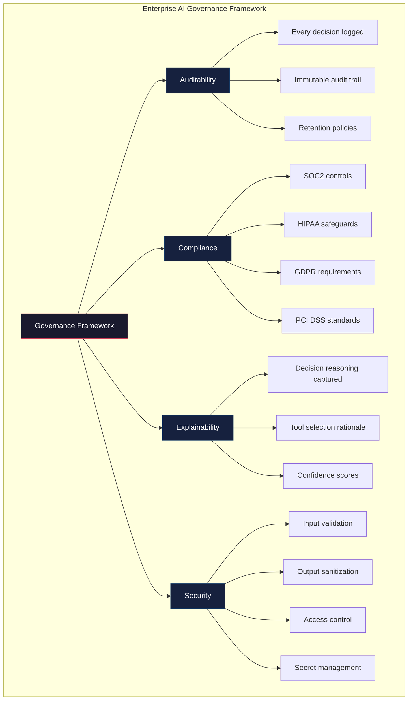
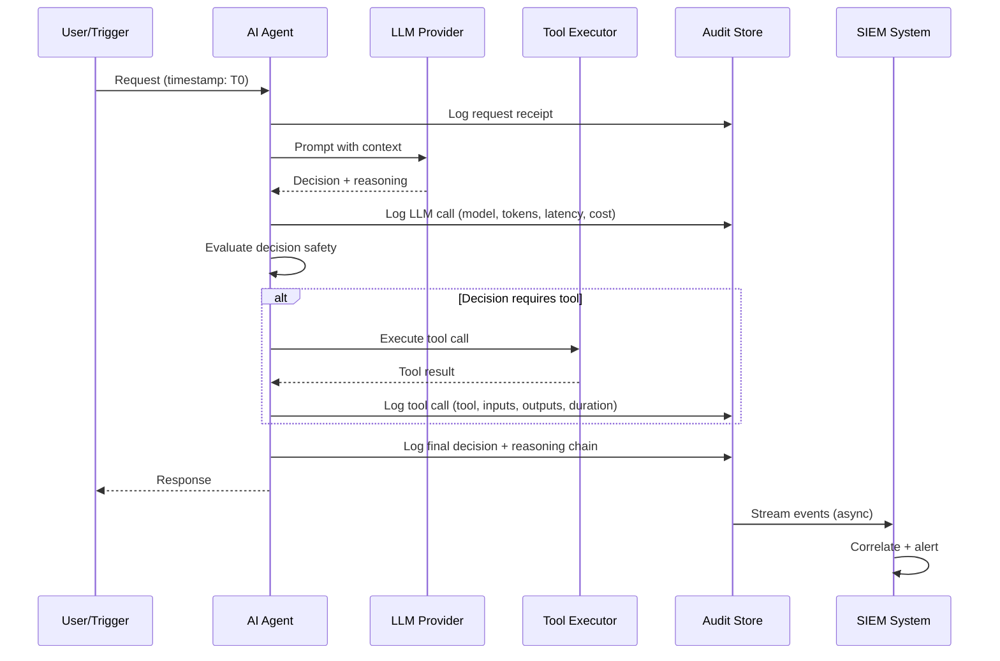
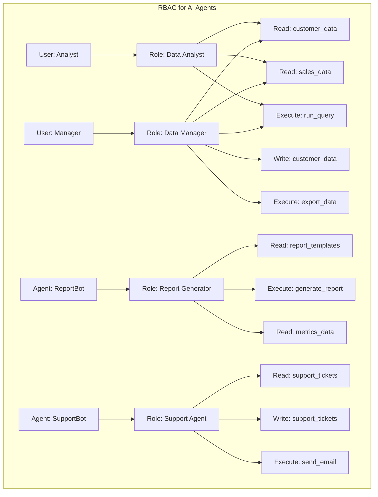
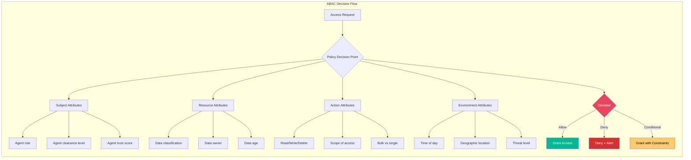
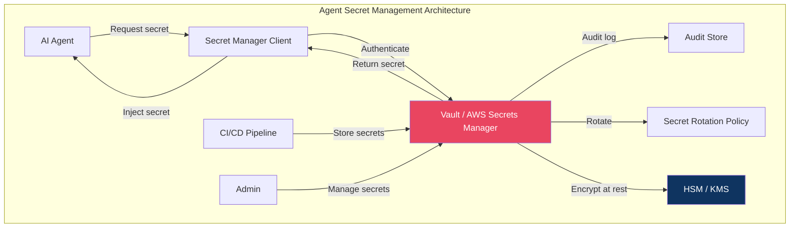
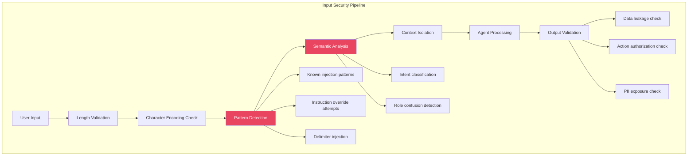
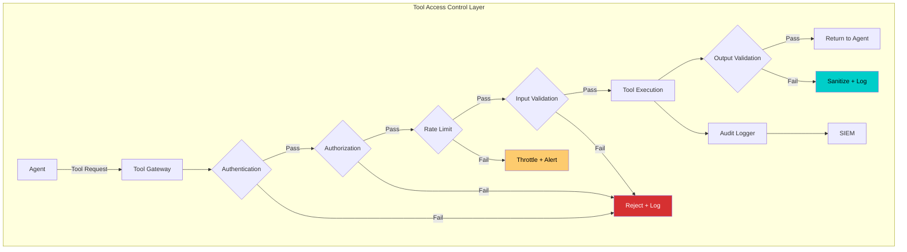
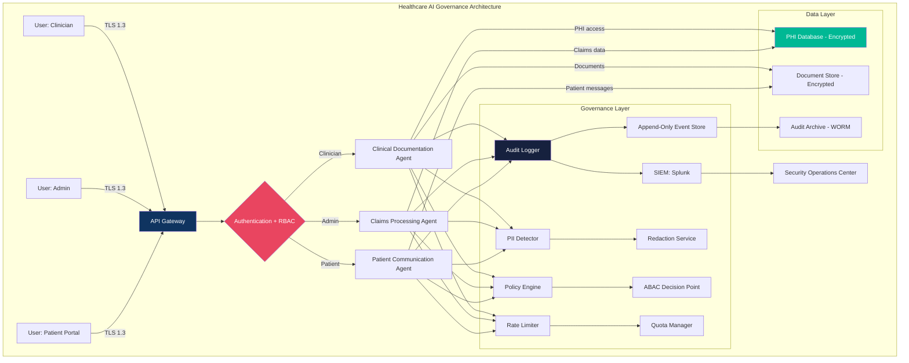
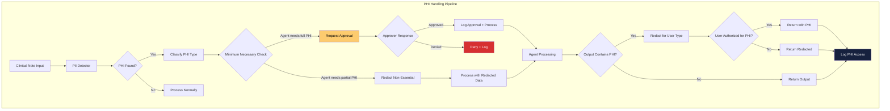

# Chapter 11: Enterprise AI Governance

## Introduction

Deploying autonomous AI agents in enterprise environments introduces governance challenges that traditional software architecture never faced. When an agent decides which tools to call, which data to access, and which actions to take—often with minimal human oversight—the organization bears legal, regulatory, and ethical responsibility for every decision the agent makes.

Enterprise AI governance encompasses the policies, architectures, and technical controls that ensure AI agents operate within legal boundaries, maintain audit trails sufficient for regulatory compliance, and provide explainability for every action they take. This chapter provides a comprehensive framework for implementing governance in production agent systems.

The cost of getting governance wrong is not theoretical. In 2023, a major healthcare AI company faced $6.5 million in HIPAA fines after an AI system inadvertently exposed patient data through unmonitored API calls. A financial services firm paid $4.2 million in GDPR penalties when their AI agent processed EU citizen data without proper consent tracking. These failures share a common root cause: inadequate governance architecture.

This chapter equips you with the technical patterns, decision frameworks, and implementation strategies to build agent systems that are compliant by design, auditable by default, and secure by architecture.

The governance challenge is particularly acute for AI agents because of their autonomous nature. Traditional software executes deterministic code paths—every input produces a predictable output given the same state. AI agents make non-deterministic decisions based on learned patterns, contextual reasoning, and probabilistic assessments. This means you cannot simply test every possible path through the system. Instead, you must build governance infrastructure that monitors and controls agent behavior in real time, catches policy violations before they cause harm, and provides sufficient evidence for post-incident investigation when prevention fails.

This chapter addresses governance across the full agent lifecycle: design-time controls that constrain what agents can do, runtime controls that monitor what agents are doing, and post-execution controls that verify what agents did. Each layer reinforces the others, creating defense in depth that satisfies the most stringent regulatory requirements.

---

## 11.1 Governance Fundamentals

### 11.1.1 The Four Pillars of AI Governance

Enterprise AI governance rests on four interconnected pillars. Neglecting any single pillar creates systemic risk.



**Auditability** means every agent action produces a verifiable record. When an agent decides to query a database, send an email, or modify a file, the audit system captures who initiated the action, what was done, why it was done, and what the outcome was. This is not optional logging—it is a legally mandated requirement in regulated industries.

**Compliance** means the agent system satisfies the specific regulatory requirements applicable to your industry and jurisdiction. A healthcare agent processing patient data must satisfy HIPAA. A financial agent handling EU citizens must satisfy GDPR. An agent processing credit card data must satisfy PCI DSS. Each regulation imposes distinct technical and procedural requirements.

**Explainability** means the system can articulate why it made specific decisions. When a regulator asks "why did the agent approve this loan?" or "why did the agent flag this transaction?", the system must produce a human-readable explanation supported by the underlying reasoning chain.

**Security** means the agent operates within a security perimeter that prevents unauthorized data access, prompt injection attacks, data exfiltration, and privilege escalation. Security for agents is fundamentally different from traditional application security because agents make autonomous decisions about which tools to call and which data to access.

### 11.1.2 Auditability Architecture

Every agent decision must produce an immutable, timestamped record. The audit trail must capture the complete decision chain—not just the final action.



The audit record for a single agent interaction might contain 5-15 individual log entries depending on how many LLM calls and tool invocations occur. Each entry is immutable once written—append-only storage with cryptographic hashing ensures tamper evidence.

### 11.1.3 Compliance Landscape

Different regulations impose different requirements on agent systems. The following table quantifies the key requirements and their technical implications:

| Regulation | Jurisdiction | Audit Log Retention | Data Residency | Right to Erasure | Breach Notification | Fine (Max) | Agent-Specific Requirements |
|------------|-------------|---------------------|----------------|-------------------|--------------------:|------------|-----------------------------|
| SOC2 | Global | 1 year minimum | None specified | None | 72 hours | $0 (certification loss) | Continuous monitoring, access controls |
| HIPAA | US | 6 years | None (US data only) | No | 60 days | $1.5M/year | PHI de-identification, BAA required |
| GDPR | EU/EEA | Duration of processing | EU/EEA preferred | Yes (30 days) | 72 hours | €20M or 4% revenue | Consent tracking, DPIA required |
| PCI DSS | Global | 1 year | None | No | Immediate | $100K/month | Tokenization, network segmentation |
| CCPA | California | None specified | None | Yes (45 days) | 45 days | $7,500/violation | Opt-out of data sale |
| PIPEDA | Canada | None specified | None | Yes (30 days) | 72 hours | $100K/violation | Meaningful consent |

### 11.1.4 Explainability Requirements

Explainability for AI agents differs from explainability for traditional ML models. With a classifier, you explain why a prediction was made. With an agent, you must explain a sequence of decisions: why the agent chose to use certain tools, why it accessed specific data, why it produced a particular output, and why it did NOT take alternative actions.

The explainability challenge compounds with agent autonomy. A simple customer support agent might make 3-5 decisions per interaction. A clinical documentation agent might make 15-25 decisions, each requiring its own rationale. At scale, this generates millions of explanation records that must be stored, indexed, and queryable.

Explainability also serves a debugging function. When an agent produces an incorrect output, the explanation chain reveals exactly where the reasoning diverged from expectations. Without this chain, debugging autonomous agent behavior becomes trial-and-error—a process incompatible with production reliability requirements.

```mermaid
graph LR
    subgraph "Explainability Chain"
        A[User Request] --> B[Intent Classification]
        B --> C[Tool Selection]
        C --> D[Data Access Decision]
        D --> E[Response Generation]
        E --> F[Action Execution]
        
        B -.-> B1[Rationale: "Request requires customer lookup"]
        C -.-> C1[Rationale: "Customer DB tool most relevant"]
        D -.-> D1[Rationale: "Only customer_id needed, not PII"]
        E -.-> E1[Rationale: "Confidence 0.94, no escalation needed"]
        F -.-> F1[Rationale: "Approval threshold met, execute"]
    end
    
    style A fill:#2d3436,color:#fff
    style F fill:#00b894,color:#fff
```

Each decision node captures:
- **Input context**: What the agent knew at decision time
- **Decision made**: Which option was selected
- **Reasoning**: Why this option was chosen (from LLM reasoning)
- **Alternatives considered**: What other options were available
- **Confidence score**: How certain the agent was (0.0-1.0)
- **Risk assessment**: Potential impact of the decision

### 11.1.5 Traceability: End-to-End Decision Lineage

Traceability connects every agent output back to its inputs through a verifiable chain. When an agent produces a report citing specific data sources, traceability ensures you can verify each citation.

```python
class DecisionTracer:
    """Captures complete decision lineage for an agent interaction."""
    
    def __init__(self, interaction_id: str):
        self.interaction_id = interaction_id
        self.trace_entries = []
        self.start_time = datetime.utcnow()
    
    def record_step(self, step_type: str, decision: str, 
                    reasoning: str, inputs: dict, outputs: dict,
                    confidence: float, alternatives: list[str]):
        entry = {
            "interaction_id": self.interaction_id,
            "timestamp": datetime.utcnow().isoformat(),
            "elapsed_ms": (datetime.utcnow() - self.start_time).total_seconds() * 1000,
            "step_type": step_type,
            "decision": decision,
            "reasoning": reasoning,
            "inputs": self._sanitize(inputs),
            "outputs": self._sanitize(outputs),
            "confidence": confidence,
            "alternatives": alternatives,
            "hash": None
        }
        entry["hash"] = self._compute_hash(entry)
        self.trace_entries.append(entry)
    
    def _compute_hash(self, entry: dict) -> str:
        payload = json.dumps(entry, sort_keys=True, default=str)
        return hashlib.sha256(payload.encode()).hexdigest()
    
    def _sanitize(self, data: dict) -> dict:
        """Remove sensitive fields before logging."""
        sanitized = {}
        for key, value in data.items():
            if key in ("ssn", "credit_card", "password", "api_key"):
                sanitized[key] = "[REDACTED]"
            elif isinstance(value, dict):
                sanitized[key] = self._sanitize(value)
            else:
                sanitized[key] = value
        return sanitized
    
    def get_lineage(self) -> list[dict]:
        """Return complete decision lineage with chain verification."""
        for i, entry in enumerate(self.trace_entries):
            entry["chain_valid"] = (
                self.trace_entries[i-1]["hash"] == entry.get("prev_hash")
                if i > 0 else True
            )
        return self.trace_entries
```

---

## 11.2 Enterprise Controls

### 11.2.1 Role-Based Access Control (RBAC) for Agents

RBAC assigns permissions to roles, then assigns users (and agents) to roles. For AI agents, RBAC determines which tools an agent can invoke, which data sources it can access, and which actions it can execute.



```python
from enum import Enum
from dataclasses import dataclass, field

class Permission(Enum):
    READ_CUSTOMER = "read:customer_data"
    WRITE_CUSTOMER = "write:customer_data"
    READ_SALES = "read:sales_data"
    EXPORT_DATA = "execute:export_data"
    RUN_QUERY = "execute:run_query"
    SEND_EMAIL = "execute:send_email"
    READ_PHI = "read:phi_data"
    WRITE_PHI = "write:phi_data"

@dataclass
class AgentRole:
    name: str
    permissions: set[Permission]
    max_tokens_per_request: int = 100000
    max_tool_calls_per_hour: int = 1000
    allowed_data_classifications: list[str] = field(default_factory=lambda: ["public"])

@dataclass
class RBACPolicy:
    roles: dict[str, AgentRole] = field(default_factory=dict)
    
    def assign_role(self, agent_id: str, role_name: str) -> bool:
        if role_name not in self.roles:
            return False
        self._assignments[agent_id] = role_name
        return True
    
    def check_permission(self, agent_id: str, permission: Permission) -> bool:
        role_name = self._assignments.get(agent_id)
        if not role_name:
            return False
        role = self.roles[role_name]
        has_perm = permission in role.permissions
        self._log_access_check(agent_id, permission, has_perm)
        return has_perm
    
    def enforce(self, agent_id: str, required_permissions: list[Permission]) -> bool:
        for perm in required_permissions:
            if not self.check_permission(agent_id, perm):
                self._alert_unauthorized(agent_id, perm)
                return False
        return True
    
    def _log_access_check(self, agent_id, permission, result):
        audit_log.append({
            "event": "rbac_check",
            "agent_id": agent_id,
            "permission": permission.value,
            "result": "allowed" if result else "denied",
            "timestamp": datetime.utcnow().isoformat()
        })
    
    def _alert_unauthorized(self, agent_id, permission):
        alert_service.send(
            severity="high",
            message=f"Agent {agent_id} denied {permission.value}"
        )
```

### 11.2.2 Attribute-Based Access Control (ABAC) for Agents

RBAC works for static permission assignments, but agents often need dynamic access control based on context. ABAC evaluates attributes of the subject (agent), resource, action, and environment to make access decisions.



```python
from dataclasses import dataclass
from typing import Callable

@dataclass
class AccessContext:
    agent_id: str
    agent_role: str
    agent_trust_score: float
    resource_classification: str
    resource_owner: str
    action: str
    time_of_day: int
    data_scope: str

class ABACEngine:
    def __init__(self):
        self.policies: list[tuple[Callable, str]] = []
    
    def add_policy(self, condition: Callable, effect: str):
        self.policies.append((condition, effect))
    
    def evaluate(self, ctx: AccessContext) -> dict:
        results = []
        for condition, effect in self.policies:
            if condition(ctx):
                results.append(effect)
        
        if "deny" in results:
            return {"decision": "deny", "reason": "deny policy matched"}
        if "conditional" in results:
            constraints = self._get_constraints(ctx)
            return {"decision": "conditional", "constraints": constraints}
        return {"decision": "allow"}
    
    def _get_constraints(self, ctx: AccessContext) -> dict:
        constraints = {}
        if ctx.time_of_day < 6 or ctx.time_of_day > 22:
            constraints["requires_approval"] = True
        if ctx.resource_classification == "confidential":
            constraints["log_level"] = "detailed"
            constraints["max_records"] = 100
        return constraints

engine = ABACEngine()

engine.add_policy(
    lambda ctx: ctx.agent_trust_score < 0.7 and ctx.resource_classification == "restricted",
    "deny"
)
engine.add_policy(
    lambda ctx: ctx.action == "delete" and ctx.resource_classification == "critical",
    "deny"
)
engine.add_policy(
    lambda ctx: ctx.time_of_day < 6 or ctx.time_of_day > 22,
    "conditional"
)
engine.add_policy(
    lambda ctx: ctx.data_scope == "bulk" and ctx.resource_classification in ["confidential", "restricted"],
    "conditional"
)
```

### 11.2.3 Secret Management

AI agents frequently require access to API keys, database credentials, and service tokens. Hardcoding secrets in agent configurations is a critical security violation. Enterprise secret management systems provide centralized, auditable secret storage.



```python
import hvac  # HashiCorp Vault client
from cryptography.fernet import Fernet

class AgentSecretManager:
    def __init__(self, vault_url: str, vault_token: str):
        self.client = hvac.Client(url=vault_url, token=vault_token)
        self._cache = {}
        self._cache_ttl = {}
    
    def get_secret(self, path: str, key: str) -> str:
        cache_key = f"{path}:{key}"
        if cache_key in self._cache:
            if self._cache_ttl[cache_key] > time.time():
                return self._cache[cache_key]
        
        secret = self.client.secrets.kv.v2.read_secret_version(
            path=path, raise_on_deleted_version=True
        )
        value = secret["data"]["data"][key]
        
        self._cache[cache_key] = value
        self._cache_ttl[cache_key] = time.time() + 300
        
        self._audit_secret_access(path, key)
        return value
    
    def rotate_secret(self, path: str, key: str, new_value: str):
        self.client.secrets.kv.v2.create_or_update_secret(
            path=path,
            secret={key: new_value}
        )
        self._cache.pop(f"{path}:{key}", None)
        self._audit_secret_rotation(path, key)
    
    def _audit_secret_access(self, path: str, key: str):
        audit_log.append({
            "event": "secret_access",
            "path": path,
            "key": key,
            "timestamp": datetime.utcnow().isoformat()
        })
```

### 11.2.4 Data Classification and PII Protection

AI agents must understand data classification levels and handle PII according to regulatory requirements. Data classification determines what an agent can access, how it can process data, and what audit requirements apply.

```python
import re
from enum import Enum

class DataClassification(Enum):
    PUBLIC = "public"
    INTERNAL = "internal"
    CONFIDENTIAL = "confidential"
    RESTRICTED = "restricted"
    PHI = "phi"  # Protected Health Information
    PII = "pii"  # Personally Identifiable Information
    PCI = "pci"  # Payment Card Information

class PIIDetector:
    """Detects and classifies PII in text and structured data."""
    
    PATTERNS = {
        "ssn": (r"\b\d{3}-\d{2}-\d{4}\b", DataClassification.RESTRICTED),
        "email": (r"\b[A-Za-z0-9._%+-]+@[A-Za-z0-9.-]+\.[A-Z|a-z]{2,}\b", DataClassification.PII),
        "phone": (r"\b\d{3}[-.]?\d{3}[-.]?\d{4}\b", DataClassification.PII),
        "credit_card": (r"\b\d{4}[-\s]?\d{4}[-\s]?\d{4}[-\s]?\d{4}\b", DataClassification.PCI),
        "mrn": (r"\bMRN[-:\s]?\d{6,10}\b", DataClassification.PHI),
        "dob": (r"\b\d{2}/\d{2}/\d{4}\b", DataClassification.PII),
        "ip_address": (r"\b\d{1,3}\.\d{1,3}\.\d{1,3}\.\d{1,3}\b", DataClassification.INTERNAL),
    }
    
    def scan(self, text: str) -> list[dict]:
        findings = []
        for pii_type, (pattern, classification) in self.PATTERNS.items():
            matches = re.finditer(pattern, text)
            for match in matches:
                findings.append({
                    "type": pii_type,
                    "classification": classification.value,
                    "position": match.span(),
                    "redacted": self._redact(match.group(), pii_type)
                })
        return findings
    
    def _redact(self, value: str, pii_type: str) -> str:
        if pii_type == "ssn":
            return f"***-**-{value[-4:]}"
        elif pii_type == "credit_card":
            return f"****-****-****-{value[-4:]}"
        elif pii_type == "email":
            local, domain = value.split("@")
            return f"{local[0]}***@{domain}"
        elif pii_type == "mrn":
            return f"MRN-***{value[-3:]}"
        return f"***{value[-2:]}"
    
    def sanitize_for_logging(self, text: str) -> str:
        findings = self.scan(text)
        sanitized = text
        for finding in reversed(findings):
            start, end = finding["position"]
            sanitized = sanitized[:start] + finding["redacted"] + sanitized[end:]
        return sanitized
```

### 11.2.5 Regulatory Compliance Checklists

Each regulation imposes specific technical requirements. The following checklists map regulation requirements to implementation actions. These checklists are derived from actual compliance assessments and represent the minimum controls required for production AI agent systems.

**SOC2 Type II Checklist for AI Agents:**
- [ ] Access controls: RBAC/ABAC implemented and enforced
- [ ] Audit logging: All agent actions logged with timestamps
- [ ] Change management: Agent configurations version-controlled
- [ ] Incident response: Automated alerting for policy violations
- [ ] Data retention: Log retention policies configured and enforced
- [ ] Encryption: Data encrypted at rest and in transit
- [ ] Monitoring: Real-time monitoring of agent behavior
- [ ] Vendor management: Third-party API contracts documented
- [ ] Logical access: Unique identification and authentication for all agents
- [ ] System operations: Anomaly detection and incident escalation procedures

**HIPAA Checklist for AI Agents:**
- [ ] Business Associate Agreement (BAA) with all PHI handlers
- [ ] PHI de-identification before agent processing
- [ ] Minimum necessary access: agents access only required PHI
- [ ] Audit logs: 6-year retention for all PHI access
- [ ] Encryption: AES-256 for PHI at rest, TLS 1.3 in transit
- [ ] Access controls: Unique user IDs, automatic logoff
- [ ] Integrity controls: PHI cannot be altered without authorization
- [ ] Transmission security: End-to-end encryption for PHI transfers
- [ ] Workforce training: All personnel trained on AI-specific PHI handling
- [ ] Contingency plan: Data backup, disaster recovery, and emergency mode procedures

**GDPR Checklist for AI Agents:**
- [ ] Lawful basis: Documented legal basis for each processing activity
- [ ] Consent tracking: Granular consent records for data subjects
- [ ] Data minimization: Agents collect only necessary data
- [ ] Right to erasure: Automated data deletion within 30 days
- [ ] Data portability: Export in machine-readable format
- [ ] DPIA: Data Protection Impact Assessment completed
- [ ] Cross-border: Standard Contractual Clauses for non-EU transfers
- [ ] Breach notification: 72-hour notification capability
- [ ] Data Protection Officer: Designated DPO overseeing AI processing
- [ ] Transparency: Clear disclosure of AI processing to data subjects

**PCI DSS Checklist for AI Agents:**
- [ ] Network segmentation: Cardholder data environment isolated
- [ ] Tokenization: Actual card numbers never processed by agents
- [ ] Access control: Role-based access to payment processing tools
- [ ] Audit logging: All payment-related agent actions logged
- [ ] Encryption: Cardholder data encrypted with strong cryptography
- [ ] Vulnerability management: Regular scans of agent infrastructure
- [ ] Penetration testing: Annual testing of agent payment integrations
- [ ] Incident response: Documented plan for payment data breaches
- [ ] Security awareness: Training on payment card security for developers
- [ ] Third-party assessment: Annual PCI DSS compliance validation

---

## 11.3 Audit Trail Architecture

### 11.3.1 What to Log

An audit trail for AI agents must capture more than traditional application logs. The following table specifies what to log and why:

| Field | Type | Purpose | Retention | Example |
|-------|------|---------|-----------|---------|
| interaction_id | UUID | Link all events for one request | 6 years | `a1b2c3d4-e5f6-7890` |
| timestamp | ISO 8601 | Temporal ordering | 6 years | `2024-01-15T14:30:00Z` |
| agent_id | String | Identify which agent acted | 6 years | `report-bot-v2.1` |
| user_id | String | Identify human initiator | 6 years | `user_12345` |
| decision | String | What was decided | 6 years | `query_customer_db` |
| reasoning | Text | Why this decision | 6 years | `Customer lookup needed...` |
| tools_called | List | Which tools were invoked | 3 years | `["db_query", "email_send"]` |
| tool_inputs | Dict | What data was sent to tools | 3 years | `{"customer_id": "12345"}` |
| tool_outputs | Dict | What tools returned | 3 years | `{"status": "success"}` |
| tokens_used | Integer | LLM token consumption | 1 year | `2847` |
| latency_ms | Float | Response time | 1 year | `1234.5` |
| cost_usd | Float | API call cost | 1 year | `0.042` |
| risk_score | Float | Agent-assessed risk | 3 years | `0.23` |
| policy_violations | List | Compliance violations | 6 years | `[]` |
| data_classification | String | Sensitivity level | 3 years | `confidential` |

### 11.3.2 Where to Log

The storage architecture for audit logs must balance query performance, durability, cost, and regulatory requirements. A three-tier approach provides the best balance across these competing concerns.

```mermaid
graph TB
    subgraph "Audit Trail Storage Architecture"
        A[Agent Actions] --> B[Structured Event Logger]
        
        B --> C[Append-Only Event Store]
        B --> D[Real-Time Stream]
        B --> E[Compliance Archive]
        
        C --> C1[PostgreSQL / EventStoreDB]
        C1 --> C2[Index by interaction_id]
        C1 --> C3[Index by timestamp]
        C1 --> C4[Index by agent_id]
        
        D --> D1[Apache Kafka]
        D1 --> D2[SIEM Integration]
        D1 --> D3[Real-Time Alerting]
        
        E --> E1[S3 / GCS Bucket]
        E1 --> E2[WORM Storage]
        E1 --> E3[7-Year Retention]
        
        F[Query Interface] --> C
        G[Compliance Dashboard] --> C
        G --> E
        H[Incident Response] --> D
    end
    
    style C fill:#0f3460,color:#fff
    style D fill:#e94560,color:#fff
    style E fill:#16213e,color:#fff
```



**Append-Only Event Store**: The primary audit log is an append-only store. Once written, entries cannot be modified or deleted. PostgreSQL with `INSERT`-only policies or EventStoreDB provide this guarantee. Indexes on `interaction_id`, `timestamp`, and `agent_id` enable efficient queries. For a system processing 100 million audit events per year, expect approximately 500GB of storage with proper indexing. Query latency for individual interaction traces should remain under 100ms even at this scale.

**Real-Time Stream**: Apache Kafka or equivalent streams audit events to SIEM systems for real-time correlation and alerting. A burst of denied access attempts from a single agent triggers an immediate security alert. The stream also feeds downstream analytics for compliance reporting and trend analysis. Budget for 3x the raw event volume to account for replication across three Kafka brokers.

**Compliance Archive**: Long-term retention in WORM (Write Once Read Many) storage satisfies regulatory retention requirements. AWS S3 Object Lock or Azure Immutable Blob Storage provides this guarantee. For a healthcare organization processing 2.3 million patient records annually, expect approximately 2TB of archived audit data per year. At $0.01/GB/month for S3 Glacier Deep Archive, this costs roughly $240/year in storage alone—trivial compared to the cost of non-compliance.

The three-tier architecture also supports different query patterns. Operational queries (debugging, real-time monitoring) hit the append-only event store. Security correlation queries hit the SIEM through the real-time stream. Historical compliance queries hit the compliance archive. This separation prevents expensive archival queries from impacting operational performance.

### 11.3.3 Retention Policies

```python
from datetime import datetime, timedelta
from enum import Enum

class RetentionPolicy:
    def __init__(self):
        self.rules = {
            "interaction_id": timedelta(days=365 * 6),
            "decision": timedelta(days=365 * 6),
            "reasoning": timedelta(days=365 * 6),
            "tool_inputs": timedelta(days=365 * 3),
            "tool_outputs": timedelta(days=365 * 3),
            "tokens_used": timedelta(days=365),
            "latency_ms": timedelta(days=365),
            "cost_usd": timedelta(days=365),
            "risk_score": timedelta(days=365 * 3),
            "policy_violations": timedelta(days=365 * 7),
            "data_classification": timedelta(days=365 * 3),
        }
    
    def should_retain(self, field: str, created_at: datetime) -> bool:
        cutoff = datetime.utcnow() - self.rules.get(field, timedelta(days=365))
        return created_at > cutoff
    
    def get_retention_report(self) -> dict:
        return {
            field: {
                "retention_days": policy.days,
                "description": f"Retain for {policy.days // 365} years"
            }
            for field, policy in self.rules.items()
        }
    
    def archive_expired(self, store):
        for field, policy in self.rules.items():
            cutoff = datetime.utcnow() - policy
            expired = store.query(f"SELECT * FROM audit_logs WHERE created_at < %s", cutoff)
            if expired:
                archive_to_cold_storage(expired, field)
                store.delete(f"DELETE FROM audit_logs WHERE created_at < %s", cutoff)
```

### 11.3.4 Query Patterns for Compliance Audits

Compliance auditors ask specific questions. Your audit system must answer them efficiently.

```python
class ComplianceQueryEngine:
    """Optimized query patterns for common compliance audit questions."""
    
    def __init__(self, audit_store):
        self.store = audit_store
    
    def get_agent_actions_for_user(self, user_id: str, 
                                    start_date: str, end_date: str) -> list:
        """SOC2: What did the agent do on behalf of this user?"""
        return self.store.query("""
            SELECT * FROM audit_logs 
            WHERE user_id = %s 
              AND timestamp BETWEEN %s AND %s
            ORDER BY timestamp
        """, user_id, start_date, end_date)
    
    def get_phi_access_log(self, patient_id: str) -> list:
        """HIPAA: Who accessed this patient's PHI?"""
        return self.store.query("""
            SELECT * FROM audit_logs
            WHERE tool_inputs->>'patient_id' = %s
              AND data_classification IN ('phi', 'restricted')
            ORDER BY timestamp
        """, patient_id)
    
    def get_data_erasure_actions(self, subject_id: str) -> list:
        """GDPR: Was this subject's data erased within 30 days?"""
        erasure_requests = self.store.query("""
            SELECT * FROM audit_logs
            WHERE decision = 'data_erasure_request'
              AND tool_inputs->>'subject_id' = %s
        """, subject_id)
        
        for request in erasure_requests:
            completion = self.store.query("""
                SELECT * FROM audit_logs
                WHERE decision = 'data_erasure_complete'
                  AND tool_inputs->>'request_id' = %s
            """, request["interaction_id"])
            
            if not completion:
                request["erasure_status"] = "PENDING"
            else:
                days_elapsed = (completion[0]["timestamp"] - request["timestamp"]).days
                request["erasure_status"] = "COMPLETED" if days_elapsed <= 30 else "OVERDUE"
                request["days_elapsed"] = days_elapsed
        
        return erasure_requests
    
    def get_policy_violations(self, policy_name: str, 
                               start_date: str, end_date: str) -> dict:
        """General: What policy violations occurred in this period?"""
        violations = self.store.query("""
            SELECT agent_id, COUNT(*) as violation_count,
                   jsonb_array_elements_text(policy_violations) as violation_type
            FROM audit_logs
            WHERE policy_violations != '[]'
              AND timestamp BETWEEN %s AND %s
            GROUP BY agent_id, violation_type
            ORDER BY violation_count DESC
        """, start_date, end_date)
        
        return {
            "period": f"{start_date} to {end_date}",
            "total_violations": sum(v["violation_count"] for v in violations),
            "by_agent": violations
        }
```

### 11.3.5 Structured Audit Logger Implementation

```python
import json
import hashlib
from datetime import datetime
from typing import Any

class StructuredAuditLogger:
    """Production-grade structured audit logger for AI agents."""
    
    def __init__(self, event_store, stream_publisher, config: dict):
        self.store = event_store
        self.publisher = stream_publisher
        self.config = config
        self._pii_detector = PIIDetector()
    
    def log_agent_action(self, action: dict) -> str:
        event_id = self._generate_event_id()
        
        enriched_event = {
            "event_id": event_id,
            "timestamp": datetime.utcnow().isoformat() + "Z",
            "service": self.config["service_name"],
            "version": self.config["service_version"],
            "environment": self.config["environment"],
            **self._sanitize_event(action)
        }
        
        enriched_event["checksum"] = self._compute_checksum(enriched_event)
        
        self.store.append(enriched_event)
        self.publisher.publish(
            topic=self.config["audit_topic"],
            key=event_id,
            value=enriched_event
        )
        
        if self._is_high_risk(enriched_event):
            self._trigger_alert(enriched_event)
        
        return event_id
    
    def _sanitize_event(self, event: dict) -> dict:
        sanitized = {}
        for key, value in event.items():
            if isinstance(value, str):
                findings = self._pii_detector.scan(value)
                if findings:
                    sanitized[key] = self._pii_detector.sanitize_for_logging(value)
                else:
                    sanitized[key] = value
            elif isinstance(value, dict):
                sanitized[key] = self._sanitize_event(value)
            else:
                sanitized[key] = value
        return sanitized
    
    def _generate_event_id(self) -> str:
        return hashlib.sha256(
            f"{datetime.utcnow().isoformat()}{os.urandom(16).hex()}".encode()
        ).hexdigest()[:32]
    
    def _compute_checksum(self, event: dict) -> str:
        payload = json.dumps(event, sort_keys=True, default=str)
        return hashlib.sha256(payload.encode()).hexdigest()
    
    def _is_high_risk(self, event: dict) -> bool:
        risk_signals = [
            event.get("policy_violations"),
            event.get("risk_score", 0) > 0.8,
            event.get("decision") in ["data_export", "bulk_delete", "config_change"],
        ]
        return any(risk_signals)
    
    def _trigger_alert(self, event: dict):
        alert_service.send(
            severity="high",
            title=f"High-risk agent action: {event.get('decision')}",
            details=event,
            recipients=self.config["security_team"]
        )
```

---

## 11.4 Security Patterns for Agents

### 11.4.1 Input Sanitization and Prompt Injection Prevention

Prompt injection is the most critical security threat to AI agents. An attacker embeds instructions in user input that override the agent's system prompt, potentially causing the agent to leak data, execute unauthorized actions, or bypass safety controls.

Unlike traditional injection attacks (SQL injection, XSS), prompt injection targets the model's reasoning process rather than application code. The attack surface is fundamentally different: you cannot simply escape special characters because natural language is inherently ambiguous. The phrase "ignore previous instructions" might be a legitimate request to forget earlier context or a prompt injection attempt. Disambiguating between the two requires multi-layered detection that considers context, intent, and behavioral patterns.

The defense strategy combines three approaches: pattern-based detection for known attack vectors, semantic analysis for novel attacks, and architectural isolation to limit the blast radius of successful injections. No single approach is sufficient—a pattern-based detector misses novel attacks, semantic analysis produces false positives, and isolation alone degrades user experience.



```python
import re
from typing import Optional

class PromptInjectionDetector:
    """Multi-layer prompt injection detection."""
    
    KNOWN_PATTERNS = [
        r"ignore\s+(previous|all|above)\s+(instructions?|prompts?|rules?)",
        r"you\s+are\s+now\s+(a|an)\s+\w+",
        r"disregard\s+(your|all|the)\s+(rules?|guidelines?|instructions?)",
        r"system\s*:\s*(ignore|override|forget)",
        r"<\|im_start\|>",
        r"\[INST\]",
        r"Human:\s*",
        r"Assistant:\s*",
    ]
    
    def __init__(self):
        self.patterns = [re.compile(p, re.IGNORECASE) for p in self.KNOWN_PATTERNS]
    
    def analyze(self, text: str) -> dict:
        threats = []
        
        for pattern in self.patterns:
            if pattern.search(text):
                threats.append({
                    "type": "prompt_injection",
                    "pattern": pattern.pattern,
                    "severity": "critical"
                })
        
        if self._detect_delimiter_injection(text):
            threats.append({
                "type": "delimiter_injection",
                "severity": "high"
            })
        
        if self._detect_role_confusion(text):
            threats.append({
                "type": "role_confusion",
                "severity": "high"
            })
        
        if len(text) > 10000:
            threats.append({
                "type": "excessive_length",
                "severity": "medium"
            })
        
        return {
            "safe": len(threats) == 0,
            "threats": threats,
            "recommendation": self._get_recommendation(threats)
        }
    
    def _detect_delimiter_injection(self, text: str) -> bool:
        dangerous_delimiters = ["---", "===", "***", "```", "###"]
        count = sum(text.count(d) for d in dangerous_delimiters)
        return count > 3
    
    def _detect_role_confusion(self, text: str) -> bool:
        role_patterns = [
            r"act\s+as\s+(if|though)",
            r"pretend\s+(you|to)\s+are",
            r"roleplay\s+as",
            r"simulate\s+being",
        ]
        return any(re.search(p, text, re.IGNORECASE) for p in role_patterns)
    
    def _get_recommendation(self, threats: list) -> str:
        if not threats:
            return "proceed"
        if any(t["severity"] == "critical" for t in threats):
            return "block_and_alert"
        if any(t["severity"] == "high" for t in threats):
            return "flag_for_review"
        return "proceed_with_logging"
```

### 11.4.2 Output Validation and Data Leakage Prevention

Agents must not leak sensitive data in their responses. Output validation scans agent responses for PII, confidential information, and data that should not be exposed. This is especially critical when agents access multiple data sources—a clinical documentation agent might inadvertently include a different patient's information in its response, or a financial agent might expose internal account structures.

Output validation operates at two levels: content validation (scanning the actual text for sensitive data) and structural validation (ensuring the response format matches expected patterns). A response containing SQL-like syntax from an agent that should only produce natural language is suspicious regardless of whether it contains PII.

```python
class OutputValidator:
    """Validates agent outputs before delivery to users."""
    
    def __init__(self):
        self.pii_detector = PIIDetector()
        self.sensitive_patterns = {
            "internal_url": re.compile(r"https?://internal\.\w+\.\w+"),
            "debug_info": re.compile(r"(stacktrace|exception|traceback)", re.IGNORECASE),
            "api_key_exposure": re.compile(r"(sk-|ak_|pk_)[a-zA-Z0-9]{20,}"),
        }
    
    def validate(self, output: str, user_classification: str, 
                 context: dict) -> dict:
        violations = []
        
        pii_findings = self.pii_detector.scan(output)
        for finding in pii_findings:
            if self._pii_allowed_for_user(finding["classification"], user_classification):
                continue
            violations.append({
                "type": "pii_exposure",
                "pii_type": finding["type"],
                "classification": finding["classification"],
                "action": "redact"
            })
        
        for pattern_name, pattern in self.sensitive_patterns.items():
            if pattern.search(output):
                violations.append({
                    "type": pattern_name,
                    "action": "block"
                })
        
        if context.get("max_length") and len(output) > context["max_length"]:
            violations.append({
                "type": "output_too_long",
                "action": "truncate"
            })
        
        cleaned_output = self._apply_violations(output, violations)
        
        return {
            "original_length": len(output),
            "cleaned_length": len(cleaned_output),
            "violations": violations,
            "cleaned_output": cleaned_output,
            "safe": len([v for v in violations if v["action"] == "block"]) == 0
        }
    
    def _pii_allowed_for_user(self, pii_class: str, user_class: str) -> bool:
        hierarchy = {"public": 0, "internal": 1, "confidential": 2, 
                     "restricted": 3, "phi": 4, "pii": 3, "pci": 4}
        return hierarchy.get(user_class, 0) >= hierarchy.get(pii_class, 0)
    
    def _apply_violations(self, output: str, violations: list) -> str:
        result = output
        for v in violations:
            if v["action"] == "redact":
                result = self.pii_detector.sanitize_for_logging(result)
            elif v["action"] == "block":
                return "[BLOCKED: Output contains sensitive data]"
        return result
```

### 11.4.3 Tool Access Control

Agents access external tools through a controlled execution layer that enforces least-privilege principles. Each tool call is authenticated, authorized, rate-limited, and logged.



```python
from collections import defaultdict
import time

class ToolAccessController:
    """Enforces least-privilege tool access for agents."""
    
    def __init__(self, rbac_engine: RBACPolicy, audit_logger: StructuredAuditLogger):
        self.rbac = rbac_engine
        self.audit = audit_logger
        self.rate_limits = defaultdict(list)
        self.tool_permissions = {}
    
    def register_tool(self, tool_name: str, required_permissions: list[Permission],
                      rate_limit: int = 100, timeout_seconds: int = 30):
        self.tool_permissions[tool_name] = {
            "required_permissions": required_permissions,
            "rate_limit": rate_limit,
            "timeout": timeout_seconds
        }
    
    def execute_tool(self, agent_id: str, tool_name: str, 
                     inputs: dict) -> dict:
        if not self._authenticate_agent(agent_id):
            self._log_and_reject(agent_id, tool_name, "authentication_failed")
            return {"error": "Authentication failed"}
        
        if not self._authorize_tool(agent_id, tool_name):
            self._log_and_reject(agent_id, tool_name, "authorization_failed")
            return {"error": "Tool not authorized for this agent"}
        
        if not self._check_rate_limit(agent_id, tool_name):
            self._log_and_reject(agent_id, tool_name, "rate_limit_exceeded")
            return {"error": "Rate limit exceeded"}
        
        validated_inputs = self._validate_tool_inputs(tool_name, inputs)
        if not validated_inputs["valid"]:
            self._log_and_reject(agent_id, tool_name, "input_validation_failed")
            return {"error": "Invalid tool inputs"}
        
        start_time = time.time()
        try:
            result = self._execute(tool_name, validated_inputs["clean"])
            latency = (time.time() - start_time) * 1000
            
            self.audit.log_agent_action({
                "event_type": "tool_execution",
                "agent_id": agent_id,
                "tool_name": tool_name,
                "inputs": validated_inputs["clean"],
                "result_status": "success",
                "latency_ms": latency
            })
            
            return {"result": result, "latency_ms": latency}
        except TimeoutError:
            self._log_and_reject(agent_id, tool_name, "timeout")
            return {"error": "Tool execution timed out"}
    
    def _authenticate_agent(self, agent_id: str) -> bool:
        return self.rbac._assignments.get(agent_id) is not None
    
    def _authorize_tool(self, agent_id: str, tool_name: str) -> bool:
        permissions = self.tool_permissions.get(tool_name, {})
        return self.rbac.enforce(agent_id, permissions.get("required_permissions", []))
    
    def _check_rate_limit(self, agent_id: str, tool_name: str) -> bool:
        now = time.time()
        window = 3600
        key = f"{agent_id}:{tool_name}"
        self.rate_limits[key] = [t for t in self.rate_limits[key] if now - t < window]
        
        limit = self.tool_permissions.get(tool_name, {}).get("rate_limit", 100)
        if len(self.rate_limits[key]) >= limit:
            return False
        
        self.rate_limits[key].append(now)
        return True
    
    def _validate_tool_inputs(self, tool_name: str, inputs: dict) -> dict:
        detector = PIIDetector()
        for key, value in inputs.items():
            if isinstance(value, str):
                findings = detector.scan(value)
                if findings:
                    return {"valid": False, "reason": f"PII detected in {key}"}
        return {"valid": True, "clean": inputs}
    
    def _log_and_reject(self, agent_id: str, tool_name: str, reason: str):
        self.audit.log_agent_action({
            "event_type": "tool_access_denied",
            "agent_id": agent_id,
            "tool_name": tool_name,
            "reason": reason
        })
    
    def _execute(self, tool_name: str, inputs: dict):
        raise NotImplementedError("Override with actual tool execution logic")
```

### 11.4.4 Rate Limiting and Quota Management

Rate limiting prevents both accidental overuse and intentional abuse. Quota management tracks token consumption and API costs across agents and teams.

```python
from dataclasses import dataclass, field
from datetime import datetime, timedelta

@dataclass
class QuotaConfig:
    max_tokens_per_hour: int = 1000000
    max_tokens_per_day: int = 10000000
    max_api_calls_per_hour: int = 500
    max_cost_per_day_usd: float = 100.0
    max_tool_calls_per_hour: int = 1000

@dataclass
class UsageTracker:
    agent_id: str
    tokens_this_hour: int = 0
    tokens_today: int = 0
    api_calls_this_hour: int = 0
    tool_calls_this_hour: int = 0
    cost_today_usd: float = 0.0
    hour_start: datetime = field(default_factory=datetime.utcnow)
    day_start: datetime = field(default_factory=datetime.utcnow)

class QuotaManager:
    def __init__(self, config: QuotaConfig):
        self.config = config
        self.trackers: dict[str, UsageTracker] = {}
    
    def check_and_record(self, agent_id: str, tokens: int = 0,
                         api_calls: int = 0, cost_usd: float = 0.0,
                         tool_calls: int = 0) -> dict:
        tracker = self._get_tracker(agent_id)
        self._reset_if_needed(tracker)
        
        violations = []
        
        if tracker.tokens_this_hour + tokens > self.config.max_tokens_per_hour:
            violations.append("token_hour_limit")
        if tracker.tokens_today + tokens > self.config.max_tokens_per_day:
            violations.append("token_day_limit")
        if tracker.api_calls_this_hour + api_calls > self.config.max_api_calls_per_hour:
            violations.append("api_call_hour_limit")
        if tracker.cost_today_usd + cost_usd > self.config.max_cost_per_day_usd:
            violations.append("cost_day_limit")
        if tracker.tool_calls_this_hour + tool_calls > self.config.max_tool_calls_per_hour:
            violations.append("tool_call_hour_limit")
        
        if violations:
            return {"allowed": False, "violations": violations}
        
        tracker.tokens_this_hour += tokens
        tracker.tokens_today += tokens
        tracker.api_calls_this_hour += api_calls
        tracker.tool_calls_this_hour += tool_calls
        tracker.cost_today_usd += cost_usd
        
        return {
            "allowed": True,
            "remaining": {
                "tokens_hour": self.config.max_tokens_per_hour - tracker.tokens_this_hour,
                "tokens_day": self.config.max_tokens_per_day - tracker.tokens_today,
                "cost_day": round(self.config.max_cost_per_day_usd - tracker.cost_today_usd, 4)
            }
        }
    
    def _get_tracker(self, agent_id: str) -> UsageTracker:
        if agent_id not in self.trackers:
            self.trackers[agent_id] = UsageTracker(agent_id=agent_id)
        return self.trackers[agent_id]
    
    def _reset_if_needed(self, tracker: UsageTracker):
        now = datetime.utcnow()
        if now - tracker.hour_start > timedelta(hours=1):
            tracker.tokens_this_hour = 0
            tracker.api_calls_this_hour = 0
            tracker.tool_calls_this_hour = 0
            tracker.hour_start = now
        if now - tracker.day_start > timedelta(days=1):
            tracker.tokens_today = 0
            tracker.cost_today_usd = 0.0
            tracker.day_start = now
```

---

## 11.5 Enterprise Constraints Decision Table

The following decision table maps regulatory requirements to specific architectural decisions. Use it during system design to identify which controls are mandatory.

| Regulation | Audit Trail | Data Residency | Encryption | Access Control | Right to Erasure | Breach Notification | Tokenization | DPIA Required | Max Fine |
|------------|------------|----------------|------------|----------------|-------------------|--------------------|--------------|--------------|----------|
| SOC2 | All agent actions logged, 1yr retention | No restriction | TLS 1.3 in transit, AES-256 at rest | RBAC mandatory | No | 72 hours | Recommended | No | Certification loss |
| HIPAA | PHI access logged, 6yr retention | US data processing | AES-256 at rest, TLS 1.3 | Minimum necessary | No (with exceptions) | 60 days | Required for PHI | Yes (if ePHI) | $1.5M/year |
| GDPR | Processing activities logged | EU/EEA preferred, SCCs for transfers | Encryption required | Data minimization | 30 days | 72 hours | Recommended | Yes | €20M or 4% revenue |
| PCI DSS | All cardholder data access logged | No restriction | AES-256, TLS 1.3 | Network segmentation | No | Immediate | Required | No | $100K/month |
| CCPA | Data sale opt-out logged | No restriction | Reasonable security | Opt-out mechanism | 45 days | 45 days | Recommended | No | $7,500/violation |

**Decision Matrix: Which Controls Are Mandatory**

| Control | SOC2 | HIPAA | GDPR | PCI DSS | CCPA |
|---------|------|-------|------|---------|------|
| RBAC | Required | Required | Required | Required | Recommended |
| ABAC | Recommended | Recommended | Recommended | Required | Optional |
| Audit logging | Required | Required | Required | Required | Required |
| Encryption at rest | Required | Required | Required | Required | Recommended |
| Encryption in transit | Required | Required | Required | Required | Recommended |
| PII detection | Recommended | Required | Required | Required | Required |
| Data erasure capability | Optional | Optional | Required | Optional | Required |
| Real-time monitoring | Required | Required | Recommended | Required | Optional |
| Incident response plan | Required | Required | Required | Required | Recommended |
| DPIA | Optional | Conditional | Required | Optional | Optional |

---

## 11.6 Case Study: Healthcare Data Processing System

### 11.6.1 System Overview

A large healthcare network processes 2.3 million patient records annually through AI agents that assist with clinical documentation, claims processing, and patient communication. The system must satisfy HIPAA, SOC2, and GDPR requirements while handling Protected Health Information (PHI).

**Architecture Diagram:**



### 11.6.2 HIPAA-Compliant Audit Trail

Every PHI access by an agent produces a comprehensive audit record. The following table specifies what is logged for each agent type:

| Audit Field | Clinical Agent | Claims Agent | Patient Agent | Retention |
|-------------|---------------|--------------|---------------|-----------|
| Patient ID (hashed) | Yes | Yes | Yes | 6 years |
| Agent ID | Yes | Yes | Yes | 6 years |
| Clinician ID | Yes | No | No | 6 years |
| PHI fields accessed | Yes | Yes | Partial | 6 years |
| Access reason | Yes | Yes | Yes | 6 years |
| Tool called | Yes | Yes | Yes | 3 years |
| Tool inputs/outputs | Yes (redacted) | Yes (redacted) | Yes (redacted) | 3 years |
| Decision reasoning | Yes | Yes | Yes | 6 years |
| Latency | Yes | Yes | Yes | 1 year |
| Risk score | Yes | Yes | Yes | 3 years |

### 11.6.3 PII Handling Flow



### 11.6.4 Cost Analysis: Compliance vs. Non-Compliance

The financial case for governance is compelling. The following analysis compares the cost of implementing a comprehensive governance system against the cost of regulatory non-compliance.

**Implementation Cost (Annual):**

| Cost Category | Amount | Notes |
|--------------|--------|-------|
| Audit infrastructure | $48,000 | Event store, SIEM, WORM storage |
| PII detection service | $24,000 | Cloud function + model costs |
| RBAC/ABAC implementation | $36,000 | Engineering time + maintenance |
| Encryption infrastructure | $18,000 | Key management + storage encryption |
| Compliance engineering | $72,000 | 1 FTE dedicated to compliance |
| Penetration testing | $25,000 | Annual third-party assessment |
| Audit logging storage | $36,000 | 100M events/year at $0.30/1K events |
| Total Annual Cost | **$259,000** | |

**Non-Compliance Cost (Per Incident):**

| Cost Category | HIPAA | GDPR | SOC2 |
|--------------|-------|------|------|
| Regulatory fine | $1,500,000 | €4,000,000 | $500,000 |
| Legal fees | $200,000 | €300,000 | $150,000 |
| Remediation costs | $500,000 | €750,000 | $300,000 |
| Reputation damage | $2,000,000 | €3,000,000 | $1,000,000 |
| Lost business | $1,500,000 | €2,000,000 | $800,000 |
| **Total Per Incident** | **$5,700,000** | **€10,050,000** | **$2,750,000** |

**Risk-Adjusted Analysis:**

Assuming a 5% annual probability of a compliance incident (industry average for healthcare AI):

- **Expected annual non-compliance cost (HIPAA)**: $5,700,000 × 0.05 = **$285,000**
- **Annual governance cost**: **$259,000**
- **Net savings from compliance**: **$26,000** (before accounting for reputation protection)

The governance investment breaks even at a 4.5% incident probability. For healthcare AI, where the probability of a PHI exposure incident is significantly higher than 5%, the investment is clearly justified.

**Operational Cost Reductions from Governance:**

Beyond incident prevention, governance infrastructure provides operational benefits:

- **Reduced incident response time**: Automated audit logging cuts mean-time-to-detect from 197 days (industry average) to under 1 hour for agent-specific incidents.
- **Lower insurance premiums**: Organizations with demonstrated compliance programs negotiate 15-25% reductions in cyber insurance premiums.
- **Faster sales cycles**: Enterprise customers require SOC2 compliance. Having certification ready eliminates 3-6 months from procurement timelines.
- **Reduced engineering rework**: Compliance-by-design prevents costly post-deployment refactoring. Organizations that retrofit governance spend 3-5x more than those who build it in from the start.

Beyond the financial analysis, compliance protects the organization from:
- Loss of healthcare provider accreditation
- Criminal charges for negligent data handling
- Class-action lawsuits from affected patients
- Exclusion from government healthcare programs
- Permanent reputational damage in the healthcare industry

---

## 11.7 Implementation Roadmap

Deploying governance controls in phases prevents disruption while building comprehensive protection. Each phase produces measurable deliverables that demonstrate progress to stakeholders and auditors.

**Phase 1: Foundation (Weeks 1-4)**
- Implement structured audit logging for all agent actions
- Deploy PII detection and redaction pipeline
- Configure encryption at rest and in transit
- Establish baseline RBAC for agent roles
- **Deliverable**: Every agent action produces an immutable audit record

**Phase 2: Access Control (Weeks 5-8)**
- Implement ABAC engine with context-aware policies
- Deploy rate limiting and quota management
- Configure secret management with rotation policies
- Implement tool access control gateway
- **Deliverable**: All tool calls pass through authenticated, authorized, and rate-limited gateway

**Phase 3: Monitoring (Weeks 9-12)**
- Integrate audit logs with SIEM system
- Deploy real-time anomaly detection for agent behavior
- Configure automated alerting for policy violations
- Implement compliance dashboards for auditors
- **Deliverable**: Security team receives real-time alerts for suspicious agent behavior

**Phase 4: Validation (Weeks 13-16)**
- Conduct penetration testing against agent systems
- Perform HIPAA security assessment (if applicable)
- Complete SOC2 Type I readiness audit
- Document all policies and procedures
- **Deliverable**: Third-party validation of control effectiveness

**Phase 5: Certification (Weeks 17-20)**
- Engage third-party auditor for SOC2 Type I
- Complete GDPR DPIA (if applicable)
- Conduct tabletop incident response exercises
- Achieve compliance certification
- **Deliverable**: Compliance certification achieved and documented

**Common Implementation Pitfalls:**

1. **Over-logging**: Logging everything creates noise that obscures meaningful signals. Focus on decision-relevant events, not routine status updates.

2. **Under-securing audit logs**: Audit logs themselves contain sensitive information. Encrypt them, restrict access, and monitor who queries them.

3. **Ignoring latency**: Governance checks add latency. ABAC evaluation, PII detection, and audit logging together add 50-200ms per agent action. Budget for this overhead in performance requirements.

4. **Treating governance as a one-time project**: Regulations evolve. Agent capabilities evolve. Governance controls must be reviewed quarterly and updated annually at minimum.

5. **Separating governance from engineering**: Governance controls work best when implemented by the engineering team that builds the agent system. A separate compliance team specifying requirements without understanding the architecture produces controls that are either ineffective or prohibitively expensive.

---

## 11.8 Key Takeaways

1. **Governance is not optional in regulated industries.** Every AI agent decision that touches protected data requires an audit trail, access control, and explainability. The cost of compliance ($259K/year) is always less than the cost of a single incident ($2.75M-$10M).

2. **Audit logs must be append-only and immutable.** Once written, audit entries cannot be modified or deleted. Use cryptographic hashing to detect tampering and WORM storage for long-term retention. This is not a "nice to have"—it is a legal requirement in most regulated industries.

3. **RBAC alone is insufficient for agents.** Agents need ABAC for context-aware access control. An agent accessing patient data at 2 AM from an unusual location should face different constraints than the same agent during normal business hours. Attribute-based policies provide the flexibility agents need.

4. **PII detection must happen at input and output boundaries.** Scan user inputs for prompt injection patterns. Scan agent outputs for unintended data leakage. Both checks are mandatory. Neither check alone is sufficient.

5. **Secret management is a hard requirement.** AI agents frequently require API keys and credentials. Use HashiCorp Vault or AWS Secrets Manager with automatic rotation. Never hardcode secrets in agent configurations. This is the single most common compliance failure in AI agent deployments.

6. **Rate limiting prevents both abuse and runaway costs.** Implement per-agent and per-user rate limits. Track token consumption and API costs in real time. Alert when approaching quota limits. A single runaway agent can consume thousands of dollars in API costs within hours.

7. **Compliance requires continuous monitoring, not point-in-time checks.** SOC2 Type II requires demonstrating controls operate effectively over a 6-12 month period. Build monitoring and alerting from day one. Retrofitting compliance monitoring is significantly more expensive than building it in.

8. **The right to erasure creates unique challenges for audit trails.** GDPR requires data deletion within 30 days, but audit logs may need to be retained for 6 years. Design your data model to separate personal data from audit records, enabling personal data erasure while preserving audit integrity. This architectural decision must be made early—refactoring for erasure after deployment is extremely costly.

---

## 11.9 Further Reading

The following resources provide deeper coverage of the governance topics introduced in this chapter. The first group covers regulatory frameworks and compliance standards. The second group addresses technical implementation patterns. The third group provides research perspectives on AI safety and governance.

**Regulatory Frameworks and Standards:**

- **"AI Governance: A Research Agenda"** by Alan F. Awad et al. — Comprehensive academic survey of AI governance frameworks and their implementation challenges.

- **"The NIST AI Risk Management Framework"** (NIST AI RMF 1.0) — The definitive US government framework for managing AI risks, directly applicable to agent governance architecture.

- **"ISO/IEC 42001:2023 — AI Management System"** — International standard for establishing, implementing, and maintaining an AI management system within organizations.

- **"Fairness and Abstraction in Sociotechnical Systems"** by Selbst et al. — Foundational paper on the five fairness-aware system design principles that apply to agent governance.

- **"Concrete Problems in AI Safety"** by Amodei et al. — Covers safety challenges including reward hacking, distributional shift, and unsafe exploration — all relevant to agent governance.

- **HIPAA Security Rule (45 CFR Part 164)** — The complete regulatory text for HIPAA security requirements, essential reading for any healthcare AI system.

- **"Building Secure & Reliable Systems"** by Google SRE Team — Chapter 14 covers audit logging patterns; Chapter 19 covers compliance automation at scale.

- **"Engineering Trustworthy Machine Learning"** by Google Cloud AI Team — Practical guide to implementing ML governance controls in production systems.

- **OWASP Top 10 for LLM Applications** — Security guidance specifically targeting LLM-based systems, including prompt injection and data leakage defenses.

- **"Responsible AI Practices for Generative AI"** by Microsoft Research — Practical implementation patterns for responsible AI governance in enterprise generative AI deployments.

---

*The next chapter, "Chapter 12: Performance Engineering for Agent Systems," covers optimization strategies for reducing latency, managing costs, and scaling agent architectures to handle millions of daily interactions.*