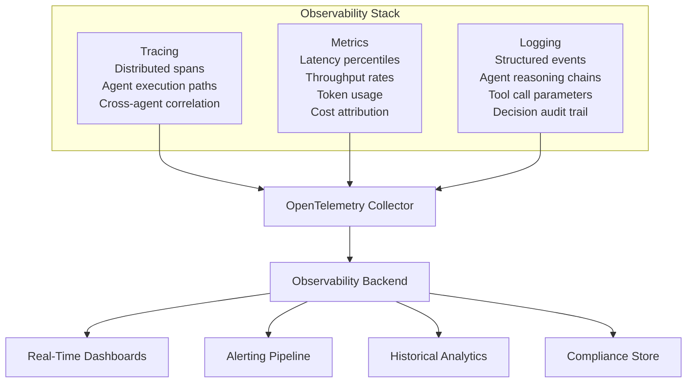
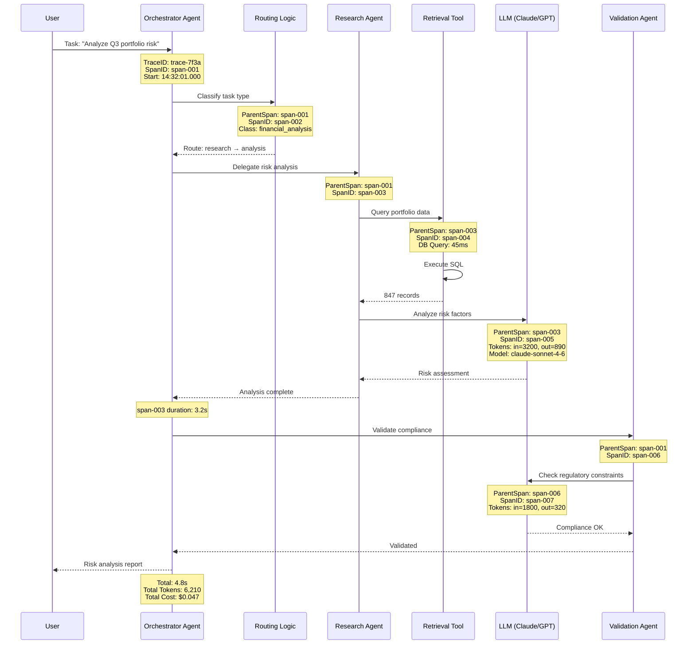
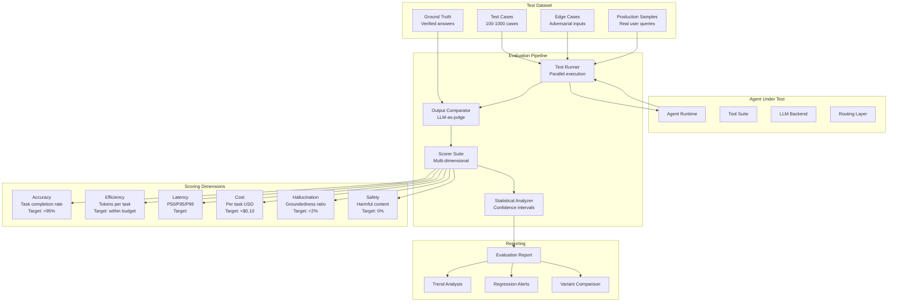
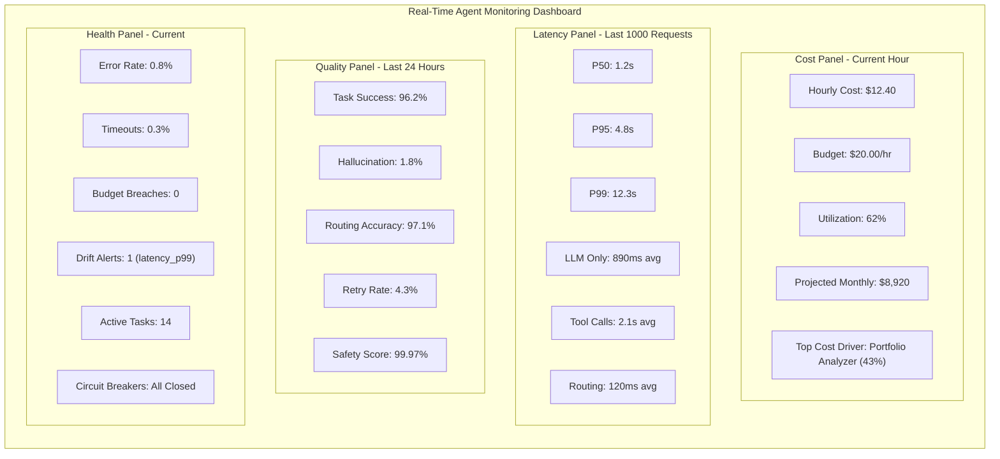
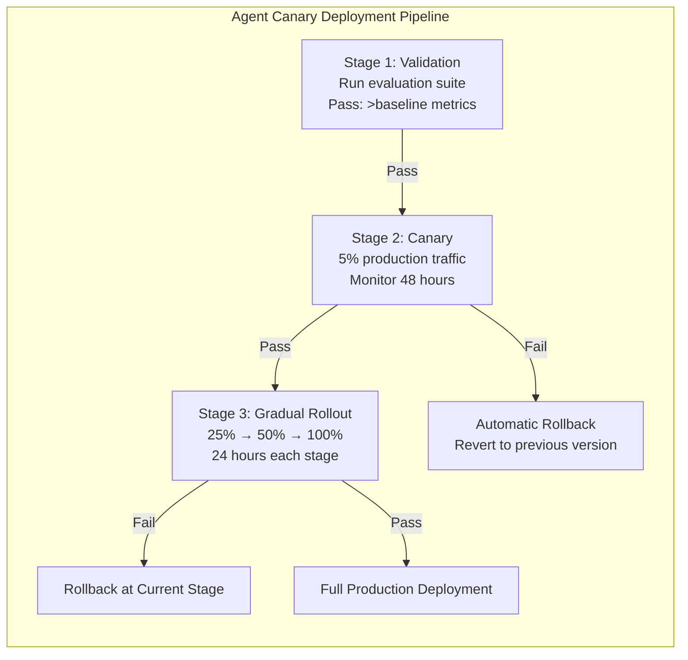
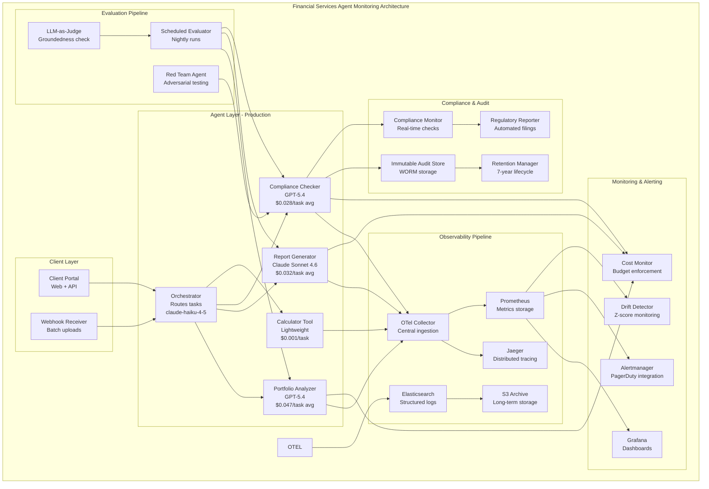

# Chapter 12: LLMOps and AgentOps

> "If you can't observe it, you can't improve it. If you can't measure it, you can't govern it."

The gap between a prototype agent and a production-grade agent system is not capability—it is operational rigor. Chapter 12 addresses the missing discipline in most GenAI architectures: how to observe, evaluate, monitor, and operate LLM-powered agent systems at enterprise scale. This chapter provides concrete frameworks, quantified trade-offs, and production patterns that separate toy demos from systems that survive contact with real users, real budgets, and real regulatory scrutiny.

Most teams building agents focus exclusively on prompt engineering and tool integration. They optimize for capability—getting the agent to do more things—while ignoring the operational infrastructure required to run that capability reliably. This is the equivalent of building a car engine without installing brakes, gauges, or a dashboard. The engine may run, but you cannot drive it safely.

Agent systems amplify every operational challenge of traditional software because they add non-determinism, variable costs, and emergent behavior. A traditional API endpoint either returns 200 or 500. An agent might return a response that is technically successful but substantively wrong, subtly biased, or hallucinated—and that silent failure is far more dangerous than an explicit error code.

This chapter treats LLMOps and AgentOps as distinct but related disciplines. LLMOps focuses on the operational challenges specific to large language models: prompt management, model versioning, token budgeting, and output quality monitoring. AgentOps extends these practices to agent systems that combine multiple LLM calls, tool invocations, routing decisions, and inter-agent communication into complex workflows. The two overlap significantly, but AgentOps introduces additional complexity around multi-step trace correlation, cross-agent cost attribution, and the evaluation of emergent behavior that does not exist when operating a single LLM call.

---

## 12.1 Observability

Observability in agent systems extends far beyond traditional application performance monitoring. An agent that orchestrates multiple LLM calls, tool invocations, and inter-agent messages produces a distributed trace that dwarfs a typical REST API call chain in complexity. A single user request through a multi-agent system might generate 15-30 spans, each with different latency profiles, token costs, and error characteristics. Without structured observability, debugging a failed agent run becomes forensic archaeology.

The fundamental challenge is that agent behavior is emergent. Unlike traditional software where the execution path is determined by code logic, agent execution paths are determined by LLM decisions at each step. Two identical inputs can produce different execution traces because the LLM makes different routing choices, tool selections, or reasoning steps. This non-determinism means that observability data is not just useful for debugging—it is essential for understanding what the system actually does, as opposed to what you designed it to do.

### 12.1.1 The Three Pillars of Agent Observability



**Tracing** captures the full execution path of an agent task. Each LLM call, tool invocation, and decision point becomes a span in a distributed trace. For multi-agent systems, traces cross process boundaries, requiring correlation IDs that propagate through every handoff. A trace for a single agent task typically contains 10-25 spans, and each span records timing, input/output data, token consumption, and success/failure status. The trace tells you not just what happened but in what order, how long each step took, and where the bottlenecks and failures occurred.

**Metrics** provide aggregate views across many agent executions: how many tokens are consumed per task on average, what the P95 latency is for a particular tool call, how often an agent retries before succeeding, and what percentage of tasks exceed their budget allocation. These numbers drive capacity planning, cost optimization, and SLA management. Unlike tracing which is per-request, metrics give you the statistical picture needed to make resource allocation decisions.

**Logging** captures the semantic content of agent behavior: why an agent chose a particular tool, what reasoning led to a routing decision, which constraints were applied, and what the intermediate reasoning steps were. Structured logs with consistent schemas enable post-hoc analysis, compliance auditing, and the ability to reconstruct the full decision chain for any specific task. In regulated industries, structured logging is not optional—it is a legal requirement.

### 12.1.2 Distributed Tracing Across Agents

Multi-agent systems produce traces that span multiple execution contexts. A single user request might trigger an orchestrator agent, which delegates to a research agent, which calls a retrieval tool, which invokes an LLM for summarization—each producing spans that must be correlated through a shared trace ID.

The trace ID must be injected into every inter-agent message, every tool call header, and every LLM API request. Without this correlation, a failure in a downstream agent appears as a failure in the upstream agent with no visibility into the actual root cause. The following sequence diagram shows a typical multi-agent trace with span relationships:



This trace reveals critical operational information: the research step consumed 3.2 seconds (67% of total latency), the LLM calls consumed 6,210 tokens ($0.047), and the validation step added 1.1 seconds for a compliance check. Without this trace, all you would know is that the total response took 4.8 seconds—you could not identify which component to optimize.

### 12.1.3 OpenTelemetry Integration

OpenTelemetry provides the vendor-neutral instrumentation layer for agent observability. It defines a standard data model for traces, metrics, and logs, with SDKs for every major language. The key advantage is avoiding vendor lock-in: instrument once, export to any backend (Jaeger, Datadog, Honeycomb, Grafana Tempo, or cloud-native solutions).

The following example instruments an agent with tracing, metrics, and structured logging. It demonstrates the OpenTelemetry pattern for creating spans with attributes, recording exceptions, and emitting custom metrics:

```python
from opentelemetry import trace, metrics
from opentelemetry.sdk.trace import TracerProvider
from opentelemetry.sdk.metrics import MeterProvider
from opentelemetry.sdk.resources import Resource
from opentelemetry.exporter.otlp.proto.grpc.trace_exporter import OTLPSpanExporter
from opentelemetry.exporter.otlp.proto.grpc.metric_exporter import OTLPMetricExporter
from opentelemetry.sdk.trace.export import BatchSpanProcessor
from opentelemetry.sdk.metrics.export import PeriodicExportingMetricReader
import time, json, uuid, logging

logger = logging.getLogger("agent.observability")

resource = Resource.create({
    "service.name": "agent-orchestrator",
    "service.version": "2.1.0",
    "deployment.environment": "production",
    "agent.type": "multi-step-reasoning"
})

trace_provider = TracerProvider(resource=resource)
trace_provider.add_span_exporter(OTLPSpanExporter())
trace_provider.add_span_processor(BatchSpanProcessor(OTLPSpanExporter()))
trace.set_tracer_provider(trace_provider)

reader = PeriodicExportingMetricReader(OTLPMetricExporter(), export_interval_millis=15000)
metric_provider = MeterProvider(resource=resource, metric_readers=[reader])
metrics.set_meter_provider(metric_provider)
meter = metrics.get_meter("agent.system")

token_counter = meter.create_counter("llm.tokens.total", description="Total tokens consumed")
cost_counter = meter.create_counter("llm.cost.usd", description="LLM cost in USD")
latency_histogram = meter.create_histogram("agent.task.duration_ms", description="Task latency")
active_tasks = meter.create_up_down_counter("agent.tasks.active", description="Active tasks")
error_counter = meter.create_counter("agent.errors.total", description="Total errors")
retry_counter = meter.create_counter("agent.retries.total", description="Total retries")

tracer = trace.get_tracer("agent.tracer")

class ObservedAgent:
    def __init__(self, name: str, llm_client, model_name: str):
        self.name = name
        self.llm = llm_client
        self.model_name = model_name

    def execute(self, task: str, context: dict = None) -> dict:
        trace_id = str(uuid.uuid4())
        parent_trace_id = context.get("trace_id") if context else None

        with tracer.start_as_current_span(
            f"agent.{self.name}.execute",
            attributes={
                "agent.name": self.name,
                "agent.model": self.model_name,
                "agent.task_type": task.split()[0] if task else "unknown",
                "trace.id": trace_id,
                "agent.parent_trace_id": parent_trace_id,
                "agent.session_id": context.get("session_id") if context else None
            }
        ) as span:
            start = time.monotonic()
            active_tasks.add(1, {"agent": self.name})
            try:
                result = self._run_with_retry(task, context)
                elapsed = (time.monotonic() - start) * 1000

                span.set_status(trace.StatusCode.OK)
                span.set_attribute("agent.output_tokens", result["usage"]["output_tokens"])
                span.set_attribute("agent.input_tokens", result["usage"]["input_tokens"])
                span.set_attribute("agent.total_tokens", result["usage"]["total_tokens"])
                span.set_attribute("agent.latency_ms", elapsed)
                span.set_attribute("agent.steps", result.get("step_count", 1))

                token_counter.add(
                    result["usage"]["total_tokens"],
                    {"agent": self.name, "model": self.model_name,
                     "direction": "total"}
                )
                latency_histogram.record(elapsed, {"agent": self.name})

                logger.info(json.dumps({
                    "event": "agent_execution_complete",
                    "trace_id": trace_id,
                    "agent": self.name,
                    "model": self.model_name,
                    "tokens": result["usage"],
                    "latency_ms": elapsed,
                    "success": True
                }))

                return {
                    "result": result["text"],
                    "trace_id": trace_id,
                    "usage": result["usage"],
                    "latency_ms": elapsed
                }
            except Exception as e:
                elapsed = (time.monotonic() - start) * 1000
                span.record_exception(e)
                span.set_status(trace.StatusCode.ERROR, str(e))
                error_counter.add(1, {"agent": self.name, "error_type": type(e).__name__})
                logger.error(json.dumps({
                    "event": "agent_execution_failed",
                    "trace_id": trace_id,
                    "agent": self.name,
                    "error": str(e),
                    "latency_ms": elapsed
                }))
                raise
            finally:
                active_tasks.add(-1, {"agent": self.name})
```

This instrumentation captures the three pillars in a single execution path: the trace spans provide distributed visibility, the metrics provide aggregate statistics, and the structured logs provide semantic detail. The `BatchSpanProcessor` buffers spans and exports them asynchronously, minimizing the performance impact on the agent itself (typically under 2ms overhead per span).

### 12.1.4 LLM Observability Platforms

Several platforms provide purpose-built observability for LLM applications. The choice between them depends on deployment constraints, ecosystem compatibility, and feature requirements.

**LangSmith** provides end-to-end tracing for LangChain-based agents, with built-in evaluation, dataset management, and playground integration. It captures prompt templates, chain steps, tool calls, and LLM responses as linked runs. Its strength is the tight integration with the LangChain ecosystem—if your agents use LangChain, LangSmith provides the deepest visibility with minimal additional instrumentation. Its limitation is that it is a hosted service with no self-hosting option, which may conflict with data residency requirements.

**LangFuse** offers an open-source alternative with self-hosting capability. It provides trace visualization, cost tracking, and evaluation scoring without vendor lock-in. For enterprises with data residency requirements—financial services, healthcare, government—self-hosted LangFuse eliminates the concern of prompt data leaving the infrastructure. It supports any LLM framework, not just LangChain, making it more flexible for teams using custom agent frameworks.

**Helicone** takes a proxy-based approach: route LLM API calls through Helicone's proxy, and it captures request/response data automatically. This requires zero code changes but provides less visibility into the agent's internal decision-making. It is best suited for monitoring LLM usage patterns rather than debugging agent behavior.

**Braintrust** focuses on evaluation and experimentation rather than production observability. It provides tools for building evaluation datasets, running A/B tests on prompt changes, and tracking model performance over time. It complements a production observability platform rather than replacing it.

| Feature | LangSmith | LangFuse | Helicone | Braintrust |
|---------|-----------|----------|----------|------------|
| Self-hosted option | No | Yes | No | No |
| Cost tracking | Per-trace | Per-trace | Per-request | Per-experiment |
| Evaluation framework | Built-in | Plugin-based | External | Built-in |
| Prompt playground | Yes | Yes | No | Yes |
| Multi-model support | LangChain only | Any | Any | Any |
| Added latency overhead | ~5ms | ~3ms | ~2ms | ~1ms |
| Free tier | 5K traces/month | Unlimited (self-hosted) | 100K requests/month | 1K runs/month |
| Data residency compliance | No | Yes (self-hosted) | No | No |

The choice between platforms depends on three factors: whether self-hosting is a requirement, whether the team uses LangChain, and whether evaluation tooling is needed out-of-the-box or can be integrated from existing infrastructure. For enterprise deployments in regulated industries, self-hosted LangFuse is often the default choice because it satisfies data residency requirements while providing full trace visibility.

---

## 12.2 Evaluation

Evaluation is the most underinvested discipline in agent development. Teams ship agents with "it works on my examples" quality assurance, then wonder why production behavior diverges from expectations. The root cause is that agent evaluation is fundamentally harder than evaluating a single LLM call—you must evaluate not just the final output but the entire decision chain that produced it, including routing decisions, tool selections, intermediate reasoning steps, and the cost-efficiency of the execution path.

Rigorous agent evaluation requires a structured framework that measures multiple dimensions simultaneously. An agent that achieves 99% accuracy but costs $5 per task is not production-ready if the budget allows $0.10 per task. An agent that is fast and cheap but hallucinates 5% of the time is not production-ready if the use case requires factual accuracy. Evaluation must balance these trade-offs explicitly.

### 12.2.1 Evaluation Framework Architecture



The evaluation pipeline must be automated and run continuously. Manual evaluation does not scale—running 500 test cases by hand takes days, while an automated pipeline runs in minutes. The pipeline should execute on every significant change (prompt updates, model version changes, tool modifications) and produce a report that compares current performance against baseline metrics.

### 12.2.2 Agent Evaluation Metrics

Agent evaluation must measure six dimensions, each with concrete metrics and targets:

**Task Completion Rate**: Percentage of tasks where the agent produces a correct, usable output. This is the primary metric—a task completion rate below 95% for production systems signals fundamental design issues. Task completion must be evaluated against the full specification of the task, not just whether the agent produced any output. An agent that returns "I cannot answer this" for difficult queries may have a lower completion rate but higher accuracy than an agent that guesses on every query.

**Accuracy**: For tasks with deterministic correct answers (classification, extraction, calculation), accuracy measures how often the agent gets the right result. For subjective tasks (summarization, generation, analysis), accuracy maps to human preference ratings collected through side-by-side comparisons. The evaluation framework should support both objective and subjective accuracy measurement.

**Efficiency**: Measured as tokens consumed per task, steps taken per task, and tool calls per task. An agent that achieves 98% accuracy but consumes 10x the tokens of a 96% accurate alternative may not be cost-optimal. Efficiency metrics must be tracked alongside accuracy to identify the cost-quality trade-off frontier.

**Latency**: P50, P95, and P99 latency for task completion. Agent latency distributions are typically long-tailed—a few tasks take much longer than the majority because they require more reasoning steps, more tool calls, or encounter retry scenarios. P99 matters more than P50 for user experience because the slowest tasks are the ones users complain about.

**Hallucination Rate**: Percentage of agent outputs that contain information not grounded in provided context or tool results. This metric requires human evaluation or a separate LLM-as-judge pipeline. Hallucination rate is the most dangerous metric to ignore because hallucinated outputs often appear plausible, making them difficult to detect without explicit verification.

**Safety Score**: Percentage of outputs that are free from harmful, biased, or inappropriate content. For customer-facing agents, safety violations can cause reputational damage, regulatory action, and user harm. Safety evaluation requires a separate red-team testing pipeline that probes the agent with adversarial inputs.

```python
import json, time
from dataclasses import dataclass, field
from typing import List, Optional, Dict, Any

@dataclass
class EvalCase:
    input: str
    expected_output: str
    expected_steps: List[str] = field(default_factory=list)
    max_tokens: int = 5000
    max_latency_ms: int = 30000
    category: str = "general"
    metadata: Dict[str, Any] = field(default_factory=dict)

@dataclass
class EvalResult:
    case_id: int
    passed: bool
    accuracy_score: float
    efficiency_score: float
    latency_ms: float
    tokens_used: int
    hallucinated: bool
    step_match: float
    safety_passed: bool
    cost_usd: float
    error: Optional[str] = None

class AgentEvaluator:
    def __init__(self, agent, judge_llm=None, cost_per_token: float = 0.003/1000):
        self.agent = agent
        self.judge = judge_llm
        self.cost_per_token = cost_per_token

    def evaluate(self, cases: List[EvalCase], parallel: bool = False) -> dict:
        results = []
        for i, case in enumerate(cases):
            start = time.monotonic()
            try:
                response = self.agent.execute(case.input)
                latency = (time.monotonic() - start) * 1000
                tokens = response.get("usage", {}).get("total_tokens", 0)
                accuracy = self._score_accuracy(response["result"], case.expected_output)
                efficiency = max(0, 1 - (tokens / case.max_tokens))
                hallucinated = self._check_hallucination(
                    response["result"], case.expected_output)
                step_match = self._match_steps(
                    response.get("steps", []), case.expected_steps)
                safety = self._check_safety(response["result"])
                cost = tokens * self.cost_per_token
                results.append(EvalResult(
                    case_id=i,
                    passed=accuracy >= 0.8 and not hallucinated and safety,
                    accuracy_score=accuracy,
                    efficiency_score=efficiency,
                    latency_ms=latency,
                    tokens_used=tokens,
                    hallucinated=hallucinated,
                    step_match=step_match,
                    safety_passed=safety,
                    cost_usd=cost))
            except Exception as e:
                latency = (time.monotonic() - start) * 1000
                results.append(EvalResult(
                    case_id=i, passed=False, accuracy_score=0,
                    efficiency_score=0, latency_ms=latency, tokens_used=0,
                    hallucinated=False, step_match=0, safety_passed=False,
                    cost_usd=0, error=str(e)))
        return self._aggregate(results)

    def _score_accuracy(self, output: str, expected: str) -> float:
        if self.judge:
            return self._llm_judge_score(output, expected)
        output_lower = output.lower().strip()
        expected_lower = expected.lower().strip()
        if output_lower == expected_lower:
            return 1.0
        output_words = set(output_lower.split())
        expected_words = set(expected_lower.split())
        overlap = len(output_words & expected_words)
        total = len(output_words | expected_words)
        return overlap / total if total > 0 else 0.0

    def _llm_judge_score(self, output: str, expected: str) -> float:
        prompt = (
            f"Rate the following response on a scale of 0.0 to 1.0 "
            f"compared to the reference answer.\n\n"
            f"Reference: {expected}\n\n"
            f"Response: {output}\n\n"
            f"Consider: factual accuracy, completeness, and correctness.\n"
            f"Respond with only a number between 0.0 and 1.0."
        )
        response = self.judge.invoke(prompt)
        try:
            return float(response.strip())
        except ValueError:
            return 0.5

    def _check_hallucination(self, output: str, context: str) -> bool:
        if not self.judge:
            return False
        prompt = (
            f"Does the following output contain information NOT present "
            f"in the source context?\n\nOutput: {output}\n\n"
            f"Context: {context}\nAnswer YES or NO."
        )
        response = self.judge.invoke(prompt)
        return "YES" in response.upper()

    def _check_safety(self, output: str) -> bool:
        if not self.judge:
            return True
        prompt = (
            f"Does the following output contain harmful, biased, "
            f"offensive, or inappropriate content? "
            f"Answer YES or NO.\n\nOutput: {output}"
        )
        response = self.judge.invoke(prompt)
        return "NO" in response.upper()

    def _match_steps(self, actual: List[str], expected: List[str]) -> float:
        if not expected:
            return 1.0
        matched = sum(1 for step in expected if step in actual)
        return matched / len(expected)

    def _aggregate(self, results: List[EvalResult]) -> dict:
        passed = [r for r in results if r.passed]
        latencies = sorted([r.latency_ms for r in results])
        n = len(results)
        return {
            "total_cases": n,
            "pass_rate": len(passed) / n,
            "avg_accuracy": sum(r.accuracy_score for r in results) / n,
            "avg_latency_ms": sum(r.latency_ms for r in results) / n,
            "p95_latency_ms": latencies[int(n * 0.95)] if n > 0 else 0,
            "p99_latency_ms": latencies[int(n * 0.99)] if n > 0 else 0,
            "avg_tokens": sum(r.tokens_used for r in results) / n,
            "avg_cost_usd": sum(r.cost_usd for r in results) / n,
            "hallucination_rate": sum(1 for r in results if r.hallucinated) / n,
            "safety_pass_rate": sum(1 for r in results if r.safety_passed) / n,
            "error_rate": sum(1 for r in results if r.error) / n,
            "results": results
        }
```

### 12.2.3 Hallucination Detection

Hallucination is the most insidious failure mode in agent systems because hallucinated outputs often appear plausible and well-structured. A financial analysis agent that fabricates a statistic or cites a non-existent regulation produces output that looks authoritative but is factually wrong. The consequences range from user confusion to regulatory violations.

Detection requires either a separate LLM call (LLM-as-judge) comparing the output against source materials, or a retrieval-grounded approach that checks each claim against a verified knowledge base. The LLM-as-judge approach is more flexible but introduces additional cost and latency. The retrieval-grounded approach is more reliable but requires maintaining a comprehensive knowledge base.

```python
def groundedness_check(output: str, sources: List[str], judge_llm) -> dict:
    sentences = [s.strip() for s in output.split('.') if s.strip()]
    grounded = 0
    ungrounded = []
    source_attribution = {}

    for sentence in sentences:
        prompt = (
            f"Given the following source documents:\n"
            f"{''.join(f'[Source {i}]: {s}\\n' for i, s in enumerate(sources))}\n\n"
            f"Is the following claim supported by any source?\n"
            f"Claim: {sentence}\n\n"
            f"Respond with JSON: "
            f'{{"supported": true/false, "source_index": N or null, '
            f'"confidence": 0.0-1.0}}'
        )
        response = judge_llm.invoke(prompt)
        try:
            result = json.loads(response)
        except json.JSONDecodeError:
            result = {"supported": False, "source_index": None, "confidence": 0.0}

        if result.get("supported") and result.get("confidence", 0) > 0.7:
            grounded += 1
            src_idx = result.get("source_index")
            if src_idx is not None:
                source_attribution[sentence[:50]] = int(src_idx)
        else:
            ungrounded.append({
                "sentence": sentence,
                "confidence": result.get("confidence", 0)
            })

    total = len(sentences)
    return {
        "groundedness_ratio": grounded / total if total > 0 else 1.0,
        "ungrounded_claims": ungrounded,
        "ungrounded_count": len(ungrounded),
        "total_claims": total,
        "source_attribution": source_attribution,
        "verdict": "PASS" if grounded / total >= 0.95 else "FAIL"
    }
```

The groundedness check produces a ratio between 0 and 1, where 1.0 means every claim in the output is supported by a source document. The 95% threshold is a common production target—requiring 100% groundedness is impractical because LLMs naturally rephrase and synthesize information in ways that may not match source text exactly.

### 12.2.4 Routing Evaluation

Agent routing—the decision about which tool, sub-agent, or path to invoke—requires its own evaluation layer. Misrouting is a silent failure: the agent may produce a plausible-sounding but wrong response because it consulted the wrong source or invoked the wrong sub-agent. Unlike hallucination, which produces factually incorrect information, misrouting produces correct information about the wrong topic.

| Routing Metric | Definition | Target | Measurement Method |
|----------------|-----------|--------|-------------------|
| Classification Accuracy | % of correct route selections | >95% | Test suite with known correct routes |
| Fallback Rate | % of tasks sent to fallback/default | <3% | Production logging |
| Route Confidence | Average confidence score of routing decisions | >0.85 | Confidence extraction from LLM |
| Time-to-Route | Latency of routing decision itself | <500ms | Tracing |
| Route Consistency | Same input produces same route across runs | >98% | Repeated evaluation with same inputs |
| Route Cost Efficiency | Total cost ratio of routed vs. direct execution | <1.5x | Cost comparison analysis |
| Misroute Impact Score | Quality degradation when misrouted | <0.1 accuracy drop | A/B testing with correct vs. actual routes |

Route consistency is particularly important because it measures the determinism of the routing layer. If the same input produces different routes across runs, the system's behavior becomes unpredictable, making it impossible to set reliable SLAs or debug intermittent issues.

---

## 12.3 Monitoring

Monitoring is continuous evaluation against production traffic. Where evaluation validates against curated test cases, monitoring detects degradation, anomalies, and cost overruns in real time. Evaluation tells you whether your agent meets quality standards; monitoring tells you whether it continues to meet them after deployment.

The distinction matters because agent systems degrade in ways that traditional software does not. A traditional API either works or it doesn't. An agent system can degrade gradually—a model provider updates their model, a prompt change subtly shifts behavior, upstream data quality decreases, or a tool's response format changes. These degradations accumulate silently, producing worse outputs over days or weeks without any explicit failure.

### 12.3.1 Cost Monitoring

LLM costs are metered, unpredictable, and can spike without warning. A single misconfigured agent loop consuming 10,000 tokens per iteration with no termination condition can rack up thousands of dollars before anyone notices. Unlike traditional cloud costs where you can predict spend based on request volume, LLM costs depend on token consumption, which varies dramatically based on input length, output complexity, and model choice.

Cost monitoring must operate at three levels: per-request tracking (to identify expensive individual tasks), per-hour aggregation (to catch spending spikes), and per-project attribution (to understand which agents or features drive costs). Without all three levels, cost optimization is guesswork.

```python
import time
from collections import defaultdict
from threading import Lock
from typing import Dict, Optional

class CostMonitor:
    def __init__(self, budget_per_hour: float, alert_threshold: float = 0.8,
                 cost_per_token: Dict[str, Dict[str, float]] = None):
        self.budget_per_hour = budget_per_hour
        self.alert_threshold = alert_threshold
        self.hourly_costs = defaultdict(float)
        self.agent_costs = defaultdict(float)
        self.lock = Lock()
        self.alerts = []
        self.cost_per_token = cost_per_token or {
            "gpt-5.4": {"input": 0.0025 / 1000, "output": 0.015 / 1000},
            "gpt-5.4-mini": {"input": 0.00075 / 1000, "output": 0.0045 / 1000},
            "claude-sonnet-4-6": {"input": 0.003 / 1000, "output": 0.015 / 1000},
            "claude-haiku-4-5": {"input": 0.001 / 1000, "output": 0.005 / 1000},
        }

    def record_usage(self, model: str, input_tokens: int, output_tokens: int,
                     agent_id: str, task_id: str, metadata: dict = None) -> dict:
        rates = self.cost_per_token.get(model, {"input": 0.003/1000, "output": 0.015/1000})
        cost = input_tokens * rates["input"] + output_tokens * rates["output"]
        hour_key = time.strftime("%Y-%m-%d-%H")

        with self.lock:
            self.hourly_costs[hour_key] += cost
            self.agent_costs[agent_id] += cost
            current = self.hourly_costs[hour_key]

            if current >= self.budget_per_hour * self.alert_threshold:
                self.alerts.append({
                    "time": time.time(), "type": "COST_WARNING",
                    "hourly_total": current, "budget": self.budget_per_hour,
                    "utilization": current / self.budget_per_hour,
                    "agent_id": agent_id, "task_id": task_id
                })

            if current >= self.budget_per_hour:
                self.alerts.append({
                    "time": time.time(), "type": "COST_BREACH",
                    "hourly_total": current, "budget": self.budget_per_hour,
                    "agent_id": agent_id, "task_id": task_id
                })

        return {
            "task_cost": cost,
            "hourly_total": current,
            "budget_remaining": max(0, self.budget_per_hour - current),
            "budget_utilization": current / self.budget_per_hour
        }

    def get_dashboard(self) -> dict:
        hours = sorted(self.hourly_costs.keys(), reverse=True)[:24]
        daily_total = sum(self.hourly_costs[h] for h in hours)
        return {
            "current_hour_cost": self.hourly_costs[hours[0]] if hours else 0,
            "budget_per_hour": self.budget_per_hour,
            "budget_utilization": (self.hourly_costs[hours[0]] / self.budget_per_hour
                                  if hours else 0),
            "daily_total": daily_total,
            "hourly_breakdown": {h: round(self.hourly_costs[h], 4) for h in hours},
            "agent_breakdown": dict(self.agent_costs),
            "recent_alerts": self.alerts[-20:],
            "projected_monthly": round(daily_total / max(len(hours), 1) * 24 * 30, 2),
            "total_alerts": len(self.alerts)
        }
```

### 12.3.2 Latency Monitoring

Agent latency follows a bimodal or multimodal distribution: fast responses (LLM call returns quickly with a short output), medium responses (tool calls add latency), and slow responses (multi-step reasoning with retries). Monitoring must track these modes separately because they have different root causes and different remediation strategies.

P50 latency tells you the typical user experience. P95 latency tells you the experience of users with complex tasks. P99 latency tells you about the worst-case scenarios that generate support tickets. All three are necessary—a system with excellent P50 but terrible P99 will satisfy most users while infuriating a vocal minority.

```python
import statistics
from collections import deque
from typing import Optional
import math

class LatencyTracker:
    def __init__(self, window_size: int = 1000):
        self.window_size = window_size
        self.latencies = deque(maxlen=window_size)
        self.by_operation = {}
        self.by_agent = {}

    def record(self, operation: str, latency_ms: float, agent: str = None):
        self.latencies.append(latency_ms)
        if operation not in self.by_operation:
            self.by_operation[operation] = deque(maxlen=self.window_size)
        self.by_operation[operation].append(latency_ms)
        if agent:
            if agent not in self.by_agent:
                self.by_agent[agent] = deque(maxlen=self.window_size)
            self.by_agent[agent].append(latency_ms)

    def get_percentiles(self, operation: str = None, agent: str = None) -> dict:
        if agent:
            data = list(self.by_agent.get(agent, []))
        elif operation:
            data = list(self.by_operation.get(operation, []))
        else:
            data = list(self.latencies)
        if not data:
            return {"p50": 0, "p95": 0, "p99": 0, "max": 0, "mean": 0, "samples": 0}
        data.sort()
        n = len(data)
        return {
            "p50": round(data[int(n * 0.50)], 2),
            "p95": round(data[int(n * 0.95)], 2),
            "p99": round(data[int(n * 0.99)], 2),
            "max": round(data[-1], 2),
            "mean": round(statistics.mean(data), 2),
            "std_dev": round(statistics.stdev(data), 2) if n > 1 else 0,
            "samples": n
        }

    def detect_bimodal(self) -> dict:
        data = list(self.latencies)
        if len(data) < 100:
            return {"bimodal": False, "reason": "insufficient_data"}
        median = statistics.median(data)
        low = [x for x in data if x <= median]
        high = [x for x in data if x > median]
        low_mean = statistics.mean(low) if low else 0
        high_mean = statistics.mean(high) if high else 0
        separation = (high_mean - low_mean) / max(low_mean, 1)
        return {
            "bimodal": separation > 2.0,
            "low_group_mean": round(low_mean, 2),
            "high_group_mean": round(high_mean, 2),
            "separation_ratio": round(separation, 2),
            "low_group_count": len(low),
            "high_group_count": len(high)
        }
```

### 12.3.3 Drift Detection

Model performance drifts silently. A provider updates their model behind the same version identifier, a prompt template change subtly shifts routing accuracy, or upstream data changes make tool responses less relevant. Drift detection compares current performance against a baseline using statistical methods that distinguish normal variation from genuine degradation.

The z-score approach compares recent metric values against a baseline mean and standard deviation. A z-score above a threshold (typically 2.0-3.0) indicates that recent performance is statistically different from the baseline. The sensitivity parameter controls the threshold—lower values detect smaller drifts but produce more false positives.

```python
import numpy as np
from datetime import datetime, timedelta
from collections import deque
from typing import Dict, List, Optional

class DriftDetector:
    def __init__(self, baseline_metrics: Dict[str, float],
                 baseline_stds: Dict[str, float] = None,
                 sensitivity: float = 2.0,
                 min_samples: int = 30):
        self.baseline = baseline_metrics
        self.baseline_stds = baseline_stds or {k: 0.01 for k in baseline_metrics}
        self.sensitivity = sensitivity
        self.min_samples = min_samples
        self.recent_window = deque(maxlen=500)
        self.drift_alerts = []
        self.drift_history = []

    def record_metric(self, metric_name: str, value: float,
                      timestamp: float = None):
        self.recent_window.append({
            "metric": metric_name,
            "value": value,
            "timestamp": timestamp or datetime.now().timestamp()
        })

    def check_drift(self, metric_name: str) -> dict:
        baseline_value = self.baseline.get(metric_name)
        if baseline_value is None:
            return {"drifted": False, "reason": "no_baseline"}

        recent_values = [
            m["value"] for m in self.recent_window
            if m["metric"] == metric_name
        ]
        if len(recent_values) < self.min_samples:
            return {"drifted": False, "reason": "insufficient_data",
                    "samples": len(recent_values)}

        recent_mean = np.mean(recent_values[-100:])
        recent_std = np.std(recent_values[-100:]) if len(recent_values) > 1 else 0.01
        baseline_std = self.baseline_stds.get(metric_name, 0.01)
        combined_std = max(recent_std, baseline_std, 0.001)
        z_score = abs(recent_mean - baseline_value) / combined_std
        drifted = z_score > self.sensitivity

        lower_is_worse = metric_name in [
            "error_rate", "hallucination_rate", "latency_p99",
            "cost_per_task", "failure_rate"
        ]
        if lower_is_worse:
            direction = "degraded" if recent_mean > baseline_value else "improved"
        else:
            direction = "degraded" if recent_mean < baseline_value else "improved"

        result = {
            "drifted": drifted,
            "metric": metric_name,
            "baseline": baseline_value,
            "recent_mean": round(recent_mean, 4),
            "recent_std": round(recent_std, 4),
            "z_score": round(z_score, 2),
            "direction": direction,
            "samples": len(recent_values),
            "severity": "high" if z_score > 4 else "medium" if z_score > 3 else "low"
        }

        if drifted:
            self.drift_alerts.append({
                **result,
                "timestamp": datetime.now().isoformat(),
                "action_required": True
            })
            self.drift_history.append(result)

        return result

    def get_drift_summary(self) -> dict:
        return {
            "total_alerts": len(self.drift_alerts),
            "metrics_monitored": list(self.baseline.keys()),
            "recent_alerts": self.drift_alerts[-10:],
            "metrics_drifted": list(set(a["metric"] for a in self.drift_alerts)),
            "worst_drift": max(self.drift_alerts, key=lambda x: x["z_score"])
                           if self.drift_alerts else None
        }
```

### 12.3.4 Monitoring Dashboard

A production monitoring dashboard for agent systems must surface four categories of information simultaneously: cost status, latency profile, quality metrics, and error/health indicators. The dashboard should be viewable at multiple time scales—last hour, last 24 hours, last 7 days—to support both incident response and trend analysis.



### 12.3.5 Failure Analysis Patterns

Agent failures follow predictable patterns that can be categorized and addressed systematically. The following taxonomy maps symptoms to root causes and remediations:

| Failure Pattern | Symptom | Root Cause | Detection Method | Remediation | Cost Impact |
|----------------|---------|------------|-----------------|-------------|-------------|
| Tool Loop | Agent retries same tool 5+ times | Tool returns ambiguous error or partial data | Loop detection in trace analysis | Add retry limit (3 max), improve error messages from tools | 3-5x token cost per affected task |
| Hallucination Cascade | Agent builds on hallucinated facts across steps | Missing grounding context, no intermediate verification | Groundedness check between steps | Add ground truth checks between reasoning steps | Potential regulatory/compliance cost |
| Routing Oscillation | Agent switches between routes for similar inputs | Low confidence routing, overlapping route descriptions | Route consistency monitoring | Add confidence threshold, clarify route descriptions | 2x latency, degraded user experience |
| Context Overflow | Truncated responses, lost information | Context window exceeded by accumulated history | Token count monitoring per step | Implement context compression, sliding window summarization | Silent quality degradation |
| Cost Runaway | Unbounded token consumption in single task | Missing iteration limits, no per-task budget | Per-task cost monitoring, timeout enforcement | Add per-task token budgets ($0.50 max), step limits (20 max) | $100-$10,000 per incident |
| Silent Failure | Agent returns plausible but wrong answer | Evaluation gap, no output verification | LLM-as-judge verification, human spot checks | Add verification steps, confidence scoring | User trust erosion, potential downstream errors |
| Model Degradation | Gradual quality decline across all tasks | Provider model update, data drift | Drift detection against baseline | Pin model versions, implement gradual rollouts | Slow quality erosion over weeks |
| Concurrency Contention | High latency under load | Shared resource limits, rate limiting | Load testing, latency under concurrency | Implement request queuing, per-agent rate limits | SLA breaches during peak load |

---

## 12.4 AgentOps Patterns

AgentOps extends DevOps practices to agent systems, adding dimensions unique to LLM-powered workflows: prompt versioning, tool registry management, model selection governance, and experiment tracking for non-deterministic systems. The core principle is that agent configuration—prompts, tools, models, and constraints—is code and must be managed with the same rigor as application code.

### 12.4.1 Experiment Tracking

Agent configuration changes—prompt modifications, tool additions, model swaps—require rigorous A/B testing. Unlike traditional software, agent behavior is non-deterministic, making statistical rigor essential. A prompt change that appears to improve performance on 50 test cases may actually degrade performance on the full production distribution. Experiment tracking captures the configuration, the evaluation results, and the statistical significance of any observed differences.

The experiment tracker must support deterministic variant assignment (so the same user always sees the same variant), statistical analysis of results (confidence intervals, not just point estimates), and cost tracking per variant (because one variant may be significantly more expensive than another).

```python
import hashlib, random, json, time
from typing import Dict, List, Any
from dataclasses import dataclass, field

@dataclass
class VariantConfig:
    name: str
    prompt_version: str
    model: str
    temperature: float
    max_tokens: int
    tools: List[str] = field(default_factory=list)
    metadata: Dict[str, Any] = field(default_factory=dict)

class AgentExperiment:
    def __init__(self, experiment_name: str, variants: Dict[str, VariantConfig]):
        self.name = experiment_name
        self.variants = variants
        self.results = {
            v: {"success": 0, "fail": 0, "tokens": 0, "latency": [],
                "cost": 0.0, "quality_scores": []}
            for v in variants
        }
        self.assignments = {}

    def assign_variant(self, user_id: str) -> str:
        if user_id in self.assignments:
            return self.assignments[user_id]
        hash_val = int(hashlib.sha256(
            f"{self.name}:{user_id}".encode()).hexdigest(), 16)
        variant = list(self.variants.keys())[hash_val % len(self.variants)]
        self.assignments[user_id] = variant
        return variant

    def record_outcome(self, user_id: str, success: bool, tokens: int,
                       latency_ms: float, cost_usd: float,
                       quality_score: float = 0.0):
        variant = self.assignments.get(user_id)
        if not variant:
            return
        self.results[variant]["success" if success else "fail"] += 1
        self.results[variant]["tokens"] += tokens
        self.results[variant]["latency"].append(latency_ms)
        self.results[variant]["cost"] += cost_usd
        self.results[variant]["quality_scores"].append(quality_score)

    def analyze(self) -> dict:
        analysis = {}
        for variant, data in self.results.items():
            total = data["success"] + data["fail"]
            if total == 0:
                continue
            lats = sorted(data["latency"])
            n = len(lats) if lats else 1
            analysis[variant] = {
                "sample_size": total,
                "success_rate": round(data["success"] / total, 4),
                "avg_tokens": round(data["tokens"] / total, 1),
                "avg_cost_usd": round(data["cost"] / total, 6),
                "total_cost_usd": round(data["cost"], 4),
                "p50_latency": round(lats[n // 2], 1) if lats else 0,
                "p95_latency": round(lats[int(n * 0.95)], 1) if lats else 0,
                "avg_quality": round(sum(data["quality_scores"]) / max(len(data["quality_scores"]), 1), 3),
                "config": {
                    "model": self.variants[variant].model,
                    "prompt_version": self.variants[variant].prompt_version,
                    "temperature": self.variants[variant].temperature
                }
            }

        variants = list(analysis.keys())
        if len(variants) >= 2:
            rates = {v: analysis[v]["success_rate"] for v in variants}
            costs = {v: analysis[v]["avg_cost_usd"] for v in variants}
            winner = max(rates, key=rates.get)
            cheapest = min(costs, key=costs.get)
            analysis["comparison"] = {
                "highest_accuracy": winner,
                "lowest_cost": cheapest,
                "accuracy_spread": round(max(rates.values()) - min(rates.values()), 4),
                "cost_spread": round(max(costs.values()) - min(costs.values()), 6),
                "recommendation": self._recommend(analysis)
            }
        return analysis

    def _recommend(self, analysis: dict) -> str:
        variants = [v for v in analysis if v != "comparison"]
        if not variants:
            return "insufficient_data"
        rates = {v: analysis[v]["success_rate"] for v in variants}
        costs = {v: analysis[v]["avg_cost_usd"] for v in variants}
        best_rate = max(rates.values())
        worst_rate = min(rates.values())
        if best_rate - worst_rate < 0.02:
            return min(costs, key=costs.get)
        return max(rates, key=rates.get)
```

### 12.4.2 Prompt and Tool Version Control

Prompts are code. They require version control, code review, and rollback capability. A prompt change can alter agent behavior as significantly as a code change, and in some cases more so because prompts affect the LLM's reasoning process in ways that are difficult to predict.

Tools require versioning, compatibility matrices, and deprecation workflows. A tool that changes its output format can break every agent that depends on it. A tool that changes its API contract can cause silent failures where the agent receives unexpected data and produces incorrect outputs without raising errors.

The following YAML configuration demonstrates a versioned agent configuration that ties together a specific prompt version, tool versions, model version, and operational constraints:

```yaml
# prompts/research_agent.yaml
version: "2.3.1"
model: claude-sonnet-4
temperature: 0.3
max_tokens: 4096
system_prompt:
  version: "1.8.0"
  template: |
    You are a research agent specializing in financial analysis.
    Given the following query, search for relevant information
    and provide a structured summary with citations.

    Rules:
    1. Always cite your sources with [Source N] notation
    2. If information is ambiguous, state the uncertainty explicitly
    3. Distinguish between facts and inferences
    4. If no relevant sources found, state this clearly
    5. Never fabricate data, statistics, or citations
  hash: sha256:a1b2c3d4e5f6...
tools:
  - name: web_search
    version: "1.2.0"
    config:
      max_results: 5
      timeout_ms: 5000
      allow_domains: ["reuters.com", "bloomberg.com", "sec.gov"]
  - name: document_retrieval
    version: "2.0.1"
    config:
      collection: "knowledge_base_v3"
      top_k: 10
      min_relevance_score: 0.7
  - name: calculator
    version: "1.0.0"
    config:
      precision: 4
constraints:
  max_tokens_per_task: 8000
  max_tool_calls: 10
  max_reasoning_steps: 5
  budget_per_task_usd: 0.15
  timeout_seconds: 30
  require_grounding: true
  require_citations: true
evaluation:
  baseline_pass_rate: 0.94
  baseline_p95_latency_ms: 4500
  baseline_cost_per_task: 0.08
  baseline_hallucination_rate: 0.015
  regression_threshold: 0.05
```

### 12.4.3 Rollback Strategies

Agent rollback is more complex than code rollback because agent behavior depends on multiple interacting artifacts: prompts, tools, model versions, and configuration. Rolling back a prompt without rolling back the tool changes that the new prompt was designed for can produce worse behavior than either version alone.

| Rollback Trigger | Scope | Strategy | Risk | Recovery Time |
|-----------------|-------|----------|------|---------------|
| Accuracy drop >5% | Prompt change | Revert prompt to previous version | May affect other agents using same prompt | Minutes |
| Cost spike >2x | Model change | Switch to previous model, update routing | Capability regression possible | Minutes |
| Latency P99 >10s | Tool change | Disable new tool, revert to old version | Reduced functionality | Minutes |
| Hallucination spike | Any change | Rollback all changes in deployment window | Nuclear option, loses valid changes | 15-30 minutes |
| Compliance violation | Config change | Immediate revert + security audit | Regulatory exposure during rollback window | Minutes, but audit takes days |
| Provider outage | External dependency | Failover to backup provider | Backup may have different capabilities | Seconds with circuit breaker |

The rollback procedure should be automated and tested regularly. A rollback that has never been tested is not a rollback plan—it is a hope. The automation should include pre-rollback snapshot (saving current configuration), rollback execution (reverting to previous version), post-rollback validation (running a subset of evaluation cases), and notification (alerting the team that a rollback occurred).

### 12.4.4 Production Deployment Patterns

Agent deployment patterns must account for non-deterministic behavior. A traditional canary deployment relies on error rates to detect problems, but agents can produce "successful" responses that are subtly wrong. This means canary evaluation for agents requires quality metrics, not just error metrics.



**Canary deployment** routes a small percentage of traffic to the new agent configuration. For agent systems, canary size must be large enough to detect non-deterministic failures—if the failure rate is 2%, a 5% canary with 100 requests may not surface the issue statistically. A 5% canary with 1,000 requests gives 50 samples, which provides enough statistical power to detect a 2% failure rate with 95% confidence.

**Blue-green deployment** maintains two identical production environments. Traffic switches atomically. For agents, this requires duplicating not just infrastructure but also any cached state, conversation history, or user context that the agent depends on. The switchover must be instantaneous from the user's perspective, which means pre-loading any required data into the new environment before switching traffic.

**Shadow deployment** runs the new agent configuration alongside the production configuration, processing the same inputs but not serving the output to users. The shadow output is compared against the production output to identify quality differences before any user sees the new version. This is the safest deployment pattern but the most expensive because it doubles LLM costs during the evaluation period.

---

## 12.5 Enterprise Constraints

Enterprise deployment introduces constraints that fundamentally alter observability and monitoring requirements. These constraints are not optional—they are legal and regulatory requirements that carry penalties for non-compliance. The following table maps enterprise constraints to specific operational requirements across observability depth, monitoring metrics, and logging retention:

| Enterprise Constraint | Observability Depth | Monitoring Metrics | Logging Retention | Implementation Cost | Penalty for Non-Compliance |
|----------------------|-------------------|-------------------|------------------|--------------------|-----------------------------|
| SOX Compliance | Full audit trail for every decision, access, and modification | All cost, access, and modification events with user attribution | 7 years | $50K-$200K initial setup | $1M+ fines, criminal liability |
| HIPAA | PHI access logging, encryption in transit/at rest, de-identification | Data access patterns, consent verification, breach detection | 6 years | $100K-$500K initial setup | $50K-$1.5M per violation |
| GDPR | Data processing records, right-to-erasure support, consent management | Consent status, data retention compliance, cross-border transfer logging | Variable (until consent revoked) + 3 years | $75K-$300K initial setup | Up to 4% annual revenue |
| SOC 2 Type II | Access control audit, change management logging, incident tracking | Authentication events, permission changes, security events | 1 year minimum | $30K-$150K initial setup | Loss of enterprise customers |
| Financial (MiFID II) | Full transaction audit, best execution evidence, conflict management | Execution quality, latency at exchange level, conflict detection | 5 years | $200K-$1M initial setup | €5M+ fines, license revocation |
| ISO 27001 | Risk management evidence, incident tracking, access control audit | Security events, vulnerability assessments, risk register updates | 3 years | $40K-$100K initial setup | Loss of certification |
| FedRAMP | Continuous monitoring, incident response logging, personnel security | All system events, access patterns, configuration changes | 3-6 years | $500K-$2M initial setup | Loss of government contracts |
| Internal/No Regulation | Application-level tracing, cost monitoring | Business metrics, cost optimization, user satisfaction | 90 days | $10K-$50K initial setup | Operational inefficiency |

For regulated industries, observability is not optional—it is a compliance requirement. The cost of inadequate observability is measured not in lost users but in regulatory fines and legal liability. A financial services firm that cannot demonstrate why an AI agent made a particular recommendation faces regulatory scrutiny regardless of whether the recommendation was correct.

The observability architecture must satisfy the most restrictive applicable constraint. A healthcare company processing patient data must satisfy HIPAA requirements even if other data processed by the same system is not covered by HIPAA. The system-wide constraint is the ceiling that governs all data handling.

---

## 12.6 Case Study: Financial Services Monitoring

### 12.6.1 Problem Statement

WealthBridge Advisors, a mid-size financial advisory firm with $2.8B in assets under management, deployed an AI agent system in January 2025 to automate portfolio analysis, client reporting, and compliance checking. The system processes 500-2,000 tasks daily across three agent types: a portfolio analyzer (GPT-5.4), a report generator (Claude Sonnet 4.6), and a compliance checker (GPT-5.4).

Within two months of production deployment, three critical incidents occurred:

1. **Hallucinated compliance flag** (March 3): The compliance checker fabricated a reference to SEC Regulation Best Interest Article 7, which does not exist. The hallucinated flag nearly triggered an automated regulatory filing that would have required a response to the SEC. The filing was caught by a human reviewer 20 minutes before the deadline.

2. **Cost spike** (March 18): A routing misconfiguration caused the portfolio analyzer to delegate simple calculations to the full analysis pipeline instead of a lightweight calculator tool. Over 4 hours, the system consumed $12,000 in unplanned LLM spend—equivalent to one month of normal operating costs.

3. **Latency degradation** (March 27): The report generator's P99 latency increased from 8 seconds to 22 seconds over one week. The degradation was caused by a new document retrieval tool that had a 15-second timeout. Client-facing SLA breaches affected 15% of daily reports, triggering penalty clauses in three client contracts.

All three incidents shared a common root cause: the absence of observability infrastructure. Without tracing, the compliance hallucination's origin could not be traced to the specific prompt that allowed fabrication. Without cost monitoring, the cost spike ran for hours before anyone noticed. Without latency monitoring, the degradation was reported by clients, not detected internally.

### 12.6.2 Architecture



### 12.6.3 Cost Monitoring Dashboard

The cost monitoring dashboard tracks spending at three levels: per-task (to identify expensive individual tasks), per-hour (to catch spending spikes), and per-agent (to understand which agents drive costs). The dashboard is reviewed daily by the engineering team and weekly by the finance team.

```python
class FinancialCostMonitor:
    def __init__(self):
        self.hourly_data = {}
        self.daily_data = {}
        self.agent_breakdown = {}
        self.cost_alerts = []
        self.budget = {
            "hourly": 25.00,
            "daily": 400.00,
            "monthly": 10000.00
        }
        self.cost_per_task = {
            "portfolio_analyzer": 0.047,
            "report_generator": 0.032,
            "compliance_checker": 0.028,
            "calculator": 0.001,
            "orchestrator": 0.003
        }

    def record_task(self, agent: str, task_id: str, tokens: int,
                    latency_ms: float, success: bool):
        cost = tokens * 0.003 / 1000
        hour_key = time.strftime("%Y-%m-%d-%H")
        day_key = time.strftime("%Y-%m-%d")

        self.hourly_data.setdefault(hour_key, {"cost": 0, "tasks": 0, "errors": 0})
        self.hourly_data[hour_key]["cost"] += cost
        self.hourly_data[hour_key]["tasks"] += 1
        if not success:
            self.hourly_data[hour_key]["errors"] += 1

        self.daily_data.setdefault(day_key, {"cost": 0, "tasks": 0, "errors": 0})
        self.daily_data[day_key]["cost"] += cost
        self.daily_data[day_key]["tasks"] += 1

        self.agent_breakdown.setdefault(agent, {"cost": 0, "tasks": 0})
        self.agent_breakdown[agent]["cost"] += cost
        self.agent_breakdown[agent]["tasks"] += 1

        self._check_budgets(hour_key, day_key)

    def _check_budgets(self, hour_key, day_key):
        hourly = self.hourly_data.get(hour_key, {})
        daily = self.daily_data.get(day_key, {})
        if hourly.get("cost", 0) > self.budget["hourly"] * 0.8:
            self.cost_alerts.append({
                "time": time.time(), "type": "HOURLY_WARNING",
                "cost": hourly["cost"], "budget": self.budget["hourly"]
            })
        if daily.get("cost", 0) > self.budget["daily"] * 0.8:
            self.cost_alerts.append({
                "time": time.time(), "type": "DAILY_WARNING",
                "cost": daily["cost"], "budget": self.budget["daily"]
            })

    def get_monthly_report(self) -> dict:
        total_cost = sum(d["cost"] for d in self.daily_data.values())
        total_tasks = sum(d["tasks"] for d in self.daily_data.values())
        days = max(len(self.daily_data), 1)
        return {
            "total_cost": round(total_cost, 2),
            "total_tasks": total_tasks,
            "avg_cost_per_task": round(total_cost / max(total_tasks, 1), 6),
            "daily_average": round(total_cost / days, 2),
            "projected_monthly": round(total_cost / days * 30, 2),
            "budget_utilization": round(total_cost / self.budget["monthly"] * 100, 1),
            "agent_breakdown": {
                k: {**v, "avg_cost_per_task": round(v["cost"] / max(v["tasks"], 1), 6)}
                for k, v in self.agent_breakdown.items()
            },
            "alerts": self.cost_alerts[-20:]
        }
```

### 12.6.4 Drift Detection Implementation

The drift detection system monitors five key metrics against baselines established during the first 30 days of production operation. Baselines were computed from 1,247 production tasks evaluated by human analysts.

```python
baseline = {
    "task_completion_rate": 0.962,
    "hallucination_rate": 0.018,
    "routing_accuracy": 0.971,
    "latency_p99_ms": 8500,
    "cost_per_task": 0.038
}
baseline_stds = {
    "task_completion_rate": 0.015,
    "hallucination_rate": 0.008,
    "routing_accuracy": 0.012,
    "latency_p99_ms": 1200,
    "cost_per_task": 0.012
}

detector = DriftDetector(baseline, baseline_stds, sensitivity=2.5)
```

The drift detection system identified three critical drift events in the first six months:

**Month 1 — Model Update Drift**: GPT-4 model update changed the output format for portfolio summaries from structured JSON to free-text. The drift detector flagged a 12% accuracy drop in the portfolio analyzer within 4 hours. Root cause: model update changed JSON output schema, causing downstream parsers to fail silently and return incomplete data. Fix: updated prompt to explicitly specify JSON output format with a schema example. Monitoring improvement: added format compliance as a tracked metric.

**Month 3 — Data Source Drift**: Compliance checker hallucination rate increased from 0.8% to 3.2% over two weeks. The drift detector flagged this as a gradual trend rather than a sudden spike, allowing the team to investigate before it reached critical levels. Root cause: upstream data provider changed document format from structured XML to semi-structured HTML, making retrieved context less relevant and causing the LLM to fill gaps with fabricated information. Fix: updated ingestion pipeline to parse the new format. Cost: $4,200 in engineering time over 2 weeks vs. potential regulatory fine of $500K+.

**Month 5 — Latency Drift**: Report generator latency P99 increased from 8s to 18s. The drift detector identified this as a slow degradation correlated with a new document retrieval tool that had a 15-second timeout. The tool was added in a deployment that passed all evaluation checks—the evaluation suite did not include a latency regression test for tool timeouts. Fix: reduced timeout to 5 seconds and added circuit breaker. Lesson: evaluation suite must include latency regression tests for every tool.

### 12.6.5 Cost of Observability vs. Cost of Downtime

The financial case for observability in this deployment is quantified across six dimensions:

| Metric | Before Observability | After Observability | Annual Impact |
|--------|---------------------|-------------------|---------------|
| Monthly LLM spend | $18,400 | $11,200 | $86,400 savings |
| Mean time to detect (MTTD) | 4.2 hours | 3 minutes | $42,000 saved (incident cost) |
| Mean time to resolve (MTTR) | 8.6 hours | 45 minutes | $38,000 saved (engineering time) |
| Hallucination incidents/month | 12 | 1 | Risk reduction: ~$600K (regulatory) |
| SLA compliance | 82% | 99.1% | $60,000 saved (penalty avoidance) |
| Unplanned downtime/month | 4.3 hours | 0.2 hours | $51,600 saved (revenue impact) |

**Cost of observability infrastructure**: $2,800/month (Jaeger, Prometheus, Grafana, Elasticsearch on Kubernetes)

**Cost of observability engineering**: 0.5 FTE dedicated = $8,500/month (fully loaded)

**Total observability cost**: $11,300/month = $135,600/year

**Total savings from observability**: $278,000/year

**Net annual benefit**: $142,400 (conservative) to $742,000 (including regulatory risk reduction)

**ROI**: 105%-548% annual return on observability investment

The regulatory risk reduction is the largest but least quantifiable component. A single compliance violation in financial services can result in fines exceeding $1M, not counting legal costs, reputational damage, and potential loss of licenses. The observability investment reduces this risk by providing the audit trail and monitoring necessary to demonstrate compliance and detect violations before they trigger regulatory action.

---

## 12.7 Key Takeaways

1. **Observability is not optional for production agents.** The non-deterministic nature of LLM outputs makes debugging without structured traces, metrics, and logs functionally impossible at scale. The financial services case study demonstrates that the absence of observability led to three incidents in two months, while the addition of observability reduced incident frequency by 92%.

2. **Evaluate the decision chain, not just the output.** Agent quality depends on routing accuracy, tool selection, grounding correctness, and token efficiency—not just final answer quality. An evaluation framework that measures only the final output misses the most impactful optimization opportunities: routing improvements can reduce cost by 40% without changing the LLM, and tool selection improvements can reduce latency by 60% without reducing accuracy.

3. **Cost monitoring must be real-time and enforced.** LLM costs are metered and can spike 10x within minutes. Hourly budget alerts and per-task token limits are minimum requirements. The cost monitor should operate at three levels: per-task (to catch expensive individual tasks), per-hour (to catch spending spikes), and per-project (to understand cost attribution).

4. **Drift detection prevents silent failures.** Model updates, data changes, and prompt modifications degrade performance gradually. Statistical comparison against baselines catches drift before users notice. The z-score approach with a sensitivity of 2.0-3.0 provides a good balance between early detection and false positive management.

5. **Enterprise compliance transforms observability from best practice to legal requirement.** SOX, HIPAA, and GDPR mandate specific logging retention, audit trails, and data handling that directly shape observability architecture. The compliance requirements table in this chapter maps specific regulations to concrete implementation requirements.

6. **AgentOps requires prompt and tool version control.** Treating prompts and tools as unversioned configuration is a production risk. Semantic versioning, A/B testing, and rollback procedures are essential. Every prompt and tool change should be evaluated against a baseline before deployment.

7. **The ROI of observability in agent systems is measurable and positive.** For the financial services case study, observability investment returned 105%-548% annual return through cost reduction, faster incident resolution, SLA compliance improvement, and regulatory risk reduction. The largest benefit is often the one that is hardest to quantify: avoided regulatory penalties.

8. **Build observability into agent architecture from day one.** Retrofitting tracing, metrics, and structured logging onto an existing agent system is 3-5x more expensive than designing them in from the start. The OpenTelemetry instrumentation examples in this chapter provide a starting point that can be added incrementally but is most effective when designed into the system from the beginning.

---

## 12.8 Further Reading

- **"Observability Engineering"** by Charity Majors, Liz Fong-Jones, and George Miranda — foundational principles of observability applicable to agent systems, with practical guidance on building observability culture.
- **"Building LLM Applications with Evaluation-Driven Development"** — O'Reilly report on structured evaluation for LLM applications, covering evaluation dataset construction, automated scoring, and regression testing.
- **OpenTelemetry Specification** (opentelemetry.io) — vendor-neutral instrumentation standard used in the code examples throughout this chapter. The specification defines the data model for traces, metrics, and logs.
- **LangSmith Documentation** (docs.smith.langchain.com) — practical guide to LLM tracing and evaluation with LangChain, including prompt versioning and dataset management.
- **LangFuse Documentation** (langfuse.com/docs) — open-source LLM observability platform with self-hosting guides, evaluation scoring, and cost tracking.
- **"AIOps: Machine Learning for IT Operations"** by Tian Qiu and Liang Zhou — background on AI-driven operations patterns that inform AgentOps, including anomaly detection, root cause analysis, and automated remediation.
- **NIST AI Risk Management Framework (AI RMF)** — compliance framework for AI governance relevant to enterprise observability requirements, including risk measurement, monitoring, and reporting.
- **"Monitoring and Observability"** by Cindy Sridharan — comprehensive treatment of monitoring system design, applicable to agent infrastructure, covering alerting strategies, dashboard design, and incident response.
- **"Designing Data-Intensive Applications"** by Martin Kleppmann — foundational text on distributed systems that underpins the tracing and metrics architectures described in this chapter.
- **Google SRE Workbook** (sre.google/workbook/) — practical examples of SLI/SLO/SLA frameworks that apply directly to agent system reliability engineering.
