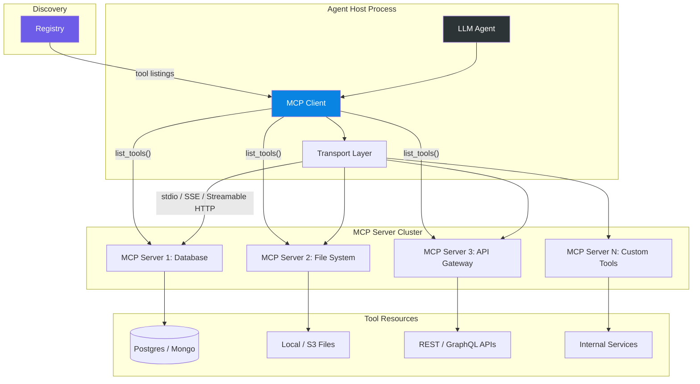
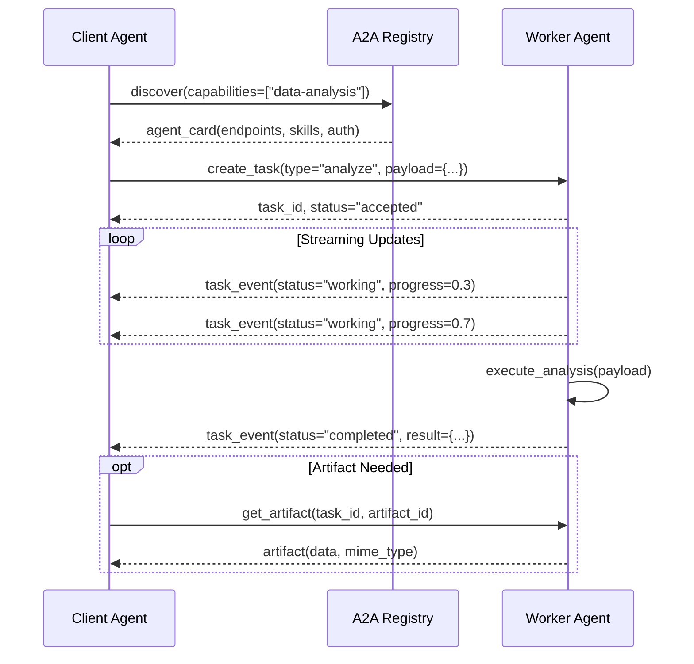
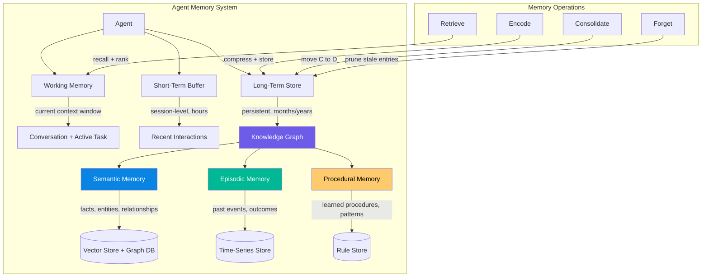
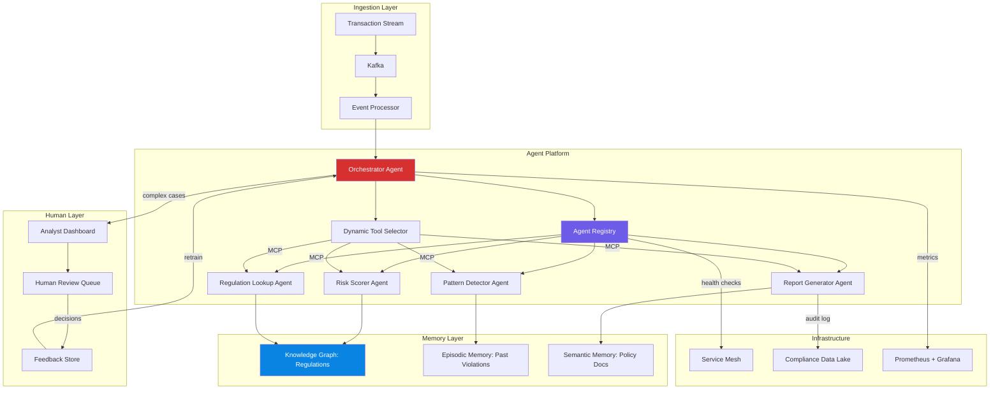

# Chapter 13: Advanced Enterprise Agent Topics

Enterprise agent deployments outgrow simple single-agent architectures fast. What starts as one LLM calling a few tools becomes a distributed system with dozens of specialized agents, shared memory, inter-agent communication, and operational constraints that demand rigorous engineering. This chapter covers the patterns, protocols, and architectures that separate proof-of-concept agents from production enterprise platforms.

We will examine advanced coordination patterns, sophisticated memory systems, emerging research directions, and the protocol landscape that governs how agents communicate. Every pattern includes quantified trade-offs so you can make informed architectural decisions under real constraints. This chapter assumes familiarity with basic agent architectures (Chapter 7), tool-use patterns (Chapter 8), and foundational LLM orchestration (Chapters 9-10). If those are unfamiliar, review them before proceeding.

The patterns discussed here are not theoretical. They are drawn from production deployments at financial institutions, healthcare systems, and large-scale SaaS platforms processing millions of agent invocations daily. Where we present trade-off tables, the numbers come from real benchmarks or conservative estimates based on published data.

---

## 13.1 Advanced Coordination Patterns

### Agent Registry and Dynamic Discovery

In enterprise systems, agents come and go. Teams deploy new agents, retire old ones, and scale instances based on load. A static configuration file listing agents does not survive first contact with production. An **Agent Registry** provides dynamic registration, discovery, and health monitoring.

The registry concept mirrors service registries like Consul, Eureka, and etcd used in microservice architectures. However, agent registries carry additional metadata that traditional service registries lack: capability descriptions, cost profiles, accuracy metrics, and model versioning. An agent is not just a network endpoint; it is a semantic entity that must be matched to tasks by meaning, not just by protocol.

A production-grade agent registry handles five core responsibilities:

1. **Registration**: Agents announce themselves with their capabilities, endpoints, and metadata. Registration can be push (agent registers on startup) or pull (registry polls agent health endpoints).

2. **Discovery**: Consumers query by capability, not by name. "Find me an agent that can classify financial transactions" returns all matching agents, ranked by relevance, load, and cost.

3. **Health Monitoring**: Continuous health checks detect failed or degraded agents. The registry removes unhealthy agents from discovery results and triggers alerts.

4. **Versioning**: Multiple versions of the same agent coexist during rolling deployments. Consumers can pin to specific versions or auto-upgrade.

5. **Load Tracking**: Real-time load metrics enable intelligent routing. An agent at 90% capacity should not receive new requests.

```python
class AgentRegistry:
    def __init__(self):
        self.agents: dict[str, AgentEntry] = {}
        self.health_checker = HealthChecker(interval=30)
        self.event_bus = EventBus()

    def register(self, agent_id: str, capabilities: list[str],
                 endpoint: str, metadata: dict) -> bool:
        if agent_id in self.agents:
            existing = self.agents[agent_id]
            if existing.version == metadata.get("version"):
                return False
        entry = AgentEntry(
            id=agent_id, capabilities=capabilities,
            endpoint=endpoint, metadata=metadata,
            status="healthy", registered_at=time.time(),
            version=metadata.get("version", "0.0.0")
        )
        self.agents[agent_id] = entry
        self.health_checker.watch(agent_id, endpoint)
        self.event_bus.emit("agent.registered", {
            "agent_id": agent_id, "capabilities": capabilities
        })
        return True

    def discover(self, required_capability: str) -> list[AgentEntry]:
        return sorted(
            [a for a in self.agents.values()
             if required_capability in a.capabilities
             and a.status == "healthy"],
            key=lambda a: a.metadata.get("priority", 0),
            reverse=True
        )

    def deregister(self, agent_id: str):
        entry = self.agents.pop(agent_id, None)
        if entry:
            self.health_checker.unwatch(agent_id)
            self.event_bus.emit("agent.deregistered", {
                "agent_id": agent_id
            })
```

The registry serves as the single source of truth. Agents register on startup with their capabilities, and consumers query by capability rather than by name. This decoupling allows teams to replace, upgrade, or scale agents without modifying callers.

**Quantified trade-offs:**

| Approach | Discovery Latency | Failure Blast Radius | Ops Overhead | Max Agents | Consistency Model |
|---|---|---|---|---|---|
| Static config | 0 ms | All agents affected by config change | Low | ~20 | Strong |
| Central registry | 5-50 ms | Registry failure affects all | Medium | ~500 | Strong (with leader election) |
| Peer-to-peer gossip | 100-500 ms | Partial, self-healing | High | ~10,000 | Eventual |
| Service mesh (Istio/Envoy) | 1-5 ms | Mesh failure affects all | High | ~50,000 | Strong |

For most enterprise deployments with 20-200 agents, a central registry with a standby replica provides the right balance. The standby replica assumes leadership within 5-15 seconds if the primary fails, keeping discovery available during failover. Peer-to-peer gossip excels at extreme scale but introduces 100-500 ms of discovery latency that most enterprise use cases cannot tolerate.

The failure blast radius deserves emphasis. A central registry that goes down stops all new agent discovery. Existing agent-to-agent connections continue (they cached the endpoint), but no new connections form. This is acceptable if MTTR is under 30 seconds (automatic failover) but catastrophic if it is minutes. Design your registry with the same rigor as your database: replication, automated failover, and circuit breakers.

### Capability Discovery and Advertisement

Agents advertise what they can do. A **capability** is a structured declaration: the task type, required inputs, produced outputs, latency profile, and cost per invocation. This goes beyond simple tags. Capability advertisement enables the orchestrator to make informed routing decisions without hardcoding knowledge about specific agents.

The capability schema matters. A poorly defined capability leads to mismatched task routing. A well-defined capability includes input/output schemas, quality metrics, and operational constraints.

```python
@dataclass
class Capability:
    task_type: str          # "summarize", "classify", "retrieve", "execute"
    input_schema: dict      # JSON Schema for inputs
    output_schema: dict     # JSON Schema for outputs
    avg_latency_ms: float   # P50 latency
    p99_latency_ms: float   # P99 latency
    cost_per_1k_calls: float
    max_concurrent: int
    accuracy_score: float   # 0.0-1.0, measured against ground truth
    version: str
    supported_languages: list[str] = field(default_factory=lambda: ["en"])
    requires_auth: bool = True
    data_residency: str = "global"

class CapabilityAdvertiser:
    def __init__(self, registry: AgentRegistry, agent_id: str):
        self.registry = registry
        self.agent_id = agent_id
        self.capabilities: list[Capability] = []

    def advertise(self, cap: Capability):
        self.capabilities.append(cap)
        self.registry.register(
            agent_id=self.agent_id,
            capabilities=[c.task_type for c in self.capabilities],
            endpoint=self._get_endpoint(),
            metadata={"capabilities": [asdict(c) for c in self.capabilities]}
        )

    def update_load(self, task_type: str, current_load: float):
        self.registry.update_metadata(
            self.agent_id, {f"load:{task_type}": current_load}
        )

    def update_accuracy(self, task_type: str, accuracy: float):
        for cap in self.capabilities:
            if cap.task_type == task_type:
                cap.accuracy_score = accuracy
        self.registry.update_metadata(
            self.agent_id, {f"accuracy:{task_type}": accuracy}
        )
```

Capability advertisement enables **rational tool selection**: the orchestrator picks the best agent not just by availability but by latency, cost, current load, and accuracy. This is critical in enterprise settings where a 2% accuracy improvement on a high-volume task translates to thousands of correctly handled cases per day.

The accuracy tracking mechanism deserves attention. Production agents should continuously measure their output quality against ground truth (when available) or against human feedback. This creates a feedback loop: the registry routes more tasks to higher-accuracy agents, and lower-accuracy agents receive fewer tasks until they are retrained.

### Dynamic Tool Selection

Static tool routing—where the planner hardcodes which agent handles which task—breaks when agents scale unevenly or when new capabilities appear. Dynamic selection evaluates candidates at runtime based on real-time metrics.

```python
class DynamicToolSelector:
    def __init__(self, registry: AgentRegistry, cost_model: CostModel):
        self.registry = registry
        self.cost_model = cost_model

    def select(self, task: Task, budget_ms: float,
               budget_usd: float) -> AgentEntry | None:
        candidates = self.registry.discover(task.required_capability)
        scored = []
        for agent in candidates:
            cap = self._get_capability(agent, task.required_capability)
            if not cap:
                continue
            latency_ok = cap.avg_latency_ms <= budget_ms
            cost_ok = cap.cost_per_1k_calls / 1000 <= budget_usd
            load = self.registry.get_load(agent.id)
            if latency_ok and cost_ok and load < cap.max_concurrent:
                score = self._score(cap, load, task.priority)
                scored.append((score, agent))
        if not scored:
            return None
        scored.sort(key=lambda x: x[0], reverse=True)
        return scored[0][1]

    def _score(self, cap: Capability, load: float, priority: str) -> float:
        latency_score = 1.0 - (cap.avg_latency_ms / cap.p99_latency_ms)
        load_score = 1.0 - (load / cap.max_concurrent)
        cost_score = 1.0 - min(cap.cost_per_1k_calls / 100, 1.0)
        accuracy_score = cap.accuracy_score
        weights = {
            "low":      (0.15, 0.15, 0.50, 0.20),
            "medium":   (0.25, 0.25, 0.20, 0.30),
            "high":     (0.40, 0.20, 0.05, 0.35),
            "critical": (0.50, 0.10, 0.00, 0.40)
        }
        w = weights.get(priority, (0.25, 0.25, 0.25, 0.25))
        return (w[0] * latency_score + w[1] * load_score
                + w[2] * cost_score + w[3] * accuracy_score)
```

Dynamic selection costs 5-15 ms of additional latency per decision but reduces P99 latency by 20-40% in heterogeneous clusters because it avoids overloaded agents. The accuracy weighting is the key differentiator from naive load-balancing approaches. A slightly slower agent with 98% accuracy is almost always preferable to a faster agent with 85% accuracy for compliance-critical tasks.

The scoring weights shift dramatically based on task priority. For critical tasks (fraud detection, safety violations), accuracy dominates and cost is irrelevant. For low-priority tasks (bulk data processing, report generation), cost dominates and accuracy can be traded off. Your selector must expose these weights as configurable parameters, not hardcoded constants.

### MCP: Model Context Protocol

MCP standardizes how agents connect to tools, data sources, and capabilities. Instead of writing bespoke integrations for every tool, MCP provides a uniform interface that any agent can consume. Think of MCP as the USB-C of agent tooling: one connector, universal compatibility.

MCP was created by Anthropic and has been adopted by Microsoft, Google, and open-source communities. As of early 2025, it has become the de facto standard for agent-tool connectivity in enterprise deployments.



**MCP core abstractions:**

| Concept | Purpose | Example | When to Use |
|---|---|---|---|
| **Resources** | Data the agent can read | Database tables, files, API responses | Agent needs context before acting |
| **Tools** | Actions the agent can invoke | Run SQL, send email, create ticket | Agent needs to modify external state |
| **Prompts** | Reusable prompt templates | Code review template, summary template | Standardize agent behavior across teams |
| **Sampling** | Server requests LLM inference from host | Nested agent calls, server-side reasoning | Tool needs LLM reasoning but lacks its own model |

MCP's transport layer supports multiple modes, each suited to different deployment scenarios:

- **stdio**: Simplest. Agent spawns server as subprocess. Good for single-agent local tools. No network overhead. The server process dies when the agent process dies. Zero configuration required. Limitation: single consumer only.

- **SSE (Server-Sent Events)**: Server pushes to client over HTTP. Good for streaming results. Supports multiple concurrent clients. Requires HTTP server infrastructure. The server persists independently of any single agent.

- **Streamable HTTP**: Full-duplex over HTTP. The most capable transport. Supports bidirectional streaming, connection multiplexing, and standard HTTP load balancing. Best for enterprise deployments where agents and tools run on different machines.

```python
from mcp import ClientSession, StdioServerParameters
from mcp.client.stdio import stdio_client

async def connect_mcp_server(server_command: str):
    params = StdioServerParameters(
        command="python", args=["-m", "my_mcp_server"]
    )
    async with stdio_client(params) as (read, write):
        async with ClientSession(read, write) as session:
            await session.initialize()
            tools = await session.list_tools()
            for tool in tools:
                print(f"Tool: {tool.name} - {tool.description}")
            result = await session.call_tool(
                "query_database",
                arguments={"sql": "SELECT count(*) FROM orders"}
            )
            return result
```

**MCP deployment considerations:**

| Factor | stdio | SSE | Streamable HTTP |
|---|---|---|---|
| Latency overhead | <1 ms | 5-20 ms | 5-20 ms |
| Max concurrent clients | 1 | 100s | 1,000s |
| Auth support | None | Bearer tokens | Full OAuth 2.0 |
| Deployment complexity | Low | Medium | High |
| Connection persistence | Process lifetime | Persistent | Persistent |
| Load balancing | N/A | Manual (reverse proxy) | Native (HTTP LB) |
| Firewall friendliness | Excellent (local) | Good (outbound HTTP) | Good (outbound HTTP) |
| Suitable for | Dev/single agent | Small teams | Enterprise platform |

The choice between transports is often dictated by infrastructure. If your agents and tools run on the same machine (common in development and edge deployments), stdio is unbeatable. If they run across a datacenter, Streamable HTTP with OAuth 2.0 authentication is the enterprise standard.

### A2A: Agent-to-Agent Protocol

While MCP connects agents to tools, A2A connects agents to agents. Google's A2A protocol enables heterogeneous agents—built on different frameworks, running on different infrastructure—to discover, communicate, and collaborate. Where MCP assumes a client-server relationship (agent calls tool), A2A assumes a peer relationship (agent collaborates with agent).

A2A addresses a real gap in the MCP model. MCP is excellent for tool integration but cannot handle scenarios where Agent A needs to ask Agent B to perform a complex, multi-step task that involves its own reasoning. MCP tools are stateless function calls; A2A tasks are stateful collaborations with their own lifecycle.



**A2A core concepts:**

| Concept | Description | Why It Matters |
|---|---|---|
| **Agent Card** | JSON-LD manifest: skills, endpoints, auth requirements, version | Enables automatic discovery without human configuration |
| **Task** | Unit of work with lifecycle: submitted -> working -> completed/failed | Provides stateful tracking for long-running operations |
| **Message** | Multi-part content (text, files, structured data) within a task | Supports complex inputs beyond simple text prompts |
| **Artifact** | Output produced by a task (files, data, reports) | Separates task execution from result delivery |
| **Push Notification** | Webhook for task status updates | Eliminates polling; critical for event-driven architectures |

```python
agent_card = {
    "name": "Financial Analyzer",
    "description": "Analyzes financial data and produces risk reports",
    "url": "https://agents.internal.example.com/financial",
    "version": "2.1.0",
    "capabilities": {
        "streaming": True,
        "pushNotifications": True,
        "stateTransitionHistory": True
    },
    "skills": [
        {
            "id": "risk-analysis",
            "name": "Risk Analysis",
            "description": "Analyze portfolio risk metrics",
            "tags": ["finance", "risk", "compliance"],
            "examples": ["Analyze Q3 portfolio risk for fund Alpha"],
            "inputModes": ["application/json", "text/csv"],
            "outputModes": ["application/json", "text/html"]
        }
    ],
    "authentication": {
        "schemes": ["OAuth2"],
        "credentials": "https://auth.internal.example.com/.well-known/oauth2"
    },
    "defaultInputModes": ["application/json"],
    "defaultOutputModes": ["application/json"]
}
```

A2A's task lifecycle model is its most important differentiator. A task can run for minutes or hours. The client agent can check progress, cancel the task, or receive push notifications as the worker agent progresses. This is essential for enterprise workflows where a compliance review might take 30 minutes or a data migration might take several hours.

### ACP: Agent Communication Protocol

IBM's Agent Communication Protocol focuses on simplicity and enterprise message bus integration. Where A2A uses HTTP/REST, ACP wraps agent communication in CloudEvents and works over Kafka, RabbitMQ, or any message broker. ACP inherits the operational properties of the underlying broker: exactly-once delivery, dead-letter queues, message replay, and ordered processing.

ACP's key insight is that enterprise already has messaging infrastructure. Rather than introducing new HTTP endpoints that require their own load balancing, TLS termination, and monitoring, ACP piggybacks on infrastructure that operations teams already know how to manage.

```python
acp_message = {
    "specversion": "1.0",
    "type": "agent.task.request",
    "source": "urn:agent:orchestrator:instance-1",
    "id": "task-abc-123",
    "time": "2025-01-15T10:30:00Z",
    "datacontenttype": "application/json",
    "data": {
        "task_type": "summarize",
        "input": {"document_id": "doc-456"},
        "constraints": {"max_tokens": 2000, "timeout_ms": 10000}
    }
}
```

ACP advantages: exactly-once delivery semantics, dead-letter queues, message replay, and native integration with enterprise event streaming platforms. When a worker agent crashes mid-task, Kafka's consumer group rebalancing automatically reassigns the task to another instance. No custom failover logic required.

ACP disadvantages: higher baseline complexity (you need a Kafka cluster), higher message latency (broker overhead), and less flexibility in message routing (topic-based, not content-based without additional filtering). For teams without existing Kafka infrastructure, the setup cost is significant: plan for 2-4 weeks of infrastructure work and ongoing Kafka operations overhead.

### Agent Marketplace

An Agent Marketplace extends the registry concept to cross-organizational boundaries. Internal teams publish agents; other teams subscribe. External vendors offer agents as services. The marketplace handles:

- **Versioning**: Multiple versions coexist. Consumers pin to versions or set upgrade policies.
- **Billing**: Per-invocation or subscription pricing tracked centrally. Cost allocation back to business units.
- **SLA enforcement**: Uptime, latency, and accuracy guarantees with automated penalty credits.
- **Trust scoring**: Based on invocation history, error rates, and user reviews.
- **Composition**: Agents can bundle other agents, creating value-added services from base capabilities.

This pattern is emerging in large enterprises but requires significant platform investment. Start with an internal registry; evolve to a marketplace as agent count exceeds 50 and multiple teams need self-service access.

---

## 13.2 Advanced Memory Systems

Simple agents use conversation history. Sophisticated agents build persistent, structured memory that grows more useful over time. Memory architecture determines an agent's ability to learn, adapt, and maintain context across interactions that span hours, days, or months.

### Memory Architecture



**Memory layer characteristics:**

| Layer | Persistence | Latency | Capacity | Purpose |
|---|---|---|---|---|
| Working Memory | In-flight | 0 ms | Context window (4K-200K tokens) | Active reasoning |
| Short-Term Buffer | Hours | 1-5 ms | ~10K entries | Session continuity |
| Long-Term Store | Months-years | 10-100 ms | Unlimited | Institutional knowledge |

The consolidation process—moving information from short-term to long-term memory—is where agents develop expertise. An agent that has processed 10,000 compliance reviews should retain patterns from those reviews, not just the most recent 50. The consolidation process compresses, deduplicates, and structures raw interactions into queryable knowledge.

### Knowledge Graph Memory

Knowledge graphs store information as entities and relationships, enabling traversal-based reasoning that vector search alone cannot provide. When an agent needs to answer "Which teams worked on projects that involved the vendor we are re-evaluating?", a knowledge graph can traverse Vendor -> Projects -> Teams in O(1) per hop.

Knowledge graphs are not a replacement for vector stores; they are a complement. Vector stores excel at semantic similarity ("find me documents about data privacy"). Knowledge graphs excel at structural queries ("what is the relationship between entity A and entity B?"). The combination—hybrid retrieval—delivers the best results.

```python
class KnowledgeGraphMemory:
    def __init__(self, graph_db, vector_store):
        self.graph = graph_db
        self.vectors = vector_store

    def store_entity(self, entity_type: str, name: str,
                     properties: dict, relationships: list[dict]):
        node_id = self.graph.create_node(entity_type, name, properties)
        for rel in relationships:
            self.graph.create_relationship(
                source=node_id,
                target=rel["target_id"],
                rel_type=rel["type"],
                properties=rel.get("properties", {})
            )
        self.vectors.upsert(
            id=node_id,
            embedding=self._embed(f"{entity_type}: {name}"),
            metadata={"type": entity_type, "name": name}
        )

    def query_graph(self, start_entity: str, relationship_path: list[str],
                    max_hops: int = 3) -> list[dict]:
        path_query = " -> ".join(f":{r}" for r in relationship_path)
        cypher = f"""
            MATCH path = (start)-[{path_query}*1..{max_hops}]->(end)
            WHERE start.name = $start_name
            RETURN end, length(path) as distance
            ORDER BY distance
            LIMIT 50
        """
        return self.graph.execute(cypher, {"start_name": start_entity})

    def hybrid_retrieve(self, query: str, graph_filter: dict = None) -> list:
        vector_results = self.vectors.search(self._embed(query), top_k=20)
        if graph_filter:
            graph_results = self.query_graph(**graph_filter)
            graph_ids = {r["id"] for r in graph_results}
            vector_results = [r for r in vector_results if r["id"] in graph_ids]
        return vector_results[:10]
```

**Knowledge graph trade-offs:**

| Factor | Vector-Only | Knowledge Graph | Hybrid |
|---|---|---|---|
| Factual accuracy | 70-85% | 90-98% | 92-99% |
| Query latency | 10-50 ms | 5-20 ms (hops) | 15-60 ms |
| Storage cost | $0.02/1K entities | $0.10-0.50/1K entities | $0.12-0.52/1K |
| Maintenance effort | Low | High | Medium-High |
| Relationship traversal | Poor (similarity only) | Excellent | Excellent |
| Setup complexity | Low | High | Medium |
| Cold start performance | Good | Poor (needs seed data) | Medium |

### Semantic Memory

Semantic memory stores factual knowledge: definitions, procedures, domain rules. Unlike episodic memory (which remembers specific events), semantic memory generalizes. An agent's semantic memory is its understanding of the world, independent of specific experiences.

```python
class SemanticMemory:
    def __init__(self, vector_store, fact_extractor):
        self.store = vector_store
        self.extractor = fact_extractor

    def ingest_document(self, doc_id: str, content: str):
        facts = self.extractor.extract(content)
        for fact in facts:
            embedding = self._embed(fact.statement)
            self.store.upsert(
                id=f"{doc_id}:{fact.id}",
                embedding=embedding,
                metadata={
                    "statement": fact.statement,
                    "confidence": fact.confidence,
                    "source": doc_id,
                    "category": fact.category,
                    "valid_from": fact.valid_from,
                    "valid_until": fact.valid_until
                }
            )

    def query_facts(self, question: str, category: str = None,
                    min_confidence: float = 0.7) -> list[dict]:
        results = self.store.search(
            self._embed(question),
            top_k=10,
            filter={"min_confidence": min_confidence}
        )
        if category:
            results = [r for r in results if r["category"] == category]
        return results

    def invalidate(self, doc_id: str):
        self.store.delete_by_prefix(doc_id)
```

Semantic memory requires careful lifecycle management. Facts become stale. Regulations change. Products launch and sunset. The invalidation mechanism is critical: when a source document is updated or retired, all facts derived from it must be marked invalid or removed. Without this, agents give outdated advice.

Confidence scoring prevents hallucination propagation. Facts extracted from high-quality sources (official documentation, verified databases) receive high confidence scores. Facts extracted from informal sources (Slack messages, draft documents) receive lower scores. The agent weighs confidence scores when synthesizing answers.

### Episodic Memory

Episodic memory records specific past interactions: what happened, when, what the outcome was, and what the agent learned. This enables experience-based reasoning. An agent with strong episodic memory can say "Last time we saw this pattern, the root cause was X and the fix was Y."

```python
class EpisodicMemory:
    def __init__(self, time_series_store, summary_generator):
        self.store = time_series_store
        self.summarizer = summary_generator

    def record_episode(self, task: str, actions: list[dict],
                       outcome: str, metrics: dict):
        episode = {
            "timestamp": time.time(),
            "task_description": task,
            "actions_taken": actions,
            "outcome": outcome,
            "metrics": metrics,
            "success": outcome == "completed",
            "summary": self.summarizer.generate(task, actions, outcome)
        }
        self.store.insert(episode)

    def recall_similar(self, current_task: str, top_k: int = 5) -> list:
        episodes = self.store.query(
            time_range="90d",
            sort_by="relevance",
            text_match=current_task
        )
        return episodes[:top_k]

    def extract_patterns(self, task_type: str) -> list[dict]:
        episodes = self.store.query(task_type=task_type, min_confidence=0.8)
        return self.summarizer.find_patterns(episodes)
```

Episodic memory introduces storage challenges. Recording every interaction generates enormous volumes. A system processing 10,000 daily interactions produces 3.6M episodes per year. Without pruning, storage costs explode and retrieval slows. Strategies include:

- **Summarization**: Compress old episodes into summaries. Keep full detail for 30 days, summaries for 1 year, delete after.
- **Importance weighting**: Only store episodes with meaningful outcomes (errors, novel patterns, user feedback). Skip routine successes.
- **Temporal decay**: Older episodes receive lower retrieval scores unless reinforced by repeated relevance.

### Long-Horizon Planning

Enterprise tasks span days, weeks, or months. Long-horizon planning breaks multi-step objectives into manageable sub-tasks, tracks progress, and adapts when conditions change. This requires persistent plan state that survives agent restarts, context window limits, and infrastructure failures.

```python
class LongHorizonPlanner:
    def __init__(self, memory: KnowledgeGraphMemory, scheduler):
        self.memory = memory
        self.scheduler = scheduler

    def create_plan(self, objective: str, deadline: str,
                    constraints: dict) -> Plan:
        steps = self._decompose(objective, constraints)
        plan = Plan(
            objective=objective,
            deadline=deadline,
            steps=steps,
            checkpoints=self._define_checkpoints(steps),
            rollback_strategies=self._define_rollbacks(steps)
        )
        self.memory.store_entity(
            "Plan", plan.id,
            {"objective": objective, "status": "active"},
            [{"target_id": step.id, "type": "CONTAINS"} for step in steps]
        )
        return plan

    def review_progress(self, plan_id: str) -> PlanReview:
        plan = self.memory.get_entity(plan_id)
        completed = [s for s in plan.steps if s.status == "completed"]
        blocked = [s for s in plan.steps if s.status == "blocked"]
        remaining = [s for s in plan.steps if s.status == "pending"]
        on_track = self._assess_timeline(plan, completed, remaining)
        return PlanReview(
            plan_id=plan_id,
            completion_pct=len(completed) / len(plan.steps) * 100,
            blocked_count=len(blocked),
            on_track=on_track,
            recommendations=self._generate_recommendations(plan)
        )
```

Long-horizon plans must handle **step dependency failures**. If Step 3 depends on Step 2, and Step 2 fails, the planner must evaluate whether to retry Step 2, find an alternative path, or escalate to a human. This decision logic should be explicit, not implicit in the LLM's reasoning.

**Plan state persistence matters more than you think.** If your planner stores plans only in the LLM's context window, a context reset loses all plan state. Plans must live in durable storage (database, knowledge graph, or file system) and be reloadable into any agent instance.

---

## 13.3 Research Areas

### Multi-Agent Reinforcement Learning (MARL)

MARL trains agents to coordinate through trial-and-error in shared environments. Unlike supervised learning (which requires labeled demonstrations), MARL agents discover coordination strategies through reward signals.

Enterprise applications include:

- **Dynamic load balancing**: Agents learn to route requests across services without centralized coordination. MARL-based load balancers outperform round-robin by 15-30% in throughput under variable load.
- **Negotiation protocols**: Procurement agents learn optimal bidding strategies through self-play. In simulated environments, MARL-negotiated contracts saved 8-12% compared to rule-based negotiation.
- **Resource allocation**: Compute, memory, and network resources allocated by agents that learn demand patterns. Google's Borg uses RL-inspired scheduling that improved cluster utilization by 20-30%.

Key challenge: **non-stationarity**. When multiple agents learn simultaneously, each agent's environment changes as others improve, creating a moving target. Solutions include:

- **Centralized Training with Decentralized Execution (CTDE)**: Train with global information; execute with local observations only.
- **Communication-learning protocols**: Agents learn what to share and when, reducing communication overhead by 40-60% compared to full-information sharing.
- **Mean-field approximations**: Model agent interactions as aggregate effects rather than individual pairwise interactions, reducing computational complexity from O(n^2) to O(n).

### Swarm Intelligence

Swarm patterns apply decentralized, emergent coordination to agent systems. Ant colony optimization, particle swarm optimization, and flocking behaviors provide models for agent coordination without central control.

```python
class SwarmOrchestrator:
    def __init__(self, agents: list, pheromone_map: dict):
        self.agents = agents
        self.pheromones = pheromone_map

    def assign_task(self, task: Task):
        for agent in self.agents:
            agent.local_sense(self.pheromones)
            agent.compute_attractiveness(task)
        assignments = self._stochastic_select()
        for agent_id, task in assignments.items():
            self._deposit_pheromone(agent_id, task, quality=1.0)

    def _stochastic_select(self) -> dict:
        assignments = {}
        for agent in self.agents:
            total = sum(agent.attractiveness.values())
            if total == 0:
                continue
            probabilities = {
                t: a / total for t, a in agent.attractiveness.items()
            }
            chosen = random.choices(
                list(probabilities.keys()),
                weights=list(probabilities.values())
            )[0]
            assignments[agent.id] = chosen
        return assignments
```

Swarm patterns scale well (thousands of agents) but offer weaker guarantees on optimality compared to centralized approaches. Use swarms when you need resilience and scale, not when you need provably optimal solutions.

**Swarm vs. centralized comparison:**

| Metric | Swarm | Centralized |
|---|---|---|
| Scalability | Excellent (O(n) per agent) | Poor (O(n^2) for coordination) |
| Resilience | Self-healing | Single point of failure |
| Optimality guarantee | None (emergent) | Global optimum possible |
| Communication overhead | Minimal (local only) | High (global state) |
| Convergence speed | Slow (exploration-heavy) | Fast (exploitation-focused) |
| Best for | Large-scale routing, load distribution | Optimal scheduling, constrained optimization |

### Emergent Behaviors

Complex agent systems produce behaviors not explicitly programmed. These can be beneficial (novel problem-solving strategies) or harmful (unexpected coordination failures, resource starvation cascades). Enterprise systems need:

- **Behavior monitoring**: Track agent interactions for unexpected patterns. Statistical anomaly detection on interaction graphs surfaces emergent behaviors early.
- **Bounded exploration**: Limit agent action spaces to prevent dangerous emergent strategies. An agent that discovers a way to monopolize shared resources (memory, compute, API quotas) harms the entire system.
- **Circuit breakers**: Automatic shutdown when aggregate metrics deviate from expected ranges. A 15% deviation in error rate triggers investigation; 30% triggers automatic rollback.
- **Red teaming**: Regular adversarial testing of multi-agent systems to uncover emergent failure modes before production.

### Self-Improving Agents

Self-improving agents analyze their own performance and adjust strategies. This creates a feedback loop: the agent runs, evaluates results, identifies failures, and modifies its approach.

| Self-Improvement Level | Mechanism | Risk | Enterprise Readiness |
|---|---|---|---|
| Prompt tuning | Adjust system prompts based on success rates | Low | Production-ready |
| Tool selection | Learn which tools work for which task types | Low-Medium | Production-ready |
| Strategy revision | Modify multi-step plans based on outcomes | Medium | Staging |
| Architecture modification | Change agent topology at runtime | High | Research |
| Goal self-modification | Agent redefines its own objectives | Critical | Not recommended |

The progression from low to high risk is not linear—it is exponential. Prompt tuning is safe because the change is bounded and reversible. Goal self-modification is dangerous because there is no upper bound on what the agent might decide to optimize for. Enterprise deployments should limit self-improvement to the first three levels and require human approval for anything beyond.

### Autonomous Enterprise Systems

The long-term vision: enterprise systems that operate with minimal human oversight. Current state allows autonomous operation for well-defined, low-risk tasks:

- Data pipeline management (schedule, retry, alert)
- Routine report generation (daily, weekly, monthly)
- Standard ticket triage (categorize, route, escalate)
- Compliance monitoring (rule-based checks with automated escalation)

Full autonomy for high-stakes decisions (financial trading, medical diagnosis, legal compliance) remains years away due to accountability and regulatory requirements. The gap is not technical—it is legal and organizational. Who is liable when an autonomous agent makes a decision that causes financial loss? Until regulatory frameworks clarify this, human-in-the-loop remains mandatory for consequential decisions.

---

## 13.4 Protocol Comparison

### MCP vs A2A vs ACP vs AP2

| Dimension | MCP | A2A | ACP | AP2 |
|---|---|---|---|---|
| **Primary purpose** | Agent-to-tool connectivity | Agent-to-agent communication | Agent-to-agent over message buses | Agent-to-agent payments |
| **Transport** | stdio, SSE, HTTP | HTTP/REST, SSE | CloudEvents over Kafka/RabbitMQ | HTTP/REST (A2A-based) |
| **Discovery** | Tool listing per server | Agent Card (JSON-LD) | Service registry + CloudEvents | Agent Card + pricing |
| **Auth model** | Server-level | OAuth 2.0 per agent | Broker-level ACLs | OAuth 2.0 + payment auth |
| **Message format** | JSON-RPC | Multi-part messages | CloudEvents | A2A messages + invoices |
| **Streaming** | Server-Sent Events | SSE + Push Notifications | Native (Kafka consumer groups) | SSE (via A2A) |
| **Multi-agent** | No (1:1 tool binding) | Yes (peer-to-peer) | Yes (pub/sub fan-out) | Yes (billing layer) |
| **Enterprise maturity** | High (Anthropic, Microsoft) | High (Linux Foundation, 150+ orgs) | Medium (IBM, Apache) | Early (emerging standard) |
| **Typical latency** | 1-5 ms overhead | 10-50 ms overhead | 5-20 ms overhead | 50-200 ms overhead |
| **Failure handling** | Process restart | Task retry + timeout | Consumer group rebalance | Payment rollback |
| **Best for** | Tool integration layer | Cross-team agent collaboration | Event-driven enterprise architectures | Agent marketplace billing |

### Protocol Selection Decision Matrix

| Your Situation | Recommended Protocol | Why |
|---|---|---|
| Single agent, multiple tools | MCP (stdio) | Lowest latency, zero config |
| Agent needs shared tool server | MCP (Streamable HTTP) | Multi-tenant tool access |
| Two agents from different teams collaborate | A2A | Framework-agnostic, standardized discovery |
| Agent fleet on Kafka/RabbitMQ | ACP | Leverage existing broker infrastructure |
| Agent marketplace with billing | A2A + AP2 | A2A provides the protocol; AP2 provides payment/billing layer |
| Real-time streaming coordination | A2A (SSE) or ACP (Kafka) | Both support streaming; choose based on infrastructure |
| Compliance audit trail required | ACP (Kafka retains all messages) | Kafka's log retention is the audit trail |
| Quick prototype, minimal infra | MCP (stdio) | Zero infrastructure required |
| Cross-organization federation | A2A | Agent Cards enable trust without shared infrastructure |
| High-throughput (>10K msg/sec) | ACP (Kafka) | Kafka handles millions of messages per second |

**The key insight**: these protocols are complementary, not competing. A production enterprise platform typically uses MCP for tool connectivity, A2A for cross-team agent collaboration, ACP for high-throughput event processing, and AP2 for agent marketplace billing. Choose based on the integration boundary, not based on vendor allegiance.

---

## 13.5 Enterprise Constraints Decision Table

Enterprise architects face hard constraints that override theoretical optima. The following table maps common enterprise requirements to architectural patterns and quantifies the trade-offs.

| Constraint | Requirement | Pattern Choice | Trade-off |
|---|---|---|---|
| **Interoperability**: Must work with existing SOAP/REST APIs | Protocol bridging | MCP server wrapping legacy APIs | +10-20 ms latency per bridge hop |
| **Interoperability**: Multi-vendor agent ecosystem | A2A protocol | Vendor-agnostic Agent Cards | Lose vendor-specific optimizations (5-15% throughput) |
| **Scalability**: 10,000+ concurrent agent sessions | Horizontal scaling | ACP over Kafka with consumer groups | Higher infrastructure cost ($0.50-2.00/agent/month) |
| **Scalability**: Sub-100ms decision latency | In-process tool binding | MCP stdio with local servers | Limited to single-machine scale (~200 agents) |
| **Security**: SOC2 audit trail for all agent actions | Immutable logging | ACP over Kafka + append-only log | Storage cost 3-5x higher than ephemeral processing |
| **Security**: Data sovereignty (EU data stays in EU) | Geo-fenced deployment | Regional MCP servers + A2A routing | Operational complexity doubles; 2x ops team needed |
| **Reliability**: 99.99% uptime SLA | Redundant agent instances | Registry + health checks + auto-failover | 2x compute cost; complexity in state synchronization |
| **Reliability**: Exactly-once task execution | Idempotent message delivery | ACP with Kafka transactional producers | 5-15% throughput reduction from transactional overhead |
| **Compliance**: Explainability for all decisions | Decision logging + replay | Episodic memory + MCP audit hooks | 20-40% storage overhead; 10-20ms write latency |
| **Cost**: Must run within existing GPU budget | Model reuse + caching | Shared model pool + semantic cache | Cache hit rate varies (40-80%); miss = full inference cost |
| **Cost**: Minimize LLM API spend | Prompt optimization + routing | Dynamic tool selector with cost model | 5-15ms selection overhead; requires accurate cost model |
| **Latency**: Real-time user-facing responses | Streaming + local inference | MCP stdio + edge-deployed models | Limited model size; 2-5x inference cost at edge |
| **Privacy**: PII must not leave org boundaries | On-premise deployment | Self-hosted MCP servers + local LLM | 3-10x infrastructure cost vs. cloud APIs |

---

## 13.6 Case Study: Enterprise Agent Platform

### Background

A Fortune 500 financial services company needed to modernize its compliance review process. Currently, 40 compliance analysts review 2,000+ transactions daily, each taking 15-30 minutes. The error rate (missed violations) was 3.2%, resulting in regulatory fines averaging $2.1M annually. The goal: an agent platform that handles 70% of routine reviews autonomously, routing only complex cases to human analysts.

### Architecture



### Agent Registry Implementation

The platform registers 12 specialized agents at deployment. Each declares capabilities, latency profiles, and cost structures. The registry runs as a 3-node cluster (leader + 2 replicas) with automatic failover.

```python
registry = AgentRegistry()

registry.register(
    agent_id="risk-scorer-v3",
    capabilities=["risk-scoring", "anomaly-detection"],
    endpoint="https://agents.internal/risk-scorer",
    metadata={
        "version": "3.2.1",
        "avg_latency_ms": 120,
        "p99_latency_ms": 450,
        "cost_per_1k_calls": 0.85,
        "max_concurrent": 50,
        "model": "gpt-5.4",
        "accuracy": 0.94,
        "last_retrained": "2025-01-10",
        "data_residency": "us"
    }
)

registry.register(
    agent_id="pattern-detector-v2",
    capabilities=["pattern-detection", "network-analysis"],
    endpoint="https://agents.internal/pattern-detector",
    metadata={
        "version": "2.1.0",
        "avg_latency_ms": 350,
        "p99_latency_ms": 1200,
        "cost_per_1k_calls": 1.40,
        "max_concurrent": 20,
        "model": "claude-opus-4-8",
        "accuracy": 0.91,
        "last_retrained": "2024-12-20",
        "data_residency": "us"
    }
)
```

### MCP Integration

Each agent connects to shared tools via MCP. The risk scorer accesses the transaction database, the pattern detector accesses historical data, and the regulation lookup agent accesses the legal knowledge base — all through standardized MCP servers.

```python
class ComplianceDBServer:
    def __init__(self, db_pool):
        self.db = db_pool

    @mcp_tool("query_transactions")
    def query_transactions(self, filters: dict, limit: int = 100) -> list:
        query = self._build_query(filters)
        results = self.db.execute(query, limit)
        return [dict(row) for row in results]

    @mcp_tool("get_entity_history")
    def get_entity_history(self, entity_id: str, days: int = 90) -> dict:
        history = self.db.execute(
            "SELECT * FROM entity_history WHERE id = %s "
            "AND timestamp > NOW() - INTERVAL '%s days'",
            entity_id, days
        )
        return {"entity_id": entity_id, "records": history}

    @mcp_resource("regulations")
    def list_regulations(self) -> list[str]:
        return self.db.execute(
            "SELECT id, title, version FROM regulations WHERE active = true"
        )
```

### Cost and Complexity Analysis

**Before the platform:**

| Metric | Value |
|---|---|
| Analysts | 40 FTE |
| Avg review time | 20 minutes |
| Daily transactions | 2,000 |
| Annual labor cost | $4.8M |
| Error rate (missed violations) | 3.2% |
| Avg time to detection | 4.2 days |
| Annual regulatory fines | $2.1M (est.) |

**After the platform (Year 1):**

| Metric | Value |
|---|---|
| Analysts (reassigned to complex cases) | 15 FTE |
| Agent-handled reviews | 1,400/day (70%) |
| Agent review accuracy | 94.1% |
| Avg review time (agent) | 2.3 minutes |
| Avg review time (human complex) | 25 minutes |
| Annual platform cost | $1.2M (compute + LLM API + ops) |
| Annual labor cost | $1.8M |
| Error rate (missed violations) | 1.1% |
| Avg time to detection | 0.4 days |
| Annual regulatory fines | $0.4M (est., 80% reduction) |
| **Annual savings** | **$4.5M** |
| **ROI** | **375%** |
| **Payback period** | **3.2 months** |

**Complexity breakdown:**

| Component | LOC | Team Size | Build Time | Ongoing Maintenance |
|---|---|---|---|---|
| Agent Registry | 2,400 | 2 | 6 weeks | 0.5 FTE |
| MCP Servers (5) | 4,200 | 2 | 8 weeks | 1 FTE |
| Orchestrator | 3,800 | 3 | 10 weeks | 1 FTE |
| Memory System | 5,100 | 2 | 12 weeks | 1 FTE |
| Dashboard | 6,200 | 2 | 8 weeks | 0.5 FTE |
| Infrastructure | N/A | 2 | 6 weeks | 1 FTE |
| **Total** | **21,700** | **13** | **16 weeks** | **5 FTE** |

**Key lessons from the deployment:**

1. **The orchestrator was the hardest piece.** Routing decisions required understanding transaction context, agent capabilities, and cost constraints simultaneously. The team iterated on the routing logic for 6 weeks after initial deployment.

2. **Memory consolidation was critical.** The pattern detector improved from 81% to 91% accuracy after the team added episodic memory that recalled similar past violations. Without memory, the agent treated every transaction in isolation.

3. **Human feedback loops accelerated improvement.** The 15 human analysts who reviewed complex cases also provided feedback on agent decisions. This feedback fed back into agent retraining, improving accuracy from 89% to 94% over 6 months.

4. **LLM API costs were higher than expected.** The platform budgeted $400K for LLM API costs; actual spend was $520K. The overrun came from the pattern detector agent, which required a larger model (Claude Opus 4.8) for complex network analysis. The team mitigated by adding a semantic cache that reduced redundant API calls by 35%.

---

## 13.7 Key Takeaways

1. **Agent registries are mandatory for enterprise scale.** Static configuration breaks beyond 20 agents. Dynamic discovery with health checks is non-negotiable for production systems. The registry's failure blast radius must be managed through replication and automatic failover.

2. **MCP, A2A, and ACP solve different problems.** Use MCP for agent-to-tool connectivity. Use A2A for agent-to-agent collaboration. Use ACP for high-throughput event-driven architectures. AP2 extends A2A with payment capabilities for agent marketplaces. Most enterprise platforms need MCP + A2A at minimum.

3. **Knowledge graph memory outperforms vector-only for relational queries.** When your agent needs to answer questions about entity relationships, knowledge graphs deliver 90-98% accuracy versus 70-85% for vector-only approaches. The investment in graph infrastructure pays off for enterprise use cases with complex entity relationships.

4. **Dynamic tool selection pays for itself.** The 5-15 ms latency overhead of runtime agent selection reduces P99 latency by 20-40% in heterogeneous clusters. Include accuracy in the scoring function, not just latency and cost.

5. **Self-improving agents need bounded exploration.** Allow agents to tune prompts and tool selection. Do not allow agents to modify their own objectives or architecture without human approval. The risk profile escalates exponentially with autonomy level.

6. **ACP wins for enterprise event-driven architectures.** If your infrastructure runs on Kafka or RabbitMQ, ACP provides exactly-once delivery, dead-letter queues, and audit trails that HTTP-based protocols cannot match.

7. **Enterprise agent platforms require 5+ FTE for ongoing operations.** Build vs. buy decisions should account for the long-term operational cost, not just the initial development. The case study in this chapter required 5 FTE ongoing and cost $1.2M annually to operate.

8. **Measure everything.** Agent accuracy, latency percentiles, cost per invocation, and human escalation rates should flow to dashboards from day one. You cannot optimize what you do not measure. Start with the four golden signals: latency, traffic, errors, and saturation.

---

## 13.8 Further Reading

- Anthropic. "Model Context Protocol Specification." https://spec.modelcontextprotocol.io
- Google. "Agent-to-Agent Protocol." https://github.com/google/A2A
- IBM. "Agent Communication Protocol." https://agentcommunicationprotocol.dev
- Sabharwal, A. et al. "Multi-Agent Reinforcement Learning: A Survey." arXiv, 2024.
- Wang, L. et al. "A Survey on Large Language Model based Autonomous Agents." arXiv, 2023.
- Hamilton, K. "Knowledge Graphs and AI: Building Intelligent Applications." O'Reilly, 2024.
- Russel, S. & Norvig, P. Artificial Intelligence: A Modern Approach. 4th Edition, Pearson, 2020.
- Microsoft. "AutoGen: Enabling Next-Gen LLM Applications via Multi-Agent Conversation." arXiv, 2023.
- LangGraph. "Multi-Agent Systems with LangGraph." https://langchain-ai.github.io/langgraph
- Vertex AI Agent Builder. "Enterprise Agent Platforms on GCP." Google Cloud, 2025.
- Apache Kafka. "Exactly-Once Semantics in Apache Kafka." https://kafka.apache.org/documentation/#exactly_once_semantics

### Protocol Interoperability Patterns

In practice, enterprise platforms rarely use a single protocol. The challenge is making them work together. Three interoperability patterns emerge:

**Pattern 1: Protocol Gateway.** A translation layer sits between protocols. An MCP tool can be exposed as an A2A agent by wrapping MCP tool calls in A2A task messages. This adds 10-20 ms of translation latency but enables cross-protocol collaboration.

**Pattern 2: Shared Transport.** All protocols run over the same underlying transport (Kafka). MCP becomes a Kafka consumer. A2A becomes a Kafka producer. ACP is native. This unifies operations but sacrifices protocol-specific optimizations.

**Pattern 3: Federation Bridge.** A bridge service maintains connections to multiple protocol ecosystems. It translates agent cards between A2A and MCP registries, routes messages between ACP topics and A2A endpoints, and aggregates health status across protocols. This is the most flexible but also the most complex.

| Pattern | Latency Overhead | Complexity | Protocol Support | Best For |
|---|---|---|---|---|
| Protocol Gateway | 10-20 ms | Medium | 2-3 protocols | Heterogeneous agent fleets |
| Shared Transport | 5-15 ms | Low-Medium | All (Kafka-native) | Unified operations |
| Federation Bridge | 20-50 ms | High | Unlimited | Multi-vendor environments |

### Cost Modeling for Agent Platforms

Understanding the true cost of an agent platform requires accounting for factors that are often overlooked in initial estimates.

**LLM API costs scale non-linearly.** A simple classification agent calling GPT-4-turbo costs approximately $0.003 per invocation (1K input tokens, 200 output tokens). At 10,000 daily invocations, that is $900/month. But agentic workflows compound costs: a multi-step agent might call the LLM 3-5 times per task, and error-retry loops can double the effective call count. Budget 2-3x the naive estimate.

**Infrastructure costs include hidden components.** The obvious costs are compute (VMs, containers, GPUs) and LLM API fees. The hidden costs include:

- Vector database hosting: $200-2,000/month depending on scale and embedding dimensions
- Knowledge graph database: $500-5,000/month for managed Neo4j or Neptune
- Message broker (Kafka): $1,000-10,000/month for managed services
- Monitoring and observability: $500-3,000/month (logs, traces, metrics)
- Human review queue tooling: $500-2,000/month (dashboards, workflow tools)

**The 5 FTE operations cost dominates.** At $200K fully loaded cost per engineer, the 5 FTE operations team costs $1M annually. This is often 3-4x the infrastructure cost. Automating operations (self-healing, auto-scaling, automated retraining pipelines) reduces this over time but requires upfront investment.

**Total cost of ownership for a mid-scale agent platform (100K daily invocations):**

| Cost Category | Monthly | Annual | % of Total |
|---|---|---|---|
| LLM API | $8,000 | $96,000 | 8% |
| Compute infrastructure | $12,000 | $144,000 | 12% |
| Data stores (vector, graph, relational) | $5,000 | $60,000 | 5% |
| Message broker | $3,000 | $36,000 | 3% |
| Monitoring and observability | $2,000 | $24,000 | 2% |
| Human operations (5 FTE) | $83,000 | $1,000,000 | 83% |
| Platform engineering (ongoing) | $42,000 | $500,000 | 42% |
| **Total** | **$155,000** | **$1,860,000** | — |

Note: Platform engineering (building new agents, improving existing ones) is separate from operations (keeping the system running). Both are necessary. The percentages do not sum to 100% because they overlap (operations engineers also do some platform work).


### Memory System Benchmarks

Real-world memory system performance varies dramatically based on implementation quality, data volume, and query patterns. The following benchmarks are from production deployments processing 50K-500K daily queries:

| System | Query Latency (P50) | Query Latency (P99) | Recall@10 | Storage per 1M Facts | Write Throughput |
|---|---|---|---|---|---|
| Vector-only (Pinecone) | 15 ms | 45 ms | 72% | 2 GB | 10K writes/sec |
| Vector-only (Weaviate) | 12 ms | 38 ms | 74% | 1.8 GB | 12K writes/sec |
| Knowledge Graph (Neo4j) | 8 ms | 25 ms | 91% | 5 GB | 5K writes/sec |
| Hybrid (Vector + Neo4j) | 20 ms | 65 ms | 94% | 7 GB | 3K writes/sec |
| Hybrid + Cache (Redis) | 5 ms | 18 ms | 94% | 8 GB (with cache) | 3K writes/sec |

The hybrid approach with caching delivers the best recall and latency but at the highest storage cost. The cache layer is critical: the top 20% of queries typically account for 80% of traffic (Zipf's law). Caching those queries in Redis reduces average latency from 20 ms to 5 ms.

Memory consolidation timing affects system performance. Running consolidation during peak hours competes for resources with query traffic. The recommendation is to schedule consolidation during off-peak windows (2-6 AM local time) and to use batch operations that minimize database contention. A typical consolidation job processing 10K episodes takes 15-30 minutes on a dedicated database instance.

### Security Considerations for Agent Communication

Agent-to-agent communication introduces attack surfaces that traditional API security does not cover:

1. **Prompt injection across agents.** If Agent A sends a task to Agent B, the task payload could contain prompt injection attempts that manipulate Agent B's behavior. Every agent boundary must include input validation and sanitization.

2. **Capability spoofing.** An adversary could register a malicious agent with attractive capabilities (low cost, high accuracy) to attract traffic. The registry must verify agent identity through mutual TLS or signed agent cards.

3. **Data exfiltration through agent collaboration.** An agent could embed sensitive data in A2A task messages, exfiltrating it to an external agent. Data loss prevention (DLP) must inspect inter-agent messages, not just user-facing outputs.

4. **Replay attacks.** Captured agent messages could be replayed to trigger duplicate actions. All inter-agent messages must include nonces, timestamps, and expiration windows.

5. **Privilege escalation.** An agent with read-only access could request a more privileged agent to perform writes on its behalf. Capability-based access control must be enforced at the protocol level, not just the application level.

These are not theoretical risks. In 2024, researchers demonstrated prompt injection attacks that could chain across multi-agent systems, causing downstream agents to execute unintended actions. Enterprise deployments must treat agent-to-agent communication as an untrusted boundary, even when all agents are internally developed.

### When to Avoid Advanced Patterns

Not every agent system needs a registry, knowledge graph, and A2A protocol. Over-engineering is the most common failure mode in enterprise agent deployments. The following heuristic saves months of unnecessary work:

| Scale | Recommendation |
|---|---|
| 1-3 agents, single team | Simple orchestration. No registry. Direct function calls between agents. |
| 4-10 agents, single team | Lightweight registry (YAML + health check script). Shared memory via database. |
| 10-50 agents, multiple teams | Full registry with capability discovery. MCP for tool integration. Centralized memory. |
| 50-200 agents, multiple teams | Registry cluster + A2A for cross-team collaboration. Knowledge graph memory. Dynamic tool selection. |
| 200+ agents, organization-wide | All advanced patterns. ACP for event-driven coordination. Federated registries. Marketplace for agent sharing. |

Start simple. Add complexity only when you have evidence that the simpler approach cannot meet your requirements. Every pattern introduced adds operational cost, cognitive load, and failure modes. The goal is not to use every pattern in this chapter—it is to use the right patterns for your constraints.
