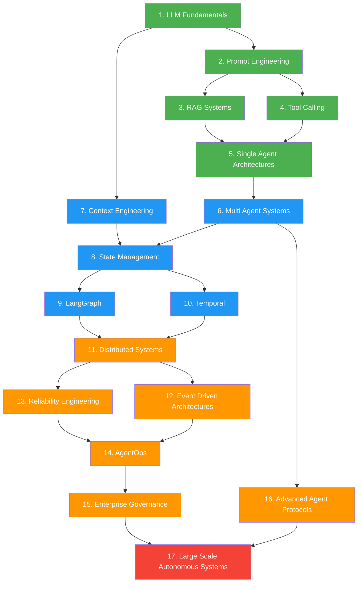
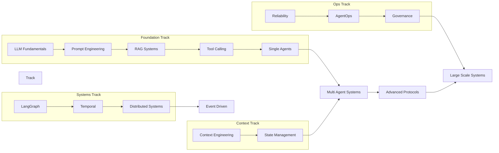
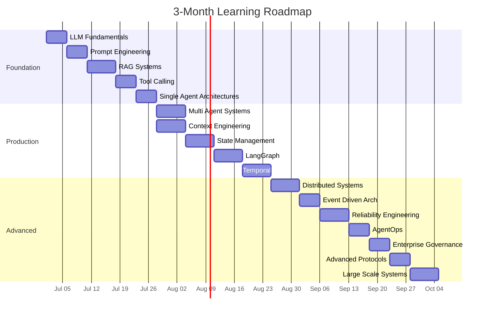
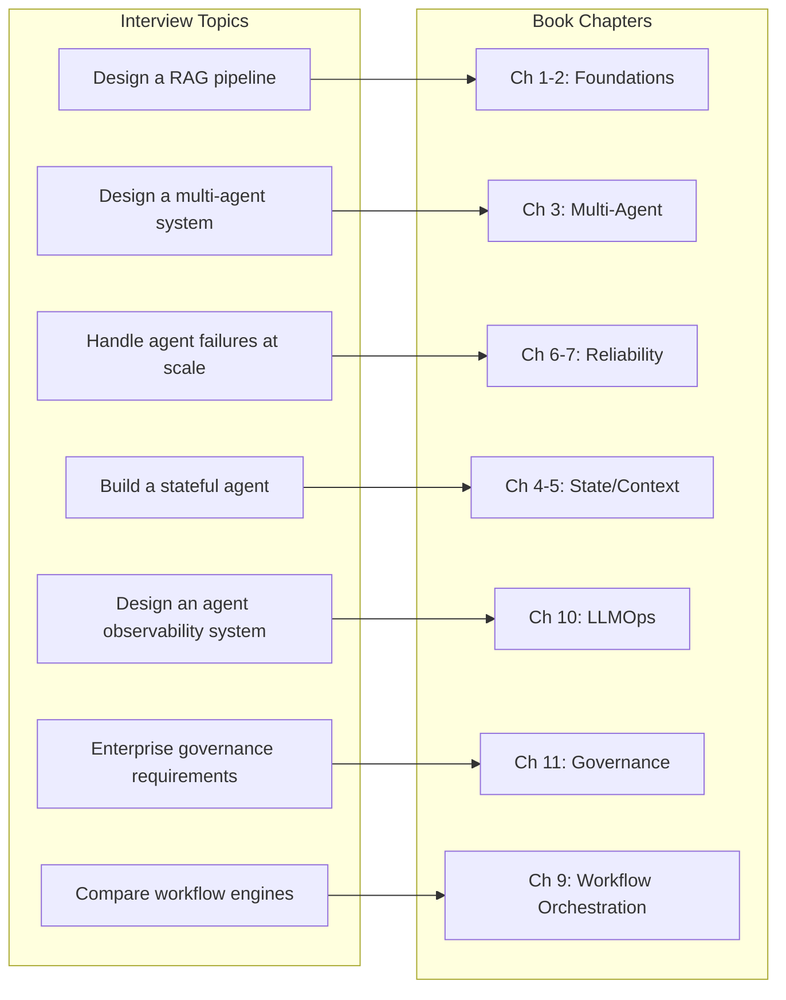

# Chapter 14: Learning Roadmap and Career Guide

The gap between building a demo and architecting production-grade agentic AI systems is enormous. This chapter provides a structured path through that gap — a 17-topic learning sequence, dependency graph, study plans for different experience levels, interview preparation strategies, and a skill assessment framework. Whether you are a senior engineer transitioning into AI architecture or a principal architect deepening your expertise, this chapter is your operational guide.

## The 17-Topic Learning Sequence

The sequence below is ordered by dependency, not by trend. Topics 1-5 form the foundation layer — you cannot meaningfully engage with anything beyond that without them. Topics 6-10 are the production core — where most AI architects stall because the problems shift from prompts to systems. Topics 11-17 are the advanced layer — distributed systems, reliability, governance, and autonomous architecture at enterprise scale.

### Foundation Layer (Topics 1-5)

**Topic 1: LLM Fundamentals**

Transformer architecture, attention mechanisms, tokenization, temperature, top-p, context windows, hallucination modes, and the fundamental limitations of current models. You must understand *why* LLMs fail, not just *how* to use them.

Key subtopics: token economics, context window math (rough estimate: 1 token ≈ 4 characters, 1K tokens ≈ 750 words), temperature vs top-p tradeoffs, structured output constraints, and model selection heuristics (latency vs accuracy vs cost).

**Topic 2: Prompt Engineering**

System prompts, few-shot patterns, chain-of-thought, self-consistency, constitutional prompts, prompt templates, and prompt versioning. This is not about writing clever prompts — it is about designing prompt architectures that are testable, maintainable, and reproducible across model versions.

Key subtopics: prompt injection attacks and defenses, output schema design, prompt-as-code patterns, and evaluation frameworks for prompt quality.

**Topic 3: RAG Systems**

Retrieval-Augmented Generation covering document chunking strategies, embedding models, vector stores, hybrid search, reranking, and context assembly. RAG is not just "embed and retrieve" — it is a full pipeline with failure modes at every stage.

Key subtopics: chunk size and overlap tradeoffs, embedding model selection, semantic caching, hybrid search (BM25 + dense), reranking architectures, and retrieval quality metrics (precision@k, recall@k, MRR).

**Topic 4: Tool Calling and Function Calling**

Structured outputs, JSON schema design, tool registration, function calling protocols, error handling for tool invocations, and multi-step tool chains. This is the bridge between LLM reasoning and real-world action.

Key subtopics: tool description design, parameter validation, tool result parsing, parallel tool calls, tool selection heuristics, and security considerations for tool invocation.

**Topic 5: Single Agent Architectures**

ReAct, Plan-and-Execute, reflection loops, self-correcting agents, and the tradeoffs between agent complexity and reliability. A single agent with good tool design often outperforms a poorly designed multi-agent system.

Key subtopics: agent loop design, termination conditions, action space definition, observation formatting, and the "agent tax" — when to stop adding capabilities to one agent.

### Production Core (Topics 6-10)

**Topic 6: Multi Agent Systems**

Supervisor-worker patterns, peer-to-peer choreography, hierarchical delegation, dynamic agent routing, and inter-agent communication. The hard part is not connecting agents — it is managing shared state, preventing infinite loops, and maintaining observability.

Key subtopics: agent registry design, capability discovery, message protocols between agents, conflict resolution, and the "two-pizza rule" for agent team size.

**Topic 7: Context Engineering**

Context windows, context bloat, prompt compression, context isolation, dynamic context assembly, and the architecture of memory systems. Context engineering is the hidden discipline that separates production systems from prototypes — it determines what the model "knows" at each decision point.

Key subtopics: context packing algorithms, sliding window strategies, hierarchical memory (working/episodic/semantic), fact extraction pipelines, and context budget management.

**Topic 8: State Management**

Session state, workflow state, shared state, persistent state, and the storage backends that support them. State management in agent systems is fundamentally different from traditional web applications because agent state includes reasoning traces, tool call history, and multi-turn context.

Key subtopics: state rehydration patterns, state compression, checkpoint strategies, Redis vs Postgres vs event store tradeoffs, and state serialization formats.

**Topic 9: LangGraph**

State machines, directed graph workflows, conditional routing, checkpointing, human-in-the-loop patterns, and subgraph composition. LangGraph is the most production-ready framework for deterministic agent workflows.

Key subtopics: node and edge design, state schema design, retry policies, streaming patterns, and integration with LangSmith for observability.

**Topic 10: Temporal**

Durable execution, workflow replay, activity composition, signal handling, saga patterns, and compensation logic. Temporal solves the "what happens when the server crashes mid-workflow" problem that LangGraph and most other frameworks punt on.

Key subtopics: workflow vs activity distinction, child workflows, continue-as-new patterns, side effects, and migration strategies from other workflow engines.

### Advanced Layer (Topics 11-17)

**Topic 11: Distributed Systems**

Message brokers (Kafka, RabbitMQ, SQS), publish-subscribe patterns, event sourcing, CQRS, saga orchestration, and the CAP theorem applied to agent systems. When agents span multiple services, you are building a distributed system — whether you intended to or not.

Key subtopics: exactly-once vs at-least-once semantics, partitioning strategies, dead letter queues, and idempotency in agent message processing.

**Topic 12: Event Driven Architectures**

Event-driven agent systems, choreography vs orchestration, event schemas, event versioning, and the reactive agent pattern. Event-driven architectures enable loose coupling between agents but introduce complexity in debugging and replay.

Key subtopics: event schema evolution, event store design, event-driven testing strategies, and correlation IDs for multi-agent traces.

**Topic 13: Reliability Engineering**

Retry strategies, circuit breakers, bulkheads, fallback routing, loop prevention, deadlock detection, and recovery patterns. Reliability engineering for agents is harder than for traditional systems because failure modes include LLM hallucination, tool invocation failures, and reasoning loops.

Key subtopics: retry budgets, state hashing for loop detection, checkpoint recovery, human escalation triggers, and compensation actions for partial failures.

**Topic 14: AgentOps**

Tracing, metrics, logging, distributed tracing with OpenTelemetry, agent evaluation frameworks, cost monitoring, latency tracking, and drift detection. If you cannot measure it, you cannot operate it — and agent systems produce more telemetry data than almost any other class of software.

Key subtopics: trace context propagation, token-level cost attribution, agent performance dashboards, A/B testing agent configurations, and regression detection.

**Topic 15: Enterprise Governance**

RBAC/ABAC for agent systems, audit trails, compliance frameworks, PII handling, data classification, explainability requirements, and regulatory compliance (SOC 2, GDPR, HIPAA). Governance is not optional for enterprise agents — it is a hard requirement that shapes every architectural decision.

Key subtopics: agent permission models, action logging requirements, PII redaction in traces, compliance-as-code patterns, and audit trail architecture.

**Topic 16: Advanced Agent Protocols**

MCP (Model Context Protocol), A2A (Agent-to-Agent), ACP, AP2, agent registries, capability discovery, and dynamic tool selection. These protocols are the infrastructure layer for interoperable agent systems.

Key subtopics: protocol negotiation, capability advertisement, trust models between agents, and the emerging standards landscape.

**Topic 17: Large Scale Autonomous Systems**

Agent fleets, autonomous enterprise systems, self-improving agents, multi-agent reinforcement learning, swarm intelligence, and emergent behaviors. This is the frontier — systems that operate with minimal human oversight at scale.

Key subtopics: autonomy levels, safety boundaries, kill switches, performance guarantees for autonomous systems, and organizational models for human-AI collaboration.

## Topic Dependency Graph

Understanding which topics depend on which is critical for efficient learning. The graph below shows the dependency structure and identifies parallel learning tracks.



**Parallel Learning Tracks**

The graph reveals that certain topics can be studied in parallel:



Tracks B, C, and D can begin once you complete the foundation track. The optimal strategy is to run Tracks A and B in parallel for the first four weeks, then introduce Track C, and finally Track D.

## Study Plan

### 3-Month Plan (Experienced Engineers)

This plan assumes 10-15 hours per week of focused study and 5+ years of software engineering experience.



**Week 1-2: Foundation Sprint**
- Days 1-2: LLM Fundamentals — Read attention papers, build token counting tools, experiment with temperature/top-p
- Days 3-4: Prompt Engineering — Build prompt templates, test injection defenses, create evaluation harness
- Days 5-7: RAG Systems — Implement chunking strategies, build hybrid search pipeline, measure retrieval quality
- Days 8-9: Tool Calling — Build tool registry, implement error handling, test parallel calls
- Days 10-14: Single Agent Architectures — Build ReAct agent, Plan-and-Execute agent, reflection loop

**Week 3-4: Multi-Agent and Context**
- Days 15-18: Multi Agent Systems — Build supervisor-worker, implement agent routing, test conflict resolution
- Days 19-21: Context Engineering — Build context assembly pipeline, implement sliding window, test compression
- Days 22-25: State Management — Build state storage layer, implement rehydration, test checkpointing
- Days 26-28: LangGraph deep dive — Build 3 different workflow patterns, implement human-in-the-loop

**Week 5-6: Workflow Engines**
- Days 29-32: Temporal fundamentals — Build durable workflow, implement retry/fallback, test replay
- Days 33-35: Temporal advanced — Child workflows, signals, compensation logic
- Days 36-39: Distributed Systems — Kafka integration, event sourcing, saga pattern
- Days 40-42: Event Driven Architecture — Choreography vs orchestration, event schema design

**Week 7-8: Reliability and Ops**
- Days 43-46: Reliability Engineering — Circuit breakers, retry budgets, loop prevention
- Days 47-49: AgentOps — OpenTelemetry integration, trace analysis, cost dashboards
- Days 50-53: Enterprise Governance — RBAC implementation, audit trails, compliance patterns
- Days 54-56: Advanced Protocols — MCP integration, A2A protocol, agent registry

**Week 9-12: Integration and Portfolio**
- Days 57-63: Large Scale Autonomous Systems — Build multi-agent fleet, implement safety boundaries
- Days 64-77: Portfolio project — Build end-to-end enterprise agent system demonstrating all concepts

### 6-Month Plan (Transitioning Engineers)

This plan assumes 8-12 hours per week and engineers coming from backend, frontend, or data engineering backgrounds without deep AI experience.

**Month 1: AI Foundations**
- Weeks 1-2: LLM fundamentals, prompt engineering basics
- Weeks 3-4: RAG systems, embedding models, vector stores

**Month 2: Agent Basics**
- Weeks 5-6: Tool calling, function calling protocols
- Weeks 7-8: Single agent architectures (ReAct, Plan-and-Execute)

**Month 3: Multi-Agent and Context**
- Weeks 9-10: Multi agent systems, supervisor-worker patterns
- Weeks 11-12: Context engineering, memory systems

**Month 4: State and Workflows**
- Weeks 13-14: State management patterns
- Weeks 15-16: LangGraph deep dive

**Month 5: Systems Engineering**
- Weeks 17-18: Temporal fundamentals
- Weeks 19-20: Distributed systems, event-driven architectures

**Month 6: Production and Portfolio**
- Weeks 21-22: Reliability engineering, AgentOps
- Weeks 23-24: Enterprise governance, advanced protocols
- Weeks 25-26: Portfolio project and interview preparation

## Interview Preparation

### Common Interview Topics Mapped to Chapters



### Architecture Design Question Strategy

Most staff+ AI architect interviews include a system design question. The framework below applies to any agentic AI system design question.

**Step 1: Clarify Requirements (2-3 minutes)**
- What is the user-facing functionality?
- What are the latency and throughput requirements?
- What are the reliability requirements (99.9% vs 99.99%)?
- What are the cost constraints?
- What compliance requirements apply?

**Step 2: High-Level Architecture (5-7 minutes)**
- Draw the major components
- Identify where LLMs are used vs deterministic logic
- Show the data flow from input to output
- Label synchronous vs asynchronous paths

**Step 3: Agent Design (5-7 minutes)**
- Single agent or multi-agent? Justify your choice
- What tools does each agent have?
- How does state flow between agents?
- What are the termination conditions?

**Step 4: Infrastructure (5-7 minutes)**
- State management approach
- Message passing between agents
- Caching strategy
- Observability stack

**Step 5: Reliability (3-5 minutes)**
- Failure modes and recovery strategies
- Retry and circuit breaker patterns
- Human escalation paths
- Loop prevention mechanisms

**Step 6: Tradeoffs (3-5 minutes)**
- What are you optimizing for?
- What did you consider and reject?
- What would you change at 10x scale?
- What are the monitoring blind spots?

### Whiteboard / Technical Assessment Strategies

For take-home assessments:
- Build a minimal but complete implementation — a working agent with 3 tools beats a theoretical architecture with 10 components
- Include error handling and retry logic — this signals production thinking
- Add observability from the start — traces, structured logs, metrics
- Write tests that demonstrate understanding of failure modes
- Include a brief architecture decision record (ADR) explaining your choices

For live coding:
- Start by asking clarifying questions
- Think out loud — explain your reasoning at each decision point
- Start with the simplest version, then add complexity incrementally
- When you hit a tradeoff, name it explicitly and explain both sides
- If you make a mistake, catch it yourself and explain why you're changing course

### Portfolio Projects That Demonstrate Expertise

Build these three projects to demonstrate breadth and depth:

**Project 1: Enterprise RAG Pipeline**
- Hybrid search (BM25 + dense embeddings)
- Reranking layer
- Chunk optimization with evaluation metrics
- Caching layer with semantic cache invalidation
- Demonstrates: Topics 1-3, basic production thinking

**Project 2: Multi-Agent Research System**
- Supervisor-worker architecture with 3-5 specialized agents
- Context sharing and state management
- Tool calling with error handling
- Human-in-the-loop escalation
- Demonstrates: Topics 4-8, agent design thinking

**Project 3: Production Agent Platform**
- Temporal or LangGraph for workflow orchestration
- OpenTelemetry tracing
- Circuit breakers and retry budgets
- RBAC and audit logging
- Cost monitoring dashboard
- Demonstrates: Topics 9-15, full-stack production thinking

## Skill Assessment Matrix

Rate yourself 1-5 on each topic, identify your gaps, and prioritize learning accordingly.

| # | Topic | Self-Rate | Priority | Chapter Reference |
|---|-------|-----------|----------|-------------------|
| 1 | LLM Fundamentals | __ / 5 | □ Critical □ High □ Medium | Ch 1 |
| 2 | Prompt Engineering | __ / 5 | □ Critical □ High □ Medium | Ch 1 |
| 3 | RAG Systems | __ / 5 | □ Critical □ High □ Medium | Ch 1 |
| 4 | Tool Calling | __ / 5 | □ Critical □ High □ Medium | Ch 2 |
| 5 | Single Agent Architectures | __ / 5 | □ Critical □ High □ Medium | Ch 2 |
| 6 | Multi Agent Systems | __ / 5 | □ Critical □ High □ Medium | Ch 3 |
| 7 | Context Engineering | __ / 5 | □ Critical □ High □ Medium | Ch 5 |
| 8 | State Management | __ / 5 | □ Critical □ High □ Medium | Ch 4 |
| 9 | LangGraph | __ / 5 | □ Critical □ High □ Medium | Ch 9 |
| 10 | Temporal | __ / 5 | □ Critical □ High □ Medium | Ch 9 |
| 11 | Distributed Systems | __ / 5 | □ Critical □ High □ Medium | Ch 8 |
| 12 | Event Driven Architectures | __ / 5 | □ Critical □ High □ Medium | Ch 8 |
| 13 | Reliability Engineering | __ / 5 | □ Critical □ High □ Medium | Ch 7 |
| 14 | AgentOps | __ / 5 | □ Critical □ High □ Medium | Ch 10 |
| 15 | Enterprise Governance | __ / 5 | □ Critical □ High □ Medium | Ch 11 |
| 16 | Advanced Agent Protocols | __ / 5 | □ Critical □ High □ Medium | Ch 13 |
| 17 | Large Scale Autonomous Systems | __ / 5 | □ Critical □ High □ Medium | Ch 12-13 |

**Rating Scale:**
- 1: No exposure — need to learn from scratch
- 2: Aware — understand concepts but have not built anything
- 3: Functional — have built simple implementations
- 4: Proficient — have built production systems
- 5: Expert — can teach this topic and have made architectural decisions at scale

**Gap Analysis Framework:**
- Any topic rated 1-2 that is on the critical path (Topics 1-8) gets immediate priority
- Topics rated 1-2 that are not on the critical path get secondary priority
- Topics rated 3 that align with your target role get tertiary priority
- Topics rated 4-5 need maintenance, not new learning

## Recommended Resources

### Foundation Layer (Topics 1-5)

| Topic | Resource | Type | Link |
|-------|----------|------|------|
| LLM Fundamentals | "Attention Is All You Need" | Paper | arxiv.org/abs/1706.03762 |
| LLM Fundamentals | Andrej Karpathy's "Neural Networks: Zero to Hero" | Course | youtube.com/@AndrejKarpathy |
| LLM Fundamentals | "Language Models are Few-Shot Learners" (GPT-3 paper) | Paper | arxiv.org/abs/2005.14165 |
| Prompt Engineering | OpenAI Prompt Engineering Guide | Docs | platform.openai.com/docs |
| Prompt Engineering | "Prompt Engineering Guide" (DAIR.AI) | Guide | promptingguide.ai |
| RAG Systems | LangChain RAG tutorials | Tutorial | python.langchain.com |
| RAG Systems | "Building RAG Applications" (LangChain) | Course | deeplearning.ai |
| RAG Systems | "Retrieval-Augmented Generation for Knowledge-Intensive NLP" | Paper | arxiv.org/abs/2005.11401 |
| Tool Calling | OpenAI Function Calling docs | Docs | platform.openai.com/docs |
| Tool Calling | Anthropic Tool Use docs | Docs | docs.anthropic.com |
| Single Agents | "ReAct: Synergizing Reasoning and Acting" | Paper | arxiv.org/abs/2210.03629 |
| Single Agents | "LLM Powered Autonomous Agents" (Lilian Weng) | Blog | lilianweng.github.io |

### Production Core (Topics 6-10)

| Topic | Resource | Type | Link |
|-------|----------|------|------|
| Multi Agent | "Multi-Agent Systems: A Modern Approach" | Book | multiagentsystems.org |
| Multi Agent | AutoGen documentation | Docs | microsoft.github.io/autogen |
| Multi Agent | CrewAI documentation | Docs | docs.crewai.com |
| Context Engineering | "Context Engineering" (Tobi Lutke) | Blog | shopify.engineering |
| Context Engineering | "Building Effective Agents" (Anthropic) | Guide | anthropic.com/research |
| State Management | Redis documentation | Docs | redis.io/docs |
| State Management | Postgres documentation | Docs | postgresql.org/docs |
| LangGraph | LangGraph documentation | Docs | langchain-ai.github.io/langgraph |
| LangGraph | "Build a LangGraph Agent" (DeepLearning.AI) | Course | deeplearning.ai |
| Temporal | Temporal documentation | Docs | temporal.io/docs |
| Temporal | "Temporal for AI Workflows" | Tutorial | learn.temporal.io |
| Temporal | "Designing Resilient Workflows" | Book | available on O'Reilly |

### Advanced Layer (Topics 11-17)

| Topic | Resource | Type | Link |
|-------|----------|------|------|
| Distributed Systems | "Designing Data-Intensive Applications" (Kleppmann) | Book | dataintensive.net |
| Distributed Systems | Kafka documentation | Docs | kafka.apache.org/documentation |
| Event Driven | "Enterprise Integration Patterns" (Hohpe/Woolf) | Book | enterpriseintegrationpatterns.com |
| Reliability | "Release It!" (Nygard) | Book | releaseit.com |
| Reliability | "Building Microservices" (Newman) | Book | samnewman.io |
| AgentOps | LangSmith documentation | Docs | docs.smith.langchain.com |
| AgentOps | OpenTelemetry documentation | Docs | opentelemetry.io |
| Enterprise Governance | "AI Governance" (Floridi et al.) | Paper | oxford academic |
| Advanced Protocols | MCP specification | Spec | modelcontextprotocol.io |
| Advanced Protocols | A2A protocol (Google) | Spec | github.com/google/A2A |
| Large Scale Systems | "Swarm Intelligence" (Bonabeau et al.) | Book | available on Amazon |

### Community Resources

| Community | Platform | Focus |
|-----------|----------|-------|
| LangChain Discord | Discord | LangChain/LangGraph ecosystem |
| Temporal Community | Slack | Workflow orchestration |
| MLOps Community | Slack | ML/AI operations |
| Hugging Face | Discord | Open source AI |
| r/MachineLearning | Reddit | Research and applications |
| AI Engineer Newsletter | Newsletter | Industry trends and tutorials |
| Latent Space Podcast | Podcast | AI engineering discussions |
| The AI Engineer | Newsletter | AI engineering focused content |
| DataCamp | Platform | Structured courses on AI topics |

## Career Progression

### Senior Engineer → Staff Engineer → Principal Architect

The progression from senior to principal-level AI architect is not linear. It involves shifts in scope, influence, and the type of problems you solve.

```mermaid
flowchart LR
    subgraph Senior Engineer ["Senior Engineer (Years 1-3)"]
        S1["Build components"]
        S2["Implement features"]
        S3["Debug production issues"]
        S4["Write technical docs"]
    end

    subgraph Staff Engineer ["Staff Engineer (Years 3-5)"]
        S5["Design systems"]
        S6["Set technical direction"]
        S7["Mentor engineers"]
        S8["Cross-team coordination"]
    end

    subgraph Principal Architect ["Principal Architect (Years 5+)"]
        S9["Define architecture strategy"]
        S10["Evaluate emerging tech"]
        S11["Drive org-wide decisions"]
        S12["Industry thought leadership"]
    end

    Senior Engineer --> Staff Engineer
    Staff Engineer --> Principal Architect

    style Senior Engineer fill:#E8F5E9
    style Staff Engineer fill:#E3F2FD
    style Principal Architect fill:#FFF3E0
```

### Skills Needed at Each Level

**Senior Engineer — Execution and Depth**
- Build reliable components and services
- Debug complex production issues across the stack
- Write clear technical documentation and ADRs
- Contribute meaningfully to code review
- Understand the full request lifecycle

Key AI skills: Build working RAG pipelines, implement agent architectures, understand model selection tradeoffs, write evaluation tests.

**Staff Engineer — Design and Breadth**
- Design systems that span multiple teams
- Make technology selection decisions with clear tradeoff analysis
- Identify and resolve systemic technical debt
- Mentor senior engineers and set technical standards
- Communicate technical decisions to leadership

Key AI skills: Design multi-agent architectures, select workflow engines for specific use cases, build observability platforms, establish evaluation frameworks.

**Principal Architect — Strategy and Influence**
- Define the technical strategy for the organization
- Evaluate emerging technologies and their business implications
- Drive architecture decisions that affect the entire company
- Represent the organization externally (conferences, papers, standards)
- Build consensus across engineering, product, and business leadership

Key AI skills: Define enterprise AI platform strategy, establish governance frameworks, evaluate build vs buy decisions for AI infrastructure, drive adoption of new agent protocols.

### How to Demonstrate Expertise

**At the Senior level:**
- Ship features that other engineers use
- Write internal blog posts or tech talks on agent architecture decisions
- Build a personal project that demonstrates RAG or agent design
- Contribute to open-source AI frameworks
- Obtain certifications (AWS ML Specialty, Google Cloud ML Engineer)

**At the Staff level:**
- Design and ship a system used by multiple teams
- Present architecture reviews for AI projects
- Write architecture decision records (ADRs) that become organizational standards
- Mentor 3+ engineers into senior roles
- Speak at local meetups or internal tech talks on agent systems

**At the Principal level:**
- Define the AI platform strategy that the company executes against
- Publish technical blog posts or papers on novel agent patterns
- Speak at major conferences (NeurIPS, ICML, QCon, StrangeLoop)
- Participate in standards bodies (MCP, A2A working groups)
- Build a public body of work (open-source projects, technical writing, conference talks)

## Key Takeaways

The 17-topic learning sequence is ordered by dependency, not by trend. Master the foundation layer before attempting production topics. The production core — Topics 6 through 14 — is where most candidates fail technical interviews because the questions shift from "how do I use an LLM" to "how do I build a reliable distributed system that happens to use LLMs."

The dependency graph shows that Topics 7 (Context Engineering), 8 (State Management), and 11 (Distributed Systems) are the highest-leverage topics — they unlock the most downstream learning.

For interview preparation, build three portfolio projects that demonstrate breadth across the foundation layer and depth in the production core. The architecture design question framework — clarify, design, implement, harden, discuss tradeoffs — applies to every staff+ AI architect interview.

The career progression from senior to principal is not about learning more frameworks. It is about shifting from execution to strategy, from components to systems, and from individual contribution to organizational influence. The engineers who make this shift are the ones who can explain *why* a particular architecture choice was made, not just *how* to implement it.

Start with the skill assessment matrix. Rate yourself honestly. Identify your three weakest topics on the critical path. Those are your first three weeks of study. Build something after each topic. Ship it. Then move to the next.

The roadmap is long but structured. Follow the sequence, build the projects, and the expertise will compound.
